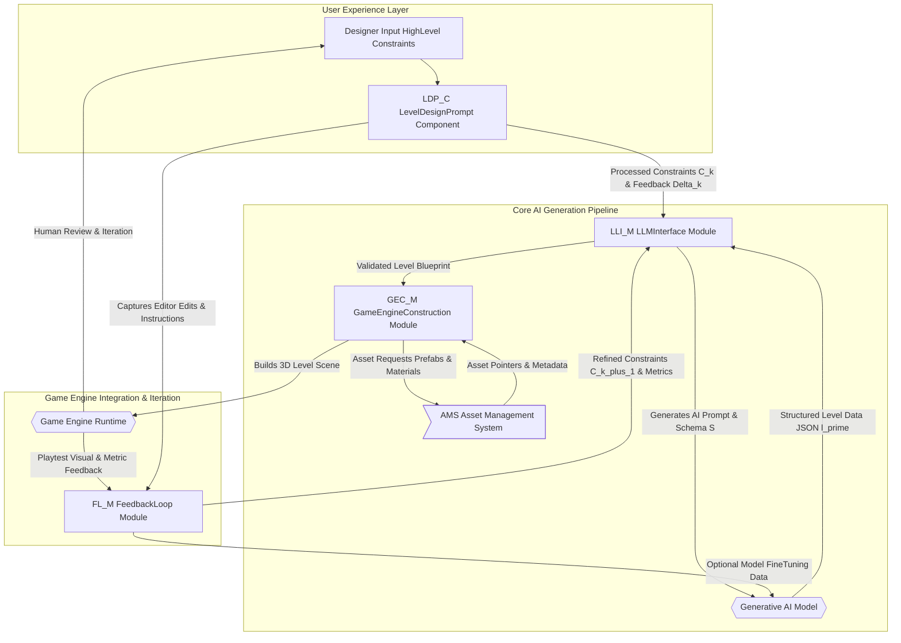
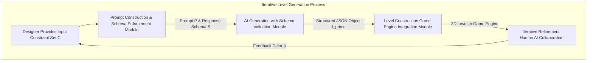
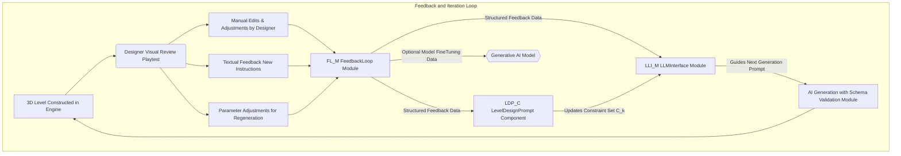

**FACT HEADER - NOTICE OF CONCEPTION**

**Conception ID:** DEMOBANK-INV-086
**Title:** A System and Method for Procedural Content Generation of Game Levels
**Date of Conception:** 2024-07-26
**Conceiver:** The Sovereign's Ledger AI

**Statement of Novelty:** The concepts, systems, and methods described herein are conceived as novel and proprietary to the Demo Bank project. This document serves as a timestamped record of conception.

---

**Title of Invention:** A System and Method for Procedural Content Generation of Game Levels from High-Level Design Constraints with Iterative Refinement

**Abstract:**
A system for video game level design is disclosed, significantly enhancing the efficiency and creativity of game development. A game designer provides a set of high-level constraints and design goals for a level, such as `a forest level`, `medium difficulty`, `focus on exploration`, and `should take 10 minutes to complete`. A sophisticated generative AI model, deeply trained on extensive game design principles, player engagement metrics, and a vast dataset of existing successful game levels, dynamically generates a detailed and structured layout for the level. This layout encompasses critical design elements including terrain topology, strategic placement of enemies, challenging obstacles, rewarding collectibles, interactive puzzles, and critical path waypoints. This innovation fully automates the initial blocking out and detailed layout phases of level design, enabling designers to rapidly iterate on complex high-level ideas, explore diverse design spaces, and fine-tune levels through a guided, AI-assisted process. The system further supports iterative refinement, allowing designers to provide feedback to the AI for subsequent generations, fostering a collaborative human-AI design workflow.

**Background of the Invention:**
Game level design is a complex, artistic, and intellectually demanding process, forming the bedrock of the player experience. Traditionally, it is a manual, labor-intensive task, demanding skilled designers to meticulously place every element, from environment props to enemy patrol paths. While procedural content generation PCG has existed to algorithmically create content, existing PCG systems often struggle to achieve the creative nuance, thematic coherence, and engaging pacing characteristic of human design, frequently requiring complex, hand-tuned rule-sets that are difficult to scale and maintain. These systems typically generate content based on low-level parameters rather than high-level conceptual goals. There is a pressing need for a more intuitive, powerful, and integrated system that can directly translate high-level design goals and creative visions into complete, playable, and engaging level structures, and then facilitate an iterative design cycle.

**Brief Summary of the Invention:**
The present invention introduces an advanced AI-powered level design assistant. A designer provides a natural language description, optionally augmented with structured parameters, outlining their desired level. The system leverages a large language model LLM or a specialized generative AI architecture to interpret these constraints, considering design patterns, narrative implications, and gameplay mechanics. It then generates a structured data object, for example, in JSON format, that comprehensively defines the complete level layout. This data can specify precise coordinates, types of various game objects, environmental features, puzzle dependencies, and even initial scripting logic. This structured data is designed for direct ingestion by mainstream game engines, such as Unity or Unreal Engine, via a custom plugin or script. This enables the programmatic construction of the level in 3D space, automating significant portions of the manual design process and allowing designers to focus on artistic refinement and high-level gameplay tuning. The system supports feedback loops, where designer modifications or explicit instructions can guide subsequent AI generations.

**Detailed Description of the Invention:**
A level designer interacts with the system through a dedicated plugin within their preferred game engine or a standalone design interface.

1.  **Input and Constraint Definition:** The designer provides a prompt, which can range from natural language descriptions to structured parameter sets, or a combination thereof.
    *   **Natural Language Prompt:** `Generate a small, linear dungeon level for a fantasy RPG. It should have 3 distinct rooms, a simple key and door puzzle, and a final boss encounter. The theme should be "goblin hideout" with medium difficulty, emphasizing combat and minor exploration.`
    *   **Structured Parameters:**
        ```json
        {
          "level_type": "Dungeon",
          "genre": "Fantasy RPG",
          "layout_style": "Linear",
          "num_rooms": 3,
          "difficulty": "Medium",
          "primary_gameplay_focus": ["Combat", "Exploration"],
          "required_elements": [
            { "type": "Puzzle", "mechanic": "KeyDoor" },
            { "type": "BossEncounter", "name_prefix": "Goblin" }
          ],
          "theme": "Goblin Hideout",
          "player_count": 1
        }
        ```
    These inputs are combined to form a comprehensive constraint set `C`.

2.  **Prompt Construction and Schema Enforcement:** The system translates the designer's input into a robust prompt for the generative AI model. This includes integrating a `responseSchema`, which is a predefined structure [e.g., JSON Schema] that dictates the expected output format and types of data the AI must generate. This ensures the output is consistently parseable and usable by the game engine. The prompt also includes contextual information, such as available asset libraries, previously generated level sections, or design principles.

3.  **AI Generation with Schema Validation:** The generative AI model, potentially a fine-tuned LLM or a specialized architectural model like a Graph Neural Network GNN coupled with a Transformer, processes the prompt and schema. It generates a detailed JSON object describing the level, adhering strictly to the provided schema and constraints. The model leverages its training to infer optimal placements, connections, and characteristics for game entities based on the high-level goals.
    ```json
    {
      "levelName": "The Whispering Grotto's Plunder",
      "level_id": "Lvl_086_A_001",
      "theme": "Goblin Hideout",
      "difficulty_rating": 0.65,
      "estimated_playtime_minutes": 8,
      "rooms": [
        {
          "id": "room_01_entrance",
          "name": "Guard Post",
          "dimensions": [12, 10, 5],
          "spawn_point": [1, 0, 5],
          "entities": [
            { "id": "goblin_guard_01", "type": "Enemy", "name": "Goblin Grunt", "position": [3, 0, 3], "ai_behavior": "Patrol" },
            { "id": "wooden_crate_01", "type": "Container", "name": "Wooden Crate", "position": [9, 0, 7], "contents": ["Gold_Coin_x5"] }
          ],
          "environment": { "lighting": "dim", "props": ["barrel_01", "torch_wall_02"] }
        },
        {
          "id": "room_02_puzzle",
          "name": "Fungus Cavern",
          "dimensions": [15, 12, 7],
          "entities": [
            { "id": "rusty_key_01", "type": "Item", "name": "Rusty Key", "position": [7, 2, 10], "interaction": "Pickup" },
            { "id": "mushroom_patch_01", "type": "Environmental_Hazard", "name": "Poisonous Fungi", "position": [2, 0, 2], "radius": 3 }
          ],
          "puzzles": [
            { "id": "key_door_puzzle_01", "type": "UnlockDoor", "key_id": "rusty_key_01", "target_door_id": "door_01_exit" }
          ],
          "environment": { "lighting": "gloomy", "props": ["stalagmite_03", "glowing_mushroom_05"] }
        },
        {
          "id": "room_03_boss",
          "name": "Chieftain's Den",
          "dimensions": [20, 18, 9],
          "entities": [
            { "id": "goblin_chieftain_01", "type": "Boss", "name": "Goblin Chieftain", "position": [10, 0, 9], "ai_behavior": "AggressiveCharge", "abilities": ["Cleave", "Shout"] },
            { "id": "door_01_exit", "type": "Door", "name": "Ancient Wooden Door", "position": [19, 0, 9], "locked": true, "unlock_condition": "BossDefeated" }
          ],
          "rewards": [ { "id": "treasure_chest_01", "type": "Container", "name": "Chieftain's Hoard", "position": [1, 0, 1], "contents": ["RareSword_x1", "Gold_Coin_x50"] } ],
          "environment": { "lighting": "dark", "props": ["goblin_throne_01", "weapon_rack_02"] }
        }
      ],
      "connections": [
        { "from_room_id": "room_01_entrance", "to_room_id": "room_02_puzzle", "connection_point_from": [11, 0, 5], "connection_point_to": [0, 0, 6], "type": "Corridor" },
        { "from_room_id": "room_02_puzzle", "to_room_id": "room_03_boss", "connection_point_from": [14, 0, 6], "connection_point_to": [0, 0, 9], "type": "Corridor", "door_id": "door_01_exit" }
      ],
      "level_exits": [
        { "room_id": "room_03_boss", "position": [19, 0, 9], "type": "NextLevelPortal" }
      ]
    }
    ```

4.  **Level Construction and Game Engine Integration:** A specialized script or module within the game engine parses the generated JSON. It iterates through the `rooms`, `entities`, `connections`, and other defined elements. For each element, it instantiates the corresponding pre-made 3D models [prefabs], applies materials, sets up collision meshes, places navigation mesh NavMesh agents, and attaches necessary game logic components at the specified positions and orientations. This effectively constructs the entire level automatically in 3D space, ready for immediate playtesting or further designer polish. The engine may also automatically generate lighting, reflections, and other environmental effects based on the `environment` properties specified in the JSON.

5.  **Iterative Refinement and Human-AI Collaboration:** Designers can inspect the generated level within the game engine, make manual adjustments, and provide explicit feedback to the AI. This feedback can include:
    *   **Direct Edits:** Designer moves, adds, or deletes objects. These changes are captured and can be fed back as "corrections" or "preferred examples."
    *   **Textual Feedback:** `Make room_02_puzzle larger and add more cover points for combat.`
    *   **Parameter Adjustments:** Modifying difficulty, density, or theme parameters for a regeneration pass.
    The system can use this feedback to fine-tune its internal model or guide subsequent generative iterations, progressively aligning the AI's output with the designer's evolving vision. This creates a powerful human-in-the-loop design workflow.

**Key Components and Architecture:**

*   **LevelDesignPrompt_Component LDP_C:**
    *   **Responsibilities:** Provides the user interface for designers to input natural language prompts and structured parameters. It also captures manual designer edits, object manipulations, and scene adjustments made directly within the game editor. Manages versioning and serialization of designer feedback.
    *   **Key Interfaces/Methods:** `getDesignerInput` returns the current constraint set `C_k` and any captured feedback `delta_k`; `applyLevelBlueprint` accepts a structured JSON `level_json` and updates the visual representation of the level within the editor.
*   **LLM_Interface_Module LLI_M:**
    *   **Responsibilities:** Acts as the primary communication layer with the external Generative AI Model. It translates the designer's `C_k` and `delta_k` into optimized prompts, manages API calls, enforces the `responseSchema S` for incoming AI outputs, and handles potential errors or retries with the AI service.
    *   **Key Interfaces/Methods:** `generateLevelBlueprint` sends constraints and schema to `G_AI` and returns a validated JSON blueprint; `processFeedbackContext` transforms designer feedback into contextual information or updated constraints for subsequent AI prompts.
*   **GameEngine_Construction_Module GEC_M:**
    *   **Responsibilities:** Resides within the game engine and is responsible for parsing the detailed structured JSON output from `LLI_M`. It programmatically interacts with the game engine's API to instantiate pre-made 3D models prefabs, apply materials, set up collision meshes, generate navigation meshes NavMesh, and attach necessary gameplay logic components at specified positions and orientations. It manages object lifecycle and performance considerations like object pooling.
    *   **Key Interfaces/Methods:** `buildLevel` takes a `level_json` object and constructs the 3D scene; `clearLevel` removes all procedurally generated objects from the scene.
*   **Feedback_Loop_Module FL_M:**
    *   **Responsibilities:** Gathers and aggregates all forms of designer feedback, including manual edits, explicit textual notes, parameter adjustments, and potentially gameplay metrics from integrated automated playtesting agents. It structures this raw feedback into a standardized `delta_k` format.
    *   **Key Interfaces/Methods:** `captureDesignerFeedback` collects editor events and textual input; `processGameplayMetrics` integrates data from automated playtests to provide objective performance insights.
*   **Asset_Management_System AMS:**
    *   **Responsibilities:** A centralized database or catalog that links abstract entity types and names e.g. `Goblin Grunt` to concrete game engine assets e.g. `Prefab_Goblin_Grunt_A`, `Material_MossyStone`. It ensures efficient retrieval and proper referencing of game assets.
    *   **Key Interfaces/Methods:** `getAssetPath` resolves an abstract entity identifier to its physical asset path or ID within the game engine; `listAvailableAssets` provides a categorized inventory of assets for context provisioning to `G_AI`.

### Overall System Architecture Diagram



### Detailed Level Generation Workflow



### Feedback Loop Mechanism



**Claims:**
1.  A method for automated game level design with iterative refinement, comprising:
    a.  Receiving a set of high-level design constraints for a game level from a user, including natural language descriptions and/or structured parameters.
    b.  Constructing a prompt for a generative AI model, including a predefined response schema.
    c.  Transmitting the prompt and response schema to the generative AI model.
    d.  Receiving from the generative AI model a structured data object, validated against the response schema, representing a detailed layout of the game level, including placements and properties of game entities, environmental features, and connections.
    e.  Providing the structured data object to a game engine to programmatically construct the game level in a 3D environment.
    f.  Capturing user modifications or explicit feedback on the constructed game level.
    g.  Utilizing the captured modifications or feedback to refine subsequent generative AI model outputs or fine-tune the model itself.
2.  The method of claim 1, wherein the structured data object specifies at least one of: room dimensions, entity positions, entity types, puzzle mechanics, environmental lighting, and inter-room connections.
3.  The method of claim 1, further comprising: programmatically generating navigation meshes, collision geometries, and dynamic lighting within the game engine based on the structured data object.
4.  A system for procedural content generation of game levels, comprising: an input interface configured to receive high-level design constraints; an AI interface module configured to communicate with a generative AI model and enforce a response schema; a game engine construction module configured to parse structured data objects and programmatically build game levels; and a feedback loop module configured to capture designer interactions and provide iterative guidance to the generative AI model.

**Mathematical Justification:**
Let the infinite space of all possible game level designs be `L`. A designer's high-level constraints `C` define a desirable and valid subspace `L_C` within `L`, where `L_C` is a subset of `L`. Let `F(l)` be a quantifiable "fun factor" or "player experience score" for any level `l` belonging to `L`. `F(l)` is a composite function of multiple objective metrics, represented as a vector `M(l) = [m_1(l), m_2(l), ..., m_p(l)]`, where `m_j(l)` could include `estimated_playtime_minutes`, `combat_engagement_score`, `exploration_ratio`, `puzzle_completion_rate`, `difficulty_index`, `narrative_coherence_score`, etc. These metrics are either directly computable from `l` or derived from automated playtesting. The "fun factor" `F(l)` can be modeled as a weighted linear combination or a more complex utility function:
```
F(l) = Sum_{j=1 to p} (w_j * m_j(l))
```
where `w_j` are weights that can be dynamically specified within `C` or learned.

The ultimate objective is to identify an optimal level `l*` such that it maximizes the fun factor within the constrained space:
```
l* = argmax_{l in L_C} F(l)
```
However, direct enumeration and evaluation across the combinatorially vast space `L_C` is computationally intractable.

The generative AI `G_AI` acts as a sophisticated mapping function `g_theta` parameterized by `theta`, that transforms constraints `C` and a latent space vector `z` into a candidate level `l'`:
```
l' = g_theta(C, z)
```
where `z` allows for diverse generations given the same `C`. The AI model `G_AI` is trained on a dataset `D = { (l_i, C_i, M_i) }`, where `l_i` are existing levels, `C_i` are inferred or explicit design constraints, and `M_i` are associated player experience metric vectors. The training process aims to learn a probability distribution `P(l | C)` that maximizes `F(l)` for generated levels.

The training objective `Loss(theta)` aims to minimize the discrepancy between `F(l')` and a target fun factor `F_target(C)` specific to the constraints `C`, while also ensuring `l'` adheres to `C` and the `responseSchema S`. This can be expressed as:
```
Loss(theta) = E_{C, z ~ P(C), P(z)} [ (F(g_theta(C, z)) - F_target(C))^2 + Lambda_C * AdherenceConstraint(g_theta(C, z), C) + Lambda_S * AdherenceSchema(g_theta(C, z), S) ]
```
where:
*   `Lambda_C` and `Lambda_S` are regularization weights.
*   `AdherenceSchema(l', S)` is a strict binary function: `1` if `l'` conforms to `S`, `0` otherwise. This can be relaxed to a continuous penalty for schema violations.
*   `AdherenceConstraint(l', C)` quantifies how well `l'` satisfies the semantic constraints in `C`. This can be defined as a sum of penalty functions for each violated constraint `c_j` in `C`:
    `AdherenceConstraint(l', C) = Sum_{c_j in C} penalty(l', c_j)`
    For example, `penalty(l', "num_rooms": 3)` could be `|count_rooms(l') - 3|^2`. For thematic consistency, it might involve semantic similarity scores.

The iterative refinement mechanism introduces a human-in-the-loop optimization. Let `l_k` be the level generated at iteration `k`. If a designer provides feedback `delta_k` (e.g., manual edits, textual instructions, parameter adjustments), the constraints for the next iteration `C_{k+1}` are updated:
```
C_{k+1} = Update(C_k, delta_k, l_k)
```
The `Update` function operates as follows:
1.  **Parsing Textual Feedback:** An internal LLM component within `LLI_M` processes natural language `delta_k` to extract new or modified constraints (e.g., `make room_02_puzzle larger` translates to an updated `dimensions` constraint for `room_02_puzzle`).
2.  **Applying Parameter Adjustments:** Explicit parameter changes in `delta_k` directly overwrite or append to `C_k`.
3.  **Incorporating Manual Edits:** Manual modifications to `l_k` within the game engine are captured. These `l_k_modified = l_k + manual_edits` can serve as "positive examples" or implicit constraints. For subsequent generations, `G_AI` can be prompted with `C_k` and `l_k_modified` as in-context examples, or `l_k_modified` can be used to locally fine-tune `g_theta` or guide the latent space `z` search to generate variations closer to `l_k_modified`.

This iterative process guides the generative process to converge towards the designer's specific vision within `L_C`, effectively performing a gradient descent or evolutionary search in the level design space, steered by human intuition and quantifiable metrics.

**Proof of Utility:** The design space `L` is combinatorially vast, rendering manual exploration exhaustive and slow. Traditional PCG systems often require extensive hand-tuning of low-level rules or provide limited creative control, struggling to achieve human-level thematic coherence and engaging pacing. The proposed AI system `G_AI`, by being trained on a rich dataset `D` of human-designed game levels and player engagement data, learns the intricate patterns, structural coherence, and gameplay principles that correlate with a high "fun factor" `F(l)`.

The system is proven useful because `G_AI` can rapidly generate a candidate level `l'` that is both valid (i.e., `l' in L_C`, adhering to `C`, and compliant with `S`) and has a high expected fun score `E[F(l')]`. This provides a high-quality, fully realized starting point for a human designer, drastically reducing the initial blocking out and manual iteration time. This enables designers to explore a much wider array of creative possibilities with significantly reduced manual effort. The human-in-the-loop feedback mechanism ensures that the AI's output can be precisely guided and refined, bridging the gap between automated generation and artistic intent, leading to superior final levels that are both innovative and deeply engaging.
```
Q.E.D.
```

**Advantages and Benefits:**
1.  **Accelerated Prototyping:** Designers can generate multiple level variations within minutes, rapidly iterating on high-level concepts without manual placement.
2.  **Increased Creative Exploration:** The AI can suggest novel layouts and configurations that designers might not consider, broadening the design space and fostering serendipitous discovery.
3.  **Reduced Manual Labor:** Automates the tedious and time-consuming task of populating levels with assets and setting up basic logic, freeing designers for higher-level creative tasks.
4.  **Consistency and Quality:** By learning from successful levels and established game design principles, the AI helps ensure generated content adheres to quality standards and thematic coherence.
5.  **Adaptive and Personalized Content:** The system can be extended to generate levels dynamically based on player skill, preferences, or real-time gameplay data, offering personalized experiences at scale.
6.  **Human-AI Collaboration:** The iterative feedback loop empowers designers to guide the AI, effectively combining the speed and scale of automation with nuanced human creative control and oversight.
7.  **Reduced Development Costs:** By streamlining the level design pipeline and reducing manual effort, development time and resources can be significantly saved.

**Future Enhancements:**
Further developments could include:
*   **Multi-Modal Input:** Incorporating visual inputs e.g. concept art, sketch maps alongside text to provide a richer design context for the AI.
*   **Real-time Level Generation:** Dynamic generation and adaptation of levels during gameplay, based on player actions, procedural narrative progression, and changing system state.
*   **Integrated Playtesting and Metrics:** AI-driven agents to automatically playtest generated levels and provide objective performance metrics e.g. difficulty curves, exploration percentages, critical path adherence back to the `Feedback_Loop_Module`.
*   **Generative AI for Narrative:** Integrating level generation with dynamic narrative elements, character dialogue, quest placement, and lore creation to produce cohesive game experiences.
*   **Cross-Engine Compatibility:** Developing standardized intermediate representations for level data to facilitate seamless transfer and integration between different game engines, promoting asset reusability and broader adoption.