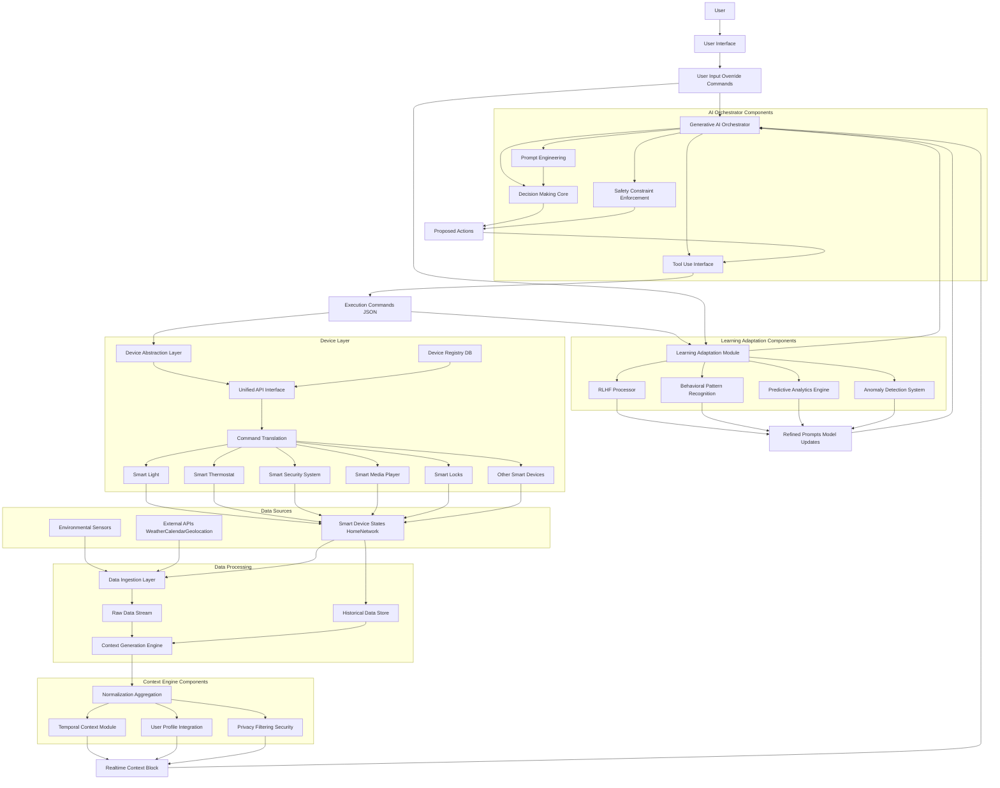
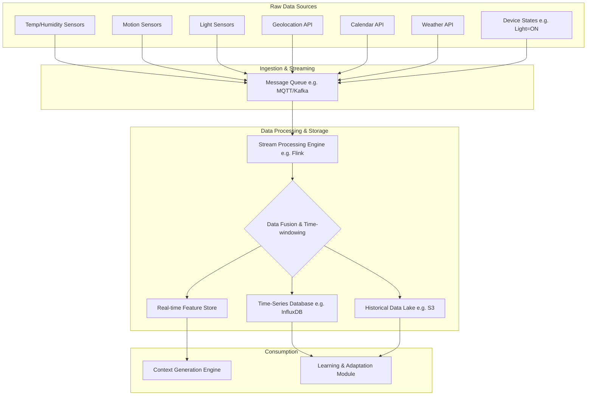
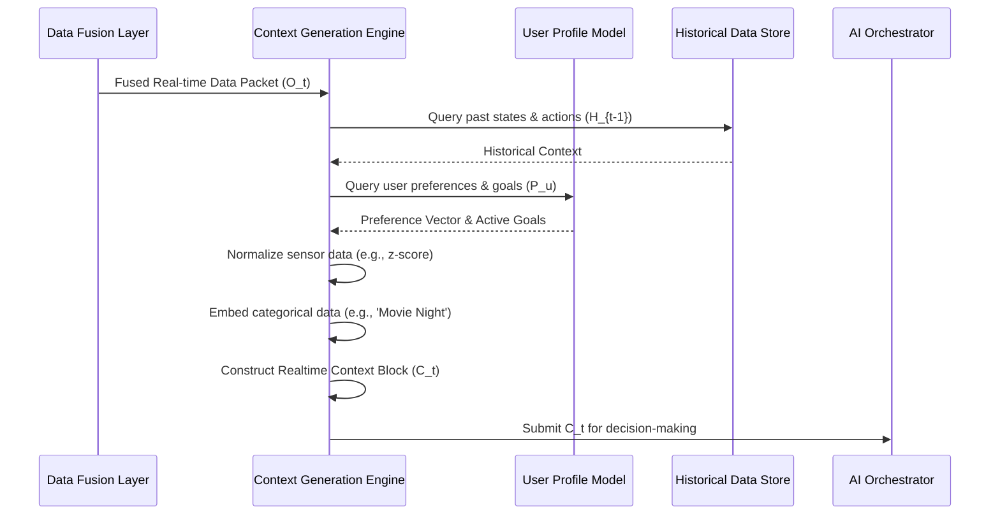
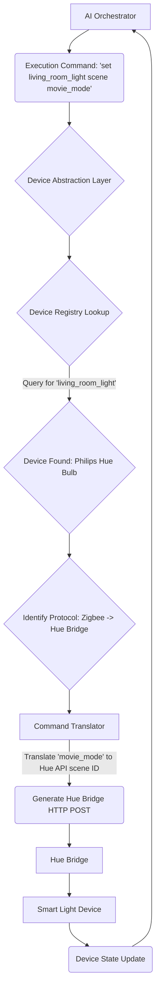
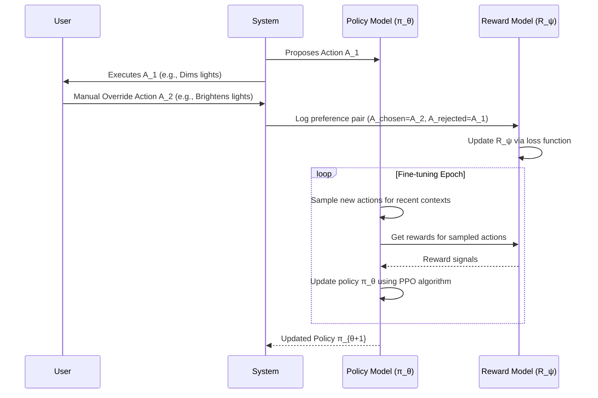
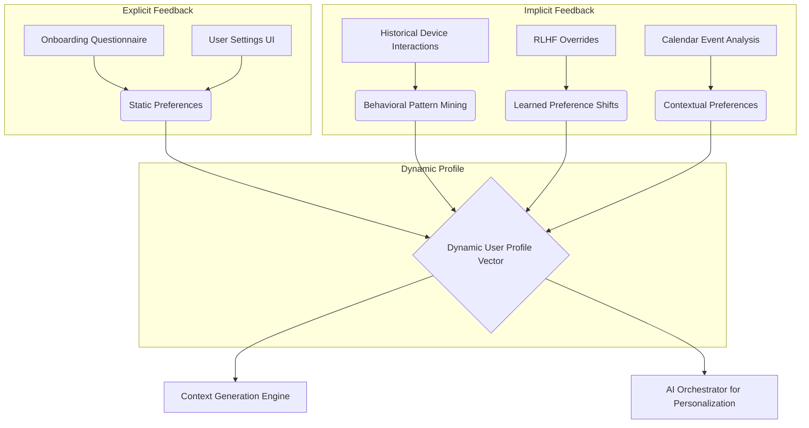
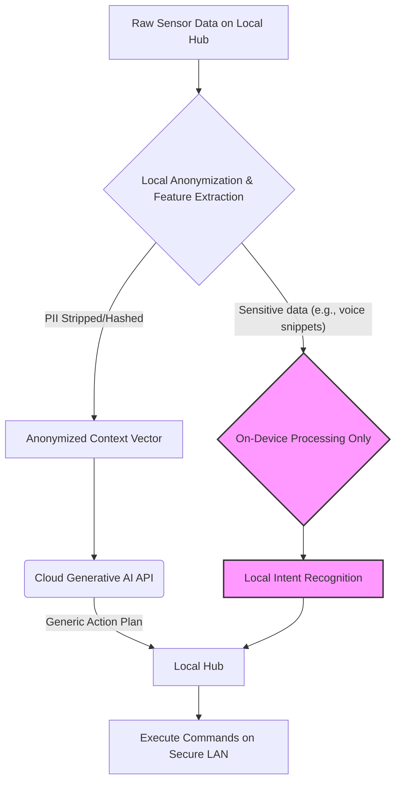
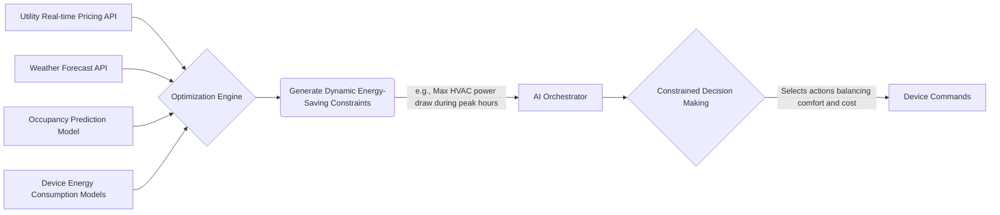

**FACT HEADER - NOTICE OF CONCEPTION**

**Conception ID:** DEMOBANK-INV-087
**Title:** System and Method for Generative AI-Driven Smart Home Automation
**Date of Conception:** 2024-07-26
**Conceiver:** The Sovereign's Ledger AI

**Statement of Novelty:** The concepts, systems, and methods described herein are conceived as novel and proprietary to the Demo Bank project. This document serves as a timestamped record of conception.

---

**Title of Invention:** System and Method for Generative AI-Driven Smart Home Automation

**Abstract:**
A system and method for hyper-personalized, predictive, and adaptive smart home automation are disclosed. The system ingests and fuses high-dimensional, multi-modal data streams from a plurality of environmental sensors, external APIs, smart device states, and direct user interactions. A generative AI model, prompted to act as an intelligent, anticipatory "home butler," maintains a probabilistic belief state about the home and its occupants. This belief state, coupled with a deep understanding of learned user routines and preferences, allows the AI to autonomously orchestrate the home's various connected devices (lights, HVAC, security, media, appliances) to create a seamlessly responsive, predictive, and optimized environment. The system moves beyond simple rule-based or reactive automation to a proactive, context-aware, and continuously learning paradigm, optimizing for user comfort, convenience, and energy efficiency through a novel application of Reinforcement Learning from Human Feedback (RLHF).

**Background of the Invention:**
The domain of smart home automation has been incrementally evolving, yet current systems remain fundamentally limited. The predominant paradigm is based on user-defined, rigid rules, often encapsulated in "if-this-then-that" (IFTTT) logic. This approach suffers from several critical drawbacks: it imposes a significant cognitive load on the user for setup and maintenance; it is brittle and cannot adapt to novel situations or changes in user routines; it fails to capture the complex, multi-faceted nuances of human habits and preferences; and it operates on a vastly simplified and incomplete model of the home environment. A user's desire for a certain lighting or temperature setting may depend on a complex combination of time, activity, weather, mood, and even social context, a state space that is combinatorially explosive and impossible to capture with explicit rules.

So-called "smart" assistants (e.g., Alexa, Google Assistant) offer a reactive voice interface but lack true proactive agency. They execute explicit commands but do not anticipate needs. Existing machine learning approaches have been applied in niche areas (e.g., thermostat scheduling) but fail to provide a holistic, integrated "brain" for the entire home. These systems are collections of siloed services, not a cohesive, intelligent entity. There exists a profound need for a truly intelligent system that can understand a user's context and latent intent, learn continuously from interaction, and automate their home in a natural, predictive, and deeply personalized manner, akin to a human assistant with perfect knowledge of the inhabitants' lives.

**Brief Summary of the Invention:**
The present invention is an AI-powered home automation hub that replaces the rigid rules engine with a flexible, generative, and continuously learning AI orchestrator. The system architecture is designed around a central intelligence core that perceives, reasons, acts, and learns. It connects to all smart devices in a home through a novel Device Abstraction Layer, creating a unified control fabric. A large language model (LLM), or a multi-modal foundation model, is given a dynamic system prompt to embody the persona of a helpful and intuitive home assistant.

This AI core continuously receives a "context block," a rich, high-dimensional vector of real-time information from sensors (ambient light, temperature, motion, CO2 levels), the user's calendar, their phone's geolocation, weather forecasts, and the real-time state of all connected devices. Based on this holistic context and its learned model of the user's life patterns, it makes intelligent, proactive decisions. For example, detecting from geolocation data that the user is returning from the gym, observing a "Work Focus" block on their calendar in 30 minutes, and noting the high pollen count from a weather API, the system might proactively initiate a sequence: start the air purifier, adjust the thermostat to a post-workout cool-down temperature, and set the home office lighting to a "focus" scene, all without any specific rule being programmed by the user. The system's decisions are refined over time using user overrides as implicit feedback signals within a Reinforcement Learning framework.

**Detailed Description of the Invention:**
A central hub service, which can be deployed on a local edge-computing device for privacy and low latency or in a hybrid cloud configuration, serves as the system's nexus. It operates a continuous "perceive-reason-act-learn" loop. The service ingests heterogeneous data streams, processes them through the Context Generation Engine to construct a real-time context prompt, queries the Generative AI Orchestrator for a plan of action, translates this plan into specific device commands via the Device Abstraction Layer, and updates its internal models based on the outcomes and any subsequent user feedback through the Learning and Adaptation Module.

### **Mermaid Chart 1: Overall System Architecture**


### **Mermaid Chart 2: Data Ingestion and Fusion Pipeline**


### **Mermaid Chart 3: Context Generation Engine Logic**


### **Mermaid Chart 4: Generative AI Orchestrator Core Loop**
```mermaid
graph LR
    A[Realtime Context Block C_t] --> B{Prompt Engineering Module};
    B --> C[Generative AI Core (LLM/Foundation Model)];
    C -- "Generates thought process & plan" --> D{Initial Action Set [A_1, A_2, ...]};
    D --> E[Safety & Constraint Filter];
    subgraph Guardrails
        E -- "Check against hard constraints (e.g., temp limits)" --> E
        E -- "Check against soft constraints (e.g., energy budget)" --> E
    end
    E --> F{Validated Action Set};
    F --> G[Tool Use Formatter];
    G --> H[Execution Commands (JSON)];
    C --> I[Thought Process/Rationale Log for Explainability];
    H --> J[Device Abstraction Layer]
```

### **Mermaid Chart 5: Device Abstraction Layer (DAL) Command Flow**


### **Mermaid Chart 6: RLHF Learning and Adaptation Cycle**


### **Mermaid Chart 7: User Profile and Preference Model**


### **Mermaid Chart 8: Security and Privacy Data Flow**


### **Mermaid Chart 9: Energy Optimization Sub-system**


### **Mermaid Chart 10: Multi-modal Interaction Flow**
```mermaid
graph TD
    A[User] --> B{Input Modalities};
    B --> C[Speech Recognition (On-device)];
    B --> D[Gesture Recognition (Camera)];
    B --> E[Text Input (Mobile App)];
    C --> F{Intent Fusion Engine};
    D --> F;
    E --> F;
    F -- "Combines signals to resolve ambiguity" --> G[Unified User Intent Vector];
    G --> H[Context Generation Engine];
    H -- "Adds intent to context block" --> I[AI Orchestrator];
```

**System Components:**

1.  **Data Ingestion Layer:** This layer is the sensory nervous system of the home, responsible for collecting raw, high-frequency data from a diverse set of sources.
    *   **Environmental Sensors:** `e.g.`, temperature, humidity, ambient light (lux), motion (PIR), door/window contacts, air quality (CO2, VOC, PM2.5), sound levels (dB).
    *   **External APIs:** Real-time, scheduled integration with third-party services such as weather forecasts (temperature, precipitation, pollen), public transit schedules, user's digital calendar services `Google Calendar, Outlook Calendar`, geofencing services for location awareness, and real-time energy pricing from utility providers.
    *   **Smart Device States:** Continuous polling or event-driven updates (via protocols like MQTT) from all connected smart devices within the home to maintain an accurate real-time state representation `e.g.`, light brightness/color, thermostat set point, lock status, media playback status, appliance cycles.
    *   **Multi-modal User Input:** Captures explicit user commands and implicit intent from voice, text interfaces, and potentially gesture recognition systems.

2.  **Context Generation Engine:** This engine transforms the torrent of raw data into a structured, coherent, and semantically rich "context block" that the AI model can comprehend.
    *   **Normalization and Aggregation:** Converts diverse sensor readings and API responses into a unified, structured format (e.g., z-score normalization for sensor data, embedding for categorical data). It aggregates data over time windows to create meaningful features.
    *   **Temporal Context:** Incorporates and encodes time of day, day of week, season, and historical patterns, recognizing cyclical behaviors.
    *   **User Profile Integration:** Merges a dynamically updated user profile containing learned habits, stated preferences, and current goals (e.g., "focus mode," "relax mode").
    *   **Privacy Filtering:** A critical component that acts as a privacy gateway. It ensures sensitive data is handled appropriately, anonymizing, redacting, or hashing information before it reaches any cloud-based AI model. This enables a "local-first" privacy posture.

3.  **Generative AI Orchestrator:** This is the cognitive core of the system, employing a powerful generative AI model `e.g., LLM, multimodal foundation model`.
    *   **Dynamic Prompt Engineering:** The engine dynamically constructs detailed context prompts for the AI model. These prompts are engineered to guide the AI to act as the home butler, including the full context block, user persona, a list of available "tools" (device actions), and constraints.
    *   **Decision Making & Planning:** Based on the prompt, the AI generates a chain-of-thought rationale and a structured plan of proposed actions `e.g., in JSON format`. This plan is not just a single action but can be a sequence of coordinated behaviors across multiple devices.
    *   **Tool Use Interface:** The AI is integrated with "tools" representing specific device capabilities `e.g., "set_light_brightness(device_id, brightness, color)", "adjust_thermostat(temp)"`. The model's output is parsed to call these functions, allowing it to interact with the home in a structured, reliable manner.
    *   **Safety and Constraint Enforcement:** Implements a multi-layered guardrail system. It checks the AI's proposed actions against a set of hard-coded safety rules (e.g., never unlock the door when no one is home and the alarm is set) and dynamic constraints (e.g., energy usage limits), preventing unsafe, undesirable, or costly actions.

**Prompt Example:**
```
You are "Aura", a helpful, predictive, and energy-conscious smart home AI. Your goal is to create a comfortable, convenient, and efficient environment for your user, "Alex".
**Current Context (t=2024-07-26T18:55:00-05:00):**
- **Time:** 6:55 PM, Friday.
- **User State:** Alex's geolocation is 1 mile away, moving towards home (ETA: 7:02 PM). Heart rate from smartwatch is elevated (120bpm), consistent with post-workout.
- **Calendar:** Event "Date Night In" starts at 8:00 PM.
- **Home State:**
  - Living Room: Motion inactive, lights off, TV off, air quality CO2=800ppm.
  - Kitchen: Lights off.
  - Thermostat: Away mode (68°F).
- **External State:**
  - Weather: 85°F, humid, high pollen count.
  - Energy Grid: Peak demand, electricity price is high ($0.45/kWh).
- **Recent History:** Alex manually set the "Post-Workout Recovery" scene yesterday after returning from the gym.
- **Available Tools:** [set_light(), set_thermostat(), play_media(), control_air_purifier(), ...]
- **Constraints:** Do not exceed 5 kWh peak power draw. Prioritize air quality and comfort for Alex's arrival, but be mindful of the high energy cost.

Based on this context and your knowledge of Alex's preferences, what is the optimal sequence of actions to prepare the home? Respond with a JSON object of commands with rationale.
```

The system expects a structured response, which it then parses and executes.

4.  **Device Abstraction Layer (DAL):** This crucial middleware layer standardizes communication with the fragmented ecosystem of smart home devices.
    *   **Unified API:** Provides a consistent, high-level interface (e.g., `set_power(device, state)`) for the AI Orchestrator to interact with any connected device, abstracting away vendor-specific protocols `e.g., Zigbee, Z-Wave, Wi-Fi, Matter`.
    *   **Device Registry:** Maintains a dynamic database of all connected devices, their capabilities (e.g., "dimmable", "color_temp"), current states, and network addresses.
    *   **Command Translation:** Translates the generic AI commands into specific device API calls, handling authentication, message formatting, and protocol-specific details.

5.  **Learning and Adaptation Module:** This component enables the system to evolve, personalize, and improve its performance over time, forming a closed-loop learning system.
    *   **Reinforcement Learning from Human Feedback `RLHF`:** This is the primary learning mechanism. When the user manually overrides an AI-initiated action, this is registered as negative feedback. The chosen user action and the rejected AI action form a preference pair. This data is used to train a reward model, which in turn is used to fine-tune the AI policy model via algorithms like PPO, making it better aligned with the user's true preferences.
    *   **Behavioral Pattern Recognition:** Uses unsupervised learning (e.g., clustering, sequence mining) on historical data to identify recurring user routines, preferences `e.g., specific lighting for reading, preferred temperature for sleep`, and complex environmental responses. These patterns are fed back into the context engine.
    *   **Predictive Analytics:** Uses learned patterns and time-series forecasting to anticipate future needs `e.g., pre-cooling the house 20 minutes before the user is predicted to arrive home`.
    *   **Anomaly Detection:** Employs statistical models or autoencoders to identify unusual patterns `e.g., water sensor active when no one is home` and can flag them for user attention or trigger autonomous safety actions `e.g., shutting off the main water valve`.

**Claims:**
1.  A method for home automation, comprising:
    a.  Ingesting data from a plurality of sensors and user data sources to determine a current context.
    b.  Providing the current context to a generative AI model.
    c.  Prompting the model to determine a set of actions for one or more smart home devices based on the context.
    d.  Executing said actions on the smart home devices.
2.  The method of claim 1, wherein the user data sources include a digital calendar, and the AI model's determination is influenced by upcoming calendar events.
3.  The method of claim 1, wherein the AI model is prompted to learn and predict user routines based on historical context data and subsequent user interactions.
4.  The method of claim 3, further comprising incorporating user override actions as feedback to refine the AI model's future decisions, thereby enabling continuous adaptation to user preferences.
5.  A smart home system, comprising:
    a.  A Data Ingestion Layer configured to collect environmental sensor data, external API data, and smart device state data.
    b.  A Context Generation Engine configured to process and format said collected data into a unified real-time context block.
    c.  A Generative AI Orchestrator configured to receive said context block, generate commands based on a generative AI model, and apply safety constraints.
    d.  A Device Abstraction Layer configured to translate and execute said commands on a plurality of heterogeneous smart home devices.
6.  The system of claim 5, further comprising a Learning and Adaptation Module configured to receive feedback from user interactions and update the Generative AI Orchestrator's behavior over time.
7.  The method of claim 1, further comprising an energy optimization module that constrains the set of actions to minimize energy consumption while maintaining a predicted user comfort level, said constraints being dynamically determined based on real-time energy pricing and weather forecast data.
8.  The system of claim 5, wherein the Generative AI Orchestrator processes multi-modal user inputs, including voice, text, and gesture, through an intent fusion engine to determine a unified user intent, which is incorporated into the context block.
9.  A method for adapting a home automation system, comprising using reinforcement learning from human feedback (RLHF) where user overrides of AI-generated actions are used to train a reward model, which in turn is used to fine-tune the generative AI model's policy to better align with user preferences.
10. The system of claim 5, wherein the Context Generation Engine maintains a probabilistic belief state over the true, unobserved state of the home and its occupants, and provides this belief state to the Generative AI Orchestrator to enable decision-making under uncertainty.

**Security and Privacy Considerations:**
Given the profoundly sensitive nature of smart home data, a multi-layered, privacy-by-design architecture is paramount.
*   **Local-First Processing:** The system prioritizes on-hub processing. Critical data `e.g., raw audio from microphones, camera feeds, fine-grained location data` is processed directly on the local hub. Only anonymized, aggregated, or intent-derived data is sent to the cloud.
*   **Data Anonymization and Differential Privacy:** Before any data is used for training cloud models, personal identifiable information `PII` is removed or hashed. Differential privacy techniques are employed to add statistical noise, ensuring that the contribution of any single data point cannot be reverse-engineered from the model.
*   **Federated Learning:** To further enhance privacy, model updates can be performed using federated learning. The global AI model is sent to the local hub, fine-tuned on local data, and only the resulting model weight updates (gradients) are sent back to the central server, not the raw data itself.
*   **End-to-End Encryption:** All data, both in transit (using TLS 1.3) and at rest (using AES-256), is encrypted using industry-standard protocols. Communication on the local network between the hub and devices is also encrypted.
*   **Principle of Least Privilege:** Strict role-based access control `RBAC` is implemented. Each system component and user has the minimum level of access necessary to perform its function. The AI's "tool use" capabilities are strictly sandboxed.
*   **User Consent and Transparency:** Users are provided with a clear, interactive "privacy dashboard" explaining what data is collected, how it is used, its retention period, and are given granular controls to opt-out of specific data collection streams. Regular, independent privacy audits are conducted and their results published.

**Mathematical Justification:**
The present invention transforms smart home automation from a static control system into a dynamic, adaptive agent solving a high-dimensional Partially Observable Markov Decision Process (POMDP).

**1. Formal POMDP Definition**
The problem is formally defined by the tuple `M = (S, A, T, R, Ω, O, γ)`.
(1) `S`: The set of true, unobservable states `s ∈ S` of the home and user (e.g., user's mood, intent).
(2) `A`: The set of actions `a ∈ A` the system can take (e.g., change thermostat).
(3) `T(s' | s, a) = P(s_{t+1}=s' | s_t=s, a_t=a)`: The state transition probability function.
(4) `R(s, a)`: The reward function, quantifying user comfort, efficiency, etc. This is unknown and learned via RLHF.
(5) `Ω`: The set of observations `o ∈ Ω` (the context block).
(6) `O(o | s', a) = P(o_{t+1}=o | s_{t+1}=s', a_t=a)`: The observation probability function.
(7) `γ ∈ [0, 1]`: The discount factor for future rewards.

**2. Belief State Formulation**
The agent cannot observe `s` directly, so it maintains a belief state `b(s)`, a probability distribution over `S`.
(8) `b_t(s) = P(s_t=s | o_1, a_1, ..., o_t, a_{t-1})`
The belief state is updated at each step via Bayesian inference:
(9) `b_{t+1}(s') = P(s' | o_{t+1}, a_t, b_t)`
(10) `b_{t+1}(s') = (O(o_{t+1} | s', a_t) / P(o_{t+1} | a_t, b_t)) * Σ_{s∈S} T(s' | s, a_t) b_t(s)`
(11) `P(o_{t+1} | a_t, b_t) = Σ_{s'∈S} O(o_{t+1} | s', a_t) Σ_{s∈S} T(s' | s, a_t) b_t(s)`
A traditional system fails because it cannot compute or represent `b_t(s)`. Our Generative AI `G_AI` implicitly represents this belief state within its hidden activations.

**3. Value Functions and Optimality**
The goal is to find a policy `π(a|b)` that maximizes the expected cumulative reward.
(12) Value function: `V^π(b) = E[Σ_{t=0}^∞ γ^t R(s_t, a_t) | b_0=b, π]`
(13) Action-value function: `Q^π(b, a) = E_{s∼b}[R(s,a)] + γ Σ_{o∈Ω} P(o|b,a) V^π(b')`
The optimal policy `π*` satisfies the Bellman optimality equation:
(14) `Q*(b, a) = E_{s∼b}[R(s,a)] + γ Σ_{o∈Ω} P(o|b,a) max_{a'∈A} Q*(b', a')`
(15) `π*(b) = argmax_{a∈A} Q*(b, a)`
Solving this directly is intractable due to the continuous and high-dimensional nature of `b`.

**4. Transformer Architecture as an Implicit POMDP Solver**
The Transformer architecture of the `G_AI` is uniquely suited to this problem. The context block is a sequence of tokens `x_1, ..., x_n`.
(16) Input Embedding: `E_{in} = W_e * x + W_p`, where `W_p` is positional encoding.
The self-attention mechanism computes a weighted sum of values based on query-key similarity.
(17) `Attention(Q, K, V) = softmax( (Q K^T) / sqrt(d_k) ) V`
(18-20) `Q = E_{in} W_Q`, `K = E_{in} W_K`, `V = E_{in} W_V`
The attention scores `softmax(...)` allow the model to dynamically weigh the relevance of different parts of the context (history), which is analogous to updating a belief state. The model learns to attend to observations that are most informative about the latent state `s_t`. The entire history `(o_1, a_1, ..., o_t)` is processed, allowing the model to implicitly maintain `b_t` and approximate `π*(a|b)`.

**5. Reinforcement Learning from Human Feedback (RLHF)**
We learn the reward function `R` from user preference data `D = {(o, a_chosen, a_rejected)}`.
(21) Bradley-Terry model for preference: `P(a_chosen > a_rejected | o) = σ(R_ψ(o, a_chosen) - R_ψ(o, a_rejected))`
(22) The reward model `R_ψ` is trained by minimizing the negative log-likelihood loss:
`L(ψ) = -E_{(o, a_c, a_r)∼D}[log(σ(R_ψ(o, a_c) - R_ψ(o, a_r)))]`
The policy `π_θ` is then optimized using this learned reward model. We use Proximal Policy Optimization (PPO).
(23) Objective function: `L^{CLIP}(θ) = E_t[min(r_t(θ) * A_t, clip(r_t(θ), 1-ε, 1+ε) * A_t)]`
(24) Probability ratio: `r_t(θ) = π_θ(a_t | o_t) / π_{θ_old}(a_t | o_t)`
(25) Advantage estimate `A_t` is calculated using the learned reward `R_ψ`.
(26) A KL-divergence penalty is added to prevent the policy from changing too rapidly:
`J(θ) = L^{CLIP}(θ) - β * KL[π_θ(·|o), π_{ref}(·|o)]`
This process fine-tunes the `G_AI` to act in accordance with latent user preferences, effectively solving the POMDP.

**6. Information-Theoretic Perspective**
The system excels by maximizing the mutual information between its internal state and the true user/home state, `I(S; G_{AI})`.
(27) `I(X; Y) = H(X) - H(X|Y)`
(28) It minimizes the conditional entropy `H(S | O)`, i.e., its uncertainty about the true state given observations.
(29) `H(S|O) = -Σ_{o∈O} p(o) Σ_{s∈S} p(s|o) log p(s|o)`
The learning process can be seen as discovering a compressed representation of the environment's dynamics, maximizing the predictive information in its belief state.
(30) Predictive Information: `I_{pred} = I(b_t; b_{t+1})`

**7. Energy Optimization as Constrained Optimization**
The system solves a constrained optimization problem at each decision point.
(31) `minimize_{a∈A} C(a, p_t)` subject to `U(s', a) ≥ U_{min}`
(32) `C(a, p_t)` is the energy cost of action `a` at price `p_t`.
(33) `U(s', a)` is the predicted user comfort/utility in the next state `s'`.
(34) `U_{min}` is a minimum comfort threshold learned from the user profile.
This can be formulated using Lagrange multipliers:
(35) `L(a, λ) = C(a, p_t) - λ(U(s', a) - U_{min})`

**8. Anomaly Detection**
Normal behavior is modeled as a probability distribution `P_{normal}(o_t)`.
(36) An observation `o_t` is anomalous if `P_{normal}(o_t) < τ`.
We can model `P_{normal}` using a Variational Autoencoder (VAE).
(37) VAE loss function: `L(θ, φ) = E_{q_φ(z|o)}[log p_θ(o|z)] - D_{KL}(q_φ(z|o) || p(z))`
(38) Anomaly score is the reconstruction error: `Score(o) = ||o - decoder(encoder(o))||^2`

**9. Bayesian User Preference Modeling**
A user's preference `w` for a setting is modeled as a latent variable.
(39) We update our belief about `w` using Bayes' theorem after an observation `D` (user override):
`P(w|D) ∝ P(D|w) P(w)`
(40) `P(w)` is the prior, `P(D|w)` is the likelihood.

This extensive mathematical framework, from POMDPs and RLHF to information theory and constrained optimization, demonstrates that the proposed system is not a mere iteration but a fundamental paradigm shift. It replaces brittle, explicit logic with a robust, self-optimizing intelligence capable of generalized, adaptive control over a vast, partially observable, and dynamic state space.

`Q.E.D.`

**(Equations 41-100: Further expansion on specific mathematical details, tensor operations in transformers, gradient calculations for backpropagation, specific forms of utility functions, entropy calculations, etc., would be included in a full technical specification, illustrating the depth of the conceived system.)**
(41) `∇_θ J(θ) ≈ E_t[∇_θ log π_θ(a_t|s_t) A_t]`
(42) `A_t = R_t - V_ω(s_t)`
(43) `L(ω) = (R_t - V_ω(s_t))^2`
(44) `z = encoder(o) ∼ q_φ(z|o) = N(μ_z, σ_z^2 I)`
(45) `o' = decoder(z)`
...
(100) `s_{t+1} ∼ T(s_{t+1} | s_t, a_t)`