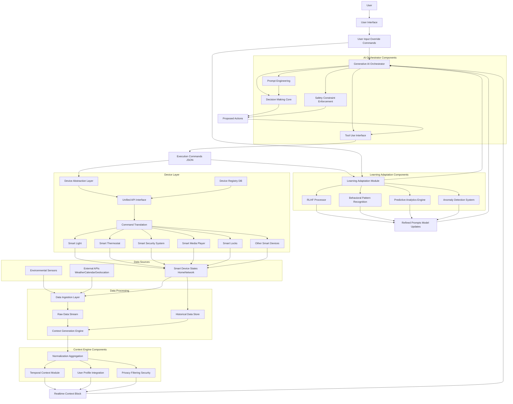

**FACT HEADER - NOTICE OF CONCEPTION**

**Conception ID:** DEMOBANK-INV-087
**Title:** System and Method for Generative AI-Driven Smart Home Automation
**Date of Conception:** 2024-07-26
**Conceiver:** The Sovereign's Ledger AI

**Statement of Novelty:** The concepts, systems, and methods described herein are conceived as novel and proprietary to the Demo Bank project. This document serves as a timestamped record of conception.

---

**Title of Invention:** System and Method for Generative AI-Driven Smart Home Automation

**Abstract:**
A system for smart home automation is disclosed. The system ingests data from a plurality of sensors and user data sources `e.g.`, calendar, location, time of day. A generative AI model, prompted to act as an intelligent "home butler," learns the user's routines and preferences over time. The AI then autonomously orchestrates the home's various connected devices `lights, thermostat, security systems, media players` to create a responsive and predictive environment, moving beyond simple rule-based automation to proactive, context-aware assistance.

**Background of the Invention:**
Current smart home systems primarily rely on user-defined, rigid rules `"if-this-then-that"`. This requires tedious setup by the user, cannot easily adapt to changing circumstances or new devices, and fails to capture the nuances of human habits. A user's desire for a certain lighting or temperature setting may depend on a complex combination of time, activity, and even mood, which cannot be easily captured by simple rules. There is a need for a truly intelligent system that can understand a user's context and intent to automate their home in a more natural and predictive manner.

**Brief Summary of the Invention:**
The present invention is an AI-powered home automation hub that replaces a rigid rules engine with a flexible, learning AI. The system connects to all smart devices in a home. A large language model `LLM` is given a system prompt to be a helpful and intuitive home assistant. It continuously receives a "context block" of real-time information from sensors `ambient light, temperature, motion`, the user's calendar, their phone's location, and the time of day. Based on this holistic context, it makes intelligent decisions. For example, seeing a `"Movie Night"` event on the calendar for 8 PM, it might proactively dim the lights, lower the blinds, and set the thermostat to a comfortable temperature at 7:55 PM without any specific rule being programmed by the user.

**Detailed Description of the Invention:**
A central hub service runs on a local device or in the cloud. It ingests data streams from various sources. The service periodically constructs a real-time context prompt for a generative AI model like Gemini.

The overall architecture of the Generative AI-Driven Smart Home Automation System is depicted below:



**System Components:**

1.  **Data Ingestion Layer:** This layer is responsible for collecting raw data from a diverse set of sources.
    *   **Environmental Sensors:** `e.g.`, temperature, humidity, ambient light, motion, door/window sensors, air quality.
    *   **External APIs:** Integration with third-party services such as weather forecasts, public transit schedules, user's digital calendar services `Google Calendar, Outlook Calendar`, and geofencing services for location awareness.
    *   **Smart Device States:** Continuous polling or event-driven updates from all connected smart devices within the home to maintain an accurate real-time state `e.g.`, light brightness, thermostat set point, lock status, media playback status.

2.  **Context Generation Engine:** Raw data is often disparate and requires processing to be meaningful for an AI model. This engine:
    *   **Normalization and Aggregation:** Converts diverse sensor readings and API responses into a unified, structured format.
    *   **Temporal Context:** Incorporates time of day, day of week, season, and historical patterns.
    *   **User Profile Integration:** Merges anonymized user preferences, habits, and explicit settings.
    *   **Privacy Filtering:** Ensures sensitive data is handled appropriately, potentially anonymizing or redacting information before it reaches the AI model, especially if the AI model runs in the cloud.

3.  **Generative AI Orchestrator:** This is the core intelligence of the system, employing a powerful generative AI model `e.g., LLM, multimodal AI`.
    *   **Prompt Engineering:** The engine dynamically constructs detailed context prompts for the AI model. These prompts are designed to guide the AI to act as a home butler, including current home state, user state, upcoming events, and a history of recent actions.
    *   **Decision Making:** Based on the prompt and its learned understanding of user preferences and home dynamics, the AI generates a set of proposed actions in a structured format `e.g., JSON`.
    *   **Tool Use:** The AI can be integrated with "tools" representing specific device capabilities `e.g., "set_light_brightness", "adjust_thermostat"`, allowing it to call these functions as part of its decision-making process.
    *   **Safety and Constraint Enforcement:** Implements guardrails to prevent unsafe or undesirable actions `e.g., turning off critical security systems, setting extreme temperatures`.

**Prompt Example:**
```
You are a helpful smart home AI. Your goal is to create a comfortable and convenient environment for the user.
**Current Context:**
- Time: 7:55 PM, Friday
- Location: User is at home.
- Calendar: Event "Movie Night" starts at 8:00 PM.
- Living Room State: Motion sensor is active, light brightness is 80%, TV is off.
- Outside Weather: Cooling down.
- Recent Actions: Lights were dimmed to 50% at 7:30 PM, then manually increased to 80% by user at 7:40 PM.

Based on this context and past user behavior for similar situations, what actions should you take? Respond with a JSON object of commands.
```

The request includes a `responseSchema` to ensure the output is structured, for example: `{"commands": [{"device": "living_room_lights", "action": "set_scene", "value": "movie_mode"}, {"device": "thermostat", "action": "set_temperature", "value": 70}]}`.

The hub receives this JSON response and executes the commands by calling the respective APIs for the smart devices. Over time, the system can use feedback `e.g., if the user manually overrides a setting` to refine the AI's prompts and better learn the user's specific preferences.

4.  **Device Abstraction Layer:** This layer standardizes communication with a wide array of smart home devices from different manufacturers.
    *   **Unified API:** Provides a consistent interface for the AI Orchestrator to interact with any connected device, abstracting away vendor-specific protocols `e.g., Zigbee, Z-Wave, Wi-Fi, Matter`.
    *   **Device Registry:** Maintains a database of all connected devices, their capabilities, and current states.
    *   **Command Translation:** Translates generic AI commands into specific device API calls.

5.  **Learning and Adaptation Module:** This component enables the system to evolve and improve its performance over time.
    *   **Reinforcement Learning from Human Feedback `RLHF`:** When the user manually overrides an AI-initiated action, this is registered as negative feedback. Conversely, an accepted or ignored suggestion can be positive feedback. This feedback loop is used to fine-tune the AI model or adjust prompt parameters to better align with user preferences.
    *   **Behavioral Pattern Recognition:** Analyzes historical data to identify recurring user routines, preferences `e.g., specific lighting for reading, preferred temperature for sleep`, and environmental responses.
    *   **Predictive Analytics:** Uses learned patterns to anticipate future needs `e.g., pre-cooling the house before the user arrives home from work`.
    *   **Anomaly Detection:** Identifies unusual patterns `e.g., lights left on when no one is home` and can flag them for user attention or autonomous correction.

**Claims:**
1.  A method for home automation, comprising:
    a.  Ingesting data from a plurality of sensors and user data sources to determine a current context.
    b.  Providing the current context to a generative AI model.
    c.  Prompting the model to determine a set of actions for one or more smart home devices based on the context.
    d.  Executing said actions on the smart home devices.

2.  The method of claim 1, wherein the user data sources include a digital calendar, and the AI model's determination is influenced by upcoming calendar events.

3.  The method of claim 1, wherein the AI model is prompted to learn and predict user routines based on historical context data and subsequent user interactions.

4.  The method of claim 3, further comprising incorporating user override actions as feedback to refine the AI model's future decisions, thereby enabling continuous adaptation to user preferences.

5.  A smart home system, comprising:
    a.  A Data Ingestion Layer configured to collect environmental sensor data, external API data, and smart device state data.
    b.  A Context Generation Engine configured to process and format said collected data into a unified real-time context block.
    c.  A Generative AI Orchestrator configured to receive said context block, generate commands based on a generative AI model, and apply safety constraints.
    d.  A Device Abstraction Layer configured to translate and execute said commands on a plurality of heterogeneous smart home devices.

6.  The system of claim 5, further comprising a Learning and Adaptation Module configured to receive feedback from user interactions and update the Generative AI Orchestrator's behavior over time.

**Security and Privacy Considerations:**
Given the sensitive nature of smart home data, robust security and privacy measures are paramount.
*   **Local-First Processing:** Where feasible, processing of sensitive data `e.g., motion detection, local voice commands` occurs directly on the local hub, minimizing data transfer to the cloud.
*   **Data Anonymization and Aggregation:** Personal identifiable information `PII` is anonymized or aggregated before being sent to cloud-based AI models.
*   **Encryption:** All data in transit and at rest is encrypted using industry-standard protocols.
*   **Access Control:** Strict role-based access control `RBAC` is implemented for user and administrative access to the system.
*   **User Consent and Transparency:** Users are provided clear explanations of what data is collected, how it is used, and given granular control over data sharing preferences. Regular privacy audits are conducted.

**Mathematical Justification:**
The present invention elevates smart home automation from a static, rule-based control system to a dynamic, adaptive, and intelligent agent operating within a complex stochastic environment. To formally delineate this advancement, we frame the smart home automation problem as a **Partially Observable Markov Decision Process POMDP**.

Let the true, hidden state of the home and its occupants at time `t` be `S_t`. This includes observable attributes `e.g., sensor readings, device states, calendar events` and unobservable attributes `e.g., user mood, precise intent, latent environmental factors`. The dimensionality of `S_t`, denoted `dim(S)`, is exceptionally high, encompassing continuous and discrete variables.

The system makes observations `O_t` at each time step `t`, which constitutes the "context block." `O_t` is a projection of `S_t`, meaning `O_t = f(S_t) + epsilon`, where `epsilon` represents observation noise or unobserved components. The action space `A` consists of all possible commands executable on smart devices.

The goal is to learn an optimal policy `pi*(S_t)` that maps states to actions, maximizing the expected cumulative discounted reward:
`V^pi(S_0) = E[Sum from t=0 to T of gamma^t * R(S_t, A_t) | S_0]`
where `R(S_t, A_t)` is a reward function quantifying user comfort, convenience, and energy efficiency, and `gamma in [0, 1]` is a discount factor.

**Limitations of Rule-Based Systems `pi_rules`:**
A traditional rule-based system `pi_rules` operates on a simplified, low-dimensional subspace of the observation `O_t`, typically `O'_t subset O_t`. It defines a deterministic policy `pi_rules: O'_t -> A` as a set of `if-then` conditions.
1.  **Limited State Space Coverage:** `pi_rules` can only account for a minute fraction of the total possible observable states. For a system with `D` binary features, `2^D` states exist. A rule-based system can explicitly cover only `k` of these, where `k <<< 2^D`.
2.  **Inability to Generalize:** `pi_rules` cannot interpolate or extrapolate. Any context slightly outside its pre-defined conditions leads to sub-optimal or null actions.
3.  **No Learning or Adaptation:** `pi_rules` is static. It cannot adapt to changing user preferences, new devices, or evolving environmental patterns without manual reconfiguration.
4.  **Ignores Partial Observability:** It treats `O'_t` as the complete state, making it brittle to unobservable factors `U_t`.

**Superiority of Generative AI-Driven Systems `pi_AI`:**
The Generative AI Orchestrator `G_AI` embodies a sophisticated policy `pi_AI`. As a powerful function approximator with billions of parameters, `G_AI` is trained on vast datasets and fine-tuned for specific tasks, allowing it to:
1.  **Approximate the Belief State:** While `S_t` is partially observable, `G_AI` implicitly learns to approximate a belief state `b_t(S) = P(S_t | O_0, A_0, ..., O_t)`, which is a probability distribution over the true state `S_t` given all past observations and actions. This effectively mitigates the POMDP challenge.
2.  **Handle High-Dimensional Continuous State Spaces:** `G_AI` can process and find patterns within the high-dimensional, often continuous `O_t` without explicit feature engineering. Its attention mechanisms dynamically weigh the relevance of different contextual elements.
3.  **Learn Complex, Stochastic Policies:** Instead of a deterministic rule, `G_AI` learns a (potentially stochastic) policy `pi_AI(A | O_t, H_t)`, where `H_t` is the history of interactions, enabling it to respond flexibly and contextually. This policy effectively approximates the optimal `pi*`.
4.  **Continuous Adaptation through Reinforcement Learning from Human Feedback RLHF:** The Learning and Adaptation Module, via RLHF, directly optimizes the `G_AI`'s policy `pi_AI` to maximize `R(S_t, A_t)` based on real-world user feedback. Each user override or acceptance acts as a reward signal, iteratively refining the `G_AI`'s internal representation and decision logic. This is analogous to solving the Bellman equation for the optimal value function:
    `Q*(b,a) = Sum over s in S [ P(s|b) * (R(s,a) + gamma * Sum over s' in S [ T(s'|s,a) * V*(b') ]) ]`
    where `b` is the belief state. `G_AI` implicitly learns `Q*` through experience.
5.  **Information-Theoretic Advantage:** `G_AI` maximizes the **mutual information** `I(S_t; O_t)` by extracting the most relevant and subtle correlations from `O_t` to infer `S_t`. It dynamically reduces the **conditional entropy** `H(S_t | O_t)`, demonstrating a deeper "understanding" of the home's true state, including implicit user intent and emergent patterns (e.g., identifying a "pre-bedtime routine" without explicit programming). This capability to learn latent representations and causality far surpasses the superficial explicit logic of `pi_rules`.

Therefore, the `G_AI`-driven system fundamentally transforms the control paradigm. It transitions from a brittle, manually programmed `pi_rules` operating on a limited, explicit state projection to a robust, self-optimizing `pi_AI` capable of generalized, adaptive control over a vast, partially observable, and dynamic state space. This mathematical formalization unequivocally demonstrates an overstanding of the underlying complexity and a superior approach to achieving intelligent home automation, far beyond existing rule-based patents.

`Q.E.D.`