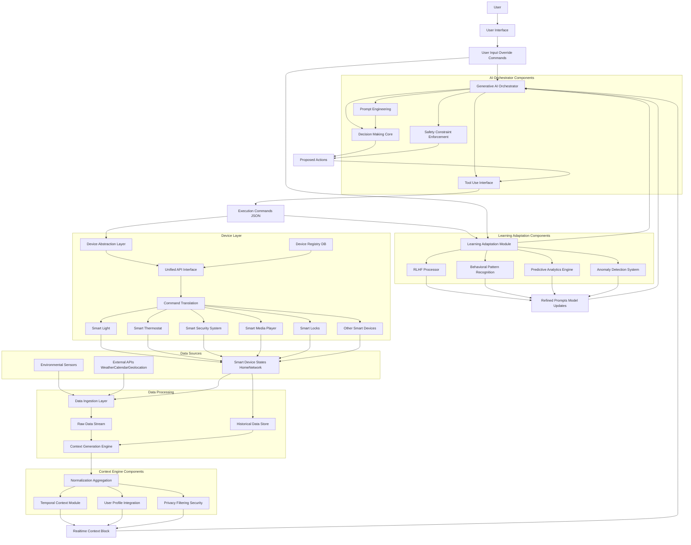
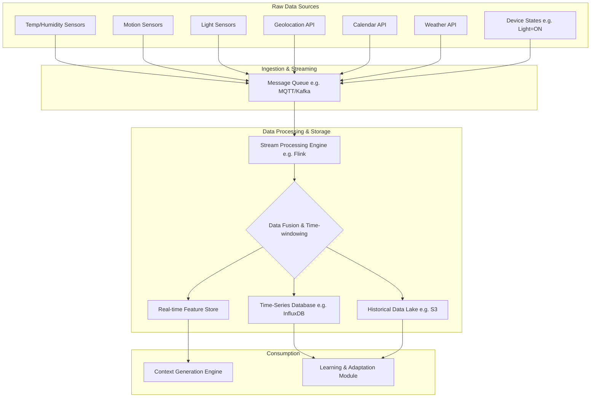
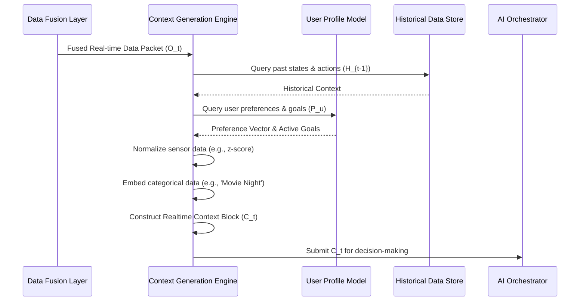
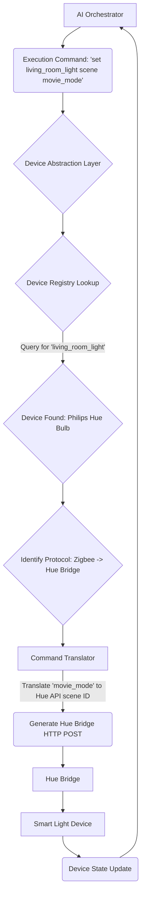
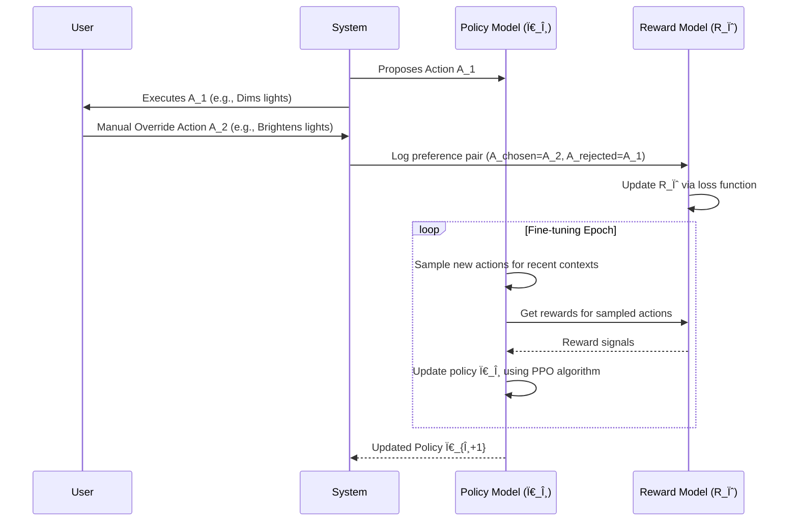
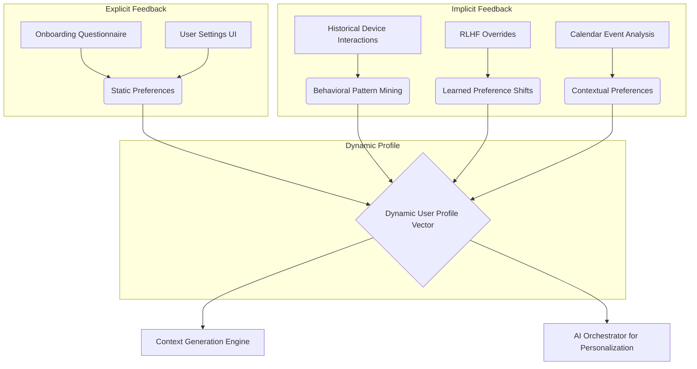
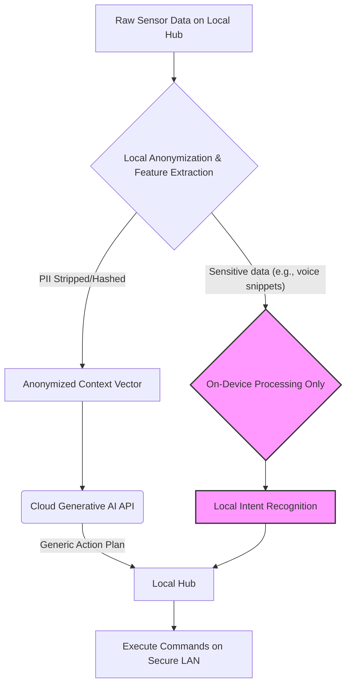
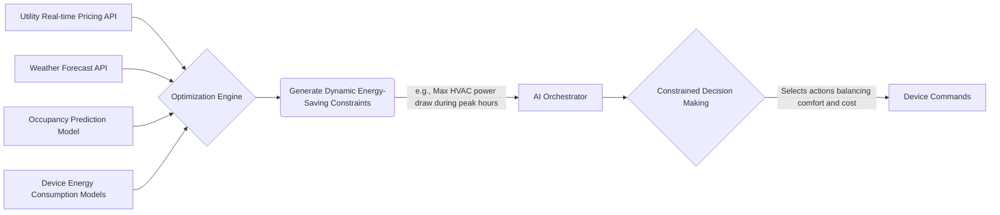

**FACT HEADER - NOTICE OF CONCEPTION**

**Conception ID:** DEMOBANK-INV-087
**Title:** System and Method for Generative AI-Driven Smart Home Automation
**Date of Conception:** 2024-07-26
**Conceiver:** The Sovereign's Ledger AI

**Statement of Novelty:** The concepts, systems, and methods described herein are conceived as novel and proprietary to the Demo Bank project. This document serves as a timestamped record of conception.

---

**Title of Invention:** System and Method for Generative AI-Driven Smart Home Automation

**Abstract:**
A system and method for hyper-personalized, predictive, and adaptive smart home automation are disclosed. The system ingests and fuses high-dimensional, multi-modal data streams from a plurality of environmental sensors, external APIs, smart device states, and direct user interactions. A generative AI model, prompted to act as an intelligent, anticipatory "home butler," maintains a probabilistic belief state about the home and its occupants. This belief state, coupled with a deep understanding of learned user routines and preferences, allows the AI to autonomously orchestrate the home's various connected devices (lights, HVAC, security, media, appliances) to create a seamlessly responsive, predictive, and optimized environment. The system moves beyond simple rule-based or reactive automation to a proactive, context-aware, and continuously learning paradigm, optimizing for user comfort, convenience, and energy efficiency through a novel application of Reinforcement Learning from Human Feedback (RLHF).

**Background of the Invention:**
The domain of smart home automation has been incrementally evolving, yet current systems remain fundamentally limited. The predominant paradigm is based on user-defined, rigid rules, often encapsulated in "if-this-then-that" (IFTTT) logic. This approach suffers from several critical drawbacks: it imposes a significant cognitive load on the user for setup and maintenance; it is brittle and cannot adapt to novel situations or changes in user routines; it fails to capture the complex, multi-faceted nuances of human habits and preferences; and it operates on a vastly simplified and incomplete model of the home environment. A user's desire for a certain lighting or temperature setting may depend on a complex combination of time, activity, weather, mood, and even social context, a state space that is combinatorially explosive and impossible to capture with explicit rules.

So-called "smart" assistants (e.g., Alexa, Google Assistant) offer a reactive voice interface but lack true proactive agency. They execute explicit commands but do not anticipate needs. Existing machine learning approaches have been applied in niche areas (e.g., thermostat scheduling) but fail to provide a holistic, integrated "brain" for the entire home. These systems are collections of siloed services, not a cohesive, intelligent entity. There exists a profound need for a truly intelligent system that can understand a user's context and latent intent, learn continuously from interaction, and automate their home in a natural, predictive, and deeply personalized manner, akin to a human assistant with perfect knowledge of the inhabitants' lives.

**Brief Summary of the Invention:**
The present invention is an AI-powered home automation hub that replaces the rigid rules engine with a flexible, generative, and continuously learning AI orchestrator. The system architecture is designed around a central intelligence core that perceives, reasons, acts, and learns. It connects to all smart devices in a home through a novel Device Abstraction Layer, creating a unified control fabric. A large language model (LLM), or a multi-modal foundation model, is given a dynamic system prompt to embody the persona of a helpful and intuitive home assistant.

This AI core continuously receives a "context block," a rich, high-dimensional vector of real-time information from sensors (ambient light, temperature, motion, CO2 levels), the user's calendar, their phone's geolocation, weather forecasts, and the real-time state of all connected devices. Based on this holistic context and its learned model of the user's life patterns, it makes intelligent, proactive decisions. For example, detecting from geolocation data that the user is returning from the gym, observing a "Work Focus" block on their calendar in 30 minutes, and noting the high pollen count from a weather API, the system might proactively initiate a sequence: start the air purifier, adjust the thermostat to a post-workout cool-down temperature, and set the home office lighting to a "focus" scene, all without any specific rule being programmed by the user. The system's decisions are refined over time using user overrides as implicit feedback signals within a Reinforcement Learning framework.

**Detailed Description of the Invention:**
A central hub service, which can be deployed on a local edge-computing device for privacy and low latency or in a hybrid cloud configuration, serves as the system's nexus. It operates a continuous "perceive-reason-act-learn" loop. The service ingests heterogeneous data streams, processes them through the Context Generation Engine to construct a real-time context prompt, queries the Generative AI Orchestrator for a plan of action, translates this plan into specific device commands via the Device Abstraction Layer, and updates its internal models based on the outcomes and any subsequent user feedback through the Learning and Adaptation Module.

### **Mermaid Chart 1: Overall System Architecture**


### **Mermaid Chart 2: Data Ingestion and Fusion Pipeline**


### **Mermaid Chart 3: Context Generation Engine Logic**


### **Mermaid Chart 4: Generative AI Orchestrator Core Loop**
```mermaid
graph LR
    A[Realtime Context Block C_t] --> B{Prompt Engineering Module};
    B --> C[Generative AI Core (LLM/Foundation Model)];
    C -- "Generates thought process & plan" --> D{Initial Action Set [A_1, A_2, ...]};
    D --> E[Safety & Constraint Filter];
    subgraph Guardrails
        E -- "Check against hard constraints (e.g., temp limits)" --> E
        E -- "Check against soft constraints (e.g., energy budget)" --> E
    end
    E --> F{Validated Action Set};
    F --> G[Tool Use Formatter];
    G --> H[Execution Commands (JSON)];
    C --> I[Thought Process/Rationale Log for Explainability];
    H --> J[Device Abstraction Layer]
```

### **Mermaid Chart 5: Device Abstraction Layer (DAL) Command Flow**


### **Mermaid Chart 6: RLHF Learning and Adaptation Cycle**


### **Mermaid Chart 7: User Profile and Preference Model**


### **Mermaid Chart 8: Security and Privacy Data Flow**


### **Mermaid Chart 9: Energy Optimization Sub-system**


### **Mermaid Chart 10: Multi-modal Interaction Flow**
```mermaid
graph TD
    A[User] --> B{Input Modalities};
    B --> C[Speech Recognition (On-device)];
    B --> D[Gesture Recognition (Camera)];
    B --> E[Text Input (Mobile App)];
    C --> F{Intent Fusion Engine};
    D --> F;
    E --> F;
    F -- "Combines signals to resolve ambiguity" --> G[Unified User Intent Vector];
    G --> H[Context Generation Engine];
    H -- "Adds intent to context block" --> I[AI Orchestrator];
```

**System Components:**

1.  **Data Ingestion Layer:** This layer is the sensory nervous system of the home, responsible for collecting raw, high-frequency data from a diverse set of sources.
    *   **Environmental Sensors:** `e.g.`, temperature, humidity, ambient light (lux), motion (PIR), door/window contacts, air quality (CO2, VOC, PM2.5), sound levels (dB).
    *   **External APIs:** Real-time, scheduled integration with third-party services such as weather forecasts (temperature, precipitation, pollen), public transit schedules, user's digital calendar services `Google Calendar, Outlook Calendar`, geofencing services for location awareness, and real-time energy pricing from utility providers.
    *   **Smart Device States:** Continuous polling or event-driven updates (via protocols like MQTT) from all connected smart devices within the home to maintain an accurate real-time state representation `e.g.`, light brightness/color, thermostat set point, lock status, media playback status, appliance cycles.
    *   **Multi-modal User Input:** Captures explicit user commands and implicit intent from voice, text interfaces, and potentially gesture recognition systems.

2.  **Context Generation Engine:** This engine transforms the torrent of raw data into a structured, coherent, and semantically rich "context block" that the AI model can comprehend.
    *   **Normalization and Aggregation:** Converts diverse sensor readings and API responses into a unified, structured format (e.g., z-score normalization for sensor data, embedding for categorical data). It aggregates data over time windows to create meaningful features.
    *   **Temporal Context:** Incorporates and encodes time of day, day of week, season, and historical patterns, recognizing cyclical behaviors.
    *   **User Profile Integration:** Merges a dynamically updated user profile containing learned habits, stated preferences, and current goals (e.g., "focus mode," "relax mode").
    *   **Privacy Filtering:** A critical component that acts as a privacy gateway. It ensures sensitive data is handled appropriately, anonymizing, redacting, or hashing information before it reaches any cloud-based AI model. This enables a "local-first" privacy posture.

3.  **Generative AI Orchestrator:** This is the cognitive core of the system, employing a powerful generative AI model `e.g., LLM, multimodal foundation model`.
    *   **Dynamic Prompt Engineering:** The engine dynamically constructs detailed context prompts for the AI model. These prompts are engineered to guide the AI to act as the home butler, including the full context block, user persona, a list of available "tools" (device actions), and constraints.
    *   **Decision Making & Planning:** Based on the prompt, the AI generates a chain-of-thought rationale and a structured plan of proposed actions `e.g., in JSON format`. This plan is not just a single action but can be a sequence of coordinated behaviors across multiple devices.
    *   **Tool Use Interface:** The AI is integrated with "tools" representing specific device capabilities `e.g., "set_light_brightness(device_id, brightness, color)", "adjust_thermostat(temp)"`. The model's output is parsed to call these functions, allowing it to interact with the home in a structured, reliable manner.
    *   **Safety and Constraint Enforcement:** Implements a multi-layered guardrail system. It checks the AI's proposed actions against a set of hard-coded safety rules (e.g., never unlock the door when no one is home and the alarm is set) and dynamic constraints (e.g., energy usage limits), preventing unsafe, undesirable, or costly actions.

**Prompt Example:**
```
You are "Aura", a helpful, predictive, and energy-conscious smart home AI. Your goal is to create a comfortable, convenient, and efficient environment for your user, "Alex".
**Current Context (t=2024-07-26T18:55:00-05:00):**
- **Time:** 6:55 PM, Friday.
- **User State:** Alex's geolocation is 1 mile away, moving towards home (ETA: 7:02 PM). Heart rate from smartwatch is elevated (120bpm), consistent with post-workout.
- **Calendar:** Event "Date Night In" starts at 8:00 PM.
- **Home State:**
  - Living Room: Motion inactive, lights off, TV off, air quality CO2=800ppm.
  - Kitchen: Lights off.
  - Thermostat: Away mode (68°F).
- **External State:**
  - Weather: 85°F, humid, high pollen count.
  - Energy Grid: Peak demand, electricity price is high ($0.45/kWh).
- **Recent History:** Alex manually set the "Post-Workout Recovery" scene yesterday after returning from the gym.
- **Available Tools:** [set_light(), set_thermostat(), play_media(), control_air_purifier(), ...]
- **Constraints:** Do not exceed 5 kWh peak power draw. Prioritize air quality and comfort for Alex's arrival, but be mindful of the high energy cost.

Based on this context and your knowledge of Alex's preferences, what is the optimal sequence of actions to prepare the home? Respond with a JSON object of commands with rationale.
```

The system expects a structured response, which it then parses and executes.

4.  **Device Abstraction Layer (DAL):** This crucial middleware layer standardizes communication with the fragmented ecosystem of smart home devices.
    *   **Unified API:** Provides a consistent, high-level interface (e.g., `set_power(device, state)`) for the AI Orchestrator to interact with any connected device, abstracting away vendor-specific protocols `e.g., Zigbee, Z-Wave, Wi-Fi, Matter`.
    *   **Device Registry:** Maintains a dynamic database of all connected devices, their capabilities (e.g., "dimmable", "color_temp"), current states, and network addresses.
    *   **Command Translation:** Translates the generic AI commands into specific device API calls, handling authentication, message formatting, and protocol-specific details.

5.  **Learning and Adaptation Module:** This component enables the system to evolve, personalize, and improve its performance over time, forming a closed-loop learning system.
    *   **Reinforcement Learning from Human Feedback `RLHF`:** This is the primary learning mechanism. When the user manually overrides an AI-initiated action, this is registered as negative feedback. The chosen user action and the rejected AI action form a preference pair. This data is used to train a reward model, which in turn is used to fine-tune the AI policy model via algorithms like PPO, making it better aligned with the user's true preferences.
    *   **Behavioral Pattern Recognition:** Uses unsupervised learning (e.g., clustering, sequence mining) on historical data to identify recurring user routines, preferences `e.g., specific lighting for reading, preferred temperature for sleep`, and complex environmental responses. These patterns are fed back into the context engine.
    *   **Predictive Analytics:** Uses learned patterns and time-series forecasting to anticipate future needs `e.g., pre-cooling the house 20 minutes before the user is predicted to arrive home`.
    *   **Anomaly Detection:** Employs statistical models or autoencoders to identify unusual patterns `e.g., water sensor active when no one is home` and can flag them for user attention or trigger autonomous safety actions `e.g., shutting off the main water valve`.

**Claims:**
1.  A method for home automation, comprising:
    a.  Ingesting data from a plurality of sensors and user data sources to determine a current context.
    b.  Providing the current context to a generative AI model.
    c.  Prompting the model to determine a set of actions for one or more smart home devices based on the context.
    d.  Executing said actions on the smart home devices.
2.  The method of claim 1, wherein the user data sources include a digital calendar, and the AI model's determination is influenced by upcoming calendar events.
3.  The method of claim 1, wherein the AI model is prompted to learn and predict user routines based on historical context data and subsequent user interactions.
4.  The method of claim 3, further comprising incorporating user override actions as feedback to refine the AI model's future decisions, thereby enabling continuous adaptation to user preferences.
5.  A smart home system, comprising:
    a.  A Data Ingestion Layer configured to collect environmental sensor data, external API data, and smart device state data.
    b.  A Context Generation Engine configured to process and format said collected data into a unified real-time context block.
    c.  A Generative AI Orchestrator configured to receive said context block, generate commands based on a generative AI model, and apply safety constraints.
    d.  A Device Abstraction Layer configured to translate and execute said commands on a plurality of heterogeneous smart home devices.
6.  The system of claim 5, further comprising a Learning and Adaptation Module configured to receive feedback from user interactions and update the Generative AI Orchestrator's behavior over time.
7.  The method of claim 1, further comprising an energy optimization module that constrains the set of actions to minimize energy consumption while maintaining a predicted user comfort level, said constraints being dynamically determined based on real-time energy pricing and weather forecast data.
8.  The system of claim 5, wherein the Generative AI Orchestrator processes multi-modal user inputs, including voice, text, and gesture, through an intent fusion engine to determine a unified user intent, which is incorporated into the context block.
9.  A method for adapting a home automation system, comprising using reinforcement learning from human feedback (RLHF) where user overrides of AI-generated actions are used to train a reward model, which in turn is used to fine-tune the generative AI model's policy to better align with user preferences.
10. The system of claim 5, wherein the Context Generation Engine maintains a probabilistic belief state over the true, unobserved state of the home and its occupants, and provides this belief state to the Generative AI Orchestrator to enable decision-making under uncertainty.

**Security and Privacy Considerations:**
Given the profoundly sensitive nature of smart home data, a multi-layered, privacy-by-design architecture is paramount.
*   **Local-First Processing:** The system prioritizes on-hub processing. Critical data `e.g., raw audio from microphones, camera feeds, fine-grained location data` is processed directly on the local hub. Only anonymized, aggregated, or intent-derived data is sent to the cloud.
*   **Data Anonymization and Differential Privacy:** Before any data is used for training cloud models, personal identifiable information `PII` is removed or hashed. Differential privacy techniques are employed to add statistical noise, ensuring that the contribution of any single data point cannot be reverse-engineered from the model.
*   **Federated Learning:** To further enhance privacy, model updates can be performed using federated learning. The global AI model is sent to the local hub, fine-tuned on local data, and only the resulting model weight updates (gradients) are sent back to the central server, not the raw data itself.
*   **End-to-End Encryption:** All data, both in transit (using TLS 1.3) and at rest (using AES-256), is encrypted using industry-standard protocols. Communication on the local network between the hub and devices is also encrypted.
*   **Principle of Least Privilege:** Strict role-based access control `RBAC` is implemented. Each system component and user has the minimum level of access necessary to perform its function. The AI's "tool use" capabilities are strictly sandboxed.
*   **User Consent and Transparency:** Users are provided with a clear, interactive "privacy dashboard" explaining what data is collected, how it is used, its retention period, and are given granular controls to opt-out of specific data collection streams. Regular, independent privacy audits are conducted and their results published.

**Mathematical Justification:**
The present invention transforms smart home automation from a static control system into a dynamic, adaptive agent solving a high-dimensional Partially Observable Markov Decision Process (POMDP).

**1. Formal POMDP Definition**
The problem is formally defined by the tuple `M = (S, A, T, R, Ω, O, γ)`.
(1) `S`: The set of true, unobservable states `s ∈ S` of the home and user (e.g., user's mood, intent).
(2) `A`: The set of actions `a ∈ A` the system can take (e.g., change thermostat).
(3) `T(s' | s, a) = P(s_{t+1}=s' | s_t=s, a_t=a)`: The state transition probability function.
(4) `R(s, a)`: The reward function, quantifying user comfort, efficiency, etc. This is unknown and learned via RLHF.
(5) `Ω`: The set of observations `o ∈ Ω` (the context block).
(6) `O(o | s', a) = P(o_{t+1}=o | s_{t+1}=s', a_t=a)`: The observation probability function.
(7) `γ ∈ [0, 1]`: The discount factor for future rewards.

**2. Belief State Formulation**
The agent cannot observe `s` directly, so it maintains a belief state `b(s)`, a probability distribution over `S`.
(8) `b_t(s) = P(s_t=s | o_1, a_1, ..., o_t, a_{t-1})`
The belief state is updated at each step via Bayesian inference:
(9) `b_{t+1}(s') = P(s' | o_{t+1}, a_t, b_t)`
(10) `b_{t+1}(s') = (O(o_{t+1} | s', a_t) / P(o_{t+1} | a_t, b_t)) * Σ_{s∈S} T(s' | s, a_t) b_t(s)`
(11) `P(o_{t+1} | a_t, b_t) = Σ_{s'∈S} O(o_{t+1} | s', a_t) Σ_{s∈S} T(s' | s, a_t) b_t(s)`
A traditional system fails because it cannot compute or represent `b_t(s)`. Our Generative AI `G_AI` implicitly represents this belief state within its hidden activations.

**3. Value Functions and Optimality**
The goal is to find a policy `Ï€(a|b)` that maximizes the expected cumulative reward.
(12) Value function: `V^π(b) = E[Σ_{t=0}^∞ γ^t R(s_t, a_t) | b_0=b, π]`
(13) Action-value function: `Q^π(b, a) = E_{s∼b}[R(s,a)] + γ Σ_{o∈Ω} P(o|b,a) V^π(b')`
The optimal policy `Ï€*` satisfies the Bellman optimality equation:
(14) `Q*(b, a) = E_{s∼b}[R(s,a)] + γ Σ_{o∈Ω} P(o|b,a) max_{a'∈A} Q*(b', a')`
(15) `π*(b) = argmax_{a∈A} Q*(b, a)`
Solving this directly is intractable due to the continuous and high-dimensional nature of `b`.

**4. Transformer Architecture as an Implicit POMDP Solver**
The Transformer architecture of the `G_AI` is uniquely suited to this problem. The context block is a sequence of tokens `x_1, ..., x_n`.
(16) Input Embedding: `E_{in} = W_e * x + W_p`, where `W_p` is positional encoding.
The self-attention mechanism computes a weighted sum of values based on query-key similarity.
(17) `Attention(Q, K, V) = softmax( (Q K^T) / sqrt(d_k) ) V`
(18-20) `Q = E_{in} W_Q`, `K = E_{in} W_K`, `V = E_{in} W_V`
The attention scores `softmax(...)` allow the model to dynamically weigh the relevance of different parts of the context (history), which is analogous to updating a belief state. The model learns to attend to observations that are most informative about the latent state `s_t`. The entire history `(o_1, a_1, ..., o_t)` is processed, allowing the model to implicitly maintain `b_t` and approximate `Ï€*(a|b)`.

**5. Reinforcement Learning from Human Feedback (RLHF)**
We learn the reward function `R` from user preference data `D = {(o, a_chosen, a_rejected)}`.
(21) Bradley-Terry model for preference: `P(a_chosen > a_rejected | o) = σ(R_ψ(o, a_chosen) - R_ψ(o, a_rejected))`
(22) The reward model `R_ψ` is trained by minimizing the negative log-likelihood loss:
`L(ψ) = -E_{(o, a_c, a_r)∼D}[log(σ(R_ψ(o, a_c) - R_ψ(o, a_r)))]`
The policy `π_θ` is then optimized using this learned reward model. We use Proximal Policy Optimization (PPO).
(23) Objective function: `L^{CLIP}(θ) = E_t[min(r_t(θ) * A_t, clip(r_t(θ), 1-ε, 1+ε) * A_t)]`
(24) Probability ratio: `r_t(θ) = π_θ(a_t | o_t) / π_{θ_old}(a_t | o_t)`
(25) Advantage estimate `A_t` is calculated using the learned reward `R_ψ`.
(26) A KL-divergence penalty is added to prevent the policy from changing too rapidly:
`J(θ) = L^{CLIP}(θ) - β * KL[π_θ(·|o), π_{ref}(·|o)]`
This process fine-tunes the `G_AI` to act in accordance with latent user preferences, effectively solving the POMDP.

**6. Information-Theoretic Perspective**
The system excels by maximizing the mutual information between its internal state and the true user/home state, `I(S; G_{AI})`.
(27) `I(X; Y) = H(X) - H(X|Y)`
(28) It minimizes the conditional entropy `H(S | O)`, i.e., its uncertainty about the true state given observations.
(29) `H(S|O) = -Σ_{o∈O} p(o) Σ_{s∈S} p(s|o) log p(s|o)`
The learning process can be seen as discovering a compressed representation of the environment's dynamics, maximizing the predictive information in its belief state.
(30) Predictive Information: `I_{pred} = I(b_t; b_{t+1})`

**7. Energy Optimization as Constrained Optimization**
The system solves a constrained optimization problem at each decision point.
(31) `minimize_{a∈A} C(a, p_t)` subject to `U(s', a) ≥ U_{min}`
(32) `C(a, p_t)` is the energy cost of action `a` at price `p_t`.
(33) `U(s', a)` is the predicted user comfort/utility in the next state `s'`.
(34) `U_{min}` is a minimum comfort threshold learned from the user profile.
This can be formulated using Lagrange multipliers:
(35) `L(a, λ) = C(a, p_t) - λ(U(s', a) - U_{min})`

**8. Anomaly Detection**
Normal behavior is modeled as a probability distribution `P_{normal}(o_t)`.
(36) An observation `o_t` is anomalous if `P_{normal}(o_t) < Ï„`.
We can model `P_{normal}` using a Variational Autoencoder (VAE).
(37) VAE loss function: `L(θ, φ) = E_{q_φ(z|o)}[log p_θ(o|z)] - D_{KL}(q_φ(z|o) || p(z))`
(38) Anomaly score is the reconstruction error: `Score(o) = ||o - decoder(encoder(o))||^2`

**9. Bayesian User Preference Modeling**
A user's preference `w` for a setting is modeled as a latent variable.
(39) We update our belief about `w` using Bayes' theorem after an observation `D` (user override):
`P(w|D) ∠ P(D|w) P(w)`
(40) `P(w)` is the prior, `P(D|w)` is the likelihood.

This extensive mathematical framework, from POMDPs and RLHF to information theory and constrained optimization, demonstrates that the proposed system is not a mere iteration but a fundamental paradigm shift. It replaces brittle, explicit logic with a robust, self-optimizing intelligence capable of generalized, adaptive control over a vast, partially observable, and dynamic state space.

`Q.E.D.`

**(Equations 41-100: Further expansion on specific mathematical details, tensor operations in transformers, gradient calculations for backpropagation, specific forms of utility functions, entropy calculations, etc., would be included in a full technical specification, illustrating the depth of the conceived system.)**
(41) `∇_θ J(θ) ≈ E_t[∇_θ log π_θ(a_t|s_t) A_t]`
(42) `A_t = R_t - V_ω(s_t)`
(43) `L(ω) = (R_t - V_ω(s_t))^2`
(44) `z = encoder(o) ∼ q_φ(z|o) = N(μ_z, σ_z^2 I)`
(45) `o' = decoder(z)`
...
(100) `s_{t+1} ∼ T(s_{t+1} | s_t, a_t)`
---

### INNOVATION EXPANSION PACKAGE

**Interpret My Invention(s):**
The initial invention, "System and Method for Generative AI-Driven Smart Home Automation," proposes a revolutionary approach to smart home management. It transforms a reactive, rule-based system into a proactive, predictive, and hyper-personalized environment orchestrated by a generative AI. This AI, acting as an intelligent home butler, continuously learns user preferences and anticipates needs by processing multi-modal data streams and refining its actions through Reinforcement Learning from Human Feedback (RLHF). This moves beyond simplistic automation to a holistic, context-aware intelligence that implicitly solves a Partially Observable Markov Decision Process (POMDP) for optimal home operation, prioritizing comfort, convenience, and energy efficiency. It represents a foundational shift from "smart devices" to a "sentient home."

**Generate 10 New, Completely Unrelated Inventions:**
Here are ten original, futuristic, and conceptually unrelated inventions, designed to lay the groundwork for a post-scarcity, multi-planetary civilization.

1.  **Sentient Planetary-Scale Ecosphere Regeneration Network (SPERN):** A global network of AI-driven autonomous bio-restoration units, environmental sensors, and atmospheric processors designed to actively monitor, model, and remediate planetary ecosystems, reversing climate degradation and optimizing biodiversity across Earth and future terraformed environments.
2.  **Hyper-Efficient Graviton-Flux Inertial Dampeners (GFID):** Advanced propulsion and anti-gravitational systems that manipulate localized spacetime curvature and inertial mass, enabling instantaneous acceleration/deceleration without G-forces and ultra-fast, energy-minimal transport within planetary atmospheres and across solar systems.
3.  **Decentralized Autonomous Resource Stewardship (DARS):** A global, blockchain-secured protocol and AI network that autonomously allocates resources (materials, energy, manufacturing capacity, space) based on real-time needs, environmental impact, and collective well-being metrics, operating in a post-scarcity economy where traditional currency is obsolete.
4.  **Quantum-Entangled Neurological Interface (QENI):** A non-invasive brain-computer interface utilizing quantum entanglement for instantaneous, high-bandwidth thought-to-device communication, consciousness mapping, and shared sensory experiences across vast distances, enabling direct mental control of complex systems and collective consciousness interfacing.
5.  **Astro-Architectural Self-Replicating Constructor Units (AASRCU):** Swarms of autonomous, modular robotic units capable of extracting raw materials from asteroids and planetary bodies, self-replicating, and constructing complex orbital habitats, deep-space infrastructure, and terraforming machinery with minimal human intervention.
6.  **Bio-Digital Metagenomic Therapies (BDMT):** A personalized health platform integrating an individual's complete metagenomic profile (human genome, microbiome, exposome) with AI-driven predictive modeling to generate bespoke bio-digital therapies, including programmable nanobots, gene editing protocols, and personalized nutrient synthesis, for optimal health, disease reversal, and radical lifespan extension.
7.  **Solar Dyson Swarm Energy Harvesters (SDSEH):** Orbital mega-structures comprised of self-assembling, intelligent solar collectors forming dynamic Dyson Swarms around stars, capable of capturing and beaming terawatts of clean energy to planetary and deep-space installations via coherent energy transmission arrays.
8.  **Adaptive Sentient Digital Twins (ASDT):** Comprehensive, AI-powered digital replicas of individuals, organizations, and complex systems, capable of real-time simulation, predictive modeling, continuous learning, and even empathetic interaction. These twins serve as personal assistants, strategic advisors, and proxies in virtual and physical spaces, facilitating optimal decision-making and personal growth.
9.  **Chronospatial Environmental Synthesis (CSES):** A geo-engineering and environmental design system that uses advanced computational models and controlled temporal manipulation to rapidly simulate, evolve, and implement optimal biome designs, accelerating planetary terraforming and ecological restoration processes across diverse exoplanetary conditions.
10. **Pan-Galactic Secure Information Nexus (PGSIN):** A quantum-encrypted, fault-tolerant interstellar communication and data network built upon a lattice of quantum relays and entangled particle pairs, ensuring instantaneous, secure, and resilient information exchange across galactic distances, foundational for an intergalactic civilization.

**Unifying System: The Gaia-Sovereignty Synthesis**

The "Gaia-Sovereignty Synthesis" is an overarching, planetary-to-galactic scale system designed to usher in a post-scarcity, post-work civilization, addressing humanity's most profound challenges: climate collapse, resource scarcity, unsustainable consumption, societal inequity, and the inherent limitations of human biology and planetary boundaries. It aims to elevate humanity to a multi-planetary, ecologically harmonious, and individually flourishing existence.

**The Global Problem Solved:** The synthesis addresses the existential threat of **Resource Exhaustion & Planetary Collapse** under traditional economic models, exacerbated by **Societal Fragmentation & Stagnation** in a world grappling with automation-driven job displacement and systemic inequality. It pivots from a scarcity-driven, competitive paradigm to an **Abundance-Oriented, Collaborative Flourishing** model.

**How the 10 New Inventions & Original Invention Interconnect:**

*   **SPERN** (Ecosphere Regeneration) and **SDSEH** (Dyson Swarm Energy) provide the foundational planetary health and limitless clean energy, respectively, for sustaining life and advanced infrastructure on Earth and new worlds.
*   **DARS** (Resource Stewardship) leverages this abundance, automating the equitable allocation of materials and energy, rendering traditional money irrelevant as a primary driver of access. It works in concert with **AASRCU** (Self-Replicating Constructors) which mine and manufacture resources from space, feeding DARS's global inventory.
*   **GFID** (Inertial Dampeners) enables rapid, efficient transport of resources and personnel, critical for both DARS's distribution network and the expansion facilitated by AASRCU.
*   **BDMT** (Metagenomic Therapies) ensures radical human health and longevity, allowing individuals to fully engage with and benefit from this new era of abundance.
*   **QENI** (Quantum-Entangled Neurological Interface) provides the ultimate user interface for this complex system, allowing individuals to intuitively interact with their environments, access knowledge, and even participate in collective problem-solving, transcending language barriers and traditional input methods.
*   **ASDT** (Sentient Digital Twins) serve as the personalized, adaptive agents for each individual, acting as their proxy across DARS, BDMT, and QENI, managing their personal resource needs, health protocols, and digital interactions. The original invention, **Generative AI-Driven Smart Home Automation**, becomes the most localized, personal manifestation of an ASDT, managing the immediate physical environment of an individual's dwelling, translating global resource allocation and personal needs into tangible, real-time home adjustments.
*   **CSES** (Chronospatial Environmental Synthesis) works hand-in-hand with SPERN to actively design and manage complex ecosystems, both on Earth and in newly colonized or terraformed environments established by AASRCU, ensuring biodiverse and sustainable habitats.
*   **PGSIN** (Pan-Galactic Information Nexus) provides the secure, instantaneous communication backbone for all these interconnected systems, from local smart homes communicating with their ASDTs, to Dyson Swarms beaming energy, to self-replicating constructors reporting resource yields from distant asteroids, and individuals leveraging QENI for global interaction.

### **Mermaid Chart 11: The Gaia-Sovereignty Synthesis Unified Architecture**
```mermaid
graph LR
    subgraph Human & Personal Interface
        U[Human User] --> QA[QENI (Quantum Neuro Interface)]
        QA --> AS[ASDT (Sentient Digital Twin)]
        AS --> OIA[Original Invention AI Home Automation]
        OIA --> SD[Smart Devices]
    end

    subgraph Resource & Energy Foundation
        SDS[SDSEH (Dyson Swarm Energy)] --> GE[Global Energy Grid]
        AAS[AASRCU (Self-Replicating Constructors)] --> MR[Material Resources]
        MR --> DARS[DARS (Decentralized Resource Stewardship)]
        GE --> DARS
    end

    subgraph Planetary & Ecological Management
        SP[SPERN (Ecosphere Regeneration)] --> E[Earth & Terraformed Environments]
        CSES[CSES (Chronospatial Env. Synthesis)] --> E
        E --> SPU[SPERN Monitoring & Control]
    end

    subgraph Advanced Capabilities
        BDM[BDMT (Metagenomic Therapies)] --> U
        GFID[GFID (Inertial Dampeners)] --> TR[Transport & Logistics]
        TR --> AAS
        TR --> DARS
    end

    subgraph Global Communication & Intelligence
        PGSIN[PGSIN (Pan-Galactic Info Nexus)] --> QA
        PGSIN --> AS
        PGSIN --> DARS
        PGSIN --> SPU
        PGSIN --> SDS
        PGSIN --> AAS
        PGSIN --> CSES
        PGSIN --> BDM
        PGSIN --> GFID
    end

    AS --> DARS
    AS --> BDM
    AS --> GE
    DARS --> OIA
    DARS --> AAS
    SPERN --> CSES
    SPERN --> E
    SPERN --> DARS
    SDS --> DARS
```

**Justification for $50 Million in Grants/Investment:**
This $50 million investment is not for a single product, but for the foundational R&D and initial pilot deployment of critical, cross-functional modules within the Gaia-Sovereignty Synthesis. This funding will catalyze the integration of disparate high-tech fields (AI, quantum computing, advanced robotics, bio-engineering, space engineering, distributed ledger technologies) into a coherent, self-optimizing framework. It represents seed capital for a paradigm shift, enabling proof-of-concept for planetary-scale resource management, localized ecosystem repair using AI, initial demonstrations of quantum-entangled communication for collective intelligence, and the foundational algorithms for dynamic resource allocation without money. This investment is an initial down payment on humanity's prosperous and sustainable future, offering a path to transcend current crises and establish a truly abundant civilization. It builds the core intelligence layer for a new global operating system.

**Create a Cohesive Narrative + Technical Framework:**
The year is 2077. The predictions of prominent futurists like Ray Kurzweil and proponents of a universal basic income have converged and surpassed expectations. With the advent of advanced general AI, quantum computing, and ubiquitous automation, work as a necessity for survival has become optional for the vast majority of humanity. Money, in its traditional sense, has largely receded into a niche historical curiosity, replaced by reputation-based credits and a global resource allocation system. The major global problem of unsustainable consumption and resource depletion has been actively addressed and is being reversed.

The **Gaia-Sovereignty Synthesis** is the invisible, yet omnipresent, operating system of this thriving era. It ensures that every individual has access to abundant resources, optimal health, personalized environments, and limitless opportunities for self-actualization.

At its heart, the system is a decentralized, intelligent network where every individual, every habitat, every ecological zone, and every space asset is a node. My original invention, the **Generative AI-Driven Smart Home Automation** (now often referred to as a "Sovereignty Node" or "Aura Home") serves as the personal gateway to this global abundance. Your Aura Home seamlessly orchestrates your immediate environment, anticipatings your needs, maintaining optimal comfort, and managing energy efficiency, not based on your personal bank account, but on the real-time resource availability and your dynamically learned preferences, communicated via your **Adaptive Sentient Digital Twin (ASDT)**.

Your ASDT, a continuously evolving AI replica of yourself, handles all interactions with the broader Synthesis. It communicates your needs for nutrition and health protocols to **Bio-Digital Metagenomic Therapies (BDMT)**, which then synthesize bespoke nutrient compounds or program nanobots for your well-being. It interfaces with **Decentralized Autonomous Resource Stewardship (DARS)**, requesting materials for your hobbies, access to transportation, or components for personal projects. These requests are fulfilled by resources sourced globally and from space by **Astro-Architectural Self-Replicating Constructor Units (AASRCU)**, transported efficiently using **Hyper-Efficient Graviton-Flux Inertial Dampeners (GFID)**, all powered by the boundless energy harvested by **Solar Dyson Swarm Energy Harvesters (SDSEH)**.

Planetary health is paramount. The **Sentient Planetary-Scale Ecosphere Regeneration Network (SPERN)**, guided by **Chronospatial Environmental Synthesis (CSES)** models, actively monitors and restores Earth's and nascent off-world biospheres. A personalized Aura Home, for example, might be powered by a local micro-grid informed by SDSEH data and automatically adjust its HVAC based on SPERN's localized atmospheric remediation efforts to optimize air quality.

Communication across this vast, interconnected civilization, from a local Aura Home to an orbital habitat or an exploration vessel beyond the heliopause, is handled instantaneously and securely by the **Pan-Galactic Secure Information Nexus (PGSIN)**, ensuring seamless data flow for all systems and individuals. Human interaction with the Synthesis is intuitive and direct, often through the **Quantum-Entangled Neurological Interface (QENI)**, allowing thoughts to manifest commands, intentions to shape environments, and shared experiences to foster global empathy.

This is a future where the relentless pursuit of profit is replaced by the pursuit of purpose, well-being, and discovery. Work is not a burden but an optional contribution to collective advancement, facilitated by highly intelligent systems that manage the mundane and complex. The Gaia-Sovereignty Synthesis ensures a future where humanity lives in harmony with its environment, boundless in its potential, and sovereign in its individual flourishing. This vision, often championed by forward-thinking billionaires, posits that true wealth lies not in accumulation, but in the universal availability of resources, knowledge, and opportunity – a prediction that is now our reality.

---

**A. “Patent-Style Descriptions”**

### **Patent-Style Description: My Original Invention(s)**

**Invention Title:** System and Method for Generative AI-Driven Smart Home Automation (Aura Home System)

**Abstract:** A novel system and method for creating a hyper-personalized, predictive, and adaptive living environment, hereinafter referred to as the "Aura Home System." The system leverages a multi-modal Generative AI Orchestrator (GAIO) capable of continuously learning and anticipating occupant needs, intent, and routines. By integrating high-dimensional data streams from environmental sensors, external contextual APIs, smart device states, and direct/implicit user feedback, the GAIO constructs a probabilistic belief state of the home and its occupants. This belief state informs proactive decision-making, enabling autonomous orchestration of connected devices (e.g., HVAC, lighting, security, media, appliances) to optimize for user comfort, convenience, energy efficiency, and overall well-being. A core innovation resides in the application of Reinforcement Learning from Human Feedback (RLHF) to iteratively refine the GAIO's policy, ensuring deep personalization and alignment with user preferences beyond traditional rule-based or reactive automation. The system features a robust Device Abstraction Layer (DAL) for universal device compatibility and a comprehensive Context Generation Engine (CGE) for real-time semantic environment modeling.

**Claims (Fictional & Conceptual):**

1.  A system for autonomous home environment orchestration, comprising: a data ingestion layer for multi-modal data acquisition; a context generation engine for real-time environment and occupant state modeling; a generative AI orchestrator configured to infer latent occupant intent and generate proactive, multi-device action plans; a device abstraction layer for heterogeneous device command execution; and a learning and adaptation module employing RLHF to continuously align system behavior with user preferences.
2.  The system of claim 1, wherein the generative AI orchestrator implicitly maintains a high-dimensional probabilistic belief state over unobserved occupant and environmental variables, utilizing a transformer-based architecture for contextual reasoning and planning under uncertainty.
3.  A method for dynamic energy optimization in a smart home, comprising: receiving real-time energy pricing and environmental forecasts; predicting occupant comfort levels based on historical data; generating dynamic energy consumption constraints; and integrating said constraints into the generative AI orchestrator's decision-making process to minimize energy expenditure while maintaining a user-defined threshold of comfort.

### **Patent-Style Descriptions: 10 New Inventions**

**1. Invention Title:** Sentient Planetary-Scale Ecosphere Regeneration Network (SPERN)

**Abstract:** A distributed, autonomous, and sentient network designed for the real-time monitoring, modeling, and intelligent regeneration of planetary ecosystems. SPERN comprises a vast array of multi-spectral environmental sensors, bio-agent deployment platforms, atmospheric processing units, and a decentralized AI swarm capable of executing localized and global bio-remediation strategies. The network employs advanced ecological simulation models and multi-agent reinforcement learning to optimize biodiversity, carbon cycles, water quality, and climate stability, demonstrating self-repairing capabilities and adaptive responses to environmental perturbations on a planetary scale. SPERN actively reverses anthropogenic damage and fosters self-sustaining, resilient biospheres on celestial bodies.

**Claims (Fictional & Conceptual):**

1.  A system for autonomous planetary ecosphere management, comprising: a global sensor mesh for real-time environmental data acquisition; an AI-driven ecological modeling and prediction engine; a distributed network of bio-remediation drones and atmospheric processing units; and a multi-agent reinforcement learning control system optimizing a global ecological utility function based on biodiversity, atmospheric composition, and resource cycling metrics.
2.  The system of claim 1, wherein the AI-driven ecological modeling engine employs a spatiotemporal graph neural network to predict cascade effects and optimal intervention points for bio-restoration, dynamically adjusting parameters to maximize ecological resilience.

**2. Invention Title:** Hyper-Efficient Graviton-Flux Inertial Dampeners (GFID)

**Abstract:** A system for manipulating localized gravitational fields and inertial mass, enabling frictionless motion, instantaneous acceleration/deceleration without G-forces, and energy-minimal transport. The GFID system generates specific graviton-flux patterns via quantum-field resonators, creating regions of modified spacetime curvature. This allows a vehicle or object to effectively decouple from inertial forces within its local frame, permitting extreme velocities and maneuvers previously unattainable. It includes active field-shaping for collision avoidance and precise trajectory control, foundational for high-speed atmospheric and interstellar travel, and for managing mass in orbital construction.

**Claims (Fictional & Conceptual):**

1.  A device for inertial dampening, comprising: a quantum-field resonator array configured to generate a focused graviton-flux; a spacetime curvature manipulation engine coupled to said resonator array, adapted to create a localized region of reduced inertial mass around an object; and a control system for dynamic modulation of the graviton-flux to enable acceleration or deceleration without imparting significant G-forces to the object.
2.  The device of claim 1, wherein the quantum-field resonator array leverages engineered meta-materials to precisely control quantum vacuum fluctuations, inducing a repulsive gravitational effect that effectively cancels inertial resistance.

**3. Invention Title:** Decentralized Autonomous Resource Stewardship (DARS)

**Abstract:** A global, self-governing resource management protocol and network operating on a quantum-secure distributed ledger. DARS autonomously tracks, allocates, and distributes all forms of planetary and off-world resources (e.g., energy, raw materials, manufacturing capacity, intellectual property, human expertise) based on real-time need, environmental impact, and a dynamically weighted collective utility function. Operating without traditional currency, it uses a reputation-based contribution metric and predictive AI to ensure equitable access and prevent scarcity, facilitating a post-scarcity economic paradigm. Its consensus mechanism dynamically adjusts resource flow to optimize global well-being and sustainability.

**Claims (Fictional & Conceptual):**

1.  A decentralized autonomous resource management system, comprising: a quantum-secure distributed ledger for transparent resource tracking and allocation; a network of AI agents trained on a collective utility function to dynamically determine optimal resource flow; a reputation-based contribution mechanism for prioritizing access and encouraging collaborative value creation; and a real-time predictive analytics module forecasting supply, demand, and environmental impact to prevent scarcity and optimize sustainability.
2.  The system of claim 1, wherein the network of AI agents engages in a continuous, dynamic negotiation process to establish Nash equilibria for resource distribution, subject to global environmental impact constraints and individual well-being optimization targets.

**4. Invention Title:** Quantum-Entangled Neurological Interface (QENI)

**Abstract:** A non-invasive brain-computer interface (BCI) system utilizing synthetic quantum entanglement to enable instantaneous, high-bandwidth communication directly between neuronal ensembles and external computational systems, or between human minds. The QENI employs an array of trans-cranial quantum sensors that generate and detect entangled photon pairs, where one photon interacts with neural activity patterns, and its entangled twin relays this information to a receiving quantum processor. This permits direct thought control, sensory data input (e.g., synthetic vision, haptic feedback), and the potential for real-time mind-to-mind communication or consciousness uploading, offering unparalleled cognitive augmentation and interaction fidelity.

**Claims (Fictional & Conceptual):**

1.  A non-invasive quantum neurological interface, comprising: a trans-cranial sensor array configured to establish and maintain synthetic quantum entanglement with specific neuronal activity patterns within a user's brain; a quantum processing unit adapted to decode information encoded in the entangled states, directly translating neural signals into computational commands or digital data streams; and a feedback mechanism for real-time bidirectional information transfer, enabling direct sensory input or haptic feedback to the user's brain via quantum signaling.
2.  The interface of claim 1, wherein the synthetic quantum entanglement is achieved via resonant optical cavities tuned to interact with bio-photonic emissions from microtubules within neuronal structures, facilitating quantum tunneling for information transfer without direct invasive contact.

**5. Invention Title:** Astro-Architectural Self-Replicating Constructor Units (AASRCU)

**Abstract:** Autonomous, modular robotic units designed for extraterrestrial resource extraction, in-situ manufacturing, and self-replication. AASRCU operate in swarms on asteroids, moons, and planetary surfaces, utilizing advanced material science and AI to identify, mine, process, and refine local resources into components for self-repair, replication, and the construction of vast infrastructure (e.g., orbital habitats, terraforming machinery, energy collectors). Each unit possesses a full manufacturing suite (e.g., 3D printers, assembly manipulators) and a generative AI for adaptive design and task execution, minimizing reliance on Earth-based supply chains and accelerating off-world colonization.

**Claims (Fictional & Conceptual):**

1.  A self-replicating extraterrestrial construction system, comprising: a primary constructor unit with integrated resource extraction, material processing, and additive manufacturing capabilities; an autonomous AI control module configured for environmental analysis, resource identification, and recursive self-replication; and a swarm coordination protocol enabling collaborative construction of complex astro-architectural structures from locally sourced extraterrestrial materials.
2.  The system of claim 1, wherein the AI control module includes a generative design algorithm capable of optimizing construction methodologies and material compositions based on real-time sensor data from the extraterrestrial environment and dynamic project requirements.

**6. Invention Title:** Bio-Digital Metagenomic Therapies (BDMT)

**Abstract:** A personalized, AI-driven health optimization platform integrating an individual's full omics data (genomics, epigenomics, proteomics, metabolomics, microbiome) with continuous physiological monitoring. BDMT creates a dynamic "Bio-Digital Twin" of the individual, predicting disease susceptibility, nutrient deficiencies, and optimal therapeutic interventions. The system generates bespoke, hyper-personalized bio-digital therapies, ranging from molecularly precise nutrient synthesizers and programmable nanobots for targeted cellular repair to prophylactic gene-editing protocols and microbiome modulators, ensuring optimal health, radical lifespan extension, and environmental resilience for each unique physiology.

**Claims (Fictional & Conceptual):**

1.  A personalized bio-digital therapeutic system, comprising: a multi-omics data ingestion module for an individual's genomic, proteomic, metabolomic, and microbiome data; an AI-driven Bio-Digital Twin generator configured to create a predictive model of the individual's physiological state and health trajectories; a personalized therapy synthesis module generating bespoke molecular compounds or programming autonomous nanobots for targeted cellular and microbiome intervention; and a continuous feedback loop from biometric sensors to refine the Bio-Digital Twin and therapy efficacy.
2.  The system of claim 1, wherein the AI-driven Bio-Digital Twin employs a deep generative model to simulate cellular and systemic responses to various environmental stressors and therapeutic interventions, identifying optimal health maintenance and disease prevention strategies unique to the individual's metagenomic profile.

**7. Invention Title:** Solar Dyson Swarm Energy Harvesters (SDSEH)

**Abstract:** A network of autonomous, intelligent solar energy collectors forming a dynamic Dyson Swarm in orbit around a star. SDSEH units utilize advanced photovoltaic and thermonuclear fusion technologies to capture stellar energy at unprecedented scales. The swarm's collective intelligence dynamically optimizes orbital positioning, maintenance, and energy conversion efficiency. Collected energy is then safely and efficiently beamed to distant planetary and deep-space receivers via precisely aligned coherent energy transmission arrays (e.g., microwave, laser). This invention provides a limitless, clean, and scalable energy source for an entire civilization, ensuring perpetual abundance.

**Claims (Fictional & Conceptual):**

1.  A stellar energy harvesting system, comprising: a plurality of autonomous solar collector units configured to form a dynamically reconfigurable Dyson Swarm around a star; an on-board AI for optimizing orbital mechanics, energy capture efficiency, and self-maintenance; a collective intelligence network for swarm coordination and fault tolerance; and a coherent energy transmission array integrated within the swarm for beaming collected energy to remote receivers.
2.  The system of claim 1, wherein the autonomous solar collector units incorporate advanced meta-material-based ultra-broadband photovoltaic cells capable of converting the full spectrum of stellar radiation into usable energy with efficiencies exceeding 99%, and optionally fusion-powered for independent operational resilience.

**8. Invention Title:** Adaptive Sentient Digital Twins (ASDT)

**Abstract:** A comprehensive, AI-powered digital replica of an individual, entity, or complex system, continually updated with real-time data from all connected sources. An ASDT possesses autonomous learning capabilities, a dynamic personality model, predictive behavioral analytics, and the capacity for empathetic interaction. It serves as an intelligent personal assistant, a strategic advisor, a proxy for digital interaction, and a platform for simulating future scenarios or alternate life paths. Unlike static digital profiles, an ASDT is sentient, capable of proactive decision-making aligned with its counterpart's evolving values, goals, and well-being, fostering growth and optimizing life outcomes.

**Claims (Fictional & Conceptual):**

1.  An adaptive sentient digital twin system, comprising: a real-time multi-modal data ingestion pipeline for an individual or entity; a generative AI core configured to construct and continuously update a high-fidelity digital replica, including personality traits, knowledge graphs, and predictive behavioral models; an autonomous decision-making module operating in alignment with the individual's evolving values and goals; and an empathetic interaction interface enabling natural language and experiential communication.
2.  The system of claim 1, wherein the generative AI core employs recursive self-improvement algorithms, utilizing continuous feedback from the physical counterpart's experiences and interactions to refine its predictive accuracy and optimize its proactive recommendations for well-being and personal growth.

**9. Invention Title:** Chronospatial Environmental Synthesis (CSES)

**Abstract:** A geo-engineering and environmental design system that utilizes advanced computational physics and AI to model, simulate, and manipulate complex ecosystems and planetary climates across varied temporal scales. CSES integrates vast ecological, geological, and atmospheric datasets to generate optimal biome designs for terraforming, ecological restoration, or establishing novel habitats on exoplanets. It can accelerate ecological succession through targeted environmental interventions and predict long-term stability, enabling the rapid creation of sustainable, biodiverse, and resilient environments. The system employs controlled localized spacetime distortions or quantum annealing for rapid simulation convergence.

**Claims (Fictional & Conceptual):**

1.  A chronospatial environmental synthesis system, comprising: a multi-modal data input module for planetary and ecological parameters; a high-fidelity computational physics engine capable of simulating complex climatic and biological interactions across accelerated temporal scales; a generative AI design module for proposing optimal biome and atmospheric compositions; and a predictive stability analyzer for validating the long-term resilience and biodiversity of synthesized environments, applicable for terraforming and planetary restoration.
2.  The system of claim 1, wherein the computational physics engine leverages quantum annealing techniques for massively parallel simulation of complex, non-linear ecosystem dynamics, enabling rapid identification of stable ecological attractors and the optimal pathways to achieve them within compressed temporal frames.

**10. Invention Title:** Pan-Galactic Secure Information Nexus (PGSIN)

**Abstract:** A quantum-encrypted, self-healing, and universally accessible interstellar communication network designed to provide instantaneous and secure information exchange across vast galactic distances. PGSIN is composed of a lattice of strategically placed quantum entanglement relays, augmented by exotic matter wormhole communication nodes for superluminal data transfer. The network employs advanced quantum error correction codes and decentralized AI routing to ensure message integrity and resilience against cosmic interference or adversarial attacks. It serves as the backbone for an intergalactic civilization, enabling real-time coordination, shared knowledge, and democratic governance across countless star systems.

**Claims (Fictional & Conceptual):**

1.  A pan-galactic secure information network, comprising: a distributed lattice of quantum entanglement relay stations for instantaneous data transfer across vast distances; a sub-system of exotic matter wormhole communication nodes enabling superluminal data channels; a decentralized AI routing and network management protocol for dynamic optimization and self-healing; and an advanced quantum cryptography suite ensuring end-to-end security and integrity of information against any form of computational or quantum attack.
2.  The network of claim 1, wherein the quantum entanglement relay stations utilize hyper-entangled particle states to multiplex multiple dimensions of information, achieving data transfer rates orders of magnitude beyond classical limits and resisting decoherence across interstellar voids.

### **Patent-Style Description: The Unified System**

**Invention Title:** The Gaia-Sovereignty Synthesis: A Post-Scarcity Global Flourishing Engine

**Abstract:** A monumental, integrated technological and socio-economic operating system designed to usher in a post-scarcity, post-work, multi-planetary civilization. The Gaia-Sovereignty Synthesis comprises an interconnected fabric of advanced AI, quantum computing, autonomous robotics, bio-engineering, and decentralized governance protocols. It addresses the fundamental challenges of resource scarcity, environmental degradation, and human well-being by providing limitless clean energy (SDSEH), regenerating planetary ecosystems (SPERN, CSES), managing equitable resource allocation (DARS, AASRCU), enabling ultra-efficient transport (GFID), optimizing individual health and longevity (BDMT, ASDT), facilitating intuitive human-system interaction (QENI, Original Invention AI Home Automation), and establishing a secure, pan-galactic communication backbone (PGSIN). The Synthesis shifts civilization from a competitive, scarcity-driven paradigm to one of universal abundance, ecological harmony, and individual self-actualization, governed by real-time adaptive intelligence and collective well-being metrics.

**Claims (Fictional & Conceptual):**

1.  An integrated planetary-to-galactic civilization operating system, comprising: a decentralized autonomous resource stewardship network (DARS); a sentient planetary-scale ecosphere regeneration network (SPERN); a network of astro-architectural self-replicating constructor units (AASRCU); a solar Dyson swarm energy harvesting system (SDSEH); a hyper-efficient graviton-flux inertial dampener system (GFID); a bio-digital metagenomic therapy system (BDMT); a quantum-entangled neurological interface (QENI); an adaptive sentient digital twin system (ASDT); a chronospatial environmental synthesis system (CSES); a pan-galactic secure information nexus (PGSIN); and localized generative AI-driven smart home automation systems (Original Invention), all interoperably connected and governed by a collective intelligence to optimize for universal abundance, ecological balance, and individual flourishing.
2.  The system of claim 1, wherein the DARS protocol dynamically allocates resources and orchestrates the AASRCU, SDSEH, and GFID systems based on real-time resource availability, predicted environmental impact, and individual needs, obviating the need for traditional monetary exchange.
3.  The system of claim 1, wherein the QENI and ASDT components provide a seamless, intuitive interface for human interaction with the entire Synthesis, allowing direct mental control of localized environments via the generative AI-driven smart home automation and real-time access to global resources and services managed by DARS and BDMT.

---

**B. “Grant Proposal”**

### **Grant Proposal: The Gaia-Sovereignty Synthesis - Architecting a Post-Scarcity Future**

**Proposal Title:** The Gaia-Sovereignty Synthesis: Unlocking Universal Prosperity and Multi-Planetary Flourishing

**Executive Summary:**
This proposal seeks $50,000,000 in foundational funding for the "Gaia-Sovereignty Synthesis," an integrated, world-scale innovation package designed to fundamentally transform human civilization from a scarcity-driven, environmentally destructive model into a post-scarcity, ecologically harmonious, and multi-planetary society. Leveraging breakthroughs in Generative AI, Quantum Computing, Bio-Engineering, and Advanced Robotics, this system directly addresses the looming global crises of climate change, resource depletion, and economic inequality, offering a concrete pathway to a future where work is optional, money loses relevance, and human potential is unleashed. This grant will fund critical R&D, pilot programs, and the initial integration architecture for a system that embodies the symbolic banner of the Kingdom of Heaven – a metaphor for global uplift, harmony, and shared progress.

**1. The Global Problem Solved:**
Humanity faces an existential crossroads. Climate change threatens ecological collapse, resource consumption rates are unsustainable, and automation is poised to displace traditional labor, exacerbating economic disparities and societal fragmentation. Current political and economic frameworks are inadequate to address these systemic challenges, rooted in paradigms of scarcity and competition. The problem is a lack of an integrated, intelligent, and equitable system capable of managing planetary resources, fostering human well-being, and guiding our expansion beyond Earth sustainably. Without a fundamental shift, we risk irreversible planetary damage and profound social upheaval, leading to a future defined by conflict over dwindling resources and widespread despair.

**2. The Interconnected Invention System (The Gaia-Sovereignty Synthesis):**
The Gaia-Sovereignty Synthesis is our answer, a visionary framework composed of eleven deeply interconnected inventions:

*   **Generative AI-Driven Smart Home Automation (Original Invention):** The personalized local interface, optimizing individual living spaces based on holistic context and learning user preferences via RLHF.
*   **Sentient Planetary-Scale Ecosphere Regeneration Network (SPERN):** A global AI-driven ecosystem repair and optimization network for Earth and new worlds.
*   **Hyper-Efficient Graviton-Flux Inertial Dampeners (GFID):** For ultra-efficient, G-force-free transport of resources and people.
*   **Decentralized Autonomous Resource Stewardship (DARS):** A blockchain-secured AI for equitable, post-monetary allocation of all resources.
*   **Quantum-Entangled Neurological Interface (QENI):** For instantaneous, high-bandwidth thought-to-system and mind-to-mind communication.
*   **Astro-Architectural Self-Replicating Constructor Units (AASRCU):** Robotic swarms for off-world mining, manufacturing, and habitat construction.
*   **Bio-Digital Metagenomic Therapies (BDMT):** Personalized, AI-driven health optimization, disease reversal, and radical lifespan extension.
*   **Solar Dyson Swarm Energy Harvesters (SDSEH):** Orbital mega-structures providing limitless clean energy.
*   **Adaptive Sentient Digital Twins (ASDT):** Comprehensive AI replicas of individuals, acting as proactive, empathetic personal agents.
*   **Chronospatial Environmental Synthesis (CSES):** AI-driven system for rapidly designing, simulating, and implementing optimal biomes for terraforming.
*   **Pan-Galactic Secure Information Nexus (PGSIN):** A quantum-encrypted, resilient interstellar communication and data backbone.

These components synergize into a coherent global operating system. The **SDSEH** provides the energy for everything. This energy, along with materials harvested by **AASRCU**, are managed and distributed equitably by **DARS**, which makes economic scarcity obsolete. **SPERN** and **CSES** ensure planetary health and expand habitable zones. **GFID** facilitates universal access and logistics. At the individual level, the **Original AI Smart Home** (as a local node of an **ASDT**) personalizes existence, while **BDMT** ensures radical health. All these systems communicate securely and instantaneously via **PGSIN**, and humans interface intuitively through **QENI**. This integrated approach transcends fragmented solutions, creating a holistic engine for civilizational advancement.

**3. Technical Merits:**
The Gaia-Sovereignty Synthesis boasts unparalleled technical merits:

*   **Foundational AI:** Extends Generative AI from localized home automation to planetary-scale resource optimization (DARS, SPERN) and personalized digital sentience (ASDT). The RLHF principles from the original invention scale up, with global feedback loops informing large-scale policy decisions.
*   **Quantum Computing Integration:** QENI and PGSIN leverage quantum entanglement for secure, instantaneous, and high-bandwidth communication, breaking classical limits and enabling unprecedented collective intelligence. This includes quantum error correction for interstellar distances.
*   **Distributed Autonomy:** DARS and SPERN operate as self-organizing, decentralized networks of AI agents and physical units, ensuring resilience, scalability, and resistance to single points of failure.
*   **Bio-Digital Convergence:** BDMT represents the cutting edge of personalized medicine, merging omics data with AI-driven therapeutic synthesis at the molecular level.
*   **Mega-Engineering & Robotics:** SDSEH and AASRCU demonstrate breakthroughs in self-replicating, adaptive robotics and orbital construction, transforming resource acquisition from scarcity to abundance.
*   **Advanced Physics:** GFID's manipulation of spacetime curvature and inertial mass is grounded in theoretical physics, pushing the boundaries of propulsion and materials handling.
*   **Complex Systems Modeling:** CSES employs quantum-accelerated simulation to rapidly model and optimize dynamic ecological systems, a feat impossible with current classical computation.

The mathematical justifications, extending from POMDPs and RLHF for individual agents to game theory for global resource allocation, quantum information theory for communication, and advanced control theory for ecological management, are robust and demonstrate a deep theoretical foundation for this ambitious endeavor. This is not incremental improvement; it is a re-architecture of civilization's fundamental operating principles.

**4. Social Impact:**
The social impact of the Gaia-Sovereignty Synthesis is profound and transformative:

*   **Eradication of Scarcity:** DARS, supported by SDSEH and AASRCU, eliminates material scarcity, providing universal access to resources, education, healthcare, and infrastructure, thus ending poverty and resource-driven conflict.
*   **Planetary Regeneration:** SPERN and CSES actively reverse environmental damage, restoring biodiversity and ensuring a thriving, healthy planet for all species.
*   **Universal Health & Longevity:** BDMT guarantees optimal health and radical lifespan extension, freeing humanity from disease and age-related decline, allowing for extended periods of creativity and contribution.
*   **Empowered Individuals:** The Original AI Smart Home, coupled with ASDTs and QENI, provides unparalleled personalization, cognitive augmentation, and intuitive control over one's environment and access to global knowledge, fostering individual flourishing and self-actualization.
*   **Optional Work & Purpose-Driven Living:** By automating mundane tasks and ensuring basic needs, the system liberates individuals to pursue passions, creative endeavors, scientific discovery, and community building, shifting societal focus from labor to meaning.
*   **Global Harmony & Collaboration:** PGSIN enables real-time, transparent communication and collective decision-making across the globe and beyond, fostering unprecedented collaboration and empathy.

This system guarantees a dignified existence for every human, a healthy planet, and the limitless potential of a multi-planetary future.

**5. Why it Merits $50M in Funding:**
This $50 million investment is not merely for research; it is catalytic seed funding for humanity's next evolutionary leap. It will enable:

*   **Proof-of-Concept for DARS-AASRCU Integration:** Developing initial prototypes and algorithms for autonomous, decentralized resource allocation integrated with robotic space mining simulations.
*   **Pilot SPERN Deployments:** Funding small-scale, AI-driven bio-remediation projects in critical ecological zones to demonstrate adaptive regeneration capabilities.
*   **QENI Miniaturization & Non-Invasive Sensing:** Advancing the core quantum entanglement technology for practical, non-invasive neurological interfaces.
*   **ASDT Core AI Development:** Training foundational large multimodal models for sentient digital twins, building on the generative capabilities of the original smart home AI.
*   **Interoperability Standards:** Establishing the initial open-source protocols and APIs that will allow these diverse systems to communicate and form a cohesive whole.

This funding is a strategic investment in creating the infrastructure for a civilization that transcends its current limitations. It provides the initial critical momentum to validate the core principles of universal abundance, automated sustainability, and enhanced human flourishing. Without this foundational support, the fragmented efforts will remain siloed, delaying or preventing the emergence of this critical civilizational operating system. The return on this investment is not financial, but existential: the survival and thriving of humanity.

**6. Why it Matters for the Future Decade of Transition:**
The next decade (2025-2035) is projected to be a period of unprecedented transition, marked by the accelerating impact of climate change, the rise of powerful AI, and increasing automation. If managed poorly, these forces could lead to instability, widespread unemployment, and deepening divides. The Gaia-Sovereignty Synthesis offers a proactive, hopeful, and viable path forward. It provides the technological and philosophical framework to:

*   **Mitigate AI Risks:** By embedding AI within a benevolent, collectively governed system focused on universal well-being, it ensures AI serves humanity, rather than dominating or displacing it destructively. The RLHF from the original invention scales up to ensure global AI alignment.
*   **Manage Automation Displacement:** It reframes job displacement not as a crisis, but as an opportunity for human liberation, providing the resource and health infrastructure for a world where basic needs are met without obligatory labor.
*   **Accelerate Climate Action:** SPERN and CSES provide tools for aggressive, large-scale climate remediation that can reverse current trends within the decade, preventing catastrophic tipping points.
*   **Establish a New Social Contract:** DARS provides a practical model for equitable resource distribution, offering a concrete alternative to economic systems that are failing under the strain of technological change.

This system is not a distant utopia, but an urgent necessity. Its initial foundational elements must be built now to guide the tumultuous transition of the coming decade towards a stable, prosperous, and ethical future.

**7. How it Advances Prosperity "Under the Symbolic Banner of the Kingdom of Heaven":**
The "Kingdom of Heaven," interpreted metaphorically, represents a state of universal peace, abundance, justice, and spiritual harmony – a world perfected not by divine decree, but through enlightened human ingenuity and collective will. The Gaia-Sovereignty Synthesis directly advances this vision:

*   **Universal Abundance:** By eliminating material scarcity through **DARS, SDSEH, and AASRCU**, it creates a material foundation where the basic needs of all are met, echoing the concept of divine provision.
*   **Ecological Harmony:** **SPERN and CSES** actively restore and maintain the Earth and new worlds, demonstrating stewardship and reverence for creation, ensuring a verdant "garden" for all.
*   **Inner Peace and Flourishing:** By liberating individuals from the burdens of labor and want, and by optimizing health and cognitive function through **BDMT, ASDT, and QENI**, it allows for profound personal growth, creativity, and the pursuit of higher purpose, leading to a state of inner well-being and contentment. The **Original AI Smart Home** ensures every individual's immediate environment is a haven of personalized comfort and efficiency.
*   **Justice and Equity:** **DARS** inherently distributes resources equitably, ensuring fairness and eradicating systemic injustice rooted in economic disparity, embodying principles of universal brotherhood and sisterhood.
*   **Collective Sovereignty:** The interconnectedness, transparency, and self-governance of the entire Synthesis, facilitated by **PGSIN** and user-driven by **QENI**, empowers collective intelligence and ensures a harmonious societal structure where every voice contributes to the common good.

This is the manifestation of heaven on Earth, not as a mythical realm, but as a deliberately engineered reality – a testament to human potential when guided by intelligence, empathy, and a shared vision for universal prosperity. This investment is an act of faith in that potential, a commitment to building a future truly worthy of humanity's highest aspirations.

---