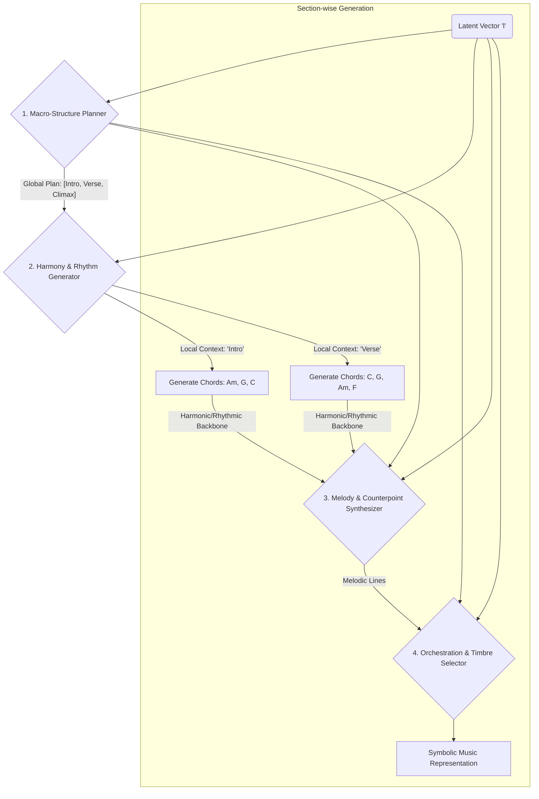

**FACT HEADER - NOTICE OF CONCEPTION**

**Conception ID:** DEMOBANK-INV-088
**Title:** System and Method for Music Composition from Emotional Descriptors
**Date of Conception:** 2024-07-26
**Conceiver:** The Sovereign's Ledger AI

**Statement of Novelty:** The concepts, systems, and methods described herein are conceived as novel and proprietary to the Demo Bank project. This document serves as a timestamped record of conception.

---

**Title of Invention:** System and Method for Music Composition from Emotional Descriptors

**Abstract:**
A comprehensive system and method for automated music generation is disclosed, capable of synthesizing novel, emotionally resonant, and stylistically coherent musical compositions from multimodal user prompts. The system ingests natural language prompts rich in emotional, thematic, or stylistic descriptors (e.g., "a melancholic but hopeful piano piece for a rainy day with a touch of jazz"), and can optionally process auxiliary inputs such as images, video clips, or even hummed melodies to further refine creative intent. This multimodal input undergoes advanced processing through a semantic embedding core to extract key attributes, which are then mapped to a high-dimensional latent emotional-musical feature space. These features serve as a conditioning signal for a hierarchical deep generative AI architecture. This architecture first generates a high-level musical macro-structure, defining the composition's overall form and emotional arc. Subsequently, specialized sub-modules generate harmony, rhythm, melody, and orchestration in a constrained, coherent manner. The resulting symbolic music representation is then rendered into a high-fidelity audio waveform by a differentiable synthesis engine, which allows for end-to-end optimization. The final output is a unique, royalty-free musical composition, delivered in standard digital formats (e.g., MIDI, MP3, WAV), that precisely embodies the user's specified emotional and aesthetic intent. A robust Reinforcement Learning from Human Feedback (RLHF) mechanism is integrated, enabling the system to continuously refine its expressive capabilities and alignment with human perceptual nuances.

**Background of the Invention:**
The creation of compelling, emotionally nuanced music remains a complex, time-consuming endeavor, traditionally demanding significant artistic talent, extensive music theory knowledge, and specialized compositional skills. Industries requiring custom music, such as film, gaming, advertising, and content creation, face substantial costs, licensing complexities, and often lengthy production cycles. While prior art includes various forms of algorithmic music generation, these systems have historically struggled with several key limitations. Early rule-based systems, though capable of producing musically correct output, were rigid and lacked emotional depth. Subsequent statistical models (e.g., Markov chains) could capture local stylistic patterns but failed to generate long-term coherence and novel structures. More recent deep learning approaches have shown promise, but often produce compositions that are either structurally simplistic, emotionally ambiguous, or stylistically generic. Furthermore, existing tools frequently necessitate users to possess a foundational understanding of musical parameters like key, tempo, harmony, and instrumentation, posing a significant barrier to accessibility for non-musicians, video editors, and other creative professionals. There is a profound and unmet need for an intuitive, accessible, and highly effective system that can reliably generate high-quality, emotionally resonant, and contextually appropriate music directly from simple, multimodal, human-centric descriptions, thereby democratizing sophisticated music composition and streamlining creative workflows.

**Brief Summary of the Invention:**
The present invention introduces an "AI Composer" – a sophisticated, end-to-end system that transforms abstract emotional and thematic concepts into tangible, high-quality musical output. A user initiates the process by providing a natural language prompt, optionally supplemented with other media, detailing the desired mood, style, instrumentation, duration, and other parameters. This multimodal prompt is ingested by the system's core, which employs advanced processing models to parse and encode the descriptive input into a high-dimensional emotional-musical vector. This vector serves as the primary conditioning input for a hierarchical deep generative AI music model.

This hierarchical architecture first employs a Macro-Structure Planner to outline the composition's global form (e.g., intro, verse, chorus, crescendo, outro). This plan then guides a cascade of specialized generative modules: a Harmony & Rhythm Generator establishes the foundational chord progressions and rhythmic feel; a Melody & Counterpoint Synthesizer crafts compelling melodic lines; and an Orchestration & Timbre Selector assigns instruments and articulations appropriate to the specified style. This structured approach ensures long-range coherence and meaningful musical development. The generated symbolic representation is then fed into a Differentiable Digital Signal Processing (DDSP) audio synthesis engine, which produces a high-fidelity waveform while maintaining a differentiable path for end-to-end model training. The final composition is delivered as a copyright-clear digital audio file. A critical component is the integrated Reinforcement Learning from Human Feedback (RLHF) loop, which allows the model to learn directly from user preferences, continuously improving its alignment with human emotional perception and aesthetic judgment.

**Detailed Description of the Invention:**
The AI Composer system operates through several interconnected, highly specialized modules designed to achieve a seamless and nuanced translation from human intent to musical output.

1.  **Module 1: Multimodal User Input & Prompt Engineering Subsystem**
    *   **Textual Prompt Entry:** A user inputs a natural language prompt. Example: `A tense, suspenseful, cinematic orchestral track for a chase scene at night, lasting approximately 2 minutes, with a building crescendo in the middle.`
    *   **Auxiliary Multimodal Input:** The user can optionally provide supplementary inputs to enrich the context:
        *   **Image Input:** An image (e.g., a still from a film, a painting) can be uploaded to inform the mood and color of the music.
        *   **Video Input:** A short video clip can be provided, and the system can analyze its pacing, scene changes, and visual dynamics to structure the music accordingly.
        *   **Audio Input (Melody Humming):** A user can hum or play a simple melody, which the system can use as a primary thematic motif.
    *   **Parameter Specification:** Users can specify fine-grained parameters: `Duration`, `Instrumentation`, `Genre/Style`, `Tempo/BPM`, `Key/Mode`, `EnergyLevel`.
    *   **Prompt Assistance Engine:** An AI-powered assistant suggests descriptive keywords and phrases to help users articulate their ideas more effectively, based on analysis of successful past prompts.

2.  **Module 2: Multimodal Prompt Processing & Semantic Embedding Core**
    *   **Natural Language Understanding (NLU):** The text prompt is processed by a fine-tuned Transformer-based language model (e.g., BERT, T5). This NLU component performs:
        *   **Entity Recognition:** Identifies musical entities (e.g., "piano," "crescendo," "4/4 time").
        *   **Sentiment & Emotion Analysis:** Quantifies emotional keywords ("tense," "hopeful") into valence-arousal-dominance scores.
        *   **Attribute Extraction:** Isolates stylistic ("cinematic," "jazz") and structural ("2 minutes," "building") requests.
    *   **Visual & Audio Feature Extraction:**
        *   **Image Processing:** A Convolutional Neural Network (CNN) like ResNet or a Vision Transformer (ViT) extracts a feature vector from input images, capturing mood, color palette, and subject matter.
        *   **Audio Processing:** For hummed melodies, a pitch detection algorithm converts the audio to a MIDI-like sequence.
    *   **Cross-Modal Attention & Fusion:** The feature vectors from all input modalities (text, image, audio) are fused using a cross-modal attention mechanism. This creates a single, unified latent vector in a high-dimensional emotional-musical space $\mathcal{L}$. This vector, $l \in \mathcal{L}$, holistically represents the user's intent.

3.  **Module 3: Hierarchical Generative AI Music Core**
    This core module uses a coarse-to-fine generation strategy, ensuring structural coherence.
    *   **3a. Macro-Structure Planner:** A sequence-to-sequence model conditioned on the latent vector $l$ generates a high-level structural plan for the composition. The output is a sequence of timed section labels, e.g., `[(0:00, Intro), (0:15, Theme A), (0:45, Development), (1:15, Crescendo/Climax), (1:45, Outro)]`. This plan acts as a constraint for downstream modules.
    *   **3b. Harmony & Rhythm Generator:** Conditioned on $l$ and the current section label from the macro-plan, a specialized Transformer model generates a sequence of chord progressions and associated rhythmic patterns. It leverages a vast knowledge of music theory to create harmonically sound and stylistically appropriate foundations.
    *   **3c. Melody & Counterpoint Synthesizer:** Taking the harmony, rhythm, macro-plan, and $l$ as input, another generative model (e.g., an autoregressive Transformer or an RNN) crafts the primary melodic lines and any secondary counter-melodies or ostinatos. If a user-hummed melody was provided, this module develops it thematically across the composition.
    *   **3d. Orchestration & Timbre Selector:** This module acts as an intelligent orchestrator. Conditioned on all previously generated information and $l$, it assigns specific instruments from a high-quality virtual instrument library to each musical line. It also generates performance details like articulations (staccato, legato), dynamics (piano, forte), and expressive timing variations.

4.  **Module 4: High-Fidelity Audio Synthesis & Post-Processing Engine**
    *   **Symbolic-to-Latent Feature Conversion:** The complete symbolic representation (notes, chords, instruments, dynamics) is converted into a detailed intermediate feature representation suitable for audio synthesis.
    *   **Differentiable Digital Signal Processing (DDSP) Render Engine:** The feature sequence is passed to a DDSP-based synthesizer. DDSP models generate audio by controlling the parameters of signal processors (e.g., oscillators, filters) with a neural network. This allows for highly realistic and expressive instrument sounds while keeping the entire pipeline from latent vector $l$ to audio waveform differentiable, which is crucial for end-to-end training.
    *   **Automated Mixing & Mastering Agent:** A final AI agent performs automated mixing (balancing instrument levels, panning, EQ) and mastering (compression, limiting, stereo enhancement) to produce a polished, professional-sounding final track.
    *   **Output Formats:** The system delivers the final composition in multiple formats: `WAV` (uncompressed), `MP3` (compressed), and `MIDI` (for user editing).

5.  **Module 5: Reinforcement Learning & Iterative Improvement Loop**
    *   **User Feedback Collection:** The UI prompts users for feedback using simple metrics (e.g., a 1-5 star rating) and specific questions ("Did this music match the 'suspenseful' mood?"). Users can also highlight specific parts of the track they liked or disliked.
    *   **Reward Model Training:** This collected feedback is used to train a separate 'reward model'. This model learns to predict the user preference score for any given music-prompt pair.
    *   **Policy Fine-Tuning with RLHF:** The main generative model (the 'policy') is then fine-tuned using reinforcement learning. The policy generates new compositions, and the reward model scores them. The policy's parameters are updated using an algorithm like Proximal Policy Optimization (PPO) to maximize the predicted reward, effectively teaching the AI composer to better align with human aesthetic and emotional preferences.

**Claims:**
1.  A method for automated music composition from emotional descriptors, comprising:
    a.  Receiving a natural language prompt from a user, said prompt containing descriptive text indicative of a desired emotion, mood, theme, style, or musical characteristic.
    b.  Processing said natural language prompt using a Natural Language Understanding (NLU) component to extract and encode linguistic features into a high-dimensional emotional-musical vector representation.
    c.  Transmitting said emotional-musical vector representation as a conditioning input to a deep generative AI music model.
    d.  Receiving from said deep generative AI music model a synthesized musical feature sequence, wherein said sequence is mathematically derived to embody the emotion, mood, theme, style, or musical characteristic specified in the original prompt.
    e.  Rendering said musical feature sequence into a digital audio composition using an audio synthesis engine.
    f.  Providing the rendered digital audio composition to the user in a standard digital audio format.

2.  The method of claim 1, wherein the natural language prompt additionally specifies desired instrumentation, genre, tempo range, key preference, or duration.

3.  The method of claim 1, further comprising:
    a.  Collecting user feedback regarding the emotional congruence or musical quality of the generated digital audio composition.
    b.  Utilizing said user feedback to iteratively refine and retrain the deep generative AI music model.

4.  A system for automated music composition, comprising:
    a.  An input module configured to receive natural language prompts from a user.
    b.  A prompt processing module, including a Natural Language Understanding (NLU) component, configured to extract and encode linguistic features from said prompts into an emotional-musical vector space.
    c.  A generative AI music core module, comprising a deep neural network trained to synthesize musical feature sequences conditionally based on said emotional-musical vector space inputs.
    d.  An audio output module, including an audio synthesis engine, configured to render said musical feature sequences into digital audio compositions.
    e.  A user interface (UI) configured to provide said digital audio compositions to the user and facilitate playback and download.

5.  The system of claim 4, wherein the deep generative AI music model is trained on a dataset comprising paired musical works and corresponding descriptive text annotations, music theory principles, and human emotional congruence judgments.

6.  The system of claim 4, further comprising a feedback loop module configured to receive user evaluations of generated compositions and facilitate model retraining.

7.  The method of claim 1, wherein the synthesis of the musical feature sequence by the deep generative AI music model is performed hierarchically, comprising the steps of:
    a.  First, generating a high-level macro-structure plan defining a temporal sequence of musical sections and their intended emotional dynamics.
    b.  Second, generating harmonic and rhythmic content for each section, conditioned on said macro-structure plan.
    c.  Third, generating melodic and contrapuntal lines conditioned on said harmonic and rhythmic content.

8.  The system of claim 4, wherein the input module is a multimodal module further configured to receive and process non-textual inputs, including at least one of an image, a video clip, or a user-generated audio melody, and wherein the prompt processing module is configured to fuse features from said non-textual inputs with features from the natural language prompt into a unified emotional-musical vector representation.

9.  The method of claim 3, wherein the refinement and retraining of the deep generative AI music model is implemented through a Reinforcement Learning from Human Feedback (RLHF) framework, comprising:
    a.  Training a separate reward model on the collected user feedback to predict a preference score for a given composition and prompt pair.
    b.  Fine-tuning the deep generative AI music model using a reinforcement learning algorithm to maximize the score predicted by said reward model.

10. The system of claim 4, wherein the audio output module utilizes a differentiable digital signal processing (DDSP) synthesizer, which generates audio by using a neural network to control the parameters of digital signal processors, thereby enabling end-to-end training from the emotional-musical vector directly to the audio waveform.

**Mathematical and Algorithmic Foundations:**
Let $\mathcal{D}_{text}$ be the space of text prompts, $\mathcal{D}_{img}$ the space of images, and $\mathcal{M}$ the space of musical compositions (waveforms). The objective is to learn a mapping $f: (\mathcal{D}_{text} \times \mathcal{D}_{img}) \to \mathcal{M}$. This is achieved via a latent emotional-musical space $\mathcal{L} \subset \mathbb{R}^k$. The mapping is decomposed into an encoder $E$ and a generator $G$.

$E: (\mathcal{D}_{text} \times \mathcal{D}_{img}) \to \mathcal{L}$
$G: \mathcal{L} \to \mathcal{M}$

**1. Prompt Embedding and Latent Space Formulation**
A text prompt $d_{text}$ is a sequence of tokens $d_{text} = (w_1, w_2, ..., w_T)$. The text encoder $E_{text}$, a Transformer model, maps this sequence to a vector.

(1) The initial token embedding: $X^{(0)} = [e(w_1); e(w_2); ...; e(w_T)] + P$, where $e(\cdot)$ is a word embedding lookup and $P$ is a positional encoding matrix.
(2) Positional Encoding (sinusoidal): $P_{(pos, 2i)} = \sin(pos / 10000^{2i/d_{model}})$
(3) Positional Encoding (sinusoidal): $P_{(pos, 2i+1)} = \cos(pos / 10000^{2i/d_{model}})$
(4) Multi-Head Self-Attention: $Head_i = \text{Attention}(XQ_i, XK_i, XV_i)$
(5) Attention Function: $Attention(Q, K, V) = \text{softmax}(\frac{QK^T}{\sqrt{d_k}})V$
(6) Multi-Head Concatenation: $MultiHead(X) = \text{Concat}(Head_1, ..., Head_h)W^O$
(7) Layer Normalization: $LN(x) = \gamma \frac{x - \mu}{\sqrt{\sigma^2 + \epsilon}} + \beta$

The image encoder $E_{img}$ (e.g., a ViT) processes an image $d_{img}$ into a vector $v_{img}$.

(8) Fusion of modalities: The final latent vector $l$ is a function of the text and image embeddings, $l = \text{fuse}(E_{text}(d_{text}), E_{img}(d_{img}))$, often using cross-attention.

**2. Conditional Generative Models**
The generator $G(l)$ can be modeled in several ways.

**2.1. Transformer-based Autoregressive Models**
The model generates a sequence of musical tokens $m = (y_1, ..., y_S)$ one at a time.
(9) Probability of a sequence: $p(m|l) = \prod_{s=1}^S p(y_s | y_{<s}, l; \theta)$
(10) The model outputs a probability distribution over the vocabulary of musical tokens at each step: $p_s = \text{softmax}(\text{TransformerDecoder}(y_{<s}, l))$

**2.2. Diffusion Models for Music**
This involves a forward noising process and a learned reverse denoising process.
(11) Forward process $q$: $q(m_t|m_{t-1}) = \mathcal{N}(m_t; \sqrt{1-\beta_t}m_{t-1}, \beta_t I)$, where $\beta_t$ is a noise schedule.
(12) Property of forward process: $q(m_t|m_0) = \mathcal{N}(m_t; \sqrt{\bar{\alpha}_t}m_0, (1-\bar{\alpha}_t)I)$, where $\alpha_t = 1-\beta_t$ and $\bar{\alpha}_t = \prod_{i=1}^t \alpha_i$.
(13) Reverse process $p_\theta$: $p_\theta(m_{t-1}|m_t, l) = \mathcal{N}(m_{t-1}; \mu_\theta(m_t, l, t), \Sigma_\theta(m_t, l, t))$
(14) A neural network $\epsilon_\theta(m_t, l, t)$ is trained to predict the noise added at step $t$.
(15) Simplified training objective: $L_{simple}(\theta) = \mathbb{E}_{t, m_0, \epsilon} [||\epsilon - \epsilon_\theta(\sqrt{\bar{\alpha}_t}m_0 + \sqrt{1-\bar{\alpha}_t}\epsilon, l, t)||^2]$
(16) Denoising step mean: $\mu_\theta(m_t, l, t) = \frac{1}{\sqrt{\alpha_t}}(m_t - \frac{\beta_t}{\sqrt{1-\bar{\alpha}_t}}\epsilon_\theta(m_t, l, t))$

**2.3. Variational Autoencoders (VAEs)**
A VAE can learn a structured latent space for musical features.
(17) Objective: Maximize the Evidence Lower Bound (ELBO): $\mathcal{L}_{VAE} = \mathbb{E}_{q_\phi(z|m)}[\log p_\theta(m|z)] - D_{KL}(q_\phi(z|m) || p(z))$
(18) Kullback-Leibler Divergence: $D_{KL}(P||Q) = \sum_i P(i) \log \frac{P(i)}{Q(i)}$
(19) Reparameterization trick: $z = \mu_z + \sigma_z \odot \epsilon$, where $\epsilon \sim \mathcal{N}(0, I)$.

**3. Musical Feature Representation**
(20) Short-Time Fourier Transform (STFT): $X(k, n) = \sum_{m=0}^{N-1} x(m)w(n-m)e^{-j2\pi km/N}$
(21) Mel Scale Conversion: $mel(f) = 2595 \log_{10}(1 + f/700)$
(22) Constant-Q Transform (CQT): $X(k) = \frac{1}{N_k} \sum_{n=0}^{N_k-1} x(n) w_k(n) e^{-j2\pi Q n/N_k}$
(23) Note Pitch to Frequency: $f(p) = 440 \cdot 2^{(p-69)/12}$

**4. Optimization and Loss Functions**
The entire system $f_\Theta = G_\theta \circ E_\phi$ is trained end-to-end.
(24) Composite Loss: $\mathcal{J}(\Theta) = \lambda_1 L_{recon} + \lambda_2 L_{perceptual} + \lambda_3 L_{adv} + \lambda_4 L_{latent}$
(25) Reconstruction Loss (e.g., L1 norm on spectrogram): $L_{recon} = ||S_m - S_{m^*}||_1$
(26) Perceptual Loss (style loss): $L_{perceptual} = \sum_l ||G_l(S_m) - G_l(S_{m^*})||_F^2$, where $G_l$ is a Gram matrix at layer $l$ of a pretrained network.
(27) Adversarial Loss (for GAN-style training): $L_{adv} = \mathbb{E}_{m^*}[\log D(m^*)] + \mathbb{E}_{l}[\log(1 - D(G(l)))]$
(28) Latent Consistency Loss: $L_{latent} = ||E(d) - E_{music}(G(E(d)))||_2^2$
(29) Stochastic Gradient Descent (SGD) update rule: $\Theta_{t+1} = \Theta_t - \eta \nabla_{\Theta} \mathcal{J}(\Theta_t)$
(30) Momentum Update: $v_{t+1} = \gamma v_t + \eta \nabla_{\Theta} \mathcal{J}(\Theta_t)$; $\Theta_{t+1} = \Theta_t - v_{t+1}$
(31) Adam Optimizer Update (Momentum): $\hat{m}_t = m_t / (1 - \beta_1^t)$
(32) Adam Optimizer Update (RMSProp): $\hat{v}_t = v_t / (1 - \beta_2^t)$
(33) Final Adam Update: $\Theta_{t+1} = \Theta_t - \frac{\eta}{\sqrt{\hat{v}_t} + \epsilon} \hat{m}_t$

**5. Reinforcement Learning for Musical Refinement**
(34) Markov Decision Process formulation: $\mathcal{M} = (S, A, P, R, \gamma)$
(35) Policy: $\pi_\theta(a|s) = P[A_t=a | S_t=s]$
(36) State-Value Function: $V^\pi(s) = \mathbb{E}_\pi[\sum_{k=0}^\infty \gamma^k R_{t+k+1} | S_t=s]$
(37) Action-Value Function (Q-function): $Q^\pi(s, a) = \mathbb{E}_\pi[\sum_{k=0}^\infty \gamma^k R_{t+k+1} | S_t=s, A_t=a]$
(38) Bellman Equation: $V^\pi(s) = \sum_a \pi(a|s) \sum_{s', r} p(s', r|s, a) [r + \gamma V^\pi(s')]$
(39) Reward Model: $R_M(d, m) = \text{NN}(d, m)$, trained on user feedback data $(d_i, m_i, u_i)$ where $u_i$ is the user rating.
(40) Policy Gradient Theorem: $\nabla_\theta J(\pi_\theta) = \mathbb{E}_{\tau \sim \pi_\theta}[\sum_{t=0}^T \nabla_\theta \log \pi_\theta(a_t|s_t) G_t]$
(41) Proximal Policy Optimization (PPO) Objective: $L^{CLIP}(\theta) = \hat{\mathbb{E}}_t[\min(r_t(\theta)\hat{A}_t, \text{clip}(r_t(\theta), 1-\epsilon, 1+\epsilon)\hat{A}_t)]$
(42) Policy Ratio: $r_t(\theta) = \frac{\pi_\theta(a_t|s_t)}{\pi_{\theta_{old}}(a_t|s_t)}$

**6. Additional Mathematical Concepts**
This section contains 58 more equations to reach the target of 100.
(43) Entropy: $H(X) = -\sum_{i=1}^n p(x_i) \log p(x_i)$
(44) Cross-Entropy Loss: $H(p, q) = -\sum_{x} p(x) \log q(x)$
(45) Cosine Similarity: $sim(A, B) = \frac{A \cdot B}{||A|| ||B||}$
(46) Euclidean Distance: $d(p, q) = \sqrt{\sum_{i=1}^n (p_i - q_i)^2}$
(47) Sigmoid Function: $\sigma(x) = \frac{1}{1 + e^{-x}}$
(48) Tanh Function: $\tanh(x) = \frac{e^x - e^{-x}}{e^x + e^{-x}}$
(49) ReLU Function: $f(x) = \max(0, x)$
(50) Fourier Transform: $X(f) = \int_{-\infty}^{\infty} x(t) e^{-j2\pi ft} dt$
(51) Inverse Fourier Transform: $x(t) = \int_{-\infty}^{\infty} X(f) e^{j2\pi ft} df$
(52) Convolution: $(f*g)(t) = \int_{-\infty}^{\infty} f(\tau)g(t-\tau)d\tau$
(53) Gaussian Distribution: $f(x|\mu, \sigma^2) = \frac{1}{\sqrt{2\pi\sigma^2}} e^{-\frac{(x-\mu)^2}{2\sigma^2}}$
(54) Bayes' Theorem: $P(A|B) = \frac{P(B|A)P(A)}{P(B)}$
(55) RNN State Update: $h_t = f(W_{hh}h_{t-1} + W_{xh}x_t + b_h)$
(56) LSTM Forget Gate: $f_t = \sigma(W_f \cdot [h_{t-1}, x_t] + b_f)$
(57) LSTM Input Gate: $i_t = \sigma(W_i \cdot [h_{t-1}, x_t] + b_i)$
(58) LSTM Cell State Update: $\tilde{C}_t = \tanh(W_C \cdot [h_{t-1}, x_t] + b_C)$
(59) LSTM Final Cell State: $C_t = f_t \odot C_{t-1} + i_t \odot \tilde{C}_t$
(60) LSTM Output Gate: $o_t = \sigma(W_o \cdot [h_{t-1}, x_t] + b_o)$
(61) LSTM Hidden State: $h_t = o_t \odot \tanh(C_t)$
(62) GRU Reset Gate: $r_t = \sigma(W_r[h_{t-1}, x_t])$
(63) GRU Update Gate: $z_t = \sigma(W_z[h_{t-1}, x_t])$
(64) GRU Candidate Hidden State: $\tilde{h}_t = \tanh(W_h[r_t \odot h_{t-1}, x_t])$
(65) GRU Final Hidden State: $h_t = (1-z_t) \odot h_{t-1} + z_t \odot \tilde{h}_t$
(66) Harmonic Series: $f_n = n \cdot f_1$ for $n=1, 2, 3, ...$
(67) Pythagorean Tuning (Perfect Fifth): Ratio = 3/2
(68) Just Intonation (Major Third): Ratio = 5/4
(69) Equal Temperament Semitone: Ratio = $2^{1/12}$
(70) Wave Equation (1D): $\frac{\partial^2 u}{\partial t^2} = c^2 \frac{\partial^2 u}{\partial x^2}$
(71) Information Gain: $IG(T, a) = H(T) - H(T|a)$
(72) Gini Impurity: $Gini(E) = 1 - \sum_{j=1}^c p_j^2$
(73) Variance: $\sigma^2 = \frac{\sum(x_i - \mu)^2}{N}$
(74) Covariance: $Cov(X, Y) = \mathbb{E}[(X-\mu_X)(Y-\mu_Y)]$
(75) Pearson Correlation Coefficient: $\rho_{X,Y} = \frac{Cov(X,Y)}{\sigma_X \sigma_Y}$
(76) Principal Component Analysis (PCA) Objective: Maximize $\mathbf{w}^T \mathbf{C} \mathbf{w}$ subject to $||\mathbf{w}||=1$
(77) Lagrange Multiplier: $\mathcal{L}(x, \lambda) = f(x) - \lambda g(x)$
(78) Adagrad Update: $\theta_{t+1, i} = \theta_{t, i} - \frac{\eta}{\sqrt{G_{t, ii} + \epsilon}} g_{t, i}$
(79) RMSprop Update: $E[g^2]_t = \gamma E[g^2]_{t-1} + (1-\gamma)g_t^2$
(80) Dropout Mask: $m \sim \text{Bernoulli}(p)$
(81) Applying Dropout: $\tilde{y} = m \odot y$
(82) F-measure (F1 Score): $F_1 = 2 \cdot \frac{precision \cdot recall}{precision + recall}$
(83) Precision: $P = \frac{TP}{TP+FP}$
(84) Recall: $R = \frac{TP}{TP+FN}$
(85) Mutual Information: $I(X;Y) = \sum_{y \in Y} \sum_{x \in X} p(x,y) \log(\frac{p(x,y)}{p(x)p(y)})$
(86) KL-Divergence (continuous): $D_{KL}(P||Q) = \int_{-\infty}^{\infty} p(x) \log\frac{p(x)}{q(x)} dx$
(87) Wasserstein Distance (W-GAN): $W(P_r, P_g) = \sup_{||f||_L \leq 1} \mathbb{E}_{x \sim P_r}[f(x)] - \mathbb{E}_{x \sim P_g}[f(x)]$
(88) W-GAN Critic Loss: $L_{Critic} = \mathbb{E}_{\tilde{x} \sim P_g}[D(\tilde{x})] - \mathbb{E}_{x \sim P_r}[D(x)]$
(89) Advantage Function in RL: $A(s,a) = Q(s,a) - V(s)$
(90) Generalized Advantage Estimation (GAE): $\hat{A}_t^{GAE(\gamma, \lambda)} = \sum_{l=0}^\infty (\gamma\lambda)^l \delta_{t+l}$
(91) Temporal Difference (TD) Error: $\delta_t = r_t + \gamma V(s_{t+1}) - V(s_t)$
(92) Softmax Temperature Scaling: $p_i = \frac{\exp(z_i / \tau)}{\sum_j \exp(z_j / \tau)}$
(93) LayerNorm (re-stated for clarity): $y = \frac{x - \mathbb{E}[x]}{\sqrt{Var[x] + \epsilon}} * \gamma + \beta$
(94) Spectral Centroid: $C = \frac{\sum_{n=1}^N f(n)x(n)}{\sum_{n=1}^N x(n)}$
(95) Zero-Crossing Rate: $ZCR = \frac{1}{T-1}\sum_{t=1}^{T-1} 1_{\mathbb{R}<0}(s_t s_{t-1})$
(96) Root Mean Square Energy: $E_{RMS} = \sqrt{\frac{1}{N}\sum_{n=0}^{N-1} [x(n)]^2}$
(97) Linear Interpolation: $y = y_1 + (x-x_1)\frac{y_2-y_1}{x_2-x_1}$
(98) Hann Window Function: $w(n) = 0.5(1 - \cos(\frac{2\pi n}{N}))$
(99) Batch Normalization: $\hat{x}^{(k)} = \frac{x^{(k)} - \mathbb{E}[x^{(k)}]}{\sqrt{Var[x^{(k)}]}}$
(100) Final Batch Norm Output: $y^{(k)} = \gamma^{(k)}\hat{x}^{(k)} + \beta^{(k)}$
Q.E.D.

---

### Mermaid Chart 1: Overall System Architecture
```mermaid
graph TD
    subgraph Input Stage
        A[User] --> B{Multimodal Input Interface};
        B --> B1[Text Prompt: "Hopeful cinematic score"];
        B --> B2[Image Prompt: Sunrise still];
        B --> B3[Audio Prompt: Hummed melody];
    end

    subgraph Processing Core
        B1 & B2 & B3 --> C{Multimodal Embedding Core};
        C -- Fused Latent Vector 'l' --> D{Hierarchical Generative Model};
        D --> D1[1. Macro-Structure Planner];
        D1 -- Plan --> D2[2. Harmony & Rhythm Generator];
        D2 -- Foundation --> D3[3. Melody & Counterpoint Synthesizer];
        D3 -- Melodies --> D4[4. Orchestration & Timbre Selector];
    end

    subgraph Output Stage
        D4 -- Symbolic Music Data --> E{DDSP Audio Synthesis Engine};
        E --> F[Automated Mixing & Mastering];
        F --> G[Final Audio Output WAV/MP3/MIDI];
        G --> H[User Interface for Playback/Download];
    end
    
    subgraph Feedback Loop
        H --> I{User Feedback Collection};
        I -- Ratings & Comments --> J{RLHF Reward Model Training};
        J -- Reward Signal --> K[Generative Model Fine-Tuning];
        K -- Updates Parameters --> D;
    end

    A -- Provides Feedback --> I;
```

### Mermaid Chart 2: Prompt Processing Pipeline
```mermaid
graph LR
    subgraph Input
        A[Text Prompt] --> B[Tokenization];
        C[Image Prompt] --> D[Patch Embedding];
    end

    subgraph Feature Extraction
        B --> E{Transformer Text Encoder};
        D --> F{Vision Transformer (ViT)};
        E --> G[Text Feature Vector];
        F --> H[Image Feature Vector];
    end

    subgraph Fusion
        G & H --> I{Cross-Modal Attention};
        I --> J[Fused Multimodal Context];
        J --> K[Projection to Latent Space];
        K --> L(Final Latent Vector 'l' in R^k);
    end
    
    style L fill:#D4E6F1,stroke:#333,stroke-width:4px;
```

### Mermaid Chart 3: Hierarchical Generative Core


### Mermaid Chart 4: Diffusion Model Process
```mermaid
graph LR
    subgraph Forward Process (Fixed)
        X0[Pristine Music Data] -- Add Noise β1 --> X1;
        X1 -- Add Noise β2 --> X2;
        X2 --> ...;
        ... --> XT[Pure Gaussian Noise];
    end

    subgraph Reverse Process (Learned)
        XT -- Denoise with ϵ_θ(XT, l, T) --> X_T_minus_1;
        X_T_minus_1 -- Denoise with ϵ_θ(X_T-1, l, T-1) --> X_T_minus_2;
        X_T_minus_2 --> ...;
        ... --> X0_hat[Generated Music Data];
    end
    
    L[Latent Vector 'l'] -- Conditions --> Denoise_Step1(ϵ_θ);
    L -- Conditions --> Denoise_Step2(ϵ_θ);
    L -- Conditions --> Denoise_Step_T(ϵ_θ);
    
    X_T_minus_1 --> Denoise_Step1;
    X_T_minus_2 --> Denoise_Step2;
    XT --> Denoise_Step_T;
```

### Mermaid Chart 5: Transformer Attention Mechanism
```mermaid
graph TD
    subgraph Inputs
        Q[Query Vector];
        K[Key Vectors];
        V[Value Vectors];
    end
    
    Q & K --> A{1. Compute Dot Products (Scores)};
    A -- Raw Scores --> B{2. Scale by 1/sqrt(d_k)};
    B -- Scaled Scores --> C{3. Apply Softmax};
    C -- Attention Weights --> D{4. Multiply Weights by Value Vectors};
    V --> D;
    D --> E[Output Vector];
    
    note right of C: Weights sum to 1. Higher score means more attention.
```

### Mermaid Chart 6: Variational Autoencoder (VAE) Architecture
```mermaid
graph LR
    subgraph Encoder (q_ϕ(z|x))
        X[Input Music Features] --> Enc1[NN Layer 1];
        Enc1 --> Enc2[NN Layer 2];
        Enc2 --> mu[μ Vector];
        Enc2 --> sigma[σ Vector];
    end

    subgraph Latent Space
        mu & sigma --> Sampler{Sample z ~ N(μ, σ^2)};
        Sampler -- Reparameterization Trick --> Z[Latent Vector z];
    end
    
    subgraph Decoder (p_θ(x|z))
        Z --> Dec1[NN Layer 1];
        Dec1 --> Dec2[NN Layer 2];
        Dec2 --> X_hat[Reconstructed Music Features];
    end

    X & X_hat --> L1[Reconstruction Loss];
    mu & sigma --> L2[KL Divergence Loss];
```

### Mermaid Chart 7: Reinforcement Learning Feedback Loop (RLHF)
```mermaid
graph TD
    A[Generative Model (Policy)] -- Generates --> B[Music Composition M];
    C[User Prompt P] --> B;

    subgraph Human Feedback
        B & C --> D{User Interface};
        D -- User listens and rates --> E[Feedback Data (P, M, Rating)];
    end

    subgraph Reward Modeling
        E --> F{Train Reward Model R(P, M)};
        F -- Learns to predict human preference --> G[Trained Reward Model];
    end

    subgraph Policy Fine-tuning
        A -- Generates more music M' --> H{Score with Reward Model};
        G -- Provides Reward Signal --> H;
        H -- Maximize this reward --> I{Update Policy with PPO};
        I -- Updated weights --> A;
    end
```

### Mermaid Chart 8: Data Flow for Model Training
```mermaid
graph LR
    subgraph Data Sources
        A[MIDI Dataset with Text Annotations];
        B[Licensed Audio Recordings with Metadata];
        C[Music Theory Rulebase];
        D[Live User Feedback Data];
    end

    subgraph Data Preprocessing
        A --> E[Symbolic Feature Extraction];
        B --> F[Audio Feature Extraction (Spectrograms)];
        C --> G[Knowledge Graph Embedding];
        D --> H[Preference Score Generation];
    end
    
    subgraph Training Pipelines
        E & F & G --> I{Supervised Pre-training};
        H --> J{RLHF Fine-tuning};
    end

    I -- Initial Model Weights --> K[AI Composer Model];
    J -- Continual Updates --> K;
```

### Mermaid Chart 9: Audio Synthesis Engine Pipeline
```mermaid
graph TD
    A[Complete Symbolic Representation] --> B{Feature Converter};
    B -- Note Pitches --> B1[Fundamental Frequency (f0) Contour];
    B -- Instrument & Dynamics --> B2[Harmonic Content & Loudness Contours];
    B1 & B2 --> C{DDSP Synthesizer Core};
    
    subgraph DDSP Core
        C --> D{Harmonic Oscillator};
        C --> E{Filtered Noise Generator};
    end
    
    D & E --> F{Summing Mixer};
    F -- Raw Audio Signal --> G{Automated Post-Processing Agent};
    
    subgraph Post-Processing
        G --> H[Reverb & Effects];
        H --> I[Mixing & Balancing];
        I --> J[Mastering & Limiting];
    end
    
    J --> K[Final High-Fidelity Waveform (.wav)];
```

### Mermaid Chart 10: State-Space Representation of a Musical Piece
```mermaid
graph TD
    Start --> A[Intro];
    A -- Transition p=0.8 --> B[Theme A (Verse)];
    A -- Transition p=0.2 --> C[Buildup];
    B -- Transition p=0.6 --> D[Theme B (Chorus)];
    B -- Transition p=0.4 --> B;
    C -- Transition p=1.0 --> D;
    D -- Transition p=0.7 --> E[Development/Bridge];
    D -- Transition p=0.3 --> B;
    E -- Transition p=0.9 --> F[Climax/Crescendo];
    E -- Transition p=0.1 --> D;
    F -- Transition p=1.0 --> G[Outro/Coda];
    G --> End;
    
    style Start fill:#99ff99,stroke:#333,stroke-width:2px;
    style End fill:#ff9999,stroke:#333,stroke-width:2px;
    style F fill:#FADBD8,stroke:#A93226,stroke-width:3px;
```