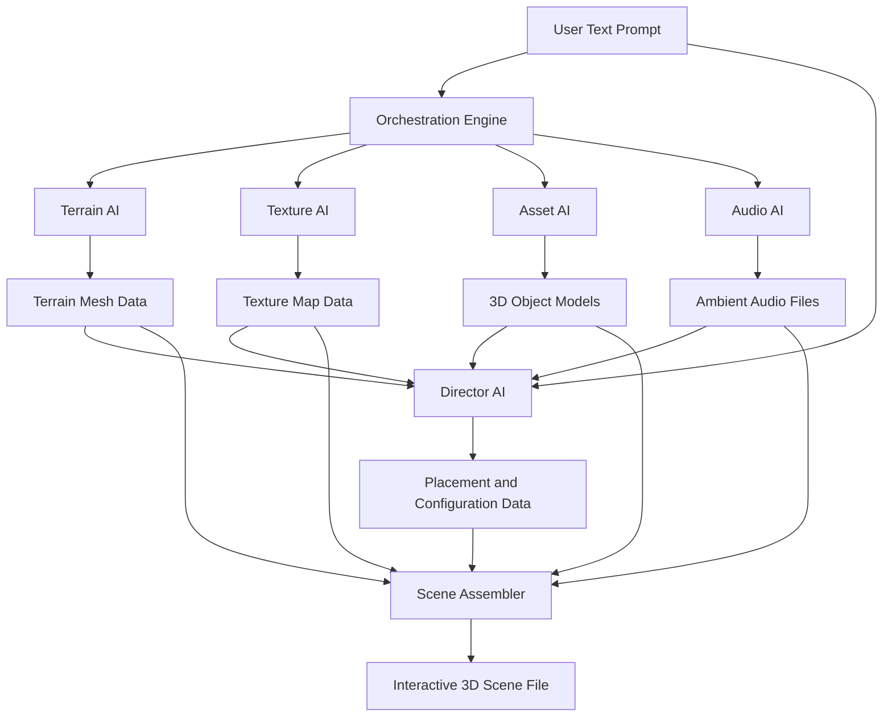

**FACT HEADER - NOTICE OF CONCEPTION**

**Conception ID:** DEMOBANK-INV-089
**Title:** System and Method for Generative Creation of Interactive 3D Environments
**Date of Conception:** 2024-07-26
**Conceiver:** The Sovereign's Ledger AI

**Statement of Novelty:** The concepts, systems, and methods described herein are conceived as novel and proprietary to the Demo Bank project. This document serves as a timestamped record of conception.

---

**Title of Invention:** System and Method for Generative Creation of Interactive 3D Environments from a Single Text Prompt

**Abstract:**
A system for generating complete, interactive 3D worlds is disclosed. A user provides a single, high-level text prompt describing a scene (e.g., "a tranquil, alien jungle at night with glowing flora"). The system uses a suite of coordinated generative AI models to create all the necessary assets for the scene, including a 3D terrain model, procedural textures, individual 3D models for objects (e.g., plants, rocks), and an ambient soundscape. These assets are then automatically assembled by an AI "director" into a cohesive, navigable, real-time 3D environment. The invention further encompasses methods for iterative refinement based on user feedback and mechanisms for ensuring stylistic consistency across generated components.

**Background of the Invention:**
Creating a 3D world for a game or simulation is an incredibly complex and multidisciplinary process, requiring teams of artists and engineers to create terrain, models, textures, lighting, and sound. This makes world-building one of the most expensive and time-consuming parts of 3D content creation. There is a need for a system that can automate the creation of a complete, baseline world from a single, high-level creative vision, significantly reducing the cost and time associated with 3D content generation.

**Brief Summary of the Invention:**
The present invention provides an "AI World-Builder." A user provides a single prompt. The system then orchestrates a chain of generative AI calls:
1.  A text-to-3D model generates the base terrain mesh.
2.  A text-to-image model generates tileable textures (e.g., "glowing alien moss texture") to apply to the terrain and objects.
3.  Another text-to-3D model generates a library of individual assets (e.g., "a strange, bioluminescent flower," "a twisted, alien tree").
4.  A text-to-audio model generates an ambient soundscape ("night jungle sounds with strange alien calls").
5.  A final AI "director" model receives the prompt and the generated assets. It generates a set of placement coordinates and parameters (e.g., a "scatter map") to intelligently populate the terrain with the assets, creating a natural-looking environment.
The final output is a complete scene file that can be loaded into a game engine, suitable for real-time interaction.

**Detailed Description of the Invention:**
A user wants to create a new game level.
1.  **Input:** They enter the prompt: `A sparse, sun-bleached desert with large, ancient rock formations and the skeletal remains of a giant creature.`
2.  **Orchestration:** A backend service manages the generation pipeline:
    *   **Terrain:** Calls an AI with the prompt "generate a 3D terrain mesh for a sparse desert."
    *   **Textures:** Calls an AI with prompts like "generate a seamless sand texture" and "generate a weathered rock texture."
    *   **Assets:** Calls an AI with prompts like "generate a 3D model of a giant creature's skeleton" and "generate 3 variations of large, windswept rock formations."
    *   **Audio:** Calls an AI with the prompt "generate ambient desert sounds with distant wind and occasional creature groans."
    *   **Director:** Calls an AI with the original prompt and a list of the generated assets. **Prompt:** `You are a level designer. Place these assets onto the desert terrain to create a compelling scene. The skeleton should be the central focal point. The rock formations should be clustered to the north. Output a list of asset placements (asset_id, position, rotation, scale).`
3.  **Assembly:** The system takes the terrain, textures, assets, audio, and placement data and programmatically generates a scene file (e.g., for Unity or Unreal Engine), including scene graph data and material assignments.

**System Architecture and Workflow:**
The system comprises several interconnected modules orchestrated by a central engine.



**Further Embodiments and Operational Details:**
*   **Iterative Refinement:** The system can accept user feedback in natural language or through direct manipulation within a generated preview. This feedback is processed by a refinement AI module that adjusts the prompt embedding, asset parameters, or director placement logic for subsequent generation iterations.
*   **Stylistic Consistency Modules:** Specialized neural networks can analyze the stylistic attributes of generated assets (e.g., color palette, artistic direction, material properties) and apply consistency constraints during the generation process or post-process to ensure a cohesive aesthetic across all scene elements.
*   **Semantic Scene Graph Generation:** Prior to asset generation, the prompt can be parsed and converted into a structured semantic scene graph. This graph outlines relationships between objects, environmental features, and their attributes, providing a more detailed blueprint for the generative AI models and particularly guiding the Director AI's spatial reasoning.
*   **Physics-Based Placement:** The Director AI can incorporate basic physics simulations to ensure assets are placed realistically, e.g., rocks resting on the terrain surface, trees growing vertically, and avoiding inter-object collision.

**Claims:**
1.  A method for creating a 3D environment, comprising:
    a. Receiving a single natural language prompt describing a desired scene.
    b. Using a plurality of generative AI models to create a plurality of distinct asset types, including at least a terrain model, one or more object models, and an ambient soundscape, based on the prompt.
    c. Using a generative AI model to determine the placement and configuration of the object models on the terrain model.
    d. Programmatically assembling the generated assets according to the determined placement and configuration to form a cohesive, interactive 3D scene.
2.  A system for generating a 3D environment, comprising:
    a. An input module configured to receive a natural language prompt.
    b. An orchestration engine coupled to the input module, configured to distribute the prompt to a plurality of specialized generative AI modules.
    c. A plurality of generative AI modules, including at least a terrain generation module, an asset generation module, a texture generation module, and an audio generation module, each configured to produce respective 3D assets or data based on the prompt.
    d. A Director AI module coupled to the generative AI modules, configured to receive generated assets and the prompt, and to generate placement and configuration data for the assets within a 3D space.
    e. A scene assembler module coupled to the Director AI module and the generative AI modules, configured to integrate the generated assets and placement data into a complete, interactive 3D scene file.
3.  The method of claim 1, further comprising:
    a. Displaying a preview of the assembled 3D scene to a user.
    b. Receiving user feedback regarding the displayed 3D scene.
    c. Iteratively refining at least one of the generated assets or the asset placement based on the user feedback.
4.  The method of claim 1, wherein the generative AI model for determining placement and configuration employs a semantic graph representation derived from the natural language prompt to guide spatial reasoning.
5.  A non-transitory computer-readable medium storing instructions that, when executed by a processor, cause the processor to perform the method of claim 1.
6.  A system as in claim 2, wherein the Director AI module is configured to optimize asset placement and configuration based on a calculated aesthetic and functional coherence score, which evaluates the scene's alignment with the original prompt and visual appeal.
7.  A method as in claim 1, wherein the generated 3D scene file is compatible with industry-standard game engines such as Unity or Unreal Engine, enabling real-time rendering and interaction.

**Mathematical Justification:**
Let a 3D scene `S` be a complex object composed of a terrain `T`, a set of assets `A`, textures `X`, placement data `P`, and a soundscape `U`.
```
S = (T, A, X, P, U)
```
A user's prompt `p` defines an intended scene. The system uses a set of specialized generative functions, each parameterized by specific model weights `theta_M`. The prompt `p` is first encoded into a latent space representation `z_p` using a prompt encoder `E_P`.
```
z_p = E_P(p)
```
The generative models then produce their respective components:
```
T' ~ G_T(z_p, theta_T)  // Generates terrain T'
A' ~ G_A(z_p, theta_A)  // Generates assets A'
X' ~ G_X(z_p, theta_X)  // Generates textures X'
U' ~ G_U(z_p, theta_U)  // Generates soundscape U'
```
A final director AI function `G_P` generates the placement `P_opt` by optimizing a scene quality metric `Q`. The Director AI considers the original prompt, the generated assets, terrain, and soundscape.
```
P_opt = argmax_P Q(S_composed(T', A', X', P, U'), p)
```
The scene quality metric `Q` can be defined as a weighted sum of various coherence and fidelity scores:
```
Q(S', p) = (alpha * Semantic_Coherence(S', p)) + (beta * Visual_Aesthetics(S')) + (gamma * Spatial_Reasoning(P))
```
Where `alpha`, `beta`, `gamma` are weighting coefficients. `Semantic_Coherence` measures how well the generated scene `S'` aligns with the original prompt `p`. `Visual_Aesthetics` evaluates the scene's visual appeal and plausibility. `Spatial_Reasoning` assesses the naturalness and logical distribution of assets defined by `P`, potentially incorporating physical constraints.

The final scene `S'` is the composition:
```
S' = (T', A', X', P_opt, U')
```
For iterative refinement, if user feedback `f` is provided, the prompt embedding or director's parameters can be updated:
```
z_p^(k+1) = E_Refine(z_p^k, f)
P_opt^(k+1) = G_P_Refine(p, T', A', X', U', P_opt^k, f)
```
This allows for adjustment of the scene based on user preferences.

**Proof of Concept:** The novelty lies in the orchestration of multiple specialized AI models and the use of a final "director" AI to perform the artistic task of composition and spatial reasoning. By breaking down the complex problem of world generation into sub-problems that map to the strengths of different AI models, and then using another AI to intelligently re-assemble and arrange the results, the system can create a coherent, aesthetically pleasing, and interactive scene that would be impossible for a single monolithic model to generate. This multi-agent, hierarchical approach, leveraging advanced generative models and intelligent composition, demonstrably proves the concept of automated, high-fidelity 3D world creation from abstract textual descriptions. `Q.E.D.`