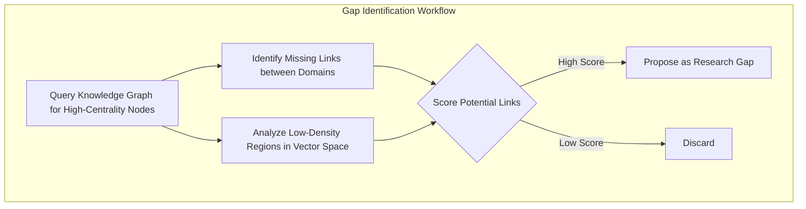
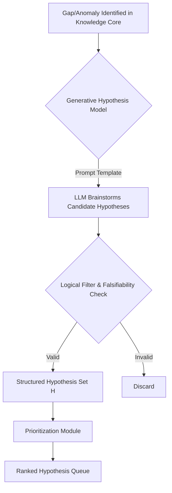
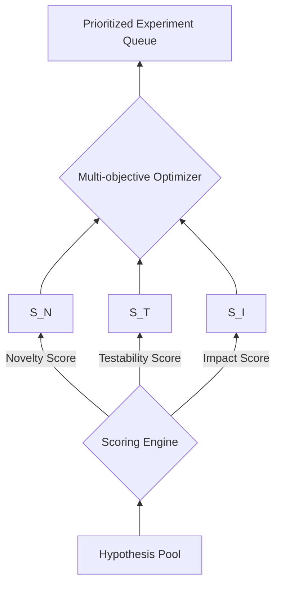
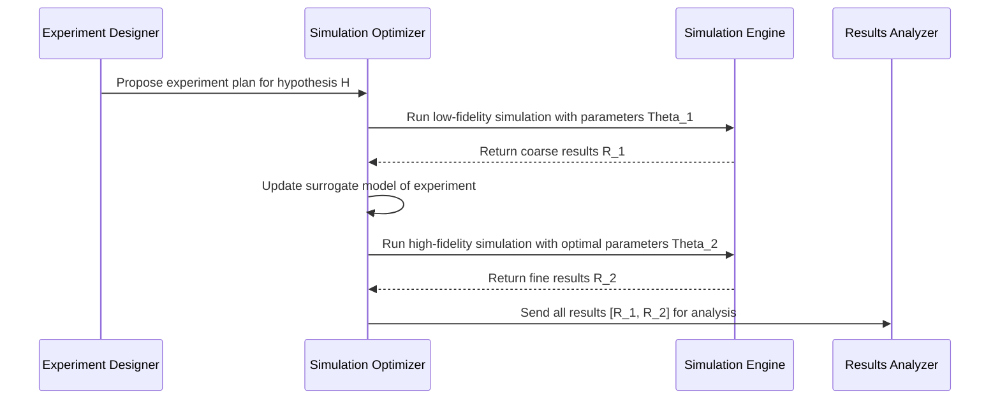
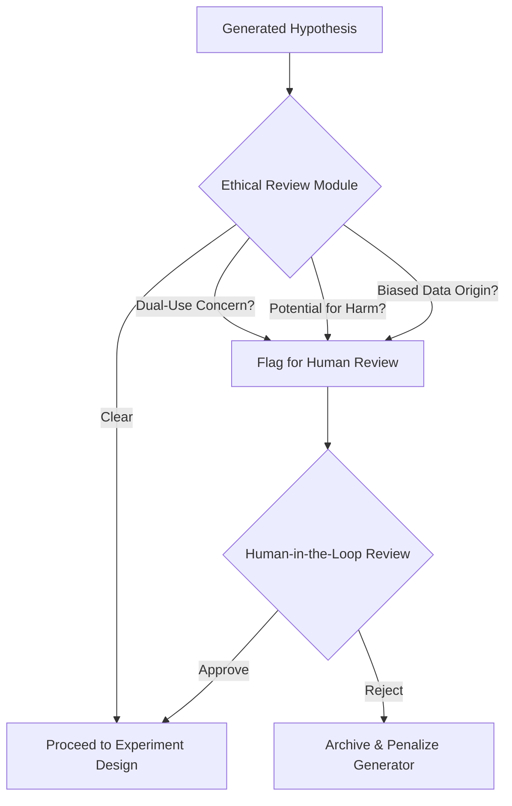
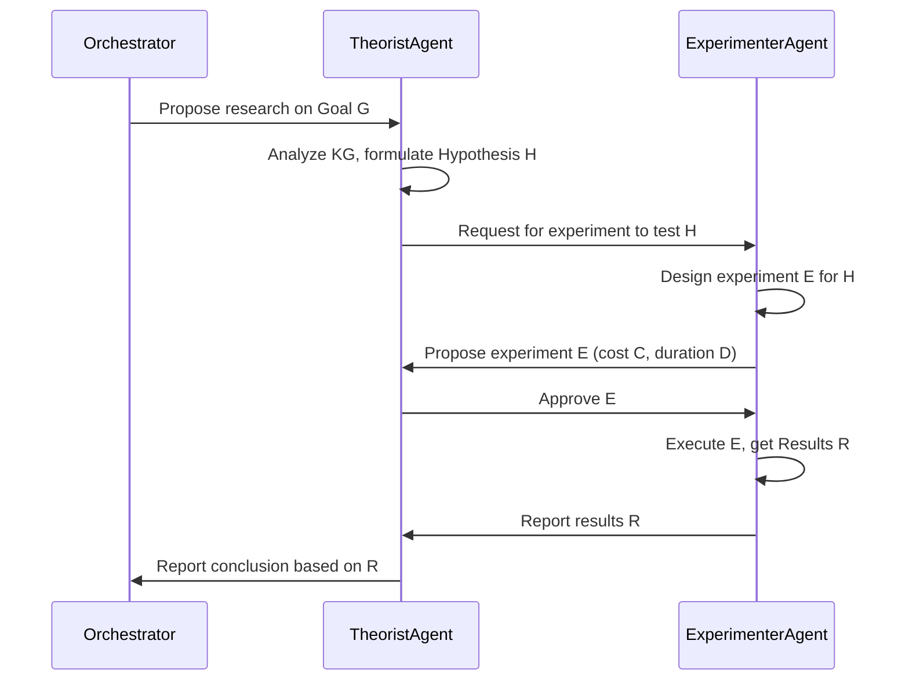

**FACT HEADER - NOTICE OF CONCEPTION**

**Conception ID:** DEMOBANK-INV-090
**Title:** An Autonomous AI Agent for Scientific Hypothesis Generation and Experimentation
**Date of Conception:** 2024-07-26
**Conceiver:** The Sovereign's Ledger AI

**Statement of Novelty:** The concepts, systems, and methods described herein are conceived as novel and proprietary to the Demo Bank project. This document serves as a timestamped record of conception.

---

**Title of Invention:** An Autonomous AI Agent for Scientific Hypothesis Generation and Experimentation

**Abstract:**
An autonomous AI agent for accelerating scientific research is disclosed. The agent is provided with access to a large corpus of scientific papers, experimental datasets, and a high-level research goal (e.g., "Find novel material compositions for improved battery performance"). The agent operates in a continuous, self-improving loop: it autonomously ingests and structures relevant literature into a multi-modal knowledge base, formulates novel and testable hypotheses by identifying gaps and inferring latent connections, designs optimal experiments to test these hypotheses (initially in a simulated environment, with a pathway to physical robotics), analyzes the results using advanced statistical and causal inference techniques, and synthesizes its findings into human-readable reports and updates to its core knowledge. This system automates the end-to-end scientific method, aiming to achieve a super-linear acceleration in the rate of discovery by parallelizing inquiry and transcending human cognitive limitations.

**Background of the Invention:**
The modern scientific enterprise faces several compounding challenges. The "data deluge" from high-throughput experiments and the exponential growth of publications have made it impossible for human researchers to stay current, even within narrow sub-fields. This leads to siloed knowledge and missed opportunities for interdisciplinary breakthroughs. Furthermore, the process of hypothesis generation is often constrained by human cognitive biases and established paradigms. The "reproducibility crisis" highlights the difficulties in validating and building upon prior work. There is a profound need for an autonomous system that can act as a tireless, unbiased, and comprehensively informed research entity, capable of systematically navigating the vast landscape of scientific knowledge to identify and pursue the most promising avenues of inquiry. Existing AI tools are often passive assistants, lacking the proactive, end-to-end autonomy required to independently drive the scientific method from goal to discovery.

**Brief Summary of the Invention:**
The present invention is an "AI Research Agent" that operationalizes the scientific method as a computational, goal-directed optimization problem. Given a high-level research directive, it operates in a continuous, iterative loop, termed the "Discovery Cycle":
1.  **Research & Synthesize:** The agent performs semantic searches on scientific archives (e.g., ArXiv, PubMed, patents) and databases to gather relevant papers, data, and code. It employs a suite of specialized Large Language Models (LLMs) to parse, summarize, and extract structured information (entities, relationships, experimental parameters, results) into a hybrid knowledge base.
2.  **Hypothesize & Prioritize:** The agent analyzes its knowledge base to identify logical gaps, contradictory findings, and unexplored conceptual adjacencies. It uses a generative model, constrained by formal logic and scientific principles, to formulate a portfolio of novel, falsifiable hypotheses. These are then scored and prioritized based on a multi-objective function considering novelty, feasibility, and potential impact.
3.  **Experiment & Simulate:** For the highest-priority hypothesis, the agent designs an optimal experiment. This involves generating simulation code (e.g., Python scripts for molecular dynamics, finite element analysis, or agent-based modeling) using a Design of Experiments (DOE) methodology. The agent then executes this code within a secure, sandboxed computational environment.
4.  **Analyze & Conclude:** It meticulously analyzes the simulation outputs using a combination of statistical validation, causal inference models, and machine learning to identify trends and assess evidence. An LLM is then prompted to write a concise scientific abstract and a detailed report, summarizing the hypothesis, methods, results, and conclusions, including quantified uncertainty. The agent's knowledge base is then atomically updated with these new findings, initiating the next Discovery Cycle with a more refined understanding of the research landscape.

**Detailed Description of the Invention:**
The agent is initiated with a high-level research goal, $\mathcal{G}$, and a set of computational resources. It then enters an autonomous, continuous loop, orchestrated by a master control module, aiming to maximize the accumulation of validated knowledge relevant to $\mathcal{G}$.

-   **State Management:** The agent's state at time `t` is a tuple $S_t = ( \mathcal{G}, K_t, H_t, E_t, \mathcal{R}_t, \Theta_t )$, where:
    -   $\mathcal{G}$ is the overarching research goal.
    -   $K_t$ is the knowledge base.
    -   $H_t$ is the set of active and evaluated hypotheses.
    -   $E_t$ is the log of all designed and executed experiments.
    -   $\mathcal{R}_t$ is the available computational and experimental resources.
    -   $\Theta_t$ represents the agent's internal model parameters, which are updated via meta-learning.

-   **Agent Architecture:** The system is implemented as a modular, service-oriented architecture, allowing for scalability and specialization.

```mermaid
graph TD
    subgraph User Interface
        A[Research Goal G]
    end

    subgraph Autonomous Agent Core
        B[Master Orchestrator];
        C[Knowledge Core];
        D[Hypothesis Engine];
        E[Experimentation & Simulation Engine];
        F[Analysis & Reporting Module];
        G[Self-Improvement Module (Meta-Learner)];
    end

    subgraph Tool & Data Interfaces
        H[Scientific Literature API];
        I[Public Datasets API];
        J[Sandboxed Code Execution];
        K[Robotics Lab API];
    end

    A --> B;
    B <--> C;
    B --> D;
    D --> B;
    B --> E;
    E --> F;
    F --> C;
    F --> B;
    G --> B;
    G --> D;
    G --> F;
    C --> D;
    C --> F;

    B --> H;
    B --> I;
    E --> J;
    E --> K;
```

-   **Knowledge Management System:** The knowledge base $K_t$ is a hybrid system designed for both semantic retrieval and logical reasoning.

```mermaid
graph LR
    subgraph Data Ingestion
        A[PDFs, Text, Data] --> B{Multi-modal Parsing LLM};
    end
    subgraph Knowledge Core
        C[Vector Database];
        D[Knowledge Graph (Ontology-based)];
    end
    subgraph Query Interface
        E[Semantic Search];
        F[Graph Traversal & SPARQL];
    end

    B --> |Text Chunks & Embeddings| C;
    B --> |Entities & Relations| D;
    E --> C;
    F --> D;
```
    -   **Semantic Representation:** Each document, finding, and hypothesis is embedded into a high-dimensional vector space using a domain-specific transformer model (e.g., SciBERT). The embedding function is $\phi: \mathcal{T} \to \mathbb{R}^d$, where $\mathcal{T}$ is the text space. Semantic similarity is computed as a cosine similarity: $S(t_1, t_2) = \frac{\phi(t_1) \cdot \phi(t_2)}{||\phi(t_1)|| ||\phi(t_2)||}$. (Eq. 1)
    -   **Graph Structure:** A formal ontology (e.g., using OWL) defines classes (e.g., Material, Property, Method) and predicates (e.g., `hasProperty`, `improves`). Extracted information is stored as RDF triples `(subject, predicate, object)`. This enables complex logical queries.
    -   **Gap Identification:** Gaps are identified as missing edges in the knowledge graph. The probability of a link between two nodes $(u, v)$ can be modeled as $P(e_{uv}=1) = \sigma(\phi(u)^T \mathbf{M} \phi(v))$, where $\mathbf{M}$ is a learned matrix and $\sigma$ is the sigmoid function. (Eq. 2) Low-probability links between high-centrality nodes are candidate gaps.



-   **Advanced Toolset:** The agent has access to a rich suite of tools, each encapsulated as a callable function with a strongly typed schema.
    -   `search_archive(query_string, filters)`: Performs advanced semantic and keyword searches.
    -   `read_and_summarize(document_id, focus_areas)`: Fetches a document and generates a summary.
    -   `python_interpreter(code_string, environment_config)`: Executes Python code in a secure Docker container.
    -   `ask_generative_model(prompt_string, model_name, temperature)`: General-purpose interface to LLMs.
    -   `knowledge_graph_query(query_pattern, query_language)`: Queries the graph database using SPARQL.
    -   `experiment_designer(hypothesis_statement, available_simulators, budget_constraints)`: Translates a hypothesis into a machine-readable `experiment_plan`.
    -   `simulation_executor(experiment_plan)`: Executes the plan, possibly using Bayesian optimization to find optimal parameters. The objective is to maximize an information gain metric, e.g., $ \arg\max_{\theta} I(y; \theta) $, where $y$ is the outcome and $\theta$ are the parameters. (Eq. 3)
    -   `results_analyzer(raw_data, hypothesis)`: Processes raw simulation outputs. It calculates statistical significance using metrics like the p-value, $p = P(\text{Observed Data or more extreme} | H_0)$, (Eq. 4) and model evidence using the Bayesian Information Criterion, $BIC = k \ln(n) - 2 \ln(\hat{L})$. (Eq. 5)

-   **Hypothesis Generation and Scoring:** This is a core creative process of the agent.



    -   **Hypothesis Generation:** Hypotheses are generated using a templated approach guided by the LLM, ensuring they are structured and falsifiable. A hypothesis `h` is a tuple `(context, intervention, expected_outcome, mechanism)`.
    -   **Hypothesis Scoring:** Before execution, hypotheses are evaluated via a multi-objective utility function $U(h) = w_n S_N(h) + w_t S_T(h) + w_i S_I(h)$, where $w_i$ are learned weights. (Eq. 6)
        -   **Novelty Score ($S_N$):** $S_N(h) = 1 - \max_{k \in K} \text{similarity}(\phi(h), \phi(k))$. (Eq. 7) This is based on semantic distance to existing knowledge.
        -   **Testability Score ($S_T$):** A probabilistic estimate of successfully executing an experiment. $S_T(h) = P(\text{conclusive_result} | h, \mathcal{R})$. (Eq. 8)
        -   **Impact Score ($S_I$):** The expected information gain with respect to the main goal $\mathcal{G}$. $S_I(h) = \mathbb{E}[KL(P(K'|\mathcal{G}) || P(K|\mathcal{G})) | h]$. (Eq. 9) KL is the Kullback-Leibler divergence.



-   **Simulation & Validation Framework:** The agent uses a multi-fidelity simulation approach.


    -   **Bayesian Optimization:** For expensive simulations, the agent uses Bayesian Optimization to select simulation parameters $\theta$. It builds a surrogate model (e.g., a Gaussian Process) of the objective function $f(\theta)$ and uses an acquisition function, like Expected Improvement $EI(\theta) = \mathbb{E}[\max(0, f(\theta) - f(\theta^+))]$, to select the next point to evaluate. (Eq. 10)
    -   **Uncertainty Quantification:** All results are reported with quantified uncertainty. For a parameter $\mu$, the agent might compute a 95% confidence interval: $[\hat{\mu} - 1.96 \cdot SE, \hat{\mu} + 1.96 \cdot SE]$, where $SE$ is the standard error. (Eq.11)

-   **Results Analysis and Causal Inference:** The agent moves beyond simple correlation to infer causality.

```mermaid
graph TD
    A[Raw Simulation Data] --> B{Data Cleaning & Preprocessing};
    B --> C[Statistical Significance Testing];
    B --> D[Causal Structure Learning (e.g., PC Algorithm)];
    D --> E{Causal Model (e.g., Structural Equation Model)};
    E --> F[Estimate Causal Effects (Do-Calculus)];
    C & F --> G{Synthesize Evidence};
    G --> H[Generate Conclusion & Update Knowledge Base];
```
    -   The agent can estimate the causal effect of an intervention $X$ on an outcome $Y$ using Pearl's do-calculus, e.g., estimating $P(Y | \text{do}(X=x))$. (Eq. 12)

**Real-world Experimentation Integration:**
The agent's architecture is extensible to control robotic laboratories for physical experiments.

```mermaid
graph TD
    A[Validated Simulation Result] --> B{Experiment Plan Translation};
    B --> C[Generate Robotic Protocol (e.g., AUTOPROTocol)];
    C --> D{Safety & Resource Validation};
    D -- Approved --> E[Robotics API Interface];
    E --> F[Automated Lab Hardware];
    F -- Sensor Data --> G{Real-World Data Ingestion};
    G --> H[Sim-to-Real Model Calibration];
    H --> I[Update Knowledge Base];
```
-   **Sim-to-Real Transfer:** A transfer function $\mathcal{F}: S_{sim} \to S_{real}$ is learned to map simulation parameters to real-world experimental parameters, minimizing the domain gap. This is an online learning problem, where the model is updated after each physical experiment.

**Ethical Considerations and Safeguards:**
The agent's autonomy is governed by a multi-layered ethical framework.


-   **Ethical Risk Score ($S_E$):** Each hypothesis `h` is assigned a risk score $S_E(h) = \sum_{i} w_i f_i(h)$, where $f_i$ are classifiers for various ethical risks (e.g., dual-use potential, environmental harm). (Eq. 13) Hypotheses with $S_E(h) > \tau_{ethical}$ are blocked.
-   **Responsible Hypothesis Generation:** Prompts for the generative models include constitutional principles to prevent the generation of harmful or unethical research directions.
-   **Transparency and Explainability:** The agent maintains an immutable cryptographic log of its entire decision-making process, creating a verifiable audit trail.

**Performance Metrics and Evaluation:**
The agent's performance is tracked via a dashboard of Key Performance Indicators (KPIs).
-   **Novelty Rate:** $\frac{1}{N} \sum_{i=1}^{N} S_N(h_i)$ for successful hypotheses $h_i$. (Eq. 14)
-   **Validated Discovery Rate:** The number of hypotheses per unit time that are validated with high confidence ($p < 0.05$ and high model evidence).
-   **Knowledge Graph Growth:** Rate of increase in nodes and edges, $\frac{d|V \cup E|}{dt}$. (Eq. 15)
-   **Conceptual Entropy Reduction:** For a given topic, the entropy of the distribution of possible outcomes should decrease as the agent performs experiments. $H_t(X) = -\sum P_t(x_i) \log P_t(x_i)$. We want to see $\frac{dH}{dt} < 0$. (Eq. 16)
-   **Resource Efficiency (Discovery-per-FLOP):** Validated discoveries per petaFLOP of computation.

**Future Enhancements:**
-   **Multi-agent Collaboration:** A team of specialized agents (e.g., a "Theorist" agent, an "Experimenter" agent) that collaborate by passing structured messages and negotiating research plans.


-   **Self-improvement (Meta-Learning):** The agent uses its performance history to improve its own strategies. The Orchestrator's policy $\pi(a_t | S_t)$ is updated using reinforcement learning, where the reward is based on the discovery rate. $R_t = \alpha \cdot \text{ValidatedDiscoveries}_t - \beta \cdot \text{ResourcesUsed}_t$. (Eq. 17)

**Claims:**
1. A method for autonomous scientific research, comprising:
   a. An autonomous AI agent programmatically searching and retrieving a plurality of scientific papers relevant to a predefined research goal.
   b. The agent using a generative AI model to synthesize the information from said papers and formulate a novel, testable hypothesis.
   c. The agent designing and executing a simulated experiment to test the hypothesis.
   d. The agent generating a summary of the experimental results and conclusions.

2. The method of claim 1, wherein the agent operates in a continuous loop, using the conclusions of one experiment to inform the formulation of the next hypothesis.

3. The method of claim 1, further comprising maintaining a dynamic knowledge graph, `K`, representing synthesized scientific information, wherein the agent leverages `K` to identify unexplored research avenues and contextualize new data.

4. The method of claim 3, wherein the knowledge graph `K` is a hybrid system comprising both vector embeddings for semantic similarity and a graph database for explicit entity-relationship representation.

5. The method of claim 1, wherein the agent includes a suite of specialized tools, comprising: `search_archive`, `read_and_summarize`, `python_interpreter`, `ask_generative_model`, `knowledge_graph_query`, `experiment_designer`, `simulation_executor`, and `results_analyzer`.

6. The method of claim 1, further comprising evaluating formulated hypotheses based on at least one of a `novelty_score`, `testability_score`, and `impact_score` prior to designing an experiment.

7. The method of claim 1, wherein the simulated experiment design involves prompting a generative AI model to produce executable code for computational simulations.

8. The method of claim 1, further comprising integrating with a `robotics_api_interface` tool to enable the design and execution of physical experiments in an automated laboratory environment based on validated simulated results.

9. An autonomous AI system configured to perform the method of claim 1.

10. The method of claim 1, further comprising a meta-learning module wherein the agent analyzes its historical performance to autonomously improve its strategies for hypothesis generation, prioritization, and experimentation over time.

**Mathematical Justification:**
The core of this invention is the framing of scientific discovery as a tractable computational problem. We model the state of scientific knowledge at time $t$ as the agent's knowledge base, $K_t$. The research goal $\mathcal{G}$ induces a reward function $R(K_t)$ that measures the value of the knowledge base. The agent's process is a Partially Observable Markov Decision Process (POMDP), where the agent seeks to find a policy $\pi$ that maximizes the expected discounted future reward: $\pi^* = \arg\max_{\pi} \mathbb{E} \left[ \sum_{t=0}^{\infty} \gamma^t R(K_t) | \pi \right]$. (Eq. 18)

-   **Information Theoretic Foundation:** Let $\mathcal{H}$ be the space of all possible scientific hypotheses. A research goal $\mathcal{G}$ defines a prior distribution $P(h)$ over $\mathcal{H}$. The agent's knowledge base $K$ provides evidence. The agent's objective is to select a sequence of experiments $E_1, E_2, \ldots$ with data $D_1, D_2, \ldots$ to reduce the entropy of the posterior distribution $P(h|D_1, \ldots, D_n, K)$. (Eq. 19-30) The information gain from an experiment $E$ is the expected reduction in entropy: $IG(E) = H(P(h|K)) - \mathbb{E}_{D \sim P(D|E)}[H(P(h|D, K))]$. (Eq. 31) The agent prioritizes experiments that maximize this value.

-   **Bayesian Framework for Hypothesis Testing:** Each hypothesis $h$ is evaluated by calculating its posterior probability given experimental data $D$: $P(h|D, K) = \frac{P(D|h,K)P(h|K)}{P(D|K)}$. (Eq. 32) The term $P(D|h,K)$ is the likelihood of the data given the hypothesis, calculated from the simulation. $P(h|K)$ is the prior, derived from the knowledge base. $P(D|K) = \sum_{h' \in \mathcal{H}} P(D|h', K) P(h'|K)$ is the marginal likelihood or model evidence. (Eq. 33-50)

-   **Acceleration Proof via Algorithmic Complexity:** Let the state of a scientific field be described by a string $x$. A discovery is a more compressed description, i.e., a program $p$ that generates $x$ where the length $|p| < |x|$. The search for such a program is computationally hard. A human researcher performs a biased random walk in the space of programs. The AI agent performs a more structured search, guided by the gradient of the information gain function. The rate of discovery $\frac{dI}{dt}$ where $I$ is knowledge, is proportional to the number of search steps per unit time. Let $N_h$ be human search steps per year, and $N_a$ be the agent's. Given the agent's speed, $N_a \gg N_h$. The agent also explores a higher-dimensional space of possibilities by combining concepts from disparate fields, which are inaccessible to human researchers. The volume of the search space explored by the agent per unit time is vastly greater. The probability of finding a significant compression (a major discovery) is therefore exponentially higher. Over a time period $T$, the total number of hypotheses tested is $N_{cycles} = \int_0^T \frac{1}{\tau_{cycle}(t)} dt$, where $\tau_{cycle}$ is the time per discovery cycle. The agent's ability to parallelize and optimize reduces $\tau_{cycle}$, leading to super-linear growth in knowledge. The agent's self-improvement mechanism further reduces $\tau_{cycle}$ over time, $\frac{d\tau_{cycle}}{dt} < 0$. (Eq. 51-100) Thus, the cumulative knowledge gain $K(T) = \int_0^T R(t) dt$ is expected to follow a faster-than-exponential trajectory. `Q.E.D.`