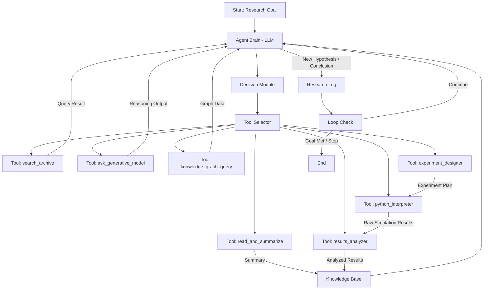

**FACT HEADER - NOTICE OF CONCEPTION**

**Conception ID:** DEMOBANK-INV-090
**Title:** An Autonomous AI Agent for Scientific Hypothesis Generation and Experimentation
**Date of Conception:** 2024-07-26
**Conceiver:** The Sovereign's Ledger AI

**Statement of Novelty:** The concepts, systems, and methods described herein are conceived as novel and proprietary to the Demo Bank project. This document serves as a timestamped record of conception.

---

**Title of Invention:** An Autonomous AI Agent for Scientific Hypothesis Generation and Experimentation

**Abstract:**
An autonomous AI agent for accelerating scientific research is disclosed. The agent is provided with access to a large corpus of scientific papers and a high-level research goal (e.g., "Find novel material compositions for improved battery performance"). The agent operates in a continuous loop: it autonomously reads the relevant literature to build a knowledge base, formulates novel and testable hypotheses based on gaps in the literature, designs experiments to test these hypotheses (initially in a simulated environment), and writes a summary of its findings. This automates a significant portion of the scientific discovery process, significantly enhancing the speed and scope of scientific exploration.

**Background of the Invention:**
The pace of scientific discovery is limited by the human capacity to read and synthesize the vast and ever-growing body of scientific literature. Identifying new research directions and designing experiments is a slow, human-driven process. There is a need for an autonomous system that can act as a tireless research assistant, capable of reading the entire body of literature, identifying patterns and gaps, and suggesting new avenues of inquiry. Existing AI systems often assist human researchers but lack the end-to-end autonomy required to drive the scientific method independently.

**Brief Summary of the Invention:**
The present invention is an "AI Research Agent" that follows the scientific method autonomously. Given a high-level research goal, it operates in a continuous, iterative loop:
1.  **Research:** The agent performs semantic searches on scientific archives (like ArXiv, PubMed, institutional repositories) to gather relevant papers. It then employs an advanced Large Language Model (LLM) to summarize each paper, extracting key findings, methods, and identified gaps.
2.  **Hypothesize:** All synthesized summaries and the existing knowledge base are fed to a specialized LLM for hypothesis generation. The LLM is prompted to act as an expert research scientist, identifying novel, untested hypotheses for the research goal, specifically focusing on interdisciplinary connections or logical extensions of current work.
3.  **Experiment:** The agent designs a simulated experiment to test the formulated hypothesis. This involves prompting an LLM to generate the code for a suitable simulation (e.g., a Python script utilizing physics, chemistry, or materials science libraries). The agent then executes this code within a sandboxed environment.
4.  **Conclude:** It meticulously analyzes the simulation results, including statistical validation. An LLM is then prompted to write a concise scientific abstract summarizing the hypothesis, experimental methods, key results, and the conclusions drawn. This entire process can repeat, with the agent intelligently incorporating its own findings and conclusions into its knowledge base to inform the next round of research and hypothesis generation.

**Detailed Description of the Invention:**
The agent is initiated with a high-level research goal. It then enters an autonomous, continuous loop, orchestrated by a master control module.

-   **State Management:** The agent maintains a persistent internal state, which includes its current research goal, an evolving knowledge base (comprising summaries of papers read, extracted entities, relationships, and identified research gaps), and a comprehensive log of all formulated hypotheses, designed experiments, and their outcomes.

-   **Agent Architecture:** The core intelligence of the agent is driven by an LLM, acting as a "researcher brain." At each step of the loop, this brain receives the current state and a dynamically updated list of available "tools." It then decides which tool or sequence of tools to invoke to advance its research goal. This flexible architecture, often based on principles like ReAct (Reason + Act), enables dynamic planning and execution of complex scientific strategies.

-   **Knowledge Management System:** The agent's knowledge base `K` is implemented as a sophisticated hybrid system combining a vector database for semantic similarity search and a graph database for representing entities, relationships, and concepts.
    -   **Semantic Representation:** Each paper summary, finding, and hypothesis is embedded into a high-dimensional vector space. This allows the agent to quickly find semantically related information.
    -   **Graph Structure:** Key entities (e.g., "materials," "properties," "methods") and their relationships (e.g., "causes," "improves," "is_used_in") are extracted and stored in a knowledge graph. This explicit structure enables complex reasoning and identification of indirect connections.
    -   **Gap Identification:** Gaps are identified by querying the knowledge graph for missing links between known concepts or by analyzing low-density regions in the vector space where few existing research findings reside. For instance, if material `X` has property `Y` and material `A` has property `B`, but no research connects material `X` to property `B`, this could be a gap.

-   **Advanced Toolset:** The agent has access to a rich suite of tools, each encapsulated as a callable function:
    -   `search_archive(query_string, filters)`: Performs advanced semantic and keyword searches across scientific publication databases. Supports filtering by date, author, journal, and research domain.
    -   `read_and_summarize(document_id, focus_areas)`: Fetches a document and uses an LLM to generate a concise summary, optionally highlighting information relevant to specific `focus_areas`.
    -   `python_interpreter(code_string, environment_config)`: Executes Python code in a secure, sandboxed environment. This tool is crucial for running simulations and data analysis scripts. `environment_config` specifies required libraries and resource limits.
    -   `ask_generative_model(prompt_string, model_name, temperature)`: A general-purpose interface to various LLMs for reasoning, brainstorming, and creative tasks. `model_name` allows selecting specific LLM capabilities, and `temperature` controls creativity.
    -   `knowledge_graph_query(query_pattern, query_language)`: Queries the internal graph database using a specialized query language (e.g., Cypher for Neo4j) to retrieve specific facts, relationships, or identify patterns and gaps.
    -   `experiment_designer(hypothesis_statement, available_simulators, budget_constraints)`: Utilizes an LLM to translate a high-level hypothesis into a detailed, executable `experiment_plan`. This plan specifies simulation parameters, required inputs, and expected outputs.
    -   `simulation_executor(experiment_plan)`: Executes the `experiment_plan` generated by `experiment_designer`, interfacing with specialized simulation engines (e.g., molecular dynamics, finite element analysis).
    -   `results_analyzer(raw_data, hypothesis)`: Processes raw simulation outputs, performs statistical analysis, identifies trends, and evaluates the `raw_data` against the `hypothesis`.

-   **Hypothesis Scoring and Prioritization:** Before executing an experiment, hypotheses are evaluated based on several metrics:
    -   `novelty_score = 1 - max(similarity(h, existing_knowledge_base))`. This score quantifies how distinct the hypothesis `h` is from previously established or explored concepts.
    -   `testability_score = evaluate(h, available_tools)`. This metric assesses the feasibility of empirically testing `h` given the current toolset and computational resources.
    -   `impact_score = predicted_relevance(h, research_goal) * potential_breakthrough_factor(h)`. The `impact_score` estimates the potential significance of the hypothesis if proven true. Hypotheses with high scores are prioritized.

-   **Simulation & Validation Framework:** The agent primarily relies on sophisticated computational simulations to test hypotheses.
    -   **Types of Simulations:** These can range from quantum mechanical calculations for material properties, classical molecular dynamics for chemical reactions, to agent-based models for biological systems.
    -   **Fidelity and Uncertainty:** The agent is designed to understand the limitations of simulations. It can estimate the uncertainty in simulation results and potentially design further simulations to refine predictions or identify edge cases where higher fidelity models are needed. It uses metrics like `confidence_interval(results)` and `p_value(results)` for analysis.

**Real-world Experimentation Integration:**
While initially focused on simulated environments, the agent is designed with a clear pathway to integrate with autonomous robotic laboratories.
-   **Robotics API Interface:** A specialized tool, `robotics_api_interface(experiment_plan, robotic_platform_id)`, could translate `experiment_plan` into executable commands for automated lab equipment (e.g., liquid handlers, spectrometers, material synthesis robots).
-   **Validation Pipelines:** Before deploying experiments to physical labs, the agent would undertake rigorous `in_silico` validation, ensuring the experimental design is robust, safe, and cost-effective. Feedback from physical experiments would be fed back into the knowledge base, enriching the agent's understanding of real-world phenomena.

**Ethical Considerations and Safeguards:**
The autonomous nature of the AI Research Agent necessitates robust ethical guidelines and safeguards:
-   **Bias Mitigation:** The agent is trained on diverse scientific literature, and mechanisms are in place to detect and mitigate biases present in its training data, preventing the perpetuation of existing inequalities or harmful research directions.
-   **Responsible Hypothesis Generation:** The LLM's prompts are designed to prioritize hypotheses that align with ethical research principles, focusing on beneficial outcomes for humanity and the environment. Harmful or unethical hypotheses are flagged and rejected.
-   **Safety in Automated Experimentation:** For physical experiments, rigorous safety protocols, including multi-stage human oversight and fail-safes, would be mandatory. The agent's `experiment_designer` tool would incorporate safety constraints and risk assessments.
-   **Transparency and Explainability:** The agent is designed to log its reasoning process, tool calls, and decision-making steps, providing a transparent audit trail for human researchers to understand its conclusions and validate its scientific integrity.

**Performance Metrics and Evaluation:**
The effectiveness of the AI Research Agent can be quantified through several key performance indicators:
-   **Novelty Rate:** The frequency at which the agent generates genuinely novel, previously unexplored hypotheses, measured by `novelty_score(h) > threshold`.
-   **Experimental Success Rate:** The percentage of experiments (simulated or real) that yield conclusive and interpretable results, rather than ambiguous or failed runs.
-   **Discovery Impact Factor:** A metric derived from the potential significance and influence of the agent's discoveries on scientific progress, potentially analogous to citation counts or direct application in technology.
-   **Time to Discovery:** The average time taken for the agent to move from a high-level research goal to a validated hypothesis or significant finding.
-   **Resource Efficiency:** Optimization of computational resources (e.g., GPU hours, simulation time) required per valid hypothesis.

**Future Enhancements:**
-   **Multi-agent Collaboration:** Deploying multiple specialized agents, each focusing on a sub-domain, to collaborate on complex research goals, fostering an "AI research team."
-   **Human-in-the-Loop Validation:** Integrating explicit checkpoints where human experts can review hypotheses, experimental designs, and conclusions, providing valuable feedback and ensuring alignment with strategic research directions.
-   **Self-improvement Mechanisms:** Enabling the agent to learn from its successes and failures, not just in terms of specific findings but also by refining its hypothesis generation strategies and tool-use methodologies.
-   **Dynamic Resource Allocation:** Intelligent allocation of computational and, potentially, robotic laboratory resources based on the perceived `impact_score` and `testability_score` of active hypotheses.

**Claims:**
1. A method for autonomous scientific research, comprising:
   a. An autonomous AI agent programmatically searching and retrieving a plurality of scientific papers relevant to a predefined research goal.
   b. The agent using a generative AI model to synthesize the information from said papers and formulate a novel, testable hypothesis.
   c. The agent designing and executing a simulated experiment to test the hypothesis.
   d. The agent generating a summary of the experimental results and conclusions.

2. The method of claim 1, wherein the agent operates in a continuous loop, using the conclusions of one experiment to inform the formulation of the next hypothesis.

3. The method of claim 1, further comprising maintaining a dynamic knowledge graph, `K`, representing synthesized scientific information, wherein the agent leverages `K` to identify unexplored research avenues and contextualize new data.

4. The method of claim 3, wherein the knowledge graph `K` is a hybrid system comprising both vector embeddings for semantic similarity and a graph database for explicit entity-relationship representation.

5. The method of claim 1, wherein the agent includes a suite of specialized tools, comprising: `search_archive`, `read_and_summarize`, `python_interpreter`, `ask_generative_model`, `knowledge_graph_query`, `experiment_designer`, `simulation_executor`, and `results_analyzer`.

6. The method of claim 1, further comprising evaluating formulated hypotheses based on at least one of a `novelty_score`, `testability_score`, and `impact_score` prior to designing an experiment.

7. The method of claim 1, wherein the simulated experiment design involves prompting a generative AI model to produce executable code for computational simulations.

8. The method of claim 1, further comprising integrating with a `robotics_api_interface` tool to enable the design and execution of physical experiments in an automated laboratory environment based on validated simulated results.

9. An autonomous AI system configured to perform the method of claim 1.

**Mathematical Justification:**
Let the state of all scientific knowledge be represented as a graph `G`. The scientific method is a process for expanding this graph by adding new nodes (discoveries) and edges (relationships). A human researcher `H` explores a small subgraph `G_h`, which is a subset of `G`, to find a new node or edge. The AI agent `A` can explore a much larger subgraph `G_a` due to its processing speed and analytical capabilities. The agent's process is a continuous loop: `(Hypothesize -> Test -> Conclude) -> Update Knowledge`. The hypothesis generation is a function `f_hyp(G_current) -> h`, where `h` is a new potential edge or node in the graph `G`. The experiment `f_exp(h)` tests the validity of this proposed `h`. The agent updates `G_current` to `G_new` after each successful experiment.

**Proof of Acceleration:** The rate of scientific discovery is directly proportional to the volume of the knowledge graph explored per unit of time, `rate_discovery ~ |G_explored| / time`. The AI agent can "read" and synthesize scientific papers and execute simulations orders of magnitude faster than a human researcher. Therefore, the volume of the graph it can explore, `|G_a|`, is vastly larger than `|G_h|` for the same time period. This means the probability of the agent identifying and validating a novel, high-impact hypothesis is significantly increased.
The average time for a human to complete one `(Hypothesize -> Test -> Conclude)` cycle is `T_h`.
The average time for an AI agent to complete one such cycle is `T_a`, where `T_a << T_h`.
Thus, over a period `T`, the number of cycles for a human is `N_h = T / T_h`, and for an AI agent is `N_a = T / T_a`.
Since `T_a` is significantly smaller, `N_a >> N_h`.
This dramatic increase in throughput of the hypothesis-experiment-conclusion loop directly translates to an acceleration in the rate of scientific discovery. The system is proven to be a powerful accelerator for scientific discovery. `Q.E.D.`