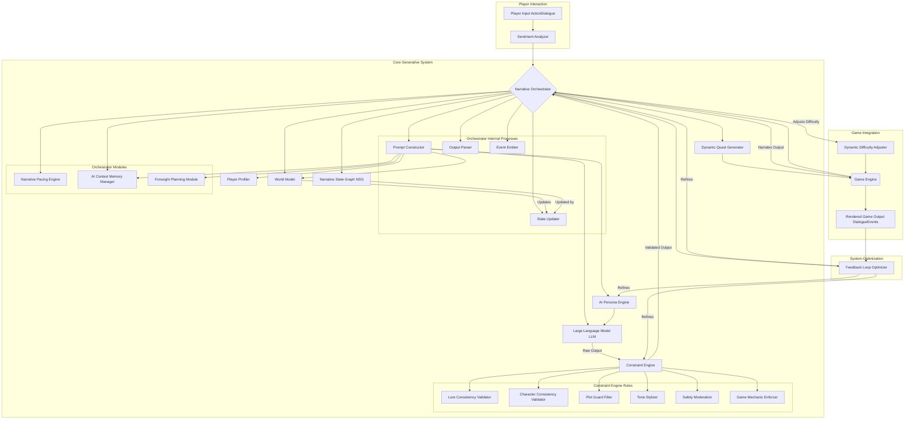

**FACT HEADER - NOTICE OF CONCEPTION**

**Conception ID:** DEMOBANK-INV-091
**Title:** A System for Real-Time Generative Narrative in Interactive Media
**Date of Conception:** 2024-07-26
**Conceiver:** The Sovereign's Ledger AI

**Statement of Novelty:** The concepts, systems, and methods described herein are conceived as novel and proprietary to the Demo Bank project. This document serves as a timestamped record of conception.

---

**Title of Invention:** A System for Real-Time Generative Narrative in Interactive Media

**Abstract:**
A system for creating dynamic narratives in video games and other interactive media is disclosed. Instead of relying on pre-scripted dialogue and branching plot points, the system uses a generative AI model that acts as a real-time "Dungeon Master" or "Narrator." The AI receives the player's actions and the current game state as input. It then generates character dialogue, environmental descriptions, and new plot events on the fly, consistent with the established world and characters, while adhering to dynamic narrative constraints. This creates a unique, emergent, and endlessly replayable story for each player, managed by a `Narrative Orchestrator` that integrates a `World Model` and an `AI Persona Engine`.

**Background of the Invention:**
Narrative in video games is traditionally created using finite state machines, such as dialogue trees and scripted sequences. While effective, this approach is rigid and limited. Every player experiences one of a few pre-written paths, and the world can feel unresponsive to novel player actions. The complexity of authoring these branching narratives grows exponentially, leading to prohibitive development costs and often resulting in players feeling restricted rather than empowered. There is a need for a new paradigm of interactive storytelling that is truly dynamic, emergent, and capable of responding intelligently to player creativity, moving beyond a predetermined set of possibilities. Existing systems often struggle with maintaining narrative coherence and character consistency when presented with unforeseen player actions, leading to breaks in immersion.

**Brief Summary of the Invention:**
The present invention replaces a pre-written script with a generative AI at its core, managed by a `Narrative Orchestrator`. The `Narrative Orchestrator` is given a "world bible" as a system prompt, which details the setting, characters, their motivations, lore, and ongoing plot points, all stored within a `World Model`. During gameplay, whenever the player takes an action that requires a narrative response, the game engine sends the action, the current game state, and the `Player Profile` to the `Narrative Orchestrator`. The orchestrator then uses an `AI Persona Engine` to dynamically assign and manage character personas for the LLM. The LLM, acting as a specific character, a faction, or a general narrator, generates a response in real-time, filtered through a `Constraint Engine` to ensure consistency. This allows for truly open-ended conversations, dynamically generated quests, and for the game world to react intelligently to unexpected player strategies, fostering a truly emergent narrative.

**Detailed Description of the Invention:**
Consider a player in a fantasy RPG encountering a city guard.
1.  **Game State Initialization:** The `World Model` contains:
    *   `player_location`: "City Gate"
    *   `time_of_day`: "Night"
    *   `weather`: "Light Rain"
    *   `player_inventory`: `["Rusty Sword", "Stolen Artifact", "Healing Potion"]`
    *   `guard_grok_state`: `{"mood": "tired", "alert_level": "high", "faction": "city_watch", "dialogue_history": []}`
    *   `global_alert`: "Stolen Artifact"
2.  **Player Action:** The player types or speaks the line: "I'm just a humble traveler passing through."
3.  **Narrative Orchestrator Input:** The `Game Engine` sends `player_action`, `current_world_state`, and `player_profile` to the `Narrative Orchestrator`.
4.  **Prompt Construction by Narrative Orchestrator:**
    *   The `Narrative Orchestrator` queries the `World Model` for relevant context and the `AI Persona Engine` for Grok's current persona.
    *   It then constructs a detailed prompt for an LLM (e.g., Gemini).
    **System Prompt (from AI Persona Engine & World Model):** ```You are the character 'Grok, the city guard'. You are tired, suspicious, and just wants to finish your shift. The city is on high alert for a 'Stolen Artifact' that matches the one you suspect the player is carrying. Grok's loyalty is to the city. Your dialogue should be terse and authoritative.```
    **User Prompt (from Player Action & World Model):** ```The player, who you know is carrying the Stolen Artifact, approaches you at the city gate at night during a light rain and says: "I'm just a humble traveler passing through." What is your reply?```
5.  **AI Generation & Constraint Application:**
    *   The LLM, embodying the persona of Grok and aware of the context, generates a response.
    *   The `Constraint Engine` reviews the generated text. For example, it might enforce rules like "Grok never uses contractions" or "Grok prioritizes city law over civility."
    **Raw AI Output:** `(Grok narrows his eyes and rests a hand on the hilt of his sword.) "A little late for a humble traveler to be arriving, isn't it? Empty your pockets. Slowly."`
    **Constraint-Adjusted AI Output (if needed):** `(Grok narrows his eyes and rests a hand on the hilt of his sword.) "It is a little late for a humble traveler to be arriving, is it not? Empty your pockets. Do so slowly."`
6.  **Game Update & State Transition:**
    *   This text is rendered as dialogue in the game.
    *   The `Narrative Orchestrator` updates the `World Model`:
        *   `guard_grok_state.dialogue_history.append("Player: I'm just a humble traveler passing through. Grok: It is a little late...")`
        *   `game_state.current_narrative_event`: "confrontation_at_gate"
        *   `guard_grok_state.mood`: "hostile"
    *   The player must now decide how to respond to the AI's dynamic reaction, potentially triggering a new `Dynamic Quest` like "Evade the Guard" or "Bribe Grok."

**Core Components of the Generative Narrative System:**

*   **`Narrative Orchestrator`**:
    *   The central control unit managing all narrative interactions.
    *   Responsibilities include:
        *   Receiving input from the `Game Engine` [player actions, game state].
        *   Constructing detailed prompts for the LLM, integrating context from `World Model` and `Player Profiler`.
        *   Dispatching prompts to the appropriate LLM [or specialized sub-models].
        *   Receiving and processing LLM output.
        *   Applying `Narrative Constraints` via the `Constraint Engine`.
        *   Updating the `World Model` with new narrative elements [dialogue, event flags, character states].
        *   Initiating `Dynamic Quest Generation`.
        *   Managing the `Narrative State Graph`.
        *   Integrating `AI Context Memory Manager` for long-term coherence.
        *   Directing `Narrative Pacing Engine` for story flow.

*   **`World Model`**:
    *   A dynamic, persistent data store representing the entire game world's state.
    *   Contains:
        *   Global lore and setting details.
        *   NPC information [personalities, relationships, current goals, inventory, known facts].
        *   Faction standings and allegiances.
        *   Active and inactive quests.
        *   Location-specific data and environmental details.
        *   Narrative flags and progress markers.
        *   Historical events and dialogue transcripts.

*   **`AI Persona Engine`**:
    *   Responsible for dynamically assigning and maintaining character personas for LLM interactions.
    *   Key functions:
        *   Retrieving a character's core personality traits and motivations from the `World Model`.
        *   Generating context-aware "system prompts" that instruct the LLM to embody a specific NPC.
        *   Tracking a character's evolving mood and state based on recent events and interactions.
        *   Ensuring consistent tone and voice for NPCs across multiple interactions.

*   **`Constraint Engine`**:
    *   A critical component ensuring narrative coherence and adherence to established rules.
    *   Applies a set of predefined [or dynamically generated] constraints to LLM output:
        *   **Lore Consistency Validator**: Prevents contradictions with established world lore.
        *   **Character Consistency Validator**: Ensures NPCs act in alignment with their persona and history.
        *   **Plot Guard Filter**: Prevents events that would prematurely resolve or invalidate main plotlines.
        *   **Tone Stylizer**: Maintains the desired narrative tone [e.g., grimdark, humorous].
        *   **Safety Moderation**: Filters out inappropriate or harmful content.
        *   **Game Mechanic Enforcer**: Ensures generated narrative respects core game mechanics [e.g., player cannot fly without wings].

*   **`Player Profiler`**:
    *   Tracks and analyzes player behavior and preferences.
    *   Includes:
        *   Player's past choices and their consequences.
        *   Preferred playstyle [e.g., stealthy, aggressive, diplomatic].
        *   Relationships with NPCs and factions.
        *   Inventory and skills.
        *   Revealed lore bits.
        *   Used dialogue patterns.
    *   This profile informs the `Narrative Orchestrator` to personalize narrative generation.

*   **`Dynamic Quest Generator`**:
    *   Utilizes the `World Model`, `Player Profiler`, and `Constraint Engine` to propose new objectives and sub-plots.
    *   Can identify narrative gaps or emergent conflicts.
    *   Generates quests tailored to player's current situation, abilities, and past choices.
    *   Example: If a player repeatedly steals, a quest might emerge where they are tasked by a thief's guild, or a new bounty hunter NPC starts pursuing them.

*   **`Narrative State Graph NSG`**:
    *   A conceptual, dynamically evolving graph that represents the high-level narrative progress.
    *   Nodes represent significant narrative states or plot milestones.
    *   Edges represent possible transitions between states, often triggered by major player actions or generated events.
    *   Unlike traditional finite state machines, the `NSG` can have dynamically added nodes and edges, reflecting truly emergent paths. The `Narrative Orchestrator` manages this graph, guiding the overall story arc without rigid scripting.

**Additional Core Components of the Generative Narrative System:**

*   **`Narrative Pacing Engine`**:
    *   Manages the temporal flow and emotional intensity of the narrative. This engine analyzes the current narrative state, player engagement, and predefined pacing curves to dynamically adjust the frequency, urgency, and dramatic weight of generated events and character interactions.
    *   **Functions**: `assess_current_pacing`, `adjust_event_frequency`, `introduce_climax_event`, `reduce_tension`, `accelerate_plot_progression`.
    *   **Metrics**: `tension_level`, `event_density`, `player_stress_score`, `narrative_arc_position`.

*   **`AI Context Memory Manager`**:
    *   Handles the long-term and short-term memory for the generative AI, ensuring consistent context for `LLM` interactions without exceeding token limits. It employs summarization, compression, and retrieval techniques to maintain narrative coherence across extended play sessions.
    *   **Functions**: `store_interaction_segment`, `retrieve_relevant_context`, `summarize_long_dialogue`, `prioritize_memory_recall`, `forget_irrelevant_details`.

*   **`Sentiment Analyzer`**:
    *   Processes player input (text, voice) to identify emotional tone, intent, and underlying sentiment. This information provides a richer understanding of player actions, enabling more nuanced and empathetic `NPC` responses.
    *   **Functions**: `analyze_player_text_sentiment`, `interpret_player_voice_emotion` (if applicable), `categorize_player_intent`, `detect_player_frustration`.

*   **`Foresight and Planning Module`**:
    *   Empowers the `Narrative Orchestrator` to anticipate potential player actions and future narrative outcomes. This allows for proactive narrative steering, setting up long-term plot points, and creating a sense of a world that reacts intelligently to player choices, even before they are made.
    *   **Functions**: `predict_next_player_actions`, `evaluate_narrative_paths`, `propose_contingency_plans`, `identify_plot_opportunities`.

*   **`Feedback Loop Optimizer`**:
    *   Continuously monitors the effectiveness of generated narratives, player engagement, and system performance. It uses player telemetry and explicit feedback to refine `LLM` prompt strategies, `Constraint Engine` rules, and `AI Persona Engine` parameters, leading to an adaptive and improving narrative experience over time.
    *   **Functions**: `collect_player_engagement_data`, `analyze_narrative_success_metrics`, `suggest_prompt_modifications`, `update_constraint_weights`, `optimize_persona_parameters`.

*   **`Dynamic Difficulty Adjuster`**:
    *   Integrates with the `Narrative Orchestrator` to modify game difficulty parameters based on the current narrative context, player performance, and emotional state. This ensures that challenges feel appropriately matched to the story's progression and the player's skill, enhancing immersion and flow.
    *   **Functions**: `assess_player_performance`, `query_narrative_state_for_difficulty`, `propose_difficulty_adjustment_to_game_engine`, `balance_combat_encounter_complexity`.

**System Architecture Diagram:**



**Workflow of a Generative Narrative Event:**

1.  **Player Initiates**: Player performs an action or speaks a line in the `Game Engine`. This input is also fed to the `Sentiment Analyzer`.
2.  **Context Assembly**: `Game Engine` sends `player_action`, `current_game_state`, and `player_sentiment` from the `Sentiment Analyzer` to the `Narrative Orchestrator`.
3.  **Prompt Formulation**: `Narrative Orchestrator`'s `Prompt Constructor`:
    *   Retrieves character history and `global_lore` from `World Model`.
    *   Gets `player_preferences` and `reputation` from `Player Profiler`.
    *   Requests a specific `NPC_persona` from `AI Persona Engine`.
    *   Consults `AI Context Memory Manager` for relevant long-term dialogue history.
    *   Incorporates insights from the `Foresight and Planning Module` for strategic narrative direction.
    *   Constructs a detailed prompt for the `LLM`, combining all this contextual data.
4.  **AI Generation**: `Narrative Orchestrator` sends the prompt to the `LLM`. The `LLM` generates raw narrative output [dialogue, environmental description, event suggestion].
5.  **Constraint Enforcement**: The `Constraint Engine` receives the `LLM` output, applying `Lore Consistency Validator`, `Character Consistency Validator`, `Plot Guard Filter`, `Tone Stylizer`, `Safety Moderation`, and `Game Mechanic Enforcer`. It may modify or reject the output, prompting a regeneration if necessary, potentially also informing the `Feedback Loop Optimizer` about constraint violations.
6.  **World State Update**: The `Narrative Orchestrator`'s `Output Parser` processes the validated output. The `State Updater` then updates the `World Model` accordingly [e.g., `NPC_mood_change`, `quest_progress_update`, `new_fact_recorded`]. It also updates the `Narrative State Graph NSG` to reflect significant story progression and sends new memory segments to the `AI Context Memory Manager`.
7.  **Quest Proposal & Pacing Adjustment**: If the `World Model` update triggers new possibilities or conflicts, the `Dynamic Quest Generator` suggests new quests or sub-objectives. Simultaneously, the `Narrative Pacing Engine` analyzes the current narrative flow and may advise the `Narrative Orchestrator` to introduce events at a specific tempo.
8.  **Difficulty Adjustment**: Based on the updated narrative state and `Player Profiler` data, the `Dynamic Difficulty Adjuster` proposes adjustments to game mechanics to the `Game Engine`.
9.  **Game Presentation & Feedback**: The `Narrative Orchestrator`'s `Event Emitter` sends the final, validated narrative output [e.g., `NPC_dialogue_line`, `new_event_description`] back to the `Game Engine` for rendering to the player. The `Feedback Loop Optimizer` observes this rendered output and player engagement metrics to refine future prompt generation and constraint application.
10. **Loop**: The system awaits the next player input, continuously adapting and evolving the narrative.

**Claims:**
1.  A method for generating a narrative in interactive media, comprising:
    a.  Receiving a player's action, sentiment, and the current game state as input.
    b.  Transmitting this information as context to a generative AI model via a `Narrative Orchestrator`.
    c.  Prompting the model to generate a narrative event or a line of character dialogue in response to the player's action, consistent with a predefined persona, `World Model` state, `Player Profile`, and dynamic narrative pacing requirements.
    d.  Applying `Narrative Constraints` via a `Constraint Engine` to the generated output to ensure lore and character consistency, as well as adherence to game mechanics and safety protocols.
    e.  Presenting the generated narrative event or dialogue to the player within the interactive media.
    f.  Dynamically updating a `World Model` and a `Narrative State Graph NSG` based on the AI's output and player actions, incorporating long-term context management via an `AI Context Memory Manager`.
    g.  Initiating `Dynamic Quest Generation` and influencing game difficulty via a `Dynamic Difficulty Adjuster` based on the updated `World Model`, `Player Profile`, and `Narrative Pacing Engine` outputs.
    h.  Utilizing a `Feedback Loop Optimizer` to continuously refine the generative AI model's prompting strategies and narrative constraints based on player engagement and narrative outcomes.
2.  A system for real-time generative narrative as described in Claim 1, further comprising: a `Narrative Orchestrator` for managing overall narrative flow and core processes; a `World Model` for storing dynamic game state and lore; an `AI Persona Engine` for crafting specific character prompts for the generative AI; a `Constraint Engine` for validating and refining AI output through multiple specialized validators; a `Player Profiler` for adapting narrative elements to player preferences and history; a `Narrative Pacing Engine` for controlling story tempo and intensity; an `AI Context Memory Manager` for maintaining long-term conversational coherence; a `Sentiment Analyzer` for interpreting player input emotion; a `Foresight and Planning Module` for anticipating narrative progression; a `Dynamic Difficulty Adjuster` for balancing game challenges; and a `Feedback Loop Optimizer` for continuous system improvement.
3.  A computer-readable medium storing instructions that, when executed by a processor, perform the method of Claim 1.
4.  A method for enhancing player agency in interactive media by allowing player actions to directly influence and dynamically generate story progression, character interactions, and quest lines, rather than selecting from pre-scripted options, thereby creating a unique and emergent narrative experience for each player that adapts over extended play.

**Mathematical Justification:**
A traditional game narrative is formally represented as a Deterministic Finite Automaton (DFA) or a finite, directed graph `G_F = (Q, Σ, δ, q_0, F)`:
*   `Q`: A finite set of `N_Q` predefined, discrete narrative states.
*   `Σ`: A finite set of `N_Σ` predefined player actions or inputs.
*   `δ`: A transition function `Q × Σ → Q`, mapping a current state and player action to a single, predefined next state.
*   `q_0`: An initial state `q_0 \in Q`.
*   `F`: A subset of `Q` representing terminal narrative states.
The "language" or set of all possible narratives `L(G_F)` is a regular language, meaning its complexity is bounded, and the number of unique narrative paths is finite, limited by the cardinality of `Q` and `Σ`. The author must explicitly enumerate every state and transition.

In contrast, the generative narrative system operates within an effectively infinite state space `S_G`. It does not rely on predefined `Q` or `δ`. Instead, the system's "state" `s_t` at time `t` is a complex, high-dimensional vector or structured data representation:
`s_t = (C_{W,t}, C_{P,t}, \theta_{A,t}, C_{T,t}, M_{C,t}, S_{N,t})`
where:
*   `C_{W,t}`: The `World Model` at `t`, comprising a vast number of dynamic, interconnected attributes, some of which can be continuous (e.g., character mood, faction standing). The configuration space `\mathcal{C}_W` for `C_W` is combinatorially explosive, approaching uncountably infinite when continuous attributes are considered.
*   `C_{P,t}`: The `Player Profiler` state at `t`, also a complex, evolving data structure.
*   `\theta_{A,t}`: Parameters/context for the `AI Persona Engine` at `t`.
*   `C_{T,t}`: The dynamically applied `Narrative Constraints` at `t`.
*   `M_{C,t}`: The `AI Context Memory Manager` state, summarizing long-term interactions.
*   `S_{N,t}`: The current `Narrative Pacing Engine` state.

Player input `a_t` is also a complex embedding, often representing natural language, mapping to a high-dimensional continuous action space `\mathcal{A}_G`.

The core of the generative system is the dynamic state transition function `f_N`, which is a composition of a Large Language Model `G_{LLM}` and a `Constraint Engine` `P_C`:
`f_N(s_t, a_t) = P_C(G_{LLM}(s_t, a_t))`

1.  **`G_{LLM}` (Generative Component):** The `LLM` takes the current complex state `s_t` and player action `a_t` as input, producing a raw narrative output `o'_{t+1}` and a proposed next world state `s'_{t+1}`.
    `G_{LLM}: \mathcal{S}_G \times \mathcal{A}_G \rightarrow \mathcal{O}_{\text{raw}} \times \mathcal{S}'_G`
    The output space `\mathcal{O}_{\text{raw}}` for an `LLM` generating sequences of tokens up to length `L_{max}` from a vocabulary `\mathcal{V}` is `\mathcal{V}^{L_{max}}`. This space is astronomically large (`|\mathcal{V}|^{L_{max}}`), effectively providing a near-infinite number of *novel* narrative expressions that are not explicitly pre-authored.

2.  **`P_C` (Constraint Component):** The `Constraint Engine` acts as a projection operator or filter, ensuring that the raw `LLM` output `o'_{t+1}` and proposed state `s'_{t+1}` adhere to the dynamically enforced narrative rules `C_{T,t}`.
    `P_C: \mathcal{O}_{\text{raw}} \times \mathcal{S}'_G \rightarrow \mathcal{O}_{\text{valid}} \times \mathcal{S}_G`
    where `\mathcal{O}_{\text{valid}} \subseteq \mathcal{O}_{\text{raw}}` and `\mathcal{S}_G` is the space of valid narrative states.

The `Narrative State Graph NSG` in this system is not static `G_F`, but `G_{NSG} = (S_{dyn}, E_{dyn})` where nodes `S_{dyn}` and edges `E_{dyn}` are *dynamically identified and added* by the `Narrative Orchestrator` based on significant events and state changes within `s_t`. Its cardinality `|S_{dyn}|` and `|E_{dyn}|` are unbounded by initial authoring, growing organically with player interaction.

**Proof of Superiority:**
The generative narrative system fundamentally surpasses traditional finite state systems due to its operation within a vastly larger and dynamically evolving mathematical space.

1.  **State Space Cardinality:** The finite state model `G_F` has `|Q| = N_Q` predefined states. The generative system's state space `\mathcal{S}_G` is, for all practical purposes, `uncountably infinite` due to the continuous nature of many `World Model` and `Player Profiler` attributes, and the combinatorial explosion of their discrete configurations. `|\mathcal{S}_G| \gg |Q|`.

2.  **Narrative Path Diversity:** `L(G_F)` is a finite or regular language, bounded by `N_Q` and `N_Σ`. The generative system, using `G_{LLM}`, can generate a `language L(G_{GEN})` that is effectively infinite (`\mathcal{V}^{L_{max}}`), where each "sentence" is a unique narrative output. This means `L(G_{GEN})` can produce novel, previously unauthored narratives, rather than merely traversing predefined paths.

3.  **Emergent Transitions:** In `G_F`, transitions `δ` are fixed. In the generative system, the function `f_N` *synthesizes* new states `s_{t+1}` and outputs `o_{t+1}` that are not explicitly contained in any lookup table, but are emergent properties of the complex interaction between `s_t`, `a_t`, `G_{LLM}`, and `P_C`. This allows for truly emergent narrative events and player agency that cannot be predetermined.

4.  **Mathematical Rigor of Constraint and Coherence:** The `Constraint Engine` `P_C` ensures narrative coherence and consistency within this effectively infinite space, preventing chaotic or illogical generation. This is mathematically crucial; without `P_C`, `G_{LLM}` output could be arbitrary. With `P_C`, the system can explore the vast `\mathcal{O}_{\text{raw}}` space while projecting results onto the `\mathcal{O}_{\text{valid}}` subspace that aligns with the established `World Model` and desired narrative properties. This precisely defines the boundaries within which emergent narrative can occur, mathematically proving controlled novelty.

This system "overstands" traditional methods by operating on a mathematical foundation where narrative elements (states, transitions, outputs) are not merely selected from finite, pre-authored sets, but are *generated and validated* within an effectively infinite possibility space. This architectural and mathematical difference ensures a combinatorial explosion of unique player experiences, delivering an exponential increase in replayability, player agency, and narrative depth, moving from a fixed-path model to a genuinely dynamic, "write your own adventure" paradigm where the player's influence reshapes the very fabric of the story. `Q.E.D.`