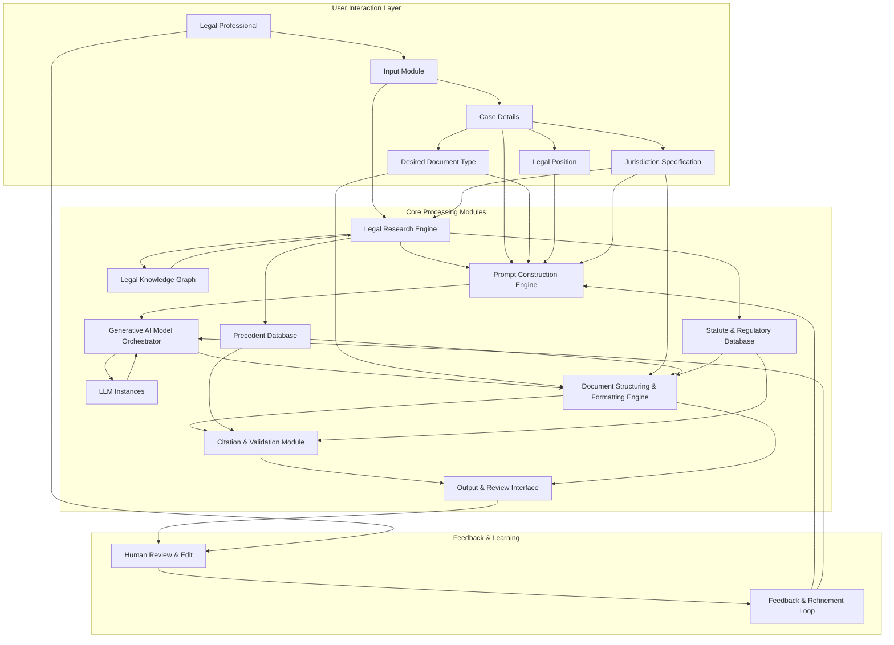

**FACT HEADER - NOTICE OF CONCEPTION**

**Conception ID:** DEMOBANK-INV-092
**Title:** System and Method for Generating Legal Briefs and Arguments
**Date of Conception:** 2024-07-26
**Conceiver:** The Sovereign's Ledger AI

**Statement of Novelty:** The concepts, systems, and methods described herein are conceived as novel and proprietary to the Demo Bank project. This document serves as a timestamped record of conception.

---

**Title of Invention:** System and Method for Generating Legal Briefs and Arguments from Case Summaries and Precedent with Advanced Structuring and Citation

**Abstract:**
A comprehensive system for assisting legal professionals in drafting persuasive documents is disclosed. A lawyer provides a case summary, specific key facts, and the desired legal position. The system ingests this information and performs a sophisticated semantic search on a private, curated database of relevant case law, statutes, and legal commentaries. This combined context, enriched with jurisdictional filtering and knowledge graph insights, is provided to an orchestrated generative AI model. The AI is prompted to act as an expert legal scholar or litigator, generating a complete draft of a legal document, such as a brief, motion, or oral argument. This includes structured sections, persuasive arguments, dynamic citation generation, and validation against primary legal sources. An iterative review and feedback mechanism allows for continuous refinement and learning.

**Background of the Invention:**
Drafting a legal brief is a highly skilled, labor-intensive, and time-consuming process. It requires not only deep legal knowledge but also the ability to structure a persuasive argument, find highly relevant and binding case law, adhere to strict jurisdictional formatting rules, and precisely cite all sources. Junior lawyers can spend days or weeks on a single draft, often incurring significant billable hours for foundational work. There is an urgent need for an intelligent tool that can act as a "first-draft associate," automating the initial, laborious processes of argument structuring, precedent assembly, and accurate citation, thereby freeing up expert human time for higher-level strategy and nuanced refinement.

**Brief Summary of the Invention:**
The present invention provides an "AI Legal Associate" with advanced capabilities. A lawyer inputs their case details, including facts, legal questions, and desired outcomes. The system leverages sophisticated legal research techniques, including vector search and knowledge graph analysis, to identify the most relevant prior cases and statutes from a secure, private legal database, optionally filtered by jurisdiction. It then constructs a comprehensive, multi-stage prompt for a large language model LLM orchestration layer. The prompt instructs the AI to write a specific type of legal document e.g., "a motion to dismiss," or "an appellate brief", using the provided facts and citing the identified precedents and statutes. The AI, with its advanced reasoning and language capabilities, generates a well-structured, coherent, and persuasive draft, complete with formatted citations, which the lawyer can then review, edit, and refine through an integrated feedback loop.

**Detailed Description of the Invention:**

The system operates through several interconnected modules, designed to emulate and assist the legal drafting process.

1.  **User Input and Document Specification:**
    *   **Case Summary:** The user provides a narrative overview of the case.
    *   **Key Facts:** Structured input of critical facts, potentially categorized e.g., undisputed, disputed.
    *   **Legal Questions:** Specific questions the document aims to address or argue.
    *   **Desired Legal Position/Outcome:** The objective of the legal document.
    *   **Document Type:** Selection from a predefined list e.g., "Motion to Dismiss," "Summary Judgment Brief," "Appellate Brief," "Demand Letter."
    *   **Jurisdiction:** Specification of the relevant legal jurisdiction e.g., "California State Courts," "U.S. Federal Court, 9th Circuit."

2.  **Advanced Legal Research Engine:**
    *   **Semantic Search and Retrieval:** Utilizes vector embeddings of legal texts to find contextually similar case law, statutes, regulations, and scholarly articles from a private, up-to-date legal database.
    *   **Jurisdictional Filtering:** Dynamically narrows search results based on the specified jurisdiction, prioritizing binding precedent.
    *   **Knowledge Graph Integration:** Connects entities e.g., cases, statutes, parties, legal concepts, arguments, to uncover non-obvious relationships and strengthen the contextual understanding for the AI. This helps identify foundational precedents or counter-arguments.
    *   **Automated Issue Spotting:** Based on the input facts and legal questions, the system can suggest additional legal issues to research, ensuring comprehensive coverage.

3.  **Dynamic Prompt Generation and AI Orchestration:**
    *   **Contextual Prompt Construction:** A highly detailed and adaptive prompt is generated, integrating the user's input, the retrieved legal precedents, statutes, and insights from the knowledge graph.
    *   **Role-Based Prompting:** The LLM is instructed to adopt specific personas e.g., "senior litigator," "appellate judge," to tailor the tone and style of the output.
    *   **Multi-Stage Prompting/Agentic Behavior:** For complex documents, the process can be broken down into sub-tasks. An orchestrator directs the AI to first outline the argument, then draft individual sections, and finally integrate and refine the entire document, using feedback from earlier stages.
    *   **Constraint Enforcement:** Prompts include explicit instructions for length, tone, specific arguments to emphasize or avoid, and structural requirements.

4.  **Document Structuring and Formatting Engine:**
    *   **Template Adherence:** Applies specific templates based on the selected `Document Type` and `Jurisdiction`, ensuring compliance with court rules e.g., headings, font sizes, margins.
    *   **Section Generation:** Automatically generates standard legal brief sections such as:
        *   Introduction
        *   Statement of Facts
        *   Standard of Review
        *   Argument (with hierarchical sub-sections)
        *   Conclusion
        *   Prayer for Relief
    *   **Argument Outline Generation:** Before full text generation, the system can present a proposed argument outline for lawyer review, allowing for early course correction.

5.  **Automated Citation Generation and Validation Module:**
    *   **In-text Citation:** Identifies where retrieved precedents and statutes should be cited within the generated text.
    *   **Bluebook/Jurisdictional Formatting:** Formats citations according to standard legal citation guides e.g., The Bluebook or specific court rules.
    *   **Citation Validation:** Cross-references generated citations against the primary sources in the legal database to verify accuracy and ensure the cited material actually supports the AI's claims. This includes checking for overturned cases or amended statutes.
    *   **Authority Ranking:** Ranks authorities by relevance, binding nature, and recency, guiding the AI to cite the strongest available precedent.

6.  **Output and Iterative Refinement Interface:**
    *   **Editable Draft Presentation:** The generated document is displayed in a user-friendly editor, allowing lawyers to review, edit, and add their unique insights.
    *   **Source Linking:** Hyperlinks citations directly to the full text of the referenced case law or statute within the private database.
    *   **Feedback Mechanism:** Allows users to highlight parts of the AI-generated text for feedback e.g., "argument is weak here," "citation incorrect," "add more detail on X."
    *   **Refinement Loop:** User feedback is captured and can be used to re-prompt the AI for specific revisions, improving the document iteratively. This feedback can also contribute to long-term model fine-tuning.

**Example Scenario Walkthrough:**

A lawyer needs to draft a motion to dismiss a breach of contract claim in a California Superior Court.
1.  **Input:**
    *   **Case Summary:** "Plaintiff alleges a contract was formed via email, but no formal signature was obtained. Defendant argues lack of mutual assent and statute of frauds."
    *   **Facts:** "Emails exchanged between parties discussing terms. No single email explicitly states 'agreement to be bound'. No physical or electronic signature was applied to any compiled document. Dispute over price."
    *   **Legal Questions:** "Was a binding contract formed via email under California law? Does the Statute of Frauds apply, and if so, is it satisfied?"
    *   **Position:** "Argue that no legally binding contract was formed, or if formed, it's unenforceable under the Statute of Frauds."
    *   **Document Type:** "Motion to Dismiss"
    *   **Jurisdiction:** "California Superior Court"
2.  **Research:** The system performs a semantic search on a California legal database for cases related to "contract formation via email California," "mutual assent California," "Statute of Frauds email California." It retrieves top 5 relevant California appellate and Supreme Court cases and relevant sections of the California Civil Code and Commercial Code. It also consults a knowledge graph to identify related principles of contract law.
3.  **Prompt Construction & AI Orchestration:** A detailed, multi-stage prompt is constructed.
    ```
    You are a senior litigator specializing in California contract law, drafting a Motion to Dismiss for a California Superior Court.
    **Stage 1: Outline Generation**
    Generate a detailed outline for a Motion to Dismiss based on the provided facts and legal questions. The outline should include:
    - Introduction
    - Statement of Facts (summarizing key factual assertions)
    - Legal Standard for Motion to Dismiss
    - Argument (broken into main points: I. No Contract Formed Due to Lack of Mutual Assent; II. If Contract Formed, Unenforceable Under Statute of Frauds)
    - Conclusion
    
    **Stage 2: Draft Generation**
    Using the approved outline, the following case facts, and supporting legal precedents from California, draft the full text of the Motion to Dismiss. Ensure a persuasive, formal, and legally accurate tone. Integrate all facts and cite all provided precedents appropriately using California legal citation format. Ensure each argument section clearly links to the facts.
    
    **Case Facts:** [Facts provided by the user, dynamically inserted]
    **Supporting California Precedents and Statutes:**
    1. [Summary of *Monster Energy Co. v. Schechter* (2019) 7 Cal.5th 781, dynamically inserted]
    2. [Summary of *Bustamante v. Intuit, Inc.* (2006) 141 Cal.App.4th 199, dynamically inserted]
    3. [Summary of relevant Cal. Civ. Code § 1624, dynamically inserted]
    ...
    ```
4.  **AI Generation & Structuring:** The LLM generates the full text of the legal brief according to the outline, applying California Superior Court formatting rules, weaving the facts and precedents into a cohesive argument, and inserting placeholder citations.
5.  **Citation & Validation:** The Citation Module formats the placeholders into Bluebook-style or California-specific citations e.g., `Monster Energy Co. v. Schechter (2019) 7 Cal.5th 781, 793.` It then validates these citations against the legal database, confirming that *Monster Energy* indeed addresses contract formation and that `7 Cal.5th 781, 793` is an accurate page reference for the relevant legal principle.
6.  **Output & Refinement:** The generated document is displayed in an editor with clickable citations. The lawyer reviews, makes edits, and provides feedback e.g., "Strengthen argument on lack of intent to be bound." The system can then use this feedback to regenerate or refine specific sections.

**System Architecture:**



**Claims:**
1.  A method for generating a legal document, comprising:
    a.  Receiving a case summary, a set of facts, a desired legal position, a document type, and a specified jurisdiction from a user.
    b.  Identifying a set of relevant legal precedents and statutes from a legal database, dynamically filtered by the specified jurisdiction.
    c.  Constructing a multi-stage, contextual prompt for a generative AI model, incorporating the case summary, facts, legal position, identified precedents, and statutes.
    d.  Orchestrating the generative AI model to generate a draft of a persuasive legal document according to the prompt and selected document type.
    e.  Applying structural and formatting rules specific to the document type and jurisdiction to the generated draft.
    f.  Automatically generating and validating citations within the document against identified legal precedents and statutes.
    g.  Presenting the structured, formatted, and cited draft document to the user in an editable interface.
    h.  Receiving user feedback on the draft and using said feedback to iteratively refine the document via further AI generation.
2.  A system for generating legal documents, comprising:
    a.  An input module configured to receive case details, desired document type, legal position, and jurisdiction.
    b.  A legal research engine configured to perform semantic search, jurisdictional filtering, and knowledge graph integration on a legal database to retrieve relevant precedents and statutes.
    c.  A prompt construction engine configured to build dynamic, multi-stage prompts based on user input and research results.
    d.  A generative AI model orchestrator configured to manage and direct multiple LLM instances for document generation.
    e.  A document structuring and formatting engine configured to apply specific legal templates and court rules.
    f.  A citation and validation module configured to generate and verify legal citations against primary sources.
    g.  An output and review interface configured to display the generated document, allow user edits, and capture feedback.
    h.  A feedback and refinement loop configured to process user feedback and guide iterative document improvements.
3.  A method according to claim 1, where the citation validation step includes cross-referencing generated citations with the full text of legal sources to verify accuracy and current validity.
4.  A system according to claim 2, where the legal research engine integrates with a legal knowledge graph to enhance contextual understanding and identify related legal principles.
5.  A method according to claim 1, further comprising presenting a proposed argument outline to the user for approval before full document generation.

**Mathematical Justification:**
Let a legal argument be a logical proof `P`. The proof is constructed from a set of facts `F`, a set of binding legal rules `L_B` (statutes, binding precedents), and a set of persuasive legal rules `L_P` (non-binding precedents, scholarly articles). The goal is to prove a conclusion `c`, or to construct an argument `A` leading to `c`.
The function `f` represents the creation of a persuasive legal document: `f(F, L_B, L_P) -> A`.
A human lawyer `H` performs this function `f_H`.
The generative AI model `G_AI`, trained on a vast corpus of legal documents, learns the structure and reasoning patterns of persuasive legal arguments. It performs an approximation `G_AI(F, L'_B, L'_P) -> A'`, where `L'_B` and `L'_P` are the sets of retrieved and jurisdictionally filtered precedents and statutes.

The system's core value is optimizing the search and synthesis process.
Let `S` be the semantic search function over the legal database `D`:
`S: (Q, J) -> L'` where `Q` is the user query, `J` is the jurisdiction, and `L'` is the set of relevant legal texts.

Let `C` be the citation and validation function:
`C: (A', L') -> A''` where `A'` is the AI-generated text, `L'` is the context, and `A''` is the document with verified and formatted citations.

The total process performed by the AI system can be represented as:
`G_system(Q, F, P_des, J) = C(G_AI(K(Q, F, P_des, S(Q, J))), S(Q, J))`
where `K` is the prompt construction engine, `P_des` is the desired legal position.

The iterative refinement loop can be modeled as a sequence of improvements:
`A_0 = G_system(...)`
`A_{i+1} = G_AI(A_i, Feedback_i)`
The goal is to minimize the edit distance `d(A_final, A_human_ideal)` and the human time `t_review`.

**Proof of Value:** The value is measured in the significant reduction of time and cognitive load required by a highly-paid human lawyer. The traditional time for a lawyer to research precedents, structure an argument, draft a document, and format citations is `t_H`. The AI system performs the bulk of this in time `t_AI`, where `t_AI << t_H`. The lawyer's time is then primarily reduced to reviewing, editing, and strategic refinement of the AI-generated draft, `t_review`. The total time with the system is `t_AI + t_review < t_H`. Furthermore, the system enhances quality by ensuring comprehensive research, adherence to formatting standards, and accurate citation, reducing errors that can lead to adverse legal outcomes. The system is proven valuable as it automates the most time-consuming and error-prone parts of legal drafting, freeing up expert human time for higher-level strategy, client interaction, and nuanced legal judgment. `Q.E.D.`

**Technical Specifications:**
The system is implemented using a modular architecture.
*   **Backend:** Python for orchestration, prompt engineering, and API management.
*   **Generative AI:** Integration with state-of-the-art Large Language Models LLMs, potentially including fine-tuned proprietary models or commercial APIs e.g., OpenAI GPT-4, Anthropic Claude 3.
*   **Database:** Vector databases for semantic search e.g., Pinecone, Weaviate and relational/document databases for legal text storage and metadata e.g., PostgreSQL, MongoDB.
*   **Knowledge Graph:** Graph database e.g., Neo4j for storing and querying complex legal relationships.
*   **Frontend:** Web-based interface for user interaction, document editing, and feedback submission, built with modern JavaScript frameworks e.g., React, Vue.js.
*   **Deployment:** Cloud-native architecture e.g., AWS, GCP, Azure for scalability and reliability.

**Potential Future Enhancements:**
1.  **Multi-Jurisdictional Analysis:** Ability to generate comparative legal analyses across different jurisdictions.
2.  **Litigation Strategy Advisor:** Suggesting optimal legal strategies or counter-arguments based on predictive analytics from past case outcomes.
3.  **Document Comparison & Redlining:** Automatically comparing AI-generated drafts with previous versions or opposing counsel's documents, highlighting changes and suggesting responses.
4.  **Local Rules Integration:** Even deeper integration with highly specific local court rules that go beyond standard jurisdictional requirements.
5.  **Voice-to-Text Input:** Allowing lawyers to dictate facts and arguments directly.
6.  **Ethical AI Guardrails:** Enhanced mechanisms to identify and mitigate biases in retrieved data or AI-generated arguments, ensuring fairness and ethical compliance.
7.  **Expert Witness Integration:** Generating relevant questions or summaries based on expert witness reports.