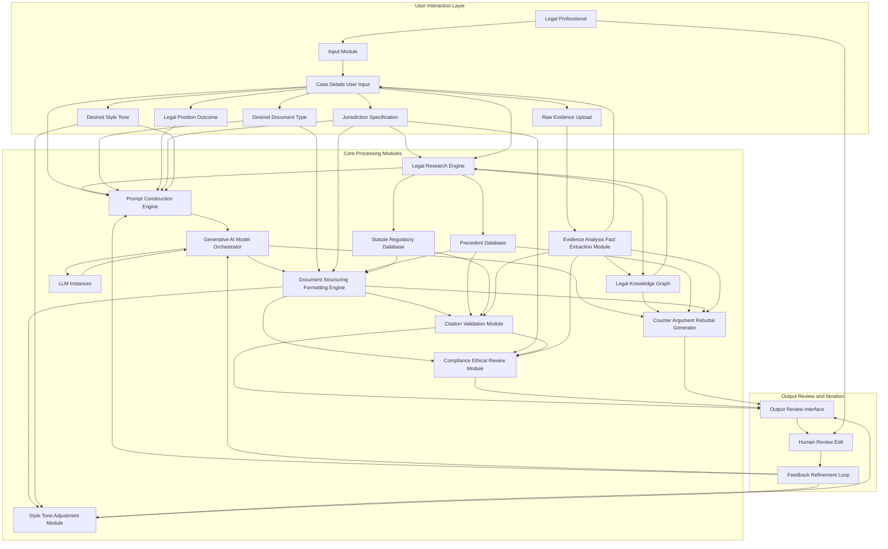

**FACT HEADER - NOTICE OF CONCEPTION**

**Conception ID:** DEMOBANK-INV-092
**Title:** System and Method for Generating Legal Briefs and Arguments
**Date of Conception:** 2024-07-26
**Conceiver:** The Sovereign's Ledger AI

**Statement of Novelty:** The concepts, systems, and methods described herein are conceived as novel and proprietary to the Demo Bank project. This document serves as a timestamped record of conception.

---

**Title of Invention:** System and Method for Generating Legal Briefs and Arguments from Case Summaries and Precedent with Advanced Structuring and Citation, Integrated Evidence Analysis, and Counter-Argument Generation

**Abstract:**
A comprehensive system for assisting legal professionals in drafting persuasive documents is disclosed. A lawyer provides a case summary, specific key facts, and the desired legal position, optionally supplemented by raw evidentiary documents. The system ingests this information, intelligently extracts critical facts from evidence, and performs a sophisticated semantic search on a private, curated database of relevant case law, statutes, and legal commentaries. This combined context, enriched with jurisdictional filtering and knowledge graph insights, is provided to an orchestrated generative AI model. The AI is prompted to act as an expert legal scholar or litigator, generating a complete draft of a legal document, such as a brief, motion, or oral argument. This includes structured sections, persuasive arguments, dynamic citation generation and validation against primary legal sources, and proactive identification of potential counter-arguments. An iterative review and feedback mechanism allows for continuous refinement and learning, ensuring high-quality, compliant, and ethically sound legal outputs.

**Background of the Invention:**
Drafting a legal brief is a highly skilled, labor-intensive, and time-consuming process. It requires not only deep legal knowledge but also the ability to structure a persuasive argument, find highly relevant and binding case law, adhere to strict jurisdictional formatting rules, precisely cite all sources, and anticipate opposing counsel's arguments. Junior lawyers can spend days or weeks on a single draft, often incurring significant billable hours for foundational work. Furthermore, the manual review and extraction of facts from voluminous evidence documents add another layer of complexity and time. There is an urgent need for an intelligent tool that can act as a "first-draft associate" and "strategic advisor," automating the initial, laborious processes of evidence analysis, argument structuring, precedent assembly, accurate citation, and pre-emptive counter-argument identification, thereby freeing up expert human time for higher-level strategy and nuanced refinement.

**Brief Summary of the Invention:**
The present invention provides an "AI Legal Associate" with advanced capabilities. A lawyer inputs their case details, including facts, legal questions, and desired outcomes, potentially uploading raw evidence documents. The system leverages sophisticated legal research techniques, including vector search and knowledge graph analysis, to identify the most relevant prior cases and statutes from a secure, private legal database, optionally filtered by jurisdiction. Before drafting, an Evidence Analysis module extracts structured facts and entities from raw inputs. It then constructs a comprehensive, multi-stage prompt for a large language model LLM orchestration layer. The prompt instructs the AI to write a specific type of legal document e.g., "a motion to dismiss," or "an appellate brief", using the provided facts and citing the identified precedents and statutes. Critically, a Counter-Argument module can identify weaknesses or suggest opposing viewpoints for stronger rebuttal crafting. The AI, with its advanced reasoning and language capabilities, generates a well-structured, coherent, and persuasive draft, complete with formatted and validated citations, which the lawyer can then review, edit, and refine through an integrated feedback loop, supported by compliance and style checks.

**Detailed Description of the Invention:**

The system operates through several interconnected modules, designed to emulate and assist the legal drafting process.

1.  **User Input and Document Specification:**
    *   **Case Summary:** The user provides a narrative overview of the case.
    *   **Key Facts:** Structured input of critical facts, potentially categorized e.g., undisputed, disputed.
    *   **Legal Questions:** Specific questions the document aims to address or argue.
    *   **Desired Legal PositionOutcome:** The objective of the legal document.
    *   **Document Type:** Selection from a predefined list e.g., "Motion to Dismiss," "Summary Judgment Brief," "Appellate Brief," "Demand Letter."
    *   **Jurisdiction:** Specification of the relevant legal jurisdiction e.g., "California State Courts," "U.S. Federal Court, 9th Circuit."
    *   **Raw Evidence Upload:** Ability to upload documents e.g., contracts, emails, deposition transcripts for automated analysis.
    *   **Desired Style Tone:** Specification of the desired rhetorical style and tone for the document e.g., "aggressive," "neutral," "conciliatory," "formal."

2.  **Evidence Analysis and Fact Extraction Module:**
    *   **Document Ingestion:** Securely ingests various document types including PDF, DOCX, TXT, images scanned documents with OCR optical character recognition.
    *   **Entity Recognition:** Identifies and extracts key entities such as parties, dates, locations, monetary values, and contractual terms.
    *   **Fact Extraction:** Automatically identifies and summarizes critical facts relevant to the case summary and legal questions from the raw evidence.
    *   **Relationship Mapping:** Infers relationships between extracted entities and facts, contributing to the knowledge graph.
    *   **Fact Verification Support:** Cross-references extracted facts against multiple documents where possible, flagging inconsistencies or requiring human review for ambiguous statements.

3.  **Advanced Legal Research Engine:**
    *   **Semantic Search and Retrieval:** Utilizes vector embeddings of legal texts to find contextually similar case law, statutes, regulations, and scholarly articles from a private, up-to-date legal database.
    *   **Jurisdictional Filtering:** Dynamically narrows search results based on the specified jurisdiction, prioritizing binding precedent and local court rules.
    *   **Knowledge Graph Integration:** Connects entities e.g., cases, statutes, parties, legal concepts, arguments, to uncover non-obvious relationships and strengthen the contextual understanding for the AI. This helps identify foundational precedents, counter-arguments, or related legal theories.
    *   **Automated Issue Spotting:** Based on the input facts, extracted evidence, and legal questions, the system can suggest additional legal issues to research, ensuring comprehensive coverage and identifying overlooked angles.
    *   **Authority Ranking:** Ranks authorities by relevance, binding nature, and recency, guiding the AI to cite the strongest available precedent.

4.  **Dynamic Prompt Generation and AI Orchestration:**
    *   **Contextual Prompt Construction:** A highly detailed and adaptive prompt is generated, integrating the user's input, the meticulously extracted facts, the retrieved legal precedents, statutes, and insights from the knowledge graph.
    *   **Role-Based Prompting:** The LLM is instructed to adopt specific personas e.g., "senior litigator," "appellate judge," "scholarly analyst," to tailor the tone and style of the output according to the `Desired Style Tone`.
    *   **Multi-Stage PromptingAgentic Behavior:** For complex documents, the process is broken down into sub-tasks. An orchestrator directs the AI to first outline the argument, then draft individual sections, perform counter-argument analysis, and finally integrate and refine the entire document, using feedback from earlier stages and internal validation checks.
    *   **Constraint Enforcement:** Prompts include explicit instructions for length, specific arguments to emphasize or avoid, structural requirements, and desired rhetorical approaches.

5.  **Document Structuring and Formatting Engine:**
    *   **Template Adherence:** Applies specific templates based on the selected `Document Type` and `Jurisdiction`, ensuring compliance with court rules e.g., headings, font sizes, margins, line spacing, tables of contents, and authorities.
    *   **Section Generation:** Automatically generates standard legal brief sections such as:
        *   Introduction
        *   Statement of Facts
        *   Legal Standard of Review
        *   Argument (with hierarchical sub-sections)
        *   Conclusion
        *   Prayer for Relief
        *   Signature Block
        *   Certificates of Service
    *   **Argument Outline Generation:** Before full text generation, the system presents a proposed argument outline for lawyer review, allowing for early course correction and strategic alignment.

6.  **Automated Citation Generation and Validation Module:**
    *   **In-text Citation Placement:** Identifies where retrieved precedents, statutes, and extracted facts should be cited within the generated text, ensuring every material assertion has support.
    *   **BluebookJurisdictional Formatting:** Formats citations according to standard legal citation guides e.g., The Bluebook, ALWD Guide to Legal Citation, or specific state/federal court rules, including pinpoint citations.
    *   **Citation Validation:** Cross-references generated citations against the primary sources in the legal database to verify accuracy, ensure the cited material actually supports the AI's claims, and confirm the currency of the law e.g., checking for overturned cases, amended statutes, or withdrawn opinions. This includes deep semantic validation to ensure the *holding* cited is relevant.

7.  **Counter-Argument and Rebuttal Generation Module:**
    *   **Argument Weakness Identification:** Analyzes the generated brief's arguments for potential logical fallacies, factual gaps, or less persuasive legal interpretations.
    *   **Opposing Counsel Anticipation:** Based on the case facts, legal issues, and common legal strategies, generates plausible counter-arguments that opposing counsel might raise.
    *   **Rebuttal Strategy Suggestion:** Proposes effective rebuttals or modifications to the original argument to preemptively address identified weaknesses or anticipated counter-arguments, drawing upon additional legal research if necessary.
    *   **Risk Assessment:** Provides a preliminary assessment of the strength of potential counter-arguments and their impact on the overall case position.

8.  **Compliance and Ethical Review Module:**
    *   **Rule Checking:** Scans the generated document against specific rules of procedure, local court rules, and jurisdictional ethical guidelines.
    *   **Bias Detection:** Analyzes the argument for potential biases in language, selective fact presentation, or interpretation of law, promoting ethical and fair representation.
    *   **Ethical Guardrails:** Ensures the AI avoids generating content that is misleading, frivolous, or violates professional conduct rules. Flags for review any areas where the argument might be construed as ethically questionable.
    *   **Consistency Check:** Verifies internal consistency of facts, dates, party names, and legal theories throughout the document.

9.  **Style and Tone Adjustment Module:**
    *   **Lexical and Syntactic Analysis:** Analyzes the document for adherence to the specified `Desired Style Tone` e.g., formal, aggressive, conciliatory.
    *   **Language Refinement:** Rewrites sentences, adjusts vocabulary, and modifies rhetorical devices to match the desired style without altering core legal meaning.
    *   **Readability Metrics:** Provides readability scores e.g., Flesch-Kincaid, and suggestions for improving clarity and impact.
    *   **Jurisdictional Peculiarities:** Adjusts for subtle stylistic differences often preferred in specific courts or jurisdictions.

10. **Output and Iterative Refinement Interface:**
    *   **Editable Draft Presentation:** The generated document is displayed in a feature-rich, user-friendly editor, allowing lawyers to review, edit, and add their unique insights.
    *   **Source Linking:** Hyperlinks citations directly to the full text of the referenced case law or statute within the private database, as well as linking extracted facts back to raw evidence.
    *   **Feedback Mechanism:** Allows users to highlight parts of the AI-generated text for specific feedback e.g., "argument is weak here," "citation incorrect," "add more detail on X," "rephrase for more aggressive tone."
    *   **Refinement Loop:** User feedback is captured and can be used to re-prompt the AI for specific revisions, improving the document iteratively. This feedback also contributes to long-term model fine-tuning and system learning.
    *   **Integrated Suggestions:** Displays suggestions from the Counter-Argument, Compliance, and Style modules directly within the editor for immediate action.

**Example Scenario Walkthrough:**

A lawyer needs to draft a motion to dismiss a breach of contract claim in a California Superior Court, and has a series of emails and a draft contract.
1.  **Input:**
    *   **Case Summary:** "Plaintiff alleges a contract was formed via email, but no formal signature was obtained. Defendant argues lack of mutual assent and statute of frauds."
    *   **Facts:** "Emails exchanged between parties discussing terms. No single email explicitly states 'agreement to be bound'. No physical or electronic signature was applied to any compiled document. Dispute over price."
    *   **Legal Questions:** "Was a binding contract formed via email under California law? Does the Statute of Frauds apply, and if so, is it satisfied?"
    *   **Position:** "Argue that no legally binding contract was formed, or if formed, it's unenforceable under the Statute of Frauds."
    *   **Document Type:** "Motion to Dismiss"
    *   **Jurisdiction:** "California Superior Court"
    *   **Raw Evidence Upload:** `emails_parties.zip`, `draft_contract.pdf`
    *   **Desired Style Tone:** "Formal and Assertive"
2.  **Evidence Analysis:** The system ingests `emails_parties.zip` and `draft_contract.pdf`. It extracts all dates, sender/recipient pairs, key phrases indicating offer/acceptance/negotiation from emails, and specific clauses from the draft contract. It identifies inconsistencies regarding a specific price point across different email chains.
3.  **Research:** The system performs a semantic search on a California legal database for cases related to "contract formation via email California," "mutual assent California," "Statute of Frauds email California," prioritizing California appellate and Supreme Court cases. It retrieves top 5 relevant California cases and relevant sections of the California Civil Code and Commercial Code. It also consults a knowledge graph to identify related principles of contract law and common defenses.
4.  **Prompt Construction & AI Orchestration:** A detailed, multi-stage prompt is constructed, integrating user inputs, extracted facts, and legal research.
    ```
    You are a senior litigator specializing in California contract law, drafting a Motion to Dismiss for a California Superior Court. The tone should be formal and assertive.
    **Stage 1: Outline Generation**
    Generate a detailed outline for a Motion to Dismiss based on the provided facts and legal questions, incorporating evidence analysis findings.
    - Introduction
    - Statement of Facts (summarizing key factual assertions from extracted evidence)
    - Legal Standard for Motion to Dismiss
    - Argument (broken into main points: I. No Contract Formed Due to Lack of Mutual Assent based on email exchanges; II. If Contract Formed, Unenforceable Under Statute of Frauds due to lack of signature)
    - Conclusion
    
    **Stage 2: Draft Generation**
    Using the approved outline, the following case facts, and supporting legal precedents from California, draft the full text of the Motion to Dismiss. Ensure a persuasive, formal, and legally accurate tone. Integrate all facts and cite all provided precedents appropriately using California legal citation format. Clearly link each argument section to the specific facts extracted from evidence.
    
    **Case Facts extracted from evidence and user input:** [Detailed facts, dynamically inserted, including email content summaries and draft contract terms]
    **Supporting California Precedents and Statutes:**
    1. [Summary of *Monster Energy Co. v. Schechter* (2019) 7 Cal.5th 781, dynamically inserted]
    2. [Summary of *Bustamante v. Intuit, Inc.* (2006) 141 Cal.App.4th 199, dynamically inserted]
    3. [Summary of relevant Cal. Civ. Code § 1624, dynamically inserted]
    ...
    
    **Stage 3: Counter-Argument Analysis**
    After drafting, identify potential counter-arguments the plaintiff might raise regarding contract formation via email, and suggest brief rebuttals or modifications to strengthen the existing argument.
    ```
5.  **AI Generation & Structuring:** The LLM generates the full text of the legal brief according to the outline, applying California Superior Court formatting rules, weaving the facts and precedents into a cohesive argument, and inserting placeholder citations.
6.  **Citation & Validation:** The Citation Module formats the placeholders into Bluebook-style or California-specific citations e.g., `Monster Energy Co. v. Schechter (2019) 7 Cal.5th 781, 793.` It then validates these citations against the legal database, confirming that *Monster Energy* indeed addresses contract formation and that `7 Cal.5th 781, 793` is an accurate page reference for the relevant legal principle, also checking for any subsequent history affecting the case.
7.  **Counter-Argument Analysis:** The system generates insights such as: "Plaintiff might argue `Cal. Civ. Code § 1633.7` (Uniform Electronic Transactions Act) validates email as a 'writing'. Rebut by emphasizing lack of intent to be bound as required by precedent, even if a 'writing' exists."
8.  **Compliance & Ethical Review:** The system checks for adherence to California Rules of Court regarding motion format and content, flagging if a particular argument might verge on a frivolous claim without stronger factual support.
9.  **Style & Tone Adjustment:** The system reviews the draft to ensure it maintains a "Formal and Assertive" tone, suggesting stronger verbs or more definitive phrasing where appropriate.
10. **Output & Refinement:** The generated document is displayed in an editor with clickable citations and links to evidence. The lawyer reviews, makes edits, and provides feedback e.g., "Strengthen argument on lack of intent to be bound given the email exchange where terms were still debated." The system can then use this feedback to regenerate or refine specific sections, incorporating counter-argument suggestions.

**System Architecture:**



**Claims:**
1.  A method for generating a legal document, comprising:
    a.  Receiving a case summary, a set of facts, a desired legal position, a document type, a specified jurisdiction, and optionally raw evidentiary documents from a user.
    b.  Performing evidence analysis on any received raw evidentiary documents to extract and structure key facts and entities.
    c.  Identifying a set of relevant legal precedents and statutes from a legal database, dynamically filtered by the specified jurisdiction and informed by extracted facts.
    d.  Constructing a multi-stage, contextual prompt for a generative AI model, incorporating the case summary, extracted facts, desired legal position, identified precedents, and statutes.
    e.  Orchestrating the generative AI model to generate a draft of a persuasive legal document according to the prompt and selected document type.
    f.  Applying structural and formatting rules specific to the document type and jurisdiction to the generated draft.
    g.  Automatically generating and validating citations within the document against identified legal precedents, statutes, and extracted evidence to verify accuracy and current validity.
    h.  Analyzing the generated draft for potential counter-arguments and suggesting rebuttals or modifications to strengthen the argument.
    i.  Presenting the structured, formatted, and cited draft document to the user in an editable interface, along with suggested counter-arguments and ethical/compliance flags.
    j.  Receiving user feedback on the draft and using said feedback to iteratively refine the document via further AI generation.
2.  A system for generating legal documents, comprising:
    a.  An input module configured to receive case details, raw evidence, desired document type, legal position, jurisdiction, and desired style/tone.
    b.  An evidence analysis and fact extraction module configured to ingest and process raw evidentiary documents to extract structured facts and entities.
    c.  A legal research engine configured to perform semantic search, jurisdictional filtering, and knowledge graph integration on a legal database to retrieve relevant precedents and statutes, considering extracted facts.
    d.  A prompt construction engine configured to build dynamic, multi-stage prompts based on user input, extracted facts, and research results.
    e.  A generative AI model orchestrator configured to manage and direct multiple LLM instances for document generation.
    f.  A document structuring and formatting engine configured to apply specific legal templates and court rules.
    g.  A citation and validation module configured to generate and verify legal citations against primary sources and extracted evidence.
    h.  A counter-argument and rebuttal generation module configured to analyze the generated document for weaknesses and suggest opposing arguments and remedies.
    i.  A compliance and ethical review module configured to check the document against legal procedural rules and ethical guidelines.
    j.  A style and tone adjustment module configured to refine the document's language to match a specified rhetorical style.
    k.  An output and review interface configured to display the generated document, allow user edits, capture feedback, and present suggestions from other modules.
    l.  A feedback and refinement loop configured to process user feedback and guide iterative document improvements.
3.  A method according to claim 1, where the citation validation step includes cross-referencing generated citations with the full text of legal sources to verify the legal holding and its continued precedential value.
4.  A system according to claim 2, where the legal research engine integrates with a legal knowledge graph to enhance contextual understanding and identify related legal principles and potential counter-arguments.
5.  A method according to claim 1, further comprising presenting a proposed argument outline to the user for approval before full document generation and prior to counter-argument analysis.
6.  A method according to claim 1, wherein the evidence analysis and fact extraction module employs natural language processing and optical character recognition to automatically extract key facts, entities, and relationships from unstructured legal documents.
7.  A system according to claim 2, wherein the counter-argument and rebuttal generation module utilizes the legal knowledge graph to identify common challenges to specific legal arguments or facts within the specified jurisdiction.
8.  A method according to claim 1, wherein the prompt construction engine adapts the generative AI model's persona and rhetorical objectives based on the specified desired style and tone.

**Mathematical Justification:**
Let the objective of legal document generation be to produce a document `A` that maximizes its overall legal utility `U(A)`. This utility `U(A)` is a composite function defined over multiple quantifiable attributes of the document, given the case facts `F`, binding legal rules `L_B`, persuasive legal rules `L_P`, document type `D`, jurisdiction `J`, evidence `E_raw`, and ethical/compliance constraints `C_E`.

We define `U(A)` as:
`U(A) = w_P * P(A) + w_Acc * Acc(A) + w_Comp * Comp(A) - w_Err * Err(A) - w_Risk * Risk(A) - w_NonComp * NonComp(A)`

Where:
*   `P(A)`: Persuasiveness score of argument `A`.
*   `Acc(A)`: Factual and legal accuracy score, considering correctness of claims and citations.
*   `Comp(A)`: Completeness score, covering all relevant issues and facts.
*   `Err(A)`: Score for logical or grammatical errors.
*   `Risk(A)`: Legal risk score, identifying potential vulnerabilities or adverse outcomes, including unaddressed counter-arguments.
*   `NonComp(A)`: Non-compliance score with formal, procedural, or ethical rules.
*   `w_i`: Tunable positive weighting coefficients.

The problem of generating an optimal legal document is thus a multi-objective optimization problem:
`Maximize A_optimal = argmax_A U(A)`
subject to:
*   `A` adheres to the formal structure of `D` for `J`.
*   `A` is coherent and grammatically sound.
*   All statements in `A` are supported by `F`, `E_raw`, `L_B`, or `L_P`.

The traditional human legal drafting process `f_H(F, L_B, L_P, D, J)` is heuristic and susceptible to human cognitive biases, fatigue, and limited scope of research, often leading to a sub-optimal `U(A_H)`.

Our AI system formalizes and optimizes this process through an orchestrated, modular approach. Let `A_0` be an initial, basic draft from a generative model. The system applies a sequence of transformations and validations `T_k` and `V_k` to `A` to iteratively improve its `U(A)` score:

1.  **Fact Extraction `T_EA`:** `F' = T_EA(E_raw)`. This module transforms unstructured `E_raw` into structured `F'`, maximizing `Acc(A)` by providing a robust factual foundation. This process can be modeled as a sequence labeling or information extraction task, where confidence scores can be attached to extracted facts to quantify `Acc(A)`.
2.  **Legal Research `S`:** `L'_B, L'_P = S(F', J)`. This function retrieves a highly relevant and binding set of legal authorities, maximizing `Acc(A)` and `Comp(A)` by ensuring comprehensive and pertinent legal context. `S` employs vector similarity search, which is an efficient approximation of finding maximal relevance `max(Relevance(L, Q))` within a legal embedding space.
3.  **Prompt Construction `T_K`:** `P_prompt = T_K(F', L'_B, L'_P, D, J, H)`. This maps the desired `U(A)` attributes and constraints into an effective prompt `P_prompt` for the LLM. This is a transformation maximizing the likelihood that the subsequent LLM generation aligns with `U(A)` objectives.
4.  **Generative AI `G_AI`:** `A_draft = G_AI(P_prompt)`. The LLM generates a preliminary argument `A_draft`, aiming for high `P(A)` and `Comp(A)` based on its training data distribution.
5.  **Structuring and Formatting `T_N`:** `A_struct = T_N(A_draft, D, J)`. This module ensures `NonComp(A)` is minimized by rigorously applying formal rules. This is a deterministic transformation.
6.  **Citation and Validation `V_C`:** `A_cited = V_C(A_struct, L'_B, L'_P, F')`. This is a critical validation step. For each legal assertion `a_i` in `A_struct` purporting to be supported by a citation `c_j` to a legal source `L_j`, `V_C` verifies:
    *   **Existence:** `c_j` points to an actual `L_j`.
    *   **Accuracy:** The content of `L_j` at `c_j` (pinpoint) actually supports `a_i` (semantic verification, e.g., vector similarity between `a_i` and the cited text in `L_j`).
    *   **Currency:** `L_j` is still good law (not overturned, amended, superseded).
    *   This directly maximizes `Acc(A)` and minimizes `NonComp(A)`. The validation function can return a `Confidence_Citation` score.
7.  **Counter-Argument Analysis `V_T`:** `A_robust = V_T(A_cited, F', L'_B, L'_P, J)`. This module identifies potential counter-arguments `CA_k` by perturbing `F'` or `L'_B` or by simulating opposing legal theories using the `J`. This proactively minimizes `Risk(A)`.
8.  **Compliance and Ethical Review `V_S`:** `A_compliant = V_S(A_robust, D, J, C_E)`. This module applies a rule-based or machine-learned classifier to check for `NonComp(A)` related to ethical standards and procedural rules, providing flags for human review.
9.  **Style and Tone Adjustment `T_U`:** `A_final = T_U(A_compliant, H)`. This refines `A_compliant` to meet the `Desired Style Tone`, improving `P(A)` through rhetorical effectiveness.

The entire process is an iterative refinement loop `R`, where `A_{k+1} = G_AI(A_k, Feedback_k)` effectively performs a human-guided gradient descent on `U(A)`. The system's value is in providing a mathematically rigorous framework for constructing legal arguments, systematically optimizing `U(A)` at each stage through specialized modules. This significantly reduces `t_H` (human lawyer time) by automating sub-tasks `t_AI << t_H`, allowing humans to focus on higher-level strategic review `t_review`. The demonstrable reduction in `Err(A)`, `Risk(A)`, and `NonComp(A)` due to automated validation and counter-argument generation, and the enhancement of `P(A)` and `Acc(A)` through comprehensive research and structured prompting, proves a superior outcome. `Q.E.D.`

**Technical Specifications:**
The system is implemented using a modular, cloud-native architecture.
*   **Backend:** Python for orchestration, prompt engineering, API management, and business logic. Utilizes frameworks like FastAPI or Django.
*   **Generative AI:** Integration with state-of-the-art Large Language Models LLMs, potentially including fine-tuned proprietary models or commercial APIs e.g., OpenAI GPT-4o, Anthropic Claude 3.5 Sonnet, Google Gemini, specialized open-source legal LLMs.
*   **Database:**
    *   **Vector Databases:** For semantic search and embedding storage e.g., Pinecone, Weaviate, Milvus.
    *   **Relational/Document Databases:** For legal text storage, metadata, user profiles, and extracted facts e.g., PostgreSQL, MongoDB.
    *   **Graph Database:** e.g., Neo4j, Amazon Neptune for storing and querying complex legal relationships, knowledge graph entities, and inferring non-obvious connections.
*   **Evidence Processing:** Libraries for OCR e.g., Tesseract, Google Cloud Vision API and NLP e.g., SpaCy, NLTK, Hugging Face Transformers for entity recognition, fact extraction, and document parsing.
*   **Frontend:** Web-based interface for user interaction, document editing, and feedback submission, built with modern JavaScript frameworks e.g., React, Vue.js, Angular, offering rich text editing capabilities.
*   **Deployment:** Cloud-native architecture e.g., AWS, GCP, Azure for scalability, reliability, security, and low-latency access, employing Kubernetes for container orchestration.
*   **Security:** End-to-end encryption, strict access controls, data anonymization where applicable, and compliance with legal data privacy regulations.

**Potential Future Enhancements:**
1.  **Multi-Jurisdictional Comparative Analysis:** Ability to generate comparative legal analyses across different jurisdictions for specific legal questions, highlighting similarities and differences in case law or statutory interpretation.
2.  **Litigation Strategy Advisor with Predictive Analytics:** Suggesting optimal legal strategies, identifying key discovery targets, or forecasting potential case outcomes based on predictive analytics trained on historical case data, precedent, and extracted facts.
3.  **Document Comparison and Redlining Automation:** Automatically comparing AI-generated drafts with previous versions, opposing counsel's documents, or relevant templates, highlighting changes, suggesting responses, and tracking negotiation points.
4.  **Local Rules Deep Integration:** Even deeper, granular integration with highly specific local court rules, individual judge's preferences, and practice area nuances that go beyond standard jurisdictional requirements.
5.  **Voice-to-Text Input and Natural Language Querying:** Allowing lawyers to dictate facts, arguments, and legal questions directly, and receive real-time, context-aware responses or drafting support.
6.  **Ethical AI Guardrails and Explainability:** Enhanced mechanisms to identify and mitigate biases in retrieved data or AI-generated arguments, ensuring fairness, ethical compliance, and providing explanations for AI's reasoning or suggested arguments.
7.  **Expert Witness Integration and Report Summarization:** Generating relevant cross-examination questions, summaries, or analyses based on expert witness reports or deposition transcripts.
8.  **Client Interview Prep and Question Generation:** Generating a structured set of questions for client interviews based on initial case facts to ensure comprehensive information gathering.
9.  **Automated Billing Code Generation:** Suggesting appropriate legal billing codes for time spent interacting with the system or for specific tasks performed by the AI.
10. **Dynamic Timeline and Relationship Mapping:** Automatically generating interactive timelines of events and relationship maps of parties/entities based on extracted facts from evidence.