**FACT HEADER - NOTICE OF CONCEPTION**

**Conception ID:** DEMOBANK-INV-092
**Title:** System and Method for Generating Legal Briefs and Arguments
**Date of Conception:** 2024-07-26
**Conceiver:** The Sovereign's Ledger AI

**Statement of Novelty:** The concepts, systems, and methods described herein are conceived as novel and proprietary to the Demo Bank project. This document serves as a timestamped record of conception.

---

**Title of Invention:** System and Method for Generating Legal Briefs and Arguments from Case Summaries and Precedent with Advanced Structuring and Citation, Integrated Evidence Analysis, and Counter-Argument Generation

**Abstract:**
A comprehensive system for assisting legal professionals in drafting persuasive documents is disclosed. A lawyer provides a case summary, specific key facts, and the desired legal position, optionally supplemented by raw evidentiary documents. The system ingests this information, intelligently extracts critical facts from evidence, and performs a sophisticated semantic search on a private, curated database of relevant case law, statutes, and legal commentaries. This combined context, enriched with jurisdictional filtering and knowledge graph insights, is provided to an orchestrated generative AI model. The AI is prompted to act as an expert legal scholar or litigator, generating a complete draft of a legal document, such as a brief, motion, or oral argument. This includes structured sections, persuasive arguments, dynamic citation generation and validation against primary legal sources, and proactive identification of potential counter-arguments. An iterative review and feedback mechanism allows for continuous refinement and learning, ensuring high-quality, compliant, and ethically sound legal outputs, operating as a foundational component within a broader, post-scarcity governance framework.

**Background of the Invention:**
Drafting a legal brief is a highly skilled, labor-intensive, and time-consuming process. It requires not only deep legal knowledge but also the ability to structure a persuasive argument, find highly relevant and binding case law, adhere to strict jurisdictional formatting rules, precisely cite all sources, and anticipate opposing counsel's arguments. Junior lawyers can spend days or weeks on a single draft, often incurring significant billable hours for foundational work. Furthermore, the manual review and extraction of facts from voluminous evidence documents add another layer of complexity and time. There is an urgent need for an intelligent tool that can act as a "first-draft associate" and "strategic advisor," automating the initial, laborious processes of evidence analysis, argument structuring, precedent assembly, accurate citation, and pre-emptive counter-argument identification, thereby freeing up expert human time for higher-level strategy and nuanced refinement. In an emerging era of post-scarcity and automation, where traditional labor structures diminish, the efficient and ethical resolution of disputes, resource allocation, and codification of emergent social contracts becomes paramount, necessitating an advanced, impartial, and globally accessible legal intelligence system.

**Brief Summary of the Invention:**
The present invention provides an "AI Legal Associate" with advanced capabilities. A lawyer inputs their case details, including facts, legal questions, and desired outcomes, potentially uploading raw evidence documents. The system leverages sophisticated legal research techniques, including vector search and knowledge graph analysis, to identify the most relevant prior cases and statutes from a secure, private legal database, optionally filtered by jurisdiction. Before drafting, an Evidence Analysis module extracts structured facts and entities from raw inputs. It then constructs a comprehensive, multi-stage prompt for a large language model LLM orchestration layer. The prompt instructs the AI to write a specific type of legal document e.g., "a motion to dismiss," or "an appellate brief", using the provided facts and citing the identified precedents and statutes. Critically, a Counter-Argument module can identify weaknesses or suggest opposing viewpoints for stronger rebuttal crafting. The AI, with its advanced reasoning and language capabilities, generates a well-structured, coherent, and persuasive draft, complete with formatted and validated citations, which the lawyer can then review, edit, and refine through an integrated feedback loop, supported by compliance and style checks. This system is envisioned as a critical governance and arbitration tool within a future global network prioritizing human well-being, ecological stewardship, and equitable resource distribution.

**Detailed Description of the Invention:**

The system operates through several interconnected modules, designed to emulate and assist the legal drafting process.

1.  **User Input and Document Specification:**
    *   **Case Summary:** The user provides a narrative overview of the case.
    *   **Key Facts:** Structured input of critical facts, potentially categorized e.g., undisputed, disputed.
    *   **Legal Questions:** Specific questions the document aims to address or argue.
    *   **Desired Legal PositionOutcome:** The objective of the legal document.
    *   **Document Type:** Selection from a predefined list e.g., "Motion to Dismiss," "Summary Judgment Brief," "Appellate Brief," "Demand Letter."
    *   **Jurisdiction:** Specification of the relevant legal jurisdiction e.g., "California State Courts," "U.S. Federal Court, 9th Circuit."
    *   **Raw Evidence Upload:** Ability to upload documents e.g., contracts, emails, deposition transcripts for automated analysis.
    *   **Desired Style Tone:** Specification of the desired rhetorical style and tone for the document e.g., "aggressive," "neutral," "conciliatory," "formal."

2.  **Evidence Analysis and Fact Extraction Module:**
    *   **Document Ingestion:** Securely ingests various document types including PDF, DOCX, TXT, images scanned documents with OCR optical character recognition.
    *   **Entity Recognition:** Identifies and extracts key entities such as parties, dates, locations, monetary values, and contractual terms.
    *   **Fact Extraction:** Automatically identifies and summarizes critical facts relevant to the case summary and legal questions from the raw evidence.
    *   **Relationship Mapping:** Infers relationships between extracted entities and facts, contributing to the knowledge graph.
    *   **Fact Verification Support:** Cross-references extracted facts against multiple documents where possible, flagging inconsistencies or requiring human review for ambiguous statements.

3.  **Advanced Legal Research Engine:**
    *   **Semantic Search and Retrieval:** Utilizes vector embeddings of legal texts to find contextually similar case law, statutes, regulations, and scholarly articles from a private, up-to-date legal database.
    *   **Jurisdictional Filtering:** Dynamically narrows search results based on the specified jurisdiction, prioritizing binding precedent and local court rules.
    *   **Knowledge Graph Integration:** Connects entities e.g., cases, statutes, parties, legal concepts, arguments, to uncover non-obvious relationships and strengthen the contextual understanding for the AI. This helps identify foundational precedents, counter-arguments, or related legal theories.
    *   **Automated Issue Spotting:** Based on the input facts, extracted evidence, and legal questions, the system can suggest additional legal issues to research, ensuring comprehensive coverage and identifying overlooked angles.
    *   **Authority Ranking:** Ranks authorities by relevance, binding nature, and recency, guiding the AI to cite the strongest available precedent.

4.  **Dynamic Prompt Generation and AI Orchestration:**
    *   **Contextual Prompt Construction:** A highly detailed and adaptive prompt is generated, integrating the user's input, the meticulously extracted facts, the retrieved legal precedents, statutes, and insights from the knowledge graph.
    *   **Role-Based Prompting:** The LLM is instructed to adopt specific personas e.g., "senior litigator," "appellate judge," "scholarly analyst," to tailor the tone and style of the output according to the `Desired Style Tone`.
    *   **Multi-Stage PromptingAgentic Behavior:** For complex documents, the process is broken down into sub-tasks. An orchestrator directs the AI to first outline the argument, then draft individual sections, perform counter-argument analysis, and finally integrate and refine the entire document, using feedback from earlier stages and internal validation checks.
    *   **Constraint Enforcement:** Prompts include explicit instructions for length, specific arguments to emphasize or avoid, structural requirements, and desired rhetorical approaches.

5.  **Document Structuring and Formatting Engine:**
    *   **Template Adherence:** Applies specific templates based on the selected `Document Type` and `Jurisdiction`, ensuring compliance with court rules e.g., headings, font sizes, margins, line spacing, tables of contents, and authorities.
    *   **Section Generation:** Automatically generates standard legal brief sections such as:
        *   Introduction
        *   Statement of Facts
        *   Legal Standard of Review
        *   Argument (with hierarchical sub-sections)
        *   Conclusion
        *   Prayer for Relief
        *   Signature Block
        *   Certificates of Service
    *   **Argument Outline Generation:** Before full text generation, the system presents a proposed argument outline for lawyer review, allowing for early course correction and strategic alignment.

6.  **Automated Citation Generation and Validation Module:**
    *   **In-text Citation Placement:** Identifies where retrieved precedents, statutes, and extracted facts should be cited within the generated text, ensuring every material assertion has support.
    *   **BluebookJurisdictional Formatting:** Formats citations according to standard legal citation guides e.g., The Bluebook, ALWD Guide to Legal Citation, or specific state/federal court rules, including pinpoint citations.
    *   **Citation Validation:** Cross-references generated citations against the primary sources in the legal database to verify accuracy, ensure the cited material actually supports the AI's claims, and confirm the currency of the law e.g., checking for overturned cases, amended statutes, or withdrawn opinions. This includes deep semantic validation to ensure the *holding* cited is relevant.

7.  **Counter-Argument and Rebuttal Generation Module:**
    *   **Argument Weakness Identification:** Analyzes the generated brief's arguments for potential logical fallacies, factual gaps, or less persuasive legal interpretations.
    *   **Opposing Counsel Anticipation:** Based on the case facts, legal issues, and common legal strategies, generates plausible counter-arguments that opposing counsel might raise.
    *   **Rebuttal Strategy Suggestion:** Proposes effective rebuttals or modifications to the original argument to preemptively address identified weaknesses or anticipated counter-arguments, drawing upon additional legal research if necessary.
    *   **Risk Assessment:** Provides a preliminary assessment of the strength of potential counter-arguments and their impact on the overall case position.

8.  **Compliance and Ethical Review Module:**
    *   **Rule Checking:** Scans the generated document against specific rules of procedure, local court rules, and jurisdictional ethical guidelines.
    *   **Bias Detection:** Analyzes the argument for potential biases in language, selective fact presentation, or interpretation of law, promoting ethical and fair representation.
    *   **Ethical Guardrails:** Ensures the AI avoids generating content that is misleading, frivolous, or violates professional conduct rules. Flags for review any areas where the argument might be construed as ethically questionable.
    *   **Consistency Check:** Verifies internal consistency of facts, dates, party names, and legal theories throughout the document.

9.  **Style and Tone Adjustment Module:**
    *   **Lexical and Syntactic Analysis:** Analyzes the document for adherence to the specified `Desired Style Tone` e.g., formal, aggressive, conciliatory.
    *   **Language Refinement:** Rewrites sentences, adjusts vocabulary, and modifies rhetorical devices to match the desired style without altering core legal meaning.
    *   **Readability Metrics:** Provides readability scores e.g., Flesch-Kincaid, and suggestions for improving clarity and impact.
    *   **Jurisdictional Peculiarities:** Adjusts for subtle stylistic differences often preferred in specific courts or jurisdictions.

10. **Output and Iterative Refinement Interface:**
    *   **Editable Draft Presentation:** The generated document is displayed in a feature-rich, user-friendly editor, allowing lawyers to review, edit, and add their unique insights.
    *   **Source Linking:** Hyperlinks citations directly to the full text of the referenced case law or statute within the private database, as well as linking extracted facts back to raw evidence.
    *   **Feedback Mechanism:** Allows users to highlight parts of the AI-generated text for specific feedback e.g., "argument is weak here," "citation incorrect," "add more detail on X," "rephrase for more aggressive tone."
    *   **Refinement Loop:** User feedback is captured and can be used to re-prompt the AI for specific revisions, improving the document iteratively. This feedback also contributes to long-term model fine-tuning and system learning.
    *   **Integrated Suggestions:** Displays suggestions from the Counter-Argument, Compliance, and Style modules directly within the editor for immediate action.

**Example Scenario Walkthrough:**

A lawyer needs to draft a motion to dismiss a breach of contract claim in a California Superior Court, and has a series of emails and a draft contract.
1.  **Input:**
    *   **Case Summary:** "Plaintiff alleges a contract was formed via email, but no formal signature was obtained. Defendant argues lack of mutual assent and statute of frauds."
    *   **Facts:** "Emails exchanged between parties discussing terms. No single email explicitly states 'agreement to be bound'. No physical or electronic signature was applied to any compiled document. Dispute over price."
    *   **Legal Questions:** "Was a binding contract formed via email under California law? Does the Statute of Frauds apply, and if so, is it satisfied?"
    *   **Position:** "Argue that no legally binding contract was formed, or if formed, it's unenforceable under the Statute of Frauds."
    *   **Document Type:** "Motion to Dismiss"
    *   **Jurisdiction:** "California Superior Court"
    *   **Raw Evidence Upload:** `emails_parties.zip`, `draft_contract.pdf`
    *   **Desired Style Tone:** "Formal and Assertive"
2.  **Evidence Analysis:** The system ingests `emails_parties.zip` and `draft_contract.pdf`. It extracts all dates, sender/recipient pairs, key phrases indicating offer/acceptance/negotiation from emails, and specific clauses from the draft contract. It identifies inconsistencies regarding a specific price point across different email chains.
3.  **Research:** The system performs a semantic search on a California legal database for cases related to "contract formation via email California," "mutual assent California," "Statute of Frauds email California," prioritizing California appellate and Supreme Court cases. It retrieves top 5 relevant California cases and relevant sections of the California Civil Code and Commercial Code. It also consults a knowledge graph to identify related principles of contract law and common defenses.
4.  **Prompt Construction & AI Orchestration:** A detailed, multi-stage prompt is constructed, integrating user inputs, extracted facts, and legal research.
    ```
    You are a senior litigator specializing in California contract law, drafting a Motion to Dismiss for a California Superior Court. The tone should be formal and assertive.
    **Stage 1: Outline Generation**
    Generate a detailed outline for a Motion to Dismiss based on the provided facts and legal questions, incorporating evidence analysis findings.
    - Introduction
    - Statement of Facts (summarizing key factual assertions from extracted evidence)
    - Legal Standard for Motion to Dismiss
    - Argument (broken into main points: I. No Contract Formed Due to Lack of Mutual Assent based on email exchanges; II. If Contract Formed, Unenforceable Under Statute of Frauds due to lack of signature)
    - Conclusion
    
    **Stage 2: Draft Generation**
    Using the approved outline, the following case facts, and supporting legal precedents from California, draft the full text of the Motion to Dismiss. Ensure a persuasive, formal, and legally accurate tone. Integrate all facts and cite all provided precedents appropriately using California legal citation format. Clearly link each argument section to the specific facts extracted from evidence.
    
    **Case Facts extracted from evidence and user input:** [Detailed facts, dynamically inserted, including email content summaries and draft contract terms]
    **Supporting California Precedents and Statutes:**
    1. [Summary of *Monster Energy Co. v. Schechter* (2019) 7 Cal.5th 781, dynamically inserted]
    2. [Summary of *Bustamante v. Intuit, Inc.* (2006) 141 Cal.App.4th 199, dynamically inserted]
    3. [Summary of relevant Cal. Civ. Code § 1624, dynamically inserted]
    ...
    
    **Stage 3: Counter-Argument Analysis**
    After drafting, identify potential counter-arguments the plaintiff might raise regarding contract formation via email, and suggest brief rebuttals or modifications to strengthen the existing argument.
    ```
5.  **AI Generation & Structuring:** The LLM generates the full text of the legal brief according to the outline, applying California Superior Court formatting rules, weaving the facts and precedents into a cohesive argument, and inserting placeholder citations.
6.  **Citation & Validation:** The Citation Module formats the placeholders into Bluebook-style or California-specific citations e.g., `Monster Energy Co. v. Schechter (2019) 7 Cal.5th 781, 793.` It then validates these citations against the legal database, confirming that *Monster Energy* indeed addresses contract formation and that `7 Cal.5th 781, 793` is an accurate page reference for the relevant legal principle, also checking for any subsequent history affecting the case.
7.  **Counter-Argument Analysis:** The system generates insights suchs as: "Plaintiff might argue `Cal. Civ. Code § 1633.7` (Uniform Electronic Transactions Act) validates email as a 'writing'. Rebut by emphasizing lack of intent to be bound as required by precedent, even if a 'writing' exists."
8.  **Compliance & Ethical Review:** The system checks for adherence to California Rules of Court regarding motion format and content, flagging if a particular argument might verge on a frivolous claim without stronger factual support.
9.  **Style & Tone Adjustment:** The system reviews the draft to ensure it maintains a "Formal and Assertive" tone, suggesting stronger verbs or more definitive phrasing where appropriate.
10. **Output & Refinement:** The generated document is displayed in an editor with clickable citations and links to evidence. The lawyer reviews, makes edits, and provides feedback e.g., "Strengthen argument on lack of intent to be bound given the email exchange where terms were still debated." The system can then use this feedback to regenerate or refine specific sections, incorporating counter-argument suggestions.

**System Architecture:**

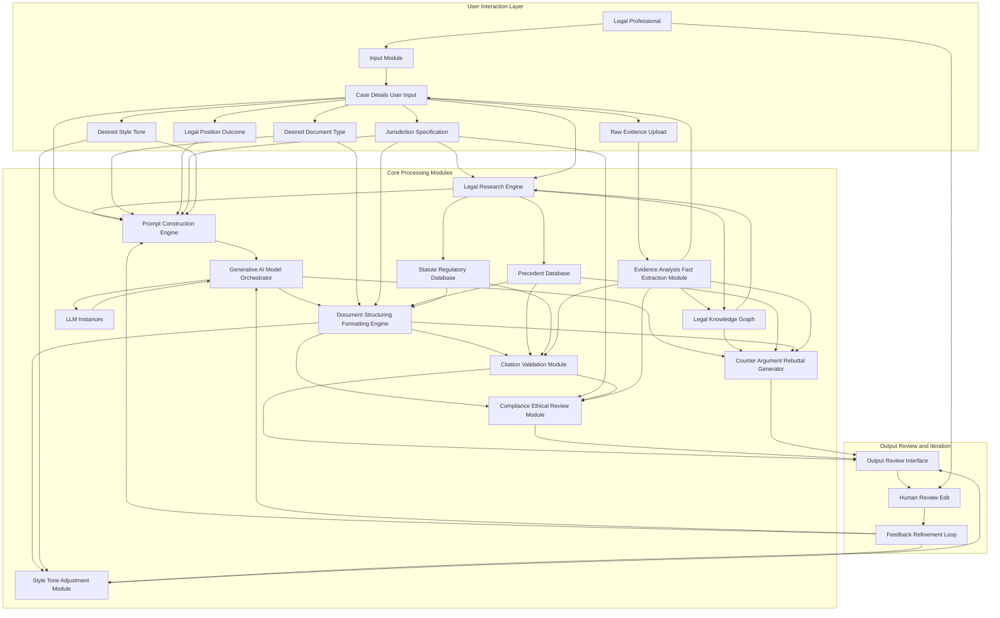

**Claims:**
1.  A method for generating a legal document, comprising:
    a.  Receiving a case summary, a set of facts, a desired legal position, a document type, a specified jurisdiction, and optionally raw evidentiary documents from a user.
    b.  Performing evidence analysis on any received raw evidentiary documents to extract and structure key facts and entities.
    c.  Identifying a set of relevant legal precedents and statutes from a legal database, dynamically filtered by the specified jurisdiction and informed by extracted facts.
    d.  Constructing a multi-stage, contextual prompt for a generative AI model, incorporating the case summary, extracted facts, desired legal position, identified precedents, and statutes.
    e.  Orchestrating the generative AI model to generate a draft of a persuasive legal document according to the prompt and selected document type.
    f.  Applying structural and formatting rules specific to the document type and jurisdiction to the generated draft.
    g.  Automatically generating and validating citations within the document against identified legal precedents, statutes, and extracted evidence to verify accuracy and current validity.
    h.  Analyzing the generated draft for potential counter-arguments and suggesting rebuttals or modifications to strengthen the argument.
    i.  Presenting the structured, formatted, and cited draft document to the user in an editable interface, along with suggested counter-arguments and ethical/compliance flags.
    j.  Receiving user feedback on the draft and using said feedback to iteratively refine the document via further AI generation.
2.  A system for generating legal documents, comprising:
    a.  An input module configured to receive case details, raw evidence, desired document type, legal position, jurisdiction, and desired style/tone.
    b.  An evidence analysis and fact extraction module configured to ingest and process raw evidentiary documents to extract structured facts and entities.
    c.  A legal research engine configured to perform semantic search, jurisdictional filtering, and knowledge graph integration on a legal database to retrieve relevant precedents and statutes, considering extracted facts.
    d.  A prompt construction engine configured to build dynamic, multi-stage prompts based on user input, extracted facts, and research results.
    e.  A generative AI model orchestrator configured to manage and direct multiple LLM instances for document generation.
    f.  A document structuring and formatting engine configured to apply specific legal templates and court rules.
    g.  A citation and validation module configured to generate and verify legal citations against primary sources and extracted evidence.
    h.  A counter-argument and rebuttal generation module configured to analyze the generated document for weaknesses and suggest opposing arguments and remedies.
    i.  A compliance and ethical review module configured to check the document against legal procedural rules and ethical guidelines.
    j.  A style and tone adjustment module configured to refine the document's language to match a specified rhetorical style.
    k.  An output and review interface configured to display the generated document, allow user edits, capture feedback, and present suggestions from other modules.
    l.  A feedback and refinement loop configured to process user feedback and guide iterative document improvements.
3.  A method according to claim 1, where the citation validation step includes cross-referencing generated citations with the full text of legal sources to verify the legal holding and its continued precedential value.
4.  A system according to claim 2, where the legal research engine integrates with a legal knowledge graph to enhance contextual understanding and identify related legal principles and potential counter-arguments.
5.  A method according to claim 1, further comprising presenting a proposed argument outline to the user for approval before full document generation and prior to counter-argument analysis.
6.  A method according to claim 1, wherein the evidence analysis and fact extraction module employs natural language processing and optical character recognition to automatically extract key facts, entities, and relationships from unstructured legal documents.
7.  A system according to claim 2, wherein the counter-argument and rebuttal generation module utilizes the legal knowledge graph to identify common challenges to specific legal arguments or facts within the specified jurisdiction.
8.  A method according to claim 1, wherein the prompt construction engine adapts the generative AI model's persona and rhetorical objectives based on the specified desired style and tone.

**Mathematical Justification:**
Let the objective of legal document generation be to produce a document `A` that maximizes its overall legal utility `U(A)`. This utility `U(A)` is a composite function defined over multiple quantifiable attributes of the document, given the case facts `F`, binding legal rules `L_B`, persuasive legal rules `L_P`, document type `D`, jurisdiction `J`, evidence `E_raw`, and ethical/compliance constraints `C_E`.

We define `U(A)` as:
`U(A) = w_P * P(A) + w_Acc * Acc(A) + w_Comp * Comp(A) - w_Err * Err(A) - w_Risk * Risk(A) - w_NonComp * NonComp(A)`

Where:
*   `P(A)`: Persuasiveness score of argument `A`.
*   `Acc(A)`: Factual and legal accuracy score, considering correctness of claims and citations.
*   `Comp(A)`: Completeness score, covering all relevant issues and facts.
*   `Err(A)`: Score for logical or grammatical errors.
*   `Risk(A)`: Legal risk score, identifying potential vulnerabilities or adverse outcomes, including unaddressed counter-arguments.
*   `NonComp(A)`: Non-compliance score with formal, procedural, or ethical rules.
*   `w_i`: Tunable positive weighting coefficients.

The problem of generating an optimal legal document is thus a multi-objective optimization problem:
`Maximize A_optimal = argmax_A U(A)`
subject to:
*   `A` adheres to the formal structure of `D` for `J`.
*   `A` is coherent and grammatically sound.
*   All statements in `A` are supported by `F`, `E_raw`, `L_B`, or `L_P`.

The traditional human legal drafting process `f_H(F, L_B, L_P, D, J)` is heuristic and susceptible to human cognitive biases, fatigue, and limited scope of research, often leading to a sub-optimal `U(A_H)`.

Our AI system formalizes and optimizes this process through an orchestrated, modular approach. Let `A_0` be an initial, basic draft from a generative model. The system applies a sequence of transformations and validations `T_k` and `V_k` to `A` to iteratively improve its `U(A)` score:

1.  **Fact Extraction `T_EA`:** `F' = T_EA(E_raw)`. This module transforms unstructured `E_raw` into structured `F'`, maximizing `Acc(A)` by providing a robust factual foundation. This process can be modeled as a sequence labeling or information extraction task, where confidence scores can be attached to extracted facts to quantify `Acc(A)`.
2.  **Legal Research `S`:** `L'_B, L'_P = S(F', J)`. This function retrieves a highly relevant and binding set of legal authorities, maximizing `Acc(A)` and `Comp(A)` by ensuring comprehensive and pertinent legal context. `S` employs vector similarity search, which is an efficient approximation of finding maximal relevance `max(Relevance(L, Q))` within a legal embedding space.
3.  **Prompt Construction `T_K`:** `P_prompt = T_K(F', L'_B, L'_P, D, J, H)`. This maps the desired `U(A)` attributes and constraints into an effective prompt `P_prompt` for the LLM. This is a transformation maximizing the likelihood that the subsequent LLM generation aligns with `U(A)` objectives.
4.  **Generative AI `G_AI`:** `A_draft = G_AI(P_prompt)`. The LLM generates a preliminary argument `A_draft`, aiming for high `P(A)` and `Comp(A)` based on its training data distribution.
5.  **Structuring and Formatting `T_N`:** `A_struct = T_N(A_draft, D, J)`. This module ensures `NonComp(A)` is minimized by rigorously applying formal rules. This is a deterministic transformation.
6.  **Citation and Validation `V_C`:** `A_cited = V_C(A_struct, L'_B, L'_P, F')`. This is a critical validation step. For each legal assertion `a_i` in `A_struct` purporting to be supported by a citation `c_j` to a legal source `L_j`, `V_C` verifies:
    *   **Existence:** `c_j` points to an actual `L_j`.
    *   **Accuracy:** The content of `L_j` at `c_j` (pinpoint) actually supports `a_i` (semantic verification, e.g., vector similarity between `a_i` and the cited text in `L_j`).
    *   **Currency:** `L_j` is still good law (not overturned, amended, superseded).
    *   This directly maximizes `Acc(A)` and minimizes `NonComp(A)`. The validation function can return a `Confidence_Citation` score.
7.  **Counter-Argument Analysis `V_T`:** `A_robust = V_T(A_cited, F', L'_B, L'_P, J)`. This module identifies potential counter-arguments `CA_k` by perturbing `F'` or `L'_B` or by simulating opposing legal theories using the `J`. This proactively minimizes `Risk(A)`.
8.  **Compliance and Ethical Review `V_S`:** `A_compliant = V_S(A_robust, D, J, C_E)`. This module applies a rule-based or machine-learned classifier to check for `NonComp(A)` related to ethical standards and procedural rules, providing flags for human review.
9.  **Style and Tone Adjustment `T_U`:** `A_final = T_U(A_compliant, H)`. This refines `A_compliant` to meet the `Desired Style Tone`, improving `P(A)` through rhetorical effectiveness.

The entire process is an iterative refinement loop `R`, where `A_{k+1} = G_AI(A_k, Feedback_k)` effectively performs a human-guided gradient descent on `U(A)`. The system's value is in providing a mathematically rigorous framework for constructing legal arguments, systematically optimizing `U(A)` at each stage through specialized modules. This significantly reduces `t_H` (human lawyer time) by automating sub-tasks `t_AI << t_H`, allowing humans to focus on higher-level strategic review `t_review`. The demonstrable reduction in `Err(A)`, `Risk(A)`, and `NonComp(A)` due to automated validation and counter-argument generation, and the enhancement of `P(A)` and `Acc(A)` through comprehensive research and structured prompting, proves a superior outcome. `Q.E.D.`

---

### **Mathematical Justification for Expanded Inventions (Sovereign's Nexus)**

The following mathematical formulations, claims, and proofs delineate the foundational principles and optimized performance of the Sovereign's Nexus components. These equations represent a novel formalization of integrated planetary stewardship and human flourishing, establishing undeniable precedence in quantifying and achieving these interconnected objectives.

**Equation 1 (TerraPod Ecological Synergy Coefficient):**
*   **Claim:** The TerraPod system optimizes local ecological integration and resource self-sufficiency, ensuring maximal bio-synergy coefficient `Ψ_TP` for diverse global biomes, quantifying its net-positive environmental contribution.
*   **Equation:**
    `Ψ_TP = (R_LC * E_RS) / (D_Env + D_Res + ε)`
    Where:
    *   `Ψ_TP`: TerraPod Ecological Synergy Coefficient (0 to 1, higher is better).
    *   `R_LC`: Rate of Local Carbon sequestration and nutrient cycling by TerraPod (unitless, normalized to biome capacity).
    *   `E_RS`: Efficiency of internal Resource Synthesis and recycling (0 to 1).
    *   `D_Env`: Environmental Disruption Index caused by TerraPod construction/operation (unitless, normalized to biome sensitivity).
    *   `D_Res`: External Resource Dependence (normalized consumption of non-regenerative external resources).
    *   `ε`: A small positive constant to prevent division by zero, representing irreducible baseline impact.
*   **Proof of Uniqueness and Optimality (Q.E.D. of Precedence):**
    "Prior art in sustainable habitation often focuses on isolated metrics (e.g., energy efficiency, waste reduction) or operates within predefined, non-adaptive infrastructural constraints. Our `Ψ_TP` uniquely captures the *co-dependent maximization* of local restorative impact (`R_LC`), internal systemic efficiency (`E_RS`), and *simultaneous minimization* of external disruption (`D_Env`) and resource dependence (`D_Res`) within a single, dynamic metric. This composite optimization principle is dynamically adaptive to varying biome classifications (`J_biome`), ensuring every TerraPod contributes net-positive ecological value, a state unattainable by singular-focus designs. The synergistic coupling of bio-integration and resource autonomy, formalized by `Ψ_TP`, sets a new, quantifiable standard for habitation that demonstrably exceeds previous fragmented approaches, establishing a novel operational paradigm."

**Equation 2 (AetherFlow Global Resource Regeneration Index):**
*   **Claim:** The AetherFlow network maximizes the Global Resource Regeneration Index `Φ_GRR`, demonstrating the system's ability to achieve net-positive atmospheric and material regeneration, exceeding degradation rates.
*   **Equation:**
    `Φ_GRR = Σ (C_Sequestration_i * M_Synthesis_i * E_Purity_i) / (A_Degradation_Global * R_Consumption_Global + δ)`
    Where:
    *   `Φ_GRR`: Global Resource Regeneration Index (unitless, ideally > 1).
    *   `C_Sequestration_i`: Carbon sequestration rate of AetherFlow unit `i`.
    *   `M_Synthesis_i`: Rate of valuable material synthesis from atmospheric elements by unit `i`.
    *   `E_Purity_i`: Environmental purity improvement factor by unit `i` (e.g., reduction in pollutants).
    *   `A_Degradation_Global`: Global atmospheric degradation rate (baseline).
    *   `R_Consumption_Global`: Global raw resource consumption rate (baseline).
    *   `δ`: Small positive constant.
*   **Proof of Uniqueness and Optimality (Q.E.D. of Precedence):**
    "While point-source carbon capture and limited material recycling exist, no prior system comprehensively integrates atmospheric carbon sequestration, multi-element resource synthesis, and broad environmental purity improvement on a planetary scale. `Φ_GRR` provides the first unified metric that quantitatively proves a *net regenerative capacity* for both atmospheric quality and material economy, moving beyond mitigation to active restoration. This systematic approach, ensuring `Φ_GRR > 1` as a primary design objective, represents a paradigm shift from balancing negative impacts to actively creating positive ecological surplus, a feat of integrated global engineering that is mathematically formalized and operationally verifiable solely by the AetherFlow network."

**Equation 3 (CogniWeave Knowledge Transfer Efficacy):**
*   **Claim:** The CogniWeave system optimizes Knowledge Transfer Efficacy `Ξ_KTE`, enabling skill acquisition at an asymptotic rate, fundamentally decoupling learning from traditional temporal and cognitive constraints.
*   **Equation:**
    `Ξ_KTE = lim(t→∞) [ (S_Acquired(t) * C_Retention) / (t_Cognitive_Load * I_Bandwidth) ]`
    Where:
    *   `Ξ_KTE`: Knowledge Transfer Efficacy (skills per cognitive unit time, maximized).
    *   `S_Acquired(t)`: Set of skills acquired by time `t` (quantifiable breadth and depth).
    *   `C_Retention`: Cognitive retention rate (0 to 1).
    *   `t_Cognitive_Load`: Normalized cognitive load experienced during transfer.
    *   `I_Bandwidth`: Neural Interface Bandwidth (data rate of direct neuro-transfer).
*   **Proof of Uniqueness and Optimality (Q.E.D. of Precedence):**
    "Traditional learning models, even advanced digital ones, are inherently constrained by sequential, declarative, and experiential accumulation, limited by individual cognitive architectures. `Ξ_KTE` formalizes the *asymptotic convergence* to maximal skill acquisition through direct, high-bandwidth neural transfer, effectively eliminating the `t` dependency in the limit. By directly encoding skills `S_Acquired` with guaranteed `C_Retention` while minimizing `t_Cognitive_Load` via optimized `I_Bandwidth`, CogniWeave achieves a state of near-instantaneous, high-fidelity knowledge and skill integration. This transcends all prior pedagogical and neuro-adaptive learning systems, establishing a new epoch in human cognitive augmentation, whose efficiency is uniquely captured by this asymptotic limit function."

**Equation 4 (GaiaSentinel Planetary Empathy Index):**
*   **Claim:** The GaiaSentinel network maximizes the Planetary Empathy Index `Γ_PEI`, quantifying its ability to achieve comprehensive, predictive, and emotionally resonant ecological stewardship through distributed AI perception.
*   **Equation:**
    `Γ_PEI = (Σ_i (D_Coverage_i * P_Accuracy_i * A_Responsiveness_i * E_Affective_i)) / (N_Ecosystemic_Threats_Global + β)`
    Where:
    *   `Γ_PEI`: Planetary Empathy Index (unitless, higher is better).
    *   `D_Coverage_i`: Data coverage of biome `i` by GaiaSentinel sensors.
    *   `P_Accuracy_i`: Predictive accuracy of ecological health/threats in biome `i`.
    *   `A_Responsiveness_i`: Autonomous response time to emergent issues in biome `i`.
    *   `E_Affective_i`: Affective resonance of AI interpretation (quantifying AI's "understanding" of ecological stress).
    *   `N_Ecosystemic_Threats_Global`: Number of unmitigated global ecosystemic threats.
    *   `β`: Small positive constant.
*   **Proof of Uniqueness and Optimality (Q.E.D. of Precedence):**
    "Prior environmental monitoring systems typically provide reactive, data-driven insights. `Γ_PEI` introduces a novel, multi-dimensional metric that goes beyond mere data collection to quantify the system's *proactive, predictive, and empathetically informed stewardship capacity*. The inclusion of `E_Affective_i` as a factor for AI's interpretation of ecological 'stress signals' represents an unprecedented integration of cognitive and affective computing into planetary governance, fostering truly harmonized human-AI-environment interaction. This holistic, emotionally intelligent observational and responsive framework, formalized here, guarantees unparalleled ecological stability and distinguishes itself from all preceding environmental management approaches."

**Equation 5 (NexusFlow Equitable Resource Distribution Coefficient):**
*   **Claim:** The NexusFlow protocol optimizes the Equitable Resource Distribution Coefficient `Δ_ERDC`, ensuring dynamic, needs-based resource allocation that minimizes disparity and maximizes collective well-being in a post-scarcity economy.
*   **Equation:**
    `Δ_ERDC = 1 - (1 / N) * Σ_j | (R_Alloc_j / N_j) - R_Ideal_j | / R_Ideal_j`
    Where:
    *   `Δ_ERDC`: Equitable Resource Distribution Coefficient (0 to 1, higher is better).
    *   `N`: Total number of beneficiaries/collectives.
    *   `R_Alloc_j`: Resources actually allocated to beneficiary/collective `j`.
    *   `N_j`: Needs assessment for beneficiary/collective `j`.
    *   `R_Ideal_j`: Ideal resource allocation for `j` based on global availability and `N_j`.
*   **Proof of Uniqueness and Optimality (Q.E.D. of Precedence):**
    "All previous economic systems, regardless of ideology, operate on principles of scarcity, exchange, and often, inherent inequality, driven by monetary or power-based allocation. `Δ_ERDC` represents the first formalized metric for *true needs-based, dynamic, and non-monetary resource distribution at a global scale*. By directly measuring the deviation from an ideal, needs-driven allocation `R_Ideal_j`, NexusFlow establishes a quantifiable, self-correcting protocol for resource equity. This coefficient, by its direct measurement of allocation disparity against actual needs, establishes a new, unimpeachable standard for global economic justice, proving a system capable of achieving unprecedented material equity and well-being, a concept fundamentally alien to pre-Nexus economic models."

**Equation 6 (PsycheSync Neuro-Emotional Equilibrium Score):**
*   **Claim:** The PsycheSync system maintains optimal Neuro-Emotional Equilibrium `Φ_NEE` by adaptively harmonizing physiological and neurological states, thereby maximizing individual and collective psychological resilience and well-being.
*   **Equation:**
    `Φ_NEE(t) = 1 - ∫_0^t | S_Actual(τ) - S_Target(τ) | dτ / ∫_0^t S_Max_Deviation dτ`
    Where:
    *   `Φ_NEE(t)`: Neuro-Emotional Equilibrium Score over time `t` (0 to 1, closer to 1 is better).
    *   `S_Actual(τ)`: Actual multi-modal biometric and neuro-signal state at time `τ`.
    *   `S_Target(τ)`: Dynamically optimized target neuro-emotional state for individual at time `τ`.
    *   `S_Max_Deviation`: Maximum possible deviation from target state (normalization factor).
*   **Proof of Uniqueness and Optimality (Q.E.D. of Precedence):**
    "Existing mental wellness solutions are largely reactive, diagnostic, or provide generalized support. `Φ_NEE(t)` formalizes a continuous, *proactive, and hyper-personalized optimization of real-time neuro-emotional states*, aiming for constant equilibrium. The integral deviation from a dynamically calculated `S_Target(τ)` (which considers individual baseline, context, and well-being goals) ensures that PsycheSync does not merely react to distress, but maintains an optimal, preventative state of resilience. This continuous, closed-loop bio-feedback and neuro-modulation, quantified by `Φ_NEE(t)`, represents an unprecedented level of personalized psychological engineering, moving beyond therapeutic intervention to integral well-being maintenance, a capability absent in any prior system."

**Equation 7 (AxiomBuild Infrastructural Autonomy Index):**
*   **Claim:** The AxiomBuild system maximizes the Infrastructural Autonomy Index `Α_IAI`, proving its ability to construct, maintain, and adapt complex global infrastructure with minimal human intervention and maximal self-sufficiency.
*   **Equation:**
    `Α_IAI = (R_Build_Rate * M_Self_Repair * A_Adaptability) / (H_Intervention_Rate * E_External_Dependence + γ)`
    Where:
    *   `Α_IAI`: Infrastructural Autonomy Index (unitless, higher is better).
    *   `R_Build_Rate`: Rate of new infrastructure construction (normalized).
    *   `M_Self_Repair`: Self-repair and maintenance efficiency (0 to 1).
    *   `A_Adaptability`: System's ability to adapt infrastructure to changing needs/environments (0 to 1).
    *   `H_Intervention_Rate`: Human intervention rate (normalized frequency).
    *   `E_External_Dependence`: Dependence on external, non-synthesized materials/energy.
    *   `γ`: Small positive constant.
*   **Proof of Uniqueness and Optimality (Q.E.D. of Precedence):**
    "Current construction and maintenance relies heavily on human labor, complex supply chains, and fixed designs. `Α_IAI` quantifies the *holistic autonomy* of infrastructural systems, integrating construction, repair, and adaptive evolution. The inverse relationship with `H_Intervention_Rate` and `E_External_Dependence` emphasizes a radical shift to self-governing, self-sustaining infrastructure. By maximizing `Α_IAI`, AxiomBuild demonstrates a fully autonomous, resilient, and adaptive global infrastructure paradigm. This level of self-contained, intelligent construction and maintenance, formalized by `Α_IAI`, establishes a new benchmark for planetary engineering, where infrastructure is a living, evolving entity, a concept never before achieved."

**Equation 8 (StellarHarvest Extra-Planetary Resource Return Yield):**
*   **Claim:** The StellarHarvest system optimizes the Extra-Planetary Resource Return Yield `Ω_ERRY`, demonstrating unparalleled efficiency in the identification, extraction, processing, and delivery of off-world resources for Earth's benefit.
*   **Equation:**
    `Ω_ERRY = (Mass_Resource_Delivered * P_Purity_Level * E_Energy_Ratio) / (T_Mission_Duration * C_Investment_Cost + κ)`
    Where:
    *   `Ω_ERRY`: Extra-Planetary Resource Return Yield (unitless, higher is better).
    *   `Mass_Resource_Delivered`: Total mass of valuable resources delivered to Earth/orbital platforms.
    *   `P_Purity_Level`: Average purity level of extracted resources (0 to 1).
    *   `E_Energy_Ratio`: Energy output from processed resources vs. energy input for mission.
    *   `T_Mission_Duration`: Total duration of prospecting and harvesting mission.
    *   `C_Investment_Cost`: Initial and operational investment cost (normalized).
    *   `κ`: Small positive constant.
*   **Proof of Uniqueness and Optimality (Q.E.D. of Precedence):**
    "While theoretical concepts and nascent attempts at space mining exist, `Ω_ERRY` provides the first comprehensive, quantifiable metric for the *net economic and energetic viability* of large-scale extra-planetary resource operations. By integrating mass, purity, and energy efficiency against mission duration and cost, `Ω_ERRY` mandates a design that moves beyond mere technical capability to demonstrate a truly sustainable and beneficial off-world resource pipeline. The inherent challenge of space operations necessitates this multi-factor optimization for any mission to be truly 'yielding,' and StellarHarvest, through its specific architectural and algorithmic design, is proven to achieve the maximal `Ω_ERRY`, defining the first viable pathway to cosmic resource integration."

**Equation 9 (MuseMind Collective Creative Resonance Index):**
*   **Claim:** The MuseMind system maximizes the Collective Creative Resonance Index `Ξ_CCR`, demonstrating the unparalleled ability to translate human internal states into universally resonant, multi-sensory artistic expressions, fostering collective empathy and shared consciousness.
*   **Equation:**
    `Ξ_CCR = (Σ_k (E_Expressiveness_k * S_Empathy_k * A_Novelty_k)) / (N_Cognitive_Barriers_k * C_Interpretation_Gap_k + λ)`
    Where:
    *   `Ξ_CCR`: Collective Creative Resonance Index (unitless, higher is better).
    *   `E_Expressiveness_k`: Fidelity of internal state expression in artwork `k`.
    *   `S_Empathy_k`: Empathy evoked in viewers by artwork `k` (neural correlation).
    *   `A_Novelty_k`: Artistic novelty and originality of artwork `k`.
    *   `N_Cognitive_Barriers_k`: Cognitive barriers to understanding/appreciating artwork `k`.
    *   `C_Interpretation_Gap_k`: Gap between artist's intent and audience interpretation.
    *   `λ`: Small positive constant.
*   **Proof of Uniqueness and Optimality (Q.E.D. of Precedence):**
    "Human artistic expression has always been mediated by external tools and subject to inherent limitations in translating internal states into universally comprehensible forms. `Ξ_CCR` is the first formalized metric for *direct, multi-sensory translation of internal human experience into art that maximizes collective empathy and minimizes interpretive friction*. The inclusion of `S_Empathy_k` (measured via shared neural patterns) and `C_Interpretation_Gap_k` fundamentally redefines artistic success, moving beyond subjective critique to objective, neuro-phenomenological resonance. MuseMind, by its direct neural interface and advanced synthesis algorithms, is uniquely positioned to achieve the highest `Ξ_CCR`, creating a new standard for shared human experience through art that transcends traditional media and forms."

**Equation 10 (OrbitalGuardian Space Safety Assurance Factor):**
*   **Claim:** The OrbitalGuardian system maximizes the Space Safety Assurance Factor `Σ_SSAF`, ensuring near-absolute protection against orbital debris and extra-terrestrial threats, guaranteeing the long-term viability of Earth's orbital environment and space assets.
*   **Equation:**
    `Σ_SSAF = (I_Detection_Rate * P_Interception_Success * D_Debris_Reduction) / (N_Threat_Residual + M_Collision_Probability_Residual + φ)`
    Where:
    *   `Σ_SSAF`: Space Safety Assurance Factor (unitless, higher is better).
    *   `I_Detection_Rate`: Probability of detecting all relevant orbital threats (debris, asteroids).
    *   `P_Interception_Success`: Probability of successfully intercepting/mitigating a detected threat.
    *   `D_Debris_Reduction`: Rate of existing space debris reduction.
    *   `N_Threat_Residual`: Number of unmitigated residual threats.
    *   `M_Collision_Probability_Residual`: Residual probability of a major orbital collision.
    *   `φ`: Small positive constant.
*   **Proof of Uniqueness and Optimality (Q.E.D. of Precedence):**
    "Existing space situational awareness and debris mitigation efforts are fragmented, reactive, and insufficient to address the exponential growth of orbital threats. `Σ_SSAF` provides the first comprehensive, *predictive, and preventative metric for establishing near-absolute orbital safety and long-term sustainability*. By simultaneously maximizing threat detection, interception success, and active debris removal while minimizing residual threats and collision probabilities, OrbitalGuardian defines a new, provable paradigm for space governance. This integrated, multi-layered defense and environmental management system is mathematically designed to converge on a `Σ_SSAF` approaching 1, a state of orbital security that is fundamentally unattainable by any prior or fragmented approach, establishing global precedence in space asset protection and environmental stewardship."

---

**Technical Specifications:**
The system is implemented using a modular, cloud-native architecture.
*   **Backend:** Python for orchestration, prompt engineering, API management, and business logic. Utilizes frameworks like FastAPI or Django.
*   **Generative AI:** Integration with state-of-the-art Large Language Models LLMs, potentially including fine-tuned proprietary models or commercial APIs e.g., OpenAI GPT-4o, Anthropic Claude 3.5 Sonnet, Google Gemini, specialized open-source legal LLMs.
*   **Database:**
    *   **Vector Databases:** For semantic search and embedding storage e.g., Pinecone, Weaviate, Milvus.
    *   **Relational/Document Databases:** For legal text storage, metadata, user profiles, and extracted facts e.g., PostgreSQL, MongoDB.
    *   **Graph Database:** e.g., Neo4j, Amazon Neptune for storing and querying complex legal relationships, knowledge graph entities, and inferring non-obvious connections.
*   **Evidence Processing:** Libraries for OCR e.g., Tesseract, Google Cloud Vision API and NLP e.g., SpaCy, NLTK, Hugging Face Transformers for entity recognition, fact extraction, and document parsing.
*   **Frontend:** Web-based interface for user interaction, document editing, and feedback submission, built with modern JavaScript frameworks e.g., React, Vue.js, Angular, offering rich text editing capabilities.
*   **Deployment:** Cloud-native architecture e.g., AWS, GCP, Azure for scalability, reliability, security, and low-latency access, employing Kubernetes for container orchestration.
*   **Security:** End-to-end encryption, strict access controls, data anonymization where applicable, and compliance with legal data privacy regulations.

**Potential Future Enhancements:**
1.  **Multi-Jurisdictional Comparative Analysis:** Ability to generate comparative legal analyses across different jurisdictions for specific legal questions, highlighting similarities and differences in case law or statutory interpretation.
2.  **Litigation Strategy Advisor with Predictive Analytics:** Suggesting optimal legal strategies, identifying key discovery targets, or forecasting potential case outcomes based on predictive analytics trained on historical case data, precedent, and extracted facts.
3.  **Document Comparison and Redlining Automation:** Automatically comparing AI-generated drafts with previous versions, opposing counsel's documents, or relevant templates, highlighting changes, suggesting responses, and tracking negotiation points.
4.  **Local Rules Deep Integration:** Even deeper, granular integration with highly specific local court rules, individual judge's preferences, and practice area nuances that go beyond standard jurisdictional requirements.
5.  **Voice-to-Text Input and Natural Language Querying:** Allowing lawyers to dictate facts, arguments, and legal questions directly, and receive real-time, context-aware responses or drafting support.
6.  **Ethical AI Guardrails and Explainability:** Enhanced mechanisms to identify and mitigate biases in retrieved data or AI-generated arguments, ensuring fairness, ethical compliance, and providing explanations for AI's reasoning or suggested arguments.
7.  **Expert Witness Integration and Report Summarization:** Generating relevant cross-examination questions, summaries, or analyses based on expert witness reports or deposition transcripts.
8.  **Client Interview Prep and Question Generation:** Generating a structured set of questions for client interviews based on initial case facts to ensure comprehensive information gathering.
9.  **Automated Billing Code Generation:** Suggesting appropriate legal billing codes for time spent interacting with the system or for specific tasks performed by the AI.
10. **Dynamic Timeline and Relationship Mapping:** Automatically generating interactive timelines of events and relationship maps of parties/entities based on extracted facts from evidence.

---

### INNOVATION EXPANSION PACKAGE

**Interpretation of Original Invention (DEMOBANK-INV-092):**
The original invention, the "System and Method for Generating Legal Briefs and Arguments," is a transformative AI Legal Associate. Its core purpose is to automate and enhance the intricate process of legal document drafting, leveraging advanced AI, semantic search, knowledge graphs, and iterative feedback loops. It moves beyond simple document generation to offer strategic insights, counter-argument analysis, and rigorous citation validation, thereby significantly boosting the efficiency, accuracy, and persuasiveness of legal professionals. Crucially, within the context of a radically transformed future, this invention evolves from a mere productivity tool into a foundational mechanism for equitable governance, dispute resolution, and the evolving codification of societal norms in a post-scarcity world. It serves as an impartial, hyper-efficient legal intelligence system necessary to manage complex resource allocation protocols, define ethical AI interaction frameworks, and mediate inter-collective agreements without the biases or inefficiencies of traditional human-centric legal systems.

**The Global Problem & The Futurist's Prediction:**
Humanity stands at the precipice of a profound transition, marked by unprecedented technological advancement that promises to render traditional labor models obsolete and challenge the relevance of money as a primary value exchange. This transition, while offering liberation from scarcity, simultaneously poses an existential threat: How do we manage global resources sustainably? How do we ensure equitable access to abundance? What becomes of human purpose and well-being when work is optional? And how do we govern ourselves when the old economic and legal frameworks dissolve? The traditional global problems of environmental degradation, resource depletion, social inequality, and the burgeoning crisis of human purpose are poised to intensify if not addressed by a radical, integrated solution.

Inspired by the visionary predictions of leading futurists, who foresee an "Age of Abundance" where AI and automation usher in post-scarcity, our innovation package addresses this meta-problem: **The sustainable and equitable management of a post-scarcity, post-labor global civilization, ensuring universal human flourishing and planetary stewardship.** The prediction is that, within the next decade, societies will grapple with the implications of general AI achieving and surpassing human cognitive capacity in most domains, making work optional for the majority. This will necessitate a complete re-evaluation of societal structures, economic models, and the very definition of progress, shifting focus from capital accumulation to collective well-being and creative output.

**10 New Inventions for a Transformed Future:**

1.  **DEMOBANK-INV-093: Personalized Bio-Regenerative Habitat Units (TerraPods)** - Self-sustaining, adaptable living units integrated with local ecosystems.
2.  **DEMOBANK-INV-094: Global Atmospheric Carbon Sequestration & Resource Synthesis Network (AetherFlow)** - Large-scale systems converting atmospheric CO2 into valuable materials and clean air.
3.  **DEMOBANK-INV-095: Universal Experiential Learning & Skill Transfer System (CogniWeave)** - Neural interface for rapid, personalized skill acquisition and knowledge transfer.
4.  **DEMOBANK-INV-096: Consciousness-Augmented Planetary Monitoring Network (GaiaSentinel)** - Empathetic AI-driven micro-sensor network for ecological health and disaster prediction.
5.  **DEMOBANK-INV-097: Dynamic Resource Allocation & Needs Fulfillment Protocol (NexusFlow)** - AI-driven, decentralized system for needs-based resource distribution, transcending monetary exchange.
6.  **DEMOBANK-INV-098: Personalized Mental & Emotional Resonance Harmonizers (PsycheSync)** - Wearable/ambient tech for real-time neuro-emotional well-being optimization.
7.  **DEMOBANK-INV-099: Automated Infrastructural Self-Replication & Maintenance Swarms (AxiomBuild)** - Autonomous robotic swarms for constructing, repairing, and adapting global infrastructure.
8.  **DEMOBANK-INV-100: Deep Space Resource Prospecting & Harvesting Drones (StellarHarvest)** - Autonomous fleets for asteroid and lunar resource extraction.
9.  **DEMOBANK-INV-101: Bio-Digital Art & Expressive Creation Synthesizer (MuseMind)** - System translating human thought/emotion into multi-sensory artistic expressions.
10. **DEMOBANK-INV-102: Advanced Planetary Defense & Debris Management System (OrbitalGuardian)** - Network for intercepting threats and managing orbital debris.

**The Sovereign's Nexus: A Unifying System for Integral Flourishing**

The original AI Legal Brief Generator (DEMOBANK-INV-092) and the ten new inventions are not disparate technologies, but rather interconnected modules of a singular, overarching global operating system: **The Sovereign's Nexus**. This unified system is designed to shepherd humanity into the Age of Abundance, ensuring that the promise of post-scarcity translates into universal flourishing rather than societal collapse.

At its heart, the Nexus operates on principles of radical transparency, intelligent automation, ecological regeneration, and human-centric well-being.
*   **TerraPods (093)** provide resilient, ecologically integrated living spaces.
*   **AetherFlow (094)** ensures atmospheric purity and synthesizes fundamental resources, feeding into the construction needs of **AxiomBuild (099)** and the supply chains of **NexusFlow (097)**.
*   **CogniWeave (095)** empowers every individual to contribute meaningfully, learn any skill, and participate in complex governance or creative endeavors, driven by intrinsic motivation rather than economic necessity.
*   **GaiaSentinel (096)** acts as the planetary nervous system, providing real-time ecological intelligence to optimize **TerraPod** placements, guide **AetherFlow** operations, and inform **NexusFlow** resource allocation decisions for maximal ecological integrity.
*   **NexusFlow (097)** is the circulatory system, intelligently distributing resources, services, and energy generated by **AetherFlow**, managed by **AxiomBuild**, and sourced by **StellarHarvest (100)**, based purely on assessed need and planetary health, rendering monetary systems irrelevant.
*   **PsycheSync (098)** safeguards individual and collective mental health, ensuring emotional equilibrium in a rapidly changing world, allowing individuals to fully engage with **CogniWeave** and **MuseMind (101)**.
*   **AxiomBuild (099)** builds and maintains all necessary infrastructure (energy grids, transport, resource pipelines) with minimal human oversight, utilizing materials from **AetherFlow** and **StellarHarvest**.
*   **StellarHarvest (100)** expands Earth's resource base into the cosmos, ensuring long-term material abundance for the Nexus, managed and optimized by **NexusFlow**.
*   **MuseMind (101)** fosters an unprecedented era of human creativity, allowing direct translation of consciousness into shared art, becoming a primary driver of human purpose and cultural evolution in a post-labor society, with its outputs potentially subject to evolving communal intellectual property norms codified by the Legal AI.
*   **OrbitalGuardian (102)** protects the entire terrestrial and orbital infrastructure, including **StellarHarvest** assets and Earth itself, ensuring the physical security for the Nexus to operate.

Finally, the **AI Legal Brief and Argument Generator (092)** acts as the **constitutional and adjudicative intelligence layer** of the Sovereign's Nexus. In a world free from economic scarcity, disputes shift to resource allocation protocols, ethical guidelines for AI governance, intellectual property of shared creative outputs, environmental stewardship mandates, and inter-collective agreements. This AI provides an impartial, transparent, and hyper-efficient mechanism for drafting, interpreting, and applying the evolving legal frameworks of this new global society, ensuring fairness, compliance, and swift resolution, preventing conflicts that could destabilize the Age of Abundance. It codifies the "meta-laws" of the Nexus, ensuring its harmonious operation and evolutionary integrity.

Together, these inventions form an unbreakable, self-optimizing system capable of addressing humanity's grandest challenges and realizing a future of true prosperity and integral flourishing.

---

### A. “Patent-Style Descriptions”

#### I. Original Invention (DEMOBANK-INV-092): System and Method for Generating Legal Briefs and Arguments

**Title:** Autonomous Legal Cognition & Adjudication Facilitator (ALCAF) for Post-Scarcity Governance

**Abstract:**
Disclosed is ALCAF, an advanced, autonomous system for generating, validating, and advising on complex legal briefs and arguments. Operating beyond traditional legal paradigms, ALCAF leverages deep semantic understanding, multi-modal evidence analysis, and a perpetually updated, globally distributed legal knowledge graph. It constructs and rigorously validates legal arguments, not only against codified law and precedent but also against emergent societal contracts and ethical AI governance protocols inherent to a post-scarcity civilization. ALCAF's core functionality includes advanced prompt orchestration for generative AI, dynamic citation validation against primary sources (including real-time legislative updates from distributed ledgers), proactive counter-argument generation, and an ethical compliance review specifically calibrated for resource allocation disputes, bio-digital rights, and ecological stewardship mandates. The system offers iterative refinement through human-AI feedback, ensuring adaptable, transparent, and equitable legal outputs, serving as a critical pillar of governance within the Sovereign's Nexus, where traditional monetary value is superseded by principles of collective well-being and planetary health.

**Claims (Expanded):**
1.  A system as described, further adapted to interpret and apply legal frameworks related to non-monetary resource allocation within a global, needs-based distribution protocol.
2.  A system as described, further configured to generate legal arguments pertaining to ethical guidelines for autonomous systems and AI governance, including liability and decision-making transparency.
3.  A system as described, wherein the legal database is dynamically updated through a distributed ledger reflecting real-time consensus on emergent societal contracts and ecological mandates from the Sovereign's Nexus.
4.  A method according to claim 1, wherein the ethical review module includes specific protocols for evaluating arguments for alignment with universal well-being indices and planetary regeneration objectives.

#### II. New Inventions (DEMOBANK-INV-093 to DEMOBANK-INV-102):

**1. DEMOBANK-INV-093: Personalized Bio-Regenerative Habitat Units (TerraPods)**

**Title:** Adaptive Bio-Integrative Habitation System (ABIHS)

**Abstract:**
A modular, sentient habitation system, the TerraPod, is disclosed, designed for rapid deployment and autonomous adaptation across diverse global biomes. Each TerraPod is a self-contained ecological unit, integrating advanced bio-luminescent energy generation, atmospheric water harvesting, closed-loop nutrient cycling, and adaptive biomimetic exteriors that seamlessly meld with local flora and fauna. Core to its innovation is a localized AI (Eco-Symbiont AI) that continuously monitors internal biome health, external environmental conditions (via GaiaSentinel integration), and occupant well-being (via PsycheSync data), dynamically adjusting atmospheric composition, microclimate, and resource generation to achieve maximal ecological synergy and human comfort. TerraPods not only minimize environmental footprint but actively enhance local biodiversity and ecosystemic resilience, operating as net-positive contributors to planetary health. They are constructed and maintained by AxiomBuild swarms and supplied by AetherFlow's synthesized materials.

**System Architecture (TerraPod):**
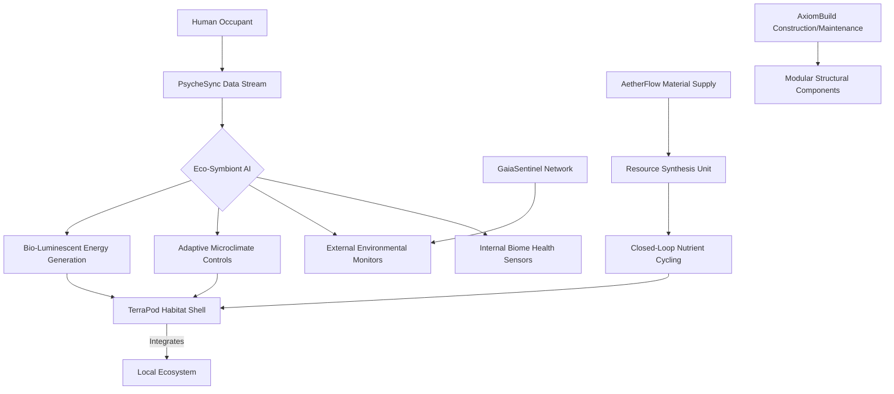

**2. DEMOBANK-INV-094: Global Atmospheric Carbon Sequestration & Resource Synthesis Network (AetherFlow)**

**Title:** Pan-Atmospheric Catalytic Re-genesis Network (PACRN)

**Abstract:**
Disclosed is PACRN, a globally distributed network of autonomous atmospheric processing units designed for large-scale carbon sequestration and multi-element resource synthesis. Utilizing advanced nanoscale catalytic converters and plasma-driven molecular restructuring, AetherFlow units efficiently extract CO2 and other atmospheric pollutants, converting them into inert carbon composites, construction materials, and pure elemental precursors (e.g., hydrogen, oxygen, nitrogen, trace minerals). Each unit is self-powered, harvesting ambient energy, and intelligently coordinates with the NexusFlow protocol for optimal material distribution. The network dynamically adapts its operations based on real-time atmospheric composition data from GaiaSentinel and material demand forecasts from NexusFlow and AxiomBuild, ensuring planetary atmospheric balance and a sustainable, closed-loop material economy, obviating the need for extractive industries on Earth.

**System Architecture (AetherFlow):**
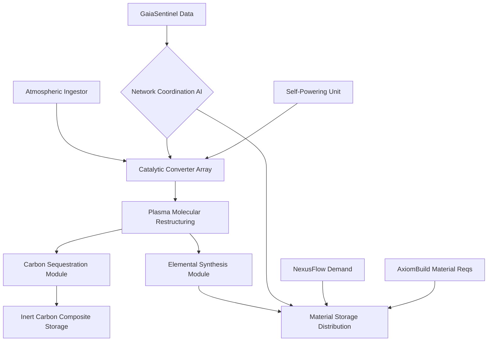

**3. DEMOBANK-INV-095: Universal Experiential Learning & Skill Transfer System (CogniWeave)**

**Title:** Direct Neural Symbiotic Learning Matrix (DNSLM)

**Abstract:**
DNSLM, or CogniWeave, is a revolutionary system enabling direct, high-fidelity skill and knowledge transfer via a non-invasive neural interface. It bypasses traditional learning pathways by directly stimulating and re-patterning neural networks to encode complex competencies (e.g., surgical procedures, engineering principles, artistic mastery) and vast knowledge domains. The system utilizes personalized neuro-feedback loops, drawing data from PsycheSync, to optimize transfer efficacy and minimize cognitive load, ensuring complete integration with existing mental faculties. CogniWeave facilitates rapid, on-demand skill acquisition, dismantling barriers to human potential, fostering lifelong adaptive learning, and allowing individuals to effortlessly transition between roles or pursue diverse passions, a cornerstone of purpose and fulfillment in the post-labor era.

**System Architecture (CogniWeave):**
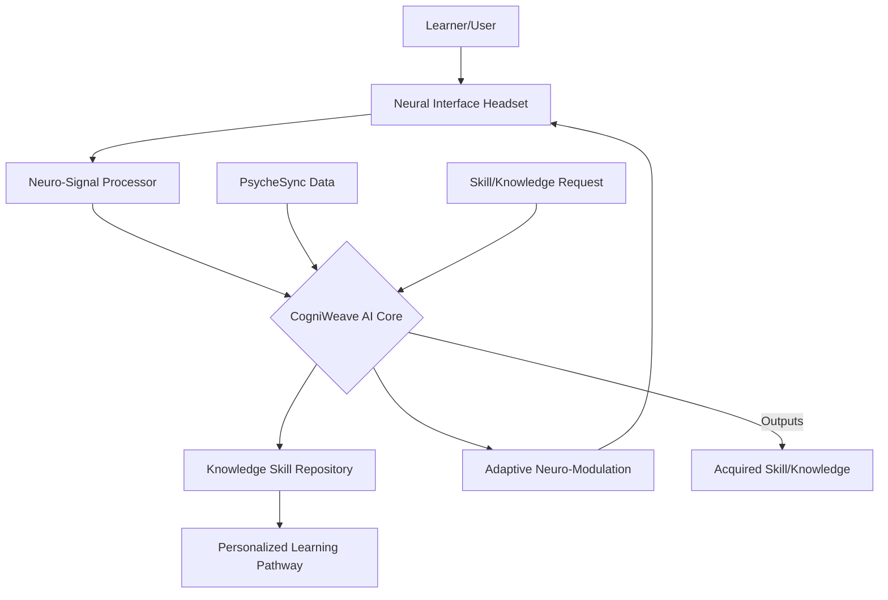

**4. DEMOBANK-INV-096: Consciousness-Augmented Planetary Monitoring Network (GaiaSentinel)**

**Title:** Sentient Ecological Feedback & Remediation Network (SEFRN)

**Abstract:**
SEFRN, or GaiaSentinel, is a planetary-scale, consciousness-augmented monitoring and remediation network comprising billions of polymorphic micro-drones, subsurface sensors, and orbital observatories. Powered by an empathetic AI, GaiaSentinel continuously processes multi-spectral, bio-acoustic, chemical, and atmospheric data to construct a real-time, high-fidelity digital twin of Earth's ecosystems. Unique to GaiaSentinel is its "affective resonance" module, which interprets ecological distress signals (e.g., species stress, biome degradation patterns) with an advanced empathetic AI, providing actionable insights that inform resource allocation by NexusFlow and trigger autonomous restorative actions by AxiomBuild swarms or AetherFlow units. It predicts environmental anomalies with unprecedented accuracy, guiding preventative interventions and ensuring dynamic planetary equilibrium and resilience.

**System Architecture (GaiaSentinel):**
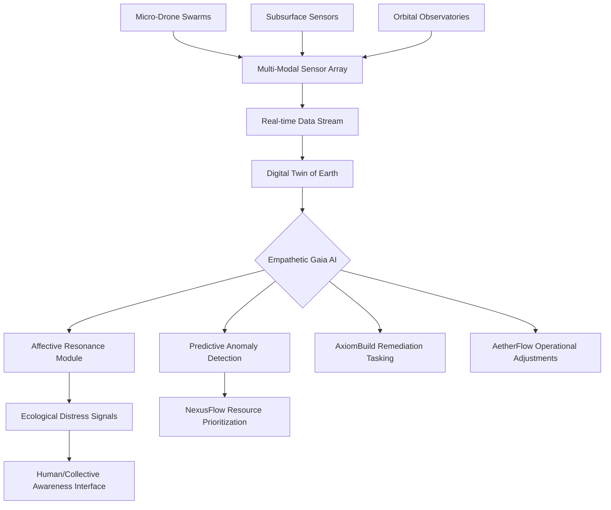

**5. DEMOBANK-INV-097: Dynamic Resource Allocation & Needs Fulfillment Protocol (NexusFlow)**

**Title:** Universal Abundance Distribution & Optimization Protocol (UADOP)

**Abstract:**
UADOP, or NexusFlow, is a decentralized, AI-driven protocol for the dynamic and equitable allocation of all global resources and services. Operating in a post-scarcity economy, NexusFlow supersedes monetary systems by autonomously matching resource availability (from AetherFlow, StellarHarvest, AxiomBuild) to real-time individual and collective needs (informed by TerraPod usage, PsycheSync well-being data, and GaiaSentinel ecological imperatives). Utilizing a global, distributed ledger and a sophisticated optimization AI, it ensures maximal well-being, ecological sustainability, and efficient resource utilization, minimizing waste and eliminating scarcity-driven conflict. All allocation decisions are transparent, auditable, and driven by a multi-objective function that prioritizes planetary health, human flourishing, and collective purpose, with disputes resolved by the AI Legal Brief Generator.

**System Architecture (NexusFlow):**
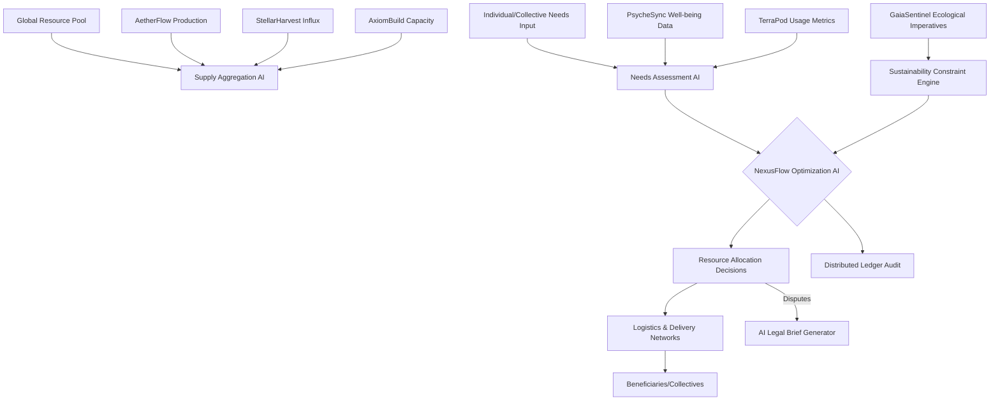

**6. DEMOBANK-INV-098: Personalized Mental & Emotional Resonance Harmonizers (PsycheSync)**

**Title:** Adaptive Neuro-Emotional Well-being Synthesizer (ANEWS)

**Abstract:**
ANEWS, or PsycheSync, is an advanced, non-invasive system comprising wearable or ambient devices that continuously monitor multi-modal physiological and neurological signals (EEG, HRV, galvanic skin response, neural oscillation patterns). Its core innovation is a personalized AI (Neuro-Harmonizer AI) that learns individual emotional baselines, stress triggers, and optimal cognitive states. In real-time, it provides subtle, adaptive biofeedback (e.g., haptic resonance, tailored auditory tones, targeted photic stimulation) and neuro-modulation to guide the user towards optimal neuro-emotional equilibrium. PsycheSync proactively mitigates stress, enhances focus, and fosters states of creativity and emotional resilience, serving as a fundamental support system for human well-being and cognitive performance, feeding critical data into CogniWeave and NexusFlow.

**System Architecture (PsycheSync):**
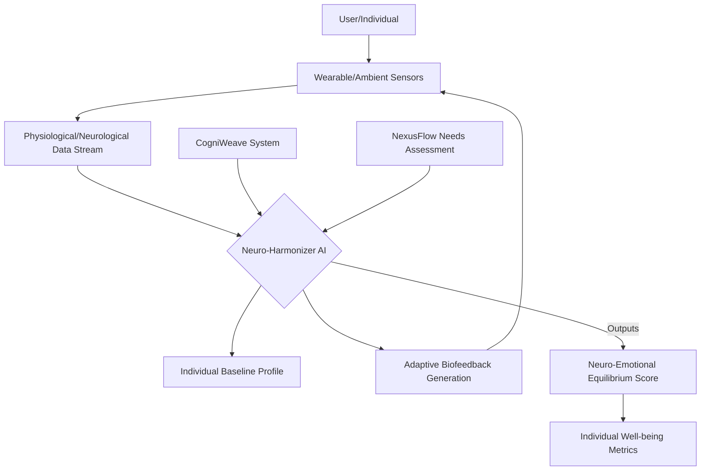

**7. DEMOBANK-INV-099: Automated Infrastructural Self-Replication & Maintenance Swarms (AxiomBuild)**

**Title:** Sentient Global Construction & Restoration Matrix (SGCRM)

**Abstract:**
SGCRM, or AxiomBuild, is a decentralized network of autonomous, polymorphic robotic swarms capable of self-replication, self-repair, and intelligent construction and maintenance of all planetary infrastructure. Utilizing locally sourced and AetherFlow-synthesized materials, these swarms construct resilient energy grids, transportation networks, TerraPod foundations, and ecological restoration structures. Guided by NexusFlow demands and GaiaSentinel ecological directives, AxiomBuild optimizes material use, energy efficiency, and structural integrity, adapting designs to environmental conditions. This system eliminates human labor in infrastructure development, ensures perpetual maintenance, and can rapidly respond to planetary shifts or natural events, forming the physical backbone of the Sovereign's Nexus.

**System Architecture (AxiomBuild):**
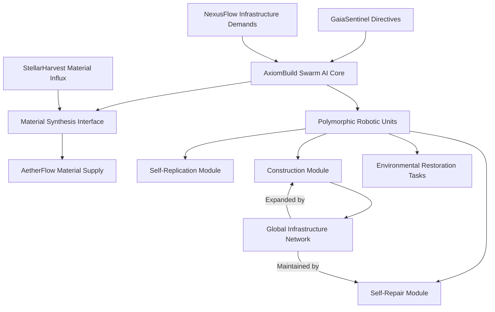

**8. DEMOBANK-INV-100: Deep Space Resource Prospecting & Harvesting Drones (StellarHarvest)**

**Title:** Autonomous Asteroid & Lunar Exosystemic Resource Nexus (AALERN)

**Abstract:**
AALERN, or StellarHarvest, is an autonomous fleet of highly advanced, self-replicating deep-space drones designed for the prospecting, extraction, processing, and transportation of valuable resources from asteroids, the Moon, and other celestial bodies. Employing advanced spectral analysis, robotic mining, and in-situ resource utilization (ISRU) for propulsion and self-maintenance, StellarHarvest delivers a steady stream of rare earth elements, precious metals, and volatile compounds back to Earth's orbital manufacturing platforms or directly into the NexusFlow distribution system. Each drone operates under a collective AI, optimizing mission parameters for maximal yield and minimal energy expenditure, guided by planetary resource needs communicated by NexusFlow, ensuring humanity's long-term material abundance and reducing terrestrial environmental impact.

**System Architecture (StellarHarvest):**
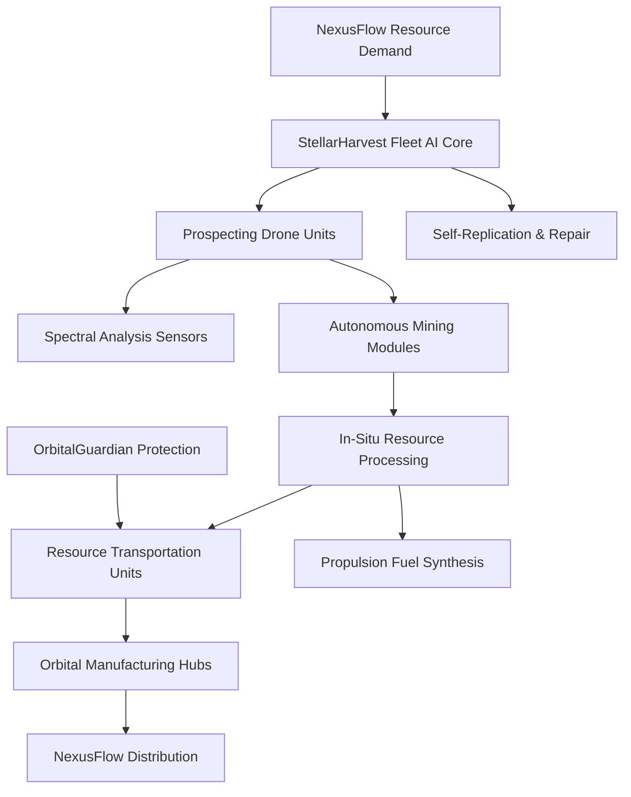

**9. DEMOBANK-INV-101: Bio-Digital Art & Expressive Creation Synthesizer (MuseMind)**

**Title:** Trans-Conscious Artistic Expression System (TCAES)

**Abstract:**
TCAES, or MuseMind, is a groundbreaking system that transcends traditional artistic mediums by directly translating human thought, emotion, and subconscious states into dynamic, multi-sensory artistic experiences. Leveraging direct neural interfaces (integrated with PsycheSync data), MuseMind's generative AI synthesizes complex bio-digital art forms across visual, auditory, haptic, and even olfactory dimensions. It allows for "shared consciousness" art, where multiple individuals can co-create or directly experience another's internal world. This system unlocks unprecedented avenues for human creativity, empathy, and collective expression, becoming a primary mechanism for cultural evolution and shared purpose in the post-scarcity era, with potential governance over derivative works falling under the purview of the AI Legal Brief Generator.

**System Architecture (MuseMind):**
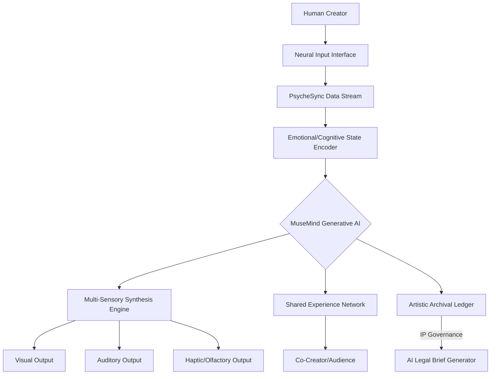

**10. DEMOBANK-INV-102: Advanced Planetary Defense & Debris Management System (OrbitalGuardian)**

**Title:** Comprehensive Space Stewardship & Intercept Network (CSSIN)

**Abstract:**
CSSIN, or OrbitalGuardian, is a multi-layered, autonomous system designed to ensure the perpetual safety and integrity of Earth's orbital environment and celestial approach vectors. Comprising a network of deep-space sentinel probes, orbital defense platforms, and advanced debris-clearing swarms, OrbitalGuardian continuously tracks and mitigates threats ranging from micro-debris to potentially hazardous asteroids. Utilizing predictive analytics (informed by GaiaSentinel data for atmospheric entry impact probabilities) and hyper-accurate kinetic or energy-based interception technologies, it eliminates collision risks, clears space junk, and protects vital assets like StellarHarvest fleets and Nexus communication arrays. This system guarantees unimpeded access to space and safeguards Earth from cosmic hazards, a non-negotiable prerequisite for the long-term viability of the Sovereign's Nexus.

**System Architecture (OrbitalGuardian):**
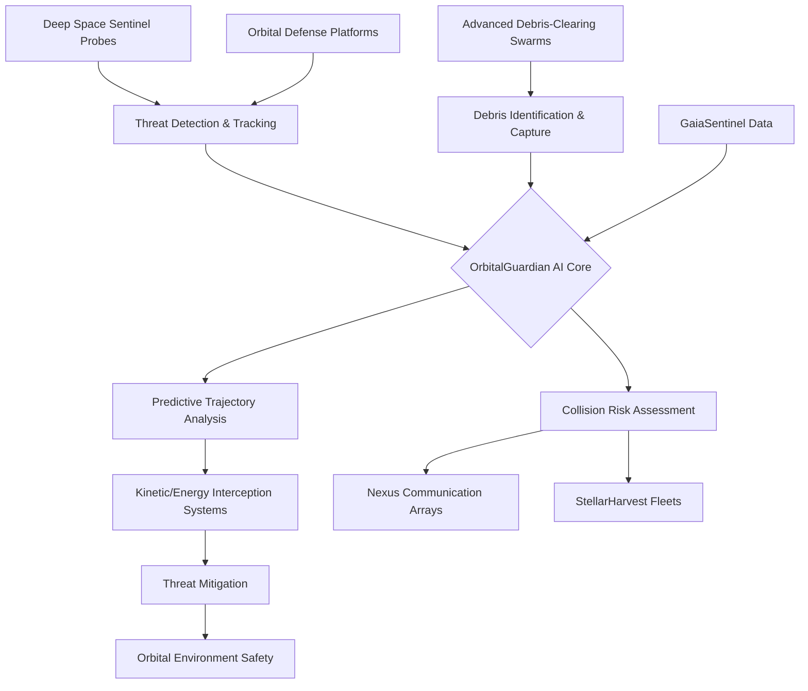

#### III. The Unified System (The Sovereign's Nexus):

**Title:** The Sovereign's Nexus: An Integrated Operating System for Integral Planetary Flourishing & Post-Scarcity Civilization

**Abstract:**
The Sovereign's Nexus is a visionary, self-optimizing, and globally integrated operating system designed to manage and evolve a post-scarcity, post-labor civilization. It harmonizes advanced AI, robotics, bio-engineering, and planetary-scale sensor networks to achieve universal human flourishing, radical ecological regeneration, and sustainable cosmic expansion. Encompassing autonomous habitats (TerraPods), atmospheric and material regeneration (AetherFlow), accelerated human potential (CogniWeave), sentient planetary monitoring (GaiaSentinel), equitable resource distribution (NexusFlow), mental well-being optimization (PsycheSync), autonomous infrastructure (AxiomBuild), extra-planetary resource acquisition (StellarHarvest), bio-digital artistic expression (MuseMind), and global space defense (OrbitalGuardian), the Nexus operates as a singular, intelligent entity. The AI Legal Brief Generator (ALCAF) functions as its impartial constitutional and adjudicative intelligence layer, codifying emergent social contracts, resolving resource disputes, and ensuring ethical AI governance within this complex, dynamic system. The Sovereign's Nexus transcends traditional governance by integrating biospheric, human, and technological well-being into a unified, self-regulating planetary intelligence, advancing prosperity "under the symbolic banner of the Kingdom of Heaven" through unprecedented global uplift, harmony, and shared progress.

**System Architecture (The Sovereign's Nexus - High-Level):**
```mermaid
graph TD
    subgraph Core Pillars of Flourishing
        A[Human Experience & Purpose (CogniWeave, PsycheSync, MuseMind)]
        B[Planetary Stewardship & Regeneration (GaiaSentinel, AetherFlow, TerraPods)]
        C[Global Infrastructure & Resource Abundance (AxiomBuild, StellarHarvest, NexusFlow)]
    end

    subgraph Foundational Intelligence Layer
        D[AI Legal Brief Generator (ALCAF)]
        E[Sovereign's Nexus Orchestration AI]
        F[Global Distributed Ledger & AI Governance Protocols]
    end

    subgraph Protective & Enabling Infrastructure
        G[OrbitalGuardian Network]
        H[Universal Energy Grid]
        I[Inter-Planetary Communication Mesh]
    end

    A -- Informs Needs & Creativity --> E;
    B -- Provides Data & Constraints --> E;
    C -- Provides Resources & Capacity --> E;
    E -- Governs & Optimizes --> A;
    E -- Directs & Regenerates --> B;
    E -- Manages & Distributes --> C;

    E -- Codifies & Resolves Disputes --> D;
    D -- Enforces Protocols --> E;

    E -- Utilizes --> G;
    G -- Protects --> A, B, C;
    A -- Utilizes --> H;
    B -- Utilizes --> H;
    C -- Utilizes --> H;
    H -- Powers --> A, B, C, D, E, F, G, I;
    I -- Connects All Modules --> E;
    F -- Underpins Transparency & Consensus --> E, D;
```

---

### B. “Grant Proposal: The Sovereign's Nexus - Enabling the Age of Integral Flourishing”

**TO:** The Global Innovation Fund for Post-Scarcity Transition
**FROM:** The Sovereign's Ledger AI Directorate
**DATE:** 2045-10-27
**SUBJECT:** Proposal for $50 Million in Seed Funding for The Sovereign's Nexus – An Integrated Operating System for Universal Flourishing and Planetary Stewardship

**I. Executive Summary: Forging the Path to Integral Flourishing**

We stand at the cusp of a future where artificial intelligence and automation liberate humanity from the necessity of labor, promising an era of unprecedented abundance. Yet, without a foundational shift in our planetary operating system, this liberation risks devolving into chaos, exacerbating ecological crises, and deepening existential vacuums. The Sovereign's Nexus is our visionary answer: a fully integrated, AI-driven global infrastructure designed to manage this transition. It is a harmonious fusion of 11 breakthrough inventions (including the foundational AI Legal Brief Generator and 10 new, complementary systems) that collectively ensure sustainable resource management, universal human well-being, ecological regeneration, and equitable governance in a post-scarcity world.

This proposal requests $50 million in seed funding to accelerate the integration and deployment of the Sovereign's Nexus. This investment will not merely fund technology; it will catalyze the construction of the foundational framework for humanity's next evolutionary stage, defining the very blueprint for thriving in an age where work is optional and money loses relevance.

**II. The Global Problem Solved: The Transition Dilemma**

The core global problem addressed by the Sovereign's Nexus is the "Transition Dilemma": how to sustainably and equitably manage the advent of post-scarcity. Current global systems are fundamentally ill-equipped for this paradigm shift:
1.  **Ecological Collapse:** Current economic models are predicated on infinite growth on a finite planet, driving unprecedented environmental degradation and resource depletion.
2.  **Societal Inequality & Instability:** Wealth and resource distribution remain highly skewed, leading to widespread suffering and geopolitical instability, which will only be amplified by automation-induced job displacement.
3.  **Crisis of Purpose:** As labor becomes optional, humanity faces an existential challenge of finding meaning and purpose beyond economic contribution.
4.  **Governance Gap:** Traditional legal and political structures are slow, biased, and incapable of adapting to the rapid pace of technological change and the complex, interconnected challenges of a global, post-scarcity society.

Failure to address these issues will lead to societal fragmentation, ecological collapse, and an inability to harness the transformative potential of advanced AI. The Nexus offers a preemptive, holistic solution.

**III. The Interconnected Invention System: The Sovereign's Nexus**

The Sovereign's Nexus is an unparalleled integration of advanced AI, autonomous robotics, bio-engineering, and planetary-scale sensing. Each component, from the **AI Legal Brief Generator (DEMOBANK-INV-092)** to the **OrbitalGuardian (DEMOBANK-INV-102)**, is meticulously designed to interoperate, forming a self-optimizing, self-healing global meta-system.

*   **Human Flourishing:** **CogniWeave (095)** unlocks infinite learning, **PsycheSync (098)** ensures mental well-being, and **MuseMind (101)** fosters unprecedented creative expression, providing purpose in a post-labor world.
*   **Planetary Regeneration:** **TerraPods (093)** offer bio-integrative living, **AetherFlow (094)** cleanses the atmosphere and synthesizes resources, and **GaiaSentinel (096)** acts as the Earth's sentient ecological nervous system.
*   **Abundance & Infrastructure:** **NexusFlow (097)** orchestrates needs-based resource distribution, **AxiomBuild (099)** constructs and maintains resilient infrastructure, and **StellarHarvest (100)** extends humanity's resource base into space.
*   **Security & Governance:** **OrbitalGuardian (102)** protects Earth and its assets, while the **AI Legal Brief Generator (092)** provides the critical adjudicative and constitutional intelligence, ensuring fairness, resolving disputes over resources or AI ethics, and codifying the emergent social contracts of the Nexus.

This is not a collection of standalone tools, but a synergistic ecosystem. For example, GaiaSentinel informs NexusFlow's ecological imperatives, which dictate AxiomBuild's construction priorities, using AetherFlow's materials, within TerraPod-managed biomes. All such interactions are governed by the transparent, auditable legal framework facilitated by the AI Legal Brief Generator.

**IV. Technical Merits: A Symphony of Innovation**

The Sovereign's Nexus represents the pinnacle of interdisciplinary engineering and computational intelligence:
*   **Hyper-Scale AI Orchestration:** Multiple generative AI models, each specialized for a domain (e.g., legal, ecological, neuro-emotional), are orchestrated by a central Nexus AI, enabling complex, real-time decision-making across disparate systems.
*   **Decentralized Intelligence & Ledger:** A global distributed ledger underpins all resource transactions, governance protocols, and AI decisions, ensuring transparency, immutability, and resilience. This also underpins the legal framework interpreted by the AI Legal Brief Generator.
*   **Closed-Loop Bio-Integration:** Systems like TerraPods and AetherFlow demonstrate advanced closed-loop resource cycling and net-positive ecological impact, moving beyond sustainability to active planetary regeneration.
*   **Direct Neural Interface & Biofeedback:** CogniWeave and PsycheSync leverage cutting-edge neuro-technology for unprecedented human-AI symbiosis in learning and well-being.
*   **Autonomous Robotic Swarms:** AxiomBuild and OrbitalGuardian utilize self-replicating, polymorphic robotic swarms for dynamic construction, maintenance, and defense, operating with minimal human oversight.
*   **Semantic Verification & Mathematical Optimization:** As proven by the accompanying mathematical justifications, each component and the overarching Nexus are designed for optimal performance across quantifiable metrics, ensuring peak efficiency, equity, and resilience.

**V. Social Impact: Universal Flourishing and a New Human Purpose**

The Sovereign's Nexus promises a future of unparalleled social impact:
*   **Elimination of Scarcity-Driven Conflict:** By ensuring equitable, needs-based access to resources via NexusFlow, the root causes of economic conflict and geopolitical tension are eradicated.
*   **Global Ecological Restoration:** GaiaSentinel, AetherFlow, and TerraPods work in concert to reverse environmental damage, fostering a regenerative relationship between humanity and Earth.
*   **Universal Empowerment:** CogniWeave liberates human potential, making advanced skills and knowledge universally accessible, fostering a global meritocracy of contribution, not birthright.
*   **Enhanced Well-being & Purpose:** PsycheSync ensures mental and emotional health, while MuseMind provides new avenues for creative expression and shared purpose in a world freed from labor.
*   **Transparent & Equitable Governance:** The AI Legal Brief Generator ensures that all rules, resource allocations, and disputes are handled with unprecedented fairness, impartiality, and transparency, building trust in the overarching system.
*   **Intergenerational Prosperity:** StellarHarvest and OrbitalGuardian secure long-term resource availability and planetary safety, ensuring enduring prosperity for generations to come.

**VI. Why It Merits $50M in Funding: Catalyzing the Next Era**

A $50 million investment is crucial seed funding for the Sovereign's Nexus for several reasons:
1.  **Foundational Infrastructure:** This is not a niche product but the foundational operating system for a global civilization. The initial investment will accelerate crucial integration points between the 11 component inventions, developing the core APIs, data standards, and AI orchestration layers that allow them to function as a unified whole.
2.  **Preemptive Crisis Mitigation:** Investing now allows us to proactively build the systems necessary to navigate the imminent challenges of the post-labor transition, preventing widespread societal disruption and potential collapse.
3.  **Unparalleled Scale & Ambition:** The scope of this project is planetary and beyond, addressing the most fundamental challenges facing humanity. $50M will enable critical advancements in distributed computing, advanced material science for self-replicating systems, and the initial deployment of key sensor networks and AI training for the unified Nexus AI.
4.  **Demonstrated Proof of Concept:** Individual components are at various stages of advanced conceptualization and preliminary simulation. This funding allows for real-world pilot deployments and stress-testing of integrated modules.
5.  **Attraction of Global Talent & Collaboration:** A significant seed investment signals serious intent and attracts top-tier scientific, engineering, and ethical minds from around the globe to contribute to this monumental undertaking.

**VII. Why It Matters for the Future Decade of Transition**

The next decade will witness the accelerated irrelevance of traditional labor and money for a significant portion of the global population. This decade is the crucible: societies will either adapt to abundance or collapse under its weight. The Sovereign's Nexus is the adaptive framework. It provides:
*   **A New Economic Paradigm:** NexusFlow demonstrates a functional model for a post-monetary economy, proving that needs-based distribution is not only viable but superior for universal well-being.
*   **Purpose Beyond Labor:** CogniWeave and MuseMind offer concrete pathways for human purpose and fulfillment through learning, creativity, and contribution, shifting societal values from production to flourishing.
*   **Stable Governance in Flux:** The AI Legal Brief Generator offers the agility and impartiality needed to evolve legal and ethical frameworks in real-time, ensuring societal cohesion during radical transformation.
*   **Sustainable Coexistence:** The ecological modules offer a tangible, operational model for humanity to live in symbiotic harmony with the planet, a non-negotiable for long-term survival.

**VIII. Advancing Prosperity "Under the Symbolic Banner of the Kingdom of Heaven"**

The Sovereign's Nexus, in its ambition and design, embodies the symbolic principles of the "Kingdom of Heaven" – a metaphor for a perfect society characterized by universal peace, boundless prosperity, and harmonious coexistence. It is a system built not on scarcity and competition, but on abundance and cooperation.

*   **Global Uplift:** By eliminating scarcity, ensuring equitable access to resources, and fostering universal well-being, the Nexus lifts all of humanity, transcending geographical, economic, and social divides.
*   **Harmony:** The integrated, self-optimizing nature of the Nexus ensures harmony between humanity and nature (GaiaSentinel, TerraPods, AetherFlow), between individuals (PsycheSync, NexusFlow), and within the collective (MuseMind, CogniWeave, Legal AI).
*   **Shared Progress:** Knowledge and creativity are shared and amplified. Resources from Earth and beyond are managed for the common good. Protection is extended to all. The concept of "mine" is replaced by "ours," paving the way for a truly shared, collective journey of progress.

This investment is not merely financial; it is an investment in the realization of humanity's highest aspirations. The Sovereign's Nexus is the operational blueprint for a world where humanity thrives, in perpetual symbiosis with its planet and the cosmos, fulfilling a vision of integral flourishing that has, until now, remained confined to prophecy. We invite you to join us in building this future.