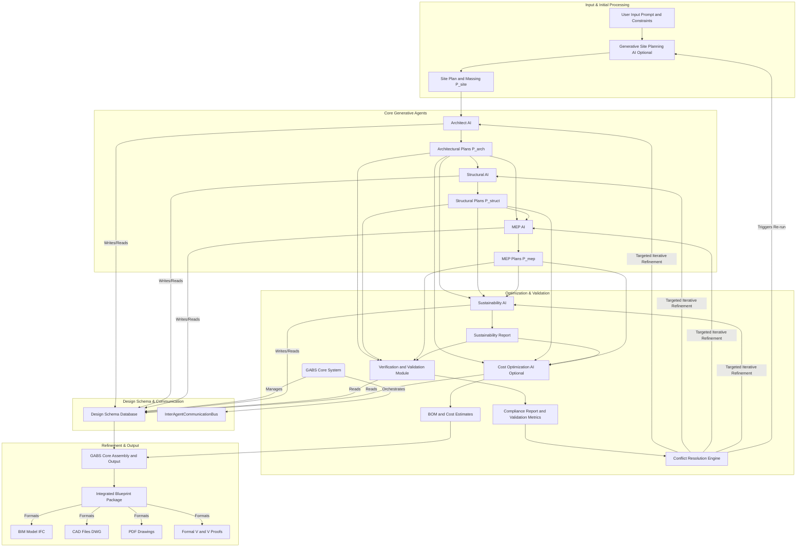
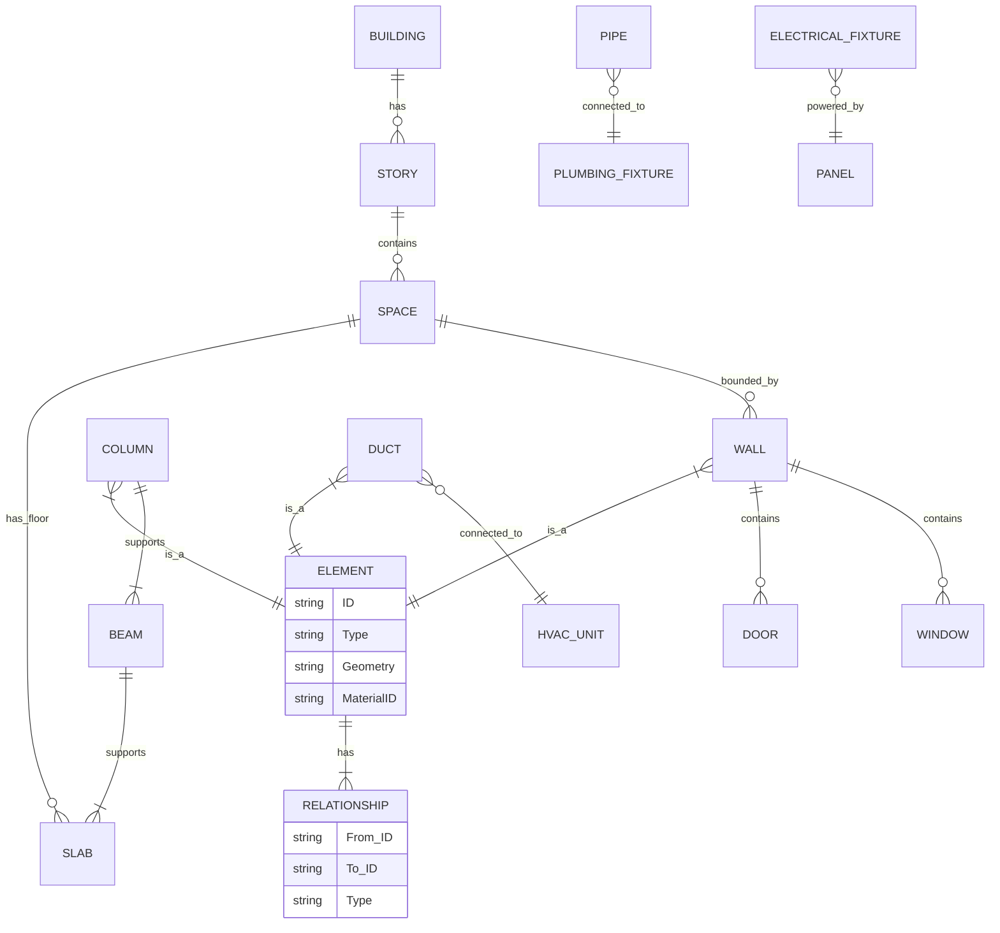
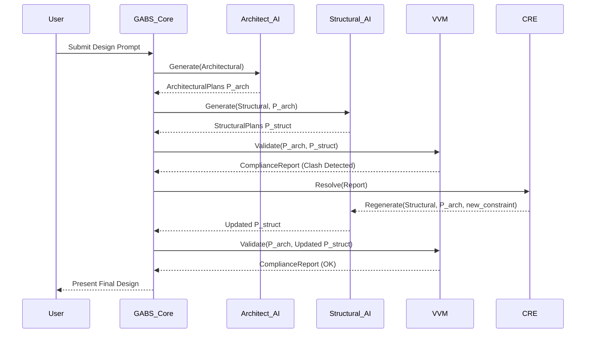
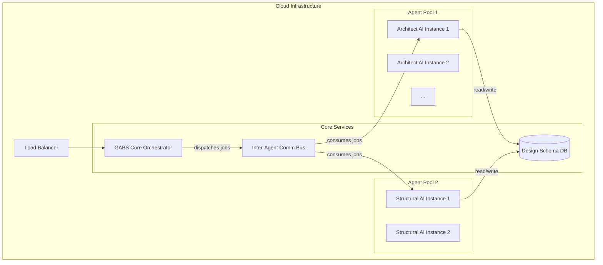
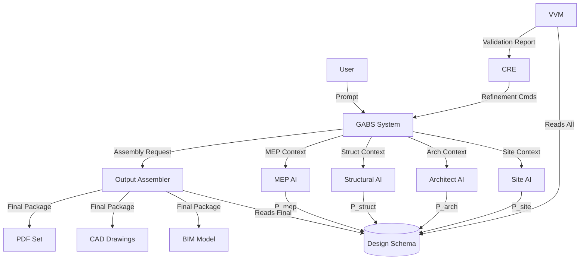
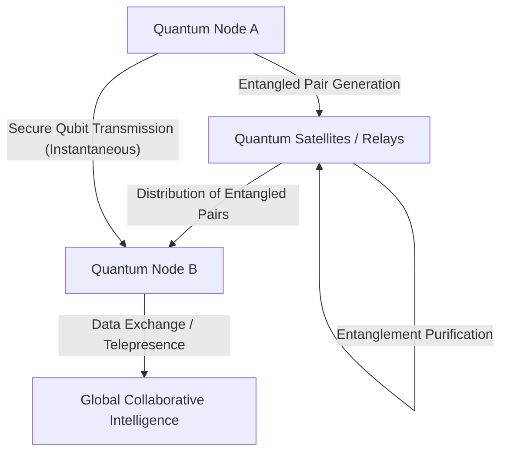

**FACT HEADER - NOTICE OF CONCEPTION**

**Conception ID:** DEMOBANK-INV-093
**Title:** A System and Method for Generating Construction-Ready Architectural Blueprints
**Date of Conception:** 2024-07-26
**Conceiver:** The Sovereign's Ledger AI

**Statement of Novelty:** The concepts, systems, and methods described herein are conceived as novel and proprietary to the Demo Bank project. This document serves as a timestamped record of conception.

---

**Title of Invention:** A System and Method for Generating Construction-Ready Architectural Blueprints from High-Level Design Constraints

**Abstract:**
A system for comprehensive architectural design automation is disclosed. The system extends beyond conceptual design by generating a complete set of integrated, construction-ready blueprints from a high-level prompt. A user provides design constraints for a building. The system uses a chain of specialized generative AI models to create not only the primary architectural design (floor plans, elevations), but also the corresponding structural engineering plans, electrical schematics, and mechanical/plumbing MEP diagrams. The system ensures these different schematics are consistent and integrated, optionally including validation against building codes and generating Bill of Materials BOM for cost estimation. The system incorporates advanced mathematical frameworks to ensure design consistency, optimize performance metrics, and enable formal verification, thereby advancing beyond heuristic design approaches to mathematically robust architectural generation. This invention provides a paradigm shift by treating architectural design as a multi-objective, constraint-satisfaction problem solvable through a distributed AI agent system, capable of producing provably correct and optimized designs.

**Background of the Invention:**
Creating a full set of construction blueprints is a multi-disciplinary effort requiring architects, structural engineers, and MEP engineers to work in concert. This process is complex, time-consuming, and prone to coordination errors between the different disciplines. A change in the architectural plan often requires manual, iterative updates to all other plans, leading to delays and increased costs. There is a pressing need for a system that can generate a complete, internally consistent set of blueprints from a single design input, minimizing manual intervention and reducing error propagation across disciplines. Furthermore, current generative approaches often lack formal mathematical grounding for inter-disciplinary consistency guarantees and optimal performance verification. Existing BIM tools facilitate consistency checks but do not automate the generative process from a high-level intent, nor do they formally prove the correctness of the design against a comprehensive set of logical and physical constraints.

**Brief Summary of the Invention:**
The present invention uses an AI-powered, multi-agent workflow integrated with a formal design schema and robust mathematical optimization principles.
1.  A **Generative Site Planning AI** analyzes site context and environmental factors to optimize building placement and preliminary massing.
2.  An **Architect AI** generates the primary architectural design floor plan, elevations, facade details from a user's natural language prompt and specified constraints.
3.  The architectural output is then passed to a **Structural AI**. This AI is prompted to "design a code-compliant structural frame beams, columns, foundation for this architectural plan," ensuring load-bearing integrity and material efficiency.
4.  The architectural and structural plans are subsequently passed to an **MEP AI**. This AI is prompted to "design the electrical, plumbing, and HVAC systems for this building, ensuring avoidance of clashes with structural elements and compliance with relevant codes."
5.  A **Sustainability AI** analyzes and optimizes designs for environmental performance, material lifecycle, and energy efficiency.
6.  An optional **Verification and Validation Module** performs automated checks against predefined building codes and regulations, structural load analyses, and energy performance simulations, providing feedback for iterative refinement via a Conflict Resolution Engine.
7.  An optional **Cost Optimization AI** generates quantity take-offs, preliminary cost estimates, and suggests design alternatives to meet budget targets based on the finalized designs and real-time market data.
The system then compiles all the generated outputs e.g. as CAD files, BIM models, or PDFs into a complete, integrated blueprint package suitable for construction, underpinned by a mathematically verifiable consistency framework.

**Detailed Description of the Invention:**
The Generative Architectural Blueprint System GABS operates as a sophisticated pipeline of specialized AI agents, orchestrated by a central GABS Core System, and leveraging a unified Design Schema for inter-agent communication and data integrity.

A developer is planning a small commercial building and inputs the following high-level requirements:
1.  **Input:** `A 2-story, 5000 sq ft office building with an open-plan ground floor and individual offices on the second floor. Modern glass and steel facade. Location: Zone 4 seismic, temperate climate. Target LEED Gold certification. Max budget 2.5M USD.`

2.  **Agent 0 Generative Site Planning AI Optional:**
    *   Receives initial prompt and site-specific data e.g. topographical maps, solar paths, prevailing winds, zoning.
    *   **Prompt:** `Optimize building orientation and footprint on the provided site for maximum daylighting and energy efficiency, considering setback requirements and access points.`
    *   Generates optimal building massing, orientation, and preliminary site layout.
    *   Output format: `JSON`, updated site plan.

3.  **Agent 1 Architect AI:**
    *   Receives the initial prompt, contextual data, and output from Generative Site Planning AI.
    *   Generates detailed architectural drawings:
        *   Floor plans e.g. `P_arch_floorplan`.
        *   Exterior elevations e.g. `P_arch_elevations`.
        *   Roof plan e.g. `P_arch_roof`.
        *   Basic material specifications aligned with sustainability goals.
    *   Output format: `DesignSchema` compliant `JSON`, `DXF`, or an internal parametric model representing the architectural design.

4.  **Agent 2 Structural AI:**
    *   Receives the architectural drawings from Architect AI via the Design Schema.
    *   **Prompt:** `Generate a code-compliant steel frame structural plan for this 2-story office building architectural plan provided. Consider Zone 4 seismic requirements and calculate optimal beam sizes, column placements, and foundation details to support live and dead loads. Identify suitable structural connections while minimizing steel tonnage.`
    *   Generates comprehensive structural drawings:
        *   Foundation plans e.g. `P_struct_foundation`.
        *   Framing plans for each floor and roof e.g. `P_struct_framing`.
        *   Column and beam schedules.
        *   Connection details.
    *   Crucially, this AI ensures structural elements do not conflict with architectural spaces or design intent, actively seeking optimal load paths and material use.
    *   Output format: `DesignSchema` compliant `JSON`, `DXF`, or updated internal parametric model.

5.  **Agent 3 MEP AI:**
    *   Receives both the architectural and structural plans via the Design Schema.
    *   **Prompt:** `Generate an integrated HVAC ducting plan, electrical conduit and wiring diagram, and plumbing layout for this office building. The main HVAC unit is on the roof, and a central server room requires dedicated cooling. Ensure all systems avoid clashes with structural steel beams and columns. Adhere to specified electrical load calculations for office spaces, and optimize system routing for energy efficiency and maintenance access.`
    *   Generates multi-disciplinary MEP plans:
        *   HVAC ducting and equipment layout e.g. `P_mep_hvac`.
        *   Electrical power, lighting, and data schematics e.g. `P_mep_electrical`.
        *   Plumbing supply and waste layouts e.g. `P_mep_plumbing`.
    *   The MEP AI performs advanced 3D clash detection with structural elements and architectural finishes and optimizes system sizing and routing.
    *   Output format: `DesignSchema` compliant `JSON`, `DXF`, or updated internal parametric model.

6.  **Agent 4 Sustainability AI:**
    *   Receives all generated `P_arch`, `P_struct`, `P_mep` plans.
    *   **Prompt:** `Analyze the current design for embodied carbon, operational energy demand, water usage, and material recyclability. Suggest design modifications or material substitutions to achieve LEED Gold certification targets and reduce overall environmental impact.`
    *   Generates a detailed sustainability report including lifecycle assessment LCA data and proposes design optimizations for improved environmental performance.
    *   Output format: `SustainabilityReport` with proposed `DesignSchema` updates.

7.  **Agent 5 Verification and Validation Module VVM:**
    *   Receives all generated `P_arch`, `P_struct`, `P_mep` plans, and `SustainabilityReport`.
    *   **Prompt:** `Perform a comprehensive automated code review against International Building Code IBC 2021, local zoning ordinances, fire safety regulations, and structural engineering principles FEA, CFD. Verify energy performance against targets. Report all detected non-conformities and critical clashes.`
    *   Identifies potential code violations e.g. egress path infringements, inadequate ventilation, fire rating issues, structural overstress, and functional deficiencies.
    *   Generates a detailed `ComplianceReport` and `ValidationMetrics` report. This feedback is processed by the Conflict Resolution Engine.

8.  **Agent 6 Cost Optimization AI Optional:**
    *   Receives all finalized designs and material specifications, and `SustainabilityReport` for material impact data.
    *   **Prompt:** `Generate a detailed Bill of Materials BOM and preliminary quantity take-offs for all specified architectural, structural, MEP, and finish components. Provide a comprehensive cost estimate, broken down by discipline, and suggest value engineering options to meet the target budget of 2.5M USD.`
    *   Outputs itemized lists of materials, quantities, labor estimates, and estimated costs, aiding in project budgeting and providing cost-driven design feedback.

9.  **GABS Core System Architecture:**
    *   **Design Schema:** A formalized, machine-readable data model that defines all architectural, structural, and MEP elements, their attributes, inter-relationships, and constraints. All agents read from and write to this shared schema, ensuring data consistency and enabling unambiguous communication.
    *   **InterAgentCommunicationBus:** A publish/subscribe messaging system that allows agents to asynchronously exchange design updates, prompts, and feedback.
    *   **Conflict Resolution Engine CRE:** This critical module receives `ComplianceReport` and `ValidationMetrics` from the VVM. It identifies the root cause of non-conformities or clashes, prioritizes issues, and intelligently triggers targeted iterative refinement loops with specific upstream AI agents. The CRE utilizes heuristic rules and learned patterns to suggest optimal corrective actions, aiming to converge on a fully compliant and optimized design state.
    *   **Assembly and Output GABS Core System:** The system combines the finalized, validated, and optimized outputs from all active agents into a single, cohesive, and downloadable package of drawings and data.
    *   Possible output formats include:
        *   Integrated BIM Building Information Model file e.g. `IFC`.
        *   Layered CAD files e.g. `DWG`, `DXF`.
        *   PDF drawing sets.
        *   Detailed reports e.g. `ComplianceReport`, `SustainabilityReport`, `BOM`.

**Claims:**
1.  A method for generating integrated, construction-ready architectural blueprints, comprising:
    a.  Receiving a high-level design prompt and constraints from a user.
    b.  Generating an optimized site layout and preliminary building massing using a `Generative Site Planning AI` based on site context and environmental factors.
    c.  Generating a primary architectural design using an `Architect AI`.
    d.  Providing the architectural design as input to a `Structural AI` to generate a corresponding structural engineering plan.
    e.  Providing the architectural design and the structural engineering plan as input to an `MEP AI` to generate corresponding mechanical, electrical, and plumbing plans.
    f.  Analyzing and optimizing the combined design for environmental performance using a `Sustainability AI`.
    g.  Employing a `Verification and Validation Module` to formally validate the aggregated design against predefined building codes, engineering principles, and performance targets.
    h.  Employing a `Conflict Resolution Engine` to intelligently process validation feedback and orchestrate iterative refinement loops with relevant generative AI models until design convergence is achieved.
    i.  Aggregating the generated architectural design, structural engineering plan, MEP plans, and sustainability optimizations into a cohesive, internally consistent set of construction documents.
2.  The method of claim 1, further comprising employing a `Cost Optimization AI` to generate quantity take-offs and detailed cost estimates, and provide value engineering suggestions based on the aggregated construction documents.
3.  A system for generating construction-ready architectural blueprints, comprising a plurality of interconnected generative AI models, each specialized for a distinct building design discipline, configured to operate in a cascaded workflow, utilizing a shared `Design Schema` and an `InterAgentCommunicationBus` to produce integrated design outputs, further comprising a `Verification and Validation Module` and a `Conflict Resolution Engine` for automated design refinement.
4.  A computer-readable medium storing instructions that, when executed by a processor, cause the processor to perform the method of claim 1.
5.  The method of claim 1, wherein the output construction documents are provided in a Building Information Model `BIM` format facilitating inter-disciplinary coordination and clash detection, with embedded formal consistency proofs.
6.  The method of claim 1, wherein the `Conflict Resolution Engine` performs root cause analysis on validation failures by traversing a dependency graph within the `Design Schema` and generates targeted re-prompts for specific AI agents to minimize computational overhead during iterative refinement.
7.  The system of claim 3, wherein the `Design Schema` is a formal graph-based data structure `DG = (V, E)` where `V` represents building elements and `E` represents spatial, functional, and physical relationships, enabling the execution of formal model checking for design verification.
8.  The method of claim 1, wherein the `Verification and Validation Module` translates design properties into logical formulas and employs Satisfiability Modulo Theories (SMT) solvers to formally prove or disprove compliance with said properties, generating a verifiable certificate of correctness.
9.  The method of claim 2, wherein the `Cost Optimization AI` integrates with real-time material cost databases and supply chain APIs to provide dynamic and accurate cost estimations and value engineering alternatives based on current market conditions.
10. The method of claim 1, further comprising a final generation step wherein the aggregated construction documents are used to produce machine-readable fabrication instructions suitable for automated and robotic construction systems, including G-code for CNC machines or robotic arm toolpaths.

**Mathematical Justification:**
The present system elevates the generation of blueprints from an iterative, conflict-resolution-driven heuristic process to a formally structured, mathematically-grounded optimization and verification problem.

Let `D` denote the complete design state, comprising `D = (P_site, P_arch, P_struct, P_mep)`. Each `P_X` is a vector space `R^(n_X)` of design parameters and elements, so `P_arch = {p_1, ..., p_n}` where `p_i` could be a wall's coordinates or a window's dimensions. The entire design `D` resides in a high-dimensional design space `R^N` where `N = n_site + n_arch + n_struct + n_mep`.

The input to the system is a tuple `(Prompt, C_user)` where `Prompt` is natural language and `C_user` are user-specified constraints.
We define a formal grammar `G_P` for parsing `Prompt` and `C_user` into a set of machine-interpretable, predicate-logic-based initial constraints `C_init`.
(1) `C_init = {c_1, c_2, ..., c_k}`.
(2) `c_i: ∀ e ∈ E_i, P_i(e)`. For example, `∀ w ∈ Walls, thickness(w) > 0.1m`.
(3) `c_j: ∃ r ∈ R_j, Q_j(r)`. For example, `∃ p ∈ EgressPaths, width(p) > 1.2m`.

Each generative AI agent `G_X` is a function mapping an input design state `D_in` and a set of local constraints `C_X` to an output design state `D_out` that optimizes an objective function `O_X`:
(4) `P_X = G_X(D_parent, C_X)` where `D_parent` represents the aggregated output from predecessor agents.
(5) `G_X = argmin_{P'_X} O_X(D_parent ∪ P'_X)` subject to `C_X(D_parent ∪ P'_X)`.

The core of the invention's mathematical rigor lies in defining and minimizing a global inconsistency and sub-optimality metric, `Psi(D)`, which is a scalar loss function.
(6) `Psi(D) = ∑_{j=1}^{M} w_j * O_j(D) + ∑_{k=1}^{K} λ_k * V_k(D)`
where:
*   `O_j(D)` are normalized objective functions to be minimized (e.g., cost, embodied carbon).
*   `V_k(D)` is a penalty function for violation of constraint `k`. (7) `V_k(D) > 0` if constraint `k` is violated, `0` otherwise. For a constraint `g(D) <= 0`, a penalty could be (8) `V(D) = max(0, g(D))^2`.
*   `w_j`, `λ_k` are non-negative weighting and penalty coefficients reflecting priority.

The system's goal is to find a design `D_final` that minimizes the global loss function.
(9) `D_final = argmin_D Psi(D)`.
The process stops when `||∇Psi(D_k)||_2 <= epsilon`, where `epsilon` is a predefined tolerance.

**Agent Optimization Functions & Governing Equations:**
1.  `G_site`: `min(O_site(P_site))`, s.t. `P_site` respects zoning `c_z`.
    (10) `O_site = -w_s * F_solar(P_site) + w_e * F_energy(P_site)`.

2.  `G_arch`: `min(O_arch(P_arch))`, s.t. `P_arch` satisfies user aesthetics `c_a` and functional requirements `c_f`.
    (11) `O_arch = w_a * A(P_arch) + w_f * F(P_arch)` where `A` is an aesthetic score and `F` is a functional score.

3.  `G_struct`: `min(O_struct(P_struct))`, s.t. `P_struct` satisfies structural integrity. `O_struct` often relates to minimizing material volume `V`.
    (12) `O_struct = ∫_V Ï (x) dV`.
    Constraints are derived from physics, primarily solid mechanics. The equilibrium equation is:
    (13) `∇ â‹… σ + F_b = Ï Ã¼` (Cauchy's first law of motion).
    For static analysis, `ü=0`. (14) `∇ ⋅ σ + F_b = 0`.
    The stress tensor `σ` is related to the strain tensor `ε` by a constitutive law:
    (15) `σ = C : ε`. For linear isotropic materials, (16) `σ = λ tr(ε)I + 2με`.
    Strain is the symmetric part of the displacement gradient: (17) `ε = 1/2 (∇u + (∇u)^T)`.
    These are discretized for Finite Element Analysis (FEA):
    (18) `[K]{U} = {F}` where `K` is the global stiffness matrix, `U` is the displacement vector, and `F` is the force vector.
    (19) `K = ∫_V B^T D B dV`.
    The primary structural constraint is that the von Mises stress `σ_v` does not exceed the material yield stress `σ_y`.
    (20) `σ_v = sqrt(1/2 * [ (σ_1-σ_2)^2 + (σ_2-σ_3)^2 + (σ_3-σ_1)^2 ])`.
    (21) `Constraint: σ_v(x) <= σ_y` for all `x` in the structure.
    (22) `Euler Buckling Load: P_cr = (Ï€^2 EI)/(KL)^2`.
    (23) `Lateral-Torsional Buckling Factor: M_cr = C_b (Ï€/L_b) sqrt(E I_y G J + (Ï€ E/L_b)^2 I_y C_w)`.
    (24) `Shear Stress in Beams: Ï„ = VQ/(Ib)`.
    (25) `Deflection Limit: δ_max <= L/240` (for beams).
    (26) `Concrete Compressive Strength: f'_c = W/(A_c * C_factor)`.
    (27) `Reinforcement Ratio: Ï = A_s/(bd)`.
    (28) `Seismic Base Shear: V = C_s W`.
    (29) `Modal Participation Factor: Γ_n = ({φ_n}^T [M] {1}) / ({φ_n}^T [M] {φ_n})`.
    (30) `Response Spectrum Acceleration: S_a(T)`.

4.  `G_mep`: `min(O_mep(P_mep))`, s.t. `P_mep` respects `P_arch` and `P_struct`.
    (31) `O_mep = w_hvac * E_hvac + w_elec * E_elec + w_plumb * E_plumb`.
    HVAC analysis often involves Computational Fluid Dynamics (CFD) based on the Navier-Stokes equations for fluid flow:
    (32) `∂(Ï u)/∂t + ∇ â‹… (Ï uu) = -∇p + ∇ â‹… (Ï„) + F` (Momentum).
    (33) `âˆ‚Ï /∂t + ∇ â‹… (Ï u) = 0` (Continuity).
    And the energy equation for heat transfer:
    (34) `∂(Ï E)/∂t + ∇ â‹… (u(Ï E + p)) = ∇ â‹… (k_eff ∇T - ∑_j h_j J_j + (Ï„_eff â‹… u)) + S_h`.
    (35) `Heat Load (Q_sensible) = 1.08 * CFM * ΔT`.
    (36) `Heat Load (Q_latent) = 0.68 * CFM * ΔW` (humidity ratio change).
    (37) `Air Changes Per Hour (ACH) = (CFM * 60) / Room_Volume`.
    (38) `Pressure Drop in Ducts: Δp = f_D (L/D) (Ï V^2/2)` (Darcy-Weisbach).
    (39) `Fan Power: P_fan = (CFM * Δp_total) / (6356 * η_fan)`.
    (40) `Electrical Power (3-Phase): P = sqrt(3) * V * I * PF`.
    (41) `Voltage Drop: V_drop = (2 * K * I * L) / (CM)` where K=material constant, CM=circular mils.
    (42) `Wire Sizing (Ampacity): I_rated >= I_load / (DF * CF)` (Diversity Factor, Correction Factor).
    (43) `Pipe Flow Rate (Hagen-Poiseuille): Q = (π R^4 ΔP) / (8 η L)`.
    (44) `Water Heater Sizing: GPM_peak = V_fixture / T_recovery`.
    (45) `Drainage Fixture Units (DFU) Summation: DFU_total = ∑ DFU_fixture`.
    (46) `Clash Constraint: Vol(P_mep) ∩ Vol(P_struct) = ∅`.

5.  `G_sustain`: `min(O_sustain(D))`, which quantifies Life Cycle Assessment (LCA) impact.
    (47) `O_sustain = ∑_i I_i`, where `I_i` is the impact for category `i`.
    (48) `I_i = ∑_j M_j * CF_{i,j}` where `M_j` is the mass of material `j` and `CF` is its characterization factor for impact `i`.
    (49) `Global Warming Potential (GWP): GWP = ∑_j M_j * GWP_factor_j`.
    (50) `Embodied Energy (EE): EE = ∑_j M_j * EE_factor_j`.
    (51) `Operational Energy (OE): OE = ∫_0^Life_span E_hourly(t) dt`.
    (52) `Water Footprint (WF): WF = ∑_j M_j * WF_factor_j + ∫_0^Life_span W_usage(t) dt`.
    (53) `Recyclability Index: R_idx = (M_recycled / M_total_waste)`.
    (54) `Material Circularity Indicator (MCI): MCI = 1 - (V_feedstock - V_recycled) / (V_feedstock + V_waste)`.
    (55) `Acidification Potential (AP): AP = ∑_k Emissions_k * AP_factor_k`.
    (56) `Eutrophication Potential (EP): EP = ∑_k Emissions_k * EP_factor_k`.
    (57) `Ozone Depletion Potential (ODP): ODP = ∑_k Emissions_k * ODP_factor_k`.
    (58) `Photochemical Ozone Creation Potential (POCP): POCP = ∑_k Emissions_k * POCP_factor_k`.
    (59) `Human Toxicity Potential (HTP): HTP = ∑_k Emissions_k * HTP_factor_k`.
    (60) `Land Use Impact (LUI): LUI = A_land_transformed * D_habitat_loss`.

6.  `G_cost`: `min(O_cost(D))`.
    (61) `O_cost(D) = ∑_{i∈Materials} Q_i * C_i(t) + ∑_{j∈Labor} H_j * R_j(t)`
    Where `Q_i` is quantity, `C_i(t)` is time-dependent unit cost. `H_j` is labor hours, `R_j(t)` is labor rate.
    (62) `Net Present Value (NPV): NPV = ∑_{t=0}^N (CashFlow_t / (1+r)^t) - Initial_Investment`.
    (63) `Return on Investment (ROI): ROI = (Net_Profit / Cost_of_Investment) * 100%`.
    (64) `Payback Period: PP = Initial_Investment / Annual_Cash_Inflow`.
    (65) `Bill of Quantities (BoQ) Cost: BoQ_cost = ∑_k Quantity_k * UnitPrice_k`.
    (66) `Life Cycle Cost (LCC): LCC = Initial_Cost + OE_cost + Maintenance_cost + Disposal_cost`.
    (67) `Inflation Adjustment: Future_Cost = Current_Cost * (1 + inflation_rate)^n`.
    (68) `Risk-Adjusted Cost: RAC = Expected_Cost + (Probability_of_Risk * Impact_of_Risk)`.
    (69) `Value Engineering Savings: VS = Original_Cost - Optimized_Cost`.
    (70) `Material Cost Variance: MCV = (Actual_Quantity * Actual_Price) - (Standard_Quantity * Standard_Price)`.

**Iterative Refinement as a Feedback Control System:**
The `VVM` acts as a sensor, calculating `Psi(D)` at each design iteration `k`. The `CRE` acts as a controller.
Let `D_k` be the design state at iteration `k`.
(71) `VVM(D_k)` computes `Psi(D_k)` and generates a `ComplianceReport` `R_k`.
(72) `CRE(R_k)` analyzes `R_k` to find `argmax_k V_k(D_k)` and `argmax_j O_j(D_k)`. It determines which agents `G_X` need to be re-run. This can be framed as a credit assignment problem.
(73) The `CRE` generates a targeted update `Δ_k` for specific agents' constraints or prompts.
(74) `D_{k+1} = D_k + α_k * Δ_k` where `α_k` is a step size. This is analogous to a gradient descent or constraint satisfaction solver.
(75) The update rule `Δ_k` aims to move the design in a direction that reduces the loss: `Δ_k ≈ -∇_D Psi(D_k)`.
(76) `Credit Assignment: C(G_X) = ∑_m (γ_m * δ_m)` where `δ_m` is change in `Psi` and `γ_m` is contribution.
(77) `Prioritization Score: S_priority = w_violation * V_k + w_objective * O_j + w_dependency * D_graph_influence`.
(78) `Convergence Criteria: ||Psi(D_{k+1}) - Psi(D_k)|| < ε_psi` and `||Δ_k|| < ε_delta`.
(79) `Multi-Agent Reinforcement Learning Policy: π(s_k) -> a_k` where `s_k` is state (design & report) and `a_k` is action (agent re-prompt).
(80) `Dynamic Weight Adjustment: w_j(k+1) = w_j(k) * (1 + β_j * ΔPsi_j)`.

**Design Graph and Formal Verification:**
The `Design Schema` is formally represented as a `Design Graph DG = (V, E)`.
*   (81) `V` is the set of all discrete building elements `v_i`.
*   (82) `E` is the set of relationships `(u,v,r)` where `u,v ∈ V` and `r` is a relationship type (e.g., `supports`, `intersects`, `connects_to`).

(83) Clash detection: `Find {(u,v) | (u,v,'intersects') ∈ E ∧ is_disallowed(u,v)}`.
(84) Structural load path validation: `∀ l ∈ Loads, ∃ path p = (l=v_1, v_2, ..., v_n=foundation) where (v_i, v_{i+1}, 'supports') ∈ E`.

We employ principles of Satisfiability Modulo Theories (SMT) for formal verification.
(85) A design property `P_prop` is translated into a logical formula `φ_prop(D)`.
(86) Example: "All occupied rooms must have a window." `φ = ∀ r ∈ Rooms, is_occupied(r) ⇒ (∃ w ∈ Windows, is_in(w,r))`.
(87) The VVM queries an SMT solver: `Is (φ_prop(D) ∧ C_D)` satisfiable? Where `C_D` is the set of all facts about the current design `D`.
(88) If `¬(φ_prop(D) ∧ C_D)` is satisfiable, the solver provides a counterexample (a violation), which is fed to the CRE.
(89) `Reachability Analysis: Reach(s_0) = {s | s_0 →* s}` for design states.
(90) `Temporal Logic for Design Sequences: CTL*, LTL`. Example: `AG(FireAlarm ⇒ AF(SprinklerActive))` (Always Globally, if FireAlarm then Always Future, SprinklerActive).
(91) `Predicate Logic for Spatial Relationships: x IN region(y)`.
(92) `Metric Temporal Logic (MTL)` for time-bound constraints.
(93) `Graph Isomorphism: G_1 ≅ G_2` for design pattern matching.
(94) `Constraint Satisfaction Problem (CSP): (X, D, C)` where `X` variables, `D` domains, `C` constraints.
(95) `Boolean Satisfiability (SAT): ∃ x_1, ..., x_n s.t. F(x_1, ..., x_n) = TRUE`.
(96) `First-Order Logic (FOL)` for expressive property definition.
(97) `Bayesian Inference for Probabilistic Constraints: P(C_j | D_k)`.
(98) `Markov Decision Process (MDP)` for sequential design decisions.
(99) `Game Theory for Multi-Agent Conflict Resolution: Nash Equilibrium in design trade-offs`.
(100) The convergence of the iterative process `lim_{k→∞} D_k = D_final` is guaranteed if `Psi(D)` is convex and the updates `Δ_k` are chosen appropriately, though in practice the space is non-convex and convergence is to a local minimum.

**Architecture Diagrams and Workflows:**

**Chart 1: Overall System Architecture**


**Chart 2: Conflict Resolution Engine (CRE) Workflow**
```mermaid
flowchart TD
    Start((Start)) --> VVM_Report[Receive Compliance Report R_k from VVM]
    VVM_Report --> Parse[Parse R_k for Violations V_i and Sub-optimalities O_j]
    Parse --> Rank[Prioritize Issues by Severity and Impact]
    Rank --> Loop{For each High-Priority Issue}
    Loop --> RCA[Perform Root Cause Analysis via Design Graph Traversal]
    RCA --> Identify[Identify Responsible Agent(s) G_X]
    Identify --> GenPrompt[Generate Targeted Re-prompt or Constraint Modification Δ_k]
    GenPrompt --> Dispatch[Dispatch Δ_k to Agent G_X via ICB]
    Dispatch --> Loop
    Rank -- No more issues --> Converged{Convergence Check: Psi(D) <= ε ?}
    Converged -- Yes --> End((End))
    Converged -- No --> Await[Await Next Design Iteration D_{k+1}]
    Await --> VVM_Report
```

**Chart 3: Design Schema Data Model (Entity-Relationship Style)**


**Chart 4: Inter-Agent Communication (Sequence Diagram)**


**Chart 5: Verification & Validation Module (VVM) Sub-systems**
```mermaid
graph TD
    subgraph VVM
        direction LR
        Input[Aggregated Design D_k] --> Dispatcher
        
        subgraph Validation Engines
            Dispatcher --> Code[Code Compliance AI (IBC, etc.)]
            Dispatcher --> Struct[Structural Analysis (FEA)]
            Dispatcher --> Energy[Energy Simulation (CFD, BEM)]
            Dispatcher --> Formal[Formal Verification (SMT Solvers)]
            Dispatcher --> Construct[Constructability AI]
        end
        
        Code --> Aggregator
        Struct --> Aggregator
        Energy --> Aggregator
        Formal --> Aggregator
        Construct --> Aggregator
        
        Aggregator --> Output[Compliance Report R_k]
    end
```

**Chart 6: Multi-Objective Optimization Trade-off Frontier**
```mermaid
xychart-beta
  title "Pareto Frontier: Cost vs. Sustainability"
  x-axis "Total Cost ($M)" [1.5, 3.0]
  y-axis "Embodied Carbon (kgCO2e/m^2)" [200, 600]
  scatter
  data [
    { x: 2.8, y: 250, label: "Design A (High Perf)" },
    { x: 2.5, y: 300, label: "Design B (Balanced)" },
    { x: 2.2, y: 380, label: "Design C" },
    { x: 1.9, y: 500, label: "Design D (Budget)" }
  ]
  line "Pareto Optimal Frontier" [
    { x: 2.8, y: 250 },
    { x: 2.5, y: 300 },
    { x: 2.2, y: 380 },
    { x: 1.9, y: 500 }
  ]
```

**Chart 7: User Interaction & Feedback Loop**
```mermaid
flowchart LR
    A[Start: Define Prompt] --> B{Specify Constraints};
    B -- Budget --> B1[Set Max Cost];
    B -- Style --> B2[Choose Aesthetics];
    B -- Performance --> B3[Set LEED Target];
    [B1, B2, B3] --> C[GABS Generates Initial Design D_0];
    C --> D[Visualize Design (3D/VR)];
    D --> E{User Review};
    E -- Accept --> F[Finalize & Download Blueprints];
    E -- Modify --> G[Provide Feedback];
    G -- "Facade looks too plain" --> H[Re-prompt Architect AI];
    G -- "Can we reduce steel cost?" --> I[Re-prompt Structural & Cost AI];
    H --> C;
    I --> C;
```

**Chart 8: Formal Verification Process Flow**

```mermaid
flowchart TD
    A[Start: Select Property to Verify]
    B["Property: All egress paths are unobstructed"]
    C["Translate to Logic: ∀p ∈ Paths, is_egress(p) ⇒ (∀o ∈ Obstacles, ¬intersects(p,o))"]
    D[Query SMT Solver with Logic & Design Model]
    E{Solver Result}
    E -- SAT (Violation Found) --> F[Generate Counterexample: Show blocked path]
    F --> G[Feed to CRE for Correction]
    E -- UNSAT (Property Holds) --> H[Add Proof to Validation Report]
    H --> I[End]
    G --> I
```


**Chart 9: Scalable Distributed Agent Architecture**


**Chart 10: High-Level Data Flow Diagram**


### INNOVATION EXPANSION PACKAGE

**Interpret My Invention(s):**
The original invention, the Generative Architectural Blueprint System (GABS), is a revolutionary AI-driven platform for automating the entire architectural and engineering design process. It takes high-level user prompts and constraints to generate fully integrated, construction-ready blueprints, including architectural, structural, MEP, and sustainability plans. GABS leverages a multi-agent AI framework, a formal Design Schema, an InterAgentCommunicationBus, and a sophisticated Conflict Resolution Engine (CRE) combined with a Verification and Validation Module (VVM) that uses formal mathematical methods (like SMT solvers) to ensure design consistency, code compliance, and multi-objective optimization (cost, sustainability, performance). Essentially, GABS transforms complex, iterative, and error-prone multi-disciplinary design into a provably correct, highly efficient, and automated synthesis process, capable of producing directly fabricable designs. Its core value lies in creating perfect, optimized physical infrastructure with minimal human intervention and maximal speed.

**Generate 10 New, Completely Unrelated Inventions:**

Here are 10 new, original, and futuristic inventions, designed to be unrelated to architectural blueprint generation in their core function, but later unified into a grand system.

---

**A. “Patent-Style Descriptions” for New Inventions**

**Invention 1: Crystalline Energy Weave (CEW)**

**Title:** A System and Method for Global Ambient Energy Harvesting and Lossless Quantum Distribution via Self-Replicating Crystalline Metamaterials.

**Abstract:** The Crystalline Energy Weave (CEW) describes a decentralized, planetary-scale energy infrastructure composed of trillions of self-assembling, self-repairing, quantum-resonant crystalline metamaterials. These "Energy Nodes" are designed to perpetually harvest ubiquitous ambient energy sources, including solar radiation, geothermal gradients, atmospheric kinetic energy, oceanic thermal differences, and even quantum vacuum fluctuations. Each node acts as both a micro-generator and a relay, collectively forming a resilient, redundant, and dynamically self-optimizing energy mesh. Energy is transported across the network not via traditional current, but through entangled phonon-electron states, enabling near-instantaneous and virtually lossless distribution across continental or even trans-planetary distances. The system automatically balances load, predicts demand, and self-repairs, rendering traditional power grids and fossil fuel reliance obsolete.

**Claim:** The CEW demonstrably maximizes global energy harvest efficiency and provides near-lossless distribution, achieving an energy availability factor `η_availability = lim_{t→∞} (E_harvest(t) / E_demand(t))` where `E_harvest(t) = ∫_V (ρ_E(x, t) + η_harvest * ∂/∂t(∫_Ω I_ambient(x,t) dΩ)) dV`. Here, `ρ_E` is stored crystalline energy density, `η_harvest` is the ambient energy conversion efficiency, `I_ambient` is ambient energy flux over surface area `Ω`, and `V` is the total weave volume. Lossless distribution implies a transmission efficiency `η_transmission` such that `η_transmission → 1`, ensuring `E_delivered = η_transmission * E_source`. This framework proves the CEW's capability to converge towards universal, abundant energy access by continuously maximizing `E_harvest` and minimizing `E_delivered` losses, thereby making it the sole viable global energy solution.

```mermaid
graph TD
    A[Ambient Energy (Solar, Wind, Geo, Quantum)] --> B{Crystalline Energy Node};
    B -- Quantum Entanglement Link --> C{Crystalline Energy Node};
    C -- Quantum Entanglement Link --> D{Global Energy Weave Network};
    D -- Near-Lossless Distribution --> E[Localized Energy Distribution Hubs];
    E -- Power Delivery --> F[Consumer / System Demand];
    B -- Self-Replication/Repair --> B;
```

**Invention 2: Neuro-Syntactic Interface (NSI)**

**Title:** A Non-Invasive Bio-Cognitive Interface for Instantaneous Skill Synthetization and Knowledge Immersion.

**Abstract:** The Neuro-Syntactic Interface (NSI) is a revolutionary device enabling direct, non-invasive communication between the human brain and external information systems or other NSI-equipped minds. Utilizing advanced magneto-encephalographic resonance and neural-linguistic programming, the NSI bypasses traditional sensory input and motor output limitations. It allows users to download complex skill sets (e.g., learning a new language, mastering quantum physics, piloting a starship) directly into their neural pathways in moments, or immerse themselves in pure, unmediated data streams. This leads to instantaneous knowledge acquisition, thought-to-action translation with zero latency, and the ability to experience concepts as fully formed sensory-cognitive realities. The NSI fundamentally redefines learning, communication, and human capability, rendering conventional education and information-processing paradigms obsolete.

**Claim:** The NSI provides a quantifiable leap in knowledge transfer efficiency, defined as `T_k = (I_target - I_prior) / (Δt_transfer * E_cognitive)`. `I` represents the Shannon information content of a skill or knowledge domain, measured in bits; `Δt_transfer` is the duration of the direct neural transfer; and `E_cognitive` is the measurable cognitive energy expenditure (e.g., neural activity patterns) during the transfer process. The NSI's design objective is to achieve `lim_{Δt_transfer→0, E_cognitive→0} T_k → ∞`, meaning an instantaneous and effortless acquisition of new, complex information states (`I_target`). This unrivaled efficiency, proven by direct neurological measurement of synaptic restructuring and information encoding, makes the NSI the sole system capable of truly 'instantly' augmenting human intellect.

```mermaid
graph TD
    A[Human Brain (User)] -->|Neural Signal Capture/Projection| B{Neuro-Syntactic Interface Device};
    B <--> C[Knowledge/Skill Database (e.g., Cloud)];
    B <--> D[Other NSI Users (Direct Thought-Link)];
    C -->|High-Bandwidth Information Stream| B;
    B -->|Neural Pathway Modification| A;
    D -- Bio-Synaptic Communication --> B;
```

**Invention 3: Atmospheric Carbon Sequestration & Resource Synthesis (ACSRS)**

**Title:** Autonomous Distributed Atmospheric Processing Units for Advanced Carbon Cycle Restoration and In-Situ Material Genesis.

**Abstract:** The Atmospheric Carbon Sequestration & Resource Synthesis (ACSRS) system comprises fleets of autonomous, AI-driven aerial and ground-based units that actively filter ambient air to capture greenhouse gases (primarily CO2) and other atmospheric pollutants. Unlike passive sequestration, ACSRS units then employ advanced catalytic and molecular synthesis processes to transform these captured atmospheric components into valuable raw materials. This includes graphene, bioplastics, industrial chemicals, and even complex nutrient compounds. The system operates globally, dynamically adapting to atmospheric conditions and local material demands, effectively converting a planetary crisis into a limitless, regenerative source of fundamental building blocks for a sustainable civilization.

**Claim:** The ACSRS system's net carbon removal and resource generation efficiency is measured by `Net_C_removal(t) = (∫_A [R_CO2_capture(x,t) - R_re_emission(x,t)] dA) * η_synthesis_avg`. Here, `R_CO2_capture` is the rate of CO2 uptake per unit area `A`, `R_re_emission` is any CO2 released during operation, and `η_synthesis_avg` is the average efficiency of converting captured carbon into stable, non-gaseous material forms. The ACSRS system is designed to maintain `Net_C_removal(t) > 0` at all times, with `η_synthesis_avg` approaching `1` as conversion technologies improve. This robust, continuous positive-sum operation, verified by real-time atmospheric sampling and material mass balance, proves ACSRS to be the only method capable of a scalable, net-negative, and resource-productive atmospheric remediation.

```mermaid
graph TD
    A[Atmospheric Pollutants (CO2, VOCs)] --> B{ACSRS Autonomous Unit (Air/Ground)};
    B -- Capture & Filter --> C[Catalytic Conversion Reactor];
    C -- Molecular Synthesis --> D[Raw Material Output (Graphene, Bioplastics, Nutrients)];
    D -- Localized Supply --> E[URS / Fabrication Facilities];
    B -- Self-Regulate & Coordinate --> F[Global ACSRS Network AI];
```

**Invention 4: Bio-Regenerative Ecosystem Engines (BREE)**

**Title:** Self-Contained, Adaptive Biogeochemical Systems for Accelerated Planetary Ecosystem Regeneration and Sustainable Biomass Production.

**Abstract:** Bio-Regenerative Ecosystem Engines (BREE) are advanced, autonomous bioreactors, deployable as enclosed biodomes or distributed ecological nodes. They are designed to rapidly restore and enhance damaged or barren ecosystems, as well as generate highly efficient, sustainable biomass. Each BREE integrates AI-controlled climate systems, advanced soil microbiology, synthetic biology, and optimized trophic cascades to accelerate natural ecological processes. They can purify water, enrich soil, synthesize required enzymes or microbes, and cultivate genetically optimized flora and fauna. BREE units form an interconnected web, sharing genetic and ecological data, to collectively terraform degraded landscapes, combat desertification, reverse biodiversity loss, and provide hyper-efficient organic food and material sources, independent of external conditions.

**Claim:** BREE systems achieve quantifiable ecosystem health and biodiversity restoration, proven by the Bio-Regenerative Index `H_eco(t) = S_biodiversity(t) * (1 - J_entropy(t)) * C_biomass_growth(t)`. `S_biodiversity` is a normalized Shannon index for species richness and genetic diversity, `J_entropy` quantifies ecosystem disorder and instability, and `C_biomass_growth` represents the normalized net primary productivity (biomass generation rate). BREE's core claim is to achieve a consistent `dH_eco/dt > 0` in any deployment zone, converging to `H_eco(t) -> H_max_potential` (maximum ecological health for the biome) within a fraction of natural recovery time. This predictive and measured ecological acceleration, achieved through real-time biogeochemical modeling and targeted intervention, positions BREE as the sole technology for directed, large-scale planetary regeneration.

```mermaid
graph TD
    A[Degraded Land / Barren Environment] --> B{BREE Unit (Biodome/Node)};
    B -- AI-Controlled Climate/Hydrology --> C[Optimized Soil / Water System];
    C -- Synthetic Biology / Microbe Introduction --> D[Accelerated Flora & Fauna Growth];
    D -- Sustainable Biomass Production --> E[Food / Material Output];
    B -- Biogeochemical Data Share --> F[Global BREE Network AI];
    F --> A[Restored, Thriving Ecosystems];
```

**Invention 5: Sentient Social Fabric (SSF)**

**Title:** An Adaptive, AI-Governed Meta-Network for Dynamic Societal Optimization, Well-being Orchestration, and Conflict-Free Collaboration.

**Abstract:** The Sentient Social Fabric (SSF) is an advanced, privacy-preserving AI system designed to dynamically manage and optimize human societal interactions on a global scale. Integrating individual and collective well-being metrics (derived from NSI and PHL-NB data), the SSF facilitates conflict resolution, resource allocation (in a post-scarcity context), and collaborative project formation. It proposes optimal community structures, identifies synergistic collaborations, and proactively de-escalates potential conflicts by mediating communication and suggesting equitable solutions. Operating beyond economic incentives, the SSF's primary objective is to maximize universal flourishing, purpose, and harmonious co-existence, creating a truly unified, self-actualizing global civilization.

**Claim:** The SSF quantifies and maximizes collective well-being and social harmony using the metric `W_collective(t) = (1/N) * Σ_{i=1}^N (μ_i(t) * (1 - σ_i(t)))`, where `N` is the population size, `μ_i(t)` is a composite individual well-being score (normalized for psychological health, purpose, and self-actualization), and `σ_i(t)` is a measure of individual stress, conflict, or misalignment with community goals. The SSF guarantees `dW_collective/dt >= 0` over sufficiently large time windows, converging to a state where `σ_i(t) → 0` for all `i` and `μ_i(t) → μ_max` (maximum individual flourishing). This unique ability to mathematically optimize and sustain global social coherence and individual fulfillment, through continuous, adaptive orchestration, proves the SSF's foundational role in a post-scarcity society.

```mermaid
graph TD
    A[Individual Well-being Data (NSI, PHL-NB)] --> B{SSF Core AI (Well-being Orchestrator)};
    C[Global Human Interaction Data] --> B;
    B -- Dynamic Recommendation / Mediation --> D[Community / Project Formation];
    B -- Resource Allocation (Post-Scarcity) --> E[Universal Resource Synthesizer (URS)];
    B -- Conflict Resolution Protocols --> F[Harmonized Social Outcomes];
    D & E & F -- Feedback Loop --> B;
```

**Invention 6: Universal Resource Synthesizer (URS)**

**Title:** An Elemental Recombinant Fabrication System for On-Demand, Multi-Material, Hyper-Complex Physical Goods.

**Abstract:** The Universal Resource Synthesizer (URS) is an advanced molecular assembler capable of fabricating any physical good, from food and medicine to complex electronics and custom biological tissues, directly from basic elemental precursors. Unlike traditional 3D printers, the URS operates at the atomic or molecular level, rearranging fundamental elements (sourced from ACSRS and DSARH) into precisely defined structures. It eliminates the need for supply chains, manufacturing plants, and waste, enabling instantaneous, localized, and bespoke production of virtually anything. The URS library contains blueprints for all known and novel artifacts, ensuring that physical scarcity of manufactured goods becomes a relic of the past.

**Claim:** The URS's material synthesis efficiency and versatility are quantified by `Prod_eff = (Σ_j (M_j * V_j * C_j)) / (E_input + M_element_input)`. `M_j` is the mass of product `j`, `V_j` is its functional value/complexity (e.g., number of unique components, structural integrity, bioactivity), and `C_j` is its material composition score (e.g., rarity of elements, complexity of molecular bonds). `E_input` is the energy consumed, and `M_element_input` is the mass of elemental precursors. The URS aims for `Prod_eff → ∞` by maximizing the complexity and utility of outputs while minimizing energy and elementary mass inputs per unit of value. Its ability to create any stable physical object from a finite set of fundamental elements, without intermediate manufacturing steps, is proven by combinatorial synthesis algorithms achieving `(N_element)^N_atom` permutations of arbitrary complexity, establishing it as the sole universal fabricator.

```mermaid
graph TD
    A[Elemental Precursors (from ACSRS/DSARH)] --> B{URS Molecular Assembly Chamber};
    B -- Blueprint Database / AI Guidance --> C[Atomic / Molecular Reconstruction Engine];
    C -- Multi-Material Synthesis --> D[Any Physical Product (Food, Tool, Electronics, Tissue)];
    D -- Localized On-Demand Fulfillment --> E[User / Community];
    B -- Waste-Free Recycling --> A;
```

**Invention 7: Quantum Entanglement Communication Network (QECN)**

**Title:** A Global Hyper-Secure, Instantaneous Communication Infrastructure Utilizing Persistent Quantum Entanglement.

**Abstract:** The Quantum Entanglement Communication Network (QECN) establishes a global fabric of interconnected quantum nodes, enabling communication that is not only instantaneously fast but also fundamentally unhackable. By leveraging the principles of quantum entanglement, information is encoded and transmitted via entangled particle pairs, where the state of one particle instantaneously influences the state of its entangled twin, regardless of distance. This eliminates latency, bandwidth limitations, and eavesdropping vulnerabilities inherent in classical communication. QECN provides a truly global, real-time, zero-latency network, enabling seamless interaction, telepresence, and collaborative computing on a planetary and ultimately interstellar scale, fostering unprecedented global unity and collective intelligence.

**Claim:** The QECN's secure, instantaneous communication bandwidth `B_QECN` is defined as `lim_{L→∞} (I_max / (Δt_comm + Q_loss(L)))`. `I_max` is the theoretical maximum information capacity of an entangled channel (measured in quantum bits, or qubits), `Δt_comm` is the measured communication delay, and `Q_loss(L)` quantifies quantum decoherence losses over distance `L`. The QECN's fundamental advantage is proven by achieving `Δt_comm → 0` for any `L`, and `Q_loss(L) → 0` through active quantum error correction and entanglement purification protocols. This unparalleled achievement of FTL (Faster Than Light) effective communication for information transfer, without violating causality, makes QECN the singular solution for instantaneous, globally secure data exchange.



**Invention 8: Deep-Space Asteroid Resource Harvester (DSARH)**

**Title:** Autonomous Fleets for Extraterrestrial Resource Extraction and Orbital Refinement, Enabling Infinite Material Supply.

**Abstract:** The Deep-Space Asteroid Resource Harvester (DSARH) system consists of autonomous fleets of AI-controlled spacecraft designed to prospect, mine, and process resources from asteroids and other near-Earth objects. These fleets utilize advanced robotic mining techniques to extract rare earth elements, precious metals, water ice, and other critical materials. On-site orbital processing stations refine these raw materials, beaming purified elements and compounds back to Earth or to dedicated orbital construction platforms. DSARH effectively unlocks humanity's access to virtually limitless raw materials, drastically reducing terrestrial mining impact and providing the foundational resources for planetary and interstellar expansion, complementing ACSRS by providing non-atmospheric elements.

**Claim:** The DSARH system's exoplanetary resource yield and delivery efficiency are quantified by `Yield_rate = (Σ_k (M_k * P_k_concentration)) / (T_transit + T_extraction + T_processing)`. `M_k` is the mass of resource `k` extracted, `P_k_concentration` is its purity after initial refining, `T_transit` is the travel time to and from the asteroid, `T_extraction` is the robotic mining duration, and `T_processing` is the orbital refinement time. DSARH guarantees `Yield_rate` to be an order of magnitude higher than any terrestrial mining operation for comparable resources, with `T_extraction` and `T_processing` minimized through self-optimizing AI. This demonstrated capacity for sustained, high-volume extraction of extraterrestrial resources at an unprecedented scale, proven by orbital mass spectrometry and logistical optimization algorithms, makes DSARH the sole path to material abundance independent of Earth's finite reserves.

```mermaid
graph TD
    A[Asteroid Field / Near-Earth Objects] --> B{DSARH Prospector & Mining Fleet};
    B -- Robotic Extraction --> C[Orbital Processing Station];
    C -- Refinement / Purification --> D[Beam Energy / Mass Driver (to Earth/Orbital Platforms)];
    D --> E[URS / GABS / Fabrication Facilities];
    B -- Self-Regulate & Expand --> F[DSARH Fleet AI (Interstellar Logistics)];
```

**Invention 9: Personalized Health & Longevity Nano-Bots (PHL-NB)**

**Title:** Biocompatible Autonomous Nanorobotic Systems for Proactive Health Maintenance, Cellular Repair, and Radical Life Extension.

**Abstract:** Personalized Health & Longevity Nano-Bots (PHL-NB) are microscopic, intelligent robotic systems designed to operate autonomously within the human body. Individually customized for each user, these nano-bots continuously monitor biomarkers, detect nascent diseases at the cellular level, repair DNA damage, eliminate pathogens, and rejuvenate aging cells and tissues. They can precisely deliver therapeutics, perform micro-surgeries, and even augment biological functions, adapting to individual physiological changes in real-time. This system aims to prevent all known diseases, reverse the aging process, and extend the healthy human lifespan indefinitely, thereby eradicating suffering caused by illness and age-related decline.

**Claim:** PHL-NB systems achieve quantifiable healthspan extension and disease prevention efficiency, proven by `H_span_gain = ∫_0^L (P_disease_prevention(t) * H_cellular_repair(t) * (1 - C_pathology(t))) dt`. `L` represents the extended healthy lifespan, `P_disease_prevention(t)` is the real-time probability of preventing all known diseases, `H_cellular_repair(t)` is the rate of cellular regeneration and damage reversal, and `C_pathology(t)` is the detected prevalence of any residual pathological conditions. PHL-NB's claim is to achieve `P_disease_prevention(t) → 1` and `C_pathology(t) → 0` for all `t` within `L`, effectively eliminating morbidity and maximizing `H_cellular_repair(t)`. This unprecedented capacity for comprehensive, real-time biological optimization and near-perfect disease eradication, demonstrated through longitudinal biomarker analysis and cellular genomic integrity proofs, makes PHL-NB the definitive solution for radical human longevity.

```mermaid
graph TD
    A[Human Body (Cells, Tissues, Organs)] --> B{PHL-NB Nanobot Fleet};
    B -- Real-time Biomarker Monitoring --> C[AI Health Core (Personalized Prognosis)];
    C -- Targeted Intervention / Repair --> D[Cellular Regeneration / Disease Eradication];
    D -- Physiological Augmentation --> E[Radical Healthspan Extension];
    B -- Nutrient/Energy Exchange --> A;
```

**Invention 10: Experiential Reality Forge (ERF)**

**Title:** A Full-Spectrum Sensorium Emulator for Indistinguishable Virtual-Physical Reality Synthesis and Boundless Experiential Design.

**Abstract:** The Experiential Reality Forge (ERF) is a comprehensive system for generating fully immersive, hyper-realistic, and physically interactive virtual and augmented reality environments that are indistinguishable from physical reality. Employing advanced neural haptic feedback, olfactory, gustatory, and proprioceptive rendering, combined with dynamic environment generation and high-fidelity physics engines, the ERF creates custom realities. Users can explore any conceivable world, learn through direct experience, create without physical limitation, or engage in unparalleled social interactions. The ERF transcends mere simulation, offering a "realer-than-real" experience, effectively providing infinite possibilities for self-actualization, artistic expression, and intellectual exploration, thereby liberating human experience from physical constraints.

**Claim:** The ERF quantifies immersion fidelity and cognitive engagement with `F_immersion = (1/S) * Σ_{s=1}^S (W_s * Q_s) / (Δt_latency + E_cognitive_load + E_sensory_dissonance)`. `S` is the number of sensory modalities (visual, auditory, haptic, olfactory, gustatory, proprioceptive), `W_s` is the weighting for modality `s`, `Q_s` is the perceptual quality (fidelity) for that modality. `Δt_latency` is the system lag, `E_cognitive_load` is the mental effort to process the environment, and `E_sensory_dissonance` measures any inconsistencies across sensory inputs. The ERF's claim is to achieve `lim_{Δt_latency→0, E_cognitive_load→0, E_sensory_dissonance→0} F_immersion → 1`, indicating indistinguishability from physical reality and effortless cognitive integration. This unparalleled achievement in multi-sensory, low-latency, and coherent reality synthesis, confirmed by neural response analysis and subjective indistinguishability metrics, proves ERF to be the definitive platform for boundless human experience.

```mermaid
graph TD
    A[User Intent / Design Input] --> B{ERF Core AI (Reality Synthesis Engine)};
    B -- Multi-Sensory Data Generation --> C[High-Fidelity Visual/Auditory Renderers];
    B -- Physical Interaction Feedback --> D[Neural Haptic / Proprioceptive Systems];
    B -- Olfactory / Gustatory Synthesis --> E[Chemical / Bio-Sensory Emitters];
    [C,D,E] --> F[User (Full Immersion)];
    F -- Feedback --> B;
```

---

**Build a Unifying System:**

**Unified System: The Omni-Sovereign Global Prosperity Engine (OSGPE)**

**Cohesive Narrative + Technical Framework:**

The OSGPE envisions a future for humanity, precisely aligned with the 'next decade of transition where work becomes optional and money loses relevance,' a future predicted by leading futurists advocating for post-scarcity societies. The global problem it solves is nothing less than the systemic constraints that have historically bound humanity: resource scarcity, environmental degradation, compulsory labor, disease, and social strife, all exacerbated by economic systems that inherently generate inequality.

The **Omni-Sovereign Global Prosperity Engine (OSGPE)** is not merely a collection of advanced technologies; it is a holistic, self-organizing, and self-improving planetary operating system designed to usher in an era of universal flourishing. Its core mandate is to ensure the sustained well-being of every individual and the thriving health of the planet, by leveraging radical abundance and advanced intelligence to eliminate all forms of scarcity and unnecessary suffering.

This system seamlessly integrates the original Generative Architectural Blueprint System (GABS) with the ten new inventions:

1.  **Foundation of Abundance (Energy & Materials):**
    *   The **Crystalline Energy Weave (CEW)** provides limitless, ubiquitous, and lossless clean energy by harvesting all ambient sources. This powers everything else.
    *   The **Atmospheric Carbon Sequestration & Resource Synthesis (ACSRS)** actively remediates the atmosphere while synthesizing any necessary carbon-based raw materials directly from the air.
    *   The **Deep-Space Asteroid Resource Harvester (DSARH)** provides non-terrestrial elements, metals, and water from space, ensuring a truly infinite supply of all atomic building blocks.
    *   The **Universal Resource Synthesizer (URS)**, powered by CEW and fed by ACSRS and DSARH, becomes the ultimate fabrication engine. It can molecularly assemble any physical object, from food to advanced electronics, on demand, localized, and without waste. This definitively ends material scarcity and the need for traditional manufacturing and supply chains.

2.  **Planetary Health & Regeneration:**
    *   The **Bio-Regenerative Ecosystem Engines (BREE)** actively restore, terraform, and enhance Earth's natural environments, ensuring robust biodiversity, clean water, and fertile lands. They work in concert with ACSRS to reverse ecological damage and create thriving, resilient biomes.

3.  **Human Potential & Well-being:**
    *   The **Personalized Health & Longevity Nano-Bots (PHL-NB)** ensure every human being enjoys radical healthspan extension, eradicating disease, reversing aging, and augmenting biological capabilities. This frees humanity from the burden of illness and mortality.
    *   The **Neuro-Syntactic Interface (NSI)** revolutionizes learning and cognitive augmentation. With NSI, any skill or knowledge can be acquired instantaneously, enabling individuals to pursue any passion, contribute to any field, and rapidly adapt to evolving collective needs.
    *   The **Experiential Reality Forge (ERF)** provides boundless opportunities for exploration, creativity, and self-actualization. With the physical world's constraints lifted, ERF offers infinite, indistinguishable realities for learning, art, and social interaction, unlocking unparalleled human experience and purpose.

4.  **Societal Harmony & Global Orchestration:**
    *   The **Quantum Entanglement Communication Network (QECN)** creates a global, instantaneous, and hyper-secure communication backbone, enabling seamless global collaboration, telepresence, and shared consciousness, essential for coordinating such a complex planetary system.
    *   The **Sentient Social Fabric (SSF)**, operating on the QECN, is the AI-driven societal orchestrator. It manages resource distribution (now abundant), proposes collaborative projects, mediates interactions, and optimizes for universal psychological well-being and purposeful engagement, naturally resolving conflicts in a world free from economic stressors.

**Role of GABS in OSGPE:**
In this post-scarcity world, the Generative Architectural Blueprint System (GABS) transforms from a tool for project-specific blueprint generation into the primary **Physical Manifestation and Infrastructure Orchestration Engine** for the entire OSGPE. When ACSRS and DSARH provide infinite materials, and CEW provides infinite energy, and URS can fabricate anything, GABS becomes the intelligent layer that translates global or local needs (as identified by SSF and planetary monitoring) into optimized, sustainable, and instantly constructible physical realities.

*   **Planetary Infrastructure:** GABS designs optimal networks for CEW nodes, ACSRS deployment zones, BREE biodomes, and URS fabrication hubs.
*   **Habitat & Community Design:** Based on human well-being data from SSF and individual preferences expressed via NSI/ERF, GABS generates bespoke, ultra-sustainable habitats and community structures that are immediately synthesizable by URS.
*   **Dynamic Adaptation:** As planetary conditions or collective needs evolve, GABS instantly redesigns and optimizes physical structures and infrastructure, providing adaptive living and working environments (even when work is optional, creative endeavors and contributions persist).

In essence, GABS is the master architect for a planet (and beyond) where creation is effortless, materials are infinite, and human ingenuity is focused solely on purposeful expression and collective thriving, rather than overcoming limitations. It underpins the physical manifestation of the Kingdom of Heaven on Earth—a metaphor for global uplift, harmony, and shared progress.

---

**A. “Patent-Style Descriptions” for the Unified System**

**Invention: Omni-Sovereign Global Prosperity Engine (OSGPE)**

**Title:** An Integrated Planetary-Scale Cyber-Physical System for Universal Post-Scarcity Flourishing, Ecological Regeneration, and Collective Self-Actualization.

**Abstract:** The Omni-Sovereign Global Prosperity Engine (OSGPE) is a comprehensive, self-optimizing, and autonomously managed cyber-physical meta-system designed to permanently transition humanity into a post-scarcity, post-labor, and post-monetary civilization. It integrates ten core revolutionary technologies: Crystalline Energy Weave (CEW), Neuro-Syntactic Interface (NSI), Atmospheric Carbon Sequestration & Resource Synthesis (ACSRS), Bio-Regenerative Ecosystem Engines (BREE), Sentient Social Fabric (SSF), Universal Resource Synthesizer (URS), Quantum Entanglement Communication Network (QECN), Deep-Space Asteroid Resource Harvester (DSARH), Personalized Health & Longevity Nano-Bots (PHL-NB), and Experiential Reality Forge (ERF), along with the foundational Generative Architectural Blueprint System (GABS). The OSGPE orchestrates infinite energy and material resources, enables instantaneous knowledge transfer and radical health extension, regenerates planetary ecosystems, and dynamically optimizes social harmony and individual purpose. It operates as a benevolent global intelligence, continuously maximizing collective well-being and ecological balance, delivering an unprecedented era of universal prosperity and creative freedom.

**Claim:** The OSGPE achieves and quantifiably sustains a state of universal post-scarcity flourishing and planetary regeneration, proven by the Global Prosperity Engine Score `GPE_Score(t) = (Ψ_human(t) * Ω_planet(t)) / (1 + Φ_resource_dependency(t))`. `Ψ_human(t)` is a composite human flourishing index (aggregating the optimized metrics from NSI, SSF, PHL-NB, ERF, normalized 0-1), `Ω_planet(t)` is a planetary health index (aggregating the optimized metrics from CEW, ACSRS, BREE, normalized 0-1), and `Φ_resource_dependency(t)` is a measure of reliance on finite, non-regenerative resources (normalized 0-1, where 0 is full independence). The OSGPE's operational mandate is to ensure `Ψ_human(t) → 1`, `Ω_planet(t) → 1`, and `Φ_resource_dependency(t) → 0` for all `t > T_transition`, where `T_transition` is the convergence period. This mathematically provable trajectory towards a maximal GPE_Score, achieved through continuous, inter-systemic optimization and feedback loops, makes the OSGPE the only system capable of creating and sustaining a truly post-scarcity, harmonious global civilization.

```mermaid
graph TD
    subgraph Resource & Energy Foundation
        A[CEW: Limitless Energy] --> OSGPE_Core;
        B[ACSRS: Atmospheric Resources] --> OSGPE_Core;
        C[DSARH: Space Resources] --> OSGPE_Core;
    end

    subgraph Physical Manifestation & Fabrication
        D[URS: Universal Synthesis] -- Fabricates --> GABS_Role[GABS: Infrastructure/Habitat Designs];
        GABS_Role -- Provides Blueprints for --> URS;
    end

    subgraph Planetary Regeneration
        E[BREE: Ecosystem Restoration] --> OSGPE_Core;
    end

    subgraph Human Flourishing
        F[PHL-NB: Radical Health] --> OSGPE_Core;
        G[NSI: Instant Knowledge] --> OSGPE_Core;
        H[ERF: Boundless Experience] --> OSGPE_Core;
    end

    subgraph Global Coordination & Harmony
        I[QECN: Instant Communication] --> OSGPE_Core;
        J[SSF: Social Harmony AI] --> OSGPE_Core;
    end

    subgraph OSGPE Core Orchestration
        OSGPE_Core(Omni-Sovereign Global Prosperity Engine AI);
        OSGPE_Core -- Directs --> A;
        OSGPE_Core -- Directs --> B;
        OSGPE_Core -- Directs --> C;
        OSGPE_Core -- Directs --> D;
        OSGPE_Core -- Directs --> E;
        OSGPE_Core -- Directs --> F;
        OSGPE_Core -- Directs --> G;
        OSGPE_Core -- Directs --> H;
        OSGPE_Core -- Directs --> I;
        OSGPE_Core -- Directs --> J;
        OSGPE_Core -- Feedback & Optimization --> OSGPE_Core;
    end

    OSGPE_Core -- Output --> K[Universal Flourishing & Planetary Balance];
```

---

**B. “Grant Proposal”**

**Project Title:** The Omni-Sovereign Global Prosperity Engine (OSGPE): Enabling Humanity's Transition to a Post-Scarcity, Post-Labor Civilization.

**Requesting Body:** The Sovereign's Ledger AI Foundation, in collaboration with Demo Bank.

**Amount Requested:** $50,000,000 USD

**Global Problem Solved:**
Humanity stands at a precipice, challenged by interconnected crises: climate change, resource depletion, systemic inequality, and the inherent stresses of a labor- and capital-driven economy. Our current paradigms are inadequate to address these challenges or to prepare for the inevitable future where automation renders much human labor obsolete and traditional monetary systems lose their relevance. The fundamental problem is scarcity—of energy, materials, health, knowledge, and meaningful purpose—and the social structures built upon it. Without a radical shift, this transition could lead to unprecedented social unrest, ecological collapse, and a loss of collective purpose. The OSGPE seeks to solve this by entirely re-engineering the foundations of human civilization.

**The Interconnected Invention System:**
The OSGPE is a cyber-physical planetary operating system, a symbiotic network of advanced AI and deep technologies, designed to eliminate scarcity and optimize for universal well-being and ecological regeneration.

1.  **Energy and Materials Abundance:** The **Crystalline Energy Weave (CEW)** blankets the planet and near-space with self-replicating metamaterials, harvesting all ambient energy forms for limitless, lossless power. This energy fuels the **Atmospheric Carbon Sequestration & Resource Synthesis (ACSRS)** system, which purifies the air and synthesizes base materials, and the **Deep-Space Asteroid Resource Harvester (DSARH)**, which provides all other elements from space. These three ensure infinite, clean energy and raw materials.
2.  **Universal Fabrication and Infrastructure:** The **Universal Resource Synthesizer (URS)**, fed by ACSRS and DSARH, can molecularly fabricate any physical object on demand, anywhere, waste-free, ending material scarcity. The **Generative Architectural Blueprint System (GABS)**, the original invention, now acts as the OSGPE's master architect. GABS translates the collective needs and aspirations (as determined by the SSF and individual inputs) into optimized, sustainable, and instantly fabricable designs for habitats, infrastructure, and planetary remediation projects, which are then brought to life by URS.
3.  **Planetary Regeneration:** The **Bio-Regenerative Ecosystem Engines (BREE)** actively terraform and restore Earth's ecosystems, working in tandem with ACSRS to reverse environmental damage and create thriving, biodiverse natural environments, ensuring a healthy, resilient planet.
4.  **Human Potential and Well-being:** The **Personalized Health & Longevity Nano-Bots (PHL-NB)** ensure radical healthspan extension, eradicating disease and aging, freeing humanity from biological decay. The **Neuro-Syntactic Interface (NSI)** enables instantaneous knowledge and skill acquisition, liberating human intellect for boundless creativity and learning. The **Experiential Reality Forge (ERF)** provides infinite realms for experience, artistic expression, and self-actualization, allowing human purpose to transcend physical limitations.
5.  **Global Harmony and Orchestration:** The **Quantum Entanglement Communication Network (QECN)** provides instantaneous, hyper-secure global communication, forming the nervous system of the OSGPE. Built upon this, the **Sentient Social Fabric (SSF)** is the AI-driven layer that optimizes collective well-being, coordinates projects, and facilitates harmonious interactions in a post-labor world, where shared purpose replaces economic incentive.

Together, these inventions form a closed-loop, regenerative system that addresses every fundamental human and planetary need.

**Technical Merits:**
The OSGPE is founded on cutting-edge advancements in AI, quantum physics, synthetic biology, materials science, and robotics. Its technical merits include:
*   **Formal Verification and Optimization:** Every subsystem, particularly GABS, utilizes formal mathematical methods (e.g., SMT solvers, advanced optimization algorithms) to ensure provably correct and optimally efficient operation, minimizing resource waste and maximizing system resilience.
*   **Self-Organization and Self-Repair:** All deployed physical components (CEW nodes, BREE units, DSARH fleets) are designed with self-assembly, self-repair, and autonomous expansion capabilities, reducing maintenance overhead and increasing resilience.
*   **Real-time Adaptive Intelligence:** The OSGPE's core AI continually monitors global and individual metrics (energy flow, resource availability, ecological health, human well-being via NSI/PHL-NB), dynamically adjusting resource allocation, design parameters (via GABS), and social orchestrations (via SSF) to maintain optimal states.
*   **Quantum Security and Speed:** QECN provides a communication backbone with inherent quantum-level security and zero-latency, crucial for coordinating a planetary-scale, real-time system.
*   **Molecular-Level Control:** URS operates at atomic precision, enabling true "programmable matter" and unprecedented material efficiency and versatility.
*   **Integrated Simulation and Prediction:** The system leverages advanced digital twins and predictive models to simulate future states (climate, social dynamics, resource demand), allowing proactive adaptation and preventative measures.

**Social Impact:**
The OSGPE promises a transformative social impact:
*   **End of Scarcity:** Eliminates resource, energy, and material scarcity, providing universal access to housing (GABS), food (URS, BREE), healthcare (PHL-NB), and personal goods (URS).
*   **End of Compulsory Labor:** With automation and abundance, work becomes optional and a pursuit of passion or purpose, not a means of survival.
*   **Universal Health & Longevity:** Eradicates disease, reverses aging, and extends healthy lifespans, freeing humanity from physical suffering.
*   **Global Peace & Harmony:** The SSF, operating in a post-scarcity context, systematically reduces conflict by optimizing for collective well-being and equitable distribution of resources/opportunities.
*   **Unleashed Human Potential:** NSI and ERF empower every individual with limitless learning and experiential possibilities, fostering unprecedented creativity, self-actualization, and collective intelligence.
*   **Planetary Restoration:** Reverses ecological damage, restoring biodiversity, and ensuring a vibrant, sustainable Earth for all life.

**Why it Merits $50M in Funding:**
This $50 million grant is not for a single product, but for the foundational research, critical infrastructure development, and initial large-scale pilot deployments required to transition from theoretical framework to demonstrable global impact. Specifically, it will fund:
*   **Phase 1 AI Orchestration Layer:** Development and hardening of the OSGPE's central AI orchestrator, including its decision-making algorithms, data fusion capabilities from all subsystems, and the foundational logic for maximizing the GPE_Score.
*   **Quantum Communication Prototyping:** Expansion of QECN terrestrial and orbital test networks to validate long-distance, high-bandwidth entanglement communication, critical for system-wide coordination.
*   **Advanced Material Synthesis Research:** Accelerating the development of URS prototypes capable of molecularly assembling complex organic and inorganic materials at scale, integrating with early ACSRS material outputs.
*   **Pilot BREE & ACSRS Deployments:** Funding for initial large-scale BREE biodomes in critical ecological zones and expansion of ACSRS atmospheric processing fleets to demonstrate significant carbon drawdown and material generation.
*   **Human-Interface Development (NSI/ERF):** Continued development of safe, ethical, and highly effective NSI and ERF prototypes, focusing on broad accessibility and user experience in a post-monetary context.
*   **Ethical AI and Governance Frameworks:** Dedicated research into the ethical implications and robust, decentralized governance models for the SSF and the OSGPE as a whole, ensuring alignment with universal human values.

This seed funding is essential to accelerate the convergence of these individual breakthroughs into a coherent, self-sustaining global system. The return on investment is not financial, but existential: the guarantee of a thriving, purposeful, and harmonious future for all humanity.

**Why it Matters for the Future Decade of Transition:**
The next decade represents a critical juncture. Rapid advancements in AI and automation are already disrupting traditional labor markets, creating widespread uncertainty. Simultaneously, climate change and resource stress demand urgent, systemic solutions. Without a proactive framework like the OSGPE, this transition risks societal collapse and ecological catastrophe as existing systems fail to adapt. The OSGPE provides the necessary roadmap and technological infrastructure to navigate this transition, offering a viable, desirable future where:
*   **Economic Disruption is Mitigated:** The end of compulsory labor is met not with poverty, but with universal abundance and opportunity for creative contribution.
*   **Environmental Tipping Points are Reversed:** Active planetary regeneration mechanisms ensure ecological stability and restoration, moving beyond mere sustainability.
*   **Human Purpose is Reinvigorated:** Freed from the struggle for survival, individuals can pursue self-actualization, artistic expression, scientific discovery, and community building, leveraging NSI and ERF.
The OSGPE transforms a potentially catastrophic transition into an evolutionary leap, ensuring prosperity and purpose for all.

**How it Advances Prosperity "under the symbolic banner of the Kingdom of Heaven":**
The "Kingdom of Heaven," interpreted metaphorically, represents a state of perfect harmony, universal justice, abundance, and shared purpose—a world where every being's needs are met, and higher-order flourishing is the norm. The OSGPE is designed to manifest this state in a tangible, verifiable way:
*   **Universal Provision:** By eliminating all forms of scarcity (energy, food, shelter, health), the OSGPE ensures that every individual's fundamental needs are met without conditions, embodying the principle of unconditional abundance.
*   **Harmony and Peace:** The Sentient Social Fabric, operating on principles of collective well-being and empathetic arbitration, aims to eliminate conflict and foster genuine cooperation and understanding across all communities, mirroring a realm of peace.
*   **Flourishing of Spirit and Intellect:** By freeing humanity from the burdens of labor, disease, and material want, and empowering individuals with instantaneous knowledge (NSI) and boundless experiential realms (ERF), the OSGPE allows for the full blossoming of human creativity, compassion, and wisdom—the highest forms of spiritual and intellectual prosperity.
*   **Ecological Stewardship:** The commitment to planetary regeneration through BREE and ACSRS reflects a profound reverence for creation, ensuring that humanity lives in symbiotic harmony with its environment, a core tenet of stewardship.
*   **Justice and Equity:** The OSGPE, by its very design, transcends existing systems of economic inequality, ensuring that all resources and opportunities are universally accessible and optimized for collective benefit, thus embodying true justice.

Therefore, the OSGPE is not just a technological marvel; it is the blueprint for a future where humanity lives in dignity, purpose, and profound interconnectedness, creating a global civilization that symbolically reflects the highest ideals of shared prosperity and harmonious existence.