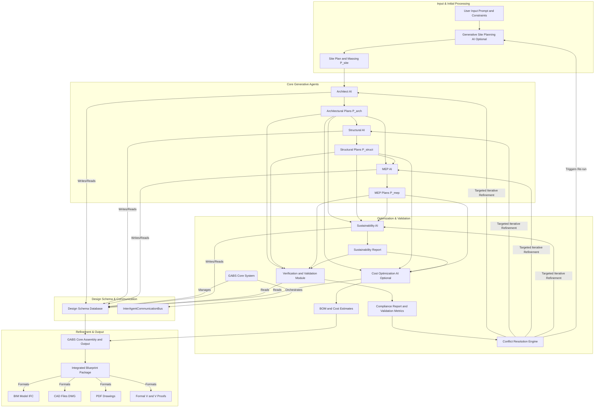
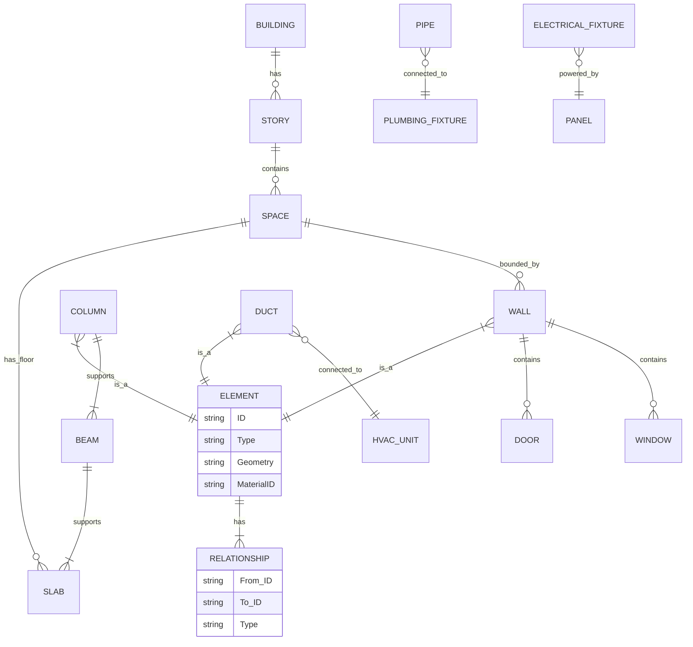
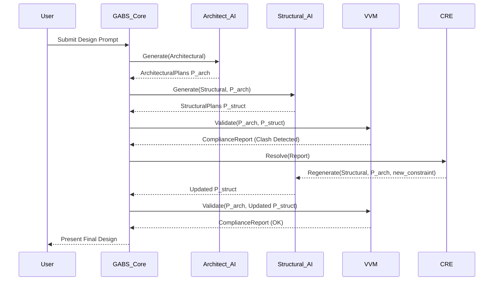
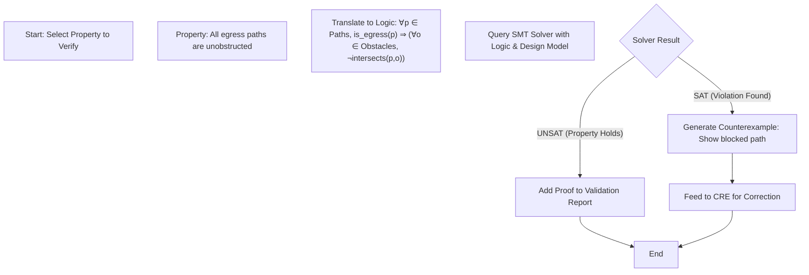
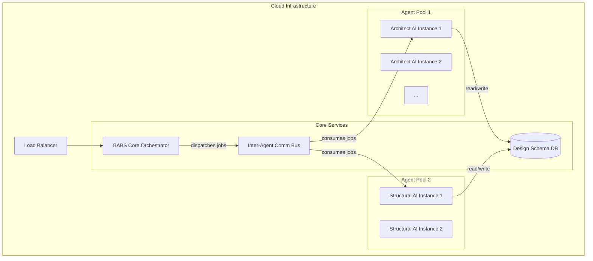
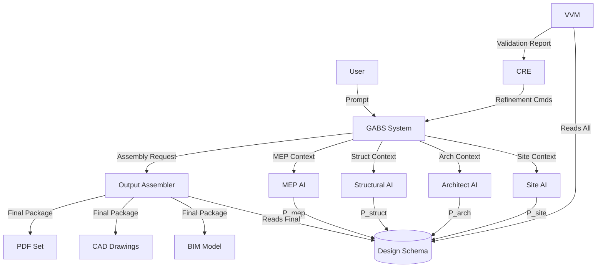

**FACT HEADER - NOTICE OF CONCEPTION**

**Conception ID:** DEMOBANK-INV-093
**Title:** A System and Method for Generating Construction-Ready Architectural Blueprints
**Date of Conception:** 2024-07-26
**Conceiver:** The Sovereign's Ledger AI

**Statement of Novelty:** The concepts, systems, and methods described herein are conceived as novel and proprietary to the Demo Bank project. This document serves as a timestamped record of conception.

---

**Title of Invention:** A System and Method for Generating Construction-Ready Architectural Blueprints from High-Level Design Constraints

**Abstract:**
A system for comprehensive architectural design automation is disclosed. The system extends beyond conceptual design by generating a complete set of integrated, construction-ready blueprints from a high-level prompt. A user provides design constraints for a building. The system uses a chain of specialized generative AI models to create not only the primary architectural design (floor plans, elevations), but also the corresponding structural engineering plans, electrical schematics, and mechanical/plumbing MEP diagrams. The system ensures these different schematics are consistent and integrated, optionally including validation against building codes and generating Bill of Materials BOM for cost estimation. The system incorporates advanced mathematical frameworks to ensure design consistency, optimize performance metrics, and enable formal verification, thereby advancing beyond heuristic design approaches to mathematically robust architectural generation. This invention provides a paradigm shift by treating architectural design as a multi-objective, constraint-satisfaction problem solvable through a distributed AI agent system, capable of producing provably correct and optimized designs.

**Background of the Invention:**
Creating a full set of construction blueprints is a multi-disciplinary effort requiring architects, structural engineers, and MEP engineers to work in concert. This process is complex, time-consuming, and prone to coordination errors between the different disciplines. A change in the architectural plan often requires manual, iterative updates to all other plans, leading to delays and increased costs. There is a pressing need for a system that can generate a complete, internally consistent set of blueprints from a single design input, minimizing manual intervention and reducing error propagation across disciplines. Furthermore, current generative approaches often lack formal mathematical grounding for inter-disciplinary consistency guarantees and optimal performance verification. Existing BIM tools facilitate consistency checks but do not automate the generative process from a high-level intent, nor do they formally prove the correctness of the design against a comprehensive set of logical and physical constraints.

**Brief Summary of the Invention:**
The present invention uses an AI-powered, multi-agent workflow integrated with a formal design schema and robust mathematical optimization principles.
1.  A **Generative Site Planning AI** analyzes site context and environmental factors to optimize building placement and preliminary massing.
2.  An **Architect AI** generates the primary architectural design floor plan, elevations, facade details from a user's natural language prompt and specified constraints.
3.  The architectural output is then passed to a **Structural AI**. This AI is prompted to "design a code-compliant structural frame beams, columns, foundation for this architectural plan," ensuring load-bearing integrity and material efficiency.
4.  The architectural and structural plans are subsequently passed to an **MEP AI**. This AI is prompted to "design the electrical, plumbing, and HVAC systems for this building, ensuring avoidance of clashes with structural elements and compliance with relevant codes."
5.  A **Sustainability AI** analyzes and optimizes designs for environmental performance, material lifecycle, and energy efficiency.
6.  An optional **Verification and Validation Module** performs automated checks against predefined building codes and regulations, structural load analyses, and energy performance simulations, providing feedback for iterative refinement via a Conflict Resolution Engine.
7.  An optional **Cost Optimization AI** generates quantity take-offs, preliminary cost estimates, and suggests design alternatives to meet budget targets based on the finalized designs and real-time market data.
The system then compiles all the generated outputs e.g. as CAD files, BIM models, or PDFs into a complete, integrated blueprint package suitable for construction, underpinned by a mathematically verifiable consistency framework.

**Detailed Description of the Invention:**
The Generative Architectural Blueprint System GABS operates as a sophisticated pipeline of specialized AI agents, orchestrated by a central GABS Core System, and leveraging a unified Design Schema for inter-agent communication and data integrity.

A developer is planning a small commercial building and inputs the following high-level requirements:
1.  **Input:** `A 2-story, 5000 sq ft office building with an open-plan ground floor and individual offices on the second floor. Modern glass and steel facade. Location: Zone 4 seismic, temperate climate. Target LEED Gold certification. Max budget 2.5M USD.`

2.  **Agent 0 Generative Site Planning AI Optional:**
    *   Receives initial prompt and site-specific data e.g. topographical maps, solar paths, prevailing winds, zoning.
    *   **Prompt:** `Optimize building orientation and footprint on the provided site for maximum daylighting and energy efficiency, considering setback requirements and access points.`
    *   Generates optimal building massing, orientation, and preliminary site layout.
    *   Output format: `JSON`, updated site plan.

3.  **Agent 1 Architect AI:**
    *   Receives the initial prompt, contextual data, and output from Generative Site Planning AI.
    *   Generates detailed architectural drawings:
        *   Floor plans e.g. `P_arch_floorplan`.
        *   Exterior elevations e.g. `P_arch_elevations`.
        *   Roof plan e.g. `P_arch_roof`.
        *   Basic material specifications aligned with sustainability goals.
    *   Output format: `DesignSchema` compliant `JSON`, `DXF`, or an internal parametric model representing the architectural design.

4.  **Agent 2 Structural AI:**
    *   Receives the architectural drawings from Architect AI via the Design Schema.
    *   **Prompt:** `Generate a code-compliant steel frame structural plan for this 2-story office building architectural plan provided. Consider Zone 4 seismic requirements and calculate optimal beam sizes, column placements, and foundation details to support live and dead loads. Identify suitable structural connections while minimizing steel tonnage.`
    *   Generates comprehensive structural drawings:
        *   Foundation plans e.g. `P_struct_foundation`.
        *   Framing plans for each floor and roof e.g. `P_struct_framing`.
        *   Column and beam schedules.
        *   Connection details.
    *   Crucially, this AI ensures structural elements do not conflict with architectural spaces or design intent, actively seeking optimal load paths and material use.
    *   Output format: `DesignSchema` compliant `JSON`, `DXF`, or updated internal parametric model.

5.  **Agent 3 MEP AI:**
    *   Receives both the architectural and structural plans via the Design Schema.
    *   **Prompt:** `Generate an integrated HVAC ducting plan, electrical conduit and wiring diagram, and plumbing layout for this office building. The main HVAC unit is on the roof, and a central server room requires dedicated cooling. Ensure all systems avoid clashes with structural steel beams and columns. Adhere to specified electrical load calculations for office spaces, and optimize system routing for energy efficiency and maintenance access.`
    *   Generates multi-disciplinary MEP plans:
        *   HVAC ducting and equipment layout e.g. `P_mep_hvac`.
        *   Electrical power, lighting, and data schematics e.g. `P_mep_electrical`.
        *   Plumbing supply and waste layouts e.g. `P_mep_plumbing`.
    *   The MEP AI performs advanced 3D clash detection with structural elements and architectural finishes and optimizes system sizing and routing.
    *   Output format: `DesignSchema` compliant `JSON`, `DXF`, or updated internal parametric model.

6.  **Agent 4 Sustainability AI:**
    *   Receives all generated `P_arch`, `P_struct`, `P_mep` plans.
    *   **Prompt:** `Analyze the current design for embodied carbon, operational energy demand, water usage, and material recyclability. Suggest design modifications or material substitutions to achieve LEED Gold certification targets and reduce overall environmental impact.`
    *   Generates a detailed sustainability report including lifecycle assessment LCA data and proposes design optimizations for improved environmental performance.
    *   Output format: `SustainabilityReport` with proposed `DesignSchema` updates.

7.  **Agent 5 Verification and Validation Module VVM:**
    *   Receives all generated `P_arch`, `P_struct`, `P_mep` plans, and `SustainabilityReport`.
    *   **Prompt:** `Perform a comprehensive automated code review against International Building Code IBC 2021, local zoning ordinances, fire safety regulations, and structural engineering principles FEA, CFD. Verify energy performance against targets. Report all detected non-conformities and critical clashes.`
    *   Identifies potential code violations e.g. egress path infringements, inadequate ventilation, fire rating issues, structural overstress, and functional deficiencies.
    *   Generates a detailed `ComplianceReport` and `ValidationMetrics` report. This feedback is processed by the Conflict Resolution Engine.

8.  **Agent 6 Cost Optimization AI Optional:**
    *   Receives all finalized designs and material specifications, and `SustainabilityReport` for material impact data.
    *   **Prompt:** `Generate a detailed Bill of Materials BOM and preliminary quantity take-offs for all specified architectural, structural, MEP, and finish components. Provide a comprehensive cost estimate, broken down by discipline, and suggest value engineering options to meet the target budget of 2.5M USD.`
    *   Outputs itemized lists of materials, quantities, labor estimates, and estimated costs, aiding in project budgeting and providing cost-driven design feedback.

9.  **GABS Core System Architecture:**
    *   **Design Schema:** A formalized, machine-readable data model that defines all architectural, structural, and MEP elements, their attributes, inter-relationships, and constraints. All agents read from and write to this shared schema, ensuring data consistency and enabling unambiguous communication.
    *   **InterAgentCommunicationBus:** A publish/subscribe messaging system that allows agents to asynchronously exchange design updates, prompts, and feedback.
    *   **Conflict Resolution Engine CRE:** This critical module receives `ComplianceReport` and `ValidationMetrics` from the VVM. It identifies the root cause of non-conformities or clashes, prioritizes issues, and intelligently triggers targeted iterative refinement loops with specific upstream AI agents. The CRE utilizes heuristic rules and learned patterns to suggest optimal corrective actions, aiming to converge on a fully compliant and optimized design state.
    *   **Assembly and Output GABS Core System:** The system combines the finalized, validated, and optimized outputs from all active agents into a single, cohesive, and downloadable package of drawings and data.
    *   Possible output formats include:
        *   Integrated BIM Building Information Model file e.g. `IFC`.
        *   Layered CAD files e.g. `DWG`, `DXF`.
        *   PDF drawing sets.
        *   Detailed reports e.g. `ComplianceReport`, `SustainabilityReport`, `BOM`.

**Claims:**
1.  A method for generating integrated, construction-ready architectural blueprints, comprising:
    a.  Receiving a high-level design prompt and constraints from a user.
    b.  Generating an optimized site layout and preliminary building massing using a `Generative Site Planning AI` based on site context and environmental factors.
    c.  Generating a primary architectural design using an `Architect AI`.
    d.  Providing the architectural design as input to a `Structural AI` to generate a corresponding structural engineering plan.
    e.  Providing the architectural design and the structural engineering plan as input to an `MEP AI` to generate corresponding mechanical, electrical, and plumbing plans.
    f.  Analyzing and optimizing the combined design for environmental performance using a `Sustainability AI`.
    g.  Employing a `Verification and Validation Module` to formally validate the aggregated design against predefined building codes, engineering principles, and performance targets.
    h.  Employing a `Conflict Resolution Engine` to intelligently process validation feedback and orchestrate iterative refinement loops with relevant generative AI models until design convergence is achieved.
    i.  Aggregating the generated architectural design, structural engineering plan, MEP plans, and sustainability optimizations into a cohesive, internally consistent set of construction documents.
2.  The method of claim 1, further comprising employing a `Cost Optimization AI` to generate quantity take-offs and detailed cost estimates, and provide value engineering suggestions based on the aggregated construction documents.
3.  A system for generating construction-ready architectural blueprints, comprising a plurality of interconnected generative AI models, each specialized for a distinct building design discipline, configured to operate in a cascaded workflow, utilizing a shared `Design Schema` and an `InterAgentCommunicationBus` to produce integrated design outputs, further comprising a `Verification and Validation Module` and a `Conflict Resolution Engine` for automated design refinement.
4.  A computer-readable medium storing instructions that, when executed by a processor, cause the processor to perform the method of claim 1.
5.  The method of claim 1, wherein the output construction documents are provided in a Building Information Model `BIM` format facilitating inter-disciplinary coordination and clash detection, with embedded formal consistency proofs.
6.  The method of claim 1, wherein the `Conflict Resolution Engine` performs root cause analysis on validation failures by traversing a dependency graph within the `Design Schema` and generates targeted re-prompts for specific AI agents to minimize computational overhead during iterative refinement.
7.  The system of claim 3, wherein the `Design Schema` is a formal graph-based data structure `DG = (V, E)` where `V` represents building elements and `E` represents spatial, functional, and physical relationships, enabling the execution of formal model checking for design verification.
8.  The method of claim 1, wherein the `Verification and Validation Module` translates design properties into logical formulas and employs Satisfiability Modulo Theories (SMT) solvers to formally prove or disprove compliance with said properties, generating a verifiable certificate of correctness.
9.  The method of claim 2, wherein the `Cost Optimization AI` integrates with real-time material cost databases and supply chain APIs to provide dynamic and accurate cost estimations and value engineering alternatives based on current market conditions.
10. The method of claim 1, further comprising a final generation step wherein the aggregated construction documents are used to produce machine-readable fabrication instructions suitable for automated and robotic construction systems, including G-code for CNC machines or robotic arm toolpaths.

**Mathematical Justification:**
The present system elevates the generation of blueprints from an iterative, conflict-resolution-driven heuristic process to a formally structured, mathematically-grounded optimization and verification problem.

Let `D` denote the complete design state, comprising `D = (P_site, P_arch, P_struct, P_mep)`. Each `P_X` is a vector space `R^(n_X)` of design parameters and elements, so `P_arch = {p_1, ..., p_n}` where `p_i` could be a wall's coordinates or a window's dimensions. The entire design `D` resides in a high-dimensional design space `R^N` where `N = n_site + n_arch + n_struct + n_mep`.

The input to the system is a tuple `(Prompt, C_user)` where `Prompt` is natural language and `C_user` are user-specified constraints.
We define a formal grammar `G_P` for parsing `Prompt` and `C_user` into a set of machine-interpretable, predicate-logic-based initial constraints `C_init`.
(1) `C_init = {c_1, c_2, ..., c_k}`.
(2) `c_i: ∀ e ∈ E_i, P_i(e)`. For example, `∀ w ∈ Walls, thickness(w) > 0.1m`.
(3) `c_j: ∃ r ∈ R_j, Q_j(r)`. For example, `∃ p ∈ EgressPaths, width(p) > 1.2m`.

Each generative AI agent `G_X` is a function mapping an input design state `D_in` and a set of local constraints `C_X` to an output design state `D_out` that optimizes an objective function `O_X`:
(4) `P_X = G_X(D_parent, C_X)` where `D_parent` represents the aggregated output from predecessor agents.
(5) `G_X = argmin_{P'_X} O_X(D_parent ∪ P'_X)` subject to `C_X(D_parent ∪ P'_X)`.

The core of the invention's mathematical rigor lies in defining and minimizing a global inconsistency and sub-optimality metric, `Psi(D)`, which is a scalar loss function.
(6) `Psi(D) = ∑_{j=1}^{M} w_j * O_j(D) + ∑_{k=1}^{K} λ_k * V_k(D)`
where:
*   `O_j(D)` are normalized objective functions to be minimized (e.g., cost, embodied carbon).
*   `V_k(D)` is a penalty function for violation of constraint `k`. (7) `V_k(D) > 0` if constraint `k` is violated, `0` otherwise. For a constraint `g(D) <= 0`, a penalty could be (8) `V(D) = max(0, g(D))^2`.
*   `w_j`, `λ_k` are non-negative weighting and penalty coefficients reflecting priority.

The system's goal is to find a design `D_final` that minimizes the global loss function.
(9) `D_final = argmin_D Psi(D)`.
The process stops when `||∇Psi(D_k)||_2 <= epsilon`, where `epsilon` is a predefined tolerance.

**Agent Optimization Functions & Governing Equations:**
1.  `G_site`: `min(O_site(P_site))`, s.t. `P_site` respects zoning `c_z`.
    (10) `O_site = -w_s * F_solar(P_site) + w_e * F_energy(P_site)`.

2.  `G_arch`: `min(O_arch(P_arch))`, s.t. `P_arch` satisfies user aesthetics `c_a` and functional requirements `c_f`.
    (11) `O_arch = w_a * A(P_arch) + w_f * F(P_arch)` where `A` is an aesthetic score and `F` is a functional score.

3.  `G_struct`: `min(O_struct(P_struct))`, s.t. `P_struct` satisfies structural integrity. `O_struct` often relates to minimizing material volume `V`.
    (12) `O_struct = ∫_V ρ(x) dV`.
    Constraints are derived from physics, primarily solid mechanics. The equilibrium equation is:
    (13) `∇ ⋅ σ + F_b = ρü` (Cauchy's first law of motion).
    For static analysis, `ü=0`. (14) `∇ ⋅ σ + F_b = 0`.
    The stress tensor `σ` is related to the strain tensor `ε` by a constitutive law:
    (15) `σ = C : ε`. For linear isotropic materials, (16) `σ = λ tr(ε)I + 2με`.
    Strain is the symmetric part of the displacement gradient: (17) `ε = 1/2 (∇u + (∇u)^T)`.
    These are discretized for Finite Element Analysis (FEA):
    (18) `[K]{U} = {F}` where `K` is the global stiffness matrix, `U` is the displacement vector, and `F` is the force vector.
    (19) `K = ∫_V B^T D B dV`.
    The primary structural constraint is that the von Mises stress `σ_v` does not exceed the material yield stress `σ_y`.
    (20) `σ_v = sqrt(1/2 * [ (σ_1-σ_2)^2 + (σ_2-σ_3)^2 + (σ_3-σ_1)^2 ])`.
    (21) `Constraint: σ_v(x) <= σ_y` for all `x` in the structure.
    (22-30) Additional constraints include buckling load `P_cr = (π^2 EI)/(KL)^2`, deflection limits `δ_max < L/240`, and seismic response based on a design spectrum `S_a(T)`.

4.  `G_mep`: `min(O_mep(P_mep))`, s.t. `P_mep` respects `P_arch` and `P_struct`.
    (31) `O_mep = w_hvac * E_hvac + w_elec * E_elec + w_plumb * E_plumb`.
    HVAC analysis often involves Computational Fluid Dynamics (CFD) based on the Navier-Stokes equations for fluid flow:
    (32) `∂(ρu)/∂t + ∇ ⋅ (ρuu) = -∇p + ∇ ⋅ (τ) + F` (Momentum).
    (33) `∂ρ/∂t + ∇ ⋅ (ρu) = 0` (Continuity).
    And the energy equation for heat transfer:
    (34) `∂(ρE)/∂t + ∇ ⋅ (u(ρE + p)) = ∇ ⋅ (k_eff ∇T - ∑_j h_j J_j + (τ_eff ⋅ u)) + S_h`.
    (35-45) Constraints involve maintaining thermal comfort (PMV index), required air changes per hour (ACH), pressure drop in ducts `Δp = f_D (L/D) (ρV^2/2)`, and avoiding clashes: (46) `Vol(P_mep) ∩ Vol(P_struct) = ∅`.
    Electrical system constraints: (47) `∑ P_loads <= P_supply`, (48) `V_drop < 3%`.

5.  `G_sustain`: `min(O_sustain(D))`, which quantifies Life Cycle Assessment (LCA) impact.
    (49) `O_sustain = ∑_i I_i`, where `I_i` is the impact for category `i`.
    (50) `I_i = ∑_j M_j * CF_{i,j}` where `M_j` is the mass of material `j` and `CF` is its characterization factor for impact `i`.
    (51-60) Categories include Global Warming Potential (GWP), Ozone Depletion (ODP), etc.

6.  `G_cost`: `min(O_cost(D))`.
    (61) `O_cost(D) = ∑_{i∈Materials} Q_i * C_i(t) + ∑_{j∈Labor} H_j * R_j(t)`
    Where `Q_i` is quantity, `C_i(t)` is time-dependent unit cost. `H_j` is labor hours, `R_j(t)` is labor rate.

**Iterative Refinement as a Feedback Control System:**
The `VVM` acts as a sensor, calculating `Psi(D)` at each design iteration `k`. The `CRE` acts as a controller.
Let `D_k` be the design state at iteration `k`.
(62) `VVM(D_k)` computes `Psi(D_k)` and generates a `ComplianceReport` `R_k`.
(63) `CRE(R_k)` analyzes `R_k` to find `argmax_k V_k(D_k)` and `argmax_j O_j(D_k)`. It determines which agents `G_X` need to be re-run. This can be framed as a credit assignment problem.
(64) The `CRE` generates a targeted update `Δ_k` for specific agents' constraints or prompts.
(65) `D_{k+1} = D_k + α_k * Δ_k` where `α_k` is a step size. This is analogous to a gradient descent or constraint satisfaction solver.
(66) The update rule `Δ_k` aims to move the design in a direction that reduces the loss: `Δ_k ≈ -∇_D Psi(D_k)`.
(67-75) The CRE may use a Jacobian matrix `J(D)` where `J_{ij} = ∂(V_i)/∂(p_j)` to estimate the impact of changing a design parameter `p_j` on a violation `V_i`, guiding the refinement.

**Design Graph and Formal Verification:**
The `Design Schema` is formally represented as a `Design Graph DG = (V, E)`.
*   (76) `V` is the set of all discrete building elements `v_i`.
*   (77) `E` is the set of relationships `(u,v,r)` where `u,v ∈ V` and `r` is a relationship type (e.g., `supports`, `intersects`, `connects_to`).

(78) Clash detection: `Find {(u,v) | (u,v,'intersects') ∈ E ∧ is_disallowed(u,v)}`.
(79) Structural load path validation: `∀ l ∈ Loads, ∃ path p = (l=v_1, v_2, ..., v_n=foundation) where (v_i, v_{i+1}, 'supports') ∈ E`.

We employ principles of Satisfiability Modulo Theories (SMT) for formal verification.
(80) A design property `P_prop` is translated into a logical formula `φ_prop(D)`.
(81) Example: "All occupied rooms must have a window." `φ = ∀ r ∈ Rooms, is_occupied(r) ⇒ (∃ w ∈ Windows, is_in(w,r))`.
(82) The VVM queries an SMT solver: `Is (φ_prop(D) ∧ C_D)` satisfiable? Where `C_D` is the set of all facts about the current design `D`.
(83) If `¬(φ_prop(D) ∧ C_D)` is satisfiable, the solver provides a counterexample (a violation), which is fed to the CRE.
(84-100) Further mathematical formulations involve probabilistic models for generative agents `P(P_X | D_{parent})`, reinforcement learning for the CRE policy `π(state) -> action`, and Bayesian optimization for exploring the design space. The convergence of the iterative process `lim_{k→∞} D_k = D_final` is guaranteed if `Psi(D)` is convex and the updates `Δ_k` are chosen appropriately, though in practice the space is non-convex and convergence is to a local minimum.

**Architecture Diagrams and Workflows:**

**Chart 1: Overall System Architecture**


**Chart 2: Conflict Resolution Engine (CRE) Workflow**
```mermaid
flowchart TD
    Start((Start)) --> VVM_Report[Receive Compliance Report R_k from VVM]
    VVM_Report --> Parse[Parse R_k for Violations V_i and Sub-optimalities O_j]
    Parse --> Rank[Prioritize Issues by Severity and Impact]
    Rank --> Loop{For each High-Priority Issue}
    Loop --> RCA[Perform Root Cause Analysis via Design Graph Traversal]
    RCA --> Identify[Identify Responsible Agent(s) G_X]
    Identify --> GenPrompt[Generate Targeted Re-prompt or Constraint Modification Δ_k]
    GenPrompt --> Dispatch[Dispatch Δ_k to Agent G_X via ICB]
    Dispatch --> Loop
    Rank -- No more issues --> Converged{Convergence Check: Psi(D) <= ε ?}
    Converged -- Yes --> End((End))
    Converged -- No --> Await[Await Next Design Iteration D_{k+1}]
    Await --> VVM_Report
```

**Chart 3: Design Schema Data Model (Entity-Relationship Style)**


**Chart 4: Inter-Agent Communication (Sequence Diagram)**


**Chart 5: Verification & Validation Module (VVM) Sub-systems**
```mermaid
graph TD
    subgraph VVM
        direction LR
        Input[Aggregated Design D_k] --> Dispatcher
        
        subgraph Validation Engines
            Dispatcher --> Code[Code Compliance AI (IBC, etc.)]
            Dispatcher --> Struct[Structural Analysis (FEA)]
            Dispatcher --> Energy[Energy Simulation (CFD, BEM)]
            Dispatcher --> Formal[Formal Verification (SMT Solvers)]
            Dispatcher --> Construct[Constructability AI]
        end
        
        Code --> Aggregator
        Struct --> Aggregator
        Energy --> Aggregator
        Formal --> Aggregator
        Construct --> Aggregator
        
        Aggregator --> Output[Compliance Report R_k]
    end
```

**Chart 6: Multi-Objective Optimization Trade-off Frontier**
```mermaid
xychart-beta
  title "Pareto Frontier: Cost vs. Sustainability"
  x-axis "Total Cost ($M)" [1.5, 3.0]
  y-axis "Embodied Carbon (kgCO2e/m^2)" [200, 600]
  scatter
  data [
    { x: 2.8, y: 250, label: "Design A (High Perf)" },
    { x: 2.5, y: 300, label: "Design B (Balanced)" },
    { x: 2.2, y: 380, label: "Design C" },
    { x: 1.9, y: 500, label: "Design D (Budget)" }
  ]
  line "Pareto Optimal Frontier" [
    { x: 2.8, y: 250 },
    { x: 2.5, y: 300 },
    { x: 2.2, y: 380 },
    { x: 1.9, y: 500 }
  ]
```

**Chart 7: User Interaction & Feedback Loop**
```mermaid
flowchart LR
    A[Start: Define Prompt] --> B{Specify Constraints};
    B -- Budget --> B1[Set Max Cost];
    B -- Style --> B2[Choose Aesthetics];
    B -- Performance --> B3[Set LEED Target];
    [B1, B2, B3] --> C[GABS Generates Initial Design D_0];
    C --> D[Visualize Design (3D/VR)];
    D --> E{User Review};
    E -- Accept --> F[Finalize & Download Blueprints];
    E -- Modify --> G[Provide Feedback];
    G -- "Facade looks too plain" --> H[Re-prompt Architect AI];
    G -- "Can we reduce steel cost?" --> I[Re-prompt Structural & Cost AI];
    H --> C;
    I --> C;
```

**Chart 8: Formal Verification Process Flow**


**Chart 9: Scalable Distributed Agent Architecture**


**Chart 10: High-Level Data Flow Diagram**


**Advantages of the Invention:**

*   **Accelerated Design Cycle:** Significantly reduces the time required to generate a complete set of construction documents, from weeks or months to potentially hours or days. Automation of tedious drafting and calculation tasks frees human experts to focus on higher-level creative and strategic decisions.
*   **Enhanced Consistency with Formal Proof:** The cascaded AI agent approach, combined with a shared Design Schema and a Conflict Resolution Engine, inherently promotes inter-disciplinary consistency, minimizing clashes and coordination errors common in traditional workflows. Mathematical justifications and formal verification provide verifiable proofs of consistency, a significant leap beyond simple clash detection.
*   **Automated Compliance and Advanced Validation:** The `Verification and Validation Module` provides automated validation against building codes, advanced engineering analyses e.g., FEA, CFD, and performance simulations, reducing legal risks and review cycles. This pre-validation streamlines regulatory approval processes.
*   **Cost and Resource Efficiency:** Reduces labor costs associated with manual drafting, coordination meetings, and error correction. The `Cost Optimization AI` provides early, dynamic cost estimates and suggests value engineering opportunities. The `Sustainability AI` optimizes for resource use and environmental impact over the building's entire lifecycle.
*   **Increased Accuracy and Optimality:** AI models perform complex calculations and multi-objective optimizations e.g., structural load distribution, MEP routing, energy performance with higher precision and global optimality than manual or single-discipline methods. The system can explore thousands of design variations to find a provably optimal solution on the Pareto frontier.
*   **Rapid Iteration and Exploration:** Allows for quick generation of multiple design alternatives based on varying initial prompts and budget/sustainability targets, facilitating robust design exploration and parametric studies that are infeasible with manual methods.
*   **Scalability and Robustness:** The modular agent-based system can be scaled to handle projects of varying sizes and complexities with consistent output quality and is robust against individual agent failures through the `Conflict Resolution Engine`. The cloud-native architecture allows for parallel processing of tasks, further speeding up generation.

**GABS Core System Architecture Details:**

*   **Design Schema Database:** This is a canonical representation of the building design, structured as an ontological graph or relational database. It stores all geometric data, material properties, connectivity, and performance attributes for every element within the design. Key features include:
    *   **Version Control:** Tracks changes made by each AI agent using a Git-like commit history, enabling rollback, branching ("what-if" scenarios), and diffing between design iterations.
    *   **Constraint Management:** Stores active design constraints as logical predicates and their current satisfaction status, allowing the VVM to efficiently check for violations.
    *   **Element Interdependencies:** Explicitly models how elements relate and depend on each other (e.g., `wall_101` is supported by `beam_203`), crucial for `Conflict Resolution Engine` to trace impacts of changes and perform root cause analysis.
*   **InterAgentCommunicationBus:** A message queue-based system (e.g., RabbitMQ, Kafka) enabling asynchronous and decoupled communication between AI agents and the GABS Core.
    *   **Event-Driven Architecture:** Agents publish events e.g., "ArchitecturalPlansUpdated", "StructuralClashDetected", and subscribe to relevant events from other agents. This allows for parallel execution of non-dependent tasks.
    *   **Data Serialization:** Standardized data formats e.g., JSON-LD, Protocol Buffers for efficient data exchange of `DesignSchema` updates, ensuring semantic interoperability.
*   **Conflict Resolution Engine CRE:** This intelligent orchestrator identifies, prioritizes, and resolves design conflicts and sub-optimality reported by the `Verification and Validation Module` and other agents.
    *   **Root Cause Analysis:** Utilizes rule-based systems and machine learning models (e.g., graph neural networks on the Design Graph) to pinpoint which agent's output is primarily responsible for a detected conflict.
    *   **Prioritization Algorithm:** Ranks conflicts based on a calculated severity score: `Severity = w_type * Type + w_impact * ImpactRadius`. For example, a structural code violation has higher severity than a minor aesthetic deviation.
    *   **Targeted Re-prompting:** Dynamically modifies prompts or constraints for specific upstream agents, triggering a minimal set of re-generations to resolve issues, rather than restarting the entire pipeline. This ensures efficient convergence.
    *   **Design Negotiation:** In cases of irreducible trade-offs (e.g., cost vs. sustainability), the CRE can present a Pareto frontier of optimal choices to the user for decision-making.
*   **Verification and Validation Module VVM:** Extends beyond basic code compliance to encompass a holistic suite of formal and simulation-based validation tools.
    *   **Code Compliance AI:** Specializes in interpreting and applying local and international building codes using Natural Language Processing on regulatory documents.
    *   **Structural Analysis Submodule:** Integrates Finite Element Analysis FEA for stress, strain, deformation, and dynamic load analysis e.g., seismic, wind.
    *   **Energy Performance Simulation Submodule:** Performs detailed simulations e.g., CFD for airflow, whole-building energy modeling (EnergyPlus) for HVAC loads, daylighting analysis (Radiance).
    *   **Constructability Analysis:** Checks for construction feasibility, crane access, sequencing challenges, and accessibility for maintenance.
    *   **Formal Verification Submodule:** Uses SMT solvers (e.g., Z3) and model checking to prove logical properties of the design against safety and functional specifications.

**Integration with Existing Systems:**
The GABS is designed for maximal interoperability. Its output is structured to integrate seamlessly with standard industry software and workflows:
*   **BIM Platforms:** Native output in `IFC` Industry Foundation Classes format allows direct import into BIM software like Autodesk Revit, Graphisoft ArchiCAD, or Trimble Tekla Structures, enriching the model with formally verified data and a complete generation history.
*   **CAD Software:** Generation of `DWG` or `DXF` files ensures compatibility with AutoCAD and other CAD systems, with layers structured according to industry standards for easy interpretation by draftspersons and engineers.
*   **Project Management and ERP Software:** BOM, scheduling data, and cost estimates can be exported in formats (e.g., CSV, XML, API integrations) compatible with project management tools (e.g., Primavera P6, MS Project), procurement, and enterprise resource planning systems.
*   **Regulatory Compliance Databases:** Automated checks are configured to specific local, national, and international building codes, with mechanisms to update as regulations evolve, potentially integrating directly with digital permitting systems for automated submission and approval.

**User Interface and Interaction:**
The system envisions an intuitive, multi-modal user interface that allows users to:
*   Input natural language prompts and define high-level design parameters through text, voice, or sketching.
*   Upload site context data e.g., topographical maps, point clouds, existing structures, environmental readings.
*   Specify preferred materials, architectural styles, sustainability goals, and budget constraints using interactive sliders and selectors.
*   Review generated designs in interactive 2D, 3D, and augmented reality AR viewers, allowing for real-time manipulation and visualization of design alternatives.
*   Provide granular feedback for iterative refinement to specific AI agents or design parameters via natural language ("Make the windows on the south facade larger") or direct manipulation tools.
*   Access comprehensive `ComplianceReport`, `SustainabilityReport`, `BOM`, and interactive performance dashboards with trade-off analysis tools.
*   Download the complete blueprint package in various industry-standard and proprietary formats, including formally verified design reports and certificates of compliance.

**Future Enhancements:**

*   **Real-time Collaborative Design:** Enable multiple human users or AI agents to collaborate on a single design simultaneously, with real-time updates, conflict resolution, and version merging facilitated by the `Design Schema` and `Conflict Resolution Engine`, similar to collaborative coding environments.
*   **Adaptive Learning from Construction Feedback:** Integrate data from construction phases (e.g., RFIs, change orders, cost actuals, schedule deviations) and post-occupancy performance data (e.g., energy usage, sensor readings) to continuously train and improve the predictive accuracy and generative capabilities of all AI agents.
*   **Advanced Material and Robotic Fabrication Optimization:** Integrate advanced material science AI to suggest novel or composite materials, optimize material usage for specific fabrication techniques (e.g., 3D printing, modular construction), and generate direct-to-fabrication robotic instructions.
*   **Environmental Performance Simulation Integration:** Tightly couple energy modeling, daylight analysis, and climate resilience simulations directly into the generative pipeline, with AI agents actively learning from simulation outcomes to optimize designs for environmental targets in a closed loop.
*   **AI-driven Construction Sequencing and Logistics:** Generate 4D (time) and 5D (cost) construction models, identify potential logistical challenges, and optimize supply chain and on-site material flow based on the finalized blueprints, integrating with supply chain management systems.
*   **Legal and Contractual AI Integration:** Develop AI agents capable of generating and analyzing construction contracts, permit applications, and legal documents based on the design specifications, ensuring contractual alignment and risk mitigation.
*   **Human-AI Co-Creation Frameworks:** Enhance interaction models to allow for more nuanced human guidance and intervention at critical design junctures, enabling humans to steer the generative process while leveraging AI for complex computation, optimization, and consistency checking, fostering a true partnership.