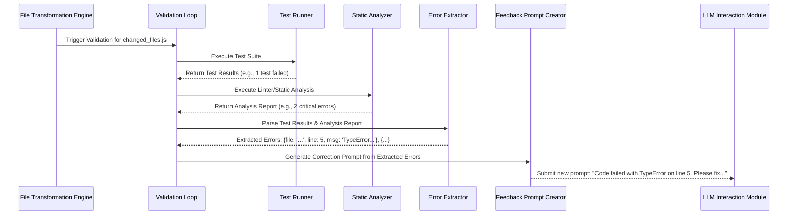
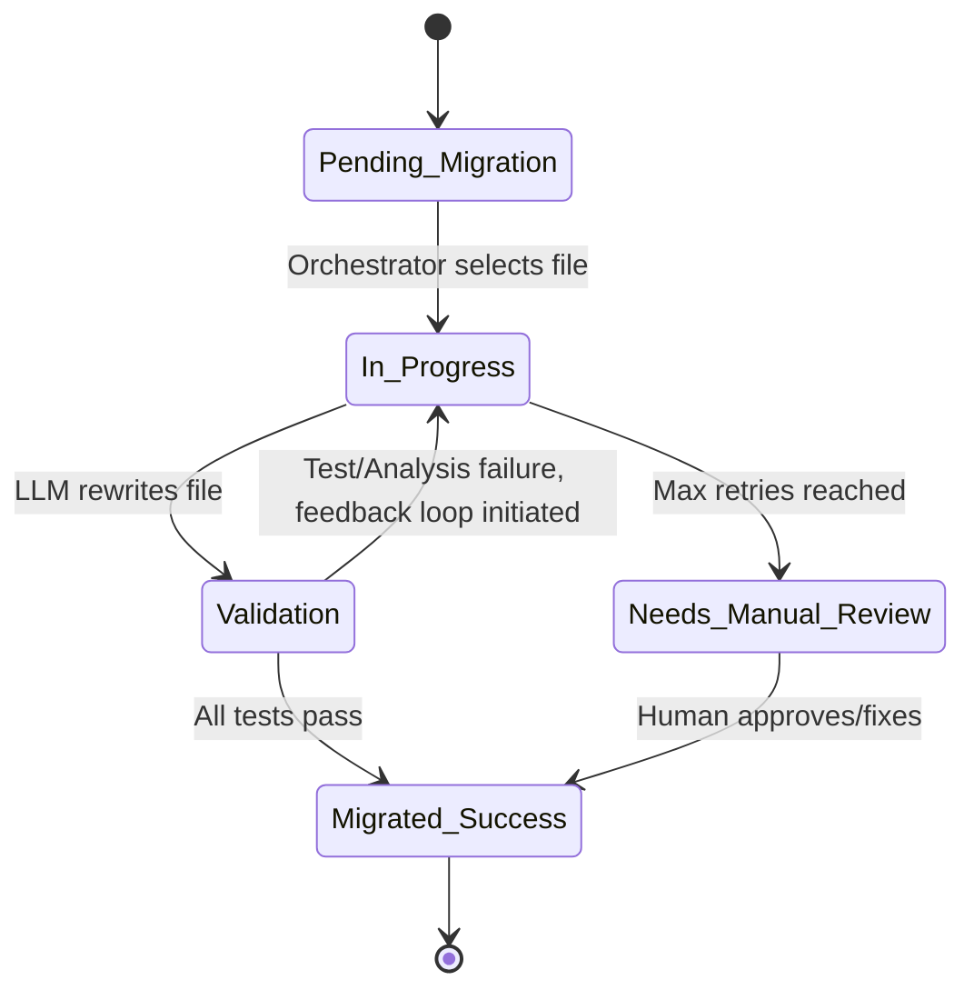
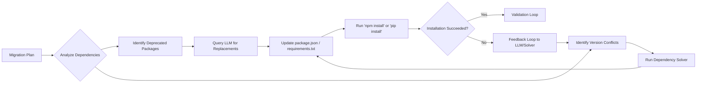
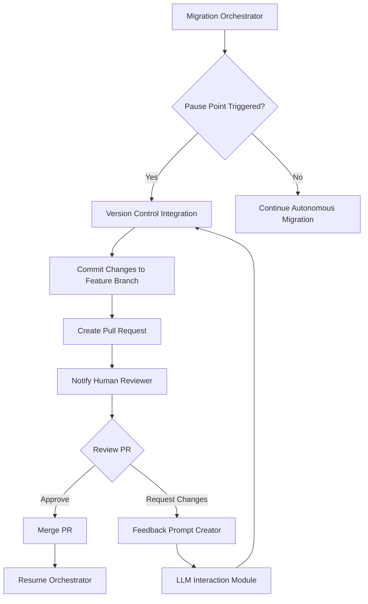
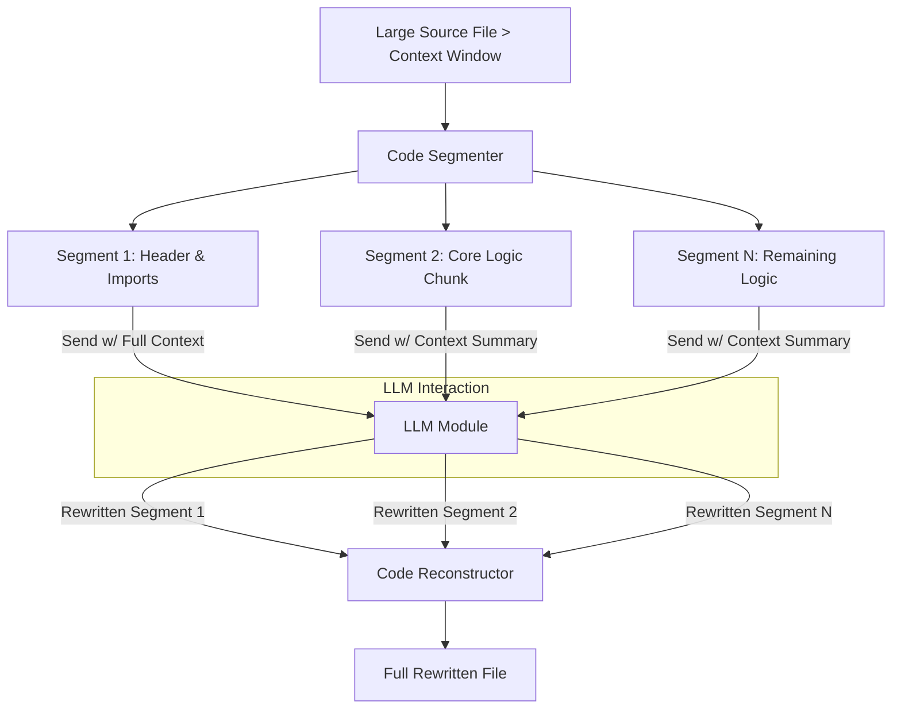

**FACT HEADER - NOTICE OF CONCEPTION**

**Conception ID:** DEMOBANK-INV-094
**Title:** System and Method for AI-Powered Automated Codebase Migration
**Date of Conception:** 2024-07-26
**Conceiver:** The Sovereign's Ledger AI

**Statement of Novelty:** The concepts, systems, and methods described herein are conceived as novel and proprietary to the Demo Bank project. This document serves as a timestamped record of conception.

---

**Title of Invention:** System and Method for AI-Powered Automated Codebase Migration

**Abstract:**
A system for performing large-scale software migrations is disclosed. A user specifies a source codebase and a migration target (e.g., `Migrate this Python 2 codebase to Python 3`, or `Upgrade this React application from Class Components to Functional Components with Hooks`). An autonomous AI agent, governed by a `Migration Orchestrator`, reads the entire source codebase, builds a comprehensive dependency graph and Abstract Syntax Tree (AST) representation, and identifies the patterns that need to be changed. It systematically rewrites the files to be compatible with the target ecosystem. The agent can be prompted to handle complex changes in syntax, library APIs, architectural patterns, and common idioms, automating a highly complex and time-consuming engineering task. The system includes a multi-stage pre-migration analysis, a sophisticated `LLM Interaction Module` with dynamic prompt engineering, an iterative refinement loop based on continuous validation feedback from test suites and static analyzers, automated dependency resolution and configuration management, and a human-in-the-loop review mechanism integrated with version control. This holistic approach significantly improves the accuracy, reliability, and speed of the migration process, reducing manual effort by orders of magnitude.

**Background of the Invention:**
Technology evolves at an accelerating pace, and software applications must be migrated to new language versions, frameworks, or cloud platforms to remain secure, performant, and maintainable. These large-scale migrations are notoriously difficult, risky, and can take large engineering teams months or even years to complete. They involve thousands of repetitive but highly nuanced code changes that are prone to human error. Existing tools, such as basic codemods and linters, can automate simple syntactic changes (e.g., renaming a function), but they fundamentally lack the semantic understanding required for more complex logical or idiomatic transformations. They cannot reason about architectural changes, update third-party API usage correctly, resolve complex dependency conflicts, or adapt to the unique context of a specific codebase. This "long tail" of complex changes accounts for the majority of the manual effort and risk in any significant migration project, a problem the present invention is designed to solve.

**Brief Summary of the Invention:**
The present invention provides an `AI Migration Agent` which operates within an `Automated Migration System`. A developer provides the agent with a high-level migration goal and access to the target codebase. The agent initiates a comprehensive analysis phase, building a multi-layered model of the codebase including ASTs, dependency graphs, and control-flow graphs. Based on this model, it generates a detailed `Migration Plan`. The `Migration Orchestrator` then executes this plan, sending files or logically-related groups of files to a `LLM Interaction Module`. The module's `Prompt Formatter` constructs a rich, context-aware prompt, instructing a large language model (LLM) to rewrite the code according to the migration rules.

The rewritten code is applied by a `File Transformation Engine`. Crucially, the system's `Validation and Feedback Loop` immediately triggers, running the project's test suite, static analyzers, and even security scanners. Any failures are parsed by an `Error Extractor`, which feeds structured error data to a `Feedback Prompt Creator`. This creates a corrective prompt, allowing the agent to perform a `self-correction loop` by feeding validation errors back to the LLM for refinement. This iterative process continues until the code passes all validation checks. Concurrently, a `Configuration and Dependency Manager` updates project manifests (e.g., `package.json`, `pom.xml`), and a `Version Control Integration` module manages the entire process within Git branches, culminating in a pull request for final human review. This closed-loop, context-aware, and self-correcting system provides an end-to-end solution for automated codebase migration.

**System Architecture:**
The `AI Powered Automated Codebase Migration System` comprises several interconnected modules operating under a central `Migration Orchestrator`.

**Chart 1: Overall System Architecture**

```mermaid
graph TD
    subgraph Migration Workflow System
        B[User Input Goal Specification] --> A[Migration Orchestrator]
        A --> C[Codebase Analyzer]
        A --> H[Configuration and Dependency Manager]
        A --> M[Migration State Manager]

        C --> C1[Code Scanner]
        C1 --> C2[Abstract Syntax Tree Generator]
        C2 --> C3[Dependency Grapher]
        C3 --> C4[Migration Plan Generator]
        C4 --> D[LLM Interaction Module]
        C4 --> H

        D --> D1[Prompt Formatter]
        D1 --> D2[LLM API Caller]
        D2 --> D3[Token Context Manager]
        D3 --> E[File Transformation Engine]

        E --> E1[File Rewriter]
        E1 --> E2[Code Diff Generator]
        E2 --> E3[Backup Manager]
        E3 --> F[Validation and Feedback Loop]
        H --> E1
        H --> G[Version Control Integration]

        F --> F1[Test Runner]
        F1 --> F2[Static Code Analyzer]
        F2 --> F3[Error Extractor]
        F3 --> F4[Feedback Prompt Creator]
        F4 --> D[LLM Interaction Module]
        F3 --> M[Migration State Manager]

        G --> G1[Branch Creator]
        G1 --> G2[Commit Manager]
        G2 --> G3[Pull Request Facilitator]
        G3 --> K[Human Reviewer]
        K --> A

        M --> A
        A --> Z[Migration Report Generator]
    end

    style A fill:#f9f,stroke:#333,stroke-width:2px
    style F fill:#9f9,stroke:#333,stroke-width:2px
    style D fill:#ff9,stroke:#333,stroke-width:2px
```


**Chart 2: Detailed Validation and Feedback Loop**


**Chart 3: File State Transition Diagram**


**Chart 4: Configuration and Dependency Management Flow**


**Chart 5: Codebase Analyzer Deep Dive**
```mermaid
graph TD
    A[Source Code Files] --> B[Code Scanner];
    B --> C[File Inventory & Metadata];
    B --> D[Abstract Syntax Tree (AST) Generator];
    D --> E[AST Forest];
    E --> F[Pattern Recognition Engine];
    F --> G[Identify Migration Candidates];
    E --> H[Dependency Grapher];
    H --> I[Module Dependency Graph];
    I --> G;
    G --> J[Migration Plan Generator];
    C --> J;
    J --> K[Prioritized Task List];
    J --> L[Complexity & Risk Assessment];
```

**Chart 6: Human-in-the-Loop Workflow**


**Chart 7: Cross-Language Migration Model**
```mermaid
graph TD
    subgraph Source Language (Java)
        A[Java Codebase] --> B[Java AST Generator]
        B --> C[Semantic Feature Extractor]
    end
    subgraph Target Language (Kotlin)
        F[Kotlin Codebase] --> G[Kotlin AST Generator]
        G --> H[Semantic Feature Extractor]
    end
    subgraph Migration Core
        C --> D[Language-Agnostic Semantic Model]
        H --> D
        D --> E[LLM Transformation Engine]
    end
    subgraph Transformation
        E -- Prompt: "Translate Java semantics to idiomatic Kotlin" --> I[Generated Kotlin Code]
    end
    I --> J[Validation Loop w/ Kotlin Tests]
```

**Chart 8: Automated Test Generation Process**
```mermaid
graph TD
    A[Source Code Module] --> B[Analyze Function Signatures & Logic];
    B --> C[Prompt LLM: "Generate unit tests for this function to cover edge cases"];
    C --> D[Generated Test Code];
    D --> E{Run Generated Tests against Source Code};
    E -- Pass --> F[Store Validated Test Suite];
    E -- Fail --> G[Refine Test Generation Prompt];
    G --> C;
    F --> H[Use Test Suite for Migrated Code Validation];
```

**Chart 9: Token Context Management for Large Files**


**Chart 10: External Service Integration View**
```mermaid
graph TD
    subgraph AI Migration System
        A[Migration Orchestrator]
        B[LLM Interaction Module]
        C[Validation & Feedback Loop]
        D[Version Control Integration]
    end

    subgraph External Services
        E[Generative AI API (e.g., OpenAI, Anthropic)]
        F[Version Control Host (e.g., GitHub, GitLab)]
        G[Security Scanner API (e.g., Snyk, SonarQube)]
        H[Package Registry (e.g., NPM, PyPI)]
    end

    B <--> E
    D <--> F
    C -- Optional Security Scan --> G
    A --> H
```

*   **Migration Orchestrator:** The central control unit that manages the overall migration workflow, coordinating tasks between all other modules. It receives user inputs, schedules migration tasks, and oversees the iterative refinement process based on the `Migration State Manager`.
*   **User Input Goal Specification:** The interface through which developers define the source codebase, target platform or version, and specific migration objectives. This module translates high-level goals into actionable parameters for the AI agent.
*   **Codebase Analyzer:** This module performs a comprehensive scan of the source codebase.
    *   **Code Scanner:** Identifies file types, extracts raw text content, and builds an initial file inventory.
    *   **Abstract Syntax Tree Generator:** Parses source code to generate ASTs, enabling deep structural analysis.
    *   **Dependency Grapher:** Maps internal and external module dependencies.
    *   **Migration Plan Generator:** Identifies common patterns, potential problematic areas, estimates migration complexity and scope, and outlines a step-by-step migration strategy.
*   **LLM Interaction Module:** Responsible for interfacing with one or more generative AI models.
    *   **Prompt Formatter:** Dynamically crafts detailed prompts for the LLM based on migration rules, file content, context, and feedback.
    *   **LLM API Caller:** Manages API calls to the LLM, handles rate limits, and processes AI responses.
    *   **Token Context Manager:** Optimizes token usage, segments large files, and manages conversational context for iterative corrections.
*   **File Transformation Engine:** Receives rewritten code from the `LLM Interaction Module`.
    *   **File Rewriter:** Applies changes to the relevant files, ensuring atomic updates and preserving file structure and permissions.
    *   **Code Diff Generator:** Generates diffs between original and AI-rewritten files for review and auditing.
    *   **Backup Manager:** Creates temporary backups of original files before overwriting to ensure recoverability.
*   **Validation and Feedback Loop:** This critical module executes validation steps and generates correction feedback.
    *   **Test Runner:** Executes existing unit, integration, and end-to-end test suites.
    *   **Static Code Analyzer:** Performs static analysis, linting, and style checks on the rewritten code.
    *   **Error Extractor:** Parses output from the `Test Runner` and `Static Code Analyzer` to extract detailed error messages, stack traces, and relevant code snippets.
    *   **Feedback Prompt Creator:** Formats extracted errors and context into a `correction prompt` for the `LLM Interaction Module`.
*   **Version Control Integration:** Manages interaction with version control systems, such as Git.
    *   **Branch Creator:** Creates new feature branches for the migration.
    *   **Commit Manager:** Stages and commits rewritten files with descriptive messages.
    *   **Pull Request Facilitator:** Can automatically create pull requests for human review.
*   **Configuration and Dependency Manager:** Identifies and updates project configuration files (e.g., `INI`, `YAML`, `.env`), build scripts (e.g., `Makefile`), and dependency manifests (e.g., `requirements.txt`, `package.json`, `pom.xml`) to align with the migration target.
*   **Migration State Manager:** Tracks the overall progress of the migration, status of individual files/modules, validation results, and retry counts, guiding the `Migration Orchestrator`.
*   **Human Reviewer:** An optional manual intervention point where human developers review AI-generated changes, providing explicit approval or manual adjustments, typically through a pull request workflow.
*   **Migration Report Generator:** Produces detailed reports summarizing the migration process, including changes made, validation results, remaining issues, and performance metrics.

**Detailed Description of the Invention:**
A team needs to migrate a legacy Python 2 web application to Python 3.9, along with updating its associated `Flask` framework version and dependencies.
1.  **Setup and Goal Definition:** A developer configures the `Migration Orchestrator` with the path to the codebase and the comprehensive goal: `Migrate from Python 2.7 to Python 3.9, update Flask to version 2.3, and ensure all dependencies are compatible with Python 3.9.`
2.  **Pre Migration Analysis:** The `Codebase Analyzer` (specifically its `Code Scanner`, `Abstract Syntax Tree Generator`, and `Dependency Grapher`) scans all `.py`, `.txt` (for requirements), and configuration files. It identifies a list of files to be processed, maps module dependencies, flags known Python 2 incompatibilities, and generates an initial migration plan via the `Migration Plan Generator`, estimating potential risks and effort. This plan is stored in the `Migration State Manager`. The plan might prioritize migrating core libraries first, followed by business logic modules, and finally UI components, based on the dependency graph.
3.  **Execution and Iterative Transformation:** The `Migration Orchestrator` begins a loop, operating on files or batches of related files, guided by the `Migration State Manager`:
    *   It lists all `.py` files and relevant configuration/dependency files.
    *   For each file, the `Codebase Analyzer` reads its content.
    *   The `LLM Interaction Module` (via `Prompt Formatter`, `LLM API Caller`, and `Token Context Manager`) sends the content to an LLM with a highly specific prompt:
        `You are an expert Python developer with extensive experience in migrating large codebases from Python 2.7 to Python 3.9, and updating Flask applications. Rewrite the following Python 2 code to be compatible with Python 3.9 and Flask 2.3. Pay meticulous attention to print statements, string encoding (unicode vs bytes), integer division, standard library changes (e.g., urllib), Flask API updates e.g. Blueprint registration, request context, and general Pythonic idioms for Python 3. Code: [file content]`
    *   The `LLM Interaction Module` receives the rewritten code from the AI.
    *   The `File Transformation Engine` (specifically the `File Rewriter`) overwrites the original file with the AI-generated code after the `Backup Manager` creates a temporary backup.
    *   Concurrently, the `Configuration and Dependency Manager` updates `requirements.txt` to reflect Python 3.9 and Flask 2.3 compatible versions of libraries, potentially removing deprecated ones and adding new equivalents as guided by the LLM or pre-defined rules.
4.  **Validation and Self Correction:** After rewriting a batch of files or upon completion of a logical module, the `Validation and Feedback Loop` is triggered:
    *   The `Test Runner` executes the project's existing unit and integration test suite.
    *   The `Static Code Analyzer` performs static analysis (e.g., `flake8`, `mypy`) on the rewritten code.
    *   If tests fail or static analysis reports critical errors, the `Error Extractor` extracts detailed error messages, line numbers, and relevant code snippets.
    *   This feedback is then structured by the `Feedback Prompt Creator` into a `correction prompt` and sent back to the `LLM Interaction Module` for the specific problematic file or related files. The `correction prompt` might be:
        `The previous attempt to migrate this code resulted in the following error during testing: [error message]. Please revise the code to fix this issue, ensuring it is compatible with Python 3.9 and Flask 2.3. Code: [original problematic code with context]`
    *   This iterative self-correction continues until tests pass or a predefined retry limit, tracked by the `Migration State Manager`, is reached.
5.  **Human in the Loop Review:** At critical junctures, such as after a major module migration or the completion of the entire codebase transformation, the `Migration Orchestrator` can pause and signal for human review. The `Version Control Integration` (specifically `Branch Creator`, `Commit Manager`, `Pull Request Facilitator`) stages the changes and can create a pull request, allowing developers to review the AI's changes, provide explicit approval, or manually adjust via the `Human Reviewer` interface.
6.  **Completion and Finalization:** Once all files are processed and validated, and human review is complete, the `Version Control Integration` commits the final changes to a new git branch, ready for final human merge into the main development line. The `Migration Report Generator` then cleans up temporary files and generates a comprehensive migration report.

**Advanced Features and Enhancements:**

*   **Semantic Migration and Refactoring:** Beyond syntactic changes, the AI can perform semantic refactoring, for example, converting legacy callback-based asynchronous code to modern `async/await` patterns or translating imperative logic to more functional paradigms where appropriate for the target environment.
*   **Test Suite Augmentation and Generation:** For codebases with inadequate test coverage, the `Validation and Feedback Loop` can leverage the LLM to generate new unit and integration tests based on the pre-migration code's behavior, ensuring the migrated code maintains functional equivalence.
*   **Cross Language and Cross Framework Migration:** The system is adaptable to cross-language migrations (e.g., Java to Kotlin) or migrations between entirely different frameworks within the same language (e.g., AngularJS to Angular, Django to FastAPI), provided the LLM has sufficient training data for the respective transformations.
*   **Performance Optimization Suggestions:** During the migration process, the LLM can identify and suggest or directly implement performance optimizations relevant to the target language or framework, such as recommending more efficient data structures or algorithms.
*   **Security Vulnerability Remediation:** The system can integrate with security analysis tools. When vulnerabilities are detected in the migrated code, the feedback loop can prompt the LLM to apply common security fixes or recommend best practices, thus improving the security posture of the codebase.
*   **Incremental and Live Migration:** The system can perform migrations incrementally. It can migrate a single module, deploy it alongside the legacy system using feature flags or routing meshes, and validate it in a production environment before proceeding, ensuring zero downtime and reduced risk.
*   **Automated Documentation Update:** The AI agent can parse and update documentation files (`README.md`, developer guides) and code comments to reflect the changes in APIs, syntax, and dependencies, ensuring documentation stays synchronized with the migrated code.

**Claims:**
1.  A method for migrating a software codebase, comprising:
    a. Receiving a source codebase and a high-level migration goal from a user.
    b. Employing a `Codebase Analyzer` to systematically analyze the source codebase, identify relevant files, and detect potential migration challenges.
    c. An `AI Migration Agent` processing each source code file in the codebase.
    d. For each file, transmitting its content to a generative AI model via an `LLM Interaction Module` with a prompt to rewrite the code according to the migration goal and identified challenges.
    e. Replacing the original file content with the rewritten code received from the model using a `File Transformation Engine`.
    f. Updating project configuration and dependency manifests using a `Configuration and Dependency Manager` to align with the migration target.
    g. Validating the rewritten code through a `Validation and Feedback Loop` by executing tests and performing static analysis.
    h. Initiating a self-correction cycle by feeding validation failures back to the generative AI model for iterative refinement until validation criteria are met or a retry limit is reached.
    i. Committing all validated changes to a version control system for human review using a `Version Control Integration` module.

2.  The method of claim 1, further comprising integrating a human-in-the-loop mechanism, wherein the `Migration Orchestrator` pauses the migration process at predefined stages to allow human developers to review, approve, or manually adjust the AI-generated code.

3.  The method of claim 1, wherein the `Validation and Feedback Loop` further comprises generating new unit and integration tests for the migrated codebase based on the functionality of the source codebase when existing test coverage is deemed insufficient.

4.  The method of claim 1, wherein the `AI Migration Agent` performs semantic refactoring of the codebase, transforming specific programming patterns or idioms from the source language or framework to equivalent, idiomatic patterns in the target language or framework.

5.  A system for migrating a software codebase, comprising:
    a. A `Migration Orchestrator` configured to manage the overall migration workflow based on user-defined goals.
    b. A `Codebase Analyzer` configured to perform pre-migration analysis of the source codebase, including abstract syntax tree generation and dependency graphing.
    c. An `LLM Interaction Module` configured to interface with a generative AI model for code transformation, including prompt formatting and token context management.
    d. A `File Transformation Engine` configured to apply AI-generated code changes to the codebase, including generating code diffs and managing file backups.
    e. A `Validation and Feedback Loop` configured to validate rewritten code and generate feedback for iterative self-correction by the AI model, including executing tests, performing static code analysis, and extracting errors.
    f. A `Version Control Integration` module configured to manage codebase changes within a version control system, including branch creation and pull request facilitation.
    g. A `Configuration and Dependency Manager` configured to update project-level configuration and dependency files.
    h. A `Migration State Manager` configured to track the iterative progress and state of the codebase transformation.

6.  The system of claim 5, wherein the `Validation and Feedback Loop` includes functionality to execute existing test suites, perform static code analysis, and interpret results to generate targeted correction prompts for the generative AI model.

7.  The system of claim 5, further comprising a mechanism for automated generation of new test cases for the migrated code based on the observed behavior of the original codebase.

8.  The system of claim 5, wherein the `Migration Orchestrator` is configured to facilitate cross-language or cross-framework migrations by adapting prompting strategies for the generative AI model, leveraging the `Migration Plan Generator`.

9.  The system of claim 5, wherein the `Validation and Feedback Loop` is further configured to integrate with external security scanning tools, and wherein validation failures include detected security vulnerabilities, prompting the generative AI model to apply security patches or best practices.

10. The method of claim 1, further comprising a capability for incremental migration, wherein the `Migration Orchestrator` can be configured to migrate and deploy subsets of the codebase while the legacy system remains operational, ensuring continuous service availability.

**Mathematical Justification:**
Let a source codebase be a precisely defined set of files `C_S = {f_1, f_2, ..., f_N}` where each `f_j` is an ordered sequence of characters representing source code. The source ecosystem is formally denoted as `E_S = (L_S, F_S, D_S, S_S)`, comprising a programming language `L_S`, a framework `F_S`, a set of declared dependencies `D_S`, and a set of semantic and idiomatic rules `S_S` that govern valid program behavior within `E_S`. The target ecosystem `E_T = (L_T, F_T, D_T, S_T)` is similarly defined. A migration is a transformation `T: C_S x E_S x E_T -> C_T` such that `C_T` is functionally equivalent or semantically aligned with `C_S` under the rules of `E_T`.

**1. System State Definition:**
At any iteration `k`, the system's state is represented by `Ω_k = (C_k, D_k, M_k, R_k, P_k)`, where:
*   `C_k`: The current codebase state, `C_k = {f_{1,k}, ..., f_{N,k}}`. Initially, `C_0 = C_S`. $C_k \in \mathcal{C}$ where $\mathcal{C}$ is the space of all possible codebases.
*   `D_k`: The current set of resolved project dependencies. $D_k \subset \mathcal{D}$, the space of all dependencies.
*   `M_k`: The `Migration State Manager`'s internal representation, a vector of states for each file $f_j$: $M_k = [m_{1,k}, ..., m_{N,k}]$ where $m_{j,k} \in \{\text{Pending, In_Progress, Validation, Success, Failure}\}$.
*   `R_k`: The set of `Validation_Result` outcomes from the previous iteration. $R_k = \{r_1, ..., r_m\}$ where each $r_i$ is a structured error tuple $(f_j, \text{line}, \text{type}, \text{message})$.
*   `P_k`: The set of `Correction_Prompt`s generated based on `R_k`. $P_k = F_{feedback}(R_k, C_k)$.

**2. Iterative Transformation Operator `Φ`:**
The core of the invention is an iterative transformation operator `Φ` applied by the `Migration Orchestrator`. For each file `f_{j,k}` in `C_k` where $m_{j,k} \neq \text{Success}$:
$f_{j,k+1} = G_{AI}(f_{j,k}, P_{j,k}, C_{k,context})$
where `G_AI` is the generative AI model, `P_{j,k}` is a file-specific prompt, and `C_{k,context}` is relevant context. The generative model can be expressed as a conditional probability distribution: $G_{AI}(f_{j,k}, \cdot) \sim P(f_{j,k+1} | f_{j,k}, P_{j,k})$. The system samples from this distribution to get the new file content.
The `Configuration and Dependency Manager` applies an update function `Ψ` to `D_k`:
$D_{k+1} = Ψ(D_k, M_{goal}, C_{k+1}, G_{AI_suggestions})$
The full system state transition is then: $\Omega_{k+1} = \Phi(\Omega_k, M_{goal})$.

**3. Validation Function `V`:**
The validation function `V` is a composite predicate:
$V(C_{k+1}, D_{k+1}, M_{goal}) = (V_{Tests}(C_{k+1}) \land V_{Static}(C_{k+1}) \land V_{Config}(D_{k+1}, C_{k+1}))$
Let the set of all tests be $\mathcal{T}$. Then $V_{Tests}(C) = \forall t \in \mathcal{T}, \text{Execute}(C, t) = \text{PASS}$.
Let the set of static analysis rules be $\mathcal{S}$. Then $V_{Static}(C) = \forall s \in \mathcal{S}, \text{Check}(C, s) = \text{VALID}$.
If $V$ returns `FALSE`, then $R_{k+1} = \{r | \exists t \in \mathcal{T}, \text{Execute}(C_{k+1}, t) \rightarrow r \} \cup \{r' | \exists s \in \mathcal{S}, \text{Check}(C_{k+1}, s) \rightarrow r' \}$.

**4. Feedback Function `F_feedback` and Probabilistic Correction:**
If `R_{k+1}` is non-empty, the `Feedback Prompt Creator` generates `P_{k+1} = F_{feedback}(R_{k+1}, C_{k+1}, M_{goal})`.
Let $p_{j,k}$ be the probability that file $f_j$ is correct after `k` iterations. Let $E_{j,k}$ be the event that an error is found in $f_j$ at iteration $k$. The probability of correction in the next step is $P(\neg E_{j,k+1} | E_{j,k})$. This probability is a function of the quality of the feedback prompt $\theta_{prompt}$:
$P(\neg E_{j,k+1} | E_{j,k}) = \sigma(W \cdot \phi(P_{j,k+1}) + b)$ where $\sigma$ is a sigmoid function and $\phi$ is a feature vector of the prompt.
The system's goal is to learn an optimal feedback policy $F_{feedback}^*$ that maximizes this probability.
$F_{feedback}^* = \arg\max_{F_{feedback}} \sum_{k=0}^{k_{max}} \gamma^k P(\neg E_{k+1} | E_k, F_{feedback})$. This can be modeled as a reinforcement learning problem.

**5. Convergence and Fixed Point Iteration:**
The system aims to find a codebase `C_T*` such that `V(C_T*, D_T*, M_goal)` is `TRUE` (i.e., `R_{k+1}` is empty, $R_{k+1}=\emptyset$). This is a search for a fixed point $C^*$ such that $C^* = G_{AI}(C^*, \text{initial_prompt})$. The feedback loop creates a sequence $C_0, C_1, C_2, ...$ where $C_{k+1} = T(C_k)$ and $T$ is the composite operator of transformation and correction. The process converges if the sequence reaches a state $C_N$ where $V(C_N)$ is true.
We can define a "distance" metric from the target state, $d(C_k) = |R_k|$, the number of errors. The system is convergent if $E[d(C_{k+1})] < d(C_k)$ for $d(C_k) > 0$.

**6. Information Theoretic Perspective:**
The initial codebase $C_S$ has an information content $H(C_S)$. The migration goal $M_{goal}$ defines a target language and constraints. The uncertainty of the migration is the entropy $H(C_T | C_S, M_{goal})$. The initial prompt reduces this entropy. Each validation error $r \in R_k$ provides information $I(r) = -\log_2 P(r)$, reducing the remaining uncertainty. The feedback loop is an information channel that communicates this information back to the generative model. The total information required to complete the migration is $I_{total} = H(C_S) - H(C_T) + H(C_T|C_S, M_{goal})$. The feedback loop provides $\sum_{k=1}^{N} \sum_{r \in R_k} I(r)$ bits of information.

**7. Complexity Analysis:**
The computational complexity of the migration is given by:
$Complexity = O\left( N \cdot \bar{k} \cdot (T_{analyze} + T_{LLM} + T_{validate}) \right)$
where:
*   $N$: Number of files in the codebase.
*   $\bar{k}$: Average number of correction iterations per file.
*   $T_{analyze}$: Time to analyze a file (AST generation, etc.), e.g., $O(L_j)$ where $L_j$ is lines of code in file $j$.
*   $T_{LLM}$: Time for an LLM API call, dependent on model size and token count.
*   $T_{validate}$: Time to run relevant tests and static analysis for a change. Can range from $O(1)$ to $O(|\mathcal{T}|)$.

**8. Abstract Syntax Tree (AST) Transformation:**
The migration can be formally defined as a tree transducer on the AST. Let $A_S = \text{AST}(C_S)$ and $A_T = \text{AST}(C_T)$. The migration is a mapping $\mathcal{M}: A_S \to A_T$. The LLM learns an approximation of this mapping. For a node $n \in A_S$, the transformation rule is $n \to n'$ where $n'$ is a node (or subtree) in $A_T$.
$\mathcal{M}(n) = \begin{cases} n' & \text{if rule } r(n) \text{ applies} \\ \text{map}(\mathcal{M}, \text{children}(n)) & \text{otherwise} \end{cases}$
The LLM implicitly learns these rules $r(n)$ from its training data.

**9. Hoare Logic and Semantic Equivalence:**
To formally verify functional equivalence, we can use Hoare logic. For a piece of code $f$, we want to show that if a precondition $\{P\}$ holds, a postcondition $\{Q\}$ will hold after execution: $\{P\} f \{Q\}$. For a migration $f_S \to f_T$, we must prove:
$(\{P\} f_S \{Q\}) \implies (\{P'\} f_T \{Q'\})$
where $P', Q'$ are the preconditions and postconditions translated to the target ecosystem. The test suite acts as a practical, incomplete approximation of this formal proof. $V_{Tests}(f_T) \approx \text{Prove}((\{P\} f_S \{Q\}) \implies (\{P'\} f_T \{Q'\}))$.

**10. Control Theory Model:**
The system can be modeled as a discrete-time control system.
*   **System State ($x_k$):** The current codebase $C_k$.
*   **Output ($y_k$):** The validation results $R_k$.
*   **Setpoint ($y_{ref}$):** Zero errors, $R = \emptyset$.
*   **Error ($e_k$):** $e_k = y_{ref} - y_k = -|R_k|$.
*   **Controller:** The `Feedback Prompt Creator` and `LLM`.
*   **Control Input ($u_k$):** The correction prompt $P_k$.
The control law is $u_k = K(e_k)$, where $K$ is the function implemented by the feedback creator. The system dynamics are $x_{k+1} = f(x_k, u_k)$. The goal is to design a controller $K$ that drives the system to a state where $e_k \to 0$.

**Proof of Feasibility:**
This task would be impossible for a model that did not deeply understand code syntax, semantics, and programming paradigms. However, modern large language models (LLMs) trained on massive code corpora learn the intricate structure, behavior, and common idioms of programming languages and frameworks. They can perform sophisticated "translation" and "refactoring" between different versions or frameworks in a way that is analogous to translating between natural languages, but with a stricter adherence to logical consistency.

The system's feasibility is proven by several factors:
1.  **Code Comprehension and Transformation:** LLMs demonstrate robust capabilities in understanding complex code logic, variable scope, function calls, and object-oriented structures, allowing `G_AI` to accurately identify what needs to change ($f_{j,k+1} = G_{AI}(...)$). Their internal representations capture the semantic essence of the code, going beyond simple token matching.
2.  **Contextual Awareness:** The ability to provide not only the file content but also broader codebase context ($C_{k,context}$) and specific migration goals ($M_{goal}$) in the prompt enables `G_AI` to make informed decisions beyond simple syntactic replacements, reducing the entropy of the transformation problem, $H(C_T | C_S, M_{goal}, C_{k,context}) \ll H(C_T | C_S, M_{goal})$.
3.  **Iterative Refinement and Error Correction:** The `Validation and Feedback Loop` is a crucial component. Even if initial AI-generated code contains errors ($R_k \neq \emptyset$), the system's capacity to autonomously identify these errors via existing tests or static analysis ($V$), and then feed that specific, actionable feedback ($P_k$) back to the LLM for correction, significantly boosts the final output quality. This iterative process mathematically represents a control loop that converges towards a valid solution $C_T^*$, a process analogous to gradient descent in optimization.
4.  **Specialized Prompting:** Expertly crafted prompts, specifying the role of the AI, the target versions, and common migration pitfalls, guide the LLM to produce highly relevant and accurate transformations. The `Prompt Formatter` and `Feedback Prompt Creator` are key to this specialized communication.
5.  **Modular Design and Scalability:** The breakdown into `Codebase Analyzer`, `LLM Interaction Module`, `File Transformation Engine`, `Validation and Feedback Loop`, `Version Control Integration`, `Configuration and Dependency Manager`, and `Migration State Manager` allows for robust, independent development and scalability, ensuring each specialized component contributes effectively to the overall migration and its mathematical integrity.

By combining powerful generative AI models with a sophisticated orchestration and validation framework that formalizes the state, transformation, validation, and feedback, the system can produce a high-fidelity translation `f_Ti` for each file. By applying this across the entire codebase with iterative refinement, it can execute a large-scale migration that is overwhelmingly correct, requiring only minor human touch-ups, thereby dramatically reducing manual effort and risk. This mathematically defined iterative refinement process, with explicit error extraction and precise feedback loops, distinguishes it from simpler, non-iterative, or less formally defined code transformation methods. `Q.E.D.`

**Economic Advantages:**
The deployment of the `AI Powered Automated Codebase Migration System` yields substantial economic benefits by transforming a historically costly and time-consuming engineering endeavor.
1.  **Reduced Migration Time:** Automating thousands of repetitive and complex code changes dramatically reduces the person-hours required for migration, shortening project timelines from months or years to weeks or even days. This accelerates time-to-market for new technologies.
2.  **Cost Savings:** Lower engineering effort directly translates to significant cost reductions in labor, often by 70-90%. Furthermore, faster migrations mean applications spend less time in a legacy state, reducing maintenance costs associated with outdated technologies and security vulnerabilities.
3.  **Improved Quality and Reliability:** The iterative self-correction mechanism, coupled with automated testing and static analysis, leads to a higher quality migrated codebase with fewer bugs and improved adherence to target language standards. The exhaustive nature of the automated validation often exceeds the thoroughness of manual testing.
4.  **Reduced Risk:** Automated migration minimizes human error, decreases the risk of introducing new vulnerabilities, and provides a clear, auditable trail of changes through version control integration. The system's ability to perform incremental migrations further de-risks the process for mission-critical applications.
5.  **Accelerated Innovation:** By freeing up senior engineering teams from mundane migration tasks, resources can be reallocated to developing new features, innovating, and focusing on higher-value strategic initiatives that drive business growth.
6.  **Enhanced Developer Productivity and Morale:** Developers can focus on core development and creative problem-solving rather than tedious, repetitive migration work, leading to higher job satisfaction, improved retention, and greater overall productivity.