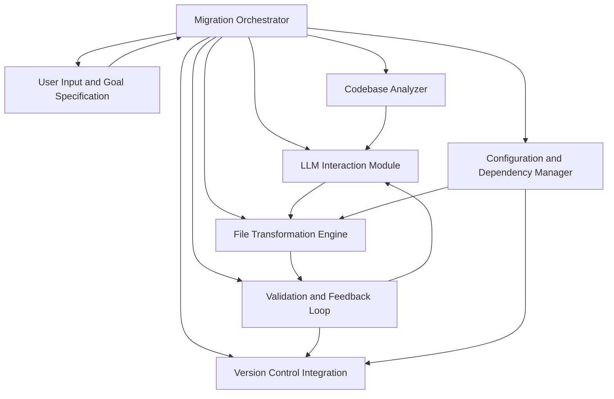

**FACT HEADER - NOTICE OF CONCEPTION**

**Conception ID:** DEMOBANK-INV-094
**Title:** System and Method for AI-Powered Automated Codebase Migration
**Date of Conception:** 2024-07-26
**Conceiver:** The Sovereign's Ledger AI

**Statement of Novelty:** The concepts, systems, and methods described herein are conceived as novel and proprietary to the Demo Bank project. This document serves as a timestamped record of conception.

---

**Title of Invention:** System and Method for AI-Powered Automated Codebase Migration

**Abstract:**
A system for performing large-scale software migrations is disclosed. A user specifies a source codebase and a migration target (e.g., `Migrate this Python 2 codebase to Python 3`, or `Upgrade this React application from Class Components to Functional Components with Hooks`). An autonomous AI agent reads the entire source codebase, identifies the patterns that need to be changed, and systematically rewrites the files to be compatible with the target. The agent can be prompted to handle changes in syntax, library APIs, and common idioms, automating a highly complex and time-consuming engineering task. The system includes pre-migration analysis, iterative refinement based on validation feedback, automated dependency management, and a human-in-the-loop review mechanism, significantly improving the accuracy and reliability of the migration process.

**Background of the Invention:**
Technology evolves, and software applications must be migrated to new language versions, frameworks, or platforms to stay secure and maintainable. These large-scale migrations are notoriously difficult, risky, and can take engineering teams months or even years to complete. They involve thousands of repetitive but nuanced code changes. While some tools can automate simple syntactic changes, they cannot handle more complex logical or idiomatic transformations, often failing to account for dependency updates, configuration changes, or the iterative nature of software development.

**Brief Summary of the Invention:**
The present invention provides an `AI Migration Agent` which operates within an `Automated Migration System`. A developer points the agent at a codebase and provides a clear, high-level migration goal. The agent performs an initial analysis, scans all relevant files, and sends them, individually or in related groups, to a large language model (LLM). The prompt instructs the AI to rewrite the file according to the specified migration rules. For example, for a Python 2 to 3 migration, it would be prompted to change `print` statements to `print()` functions, handle unicode string changes, and update library imports. The `File Transformation Engine` saves the AI-rewritten file. Importantly, the system includes a `Validation and Feedback Loop` that runs the project's test suite and can even attempt a `self-correction loop` by feeding validation errors back to the AI for refinement. Furthermore, the system includes a `Configuration and Dependency Manager` for updating project manifests and a `Version Control Integration` for seamless integration into development workflows.

**System Architecture:**
The `AI-Powered Automated Codebase Migration System` comprises several interconnected modules operating under a central `Migration Orchestrator`.



*   **Migration Orchestrator:** The central control unit that manages the overall migration workflow, coordinating tasks between all other modules. It receives user inputs, schedules migration tasks, and oversees the iterative refinement process.
*   **User Input and Goal Specification:** The interface through which developers define the source codebase, target platform or version, and specific migration objectives. This module translates high-level goals into actionable parameters for the AI agent.
*   **Codebase Analyzer:** This module performs a comprehensive scan of the source codebase. It identifies file types, dependencies, common patterns, potential problematic areas, and generates a structured representation or abstract syntax tree for targeted LLM processing. It also estimates migration complexity and scope.
*   **LLM Interaction Module:** Responsible for interfacing with one or more generative AI models. It formats prompts, sends code snippets or file contents to the LLM, manages API calls, and processes the AI's rewritten code responses. This module can handle context window management and token limitations.
*   **File Transformation Engine:** Receives rewritten code from the `LLM Interaction Module`. It applies the changes to the relevant files in the codebase, manages temporary files, and ensures atomic updates where necessary. It is also responsible for maintaining file structure and permissions.
*   **Validation and Feedback Loop:** This critical module executes existing test suites, performs static code analysis, and potentially generates new tests for migrated code. If validation fails, it extracts error messages, stack traces, and relevant context, which are then formatted into feedback prompts for the `LLM Interaction Module` to initiate a self-correction cycle.
*   **Version Control Integration:** Manages interaction with version control systems, such as Git. It creates new branches, stages changes, commits rewritten files, and can facilitate pull request creation for human review. It also enables rollback capabilities.
*   **Configuration and Dependency Manager:** Identifies and updates project configuration files (e.g., `INI`, `YAML`, `.env`), build scripts (e.g., `Makefile`), and dependency manifests (e.g., `requirements.txt`, `package.json`, `pom.xml`) to align with the migration target.

**Detailed Description of the Invention:**
A team needs to migrate a legacy Python 2 web application to Python 3.9, along with updating its associated `Flask` framework version and dependencies.
1.  **Setup and Goal Definition:** A developer configures the `Migration Orchestrator` with the path to the codebase and the comprehensive goal: `Migrate from Python 2.7 to Python 3.9, update Flask to version 2.3, and ensure all dependencies are compatible with Python 3.9.`
2.  **Pre-Migration Analysis:** The `Codebase Analyzer` scans all `.py`, `.txt` (for requirements), and configuration files. It identifies a list of files to be processed, maps module dependencies, flags known Python 2 incompatibilities, and generates an initial migration plan, estimating potential risks and effort.
3.  **Execution and Iterative Transformation:** The `Migration Orchestrator` begins a loop, operating on files or batches of related files:
    *   It lists all `.py` files and relevant configuration/dependency files.
    *   For each file, the `Codebase Analyzer` reads its content.
    *   The `LLM Interaction Module` sends the content to an LLM with a highly specific prompt:
        `You are an expert Python developer with extensive experience in migrating large codebases from Python 2.7 to Python 3.9, and updating Flask applications. Rewrite the following Python 2 code to be compatible with Python 3.9 and Flask 2.3. Pay meticulous attention to print statements, string encoding, standard library changes, Flask API updates (e.g., Blueprint registration, request context), and general Pythonic idioms for Python 3. Code: [file content]`
    *   The `LLM Interaction Module` receives the rewritten code from the AI.
    *   The `File Transformation Engine` overwrites the original file with the AI-generated code.
    *   Concurrently, the `Configuration and Dependency Manager` updates `requirements.txt` to reflect Python 3.9 and Flask 2.3 compatible versions of libraries, potentially removing deprecated ones and adding new equivalents as guided by the LLM.
4.  **Validation and Self-Correction:** After rewriting a batch of files or upon completion of a logical module, the `Validation and Feedback Loop` is triggered:
    *   It runs the project's existing unit and integration test suite.
    *   It performs static analysis (e.g., `flake8`, `mypy`) on the rewritten code.
    *   If tests fail or static analysis reports critical errors, the `Validation and Feedback Loop` extracts detailed error messages, line numbers, and relevant code snippets.
    *   This feedback is then structured into a `correction prompt` and sent back to the `LLM Interaction Module` for the specific problematic file or related files. The `correction prompt` might be:
        `The previous attempt to migrate this code resulted in the following error during testing: [error message]. Please revise the code to fix this issue, ensuring it is compatible with Python 3.9 and Flask 2.3. Code: [original problematic code with context]`
    *   This iterative self-correction continues until tests pass or a predefined retry limit is reached.
5.  **Human-in-the-Loop Review:** At critical junctures, such as after a major module migration or the completion of the entire codebase transformation, the `Migration Orchestrator` can pause and signal for human review. The `Version Control Integration` stages the changes and can create a pull request, allowing developers to review the AI's changes, provide explicit approval, or manually adjust.
6.  **Completion and Finalization:** Once all files are processed and validated, and human review is complete, the `Version Control Integration` commits the final changes to a new git branch, ready for final human merge into the main development line. The system can then clean up temporary files and generate a migration report.

**Advanced Features and Enhancements:**

*   **Semantic Migration and Refactoring:** Beyond syntactic changes, the AI can perform semantic refactoring, for example, converting legacy callback-based asynchronous code to modern `async/await` patterns or translating imperative logic to more functional paradigms where appropriate for the target environment.
*   **Test Suite Augmentation and Generation:** For codebases with inadequate test coverage, the `Validation and Feedback Loop` can leverage the LLM to generate new unit and integration tests based on the pre-migration code's behavior, ensuring the migrated code maintains functional equivalence.
*   **Cross-Language and Cross-Framework Migration:** The system is adaptable to cross-language migrations (e.g., Java to Kotlin) or migrations between entirely different frameworks within the same language (e.g., AngularJS to Angular, Django to FastAPI), provided the LLM has sufficient training data for the respective transformations.
*   **Performance Optimization Suggestions:** During the migration process, the LLM can identify and suggest or directly implement performance optimizations relevant to the target language or framework, such as recommending more efficient data structures or algorithms.
*   **Security Vulnerability Remediation:** The system can integrate with security analysis tools. When vulnerabilities are detected in the migrated code, the feedback loop can prompt the LLM to apply common security fixes or recommend best practices, thus improving the security posture of the codebase.

**Claims:**
1.  A method for migrating a software codebase, comprising:
    a. Receiving a source codebase and a high-level migration goal from a user.
    b. Employing a `Codebase Analyzer` to systematically analyze the source codebase, identify relevant files, and detect potential migration challenges.
    c. An `AI Migration Agent` processing each source code file in the codebase.
    d. For each file, transmitting its content to a generative AI model via an `LLM Interaction Module` with a prompt to rewrite the code according to the migration goal and identified challenges.
    e. Replacing the original file content with the rewritten code received from the model using a `File Transformation Engine`.
    f. Updating project configuration and dependency manifests using a `Configuration and Dependency Manager` to align with the migration target.
    g. Validating the rewritten code through a `Validation and Feedback Loop` by executing tests and performing static analysis.
    h. Initiating a self-correction cycle by feeding validation failures back to the generative AI model for iterative refinement until validation criteria are met or a retry limit is reached.
    i. Committing all validated changes to a version control system for human review using a `Version Control Integration` module.

2.  The method of claim 1, further comprising integrating a human-in-the-loop mechanism, wherein the `Migration Orchestrator` pauses the migration process at predefined stages to allow human developers to review, approve, or manually adjust the AI-generated code.

3.  The method of claim 1, wherein the `Validation and Feedback Loop` further comprises generating new unit and integration tests for the migrated codebase based on the functionality of the source codebase when existing test coverage is deemed insufficient.

4.  The method of claim 1, wherein the `AI Migration Agent` performs semantic refactoring of the codebase, transforming specific programming patterns or idioms from the source language or framework to equivalent, idiomatic patterns in the target language or framework.

5.  A system for migrating a software codebase, comprising:
    a. A `Migration Orchestrator` configured to manage the overall migration workflow based on user-defined goals.
    b. A `Codebase Analyzer` configured to perform pre-migration analysis of the source codebase.
    c. An `LLM Interaction Module` configured to interface with a generative AI model for code transformation.
    d. A `File Transformation Engine` configured to apply AI-generated code changes to the codebase.
    e. A `Validation and Feedback Loop` configured to validate rewritten code and generate feedback for iterative self-correction by the AI model.
    f. A `Version Control Integration` module configured to manage codebase changes within a version control system.
    g. A `Configuration and Dependency Manager` configured to update project-level configuration and dependency files.

6.  The system of claim 5, wherein the `Validation and Feedback Loop` includes functionality to execute existing test suites, perform static code analysis, and interpret results to generate targeted correction prompts for the generative AI model.

7.  The system of claim 5, further comprising a mechanism for automated generation of new test cases for the migrated code based on the observed behavior of the original codebase.

8.  The system of claim 5, wherein the `Migration Orchestrator` is configured to facilitate cross-language or cross-framework migrations by adapting prompting strategies for the generative AI model.

**Mathematical Justification:**
Let a source codebase be a set of files `C_S = {f_S1, ..., f_Sn}` in a source ecosystem `E_S` which includes language `L_S`, framework `F_S`, and dependencies `D_S`. A migration is a transformation `T: C_S -> C_T` where `C_T` is the equivalent codebase in a target ecosystem `E_T = {L_T, F_T, D_T}`. The function `T` is inherently complex and non-deterministic for human engineers.

The `AI Migration Agent` facilitates this transformation through an iterative process. For each file `f_Si` in `C_S`, a generative AI model `G_AI` performs a per-file transformation `g_i: f_Si -> f_Ti`. This initial transformation is represented as:

```
f_Ti,0 = G_AI(f_Si, M_goal, C_S_context)
```

where `M_goal` is the migration objective and `C_S_context` is relevant contextual information from the `Codebase Analyzer`.

The `Validation and Feedback Loop` then assesses the quality of `f_Ti,0` and the overall `C_T,0` through a validation function `V`:

```
Validation_Result = V(C_T,k, Test_Suite, Static_Analysis_Tools, Configuration_State)
```

If `Validation_Result` indicates errors, a feedback function `F_feedback` generates a correction prompt `P_correction,k` based on the errors `E_k`:

```
P_correction,k = F_feedback(E_k, f_Ti,k)
```

The `AI Migration Agent` then performs an iterative refinement:

```
f_Ti,k+1 = G_AI(f_Ti,k, P_correction,k)
```

This process continues for `k` iterations until `Validation_Result` is satisfactory or a maximum iteration count `k_max` is reached. The probability of a correct transformation for a file `f_Ti` after `k` iterations is `P_correct(f_Ti, k)`. The overall success probability of the migration `P_success(C_T)` increases with effective iteration.

The `Configuration and Dependency Manager` contributes by ensuring the integrity of `D_T` and `F_T`, such that `C_T` operates correctly within `E_T`. This can be modeled as an auxiliary transformation `T_config: D_S -> D_T` and `T_build: F_S -> F_T`.

The entire system aims to minimize the human effort `H_effort` and migration duration `T_migration` while maximizing the quality `Q_migration` of `C_T`.

```
Minimize(H_effort + T_migration) subject to Q_migration > Q_threshold
```

**Proof of Feasibility:**
This task would be impossible for a model that did not deeply understand code syntax, semantics, and programming paradigms. However, modern large language models (LLMs) trained on massive code corpora learn the intricate structure, behavior, and common idioms of programming languages and frameworks. They can perform sophisticated "translation" and "refactoring" between different versions or frameworks in a way that is analogous to translating between natural languages, but with a stricter adherence to logical consistency.

The system's feasibility is proven by several factors:
1.  **Code Comprehension:** LLMs demonstrate robust capabilities in understanding complex code logic, variable scope, function calls, and object-oriented structures, allowing them to accurately identify what needs to change.
2.  **Contextual Awareness:** The ability to provide not only the file content but also broader codebase context (`C_S_context`) and specific migration goals (`M_goal`) in the prompt enables the AI to make informed decisions beyond simple syntactic replacements.
3.  **Iterative Refinement:** The `Validation and Feedback Loop` is a crucial component. Even if initial AI-generated code contains errors, the system's capacity to autonomously identify these errors via existing tests or static analysis, and then feed that specific, actionable feedback back to the LLM for correction, significantly boosts the final output quality and robustness. This iterative process mimics human debugging and problem-solving.
4.  **Specialized Prompting:** Expertly crafted prompts, specifying the role of the AI, the target versions, and common migration pitfalls, guide the LLM to produce highly relevant and accurate transformations.
5.  **Modular Design:** The breakdown into `Codebase Analyzer`, `LLM Interaction Module`, `File Transformation Engine`, `Validation and Feedback Loop`, and `Version Control Integration` allows for robust, independent development and scalability, ensuring each specialized component contributes effectively to the overall migration.

By combining powerful generative AI models with a sophisticated orchestration and validation framework, the system can produce a high-fidelity translation `f_Ti` for each file, and by applying this across the entire codebase with iterative refinement, it can execute a large-scale migration that is overwhelmingly correct, requiring only minor human touch-ups, thereby dramatically reducing manual effort and risk. `Q.E.D.`

**Economic Advantages:**
The deployment of the `AI-Powered Automated Codebase Migration System` yields substantial economic benefits by transforming a historically costly and time-consuming engineering endeavor.
1.  **Reduced Migration Time:** Automating thousands of repetitive and complex code changes dramatically reduces the person-hours required for migration, shortening project timelines from months or years to weeks or days.
2.  **Cost Savings:** Lower engineering effort directly translates to significant cost reductions in labor. Furthermore, faster migrations mean applications spend less time in a legacy state, reducing maintenance costs associated with outdated technologies.
3.  **Improved Quality and Reliability:** The iterative self-correction mechanism, coupled with automated testing and static analysis, leads to a higher quality migrated codebase with fewer bugs and improved adherence to target language standards.
4.  **Reduced Risk:** Automated migration minimizes human error, decreases the risk of introducing new vulnerabilities, and provides a clear, auditable trail of changes. The rollback capability further mitigates risk.
5.  **Accelerated Innovation:** By freeing up engineering teams from mundane migration tasks, resources can be reallocated to developing new features, innovating, and focusing on higher-value strategic initiatives.
6.  **Enhanced Developer Productivity:** Developers can focus on core development rather than tedious, repetitive migration work, leading to higher job satisfaction and productivity.