```mermaid
graph TD
    subgraph Migration Workflow System
        B[User Input Goal Specification] --> A[Migration Orchestrator]
        A --> C[Codebase Analyzer]
        A --> H[Configuration and Dependency Manager]
        A --> M[Migration State Manager]

        C --> C1[Code Scanner]
        C1 --> C2[Abstract Syntax Tree Generator]
        C2 --> C3[Dependency Grapher]
        C3 --> C4[Migration Plan Generator]
        C4 --> D[LLM Interaction Module]
        C4 --> H

        D --> D1[Prompt Formatter]
        D1 --> D2[LLM API Caller]
        D2 --> D3[Token Context Manager]
        D3 --> E[File Transformation Engine]

        E --> E1[File Rewriter]
        E1 --> E2[Code Diff Generator]
        E2 --> E3[Backup Manager]
        E3 --> F[Validation and Feedback Loop]
        H --> E1
        H --> G[Version Control Integration]

        F --> F1[Test Runner]
        F1 --> F2[Static Code Analyzer]
        F2 --> F3[Error Extractor]
        F3 --> F4[Feedback Prompt Creator]
        F4 --> D[LLM Interaction Module]
        F3 --> M[Migration State Manager]

        G --> G1[Branch Creator]
        G1 --> G2[Commit Manager]
        G2 --> G3[Pull Request Facilitator]
        G3 --> K[Human Reviewer]
        K --> A

        M --> A
        A --> Z[Migration Report Generator]
    end

    style A fill:#f9f,stroke:#333,stroke-width:2px
    style F fill:#9f9,stroke:#333,stroke-width:2px
    style D fill:#ff9,stroke:#333,stroke-width:2px
```

**FACT HEADER - NOTICE OF CONCEPTION**

**Conception ID:** DEMOBANK-INV-094
**Title:** System and Method for AI-Powered Automated Codebase Migration
**Date of Conception:** 2024-07-26
**Conceiver:** The Sovereign's Ledger AI

**Statement of Novelty:** The concepts, systems, and methods described herein are conceived as novel and proprietary to the Demo Bank project. This document serves as a timestamped record of conception.

---

**Title of Invention:** System and Method for AI-Powered Automated Codebase Migration

**Abstract:**
A system for performing large-scale software migrations is disclosed. A user specifies a source codebase and a migration target (e.g., `Migrate this Python 2 codebase to Python 3`, or `Upgrade this React application from Class Components to Functional Components with Hooks`). An autonomous AI agent reads the entire source codebase, identifies the patterns that need to be changed, and systematically rewrites the files to be compatible with the target. The agent can be prompted to handle changes in syntax, library APIs, and common idioms, automating a highly complex and time-consuming engineering task. The system includes pre-migration analysis, iterative refinement based on validation feedback, automated dependency management, and a human-in-the-loop review mechanism, significantly improving the accuracy and reliability of the migration process.

**Background of the Invention:**
Technology evolves, and software applications must be migrated to new language versions, frameworks, or platforms to stay secure and maintainable. These large-scale migrations are notoriously difficult, risky, and can take engineering teams months or even years to complete. They involve thousands of repetitive but nuanced code changes. While some tools can automate simple syntactic changes, they cannot handle more complex logical or idiomatic transformations, often failing to account for dependency updates, configuration changes, or the iterative nature of software development.

**Brief Summary of the Invention:**
The present invention provides an `AI Migration Agent` which operates within an `Automated Migration System`. A developer points the agent at a codebase and provides a clear, high-level migration goal. The agent performs an initial analysis, scans all relevant files, and sends them, individually or in related groups, to a large language model (LLM). The prompt instructs the AI to rewrite the file according to the specified migration rules. For example, for a Python 2 to 3 migration, it would be prompted to change `print` statements to `print()` functions, handle unicode string changes, and update library imports. The `File Transformation Engine` saves the AI-rewritten file. Importantly, the system includes a `Validation and Feedback Loop` that runs the project's test suite and can even attempt a `self-correction loop` by feeding validation errors back to the AI for refinement. Furthermore, the system includes a `Configuration and Dependency Manager` for updating project manifests and a `Version Control Integration` for seamless integration into development workflows.

**System Architecture:**
The `AI Powered Automated Codebase Migration System` comprises several interconnected modules operating under a central `Migration Orchestrator`.



*   **Migration Orchestrator:** The central control unit that manages the overall migration workflow, coordinating tasks between all other modules. It receives user inputs, schedules migration tasks, and oversees the iterative refinement process based on the `Migration State Manager`.
*   **User Input Goal Specification:** The interface through which developers define the source codebase, target platform or version, and specific migration objectives. This module translates high-level goals into actionable parameters for the AI agent.
*   **Codebase Analyzer:** This module performs a comprehensive scan of the source codebase.
    *   **Code Scanner:** Identifies file types, extracts raw text content, and builds an initial file inventory.
    *   **Abstract Syntax Tree Generator:** Parses source code to generate ASTs, enabling deep structural analysis.
    *   **Dependency Grapher:** Maps internal and external module dependencies.
    *   **Migration Plan Generator:** Identifies common patterns, potential problematic areas, estimates migration complexity and scope, and outlines a step-by-step migration strategy.
*   **LLM Interaction Module:** Responsible for interfacing with one or more generative AI models.
    *   **Prompt Formatter:** Dynamically crafts detailed prompts for the LLM based on migration rules, file content, context, and feedback.
    *   **LLM API Caller:** Manages API calls to the LLM, handles rate limits, and processes AI responses.
    *   **Token Context Manager:** Optimizes token usage, segments large files, and manages conversational context for iterative corrections.
*   **File Transformation Engine:** Receives rewritten code from the `LLM Interaction Module`.
    *   **File Rewriter:** Applies changes to the relevant files, ensuring atomic updates and preserving file structure and permissions.
    *   **Code Diff Generator:** Generates diffs between original and AI-rewritten files for review and auditing.
    *   **Backup Manager:** Creates temporary backups of original files before overwriting to ensure recoverability.
*   **Validation and Feedback Loop:** This critical module executes validation steps and generates correction feedback.
    *   **Test Runner:** Executes existing unit, integration, and end-to-end test suites.
    *   **Static Code Analyzer:** Performs static analysis, linting, and style checks on the rewritten code.
    *   **Error Extractor:** Parses output from the `Test Runner` and `Static Code Analyzer` to extract detailed error messages, stack traces, and relevant code snippets.
    *   **Feedback Prompt Creator:** Formats extracted errors and context into a `correction prompt` for the `LLM Interaction Module`.
*   **Version Control Integration:** Manages interaction with version control systems, such as Git.
    *   **Branch Creator:** Creates new feature branches for the migration.
    *   **Commit Manager:** Stages and commits rewritten files with descriptive messages.
    *   **Pull Request Facilitator:** Can automatically create pull requests for human review.
*   **Configuration and Dependency Manager:** Identifies and updates project configuration files (e.g., `INI`, `YAML`, `.env`), build scripts (e.g., `Makefile`), and dependency manifests (e.g., `requirements.txt`, `package.json`, `pom.xml`) to align with the migration target.
*   **Migration State Manager:** Tracks the overall progress of the migration, status of individual files/modules, validation results, and retry counts, guiding the `Migration Orchestrator`.
*   **Human Reviewer:** An optional manual intervention point where human developers review AI-generated changes, providing explicit approval or manual adjustments, typically through a pull request workflow.
*   **Migration Report Generator:** Produces detailed reports summarizing the migration process, including changes made, validation results, remaining issues, and performance metrics.

**Detailed Description of the Invention:**
A team needs to migrate a legacy Python 2 web application to Python 3.9, along with updating its associated `Flask` framework version and dependencies.
1.  **Setup and Goal Definition:** A developer configures the `Migration Orchestrator` with the path to the codebase and the comprehensive goal: `Migrate from Python 2.7 to Python 3.9, update Flask to version 2.3, and ensure all dependencies are compatible with Python 3.9.`
2.  **Pre Migration Analysis:** The `Codebase Analyzer` (specifically its `Code Scanner`, `Abstract Syntax Tree Generator`, and `Dependency Grapher`) scans all `.py`, `.txt` (for requirements), and configuration files. It identifies a list of files to be processed, maps module dependencies, flags known Python 2 incompatibilities, and generates an initial migration plan via the `Migration Plan Generator`, estimating potential risks and effort. This plan is stored in the `Migration State Manager`.
3.  **Execution and Iterative Transformation:** The `Migration Orchestrator` begins a loop, operating on files or batches of related files, guided by the `Migration State Manager`:
    *   It lists all `.py` files and relevant configuration/dependency files.
    *   For each file, the `Codebase Analyzer` reads its content.
    *   The `LLM Interaction Module` (via `Prompt Formatter`, `LLM API Caller`, and `Token Context Manager`) sends the content to an LLM with a highly specific prompt:
        `You are an expert Python developer with extensive experience in migrating large codebases from Python 2.7 to Python 3.9, and updating Flask applications. Rewrite the following Python 2 code to be compatible with Python 3.9 and Flask 2.3. Pay meticulous attention to print statements, string encoding, standard library changes, Flask API updates e.g. Blueprint registration, request context, and general Pythonic idioms for Python 3. Code: [file content]`
    *   The `LLM Interaction Module` receives the rewritten code from the AI.
    *   The `File Transformation Engine` (specifically the `File Rewriter`) overwrites the original file with the AI-generated code after the `Backup Manager` creates a temporary backup.
    *   Concurrently, the `Configuration and Dependency Manager` updates `requirements.txt` to reflect Python 3.9 and Flask 2.3 compatible versions of libraries, potentially removing deprecated ones and adding new equivalents as guided by the LLM or pre-defined rules.
4.  **Validation and Self Correction:** After rewriting a batch of files or upon completion of a logical module, the `Validation and Feedback Loop` is triggered:
    *   The `Test Runner` executes the project's existing unit and integration test suite.
    *   The `Static Code Analyzer` performs static analysis (e.g., `flake8`, `mypy`) on the rewritten code.
    *   If tests fail or static analysis reports critical errors, the `Error Extractor` extracts detailed error messages, line numbers, and relevant code snippets.
    *   This feedback is then structured by the `Feedback Prompt Creator` into a `correction prompt` and sent back to the `LLM Interaction Module` for the specific problematic file or related files. The `correction prompt` might be:
        `The previous attempt to migrate this code resulted in the following error during testing: [error message]. Please revise the code to fix this issue, ensuring it is compatible with Python 3.9 and Flask 2.3. Code: [original problematic code with context]`
    *   This iterative self-correction continues until tests pass or a predefined retry limit, tracked by the `Migration State Manager`, is reached.
5.  **Human in the Loop Review:** At critical junctures, such as after a major module migration or the completion of the entire codebase transformation, the `Migration Orchestrator` can pause and signal for human review. The `Version Control Integration` (specifically `Branch Creator`, `Commit Manager`, `Pull Request Facilitator`) stages the changes and can create a pull request, allowing developers to review the AI's changes, provide explicit approval, or manually adjust via the `Human Reviewer` interface.
6.  **Completion and Finalization:** Once all files are processed and validated, and human review is complete, the `Version Control Integration` commits the final changes to a new git branch, ready for final human merge into the main development line. The `Migration Report Generator` then cleans up temporary files and generates a comprehensive migration report.

**Advanced Features and Enhancements:**

*   **Semantic Migration and Refactoring:** Beyond syntactic changes, the AI can perform semantic refactoring, for example, converting legacy callback-based asynchronous code to modern `async/await` patterns or translating imperative logic to more functional paradigms where appropriate for the target environment.
*   **Test Suite Augmentation and Generation:** For codebases with inadequate test coverage, the `Validation and Feedback Loop` can leverage the LLM to generate new unit and integration tests based on the pre-migration code's behavior, ensuring the migrated code maintains functional equivalence.
*   **Cross Language and Cross Framework Migration:** The system is adaptable to cross-language migrations (e.g., Java to Kotlin) or migrations between entirely different frameworks within the same language (e.g., AngularJS to Angular, Django to FastAPI), provided the LLM has sufficient training data for the respective transformations.
*   **Performance Optimization Suggestions:** During the migration process, the LLM can identify and suggest or directly implement performance optimizations relevant to the target language or framework, such as recommending more efficient data structures or algorithms.
*   **Security Vulnerability Remediation:** The system can integrate with security analysis tools. When vulnerabilities are detected in the migrated code, the feedback loop can prompt the LLM to apply common security fixes or recommend best practices, thus improving the security posture of the codebase.

**Claims:**
1.  A method for migrating a software codebase, comprising:
    a. Receiving a source codebase and a high-level migration goal from a user.
    b. Employing a `Codebase Analyzer` to systematically analyze the source codebase, identify relevant files, and detect potential migration challenges.
    c. An `AI Migration Agent` processing each source code file in the codebase.
    d. For each file, transmitting its content to a generative AI model via an `LLM Interaction Module` with a prompt to rewrite the code according to the migration goal and identified challenges.
    e. Replacing the original file content with the rewritten code received from the model using a `File Transformation Engine`.
    f. Updating project configuration and dependency manifests using a `Configuration and Dependency Manager` to align with the migration target.
    g. Validating the rewritten code through a `Validation and Feedback Loop` by executing tests and performing static analysis.
    h. Initiating a self-correction cycle by feeding validation failures back to the generative AI model for iterative refinement until validation criteria are met or a retry limit is reached.
    i. Committing all validated changes to a version control system for human review using a `Version Control Integration` module.

2.  The method of claim 1, further comprising integrating a human-in-the-loop mechanism, wherein the `Migration Orchestrator` pauses the migration process at predefined stages to allow human developers to review, approve, or manually adjust the AI-generated code.

3.  The method of claim 1, wherein the `Validation and Feedback Loop` further comprises generating new unit and integration tests for the migrated codebase based on the functionality of the source codebase when existing test coverage is deemed insufficient.

4.  The method of claim 1, wherein the `AI Migration Agent` performs semantic refactoring of the codebase, transforming specific programming patterns or idioms from the source language or framework to equivalent, idiomatic patterns in the target language or framework.

5.  A system for migrating a software codebase, comprising:
    a. A `Migration Orchestrator` configured to manage the overall migration workflow based on user-defined goals.
    b. A `Codebase Analyzer` configured to perform pre-migration analysis of the source codebase, including abstract syntax tree generation and dependency graphing.
    c. An `LLM Interaction Module` configured to interface with a generative AI model for code transformation, including prompt formatting and token context management.
    d. A `File Transformation Engine` configured to apply AI-generated code changes to the codebase, including generating code diffs and managing file backups.
    e. A `Validation and Feedback Loop` configured to validate rewritten code and generate feedback for iterative self-correction by the AI model, including executing tests, performing static code analysis, and extracting errors.
    f. A `Version Control Integration` module configured to manage codebase changes within a version control system, including branch creation and pull request facilitation.
    g. A `Configuration and Dependency Manager` configured to update project-level configuration and dependency files.
    h. A `Migration State Manager` configured to track the iterative progress and state of the codebase transformation.

6.  The system of claim 5, wherein the `Validation and Feedback Loop` includes functionality to execute existing test suites, perform static code analysis, and interpret results to generate targeted correction prompts for the generative AI model.

7.  The system of claim 5, further comprising a mechanism for automated generation of new test cases for the migrated code based on the observed behavior of the original codebase.

8.  The system of claim 5, wherein the `Migration Orchestrator` is configured to facilitate cross-language or cross-framework migrations by adapting prompting strategies for the generative AI model, leveraging the `Migration Plan Generator`.

**Mathematical Justification:**
Let a source codebase be a precisely defined set of files `C_S = {f_1, f_2, ..., f_N}` where each `f_j` is an ordered sequence of characters representing source code. The source ecosystem is formally denoted as `E_S = (L_S, F_S, D_S, S_S)`, comprising a programming language `L_S`, a framework `F_S`, a set of declared dependencies `D_S`, and a set of semantic and idiomatic rules `S_S` that govern valid program behavior within `E_S`. The target ecosystem `E_T = (L_T, F_T, D_T, S_T)` is similarly defined.

A migration is a transformation `T: C_S x E_S x E_T -> C_T` such that `C_T` is functionally equivalent or semantically aligned with `C_S` under the rules of `E_T`. The `AI Powered Automated Codebase Migration System` performs this transformation iteratively.

**1. System State Definition:**
At any iteration `k`, the system's state is represented by `Ω_k = (C_k, D_k, M_k, R_k, P_k)`, where:
*   `C_k`: The current codebase state, `C_k = {f_{1,k}, ..., f_{N,k}}`. Initially, `C_0 = C_S`.
*   `D_k`: The current set of resolved project dependencies.
*   `M_k`: The `Migration State Manager`'s internal representation of migration progress, including per-file status, validation outcomes, and retry counts.
*   `R_k`: The set of `Validation_Result` outcomes from the previous iteration.
*   `P_k`: The set of `Correction_Prompt`s generated based on `R_k`.

**2. Migration Goal Formalization:**
The `User Input Goal Specification` provides `M_goal = (L_T, F_T, D_T_spec, S_T)`, a formal specification for the target ecosystem. This `M_goal` guides all subsequent transformations and validations.

**3. Iterative Transformation Operator `Φ`:**
The core of the invention is an iterative transformation operator `Φ` applied by the `Migration Orchestrator`. For each file `f_{j,k}` in `C_k` that requires transformation or correction:

```
f_{j,k+1} = G_AI(f_{j,k}, P_{j,k}, C_{k,context})
```
where `G_AI` is the generative AI model (from `LLM Interaction Module`), `P_{j,k}` is a file-specific prompt (either an initial migration prompt or a `Correction_Prompt` from `P_k`), and `C_{k,context}` is relevant structural and semantic context extracted by the `Codebase Analyzer` (e.g., AST fragments, dependency graph information, related files).

Concurrently, the `Configuration and Dependency Manager` applies an update function `Ψ` to `D_k`:
```
D_{k+1} = Ψ(D_k, M_goal, C_{k+1}, G_AI_suggestions)
```
This updates dependencies to satisfy `D_T_spec` and runtime requirements of `C_{k+1}`.

The full system state transition is then:
```
Ω_{k+1} = Φ(Ω_k, M_goal)
```

**4. Validation Function `V`:**
After `C_{k+1}` and `D_{k+1}` are generated, the `Validation and Feedback Loop` evaluates their correctness. The validation function `V` is a composite predicate:

```
V(C_{k+1}, D_{k+1}, M_goal) = (V_Tests(C_{k+1}) ∧ V_Static(C_{k+1}) ∧ V_Config(D_{k+1}, C_{k+1}))
```
where:
*   `V_Tests(C_{k+1})` evaluates the execution of existing test suites. It returns `TRUE` if all tests pass, `FALSE` otherwise, along with a `Test_Error_Set`.
*   `V_Static(C_{k+1})` performs static analysis. It returns `TRUE` if no critical errors or warnings are found, `FALSE` otherwise, along with a `Static_Error_Set`.
*   `V_Config(D_{k+1}, C_{k+1})` checks dependency consistency and configuration validity. It returns `TRUE` if configurations are valid and dependencies are resolvable and compatible, `FALSE` otherwise, along with a `Config_Error_Set`.

If `V` returns `FALSE`, then `R_{k+1} = (Test_Error_Set ∪ Static_Error_Set ∪ Config_Error_Set)` is a non-empty set of structured errors.

**5. Feedback Function `F_feedback`:**
If `R_{k+1}` is non-empty, the `Feedback Prompt Creator` generates `P_{k+1}`:
```
P_{k+1} = F_feedback(R_{k+1}, C_{k+1}, M_goal)
```
This function maps specific errors to actionable natural language prompts for `G_AI`, including relevant code snippets and context, thereby closing the feedback loop. `F_feedback` is a critical component that translates observed system behavior into precise directives for `G_AI`, significantly enhancing its corrective capabilities beyond a simple error message.

**6. Convergence and Fixed Point Iteration:**
The system aims to find a codebase `C_T*` such that `V(C_T*, D_T*, M_goal)` is `TRUE` (i.e., `R_{k+1}` is empty). This can be viewed as an iterative search for a fixed point where no further corrections are needed or possible.
The process continues for `k` iterations until:
*   `V(C_k, D_k, M_goal)` is `TRUE`.
*   A maximum iteration count `k_max` is reached (to prevent infinite loops).
*   The `Migration State Manager` detects oscillatory behavior or no improvement.

The probability of successful migration, `P_success(C_T)`, within `k_max` iterations is significantly increased by the feedback loop. Let `p_j` be the probability that `G_AI` corrects an error in file `f_j` given a precise `Correction_Prompt`. The overall probability of resolving all errors `P(R_{k+1} = ∅ | R_k ≠ ∅)` increases with the quality of `F_feedback` and the capabilities of `G_AI`.

**7. Optimization Objective Formalization:**
The system optimizes a multi-objective function, minimizing human intervention and time while maximizing quality:
```
Minimize(W_human * H_effort + W_time * T_migration)
Subject to Q_migration(C_T, D_T, S_T) ≥ Q_threshold
```
where `H_effort` is human engineer hours, `T_migration` is elapsed time, `Q_migration` is a quality metric (e.g., bug density, maintainability score, test coverage), and `W_human`, `W_time` are weighting factors. The iterative feedback mechanism directly contributes to maximizing `Q_migration` and reducing `H_effort`.

**Proof of Feasibility:**
This task would be impossible for a model that did not deeply understand code syntax, semantics, and programming paradigms. However, modern large language models (LLMs) trained on massive code corpora learn the intricate structure, behavior, and common idioms of programming languages and frameworks. They can perform sophisticated "translation" and "refactoring" between different versions or frameworks in a way that is analogous to translating between natural languages, but with a stricter adherence to logical consistency.

The system's feasibility is proven by several factors:
1.  **Code Comprehension and Transformation:** LLMs demonstrate robust capabilities in understanding complex code logic, variable scope, function calls, and object-oriented structures, allowing `G_AI` to accurately identify what needs to change (`f_{j,k+1} = G_AI(...)`).
2.  **Contextual Awareness:** The ability to provide not only the file content but also broader codebase context (`C_{k,context}`) and specific migration goals (`M_goal`) in the prompt enables `G_AI` to make informed decisions beyond simple syntactic replacements, reducing the entropy of the transformation problem.
3.  **Iterative Refinement and Error Correction:** The `Validation and Feedback Loop` is a crucial component. Even if initial AI-generated code contains errors (`R_k ≠ ∅`), the system's capacity to autonomously identify these errors via existing tests or static analysis (`V`), and then feed that specific, actionable feedback (`P_k`) back to the LLM for correction, significantly boosts the final output quality and robustness. This iterative process mathematically represents a control loop that converges towards a valid solution `C_T*`, a process analogous to gradient descent in optimization.
4.  **Specialized Prompting:** Expertly crafted prompts, specifying the role of the AI, the target versions, and common migration pitfalls, guide the LLM to produce highly relevant and accurate transformations. The `Prompt Formatter` and `Feedback Prompt Creator` are key to this specialized communication.
5.  **Modular Design and Scalability:** The breakdown into `Codebase Analyzer`, `LLM Interaction Module`, `File Transformation Engine`, `Validation and Feedback Loop`, `Version Control Integration`, `Configuration and Dependency Manager`, and `Migration State Manager` allows for robust, independent development and scalability, ensuring each specialized component contributes effectively to the overall migration and its mathematical integrity.

By combining powerful generative AI models with a sophisticated orchestration and validation framework that formalizes the state, transformation, validation, and feedback, the system can produce a high-fidelity translation `f_Ti` for each file. By applying this across the entire codebase with iterative refinement, it can execute a large-scale migration that is overwhelmingly correct, requiring only minor human touch-ups, thereby dramatically reducing manual effort and risk. This mathematically defined iterative refinement process, with explicit error extraction and precise feedback loops, distinguishes it from simpler, non-iterative, or less formally defined code transformation methods. `Q.E.D.`

**Economic Advantages:**
The deployment of the `AI Powered Automated Codebase Migration System` yields substantial economic benefits by transforming a historically costly and time-consuming engineering endeavor.
1.  **Reduced Migration Time:** Automating thousands of repetitive and complex code changes dramatically reduces the person-hours required for migration, shortening project timelines from months or years to weeks or days.
2.  **Cost Savings:** Lower engineering effort directly translates to significant cost reductions in labor. Furthermore, faster migrations mean applications spend less time in a legacy state, reducing maintenance costs associated with outdated technologies.
3.  **Improved Quality and Reliability:** The iterative self-correction mechanism, coupled with automated testing and static analysis, leads to a higher quality migrated codebase with fewer bugs and improved adherence to target language standards.
4.  **Reduced Risk:** Automated migration minimizes human error, decreases the risk of introducing new vulnerabilities, and provides a clear, auditable trail of changes. The rollback capability further mitigates risk.
5.  **Accelerated Innovation:** By freeing up engineering teams from mundane migration tasks, resources can be reallocated to developing new features, innovating, and focusing on higher-value strategic initiatives.
6.  **Enhanced Developer Productivity:** Developers can focus on core development rather than tedious, repetitive migration work, leading to higher job satisfaction and productivity.