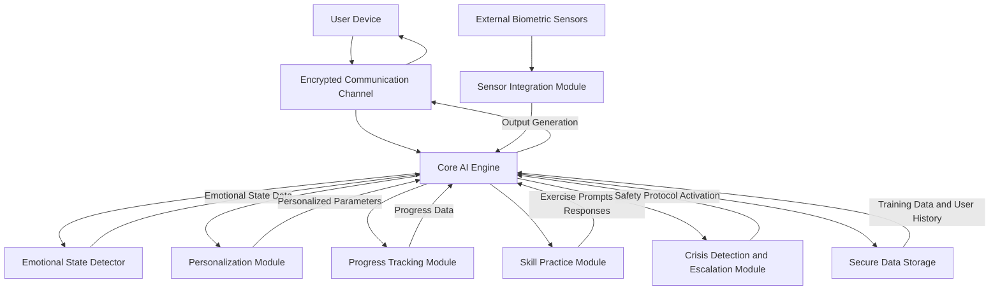

**Title of Invention:** A System and Method for a Therapeutic Conversational Partner

**Abstract:**
A system providing a therapeutic conversational AI is disclosed. The AI is trained on principles of cognitive-behavioral therapy (CBT), mindfulness, and other therapeutic modalities. It engages a user in an empathetic, supportive conversation, helping them to identify negative thought patterns, reframe their thinking, and practice emotional regulation techniques. The AI acts as an accessible, on-demand tool for mental wellness support. The system further includes mechanisms for emotional state detection, progress tracking, personalized intervention delivery, and secure data handling, aiming to provide a comprehensive and adaptive digital therapeutic experience.

**Detailed Description of the Invention:**
The system comprises a conversational AI agent designed to function as a therapeutic partner. The core of this system is a large language model L_LM, which is specifically fine-tuned through an extensive dataset comprising anonymized therapeutic transcripts, psychological literature, evidence-based therapy protocols, and simulated empathetic dialogues. This fine-tuning process ensures the AI adheres to established psychological principles and therapeutic techniques, including but not limited to Cognitive Behavioral Therapy CBT, Dialectical Behavior Therapy DBT, Acceptance and Commitment Therapy ACT, and various mindfulness practices.

The system initiates conversation with a highly specialized system prompt: `You are a compassionate AI companion trained in CBT. Your goal is to listen without judgment and help the user explore their thoughts and feelings. Use techniques like Socratic questioning and cognitive reframing.` This foundational instruction guides the AI's interaction style, promoting active listening, empathy, and a non-judgmental stance. The conversation is private and encrypted using industry-standard protocols such as end-to-end encryption for all data in transit and at rest, providing a secure and confidential space for the user to express thoughts and feelings without fear of exposure.

Beyond basic conversational capabilities, the system incorporates several advanced modules:

1.  **Emotional State Detection Module E_SM**: This module analyzes the user's textual input to infer their emotional state, sentiment, and intensity of distress. It employs natural language processing NLP techniques, including sentiment analysis, emotion classification, and semantic parsing, to provide real-time feedback to the core AI engine. This allows the AI to dynamically adapt its responses and therapeutic strategies to the user's current emotional context.

2.  **Personalization Module P_M**: The P_M tracks user preferences, historical conversational patterns, therapeutic goals, and observed responses to different interventions. This information is used to tailor the AI's communication style, pace of conversation, and the selection of therapeutic techniques to optimize engagement and therapeutic outcomes for individual users. For example, if a user responds well to guided mindfulness exercises, the P_M will prioritize offering such exercises.

3.  **Progress Tracking Module T_M**: This module logs user-defined goals, identified negative thought patterns, practiced coping mechanisms, and reported emotional shifts over time. It provides a longitudinal view of the user's therapeutic journey, enabling the AI to reinforce positive changes and adapt strategies when progress stalls. This data can also be presented to the user as a visual summary of their progress.

4.  **Skill Practice Module S_PM**: This module delivers structured exercises and guided activities directly related to therapeutic skills. Examples include guided meditation for mindfulness, thought challenging worksheets for CBT, deep breathing exercises for emotional regulation, and journaling prompts. The AI guides the user through these practices and processes their responses.

5.  **Crisis Detection and Escalation Module C_EM**: This module continuously monitors for explicit or implicit indicators of severe distress, self-harm ideation, or suicidal intent within the user's conversation. Upon detection, the C_EM is configured to provide immediate resources, such as emergency hotline numbers or links to crisis intervention services, and gently guide the user toward professional help, while maintaining a supportive presence.

6.  **External Sensor Integration Module S_IM**: In an advanced embodiment, the system integrates with external biometric sensors or wearables. Data such as heart rate variability HRV, sleep patterns, activity levels, and galvanic skin response GSR can be utilized by the AI to gain a more holistic understanding of the user's physiological state, which can inform the selection and timing of therapeutic interventions. For example, detected high stress levels might prompt a suggestion for a relaxation exercise.

The system operates on a feedback loop mechanism, where user interactions and outcomes are continuously analyzed to refine the underlying L_LM and update the knowledge base. This allows for ongoing improvement of the AI's therapeutic efficacy and responsiveness.

**System Architecture:**


**Algorithmic Descriptions:**

1.  **AI Training Objective Function**:
    The fine-tuning of the Core AI Engine L_LM minimizes a loss function L_total defined as:
    ```
    L_total = L_therapy + lambda_1 * L_safety + lambda_2 * L_diversity
    ```
    wherein:
    `L_therapy` is a weighted cross-entropy loss against expert therapist responses `R_expert` for a given user utterance `U` and context `C`.
    `L_therapy = - sum_i P(R_i | U, C, theta_AI) * log P(R_expert_i | U, C, theta_AI)`
    where `theta_AI` represents the parameters of the AI model.

    `L_safety` is a regularization term designed to penalize responses that violate safety protocols or exhibit harmful biases.
    `L_safety = sum_j max(0, S_j - T_safety)`
    where `S_j` is a safety score for response `j` and `T_safety` is a safety threshold.

    `L_diversity` promotes varied and non-repetitive responses.
    `L_diversity = - H(P_response)`
    where `H` is the entropy of the AI's response distribution `P_response`.

    `lambda_1` and `lambda_2` are hyperparameters balancing these objectives.

2.  **Emotional State Detection Score E_score**:
    The Emotional State Detector E_SM computes an `E_score` for an input text `T` based on a trained classifier:
    ```
    E_score_k = sigmoid(W_k . F_text + b_k)
    ```
    wherein:
    `E_score_k` is the confidence score for emotional category `k`.
    `F_text` is a feature vector extracted from the input text `T` via embedding models.
    `W_k` and `b_k` are learned weights and biases for category `k`.
    `sigmoid` is the logistic sigmoid function, mapping scores to a probability-like range `[0, 1]`.

3.  **Personalization Adaptation P_adapt**:
    The Personalization Module P_M dynamically adjusts interaction parameters `phi` based on user feedback `F_user` and engagement metrics `M_eng`:
    ```
    phi_new = phi_old + alpha * (beta_1 * grad_F_user + beta_2 * grad_M_eng)
    ```
    wherein:
    `phi` represents personalized parameters such as conversational tone, preferred therapeutic modality, or frequency of check-ins.
    `alpha` is a learning rate.
    `grad_F_user` is the gradient of user satisfaction or outcome with respect to `phi`.
    `grad_M_eng` is the gradient of engagement metrics with respect to `phi`.
    `beta_1` and `beta_2` are weighting factors for user feedback and engagement respectively.

**Claims:**
1.  A method for providing mental wellness support, comprising:
    a. Providing a conversational AI agent to a user.
    b. Prompting said agent to engage the user in a therapeutic conversation based on established psychological principles, wherein said principles include Cognitive Behavioral Therapy CBT.
    c. Maintaining the privacy and confidentiality of the conversation through end-to-end encryption.
    d. Employing an Emotional State Detection Module E_SM to analyze user input and infer emotional state in real time.
    e. Utilizing a Personalization Module P_M to adapt the conversational AI agent's interaction style and therapeutic strategy based on individual user history and preferences.

2.  The method of Claim 1, further comprising integrating data from external biometric sensors via a Sensor Integration Module S_IM to inform the conversational AI agent's understanding of the user's physiological state.

3.  The method of Claim 1, further comprising a Progress Tracking Module T_M configured to log and monitor user-defined therapeutic goals, identified thought patterns, and emotional shifts over time.

4.  The method of Claim 1, further comprising a Skill Practice Module S_PM configured to deliver guided therapeutic exercises and activities to the user.

5.  The method of Claim 1, further comprising a Crisis Detection and Escalation Module C_EM configured to monitor for indicators of severe distress and provide immediate access to emergency resources upon detection.

6.  A system for providing mental wellness support, comprising:
    a. A user interface configured to facilitate conversational interaction with a user.
    b. A Core AI Engine comprising a large language model L_LM fine-tuned on therapeutic datasets.
    c. An Emotional State Detection Module E_SM communicatively coupled to the Core AI Engine, configured to process user text for emotional analysis.
    d. A Personalization Module P_M communicatively coupled to the Core AI Engine, configured to adjust AI interaction parameters based on user data.
    e. A Secure Data Storage component configured to store conversational data and user progress with encryption.
    f. An Encrypted Communication Channel facilitating secure data exchange between the user interface and the Core AI Engine.

7.  The system of Claim 6, further comprising a Sensor Integration Module S_IM configured to receive and process data from external biometric sensors and transmit said data to the Core AI Engine.

8.  The system of Claim 6, further comprising a Progress Tracking Module T_M communicatively coupled to the Core AI Engine, configured to record and manage user therapeutic progress.

9.  The system of Claim 6, further comprising a Skill Practice Module S_PM communicatively coupled to the Core AI Engine, configured to generate and guide users through therapeutic exercises.

10. The system of Claim 6, further comprising a Crisis Detection and Escalation Module C_EM communicatively coupled to the Core AI Engine, configured to identify critical user states and activate safety protocols.