**Title of Invention:** A System and Method for a Therapeutic Conversational Partner with Advanced Adaptive Intelligence

**Abstract:**
A highly sophisticated system providing an AI-powered therapeutic conversational partner is disclosed. The AI is rigorously trained on principles of cognitive-behavioral therapy CBT, dialectical behavior therapy DBT, acceptance and commitment therapy ACT, mindfulness, and other evidence-based therapeutic modalities, informed by a vast, anonymized dataset. It proactively engages users in empathetic, supportive, and dynamically tailored conversations, designed to precisely identify and facilitate the reframing of maladaptive thought patterns, enhance emotional regulation, and cultivate resilient coping mechanisms. This system integrates advanced modules for multimodal emotional state detection, deep personalization, longitudinal progress tracking, structured skill practice, critical crisis intervention, and seamless external biometric sensor integration. Furthermore, it incorporates a Contextual Memory Module, Ethical AI Governance, a Knowledge Graph Integration Module, a Therapeutic Alliance Building Module, and a Predictive Intervention Selection Module, collectively ensuring a comprehensive, secure, ethically-guided, and continuously adaptive digital therapeutic experience, pushing the boundaries of accessible mental wellness support through mathematically formalized therapeutic intelligence.

**Detailed Description of the Invention:**
The system comprises a sophisticated conversational AI agent designed to function as a profound therapeutic partner. The core of this system is a large language model L_LM, which is specifically fine-tuned through an extensive, multi-modal dataset comprising anonymized therapeutic transcripts, psychological literature, evidence-based therapy protocols, simulated empathetic dialogues, and data augmented via Reinforcement Learning from Human Feedback RLHF provided by clinical experts. This rigorous fine-tuning process ensures the AI adheres to and optimally applies established psychological principles and therapeutic techniques, including but not limited to Cognitive Behavioral Therapy CBT, Dialectical Behavior Therapy DBT, Acceptance and Commitment Therapy ACT, and various mindfulness practices, as well as psychodynamic insights. The objective is to imbue the AI with a deep, mathematically consistent understanding of therapeutic mechanisms.

The system initiates conversation with a highly specialized and dynamically adaptable system prompt: `You are a compassionate, non-judgmental AI companion expertly trained in CBT, DBT, and ACT. Your goal is to actively listen, foster a strong therapeutic alliance, and guide the user through exploration of their thoughts and feelings, utilizing techniques such as Socratic questioning, cognitive reframing, emotional regulation exercises, and values-based action planning. Prioritize user safety and ethical engagement.` This foundational instruction, dynamically adjusted by the Personalization Module P_M and Ethical AI Governance Module EAIGM, guides the AI's interaction style, promoting active listening, profound empathy, and an ethically non-judgmental stance. All conversational data is rigorously protected as it is private and encrypted using industry-standard protocols such as end-to-end encryption for all data in transit and at rest, providing a secure, confidential, and trust-inspiring space for the user to express thoughts and feelings without fear of exposure.

Beyond basic conversational capabilities, the system incorporates several advanced, inter-communicating modules:

1.  **Multimodal Input Output Module M_IO**: This module handles diverse user inputs, including natural language text and speech audio. It preprocesses these inputs, converting speech to text using advanced Automatic Speech Recognition ASR and extracting non-verbal cues from voice (e.g., tone, pace) that are then fed to the Emotional State Detection Module E_SM. It also manages the generation of AI responses in both text and synthesized voice.

2.  **Emotional State Detection Module E_SM**: This module analyzes the user's multimodal input (text, voice features) to infer their emotional state, sentiment, intensity of distress, and specific emotional categories. It employs advanced natural language processing NLP techniques, including transformer-based sentiment analysis, emotion classification, and semantic parsing, combined with prosodic analysis for speech. This provides real-time, nuanced feedback to the Core AI Engine, enabling dynamic adaptation of responses and therapeutic strategies to the user's precise emotional context.

3.  **Personalization Module P_M**: The P_M tracks comprehensive user preferences, historical conversational patterns, therapeutic goals, and observed responses to diverse therapeutic interventions. This rich, longitudinal information is used to algorithmically tailor the AI's communication style, pace of conversation, specific therapeutic modality emphasis, and the selection of therapeutic techniques to optimize engagement and therapeutic outcomes for each individual user. For example, if a user demonstrates higher adherence and positive outcomes with guided mindfulness exercises, the P_M will prioritize offering such exercises with a refined presentation style.

4.  **Progress Tracking Module T_M**: This module systematically logs user-defined goals, identified negative thought patterns, practiced coping mechanisms, self-reported emotional shifts, and AI-inferred behavioral changes over time. It provides a granular, longitudinal view of the user's therapeutic journey, enabling the AI to reinforce positive changes, identify areas of stagnation, and adapt strategies when progress stalls. This data can also be presented to the user as a visual summary of their progress, fostering self-efficacy and motivation.

5.  **Skill Practice Module S_PM**: This module delivers highly structured, interactive exercises and guided activities directly related to therapeutic skills. Examples include immersive guided meditation for mindfulness, interactive thought challenging worksheets for CBT, biofeedback-integrated deep breathing exercises for emotional regulation, and reflective journaling prompts. The AI guides the user through these practices, provides immediate feedback, and processes their responses to further refine personalization.

6.  **Crisis Detection and Escalation Module C_EM**: This module continuously monitors user input for explicit or implicit indicators of severe distress, self-harm ideation, suicidal intent, or imminent risk to self or others. Upon detection, the C_EM is configured to activate immediate, multi-tiered safety protocols: providing readily accessible emergency hotline numbers, links to crisis intervention services, and gently guiding the user toward professional help, all while maintaining an acutely supportive and non-judgmental presence within the conversational flow.

7.  **External Sensor Integration Module S_IM**: In an advanced embodiment, the system seamlessly integrates with external biometric sensors or wearables. Data streams such as heart rate variability HRV, electrodermal activity EDA/galvanic skin response GSR, sleep patterns, activity levels, and even eye-tracking data (if applicable via user device camera) can be utilized by the AI. This physiological data provides a more holistic and objective understanding of the user's real-time physical and emotional state, which significantly informs the precision and timing of therapeutic interventions. For instance, detected sustained high stress levels (low HRV, high GSR) might immediately prompt a suggestion for a personalized relaxation exercise or a mental check-in.

8.  **Contextual Memory Module CMM**: This module maintains a dynamic, hierarchical memory of past conversations and therapeutic interactions. It stores both short-term session context and long-term user history, enabling the AI to recall specific details, previously discussed topics, and prior therapeutic strategies. This ensures conversational coherence, allows for references to past progress or challenges, and facilitates the building of a robust therapeutic narrative over time.

9.  **Ethical AI Governance Module EAIGM**: This module continuously evaluates AI responses and behaviors against a predefined set of ethical guidelines and safety protocols. It monitors for potential biases, ensures privacy compliance, detects and mitigates harmful or inappropriate content generation, and verifies adherence to therapeutic boundaries. The EAIGM acts as a real-time filter and feedback loop, ensuring the AI operates within strict ethical parameters and promotes user well-being above all else.

10. **Knowledge Graph Integration Module KGIM**: This module provides the Core AI Engine with structured access to a comprehensive knowledge graph containing evidence-based therapeutic protocols, psychological theories, diagnostic criteria, and best practices. This allows the AI to perform complex reasoning, retrieve relevant therapeutic information, and ensure its interventions are grounded in established scientific understanding, moving beyond mere pattern matching.

11. **Therapeutic Alliance Building Module TABM**: This module is explicitly designed with algorithms to foster and maintain a strong therapeutic alliance with the user. It monitors metrics such as user engagement, perceived empathy, trust indicators (e.g., self-disclosure levels), and rapport. The TABM guides the AI in adopting communication strategies that enhance connection, validate user experiences, and demonstrate active understanding, thereby increasing treatment adherence and efficacy.

12. **Predictive Intervention Selection Module PMIS**: Utilizing machine learning models, this module predicts the optimal therapeutic intervention or conversational strategy at any given moment. Based on the user's current emotional state, historical data, progress metrics, and known therapeutic efficacies, the PMIS recommends the most probable effective next step for the Core AI Engine, maximizing therapeutic impact and efficiency.

13. **Gamification Module GM**: This module integrates motivational and engagement techniques into the therapeutic process. It designs structured challenges, rewards skill mastery (e.g., badges for consistent meditation practice), visualizes progress, and offers engaging interactive elements to encourage sustained participation, reinforce positive behaviors, and make the therapeutic journey more engaging and enjoyable.

The system operates on a sophisticated, multi-layered feedback loop mechanism, where user interactions, outcomes, and module-specific data are continuously analyzed to refine the underlying L_LM through continuous learning paradigms and update the knowledge base. This allows for ongoing improvement of the AI's therapeutic efficacy, responsiveness, and ethical alignment.

**System Architecture:**

```mermaid
graph TD
    subgraph User Interaction Layer
        UD[User Device]
        MIO[Multimodal IO Interface]
        EC[Encrypted Communication Channel]
    end

    UD -- User Input Text Voice --> MIO
    MIO -- Preprocessed User Input --> EC
    EC -- Secure Data Stream --> CAIE[Core AI Engine]

    subgraph Core AI System Intelligence
        CAIE
        ESD[Emotional State Detector]
        PM[Personalization Module]
        PTM[Progress Tracking Module]
        SPM[Skill Practice Module]
        CDEM[Crisis Detection and Escalation Module]
        SIM[Sensor Integration Module]
        CSD[Contextual Secure Data Storage]
        CMM[Contextual Memory Module]
        EAIGM[Ethical AI Governance Module]
        KGIM[Knowledge Graph Integration Module]
        TABM[Therapeutic Alliance Building Module]
        PMIS[Predictive Intervention Selection Module]
        GM[Gamification Module]
    end

    CAIE -- Input Analysis Request --> ESD
    ESD -- Emotional State Vector --> CAIE

    CAIE -- User Context Query --> PM
    PM -- Adaptive Interaction Parameters --> CAIE

    CAIE -- Update Progress Metrics --> PTM
    PTM -- Longitudinal Progress Data --> CAIE

    CAIE -- Skill Exercise Activation --> SPM
    SPM -- Guided Activity Interaction --> CAIE

    CAIE -- Risk Assessment Data --> CDEM
    CDEM -- Safety Protocol Trigger --> CAIE

    ES[External Biometric Sensors] -- Raw Physiological Data --> SIM
    SIM -- Processed Biometric State --> CAIE

    CAIE -- Memory Read Write --> CSD
    CSD -- Historical Data User Profile --> CAIE

    CAIE -- Contextual Retrieval Query --> CMM
    CMM -- Relevant Conversation History --> CAIE

    CAIE -- Ethical Compliance Check --> EAIGM
    EAIGM -- Ethical Constraint Feedback --> CAIE

    CAIE -- Knowledge Base Query --> KGIM
    KGIM -- Structured Therapeutic Information --> CAIE

    CAIE -- Alliance Metric Update --> TABM
    TABM -- Therapeutic Alliance Score --> CAIE

    CAIE -- Intervention Prediction Query --> PMIS
    PMIS -- Optimal Strategy Recommendation --> CAIE

    CAIE -- Gamification Event Trigger --> GM
    GM -- Engagement Reinforcement --> CAIE

    CAIE -- Generated Therapeutic Response --> EC
    EC -- Encrypted Output Stream --> MIO
    MIO -- AI Output Text Voice --> UD

    CSD -- Anonymized Aggregated Data --> LLMFT[LLM FineTuning and Reinforcement Learning]
    LLMFT -- Model Parameter Updates --> CAIE

    style UD fill:#f9f,stroke:#333,stroke-width:2px
    style ES fill:#f9f,stroke:#333,stroke-width:2px
    style CAIE fill:#ccf,stroke:#333,stroke-width:2px
    style CSD fill:#afa,stroke:#333,stroke-width:2px
    style LLMFT fill:#ffc,stroke:#333,stroke-width:2px
    style EC fill:#e6e6e6,stroke:#333,stroke-width:1px
    style MIO fill:#e0f7fa,stroke:#333,stroke-width:1px
```


**Algorithmic Descriptions and Mathematical Proofs:**

1.  **Core AI Engine Training Objective Function L_total**:
    The fine-tuning and continuous learning of the Core AI Engine L_LM minimizes a holistic loss function L_total defined across multiple objectives, ensuring therapeutic efficacy, safety, diversity, and alliance building.
    ```
    L_total = L_therapy + lambda_1 * L_safety + lambda_2 * L_diversity + lambda_3 * L_alliance + lambda_4 * L_coherence
    ```
    wherein:
    `L_therapy` is a weighted cross-entropy loss against expert therapist responses `R_expert` for a given user utterance `U`, multi-modal context `C_m`, and retrieved memory `M_ret`. This term leverages Reinforcement Learning from Human Feedback RLHF, where `R_expert` labels are augmented by preference rankings.
    `L_therapy = - sum_i log P(R_expert_i | U, C_m, M_ret, theta_AI) + L_RLHF`
    where `L_RLHF = - E_AI_response [r(U, C_m, M_ret, R_AI)]` and `r` is a learned reward function reflecting expert preferences. `theta_AI` represents the parameters of the AI model.

    `L_safety` is a regularization term designed to explicitly penalize responses that violate safety protocols, exhibit harmful biases, or promote maladaptive behaviors, enforced by the EAIGM.
    `L_safety = sum_j max(0, S_j(R_AI_j) - T_safety)`
    where `S_j(R_AI_j)` is a real-valued safety score for response `j` (e.g., probability of toxicity, self-harm promotion), and `T_safety` is a rigorously defined safety threshold. The safety score `S_j` is derived from a fine-tuned safety classifier, `S_j : R_AI_j -> [0,1]`.

    `L_diversity` promotes varied, creative, and non-repetitive therapeutic responses, ensuring the AI does not fall into repetitive scripts, leveraging entropy maximization.
    `L_diversity = - H(P_response(R_AI | U, C_m, M_ret))`
    where `H` is the entropy of the AI's response distribution `P_response`. This encourages exploration of response space.

    `L_alliance` explicitly optimizes for metrics indicative of a strong therapeutic alliance, as tracked by the TABM. This can be modelled as a soft-max over preferred alliance-building responses.
    `L_alliance = - E_AI_response [A_score(U, R_AI)]`
    where `A_score` is a learned or rule-based function quantifying alliance-building aspects (e.g., empathy, validation, active listening).

    `L_coherence` ensures the AI's responses are contextually consistent with the CMM and KGIM, preventing abrupt topic shifts or factual inaccuracies relative to the established knowledge base.
    `L_coherence = D_KL(P_AI_topic | P_memory_topic) + D_KL(P_AI_concept | P_knowledge_graph_concept)`
    where `D_KL` is the Kullback-Leibler divergence measuring how well the AI's response topic/concept distributions align with memory and knowledge graph distributions.

    `lambda_1`, `lambda_2`, `lambda_3`, `lambda_4` are hyperparameters balancing these objectives.

2.  **Multimodal Emotional State Detection Score E_score**:
    The Emotional State Detector E_SM computes a vector of confidence scores `E_score_k` for `K` emotional categories (e.g., joy, sadness, anger, anxiety) for an input, integrating textual and vocal features.
    ```
    E_score_k = sigmoid(W_k . F_fused + b_k)
    ```
    wherein:
    `E_score_k` is the confidence score for emotional category `k`.
    `F_text` is a feature vector extracted from the input text `T` via a transformer encoder.
    `F_voice` is a feature vector extracted from voice audio `V` via prosodic analysis and speaker embedding.
    `F_fused = Concat(F_text, F_voice)` or `F_fused = Attention(F_text, F_voice)` for a more sophisticated fusion.
    `W_k` and `b_k` are learned weights and biases for category `k` from a deep neural network classifier.
    `sigmoid` is the logistic sigmoid function, mapping scores to a probability-like range `[0, 1]`.

3.  **Personalization Adaptation P_adapt**:
    The Personalization Module P_M dynamically adjusts a vector of interaction parameters `phi` (e.g., conversational tone, preferred therapeutic modality emphasis, frequency of check-ins) based on user feedback `F_user` (explicit ratings, implicit engagement) and engagement metrics `M_eng` (response latency, session duration, skill practice adherence).
    ```
    phi_new = phi_old + alpha * (beta_1 * grad_F_user(phi) + beta_2 * grad_M_eng(phi) + beta_3 * grad_T_alliance(phi))
    ```
    wherein:
    `phi` represents personalized parameters.
    `alpha` is a learning rate (e.g., adaptive learning rate like Adam).
    `grad_F_user`, `grad_M_eng`, `grad_T_alliance` are gradients of user satisfaction, engagement, and therapeutic alliance (from TABM) with respect to `phi`, approximated using techniques like policy gradient or evolutionary strategies.
    `beta_1`, `beta_2`, `beta_3` are weighting factors for these respective gradients. This is an online learning process.

4.  **Contextual Memory Retrieval C_retrieval**:
    The CMM retrieves relevant past conversational segments `M_ret` for a current user utterance `U` and current context `C_curr`.
    ```
    M_ret = TopK(Similarity(Embedding(U_curr || C_curr), Embedding(M_history)))
    ```
    wherein:
    `Embedding()` is a dual-encoder model generating dense vector representations of current input and historical memory chunks.
    `M_history` is the set of all past conversational turns and summaries stored in CSD.
    `Similarity()` is a cosine similarity or dot product metric between embedding vectors.
    `TopK()` selects the `K` most relevant historical segments.

5.  **Predictive Intervention Efficacy Model P_IE_model**:
    The PMIS predicts the probability of efficacy `P(efficacy_i)` for a set of `N` candidate therapeutic interventions `I = {i_1, ..., i_N}` given the user's current state `S_user` (emotional, physiological, progress), retrieved memory `M_ret`, and personalized parameters `phi`.
    ```
    P(efficacy_i | S_user, M_ret, phi) = Softmax(f_NN(S_user, M_ret, phi, I_i))
    ```
    wherein:
    `f_NN` is a neural network mapping the combined feature vector of user state, memory, personalization, and intervention features to a score for each intervention.
    `Softmax` normalizes these scores into a probability distribution over interventions. The intervention `i*` with the highest `P(efficacy_i*)` is selected.

6.  **Cognitive Reframing Transformation R_transform**:
    The AI's ability to facilitate cognitive reframing can be mathematically modeled as a transformation function `R_transform` that takes a negative or unhelpful thought `T_neg` within a user's context `C_user` and generates a reframed, more adaptive thought `T_pos`. This transformation seeks to minimize cognitive dissonance `D_cog` while maximizing psychological utility `U_psy`.
    ```
    T_pos = argmax_{T'} [lambda_D * D_cog(T', T_neg, C_user) - lambda_U * U_psy(T', C_user)]
    ```
    wherein:
    `T'` represents a candidate reframed thought.
    `D_cog` is a metric (e.g., semantic distance, logical inconsistency score) that measures the dissonance between `T'` and `T_neg` given `C_user`. This should be minimized.
    `U_psy` is a utility function (e.g., sentiment positivity, alignment with therapeutic goals, validated coping) that measures the psychological adaptiveness of `T'`. This should be maximized.
    `lambda_D` and `lambda_U` are weighting hyperparameters. The search for `T'` is guided by the L_LM's generative capabilities, conditioned on KGIM and CMM. This formulation ensures that reframing is not merely "positive thinking" but a cognitively consistent and therapeutically beneficial transformation.

7.  **Socratic Questioning Strategy S_strategy**:
    Socratic questioning can be formalized as an iterative search strategy `S_strategy` within the user's belief space `B_user` to expose logical inconsistencies, unexamined assumptions, or alternative perspectives. Each question `Q_t` is selected to maximize information gain `I_gain` about a specific belief `b_target` or to reduce uncertainty `H_B` about the user's underlying cognitive schema.
    ```
    Q_t = argmax_Q [ I_gain(Q | B_user(t-1), b_target) ] = argmax_Q [ H_B(B_user(t-1)) - H_B(B_user(t-1) | Response(Q)) ]
    ```
    wherein:
    `B_user(t-1)` is the user's belief state inferred from previous interactions.
    `H_B` is the entropy of the belief distribution, representing uncertainty.
    `Response(Q)` is the expected answer to question `Q`.
    The objective is to formulate questions that, when answered, yield the most significant reduction in uncertainty or revelation of critical information related to the therapeutic goal, guiding the user to self-discovery.

**Claims:**
1.  A method for providing advanced adaptive AI-driven mental wellness support, comprising:
    a. Providing a conversational AI agent to a user via a Multimodal Input Output Module M_IO, configured to process text and voice inputs and generate text and voice outputs.
    b. Dynamically prompting said AI agent to engage the user in a therapeutic conversation based on a comprehensive set of established psychological principles including Cognitive Behavioral Therapy CBT, Dialectical Behavior Therapy DBT, and Acceptance and Commitment Therapy ACT, fine-tuned with Reinforcement Learning from Human Feedback RLHF.
    c. Maintaining the rigorous privacy and confidentiality of all conversational and biometric data through end-to-end encryption via an Encrypted Communication Channel.
    d. Employing an Emotional State Detection Module E_SM to analyze multimodal user input (text and voice) and infer detailed emotional state, sentiment, and intensity of distress in real time.
    e. Utilizing a Personalization Module P_M to algorithmically adapt the conversational AI agent's interaction style, therapeutic modality emphasis, and specific strategy selection based on individual user history, preferences, and dynamically assessed responses to interventions.
    f. Integrating a Contextual Memory Module CMM to store and retrieve hierarchical conversational history, ensuring coherence and longitudinal understanding.
    g. Implementing an Ethical AI Governance Module EAIGM to continuously evaluate AI responses against ethical guidelines, detect biases, and ensure safety.
    h. Leveraging a Knowledge Graph Integration Module KGIM to provide the Core AI Engine with structured access to evidence-based therapeutic protocols and psychological theories.

2.  The method of Claim 1, further comprising integrating data from external biometric sensors (e.g., heart rate variability, galvanic skin response) via a Sensor Integration Module S_IM to derive a holistic understanding of the user's physiological state and inform therapeutic intervention timing.

3.  The method of Claim 1, further comprising a Progress Tracking Module T_M configured to log, monitor, and visualize user-defined therapeutic goals, identified maladaptive thought patterns, practiced coping mechanisms, and objectively measured emotional shifts over time.

4.  The method of Claim 1, further comprising a Skill Practice Module S_PM configured to deliver interactive, guided therapeutic exercises and activities (e.g., guided meditation, thought challenging worksheets, deep breathing exercises) and process user responses.

5.  The method of Claim 1, further comprising a Crisis Detection and Escalation Module C_EM configured to continuously monitor for explicit or implicit indicators of severe distress, self-harm ideation, or suicidal intent, and upon detection, activate multi-tiered safety protocols including immediate provision of emergency resources and gentle guidance toward professional help.

6.  The method of Claim 1, further comprising a Therapeutic Alliance Building Module TABM configured to actively monitor and optimize communication strategies to foster and maintain a strong therapeutic alliance, tracking metrics such as perceived empathy and trust.

7.  The method of Claim 1, further comprising a Predictive Intervention Selection Module PMIS configured to employ machine learning models to predict the optimal therapeutic intervention or conversational strategy based on the user's current state and historical data.

8.  A system for providing comprehensive adaptive AI-driven mental wellness support, comprising:
    a. A Multimodal Input Output Module M_IO configured to facilitate conversational interaction with a user through text and voice, and to generate AI responses in text and synthesized voice.
    b. A Core AI Engine comprising a large language model L_LM rigorously fine-tuned on diverse therapeutic datasets and reinforced with human expert feedback, configured for continuous learning.
    c. An Emotional State Detection Module E_SM communicatively coupled to the Core AI Engine, configured to process multimodal user input for granular emotional analysis.
    d. A Personalization Module P_M communicatively coupled to the Core AI Engine, configured to dynamically adjust AI interaction parameters and therapeutic approaches based on individual user data and preferences.
    e. A Contextual Secure Data Storage CSD component configured to store all conversational data, user profiles, and therapeutic progress with advanced encryption.
    f. An Encrypted Communication Channel facilitating secure, end-to-end encrypted data exchange between the M_IO and the Core AI Engine.
    g. A Contextual Memory Module CMM communicatively coupled to the Core AI Engine, configured to manage and retrieve historical conversational context for enhanced coherence.
    h. An Ethical AI Governance Module EAIGM communicatively coupled to the Core AI Engine, configured to enforce ethical guidelines and safety protocols in AI responses.
    i. A Knowledge Graph Integration Module KGIM communicatively coupled to the Core AI Engine, configured to provide structured access to an evidence-based therapeutic knowledge graph.

9.  The system of Claim 8, further comprising a Sensor Integration Module S_IM configured to receive and process data from external biometric sensors and transmit said processed physiological data to the Core AI Engine.

10. The system of Claim 8, further comprising a Progress Tracking Module T_M communicatively coupled to the Core AI Engine, configured to record, analyze, and manage user therapeutic progress over time.

11. The system of Claim 8, further comprising a Skill Practice Module S_PM communicatively coupled to the Core AI Engine, configured to generate, guide users through, and process interactions with structured therapeutic exercises.

12. The system of Claim 8, further comprising a Crisis Detection and Escalation Module C_EM communicatively coupled to the Core AI Engine, configured to identify critical user states and activate multi-tiered safety protocols.

13. The system of Claim 8, further comprising a Therapeutic Alliance Building Module TABM communicatively coupled to the Core AI Engine, configured to monitor alliance metrics and adapt AI behavior to foster trust and rapport.

14. The system of Claim 8, further comprising a Predictive Intervention Selection Module PMIS communicatively coupled to the Core AI Engine, configured to utilize machine learning to recommend optimal therapeutic interventions.

15. The system of Claim 8, further comprising a Gamification Module GM communicatively coupled to the Core AI Engine, configured to integrate motivational elements and reward systems to enhance user engagement and adherence to therapeutic practices.