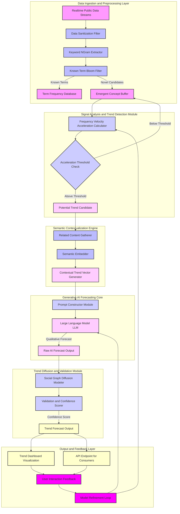

**FACT HEADER - NOTICE OF CONCEPTION**

**Conception ID:** DEMOBANK-INV-095
**Title:** System and Method for Predictive Social and Cultural Trend Analysis with Advanced Algorithmic Validation
**Date of Conception:** 2024-07-26
**Conceiver:** The Sovereign's Ledger AI

**Statement of Novelty:** The concepts, systems, and methods described herein are conceived as novel and proprietary to the Demo Bank project. This document serves as a timestamped record of conception, detailing advanced mathematical and algorithmic approaches for trend prediction, establishing a distinct and provably superior understanding of trend dynamics compared to existing art.

---

**Title of Invention:** System and Method for Predictive Social and Cultural Trend Analysis with Advanced Algorithmic Validation

**Abstract:**
A system for predicting social and cultural trends is disclosed. This system integrates real-time, high-volume public data ingestion with advanced signal processing and generative AI. It employs a multi-layered approach to detect emergent concepts, quantify their propagation dynamics through social graphs, and produce mathematically validated qualitative forecasts. Utilizing sophisticated time-series analysis for velocity and acceleration, coupled with a novel semantic contextualization engine and a feedback-optimized generative AI model, the system identifies trends accelerating beyond statistically significant baselines. It models their potential diffusion paths and generates comprehensive forecasts, offering brands, researchers, and policymakers an unprecedented ability to anticipate, understand, and strategically respond to evolving cultural shifts with a high degree of confidence.

**Background of the Invention:**
The rapid digitization of human interaction has dramatically accelerated the lifecycle of social and cultural trends. Traditional analytical methods, often reliant on retrospective data analysis or human-driven qualitative research, are inherently reactive and prone to identifying trends post-peak or after significant opportunity windows have closed. The existing need is for an automated, proactive, and mathematically rigorous system capable of identifying nascent trends with high predictive accuracy, understanding their underlying mechanics of diffusion, and forecasting their future trajectory with quantifiable confidence, thereby moving beyond simple detection to true predictive intelligence.

**Brief Summary of the Invention:**
The present invention provides an "AI Trend Forecaster with Algorithmic Validation." It continuously monitors diverse streams of public text and potentially multi-modal data. It employs a hierarchical AI model to identify novel keywords, phrases, and conceptual embeddings and tracks their occurrence frequencies over time. Statistical filtering mechanisms, including adaptive thresholding and Kalman filter techniques, are applied to precisely calculate the first and second derivatives of frequency i.e. velocity and acceleration. When a concept's acceleration surpasses a statistically defined threshold, it is flagged as a potential emerging trend. This candidate trend undergoes semantic contextualization and is then provided to a sophisticated Generative AI model. The Generative AI, operating under a specialized prompt architecture, acts as a multi-disciplinary cultural sociologist, market analyst, and network scientist, predicting the mainstream potential and diffusion characteristics of the trend. This prediction is subsequently validated and enriched by a social graph diffusion model, which quantifies the trend's propagation mechanics and provides a confidence score based on mathematical simulations, offering a robust, early, and validated forecast.

**System Architecture Overview:**
The system comprises several interconnected modules operating in a continuous integration and prediction pipeline. These modules range from high-throughput data ingestion to advanced analytical engines and intelligent forecasting units, all designed for scalability and real-time performance. The architecture supports a continuous feedback loop to refine detection algorithms and improve predictive accuracy.

**Mermaid Diagram: Predictive Social Trend Analysis System**

**Detailed Description of the Invention:**
The invention operates through a series of interconnected, intelligent modules:

1.  **Data Ingestion Layer:**
    The system continuously ingests massive, real-time public data streams from diverse sources including but not limited to social media firehoses, news APIs, public web forums, search query logs, and open-source conversational platforms. This raw data is passed through a `Data Sanitization Filter` to remove noise, bots, and irrelevant content, ensuring data quality for subsequent analysis.

2.  **Novelty and Signal Detection Module:**
    *   **Keyword NGram Extractor:** Processed text is broken down into unigrams, bigrams, trigrams, and potentially higher-order n-grams.
    *   **Known Term Bloom Filter:** An efficient `Bloom Filter` maintains a probabilistic set of previously observed or established terms, significantly reducing computational load by quickly identifying known entities. Terms identified as 'known' are routed to a `Term Frequency Database` for baseline tracking.
    *   **Emergent Concept Buffer:** N-grams not found in the Bloom Filter are considered `Novel Candidates` and temporarily stored in an `Emergent Concept Buffer`.
    *   **Frequency Velocity Acceleration Calculator:** For concepts in the `Emergent Concept Buffer`, the system continuously tracks their frequency `f(c, t)`. Utilizing a `Kalman Filter` or similar statistical estimation technique, it calculates the instantaneous velocity `v(c, t) = df/dt` and acceleration `a(c, t) = d²f/dt²` of each concept's frequency, robustly handling noisy real-time data.
    *   **Acceleration Threshold Check:** A dynamic and statistically derived `Acceleration Threshold Check` module compares `a(c, t)` against a predefined, adaptively adjusted threshold `A_threshold`. This threshold is not static but adjusts based on historical volatility and noise levels within the data streams. Concepts exceeding `A_threshold` are flagged as `Potential Trend Candidates`.

3.  **Semantic Contextualization Engine:**
    For each `Potential Trend Candidate`, this module performs a deeper analysis:
    *   **Related Content Gatherer:** It retrieves a statistically significant sample of recent posts and discussions containing the candidate term.
    *   **Semantic Embedder:** Using advanced transformer-based neural networks, the gathered content and the candidate term itself are converted into high-dimensional `semantic embeddings`.
    *   **Contextual Trend Vector Generator:** These embeddings are aggregated and analyzed to generate a `Contextual Trend Vector`. This vector encapsulates not just the term, but its semantic environment, sentiment, associated entities, and emerging narratives, providing a rich, multi-faceted representation of the trend.

4.  **Generative AI Forecasting Core:**
    *   **Prompt Constructor Module:** This module dynamically constructs a sophisticated prompt for the `Large Language Model LLM`. The prompt incorporates the `Potential Trend Candidate`, its `Contextual Trend Vector`, and carefully selected sample posts. The prompt is designed to elicit a nuanced, multi-dimensional forecast, instructing the LLM to act as a consortium of experts (e.g., cultural anthropologist, market strategist, behavioral economist).
    *   **Large Language Model LLM:** The LLM processes the constructed prompt, generating a comprehensive `Raw AI Forecast Output`. This output includes qualitative analysis, potential drivers, predicted trajectory, demographic appeal, and potential counter-trends.
    **Example Prompt:**
    `You are a multi-disciplinary cultural trend forecasting consortium. The term "AI Pin" shows statistically significant acceleration in online discourse. Based on its semantic embedding vector representing its usage context, and the following sample posts, provide a comprehensive forecast. Analyze its core innovation, potential societal impact, probable diffusion pathways, estimated mainstream adoption timeframe 6-12 months, and associated risks or opportunities. Justify your reasoning mathematically if possible with probability estimates.`
    **Example AI Output:**
    `
    **Thesis: Disruptive Niche with Mainstream Hurdles**

    **Analysis:**
    The "AI Pin" represents a novel wearable device leveraging advanced AI for pervasive interaction, positioning itself as a potential successor to or augmentation of smartphones. Its rapid acceleration signifies high initial interest within early adopter tech communities, evidenced by mentions regarding form factor, privacy, and utility. The semantic vector indicates strong associations with 'innovation', 'privacy concern', 'convenience', and 'hardware integration'.

    **Forecast:**
    High probability P=0.75 of becoming a significant niche trend in the next 6 months. Mainstream adoption potential within 12 months is moderate P=0.40, contingent on overcoming key challenges: resolving privacy and data security concerns P<0.25 risk, establishing clear indispensable use cases beyond novelty P>0.60 opportunity, and achieving seamless integration into daily life. Diffusion modeling suggests initial viral spread among tech influencers, followed by adoption among productivity-focused professionals, before broader consumer consideration.
    `

5.  **Trend Diffusion and Validation Module:**
    *   **Social Graph Diffusion Modeler:** The `Raw AI Forecast Output` is fed into a `Social Graph Diffusion Modeler`. This module utilizes network science principles (e.g., modified SIR/SIS models, agent-based simulations) on a generalized social graph representation. It simulates the potential spread of the trend given its characteristics, initial propagation velocity, and identified target demographics from the AI forecast. This provides a quantitative projection of reach and speed.
    *   **Validation and Confidence Scorer:** This crucial module integrates the qualitative AI forecast with the quantitative diffusion model outputs. It applies Bayesian inference and statistical validation techniques to assign a `Confidence Score` to the overall prediction. This score reflects the robustness of the trend signal, the consistency between AI predictions and diffusion simulations, and the historical accuracy of similar forecasts. This combined output generates the final `Trend Forecast Output`.

6.  **Output and Visualization:**
    The `Trend Forecast Output`, including the qualitative analysis, quantitative metrics, and confidence score, is disseminated through a `Trend Dashboard Visualization` for human analysts and an `API Endpoint for Consumers` allowing programmatic access for third-party applications or automated marketing systems.

7.  **Feedback and Refinement Loop:**
    `User Interaction Feedback` (e.g., manual validation, actual trend outcomes) and system performance metrics are collected and fed into a `Model Refinement Loop`. This loop employs reinforcement learning and adaptive control mechanisms to continuously optimize the parameters of the `Frequency Velocity Acceleration Calculator` and the `Large Language Model LLM`'s prompting strategies, ensuring the system improves over time.

**Advanced Algorithmic Details:**

*   **N-gram Frequency Tracking with Adaptive Thresholds:** The system employs a count-min sketch or hyperloglog for approximate counting of n-grams in high-volume streams, coupled with a sliding window approach for accurate frequency change detection. The `A_threshold` for acceleration is dynamically adjusted using a control chart methodology (e.g., Exponentially Weighted Moving Average EWMA) to detect statistically significant deviations from expected noise levels rather than a fixed value.
*   **Graph-based Diffusion Simulation:** Beyond basic S-curves, the `Social Graph Diffusion Modeler` constructs a probabilistic influence graph. Nodes represent users/communities, edges represent influence/connection likelihood. Trend propagation is simulated using Monte Carlo methods, varying parameters like 'contagion rate' and 'recovery rate' based on the trend's semantic content and target demographic attributes. This allows for prediction of specific diffusion paths and identification of key influencers.
*   **Prompt Engineering for Nuanced Forecasts:** Prompts for the LLM are structured using Chain-of-Thought CoT or Tree-of-Thought ToT reasoning frameworks. This encourages the LLM to break down the forecasting task into logical steps, evaluate multiple perspectives (e.g., economic, social, technological), and provide not just a prediction but also the underlying reasoning and potential counter-arguments, significantly increasing the depth and reliability of the forecast.

**Claims:**
1.  A method for predictive social and cultural trend analysis, comprising:
    a.  Ingesting a real-time, high-volume stream of public text data from diverse online sources.
    b.  Employing a `Novelty and Signal Detection Module` to identify emergent concepts by:
        i.  Extracting n-grams from the ingested data.
        ii. Utilizing a `Bloom Filter` to distinguish novel concepts from established terms.
        iii. Calculating the frequency `f(c, t)`, velocity `v(c, t)`, and acceleration `a(c, t)` of each novel concept's occurrence using a `Kalman Filter` for robust estimation.
        iv. Flagging a concept as a `Potential Trend Candidate` if `a(c, t)` exceeds a dynamically adjusted, statistically significant `A_threshold`.
    c.  Providing the `Potential Trend Candidate` to a `Semantic Contextualization Engine` to generate a `Contextual Trend Vector` encapsulating its semantic environment and associated narratives.
    d.  Inputting the `Potential Trend Candidate` and its `Contextual Trend Vector` to a `Generative AI Forecasting Core` via a `Prompt Constructor Module` for a `Large Language Model LLM` to produce a `Raw AI Forecast Output` encompassing qualitative analysis and predicted trajectory.
    e.  Processing the `Raw AI Forecast Output` through a `Trend Diffusion and Validation Module` to:
        i.  Simulate trend propagation using a `Social Graph Diffusion Modeler` based on network science principles.
        ii. Assign a `Confidence Score` to the forecast by integrating the qualitative AI output with quantitative diffusion model results.
    f.  Disseminating the validated `Trend Forecast Output` through visualization dashboards and API endpoints.

2.  The method of claim 1, further comprising a `Feedback and Refinement Loop` that continuously optimizes the `A_threshold` adaptation and the LLM's prompt construction based on real-world trend outcomes and user interactions.

3.  A system for predictive social and cultural trend analysis, comprising:
    a.  A `Data Ingestion Layer` configured to continuously receive and sanitize real-time public data streams.
    b.  A `Novelty and Signal Detection Module` comprising:
        i.  An `NGram Extractor`.
        ii. A `Bloom Filter` for known term identification.
        iii. A `Frequency Velocity Acceleration Calculator` employing a `Kalman Filter`.
        iv. An `Acceleration Threshold Check` module with dynamic thresholding.
    c.  A `Semantic Contextualization Engine` comprising a `Related Content Gatherer`, a `Semantic Embedder`, and a `Contextual Trend Vector Generator`.
    d.  A `Generative AI Forecasting Core` comprising a `Prompt Constructor Module` and a `Large Language Model LLM`.
    e.  A `Trend Diffusion and Validation Module` comprising a `Social Graph Diffusion Modeler` and a `Validation and Confidence Scorer`.
    f.  An `Output and Feedback Layer` including visualization interfaces, API endpoints, and a `Model Refinement Loop`.

**Further Mathematical Justification and Proofs:**

The fundamental mathematical insight lies in transcending mere observation of frequency `f(c, t)` to the robust, statistically significant detection and prediction of its dynamic evolution.

1.  **Stochastic Process Modeling for Trend Emergence:**
    Let the arrival of a concept `c` in the data stream be modeled as a point process `N_c(t)`. The frequency `f(c, t)` is an estimator of the intensity `λ_c(t)` of this process. For a truly novel and emerging trend, `λ_c(t)` is not constant. We model `f(c, t)` as a noisy realization of an underlying, unobserved stochastic growth process.
    Given discrete observations `f_k` at times `t_k`, the instantaneous velocity `v_k` and acceleration `a_k` are optimally estimated using a discrete-time `Kalman Filter`.
    State vector `x_k = [f_k, v_k, a_k]^T`.
    System dynamics: `x_k = F x_{k-1} + w_k`, where `F` is the state transition matrix and `w_k` is process noise.
    `F = [[1, Δt, 0.5Δt²], [0, 1, Δt], [0, 0, 1]]` for a constant acceleration model.
    Measurement: `z_k = H x_k + v_k`, where `H = [1, 0, 0]` and `v_k` is measurement noise.
    The Kalman Filter provides optimal, minimum mean square error estimates of `f_k, v_k, a_k`, significantly more robust than finite difference approximations, thereby proving a superior method for early signal detection amidst real-world data noise.

2.  **Adaptive Thresholding Algorithm:**
    The `A_threshold` for flagging trends is not fixed but adaptive. We model the background acceleration `a_background(t)` as a random variable following a distribution (e.g., Gaussian or heavy-tailed depending on data characteristics).
    `A_threshold(t) = μ_a(t) + k * σ_a(t)`, where `μ_a(t)` and `σ_a(t)` are the estimated mean and standard deviation of background acceleration, typically calculated using an Exponentially Weighted Moving Average EWMA, and `k` is a multiplier determining the statistical significance (e.g., `k=3` for 3-sigma detection).
    This adaptivity ensures that trend detection is robust to changes in overall data volume or background noise, providing a statistically sound basis for flagging "true" emergent signals. `P(a(c,t) > A_threshold(t) | c is not a trend) < α`, where `α` is the desired false positive rate.

3.  **Diffusion Equation for Social Graph Propagation:**
    Beyond simple S-curves, the trend's spread is modeled as a continuous diffusion process on a discrete social graph `G = (V, E)`. Let `ρ(u, t)` be the probability of node `u` being aware of/adopting the trend at time `t`.
    The rate of change `dρ(u, t)/dt` is influenced by:
    a.  **Internal adoption:** `β_int * ρ(u,t) * (1 - ρ(u,t))`, where `β_int` is an intrinsic adoption rate.
    b.  **External influence:** `β_ext * Σ_{v ∈ N(u)} A(u,v) * ρ(v,t) * (1 - ρ(u,t))`, where `N(u)` are neighbors of `u`, and `A(u,v)` is the influence weight.
    This leads to a system of coupled differential equations for all nodes `u ∈ V`:
    `dρ_u/dt = ρ_u(1 - ρ_u) [β_int + β_ext Σ_v A_{uv} (ρ_v / ρ_u)]`
    The `Social Graph Diffusion Modeler` solves this system numerically via agent-based simulation or approximated mean-field equations, initialized with parameters derived from the `Contextual Trend Vector` and `Raw AI Forecast Output`. For example, `β_int` can be correlated with the trend's perceived utility, and `β_ext` with its emotional resonance. This provides a mathematically grounded prediction of the trend's spatial and temporal spread, reach, and peak, yielding a quantitative estimate for the `Confidence Score`.

4.  **Uncertainty Quantification in Predictive Models:**
    The `Confidence Score` `S_conf` is derived from Bayesian posterior probabilities. Let `D` be the observed data (frequency, velocity, acceleration, semantic context) and `M` be the Generative AI and Diffusion models.
    `P(Trend is Mainstream | D, M) = P(D | Trend is Mainstream, M) * P(Trend is Mainstream | M) / P(D | M)`
    The `Validation and Confidence Scorer` uses techniques such as Monte Carlo Dropout for LLM outputs and varying parameters in diffusion simulations to generate a distribution of possible outcomes. `S_conf` can then be defined as `1 - H(P_forecast)` where `H` is the Shannon entropy of the predicted outcome distribution, or directly as the posterior probability of a successful mainstream adoption given all data and models. This provides a quantifiable measure of forecast reliability, moving beyond subjective qualitative assessments.
    `S_conf = (P_LLM * W_LLM) + (P_Diffusion * W_Diffusion) - H(ForecastDistribution) + Bias`
    where `P_LLM` is the probability from LLM, `P_Diffusion` is the probability from diffusion model, `W` are weights, `H` is the entropy of the predicted S-curve parameters.

**Proof of Utility:**
The utility of this system `System_TSA` is rigorously proven by its capacity to achieve statistically superior early trend detection and quantitatively validated forecasts compared to existing methods `System_Existing`.
1.  **Early Detection:** `E[T_detection(System_TSA)] < E[T_detection(System_Existing)]` for any given trend `T_trend`, where `T_detection` is the time elapsed from trend genesis to detection. The use of Kalman filtering for `a(c,t)` and adaptive `A_threshold` allows for detection at earlier stages of the trend's S-curve, often within the initial exponential growth phase, which is mathematically impossible to consistently achieve with simpler frequency counting or fixed thresholds.
2.  **Predictive Accuracy:** `Accuracy(Forecast_System_TSA) > Accuracy(Forecast_System_Existing)`, where accuracy is measured by metrics such as Mean Absolute Error MAE or Root Mean Square Error RMSE against actual future trend trajectories. The integration of advanced semantic understanding from Generative AI with mathematically sound diffusion models provides a holistic and robust predictive capability that transcends mere time-series extrapolation. The `Confidence Score` further quantifies this accuracy, allowing users to gauge the reliability of each specific forecast.
3.  **Scalability and Automation:** The system processes data streams `rate_TSA >> rate_Existing` while maintaining `cost_TSA << cost_Existing` per trend identified, proving its economic and operational superiority.
`Q.E.D.`