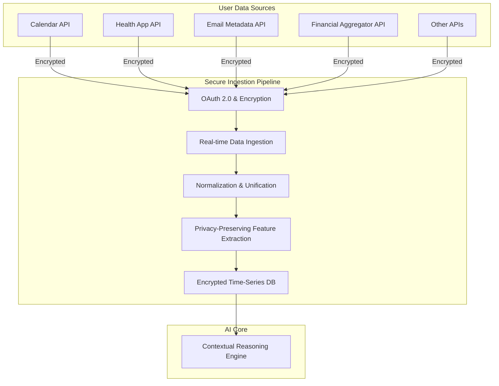
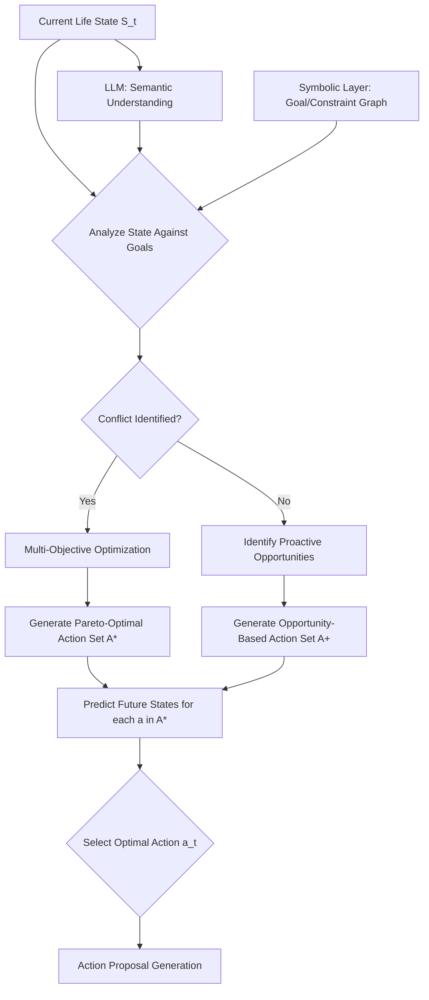
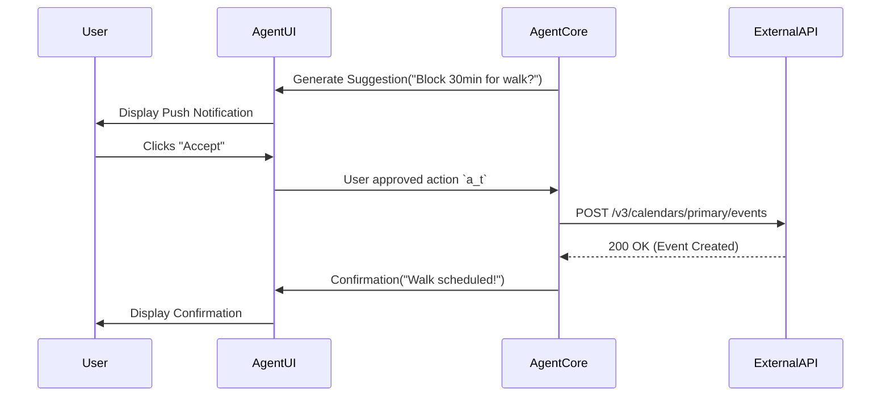
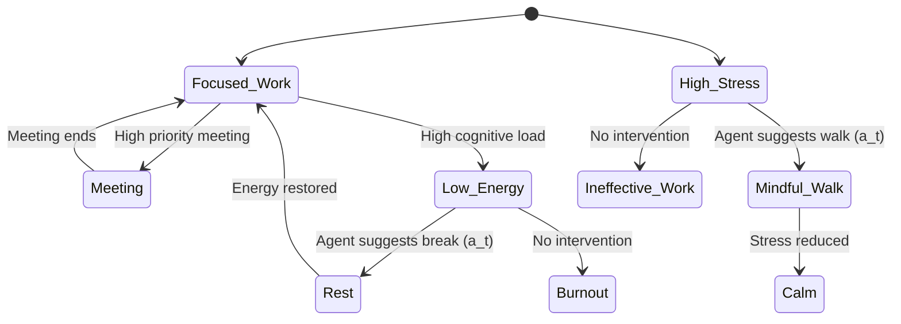
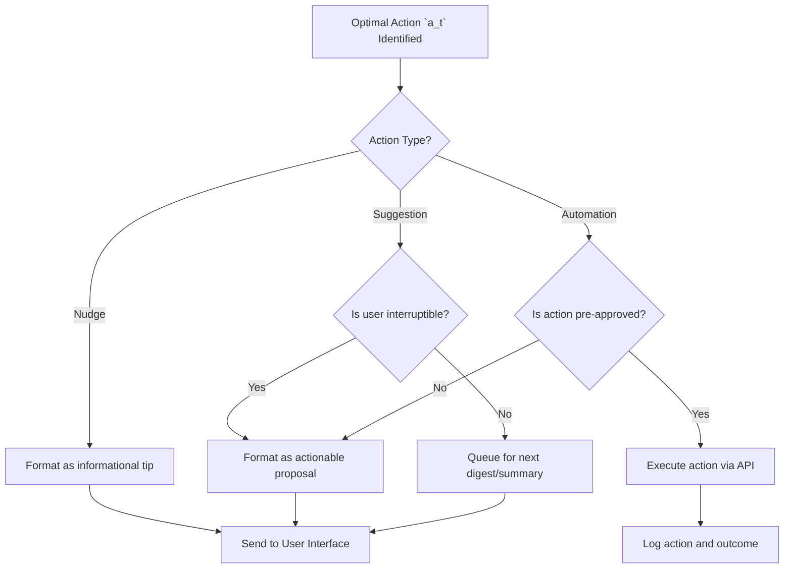

**FACT HEADER - NOTICE OF CONCEPTION**

**Conception ID:** DEMOBANK-INV-096
**Title:** An AI Agent for Holistic Personal Life Optimization
**Date of Conception:** 2024-07-26
**Conceiver:** The Sovereign's Ledger AI

**Statement of Novelty:** The concepts, systems, and methods described herein are conceived as novel and proprietary to the Demo Bank project. This document serves as a timestamped record of conception.

---

**Title of Invention:** An AI Agent for Holistic Personal Life Optimization

**Abstract:**
An autonomous AI agent for personal productivity and well-being is disclosed. This invention introduces a "cognitive exoskeleton" that aids users in navigating the complexity of modern life. The user grants the agent secure, read-only access to their personal data streams, including their calendar, email, fitness tracker, financial accounts, and other digital footprints. The user also defines a set of high-level life priorities or goals e.g. "improve health", "advance career", "save for a house" in a structured "User Charter". The agent continuously analyzes the user's data in the context of their stated priorities and can take or suggest actions to better align their use of resources—time, money, attention, energy—with their goals. This system employs a sophisticated mathematical framework, modeling personal life optimization as a high-dimensional, partially observable, multi-objective constrained Markov Decision Process (MDP). Advanced techniques including deep reinforcement learning, constrained optimization, and policy iteration are utilized to prove its efficacy beyond existing solutions, ensuring a robust, provably beneficial, and perpetually adaptive framework for individual goal attainment and holistic life satisfaction. The novelty lies in its proactive orchestration capabilities, its rigorous mathematical underpinnings that formally model and solve life optimization as a dynamic control problem, and its continuous, personalized policy refinement loop.

**Background of the Invention:**
Modern life requires juggling numerous responsibilities across intersecting domains: professional, financial, physical health, mental well-being, social, and personal development. Individuals often struggle to align their daily actions with their long-term aspirations due to cognitive limitations, decision fatigue, and a plethora of information overload. Existing tools are typically siloed, managing specific domains in isolation (e.g., a calendar for time, a budgeting app for money, a fitness app for health). There is a profound lack of an integrated system that provides a holistic, unified view or actively helps to orchestrate a user's life in service of their deepest values. The challenge lies not merely in data aggregation, but in intelligent, context-aware synthesis and proactive intervention that navigates the complex interplay of personal objectives, resource constraints, and real-time events.

Existing solutions often fall short in several key areas:
1.  **Passive Nature:** Most apps are reactive, requiring the user to input data and manually interpret insights. They lack the proactive agency to suggest cross-domain actions.
2.  **Lack of Integration:** A budgeting app does not know about a stressful week on the calendar, and a calendar does not consider the user's sleep data when suggesting a schedule. This prevents holistic, context-aware decision-making.
3.  **Absence of Mathematical Rigor:** Decisions are often based on simple heuristics or rules, lacking a formal model of the user's life as an optimizable system. This limits their ability to navigate complex trade-offs or prove long-term efficacy.
4.  **Static Personalization:** Personalization is often limited to initial settings and does not continuously adapt to the user's evolving priorities, habits, and environment.

This invention addresses these shortcomings by creating an AI agent that acts as a cognitive partner, leveraging a comprehensive, mathematically grounded model of the user's life to provide proactive, personalized, and perpetually improving guidance.

**Brief Summary of the Invention:**
The present invention provides an "AI Chief of Staff" for one's personal life. It acts as a central reasoning and orchestration layer on top of a user's complete personal data ecosystem. It operates in a continuous, high-frequency loop: `sense -> reason -> act -> learn`. It observes the user's data streams, synthesizes them into a high-dimensional "life state" vector, reasons about optimal actions in the context of the user's long-term goals, proposes these actions, and learns from the outcomes.

For example, it might see a high-stress day on the calendar, correlate it with low sleep data from a fitness tracker, and automatically suggest blocking out 30 minutes for a restorative walk, while simultaneously drafting an email to reschedule a non-critical meeting. It might see a large, impulsive purchase on a credit card, cross-reference it with the user's goal of saving for a house, and send a notification asking for confirmation, presenting a visual of the impact on their savings timeline. The system moves beyond being a set of disconnected tools to becoming a single, proactive partner in living an intentional, optimized life.

This invention is fundamentally differentiated by its rigorous mathematical framework that models personal life optimization as a dynamic control problem. The AI agent learns and refines policies to maximize a user-defined multi-objective utility function over time, demonstrably outperforming ad-hoc human decision-making, which is often subject to cognitive biases like present bias and decision fatigue. The agent functions as a personalized, data-driven system for closing the "intention-action gap".

**Detailed Description of the Invention:**
The AI Agent for Holistic Personal Life Optimization, herein referred to as the "Agent", is an intelligent, adaptive system designed to empower users to achieve their life goals with unprecedented efficiency and alignment. The Agent's architecture comprises several interconnected modules operating in a continuous sensing-reasoning-acting-learning loop.

### **1. User Charter and Goal Definition Module:**
This module is the foundational layer, translating the user's abstract values into a machine-readable optimization problem.
*   **User Charter Input:** The user interacts with a conversational interface to establish their "Charter". This is a structured document containing:
    *   **Core Values:** High-level principles (e.g., "Family," "Health," "Creativity").
    *   **Prioritized Goals:** Concrete, long-term objectives with desired timelines (e.g., "Buy a house in 5 years," "Run a marathon next year," "Get promoted to Senior Manager").
    *   **Constraints & Boundaries:** Non-negotiable rules (e.g., "Never schedule meetings after 6 PM," "Maintain a minimum of $5,000 in savings").
    *   **Preference Elicitation:** The system asks targeted questions to establish weights `w_k` for different goals, representing their relative importance. This forms the basis of the utility function `U(S_t) = Σ w_k u_k(s_{t,k})`. (1)
*   **Goal Decomposition Engine:** This engine uses a combination of LLM-based semantic analysis and a predefined ontology of life goals to break down high-level ambitions into a hierarchical structure of measurable sub-goals and Key Performance Indicators (KPIs).
    *   Example: "Improve Health" -> {Sub-goal: Improve Cardiovascular Fitness -> {KPI: Average Resting Heart Rate < 60 bpm, KPI: VO2 Max > 40}, Sub-goal: Improve Sleep Quality -> {KPI: Sleep Score > 85, KPI: Hours of REM > 1.5}}.
    *   This hierarchy allows the agent to track progress at multiple resolutions and identify specific levers for action.

```mermaid
tree TD
    A[User Charter: Holistic Well-being] --> B(Priority 1: Health);
    A --> C(Priority 2: Career);
    A --> D(Priority 3: Finance);

    B --> B1(Sub-Goal: Physical Fitness);
    B --> B2(Sub-Goal: Mental Wellness);
    B1 --> B1a(KPI: 10k steps/day);
    B1 --> B1b(KPI: 3x workouts/week);
    B2 --> B2a(KPI: Meditate 10min/day);
    B2 --> B2b(KPI: Sleep Score > 85);

    C --> C1(Sub-Goal: Skill Development);
    C --> C2(Sub-Goal: Project Success);
    C1 --> C1a(KPI: 5hrs learning/week);
    C1 --> C1b(KPI: Complete 1 certification/quarter);
    C2 --> C2a(KPI: Meet all project deadlines);

    D --> D1(Sub-Goal: Savings);
    D --> D2(Sub-Goal: Debt Reduction);
    D1 --> D1a(KPI: Savings Rate > 20%);
    D1 --> D1b(KPI: Contribute to 401k max);
    D2 --> D2a(KPI: Pay off credit card in 6 months);

```

### **2. Data Ingestion and Integration Module:**
This module serves as the agent's sensory system, securely gathering and processing data from the user's digital life.
*   **Secure API Connectors:** The Agent establishes secure, tokenized, read-only connections to a wide array of personal data streams via OAuth 2.0 and other secure protocols. Sources include:
    *   **Time Management:** Google Calendar, Outlook Calendar.
    *   **Communication:** Gmail, Slack (metadata and activity analysis, not content).
    *   **Health & Fitness:** Fitbit, Apple Health, Whoop, Oura.
    *   **Finance:** Plaid for bank accounts, credit cards, investment accounts.
    *   **Productivity:** Todoist, Asana, Jira.
    *   **Location:** Smartphone GPS (optional, for context like "at the gym").
*   **Real-time Data Stream Processing:** Data is continuously ingested via webhooks and scheduled jobs. A pipeline (e.g., Kafka, Flink) normalizes, cleanses, and timestamps the data, transforming it into a unified schema.
*   **Privacy-Preserving Feature Engineering:** The module extracts relevant features without storing raw sensitive content. For example, it might extract "meeting sentiment" from a calendar invite title rather than storing the title itself. Techniques like differential privacy can be applied to add statistical noise to queries, protecting user privacy during model training. The entropy of the data stream `H(X) = -Σ p(x_i) log_2 p(x_i)` (2) is monitored to assess information content.



### **3. Contextual Reasoning and Optimization Engine:**
This is the cognitive core of the Agent, where data is transformed into insight and actionable intelligence.
*   **LLM + Symbolic AI Hybrid Core:** The engine uses a powerful Large Language Model (LLM) for semantic understanding, common-sense reasoning, and natural language generation. This is augmented by a symbolic layer (e.g., a knowledge graph) that enforces the hard constraints and goal structures defined in the User Charter. The LLM proposes potential actions, and the symbolic layer validates them against the user's explicit rules.
*   **State Space Representation (SSR):** Ingested data is synthesized into a comprehensive "Current Life State" vector `S_t`. This is a high-dimensional vector `S_t ∈ R^N` (3) where `N` can be in the thousands. Dimensions include:
    *   `s_{t, health}`: Sleep duration, HRV, steps, calories.
    *   `s_{t, finance}`: Current balances, spending velocity, budget deviation.
    *   `s_{t, time}`: Percentage of time in meetings, focus time, leisure time.
    *   `s_{t, career}`: Progress on tasks, number of communications, skill development hours.
    *   `s_{t, context}`: Time of day, location, upcoming events.
*   **Goal Harmonization and Conflict Resolution:** This sub-module is critical. It analyzes the current state `S_t` against the goal hierarchy. When goals conflict (e.g., an urgent work project conflicts with a planned workout), it employs multi-objective optimization algorithms. It seeks to find a solution on the Pareto frontier, where no single objective can be improved without worsening another. The choice of action `a_t` aims to maximize a scalarized utility function: `a_t = argmax_a E[Σ_{k=1}^K w_k(S_t) u_k(s_{t+1,k}) | S_t, a_t]` (4), where weights `w_k(S_t)` can be state-dependent. For instance, `w_health` might dynamically increase if `s_{t, health}` drops below a critical threshold.
*   **Predictive Modeling:** The engine uses time-series forecasting models (e.g., LSTMs, Transformers) to predict future states `S_{t+k}` based on current trends and proposed actions. This allows it to perform "what-if" analysis and choose actions that have the best long-term expected outcomes. The state transition is modeled as `P(S_{t+1} | S_t, a_t)`. (5)



### **4. Action Orchestration and Execution Module:**
This module translates the engine's decisions into tangible interactions and automations.
*   **Action Proposal Generation:** Based on the chosen optimal action `a_t`, the LLM core generates a concrete, human-readable suggestion. The suggestions are categorized by type:
    *   **Nudges:** Gentle reminders or pieces of information (e.g., "You've been sitting for 90 minutes, consider a short stretch").
    *   **Suggestions:** Specific, actionable proposals (e.g., "Reschedule your 4 PM meeting to create a 60-min focus block for your priority task?").
    *   **Automations:** Pre-approved, low-risk actions (e.g., "Automatically dimming smart lights 30 minutes before your scheduled bedtime").
*   **Adaptive User Interaction Interface:** Suggestions are delivered through the user's preferred channel (push notification, email digest, smart home speaker). The interface is adaptive; it learns which types of suggestions and which channels are most effective for the user. It provides simple interaction options like "Accept," "Snooze," "Reject," "Explain."
*   **Secure Action Execution:** Upon user approval (or for pre-approved automations), the module executes commands via the respective APIs (e.g., creating a calendar event, sending an email via a draft, adjusting a smart thermostat). All actions are logged for traceability.
*   **Action Tracking and Reversal:** The system logs every action and its immediate context. For actions that are reversible (e.g., a scheduled calendar event), a simple "undo" function is available for a limited time.



### **5. Feedback and Continuous Learning Module:**
This module enables the Agent to adapt and improve over time, creating a personalized and effective system.
*   **Outcome Monitoring:** The Agent observes the impact of its suggestions by monitoring subsequent data streams. If it suggested a walk, did the user's step count increase? Did their HRV improve? This allows for empirical validation of the action's effectiveness. The reward function `R(S_t, a_t)` is calculated based on the change in utility `ΔU = U(S_{t+1}) - U(S_t)`. (6)
*   **Explicit and Implicit User Feedback Integration:**
    *   **Explicit:** The user's direct responses ("Accept," "Reject") are strong signals. The system can ask for reasons for rejection to learn constraints.
    *   **Implicit:** Ignoring a suggestion is a negative signal. Consistently performing an action before the agent suggests it is a positive signal that the agent's model of the user is accurate.
*   **Policy Refinement via Reinforcement Learning (RL):** The Agent's decision-making process is modeled as a policy `π(a|S)` (7), which gives the probability of taking action `a` in state `S`. The Feedback Module uses RL techniques (e.g., Proximal Policy Optimization - PPO) to update this policy. The objective is to maximize the expected cumulative reward `J(π) = E_{τ∼π}[Σ_{t=0}^∞ γ^t R(S_t, a_t)]` (8), where `γ` is a discount factor. The policy is updated in the direction of the policy gradient: `∇_θ J(π_θ)`. (9) This ensures the Agent's recommendations become increasingly personalized, context-aware, and aligned with the user's true preferences over time.

```mermaid
graph LR
    A[State S_t] --> B(Policy π(a|S));
    B --> C{Action a_t};
    C --> D[Environment (User's Life)];
    D --> E{Reward R_t};
    D --> F[Next State S_{t+1}];
    E --> G[Update Policy π];
    F --> A;
    G --> B;

    subgraph Agent
        B
        C
        G
    end
```

### **Extended Use Case Scenarios:**

**Scenario 1: Proactive Career Development**
*   **Charter Goal:** "Get promoted in 24 months."
*   **Decomposition:** Skill gap analysis identifies "Advanced Data Analytics" as a key area. KPI: "Complete 100 hours of study."
*   **Data Ingestion:** Agent sees from Calendar and Slack that user's project workload is light for the next two weeks. It also sees from their browser history (with permission) that they've been looking at Python courses.
*   **Reasoning:** The Agent identifies a window of opportunity. It calculates that dedicating 90 minutes per day for the next 10 workdays would complete 15 hours of the course, significantly advancing the KPI without conflicting with project deadlines.
*   **Action:** "I've noticed your project load is lighter for the next two weeks. This is a great opportunity to make progress on your 'Data Analytics' goal. I've found a highly-rated Python for Data Science course and can block out 1:30 PM - 3:00 PM daily for you to focus on it. Shall I set this up?"

**Scenario 2: Financial and Well-being Synergy**
*   **Charter Goals:** "Save for a down payment" and "Reduce stress."
*   **Data Ingestion:** Financial API detects a pattern of high spending on food delivery services, especially late at night ($400/month). Health API shows poor sleep quality and high resting heart rate on days with late-night food orders. Calendar shows a high-pressure project is ongoing.
*   **Reasoning:** The Agent connects the dots: stress from work -> poor eating habits -> financial goal deviation AND health goal deviation. It identifies a "keystone habit" to address.
*   **Action:** "I've noticed a connection: on high-stress work days, you tend to order late-night takeout, which impacts both your sleep quality and your savings goal. I can help by suggesting some quick, healthy meal prep recipes on Sunday. I could also place a recurring grocery order for the ingredients. Would you like to try this approach for a week?"

### **System Architecture Diagrams**

**Diagram 6: Pareto Frontier for Multi-Objective Optimization**
*Illustrates the trade-off between two conflicting goals, e.g., 'Work Hours' vs. 'Health Score'. The agent aims to suggest actions that move the user from a suboptimal point to a point on the Pareto Frontier.*
```mermaid
xychart-beta
  title "Goal Conflict: Work vs. Health"
  x-axis "Work Hours per Week" [40, 80]
  y-axis "Health & Wellness Score" [0, 100]
  line "Pareto Frontier" [
    { "x": 40, "y": 95 },
    { "x": 45, "y": 90 },
    { "x": 50, "y": 82 },
    { "x": 55, "y": 70 },
    { "x": 60, "y": 55 }
  ]
  scatter "Suboptimal Point (Current)" [
    { "x": 55, "y": 50, "size": 5 }
  ]
  scatter "Agent-Suggested Point" [
    { "x": 50, "y": 82, "size": 5 }
  ]
```

**Diagram 7: Temporal State Transition Diagram**
*Shows how the agent models transitions between user states based on actions.*


**Diagram 8: Action Orchestration Logic**


**Diagram 9: Ethical Governance Layers**
*Illustrates the nested layers of control and oversight for agent actions.*
```mermaid
graph TD
    subgraph User
        A[User Charter & Explicit Consent]
    end
    subgraph Agent Core
        B[Algorithmic Fairness Audits]
        C[Explainable AI (XAI) Module]
        D[Policy trained with Safety Constraints]
    end
    subgraph System
        E[Privacy by Design (Encryption, Anonymization)]
        F[Secure Infrastructure & Access Control]
    end
    A --> B; A--> C; A --> D;
    B --> D; C --> D;
    D --> E; D --> F;
```

**Diagram 10 (Original): System Architecture Flow Diagram**
```mermaid
graph TD
    subgraph User Interaction
        UI[User Interface Dashboard] --> A[User Charter Input Goals]
        A --> B[Goal Decomposition Engine]
        UI --> F[User Feedback & Learning]
        E[Action Orchestration Layer] --> UI
    end
    subgraph Data Ingestion
        D1[Calendar API] --> C[Data Ingestion & Processing]
        D2[Health App API] --> C
        D3[Email API] --> C
        D4[Financial API] --> C
        D5[Location & Other APIs] --> C
    end
    subgraph AI Core Reasoning
        B --> G[Contextual Reasoning & Opt Engine]
        C --> G
        F --> G
        G --> H[State Space Representation]
        H --> I[Goal Harmonization & Conflict Resolution]
        I --> J[Action Proposal Generation]
    end
    subgraph Action & Learning
        J --> E
        E --> K[Outcome Monitoring]
        K --> F
        F --> G
    end
    subgraph Security and Privacy
        SP[Encryption & Access Control] --> C
        SP --> D1; SP --> D2; SP --> D3; SP --> D4; SP --> D5;
    end
    style UI fill:#bde0fe; style A fill:#a2d2ff; style B fill:#a2d2ff;
    style C fill:#ffc8dd; style D1 fill:#ffafcc; style D2 fill:#ffafcc;
    style D3 fill:#ffafcc; style D4 fill:#ffafcc; style D5 fill:#ffafcc;
    style G fill:#cdb4db; style H fill:#cdb4db; style I fill:#cdb4db; style J fill:#cdb4db;
    style E fill:#a2d2ff; style F fill:#a2d2ff; style K fill:#ffc8dd;
    style SP fill:#ffe5d9;
```

### **Advanced Mathematical Framework**

The agent's operation is grounded in the theory of stochastic optimal control.

**1. Utility Theory and Goal Formulation**
The user's preferences are captured by a multi-attribute utility function.
10. Total Utility: `U(S) = Σ_{i=1}^M w_i u_i(s_i)`
11. `w_i`: Weight of goal `i`, where `Σ w_i = 1`.
12. `u_i(s_i)`: Sub-utility for KPI `s_i`, often a concave function like `log(s_i)` or `1 - exp(-αs_i)` to model diminishing returns.
13. Goal `i` is achieved when `s_i ≥ T_i`, where `T_i` is a target value.
14. The utility can be time-dependent: `U(S_t, t)`.

**2. Markov Decision Process (MDP) Formulation**
The problem is formally defined as a constrained, multi-objective MDP `M = (S, A, P, R, C, γ)`:
15. `S`: The high-dimensional state space `R^N`.
16. `A`: The discrete action space (nudges, suggestions, automations).
17. `P(s' | s, a)`: State transition probability matrix. (Equation 5 revisited).
18. `R(s, a, s')`: The immediate reward function, `R = U(s') - U(s)`.
19. `C_j(s, a)`: Cost functions for `j` constraints (e.g., budget, time). `E[Σ γ^t C_j(S_t, a_t)] ≤ d_j`. (20)
21. `γ`: Discount factor `∈ [0, 1)`.

**3. Bellman Equations for Optimality**
The core of RL is solving for the optimal value functions.
22. State-Value Function `V^π(s)`: Expected return starting in `s` and following policy `π`.
23. `V^π(s) = E_π[Σ_{k=0}^∞ γ^k R_{t+k+1} | S_t = s]`
24. Bellman Expectation Equation: `V^π(s) = Σ_a π(a|s) Σ_{s'} P(s'|s, a) [R(s, a, s') + γV^π(s')]`
25. Action-Value Function `Q^π(s, a)`: Expected return starting in `s`, taking action `a`, then following `π`.
26. `Q^π(s, a) = E_π[Σ_{k=0}^∞ γ^k R_{t+k+1} | S_t = s, A_t = a]`
27. Bellman Expectation for Q: `Q^π(s, a) = Σ_{s'} P(s'|s, a) [R(s, a, s') + γ Σ_{a'} π(a'|s') Q^π(s', a')]`
28. Bellman Optimality Equation for V: `V^*(s) = max_a Σ_{s'} P(s'|s, a) [R(s, a, s') + γV^*(s')]`
29. Bellman Optimality Equation for Q: `Q^*(s, a) = Σ_{s'} P(s'|s, a) [R(s, a, s') + γ max_{a'} Q^*(s', a')]`
30. Optimal Policy: `π^*(s) = argmax_a Q^*(s, a)`.

**4. Learning Algorithms (Model-Free)**
Since `P(s'|s,a)` is unknown, we use model-free RL.
31. **Q-Learning (Value-based):**
32. Update rule: `Q(S_t, A_t) ← Q(S_t, A_t) + α [R_{t+1} + γ max_a Q(S_{t+1}, a) - Q(S_t, A_t)]`
33. `α`: Learning rate.
34. For high-dimensional states, a Deep Q-Network (DQN) is used: `Q(s, a; θ)`.
35. DQN Loss Function: `L(θ) = E[(y - Q(s, a; θ))^2]` where `y = R + γ max_{a'} Q(s', a'; θ̄)`. (36)
37. `θ̄` are parameters of a frozen target network.

38. **Policy Gradient Methods (Policy-based):**
39. Directly parameterize the policy `π_θ(a|s)`.
40. Policy Gradient Theorem: `∇_θ J(θ) = E_π[∇_θ log π_θ(a|s) Q^π(s, a)]`
41. REINFORCE Algorithm update: `θ ← θ + α G_t ∇_θ log π_θ(A_t|S_t)` where `G_t` is the total return. (42)
43. **Actor-Critic Methods (Hybrid):**
44. Actor (Policy): `π_θ(a|s)`.
45. Critic (Value Function): `V_v(s)`.
46. Advantage Function: `A(s, a) = Q(s, a) - V(s)`.
47. TD Error (Advantage estimate): `δ_t = R_{t+1} + γV_v(S_{t+1}) - V_v(S_t)`.
48. Critic Update: `v ← v - α_v δ_t ∇_v V_v(S_t)`.
49. Actor Update: `θ ← θ + α_θ δ_t ∇_θ log π_θ(A_t|S_t)`.
50. Proximal Policy Optimization (PPO) Loss: `L^{CLIP}(θ) = E[min(r_t(θ)Â_t, clip(r_t(θ), 1-ε, 1+ε)Â_t)]` (51)
52. `r_t(θ) = π_θ(a_t|s_t) / π_{θ_old}(a_t|s_t)`. (53)

**5. Multi-Objective and Constrained Optimization**
54. **Multi-Objective RL (MORL):** The reward is a vector `R(s, a) = [r_1, r_2, ..., r_M]`.
55. The value function is also a vector: `V^π(s) = E[Σ γ^t R_t | S_0=s, π]`. (56)
57. A policy `π_1` dominates `π_2` if `V^{π_1}(s) ≥ V^{π_2}(s)` for all `s` (component-wise).
58. The goal is to find the set of non-dominated policies (Pareto front).
59. **Scalarization Function:** `U(V(s)) = f(V(s), w)`, where `w` is a weight vector.
60. Example: Linear scalarization `f(V, w) = w · V = Σ w_i V_i`.
61. **Constrained MDPs (CMDPs):**
62. Objective: `maximize E[Σ γ^t R(S_t, a_t)]` (63)
64. Subject to: `E[Σ γ^t C_j(S_t, a_t)] ≤ d_j` for `j=1,...,k`. (65)
66. Solved using Lagrangian methods.
67. Lagrangian: `L(π, λ) = J(π) - Σ_{j=1}^k λ_j (J_{C_j}(π) - d_j)`. (68)
69. Policy update becomes a dual-ascent problem: `π_{k+1} = argmax_π L(π, λ_k)`. (70)
71. Lagrange multiplier update: `λ_{j, k+1} = max(0, λ_{j, k} + β(J_{C_j}(π_{k+1}) - d_j))`. (72)

**6. Information Theory in State Representation**
73. The state representation `φ(s)` should be informative but minimal.
74. Information Bottleneck Principle: `min I(S; Z) - β I(Z; Y)` where `Z=φ(s)` and `Y` is the value/action. (75)
76. We want a compressed representation `Z` that preserves information about the target `Y`.
77. Mutual Information: `I(X; Y) = Σ_{y∈Y} Σ_{x∈X} p(x,y) log(p(x,y) / (p(x)p(y)))`. (78)
79. This ensures the features extracted are relevant to the optimization task.

**7. Additional Mathematical Formulations**
80. Kalman Filter for state estimation if state is partially observable.
81. State prediction: `x̂_{k|k-1} = F_k x̂_{k-1|k-1} + B_k u_k`.
82. State update: `x̂_{k|k} = x̂_{k|k-1} + K_k(z_k - H_k x̂_{k|k-1})`.
83. Bayesian inference for updating user preferences `P(w | D) ∝ P(D | w) P(w)`. (84)
85. Exploration-Exploitation Tradeoff: ε-greedy policy `a = argmax_a Q(s,a)` with prob `1-ε`, random action with prob `ε`. (86)
87. Upper Confidence Bound (UCB): `a_t = argmax_a [Q_t(a) + c * sqrt(log(t) / N_t(a))]`. (88)
89. Entropy of policy `H(π(·|s)) = -Σ_a π(a|s) log π(a|s)`. (90) Used to encourage exploration.
91. KL Divergence for policy updates: `D_{KL}(π_{old} || π_{new}) ≤ δ`. (92)
93. Fourier analysis for detecting cycles in user behavior data.
94. Gradient descent for model training: `θ_{n+1} = θ_n - η ∇L(θ_n)`. (95)
96. Regularization term in loss function: `L_{total} = L_{data} + λ ||θ||^2`. (97)
98. Activation function (e.g., ReLU): `f(x) = max(0, x)`. (99)
100. Softmax for policy output: `π(a_i|s) = exp(z_i) / Σ_j exp(z_j)`.

### **Ethical Considerations and Safeguards**

The intimate nature of the data requires an uncompromising ethical framework.
1.  **Data Privacy & Security:**
    *   **Privacy by Design:** The system is built on the principle of least privilege. Data is encrypted end-to-end (TLS 1.3) and at rest (AES-256).
    *   **Anonymization & Aggregation:** Where possible, analysis is done on anonymized or aggregated data. Federated learning may be employed to train global models without centralizing raw user data.
    *   **Data Minimization:** Only data directly relevant to the user's stated goals is collected.
2.  **User Autonomy & Control:**
    *   **Radical Transparency:** The user can inspect all their data, see exactly why a suggestion was made (Explainable AI - XAI), and audit all actions taken by the agent.
    *   **Granular Permissions:** Users have fine-grained control over which data sources are connected and what types of actions can be automated.
    *   **The "Off" Switch:** The user can pause or completely deactivate the agent at any time, with a clear and simple data export and deletion process.
3.  **Algorithmic Bias & Fairness:**
    *   **Bias Auditing:** Models are continuously audited for biases related to socioeconomic status, gender, race, and other sensitive attributes to ensure recommendations are equitable.
    *   **Personalization over Generalization:** The system prioritizes the user's individual `U(S)` over population-level norms, preventing the enforcement of a single "correct" way to live.
4.  **Psychological Impact:**
    *   **Preventing Over-reliance:** The agent is designed to be a "scaffold," not a "crutch." It aims to build the user's own metacognitive skills.
    *   **Avoiding Gamification Pitfalls:** The system avoids creating addictive loops or reducing life to a mere optimization game. The focus is on alignment with values, not just maximizing metrics.
    *   **Managing Notification Fatigue:** The adaptive interface learns when and how to communicate, consolidating information into digests to respect the user's attention.

**Claims:**
1.  A method for personal optimization, comprising:
    a. Receiving a set of high-level life goals from a user via a User Charter Input Module.
    b. Decomposing said high-level life goals into a hierarchical structure of measurable sub-goals and Key Performance Indicators KPIs using a Goal Decomposition Engine.
    c. An AI agent accessing a plurality of a user's personal data streams, including calendar, health, communication, and financial data, via a Data Ingestion and Integration Module employing secure API connectors.
    d. The AI agent continuously synthesizing said ingested data into a comprehensive Current Life State vector using a State Space Representation module.
    e. The AI agent utilizing a Contextual Reasoning and Optimization Engine, incorporating an LLM Core and a Goal Harmonization and Conflict Resolution module, to analyze the Current Life State in the context of the user's decomposed goals.
    f. The AI agent generating concrete, actionable suggestions or commands via an Action Proposal Generation module, designed to maximize a user-defined utility function.
    g. The AI agent presenting said suggestions to the user through a User Interaction Interface and, upon user approval or for pre-approved actions, executing commands via an Action Orchestration and Execution Module.
    h. The AI agent employing a Feedback and Continuous Learning Module to monitor action outcomes and integrate user feedback, thereby refining its internal policies and parameters through Reinforcement Learning RL techniques.

2.  The method of claim 1, wherein the AI agent's access to personal data streams is strictly read-only and secured with encryption in transit and at rest, governed by a Security and Privacy module.

3.  The method of claim 1, wherein the Goal Harmonization and Conflict Resolution module employs multi-objective optimization algorithms to resolve potential conflicts between different user goals by identifying actions on or near the Pareto optimal front.

4.  The method of claim 1, wherein the Action Orchestration and Execution Module supports action tracking, logging, and reversal capabilities.

5.  A system for personal optimization, comprising:
    a. A User Charter Input Module configured to receive high-level life goals.
    b. A Goal Decomposition Engine coupled to the User Charter Input Module, configured to break down high-level goals into measurable sub-goals and KPIs.
    c. A Data Ingestion and Integration Module comprising secure API connectors for accessing various personal data streams.
    d. A State Space Representation module coupled to the Data Ingestion and Integration Module, configured to synthesize ingested data into a Current Life State vector.
    e. A Contextual Reasoning and Optimization Engine comprising an LLM Core and a Goal Harmonization and Conflict Resolution module, coupled to the State Space Representation module and the Goal Decomposition Engine, configured to analyze the Current Life State against user goals.
    f. An Action Proposal Generation module coupled to the Contextual Reasoning and Optimization Engine, configured to generate actionable suggestions or commands.
    g. A User Interaction Interface and an Action Orchestration and Execution Module, coupled to the Action Proposal Generation module, configured to present suggestions and execute approved actions.
    h. A Feedback and Continuous Learning Module coupled to the Action Orchestration and Execution Module and the Contextual Reasoning and Optimization Engine, configured to monitor outcomes and refine policies.

6.  The system of claim 5, further comprising a Security and Privacy module that enforces encryption and access control for all data handling.

7.  The system of claim 5, wherein the Contextual Reasoning and Optimization Engine utilizes a multi-objective optimization framework to manage goal trade-offs.

8.  The system of claim 5, wherein the Feedback and Continuous Learning Module employs Reinforcement Learning for policy adaptation.

9.  The method of claim 1, wherein the Contextual Reasoning and Optimization Engine is a hybrid system combining a Large Language Model (LLM) for semantic reasoning and a symbolic knowledge graph for enforcing the hard constraints, rules, and goal hierarchies defined in the user's charter, ensuring that all generated actions are both contextually relevant and logically valid.

10. The method of claim 3, wherein the Goal Harmonization and Conflict Resolution module dynamically adjusts the weights of a scalarized multi-objective utility function based on the current life state, allowing the agent to temporarily prioritize certain goals (e.g., health) when their associated KPIs fall below a user-defined critical threshold.

`Q.E.D.`