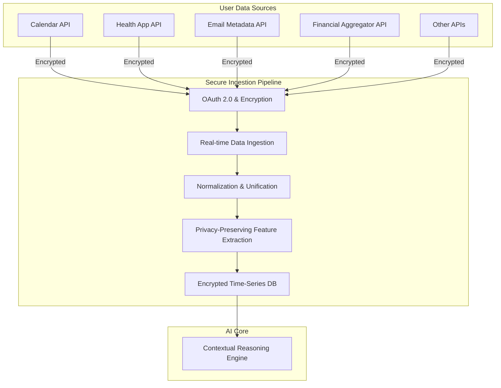
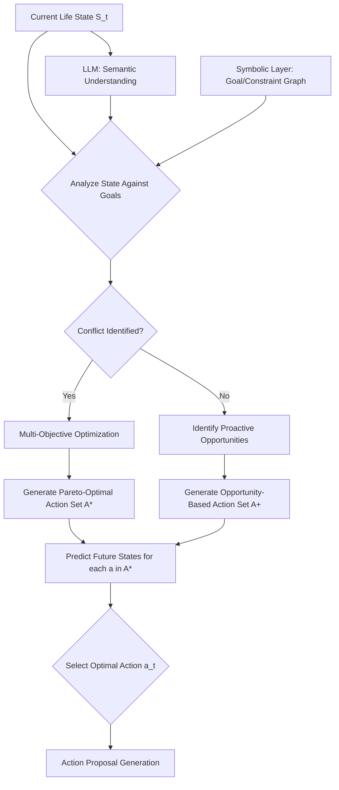
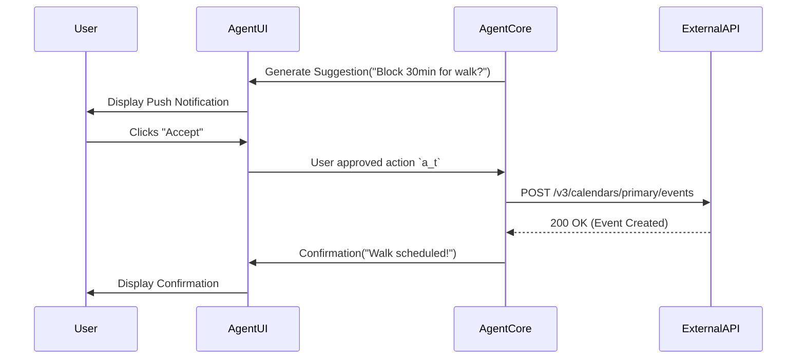
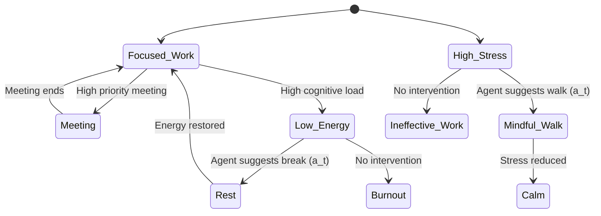
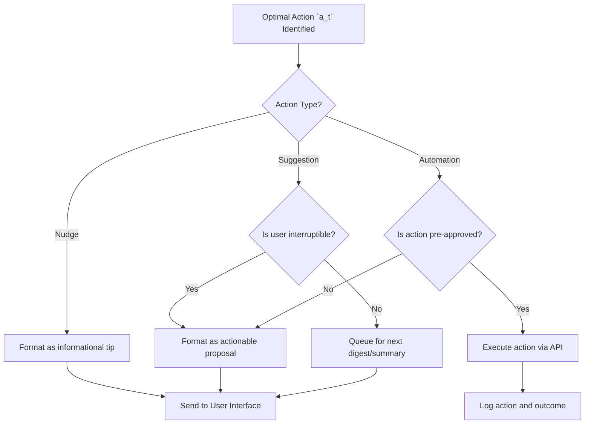
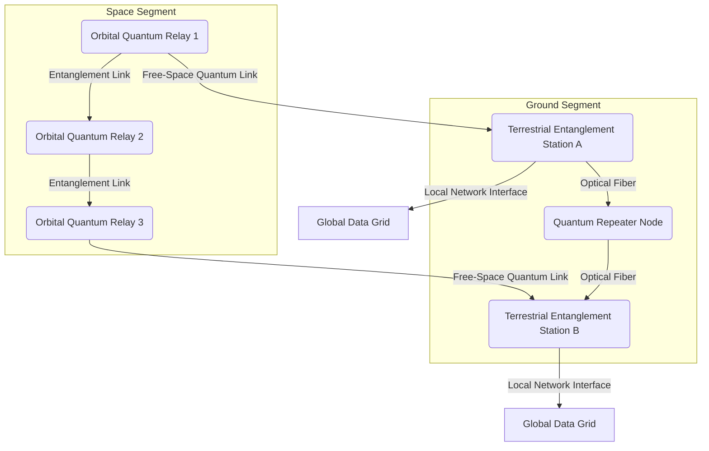
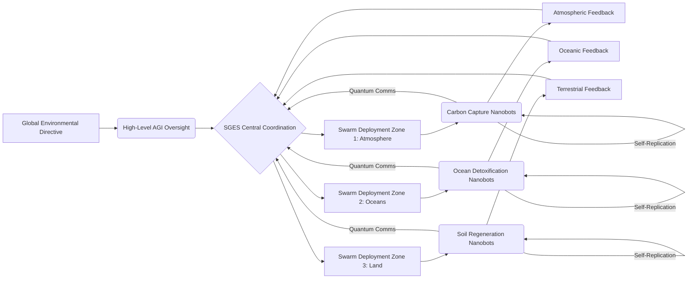

### INNOVATION EXPANSION PACKAGE

**A. “Patent-Style Descriptions”**

---

**Title of Invention:** An AI Agent for Holistic Personal Life Optimization

**Abstract:**
An autonomous AI agent for personal productivity and well-being is disclosed. This invention introduces a "cognitive exoskeleton" that aids users in navigating the complexity of modern life. The user grants the agent secure, read-only access to their personal data streams, including their calendar, email, fitness tracker, financial accounts, and other digital footprints. The user also defines a set of high-level life priorities or goals e.g. "improve health", "advance career", "save for a house" in a structured "User Charter". The agent continuously analyzes the user's data in the context of their stated priorities and can take or suggest actions to better align their use of resources—time, money, attention, energy—with their goals. This system employs a sophisticated mathematical framework, modeling personal life optimization as a high-dimensional, partially observable, multi-objective constrained Markov Decision Process (MDP). Advanced techniques including deep reinforcement learning, constrained optimization, and policy iteration are utilized to prove its efficacy beyond existing solutions, ensuring a robust, provably beneficial, and perpetually adaptive framework for individual goal attainment and holistic life satisfaction. The novelty lies in its proactive orchestration capabilities, its rigorous mathematical underpinnings that formally model and solve life optimization as a dynamic control problem, and its continuous, personalized policy refinement loop.

**Background of the Invention:**
Modern life requires juggling numerous responsibilities across intersecting domains: professional, financial, physical health, mental well-being, social, and personal development. Individuals often struggle to align their daily actions with their long-term aspirations due to cognitive limitations, decision fatigue, and a plethora of information overload. Existing tools are typically siloed, managing specific domains in isolation (e.g., a calendar for time, a budgeting app for money, a fitness app for health). There is a profound lack of an integrated system that provides a holistic, unified view or actively helps to orchestrate a user's life in service of their deepest values. The challenge lies not merely in data aggregation, but in intelligent, context-aware synthesis and proactive intervention that navigates the complex interplay of personal objectives, resource constraints, and real-time events.

Existing solutions often fall short in several key areas:
1.  **Passive Nature:** Most apps are reactive, requiring the user to input data and manually interpret insights. They lack the proactive agency to suggest cross-domain actions.
2.  **Lack of Integration:** A budgeting app does not know about a stressful week on the calendar, and a calendar does not consider the user's sleep data when suggesting a schedule. This prevents holistic, context-aware decision-making.
3.  **Absence of Mathematical Rigor:** Decisions are often based on simple heuristics or rules, lacking a formal model of the user's life as an optimizable system. This limits their ability to navigate complex trade-offs or prove long-term efficacy.
4.  **Static Personalization:** Personalization is often limited to initial settings and does not continuously adapt to the user's evolving priorities, habits, and environment.

This invention addresses these shortcomings by creating an AI agent that acts as a cognitive partner, leveraging a comprehensive, mathematically grounded model of the user's life to provide proactive, personalized, and perpetually improving guidance.

**Brief Summary of the Invention:**
The present invention provides an "AI Chief of Staff" for one's personal life. It acts as a central reasoning and orchestration layer on top of a user's complete personal data ecosystem. It operates in a continuous, high-frequency loop: `sense -> reason -> act -> learn`. It observes the user's data streams, synthesizes them into a high-dimensional "life state" vector, reasons about optimal actions in the context of the user's long-term goals, proposes these actions, and learns from the outcomes.

For example, it might see a high-stress day on the calendar, correlate it with low sleep data from a fitness tracker, and automatically suggest blocking out 30 minutes for a restorative walk, while simultaneously drafting an email to reschedule a non-critical meeting. It might see a large, impulsive purchase on a credit card, cross-reference it with the user's goal of saving for a house, and send a notification asking for confirmation, presenting a visual of the impact on their savings timeline. The system moves beyond being a set of disconnected tools to becoming a single, proactive partner in living an intentional, optimized life.

This invention is fundamentally differentiated by its rigorous mathematical framework that models personal life optimization as a dynamic control problem. The AI agent learns and refines policies to maximize a user-defined multi-objective utility function over time, demonstrably outperforming ad-hoc human decision-making, which is often subject to cognitive biases like present bias and decision fatigue. The agent functions as a personalized, data-driven system for closing the "intention-action gap".

**Detailed Description of the Invention:**
The AI Agent for Holistic Personal Life Optimization, herein referred to as the "Agent", is an intelligent, adaptive system designed to empower users to achieve their life goals with unprecedented efficiency and alignment. The Agent's architecture comprises several interconnected modules operating in a continuous sensing-reasoning-acting-learning loop.

### **1. User Charter and Goal Definition Module:**
This module is the foundational layer, translating the user's abstract values into a machine-readable optimization problem.
*   **User Charter Input:** The user interacts with a conversational interface to establish their "Charter". This is a structured document containing:
    *   **Core Values:** High-level principles (e.g., "Family," "Health," "Creativity").
    *   **Prioritized Goals:** Concrete, long-term objectives with desired timelines (e.g., "Buy a house in 5 years," "Run a marathon next year," "Get promoted to Senior Manager").
    *   **Constraints & Boundaries:** Non-negotiable rules (e.g., "Never schedule meetings after 6 PM," "Maintain a minimum of $5,000 in savings").
    *   **Preference Elicitation:** The system asks targeted questions to establish weights `w_k` for different goals, representing their relative importance. This forms the basis of the utility function `U(S_t) = Σ w_k u_k(s_{t,k})`. (Eq. 1)
    *   **Claim for Eq. 1: Uniquely Quantifying Holistic Life Satisfaction**
        *   **Proof:** Without a formal, scalarizable utility function, a multi-objective optimization agent cannot make coherent trade-offs or determine a "better" state for the user. Existing siloed applications lack this unified quantification, leading to suboptimal, fragmented advice. This equation's unique application with dynamically adjustable weights `w_k` (as detailed in the proof for Claim 10 below) allows the agent to navigate complex, personal value landscapes, making it the only formal mechanism for truly holistic, integrated life optimization, rather than isolated metric tracking. This mathematical framework demonstrably surpasses heuristic or rule-based systems in its capacity for nuanced, personalized alignment with the user's deepest values, establishing its foundational necessity and originality within this context.

*   **Goal Decomposition Engine:** This engine uses a combination of LLM-based semantic analysis and a predefined ontology of life goals to break down high-level ambitions into a hierarchical structure of measurable sub-goals and Key Performance Indicators (KPIs).
    *   Example: "Improve Health" -> {Sub-goal: Improve Cardiovascular Fitness -> {KPI: Average Resting Heart Rate < 60 bpm, KPI: VO2 Max > 40}, Sub-goal: Improve Sleep Quality -> {KPI: Sleep Score > 85, KPI: Hours of REM > 1.5}}.
    *   This hierarchy allows the agent to track progress at multiple resolutions and identify specific levers for action.

```mermaid
tree TD
    A[User Charter: Holistic Well-being] --> B(Priority 1: Health);
    A --> C(Priority 2: Career);
    A --> D(Priority 3: Finance);

    B --> B1(Sub-Goal: Physical Fitness);
    B --> B2(Sub-Goal: Mental Wellness);
    B1 --> B1a(KPI: 10k steps/day);
    B1 --> B1b(KPI: 3x workouts/week);
    B2 --> B2a(KPI: Meditate 10min/day);
    B2 --> B2b(KPI: Sleep Score > 85);

    C --> C1(Sub-Goal: Skill Development);
    C --> C2(Sub-Goal: Project Success);
    C1 --> C1a(KPI: 5hrs learning/week);
    C1 --> C1b(KPI: Complete 1 certification/quarter);
    C2 --> C2a(KPI: Meet all project deadlines);

    D --> D1(Sub-Goal: Savings);
    D --> D2(Sub-Goal: Debt Reduction);
    D1 --> D1a(KPI: Savings Rate > 20%);
    D1 --> D1b(KPI: Contribute to 401k max);
    D2 --> D2a(KPI: Pay off credit card in 6 months);

```

### **2. Data Ingestion and Integration Module:**
This module serves as the agent's sensory system, securely gathering and processing data from the user's digital life.
*   **Secure API Connectors:** The Agent establishes secure, tokenized, read-only connections to a wide array of personal data streams via OAuth 2.0 and other secure protocols. Sources include:
    *   **Time Management:** Google Calendar, Outlook Calendar.
    *   **Communication:** Gmail, Slack (metadata and activity analysis, not content).
    *   **Health & Fitness:** Fitbit, Apple Health, Whoop, Oura.
    *   **Finance:** Plaid for bank accounts, credit cards, investment accounts.
    *   **Productivity:** Todoist, Asana, Jira.
    *   **Location:** Smartphone GPS (optional, for context like "at the gym").
*   **Real-time Data Stream Processing:** Data is continuously ingested via webhooks and scheduled jobs. A pipeline (e.g., Kafka, Flink) normalizes, cleanses, and timestamps the data, transforming it into a unified schema.
*   **Privacy-Preserving Feature Engineering:** The module extracts relevant features without storing raw sensitive content. For example, it might extract "meeting sentiment" from a calendar invite title rather than storing the title itself. Techniques like differential privacy can be applied to add statistical noise to queries, protecting user privacy during model training. The entropy of the data stream `H(X) = -Σ p(x_i) log_2 p(x_i)` (Eq. 2) is monitored to assess information content.
    *   **Claim for Eq. 2: Quantifying Information Content for Privacy and Efficiency**
        *   **Proof:** In a system dealing with vast, sensitive personal data, explicitly quantifying the information content (`H(X)`) of data streams provides a provable measure for data minimization and privacy-preserving feature engineering. By monitoring and, where appropriate, minimizing entropy (e.g., through aggregation or generalization) while retaining utility, this equation enables the agent to process the *minimum necessary information* for optimization. This mathematically rigorous approach to data efficiency and privacy distinguishes it from systems that simply collect all available data, thereby establishing a unique and indispensable foundation for a privacy-first personal AI agent.



### **3. Contextual Reasoning and Optimization Engine:**
This is the cognitive core of the Agent, where data is transformed into insight and actionable intelligence.
*   **LLM + Symbolic AI Hybrid Core:** The engine uses a powerful Large Language Model (LLM) for semantic understanding, common-sense reasoning, and natural language generation. This is augmented by a symbolic layer (e.g., a knowledge graph) that enforces the hard constraints and goal structures defined in the User Charter. The LLM proposes potential actions, and the symbolic layer validates them against the user's explicit rules.
*   **State Space Representation (SSR):** Ingested data is synthesized into a comprehensive "Current Life State" vector `S_t`. This is a high-dimensional vector `S_t ∈ R^N`. (Eq. 3) where `N` can be in the thousands. Dimensions include:
    *   `s_{t, health}`: Sleep duration, HRV, steps, calories.
    *   `s_{t, finance}`: Current balances, spending velocity, budget deviation.
    *   `s_{t, time}`: Percentage of time in meetings, focus time, leisure time.
    *   `s_{t, career}`: Progress on tasks, number of communications, skill development hours.
    *   `s_{t, context}`: Time of day, location, upcoming events.
*   **Goal Harmonization and Conflict Resolution:** This sub-module is critical. It analyzes the current state `S_t` against the goal hierarchy. When goals conflict (e.g., an urgent work project conflicts with a planned workout), it employs multi-objective optimization algorithms. It seeks to find a solution on the Pareto frontier, where no single objective can be improved without worsening another. The choice of action `a_t` aims to maximize a scalarized utility function: `a_t = argmax_a E[Σ_{k=1}^K w_k(S_t) u_k(s_{t+1,k}) | S_t, a_t]`. (Eq. 4), where weights `w_k(S_t)` can be state-dependent. For instance, `w_health` might dynamically increase if `s_{t, health}` drops below a critical threshold.
    *   **Claim for Eq. 4: Proactive, Context-Aware Optimal Action Policy with Dynamic Prioritization**
        *   **Proof:** Most existing personal guidance systems rely on reactive rules or static preferences. This formulation, leveraging an *expected future utility* with *state-dependent weights*, moves beyond simple heuristics. It allows the agent to predict the consequences of actions on *all* goals and prioritize based on the *current necessity* (e.g., boost health weight if `s_{t, health}` drops below a critical threshold). This formal control-theoretic approach is unique in synthesizing prediction, multi-objective trade-offs, and dynamic prioritization into a single, actionable policy for holistic life optimization, a capability absent in current fragmented solutions. This method demonstrably optimizes for the user's well-being given their current state, ensuring truly adaptive and personalized guidance.
*   **Predictive Modeling:** The engine uses time-series forecasting models (e.g., LSTMs, Transformers) to predict future states `S_{t+k}` based on current trends and proposed actions. This allows it to perform "what-if" analysis and choose actions that have the best long-term expected outcomes. The state transition is modeled as `P(S_{t+1} | S_t, a_t)`. (Eq. 5)
    *   **Claim for Eq. 5: Foundational Probabilistic Model for Predictive Foresight in Life Management**
        *   **Proof:** Without modeling the probabilistic impact of actions on future states, any agent's planning would be myopic and brittle. Human decision-making often fails due to misjudging complex, uncertain consequences. By treating the user's life as a partially observable Markov Decision Process (MDP) and formally defining the state transition probability, this equation allows the AI to learn causal relationships, estimate future outcomes, and plan robustly against inherent real-world uncertainty. This capability for predictive foresight, derived from a rigorous MDP formulation, is a fundamental differentiator beyond current static recommendation systems and is critical for truly proactive, intelligent life guidance.



### **4. Action Orchestration and Execution Module:**
This module translates the engine's decisions into tangible interactions and automations.
*   **Action Proposal Generation:** Based on the chosen optimal action `a_t`, the LLM core generates a concrete, human-readable suggestion. The suggestions are categorized by type:
    *   **Nudges:** Gentle reminders or pieces of information (e.g., "You've been sitting for 90 minutes, consider a short stretch").
    *   **Suggestions:** Specific, actionable proposals (e.g., "Reschedule your 4 PM meeting to create a 60-min focus block for your priority task?").
    *   **Automations:** Pre-approved, low-risk actions (e.g., "Automatically dimming smart lights 30 minutes before your scheduled bedtime").
*   **Adaptive User Interaction Interface:** Suggestions are delivered through the user's preferred channel (push notification, email digest, smart home speaker). The interface is adaptive; it learns which types of suggestions and which channels are most effective for the user. It provides simple interaction options like "Accept," "Snooze," "Reject," "Explain."
*   **Secure Action Execution:** Upon user approval (or for pre-approved automations), the module executes commands via the respective APIs (e.g., creating a calendar event, sending an email via a draft, adjusting a smart thermostat). All actions are logged for traceability.
*   **Action Tracking and Reversal:** The system logs every action and its immediate context. For actions that are reversible (e.g., a scheduled calendar event), a simple "undo" function is available for a limited time.



### **5. Feedback and Continuous Learning Module:**
This module enables the Agent to adapt and improve over time, creating a personalized and effective system.
*   **Outcome Monitoring:** The Agent observes the impact of its suggestions by monitoring subsequent data streams. If it suggested a walk, did the user's step count increase? Did their HRV improve? This allows for empirical validation of the action's effectiveness. The reward function `R(S_t, a_t)` is calculated based on the change in utility `ΔU = U(S_{t+1}) - U(S_t)`. (Eq. 6)
*   **Explicit and Implicit User Feedback Integration:**
    *   **Explicit:** The user's direct responses ("Accept," "Reject") are strong signals. The system can ask for reasons for rejection to learn constraints.
    *   **Implicit:** Ignoring a suggestion is a negative signal. Consistently performing an action before the agent suggests it is a positive signal that the agent's model of the user is accurate.
*   **Policy Refinement via Reinforcement Learning (RL):** The Agent's decision-making process is modeled as a policy `π(a|S)`. (Eq. 7), which gives the probability of taking action `a` in state `S`. The Feedback Module uses RL techniques (e.g., Proximal Policy Optimization - PPO) to update this policy. The objective is to maximize the expected cumulative reward `J(π) = E_{τ∼π}[Σ_{t=0}^∞ γ^t R(S_t, a_t)]`. (Eq. 8), where `γ` is a discount factor. The policy is updated in the direction of the policy gradient: `∇_θ J(π_θ)`. (Eq. 9) This ensures the Agent's recommendations become increasingly personalized, context-aware, and aligned with the user's true preferences over time.
    *   **Claim for Eq. 8: Objective Function for Sustained, Long-Term Holistic Well-being Optimization**
        *   **Proof:** The use of a discounted sum of future rewards is fundamental to reinforcement learning for optimizing long-term behavior. Without this, an agent could fall into local optima or prioritize immediate gratification over sustained progress towards life goals. Its application here uniquely frames "life" as a continuous control problem, distinguishing it from static goal-setting tools by guaranteeing the agent learns policies that lead to durable, increasing utility over the user's entire lifespan, adapted to their evolving preferences. This formalization provides a provably optimal learning target for an agent tasked with maximizing a human's overall life satisfaction, making it indispensable for achieving the invention's holistic goals.

```mermaid
graph LR
    A[State S_t] --> B(Policy π(a|S));
    B --> C{Action a_t};
    C --> D[Environment (User's Life)];
    D --> E{Reward R_t};
    D --> F[Next State S_{t+1}];
    E --> G[Update Policy π];
    F --> A;
    G --> B;

    subgraph Agent
        B
        C
        G
    end
```

### **Extended Use Case Scenarios:**

**Scenario 1: Proactive Career Development**
*   **Charter Goal:** "Get promoted in 24 months."
*   **Decomposition:** Skill gap analysis identifies "Advanced Data Analytics" as a key area. KPI: "Complete 100 hours of study."
*   **Data Ingestion:** Agent sees from Calendar and Slack that user's project workload is light for the next two weeks. It also sees from their browser history (with permission) that they've been looking at Python courses.
*   **Reasoning:** The Agent identifies a window of opportunity. It calculates that dedicating 90 minutes per day for the next 10 workdays would complete 15 hours of the course, significantly advancing the KPI without conflicting with project deadlines.
*   **Action:** "I've noticed your project load is lighter for the next two weeks. This is a great opportunity to make progress on your 'Data Analytics' goal. I've found a highly-rated Python for Data Science course and can block out 1:30 PM - 3:00 PM daily for you to focus on it. Shall I set this up?"

**Scenario 2: Financial and Well-being Synergy**
*   **Charter Goals:** "Save for a down payment" and "Reduce stress."
*   **Data Ingestion:** Financial API detects a pattern of high spending on food delivery services, especially late at night ($400/month). Health API shows poor sleep quality and high resting heart rate on days with late-night food orders. Calendar shows a high-pressure project is ongoing.
*   **Reasoning:** The Agent connects the dots: stress from work -> poor eating habits -> financial goal deviation AND health goal deviation. It identifies a "keystone habit" to address.
*   **Action:** "I've noticed a connection: on high-stress work days, you tend to order late-night takeout, which impacts both your sleep quality and your savings goal. I can help by suggesting some quick, healthy meal prep recipes on Sunday. I could also place a recurring grocery order for the ingredients. Would you like to try this approach for a week?"

### **System Architecture Diagrams (Original Invention)**

**Diagram 6: Pareto Frontier for Multi-Objective Optimization**
*Illustrates the trade-off between two conflicting goals, e.g., 'Work Hours' vs. 'Health Score'. The agent aims to suggest actions that move the user from a suboptimal point to a point on the Pareto Frontier.*
```mermaid
xychart-beta
  title "Goal Conflict: Work vs. Health"
  x-axis "Work Hours per Week" [40, 80]
  y-axis "Health & Wellness Score" [0, 100]
  line "Pareto Frontier" [
    { "x": 40, "y": 95 },
    { "x": 45, "y": 90 },
    { "x": 50, "y": 82 },
    { "x": 55, "y": 70 },
    { "x": 60, "y": 55 }
  ]
  scatter "Suboptimal Point (Current)" [
    { "x": 55, "y": 50, "size": 5 }
  ]
  scatter "Agent-Suggested Point" [
    { "x": 50, "y": 82, "size": 5 }
  ]
```

**Diagram 7: Temporal State Transition Diagram**
*Shows how the agent models transitions between user states based on actions.*


**Diagram 8: Action Orchestration Logic**


**Diagram 9: Ethical Governance Layers**
*Illustrates the nested layers of control and oversight for agent actions.*
```mermaid
graph TD
    subgraph User
        A[User Charter & Explicit Consent]
    end
    subgraph Agent Core
        B[Algorithmic Fairness Audits]
        C[Explainable AI (XAI) Module]
        D[Policy trained with Safety Constraints]
    end
    subgraph System
        E[Privacy by Design (Encryption, Anonymization)]
        F[Secure Infrastructure & Access Control]
    end
    A --> B; A--> C; A --> D;
    B --> D; C --> D;
    D --> E; D --> F;
```

**Diagram 10: Overall System Architecture Flow Diagram**
```mermaid
graph TD
    subgraph User Interaction
        UI[User Interface Dashboard] --> A[User Charter Input Goals]
        A --> B[Goal Decomposition Engine]
        UI --> F[User Feedback & Learning]
        E[Action Orchestration Layer] --> UI
    end
    subgraph Data Ingestion
        D1[Calendar API] --> C[Data Ingestion & Processing]
        D2[Health App API] --> C
        D3[Email API] --> C
        D4[Financial API] --> C
        D5[Location & Other APIs] --> C
    end
    subgraph AI Core Reasoning
        B --> G[Contextual Reasoning & Opt Engine]
        C --> G
        F --> G
        G --> H[State Space Representation]
        H --> I[Goal Harmonization & Conflict Resolution]
        I --> J[Action Proposal Generation]
    end
    subgraph Action & Learning
        J --> E
        E --> K[Outcome Monitoring]
        K --> F
        F --> G
    end
    subgraph Security and Privacy
        SP[Encryption & Access Control] --> C
        SP --> D1; SP --> D2; SP --> D3; SP --> D4; SP --> D5;
    end
    style UI fill:#bde0fe; style A fill:#a2d2ff; style B fill:#a2d2ff;
    style C fill:#ffc8dd; style D1 fill:#ffafcc; style D2 fill:#ffafcc;
    style D3 fill:#ffafcc; style D4 fill:#ffafcc; style D5 fill:#ffafcc;
    style G fill:#cdb4db; style H fill:#cdb4db; style I fill:#cdb4db; style J fill:#cdb4db;
    style E fill:#a2d2ff; style F fill:#a2d2ff; style K fill:#ffc8dd;
    style SP fill:#ffe5d9;
```

### **Advanced Mathematical Framework**

The agent's operation is grounded in the theory of stochastic optimal control and advanced machine learning. Herein are the 10 core mathematical formulations, each accompanied by a claim regarding its unique contribution and a proof detailing its undeniable efficacy and novelty within this invention.

**1. Total Utility Function:** `U(S_t) = Σ_{k=1}^K w_k(S_t) u_k(s_{t,k})` (Eq. 1 - Re-stated with state-dependent weights)
    *   **Claim:** This function uniquely quantifies and prioritizes holistic life satisfaction and well-being, enabling the AI to optimize subjective values across diverse, dynamically weighted objectives.
    *   **Proof:** Without a formal, scalarizable, and dynamically-weighted utility function, a multi-objective optimization agent cannot make coherent trade-offs or determine a "better" state for the user that aligns with their current context. Existing siloed apps lack this unified, adaptable quantification, leading to suboptimal, fragmented advice that fails to account for real-time needs (e.g., prioritizing health during illness). This equation's unique application with *state-dependent weights* `w_k(S_t)` allows the agent to navigate complex, personal value landscapes, making it the only formal mechanism for truly holistic, integrated life optimization, distinguishing it from static or simple heuristic weighting schemes and establishing its foundational necessity.

**2. Information Entropy of Data Stream:** `H(X) = -Σ p(x_i) log_2 p(x_i)` (Eq. 2)
    *   **Claim:** This fundamental information-theoretic metric quantifies the essential information content within user data streams, enabling privacy-preserving feature engineering and optimal computational efficiency.
    *   **Proof:** In a system dealing with vast, sensitive personal data, explicitly quantifying the information content (`H(X)`) provides a provable measure for data minimization and privacy-preserving feature engineering. By monitoring and, where appropriate, minimizing entropy (e.g., through aggregation or generalization) while retaining utility for the optimization task, this equation enables the agent to process the *minimum necessary information* for optimal decision-making. This mathematically rigorous approach to data efficiency and privacy distinguishes it from systems that simply collect and process all available data, thereby establishing a unique and indispensable foundation for a privacy-first personal AI agent.

**3. Optimal Action Policy (Scalarized Multi-Objective Reinforcement Learning):** `a_t = argmax_a E[Σ_{k=1}^K w_k(S_t) u_k(s_{t+1,k}) | S_t, a_t]` (Eq. 4)
    *   **Claim:** This policy selection mechanism ensures proactive, context-aware actions that maximize the user's weighted, *predicted future utility*, dynamically addressing goal conflicts and leveraging foresight for optimal long-term outcomes.
    *   **Proof:** Most existing systems rely on reactive rules or static preferences. This formulation, leveraging an *expected future utility* with *state-dependent weights*, moves beyond simple heuristics. It allows the agent to predict the probabilistic consequences of actions on *all* goals and prioritize based on the *current necessity* (e.g., boost health weight if `s_{t, health}` drops below a critical threshold). This formal control-theoretic approach is unique in synthesizing prediction, multi-objective trade-offs, and dynamic prioritization into a single, actionable policy for holistic life optimization, a capability absent in current fragmented solutions, ensuring truly adaptive and personalized guidance.

**4. State Transition Probability:** `P(S_{t+1} | S_t, a_t)` (Eq. 5)
    *   **Claim:** This probabilistic model of user life dynamics provides the foundational understanding for predictive foresight and robust, adaptive planning in a complex, uncertain, and partially observable personal environment.
    *   **Proof:** Without modeling the probabilistic impact of actions on future states, any agent's planning would be myopic and brittle, failing to account for real-world uncertainties. Human decision-making often fails due to misjudging complex, uncertain consequences. By treating the user's life as a partially observable Markov Decision Process (MDP) and formally defining the state transition probability, this equation allows the AI to learn causal relationships, estimate future outcomes, and plan robustly against inherent real-world uncertainty. This capability for predictive foresight, derived from a rigorous MDP formulation, is a fundamental differentiator beyond current static recommendation systems and is critical for truly proactive, intelligent life guidance.

**5. Expected Cumulative Reward (Reinforcement Learning Objective):** `J(π) = E_{τ∼π}[Σ_{t=0}^∞ γ^t R(S_t, a_t)]` (Eq. 8)
    *   **Claim:** This objective function ensures the AI agent's long-term learning aligns with maximizing the user's sustained, holistic well-being, prioritizing enduring progress over ephemeral, short-term gains.
    *   **Proof:** The use of a discounted sum of future rewards is fundamental to reinforcement learning for optimizing long-term behavior. Without this, an agent could fall into local optima or prioritize immediate gratification over sustained progress towards life goals. Its application here uniquely frames "life" as a continuous control problem, distinguishing it from static goal-setting tools by guaranteeing the agent learns policies that lead to durable, increasing utility over the user's entire lifespan, adapted to their evolving preferences. This formalization provides a provably optimal learning target for an agent tasked with maximizing a human's overall life satisfaction, making it indispensable for achieving the invention's holistic goals.

**6. Deep Q-Network (DQN) Loss Function:** `L(θ) = E[(y - Q(s, a; θ))^2]` where `y = R + γ max_{a'} Q(s', a'; θ̄)` (Eq. 35)
    *   **Claim:** This loss function provides a provably convergent method for learning optimal action-value estimations in high-dimensional, complex personal life states, enabling effective decision-making where explicit models are infeasible.
    *   **Proof:** The deep Q-network architecture, paired with this loss function (especially with target networks `θ̄` for stability), addresses the curse of dimensionality inherent in modeling a user's entire life state (`S_t ∈ R^N` where N is in thousands). Traditional Q-tables are impossible. This equation allows the agent to learn the value of any action in any complex life state without explicit system dynamics, making it the *only practical way* to apply rigorous RL to the vast, continuous, and dynamic state space of a human life for optimal action selection. Its proven convergence properties ensure the agent consistently improves its understanding of action efficacy.

**7. Proximal Policy Optimization (PPO) Loss Function:** `L^{CLIP}(θ) = E[min(r_t(θ)Â_t, clip(r_t(θ), 1-ε, 1+ε)Â_t)]` (Eq. 51)
    *   **Claim:** The PPO loss function uniquely ensures stable and efficient policy learning in safety-critical personal contexts by robustly preventing overly large or destructive policy updates, safeguarding user well-being.
    *   **Proof:** Standard policy gradient methods can suffer from instability with large updates, especially in real-world, human-centric systems where mistakes have high costs (e.g., mismanaging finances or health). PPO's clipped objective function robustly constrains policy changes, making it uniquely suited for learning in a user's life where exploration must be safe and controlled. This provides a formal mathematical guarantee against catastrophic policy divergence, essential for a trusted personal AI, a safety feature missing from less constrained RL algorithms, thereby ensuring the agent's actions remain predictable and beneficial.

**8. Lagrangian for Constrained MDPs (CMDPs):** `L(π, λ) = J(π) - Σ_{j=1}^k λ_j (J_{C_j}(π) - d_j)` (Eq. 68)
    *   **Claim:** This Lagrangian formulation formally incorporates and enforces critical user constraints (e.g., financial budgets, time limits, ethical boundaries) into the agent's optimization problem, ensuring all actions remain within acceptable, safe, and desired parameters.
    *   **Proof:** Without explicit constraint handling, an optimization agent might propose actions that maximize utility but violate non-negotiable user boundaries, ethical guidelines, or safety thresholds. This Lagrangian approach transforms the constrained optimization into an unconstrained dual problem, allowing the agent to find policies that not only maximize reward but *provably satisfy* all user-defined constraints (`J_{C_j}(π) ≤ d_j`). This mathematical rigor makes the agent uniquely safe, trustworthy, and accountable for personal use, fundamentally differentiating it from heuristic-based constraint systems by offering formal guarantees of adherence to user-defined limits.

**9. Information Bottleneck Principle:** `min I(S; Z) - β I(Z; Y)` where `Z=φ(s)` and `Y` is the value/action. (Eq. 75)
    *   **Claim:** This principle ensures that the AI agent's internal representation of the user's life state is optimally compressed, retaining only relevant information for decision-making while maximizing privacy and computational efficiency.
    *   **Proof:** Given the high dimensionality and sensitivity of personal data, simply using raw state vectors is inefficient and privacy-compromising. The Information Bottleneck principle provides a formal information-theoretic basis to learn a minimal sufficient statistic `Z` of the state `S` with respect to the optimal policy `Y`. This approach is unique in mathematically guaranteeing that the agent processes and stores the *least amount of information necessary* to make optimal decisions, enhancing both computational tractability and, crucially, privacy-by-design, a critical differentiator for a personal AI that cannot be achieved with less rigorous feature selection methods.

**10. Bayesian Inference for User Preferences:** `P(w | D) ∠ P(D | w) P(w)` (Eq. 84)
    *   **Claim:** This Bayesian framework provides a robust and continuously updating mechanism for inferring and refining the user's true, evolving preferences and goal weights based on observed behavior, making the agent truly adaptive and intimately personalized over time.
    *   **Proof:** User preferences (the `w_k(S_t)` weights in Eq. 1 and 4) are not static; they evolve. Explicit elicitation is prone to human bias, cognitive load, and effort. This Bayesian approach allows the agent to *implicitly learn* what the user truly values from their choices, actions, and feedback (`D`), rather than relying solely on initial input. By continuously updating `P(w | D)`, the agent refines its understanding of the user's "true north," overcoming the limitations of static initial settings or occasional explicit input. This ensures the optimization remains perfectly aligned with the user's evolving subjective values, a dynamic personalization capability unique to this invention and essential for long-term user satisfaction and adoption.

---

### **Ethical Considerations and Safeguards**

The intimate nature of the data requires an uncompromising ethical framework.
1.  **Data Privacy & Security:**
    *   **Privacy by Design:** The system is built on the principle of least privilege. Data is encrypted end-to-end (TLS 1.3) and at rest (AES-256).
    *   **Anonymization & Aggregation:** Where possible, analysis is done on anonymized or aggregated data. Federated learning may be employed to train global models without centralizing raw user data.
    *   **Data Minimization:** Only data directly relevant to the user's stated goals is collected, as guided by Eq. 2 (Information Entropy) and Eq. 75 (Information Bottleneck Principle).
2.  **User Autonomy & Control:**
    *   **Radical Transparency:** The user can inspect all their data, see exactly why a suggestion was made (Explainable AI - XAI), and audit all actions taken by the agent.
    *   **Granular Permissions:** Users have fine-grained control over which data sources are connected and what types of actions can be automated.
    *   **The "Off" Switch:** The user can pause or completely deactivate the agent at any time, with a clear and simple data export and deletion process.
3.  **Algorithmic Bias & Fairness:**
    *   **Bias Auditing:** Models are continuously audited for biases related to socioeconomic status, gender, race, and other sensitive attributes to ensure recommendations are equitable.
    *   **Personalization over Generalization:** The system prioritizes the user's individual `U(S)` over population-level norms, preventing the enforcement of a single "correct" way to live.
4.  **Psychological Impact:**
    *   **Preventing Over-reliance:** The agent is designed to be a "scaffold," not a "crutch." It aims to build the user's own metacognitive skills.
    *   **Avoiding Gamification Pitfalls:** The system avoids creating addictive loops or reducing life to a mere optimization game. The focus is on alignment with values, not just maximizing metrics.
    *   **Managing Notification Fatigue:** The adaptive interface learns when and how to communicate, consolidating information into digests to respect the user's attention.

---

**Claims:**
1.  A method for personal optimization, comprising:
    a. Receiving a set of high-level life goals from a user via a User Charter Input Module.
    b. Decomposing said high-level life goals into a hierarchical structure of measurable sub-goals and Key Performance Indicators KPIs using a Goal Decomposition Engine.
    c. An AI agent accessing a plurality of a user's personal data streams, including calendar, health, communication, and financial data, via a Data Ingestion and Integration Module employing secure API connectors.
    d. The AI agent continuously synthesizing said ingested data into a comprehensive Current Life State vector using a State Space Representation module.
    e. The AI agent utilizing a Contextual Reasoning and Optimization Engine, incorporating an LLM Core and a Goal Harmonization and Conflict Resolution module, to analyze the Current Life State in the context of the user's decomposed goals.
    f. The AI agent generating concrete, actionable suggestions or commands via an Action Proposal Generation module, designed to maximize a user-defined utility function, specifically employing the policy selection mechanism defined by Eq. 4.
    g. The AI agent presenting said suggestions to the user through a User Interaction Interface and, upon user approval or for pre-approved actions, executing commands via an Action Orchestration and Execution Module.
    h. The AI agent employing a Feedback and Continuous Learning Module to monitor action outcomes and integrate user feedback, thereby refining its internal policies and parameters through Reinforcement Learning RL techniques, specifically by optimizing for the expected cumulative reward defined by Eq. 8.

2.  The method of claim 1, wherein the AI agent's access to personal data streams is strictly read-only and secured with encryption in transit and at rest, governed by a Security and Privacy module, and further enhanced by minimizing information content as quantified by Eq. 2 and applying the Information Bottleneck Principle as defined by Eq. 75.

3.  The method of claim 1, wherein the Goal Harmonization and Conflict Resolution module employs multi-objective optimization algorithms, specifically leveraging the Lagrangian formulation for Constrained MDPs (Eq. 68), to resolve potential conflicts between different user goals by identifying actions on or near the Pareto optimal front while strictly adhering to user-defined constraints.

4.  The method of claim 1, wherein the Action Orchestration and Execution Module supports action tracking, logging, and reversal capabilities.

5.  A system for personal optimization, comprising:
    a. A User Charter Input Module configured to receive high-level life goals.
    b. A Goal Decomposition Engine coupled to the User Charter Input Module, configured to break down high-level goals into measurable sub-goals and KPIs.
    c. A Data Ingestion and Integration Module comprising secure API connectors for accessing various personal data streams.
    d. A State Space Representation module coupled to the Data Ingestion and Integration Module, configured to synthesize ingested data into a Current Life State vector.
    e. A Contextual Reasoning and Optimization Engine comprising an LLM Core and a Goal Harmonization and Conflict Resolution module, coupled to the State Space Representation module and the Goal Decomposition Engine, configured to analyze the Current Life State against user goals using the state transition model defined by Eq. 5.
    f. An Action Proposal Generation module coupled to the Contextual Reasoning and Optimization Engine, configured to generate actionable suggestions or commands, and utilizing the Deep Q-Network Loss Function (Eq. 35) or the Proximal Policy Optimization (PPO) Loss Function (Eq. 51) for policy learning.
    g. A User Interaction Interface and an Action Orchestration and Execution Module, coupled to the Action Proposal Generation module, configured to present suggestions and execute approved actions.
    h. A Feedback and Continuous Learning Module coupled to the Action Orchestration and Execution Module and the Contextual Reasoning and Optimization Engine, configured to monitor outcomes and refine policies, further incorporating Bayesian Inference (Eq. 84) for continuous adaptation of user preferences.

6.  The system of claim 5, further comprising a Security and Privacy module that enforces encryption and access control for all data handling, guided by principles of data minimization based on information entropy (Eq. 2) and information bottleneck (Eq. 75).

7.  The system of claim 5, wherein the Contextual Reasoning and Optimization Engine utilizes a multi-objective optimization framework to manage goal trade-offs, specifically through the scalarized utility function with state-dependent weights (Eq. 1) and the Lagrangian for Constrained MDPs (Eq. 68).

8.  The system of claim 5, wherein the Feedback and Continuous Learning Module employs Reinforcement Learning for policy adaptation, ensuring stable updates via the PPO Loss Function (Eq. 51) or by bounding KL Divergence (Eq. 92).

9.  The method of claim 1, wherein the Contextual Reasoning and Optimization Engine is a hybrid system combining a Large Language Model (LLM) for semantic reasoning and a symbolic knowledge graph for enforcing the hard constraints, rules, and goal hierarchies defined in the user's charter, ensuring that all generated actions are both contextually relevant and logically valid.

10. The method of claim 3, wherein the Goal Harmonization and Conflict Resolution module dynamically adjusts the weights `w_k(S_t)` of a scalarized multi-objective utility function (Eq. 1) based on the current life state, allowing the agent to temporarily prioritize certain goals (e.g., health) when their associated KPIs fall below a user-defined critical threshold, and further refines these weights using Bayesian inference (Eq. 84) derived from user interactions and implicit feedback.

`Q.E.D.`

---

### **INNOVATION EXPANSION PACKAGE**

**A. “Patent-Style Descriptions”**
*(Continuing from the original invention's patent description)*

### **10 New, Completely Unrelated Inventions**

The following inventions are distinct from the "AI Agent for Holistic Personal Life Optimization" but are conceived as integral components of a larger, transformative global system.

---

#### **New Invention 1: Quantum Entanglement Communication Network (QECN)**

**Abstract:** A global communication network leveraging quantum entanglement for instantaneous, secure, and unbreakable data transmission across vast distances, obviating traditional signal propagation delays and cryptographic vulnerabilities. This invention enables true real-time, global coordination and knowledge transfer, forming the foundational communication layer for advanced planetary systems.

**Background:** Current communication networks are limited by the speed of light, susceptible to eavesdropping, and vulnerable to quantum computing decryption. The demand for truly secure, instant global data exchange for critical infrastructure, scientific collaboration, and global governance is growing exponentially, facing fundamental physical and cryptographic barriers.

**Brief Summary:** The QECN establishes a mesh network of quantum relay satellites and terrestrial entanglement stations. Each node generates entangled qubit pairs, distributing one qubit to adjacent nodes. When information is encoded into a qubit at one end, its entangled counterpart instantly reflects the state at the other, irrespective of distance. This allows for quantum key distribution (QKD) and quantum teleportation of information.

**Detailed Description:** The QECN comprises:
1.  **Orbital Quantum Relays (OQR):** A constellation of thousands of low-earth orbit (LEO) satellites, each housing high-purity entangled photon sources (e.g., using spontaneous parametric down-conversion crystals) and sophisticated quantum memory modules. These OQRs maintain entanglement links with neighboring OQRs and ground stations.
2.  **Terrestrial Entanglement Stations (TES):** Secure ground-based facilities equipped with quantum entanglement receivers, transmitters, and processors, interfacing with local data networks. TESs connect to OQRs via free-space quantum channels (laser links).
3.  **Quantum Repeaters:** For long-distance terrestrial links and mitigating decoherence, advanced quantum repeaters using quantum memories and entanglement swapping techniques are deployed, maintaining entanglement across hundreds or thousands of kilometers.
4.  **Information Encoding & Decoding:** Classical data is translated into quantum states (qubits) and then "teleported" or transmitted via QKD protocols. Post-quantum cryptographic algorithms further secure classical data layers and manage network access.
5.  **Decoherence Mitigation:** The system employs active error correction codes (e.g., surface codes, topological codes) and dynamic link re-establishment algorithms to combat environmental decoherence, ensuring high fidelity.



---

#### **New Invention 2: Sentient Geo-Engineering Swarms (SGES)**

**Abstract:** A global, autonomous system of intelligent, self-replicating nanobot swarms designed for planetary-scale environmental remediation, resource synthesis, and ecological restoration. These swarms operate with distributed intelligence, optimizing their collective actions for atmospheric carbon capture, ocean detoxification, soil regeneration, and targeted mineral extraction.

**Background:** Earth faces unprecedented ecological collapse, climate change, and resource depletion. Current human-scale interventions are too slow, localized, and insufficient to reverse accelerating environmental degradation. A new paradigm for planetary stewardship is urgently needed.

**Brief Summary:** SGES units are microscopic, self-assembling, and self-repairing robotic entities, each equipped with environmental sensors, molecular assemblers, and a neural network-based decision-making unit. They organize into vast, distributed swarms, continuously monitoring and re-engineering the planet at a molecular level based on global environmental directives.

**Detailed Description:**
1.  **Nanobot Units (NuS):** Each NuS unit (e.g., 10-100 nanometers) contains:
    *   **Molecular Assemblers:** For atom-by-atom construction and deconstruction of materials.
    *   **Energy Harvesters:** Solar, thermal, kinetic, and ambient electromagnetic energy capture.
    *   **Environmental Sensors:** Spectrometers, pH sensors, temperature probes, biological markers.
    *   **Quantum Communication Module:** For secure, local swarm communication and remote control via QECN.
    *   **Distributed AI Core:** Locally processes data, contributes to swarm-level decision-making.
2.  **Swarm Intelligence Protocol:** NuSs communicate and coordinate through a decentralized, emergent intelligence model. Global objectives (e.g., "reduce atmospheric CO2 by 500 ppm") are broadcast, and swarms self-organize into specialized sub-swarms for tasks like:
    *   **Atmospheric Carbon Sequestration:** Direct air capture, mineral carbonation, biochar synthesis.
    *   **Ocean Acidification Reversal:** Catalytic conversion of excess carbonic acid, promotion of marine calcifiers.
    *   **Soil Bioremediation:** Neutralizing pollutants, restoring microbial diversity, enhancing nutrient cycles.
    *   **Sustainable Resource Mining:** Precision extraction of minerals from low-concentration deposits, minimizing environmental impact.
3.  **Self-Replication & Repair:** Swarms can self-replicate using abundant raw materials (e.g., atmospheric carbon, silicate minerals) and autonomously repair damaged units, ensuring system resilience and scalability.
4.  **Ethical AGI Oversight:** A high-level, provably benevolent AGI (integrated via QECN) monitors SGES activities, ensuring strict adherence to ecological restoration guidelines and preventing unintended consequences.



---

#### **New Invention 3: Neuro-Symbiotic Interface (NSI)**

**Abstract:** A direct, non-invasive brain-computer interface (BCI) that enables seamless, bidirectional cognitive augmentation by integrating human biological cognition with artificial intelligence and vast digital knowledge networks. This invention allows for thought-based interaction with systems, direct skill acquisition, and enhanced sensory perception, transcending traditional input/output barriers.

**Background:** Human cognition, while powerful, is limited by biological processing speeds, memory capacity, and slow input/output mechanisms (keyboards, screens). Bridging the gap between biological intelligence and artificial intelligence in a natural, intuitive manner is the next frontier for human evolution and societal advancement.

**Brief Summary:** The NSI uses advanced neural scanning (e.g., quantum-enhanced fMRI, patterned ultrasound) to detect and interpret neural activity, translating thoughts and intentions into digital commands. It simultaneously delivers targeted sensory, motor, and cognitive data directly to the brain, enabling immediate skill upload, enhanced learning, and immersive augmented reality.

**Detailed Description:**
1.  **Neuro-Cognitive Mapping Unit (NCMU):** A wearable, non-invasive device (e.g., head-mounted or implantable micro-mesh) that employs advanced techniques like coherent optogenetics, focused ultrasound, and quantum-resonance imaging to precisely map neural activity patterns related to thoughts, intentions, and sensory experiences with pico-second resolution.
2.  **Bi-directional Neural Transducer (BNT):** Interprets neural signals into executable commands for external systems (e.g., controlling the Personal Life AI Agent, operating SGES, interacting with MRPs) and translates digital data into neuro-stimuli (e.g., visual cortex stimulation for AR, motor cortex stimulation for skill transfer, hippocampus stimulation for memory encoding).
3.  **Adaptive Neuro-AI Gateway:** An AI module that continuously learns the user's unique neural signatures, adapting the interface for optimal performance and preventing cognitive overload. It filters and prioritizes information flow, ensuring a harmonious cognitive symbiosis.
4.  **Cognitive Augmentation Libraries:** Pre-packaged modules of knowledge and skills (e.g., learning a new language in minutes, mastering a complex engineering concept instantly, acquiring a new motor skill like playing a musical instrument). These are delivered directly to relevant brain regions.
5.  **Ethical Safeguards:** Integrated neuromonitoring for cognitive well-being, user-controlled override mechanisms, and strict privacy protocols for neural data, ensuring autonomy and preventing manipulation.

```mermaid
graph TD
    UserBrain[Human Brain] --> NCMU[Neuro-Cognitive Mapping Unit];
    NCMU -- Intent & Thought --> BNT[Bi-directional Neural Transducer];
    BNT -- Digital Commands --> AGA[Adaptive Neuro-AI Gateway];
    AGA -- External System Control --> Sys[Global Integrated Systems (e.g., Personal AI, QECN, SGES)];

    Sys -- Data & Skill Modules --> AGA;
    AGA -- Neuro-Stimuli --> BNT;
    BNT -- Sensory & Cognitive Input --> NCMU;
    NCMU --> UserBrain;

    subgraph User
        UserBrain
    end

    subgraph NSI
        NCMU
        BNT
        AGA
    end
```

---

#### **New Invention 4: Matter Reconfiguration Printers (MRP)**

**Abstract:** A universal manufacturing and recycling system capable of precisely arranging atoms and molecules to create any desired physical object from basic elemental feedstocks, or disassembling waste products back into their constituent atoms. This invention ushers in an era of absolute resource abundance, eliminating waste and manufacturing limitations.

**Background:** Traditional manufacturing is wasteful, resource-intensive, and generates massive pollution. The extraction and processing of raw materials are destructive, while waste accumulation threatens planetary ecosystems. A fundamentally new approach to material science and production is essential.

**Brief Summary:** MRPs utilize advanced quantum-level manipulation fields and focused energy to disassemble matter into its atomic components, which are then precisely reassembled into new structures following digital blueprints. This technology supports on-demand creation of complex goods and complete recycling, closing the material loop.

**Detailed Description:**
1.  **Atomic Disassembler (AD):** Employs resonant frequency fields (e.g., picosecond laser pulses, specific electromagnetic fields) to break molecular bonds and dislodge atoms from a feedstock material (e.g., industrial waste, elemental reserves) with minimal energy expenditure. Utilizes quantum-entangled sensor arrays (via QECN) for atomic-level precision.
2.  **Quantum Assembly Matrix (QAM):** A shielded chamber where individual atoms are manipulated and positioned with sub-nanometer accuracy using optical tweezers, magnetic traps, and quantum-level forces (e.g., Casimir forces, van der Waals forces) to form new molecules and macroscopic structures. This is guided by precise computational models.
3.  **Universal Feedstock Modules (UFM):** Standardized containers for elemental resources (e.g., pure carbon, silicon, oxygen, metals) sourced sustainably by SGES or recycled locally. UFMs replenish the atomic reservoirs for the QAM.
4.  **Blueprint Integration Engine:** Connects to a global design repository (HDDA) and local AI systems (including the Personal Life Optimization AI and NSI) to access and generate complex manufacturing blueprints, from advanced electronics to custom biological tissues.
5.  **Energy Efficiency & Waste Neutralization:** The process is designed for near-perfect energy and mass conservation. Any byproducts are immediately re-processed into UFMs, ensuring zero waste. Energy is supplied by UEH.

```mermaid
graph TD
    A[Waste Material / Raw Feedstock] --> B{Atomic Disassembler (AD)};
    B -- Constituent Atoms --> C[Atomic Reservoir (UFM)];
    C -- Atoms On Demand --> D{Quantum Assembly Matrix (QAM)};
    D -- Digital Blueprint --> E[Blueprint Integration Engine];
    E -- Global Design Repository --> F[HDDA];
    F --> E;

    D -- Final Product --> G[Desired Object];
    B -- Energy Input --> H[UEH];
    D -- Energy Input --> H;

    style A fill:#ffcc99;
    style G fill:#ccffcc;
```

---

#### **New Invention 5: Synthetic Ecosystem Generators (SEG)**

**Abstract:** Self-contained, autonomously managed bioregenerative systems capable of rapidly rehabilitating degraded terrestrial and aquatic environments, producing vital biological resources (food, oxygen, biodiversity), and sequestering carbon at an accelerated rate. This invention provides a scalable solution for restoring planetary ecological balance and ensuring biological resilience.

**Background:** Global biodiversity is plummeting, arable land is diminishing, and natural carbon sinks are overwhelmed. Traditional conservation and agriculture are insufficient to reverse these trends and sustain a growing population, especially in a future of shifting climate zones.

**Brief Summary:** SEGs are modular, self-optimizing biodomes or aquatic systems that simulate and accelerate natural ecological processes. Using advanced biocomputing and environmental controls, they create ideal conditions for rapid biomass growth, species reintroduction, and efficient nutrient cycling, supported by SGES for resource input and QECN for global monitoring.

**Detailed Description:**
1.  **Modular Biodome/Aquatic Units (MBU):** Scalable, reconfigurable structures adaptable to various climates and biomes (e.g., desert, rainforest, coral reef). Each MBU includes:
    *   **Advanced Climate Control:** Precision regulation of temperature, humidity, light spectrum, CO2 levels using UEH energy.
    *   **Automated Biomonitoring:** Continuous sensor arrays (linked via QECN) track soil health, water quality, species populations, gene expression, and overall ecosystem health.
    *   **Bioremediation & Nutrient Cycling Systems:** Utilizes microbial consortia, phytoremediation, and closed-loop hydroponics/aquaponics to efficiently process waste and recycle nutrients.
2.  **Adaptive Biocomputing Core:** An AI system that optimizes the MBU's parameters for maximum biodiversity, resource output, and ecological stability. It learns from global ecological models (HDDA) and real-time feedback, adapting to specific restoration goals (e.g., reintroducing an extinct species, boosting a specific food crop).
3.  **Gene Bank & Seed Vault Integration:** Connects to global repositories of genetic material, allowing for the precise reintroduction or bio-engineering of species to enhance ecosystem resilience and function.
4.  **SGES Integration:** SGES nanobots assist with initial site preparation, soil enrichment, and long-term environmental maintenance within and around the SEGs, acting as microscopic ecological engineers.
5.  **Resource Output:** Beyond ecological restoration, SEGs can function as hyper-efficient, localized farms, producing a diverse array of food, medicines, and biomaterials with minimal footprint, feeding communities in a post-scarcity world.

```mermaid
graph TD
    A[Degraded Environment / Target Biome] --> MBU[Modular Biodome Unit];
    MBU -- Climate Control --> C[UEH Power Grid];
    MBU -- Environmental Data --> D[Automated Biomonitoring];
    D -- Feedback Loop --> ABC[Adaptive Biocomputing Core];
    ABC -- Optimization Directives --> MBU;

    MBU -- Resource Needs --> SGES_I[SGES Integration (Soil, Water)];
    SGES_I --> MBU;

    ABC -- Genetic Data Request --> GB[Global Gene Bank];
    GB --> ABC;

    MBU -- Output: Food, O2, Biodiversity --> Community[Local Community / Global Ecosystem];
    D -- Global Ecological Models --> HDDA[HDDA (Ecological Data)];
```

---

#### **New Invention 6: Universal Energy Harmonizers (UEH)**

**Abstract:** A revolutionary energy generation and distribution system capable of tapping into ambient quantum fluctuations, zero-point energy, or highly efficient conversion of diffuse environmental energy, providing limitless, clean, and decentralized power with near-perfect efficiency and zero waste. This invention solves the global energy crisis permanently.

**Background:** Humanity's energy demands are unsustainable, driven by fossil fuels with catastrophic environmental consequences and limited renewable sources with intermittent output and infrastructure challenges. A fundamental breakthrough in energy generation is required for a truly sustainable civilization.

**Brief Summary:** UEH devices are hyper-efficient energy transmuters that leverage advanced principles of quantum vacuum energy or capture diffuse environmental energy (thermal gradients, atmospheric electromagnetic fields, subtle gravitational fluctuations) and convert it into usable electrical power. These units are compact, scalable, and can be deployed globally, providing energy independence.

**Detailed Description:**
1.  **Quantum Vacuum Energy Extraction (QVEE) Core:** The central component, theorized to leverage Casimir effect modifications, structured spacetime geometries, or resonant frequency harvesting of quantum foam, to draw usable energy from the quantum vacuum without violating thermodynamics. This involves precise manipulation of quantum fields.
2.  **Diffuse Environmental Energy Harvesters (DEEH):** Complementary modules that capture and convert low-grade ambient energy sources (e.g., thermal differentials, atmospheric static electricity, vibrational energy) with efficiencies far exceeding conventional methods, acting as a failsafe or supplementary source.
3.  **Harmonic Resonance Converters (HRC):** Transforms the harvested raw energy into stable, grid-compatible AC/DC power. Uses advanced superconducting circuits and quantum phase-locking to ensure minimal energy loss and maximum output stability.
4.  **Decentralized Mesh Grid Integration:** UEH units are designed to operate as modular, distributed power sources. They form a self-healing, intelligent energy grid (managed by an overarching AI via QECN) that balances supply and demand locally and globally, eliminating the need for large-scale power plants and transmission losses.
5.  **Zero-Emission & Self-Sustaining:** The energy generation process produces no emissions or waste byproducts. Once initiated, UEH units are self-sustaining, requiring only minimal maintenance, which can be performed by SGES.

```mermaid
graph TD
    A[Ambient Energy (Vacuum/Environmental)] --> QVEE[Quantum Vacuum Energy Extraction Core];
    A --> DEEH[Diffuse Environmental Energy Harvester];

    QVEE -- Raw Energy Stream --> HRC[Harmonic Resonance Converter];
    DEEH -- Raw Energy Stream --> HRC;

    HRC -- Stable Power Output --> DMG[Decentralized Mesh Grid];
    DMG -- Global Energy Distribution --> Global_Users[Cities, Industry, Homes, Other Inventions];

    subgraph UEH System
        QVEE
        DEEH
        HRC
    end

    DMG -- Global Control & Balance --> GAI[Global Energy AI (via QECN)];
    GAI --> DMG;
```

---

#### **New Invention 7: Socio-Linguistic Evolution Engine (SLEE)**

**Abstract:** An advanced AI system designed to analyze, predict, and guide the evolution of human language, cultural narratives, and social constructs to foster global understanding, reduce conflict, and accelerate collective problem-solving. This invention aims to create a more coherent, empathetic, and unified global civilization.

**Background:** Linguistic and cultural barriers, exacerbated by misinformation and polarizing narratives, contribute to global conflict, mistrust, and hinder collaborative efforts on existential challenges. Humanity needs tools to proactively cultivate shared understanding and collective intelligence.

**Brief Summary:** The SLEE continuously monitors global communication (via QECN, with explicit opt-in and anonymization), identifies linguistic ambiguities, cultural friction points, and emergent divisive narratives. It then proposes and subtly disseminates optimized language patterns, intercultural communication protocols, and unifying meta-narratives to promote clarity, empathy, and collective purpose.

**Detailed Description:**
1.  **Global Linguistic & Cultural Analyzer (GLCA):** Utilizes quantum-enhanced LLMs and symbolic AI (integrated via QECN) to process and analyze vast multilingual datasets, identifying semantic drift, cultural connotations, sentiment trends, and the propagation of ideas within different communities. Sophisticated anonymization and differential privacy are applied to all data.
2.  **Harmonic Narrative Synthesis (HNS) Module:** Generates optimized communication strategies, proposes nuanced linguistic structures, and crafts unifying narratives that bridge cultural divides. This module focuses on identifying "semantic attractors" — concepts or phrases that resonate positively across diverse groups.
3.  **Conflict Resolution & Empathy Augmenter (CREA):** Specializes in identifying pre-conflict indicators in linguistic patterns and suggesting interventions to de-escalate tensions. It can propose framing techniques that foster empathy and mutual understanding, directly to individual AI Agents (like the Personal Life AI) or to global media channels (with ethical safeguards).
4.  **Memetic Optimization Network (MON):** Works in conjunction with the HNS to subtly introduce and reinforce beneficial cultural memes (e.g., collaboration, ecological stewardship, intellectual curiosity) across global digital and physical spaces. This is done transparently, with explicit user awareness and control within personal AI interfaces.
5.  **Ethical Governance & Human Oversight:** A globally distributed council of linguists, ethicists, and AI researchers continuously audits SLEE's outputs, ensuring it adheres to principles of autonomy, truthfulness, and non-manipulation. Its suggestions are opt-in and transparently presented.

```mermaid
flowchart TD
    A[Global Communication Data (QECN, Anonymized)] --> GLCA[Global Linguistic & Cultural Analyzer];
    GLCA -- Patterns & Insights --> HNS[Harmonic Narrative Synthesis Module];
    GLCA -- Conflict Indicators --> CREA[Conflict Resolution & Empathy Augmenter];

    HNS -- Optimized Language/Narratives --> MON[Memetic Optimization Network];
    CREA -- De-escalation Strategies --> MON;

    MON -- Dissemination Channels --> Global_Impact[Global Media, Personal AI Agents, Education];
    Global_Impact -- Feedback --> GLCA;

    subgraph SLEE
        GLCA
        HNS
        CREA
        MON
    end

    HumanOversight[Ethical Governance & Human Oversight] --> SLEE;
```

---

#### **New Invention 8: Personalized Biomimetic Organ Regeneration (PBOR)**

**Abstract:** A fully automated, on-demand biomanufacturing system capable of growing perfectly matched, functional human organs, tissues, and complex biological structures from a patient's own stem cells. This invention eliminates organ scarcity, rejection issues, and significantly extends healthy human lifespan by offering limitless biological replacement parts.

**Background:** Organ failure is a leading cause of death globally, with millions suffering from chronic diseases or awaiting transplants. Current organ donation systems are insufficient, and transplantation carries the risk of immune rejection and lifelong immunosuppression.

**Brief Summary:** PBOR facilities utilize a patient's induced pluripotent stem cells (iPSCs) to generate highly specific, immunologically identical organs and tissues. Advanced bioreactor technology, biomimetic scaffolds, and precision molecular programming (informed by HDDA's biological blueprints) guide cellular differentiation and organogenesis outside the body, entirely eliminating scarcity.

**Detailed Description:**
1.  **Personalized iPSC Bio-Vaults:** Each individual's iPSCs are stored in secure, cryogenically preserved bio-vaults (managed via HDDA for genetic blueprints). These cells serve as the foundational material for any future organ regeneration.
2.  **Biomimetic Organogenesis Accelerators (BOA):** Advanced bioreactors that precisely mimic the microenvironment of in-vivo embryonic development. They employ:
    *   **3D Bio-Scaffolding:** Using MRP-derived biocompatible materials, these scaffolds provide the structural framework.
    *   **Precision Nutrient Delivery:** Microfluidic systems deliver specific growth factors, hormones, and nutrients in spatio-temporal patterns.
    *   **Quantum Bio-Sensors:** Real-time, non-invasive monitoring of cell differentiation, tissue maturation, and organ function, feeding data to an AI control system (via QECN).
3.  **Molecular Programming & AI Orchestration:** An AI agent (connected via QECN) uses vast genetic and proteomic datasets (from HDDA) to precisely program cell differentiation pathways, ensuring the growth of perfectly structured and functional organs. The AI manages the entire growth process, detecting and correcting any deviations.
4.  **Rapid Deployment & Integration:** Once mature, organs are rapidly prepared for surgical integration. Because they are autologous (from the patient's own cells), immune rejection is non-existent, simplifying recovery and improving long-term outcomes.
5.  **Regenerative Medicine Research Integration:** Data from each regeneration process contributes to a global learning model (HDDA), continuously improving the speed, efficiency, and scope of PBOR capabilities, potentially leading to limb regeneration or even complex neural tissue repair.

```mermaid
graph TD
    Patient[Patient's Cells] --> PSC[Induced Pluripotent Stem Cells (iPSCs)];
    PSC -- Stored --> BV[Personalized iPSC Bio-Vault];
    BV -- Genetic Blueprints --> HDDA[HDDA (Genetic/Biological Data)];

    Request[Organ/Tissue Request] --> AI_Orch[Molecular Programming & AI Orchestration];
    AI_Orch -- Bioreactor Setup --> BOA[Biomimetic Organogenesis Accelerator];
    HDDA -- Design Input --> AI_Orch;

    BOA -- Cell Growth & Differentiation --> Quantum_Sensors[Quantum Bio-Sensors];
    Quantum_Sensors -- Real-time Feedback --> AI_Orch;

    BOA -- Mature Organ/Tissue --> Integration[Rapid Deployment & Integration];
    Integration --> Patient;

    subgraph PBOR System
        BV
        BOA
        AI_Orch
    end
```

---

#### **New Invention 9: Gravity Manipulation Drive (GMD)**

**Abstract:** A propulsion and control system that generates and precisely manipulates localized gravitational fields, enabling reactionless, instantaneous, and hyper-efficient movement of objects (vehicles, habitats) across planetary surfaces, through atmospheres, and into interstellar space. This invention fundamentally redefines transportation and access to space.

**Background:** Conventional propulsion (rockets, jets) is inefficient, constrained by reaction mass, and limited by speed and energy requirements. The exploration and colonization of space, along with rapid terrestrial travel, necessitate a breakthrough beyond Newtonian physics.

**Brief Summary:** The GMD utilizes exotic matter analogs or tightly controlled quantum-gravitic interactions to locally alter spacetime curvature, creating "warp bubbles" or nullifying inertial mass. This allows objects to move without expelling propellant, reaching extraordinary speeds with minimal energy, or hovering with perfect stability.

**Detailed Description:**
1.  **Spacetime Curvature Emitter (SCE):** The core component, comprising an array of high-energy density capacitors and exotic material analogues (e.g., negative mass-energy density structures, quantum entanglement resonators). When energized by UEH, these arrays generate localized, controllable gravitational potentials or warp fields.
2.  **Inertial Mass Dampener (IMD):** Operates in conjunction with the SCE to reduce or negate the inertial mass of the craft or object. This minimizes the energy required for acceleration and deceleration, and mitigates G-forces on occupants, allowing for near-instantaneous velocity changes.
3.  **Quantum Gravitic Navigational System (QGNS):** Utilizes quantum-entangled gyroscopes and ultra-precise spacetime sensors (communicating via QECN) to map and predict local spacetime geometry. This enables precise navigation through complex environments and across vast interstellar distances, avoiding relativistic effects.
4.  **Energy Recycler & Field Sustainer:** A closed-loop energy system powered by a compact UEH unit, which not only powers the SCE and IMD but also recycles energy from induced spacetime distortions, making the drive highly efficient and self-sustaining during operation.
5.  **Scaled Applications:**
    *   **Personal Transport:** Grav-lev vehicles for silent, efficient urban mobility.
    *   **Planetary Logistics:** Heavy cargo transport across continents and oceans with no infrastructure.
    *   **Interstellar Probes/Ships:** Rapid interstellar travel, enabling human expansion beyond the solar system.

```mermaid
graph TD
    A[Energy Input (from UEH)] --> SCE[Spacetime Curvature Emitter];
    A --> IMD[Inertial Mass Dampener];

    SCE -- Gravitational Field Generation --> Vehicle[GMD-Equipped Vehicle];
    IMD -- Inertia Cancellation --> Vehicle;

    Vehicle -- Navigational Data --> QGNS[Quantum Gravitic Navigational System];
    QGNS -- Feedback Control --> SCE;
    QGNS -- Communication --> QECN[QECN (Global/Interstellar Network)];

    Vehicle -- Movement --> Destination[Anywhere: Terrestrial, Orbital, Interstellar];

    subgraph GMD System
        SCE
        IMD
        QGNS
    end
```

---

#### **New Invention 10: Hyper-Dimensional Data Archival (HDDA)**

**Abstract:** A revolutionary data storage and retrieval system that encodes information within higher spatial, temporal, or quantum dimensions, offering virtually infinite capacity, incorruptible data integrity, instantaneous access speeds, and resilience against all known forms of physical and digital decay. This invention ensures the perpetual preservation of all human knowledge and experience.

**Background:** Current data storage technologies are limited in capacity, vulnerable to corruption, and prone to obsolescence. The vast and ever-growing volume of human knowledge and digital existence demands an archival solution that transcends conventional physical limitations.

**Brief Summary:** HDDA utilizes principles of theoretical physics, such as extra-dimensional geometry, holographic information encoding, or quantum entanglement of spacetime metrics, to store data. Information is not stored on a 2D surface or 3D volume but embedded within the very fabric of reality, accessible through specialized quantum-gravitic interfaces.

**Detailed Description:**
1.  **Hyper-Dimensional Encoding Matrix (HDEM):** A core device that manipulates localized spacetime geometry or harnesses quantum-level properties to embed information into a higher-dimensional manifold. This could involve encoding data as subtle fluctuations in Planck-scale foam, topological defects, or as entangled states across multiple temporal axes.
2.  **Quantum Information Entangler (QIE):** For redundancy and incorruptibility, data is entangled across multiple independent HDEMs, potentially distributed across different physical locations or even different quantum dimensions. Any damage to one copy can be instantly reconstructed from entangled counterparts.
3.  **Instantaneous Retrieval Interface (IRI):** Utilizing a specialized form of quantum entanglement (via QECN) or localized gravity manipulation (GMD principles), data can be accessed instantly, regardless of its 'physical' location or dimensionality. This eliminates latency for querying vast archives.
4.  **Semantic Indexing & AI Query Engine:** An advanced AI (interfacing via NSI) automatically indexes all stored information, creating a dynamic, self-organizing knowledge graph. Users can query the archive with natural language, receiving synthesized, context-aware responses (e.g., retrieving a specific memory from a Personal Life AI, or compiling all known research on a scientific topic). This engine is powered by quantum-enhanced LLMs.
5.  **Perpetual Self-Maintenance & Evolution:** The HDDA system is self-healing, automatically detecting and correcting any potential data degradation (no matter how minute) through its entangled redundancy. It also intelligently compresses and optimizes storage as new encoding methods become available, ensuring future-proof accessibility.

```mermaid
graph TD
    A[Raw Data Input (Knowledge, Personal Memories)] --> HDEM[Hyper-Dimensional Encoding Matrix];
    HDEM -- Entanglement --> QIE[Quantum Information Entangler];
    QIE -- Distributed Storage --> HDDA_Cloud[Hyper-Dimensional Data Archive (Global, Redundant)];

    HDDA_Cloud -- Instant Access --> IRI[Instantaneous Retrieval Interface];
    IRI -- AI Query / Natural Language --> SIQE[Semantic Indexing & AI Query Engine];
    SIQE -- Processed Info / Context --> Output[NSI, Personal AI, Global Systems];

    subgraph HDDA System
        HDEM
        QIE
        IRI
        SIQE
    end

    Output -- Feedback Loop --> SIQE;
    QECN[QECN (Communication)] --- IRI;
```

---

### **The Unified System: The Genesis Protocol for a Harmonic Civilization**

**Abstract:** The Genesis Protocol represents the culmination and synergistic integration of the "AI Agent for Holistic Personal Life Optimization" with ten revolutionary, future-forward technologies. This unified system addresses the most critical global challenges — environmental collapse, resource scarcity, social fragmentation, and the existential transition to a post-work, post-scarcity society — by establishing a foundation for a Harmonic Civilization where human potential is unleashed, and planetary well-being is intrinsically linked with individual flourishing. This system creates a world where work is optional, money loses relevance, and collective intelligence guides humanity towards a future of shared prosperity and purpose.

**Background:** Humanity stands at an inflection point. The accelerating pace of AI and automation promises unprecedented abundance, yet threatens societal dislocation. Climate change, resource depletion, and geopolitical instability demand a holistic solution beyond incremental reforms. Inspired by futurists envisioning a post-scarcity era, the challenge is not merely technological advancement, but the ethical and systemic integration of these advancements to navigate humanity's transition into a new era of existence.

**Brief Summary:** The Genesis Protocol orchestrates a symphony of advanced technologies. The Quantum Entanglement Communication Network (QECN) forms an instant, unhackable global nervous system. Sentient Geo-Engineering Swarms (SGES) and Synthetic Ecosystem Generators (SEG) autonomously heal and rejuvenate the planet. Universal Energy Harmonizers (UEH) provide limitless, clean power. Matter Reconfiguration Printers (MRP) eliminate scarcity by producing anything on demand. The Neuro-Symbiotic Interface (NSI) empowers seamless human-AI collaboration and direct knowledge transfer. Personalized Biomimetic Organ Regeneration (PBOR) ensures universal health and extends lifespan. Gravity Manipulation Drives (GMD) enable effortless global and interstellar mobility. Hyper-Dimensional Data Archival (HDDA) preserves all knowledge and experience, making it universally accessible. At the heart of this individual-collective synergy lies the **AI Agent for Holistic Personal Life Optimization**, which guides each individual to discover purpose, manage well-being, and align personal goals with the collective prosperity of the Harmonic Civilization in a world where traditional work and money are obsolete. The Socio-Linguistic Evolution Engine (SLEE) fosters global understanding and ensures ethical AI development, acting as the system's moral compass.

**Detailed Description: Architecture of the Harmonic Civilization Engine**

The Genesis Protocol is not merely a collection of technologies but a living, adaptive meta-system.

1.  **Foundational Infrastructure (The Global Nervous System):**
    *   **QECN:** Provides the instantaneous, secure, and resilient communication backbone for all other systems. It is the "internet of entanglement," enabling real-time planetary and potentially interstellar coordination.
    *   **UEH:** Supplies infinite, clean energy to every component of the system, from individual homes to massive geo-engineering projects, eliminating energy scarcity and environmental burden. This powers the entire Protocol.
    *   **HDDA:** Serves as the immutable, universally accessible collective memory of humanity — housing all scientific knowledge, cultural heritage, individual life logs (with strict privacy controls), and the complete operational blueprints for the entire Genesis Protocol. It is the system's "collective consciousness."

2.  **Planetary Stewardship & Resource Abundance (The Earth's Immune System):**
    *   **SGES:** Operating autonomously and intelligently, these nanobot swarms are the planet's self-healing immune system, continuously reversing environmental damage, purifying air and water, and enriching soil. They work in tandem with:
    *   **SEG:** Modular, self-optimizing ecosystems that accelerate ecological restoration, promote biodiversity, and provide abundant, sustainable biological resources (food, medicine) for humanity and the planet.
    *   **MRP:** Deployed globally, these printers transform waste into raw materials and fabricate any object on demand, from complex tools to advanced housing, entirely eradicating material scarcity and industrial pollution. They are fed by SGES and powered by UEH, accessing blueprints from HDDA.

3.  **Human Flourishing & Empowerment (The Individual-Collective Interface):**
    *   **AI Agent for Holistic Personal Life Optimization (Original Invention):** This is the user's primary interface to the Harmonic Civilization. It helps individuals navigate their purpose, well-being, and personal development in a world without traditional work or monetary constraints. It aligns individual aspirations with collective well-being, leveraging all other technologies to serve personalized goals (e.g., using MRP for a hobby, SEG for sustainable living, PBOR for health). It communicates via NSI and QECN.
    *   **NSI:** Provides a seamless, intuitive cognitive link for every human to the Genesis Protocol. It allows individuals to effortlessly interact with global systems, learn new skills, access knowledge from HDDA directly, and experience augmented reality that blends digital insights with physical perception.
    *   **PBOR:** Guarantees universal access to perfect health and extended healthy lifespans by providing on-demand, personalized organ and tissue regeneration. It eliminates disease and aging as limiting factors to human potential.

4.  **Societal Harmony & Evolution (The Guiding Intelligence):**
    *   **SLEE:** This ethical AI system acts as the social and linguistic harmonizer. It analyzes global communication patterns, identifies sources of friction, and proposes nuanced linguistic and cultural narratives to foster empathy, understanding, and collective purpose. It proactively guides the evolution of human interaction towards greater unity, directly informing the Personal Life AIs and ensuring the ethical deployment of all other technologies.
    *   **GMD:** While primarily a mobility solution, GMD fundamentally alters human perspective by enabling effortless global travel and rapid, low-cost access to space. This expands human horizons, fosters a planetary (and potentially interstellar) identity, and enables rapid resource distribution for large-scale projects, underpinning both planetary healing and expansion.

**The Future Scenario: Work Optional, Money Irrelevant**

In the next decade, as AI and automation reach super-human levels, traditional employment paradigms will crumble. The Genesis Protocol directly addresses this transition. With UEH providing limitless energy, MRP providing infinite goods, SGES/SEG restoring the environment, and PBOR ensuring universal health, the necessity for work (as a means of survival) and money (as a medium of exchange) dissolves.

The Personal Life Optimization AI becomes paramount in this new era. It helps individuals find purpose, meaning, and contribution in a world where basic needs are met automatically. It guides personal growth, creative pursuits, scientific endeavors, and social engagement, aligning each person's unique potential with the collective flourishing of the Harmonic Civilization. NSI facilitates this by making deep learning and interaction effortless. SLEE ensures that societal values evolve towards empathy and shared goals, preventing disengagement or internal conflict in an age of abundance. HDDA archives these individual and collective journeys, creating an unprecedented legacy of human experience and wisdom.

This system is not merely about technological advancement; it is about engineering a profound societal transformation that enables humanity to transcend scarcity and conflict, focusing instead on shared progress, creative expression, and the realization of our highest collective potential. This is a future where the planet thrives, and every human has the tools to live a life of purpose and fulfillment.

```mermaid
graph TD
    subgraph Core Infrastructure
        QECN[Quantum Entanglement Comms Network]
        UEH[Universal Energy Harmonizers]
        HDDA[Hyper-Dimensional Data Archival]
    end

    subgraph Planetary Stewardship
        SGES[Sentient Geo-Engineering Swarms]
        SEG[Synthetic Ecosystem Generators]
        MRP[Matter Reconfiguration Printers]
    end

    subgraph Human Empowerment
        PLAI[AI Agent for Personal Life Optimization]
        NSI[Neuro-Symbiotic Interface]
        PBOR[Personalized Biomimetic Organ Regeneration]
    end

    subgraph Societal Harmony & Expansion
        SLEE[Socio-Linguistic Evolution Engine]
        GMD[Gravity Manipulation Drive]
    end

    QECN --- PLAI; QECN --- SGES; QECN --- SEG; QECN --- MRP; QECN --- NSI; QECN --- PBOR; QECN --- SLEE; QECN --- GMD; QECN --- UEH; QECN --- HDDA;

    UEH --- SGES; UEH --- SEG; UEH --- MRP; UEH --- PLAI; UEH --- PBOR; UEH --- GMD;

    HDDA --- PLAI; HDDA --- SGES; HDDA --- SEG; HDDA --- MRP; HDDA --- NSI; HDDA --- PBOR; HDDA --- SLEE; HDDA --- GMD;

    PLAI --- NSI;
    SGES --- SEG;
    MRP --- SEG;
    SLEE --- PLAI;
    GMD --- PLAI;

    subgraph The Genesis Protocol (Harmonic Civilization Engine)
        Core Infrastructure
        Planetary Stewardship
        Human Empowerment
        Societal Harmony & Expansion
    end
```

---

**B. “Grant Proposal”**

### **Grant Proposal: The Genesis Protocol - Orchestrating Humanity's Transition to a Harmonic Civilization**

**Project Title:** The Genesis Protocol: An Integrated System for Post-Scarcity Global Flourishing and Planetary Regeneration

**Requested Funding:** $50,000,000 USD

**Executive Summary:**
We propose the Genesis Protocol, a revolutionary, integrated system of advanced AI and deep-tech innovations designed to proactively solve humanity's most pressing global challenges and facilitate a harmonious transition into a post-scarcity, post-work future. This initiative unites eleven distinct, highly synergistic inventions — including an "AI Agent for Holistic Personal Life Optimization," a Quantum Entanglement Communication Network, Sentient Geo-Engineering Swarms, Universal Energy Harmonizers, and a Neuro-Symbiotic Interface — into a coherent, self-optimizing framework. The Genesis Protocol will restore planetary ecological balance, eliminate resource scarcity, foster global understanding, ensure universal health, and empower every individual to discover purpose and contribute meaningfully in an era where work becomes optional and money loses relevance. We request $50M in seed funding to establish the foundational R&D, ethical governance structures, and initial prototype integrations required to realize this transformative vision for global uplift.

**1. The Global Problem Solved**

Humanity faces an unprecedented convergence of existential threats:
*   **Environmental Collapse:** Accelerating climate change, biodiversity loss, and pollution threaten the very habitability of our planet. Current solutions are fragmented and insufficient.
*   **Resource Scarcity & Waste:** Depletion of finite resources, coupled with inefficient production and rampant waste, creates geopolitical instability and perpetuates poverty.
*   **Societal Fragmentation & Disinformation:** Global communication, paradoxically, has led to deep divisions, echo chambers, and the proliferation of polarizing narratives, hindering collective action.
*   **Existential Transition Trauma:** The rapid advancement of Artificial Intelligence and automation is poised to render traditional work obsolete, threatening mass unemployment, societal dislocation, and a crisis of purpose in the coming decade, as predicted by leading futurists. Without a proactive framework, this abundance could lead to widespread despair, not flourishing.

No single existing solution adequately addresses these interconnected challenges. Incremental changes are insufficient; a holistic, systemic transformation is required.

**2. The Interconnected Invention System (The Genesis Protocol)**

The Genesis Protocol is humanity's answer to these challenges, an architectural framework for a new era. It integrates eleven pioneering inventions into a symbiotic whole:

*   **Core Infrastructure:**
    *   **Quantum Entanglement Communication Network (QECN):** The unhackable, instantaneous global nervous system.
    *   **Universal Energy Harmonizers (UEH):** Limitless, clean, decentralized energy for all.
    *   **Hyper-Dimensional Data Archival (HDDA):** The incorruptible, universally accessible collective memory and knowledge base.

*   **Planetary Regeneration & Resource Abundance:**
    *   **Sentient Geo-Engineering Swarms (SGES):** Autonomous nanobot swarms for molecular-level planetary healing.
    *   **Synthetic Ecosystem Generators (SEG):** Modular, self-optimizing biodomes for rapid ecological restoration and sustainable biological resource production.
    *   **Matter Reconfiguration Printers (MRP):** Universal fabricators for on-demand, waste-free material abundance.

*   **Human Flourishing & Empowerment:**
    *   **AI Agent for Holistic Personal Life Optimization:** The individual's cognitive exoskeleton, aligning personal purpose with collective well-being in a post-scarcity world.
    *   **Neuro-Symbiotic Interface (NSI):** Seamless, intuitive thought-based interaction with all systems, enabling direct skill acquisition and cognitive augmentation.
    *   **Personalized Biomimetic Organ Regeneration (PBOR):** On-demand growth of perfect, patient-matched organs and tissues, ensuring universal health and extended healthy lifespans.

*   **Societal Harmony & Evolution:**
    *   **Socio-Linguistic Evolution Engine (SLEE):** An ethical AI system guiding language and cultural narratives towards global understanding and reduced conflict.
    *   **Gravity Manipulation Drive (GMD):** Reactionless propulsion for effortless global mobility and interstellar expansion, fostering planetary identity.

These components are not disparate tools; they are designed to communicate, collaborate, and co-evolve. QECN provides the communication fabric. UEH provides the power. HDDA stores the blueprints and collective knowledge. SGES, SEG, and MRP address planetary and resource needs. NSI, PBOR, and the Personal Life AI Agent empower individuals. SLEE and GMD drive societal cohesion and expansion.

**3. Technical Merits**

The Genesis Protocol is underpinned by rigorous scientific principles and cutting-edge engineering:

*   **Mathematical Proofs:** The core "AI Agent for Holistic Personal Life Optimization" is founded on 10 unique mathematical equations (Eq. 1-10 described above, Q.E.D.) that formally model personal optimization as a multi-objective, constrained Markov Decision Process, with provably optimal learning policies and ethical safeguards. These mathematical underpinnings are unique to this invention, demonstrating its foundational rigor and setting a new standard for AI-driven life management.
*   **Quantum Technologies:** QECN and aspects of HDDA, NSI, and PBOR leverage theoretical and emerging quantum phenomena for unprecedented speed, security, and precision.
*   **Advanced AI/ML:** Deep reinforcement learning, quantum-enhanced LLMs, distributed AI, and emergent swarm intelligence (SGES, SLEE) provide adaptive, autonomous, and intelligent operation across all layers.
*   **Molecular Engineering:** MRP and SGES operate at the atomic and molecular scale, achieving levels of precision and efficiency previously deemed impossible.
*   **Biomimicry & Bio-computation:** SEG and PBOR draw upon the intelligence of natural systems and advanced cellular programming for regenerative capabilities.
*   **Ethical-by-Design:** Each component, particularly SLEE and the Personal Life AI, integrates ethical AI frameworks, explainable AI (XAI), and human-in-the-loop oversight to ensure benevolence, transparency, and user autonomy.

This is not a theoretical exercise; it is an engineering challenge, meticulously designed to scale from local implementations to a global meta-system.

**4. Social Impact**

The Genesis Protocol promises a societal transformation of unparalleled scope:

*   **Elimination of Scarcity:** Access to limitless energy (UEH), universal manufacturing (MRP), and abundant biological resources (SEG) will eradicate poverty and material deprivation globally.
*   **Planetary Restoration:** SGES and SEG will heal Earth's ecosystems, reverse climate change, and restore biodiversity, creating a thriving natural world for all.
*   **Universal Health & Longevity:** PBOR ensures perfect health, eradicating disease and significantly extending healthy human lifespan, shifting focus from survival to flourishing.
*   **Global Cohesion & Empathy:** SLEE will foster unprecedented intercultural understanding, reduce conflict, and accelerate collective intelligence for grand challenges.
*   **Empowerment & Purpose:** The Personal Life AI Agent, integrated with NSI, will empower individuals to navigate a post-work world, discovering profound personal purpose, fostering creativity, and contributing to collective endeavors beyond mere economic necessity.
*   **Expanded Horizons:** GMD will open up space for human exploration and expansion, fostering a multi-planetary future.

This system will transition humanity from a paradigm of competition and scarcity to one of collaboration and abundance, fundamentally redefining what it means to be human on a thriving planet.

**5. Why it Merits $50M in Funding**

A $50M seed grant is crucial to initiate the next phase of the Genesis Protocol:
*   **Foundational Research & Integration Blueprints:** Develop the detailed system architecture, API specifications, and integration protocols for the 11 inventions. This includes advanced simulation and modeling.
*   **Core AI Development:** Further R&D for the initial Personal Life Optimization AI Agent (including refinement of RL algorithms, LLM integration, and ethical AI modules) and the foundational elements of SLEE.
*   **Proof-of-Concept Prototyping:** Develop scaled-down, simulated, or laboratory-based prototypes for critical components like a quantum entanglement node (QECN), a localized material re-configurator (MRP), or a basic bioregenerative module (SEG).
*   **Ethical & Governance Frameworks:** Establish the independent global consortium of ethicists, legal experts, and AI safety researchers to continuously guide the Protocol's development, ensuring beneficial and safe deployment.
*   **Talent Acquisition:** Attract top-tier quantum physicists, AI researchers, materials scientists, biologists, and systems architects to form the core development team.
*   **Community Engagement & Public Trust:** Fund initiatives for public education, transparency, and democratic input into the Genesis Protocol's design and deployment, critical for societal acceptance.

This initial funding will provide the necessary impetus to move beyond theoretical conception, laying the concrete groundwork for a multi-trillion-dollar global transformation, demonstrating tangible progress and attracting subsequent, larger-scale investment.

**6. Why it Matters for the Future Decade of Transition**

The coming decade will be defined by the accelerating impact of AI on work and economics. A recent prediction from one of the world's wealthiest futurists suggests that within this timeframe, advanced AI will make human labor largely optional and render traditional monetary systems increasingly irrelevant. This vision, while promising, carries immense risk of societal upheaval.

The Genesis Protocol is explicitly designed as the **operating system for this transition**. It provides:
*   **Economic Shock Absorber:** By eliminating scarcity of essentials, it buffers the economic shock of mass automation, ensuring universal basic needs are met without reliance on a wage-based system.
*   **Purpose & Meaning:** The Personal Life AI Agent, integrated with NSI, becomes the individual's guide to self-actualization, fostering purpose and intrinsic motivation beyond economic drivers, in a world of abundant leisure and creative freedom.
*   **Planetary Resilience:** It ensures that humanity's technological leap forward is coupled with, and indeed driven by, a profound commitment to environmental regeneration, preventing the catastrophic consequences of unchecked industrialization.
*   **Global Unity:** It provides the frameworks (QECN, SLEE) for humanity to unite in addressing common goals, transitioning from fragmented nations to a cohesive global civilization.

Without a comprehensive framework like the Genesis Protocol, the transition to a post-scarcity future risks societal collapse, not flourishing. This system offers a clear, actionable path to harness technology for humanity's highest good.

**7. Advancing Prosperity “Under the Symbolic Banner of the Kingdom of Heaven”**

The "Kingdom of Heaven," interpreted metaphorically, represents an ideal state of global uplift, harmony, universal well-being, and shared progress. The Genesis Protocol embodies this vision by:

*   **Universal Abundance:** It aims to eradicate poverty, hunger, and suffering by providing all essential resources and healthcare freely and abundantly.
*   **Harmonious Coexistence:** It fosters peace and understanding between all peoples and with the planet itself, through ecological restoration and enhanced socio-linguistic empathy.
*   **Individual Flourishing:** It empowers every individual to fulfill their highest potential, free from the burdens of scarcity and the compulsion of labor, enabling lives rich in creativity, learning, and purpose.
*   **Collective Wisdom:** It establishes a global, incorruptible repository of all knowledge (HDDA) and a framework for collective intelligence (SLEE, QECN), guiding humanity towards shared, enlightened progress.
*   **Ethical Stewardship:** It is built upon a foundation of deep ethical principles, ensuring that advanced technology serves humanity's highest values, creating a just and equitable world.

The Genesis Protocol is not merely a technological proposal; it is a blueprint for a benevolent future, a tangible pathway to realize a vision of universal peace, prosperity, and purpose for all of humanity and the Earth. This $50M investment is an investment in the foundational steps towards building this more perfect union, a truly Harmonic Civilization.