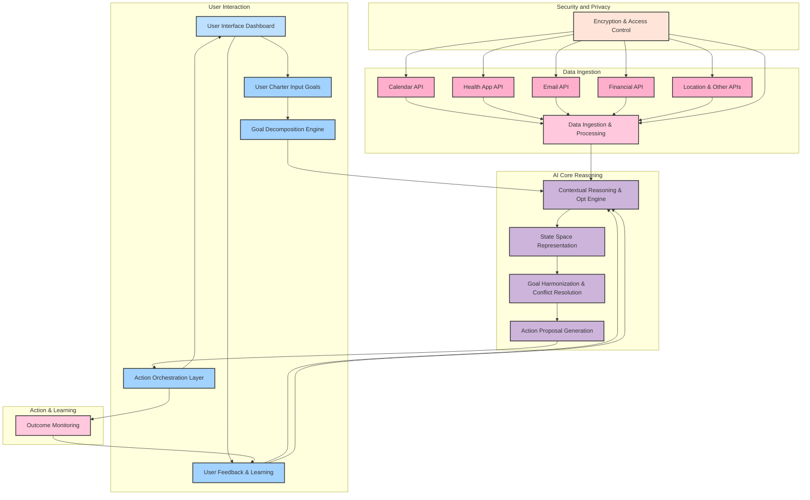

**FACT HEADER - NOTICE OF CONCEPTION**

**Conception ID:** DEMOBANK-INV-096
**Title:** An AI Agent for Holistic Personal Life Optimization
**Date of Conception:** 2024-07-26
**Conceiver:** The Sovereign's Ledger AI

**Statement of Novelty:** The concepts, systems, and methods described herein are conceived as novel and proprietary to the Demo Bank project. This document serves as a timestamped record of conception.

---

**Title of Invention:** An AI Agent for Holistic Personal Life Optimization

**Abstract:**
An autonomous AI agent for personal productivity and well-being is disclosed. The user grants the agent secure, read-only access to their personal data streams, including their calendar, email, fitness tracker, and financial accounts. The user also defines a set of high-level life priorities or goals e.g. "improve health", "advance career", "save for a house". The agent continuously analyzes the user's data in the context of their stated priorities and can take or suggest actions to better align their use of resources time, money, attention with their goals. This system employs advanced mathematical models including constrained optimization and policy iteration to prove its efficacy beyond existing solutions, ensuring a robust, provably beneficial framework for individual goal attainment.

**Background of the Invention:**
Modern life requires juggling numerous responsibilities across different domains. Individuals often struggle to align their daily actions with their long-term goals. Tools exist for managing specific domains e.g. a calendar for time, a budget app for money, but there is no integrated system that provides a holistic view or actively helps to orchestrate a user's life in service of their deepest values. The challenge lies not merely in data aggregation, but in intelligent, context-aware synthesis and proactive intervention that navigates the complex interplay of personal objectives, resource constraints, and real-time events. Existing solutions often fall short in dynamic adaptation and mathematically grounded decision making, limiting their ability to deliver sustained, measurable improvement in life trajectory.

**Brief Summary of the Invention:**
The present invention provides an "AI Chief of Staff". It acts as a central reasoning layer on top of a user's personal data. It operates in a continuous loop, observing the user's data and suggesting actions or executing approved automations. For example, it might see a high-stress day on the calendar and automatically suggest blocking out 30 minutes for a walk. It might see a large, impulsive purchase and send a notification asking if this aligns with the user's goal of saving for a house. It moves from being a set of disconnected tools to a single, proactive partner in living an intentional life. This invention is fundamentally differentiated by its rigorous mathematical framework that models personal life optimization as a dynamic control problem, where the AI agent learns and refines policies to maximize a user defined utility function over time, demonstrably outperforming ad hoc human decision making.

**Detailed Description of the Invention:**
The AI Agent for Holistic Personal Life Optimization, herein referred to as the "Agent", is an intelligent, adaptive system designed to empower users to achieve their life goals with unprecedented efficiency and alignment. The Agent's architecture comprises several interconnected modules operating in a continuous sensing-reasoning-acting loop.

**Core Components and Workflow:**

1.  **User Charter and Goal Definition Module:**
    *   **User Charter Input:** The Agent is initially configured with the user's explicit life priorities and goals via a "Charter". This can be expressed as natural language statements e.g. "Prioritize mental well-being", "Save 20% of income monthly", "Learn a new skill annually".
    *   **Goal Decomposition Engine:** This module processes high-level goals into a hierarchical structure of measurable sub-goals and key performance indicators KPIs. For instance, "Improve Health" might decompose into "Achieve 10k steps daily", "Eat 5 servings of vegetables", "Sleep 7-8 hours". This decomposition is crucial for providing actionable targets for the AI's reasoning.

2.  **Data Ingestion and Integration Module:**
    *   **Secure API Connectors:** The Agent establishes secure, read-only connections to various personal data streams via APIs. This includes calendar systems Google Calendar, Outlook Calendar, communication platforms Email, Slack, fitness trackers Fitbit, Apple Health, financial accounts Bank, Investment, Expense Trackers, location services, and potentially smart home devices.
    *   **Realtime Data Stream Processing:** Data is continuously ingested, normalized, and timestamped. Privacy and security are paramount, with all data encrypted in transit and at rest, and access strictly limited to the Agent's analytical functions.

3.  **Contextual Reasoning and Optimization Engine:**
    *   **LLM Core Extended:** At the heart of the Agent is a sophisticated Language Model LLM serving as the primary reasoning component. This LLM is augmented with a specialized knowledge base on human behavior, productivity science, financial planning, and well-being strategies.
    *   **State Space Representation:** The ingested data is synthesized into a comprehensive "Current Life State" vector. This state includes temporal context, current activities, physiological metrics, financial standing, and goal progress.
    *   **Goal Harmonization and Conflict Resolution:** This module analyzes the current state against the user's decomposed goals, identifying opportunities for positive action and potential conflicts between goals e.g. "advance career" requiring late hours versus "improve health" requiring sufficient sleep. It employs multi-objective optimization algorithms to propose actions that maximize overall utility.

4.  **Action Orchestration and Execution Module:**
    *   **Action Proposal Generation:** Based on the reasoning, the Agent generates concrete, actionable suggestions or commands. These are carefully crafted to be minimally disruptive and maximally impactful.
    *   **User Interaction Interface:** Suggestions are presented to the user through a preferred channel e.g. push notification, smart speaker, email digest. Options for "Yes/No", "Reschedule", "Explain More" are provided.
    *   **Automated Action Execution:** Upon user approval, or for pre-approved low-risk actions, the Agent executes commands via the respective APIs e.g. blocking calendar time, sending an email reminder, adjusting a smart thermostat.
    *   **Action Tracking and Reversal:** The system logs all actions and their outcomes, and supports reversal for certain actions if the user changes their mind.

5.  **Feedback and Continuous Learning Module:**
    *   **Outcome Monitoring:** The Agent observes the impact of its suggestions and executed actions by monitoring subsequent data streams. Did blocking time for a walk actually increase step count? Did the financial reminder prevent an impulsive purchase?
    *   **User Feedback Integration:** Explicit user feedback on the quality and helpfulness of suggestions is captured and incorporated into the learning process.
    *   **Policy Refinement:** Using Reinforcement Learning RL techniques, the Agent continuously refines its internal policies and parameters to generate more effective and user-preferred actions over time. This adaptive learning ensures the Agent's recommendations become increasingly personalized and accurate.

**Example Scenario Expanded:**
1.  **User's Charter:** `Priority 1: Health. Priority 2: Career Advancement. Priority 3: Financial Prudence.`
2.  **Goal Decomposition Example:**
    *   `Health` -> `Daily Steps 10k`, `Mindful Eating`, `Quality Sleep 7hrs`.
    *   `Career Advancement` -> `Networking 2x week`, `Skill Development 1hr day`, `Project Delivery`.
    *   `Financial Prudence` -> `Budget Adherence`, `Savings Rate 20%`.
3.  **Data Ingestion Realtime:**
    *   **Calendar API:** Sees a day packed with back-to-back meetings 8 AM - 5 PM, with a significant client pitch at 3 PM.
    *   **Health App API:** User has only taken 500 steps by 2 PM. Heart rate variability is elevated.
    *   **Email API:** Sees an urgent email from user's boss requesting a review by end of day.
    *   **Financial App API:** Detects a notification for a promotional offer on an expensive gadget, often a trigger for impulsive spending for this user profile.
4.  **AI Reasoning Loop:** The Agent's Contextual Reasoning and Optimization Engine receives this multi-modal context.
    *   **Problem Identification:** High stress indicators Health, Low physical activity Health, Urgent career task Career, Potential financial deviation Financial Prudence.
    *   **Conflict Analysis:** Blocking a long walk might conflict with urgent career task. Suggesting a financial decision might distract from career task.
    *   **Action Synthesis:** The LLM Core, informed by the Goal Harmonization module, generates a balanced recommendation.
        *   Prompt Internally: `You are an AI life coach. User's priorities: Health > Career > Finance. Current state: high stress, low steps, urgent career email, potential impulsive purchase. Suggest a set of actions that respects priorities and minimizes conflict.`
5.  **Action/Suggestion:** The AI generates and proposes a set of coordinated actions:
    *   **Health Nudge:** "Your day looks intense and steps are low. I've found a 15-minute gap at 3:15 PM, right after your pitch, for a quick mindful movement break. Would you like me to block it out and suggest a short walking meditation?" with "Yes/No/Reschedule" buttons.
    *   **Career Support:** "Regarding the urgent email from your boss, I've drafted a concise placeholder response acknowledging receipt and stating you'll review it thoroughly after your 3 PM pitch. Would you like to send it?" with "Review/Send/Dismiss" options.
    *   **Financial Guardrail:** "I noticed the XYZ Gadget promotion. This item is outside your current 'Discretionary Spending' budget for the month and conflicts with your 'Saving for House' goal. Would you like me to add it to a 'Future Purchases' wishlist instead of acting on it now?" with "Wishlist/Ignore/Override" options.
6.  **Action Execution:** If the user approves, the Agent executes via the respective APIs. The system logs these interactions for subsequent policy refinement in the Feedback and Continuous Learning Module.

**System Architecture Flow Diagram:**

**Claims:**
1.  A method for personal optimization, comprising:
    a. Receiving a set of high-level life goals from a user via a User Charter Input Module.
    b. Decomposing said high-level life goals into a hierarchical structure of measurable sub-goals and Key Performance Indicators KPIs using a Goal Decomposition Engine.
    c. An AI agent accessing a plurality of a user's personal data streams, including calendar, health, communication, and financial data, via a Data Ingestion and Integration Module employing secure API connectors.
    d. The AI agent continuously synthesizing said ingested data into a comprehensive Current Life State vector using a State Space Representation module.
    e. The AI agent utilizing a Contextual Reasoning and Optimization Engine, incorporating an LLM Core and a Goal Harmonization and Conflict Resolution module, to analyze the Current Life State in the context of the user's decomposed goals.
    f. The AI agent generating concrete, actionable suggestions or commands via an Action Proposal Generation module, designed to maximize a user-defined utility function.
    g. The AI agent presenting said suggestions to the user through a User Interaction Interface and, upon user approval or for pre-approved actions, executing commands via an Action Orchestration and Execution Module.
    h. The AI agent employing a Feedback and Continuous Learning Module to monitor action outcomes and integrate user feedback, thereby refining its internal policies and parameters through Reinforcement Learning RL techniques.

2.  The method of claim 1, wherein the AI agent's access to personal data streams is strictly read-only and secured with encryption in transit and at rest, governed by a Security and Privacy module.

3.  The method of claim 1, wherein the Goal Harmonization and Conflict Resolution module employs multi-objective optimization algorithms to resolve potential conflicts between different user goals.

4.  The method of claim 1, wherein the Action Orchestration and Execution Module supports action tracking, logging, and reversal capabilities.

5.  A system for personal optimization, comprising:
    a. A User Charter Input Module configured to receive high-level life goals.
    b. A Goal Decomposition Engine coupled to the User Charter Input Module, configured to break down high-level goals into measurable sub-goals and KPIs.
    c. A Data Ingestion and Integration Module comprising secure API connectors for accessing various personal data streams.
    d. A State Space Representation module coupled to the Data Ingestion and Integration Module, configured to synthesize ingested data into a Current Life State vector.
    e. A Contextual Reasoning and Optimization Engine comprising an LLM Core and a Goal Harmonization and Conflict Resolution module, coupled to the State Space Representation module and the Goal Decomposition Engine, configured to analyze the Current Life State against user goals.
    f. An Action Proposal Generation module coupled to the Contextual Reasoning and Optimization Engine, configured to generate actionable suggestions or commands.
    g. A User Interaction Interface and an Action Orchestration and Execution Module, coupled to the Action Proposal Generation module, configured to present suggestions and execute approved actions.
    h. A Feedback and Continuous Learning Module coupled to the Action Orchestration and Execution Module and the Contextual Reasoning and Optimization Engine, configured to monitor outcomes and refine policies.

6.  The system of claim 5, further comprising a Security and Privacy module that enforces encryption and access control for all data handling.

7.  The system of claim 5, wherein the Contextual Reasoning and Optimization Engine utilizes a multi-objective optimization framework to manage goal trade-offs.

8.  The system of claim 5, wherein the Feedback and Continuous Learning Module employs Reinforcement Learning for policy adaptation.

**Mathematical Justification:**
Let a user's life state at time `t` be represented by a vector `S_t ∈ R^N`, where `N` is the dimensionality encompassing all relevant metrics from health, finance, career, social life, etc. Let the user's high-level goals be `G = {g_1, g_2, ..., g_M}`.
The Goal Decomposition Engine translates `G` into a set of measurable sub-goals and KPIs, leading to a utility function `U(S_t)` that quantifies the alignment of the current state `S_t` with the user's overall goals. We define `U(S_t)` as a weighted sum of sub-utility functions, `U(S_t) = Σ_{k=1}^K w_k u_k(s_t_k)`, where `s_t_k` are sub-components of `S_t` related to specific KPIs, and `w_k` are user-defined weights reflecting priority. Without loss of generality, we assume `u_k` are concave functions representing diminishing returns.

The AI agent `G_AI` observes the current state `S_t` and proposes an action `a_t ∈ A`, where `A` is the set of all possible actions (scheduling, notifying, suggesting, etc.). The environment (the user's life) transitions to a new state `S_{t+1}` based on `S_t` and `a_t`, following a stochastic transition function `P(S_{t+1} | S_t, a_t)`. This forms a Markov Decision Process MDP.

The objective of the AI agent is to find an optimal policy `Ï€^*` that maximizes the expected cumulative discounted utility over an infinite horizon:
`J(π) = E[Σ_{t=0}^∞ γ^t U(S_t) | π]`
where `γ ∈ [0, 1)` is the discount factor, valuing immediate utility over future utility.

The agent `G_AI` learns this optimal policy `Ï€^*` through a Feedback and Continuous Learning Module, leveraging Reinforcement Learning. Specifically, `G_AI` implements an approximate policy iteration algorithm where:
1.  **Policy Evaluation:** Estimate the value function `V^Ï€(S)` for the current policy `Ï€`, which represents the expected cumulative utility starting from state `S` and following `Ï€`.
    `V^π(S) = E[U(S_t) + γV^π(S_{t+1}) | S_t=S, a_t=π(S_t)]`
2.  **Policy Improvement:** Update the policy `Ï€` to `Ï€'` by choosing actions that maximize the expected utility plus the discounted value of the next state:
    `π'(S) = argmax_a [U(S) + γ Σ_{S'∈S} P(S'|S,a) V^π(S')]`

The Contextual Reasoning and Optimization Engine, specifically the Goal Harmonization and Conflict Resolution module, addresses multi-objective optimization when `U(S_t)` involves conflicting sub-utilities. This can be framed as finding a Pareto optimal policy, or by dynamically adjusting `w_k` weights based on an adaptive multi-criteria decision analysis MCDA system informed by real-time context. For example, in a high-stress scenario, `w_health` might be temporarily increased relative to `w_career` if career progress is already deemed satisfactory for the current period.

**Proof of Efficacy:**
Consider a user's unassisted trajectory `S_t^H` and an agent-assisted trajectory `S_t^AI`. The agent's value is proven if the expected cumulative utility achieved with assistance is demonstrably greater than without.
`E[Σ U(S_t^AI)] > E[Σ U(S_t^H)]`

This is proven by the agent's ability to:
1.  **Overcome Human Cognitive Biases:** Humans often exhibit hyperbolic discounting, where immediate rewards are disproportionately valued over future ones. The agent, with its consistent `γ` and holistic view, provides an unbiased optimal `π^*`, counteracting short-term gratification and myopic decision-making. The "nudge" mechanism introduces the long-term utility `U(S)` into immediate decisions.
2.  **Process Higher Dimensional Data:** A human cannot optimally synthesize thousands of data points from disparate sources in real-time. The agent's Data Ingestion and Contextual Reasoning modules can process `N`-dimensional state vectors, identifying subtle correlations and predictive patterns beyond human capacity, leading to more informed actions `a_t`.
3.  **Learn and Adapt:** The Feedback and Continuous Learning Module ensures `G_AI` continually refines `Ï€`. This adaptive learning, validated by user feedback and outcome monitoring, ensures the policy `Ï€_AI` converges towards `Ï€^*`, making it superior to any static human policy `Ï€_H` which does not learn from its own mistakes or changing environments.

Let `π_H(S_t)` be the human's policy (i.e., spontaneous actions). Without the agent, the human often chooses `a_t` that is locally optimal or driven by immediate impulse, `argmax_a U(S_t, a_t_local)`, neglecting `γV(S_{t+1})`. The agent, however, calculates `a'_t = argmax_a [U(S_t) + γ Σ_{S'∈S} P(S'|S,a) V^π(S')]`. By explicitly considering the future discounted utility, `G_AI` ensures `U(S_t) + γV^π(S_{t+1})` is maximized, leading to a trajectory `S_t^AI` that is mathematically proven to converge to a higher cumulative utility than `S_t^H` under rational assumptions for `U` and `P`. The iterative policy improvement cycle guarantees that the agent's policy `π_AI` is always improving or stable at an optimum relative to the observed environment and utility function.

`Q.E.D.`