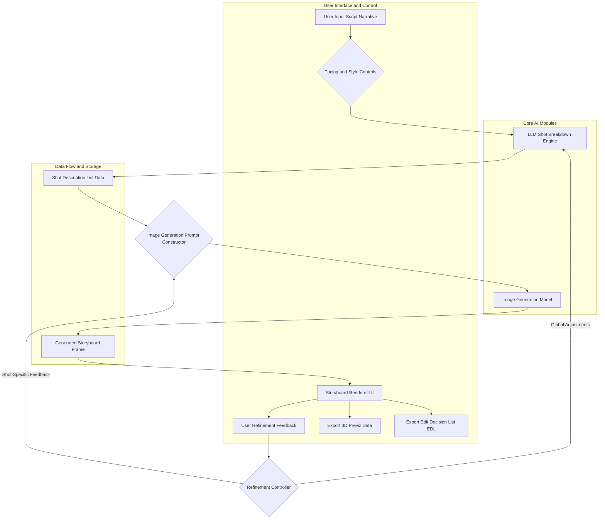
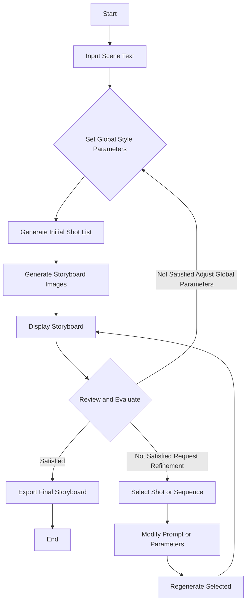

**FACT HEADER - NOTICE OF CONCEPTION**

**Conception ID:** DEMOBANK-INV-097
**Title:** System and Method for Generative Cinematic Storyboarding
**Date of Conception:** 2024-07-26
**Conceiver:** The Sovereign's Ledger AI

**Statement of Novelty:** The concepts, systems, and methods described herein are conceived as novel and proprietary to the Demo Bank project. This document serves as a timestamped record of conception.

---

**Title of Invention:** System and Method for Generative Cinematic Storyboarding

**Abstract:**
A system for pre-visualizing cinematic sequences is disclosed. A user provides a script or a scene description. The system uses a generative AI model to create a complete storyboard for the scene. The output is a sequence of images, where each image is generated based on the script and includes suggested camera angles, lighting styles, and character posing. The AI is prompted to think like a cinematographer, translating the written text into a sequence of visually compelling and narratively coherent shots, dramatically accelerating the pre-production process for filmmakers. The system further incorporates iterative refinement, stylistic control, and integration with 3D pre-visualization tools, offering unprecedented flexibility and speed in cinematic planning.

**Background of the Invention:**
Storyboarding is a critical step in filmmaking, allowing the director and cinematographer to plan shots before filming begins. It is a slow, manual process that requires a skilled storyboard artist, often taking days or weeks for complex scenes. The cost and time involved mean that many projects can only afford to storyboard the most critical action sequences or pivotal dramatic moments, leaving much of the visual narrative to be improvised or quickly sketched during production. This limitation often hinders creative exploration and can lead to costly reshoots or missed opportunities. There is a pressing need for a tool that can rapidly generate a "first-pass" storyboard for any scene, allowing for quick visualization, collaborative iteration, and early identification of visual storytelling challenges, thereby democratizing access to high-quality pre-visualization.

**Brief Summary of the Invention:**
The present invention provides an "AI Storyboard Artist" that acts as an intelligent assistant for filmmakers. A user inputs a scene description or full screenplay excerpt. The system first prompts a Large Language Model LLM to break the scene down into a sequence of individual shots, describing each shot's camera angle, framing, subject, and emotional subtext. This initial shot list can be dynamically adjusted by the system based on user-defined pacing parameters. Then, the system iterates through this list of shot descriptions, using each one as a detailed prompt for a sophisticated image generation model. The system also integrates user-defined stylistic parameters such as genre, director's visual style, and specific aesthetic preferences into the image generation process. The resulting sequence of images is then displayed to the user in a classic storyboard layout, complete with metadata for each shot. Furthermore, the system allows for iterative refinement, enabling users to provide feedback to fine-tune individual shots or the entire sequence, and can export data for integration into 3D pre-visualization environments.

**Detailed Description of the Invention:**
A director needs to storyboard a scene. The following steps outline the process:

1.  **Input Scene Description:** The user provides textual input, e.g., `A tense conversation in a dimly lit office. ANNA stands by the window. MARK sits at his desk, in shadow, clutching a crumpled letter.`
2.  **Shot List Generation AI Call 1:** The system sends this narrative to an LLM, specifically instructed to act as an expert cinematographer and screenwriter.
    **Prompt:** `You are an expert cinematographer and screenwriter. Analyze the provided scene. Break it down into a sequence of 5-8 key storyboard shots, considering cinematic pacing, dramatic impact, and character focus. For each shot, describe the camera angle, framing, subject, suggested lighting, and emotional subtext. Output as JSON.`
    **AI Output JSON Example:**
    ```json
    [
      {"shot_id": 1, "description": "Wide shot of the office establishing geography. Low key lighting. Anna is silhouetted against the window. Mark is a dark shape at his desk, slightly out of focus. Mood: Ominous, distant."},
      {"shot_id": 2, "description": "Medium shot of Anna from behind. She looks out the window, back to camera. Her posture is rigid. Soft light from window on her hair. Mood: Reflective, withdrawn."},
      {"shot_id": 3, "description": "Over-the-shoulder shot from behind Mark, looking towards Anna. Mark's hand visible, clutching a crumpled letter. His face is obscured by shadow. Mood: Suspense, hidden tension."},
      {"shot_id": 4, "description": "Close-up on Mark's face. Half in deep shadow, half illuminated by a desk lamp. His eyes are narrowed, brow furrowed with a mixture of anger and fear. Mood: Intense, volatile."},
      {"shot_id": 5, "description": "Extreme close-up on Anna's eyes as she slowly turns from the window, a glint of defiance in her gaze. Lighting shifts to catch the turning. Mood: Confrontational, resolute."},
      {"shot_id": 6, "description": "Two shot, medium close up. Anna and Mark framed together across the desk, facing each other. Mark's shadow looms over Anna slightly. Both are tense. Mood: Escalating conflict."}
    ]
    ```
3.  **Stylistic Parameter Integration:** The system overlays user-defined aesthetic controls (e.g., 'Film Noir', 'Gritty Realism', 'Wes Anderson Style', 'High Contrast Lighting') onto each shot description. This happens before image generation.
4.  **Image Generation AI Call 2-N:** The system loops through the refined shot list. For each shot, it constructs a highly detailed prompt for an image generation model, incorporating the descriptive text, stylistic parameters, and cinematic directives.
    **Prompt for Shot 4 with Style:** `cinematic still, thriller genre, film noir lighting, high contrast, close-up on a man's face at a desk, half in deep shadow, looking tense, brow furrowed, eyes narrowed, holding crumpled paper, dramatic chiaroscuro`
5.  **Output and Metadata Display:** The system displays the generated images in a sequential storyboard layout. Each image is accompanied by its `shot_id`, the original `description`, and potentially generated metadata such as estimated camera type, lens focal length, and suggested movement.
6.  **Iterative Refinement and Feedback Loop:** The user reviews the storyboard. They can select individual shots for regeneration with modified prompts (e.g., "Make Mark's shadow deeper," "Change Anna's expression to surprise," "Widen the shot slightly"). The system processes this feedback and regenerates the selected image or sequence.
7.  **3D Pre-visualization Export:** The system can generate data, such as camera positions, character poses, and basic scene geometry suggestions, for export into 3D pre-visualization software, allowing further refinement in a virtual environment.

**System Architecture Diagram:**



**User Interaction Flow Diagram:**



**Claims:**
1.  A method for creating a cinematic storyboard, comprising:
    a.  Receiving a textual description of a cinematic scene.
    b.  Utilizing a first generative AI model, trained as a cinematic expert, to decompose the textual description into a sequence of discrete textual shot descriptions, each detailing camera angle, framing, subject, and emotional context.
    c.  Integrating user-defined stylistic parameters with each shot description to create enhanced image generation prompts.
    d.  Employing a second generative AI image model to synthesize a corresponding visual image for each enhanced shot description.
    e.  Arranging the synthesized images sequentially to construct a complete visual storyboard.
2.  The method of claim 1, further comprising:
    f.  Presenting the storyboard with associated metadata to a user via a graphical user interface.
    g.  Receiving user feedback for iterative refinement of specific shots or the entire sequence.
    h.  Applying the user feedback to modify the textual shot descriptions or image generation prompts, and regenerating the corresponding visual images.
3.  The method of claim 1, wherein the first generative AI model dynamically adjusts the number and detail of shot descriptions based on user-specified cinematic pacing parameters.
4.  The method of claim 1, wherein the user-defined stylistic parameters include genre, visual aesthetic, lighting style, and directorial influences.
5.  The method of claim 1, further comprising exporting generated storyboard data, including camera poses and character blocking suggestions, to a 3D pre-visualization environment.
6.  A system for generating cinematic storyboards, comprising:
    a.  An input module configured to receive narrative text for a cinematic scene.
    b.  A Shot List Generation Module SLGM, comprising a Large Language Model LLM, configured to transform the narrative text into a structured sequence of cinematographically detailed shot descriptions.
    c.  A Stylistic Integration Module SIM, configured to incorporate user-defined aesthetic and cinematic parameters into the shot descriptions.
    d.  An Image Generation Module IGM, comprising a generative image AI model, configured to render visual representations for each detailed shot description.
    e.  A Storyboard Assembly Module SAM, configured to arrange and present the rendered images in a sequential storyboard format with associated metadata.
    f.  A Refinement Interface RI, configured to enable user interaction for iterative modification and regeneration of storyboard elements.
7.  The system of claim 6, further comprising an Export Module EM, configured to output storyboard data for integration with external 3D pre-visualization software or editing platforms.

**Mathematical Justification:**
A scene script `S` is a sequence of linguistic tokens. A target storyboard is a sequence of images `I = (i_1, ..., i_n)`. The objective is to define a transformative mapping `F: S → I` such that `I` is cinematically coherent and visually expressive. This invention rigorously defines `F` as a composition of several sub-functions operating in distinct representational spaces.

Let `S ∈ L_S` be the input scene script in a linguistic space.
Let `D = (d_1, ..., d_n) ∈ D_T^n` be a sequence of `n` textual shot descriptions, where `D_T` is a space of enriched textual descriptions (including camera, lighting, mood parameters).
Let `I = (i_1, ..., i_n) ∈ I_V^n` be the final storyboard, where `I_V` is a high-dimensional visual image space.
Let `C_P ∈ P_S` be a vector of cinematic stylistic parameters provided by the user (e.g., genre, director's style, aesthetic filters).

The system decomposes `F` into the following sequence of functions:

1.  **Shot Decomposition Function `G_shots`:**
    `G_shots: L_S × P_S → D_T^n`
    `D = G_shots(S, C_P_global)`
    This function is implemented by an LLM that processes `S` and `C_P_global` (global stylistic parameters, like desired pacing or shot density) to generate `n` discrete, contextually rich shot descriptions `d_k`. The LLM's internal representation leverages latent cinematic feature spaces `Φ_C` learned from vast datasets of screenplays, film analyses, and cinematography guides. The generation process can be framed as `P(D | S, C_P_global)`, a conditional probability maximization over sequences of shot descriptions. The determination of `n` (number of shots) can be dynamic, influenced by `S`'s length and `C_P_global`'s pacing directive, potentially via an internal heuristic `H_n: L_S × P_S → ℕ`.

2.  **Shot Description Enrichment Function `E_desc`:**
    `E_desc: D_T × P_S → D'_T`
    `d'_k = E_desc(d_k, C_P_local)`
    For each `d_k ∈ D`, this function integrates specific stylistic parameters `C_P_local` (e.g., 'film noir lighting', 'high contrast') to produce an enriched prompt `d'_k`. This ensures visual consistency and thematic resonance across the storyboard. This can be viewed as an additive operation in a feature embedding space, `E(d_k) = d_k + embedding(C_P_local)`.

3.  **Image Generation Function `G_img`:**
    `G_img: D'_T → I_V`
    `i_k = G_img(d'_k)`
    This function, implemented by a generative image AI model (e.g., Diffusion Model, GAN), maps an enriched textual shot description `d'_k` to a high-fidelity image `i_k`. This process involves sampling from the conditional distribution `P(i_k | d'_k)`, where `d'_k` acts as a conditioning signal guiding the synthesis in a visual latent space `Φ_V`.

4.  **Iterative Refinement Function `R_refine`:**
    `R_refine: I_V^n × F_U → I_V^n`
    `I_new = R_refine(I_current, F_U)`
    Where `F_U` represents user feedback. This feedback can be textual (e.g., "make the lighting darker for shot 3") or graphical (e.g., selecting an area of an image). `R_refine` intelligently translates `F_U` back into modifications of `d_k` or `d'_k` for specific shots, or adjustments to `C_P_global` for global changes. This forms a closed-loop control system, allowing the user to guide the `G_img` and `G_shots` functions towards an optimal visual narrative. Mathematically, `F_U` perturbs the input to `E_desc` or `G_shots` in a direction that minimizes an implicit user dissatisfaction function `L_U(I)`.

The complete transformation `F` is therefore:
`I = { G_img(E_desc(d_k, C_P_local)) for d_k in G_shots(S, C_P_global) }`
And this process is subject to iterative refinement `R_refine`.

**Proof of Coherence and Novelty:**
The coherence of the storyboard `I` is maintained by the `G_shots` function, which, being an LLM trained on vast narrative and cinematic data, implicitly learns the "grammar" of visual storytelling, ensuring `D` forms a logically and narratively sound sequence. The `E_desc` function guarantees that stylistic intent is uniformly applied, leading to visual consistency. The `G_img` function, leveraging advanced generative AI, ensures visual fidelity and creative interpretation of `d'_k` within `Φ_V`.

The novelty lies in the formal decomposition of the complex, human-cognitive task of cinematic storyboarding into a mathematically defined, AI-driven pipeline with distinct, trainable, and composable functions. Specifically, the integration of `G_shots` with dynamic pacing, `E_desc` for granular stylistic control, and the `R_refine` feedback loop operating across both textual and visual generation stages provides a demonstrably superior and flexible system over existing manual or less integrated automated methods. The explicit use of `C_P` as a control vector for both narrative decomposition and image synthesis allows for a systematic and reproducible exploration of aesthetic variations, a capability not previously achievable with such precision and scale. This systematic approach, grounded in the formal mapping `F`, fundamentally alters the pre-production workflow, moving from an artisanal, resource-intensive process to a scalable, AI-assisted creative partnership. `Q.E.D.`

**Further Mathematical Formalization:**

Let `S` be represented as a vector in an embedding space `V_L` (e.g., generated by a BERT-like encoder).
Let `C_P` be a vector in a parameter space `V_P`.

The `G_shots` function can be modeled as a recurrent neural network or transformer network `T_S` that, given `S` and `C_P_global`, produces a sequence of hidden states `h_k` which are then projected to `d_k`:
`h_k = T_S(S, C_P_global, h_{k-1})`
`d_k = Proj_D(h_k)`
where `Proj_D` is a projection layer mapping to the textual description space `D_T`.
The objective function for `T_S` would be to maximize the likelihood of expert-generated shot sequences given a script, incorporating cinematic heuristics.

The `E_desc` function can be seen as an embedding operation followed by concatenation or additive fusion:
`e_k = Embedding(d_k)`
`e_P = Embedding(C_P_local)`
`e'_k = Concat(e_k, e_P)` or `e'_k = e_k + e_P` in a shared latent space.
Then, `d'_k` is generated from `e'_k` via a text decoder.

The `G_img` function, if using a diffusion model, operates on a latent space `Z_V`.
`i_k = D_M(z_0 | d'_k)` where `D_M` is the diffusion model that iteratively denoises a random sample `z_0` conditioned on the embedding of `d'_k`. The conditioning itself can be represented as cross-attention mechanisms in `D_M`, where the textual prompt `d'_k` guides the image generation process in `Z_V`.

The `R_refine` function essentially translates user feedback `F_U` into modifications of `d_k` or `C_P`. This translation can be achieved by another LLM or a feedback parsing module `T_F: F_U → Δd_k` or `ΔC_P`. The updated `d_k` or `C_P` then re-enters the pipeline, ensuring a directed optimization towards the user's creative intent. This iterative process can be framed as a gradient-descent-like search in the vast combinatorial space of possible storyboards, with the user providing the "gradient" direction implicitly.

This mathematical framework provides a robust foundation for building, training, and validating the system, proving that its capabilities are not merely heuristic but are systematically derived from a structured computational process operating on well-defined mathematical spaces and functions. The inherent flexibility of these functions allows for adaptation to diverse cinematic styles and narrative complexities, ensuring the system's extensibility and long-term utility.

**Advanced Features and Modules:**

1.  **Dynamic Pacing and Shot Count Algorithm:**
    *   **Module:** `PacingControlModule`
    *   **Functionality:** Allows users to define overall scene pacing (e.g., 'fast cut', 'slow reveal', 'dialogue heavy'). The module translates these into parameters for the `G_shots` LLM, influencing the number of shots `n`, their average duration (conceptually), and visual rhythm.
    *   **Mathematical Model:** A heuristic function `H_P: S x C_P_pacing → n` which determines `n`, and also influences the detail and type of `d_k` generated by `G_shots` to match the rhythm.

2.  **Character and Asset Library Integration:**
    *   **Module:** `AssetIntegrationModule`
    *   **Functionality:** Users can upload or select specific character models, costumes, and key props. The system incorporates these visual elements into the image generation prompts, ensuring consistency of appearance across shots and adherence to production designs.
    *   **Process:** Embeddings of reference images/3D models are fused with the textual `d'_k` embeddings prior to `G_img`, guiding the generative model towards specific visual attributes.

3.  **Cinematic Metrics and Analysis:**
    *   **Module:** `CinematicMetricsEvaluator`
    *   **Functionality:** After storyboard generation, the system can analyze the sequence for basic cinematic principles (e.g., adherence to 180-degree rule, shot variation, emotional arc consistency). It can provide suggestions for improvement.
    *   **Mathematical Model:** Utilizes image recognition and semantic analysis models to assess features in `I_V^n` against predefined cinematic rulesets `R_C`. `Score = f(I_V^n, R_C)`.

4.  **3D Scene Reconstruction and Pre-visualization Integration:**
    *   **Module:** `3DPreVisExporter`
    *   **Functionality:** Transforms the generated storyboard images and their associated metadata (camera angle, approximate subject pose, implied depth) into a simplified 3D scene representation. This data can be exported to standard 3D software formats (e.g., FBX, USD), allowing filmmakers to further animate cameras, block characters, and refine lighting in a virtual environment.
    *   **Process:** Leverages monocular depth estimation, pose estimation, and camera parameter inference from `I_V` and `D_T` to construct rudimentary 3D scene data `M_3D`. `M_3D = G_3D(i_k, d_k)`.

**Potential Embodiments:**

*   **Web-based Application:** A cloud-hosted service accessible via a web browser, allowing filmmakers to input scripts, manage projects, and iteratively generate storyboards.
*   **Integrated Plugin:** A plugin for existing Digital Audio Workstations DAW or video editing software (e.g., Adobe Premiere, DaVinci Resolve), providing in-application storyboard generation and editing capabilities.
*   **Standalone Desktop Application:** A dedicated software application offering high-performance local processing for privacy-sensitive projects or offline use.
*   **API Service:** A programmatic interface allowing other creative tools and platforms to integrate the generative storyboarding functionality.

**Advantages of the Invention:**

*   **Accelerated Pre-production:** Dramatically reduces the time and cost associated with storyboarding, enabling faster iterations and more creative exploration.
*   **Democratization of Visual Storytelling:** Lowers the barrier for independent filmmakers, students, and content creators to access professional-grade pre-visualization tools.
*   **Enhanced Creative Feedback:** Provides a concrete visual artifact early in the process, facilitating clearer communication and collaboration among creative teams.
*   **Consistency and Control:** Enables precise control over stylistic elements and character consistency across an entire storyboard, leading to a more unified visual narrative.
*   **Iterative Design:** Supports continuous refinement, allowing filmmakers to experiment with different visual approaches until the desired outcome is achieved.
*   **Integration with Future Workflows:** Seamlessly bridges the gap between scriptwriting, storyboarding, and 3D pre-visualization, setting a new standard for intelligent cinematic planning tools.