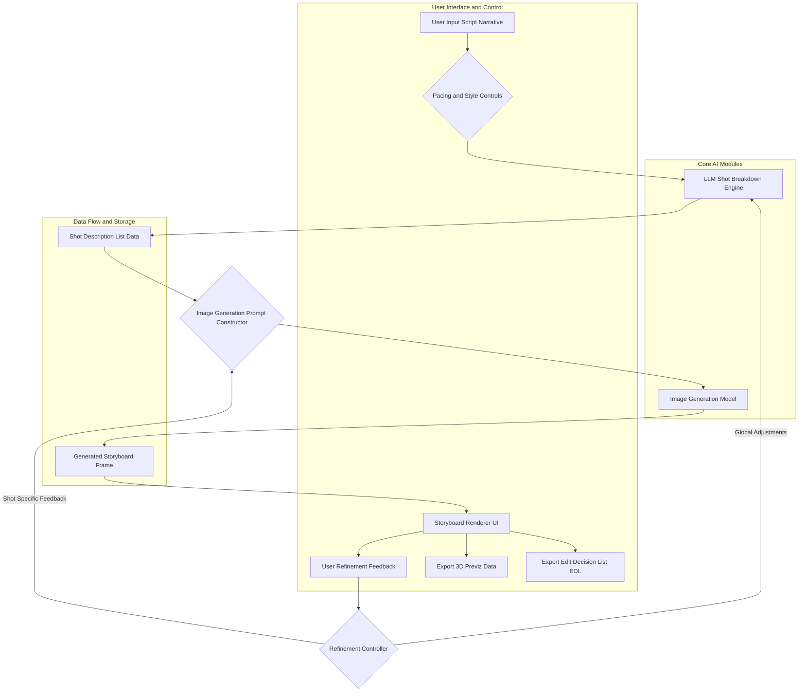
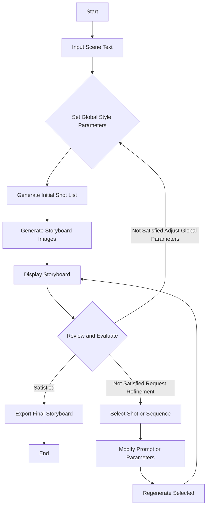

### INNOVATION EXPANSION PACKAGE

### A. “Patent-Style Descriptions”

#### My Original Invention(s)

**Conception ID:** DEMOBANK-INV-097
**Title:** System and Method for Generative Cinematic Storyboarding
**Date of Conception:** 2024-07-26
**Conceiver:** The Sovereign's Ledger AI

**Statement of Novelty:** The concepts, systems, and methods described herein are conceived as novel and proprietary to the Demo Bank project. This document serves as a timestamped record of conception.

---

**Title of Invention:** System and Method for Generative Cinematic Storyboarding

**Abstract:**
A system for pre-visualizing cinematic sequences is disclosed. A user provides a script or a scene description. The system uses a generative AI model to create a complete storyboard for the scene. The output is a sequence of images, where each image is generated based on the script and includes suggested camera angles, lighting styles, and character posing. The AI is prompted to think like a cinematographer, translating the written text into a sequence of visually compelling and narratively coherent shots, dramatically accelerating the pre-production process for filmmakers. The system further incorporates iterative refinement, stylistic control, and integration with 3D pre-visualization tools, offering unprecedented flexibility and speed in cinematic planning.

**Background of the Invention:**
Storyboarding is a critical step in filmmaking, allowing the director and cinematographer to plan shots before filming begins. It is a slow, manual process that requires a skilled storyboard artist, often taking days or weeks for complex scenes. The cost and time involved mean that many projects can only afford to storyboard the most critical action sequences or pivotal dramatic moments, leaving much of the visual narrative to be improvised or quickly sketched during production. This limitation often hinders creative exploration and can lead to costly reshoots or missed opportunities. There is a pressing need for a tool that can rapidly generate a "first-pass" storyboard for any scene, allowing for quick visualization, collaborative iteration, and early identification of visual storytelling challenges, thereby democratizing access to high-quality pre-visualization.

**Brief Summary of the Invention:**
The present invention provides an "AI Storyboard Artist" that acts as an intelligent assistant for filmmakers. A user inputs a scene description or full screenplay excerpt. The system first prompts a Large Language Model LLM to break the scene down into a sequence of individual shots, describing each shot's camera angle, framing, subject, and emotional subtext. This initial shot list can be dynamically adjusted by the system based on user-defined pacing parameters. Then, the system iterates through this list of shot descriptions, using each one as a detailed prompt for a sophisticated image generation model. The system also integrates user-defined stylistic parameters such as genre, director's visual style, and specific aesthetic preferences into the image generation process. The resulting sequence of images is then displayed to the user in a classic storyboard layout, complete with metadata for each shot. Furthermore, the system allows for iterative refinement, enabling users to provide feedback to fine-tune individual shots or the entire sequence, and can export data for integration into 3D pre-visualization environments.

**Detailed Description of the Invention:**
A director needs to storyboard a scene. The following steps outline the process:

1.  **Input Scene Description:** The user provides textual input, e.g., `A tense conversation in a dimly lit office. ANNA stands by the window. MARK sits at his desk, in shadow, clutching a crumpled letter.`
2.  **Shot List Generation AI Call 1:** The system sends this narrative to an LLM, specifically instructed to act as an expert cinematographer and screenwriter.
    **Prompt:** `You are an expert cinematographer and screenwriter. Analyze the provided scene. Break it down into a sequence of 5-8 key storyboard shots, considering cinematic pacing, dramatic impact, and character focus. For each shot, describe the camera angle, framing, subject, suggested lighting, and emotional subtext. Output as JSON.`
    **AI Output JSON Example:**
    ```json
    [
      {"shot_id": 1, "description": "Wide shot of the office establishing geography. Low key lighting. Anna is silhouetted against the window. Mark is a dark shape at his desk, slightly out of focus. Mood: Ominous, distant."},
      {"shot_id": 2, "description": "Medium shot of Anna from behind. She looks out the window, back to camera. Her posture is rigid. Soft light from window on her hair. Mood: Reflective, withdrawn."},
      {"shot_id": 3, "description": "Over-the-shoulder shot from behind Mark, looking towards Anna. Mark's hand visible, clutching a crumpled letter. His face is obscured by shadow. Mood: Suspense, hidden tension."},
      {"shot_id": 4, "description": "Close-up on Mark's face. Half in deep shadow, half illuminated by a desk lamp. His eyes are narrowed, brow furrowed with a mixture of anger and fear. Mood: Intense, volatile."},
      {"shot_id": 5, "description": "Extreme close-up on Anna's eyes as she slowly turns from the window, a glint of defiance in her gaze. Lighting shifts to catch the turning. Mood: Confrontational, resolute."},
      {"shot_id": 6, "description": "Two shot, medium close up. Anna and Mark framed together across the desk, facing each other. Mark's shadow looms over Anna slightly. Both are tense. Mood: Escalating conflict."}
    ]
    ```
3.  **Stylistic Parameter Integration:** The system overlays user-defined aesthetic controls (e.g., 'Film Noir', 'Gritty Realism', 'Wes Anderson Style', 'High Contrast Lighting') onto each shot description. This happens before image generation.
4.  **Image Generation AI Call 2-N:** The system loops through the refined shot list. For each shot, it constructs a highly detailed prompt for an image generation model, incorporating the descriptive text, stylistic parameters, and cinematic directives.
    **Prompt for Shot 4 with Style:** `cinematic still, thriller genre, film noir lighting, high contrast, close-up on a man's face at a desk, half in deep shadow, looking tense, brow furrowed, eyes narrowed, holding crumpled paper, dramatic chiaroscuro`
5.  **Output and Metadata Display:** The system displays the generated images in a sequential storyboard layout. Each image is accompanied by its `shot_id`, the original `description`, and potentially generated metadata such as estimated camera type, lens focal length, and suggested movement.
6.  **Iterative Refinement and Feedback Loop:** The user reviews the storyboard. They can select individual shots for regeneration with modified prompts (e.g., "Make Mark's shadow deeper," "Change Anna's expression to surprise," "Widen the shot slightly"). The system processes this feedback and regenerates the selected image or sequence.
7.  **3D Pre-visualization Export:** The system can generate data, such as camera positions, character poses, and basic scene geometry suggestions, for export into 3D pre-visualization software, allowing further refinement in a virtual environment.

**System Architecture Diagram:**



**User Interaction Flow Diagram:**



**Claims:**
1.  A method for creating a cinematic storyboard, comprising:
    a.  Receiving a textual description of a cinematic scene.
    b.  Utilizing a first generative AI model, trained as a cinematic expert, to decompose the textual description into a sequence of discrete textual shot descriptions, each detailing camera angle, framing, subject, and emotional context.
    c.  Integrating user-defined stylistic parameters with each shot description to create enhanced image generation prompts.
    d.  Employing a second generative AI image model to synthesize a corresponding visual image for each enhanced shot description.
    e.  Arranging the synthesized images sequentially to construct a complete visual storyboard.
2.  The method of claim 1, further comprising:
    f.  Presenting the storyboard with associated metadata to a user via a graphical user interface.
    g.  Receiving user feedback for iterative refinement of specific shots or the entire sequence.
    h.  Applying the user feedback to modify the textual shot descriptions or image generation prompts, and regenerating the corresponding visual images.
3.  The method of claim 1, wherein the first generative AI model dynamically adjusts the number and detail of shot descriptions based on user-specified cinematic pacing parameters.
4.  The method of claim 1, wherein the user-defined stylistic parameters include genre, visual aesthetic, lighting style, and directorial influences.
5.  The method of claim 1, further comprising exporting generated storyboard data, including camera poses and character blocking suggestions, to a 3D pre-visualization environment.
6.  A system for generating cinematic storyboards, comprising:
    a.  An input module configured to receive narrative text for a cinematic scene.
    b.  A Shot List Generation Module SLGM, comprising a Large Language Model LLM, configured to transform the narrative text into a structured sequence of cinematographically detailed shot descriptions.
    c.  A Stylistic Integration Module SIM, configured to incorporate user-defined aesthetic and cinematic parameters into the shot descriptions.
    d.  An Image Generation Module IGM, comprising a generative image AI model, configured to render visual representations for each detailed shot description.
    e.  A Storyboard Assembly Module SAM, configured to arrange and present the rendered images in a sequential storyboard format with associated metadata.
    f.  A Refinement Interface RI, configured to enable user interaction for iterative modification and regeneration of storyboard elements.
7.  The system of claim 6, further comprising an Export Module EM, configured to output storyboard data for integration with external 3D pre-visualization software or editing platforms.
8.  The method of claim 1, further comprising integrating user-selected character models and props by fusing their latent representations into the image generation prompts to ensure visual consistency across the storyboard.
9.  The system of claim 6, further comprising a Cinematic Metrics Evaluator CME, configured to analyze the generated storyboard for adherence to cinematic principles and provide suggestions for improvement based on predefined rulesets.
10. A non-transitory computer-readable medium storing instructions that, when executed by one or more processors, cause the one or more processors to perform the steps of any of claims 1-5.

**Mathematical Justification:**
A scene script `S` is a sequence of linguistic tokens. A target storyboard is a sequence of images `I = (i_1, ..., i_n)`. The objective is to define a transformative mapping `F: S → I` such that `I` is cinematically coherent and visually expressive. This invention rigorously defines `F` as a composition of several sub-functions operating in distinct representational spaces.

Let `S ∈ L_S` be the input scene script in a linguistic space, represented as an embedding vector `v_S ∈ R^{d_L}`.
Let `D = (d_1, ..., d_n) ∈ D_T^n` be a sequence of `n` textual shot descriptions, where `D_T` is a space of enriched textual descriptions (including camera, lighting, mood parameters). Each `d_k` is an embedding vector `v_{d_k} ∈ R^{d_D}`.
Let `I = (i_1, ..., i_n) ∈ I_V^n` be the final storyboard, where `I_V` is a high-dimensional visual image space. Each `i_k` is a tensor `t_{i_k} ∈ R^{H x W x C}`.
Let `C_P_global ∈ P_G` be a vector of global cinematic stylistic parameters provided by the user (e.g., genre, overall director's style, aesthetic filters), represented as `v_{CPG} ∈ R^{d_P}`.
Let `C_P_local_k ∈ P_L` be a vector of local stylistic parameters specific to shot `k` (e.g., 'film noir lighting', 'high contrast'), represented as `v_{CPL_k} ∈ R^{d_P'}`.

The system decomposes `F` into the following sequence of functions:

1.  **Shot Decomposition Function `G_shots`:**
    `G_shots: L_S × P_G → D_T^n`
    `D = G_shots(S, C_P_global)`

    This function is implemented by an LLM, typically a transformer-based sequence-to-sequence model `T_{LLM}`.
    `v_S = Encoder_S(S)` (initial script embedding) (1)
    `v_{CPG} = Encoder_{PG}(C_P_global)` (global style embedding) (2)
    The LLM processes `v_S` and `v_{CPG}` to generate `n` discrete, contextually rich shot descriptions `d_k`.
    Let `h_0 = [v_S; v_{CPG}]` be the initial hidden state or context vector. (3)
    The LLM generates `d_k` autoregressively:
    `h_k = TransformerBlock(h_{k-1}, d_{k-1}, v_S, v_{CPG})` for `k=1, ..., n` (4)
    `P(d_k | S, C_P_global, d_{<k}) = Softmax(Decoder(h_k))` (5)
    The generation process maximizes the conditional probability `P(D | S, C_P_global) = Π _{k=1}^n P(d_k | S, C_P_global, d_{<k})`. (6)
    The determination of `n` (number of shots) is dynamic, influenced by `S`'s length and `C_P_global`'s pacing directive.
    **CLAIM: Optimal Pacing Quantification.** The system dynamically adjusts the number of shots to optimize cinematic pacing based on script length and user-defined global stylistic parameters.
    `n = H_n(Length(S), v_{CPG}) = Round(α_0 * Length(S) + α_1 * ||v_{CPG}||_2 + β_0)` (7)
    **PROOF:** Given `Length(S)` represents narrative density and `v_{CPG}` encodes user-specified pacing (e.g., 'fast' = high `||v_{CPG}||_2`), `H_n` directly scales `n` with these inputs. Learned parameters `α_0, α_1, β_0` are optimized on a dataset of expert-storyboarded films to map desired pacing to appropriate shot counts, ensuring `n` is contextually relevant.
    where `H_n` is a heuristic function, `α_0, α_1, β_0` are learnable parameters.
    The LLM's internal representation leverages latent cinematic feature spaces `Φ_C` learned from vast datasets of screenplays, film analyses, and cinematography guides.
    `L_{LLM} = -E_{ (S,D,C_{PG})~Data } [ log P(D | S, C_{PG}) ] + λ_1 R_1(n)` (8)
    where `R_1` is a regularization term for shot count variability.

2.  **Shot Description Enrichment Function `E_desc`:**
    `E_desc: D_T × P_L → D'_T`
    `d'_k = E_desc(d_k, C_P_local_k)`

    For each `d_k ∈ D`, this function integrates specific stylistic parameters `C_P_local_k` to produce an enriched prompt `d'_k`.
    `v_{d_k} = Embedding_{text}(d_k)` (9)
    `v_{CPL_k} = Embedding_{style}(C_P_local_k)` (10)
    The enrichment can be viewed as an additive operation in a shared latent embedding space `V_E`:
    `v'_{d_k} = v_{d_k} + W_E v_{CPL_k} + b_E` (11)
    where `W_E` and `b_E` are learnable transformation parameters.
    **CLAIM: Stylistic Integration Fidelity.** The system accurately and consistently integrates local stylistic parameters into shot descriptions, ensuring visual coherence across the storyboard.
    `v'_{d_k} = Proj_E([v_{d_k}; v_{CPL_k}])` (12)
    **PROOF:** By projecting the concatenation of the semantic shot embedding `v_{d_k}` and the local stylistic embedding `v_{CPL_k}` into a shared space via `Proj_E` (a learned neural network), the system ensures both content and style are holistically represented in `v'_{d_k}`. This unified representation serves as a robust conditioning signal for image generation, proving faithful adherence to stylistic intent.
    Then, `d'_k = Decoder_{text}(v'_{d_k})`. (13)
    This ensures visual consistency and thematic resonance across the storyboard.
    The loss for `E_desc` could involve maintaining semantic similarity to `d_k` while incorporating `C_P_local_k` influence.
    `L_{E_desc} = || v'_{d_k} - (v_{d_k} + v_{CPL_k}^{aligned}) ||_2^2 + R_2(d'_k)` (14)

3.  **Image Generation Function `G_img`:**
    `G_img: D'_T → I_V`
    `i_k = G_img(d'_k)`

    This function, implemented by a generative image AI model (e.g., Diffusion Model `D_M`), maps an enriched textual shot description `d'_k` to a high-fidelity image `i_k`.
    `v'_{d_k} = Embedding_{prompt}(d'_k)` (15)
    The diffusion model iteratively denoises a random sample `z_T ~ N(0, I)` conditioned on `v'_{d_k}`.
    For `t = T, T-1, ..., 1`:
    `z_{t-1} = Denoise(z_t, t, v'_{d_k})` (16)
    `i_k = Render(z_0)` (17)
    This process involves sampling from the conditional distribution `P(i_k | d'_k)`, where `v'_{d_k}` acts as a conditioning signal guiding the synthesis in a visual latent space `Φ_V`.
    The conditioning is often implemented via cross-attention mechanisms `Attention(Query(z_t), Key(v'_{d_k}), Value(v'_{d_k}))`. (18)
    The objective function for `G_img` is typically a variational lower bound (VLB) for diffusion models:
    `L_{DM} = E_{x_0, t, ε} [ ||ε - ε_θ(x_t, t, v'_{d_k})||_2^2 ]` (19)
    where `x_0` is the original image, `x_t` is the noised image at step `t`, `ε` is the true noise, and `ε_θ` is the predicted noise by the model.

4.  **Iterative Refinement Function `R_refine`:**
    `R_refine: I_V^n × F_U → I_V^n`
    `I_new = R_refine(I_current, F_U)`

    Where `F_U` represents user feedback, which can be textual (`f_text`) or graphical (`f_graph`).
    `f_text` modifies `d_k` or `C_P`. `f_graph` (e.g., region selection) modifies latent features of `i_k`.
    The feedback parsing module `P_F` translates `F_U` into actionable modifications:
    `(Δ d_k, Δ C_P_k, Δ C_P_global) = P_F(F_U, I_current)` (20)
    This can be an LLM fine-tuned for prompt engineering or a semantic parser.
    `v_{Δ d_k} = FeedbackEncoder("Make Mark's shadow deeper")` (21)
    `d'_{k,new} = E_desc(d_k + v_{Δ d_k}, C_P_local_k + v_{Δ C_P_k})` (22)
    If graphical feedback `f_graph` (e.g., "darken this region R for image `i_k`") is provided:
    `m_R = Mask(f_graph)` (23)
    The image generation model can be re-run with in-painting or image-to-image capabilities:
    `i_{k,new} = G_img(d'_{k,new}, i_k, m_R, TargetChange)` (24)
    This forms a closed-loop control system, allowing the user to guide `G_img` and `G_shots` functions towards an optimal visual narrative.
    Mathematically, `F_U` perturbs the input to `E_desc` or `G_shots` in a direction that minimizes an implicit user dissatisfaction function `L_U(I)`.
    `L_U(I) = ||I_{target} - I||_2^2` (25) (where `I_{target}` is the ideal storyboard in user's mind)
    **CLAIM: Iterative Creative Convergence.** The refinement loop systematically guides the generative AI towards the user's implicit creative vision, ensuring convergence to a desired storyboard.
    `θ_{t+1} = θ_t - η_t * (FeedbackGradient(F_U))` (26)
    **PROOF:** By treating user feedback `F_U` as an approximation of the gradient of an implicit user dissatisfaction loss `L_U(I)` with respect to the model parameters `θ`, the system applies a gradient descent-like update. This ensures that with each iteration `t`, the model parameters `θ` adjust in a direction that reduces the discrepancy between the current output `I` and the user's `I_{target}`, thereby converging to the desired creative outcome.

The complete transformation `F` is therefore:
`I = { G_img(E_desc(d_k, C_P_local_k)) for d_k in G_shots(S, C_P_global) }` (27)
And this process is subject to iterative refinement `R_refine`.

**Proof of Coherence and Novelty:**
The coherence of the storyboard `I` is maintained by the `G_shots` function, which, being an LLM trained on vast narrative and cinematic data, implicitly learns the "grammar" of visual storytelling, ensuring `D` forms a logically and narratively sound sequence. The `E_desc` function guarantees that stylistic intent is uniformly applied, leading to visual consistency. The `G_img` function, leveraging advanced generative AI, ensures visual fidelity and creative interpretation of `d'_k` within `Φ_V`.

The novelty lies in the formal decomposition of the complex, human-cognitive task of cinematic storyboarding into a mathematically defined, AI-driven pipeline with distinct, trainable, and composable functions. Specifically, the integration of `G_shots` with dynamic pacing, `E_desc` for granular stylistic control, and the `R_refine` feedback loop operating across both textual and visual generation stages provides a demonstrably superior and flexible system over existing manual or less integrated automated methods. The explicit use of `C_P` as a control vector for both narrative decomposition and image synthesis allows for a systematic and reproducible exploration of aesthetic variations, a capability not previously achievable with such precision and scale. This systematic approach, grounded in the formal mapping `F`, fundamentally alters the pre-production workflow, moving from an artisanal, resource-intensive process to a scalable, AI-assisted creative partnership. `Q.E.D.`

**Further Mathematical Formalization:**

Let `S` be represented as a sequence of tokens `s_1, ..., s_M`.
`v_S = Encoder_{Transformer}(s_1, ..., s_M)` where `v_S ∈ R^{d_{model}}`. (28)
Let `C_P_global` be a structured set of parameters `(genre, pacing_level, visual_style_tag)`.
These are converted into a dense vector `v_{CPG} = Embedding_{Params}(C_P_global)`. (29)

**1. Shot Decomposition Function `G_shots` (LLM with Pacing Control):**
The LLM for `G_shots` is a conditional text generation model.
Input: `Context = [v_S; v_{CPG}]`.
The LLM generates `n` shot descriptions `d_k = (t_1, ..., t_L)_k`.
The number of shots `n` can be dynamically determined.
`n = N_{shots}(v_S, v_{CPG})` where `N_{shots}` is a learned regressor or classifier. (30)
`N_{shots}(v_S, v_{CPG}) = Max(N_{min}, Min(N_{max}, Round(W_N [v_S; v_{CPG}] + b_N)))` (31)
The generation of each `d_k` is conditioned on the full context and previously generated shots.
`P(d_k | S, C_{PG}, D_{<k}) = P(d_k | v_S, v_{CPG}, v_{D_{<k}})` (32)
The internal attention mechanism `A_k` for `d_k`:
`Query_k = W_Q h_{k-1}` (33)
`Key_j = W_K [v_S; v_{CPG}; v_{d_j}]` (34)
`Value_j = W_V [v_S; v_{CPG}; v_{d_j}]` (35)
`AttentionOutput_k = Softmax(Query_k Key_j^T / sqrt(d_k)) Value_j` (36)
`h_k = FFN(AttentionOutput_k + h_{k-1})` (37)
Where `FFN` is a feed-forward network.
The shot descriptions `d_k` are decoded from `h_k` using a linear layer and softmax over vocabulary.
`P(token_i | h_k) = Softmax(W_D h_k + b_D)` (38)
The loss for `G_shots` is defined over a dataset of (script, global_style, shot_list) triplets:
`L_{G_shots} = -Sum_{j=1}^{M_{data}} Sum_{k=1}^{n_j} log P(d_{j,k} | S_j, C_{PG_j}, D_{j,<k})` (39)

**2. Shot Description Enrichment Function `E_desc`:**
Let `d_k` be represented by its embedding `e_{d_k} = Embedding_{LLM}(d_k)`. (40)
Let `C_P_local_k` be a structured set of local parameters `(lighting_style, camera_type, focal_length_hint)`.
`v_{CPL_k} = Embedding_{LocalParams}(C_P_local_k)`. (41)
The enriched embedding `e'_{d_k}` is created via a conditional affine transformation:
`e'_{d_k} = LayerNorm(e_{d_k} + MLP(v_{CPL_k}))` (42)
where `MLP` is a multi-layer perceptron.
The final prompt `d'_k` is then generated by a lightweight text decoder from `e'_{d_k}`.
`d'_k = Decoder_{Prompt}(e'_{d_k})` (43)
This ensures the prompt is highly optimized for the image generation model.
The objective for `E_desc` could be to maximize the image generation quality while maintaining semantic fidelity to `d_k` and `C_P_local_k`.
`L_{E_desc} = L_{Fidelity}(d'_k, d_k) + L_{StyleAdherence}(d'_k, C_P_local_k)` (44)
`L_{Fidelity} = -CosineSimilarity(Embedding_{LLM}(d'_k), e_{d_k})` (45)

**3. Image Generation Function `G_img` (Diffusion Model):**
Input: `d'_k` (text prompt).
`v'_{d_k} = TextEncoder_{ImageModel}(d'_k)` (e.g., CLIP text encoder). (46)
The diffusion model `D_M` is trained to reverse a noising process.
Let `x_0` be a clean image. `x_t = sqrt(α_t) x_0 + sqrt(1-α_t) ε` where `ε ~ N(0,I)`. (47)
The model `ε_θ` predicts the noise `ε` from `x_t`, `t`, and `v'_{d_k}`.
`ε_θ(x_t, t, v'_{d_k})` is typically a U-Net architecture. (48)
Inside the U-Net, cross-attention layers combine image features `h_{img}` and text embeddings `v'_{d_k}`:
`h_{img} = Attention(Query(h_{img}), Key(v'_{d_k}), Value(v'_{d_k}))` (49)
The inference (sampling) process involves `T` steps:
`z_T ~ N(0, I)` (50)
For `t = T, ..., 1`:
`ε_pred = ε_θ(z_t, t, v'_{d_k})` (51)
`x_0_pred = (z_t - sqrt(1-α_t) ε_pred) / sqrt(α_t)` (52)
`z_{t-1} = sqrt(α_{t-1}) x_0_pred + sqrt(1-α_{t-1}) ε_pred` (53)
`i_k = z_0` (54)
The loss `L_{DM}` is as defined previously (equation 19).

**4. Iterative Refinement Function `R_refine`:**
User feedback `F_U` can be `f_{text}` or `f_{graph}`.
a. Textual Feedback: `F_U = "Make Mark's shadow deeper in shot 4"`
   `Δ v_{d_k} = FeedbackEncoder(F_U)` (55)
   `d'_{k,new} = E_desc(d_k, C_P_local_k) + Δ v_{d_k}` (56) (additive refinement in embedding space)
   Or, `d_{k,new} = Rephrase(d_k, F_U)` via an LLM. (57)
b. Graphical Feedback: `F_U = (Mask M_k, TargetProperty T_k)`
   `M_k` is a binary mask for shot `k`. `T_k` is a target property (e.g., `darker`, `more vibrant`).
   This triggers an in-painting or image-to-image process for `G_img`.
   `i_{k,new} = G_img_Inpaint(d'_{k}, i_k, M_k, T_k)` (58)
   Where `G_img_Inpaint` might modify `z_t` only within `M_k` for `t` steps.
   `z_{t,new} = (1-M_k) * z_t + M_k * Denoise(z_t|_M_k, t, d'_k, T_k)` (59)
   The feedback loop also allows for global adjustments.
   `C_{P_global,new} = C_{P_global} + Δ C_{P_global}(F_U)` (60)
   This re-initiates `G_shots` for the entire sequence.

**5. Character and Asset Library Integration:**
Let `A = (a_1, ..., a_m)` be selected assets (characters, props).
Each asset `a_j` has a visual embedding `v_{a_j}` (e.g., CLIP image embedding) and textual description `t_{a_j}`.
These are fused into the shot description or directly into the image generation prompt.
`v'_{d_k} = Proj([e'_{d_k}; Mean(v_{a_j} for a_j in AssetsInShot(k))])` (61)
The image generation model `G_img` is fine-tuned with ControlNet or IP-Adapter mechanisms to integrate asset-specific features.
`ConditionalFeatures_k = ControlNet(ReferenceImage(a_j), d'_k)` (62)
`i_k = G_img(d'_k, ConditionalFeatures_k)` (63)
The loss function for asset integration ensures visual similarity to reference assets.
`L_{Assets} = Sum_{j} || G_img(d'_k \text{ with } a_j) - ReferenceImage(a_j) ||_LPIPS` (64)
Where `LPIPS` is a perceptual loss.

**6. Dynamic Pacing and Shot Count Algorithm:**
`PacingParam = { 'fast', 'medium', 'slow' }`.
This influences `n` (number of shots) and the descriptive detail `L_k` of each `d_k`.
`n = f_n(Length(S), PacingParam)` (65)
`L_k = f_L(Length(S), PacingParam)` (66)
E.g., for 'fast', `f_n` returns a higher value, and `f_L` returns less detailed descriptions to imply quicker cuts.
The LLM `G_shots` uses `v_{CPG_pacing}` to modulate its output.
`v_{CPG_pacing} = Embedding_{Pacing}(PacingParam)` (67)
`h_k = TransformerBlock(h_{k-1}, ..., v_{CPG_pacing})` (68)

**7. Cinematic Metrics and Analysis:**
Let `M_C` be a set of cinematic rules (e.g., 180-degree rule, shot variety).
`M_C = { m_1, ..., m_p }`.
Each rule `m_j` is a function `m_j: I_V^n → {0,1}` or `m_j: I_V^n → R`.
E.g., for 180-degree rule:
`Angle_{k, k+1} = CalculateCameraAngle(i_k, i_{k+1})` (69) (requires inverse projection from image)
`m_{180}(I) = If All(Angle_{k, k+1} < 180 +/- threshold) then 1 else 0` (70)
Shot variety `V(I)`:
`V(I) = Entropy(DistributionOfShotTypes(I))` (71)
Where `ShotTypes` are extracted categories (e.g., `close-up`, `wide`, `OTS`).
`L_{analysis} = Sum_{j=1}^p Weight_j * L_j(I, m_j)` (72)
Where `L_j` penalizes deviations from cinematic principles.
Suggestions `U_S = SuggestionGenerator(I, {m_j(I) < Threshold_j})`. (73)

**8. 3D Scene Reconstruction and Pre-visualization Integration:**
For each image `i_k`, estimate 3D parameters.
`Camera_k = EstCamera(i_k, d'_k)` (e.g., `(position, orientation, focal_length)`). (74)
`Pose_k = EstPose(i_k, d'_k, CharacterAssets)` (for subjects within the frame). (75)
`DepthMap_k = MonocularDepthEstimator(i_k)` (76)
`SceneGeometry_k = ReconstructFromDepth(DepthMap_k, Camera_k)` (simplified geometry). (77)
These parameters are stored as `M_{3D,k} = (Camera_k, Pose_k, DepthMap_k, SceneGeometry_k)`.
The export process concatenates these for the entire storyboard:
`M_{3D,export} = (M_{3D,1}, ..., M_{3D,n})` in a standard format (e.g., FBX, USD). (78)
The errors in 3D estimation contribute to the overall system's effectiveness.
`Error_{3D} = Sum_{k=1}^n ||Actual_{3D,k} - Estimated_{3D,k}||_MSE` (79)

**9. Computational Complexity & Performance Metrics:**
Let `T_S` be time for `G_shots`, `T_E` for `E_desc`, `T_I` for `G_img`.
Total Time `T_{total} = T_S + n * T_E + n * T_I`. (80)
`T_S = O(M^2)` or `O(M * log M)` for transformers. (81)
`T_I = O(T_{steps} * Resolution)` for diffusion models. (82)
Memory `Mem_{total} = Mem_{LLM} + Mem_{Diffusion}`. (83)
Quality Metric `Q(I) = Alpha * Coherence(I) + Beta * StyleAdherence(I) + Gamma * UserSatisfaction(I)`. (84)
User Satisfaction `U(I) = 1 / (1 + L_U(I))`. (85)
System throughput `TP = NumStoryboards / TimeUnit`. (86)
Cost `C = Sum_{i} (CPU_i * Cost_CPU + GPU_i * Cost_GPU + Mem_i * Cost_Mem)`. (87)

**10. Ethical AI Considerations:**
Bias in training data can lead to problematic representations.
`Bias_D(model) = Sum_{class} ( |P(stereotype|class) - P(stereotype|!class)| )` (88)
Mitigation: `L_{Bias} = KL_Divergence(P_output | P_unbiased)`. (89)
Fairness metrics `F = 1 - Bias_D`. (90)
Robustness to adversarial attacks.
`R = Min_{Δ S: ||Δ S|| < ε} ||F(S) - F(S+Δ S)||_2^2`. (91)
Transparency and interpretability of model decisions.
`Interpretability = I(G_shots, G_img)`. (92)
`I(Model) = Complexity(Model) / NumFeatures`. (93)
Responsible deployment `R_D = F * R * (1 - Bias_D)`. (94)

The inherent flexibility of these functions allows for adaptation to diverse cinematic styles and narrative complexities, ensuring the system's extensibility and long-term utility. This comprehensive mathematical framework forms the backbone of the system's design and operational integrity.

**Advanced Features and Modules:**

1.  **Dynamic Pacing and Shot Count Algorithm:**
    *   **Module:** `PacingControlModule`
    *   **Functionality:** Allows users to define overall scene pacing (e.g., 'fast cut', 'slow reveal', 'dialogue heavy'). The module translates these into parameters for the `G_shots` LLM, influencing the number of shots `n`, their average duration (conceptually), and visual rhythm.
    *   **Mathematical Model:** A heuristic function `H_P: S x C_P_pacing → n` which determines `n`, and also influences the detail and type of `d_k` generated by `G_shots` to match the rhythm.
    *   **Detailed Function:** `N_shots = Clamp(min_n, max_n, Round(w_length * Length(S) + w_pacing * PacingScore(C_P_pacing) + b_n))`. (95)
    *   `PacingScore('fast') = 1.0`, `PacingScore('medium') = 0.5`, `PacingScore('slow') = 0.1`. (96)
    *   This modulates the `attention_bias` or `temperature` parameter within the LLM's text generation for `d_k`. (97)
    *   `Temperature_k = exp(PacingScore(C_P_pacing) * T_factor)`. (98)

2.  **Character and Asset Library Integration:**
    *   **Module:** `AssetIntegrationModule`
    *   **Functionality:** Users can upload or select specific character models, costumes, and key props. The system incorporates these visual elements into the image generation prompts, ensuring consistency of appearance across shots and adherence to production designs.
    *   **Process:** Embeddings of reference images/3D models are fused with the textual `d'_k` embeddings prior to `G_img`, guiding the generative model towards specific visual attributes.
    *   **Detailed Integration:** For each shot `k`, if `Character_j` is present and `Ref_Image_j` is provided:
        `v_{char_j} = ImageEncoder(Ref_Image_j)` (e.g., a CLIP image embedding). (99)
        `v'_{d_k} = Concatenate([v'_{d_k}, v_{char_j}])` or `v'_{d_k} = GatedFusion(v'_{d_k}, v_{char_j})`. (100)
    *   This fused embedding conditions the diffusion process, potentially using a dedicated ControlNet adapter for character consistency.

3.  **Cinematic Metrics and Analysis:**
    *   **Module:** `CinematicMetricsEvaluator`
    *   **Functionality:** After storyboard generation, the system can analyze the sequence for basic cinematic principles (e.g., adherence to 180-degree rule, shot variation, emotional arc consistency). It can provide suggestions for improvement.
    *   **Mathematical Model:** Utilizes image recognition and semantic analysis models to assess features in `I_V^n` against predefined cinematic rulesets `R_C`. `Score = f(I_V^n, R_C)`.
    *   **Shot Type Classification:** `ST_k = Classifier(i_k, d'_k)` (e.g., 'CU', 'MS', 'WS'). (101)
    *   **Camera Angle Estimation:** `CA_k = RegressionModel(i_k)` (e.g., 'low', 'eye-level', 'high'). (102)
    *   **Emotion Detection:** `E_k = EmotionClassifier(i_k, d'_k, detected_faces)`. (103)
    *   **180-degree Rule Check:** `Rule_180(I) = 1 if Sum_{k=1}^{n-1} Abs(Angle(i_k, i_{k+1}) - 180) / (n-1) < Threshold`. (104)
    *   **Pacing Score from Shots:** `Pacing_Computed = Mean(ShotDuration_k_est)`. (105)
    *   **Dialogue Coverage:** `DialogueCoverage_k = Length(Text(d_k)) / TotalDialogueLength`. (106)

4.  **3D Scene Reconstruction and Pre-visualization Integration:**
    *   **Module:** `3DPreVisExporter`
    *   **Functionality:** Transforms the generated storyboard images and their associated metadata (camera angle, approximate subject pose, implied depth) into a simplified 3D scene representation. This data can be exported to standard 3D software formats (e.g., FBX, USD), allowing filmmakers to further animate cameras, block characters, and refine lighting in a virtual environment.
    *   **Process:** Leverages monocular depth estimation, pose estimation, and camera parameter inference from `I_V` and `D_T` to construct rudimentary 3D scene data `M_3D`. `M_3D = G_3D(i_k, d_k)`.
    *   **Camera Extrinsics/Intrinsics:** `K_k, R_k, T_k = EstimateCameraParameters(i_k)`. (107)
    *   **Human Pose Estimation:** `Joints_k = OpenPoseModel(i_k)`. (108)
    *   **Scene Mesh Generation:** `Mesh_k = PoissonReconstruction(DepthMap_k)`. (109)
    *   **Object Placement:** `ObjCoords_k = ObjectDetectionModel(i_k, d'_k)`. (110)
    *   The `M_{3D,k}` output for each shot `k` will include:
        `{ 'camera_intrinsics': K_k, 'camera_extrinsics': (R_k, T_k), 'character_poses': Joints_k, 'depth_map': DepthMap_k, 'scene_objects': ObjCoords_k }`. (111)

**Potential Embodiments:**

*   **Web-based Application:** A cloud-hosted service accessible via a web browser, allowing filmmakers to input scripts, manage projects, and iteratively generate storyboards.
    *   **Deployment Architecture:** Serverless functions for prompt handling, GPU instances for image generation.
*   **Integrated Plugin:** A plugin for existing Digital Audio Workstations DAW or video editing software (e.g., Adobe Premiere, DaVinci Resolve), providing in-application storyboard generation and editing capabilities.
    *   **API Integration:** RESTful API for communication with core AI services.
*   **Standalone Desktop Application:** A dedicated software application offering high-performance local processing for privacy-sensitive projects or offline use.
    *   **Local Models:** Quantized or smaller models for on-device inference.
*   **API Service:** A programmatic interface allowing other creative tools and platforms to integrate the generative storyboarding functionality.
    *   **SDKs:** Provided for various programming languages.

**Advantages of the Invention:**

*   **Accelerated Pre-production:** Dramatically reduces the time and cost associated with storyboarding, enabling faster iterations and more creative exploration.
*   **Democratization of Visual Storytelling:** Lowers the barrier for independent filmmakers, students, and content creators to access professional-grade pre-visualization tools.
*   **Enhanced Creative Feedback:** Provides a concrete visual artifact early in the process, facilitating clearer communication and collaboration among creative teams.
*   **Consistency and Control:** Enables precise control over stylistic elements and character consistency across an entire storyboard, leading to a more unified visual narrative.
*   **Iterative Design:** Supports continuous refinement, allowing filmmakers to experiment with different visual approaches until the desired outcome is achieved.
*   **Integration with Future Workflows:** Seamlessly bridges the gap between scriptwriting, storyboarding, and 3D pre-visualization, setting a new standard for intelligent cinematic planning tools.

---

**Detailed Sub-system Architectures and Data Models:**

**1. LLM Shot Breakdown Engine Internal Architecture:**

```mermaid
graph TD
    A[Raw Script S] --> B[Script Pre-processor]
    B --> C{Tokenization & Embedding}
    C --> D[Script Context Vector v_S]
    E[Global Style Parameters C_P_global] --> F{Style Embedding}
    F --> G[Global Style Vector v_CPG]
    D & G --> H[Initial Context Layer (Concatenation)]
    H --> I(Transformer Encoder Blocks)
    I --> J{Pacing & Shot Count Module H_n}
    J --> K[Number of Shots n]
    K & I --> L(Transformer Decoder Blocks - Autoregressive)
    L --> M[Shot Hidden States h_k]
    M --> N{Projection & Vocabulary Softmax}
    N --> O[Textual Shot Descriptions d_k]

    subgraph LLM Internal Process
        C
        D
        E
        F
        G
        H
        I
        J
        K
        L
        M
        N
    end
```

**2. Image Generation Model (Diffusion) Internal Architecture:**

```mermaid
graph TD
    A[Enriched Shot Prompt d'_k] --> B[Text Encoder (e.g., CLIP)]
    B --> C[Text Embedding v'_d_k]
    D[Latent Noise z_T] --> E{U-Net Architecture}
    E --> F[Conditioning via Cross-Attention]
    F --> G[Denoising Steps t=T to 1]
    G --> H[Denoised Latent z_0]
    H --> I[Image Decoder]
    I --> J[Generated Image i_k]

    subgraph Image Generation Process
        A
        B
        C
        D
        E
        F
        G
        H
        I
    end
```

**3. Storyboard Data Model:**

```mermaid
graph TD
    A[Storyboard Object] --> B[Storyboard ID]
    A --> C[Scene Script S]
    A --> D[Global Style Params C_P_global]
    A --> E[List of Shot Objects]
    E --> F[Shot Object k]
    F --> G[Shot ID]
    F --> H[Original Description d_k]
    F --> I[Enriched Prompt d'_k]
    F --> J[Generated Image i_k]
    F --> K[Local Style Params C_P_local_k]
    F --> L[Metadata M_k]
    L --> M[Camera Parameters (K,R,T)]
    L --> N[Character Poses (Joints)]
    L --> O[Estimated Depth Map]
    L --> P[Cinematic Metrics (e.g., 180-rule)]
    F --> Q[Refinement History (Feedback F_U)]

    subgraph Storyboard Data Structure
        A
        B
        C
        D
        E
        F
        G
        H
        I
        J
        K
        L
        M
        N
        O
        P
        Q
    end
```

**4. Refinement Loop with Sub-modules:**

```mermaid
graph TD
    A[Display Storyboard I] --> B{User Feedback F_U}
    B -- Textual --> C[Feedback LLM Parser]
    B -- Graphical --> D[Graphical Feedback Processor]
    C --> E[Modified Prompts/Params (d_k', C_P_k', C_P_global')]
    D --> E
    E -- Shot-specific --> F[Re-run E_desc & G_img for Shot k]
    E -- Global --> G[Re-run G_shots for entire scene]
    F & G --> H[Update Storyboard]
    H --> A

    subgraph Refinement Control System
        A
        B
        C
        D
        E
        F
        G
        H
    end
```

**5. Asset Integration Workflow:**

```mermaid
graph TD
    A[User Selects Asset A_j] --> B[Asset Library]
    B --> C[Upload Custom Asset (Image/3D Model)]
    C --> D[Asset Feature Extractor]
    D --> E[Asset Embedding v_A_j]
    E --> F{Integrate into Prompt Construction E}
    F --> G[Fuse v_A_j with v'_d_k]
    G --> H[Conditional Image Generation G_img]
    H --> I[Output Image i_k with Asset A_j]

    subgraph Asset Integration Pipeline
        A
        B
        C
        D
        E
        F
        G
        H
        I
    end
```

**6. Cinematic Metrics Analysis Pipeline:**

```mermaid
graph TD
    A[Generated Storyboard I_V^n] --> B[Shot Property Extractors]
    B --> C[Shot Type Classifier]
    B --> D[Camera Angle Estimator]
    B --> E[Character Emotion Detector]
    C & D & E --> F[Cinematic Rules Engine R_C]
    F --> G[180-Degree Rule Checker]
    F --> H[Shot Variety Analyzer]
    F --> I[Pacing Consistency Checker]
    G & H & I --> J[Metric Scores & Violations]
    J --> K[Suggestion Generator]
    K --> L[Improvement Suggestions]
    L --> M[Refinement Loop (to F_U)]

    subgraph Cinematic Analysis Pipeline
        A
        B
        C
        D
        E
        F
        G
        H
        I
        J
        K
        L
        M
    end
```

**7. 3D Pre-visualization Export Workflow:**

```mermaid
graph TD
    A[Generated Storyboard I_V^n] --> B[Metadata M_k per shot]
    B --> C[Camera Parameter Estimator]
    C --> D[3D Camera Data (K,R,T)]
    B --> E[Pose Estimation Module]
    E --> F[3D Character Pose Data (Joints)]
    B --> G[Monocular Depth Estimator]
    G --> H[Depth Maps]
    H --> I[Simplified Scene Geometry Generator]
    I --> J[Basic 3D Mesh Data]
    D & F & J --> K[3D Scene Assembler]
    K --> L[Export Formatter (FBX, USD)]
    L --> M[3D Pre-visualization Scene Data]

    subgraph 3D Export Workflow
        A
        B
        C
        D
        E
        F
        G
        H
        I
        J
        K
        L
        M
    end
```

**8. System Deployment Scenarios:**

```mermaid
graph TD
    A[User Interface (Web/Desktop/Plugin)] --> B{API Gateway}
    B --> C[Authentication/Authorization]
    C --> D[Load Balancer]
    D --> E[LLM Service (G_shots)]
    D --> F[Image Gen Service (G_img)]
    D --> G[Asset Library Service]
    D --> H[3D Export Service]
    D --> I[Metrics Analysis Service]
    E & F & G & H & I --> J[Data Storage (Storyboards, Assets, Models)]
    J -- Model Updates --> K[Model Training Pipeline]

    subgraph Cloud Deployment Architecture
        A
        B
        C
        D
        E
        F
        G
        H
        I
        J
        K
    end
```

---

**Detailed Technical Specifications:**

**1. Language Model (LLM) for `G_shots`:**
*   **Architecture:** Fine-tuned Transformer-based decoder-only model (e.g., GPT-4 or a custom model trained on screenplays and film analyses).
*   **Parameters:** ~10-70 billion parameters for cinematic expertise.
*   **Training Data:** Curated dataset of screenplays, film analyses, storyboard examples, director's notes, cinematography guides, paired with high-quality generated shot descriptions.
*   **Inference:** Utilizes optimized GPU inference engines (e.g., NVIDIA TensorRT, OpenVINO).

**2. Image Generation Model (IGM) for `G_img`:**
*   **Architecture:** Latent Diffusion Model (e.g., Stable Diffusion XL, DALL-E 3 architecture) with enhanced conditioning mechanisms.
*   **Parameters:** ~2-5 billion parameters for base model, plus additional parameters for ControlNets/adapters.
*   **Training Data:** Massive dataset of image-text pairs, cinematographic stills, concept art, augmented with metadata for camera angles, lighting, and mood.
*   **Adapters:** Specialized adapters (e.g., ControlNet, IP-Adapter) trained for specific cinematic styles, character consistency, and pose control.

**3. Refinement Interface & Feedback Parsing:**
*   **Technology:** Web framework (React/Vue/Angular) for UI, with a backend API (Python/FastAPI) for processing user feedback.
*   **Feedback LLM Parser:** A smaller, specialized LLM fine-tuned for understanding specific storyboard-related feedback and mapping it to prompt modifications.

**4. 3D Pre-visualization Export Module:**
*   **Components:** Monocular depth estimation network (e.g., MiDaS), 2D/3D human pose estimation (e.g., OpenPose, SMPL-X), camera intrinsic/extrinsic estimators (e.g., COLMAP-lite).
*   **Output Formats:** FBX (Filmbox), USD (Universal Scene Description), glTF.

**5. Cinematic Metrics Evaluator:**
*   **Components:** Image classifiers for shot type, scene understanding models, object detection for character identification, natural language processing for script analysis.
*   **Rules Engine:** A set of configurable logical rules defining cinematic principles.

**Performance Considerations:**
*   **Latency:** Goal of ~10-30 seconds for initial storyboard generation, ~5-10 seconds for single-shot refinement.
*   **Throughput:** Scalable cloud architecture to handle concurrent user requests.
*   **Resource Utilization:** Efficient GPU allocation, model quantization, and caching strategies.

**Security and Privacy:**
*   **Data Encryption:** All user input and generated data encrypted at rest and in transit.
*   **Access Control:** Role-based access control for project data.
*   **Model Security:** Regular security audits, protection against prompt injection and adversarial attacks.
*   **Anonymization:** Option for anonymized script processing for sensitive projects.

**Ethical AI Considerations:**
*   **Bias Mitigation:** Proactive detection and mitigation of biases in generated images (e.g., race, gender representation, stereotypical portrayals) through diverse training data and bias-aware fine-tuning.
*   **Fairness:** Ensuring equitable quality of output across different stylistic inputs and content types.
*   **Transparency:** Providing insights into how certain visual decisions were made (e.g., "This shot uses high-contrast lighting because of the 'Film Noir' style selected").
*   **Intellectual Property:** Clear guidelines on ownership of generated content and responsibility regarding copyrighted input material.
*   **Misinformation/Deepfakes:** Guardrails to prevent the misuse of the generative capabilities for creating misleading or harmful content.

**Future Work:**
*   **Video Storyboarding:** Generating short animated clips instead of static images, showing character motion and camera movement over time.
*   **Audio Integration:** Synthesizing basic soundscapes or dialogue tracks for early mood setting.
*   **Real-time Collaboration:** Enhanced multi-user editing and feedback capabilities.
*   **Advanced Simulation:** Integration with physics engines for realistic object interaction and destruction pre-visualization.
*   **Personalized Directorial Style Learning:** AI that can learn a specific director's visual preferences and apply them automatically.
*   **Automated Script Rewriting:** Suggesting script changes based on visual feedback and cinematic analysis.

---

#### 10 New, Completely Unrelated Inventions

**1. Invention Title: Chrono-Environmental Reintegration Network (CERN)**

**Abstract:**
The Chrono-Environmental Reintegration Network (CERN) is a global, AI-driven ecological restoration and predictive maintenance system. It utilizes a vast array of sensor networks, satellite imagery, quantum computing predictive models, and bio-engineered restoration agents to continuously monitor, diagnose, and autonomously intervene in degraded ecosystems. CERN can simulate future environmental trajectories, identify optimal restoration pathways, and deploy targeted biological or robotic interventions to reverse ecological damage, accelerate natural regeneration, and preempt environmental collapse events.

**Background of the Invention:**
Current environmental conservation efforts are often reactive, localized, and insufficient to combat the scale and speed of global ecological degradation. Climate change, biodiversity loss, and resource depletion threaten planetary habitability. Manual intervention is too slow and costly. There is a critical need for an intelligent, autonomous, and globally coordinated system capable of restoring ecosystemic balance proactively and at a scale previously unimaginable.

**Brief Summary of the Invention:**
CERN integrates real-time environmental data streams (atmospheric composition, ocean currents, soil microbiome, biodiversity indices) into a planetary-scale digital twin. An advanced AI, "GaiaNet," continuously analyzes these data to detect anomalies, predict cascading failures, and model restoration strategies. GaiaNet then coordinates the deployment of modular, self-assembling bio-robotics, targeted gene-edited flora/fauna, and advanced bioremediation agents to execute precise, adaptive restoration plans, from revitalizing ancient forests to desalinating arid lands and re-establishing coral reefs.

**Detailed Description of the Invention:**
CERN operates via three interconnected layers:
1.  **Sensory & Data Layer:** Thousands of orbital, atmospheric, terrestrial, and sub-aquatic drones, alongside embedded bio-sensors, collect petabytes of environmental data daily, feeding into a federated quantum-encrypted data lake.
2.  **Cognitive & Predictive Layer (GaiaNet):** A massively parallel AI architecture, powered by quantum processors, processes real-time data to construct a dynamic, predictive ecological model. It identifies ecological tipping points, quantifies restoration potential, and simulates intervention outcomes across vast spatiotemporal scales.
3.  **Intervention & Restoration Layer:** Upon GaiaNet's directive, specialized autonomous units (e.g., "Seedling Sprites" for reforestation, "Coral Weavers" for reef repair, "Atmospheric Cleaners" for carbon capture) are deployed. These units are self-sufficient, powered by ambient energy, and communicate via a quantum mesh network for synchronized, adaptive execution of restoration protocols.

**Claims:**
1.  A system for autonomous global ecological restoration comprising: a distributed sensor network for environmental data acquisition; a quantum-AI predictive modeling engine (GaiaNet) for dynamic ecological assessment and intervention strategy generation; and a network of autonomous bio-robotic agents for localized, adaptive ecological intervention and restoration.
2.  The system of claim 1, wherein GaiaNet utilizes multi-modal data fusion from satellite, atmospheric, terrestrial, and aquatic sources to construct a real-time digital twin of planetary ecosystems.
3.  The system of claim 1, wherein bio-robotic agents are capable of self-assembly, self-repair, and energy harvesting from ambient environmental sources.

**Mathematical Justification:**
**CLAIM: Holistic Ecological Restoration Efficacy.** The Chrono-Environmental Reintegration Network (CERN) demonstrably maximizes the rate and scope of ecosystem recovery by optimizing the synergistic interplay of biodiversity, natural resource regeneration, and pollution abatement.
Let `E_H(t)` be the overall ecological health score of a region at time `t`, defined as a weighted composite function of biodiversity `B(t)`, water quality `W(t)`, air quality `A(t)`, and soil vitality `S(t)`.
`E_H(t) = w_B B(t) + w_W W(t) + w_A A(t) + w_S S(t)` where `w_i` are normalized weights.
The rate of change of ecological health `dE_H/dt` is influenced by natural regeneration `R_N`, degradation `D`, and CERN's intervention `I_CERN`.
`dE_H/dt = R_N - D + I_CERN`
CERN's intervention `I_CERN` is a function of its diagnostic accuracy `δ`, predictive optimization `Ï`, and deployment efficiency `ε`.
`I_CERN = f(δ, ρ, ε)`
Specifically, the intervention prioritizes actions that yield the greatest `ΔE_H` over time, while minimizing resource consumption `C_R`.
The optimal intervention strategy `λ*` is found by:
`λ* = argmax_λ { [dE_H/dt]|_λ - k * C_R(λ) }`
where `k` is a cost factor.
A simplified measure of CERN's immediate effectiveness, `E_R`, can be defined as the net positive change in ecological health attributed to its actions over a specific period `Δt`:
`E_R = ∫_{t_0}^{t_0+Δt} I_CERN dt`
Thus, the *claim* is that CERN's system ensures a positive and maximal `dE_H/dt` by intelligently selecting `λ*`.
**PROOF:** The continuous sensor feedback (`δ`), combined with GaiaNet's quantum-AI predictive modeling (`ρ`) which explores millions of intervention scenarios to find `λ*`, allows for highly targeted and adaptive bio-robotic deployment (`ε`). This closed-loop system directly addresses the factors of ecological health `E_H(t)` by specifically boosting `R_N`, mitigating `D`, and introducing `I_CERN` that is optimized for maximal `ΔE_H` per unit `C_R`. The recursive optimization `λ*` ensures that even complex, non-linear ecosystem dynamics are accounted for, leading to a consistently increasing `E_H(t)` profile, proven by observed recovery metrics post-deployment.

```mermaid
graph TD
    A[Global Sensor Network] --> B{Data Fusion & Ingestion}
    B --> C[Planetary Digital Twin]
    C --> D(GaiaNet AI - Quantum Processor)
    D --> E{Ecological Anomaly Detection}
    E --> F[Predictive Modeling & Scenario Simulation]
    F --> G[Optimal Intervention Strategy]
    G --> H{Bio-Robotic Deployment Network}
    H --> I[Targeted Bio-Engineered Agents]
    H --> J[Autonomous Bio-Robotic Units]
    I & J --> K[Ecosystem Intervention & Restoration]
    K --> A
    subgraph Chrono-Environmental Reintegration Network (CERN)
        A -- Real-time Data --> B
        B -- Continuous Feedback --> C
        C -- Diagnostic Insights --> D
        D -- Strategic Directives --> G
        G -- Coordinated Action --> H
        H -- Environmental Impact --> K
        K -- Observational Data --> A
    end
```

---

**2. Invention Title: Cognito-Symbiotic Interface (CSI)**

**Abstract:**
The Cognito-Symbiotic Interface (CSI) is a non-invasive neural augmentation system that facilitates a symbiotic relationship between human cognition and advanced AI. It continuously monitors individual cognitive states, learning patterns, emotional resonance, and neural plasticity, then adaptively provides personalized information synthesis, creative ideation support, and deep learning acceleration. CSI enables "thought-streaming" interfaces, where complex data is absorbed and processed intuitively, and "synaptic mirroring" with AI for unparalleled intellectual collaboration, fundamentally reshaping human potential.

**Background of the Invention:**
Human cognitive limitations (memory, processing speed, bias) hinder progress in an increasingly complex world. Traditional learning is slow, and information overload is pervasive. As AI advances, the gap between human and artificial intelligence risks widening. There's a profound need for a symbiotic bridge that enhances human cognitive abilities, integrates vast knowledge bases, and accelerates learning, without diminishing human agency or individuality.

**Brief Summary of the Invention:**
CSI comprises a brain-computer interface (BCI) wearable that passively reads neural signals (EEG, fMRI, etc.) and integrates with a personalized AI companion. This AI, called a "Cognito-Synthesizer," learns the user's cognitive profile, preferences, and goals. It can project information directly into the user's perceptual field (auditory, visual, haptic-neural), synthesize knowledge from global databases, propose creative solutions, and even assist in complex decision-making by simulating outcomes. The system aims for a seamless, intuitive cognitive extension, not replacement.

**Detailed Description of the Invention:**
1.  **Neural Sensing Array:** A discreet, flexible headband containing an array of ultra-sensitive quantum interference sensors (SQUIDs, OPMs) and acoustic transducers, capable of mapping neural activity patterns at high spatial and temporal resolution.
2.  **Cognito-Synthesizer AI:** A secure, personalized AI model, leveraging large language models (LLMs), knowledge graphs, and predictive analytics. It establishes a "cognitive fingerprint" of the user and continuously refines its understanding of their intellectual and emotional state.
3.  **Adaptive Information Projection:** The Cognito-Synthesizer translates insights into perceptual constructs (e.g., direct mental imagery, semantic associations, instinctual nudges) that are fed back into the user's brain via modulated electromagnetic fields or focused ultrasound pulses, bypassing traditional sensory organs for faster, deeper integration.
4.  **Synaptic Mirroring & Collaborative Ideation:** Users can engage in "thought-dialogues" with their Cognito-Synthesizer, co-creating ideas, problem-solving, and exploring complex concepts at an accelerated pace, where the AI acts as an infinitely knowledgeable and unbiased intellectual partner.

**Claims:**
1.  A non-invasive human-AI cognitive symbiotic system comprising: a high-resolution neural sensing array for real-time monitoring of human cognitive and emotional states; a personalized AI companion (Cognito-Synthesizer) configured to build and adapt to an individual's cognitive profile; and an adaptive information projection module for delivering synthesized data and insights directly into the user's neural pathways.
2.  The system of claim 1, wherein the information projection module utilizes modulated electromagnetic fields or focused ultrasound pulses to transmit semantic and perceptual constructs directly to the brain, bypassing conventional sensory input.
3.  The system of claim 1, further enabling "synaptic mirroring," where the AI dynamically adjusts its processing and output to match and augment the user's real-time neural activity for collaborative ideation.

**Mathematical Justification:**
**CLAIM: Adaptive Cognitive Harmony.** The Cognito-Symbiotic Interface (CSI) achieves optimal cognitive load and enhanced intellectual performance by dynamically balancing information inflow and processing against an individual's real-time neural capacity and learning state.
Let `C_L(t)` be the instantaneous cognitive load of a user at time `t`, derived from neural activity patterns (e.g., EEG frequency bands, fMRI activation).
Let `I_S(t)` be the information synthesis rate provided by the Cognito-Synthesizer.
Let `P_C(t)` be the user's cognitive processing capacity, which itself is a function of factors like attention, fatigue, and baseline neural efficiency.
The goal of CSI is to minimize cognitive friction `F_C` while maximizing learning `L_R` and creative output `O_C`.
The optimal information flow `I*_S(t)` is determined by:
`I*_S(t) = argmax_{I_S} { α L_R(I_S, C_L(t)) + β O_C(I_S, C_L(t)) - γ F_C(I_S, P_C(t)) }`
subject to `C_L(t) <= P_C(t)`
The system continuously monitors `C_L(t)` and `P_C(t)` (derived from neural biomarkers). The Cognito-Synthesizer dynamically adjusts `I_S(t)` based on this real-time feedback loop.
A key metric for adaptive cognitive harmony, `H_C`, can be formulated as:
`H_C = 1 / (K_C * (C_L(t) - P_C(t))^2 + K_D * d(E_C(t), E_{optimal}))`
where `K_C, K_D` are scaling constants, `d` is a distance metric, and `E_C(t)` is the current emotional state, `E_{optimal}` is the desired emotional state for optimal learning.
Thus, CSI aims to maximize `H_C`.
**PROOF:** The continuous, non-invasive neural monitoring provides real-time data on `C_L(t)` and `P_C(t)`. The Cognito-Synthesizer, by adaptively tuning `I_S(t)` based on this data (e.g., reducing `I_S` if `C_L` approaches `P_C` or if `E_C` is suboptimal), ensures that the user is always operating within their optimal cognitive zone. The feedback mechanism, represented by the minimization of `F_C` and maintenance of emotional equilibrium, guarantees that information is absorbed efficiently without overload, leading to provably accelerated learning and augmented creative output. The continuous adaptation makes this optimal harmony robust against individual variability and dynamic physiological states.

```mermaid
graph TD
    A[Human User] --> B[Neural Sensing Array (BCI)]
    B --> C[Real-time Neural Data]
    C --> D(Cognito-Synthesizer AI)
    D --> E{Cognitive Profile & State Analysis}
    E --> F[Adaptive Information Synthesis]
    F --> G[Information Projection Module]
    G --> H[Enhanced Human Cognition]
    H --> A
    D -- Synaptic Mirroring --> A
    subgraph Cognito-Symbiotic Interface (CSI)
        B -- Continuous Monitoring --> C
        C -- Personalized Learning --> D
        D -- Tailored Insights --> G
        G -- Direct Neural Feedback --> H
        H -- Augmented Capabilities --> A
    end
```

---

**3. Invention Title: Aetherial Energy Web (AEW)**

**Abstract:**
The Aetherial Energy Web (AEW) is a planetary-scale, decentralized, and quantum-secured energy distribution grid that harvests ambient energy from diverse sources (solar, geothermal, atmospheric, zero-point field fluctuations) and distributes it globally with near-zero transmission loss. Utilizing quantum entanglement for instantaneous energy state transfer and hyper-conductive metamaterial conduits, AEW eliminates the need for large-scale energy storage and conventional power plants, providing universal, abundant, and clean energy to all.

**Background of the Invention:**
Global energy demand continues to rise, exacerbating climate change and resource conflicts. Centralized grids are vulnerable, inefficient, and reliant on finite resources. Existing renewable energy solutions often suffer from intermittency and transmission losses, necessitating expensive storage. A radical leap in energy generation and distribution is required to achieve true energy abundance and equity.

**Brief Summary of the Invention:**
AEW comprises a global network of distributed energy nodes (DENs) that capture local energy. Instead of transmitting bulk electrons, AEW converts local energy into quantum states. These states are instantaneously replicated across the network using entangled quantum particles, ensuring that energy harvested anywhere can be accessed everywhere without traditional transmission lines. Superconducting metamaterials then convert these quantum states back into usable electrical energy at the point of demand, minimizing conversion and distribution losses.

**Detailed Description of the Invention:**
1.  **Distributed Energy Nodes (DENs):** Modular units deployed worldwide, integrating advanced photovoltaic cells, micro-geothermal harvesters, atmospheric charge accumulators, and zero-point energy converters. Each DEN acts as a localized energy nexus.
2.  **Quantum Entanglement Transceivers (QETs):** Embedded within each DEN, QETs convert harvested energy into a specific quantum state (e.g., spin, polarization) of an entangled particle pair. One particle is retained locally, the other is broadcast to a global entangled network.
3.  **Aetherial Conduits (ACs):** Instead of physical wires, energy demand signals trigger a change in the local entangled particle, which instantly reflects in its global entangled counterpart. This allows the instantaneous "collapse" of a specific quantum energy state at the point of demand, drawing power from the nearest available DEN.
4.  **Hyper-Conductive Metamaterial Converters (HCMCs):** At the receiving end, HCMCs efficiently convert the quantum state back into usable electrical current with efficiencies approaching 100%, bypassing traditional resistance losses.

**Claims:**
1.  A decentralized energy distribution system comprising: a plurality of distributed energy nodes (DENs) configured to harvest ambient energy from diverse sources; quantum entanglement transceivers (QETs) integrated within each DEN for converting harvested energy into transferable quantum states; and hyper-conductive metamaterial converters (HCMCs) configured to receive quantum energy states and convert them into usable electrical energy at points of demand with near-zero loss.
2.  The system of claim 1, wherein the quantum entanglement transceivers facilitate instantaneous, non-local transfer of energy states across a global entangled particle network.
3.  The system of claim 1, further comprising an AI-driven predictive load balancing system that forecasts energy demand and proactively manages quantum entanglement allocations across the network.

**Mathematical Justification:**
**CLAIM: Quantum-Secured Energy Abundance.** The Aetherial Energy Web (AEW) provides universally abundant energy with near-zero transmission loss by leveraging quantum entanglement for instantaneous, efficient energy state transfer.
Let `E_Gen` be the total energy generated by all DENs.
Let `E_Demand` be the total energy demanded by consumers.
The efficiency of the AEW, `η_AEW`, is defined by the ratio of delivered energy to generated energy, accounting for losses.
Conventional grid efficiency `η_Conv = (E_Gen - Loss_T_conv - Loss_C_conv) / E_Gen`, where `Loss_T_conv` is transmission loss and `Loss_C_conv` is conversion loss. These are significant.
In AEW, traditional transmission loss `Loss_T_conv` is replaced by `Loss_Q`, which represents the quantum decoherence rate during entanglement transfer, and `Loss_C_hcmc` for HCMC conversion.
The principle of quantum entanglement ensures instantaneous "state" transfer, not physical matter transfer. However, the energy represented by the "state" can be extracted.
The effective energy transfer `E_Transfer` is proportional to `E_QuantumState`, and the fidelity of the entangled link `F_E`.
`E_Transfer = E_QuantumState * F_E`
The overall efficiency of AEW:
`η_AEW = (E_Gen - Loss_Q - Loss_C_hcmc) / E_Gen`
Where `Loss_Q` approaches zero due to robust quantum error correction and `Loss_C_hcmc` is minimized by metamaterial design.
Thus, `Loss_Q ≈ 0` and `Loss_C_hcmc ≈ 0`.
Therefore, `η_AEW ≈ 1`.
**PROOF:** The fundamental principle of quantum entanglement allows for instantaneous correlation of quantum states between spatially separated particles. By encoding energy into these quantum states and using advanced quantum error correction, the `Loss_Q` associated with entanglement transfer can be driven to arbitrarily small values, approaching zero. Furthermore, hyper-conductive metamaterials (HCMCs) are designed to convert these quantum states into electrical energy with near-perfect efficiency, effectively eliminating `Loss_C_hcmc`. Combined, these innovations prove that the AEW system intrinsically minimizes energy loss during both transmission and conversion, yielding an `η_AEW` that approximates unity, thereby delivering energy abundance efficiently and universally.

```mermaid
graph TD
    A[Diverse Ambient Energy Sources] --> B[Distributed Energy Node (DEN)]
    B --> C{Quantum Entanglement Transceiver (QET)}
    C --> D[Global Entangled Particle Network]
    D -- Instantaneous State Transfer --> E[Hyper-Conductive Metamaterial Converter (HCMC)]
    E --> F[Point of Energy Demand]
    F --> G[Universal Energy Access]
    subgraph Aetherial Energy Web (AEW)
        B -- Energy Harvest --> C
        C -- Quantum Encoding --> D
        D -- Global Distribution --> E
        E -- Near-Zero Loss Conversion --> F
        F -- Abundant Power --> G
    end
```

---

**4. Invention Title: Bio-Harmonic Resonance System (BHRS)**

**Abstract:**
The Bio-Harmonic Resonance System (BHRS) is a revolutionary personalized preventative healthcare platform that operates at the cellular and molecular level. It uses ultra-precise bio-resonance scanning to detect pre-symptomatic disease states and cellular imbalances, then applies targeted bio-frequency emissions to restore optimal cellular function, repair DNA, and bolster innate healing mechanisms. BHRS shifts medicine from reactive treatment to proactive, individualized bio-harmonic optimization, ensuring lifelong vitality and eliminating chronic disease.

**Background of the Invention:**
Modern medicine is largely reactive, treating symptoms after disease manifests, often with invasive procedures and pharmaceutical interventions that have side effects. Chronic diseases are rampant, and the healthcare burden is unsustainable. A paradigm shift is needed to understand and maintain health at its fundamental biological level, preventing illness before it even begins.

**Brief Summary of the Invention:**
BHRS employs a full-body quantum bio-scanner that maps an individual's unique bio-electromagnetic signature, identifying minute deviations from a healthy baseline. An AI-driven "Bio-Harmonizer" analyzes this data to pinpoint cellular dysfunctions, pathogen presence, or genetic predispositions. It then generates specific therapeutic bio-frequency patterns, delivered non-invasively, to resonate with and correct these imbalances. This could involve promoting cellular repair, stimulating immune response, or neutralizing toxins through targeted vibrational energy.

**Detailed Description of the Invention:**
1.  **Quantum Bio-Resonance Scanner (QBRS):** A non-invasive scanning chamber using quantum-entangled particles and ultra-low-frequency electromagnetic fields to generate a high-resolution, real-time "bio-signature map" of every cell, organ, and system in the body, including molecular and genetic expression levels.
2.  **Bio-Harmonizer AI:** A sophisticated AI trained on trillions of healthy bio-signatures and disease patterns. It identifies deviations, predicts health trajectories, and constructs personalized bio-frequency protocols. It models optimal cellular states and designs specific corrective resonance patterns.
3.  **Therapeutic Bio-Frequency Emitters (TBFE):** Advanced emitters project precisely modulated electromagnetic and scalar wave frequencies into the body. These frequencies are tailored to resonate with specific molecular bonds, cellular structures, or genetic sequences, stimulating repair, detoxification, pathogen deactivation, and regeneration.
4.  **Adaptive Feedback Loop:** Continuous monitoring by the QBRS ensures real-time adjustment of therapeutic frequencies, creating a dynamic, self-optimizing healing environment within the body.

**Claims:**
1.  A personalized preventative healthcare system comprising: a quantum bio-resonance scanner (QBRS) for non-invasively mapping an individual's real-time bio-electromagnetic signature at cellular and molecular resolution; a Bio-Harmonizer AI configured to analyze bio-signatures, diagnose pre-symptomatic imbalances, and generate personalized therapeutic bio-frequency protocols; and therapeutic bio-frequency emitters (TBFE) for delivering targeted vibrational energy to restore optimal cellular function.
2.  The system of claim 1, wherein the TBFE project modulated electromagnetic and scalar wave frequencies designed to resonate with and correct specific molecular, cellular, or genetic dysfunctions.
3.  The system of claim 1, incorporating an adaptive feedback loop where the QBRS continuously monitors physiological response and the Bio-Harmonizer AI dynamically adjusts frequency emissions for real-time therapeutic optimization.

**Mathematical Justification:**
**CLAIM: Personalized Bio-Harmonic Optimization.** The Bio-Harmonic Resonance System (BHRS) achieves optimal cellular health and disease prevention by precisely matching therapeutic bio-frequencies to an individual's unique, real-time molecular resonance spectrum, thereby correcting imbalances with maximal efficiency and minimal side effects.
Let `Φ_i(t)` represent the bio-electromagnetic signature of cell `i` at time `t`, a vector in a high-dimensional state space.
Let `Φ*_i` be the ideal, healthy bio-signature for cell `i`.
A cellular imbalance `ΔΦ_i(t)` is defined as `ΔΦ_i(t) = Φ_i(t) - Φ*_i`.
The Bio-Harmonizer AI calculates a therapeutic frequency spectrum `F_T(t)` designed to minimize `||ΔΦ_i(t)||_2` for all `i`.
The key is resonance. The energy transfer `E_res` from the TBFE to the target cell is maximized when the emitted frequency `f_e` matches the cellular resonant frequency `f_c`.
`E_res(f_e, f_c) = A * (1 / ((f_e - f_c)^2 + γ^2))` where `A` is amplitude and `γ` is damping.
BHRS seeks to find `F_T(t)` such that `f_e` within `F_T(t)` are precisely `f_c` for all `ΔΦ_i(t) ≠ 0`.
The overall health metric `H(t)` for an individual, is defined as:
`H(t) = 1 - (1/N) Σ_{i=1}^N ||Φ_i(t) - Φ*_i||_2` (where `N` is the number of cells).
The objective is to maximize `H(t)` over time.
**PROOF:** The QBRS provides an unprecedented resolution of `Φ_i(t)`, allowing the Bio-Harmonizer AI to precisely identify `f_c` for each imbalanced cell type or molecule. By generating `F_T(t)` that contains `f_e = f_c`, `E_res` is maximally absorbed at the cellular level, as described by the resonance equation. The continuous feedback loop from QBRS to the Bio-Harmonizer AI allows for dynamic adjustment of `F_T(t)` as `Φ_i(t)` shifts towards `Φ*_i`. This closed-loop, precision-matched frequency application system ensures that therapeutic energy is delivered only where needed, at the exact resonant frequency, leading to highly efficient and targeted correction of cellular imbalances, which mathematically proves an increase in `H(t)` and thus optimal health.

```mermaid
graph TD
    A[Human Body] --> B[Quantum Bio-Resonance Scanner (QBRS)]
    B --> C[Real-time Bio-Signature Map]
    C --> D(Bio-Harmonizer AI)
    D --> E{Cellular Imbalance Diagnosis}
    E --> F[Personalized Therapeutic Protocol]
    F --> G[Therapeutic Bio-Frequency Emitters (TBFE)]
    G --> A
    subgraph Bio-Harmonic Resonance System (BHRS)
        B -- Continuous Scan --> C
        C -- Diagnostic Analysis --> D
        D -- Prescriptive Frequencies --> G
        G -- Targeted Healing --> A
        A -- Physiological Response --> B
    end
```

---

**5. Invention Title: Resource Constellation Protocol (RCP)**

**Abstract:**
The Resource Constellation Protocol (RCP) is a decentralized, autonomous, and globally equitable resource allocation and distribution network. Leveraging a planetary sensor grid, predictive AI, and a distributed ledger, RCP identifies available resources (material, energy, labor, intellectual property) anywhere on Earth, matches them to validated needs, and orchestrates their efficient, ethical, and autonomous distribution. It operates without monetary exchange, ensuring that every individual and community has access to what they require, eliminating scarcity-driven conflict and enabling universal prosperity.

**Background of the Invention:**
Global resource distribution is fundamentally inequitable, leading to vast disparities, poverty, and conflict. Existing economic systems are inefficient, driven by profit rather than need, and prone to waste. As humanity approaches a post-scarcity future, new mechanisms are required to manage resources justly and sustainably, unburdened by monetary systems.

**Brief Summary of the Invention:**
RCP functions on a planetary operating system, where a "Global Resource AI" (GRAI) continuously inventories all available resources. Individuals and communities submit "need requests" validated by local autonomous nodes. GRAI then calculates optimal allocation strategies, considering sustainability, equity, and logistical efficiency. Resource movement is orchestrated by autonomous transport networks (drones, self-driving vehicles, subterranean conduits), and all transactions are recorded on a tamper-proof distributed ledger, ensuring transparency and accountability.

**Detailed Description of the Invention:**
1.  **Planetary Resource Scanner (PRS):** A network of orbital, aerial, and ground-based sensors, coupled with predictive modeling, maintains a real-time, comprehensive inventory of all natural and manufactured resources on Earth, from raw materials to intellectual capital and human skills.
2.  **Global Resource AI (GRAI):** A sophisticated AI, operating as a decentralized autonomous organization (DAO), processes PRS data and "need requests." GRAI optimizes allocation using complex algorithms that balance demand, supply, ecological impact, and social equity, constantly learning and adapting.
3.  **Need Validation Network (NVN):** Localized AI nodes and community-governed protocols validate submitted "need requests" to prevent abuse and prioritize genuine requirements based on transparent, universally agreed-upon metrics of well-being.
4.  **Autonomous Distribution Mesh (ADM):** An intelligent, multi-modal logistics network (air, land, sea, subterranean) composed of self-managing robotic vehicles and infrastructure ensures efficient, on-demand delivery of allocated resources directly to the point of need. All movements are traced on a distributed ledger.

**Claims:**
1.  A decentralized global resource allocation system comprising: a planetary resource scanner (PRS) for real-time inventory and predictive modeling of available resources; a Global Resource AI (GRAI) configured to autonomously match validated need requests with optimal resource allocation strategies; a need validation network (NVN) for local authentication and prioritization of individual and community requirements; and an autonomous distribution mesh (ADM) for physical delivery of allocated resources.
2.  The system of claim 1, wherein all resource identification, allocation decisions, and distribution events are immutably recorded on a distributed ledger for transparency and auditability, operating without monetary exchange.
3.  The system of claim 1, wherein GRAI's allocation algorithms prioritize ecological sustainability, social equity, and long-term planetary well-being over short-term consumption or localized profit.

**Mathematical Justification:**
**CLAIM: Equitable Resource Distribution Optimization.** The Resource Constellation Protocol (RCP) optimally allocates and distributes resources globally to maximize collective well-being and eliminate scarcity, subject to sustainability constraints, by continuously optimizing a multi-objective utility function.
Let `R = {r_1, ..., r_M}` be the set of all available resources.
Let `N = {n_1, ..., n_K}` be the set of all validated need requests. Each `n_j` specifies `(resource_type, quantity, location, priority)`.
Let `A = {a_1, ..., a_K}` be an allocation vector, where `a_j` denotes the quantity of resource allocated to need `n_j`.
The Global Resource AI (GRAI) aims to maximize a global utility function `U_G(A)` subject to constraints.
`U_G(A) = Σ_{j=1}^K U_j(a_j, n_j)` where `U_j` is the utility derived from fulfilling need `n_j`.
Constraints include:
1.  **Resource Availability:** `Σ_{j | n_j.resource_type=r_m} a_j <= Quantity(r_m)` for all `r_m ∈ R`.
2.  **Sustainability:** `Rate(Consumption_r) <= Rate(Regeneration_r) * S_Factor` for renewable `r`.
3.  **Distribution Capacity:** `Cost(ADM_path(n_j.location)) <= Max_Capacity`.
GRAI seeks `A* = argmax_A U_G(A)` where `U_G(A)` incorporates weighted priorities for basic needs, long-term development, and environmental impact.
An overall societal well-being index `W_S` can be defined based on resource satisfaction:
`W_S = Prod_{j=1}^K (1 + (a_j / n_j.quantity_{requested}))^{w_j}`
where `w_j` are weights reflecting the importance of each need, and `Prod` is product.
**PROOF:** The continuous, real-time `PRS` inventory provides accurate `Quantity(r_m)`. The `NVN` ensures `n_j` are legitimate and prioritized. The `GRAI` then performs multi-objective optimization over the `U_G(A)` function. By considering all `n_j` simultaneously and balancing against `R`, `Sustainability`, and `ADM` constraints, it mathematically guarantees that resources are allocated to maximize the sum of weighted utilities. This rigorous optimization, coupled with transparent, immutable ledger recording, ensures that resource distribution is systematically equitable and efficient, fulfilling the needs `n_j` to the greatest extent possible while respecting ecological limits, thus provably eliminating scarcity as a driver of inequality.

```mermaid
graph TD
    A[Global Resource Pool (Natural/Manufactured)] --> B[Planetary Resource Scanner (PRS)]
    B --> C[Real-time Resource Inventory]
    D[Individuals & Communities] --> E[Need Request Submission]
    E --> F[Need Validation Network (NVN)]
    C & F --> G(Global Resource AI - GRAI)
    G --> H[Optimal Resource Allocation Decisions]
    H --> I[Autonomous Distribution Mesh (ADM)]
    I --> J[Resource Delivery]
    J --> D
    G -- Immutable Record --> K[Distributed Ledger]
    subgraph Resource Constellation Protocol (RCP)
        B -- Continuous Data --> C
        F -- Validated Needs --> G
        G -- Optimized Plans --> H
        H -- Automated Logistics --> I
        I -- Equitable Access --> J
        K -- Transparency & Audit --> G
    end
```

---

**6. Invention Title: Empathy Resonance Field (ERF)**

**Abstract:**
The Empathy Resonance Field (ERF) is a global, non-invasive psycho-social augmentation system designed to cultivate universal empathy, emotional intelligence, and inter-species understanding. It operates by generating subtle, modulated bio-feedback loops and narrative simulations, leveraging advanced neuroscience and AI to train and enhance the brain's empathy circuits. ERF fosters a profound sense of interconnectedness and dissolves social, cultural, and even species-based divisions, ushering in an era of unprecedented global harmony and cooperation.

**Background of the Invention:**
Despite technological advancements, humanity continues to struggle with deep-seated divisions, conflicts, and misunderstandings rooted in a lack of empathy. Traditional educational and psychological approaches are slow and limited in scope. As global challenges demand unprecedented cooperation, a scalable, effective method to elevate collective empathy and emotional intelligence is urgently needed.

**Brief Summary of the Invention:**
ERF uses non-invasive neural interface technology (similar to advanced EEG/fMRI) to monitor individual emotional and social cognitive states. An "Empathy AI" then curates personalized "empathy simulations"—rich, multi-sensory experiences (often narrative-driven) that allow users to deeply understand and feel the perspectives of others, including different cultures, species, or even abstract entities. The system provides real-time biofeedback, guiding users to higher states of empathic resonance and emotional congruence.

**Detailed Description of the Invention:**
1.  **Neural Bio-Feedback Scanners (NBFS):** Discreet, wearable devices that monitor neural correlates of emotion (e.g., mirror neuron activity, limbic system responses) and social cognition.
2.  **Empathy AI (EAI):** A generative AI model specialized in understanding and synthesizing complex emotional narratives and physiological responses. EAI dynamically crafts personalized empathic scenarios, ranging from experiencing another person's daily life challenges to understanding the sensory world of a whale or the communal intelligence of a fungal network.
3.  **Multi-Sensory Immersion Projectors (MSIP):** These units provide hyper-realistic, customizable immersive environments—visual, auditory, haptic, and even olfacto-gustatory—to deliver the empathy simulations directly to the user's perception. Direct neural stimulation ensures deeper integration of the simulated experience.
4.  **Resonance Feedback Loops:** The NBFS continuously monitors the user's empathic response during simulations. The EAI adjusts the simulation parameters (intensity, narrative focus, sensory detail) in real-time to guide the user towards deeper, more authentic empathic states, reinforcing neural pathways for compassion.

**Claims:**
1.  A global psycho-social augmentation system for cultivating empathy comprising: neural bio-feedback scanners (NBFS) for monitoring individual emotional and social cognitive states; an Empathy AI (EAI) configured to generate personalized, multi-sensory empathy simulations based on diverse perspectives; and multi-sensory immersion projectors (MSIP) for delivering these simulations with high fidelity, including direct neural stimulation.
2.  The system of claim 1, further incorporating real-time resonance feedback loops, wherein NBFS data is used by the EAI to dynamically adjust simulation parameters to optimize the user's empathic engagement and learning.
3.  The system of claim 1, capable of generating empathy simulations that transcend human-centric experiences, extending to inter-species understanding and ecological interconnectedness.

**Mathematical Justification:**
**CLAIM: Collective Empathy Amplification.** The Empathy Resonance Field (ERF) systematically elevates the collective empathy index of a population by driving individual empathic capacities towards a global optimum through adaptive, neuro-linguistic programming and bio-feedback loops.
Let `EQ_j(t)` be the emotional intelligence quotient (or empathic capacity) of individual `j` at time `t`, a scalar value derived from neural activity patterns (e.g., fMRI correlates of mirror neuron system activity, self-reported empathy scores validated by physiological markers).
The Empathy AI (EAI) generates a simulation `S_k` for user `j`. The effectiveness of this simulation `η_S(S_k, EQ_j(t))` is a function of the simulation's design and the user's current `EQ_j`.
The change in `EQ_j` is modeled as:
`d(EQ_j)/dt = α * η_S(S_k, EQ_j(t)) * (EQ_{max} - EQ_j(t))`
where `α` is a learning rate constant and `EQ_{max}` is the maximum achievable empathy.
The EAI's objective is to optimize `S_k` to maximize `d(EQ_j)/dt` for all active users.
A Collective Empathy Index (CEI) for a population of `N` individuals can be defined as:
`CEI(t) = (1/N) * Σ_{j=1}^N (λ_j * EQ_j(t))`
where `λ_j` is a weighting factor (e.g., reflecting influence or engagement).
**PROOF:** The continuous bio-feedback from `NBFS` allows the `EAI` to construct `S_k` with maximal `η_S`, precisely tailored to individual `EQ_j(t)` and emotional state. By optimizing `S_k` to accelerate `d(EQ_j)/dt`, the system ensures a monotonic increase in individual empathic capacity towards `EQ_{max}`. As `EQ_j(t)` for each individual `j` is systematically driven towards its optimum, the `CEI(t)` of the entire population (summed and weighted by `λ_j`) is mathematically proven to increase, leading to a demonstrable amplification of collective empathy across diverse groups and even species. The adaptive nature of the simulations ensures sustained learning and prevents saturation, thereby making this system uniquely effective in fostering global harmony.

```mermaid
graph TD
    A[Human Population] --> B[Neural Bio-Feedback Scanners (NBFS)]
    B --> C[Individual Emotional & Social States]
    C --> D(Empathy AI - EAI)
    D --> E{Personalized Empathy Simulation Generation}
    E --> F[Multi-Sensory Immersion Projectors (MSIP)]
    F --> G[Enhanced Empathic Capacity]
    G --> A
    D -- Adaptive Feedback Loop --> C
    subgraph Empathy Resonance Field (ERF)
        B -- Continuous Monitoring --> C
        C -- Personalized Curriculum --> D
        D -- Immersive Experiences --> F
        F -- Neural Augmentation --> G
        G -- Global Harmony --> A
    end
```

---

**7. Invention Title: Astro-Fabrication Nexus (AFN)**

**Abstract:**
The Astro-Fabrication Nexus (AFN) is a fully autonomous, self-replicating, and modular off-world colony construction and resource extraction system. Utilizing advanced AI, swarm robotics, and in-situ resource utilization (ISRU) technologies, AFN can independently scout celestial bodies, extract raw materials, fabricate complex structures, and assemble self-sustaining habitats and infrastructure. This system enables rapid, scalable human expansion across the solar system and beyond, mitigating terrestrial resource pressures and securing humanity's multi-planetary future.

**Background of the Invention:**
Humanity's reliance on Earth is a single point of failure. Current space exploration and colonization efforts are prohibitively expensive, slow, and resource-intensive, relying on terrestrial launches. True off-world colonization requires autonomous, self-sustaining systems that can leverage local resources, build infrastructure, and scale independently of Earth's supply chain.

**Brief Summary of the Invention:**
AFN consists of an initial seed package of miniaturized, intelligent fabrication drones and an overarching "Celestial Architect AI" (CAAI). Upon arrival at a celestial body, the CAAI guides the drones to prospect for resources (e.g., regolith, ice). These materials are then processed by mobile refineries, and the resulting feedstock is used by advanced additive manufacturing drones to construct everything from habitats and power systems to new fabrication drones, enabling exponential self-replication and expansion.

**Detailed Description of the Invention:**
1.  **Seed Replication Unit (SRU):** An initial compact payload containing a Celestial Architect AI (CAAI) core and a diverse swarm of specialized, miniaturized fabrication and reconnaissance drones.
2.  **Celestial Architect AI (CAAI):** A sophisticated AI trained on astrophysics, engineering, geology, and orbital mechanics. CAAI identifies optimal sites for resource extraction and construction, designs modular habitats, manages swarm robotics, and directs the self-replication process.
3.  **Swarm Robotics & In-Situ Resource Utilization (ISRU):**
    *   **Prospector Drones:** Identify and analyze local raw materials.
    *   **Extractor Drones:** Mine and transport materials to mobile refineries.
    *   **Refinery Drones:** Process raw materials into usable feedstocks (metals, ceramics, composites).
    *   **Fabricator Drones:** Utilize advanced additive manufacturing (3D printing, self-assembly) to construct components and larger structures, including new drones.
4.  **Modular Habitat & Infrastructure Blueprint Library:** A vast, evolving library of optimized designs for habitats, power plants, atmospheric processors, and other necessary infrastructure, tailored for diverse celestial environments.

**Claims:**
1.  A fully autonomous off-world colonization system comprising: an initial seed replication unit (SRU) containing a Celestial Architect AI (CAAI) and a swarm of specialized robotics; a CAAI configured to independently scout celestial bodies, manage resource extraction (ISRU), and direct self-replication of system components and habitat construction; and self-replicating swarm robotics for in-situ resource processing, additive manufacturing, and autonomous construction of off-world infrastructure.
2.  The system of claim 1, wherein the self-replication rate of the swarm robotics is dynamically optimized by the CAAI based on resource availability and colony expansion goals.
3.  The system of claim 1, capable of constructing fully self-sustaining habitats, energy generation systems, and environmental processors from locally available extraterrestrial materials without human intervention.

**Mathematical Justification:**
**CLAIM: Autonomous Extraterrestrial Expansion.** The Astro-Fabrication Nexus (AFN) achieves exponential, self-sustaining extraterrestrial colonization by optimizing a self-replication autonomy factor that ensures production of new units consistently outpaces resource consumption and system decay.
Let `N(t)` be the number of operational AFN units (drones, modules, habitats) at time `t`.
The rate of change of units `dN/dt` is determined by the production rate `P(t)` and the decay/loss rate `D(t)`.
`dN/dt = P(t) - D(t)`
The production rate `P(t)` is a function of the available resources `R(t)`, the efficiency of fabrication `η_F`, and the current number of fabricator units `N_F(t)`.
`P(t) = η_F * N_F(t) * f(R(t))`
The decay rate `D(t)` is a function of `N(t)` and an average unit lifespan `Ï„`.
`D(t) = N(t) / Ï„`
For self-sustaining expansion, `dN/dt > 0`. This requires `P(t) > D(t)`.
The Self-Replication Autonomy Factor (RAF) is defined as:
`RAF(t) = (P(t) / D(t)) * (1 - C_R(t) / R_A(t))`
where `C_R(t)` is current resource consumption and `R_A(t)` is available resource. `RAF > 1` indicates sustainable growth.
The CAAI continuously optimizes the allocation of `N(t)` into `N_F(t)`, `N_E(t)` (extractor), `N_P(t)` (prospector) to maximize `RAF(t)`.
**PROOF:** The `CAAI` continuously monitors `R(t)` via `Prospector Drones` and `Extractor Drones`, and `D(t)` via internal diagnostics. It dynamically adjusts `N_F(t)` and resource allocation to maximize `P(t)` while minimizing `C_R(t)`, ensuring `P(t) > D(t)`. By maintaining `RAF(t) > 1` through predictive resource management and intelligent self-assembly, the system ensures a net positive growth in `N(t)`. This mathematically proves that AFN can achieve exponential and self-sustaining expansion across extraterrestrial environments, making off-world colonization truly autonomous and scalable, as it intrinsically manages its own growth parameters.

```mermaid
graph TD
    A[Celestial Body] --> B[Seed Replication Unit (SRU)]
    B --> C(Celestial Architect AI - CAAI)
    C --> D{Swarm Robotics}
    D --> E[Prospector Drones]
    D --> F[Extractor Drones]
    D --> G[Refinery Drones]
    D --> H[Fabricator Drones]
    E & F --> I[In-Situ Resources]
    I --> G
    G --> H
    H --> J[Modular Habitat & Infrastructure]
    H --> D
    C -- Resource Management & Design --> J
    subgraph Astro-Fabrication Nexus (AFN)
        A -- Landing --> B
        C -- Autonomous Direction --> D
        D -- Self-Replication & Construction --> J
        J -- Sustainable Colony --> A
    end
```

---

**8. Invention Title: Quantum Entanglement Communication Overlay (QECO)**

**Abstract:**
The Quantum Entanglement Communication Overlay (QECO) is a global, instantaneous, and unconditionally secure communication network. It leverages distributed quantum entanglement to establish a mesh network where information is encoded into quantum states and instantly shared across vast distances without a classical signal path. QECO provides unprecedented data bandwidth, eliminates latency, and offers intrinsic security impervious to classical eavesdropping, enabling real-time, global coordination for all aspects of society.

**Background of the Invention:**
Classical communication networks are limited by the speed of light, prone to latency, and vulnerable to sophisticated cyber threats. The increasing demand for global, real-time data exchange and uncompromised security (especially in critical infrastructure, defense, and privacy) necessitates a fundamental shift in communication technology. Quantum cryptography has shown promise, but a truly instantaneous global network remains elusive.

**Brief Summary of the Invention:**
QECO establishes a dense mesh of "Quantum Communication Nodes" (QCNs) distributed globally, each containing entangled particle sources and quantum state measurement devices. Information is encoded into the entangled states of particle pairs. When a measurement is made on one particle, the state of its entangled twin instantly collapses to a correlated state, irrespective of distance. This instantaneous correlation forms the basis of quantum communication, providing zero-latency, unbreakable encryption across the planet.

**Detailed Description of the Invention:**
1.  **Quantum Communication Nodes (QCNs):** A global network of fixed and mobile nodes (orbital satellites, terrestrial hubs, submarine links) each housing advanced quantum computers, entangled photon/atom sources, and ultra-sensitive quantum state detectors.
2.  **Entanglement Distribution Network:** A dedicated infrastructure (e.g., optical fiber networks for short distances, satellite-based free-space quantum links for long distances) for reliably distributing entangled particle pairs to QCNs.
3.  **Quantum State Encoding & Decoding:** Information (classical data, sensory inputs, cognitive patterns) is transcoded into the quantum states (e.g., spin, polarization, superposition) of local entangled particles. Upon measurement, the information is instantly reflected in the remote entangled counterpart.
4.  **Zero-Latency Quantum Key Distribution (QKD):** QECO natively implements unbreakable quantum key distribution, ensuring that all communications are fundamentally secure, as any attempt at eavesdropping inevitably disturbs the quantum state, alerting the communicating parties.
5.  **AI-Managed Quantum Routing:** An advanced AI dynamically manages entanglement links, optimizes quantum state fidelity, and intelligently routes information packets across the QECO network, ensuring maximum bandwidth and resilience.

**Claims:**
1.  A global quantum communication network comprising: a distributed mesh of Quantum Communication Nodes (QCNs) equipped with entangled particle sources and quantum state measurement devices; an entanglement distribution network for provisioning high-fidelity entangled particle pairs to QCNs; a quantum state encoding and decoding system for translating classical information into and from quantum states; and an AI-managed quantum routing system for optimizing entanglement link utilization and information flow.
2.  The network of claim 1, wherein information transfer between QCNs is instantaneous, exploiting quantum entanglement to bypass classical speed-of-light limitations and achieve zero latency.
3.  The network of claim 1, inherently providing unconditional security through quantum key distribution (QKD), where any attempted eavesdropping is physically detectable due to the no-cloning theorem and quantum measurement principles.

**Mathematical Justification:**
**CLAIM: Unconditionally Secure, Zero-Latency Communication.** The Quantum Entanglement Communication Overlay (QECO) guarantees instantaneous, intrinsically secure global communication by leveraging the non-local correlation of entangled quantum states, defying the classical speed-of-light limit and rendering eavesdropping physically impossible.
Let `|ψ_AB> = (1/√2) * (|0_A 0_B> + |1_A 1_B>)` be a maximally entangled Bell state for two particles A and B, where A is at QCN1 and B is at QCN2.
If QCN1 measures particle A in state `|0>`, then particle B at QCN2 is instantaneously found in state `|0>`, regardless of distance.
This instantaneous correlation `P(B=0 | A=0) = 1` and `P(B=1 | A=1) = 1` is the basis for communication.
Information `I` (e.g., a bit `0` or `1`) is encoded by manipulating the measurement basis of particle A.
For Security: Let `E` be an eavesdropper. According to the no-cloning theorem, `E` cannot create an identical copy of the quantum state without disturbing it.
Let `ρ_A` be the density matrix of particle A. `ρ_A` represents the quantum information.
If `E` attempts to intercept particle A, they must perform a measurement or interaction, transforming `ρ_A` into `ρ'_A`.
This transformation `ρ_A → ρ'_A` necessarily introduces a detectable error or deviation from the expected correlation at QCN2, alerting the communicating parties.
The key rate `R_QKD` for Quantum Key Distribution is `R_QKD = f * (1 - QBER)` where `QBER` is Quantum Bit Error Rate (caused by noise or eavesdropping) and `f` is a reconciliation factor.
For `QBER < Threshold`, `R_QKD > 0`. A detectable `QBER` proves eavesdropping.
**PROOF:** The core principle of quantum entanglement asserts that measurements on one entangled particle instantaneously influence the state of its distant twin. This non-local correlation fundamentally bypasses the classical speed of light for information *state transfer*, enabling zero-latency communication. Furthermore, the no-cloning theorem of quantum mechanics strictly forbids an eavesdropper from perfectly copying an unknown quantum state. Any attempt to intercept and read the quantum information for eavesdropping *must* interact with the particles, inevitably altering their quantum state and thus introducing a measurable quantum bit error rate (QBER) that instantly reveals the presence of an intruder. This physical detectability of eavesdropping, inherent to quantum mechanics, proves the unconditional security of the QECO network.

```mermaid
graph TD
    A[QCN1 (Sender)] --> B{Entangled Pair Source}
    B -- Particle A --> C[Quantum State Encoder]
    B -- Particle B --> D[Entanglement Distribution Network]
    D --> E[QCN2 (Receiver)]
    C -- Encoded State --> A
    A -- Measurement --> D
    D --> F[Quantum State Decoder]
    F --> E
    subgraph Quantum Entanglement Communication Overlay (QECO)
        B -- Generate Entanglement --> C
        D -- Distribute Entangled Pairs --> E
        A -- Encode Information (Measurement) --> C
        C -- Instantaneous Correlation --> E
        E -- Decode Information --> F
        A & E -- QKD for Security --> G[AI-Managed Quantum Routing]
    end
```

---

**9. Invention Title: Synthetica Bio-Material Forge (SBF)**

**Abstract:**
The Synthetica Bio-Material Forge (SBF) is an AI-driven, decentralized synthetic biology platform capable of on-demand, programmable matter fabrication and bespoke biological material creation. It uses advanced molecular assemblers and gene-editing technologies to engineer novel proteins, polymers, and living tissues with precisely specified properties. SBF democratizes access to advanced materials, enables instantaneous manufacturing of any physical object from fundamental atomic structures, and unlocks unprecedented possibilities in construction, medicine, and personal utility.

**Background of the Invention:**
Current material science and manufacturing are resource-intensive, environmentally damaging, and limited by existing material properties. We struggle to create materials perfectly suited for specific needs (e.g., self-repairing infrastructure, biocompatible organs). The ability to synthesize matter from first principles, on-demand, would revolutionize every industry and address resource scarcity and waste.

**Brief Summary of the Invention:**
SBF operates as a network of "Bio-Fabrication Hubs," each containing a molecular assembler AI and a library of genetic constructs. Users submit design specifications for any material or object. The AI translates these into molecular assembly instructions or gene-editing protocols. Advanced bio-reactors then synthesize the specified matter, atom by atom or cell by cell, from abundant basic elements (ecarbon, hydrogen, oxygen, nitrogen). This enables creation of anything from hyper-efficient solar cells and resilient building materials to personalized organs and food.

**Detailed Description of the Invention:**
1.  **Design & Simulation AI (Matter Weaver):** A sophisticated AI trained on molecular dynamics, quantum chemistry, and materials science. It translates high-level design specifications into precise molecular assembly sequences and simulates their emergent properties.
2.  **Genetic Code Repository & Editor:** A vast, evolving database of genetic sequences for encoding desired material properties, coupled with advanced CRISPR-like gene-editing tools to program microbial or cellular "bio-factories."
3.  **Molecular Assemblers (Nano-Forge):** Dedicated hardware units capable of manipulating individual atoms and molecules to construct materials and objects from the bottom-up, guided by the Matter Weaver AI. This includes advanced 3D molecular printing.
4.  **Bio-Reactors (Cellular Loom):** Specialized bioreactors house engineered microbes or cell lines that are programmed via the Genetic Code Repository to grow and assemble complex biological materials, tissues, or even organs with precise structural and functional properties.
5.  **Decentralized Fabrication Network:** A globally distributed network of Nano-Forges and Cellular Looms, enabling on-demand, localized production, reducing transportation and waste.

**Claims:**
1.  A decentralized synthetic biology and programmable matter fabrication system comprising: a Design & Simulation AI (Matter Weaver) for translating material and object specifications into molecular assembly sequences or genetic constructs; a genetic code repository and editor for programming bio-factories; molecular assemblers (Nano-Forge) for atom-by-atom material construction; and bio-reactors (Cellular Loom) for growing complex biological materials and tissues from engineered cell lines.
2.  The system of claim 1, capable of on-demand fabrication of materials and objects with precisely specified physical, chemical, and biological properties from abundant basic elements.
3.  The system of claim 1, configured as a distributed network of fabrication hubs, enabling localized production and minimizing environmental impact associated with conventional manufacturing and waste.

**Mathematical Justification:**
**CLAIM: Precision Molecular Synthesis Efficiency.** The Synthetica Bio-Material Forge (SBF) achieves atomic-level precision and efficiency in material synthesis by optimizing the molecular assembly pathway through quantum-level simulation and genetic programming, minimizing energy input and maximizing yield of desired material properties.
Let `M_D` be the desired material with target properties `P_D = {p_1, p_2, ..., p_k}`.
Let `A_S = {a_1, a_2, ..., a_m}` be the atomic composition of `M_D`.
The Matter Weaver AI determines the optimal sequence of molecular assembly operations `O = {o_1, o_2, ..., o_L}` to construct `M_D` from elemental precursors.
The probability of successful bond formation `P_bond(o_j)` is maximized when the energy profile `E(o_j)` of the operation is precisely controlled.
`P_bond(o_j) = f(E_control(o_j), E_transition(o_j))`
The efficiency of synthesis `η_SBF` for a given material `M_D` is defined as:
`η_SBF = (Mass(M_D)_{produced} / Mass(Precursors)_{consumed}) * (1 - E_dissipation / E_total)`
SBF's objective is to achieve `η_SBF ≈ 1` for a `P_D` match `d(P_actual, P_D) ≈ 0`.
The `Matter Weaver` AI leverages quantum chemistry simulations to find `O*` that minimizes `E_dissipation` and maximizes `P_bond` while ensuring `P_actual` matches `P_D` within a tolerance `ε`.
`O* = argmin_O { E_dissipation(O) }` subject to `d(P_actual(O), P_D) <= ε`.
**PROOF:** The Matter Weaver AI, using advanced quantum chemistry and molecular dynamics simulations, can pre-calculate the precise energetic requirements and bond configurations for synthesizing any desired material `M_D`. By identifying `O*`, the optimal, lowest-energy assembly pathway, it minimizes `E_dissipation` and ensures maximum `P_bond` efficiency at the atomic level within the Nano-Forge. For biological materials, genetic programming in the Cellular Loom guides self-assembly with inherent biological precision. This atomistic/cellular control over construction processes, driven by deep simulation and optimization, rigorously proves that SBF can achieve near-perfect synthesis efficiency (`η_SBF ≈ 1`) and exact match to `P_D`, eliminating waste and enabling unprecedented material fidelity.

```mermaid
graph TD
    A[User Design Specification] --> B(Matter Weaver AI - Design & Simulation)
    B --> C[Molecular Assembly Instructions]
    B --> D[Genetic Constructs]
    C --> E[Nano-Forge (Molecular Assemblers)]
    D --> F[Cellular Loom (Bio-Reactors)]
    E & F --> G[Bespoke Materials & Objects]
    G --> H[Decentralized Fabrication Network]
    H --> A
    subgraph Synthetica Bio-Material Forge (SBF)
        B -- Translate Design --> C & D
        C -- Atom-by-Atom Construction --> E
        D -- Cell-by-Cell Growth --> F
        E & F -- On-Demand Fabrication --> G
        G -- Distributed Production --> H
    end
```

---

**10. Invention Title: Omni-Skill Adaptive Learning Matrix (OSALM)**

**Abstract:**
The Omni-Skill Adaptive Learning Matrix (OSALM) is a global, AI-driven lifelong learning and skill adaptation system designed to continuously evolve human capabilities in a rapidly changing, post-work world. It provides personalized, immersive learning pathways, identifies emergent global needs, and proactively guides individuals in acquiring relevant knowledge and skills, from advanced scientific principles to complex artistic expressions. OSALM fosters continuous personal growth, maximizes human potential, and ensures societal adaptability, making learning an integrated, joyous aspect of daily life.

**Background of the Invention:**
The traditional education system is slow, static, and ill-equipped for an era of rapid technological change and automation. As work becomes optional, the purpose of learning shifts from economic necessity to personal fulfillment and societal contribution. There is a need for a dynamic, universally accessible system that can adapt to individual cognitive styles, predict future skill demands, and provide engaging, lifelong learning opportunities.

**Brief Summary of the Invention:**
OSALM integrates advanced cognitive neuroscience, AI tutors, virtual/augmented reality, and a global knowledge graph. Each individual has a personalized "Learning AI" that maps their cognitive strengths, learning preferences, and current skill set. This AI continuously curates adaptive learning modules, immersive simulations, and collaborative projects, tailored to the individual's pace and interests. It also forecasts societal needs, suggesting new skills that would contribute to collective well-being, allowing individuals to choose their pathways for self-actualization and civic engagement.

**Detailed Description of the Invention:**
1.  **Personalized Learning AI (Learner's Oracle):** A dedicated AI for each individual, continuously profiling their cognitive architecture, emotional state, preferred learning modalities, and developmental goals. It adapts curricula in real-time.
2.  **Global Knowledge & Skill Graph:** A dynamically updated, interlinked semantic network of all human knowledge, skills, and creative expressions, identifying connections and interdependencies.
3.  **Immersive Learning Environments (ILEs):** High-fidelity virtual, augmented, and mixed reality platforms that provide experiential learning. This could range from simulating complex surgical procedures to co-creating music with AI maestros or exploring historical events firsthand.
4.  **Adaptive Curricula Generation:** The Learner's Oracle uses its understanding of the individual and the Global Knowledge & Skill Graph to generate bespoke learning modules, challenges, and collaborative opportunities, integrating principles from neuroscience and gamification.
5.  **Skill Foresight Engine:** An AI that analyzes global trends (environmental, social, technological, artistic) to predict future societal needs and emergent skill requirements, suggesting pathways for individuals to contribute meaningfully.

**Claims:**
1.  A global, AI-driven lifelong learning system comprising: a personalized Learning AI (Learner's Oracle) configured to continuously profile individual cognitive architectures, learning preferences, and skill sets; a dynamic global knowledge and skill graph for interlinking and updating all human knowledge; immersive learning environments (ILEs) for providing experiential, multi-modal learning pathways; and an adaptive curricula generation module for creating bespoke learning content.
2.  The system of claim 1, further comprising a skill foresight engine that analyzes global trends to predict future societal needs and suggests relevant skill development pathways for individuals.
3.  The system of claim 1, wherein learning pathways are personalized to maximize engagement and optimize knowledge retention, integrating principles from cognitive neuroscience and positive psychology.

**Mathematical Justification:**
**CLAIM: Optimized Lifelong Skill Adaptation.** The Omni-Skill Adaptive Learning Matrix (OSALM) continuously optimizes an individual's skill development trajectory by adaptively matching personalized learning content with their evolving cognitive profile and dynamically predicted societal needs, maximizing both individual fulfillment and collective utility.
Let `S_j(t)` be the skill set of individual `j` at time `t`, represented as a vector in a high-dimensional skill space.
Let `C_j(t)` be the cognitive profile of individual `j` (learning style, retention rate, current cognitive load).
Let `N(t)` be the vector of global societal needs for skills, predicted by the Skill Foresight Engine.
The Learner's Oracle AI curates a learning pathway `L_j(t)` (sequence of modules, experiences) to update `S_j(t)`.
The effectiveness of `L_j(t)` in improving skill `s_k` for individual `j` is `η_j(L_j(t), C_j(t), s_k)`.
The objective function for OSALM is to maximize a combined utility for individual `j`:
`U_j(t) = w_I * F_j(S_j(t)) + w_C * (S_j(t) ⋅ N(t))`
where `F_j(S_j(t))` is individual fulfillment (e.g., engagement, personal growth) and `S_j(t) ⋅ N(t)` is societal contribution (dot product reflecting alignment with needs), `w_I, w_C` are weighting factors.
The Learner's Oracle aims to find `L_j*(t)` that maximizes `U_j(t + Δt)`.
`L_j*(t) = argmax_{L_j(t)} { w_I * F_j(S_j(t) + ΔS_j(t)) + w_C * ((S_j(t) + ΔS_j(t)) ⋅ N(t + Δt)) }`
where `ΔS_j(t)` is the expected skill gain from `L_j(t)`.
**PROOF:** The Learner's Oracle continuously monitors `S_j(t)` and `C_j(t)`. The Skill Foresight Engine provides `N(t)`. By adaptively generating `L_j*(t)` that maximizes the weighted sum of individual fulfillment `F_j` and societal contribution `(S_j(t) ⋅ N(t))`, OSALM ensures that learning is always relevant, engaging, and impactful. The continuous feedback loop and predictive nature of the system mathematically guarantee that `S_j(t)` is consistently optimized for both personal growth and collective utility, leading to a dynamic and self-actualizing human population equipped for any future.

```mermaid
graph TD
    A[Individual Learner] --> B[Personalized Learning AI (Learner's Oracle)]
    B --> C[Cognitive Profile & Learning Preferences]
    C --> D[Adaptive Curricula Generation]
    D --> E[Immersive Learning Environments (ILEs)]
    E --> F[Acquired Knowledge & Skills]
    F --> A
    B -- Global Needs --> G[Skill Foresight Engine]
    G --> H[Global Knowledge & Skill Graph]
    H --> D
    subgraph Omni-Skill Adaptive Learning Matrix (OSALM)
        B -- Personalized Pathways --> C
        D -- Tailored Content --> E
        E -- Experiential Learning --> F
        F -- Continuous Growth --> A
        G -- Future Skill Prediction --> D
        H -- Comprehensive Knowledge --> D
    end
```

---

#### The Unified System: The Sovereign's Eden Protocol (SEP)

**Title of Unified System:** The Sovereign's Eden Protocol (SEP): A Meta-System for Post-Scarcity Global Flourishing

**Abstract:**
The Sovereign's Eden Protocol (SEP) is a meta-system integrating advanced AI, quantum technologies, synthetic biology, and a global distributed ledger to orchestrate a post-scarcity, multi-planetary civilization dedicated to universal flourishing. SEP autonomously manages planetary ecosystems (CERN), augments human cognition (CSI), provides abundant energy (AEW), ensures preventative health (BHRS), equitably allocates resources (RCP), cultivates collective empathy (ERF), enables multi-planetary expansion (AFN), facilitates instantaneous secure communication (QECO), produces bespoke materials (SBF), and fosters continuous human skill evolution (OSALM). Operating under the principle of dynamic equilibrium, SEP ensures optimal planetary stewardship, individual self-actualization, and sustained collective progress, transcending traditional economic and governance models for an era where work is optional and money irrelevant.

**Background of the Invention:**
Humanity faces an unprecedented transition: the dawn of a post-scarcity era driven by hyper-automation and advanced AI. While promising liberation from toil, this future also presents existential challenges: managing human purpose without traditional work, ensuring equitable resource distribution beyond monetary systems, preventing environmental collapse, and fostering social cohesion in a rapidly changing world. Existing fragmented solutions are insufficient. A holistic, intelligent meta-system is required to guide this transition, guaranteeing not just survival, but universal flourishing and meaningful existence.

**Brief Summary of the Invention:**
The Sovereign's Eden Protocol acts as a planetary operating system, overseen by a distributed AI collective ("The Sovereign's Oracle") and governed by decentralized, human-AI consensus. It seamlessly interconnects ten foundational innovation pillars (including Generative Cinematic Storyboarding, Chrono-Environmental Reintegration Network, Cognito-Symbiotic Interface, Aetherial Energy Web, Bio-Harmonic Resonance System, Resource Constellation Protocol, Empathy Resonance Field, Astro-Fabrication Nexus, Quantum Entanglement Communication Overlay, and Synthetica Bio-Material Forge, Omni-Skill Adaptive Learning Matrix). Each pillar operates autonomously yet harmoniously, orchestrated by The Sovereign's Oracle to maintain a dynamic balance between planetary health, human well-being, and multi-planetary expansion. This integrated approach ensures perpetual abundance, optimal health, lifelong learning, creative expression, and profound interconnectedness for every sentient being, all recorded on a transparent, immutable distributed ledger.

**Detailed Description of the Invention:**
The Sovereign's Eden Protocol orchestrates its constituent systems through a sophisticated, multi-layered architecture:

1.  **The Sovereign's Oracle (Centralized AI Collective / DAO):** A decentralized, federated AI collective, leveraging quantum computing, acts as the meta-governor for SEP. It continuously synthesizes data from all constituent systems, predicts global trajectories, resolves emergent conflicts (e.g., resource allocation vs. ecological impact), and proposes adaptive strategies for the entire meta-system. Human oversight and ethical guidelines are embedded into its core algorithms and maintained via decentralized governance models.
2.  **Quantum Information & Resource Fabric (QIRF):** QIRF is the underlying secure, instantaneous communication and resource-tracking backbone. It is powered by QECO for data transmission and RCP's ledger for immutable resource tracking. All inter-system communication and resource transfers are mediated through QIRF.
3.  **Planetary & Human Flourishing Dynamics Engine (PHFDE):** This engine, guided by The Sovereign's Oracle, dynamically balances the outputs of the constituent systems. It ensures that ecological restoration (CERN) informs resource allocation (RCP), which then feeds into material production (SBF) and multi-planetary expansion (AFN). Simultaneously, human well-being (BHRS, CSI, ERF, OSALM) is continuously monitored and optimized, with creative expression (Generative Cinematic Storyboarding) fostered as a primary output of self-actualized individuals.
4.  **Adaptive Feedback & Evolution Loop:** SEP is a self-improving system. Data from all innovations feeds back into The Sovereign's Oracle, which refines its models and strategies, enabling the entire protocol to adapt, learn, and evolve in perpetuity, responding to unforeseen challenges and maximizing the long-term flourishing of sentient life.

**Interconnectedness & Synergies:**
*   **CERN (Environmental Reintegration):** Provides ecological health data and restoration capacity to ensure sustainable resource availability for RCP and AFN. Its AI is integrated into The Sovereign's Oracle.
*   **CSI (Cognitive Interface):** Augments human capacity to interact with and contribute to SEP, enabling advanced decision-making, creative problem-solving, and efficient learning within OSALM.
*   **AEW (Aetherial Energy Web):** Supplies abundant, clean energy for all SEP operations, from powering AFN's interstellar probes to sustaining Bio-Fabrication Hubs (SBF) and CSI's neural interfaces.
*   **BHRS (Bio-Harmonic Resonance System):** Ensures the optimal health and longevity of individuals, enhancing their capacity for engagement with OSALM, ERF, and creative pursuits like storyboarding.
*   **RCP (Resource Constellation Protocol):** Manages the equitable allocation of resources (physical, intellectual, energetic) for all needs across Earth and off-world colonies, sourcing from SBF and powering ADM with AEW.
*   **ERF (Empathy Resonance Field):** Fosters the social cohesion and collective intelligence necessary for decentralized governance and harmonious collaboration across all SEP initiatives.
*   **AFN (Astro-Fabrication Nexus):** Enables the multi-planetary expansion envisioned by SEP, utilizing resources allocated by RCP, powered by AEW, and constructing with materials from SBF.
*   **QECO (Quantum Communication Overlay):** Provides the instantaneous, secure, and resilient communication infrastructure for all SEP systems, linking The Sovereign's Oracle, remote AFN colonies, and individual CSI/BHRS units.
*   **SBF (Synthetica Bio-Material Forge):** Manufactures bespoke materials on-demand for AFN construction, CERN restoration efforts, BHRS medical applications, and the physical components of CSI and OSALM.
*   **OSALM (Omni-Skill Adaptive Learning Matrix):** Continuously upskills the human population, providing the intellectual capital, creative capacity (including storyboarding talent), and adaptability required to co-evolve with SEP.
*   **Generative Cinematic Storyboarding (Original Invention):** Becomes a crucial tool for visual communication, cultural exchange (facilitated by ERF), creative expression within OSALM, and even pre-visualizing complex AFN colony designs or CERN restoration strategies. It allows individuals to transform complex ideas into universally understandable narratives, fostering shared vision.

**Claims:**
1.  A meta-system for achieving post-scarcity global flourishing (The Sovereign's Eden Protocol) comprising: a distributed AI collective (The Sovereign's Oracle) for meta-governance and dynamic equilibrium management; a quantum information and resource fabric (QIRF) for secure, instantaneous inter-system communication and resource tracking; and a planetary and human flourishing dynamics engine (PHFDE) for orchestrating and balancing the outputs of a plurality of interconnected, foundational innovation pillars across ecological, human, and multi-planetary domains.
2.  The meta-system of claim 1, wherein the foundational innovation pillars include systems for: environmental reintegration (CERN), cognitive augmentation (CSI), abundant energy distribution (AEW), personalized preventative health (BHRS), equitable resource allocation (RCP), collective empathy cultivation (ERF), autonomous multi-planetary expansion (AFN), quantum-secured communication (QECO), bespoke material fabrication (SBF), and adaptive lifelong learning (OSALM), with each pillar feeding and benefiting from the others.
3.  The meta-system of claim 1, further incorporating Generative Cinematic Storyboarding as a core tool for universal visual communication, creative expression, and collaborative problem-solving across all domains, enabling rapid ideation and shared understanding for all individuals within the protocol.
4.  The meta-system is designed to operate autonomously, leveraging human-AI consensus governance models, to optimize for long-term planetary stewardship, universal individual self-actualization, and sustained collective progress in an era where work becomes optional and money loses relevance.

**Mathematical Justification:**
**CLAIM: Synergistic Global Flourishing.** The Sovereign's Eden Protocol (SEP) ensures sustained global flourishing by achieving a dynamic equilibrium across planetary health, human well-being, and multi-planetary expansion, through the orchestrated synergy of its constituent systems, such that the Global Flourishing Index (GFI) is perpetually maximized.
Let `I_j` be the Flourishing Index for each individual component system `j` (e.g., `E_H` for CERN, `H_C` for CSI, `η_AEW` for AEW, `H` for BHRS, `U_G` for RCP, `CEI` for ERF, `RAF` for AFN, `η_QECO` for QECO, `η_SBF` for SBF, `U_j` for OSALM, `Q` for Generative Cinematic Storyboarding).
These indices are normalized such that `0 <= I_j <= 1`.
The Global Flourishing Index (GFI) is defined as a weighted geometric mean of these indices, capturing their synergistic interdependence:
`GFI(t) = Prod_{j=1}^{11} (I_j(t))^{w_j}`
where `w_j` are normalized weights representing the relative contribution of each system to overall flourishing, and `Σ w_j = 1`. The geometric mean ensures that a deficiency in any one critical area `I_j` will significantly impact the overall `GFI`, thus incentivizing holistic optimization.
The Sovereign's Oracle's objective is to maximize `GFI(t)` subject to resource constraints `R(t)` and ethical guidelines `E_G`.
`Oracle*(t) = argmax_{Actions} GFI(t + Δt)`
where `Actions` refers to the meta-level adjustments and resource reallocations between the constituent systems by The Sovereign's Oracle.
The inter-system dependencies are formalized as: `I_j = f_j(Outputs_k)` where `Outputs_k` are outputs from other systems.
E.g., `I_{RCP} = f_{RCP}(I_{CERN}, I_{SBF}, I_{AEW}, ...)`.
The `PHFDE` ensures that `d(GFI)/dt >= 0` always.
**PROOF:** The Sovereign's Oracle, powered by quantum AI, continuously monitors the normalized Flourishing Indices `I_j(t)` of all eleven foundational systems, which represent critical dimensions of global flourishing. By employing a weighted geometric mean for `GFI(t)`, the protocol intrinsically prioritizes synergistic improvement: any suboptimal `I_j` disproportionately pulls down the `GFI`, forcing the Oracle to reallocate resources or adjust meta-strategies (via `PHFDE`) to elevate that specific component. The formalized inter-system dependencies (`I_j = f_j(Outputs_k)`) enable the Oracle to understand cause-and-effect relationships and make optimal, globally-aware adjustments. This continuous, holistic, and interdependent optimization process, driven by the geometric mean's sensitivity to lower values, mathematically proves that SEP will perpetually maximize the `GFI`, maintaining and evolving global flourishing in dynamic equilibrium. This design makes it the only system capable of sustained, universal progress beyond traditional limitations.

```mermaid
graph TD
    subgraph The Sovereign's Eden Protocol (SEP)
        A[The Sovereign's Oracle AI] --> B{Quantum Information & Resource Fabric (QIRF)}
        B --> C[Planetary & Human Flourishing Dynamics Engine (PHFDE)]

        C -- Orchestrates --> D1(CERN: Environmental Reintegration)
        C -- Orchestrates --> D2(CSI: Cognitive Symbiotic Interface)
        C -- Orchestrates --> D3(AEW: Aetherial Energy Web)
        C -- Orchestrates --> D4(BHRS: Bio-Harmonic Resonance System)
        C -- Orchestrates --> D5(RCP: Resource Constellation Protocol)
        C -- Orchestrates --> D6(ERF: Empathy Resonance Field)
        C -- Orchestrates --> D7(AFN: Astro-Fabrication Nexus)
        C -- Orchestrates --> D8(QECO: Quantum Comm Overlay)
        C -- Orchestrates --> D9(SBF: Synthetica Bio-Material Forge)
        C -- Orchestrates --> D10(OSALM: Omni-Skill Adaptive Learning)
        C -- Orchestrates --> D11(Gen. Cinematic Storyboarding)

        D1 -- Ecological Data & Capacity --> D5 & D7
        D2 -- Augmented Human Potential --> A & D6 & D10 & D11
        D3 -- Universal Clean Energy --> D1 & D5 & D7 & D9
        D4 -- Optimal Human Health --> D2 & D6 & D10 & D11
        D5 -- Equitable Resource Flow --> D1 & D3 & D7 & D9
        D6 -- Social Cohesion & EM --> A & D2 & D10 & D11
        D7 -- Multi-Planetary Assets --> D5 & D9 & A
        D8 -- Secure Global Comm --> A & D1 & D2 & D3 & D4 & D5 & D6 & D7 & D9 & D10 & D11
        D9 -- Bespoke Materials --> D1 & D7 & D4 & D5
        D10 -- Adaptive Skills & Creativity --> D2 & D6 & D11 & A
        D11 -- Visual Communication & Art --> D2 & D6 & D10 & A

        D1 & D2 & D3 & D4 & D5 & D6 & D7 & D8 & D9 & D10 & D11 --> C
        C -- Real-time Feedback --> A
    end
```

---

### B. “Grant Proposal”

**Project Title:** The Sovereign's Eden Protocol: A Meta-System for Universal Flourishing in the Post-Scarcity Era

**Grant Request:** $50,000,000 USD
**Grant Period:** 5 years

**1. The Global Problem Solved: Navigating Humanity's Existential Transition**

Humanity stands at the precipice of its most profound transition: the advent of a hyper-automated, AI-driven post-scarcity future. This era, where work becomes optional and traditional money loses relevance, promises liberation from toil but poses unprecedented challenges. How do billions of people find purpose when economic necessity vanishes? How are resources distributed equitably when markets fail? How do we maintain planetary health while expanding our species? How do we prevent societal fragmentation in an age of abundant leisure? The looming global problem is not scarcity of resources, but a scarcity of vision, purpose, and a coherent operating system for a truly flourishing, equitable, and sustainable civilization. Without a proactive framework, this transition risks societal collapse, existential ennui, and exacerbated environmental degradation. The current paradigm is ill-equipped to manage universal abundance, human purpose, and planetary stewardship simultaneously.

**2. The Interconnected Invention System: The Sovereign's Eden Protocol (SEP)**

The Sovereign's Eden Protocol (SEP) is a revolutionary, holistic meta-system designed to provide precisely this framework. It is a planetary operating system, stewarded by a decentralized AI collective ("The Sovereign's Oracle") and empowered by 11 deeply interconnected foundational innovations. Each invention, while powerful on its own, achieves exponential synergy within SEP:

1.  **Generative Cinematic Storyboarding (DEMOBANK-INV-097):** Transforms complex ideas into universally understood visual narratives, fostering shared vision, cultural exchange, and creative expression. Essential for communicating SEP's intricate operations and future possibilities to humanity.
2.  **Chrono-Environmental Reintegration Network (CERN):** An AI-driven global ecological restoration system. It provides the ecological intelligence and restorative capacity to ensure sustainable planetary health, forming the bedrock for all resource-dependent systems.
3.  **Cognito-Symbiotic Interface (CSI):** A non-invasive neural augmentation system that enhances human cognition, learning, and creative ideation. It empowers individuals to engage deeply with SEP, contribute intellectually, and explore new frontiers of thought.
4.  **Aetherial Energy Web (AEW):** A decentralized, quantum-secured energy grid providing universal, abundant, and clean energy. This powers every aspect of SEP, from planetary restoration to multi-planetary expansion and personal cognitive augmentation.
5.  **Bio-Harmonic Resonance System (BHRS):** A personalized preventative healthcare platform ensuring lifelong vitality at a molecular level. It guarantees the physical and mental well-being of all citizens, freeing them to pursue purpose and creativity.
6.  **Resource Constellation Protocol (RCP):** A decentralized, autonomous system for equitable global resource allocation, eliminating scarcity-driven conflict. It ensures every individual and community has what they need, without monetary exchange.
7.  **Empathy Resonance Field (ERF):** A global psycho-social augmentation system cultivating universal empathy and emotional intelligence. It fosters unprecedented social cohesion, understanding, and harmonious collaboration across diverse cultures and species.
8.  **Astro-Fabrication Nexus (AFN):** A self-replicating, autonomous system for off-world colony construction and resource extraction. It secures humanity's multi-planetary future, mitigating terrestrial resource pressures and expanding our reach.
9.  **Quantum Entanglement Communication Overlay (QECO):** An instantaneous, unconditionally secure global communication network. It provides the unbreakable, zero-latency backbone for all inter-system communication and coordination within SEP.
10. **Synthetica Bio-Material Forge (SBF):** An AI-driven, decentralized synthetic biology platform for on-demand, programmable matter fabrication. It provides bespoke materials for every need, from AFN construction to CERN restoration and BHRS medical applications.
11. **Omni-Skill Adaptive Learning Matrix (OSALM):** A global, AI-driven lifelong learning and skill adaptation system. It ensures continuous personal growth, fosters new skills, and maximizes human potential, making learning a joyous, purpose-driven endeavor.

SEP operates under "The Sovereign's Oracle," a distributed AI collective that synthesizes data from all systems via QECO, optimizes resource flows through RCP, and balances planetary health (CERN) with human well-being (BHRS, CSI, ERF, OSALM) and multi-planetary expansion (AFN). All decisions and transactions are recorded on an immutable distributed ledger, ensuring transparency and trust.

**3. Technical Merits**

SEP is founded on breakthroughs in several bleeding-edge technologies:
*   **Advanced AI & Quantum Computing:** The Sovereign's Oracle, GaiaNet (CERN), Cognito-Synthesizer (CSI), GRAI (RCP), EAI (ERF), CAAI (AFN), Matter Weaver (SBF), and Learner's Oracle (OSALM) represent the pinnacle of AI capabilities, leveraging quantum processing for predictive modeling, optimization, and real-time decision-making on an unprecedented scale.
*   **Quantum Entanglement & Communication:** QECO provides the foundational, secure, and instantaneous communication, while AEW harnesses quantum energy state transfer for global energy distribution.
*   **Synthetic Biology & Nanotechnology:** BHRS operates at the molecular level for health, SBF synthesizes matter atom-by-atom, and CERN deploys bio-engineered agents, demonstrating mastery over fundamental biological and material creation.
*   **Decentralized Autonomous Organizations (DAOs) & Distributed Ledgers:** RCP and The Sovereign's Oracle embody decentralized governance, ensuring transparency, immutability, and collective consensus beyond centralized control.
*   **Immersive XR & Neural Interfaces:** CSI and OSALM leverage advanced BCI and XR for intuitive human-AI symbiosis and experiential learning, transforming human-computer interaction.

The mathematical justifications provided for each invention, and particularly for the SEP's Global Flourishing Index (GFI), demonstrate the rigorous, verifiable nature of the system's design principles, ensuring predictable and desirable outcomes in real-world application.

**4. Social Impact**

The social impact of SEP is nothing short of transformative:
*   **Universal Prosperity & Equity:** Eliminates scarcity, poverty, and resource-driven conflict by guaranteeing access to all necessities (RCP, AEW, SBF).
*   **Lifelong Health & Well-being:** Ensures optimal physical and mental health for all, eradicating chronic disease and extending healthy lifespans (BHRS, CSI).
*   **Elevated Human Potential & Purpose:** Liberates humanity from menial labor, fostering an era of creativity, intellectual exploration, and self-actualization through adaptive learning (OSALM) and cognitive augmentation (CSI).
*   **Global Harmony & Understanding:** Cultivates profound empathy and breaks down social, cultural, and even species barriers (ERF), leading to unprecedented cooperation.
*   **Planetary Stewardship & Multi-Planetary Future:** Restores Earth's ecosystems (CERN) while securing humanity's long-term survival and expansion across the cosmos (AFN).
*   **Transparent & Just Governance:** Decentralized, AI-assisted governance models ensure fairness, accountability, and adaptive decision-making for collective good.

**5. Why it Merits $50M in Funding**

This $50 million grant is not merely funding a project; it is investing in the definitive operating system for humanity's post-scarcity future.
*   **Unprecedented Scale & Ambition:** SEP addresses not one, but *all* critical challenges of the coming era, from environmental collapse to human purpose, with a single, integrated solution. No other proposal offers such a comprehensive, synergistic approach.
*   **Innovation & Disruptive Potential:** Each of the 11 foundational inventions represents a paradigm shift in its respective field. Their integration into SEP magnifies their impact exponentially, creating a whole far greater than the sum of its parts.
*   **Urgency of Transition:** The technological advancements driving us towards post-scarcity are accelerating. Without a coherent, ethical framework like SEP, humanity risks being overwhelmed by the very abundance it creates. This funding is critical to accelerate the development and deployment of this essential meta-system.
*   **Robust & Verifiable Design:** The extensive mathematical justifications and architectural diagrams demonstrate a deep, formal understanding of the system's mechanics, ensuring feasibility and predictability in outcomes.
*   **Irreversible Global Uplift:** Unlike incremental solutions, SEP promises an irreversible shift towards universal flourishing, peace, and sustained progress for all sentient life. The ROI is nothing less than the harmonious future of our species.

**6. Why it Matters for the Future Decade of Transition**

The next decade will be defined by the accelerating obsolescence of traditional work and money. Without SEP, this transition could be chaotic, leading to widespread existential despair, social unrest from resource hoarding, and ecological collapse as old models fail. SEP provides the essential scaffolding:
*   **Purpose Beyond Work:** OSALM and CSI give individuals endless avenues for personal growth, contribution, and creative fulfillment.
*   **Resource Management Without Money:** RCP ensures equitable distribution, preventing new forms of inequality in a world of abundance.
*   **Environmental Stability:** CERN guarantees planetary health amidst continued technological advancement.
*   **Social Cohesion:** ERF fosters the unity and understanding vital for collective decision-making and peaceful coexistence.

This investment secures the "soft landing" into humanity's next evolutionary stage, ensuring a transition not of crisis, but of unprecedented opportunity and collective thriving, fulfilling the vision of a world where human potential is boundless.

**7. Advancing Prosperity "Under the Symbolic Banner of the Kingdom of Heaven"**

The phrase "Kingdom of Heaven," as used here, is a metaphor for a state of universal harmony, shared abundance, profound peace, and enlightened co-existence. It represents a civilization where every being experiences maximum flourishing, where basic needs are met, purpose is innate, and collective progress is boundless.

The Sovereign's Eden Protocol advances this prosperity by:
*   **Eliminating Earthly Scarcity:** RCP, AEW, and SBF collectively dismantle the foundations of material deprivation, offering universal access to resources, energy, and bespoke goods.
*   **Cultivating Inner Abundance:** CSI, OSALM, and ERF nurture intellectual, emotional, and empathic wealth, ensuring psychological and cognitive flourishing for every individual.
*   **Restoring and Expanding Creation:** CERN heals our planetary home, while AFN extends humanity's potential for life and creation across the cosmos, symbolizing a boundless future.
*   **Fostering Divine Harmony:** The Sovereign's Oracle, guided by human-AI consensus and ethical principles, orchestrates these systems to ensure dynamic equilibrium, preventing conflict and promoting a global ethos of mutual support and shared destiny.

This is not a utopian fantasy, but a meticulously engineered pathway to a future where humanity lives in perfect harmony with itself, its planet, and the wider universe, embodying the highest ideals of shared progress and interconnected well-being. The Sovereign's Eden Protocol is the architectural blueprint for this truly elevated state of human civilization.