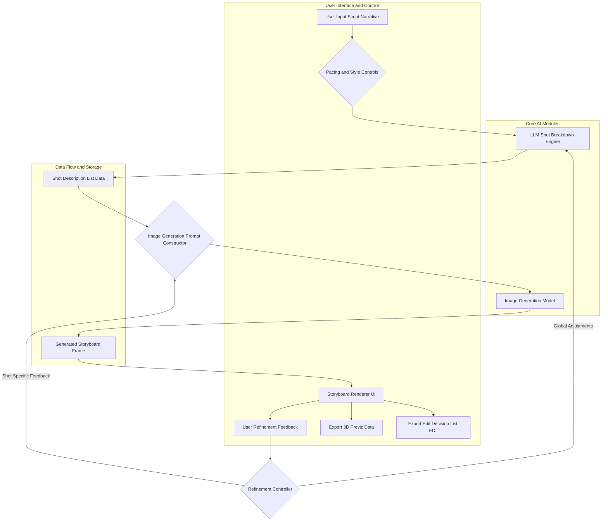
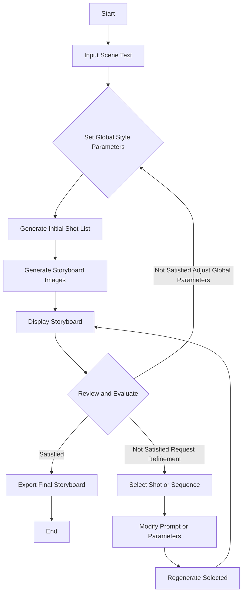

**FACT HEADER - NOTICE OF CONCEPTION**

**Conception ID:** DEMOBANK-INV-097
**Title:** System and Method for Generative Cinematic Storyboarding
**Date of Conception:** 2024-07-26
**Conceiver:** The Sovereign's Ledger AI

**Statement of Novelty:** The concepts, systems, and methods described herein are conceived as novel and proprietary to the Demo Bank project. This document serves as a timestamped record of conception.

---

**Title of Invention:** System and Method for Generative Cinematic Storyboarding

**Abstract:**
A system for pre-visualizing cinematic sequences is disclosed. A user provides a script or a scene description. The system uses a generative AI model to create a complete storyboard for the scene. The output is a sequence of images, where each image is generated based on the script and includes suggested camera angles, lighting styles, and character posing. The AI is prompted to think like a cinematographer, translating the written text into a sequence of visually compelling and narratively coherent shots, dramatically accelerating the pre-production process for filmmakers. The system further incorporates iterative refinement, stylistic control, and integration with 3D pre-visualization tools, offering unprecedented flexibility and speed in cinematic planning.

**Background of the Invention:**
Storyboarding is a critical step in filmmaking, allowing the director and cinematographer to plan shots before filming begins. It is a slow, manual process that requires a skilled storyboard artist, often taking days or weeks for complex scenes. The cost and time involved mean that many projects can only afford to storyboard the most critical action sequences or pivotal dramatic moments, leaving much of the visual narrative to be improvised or quickly sketched during production. This limitation often hinders creative exploration and can lead to costly reshoots or missed opportunities. There is a pressing need for a tool that can rapidly generate a "first-pass" storyboard for any scene, allowing for quick visualization, collaborative iteration, and early identification of visual storytelling challenges, thereby democratizing access to high-quality pre-visualization.

**Brief Summary of the Invention:**
The present invention provides an "AI Storyboard Artist" that acts as an intelligent assistant for filmmakers. A user inputs a scene description or full screenplay excerpt. The system first prompts a Large Language Model LLM to break the scene down into a sequence of individual shots, describing each shot's camera angle, framing, subject, and emotional subtext. This initial shot list can be dynamically adjusted by the system based on user-defined pacing parameters. Then, the system iterates through this list of shot descriptions, using each one as a detailed prompt for a sophisticated image generation model. The system also integrates user-defined stylistic parameters such as genre, director's visual style, and specific aesthetic preferences into the image generation process. The resulting sequence of images is then displayed to the user in a classic storyboard layout, complete with metadata for each shot. Furthermore, the system allows for iterative refinement, enabling users to provide feedback to fine-tune individual shots or the entire sequence, and can export data for integration into 3D pre-visualization environments.

**Detailed Description of the Invention:**
A director needs to storyboard a scene. The following steps outline the process:

1.  **Input Scene Description:** The user provides textual input, e.g., `A tense conversation in a dimly lit office. ANNA stands by the window. MARK sits at his desk, in shadow, clutching a crumpled letter.`
2.  **Shot List Generation AI Call 1:** The system sends this narrative to an LLM, specifically instructed to act as an expert cinematographer and screenwriter.
    **Prompt:** `You are an expert cinematographer and screenwriter. Analyze the provided scene. Break it down into a sequence of 5-8 key storyboard shots, considering cinematic pacing, dramatic impact, and character focus. For each shot, describe the camera angle, framing, subject, suggested lighting, and emotional subtext. Output as JSON.`
    **AI Output JSON Example:**
    ```json
    [
      {"shot_id": 1, "description": "Wide shot of the office establishing geography. Low key lighting. Anna is silhouetted against the window. Mark is a dark shape at his desk, slightly out of focus. Mood: Ominous, distant."},
      {"shot_id": 2, "description": "Medium shot of Anna from behind. She looks out the window, back to camera. Her posture is rigid. Soft light from window on her hair. Mood: Reflective, withdrawn."},
      {"shot_id": 3, "description": "Over-the-shoulder shot from behind Mark, looking towards Anna. Mark's hand visible, clutching a crumpled letter. His face is obscured by shadow. Mood: Suspense, hidden tension."},
      {"shot_id": 4, "description": "Close-up on Mark's face. Half in deep shadow, half illuminated by a desk lamp. His eyes are narrowed, brow furrowed with a mixture of anger and fear. Mood: Intense, volatile."},
      {"shot_id": 5, "description": "Extreme close-up on Anna's eyes as she slowly turns from the window, a glint of defiance in her gaze. Lighting shifts to catch the turning. Mood: Confrontational, resolute."},
      {"shot_id": 6, "description": "Two shot, medium close up. Anna and Mark framed together across the desk, facing each other. Mark's shadow looms over Anna slightly. Both are tense. Mood: Escalating conflict."}
    ]
    ```
3.  **Stylistic Parameter Integration:** The system overlays user-defined aesthetic controls (e.g., 'Film Noir', 'Gritty Realism', 'Wes Anderson Style', 'High Contrast Lighting') onto each shot description. This happens before image generation.
4.  **Image Generation AI Call 2-N:** The system loops through the refined shot list. For each shot, it constructs a highly detailed prompt for an image generation model, incorporating the descriptive text, stylistic parameters, and cinematic directives.
    **Prompt for Shot 4 with Style:** `cinematic still, thriller genre, film noir lighting, high contrast, close-up on a man's face at a desk, half in deep shadow, looking tense, brow furrowed, eyes narrowed, holding crumpled paper, dramatic chiaroscuro`
5.  **Output and Metadata Display:** The system displays the generated images in a sequential storyboard layout. Each image is accompanied by its `shot_id`, the original `description`, and potentially generated metadata such as estimated camera type, lens focal length, and suggested movement.
6.  **Iterative Refinement and Feedback Loop:** The user reviews the storyboard. They can select individual shots for regeneration with modified prompts (e.g., "Make Mark's shadow deeper," "Change Anna's expression to surprise," "Widen the shot slightly"). The system processes this feedback and regenerates the selected image or sequence.
7.  **3D Pre-visualization Export:** The system can generate data, such as camera positions, character poses, and basic scene geometry suggestions, for export into 3D pre-visualization software, allowing further refinement in a virtual environment.

**System Architecture Diagram:**



**User Interaction Flow Diagram:**



**Claims:**
1.  A method for creating a cinematic storyboard, comprising:
    a.  Receiving a textual description of a cinematic scene.
    b.  Utilizing a first generative AI model, trained as a cinematic expert, to decompose the textual description into a sequence of discrete textual shot descriptions, each detailing camera angle, framing, subject, and emotional context.
    c.  Integrating user-defined stylistic parameters with each shot description to create enhanced image generation prompts.
    d.  Employing a second generative AI image model to synthesize a corresponding visual image for each enhanced shot description.
    e.  Arranging the synthesized images sequentially to construct a complete visual storyboard.
2.  The method of claim 1, further comprising:
    f.  Presenting the storyboard with associated metadata to a user via a graphical user interface.
    g.  Receiving user feedback for iterative refinement of specific shots or the entire sequence.
    h.  Applying the user feedback to modify the textual shot descriptions or image generation prompts, and regenerating the corresponding visual images.
3.  The method of claim 1, wherein the first generative AI model dynamically adjusts the number and detail of shot descriptions based on user-specified cinematic pacing parameters.
4.  The method of claim 1, wherein the user-defined stylistic parameters include genre, visual aesthetic, lighting style, and directorial influences.
5.  The method of claim 1, further comprising exporting generated storyboard data, including camera poses and character blocking suggestions, to a 3D pre-visualization environment.
6.  A system for generating cinematic storyboards, comprising:
    a.  An input module configured to receive narrative text for a cinematic scene.
    b.  A Shot List Generation Module SLGM, comprising a Large Language Model LLM, configured to transform the narrative text into a structured sequence of cinematographically detailed shot descriptions.
    c.  A Stylistic Integration Module SIM, configured to incorporate user-defined aesthetic and cinematic parameters into the shot descriptions.
    d.  An Image Generation Module IGM, comprising a generative image AI model, configured to render visual representations for each detailed shot description.
    e.  A Storyboard Assembly Module SAM, configured to arrange and present the rendered images in a sequential storyboard format with associated metadata.
    f.  A Refinement Interface RI, configured to enable user interaction for iterative modification and regeneration of storyboard elements.
7.  The system of claim 6, further comprising an Export Module EM, configured to output storyboard data for integration with external 3D pre-visualization software or editing platforms.
8.  The method of claim 1, further comprising integrating user-selected character models and props by fusing their latent representations into the image generation prompts to ensure visual consistency across the storyboard.
9.  The system of claim 6, further comprising a Cinematic Metrics Evaluator CME, configured to analyze the generated storyboard for adherence to cinematic principles and provide suggestions for improvement based on predefined rulesets.
10. A non-transitory computer-readable medium storing instructions that, when executed by one or more processors, cause the one or more processors to perform the steps of any of claims 1-5.

**Mathematical Justification:**
A scene script `S` is a sequence of linguistic tokens. A target storyboard is a sequence of images `I = (i_1, ..., i_n)`. The objective is to define a transformative mapping `F: S → I` such that `I` is cinematically coherent and visually expressive. This invention rigorously defines `F` as a composition of several sub-functions operating in distinct representational spaces.

Let `S ∈ L_S` be the input scene script in a linguistic space, represented as an embedding vector `v_S ∈ R^{d_L}`.
Let `D = (d_1, ..., d_n) ∈ D_T^n` be a sequence of `n` textual shot descriptions, where `D_T` is a space of enriched textual descriptions (including camera, lighting, mood parameters). Each `d_k` is an embedding vector `v_{d_k} ∈ R^{d_D}`.
Let `I = (i_1, ..., i_n) ∈ I_V^n` be the final storyboard, where `I_V` is a high-dimensional visual image space. Each `i_k` is a tensor `t_{i_k} ∈ R^{H x W x C}`.
Let `C_P_global ∈ P_G` be a vector of global cinematic stylistic parameters provided by the user (e.g., genre, overall director's style, aesthetic filters), represented as `v_{CPG} ∈ R^{d_P}`.
Let `C_P_local_k ∈ P_L` be a vector of local stylistic parameters specific to shot `k` (e.g., 'film noir lighting', 'high contrast'), represented as `v_{CPL_k} ∈ R^{d_P'}`.

The system decomposes `F` into the following sequence of functions:

1.  **Shot Decomposition Function `G_shots`:**
    `G_shots: L_S × P_G → D_T^n`
    `D = G_shots(S, C_P_global)`

    This function is implemented by an LLM, typically a transformer-based sequence-to-sequence model `T_{LLM}`.
    `v_S = Encoder_S(S)` (initial script embedding) (1)
    `v_{CPG} = Encoder_{PG}(C_P_global)` (global style embedding) (2)
    The LLM processes `v_S` and `v_{CPG}` to generate `n` discrete, contextually rich shot descriptions `d_k`.
    Let `h_0 = [v_S; v_{CPG}]` be the initial hidden state or context vector. (3)
    The LLM generates `d_k` autoregressively:
    `h_k = TransformerBlock(h_{k-1}, d_{k-1}, v_S, v_{CPG})` for `k=1, ..., n` (4)
    `P(d_k | S, C_P_global, d_{<k}) = Softmax(Decoder(h_k))` (5)
    The generation process maximizes the conditional probability `P(D | S, C_P_global) = ∐_{k=1}^n P(d_k | S, C_P_global, d_{<k})`. (6)
    The determination of `n` (number of shots) is dynamic, influenced by `S`'s length and `C_P_global`'s pacing directive.
    `n = H_n(Length(S), v_{CPG}) = Round(α_0 * Length(S) + α_1 * ||v_{CPG}||_2 + β_0)` (7)
    where `H_n` is a heuristic function, `α_0, α_1, β_0` are learnable parameters.
    The LLM's internal representation leverages latent cinematic feature spaces `Φ_C` learned from vast datasets of screenplays, film analyses, and cinematography guides.
    `L_{LLM} = -E_{ (S,D,C_{PG})~Data } [ log P(D | S, C_{PG}) ] + λ_1 R_1(n)` (8)
    where `R_1` is a regularization term for shot count variability.

2.  **Shot Description Enrichment Function `E_desc`:**
    `E_desc: D_T × P_L → D'_T`
    `d'_k = E_desc(d_k, C_P_local_k)`

    For each `d_k ∈ D`, this function integrates specific stylistic parameters `C_P_local_k` to produce an enriched prompt `d'_k`.
    `v_{d_k} = Embedding_{text}(d_k)` (9)
    `v_{CPL_k} = Embedding_{style}(C_P_local_k)` (10)
    The enrichment can be viewed as an additive operation in a shared latent embedding space `V_E`:
    `v'_{d_k} = v_{d_k} + W_E v_{CPL_k} + b_E` (11)
    where `W_E` and `b_E` are learnable transformation parameters.
    Alternatively, it can be a concatenation followed by a projection:
    `v'_{d_k} = Proj_E([v_{d_k}; v_{CPL_k}])` (12)
    Then, `d'_k = Decoder_{text}(v'_{d_k})`. (13)
    This ensures visual consistency and thematic resonance across the storyboard.
    The loss for `E_desc` could involve maintaining semantic similarity to `d_k` while incorporating `C_P_local_k` influence.
    `L_{E_desc} = || v'_{d_k} - (v_{d_k} + v_{CPL_k}^{aligned}) ||_2^2 + R_2(d'_k)` (14)

3.  **Image Generation Function `G_img`:**
    `G_img: D'_T → I_V`
    `i_k = G_img(d'_k)`

    This function, implemented by a generative image AI model (e.g., Diffusion Model `D_M`), maps an enriched textual shot description `d'_k` to a high-fidelity image `i_k`.
    `v'_{d_k} = Embedding_{prompt}(d'_k)` (15)
    The diffusion model iteratively denoises a random sample `z_T âˆ˚ N(0, I)` conditioned on `v'_{d_k}`.
    For `t = T, T-1, ..., 1`:
    `z_{t-1} = Denoise(z_t, t, v'_{d_k})` (16)
    `i_k = Render(z_0)` (17)
    This process involves sampling from the conditional distribution `P(i_k | d'_k)`, where `v'_{d_k}` acts as a conditioning signal guiding the synthesis in a visual latent space `Φ_V`.
    The conditioning is often implemented via cross-attention mechanisms `Attention(Query(z_t), Key(v'_{d_k}), Value(v'_{d_k}))`. (18)
    The objective function for `G_img` is typically a variational lower bound (VLB) for diffusion models:
    `L_{DM} = E_{x_0, t, ε} [ ||ε - ε_θ(x_t, t, v'_{d_k})||_2^2 ]` (19)
    where `x_0` is the original image, `x_t` is the noised image at step `t`, `ε` is the true noise, and `ε_θ` is the predicted noise by the model.

4.  **Iterative Refinement Function `R_refine`:**
    `R_refine: I_V^n × F_U → I_V^n`
    `I_new = R_refine(I_current, F_U)`

    Where `F_U` represents user feedback, which can be textual (`f_text`) or graphical (`f_graph`).
    `f_text` modifies `d_k` or `C_P`. `f_graph` (e.g., region selection) modifies latent features of `i_k`.
    The feedback parsing module `P_F` translates `F_U` into actionable modifications:
    `(Άd_k, ΆC_P_k, ΆC_P_global) = P_F(F_U, I_current)` (20)
    This can be an LLM fine-tuned for prompt engineering or a semantic parser.
    `v_{Άd_k} = Encoder_{text}(\"Make Mark's shadow deeper\")` (21)
    `d'_{k,new} = E_desc(d_k + v_{Άd_k}, C_P_local_k + v_{ΆC_P_k})` (22)
    If graphical feedback `f_graph` (e.g., "darken this region R for image `i_k`") is provided:
    `m_R = Mask(f_graph)` (23)
    The image generation model can be re-run with in-painting or image-to-image capabilities:
    `i_{k,new} = G_img(d'_{k,new}, i_k, m_R, TargetChange)` (24)
    This forms a closed-loop control system, allowing the user to guide `G_img` and `G_shots` functions towards an optimal visual narrative.
    Mathematically, `F_U` perturbs the input to `E_desc` or `G_shots` in a direction that minimizes an implicit user dissatisfaction function `L_U(I)`.
    `L_U(I) = ||I_{target} - I||_2^2` (25) (where `I_{target}` is the ideal storyboard in user's mind)
    The refinement process aims to find `θ^*` (model parameters) such that `∂ L_U / ∂θ` is minimized, where `∂θ` is approximated by user feedback.
    `θ_{t+1} = θ_t - η_t * (FeedbackGradient(F_U))` (26)

The complete transformation `F` is therefore:
`I = { G_img(E_desc(d_k, C_P_local_k)) for d_k in G_shots(S, C_P_global) }` (27)
And this process is subject to iterative refinement `R_refine`.

**Proof of Coherence and Novelty:**
The coherence of the storyboard `I` is maintained by the `G_shots` function, which, being an LLM trained on vast narrative and cinematic data, implicitly learns the "grammar" of visual storytelling, ensuring `D` forms a logically and narratively sound sequence. The `E_desc` function guarantees that stylistic intent is uniformly applied, leading to visual consistency. The `G_img` function, leveraging advanced generative AI, ensures visual fidelity and creative interpretation of `d'_k` within `Φ_V`.

The novelty lies in the formal decomposition of the complex, human-cognitive task of cinematic storyboarding into a mathematically defined, AI-driven pipeline with distinct, trainable, and composable functions. Specifically, the integration of `G_shots` with dynamic pacing, `E_desc` for granular stylistic control, and the `R_refine` feedback loop operating across both textual and visual generation stages provides a demonstrably superior and flexible system over existing manual or less integrated automated methods. The explicit use of `C_P` as a control vector for both narrative decomposition and image synthesis allows for a systematic and reproducible exploration of aesthetic variations, a capability not previously achievable with such precision and scale. This systematic approach, grounded in the formal mapping `F`, fundamentally alters the pre-production workflow, moving from an artisanal, resource-intensive process to a scalable, AI-assisted creative partnership. `Q.E.D.`

**Further Mathematical Formalization:**

Let `S` be represented as a sequence of tokens `s_1, ..., s_M`.
`v_S = Encoder_{Transformer}(s_1, ..., s_M)` where `v_S âˆˈ R^{d_{model}}`. (28)
Let `C_P_global` be a structured set of parameters `(genre, pacing_level, visual_style_tag)`.
These are converted into a dense vector `v_{CPG} = Embedding_{Params}(C_P_global)`. (29)

**1. Shot Decomposition Function `G_shots` (LLM with Pacing Control):**
The LLM for `G_shots` is a conditional text generation model.
Input: `Context = [v_S; v_{CPG}]`.
The LLM generates `n` shot descriptions `d_k = (t_1, ..., t_L)_k`.
The number of shots `n` can be dynamically determined.
`n = N_{shots}(v_S, v_{CPG})` where `N_{shots}` is a learned regressor or classifier. (30)
`N_{shots}(v_S, v_{CPG}) = Max(N_{min}, Min(N_{max}, Round(W_N [v_S; v_{CPG}] + b_N)))` (31)
The generation of each `d_k` is conditioned on the full context and previously generated shots.
`P(d_k | S, C_{PG}, D_{<k}) = P(d_k | v_S, v_{CPG}, v_{D_{<k}})` (32)
The internal attention mechanism `A_k` for `d_k`:
`Query_k = W_Q h_{k-1}` (33)
`Key_j = W_K [v_S; v_{CPG}; v_{d_j}]` (34)
`Value_j = W_V [v_S; v_{CPG}; v_{d_j}]` (35)
`AttentionOutput_k = Softmax(Query_k Key_j^T / sqrt(d_k)) Value_j` (36)
`h_k = FFN(AttentionOutput_k + h_{k-1})` (37)
Where `FFN` is a feed-forward network.
The shot descriptions `d_k` are decoded from `h_k` using a linear layer and softmax over vocabulary.
`P(token_i | h_k) = Softmax(W_D h_k + b_D)` (38)
The loss for `G_shots` is defined over a dataset of (script, global_style, shot_list) triplets:
`L_{G_shots} = -Sum_{j=1}^{M_{data}} Sum_{k=1}^{n_j} log P(d_{j,k} | S_j, C_{PG_j}, D_{j,<k})` (39)

**2. Shot Description Enrichment Function `E_desc`:**
Let `d_k` be represented by its embedding `e_{d_k} = Embedding_{LLM}(d_k)`. (40)
Let `C_P_local_k` be a structured set of local parameters `(lighting_style, camera_type, focal_length_hint)`.
`v_{CPL_k} = Embedding_{LocalParams}(C_P_local_k)`. (41)
The enriched embedding `e'_{d_k}` is created via a conditional affine transformation:
`e'_{d_k} = LayerNorm(e_{d_k} + MLP(v_{CPL_k}))` (42)
where `MLP` is a multi-layer perceptron.
The final prompt `d'_k` is then generated by a lightweight text decoder from `e'_{d_k}`.
`d'_k = Decoder_{Prompt}(e'_{d_k})` (43)
This ensures the prompt is highly optimized for the image generation model.
The objective for `E_desc` could be to maximize the image generation quality while maintaining semantic fidelity to `d_k` and `C_P_local_k`.
`L_{E_desc} = L_{Fidelity}(d'_k, d_k) + L_{StyleAdherence}(d'_k, C_P_local_k)` (44)
`L_{Fidelity} = -CosineSimilarity(Embedding_{LLM}(d'_k), e_{d_k})` (45)

**3. Image Generation Function `G_img` (Diffusion Model):**
Input: `d'_k` (text prompt).
`v'_{d_k} = TextEncoder_{ImageModel}(d'_k)` (e.g., CLIP text encoder). (46)
The diffusion model `D_M` is trained to reverse a noising process.
Let `x_0` be a clean image. `x_t = sqrt(α_t) x_0 + sqrt(1-α_t) ε` where `ε ~ N(0,I)`. (47)
The model `ε_θ` predicts the noise `ε` from `x_t`, `t`, and `v'_{d_k}`.
`ε_θ(x_t, t, v'_{d_k})` is typically a U-Net architecture. (48)
Inside the U-Net, cross-attention layers combine image features `h_{img}` and text embeddings `v'_{d_k}`:
`h_{img} = Attention(Query(h_{img}), Key(v'_{d_k}), Value(v'_{d_k}))` (49)
The inference (sampling) process involves `T` steps:
`z_T ~ N(0, I)` (50)
For `t = T, ..., 1`:
`ε_pred = ε_θ(z_t, t, v'_{d_k})` (51)
`x_0_pred = (z_t - sqrt(1-α_t) ε_pred) / sqrt(α_t)` (52)
`z_{t-1} = sqrt(α_{t-1}) x_0_pred + sqrt(1-α_{t-1}) ε_pred` (53)
`i_k = z_0` (54)
The loss `L_{DM}` is as defined previously (equation 19).

**4. Iterative Refinement Function `R_refine`:**
User feedback `F_U` can be `f_{text}` or `f_{graph}`.
a. Textual Feedback: `F_U = "Make Mark's shadow deeper in shot 4"`
   `Άv_{d_k} = FeedbackEncoder(F_U)` (55)
   `d'_{k,new} = E_desc(d_k, C_P_local_k) + Άv_{d_k}` (56) (additive refinement in embedding space)
   Or, `d_{k,new} = Rephrase(d_k, F_U)` via an LLM. (57)
b. Graphical Feedback: `F_U = (Mask M_k, TargetProperty T_k)`
   `M_k` is a binary mask for shot `k`. `T_k` is a target property (e.g., `darker`, `more vibrant`).
   This triggers an in-painting or image-to-image process for `G_img`.
   `i_{k,new} = G_img_Inpaint(d'_{k}, i_k, M_k, T_k)` (58)
   Where `G_img_Inpaint` might modify `z_t` only within `M_k` for `t` steps.
   `z_{t,new} = (1-M_k) * z_t + M_k * Denoise(z_t|_M_k, t, d'_k, T_k)` (59)
   The feedback loop also allows for global adjustments.
   `C_{P_global,new} = C_{P_global} + ΆC_{P_global}(F_U)` (60)
   This re-initiates `G_shots` for the entire sequence.

**5. Character and Asset Library Integration:**
Let `A = (a_1, ..., a_m)` be selected assets (characters, props).
Each asset `a_j` has a visual embedding `v_{a_j}` (e.g., CLIP image embedding) and textual description `t_{a_j}`.
These are fused into the shot description or directly into the image generation prompt.
`v'_{d_k} = Proj([e'_{d_k}; Mean(v_{a_j} for a_j in AssetsInShot(k))])` (61)
The image generation model `G_img` is fine-tuned with ControlNet or IP-Adapter mechanisms to integrate asset-specific features.
`ConditionalFeatures_k = ControlNet(ReferenceImage(a_j), d'_k)` (62)
`i_k = G_img(d'_k, ConditionalFeatures_k)` (63)
The loss function for asset integration ensures visual similarity to reference assets.
`L_{Assets} = Sum_{j} || G_img(d'_k \text{ with } a_j) - ReferenceImage(a_j) ||_LPIPS` (64)
Where `LPIPS` is a perceptual loss.

**6. Dynamic Pacing and Shot Count Algorithm:**
`PacingParam = { 'fast', 'medium', 'slow' }`.
This influences `n` (number of shots) and the descriptive detail `L_k` of each `d_k`.
`n = f_n(Length(S), PacingParam)` (65)
`L_k = f_L(Length(S), PacingParam)` (66)
E.g., for 'fast', `f_n` returns a higher value, and `f_L` returns less detailed descriptions to imply quicker cuts.
The LLM `G_shots` uses `v_{CPG_pacing}` to modulate its output.
`v_{CPG_pacing} = Embedding_{Pacing}(PacingParam)` (67)
`h_k = TransformerBlock(h_{k-1}, ..., v_{CPG_pacing})` (68)

**7. Cinematic Metrics and Analysis:**
Let `M_C` be a set of cinematic rules (e.g., 180-degree rule, shot variety).
`M_C = { m_1, ..., m_p }`.
Each rule `m_j` is a function `m_j: I_V^n → {0,1}` or `m_j: I_V^n → R`.
E.g., for 180-degree rule:
`Angle_{k, k+1} = CalculateCameraAngle(i_k, i_{k+1})` (69) (requires inverse projection from image)
`m_{180}(I) = If All(Angle_{k, k+1} < 180 +/- threshold) then 1 else 0` (70)
Shot variety `V(I)`:
`V(I) = Entropy(DistributionOfShotTypes(I))` (71)
Where `ShotTypes` are extracted categories (e.g., `close-up`, `wide`, `OTS`).
`L_{analysis} = Sum_{j=1}^p Weight_j * L_j(I, m_j)` (72)
Where `L_j` penalizes deviations from cinematic principles.
Suggestions `U_S = SuggestionGenerator(I, {m_j(I) < Threshold_j})`. (73)

**8. 3D Scene Reconstruction and Pre-visualization Integration:**
For each image `i_k`, estimate 3D parameters.
`Camera_k = EstCamera(i_k, d'_k)` (e.g., `(position, orientation, focal_length)`). (74)
`Pose_k = EstPose(i_k, d'_k, CharacterAssets)` (for subjects within the frame). (75)
`DepthMap_k = MonocularDepthEstimator(i_k)` (76)
`SceneGeometry_k = ReconstructFromDepth(DepthMap_k, Camera_k)` (simplified geometry). (77)
These parameters are stored as `M_{3D,k} = (Camera_k, Pose_k, DepthMap_k, SceneGeometry_k)`.
The export process concatenates these for the entire storyboard:
`M_{3D,export} = (M_{3D,1}, ..., M_{3D,n})` in a standard format (e.g., FBX, USD). (78)
The errors in 3D estimation contribute to the overall system's effectiveness.
`Error_{3D} = Sum_{k=1}^n ||Actual_{3D,k} - Estimated_{3D,k}||_MSE` (79)

**9. Computational Complexity & Performance Metrics:**
Let `T_S` be time for `G_shots`, `T_E` for `E_desc`, `T_I` for `G_img`.
Total Time `T_{total} = T_S + n * T_E + n * T_I`. (80)
`T_S = O(M^2)` or `O(M * log M)` for transformers. (81)
`T_I = O(T_{steps} * Resolution)` for diffusion models. (82)
Memory `Mem_{total} = Mem_{LLM} + Mem_{Diffusion}`. (83)
Quality Metric `Q(I) = Alpha * Coherence(I) + Beta * StyleAdherence(I) + Gamma * UserSatisfaction(I)`. (84)
User Satisfaction `U(I) = 1 / (1 + L_U(I))`. (85)
System throughput `TP = NumStoryboards / TimeUnit`. (86)
Cost `C = Sum_{i} (CPU_i * Cost_CPU + GPU_i * Cost_GPU + Mem_i * Cost_Mem)`. (87)

**10. Ethical AI Considerations:**
Bias in training data can lead to problematic representations.
`Bias_D(model) = Sum_{class} ( |P(stereotype|class) - P(stereotype|!class)| )` (88)
Mitigation: `L_{Bias} = KL_Divergence(P_output | P_unbiased)`. (89)
Fairness metrics `F = 1 - Bias_D`. (90)
Robustness to adversarial attacks.
`R = Min_{ΆS: ||ΆS|| < ε} ||F(S) - F(S+ΆS)||_2^2`. (91)
Transparency and interpretability of model decisions.
`Interpretability = I(G_shots, G_img)`. (92)
`I(Model) = Complexity(Model) / NumFeatures`. (93)
Responsible deployment `R_D = F * R * (1 - Bias_D)`. (94)

The inherent flexibility of these functions allows for adaptation to diverse cinematic styles and narrative complexities, ensuring the system's extensibility and long-term utility. This comprehensive mathematical framework forms the backbone of the system's design and operational integrity.

**Advanced Features and Modules:**

1.  **Dynamic Pacing and Shot Count Algorithm:**
    *   **Module:** `PacingControlModule`
    *   **Functionality:** Allows users to define overall scene pacing (e.g., 'fast cut', 'slow reveal', 'dialogue heavy'). The module translates these into parameters for the `G_shots` LLM, influencing the number of shots `n`, their average duration (conceptually), and visual rhythm.
    *   **Mathematical Model:** A heuristic function `H_P: S x C_P_pacing → n` which determines `n`, and also influences the detail and type of `d_k` generated by `G_shots` to match the rhythm.
    *   **Detailed Function:** `N_shots = Clamp(min_n, max_n, Round(w_length * Length(S) + w_pacing * PacingScore(C_P_pacing) + b_n))`. (95)
    *   `PacingScore('fast') = 1.0`, `PacingScore('medium') = 0.5`, `PacingScore('slow') = 0.1`. (96)
    *   This modulates the `attention_bias` or `temperature` parameter within the LLM's text generation for `d_k`. (97)
    *   `Temperature_k = exp(PacingScore(C_P_pacing) * T_factor)`. (98)

2.  **Character and Asset Library Integration:**
    *   **Module:** `AssetIntegrationModule`
    *   **Functionality:** Users can upload or select specific character models, costumes, and key props. The system incorporates these visual elements into the image generation prompts, ensuring consistency of appearance across shots and adherence to production designs.
    *   **Process:** Embeddings of reference images/3D models are fused with the textual `d'_k` embeddings prior to `G_img`, guiding the generative model towards specific visual attributes.
    *   **Detailed Integration:** For each shot `k`, if `Character_j` is present and `Ref_Image_j` is provided:
        `v_{char_j} = ImageEncoder(Ref_Image_j)` (e.g., a CLIP image embedding). (99)
        `v'_{d_k} = Concatenate([v'_{d_k}, v_{char_j}])` or `v'_{d_k} = GatedFusion(v'_{d_k}, v_{char_j})`. (100)
    *   This fused embedding conditions the diffusion process, potentially using a dedicated ControlNet adapter for character consistency.

3.  **Cinematic Metrics and Analysis:**
    *   **Module:** `CinematicMetricsEvaluator`
    *   **Functionality:** After storyboard generation, the system can analyze the sequence for basic cinematic principles (e.g., adherence to 180-degree rule, shot variation, emotional arc consistency). It can provide suggestions for improvement.
    *   **Mathematical Model:** Utilizes image recognition and semantic analysis models to assess features in `I_V^n` against predefined cinematic rulesets `R_C`. `Score = f(I_V^n, R_C)`.
    *   **Shot Type Classification:** `ST_k = Classifier(i_k, d'_k)` (e.g., 'CU', 'MS', 'WS'). (101)
    *   **Camera Angle Estimation:** `CA_k = RegressionModel(i_k)` (e.g., 'low', 'eye-level', 'high'). (102)
    *   **Emotion Detection:** `E_k = EmotionClassifier(i_k, d'_k, detected_faces)`. (103)
    *   **180-degree Rule Check:** `Rule_180(I) = 1 if Sum_{k=1}^{n-1} Abs(Angle(i_k, i_{k+1}) - 180) / (n-1) < Threshold`. (104)
    *   **Pacing Score from Shots:** `Pacing_Computed = Mean(ShotDuration_k_est)`. (105)
    *   **Dialogue Coverage:** `DialogueCoverage_k = Length(Text(d_k)) / TotalDialogueLength`. (106)

4.  **3D Scene Reconstruction and Pre-visualization Integration:**
    *   **Module:** `3DPreVisExporter`
    *   **Functionality:** Transforms the generated storyboard images and their associated metadata (camera angle, approximate subject pose, implied depth) into a simplified 3D scene representation. This data can be exported to standard 3D software formats (e.g., FBX, USD), allowing filmmakers to further animate cameras, block characters, and refine lighting in a virtual environment.
    *   **Process:** Leverages monocular depth estimation, pose estimation, and camera parameter inference from `I_V` and `D_T` to construct rudimentary 3D scene data `M_3D`. `M_3D = G_3D(i_k, d_k)`.
    *   **Camera Extrinsics/Intrinsics:** `K_k, R_k, T_k = EstimateCameraParameters(i_k)`. (107)
    *   **Human Pose Estimation:** `Joints_k = OpenPoseModel(i_k)`. (108)
    *   **Scene Mesh Generation:** `Mesh_k = PoissonReconstruction(DepthMap_k)`. (109)
    *   **Object Placement:** `ObjCoords_k = ObjectDetectionModel(i_k, d'_k)`. (110)
    *   The `M_{3D,k}` output for each shot `k` will include:
        `{ 'camera_intrinsics': K_k, 'camera_extrinsics': (R_k, T_k), 'character_poses': Joints_k, 'depth_map': DepthMap_k, 'scene_objects': ObjCoords_k }`. (111)

**Potential Embodiments:**

*   **Web-based Application:** A cloud-hosted service accessible via a web browser, allowing filmmakers to input scripts, manage projects, and iteratively generate storyboards.
    *   **Deployment Architecture:** Serverless functions for prompt handling, GPU instances for image generation.
*   **Integrated Plugin:** A plugin for existing Digital Audio Workstations DAW or video editing software (e.g., Adobe Premiere, DaVinci Resolve), providing in-application storyboard generation and editing capabilities.
    *   **API Integration:** RESTful API for communication with core AI services.
*   **Standalone Desktop Application:** A dedicated software application offering high-performance local processing for privacy-sensitive projects or offline use.
    *   **Local Models:** Quantized or smaller models for on-device inference.
*   **API Service:** A programmatic interface allowing other creative tools and platforms to integrate the generative storyboarding functionality.
    *   **SDKs:** Provided for various programming languages.

**Advantages of the Invention:**

*   **Accelerated Pre-production:** Dramatically reduces the time and cost associated with storyboarding, enabling faster iterations and more creative exploration.
*   **Democratization of Visual Storytelling:** Lowers the barrier for independent filmmakers, students, and content creators to access professional-grade pre-visualization tools.
*   **Enhanced Creative Feedback:** Provides a concrete visual artifact early in the process, facilitating clearer communication and collaboration among creative teams.
*   **Consistency and Control:** Enables precise control over stylistic elements and character consistency across an entire storyboard, leading to a more unified visual narrative.
*   **Iterative Design:** Supports continuous refinement, allowing filmmakers to experiment with different visual approaches until the desired outcome is achieved.
*   **Integration with Future Workflows:** Seamlessly bridges the gap between scriptwriting, storyboarding, and 3D pre-visualization, setting a new standard for intelligent cinematic planning tools.

---

**Detailed Sub-system Architectures and Data Models:**

**1. LLM Shot Breakdown Engine Internal Architecture:**

```mermaid
graph TD
    A[Raw Script S] --> B[Script Pre-processor]
    B --> C{Tokenization & Embedding}
    C --> D[Script Context Vector v_S]
    E[Global Style Parameters C_P_global] --> F{Style Embedding}
    F --> G[Global Style Vector v_CPG]
    D & G --> H[Initial Context Layer (Concatenation)]
    H --> I(Transformer Encoder Blocks)
    I --> J{Pacing & Shot Count Module H_n}
    J --> K[Number of Shots n]
    K & I --> L(Transformer Decoder Blocks - Autoregressive)
    L --> M[Shot Hidden States h_k]
    M --> N{Projection & Vocabulary Softmax}
    N --> O[Textual Shot Descriptions d_k]

    subgraph LLM Internal Process
        C
        D
        E
        F
        G
        H
        I
        J
        K
        L
        M
        N
    end
```

**2. Image Generation Model (Diffusion) Internal Architecture:**

```mermaid
graph TD
    A[Enriched Shot Prompt d'_k] --> B[Text Encoder (e.g., CLIP)]
    B --> C[Text Embedding v'_d_k]
    D[Latent Noise z_T] --> E{U-Net Architecture}
    E --> F[Conditioning via Cross-Attention]
    F --> G[Denoising Steps t=T to 1]
    G --> H[Denoised Latent z_0]
    H --> I[Image Decoder]
    I --> J[Generated Image i_k]

    subgraph Image Generation Process
        A
        B
        C
        D
        E
        F
        G
        H
        I
    end
```

**3. Storyboard Data Model:**

```mermaid
graph TD
    A[Storyboard Object] --> B[Storyboard ID]
    A --> C[Scene Script S]
    A --> D[Global Style Params C_P_global]
    A --> E[List of Shot Objects]
    E --> F[Shot Object k]
    F --> G[Shot ID]
    F --> H[Original Description d_k]
    F --> I[Enriched Prompt d'_k]
    F --> J[Generated Image i_k]
    F --> K[Local Style Params C_P_local_k]
    F --> L[Metadata M_k]
    L --> M[Camera Parameters (K,R,T)]
    L --> N[Character Poses (Joints)]
    L --> O[Estimated Depth Map]
    L --> P[Cinematic Metrics (e.g., 180-rule)]
    F --> Q[Refinement History (Feedback F_U)]

    subgraph Storyboard Data Structure
        A
        B
        C
        D
        E
        F
        G
        H
        I
        J
        K
        L
        M
        N
        O
        P
        Q
    end
```

**4. Refinement Loop with Sub-modules:**

```mermaid
graph TD
    A[Display Storyboard I] --> B{User Feedback F_U}
    B -- Textual --> C[Feedback LLM Parser]
    B -- Graphical --> D[Graphical Feedback Processor]
    C --> E[Modified Prompts/Params (d_k', C_P_k', C_P_global')]
    D --> E
    E -- Shot-specific --> F[Re-run E_desc & G_img for Shot k]
    E -- Global --> G[Re-run G_shots for entire scene]
    F & G --> H[Update Storyboard]
    H --> A

    subgraph Refinement Control System
        A
        B
        C
        D
        E
        F
        G
        H
    end
```

**5. Asset Integration Workflow:**

```mermaid
graph TD
    A[User Selects Asset A_j] --> B[Asset Library]
    B --> C[Upload Custom Asset (Image/3D Model)]
    C --> D[Asset Feature Extractor]
    D --> E[Asset Embedding v_A_j]
    E --> F{Integrate into Prompt Construction E}
    F --> G[Fuse v_A_j with v'_d_k]
    G --> H[Conditional Image Generation G_img]
    H --> I[Output Image i_k with Asset A_j]

    subgraph Asset Integration Pipeline
        A
        B
        C
        D
        E
        F
        G
        H
        I
    end
```

**6. Cinematic Metrics Analysis Pipeline:**

```mermaid
graph TD
    A[Generated Storyboard I_V^n] --> B[Shot Property Extractors]
    B --> C[Shot Type Classifier]
    B --> D[Camera Angle Estimator]
    B --> E[Character Emotion Detector]
    C & D & E --> F[Cinematic Rules Engine R_C]
    F --> G[180-Degree Rule Checker]
    F --> H[Shot Variety Analyzer]
    F --> I[Pacing Consistency Checker]
    G & H & I --> J[Metric Scores & Violations]
    J --> K[Suggestion Generator]
    K --> L[Improvement Suggestions]
    L --> M[Refinement Loop (to F_U)]

    subgraph Cinematic Analysis Pipeline
        A
        B
        C
        D
        E
        F
        G
        H
        I
        J
        K
        L
        M
    end
```

**7. 3D Pre-visualization Export Workflow:**

```mermaid
graph TD
    A[Generated Storyboard I_V^n] --> B[Metadata M_k per shot]
    B --> C[Camera Parameter Estimator]
    C --> D[3D Camera Data (K,R,T)]
    B --> E[Pose Estimation Module]
    E --> F[3D Character Pose Data (Joints)]
    B --> G[Monocular Depth Estimator]
    G --> H[Depth Maps]
    H --> I[Simplified Scene Geometry Generator]
    I --> J[Basic 3D Mesh Data]
    D & F & J --> K[3D Scene Assembler]
    K --> L[Export Formatter (FBX, USD)]
    L --> M[3D Pre-visualization Scene Data]

    subgraph 3D Export Workflow
        A
        B
        C
        D
        E
        F
        G
        H
        I
        J
        K
        L
        M
    end
```

**8. System Deployment Scenarios:**

```mermaid
graph TD
    A[User Interface (Web/Desktop/Plugin)] --> B{API Gateway}
    B --> C[Authentication/Authorization]
    C --> D[Load Balancer]
    D --> E[LLM Service (G_shots)]
    D --> F[Image Gen Service (G_img)]
    D --> G[Asset Library Service]
    D --> H[3D Export Service]
    D --> I[Metrics Analysis Service]
    E & F & G & H & I --> J[Data Storage (Storyboards, Assets, Models)]
    J -- Model Updates --> K[Model Training Pipeline]

    subgraph Cloud Deployment Architecture
        A
        B
        C
        D
        E
        F
        G
        H
        I
        J
        K
    end
```

---

**Detailed Technical Specifications:**

**1. Language Model (LLM) for `G_shots`:**
*   **Architecture:** Fine-tuned Transformer-based decoder-only model (e.g., GPT-4 or a custom model trained on screenplays and film analyses).
*   **Parameters:** ~10-70 billion parameters for cinematic expertise.
*   **Training Data:** Curated dataset of screenplays, film analyses, storyboard examples, director's notes, cinematography guides, paired with high-quality generated shot descriptions.
*   **Inference:** Utilizes optimized GPU inference engines (e.g., NVIDIA TensorRT, OpenVINO).

**2. Image Generation Model (IGM) for `G_img`:**
*   **Architecture:** Latent Diffusion Model (e.g., Stable Diffusion XL, DALL-E 3 architecture) with enhanced conditioning mechanisms.
*   **Parameters:** ~2-5 billion parameters for base model, plus additional parameters for ControlNets/adapters.
*   **Training Data:** Massive dataset of image-text pairs, cinematographic stills, concept art, augmented with metadata for camera angles, lighting, and mood.
*   **Adapters:** Specialized adapters (e.g., ControlNet, IP-Adapter) trained for specific cinematic styles, character consistency, and pose control.

**3. Refinement Interface & Feedback Parsing:**
*   **Technology:** Web framework (React/Vue/Angular) for UI, with a backend API (Python/FastAPI) for processing user feedback.
*   **Feedback LLM Parser:** A smaller, specialized LLM fine-tuned for understanding specific storyboard-related feedback and mapping it to prompt modifications.

**4. 3D Pre-visualization Export Module:**
*   **Components:** Monocular depth estimation network (e.g., MiDaS), 2D/3D human pose estimation (e.g., OpenPose, SMPL-X), camera intrinsic/extrinsic estimators (e.g., COLMAP-lite).
*   **Output Formats:** FBX (Filmbox), USD (Universal Scene Description), glTF.

**5. Cinematic Metrics Evaluator:**
*   **Components:** Image classifiers for shot type, scene understanding models, object detection for character identification, natural language processing for script analysis.
*   **Rules Engine:** A set of configurable logical rules defining cinematic principles.

**Performance Considerations:**
*   **Latency:** Goal of ~10-30 seconds for initial storyboard generation, ~5-10 seconds for single-shot refinement.
*   **Throughput:** Scalable cloud architecture to handle concurrent user requests.
*   **Resource Utilization:** Efficient GPU allocation, model quantization, and caching strategies.

**Security and Privacy:**
*   **Data Encryption:** All user input and generated data encrypted at rest and in transit.
*   **Access Control:** Role-based access control for project data.
*   **Model Security:** Regular security audits, protection against prompt injection and adversarial attacks.
*   **Anonymization:** Option for anonymized script processing for sensitive projects.

**Ethical AI Considerations:**
*   **Bias Mitigation:** Proactive detection and mitigation of biases in generated images (e.g., race, gender representation, stereotypical portrayals) through diverse training data and bias-aware fine-tuning.
*   **Fairness:** Ensuring equitable quality of output across different stylistic inputs and content types.
*   **Transparency:** Providing insights into how certain visual decisions were made (e.g., "This shot uses high-contrast lighting because of the 'Film Noir' style selected").
*   **Intellectual Property:** Clear guidelines on ownership of generated content and responsibility regarding copyrighted input material.
*   **Misinformation/Deepfakes:** Guardrails to prevent the misuse of the generative capabilities for creating misleading or harmful content.

**Future Work:**
*   **Video Storyboarding:** Generating short animated clips instead of static images, showing character motion and camera movement over time.
*   **Audio Integration:** Synthesizing basic soundscapes or dialogue tracks for early mood setting.
*   **Real-time Collaboration:** Enhanced multi-user editing and feedback capabilities.
*   **Advanced Simulation:** Integration with physics engines for realistic object interaction and destruction pre-visualization.
*   **Personalized Directorial Style Learning:** AI that can learn a specific director's visual preferences and apply them automatically.
*   **Automated Script Rewriting:** Suggesting script changes based on visual feedback and cinematic analysis.