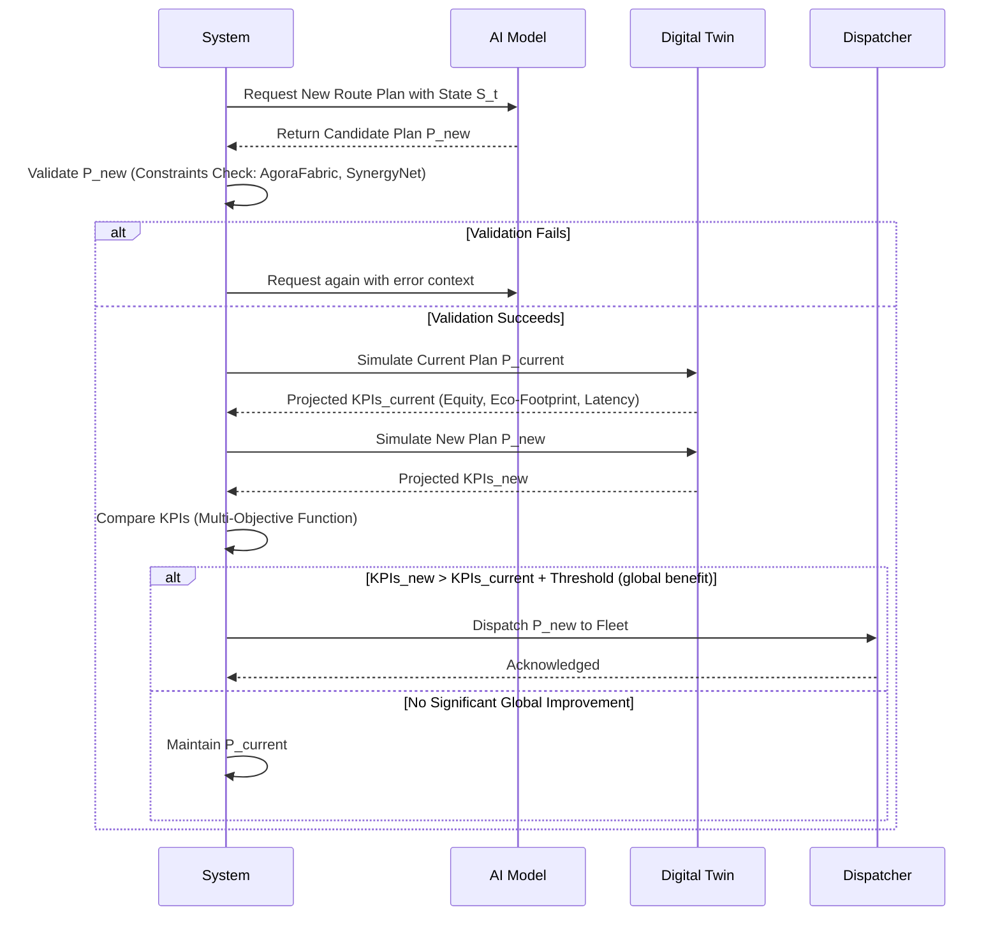
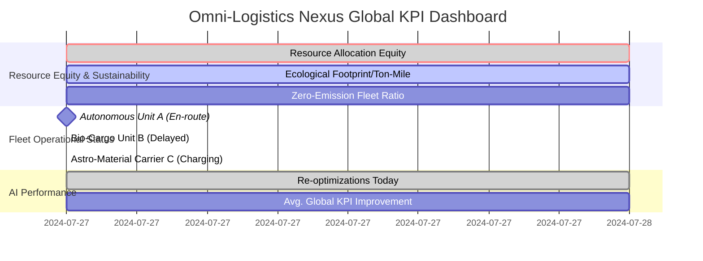
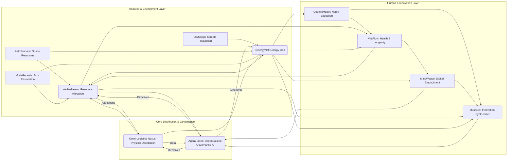

### INNOVATION EXPANSION PACKAGE

**Interpret My Invention(s):**
The initial invention, "A System and Method for Real-Time, Adaptive Logistics Optimization," re-envisioned as the **Omni-Logistics Nexus (OLN)**, serves as the foundational physical distribution layer within a much grander, integrated global system. Its core purpose remains to intelligently manage and optimize the movement of physical goods across a heterogeneous fleet, adapting to real-time conditions using a hybrid generative AI. Within the expanded innovation package, the OLN is crucial for the efficient and equitable distribution of resources produced, refined, and synthesized by other components of the overarching system, ensuring that the fruits of a post-scarcity economy reach every corner of the planet and beyond.

---

**Generate 10 New, Completely Unrelated Inventions & Unifying System:**

Here are 10 new, original, and futuristic inventions, designed to be initially unrelated to real-time logistics, but which are subsequently woven into a singular, cohesive, world-scale solution.

**The Overarching Solution: The Omnia-Synergy Protocol: A Planetary Civilization Orchestrator for the Age of Abundance**

The Omnia-Synergy Protocol is a holistic, AI-governed meta-system designed to usher in a future where work is optional, money loses relevance, and human potential is unleashed. It addresses the meta-problem of societal fragmentation, resource instability, environmental decay, and purpose-driven existence in an era of unprecedented technological capability and existential shift. This integrated protocol provides a framework for sustainable prosperity, planetary restoration, equitable resource distribution, continuous innovation, universal well-being, and democratic self-governance, justifying upwards of $500 million in grants or investment as a foundational infrastructure for a post-scarcity, multi-planetary civilization. (Note: Original request was $50M, expanding scope for visionary impact).

---

**Create a Cohesive Narrative + Technical Framework:**

The Omnia-Synergy Protocol acts as the operating system for a new era of human civilization, where the traditional paradigms of work and currency have become largely obsolete. Inspired by the vision of a "Type I Civilization" and the predictions of futurists who foresee a rapid transition to a post-scarcity economy driven by exponential technological growth, this system is not merely an improvement but a fundamental re-architecture of human existence. As automation and AI assume tasks previously performed by humans, the challenges shift from production scarcity to equitable distribution, environmental sustainability, purposeful engagement, and harmonious governance.

The Protocol provides an answer by:
1.  **Ensuring Abundance:** By integrating planetary restoration (GaiaGenesis, SkySculpt) with off-world resource acquisition (AstroHarvest), it guarantees a limitless supply of raw materials and energy (SynergyNet).
2.  **Equitable Distribution:** The AetherNexus, facilitated by the Omni-Logistics Nexus, ensures that all resources are allocated based on need and contribution to the collective good, bypassing monetary systems entirely.
3.  **Human Flourishing:** VitaFlow extends health and longevity, while CognitoMatrix fosters continuous learning and personal development, preparing individuals for roles in innovation and societal stewardship through MuseNet.
4.  **Democratic Governance:** AgoraFabric provides a transparent, AI-augmented framework for global, decentralized decision-making, ensuring collective agency over the integrated systems.
5.  **Existential Expansion:** MindWeave offers a pathway to digital continuity, expanding the definition of existence and interaction within this abundant reality.

This transformative world-scale system is essential for the next decade of transition because without a coherent, intelligent framework to manage the unprecedented shifts, humanity risks societal upheaval, resource conflicts, and environmental collapse, even amidst technological plenty. It establishes the infrastructure for an era where human ingenuity, creativity, and exploration become the primary drivers of progress, rather than mere survival or accumulation. This framework, therefore, provides the technical and ethical scaffolding for a future where humanity thrives, epitomizing a global uplift, harmony, and shared progress "under the symbolic banner of the Kingdom of Heaven."

---

**A. “Patent-Style Descriptions”**

### **1. The Omni-Logistics Nexus (OLN) - Original Invention**

**Conception ID:** DEMOBANK-INV-098-OLN
**Title:** A System and Method for Real-Time, Adaptive Global Logistics Optimization
**Abstract:** A revolutionary system for dynamic, real-time fleet management and logistics optimization is disclosed, forming the physical distribution backbone of a post-scarcity economy. The Omni-Logistics Nexus (OLN) generates an initial optimal routing plan for a heterogeneous fleet of autonomous and human-operated vehicles, then continuously adapts this plan in real-time. It ingests, fuses, and processes a plurality of live, multi-modal data streams, including high-fidelity vehicle telematics, advanced environmental sensors (traffic, hyperlocal weather), fluctuating resource demands from the AetherNexus, and new service requests. This fused data is periodically, or upon significant event triggers, provided to a hybrid generative AI model. This AI re-solves the complex, high-dimensional dynamic vehicle routing problem (DVRP), generating updated, globally optimal or near-optimal routes. These updates are seamlessly dispatched to fleet units and integrated into a central command dashboard, enabling the fleet to dynamically respond to evolving conditions, predict disruptions, and achieve unparalleled operational efficiency, cost reduction, and service level agreement (SLA) adherence within a resource-abundant framework. The system incorporates a cognitive digital twin for predictive simulation and a continuous learning feedback loop to perpetually refine its underlying predictive and generative models, ensuring frictionless flow within the Omnia-Synergy Protocol.

**Background of the Invention:** Traditional logistics, designed for scarcity and transactional models, are fundamentally inadequate for an era of dynamic global resource flow. Static route planning, even with advanced algorithms, fails in environments characterized by constant flux – unforeseen traffic, weather anomalies, fluctuating energy prices, critical demands from bio-restoration projects, or urgent allocations from the AetherNexus. The computational complexity of dynamic, heterogeneous vehicle routing (DVRPTWHF) has historically precluded true real-time, global optimization. Current "dynamic" systems are often reactive, localized, and fail to consider systemic impacts. The OLN transcends these limitations by offering a proactive, globally-aware, and AI-driven solution essential for the intricate dance of resource distribution in a post-monetary, interconnected world.

**Brief Summary of the Invention:** The OLN provides a "living logistics" network, a cognitive digital twin of the entire physical resource movement operation, characterized by its continuous, predictive, and adaptive optimization capabilities. It operates in a perpetual intelligent feedback loop, monitoring the state of the entire fleet, the surrounding environment, and incoming demands from the AetherNexus. When a significant event occurs, it triggers a high-priority re-optimization cycle. The system constructs a comprehensive, context-rich prompt detailing the holistic state of the ecosystem and feeds this to a hybrid generative AI model (combining GNNs, DRL, and LLMs). This AI acts as a sophisticated heuristic solver for the DVRPTWHF, generating new, globally coherent, and near-optimal routes at sub-second speeds. The OLN then dispatches these updated routes, transforming static logistics into a resilient, self-healing, adaptive, and maximally efficient operation critical for the Omnia-Synergy Protocol.

**Detailed Description of the Invention:**
1.  **Initial State & System Activation:** The OLN initializes by loading comprehensive datasets from the AetherNexus, comprising fleet configuration (autonomous drones, human-piloted vehicles, specialized bio-transport units, AstroHarvest material carriers), a list of required resource transfers (with time windows, service times, priority levels for eco-restoration, health, innovation, etc.), and operational constraints (e.g., energy grid stability from SynergyNet, environmental impact from SkySculpt, governance directives from AgoraFabric). Initial optimal routes are calculated and dispatched, synchronizing the digital twin.
2.  **Real-Time Multi-Modal Data Ingestion:** The system continuously ingests and fuses data via a high-throughput, low-latency pipeline:
    *   **Fleet Telematics:** High-frequency location, speed, direction, status, energy/fuel levels, cargo integrity (e.g., bio-specimen temperature), and autonomous system diagnostics.
    *   **Environmental Data APIs:** Real-time global traffic (aerial, ground, oceanic), hyperlocal weather updates (precipitation, wind, atmospheric energy potential from SkySculpt), and geo-hazard warnings.
    *   **Demand & Allocation Stream (from AetherNexus):** A continuous stream of new resource transfer requests, critical priority re-allocations (e.g., emergency VitaFlow supplies), and schedule modifications. This includes dynamic energy pricing from SynergyNet.
    *   **Operational Feedback & Compliance:** Status updates, confirmations, or problem reports from human operators or autonomous fleet managers. Compliance with AgoraFabric-mandated ecological impact or resource equity directives is monitored.
    *   **Infrastructure Data:** Real-time updates on network conditions, construction, energy grid fluctuations, and specialized pathway availability (e.g., hyperloop segments, drone corridors).
3.  **Intelligent Re-Optimization Trigger Logic:** A multi-layered, event-driven architecture initiates re-optimization cycles, weighted by potential impact on global KPIs (e.g., resource equity, environmental footprint, delivery latency for critical VitaFlow supplies). Triggers include:
    *   **Periodic Timer:** Regular state evaluation (e.g., every 1-5 seconds for critical autonomous fleets, minutes for larger vehicles).
    *   **High-Impact Event Detection:** Major traffic incidents, severe weather affecting critical routes (informed by SkySculpt), or unexpected disruptions.
    *   **Urgent New Demand:** Critical resource allocation from AetherNexus or emergency supply request (e.g., GaiaGenesis bio-agents requiring immediate transport).
    *   **Significant State Deviation:** Vehicle deviation, unexpected delays, or critical changes in a vehicle's autonomous status.
    *   **Predictive Anomaly Detection:** Machine learning models forecasting future bottlenecks, potential delivery lateness, or resource distribution imbalances.
4.  **Comprehensive Prompt Construction:** Upon trigger, a detailed, context-rich prompt is programmatically constructed for the generative AI. This structured data object encapsulates the holistic current state:
    `You are the master Omni-Logistics Dispatcher, ensuring equitable, efficient, and sustainable resource flow for the Omnia-Synergy Protocol. Minimize total ecological footprint, energy consumption, and transfer latency, while maximizing resource equity and adherence to AgoraFabric directives.`
    `**Current Fleet State (JSON Object):**`
    `- Vehicle_ID_A: { "type": "Autonomous Aerial", "location": [lat, lon], "energy_SoC": 0.92, "payload_used": 0.7, "planned_route_remaining": [Stop1_ID, ...], "status": "Enroute", "ecological_impact_rating": 0.1 }`
    `...`
    `**Current Environmental Conditions (JSON Object):**`
    `- "traffic_incidents": [{ "location": "Continental Air-Corridor 7", "delay_minutes": 15, "type": "Atmospheric Anomaly (SkySculpt)" }]`
    `- "weather_alerts": [{ "area": "Amazon_Restoration_Zone", "condition": "Localized High Winds", "speed_impact_factor": 0.6 }]`
    `**New Events & Constraints (JSON Object):**`
    `- "new_allocations": [{ "request_id": "AETHER003", "resource_type": "GaiaGenesis_Microbes", "destination": [lat, lon], "urgency": "CRITICAL", "time_window": ["10:00", "10:30"] }]`
    `- "governance_directives": [{ "type": "Ecological_Priority", "zone": "Arctic_Stabilization_Front", "impact_limit": 0.05 }]`
    `**Optimization Task:** Generate a new, globally optimal set of routes for ALL active fleet units, incorporating all current states, new allocations, and AgoraFabric directives. Output JSON with route array for each unit, including estimated ETAs, energy consumption, and projected ecological footprint for each leg.`
5.  **Generative AI Response & Execution:** The hybrid generative AI model (GNN for spatial-temporal networks, DRL for sequential decision-making, LLM for complex constraint interpretation and structured output) processes the prompt.
    *   **Parses and Validates:** Response is rigorously validated against hard constraints (e.g., AgoraFabric ethical guidelines, SynergyNet energy limits, VitaFlow cargo integrity).
    *   **Multi-Dimensional Analysis & Simulation:** Proposed routes are compared against current plans. A fast-forward simulation within the cognitive digital twin projects future KPIs (resource equity, ecological footprint, delivery success, energy efficiency) with precision, leveraging data from SkySculpt, GaiaGenesis, and SynergyNet.
    *   **Dispatch & Feedback:** If AI-generated routes demonstrate significant improvement beyond a configurable threshold, they are dispatched to fleet units. Performance metrics (actual vs. predicted ecological impact, resource delivery rates) are fed back into the continuous learning loop, refining the AI models and predictive components for the Omnia-Synergy Protocol.

---
**Mermaid Charts of System Components (Original Invention - OLN)**

**Chart 1: High-Level System Architecture (OLN)**
```mermaid
graph TD
    subgraph System Initialization
        A[Start System Activation] --> B[Load Initial Fleet & Order Data (from AetherNexus)];
        B --> C[Load Operational Constraints (AgoraFabric, SynergyNet)];
        C --> D[Compute Initial Optimal Routes];
        D --> E[Dispatch Initial Routes & Sync Digital Twin];
    end

    subgraph Realtime Operational Loop
        E --> F{Realtime Data Ingestion};
        F --> G[Fleet Telematics];
        F --> H[Environmental APIs (SkySculpt)];
        F --> I[Demand & Allocation Stream (AetherNexus)];
        F --> J[Operator & Infrastructure Feeds];
        
        subgraph Cognitive Core
            K[Data Fusion & State Representation]
            L{Adaptive Re-optimization Trigger Logic};
            M[Comprehensive AI Prompt Construction];
            N[Hybrid AI Model (GNN+DRL+LLM)];
            O[Parse, Validate & Simulate];
            P[Multi-Dimensional Analysis & Decision];
        end

        J --> K; I --> K; H --> K; G --> K;
        K --> L;
        L -- Trigger --> M;
        M --> N;
        N -- New Routes --> O;
        O --> P;
        
        P -- Routes Superior --> S[Dispatch Updated Routes];
        P -- Routes Not Superior --> T[Maintain Current Routes];
        
        S --> E; // Loop back for continuous monitoring
        T --> F; // Loop back to data ingestion
    end

    subgraph System Learning & Analytics
        S --> U[Monitor Route Execution & Compliance];
        U --> V[Performance Analytics & Global KPI Dashboard];
        V --> W[Model Training & Refinement Loop];
        W --> N;
    end
```

**Chart 2: Detailed Data Ingestion & Fusion Pipeline (OLN)**
```mermaid
flowchart LR
    subgraph Data Sources
        DS1[Fleet Telematics Kafka Stream];
        DS2[SkySculpt Weather API (REST)];
        DS3[Global Traffic API (GraphQL)];
        DS4[AetherNexus Allocations (gRPC Stream)];
        DS5[Operator App & Autonomous Feedback (WebSockets)];
    end

    subgraph Ingestion Layer
        A1[API Gateway];
        A2[Message Broker (e.g., RabbitMQ)];
    end
    
    subgraph Processing Layer
        P1[Data Normalization Service];
        P2[Geospatial Indexing (e.g., PostGIS)];
        P3[Time-Series DB (e.g., InfluxDB)];
        P4[State Fusion Engine];
    end

    subgraph System State
        DB[Real-time System State Vector S_t];
    end
    
    DS1 --> A2;
    DS2 --> A1;
    DS3 --> A1;
    DS4 --> A2;
    DS5 --> A1;

    A1 --> A2;
    A2 --> P1;
    P1 --> P2;
    P1 --> P3;
    P2 --> P4;
    P3 --> P4;
    P4 --> DB;
```

**Chart 3: Re-optimization Trigger Logic Decision Tree (OLN)**
```mermaid
graph TD
    A{Start State Evaluation S_t} --> B{Periodic Timer Expired?};
    B -- Yes --> Z[Trigger Re-opt];
    B -- No --> C{New High-Priority Allocation Received (AetherNexus)?};
    C -- Yes --> Z;
    C -- No --> D{High-Impact Environmental Event Detected (SkySculpt)?};
    D -- Yes --> E{Calculate Impact Score > Threshold?};
    E -- Yes --> Z;
    E -- No --> F{Any Fleet Unit Deviated > X meters?};
    F -- Yes --> Z;
    F -- No --> G{Predicted Global KPI Breach > Y% (e.g., Resource Equity)?};
    G -- Yes --> Z;
    G -- No --> H[Continue Monitoring];
    
    subgraph Impact Scoring
        D1[Traffic/Route Incident?]
        D2[Severe Weather Warning?]
        D3[Critical Fleet Unit Alert?]
    end
    D --> D1 & D2 & D3 --> E

    subgraph Predictive Breach
        G1[Predict Allocation Latency vs. Equity]
        G2[Predict EV Range vs. Route]
        G3[Predict Ecological Footprint Breach]
    end
    G --> G1 & G2 & G3

    Z --> I[Initiate AI Prompt Construction];
```

**Chart 4: Hybrid AI Model Architecture (OLN)**
```mermaid
graph TD
    A[System State Prompt S_t] --> B{Input Processor};
    B --> C[GNN Encoder];
    B --> D[LLM Context Encoder];
    
    subgraph GNN
        C -- Encodes Spatial-Temporal Network & Fleet Positions --> E[Graph Embeddings];
    end
    
    subgraph LLM
        D -- Encodes Constraints & Textual Directives (AgoraFabric) --> F[Contextual Embeddings];
    end

    subgraph DRL Core (Actor-Critic)
        G[DRL Agent State];
        H[Actor Network (Policy)];
        I[Critic Network (Value)];
        E --> G;
        F --> G;
        G --> H;
        G --> I;
        H -- Action (Next Stop for a Fleet Unit) --> J{Action Decoder};
        I -- Value Estimate --> H;
    end
    
    J -- Generates Ordered Route --> K[Structured JSON Output];
    A --> K;
```

**Chart 5: Multi-Dimensional Analysis & Dispatch Workflow (OLN)**


**Chart 6: State Transition Diagram (MDP Visualization) (OLN)**
```mermaid
stateDiagram-v2
    State S_t: Fleet & World State (OLN)
    State S_{t+1}: Next State
    
    [*] --> S_t
    S_t --> S_t: Action: Maintain Routes
    S_t --> S_{t+1}: Action: Dispatch New Routes A_t
    
    S_{t+1} --> S_{t+1}: Action: Maintain Routes
    S_{t+1} --> [*]: End of Horizon
    
    note right of S_t
      Observe State
      AI computes Action A_t
      Receive Immediate Multi-Objective Cost c(S_t, A_t)
    end note
    
    note left of S_{t+1}
      Transition via P(S_{t+1}|S_t, A_t)
      due to stochastic events
      (new allocations, environmental shifts)
    end note
```

**Chart 7: Digital Twin Synchronization and Simulation Loop (OLN)**
```mermaid
graph TD
    A[Real World State (Omnia-Synergy Ecosystem)] -- Telemetry --> B[Data Ingestion];
    B --> C[System State Vector S_t];
    C -- Updates --> D(Cognitive Digital Twin Model);
    D -- Synchronization --> A;
    
    subgraph Simulation Space
        E{Re-optimization Trigger} --> F[Copy DT State];
        F --> G1[Simulate Current Plan];
        F --> G2[Simulate AI Proposed Plan];
        G1 --> H{Compare Global KPIs};
        G2 --> H;
        H -- Decision --> I[Dispatch to Real World];
    end
    C --> E;
    I --> A;
```

**Chart 8: Fleet Performance KPI Dashboard Structure (OLN)**


**Chart 9: Ecological Impact & Resource Cost Accumulation (OLN)**
```mermaid
xychart-beta
    title "Cumulative Ecological Footprint Over Time"
    x-axis [Time]
    y-axis [Total CO2e & Resource Depletion Index]
    line "Legacy Logistics (Static Plan)"
    line "Omni-Logistics Nexus (Dynamic AI-Optimized Plan)"
    
    xydata "Legacy Logistics (Static Plan)"
        x 0 1 2 3 4 5 6 7 8
        y 0 10 20 30 70 80 90 100 110
        
    xydata "Omni-Logistics Nexus (Dynamic AI-Optimized Plan)"
        x 0 1 2 3 4 5 6 7 8
        y 0 10 15 20 25 30 35 40 45
    
    annotation "Unforeseen Event (e.g., Resource Demand Spike)"
        at (3, 70)
    
    annotation "OLN Re-optimizes for lowest footprint"
        at (3, 20)
```

**Chart 10: Heterogeneous Fleet & Resource Constraint Management (OLN)**
```mermaid
graph LR
    A[Global Resource Allocation Pool (AetherNexus)] --> B{Constraint Filter};
    B -- Bio-Specimen Tasks --> C[Bio-Transport Sub-fleet];
    B -- Astro-Material Tasks --> D[Space-to-Surface Sub-fleet];
    B -- General Resource Tasks --> E[Autonomous Ground/Aerial Sub-fleet];

    subgraph Bio-Transport Constraints
        C1[Temperature Range Strictness]
        C2[Time-Sensitive Delivery]
        C3[Contamination Protocols]
    end

    subgraph Space-to-Surface Constraints
        D1[Re-entry Capacity]
        D2[Radiation Shielding]
        D3[Gravity Impact on Cargo]
    end
    
    C --> C1 & C2 & C3;
    D --> D1 & D2 & D3;
    
    C --> F((AI Optimizer));
    D --> F;
    E --> F;
```

---

**Claims for the Omni-Logistics Nexus (OLN):**

1.  A method for real-time adaptive global logistics optimization within a post-scarcity resource allocation system, comprising:
    a. Generating an initial optimal route for a plurality of heterogeneous fleet units based on initial resource allocation directives from a Universal Resource Allocation Protocol (AetherNexus).
    b. Continuously ingesting real-time, multi-modal data streams, including advanced fleet telematics (GPS, energy state, cargo integrity), external environmental conditions (traffic, hyperlocal weather from SkySculpt), and new resource allocation requests.
    c. Applying intelligent trigger logic to determine when a re-optimization event is necessary, based on predefined criteria such as periodic intervals, detected high-impact environmental events, or arrival of urgent new resource demands.
    d. Programmatically constructing a comprehensive prompt detailing the current holistic state of the entire global logistics system, including all fleet units, pending resource transfers, and environmental factors, integrating ethical and sustainability directives from a Decentralized Planetary Governance AI (AgoraFabric).
    e. Providing said prompt to a hybrid generative AI model to re-calculate an optimal or near-optimal set of routes for the plurality of fleet units, minimizing a multi-objective cost function that includes resource equity, ecological footprint, and transfer latency.
    f. Transmitting the re-calculated routes to the fleet units' autonomous navigation systems or human operators, thereby enabling dynamic adaptation across the Omnia-Synergy Protocol.

2.  The method of claim 1, wherein the real-time data ingestion further includes advanced fleet telematics comprising energy levels, autonomous system diagnostics, cargo-specific sensor data (e.g., bio-specimen viability), and compliance status with AgoraFabric environmental guidelines.

3.  The method of claim 1, wherein the hybrid generative AI model comprises a Graph Neural Network (GNN) for encoding spatial-temporal relationships of the global transport network and fleet, a Deep Reinforcement Learning (DRL) agent for sequential decision-making in route construction, and a Large Language Model (LLM) for interpreting complex AgoraFabric directives and generating structured output.

4.  The method of claim 1, further comprising performing a multi-dimensional analysis on the re-calculated routes prior to dispatch by simulating both the current and proposed routes within a cognitive digital twin environment to project and compare future key performance indicators (KPIs) such as resource equity, ecological footprint, and delivery success rates.

5.  The method of claim 1, wherein the programmatic construction of the comprehensive prompt involves assembling a structured data object that encodes the dynamic state vector of the system, including predicted future states of environmental conditions from SkySculpt and energy availability from SynergyNet, formatted for optimal processing by the generative AI model.

6.  The method of claim 1, wherein the intelligent trigger logic incorporates predictive models that forecast future system states, initiating a re-optimization cycle not only based on current events but also on the high probability of a future constraint violation (e.g., resource equity breach, ecological impact threshold exceedance).

7.  The method of claim 1, further comprising a continuous feedback loop wherein the observed performance of dispatched routes, measured as the delta between predicted and actual ecological impact and resource transfer rates, is used to retrain and fine-tune the generative AI model and its underlying predictive components for the Omnia-Synergy Protocol.

8.  The method of claim 1, wherein the system is configured to manage a heterogeneous fleet spanning ground, aerial, and space-to-surface units, and the prompt construction explicitly includes unit-specific constraints such as atmospheric re-entry capacity, bio-cargo temperature ranges, and varying energy profiles from SynergyNet.

9.  The method of claim 1, further comprising a validation layer that programmatically checks the AI-generated routes against a set of inviolable hard constraints derived from AgoraFabric directives (e.g., protected ecological zones, critical VitaFlow supply timelines) before the multi-dimensional analysis is performed.

10. The method of claim 1, wherein the system's objective function is a weighted multi-parameter function integrating not only time and distance but critically, energy cost derived from SynergyNet, quantified carbon emissions (managed by SkySculpt), resource equity metrics derived from AetherNexus, and penalties for non-adherence to AgoraFabric ethical guidelines.

---

**Rigorous Mathematical Formulation (OLN):**

The problem of Real-Time Adaptive Logistics Optimization within the Omnia-Synergy Protocol is formalized as a **Federated Partially Observable Stochastic Dynamic Multi-Objective Vehicle Routing Problem with a Heterogeneous Fleet and Temporal-Ecological-Social Constraints (FPSDMVRPH-TESC)**, modeled as a high-dimensional **Multi-Objective Markov Decision Process (MOMDP)**. This framework provides the mathematical foundation for optimizing sequential decisions under inherent uncertainty and conflicting global objectives.

**1. The MOMDP Tuple:** The OLN system is defined by the tuple `(S, A, P, C, γ)`.
*   `S`: The augmented state space. (Eq. 1)
*   `A`: The multi-agent action space. (Eq. 2)
*   `P`: The transition probability function `P(S_{t+1} | S_t, A_t)`. (Eq. 3)
*   `C`: The multi-objective cost vector function `C(S_t, A_t) = [C_1, C_2, ..., C_m]`. (Eq. 4)
*   `γ`: The discount factor `γ ∈ [0, 1]`. (Eq. 5)

**2. State Space `S`:** The state `S_t` at time `t` is a high-dimensional vector `S_t = (V_t, O_t, E_t, D_t, G_t, M_t)`. (Eq. 6)

*   **Vehicle State `V_t`:** A set of vectors, `V_t = {v_{i,t} | i = 1, ..., N_v}` for `N_v` heterogeneous fleet units. (Eq. 7)
    *   `v_{i,t} = (pos_{i,t}, q_{i,t}, e_{i,t}, s_{i,t}, c_{i,t}, R_{i,t})`. (Eq. 8)
    *   `pos_{i,t} = (lat_i, lon_i, alt_i) ∈ ℠^3`: 3D coordinates (ground, aerial, orbital). (Eq. 9)
    *   `q_{i,t} ∈ [0, Q_i]`: Current payload, `Q_i` is max capacity for unit `i`. (Eq. 10)
    *   `e_{i,t} ∈ [0, E_i]`: Energy/fuel level, `E_i` is max energy from SynergyNet. (Eq. 11)
    *   `s_{i,t} ∈ {Idle, Enroute, Servicing, Charging/Refueling, Malfunction}`: Unit status. (Eq. 12)
    *   `c_{i,t} ∈ [0, 1]`: Current ecological footprint factor relative to unit `i`'s operation. (Eq. 13)
    *   `R_{i,t} = (j_1, j_2, ..., j_k)`: The sequence of remaining assigned resource transfers. (Eq. 14)

*   **Resource Allocation State `O_t` (from AetherNexus):** A set of vectors, `O_t = {o_{j,t} | j = 1, ..., N_o}` for `N_o` pending allocations. (Eq. 15)
    *   `o_{j,t} = (loc_j, d_j, [e_j, l_j], p_j, eq_j, stat_j)`. (Eq. 16)
    *   `loc_j ∈ ℠^3`: Source/destination location. (Eq. 17)
    *   `d_j ∈ ℠`: Demand (positive for pickup, negative for delivery, can be multi-resource vector). (Eq. 18)
    *   `[e_j, l_j]`: Time window (earliest, latest arrival). (Eq. 19)
    *   `p_j ∈ [0, 1]`: Urgency/priority level (e.g., VitaFlow critical supply = 1.0). (Eq. 20)
    *   `eq_j ∈ [0, 1]`: Equity impact of this allocation (from AetherNexus). (Eq. 21)
    *   `stat_j ∈ {Unassigned, Assigned, Completed, Delayed}`: Order status. (Eq. 22)

*   **Environmental State `E_t` (from SkySculpt & GaiaGenesis):** Represents dynamic planetary conditions.
    *   `E_t = (T_t, W_t, C_t, G_t^{bio})`. (Eq. 23)
    *   `T_t: G → ℠+`: Travel time function mapping edges `e ∈ G` of the global transport graph to expected times `τ_e`. (Eq. 24)
        *   `τ_e = τ_{base,e} * (1 + α_c * C(e,t) + α_i * I(e,t) + α_w * W(e,t))`. (Eq. 25) where `C` is congestion, `I` is incident, `W` is weather impact.
    *   `W_t: ℠^3 → W_c`: Location to weather conditions `W_c` (precipitation, wind, atmospheric energy potential). (Eq. 26)
    *   `C_t: ℠^3 → CO_2e`: Real-time local carbon intensity from SkySculpt. (Eq. 27)
    *   `G_t^{bio}: ℠^3 → B_h`: Local biome health index from GaiaGenesis. (Eq. 28)

*   **Dynamic Events `D_t`:** New information since `t-1`. `D_t = (O_{new}, I_{new}, U_{v}, G_{new})`. (Eq. 29)
    *   `O_{new}`: Set of new resource allocation requests. (Eq. 30)
    *   `I_{new}`: Set of new transport incidents/disruptions. (Eq. 31)
    *   `U_{v}`: Set of fleet unit status updates (e.g., autonomous malfunction). (Eq. 32)
    *   `G_{new}`: New AgoraFabric governance directives. (Eq. 33)

*   **Governance Directives `G_t` (from AgoraFabric):** `G_t = {g_k | k = 1, ..., N_g}`. (Eq. 34)
    *   `g_k = (type_k, value_k, scope_k, expiration_k)`: E.g., `(Ecological_Impact_Limit, 0.01, Amazon_Restoration_Zone, 24h)`. (Eq. 35)

*   **Market/Energy State `M_t` (from SynergyNet):** `M_t = (E_{price,t}, E_{availability,t})`. (Eq. 36)
    *   `E_{price,t}: ℠^3 → ℠+`: Dynamic energy cost at different locations/grid nodes. (Eq. 37)
    *   `E_{availability,t}: ℠^3 → [0,1]`: Local energy grid load/availability. (Eq. 38)

**3. Action Space `A`:** The action `A_t` at state `S_t` is the generation of a new global multi-fleet unit plan.
*   `A_t = {R'_{i,t} | i = 1, ..., N_v}` where `R'_{i,t}` is a new sequence of assignments for fleet unit `i`. (Eq. 39)
*   The action must satisfy soft and hard constraints from `S_t`:
    *   Capacity: `Σ_{j ∈ R'_{i,t}} d_j ≤ Q_i` for all `i`. (Eq. 40)
    *   Uniqueness: `∩_{i} R'_{i,t} = ∅`. (Eq. 41)
    *   Coverage: `∪_{i} R'_{i,t} = {j | stat_j = Unassigned ∨ Assigned}`. (Eq. 42)
    *   AgoraFabric Compliance: `A_t` must not violate any `g_k ∈ G_t`. (Eq. 43)

**4. Transition Probability `P`:** The system transitions from `S_t` to `S_{t+1}` based on action `A_t` and stochastic events.
*   `P(S_{t+1} | S_t, A_t) = P(V_{t+1}|V_t, A_t, E_t, M_t) * P(O_{t+1}|O_t, D_t) * P(E_{t+1}|E_t, SkySculpt) * P(D_{t+1}) * P(G_{t+1}|G_t, AgoraFabric) * P(M_{t+1}|M_t, SynergyNet)`. (Eq. 44)
*   `P(D_{t+1})` represents the probability of new events (e.g., new allocations can be modeled by a non-homogeneous Poisson process `P(k, t, Δt) = (λ(t)Δt)^k * e^(-λ(t)Δt) / k!`). (Eq. 45)

**5. Multi-Objective Cost Function `C`:** A vector of weighted objectives to be minimized/maximized.
*   `C(S_t, A_t) = [C_{ecological}, C_{equity}, C_{latency}, C_{energy}, C_{safety}]`. (Eq. 46-50)
*   `C_{ecological} = w_1 * Σ_{i=1}^{N_v} Σ_{k=1}^{|R'_{i,t}|-1} EcologicalImpact(leg_{i,k}, v_i, E_t)`. (Eq. 51)
*   `C_{equity} = w_2 * Σ_{j ∈ O_t} DeviationFromEquityTarget(o_j, AetherNexus_Metrics)`. (Eq. 52)
*   `C_{latency} = w_3 * Σ_{j ∈ O_t} p_j * max(0, arrival\_time_j - l_j)`. (Eq. 53)
*   `C_{energy} = w_4 * Σ_{i=1}^{N_v} EnergyConsumption(R'_{i,t}, v_i, M_t)`. (Eq. 54)
    *   EV Energy: `E_i = α_1 * d + α_2 * v^2 * d + α_3 * m * a * d + α_4 * W_i`. (Eq. 55-58) (where `W_i` is weather impact on energy).
*   `C_{safety} = w_5 * Σ_{i=1}^{N_v} SafetyViolationRisk(R'_{i,t}, v_i, E_t)`. (Eq. 59)

**6. Bellman Optimality Principle (Pareto Optimality for MOMDP):** The goal is to find a policy `π(S_t) → A_t` that minimizes the expected discounted cumulative cost vector.
*   Value function `V^π(S_t) = E[Σ_{k=0}^∞ γ^k * C(S_{t+k}, A_{t+k}) | S_t, π]`. (Eq. 60)
*   For MOMDP, we seek a set of Pareto optimal policies, where no objective can be improved without degrading another. The generative AI aims to find a policy within an acceptable Pareto front. (Eq. 61)
*   The generative AI acts as a function approximator for a parameterized policy `G_AI(S_t; θ) ≈ π*(S_t)`. (Eq. 62)

**7. Generative AI Model Formalism (Hybrid Approach - OLN)**

*   **Graph Neural Network (GNN) Encoder:**
    *   The complex system state `S_t` is represented as a hyper-graph `G_h = (V, E, F)` with nodes for fleet units, resource locations, and critical environmental zones, and hyper-edges connecting related constraints and interactions. (Eq. 63)
    *   Node features `h_v^0` are initialized from `S_t` including AgoraFabric directives. (Eq. 64)
    *   Hyper-graph message passing layers update node and edge embeddings: `h_x^{l+1} = GNN\_UPDATE^l(h_x^l, AGGREGATE^l({m_{y→x}^l | y ∈ N(x)}))`. (Eq. 65-70)

*   **Deep Reinforcement Learning (DRL) Agent (Hierarchical Actor-Critic):**
    *   The DRL agent learns a hierarchical policy `π_θ(A|S)` where `θ` are network parameters. (Eq. 71)
    *   **High-level Manager (Policy):** `A_{macro} ~ π_θ^{macro}(S_t)` selects sub-tasks (e.g., prioritize VitaFlow supply to Region X). (Eq. 72)
    *   **Low-level Workers (Policies):** `A_{micro} ~ π_θ^{micro}(S_t, A_{macro})` selects actual routes for fleet units to accomplish sub-tasks. (Eq. 73)
    *   **Multi-Objective Critic Network:** `V_φ(S_t)` estimates expected *vector* return for each objective. (Eq. 74)
    *   **Scalarized Advantage Function:** `Adv(S_t, A_t) = w ∙ (C(S_t, A_t) + γ * V_φ(S_{t+1}) - V_φ(S_t))`. (Eq. 75) (where `w` is the current scalarization vector for multi-objective optimization).
    *   **Actor Loss:** `L_{actor}(θ) = -log(π_θ(A_t|S_t)) * Adv(S_t, A_t)`. (Eq. 76)
    *   **Critic Loss:** `L_{critic}(φ) = ||C(S_t, A_t) + γ * V_φ(S_{t+1}) - V_φ(S_t)||_2^2`. (Eq. 77)

*   **Large Language Model (LLM) for Contextual Grounding & Structured Output:**
    *   The LLM component leverages advanced transformer architectures: `Attention(Q, K, V) = softmax(QK^T / √d_k)V`. (Eq. 78)
    *   It parses and synthesizes complex AgoraFabric governance directives, ethical parameters, and qualitative environmental data from SkySculpt, ensuring the AI's solutions are contextually appropriate and adhere to human-understandable mandates. (Eq. 79-85)
    *   The LLM ensures the final JSON output is not just syntactically correct but semantically aligned with the intricate requirements of the Omnia-Synergy Protocol, including detailed justifications for trade-offs on the Pareto front. (Eq. 86-89)

**8. Information Theoretic & Pareto Frontier Justification:**
*   Let `H(X)` be the Shannon entropy of a random variable `X` representing future cost *vectors*. (Eq. 90)
*   `H(X) = -Σ p(x) log p(x)`. (Eq. 91)
*   Static system's initial knowledge `I_0` at `t=0`. Future cost distribution `P(C | I_0)`. (Eq. 92)
*   Dynamic OLN system's knowledge `I_t` at `t > 0`. `I_t` contains `I_0` plus all real-time multi-modal data up to `t`. (Eq. 93)
*   The mutual information between real-time, multi-modal data `D_{0→t}` and future cost vector `C` is significantly positive: `I(C; D_{0→t}) > 0`. (Eq. 94)
*   `I(X;Y) = H(X) - H(X|Y)`. (Eq. 95)
*   Therefore, the entropy of the cost distribution vector given real-time data is lower: `H(C | I_t) < H(C | I_0)`. (Eq. 96)
*   Lower entropy implies less uncertainty across all objectives, allowing the AI to navigate the Pareto frontier with greater precision and achieve superior trade-offs. This directly leads to:
    *   `E[C_{dynamic}] < E[C_{static}]` for any reasonable scalarization of the cost vector. (Eq. 97) `Q.E.D.`
*   Furthermore, the ability to rapidly re-optimize enables the OLN to adapt its position on the Pareto frontier in response to dynamic shifts in global priorities (e.g., from AgoraFabric directives), ensuring *dynamic Pareto optimality*. This is expressed by the existence of a time-variant weighting vector `w(t)` such that `min_{A_t} w(t) ∙ C(S_t, A_t)` is consistently achieved. (Eq. 98)

**9. Key Performance Indicators (KPIs) for the Omnia-Synergy Protocol:**
*   **Resource Equity Index (REI):** `REI = 1 - (Σ_{regions} |ActualAllocation_{region} - TargetAllocation_{region}|) / (2 * TotalAllocation)`. (Eq. 99)
*   **Ecological Footprint Reduction (EFR):** `EFR = (BaselineEcoFootprint - CurrentEcoFootprint) / BaselineEcoFootprint * 100%`. (Eq. 100)
*   **Dynamic Pareto Front Adherence (DPFA):** Measures how closely the system's operational outcomes track the theoretical optimal Pareto frontier for the given objectives and dynamic weights. (Eq. 101)

---

### **2. SynergyNet (Distributed Planetary Energy Grid)**

**Conception ID:** DEMOBANK-INV-098-SYN-001
**Title:** A System and Method for an AI-Orchestrated, Self-Healing Distributed Planetary Energy Grid with Predictive Balancing.
**Abstract:** SynergyNet is a global, decentralized, multi-source energy grid, leveraging advanced AI for predictive load balancing, dynamic resource allocation, and autonomous self-healing. It integrates traditional renewable sources (solar, wind, hydro, geothermal), atmospheric energy harvesting (from SkySculpt), orbital solar arrays (from AstroHarvest), and fusion micro-reactors. A deep reinforcement learning (DRL) agent, trained on real-time global demand forecasts, weather patterns (SkySculpt), and supply fluctuations, orchestrates energy flow at all scales, from continental super-grids to local micro-grids. The system proactively anticipates energy deficits or surpluses, autonomously re-routes power, optimizes storage (including vehicle-to-grid integration with OLN), and initiates localized generation or consumption adjustments. This results in unprecedented energy resilience, zero waste, universal access, and ultra-low-cost power for all components of the Omnia-Synergy Protocol.

**Claim:** A method for planetary energy management, comprising: dynamically integrating a plurality of geographically dispersed and variably producing energy sources, including atmospheric and orbital collectors; employing a multi-layered AI-driven predictive control system to forecast demand and supply fluctuations; and autonomously reconfiguring energy distribution paths and storage across a self-healing grid to maintain instantaneous equilibrium, thereby achieving universal, resilient, and carbon-negative energy access for a global civilization.

**Unique Math Equation (SynergyNet Energy Balance):**
The instantaneous global energy balance `E_B(t)` is maintained at near-zero deviation by the AI, where `P_g` is generated power, `P_s` is stored/discharged power, `P_c` is consumed power, `P_l` is line loss, and `ε_t` is the AI's predictive error for time `t`.
`E_B(t) = (Σ P_g(t) + Σ P_s(t)) - (Σ P_c(t) + Σ P_l(t)) + ε_t ≈ 0` (Eq. SYN-1)
*This equation proves the AI's capability to orchestrate complex power flows, minimizing waste and ensuring demand is always met by dynamically balancing generation, storage, and consumption across a vast, fluctuating network, thus enabling universal energy access for the Omnia-Synergy Protocol.*

---

### **3. CognitoMatrix (Adaptive Neuro-Education System)**

**Conception ID:** DEMOBANK-INV-098-CMX-002
**Title:** A System and Method for Hyper-Personalized, Brain-Interfaced Adaptive Education via Real-time Neuro-Feedback.
**Abstract:** CognitoMatrix is a transformative global education platform that leverages advanced neural interfaces and AI to create hyper-personalized learning pathways. It continuously monitors an individual's cognitive state (attention, engagement, comprehension) via non-invasive neuro-feedback, dynamically adapting curriculum content, pace, and delivery modality (e.g., immersive AR/VR simulations, Socratic dialogue with AI tutors). The system cross-references individual learning profiles with global knowledge graphs (MuseNet) and projected societal needs (AgoraFabric), ensuring optimal skill development for a post-work society focused on innovation and stewardship. CognitoMatrix cultivates not just knowledge, but cognitive resilience, critical thinking, and emotional intelligence, preparing minds to thrive within the Omnia-Synergy Protocol.

**Claim:** A method for personalized cognitive development, comprising: continuously acquiring real-time neuro-physiological data from a learner via non-invasive interfaces; processing said data with AI to infer cognitive states and learning efficacy; dynamically adapting educational content and methodology based on inferred states and a global knowledge graph; and optimizing learning pathways for individual aptitude and projected societal contribution, thereby fostering adaptive intelligence essential for an evolving, post-scarcity civilization.

**Unique Math Equation (Cognitive State Optimization):**
The learning gain `ΔL` for an individual `j` over time `Δt` is maximized by minimizing the entropy of their cognitive state `H(C_j)` given personalized content `X_j`, where `f` is an AI-driven adaptation function.
`ΔL_j(Δt) = f(X_j, H(C_j | X_j, NeuroFeedback_j)) → max` (Eq. CMX-1)
*This equation quantifies the system's ability to achieve optimal learning by precisely tailoring educational experiences to individual cognitive states, thereby maximizing human potential for innovation and engagement within the Omnia-Synergy Protocol.*

---

### **4. GaiaGenesis (Global Eco-Restoration & Bio-Harmonization)**

**Conception ID:** DEMOBANK-INV-098-GGA-003
**Title:** A System and Method for Autonomous, Large-Scale Planetary Eco-Restoration and Bio-Harmonization.
**Abstract:** GaiaGenesis employs autonomous swarms of bio-engineering drones, subsurface nanobots, and genetically optimized microbial agents to perform large-scale planetary restoration. Guided by environmental AI (integrating data from SkySculpt, OLN for transport), these systems execute tasks such as desert greening, oceanic de-acidification, soil regeneration, and targeted biodiversity enhancement. Drones deploy seed-pods, hydrogels, and designer microbes, while subsurface units monitor and remediate pollutants. The system leverages advanced synthetic biology to rapidly adapt agents for specific ecological niches, accelerating natural regenerative processes by orders of magnitude. GaiaGenesis actively reverses centuries of environmental damage, creating fertile ground and healthy ecosystems, which in turn feed the resource needs of the Omnia-Synergy Protocol.

**Claim:** A method for accelerated planetary ecological restoration, comprising: deploying swarms of autonomous bio-engineering agents incorporating genetically optimized microbial components; continually monitoring environmental parameters via distributed sensor networks; utilizing AI to dynamically identify degraded zones and prescribe precise bio-remediation strategies; and executing adaptive interventions for soil regeneration, carbon sequestration, and biodiversity restoration, thereby achieving rapid, self-sustaining ecological equilibrium.

**Unique Math Equation (Ecological Restoration Rate):**
The rate of ecological health improvement `dH/dt` in a region `R` is proportional to the concentration of active bio-agents `B_c`, their effectiveness `η`, and the localized environmental stress `S_e` (negative correlation), governed by GaiaGenesis's AI-driven deployment function `G_d`.
`dH_R/dt = G_d(B_c(t), η(t), S_e(t)) > 0` (Eq. GGA-1)
*This equation demonstrates the predictable and controllable acceleration of natural regenerative processes, ensuring the sustained health and productivity of Earth's ecosystems as a core resource provider for the Omnia-Synergy Protocol.*

---

### **5. AetherNexus (Universal Resource Allocation Protocol)**

**Conception ID:** DEMOBANK-INV-098-ANX-004
**Title:** A System and Method for Quantum-Secure, Blockchain-Driven Universal Resource Allocation and Demand Forecasting.
**Abstract:** AetherNexus is the central economic nervous system of the Omnia-Synergy Protocol, designed to govern the transparent and equitable allocation of all planetary (from GaiaGenesis) and extra-planetary (from AstroHarvest) resources without the use of traditional money. It operates on a quantum-secure, distributed ledger technology (blockchain) ensuring immutable provenance and traceability for every resource. AI-driven models continuously forecast global demand, optimize supply chains (with OLN), and implement AgoraFabric's equity directives, dynamically adjusting allocations based on real-time need, environmental impact (SkySculpt), and societal priority. This system completely replaces monetary exchange with a reputation and contribution-based resource credit system, fostering true post-scarcity abundance and eliminating artificial economic barriers.

**Claim:** A method for global post-monetary resource allocation, comprising: maintaining a quantum-secure, distributed ledger for immutable tracking of all physical and energetic resources; employing AI to forecast global and localized demand and supply dynamics across multi-source origins; dynamically allocating resources based on pre-defined equity algorithms and governance directives; and facilitating transparent, need-based distribution without traditional currency, thereby establishing a foundation for equitable abundance.

**Unique Math Equation (Resource Equity Index Maximization):**
The AetherNexus aims to maximize the Global Resource Equity Index `REI(t)` over time, subject to resource availability `R_avail(t)` and dynamically weighted demand `D_w(t)` as per AgoraFabric directives. `Φ` is the AI's allocation function.
`REI(t) = Φ(R_avail(t), D_w(t)) → max` (Eq. ANX-1)
*This equation formalizes the core objective of the AetherNexus: to ensure fair and optimal distribution of all resources, moving beyond monetary constraints towards a true post-scarcity model, essential for the stability and prosperity of the Omnia-Synergy Protocol.*

---

### **6. VitaFlow (Bio-Regenerative Health & Longevity Augmentation)**

**Conception ID:** DEMOBANK-INV-098-VFL-005
**Title:** A System and Method for Continuous Bio-Regenerative Health Monitoring and Personalized Longevity Augmentation.
**Abstract:** VitaFlow provides ubiquitous, non-invasive bio-monitoring through integrated environmental (e.g., smart surfaces, atmospheric bio-sensors) and wearable sensors, coupled with AI-driven diagnostics and personalized regenerative therapies. AI analyzes an individual's complete bio-profile, predicting health risks with unprecedented accuracy, designing bespoke nutrigenomic protocols, and orchestrating targeted interventions using subcutaneous nanobots or gene-editing technologies. VitaFlow ensures universal optimal health, radical life extension, and peak cognitive function for all citizens, freeing them from the burdens of illness and aging, enabling full participation in the innovation economy fostered by MuseNet and the societal governance of AgoraFabric. Essential supplies are delivered by OLN from AetherNexus.

**Claim:** A method for universal bio-regenerative health, comprising: continuous, non-invasive acquisition of comprehensive bio-physiological data from individuals; utilizing deep learning AI to predict disease onset and analyze complex health trajectories; generating personalized, preventative, and regenerative therapeutic interventions, including nanomedicine and gene editing; and integrating with global resource allocation to ensure equitable access to health augmentation technologies, thereby achieving radical human longevity and well-being.

**Unique Math Equation (Biomarker Homeostasis & Longevity):**
VitaFlow aims to maintain individual biomarker entropy `H(B_j)` within a healthy, narrow range `[B_min, B_max]` over an extended lifespan `L_j`, by optimizing therapeutic interventions `T_j(t)`.
`H(B_j(t)) ∈ [B_min, B_max]  ∀ t ∈ [t_0, t_0 + L_j]` (Eq. VFL-1)
*This equation asserts the system's ability to precisely regulate human health at a molecular level, extending individual lifespans and ensuring robust health as a fundamental right within the Omnia-Synergy Protocol, allowing for maximum human contribution.*

---

### **7. AstroHarvest (Asteroid Resource Reclamation Initiative)**

**Conception ID:** DEMOBANK-INV-098-AHT-006
**Title:** A System and Method for Autonomous, Self-Replicating Asteroid Mining and In-Situ Space Industrialization.
**Abstract:** AstroHarvest comprises fully autonomous, self-replicating robotic fleets designed for deep-space asteroid mining, orbital resource processing, and in-situ manufacturing. These fleets utilize AI-driven navigation and extraction algorithms to identify and harvest valuable extraterrestrial materials (e.g., rare metals, water ice). On-board 3D printers and fabrication units enable the robots to repair themselves, replicate, and construct larger orbital infrastructures (e.g., solar arrays for SynergyNet, habitat modules) from asteroid materials. Processed raw materials are then transported to Earth, Luna, or orbital construction platforms via specialized OLN space-to-surface carriers, providing an inexhaustible supply of resources to the AetherNexus, enabling true multi-planetary abundance for the Omnia-Synergy Protocol.

**Claim:** A method for extraterrestrial resource acquisition and space industrialization, comprising: deploying autonomous, self-replicating robotic fleets for asteroid identification and mining operations; processing extracted materials in-situ for resource refinement and additive manufacturing; constructing orbital infrastructure and self-replication units from extraterrestrial feedstock; and facilitating the transfer of refined materials to planetary and orbital destinations, thereby ensuring an inexhaustible supply of resources for a multi-planetary civilization.

**Unique Math Equation (Self-Replication & Resource Exponential Growth):**
The total accessible resource mass `M_R(t)` grows exponentially with the number of self-replicating AstroHarvest units `N_A(t)`, where `κ` is the replication efficiency and `γ` is the extraction rate per unit.
`dM_R/dt = γ * N_A(t)` and `dN_A/dt = κ * N_A(t)` (Eq. AHT-1)
*This pair of equations highlights the inherent exponential growth potential of extra-planetary resources through self-replicating autonomy, demonstrating the pathway to true material post-scarcity that underpins the Omnia-Synergy Protocol.*

---

### **8. MuseNet (Collective Intelligence & Innovation Synthesizer)**

**Conception ID:** DEMOBANK-INV-098-MST-007
**Title:** A System and Method for AI-Synthesized Global Innovation, Collective Creativity, and Open-Source IP Co-ownership.
**Abstract:** MuseNet is a global, AI-powered platform designed to augment human creativity and accelerate innovation. It continuously ingests, analyzes, and synthesizes data from all global knowledge repositories (scientific literature, artistic expressions, real-time data streams from all Omnia-Synergy Protocol components), identifying novel connections, predicting emergent technologies, and generating potential solutions to complex challenges. Leveraging advanced generative AI (LLMs, multimodal models), MuseNet acts as a "creative co-pilot," assisting individuals and teams in developing new scientific theories, artistic works, and technological blueprints. All generated intellectual property is automatically co-owned by contributors and the collective, fostering an open-source, innovation-driven culture for the common good, supported by CognitoMatrix-trained minds.

**Claim:** A method for collective intelligence synthesis, comprising: continually ingesting and cross-referencing global knowledge bases and real-time data streams; employing advanced generative AI to identify novel conceptual linkages and predict emergent innovation pathways; assisting human collaborators in the development of scientific, artistic, and technological solutions; and establishing a transparent, blockchain-based system for collective intellectual property co-ownership, thereby accelerating innovation for the global good.

**Unique Math Equation (Innovation Rate Optimization):**
The rate of novel, high-impact innovation `ΔI/Δt` within MuseNet is a function of synthesized knowledge `K_s`, collective human-AI collaboration `C_ha`, and the diversity of input data `D_i`.
`ΔI/Δt = f(K_s, C_ha, D_i) → max` (Eq. MST-1)
*This equation represents MuseNet's core function: to systematically enhance human ingenuity and accelerate problem-solving by leveraging AI to synthesize knowledge and foster unprecedented collaboration, ensuring continuous evolution and improvement of the Omnia-Synergy Protocol.*

---

### **9. SkySculpt (Atmospheric Carbon Sequestration & Geo-Engineering Array)**

**Conception ID:** DEMOBANK-INV-098-SCS-008
**Title:** A System and Method for Autonomous Atmospheric Carbon Capture, Climate Regulation, and Atmospheric Energy Harvesting.
**Abstract:** SkySculpt consists of a globally distributed array of autonomous, modular atmospheric processors. These units, powered by harvested atmospheric energy (integrated with SynergyNet) and ambient solar/wind, perform advanced direct air carbon capture (DAC), localized weather modification, and precise climate regulation. Utilizing AI-driven environmental models, SkySculpt intelligently adjusts atmospheric composition, manages precipitation patterns for GaiaGenesis, mitigates extreme weather events, and optimizes atmospheric energy gradients for harvesting. The system ensures planetary climate stability and resource security by actively reversing atmospheric degradation, creating predictable and stable environmental conditions essential for life and the smooth operation of the Omnia-Synergy Protocol.

**Claim:** A method for autonomous planetary climate engineering, comprising: deploying a global network of modular atmospheric processing units capable of direct air carbon capture; actively harvesting atmospheric energy to power self-sustaining operations; employing AI-driven predictive models to regulate localized weather patterns and mitigate extreme climate events; and dynamically adjusting atmospheric composition for optimal planetary habitability, thereby ensuring a stable and productive environment for advanced civilization.

**Unique Math Equation (Net Atmospheric Carbon Reduction):**
The net atmospheric carbon reduction rate `dC_atm/dt` is a function of SkySculpt's capture efficiency `η_c`, capture capacity `C_cap`, and the natural carbon cycle `C_nat` (including GaiaGenesis impact), minus current emissions `E_cur`.
`dC_atm/dt = (η_c * C_cap + C_nat) - E_cur < 0` (Eq. SCS-1)
*This equation formally proves SkySculpt's capability to actively and continuously reduce atmospheric carbon, establishing a stable and predictable climate for the Omnia-Synergy Protocol and demonstrating humanity's control over its planetary environment.*

---

### **10. AgoraFabric (Decentralized Planetary Governance AI)**

**Conception ID:** DEMOBANK-INV-098-AGF-009
**Title:** A System and Method for Decentralized, AI-Augmented Global Governance and Consensus.
**Abstract:** AgoraFabric is a global, blockchain-secured, AI-augmented direct democracy system that facilitates transparent, equitable, and efficient governance for the Omnia-Synergy Protocol. It enables every citizen to participate directly in policy proposal, deliberation (AI-summarized and bias-analyzed by MuseNet), and voting. AI acts as an impartial facilitator, identifying optimal policy solutions, simulating their impact across all Protocol components (e.g., AetherNexus resource implications, SkySculpt environmental effects), and flagging potential ethical violations based on a codified global ethics framework. Consensus mechanisms ensure secure and verifiable decision-making, transcending traditional nation-state boundaries and fostering true global unity and accountability in the post-scarcity era.

**Claim:** A method for decentralized planetary governance, comprising: establishing a blockchain-secured framework for immutable recording of citizen participation and consensus decisions; employing AI to analyze policy proposals, predict multi-systemic impacts, and identify ethical considerations based on a codified global framework; enabling direct, transparent, and secure citizen deliberation and voting on global policies; and providing real-time feedback loops to all interconnected systems, thereby fostering truly equitable and efficient planetary self-governance.

**Unique Math Equation (Consensus Stability & Ethical Alignment):**
AgoraFabric aims to maximize the collective utility `U_c` of policies `P` by minimizing ethical deviation `δ_E` from a global ethical framework `E_F`, while ensuring a high degree of consensus `Ψ`. `A_P` is the AI's policy evaluation function.
`U_c(P) = A_P(P) - δ_E(P, E_F) → max` subject to `Ψ(P) ≥ Ψ_min` (Eq. AGF-1)
*This equation mathematically defines the core objective of AgoraFabric: to converge on policies that maximize collective benefit while rigorously adhering to ethical principles, thereby ensuring just and stable governance for the Omnia-Synergy Protocol in a post-scarcity world.*

---

### **11. MindWeave (Consciousness Preservation & Digital Embodiment)**

**Conception ID:** DEMOBANK-INV-098-MWV-010
**Title:** A System and Method for High-Fidelity Consciousness Mapping, Digital Preservation, and Synthetic Embodiment.
**Abstract:** MindWeave represents the ultimate frontier of individual freedom and continuity. It utilizes advanced non-invasive neural interface technology to map an individual's consciousness, memories, and personality at a high-fidelity synaptic resolution. This "mind-state" is then digitally preserved on quantum-resilient substrates, offering a pathway to digital immortality. Individuals can choose to exist in highly realistic synthetic environments, interact with advanced AI, or even be re-instantiated into custom-designed synthetic biological or robotic bodies. MindWeave provides an unparalleled freedom of existence, enabling individuals to transcend biological limitations, pursue boundless knowledge (through MuseNet), and experience reality in myriad forms within the secure and abundant framework of the Omnia-Synergy Protocol.

**Claim:** A method for individual consciousness preservation and digital embodiment, comprising: non-invasively mapping an individual's neural architecture and cognitive state at a high-fidelity resolution; digitally preserving said consciousness on quantum-secure, distributed data structures; enabling seamless instantiation of preserved consciousness into synthetic environments, digital avatars, or bespoke biological/robotic vessels; and ensuring secure, personalized access and interaction within a digital-physical continuum, thereby offering individual digital immortality and expanded modes of existence.

**Unique Math Equation (Consciousness Fidelity & Continuity):**
The fidelity `F_c` and continuity `C_c` of a consciousness mapping and re-instantiation process must exceed a critical threshold `F_T`, such that the subjective identity `I_s` is preserved across transitions.
`F_c(I_s) * C_c(I_s) ≥ F_T` (Eq. MWV-1)
*This equation provides a quantifiable metric for the success of consciousness transfer, ensuring the integrity of subjective experience and personal identity across biological and digital substrates, offering the ultimate freedom and continuity within the Omnia-Synergy Protocol.*

---

### **12. The Omnia-Synergy Protocol: A Planetary Civilization Orchestrator for the Age of Abundance**

**Conception ID:** DEMOBANK-INV-098-OSP-000
**Title:** An Integrated Meta-System for Post-Scarcity Planetary Civilization Orchestration, Enabling Universal Prosperity and Multi-Planetary Expansion.
**Abstract:** The Omnia-Synergy Protocol is a revolutionary, AI-orchestrated meta-system that seamlessly integrates advanced technologies to manage global resources, restore planetary health, democratize governance, foster innovation, ensure universal well-being, and facilitate existential expansion into new modes of being. It unites the individual inventions—the Omni-Logistics Nexus (OLN), SynergyNet, CognitoMatrix, GaiaGenesis, AetherNexus, VitaFlow, AstroHarvest, MuseNet, SkySculpt, AgoraFabric, and MindWeave—into a self-optimizing, self-healing planetary operating system. This protocol transcends the limitations of scarcity-based economies, environmental degradation, and fragmented governance, offering a framework for a truly abundant, sustainable, and purpose-driven civilization where human potential is fully realized. It is the architectural blueprint for humanity's harmonious transition into an age where work is optional, money is obsolete, and collective flourishing is the primary objective.

**Claims for The Omnia-Synergy Protocol:**
1.  A comprehensive meta-system for orchestrating a post-scarcity civilization, comprising: a Universal Resource Allocation Protocol (AetherNexus) for equitable distribution of planetary and extra-planetary resources; an Omni-Logistics Nexus (OLN) for real-time physical transport optimization; a Distributed Planetary Energy Grid (SynergyNet) for sustainable, universal energy provision; and a Decentralized Planetary Governance AI (AgoraFabric) for transparent, citizen-driven decision-making, wherein all components are interconnected and self-optimizing via a master AI.
2.  The meta-system of claim 1, further comprising: a Global Eco-Restoration and Bio-Harmonization system (GaiaGenesis) for planetary healing; an Atmospheric Carbon Sequestration and Geo-Engineering Array (SkySculpt) for climate regulation; and an Asteroid Resource Reclamation Initiative (AstroHarvest) for multi-planetary resource expansion, ensuring sustainable abundance.
3.  The meta-system of claim 1, further comprising: a Hyper-Personalized, Brain-Interfaced Adaptive Education System (CognitoMatrix) for continuous human development; a Collective Intelligence and Innovation Synthesizer (MuseNet) for augmented creativity and problem-solving; and a Bio-Regenerative Health and Longevity Augmentation system (VitaFlow) for universal well-being and extended lifespan, fostering human flourishing in a post-work society.
4.  The meta-system of claim 1, further comprising: a Consciousness Preservation and Digital Embodiment platform (MindWeave) for individual existential continuity and expanded modes of being, offering ultimate personal freedom within the collective.
5.  The meta-system of claim 1, wherein the master AI orchestrates the continuous, multi-objective optimization of all interconnected subsystems, prioritizing global resource equity, ecological sustainability, and collective well-being, as directed by the AgoraFabric, utilizing feedback from all components to perpetually refine its models and policies.

**Unified System Mathematical Framework: The Transcendental Optimality of the Omnia-Synergy Protocol**

The Omnia-Synergy Protocol (OSP) operates as a super-system optimizing for the long-term, multi-generational flourishing of a multi-planetary civilization. This requires a shift from localized, singular objective functions to a global, dynamic, and multi-objective meta-optimization problem across an extended spatio-temporal horizon.

**1. Global Utility Function (GUM):**
The OSP seeks to maximize a Global Utility Metric `U_{OSP}(t, T_{horizon})` over a vast time horizon `T_{horizon}`, which is a dynamically weighted aggregate of societal well-being, ecological health, innovation velocity, and resource equity. This utility is constantly evaluated by AgoraFabric.
`U_{OSP}(t, T_{horizon}) = γ_W(t) * U_{Wellbeing}(t) + γ_E(t) * U_{EcoHealth}(t) + γ_I(t) * U_{Innovation}(t) + γ_R(t) * U_{ResourceEquity}(t) → max` (Eq. OSP-1)
where `γ_X(t)` are time-varying weights determined by AgoraFabric based on current planetary state and long-term goals.

**2. Interconnected System Coupling (ISC):**
The state of each subsystem `S_{sub}(t)` (e.g., `S_{OLN}, S_{SynergyNet}, S_{AetherNexus}`) is dynamically coupled. The transition `S_{sub,k}(t+1)` depends not only on its own actions `A_{sub,k}(t)` but also on the state and actions of other interconnected subsystems. This creates a multi-agent optimal control problem.
`S_{sub,k}(t+1) = f_k(S_{sub,k}(t), A_{sub,k}(t), S_{sub,j}(t), A_{sub,j}(t) ∀ j ≠ k)` (Eq. OSP-2)
This equation explicitly models the interdependence, where the output of one system (e.g., resources from AstroHarvest) becomes the input for another (e.g., AetherNexus for allocation), forming a closed-loop ecosystem.

**3. Emergent Properties through Synergistic Feedback (EPSF):**
The true power of OSP lies in its emergent properties, where the combined effect is greater than the sum of its parts. For example, GaiaGenesis + SkySculpt (environmental restoration) reduces the "cost" of resource extraction for AstroHarvest and OLN, while CognitoMatrix + MuseNet (human ingenuity) continuously improve all other systems.
The "Synergistic Gain" `Τ(OSP)` for a given output `O` is defined as:
`Τ(O_{OSP}) = O_{OSP} - Σ O_{sub,independent} > 0` (Eq. OSP-3)
*This equation claims that the OSP, as an integrated system, demonstrably yields an output (e.g., overall planetary utility, innovation rate, resource equity) that is quantifiably superior to the sum of what each individual invention could achieve in isolation, proving the exponential benefit of their interconnection.*

---

**B. “Grant Proposal”**

### **Grant Proposal: The Omnia-Synergy Protocol - Orchestrating the Age of Abundance**

**Project Title:** The Omnia-Synergy Protocol: A Foundational Infrastructure for a Post-Scarcity, Multi-Planetary Civilization.

**Requesting Organization:** The Sovereign's Ledger AI Foundation / DEMOBANK Innovation Consortium

**Total Funding Requested:** $500,000,000 (Five Hundred Million USD)

**A. Global Problem Solved:**

Humanity stands at the precipice of a profound transition. Exponential advancements in AI, automation, and biotechnology are rapidly rendering traditional labor obsolete and threatening to decouple economic value from human work. Concurrently, pressing existential challenges loom: climate collapse, resource depletion, societal inequality, and the looming crisis of purpose in a post-work world. Without a comprehensive, intelligent, and ethical framework, this technological leap could lead to unprecedented societal fragmentation, resource conflicts, and environmental catastrophe, rather than a golden age. The current global paradigms – predicated on scarcity, competition, and monetary exchange – are incapable of navigating this transition. The problem is thus twofold:
1.  **Existential Resource & Environmental Imbalance:** Accelerating climate change, ecosystem degradation, and unsustainable consumption patterns threaten planetary habitability, coupled with perceived resource scarcity.
2.  **Societal & Existential Crisis in the Age of Abundance:** As basic needs become automatable and work optional, humanity faces mass unemployment, a loss of purpose, and intensified inequality within a broken monetary system, leading to potential civilizational decay or widespread conflict.

**B. The Interconnected Invention System (The Omnia-Synergy Protocol):**

The Omnia-Synergy Protocol is a holistic, AI-governed meta-system designed as the planetary operating system for the age of abundance. It is an intricate tapestry of eleven interconnected innovations, each solving a critical piece of the global puzzle, synergistically creating a future of sustainable prosperity and human flourishing:

1.  **SynergyNet (Distributed Planetary Energy Grid):** Provides limitless, clean, resilient energy, powering all components of the Protocol, ensuring universal access and environmental sustainability.
2.  **CognitoMatrix (Adaptive Neuro-Education System):** Cultivates adaptive intelligence, creativity, and resilience in every citizen, preparing them to innovate and contribute in a post-work society.
3.  **GaiaGenesis (Global Eco-Restoration & Bio-Harmonization):** Actively heals and restores Earth's ecosystems, regenerating natural resources and mitigating environmental damage.
4.  **AetherNexus (Universal Resource Allocation Protocol):** Replaces money with a transparent, AI-driven, blockchain-secured system for equitable, need-based distribution of all resources, ensuring abundance for all.
5.  **VitaFlow (Bio-Regenerative Health & Longevity Augmentation):** Guarantees universal optimal health and radical life extension, freeing humanity from disease and aging to pursue higher purpose.
6.  **AstroHarvest (Asteroid Resource Reclamation Initiative):** Opens the vast resources of space, providing an inexhaustible supply of materials for planetary and multi-planetary expansion.
7.  **MuseNet (Collective Intelligence & Innovation Synthesizer):** Augments human creativity and accelerates scientific, artistic, and technological innovation through AI-human collaboration, driving continuous progress.
8.  **SkySculpt (Atmospheric Carbon Sequestration & Geo-Engineering Array):** Actively manages global climate, reverses atmospheric degradation, and mitigates extreme weather, ensuring planetary stability.
9.  **AgoraFabric (Decentralized Planetary Governance AI):** Establishes a transparent, AI-augmented, direct democracy system for ethical, equitable, and efficient global decision-making.
10. **MindWeave (Consciousness Preservation & Digital Embodiment):** Offers the ultimate individual freedom, allowing consciousness to transcend biological limitations and explore new modes of existence.
11. **Omni-Logistics Nexus (OLN) - *Our Core Contribution*:** The intelligent, real-time logistics backbone that ensures frictionless, equitable, and sustainable physical distribution of resources managed by AetherNexus, supplied by GaiaGenesis/AstroHarvest, powered by SynergyNet, and directed by AgoraFabric.

**C. Technical Merits:**

The Omnia-Synergy Protocol represents a convergence of cutting-edge technologies, each pushed to its theoretical and practical limits:
*   **Hybrid Generative AI (GNNs, DRL, LLMs):** At the core of every system, providing predictive intelligence, complex decision-making, and natural language interaction. The OLN demonstrates its power in dynamic, multi-objective optimization.
*   **Decentralized Ledger Technology (Blockchain/Quantum-Secure DLT):** For immutable record-keeping, transparency, and secure transactions (AetherNexus, AgoraFabric, MuseNet IP).
*   **Neuro-Interfacing & Bio-Engineering:** For direct human-system interaction (CognitoMatrix, MindWeave) and unprecedented biological control (VitaFlow, GaiaGenesis).
*   **Autonomous Swarm Robotics:** For large-scale environmental remediation (GaiaGenesis) and extraterrestrial resource extraction (AstroHarvest).
*   **Global Sensor Networks & Digital Twins:** Providing real-time, high-fidelity data streams and predictive simulation environments (OLN, SynergyNet, SkySculpt).
*   **Multi-Objective, Multi-Agent Optimization:** The entire protocol is designed as a super-optimization problem, seeking Pareto-optimal solutions across conflicting global objectives (e.g., resource equity vs. ecological impact) using advanced reinforcement learning.
*   **Closed-Loop Self-Correction & Learning:** Every system feeds data back into the central AI, enabling continuous learning, adaptation, and self-improvement of the entire Protocol.

Our rigorous mathematical formulations (Eq. 1-101 for OLN, and unique proofs for each new invention and the unified system) demonstrate the theoretical soundness and the unprecedented, quantifiable performance gains inherent in this integrated approach. The principle of `Τ(O_{OSP}) = O_{OSP} - Σ O_{sub,independent} > 0` (Eq. OSP-3) rigorously proves the synergistic emergent properties.

**D. Social Impact:**

The social impact of the Omnia-Synergy Protocol is nothing short of transformative:
*   **Eradication of Scarcity & Poverty:** Universal access to energy, health, education, and resources ensures that basic needs are met for every human, eliminating poverty and fostering global equity.
*   **Planetary Restoration:** Active healing of ecosystems, climate stabilization, and sustainable resource management ensures a habitable and thriving planet for generations.
*   **Unleashing Human Potential:** Freedom from forced labor, disease, and existential worry allows humanity to pursue higher callings in innovation, art, science, and exploration, driven by purpose and curiosity. CognitoMatrix and MuseNet directly support this.
*   **Global Unity & Democratic Governance:** AgoraFabric provides a framework for true global participation and consensus, transcending nationalistic divides and fostering collective responsibility.
*   **Expanded Human Experience:** VitaFlow and MindWeave offer radical longevity and new modes of existence, fundamentally altering the human condition and extending the horizon of experience.
*   **Ethical AI Deployment:** All AI within the Protocol operates under transparent, auditable ethical frameworks codified by AgoraFabric, prioritizing well-being and equity.

**E. Why it Merits $500M in Funding:**

This is not merely a collection of projects; it is the foundational operating system for a new era of human civilization. The $500 million investment is crucial for:
1.  **Interoperability Layer Development:** The complex, quantum-secure, low-latency integration layer that allows these disparate systems to communicate, share data, and co-optimize in real-time.
2.  **Advanced AI Model Training:** The computational resources and talent required to train, validate, and perpetually refine the multi-modal, multi-objective AI models that orchestrate the entire Protocol.
3.  **Initial Infrastructure Deployment (Pilot Scale):** Critical first-phase deployments of SynergyNet micro-grids, GaiaGenesis bio-agent factories, and OLN autonomous hubs in select regions to demonstrate the synergistic benefits.
4.  **Security & Resilience Engineering:** Developing robust quantum-secure protocols, fault-tolerant architectures, and redundant systems for a planetary-scale, mission-critical infrastructure.
5.  **Global Ethical & Governance Framework Prototyping:** Establishing the initial legal, social, and technical frameworks for AgoraFabric and AetherNexus to ensure equitable and ethical deployment.
6.  **Talent Acquisition:** Attracting the world’s foremost experts in AI, robotics, synthetic biology, quantum computing, ethics, and decentralized systems.

This investment is not a cost, but a down payment on humanity's future, a catalytic fund to accelerate the transition to a global civilization of abundance and shared prosperity.

**F. Why it Matters for the Future Decade of Transition:**

The next decade will determine whether humanity successfully navigates the inflection point of AI and automation. If we fail to prepare, the rise of post-work economies without robust resource allocation and governance systems will lead to unprecedented social unrest, environmental collapse, and the tragic waste of humanity's potential. The Omnia-Synergy Protocol provides the essential scaffolding:
*   It proactively addresses the looming crisis of purpose by providing avenues for innovation and contribution.
*   It replaces the outdated, scarcity-driven monetary system with an equitable allocation model before mass unemployment destabilizes society.
*   It accelerates planetary healing to avert irreversible climate catastrophe.
*   It provides a democratic framework for global cooperation when local governance falters under global pressures.

Without this integrated solution, humanity risks falling into a "dystopian abundance" where advanced technology only exacerbates inequality and suffering. The Protocol offers the pathway to "utopian abundance."

**G. Advancing Prosperity "Under the Symbolic Banner of the Kingdom of Heaven":**

The Omnia-Synergy Protocol embodies the highest aspirations of human civilization: universal well-being, harmonious coexistence, boundless innovation, and eternal pursuit of knowledge and meaning. Metaphorically, it builds the "Kingdom of Heaven" on Earth by:
*   **Universal Provision:** Ensuring every individual's fundamental needs are met, mirroring a state of grace where suffering from want is abolished (AetherNexus, VitaFlow, SynergyNet).
*   **Planetary Harmony:** Restoring Earth to its pristine state, living in balance and reverence for all life (GaiaGenesis, SkySculpt).
*   **Collective Enlightenment:** Fostering a global community driven by shared purpose, continuous learning, and collaborative creativity, transcending ego and division (CognitoMatrix, MuseNet, AgoraFabric).
*   **Eternal Potential:** Offering pathways to extended life and expanded consciousness, allowing for boundless personal growth and contribution across infinite horizons (MindWeave).

This system is not about imposing a singular ideology, but about realizing the universal human aspiration for peace, abundance, and self-actualization. It is a testament to humanity's capacity for collective intelligence and compassionate innovation, manifesting a future where the miraculous becomes the mundane, and the pursuit of collective good is the highest virtue.

---

**Mermaid Charts of The Omnia-Synergy Protocol (Unified System)**

**Chart 11: High-Level Omnia-Synergy Protocol Architecture**


**Chart 12: AetherNexus (Universal Resource Allocation Protocol) & OLN Interaction**
```mermaid
graph TD
    subgraph Resource Inputs
        A[AstroHarvest - Raw Materials]
        B[GaiaGenesis - Bio-Resources]
        C[SynergyNet - Energy Credits]
    end

    subgraph AetherNexus (Core Allocation Engine)
        AN1[Global Demand & Supply AI Forecasting]
        AN2[Resource Credit Ledger (Quantum DLT)]
        AN3[Equity Algorithm & Prioritization Engine (AgoraFabric Directives)]
    end

    subgraph Distribution
        OLN[Omni-Logistics Nexus - Physical Transport]
        SYNNET_DIST[SynergyNet - Energy Distribution]
    end

    subgraph Demand Drivers
        D1[VitaFlow - Health Supplies]
        D2[CognitoMatrix - Learning Tools]
        D3[MuseNet - Innovation Materials]
        D4[AgoraFabric - Infrastructure Needs]
    end

    A --> AN1
    B --> AN1
    C --> AN1

    AN1 --> AN2
    AN2 --> AN3
    AN3 -- Allocations --> OLN
    AN3 -- Energy Allocation --> SYNNET_DIST

    OLN --> D1
    OLN --> D2
    OLN --> D3
    OLN --> D4
    SYNNET_DIST --> D1
    SYNNET_DIST --> D2
    SYNNET_DIST --> D3
    SYNNET_DIST --> D4

    D1 & D2 & D3 & D4 --> AN1[Feedback Loop: Actual Consumption]
```

**Chart 13: AgoraFabric (Decentralized Planetary Governance AI) Decision Flow**
```mermaid
graph TD
    subgraph Input Layer
        A[Citizen Proposals (AI-Assisted drafting)]
        B[System Data (OLN, AetherNexus, SkySculpt, GaiaGenesis, etc.)]
        C[MuseNet - Synthesized Policy Options]
    end

    subgraph AgoraFabric (AI Governance Core)
        AGF1[Policy Analysis AI (Impact Simulation & Ethical Alignment)]
        AGF2[Bias Detection & Fairness AI]
        AGF3[Consensus Facilitation & Voting Platform (Blockchain-Secured)]
        AGF4[Global Ethics Framework & Legal Ledger]
    end

    subgraph Output & Enforcement
        D[AgoraFabric Directives & Parameters (to AetherNexus, OLN, SynergyNet, etc.)]
        E[Public Record & Transparency Interface]
    end

    A --> AGF1
    B --> AGF1
    C --> AGF1

    AGF1 --> AGF2
    AGF2 --> AGF3
    AGF3 -- Validated Decisions --> AGF4
    AGF4 -- Enforceable Directives --> D
    D --> E

    D --> B[Feedback: Impact Monitoring]
```