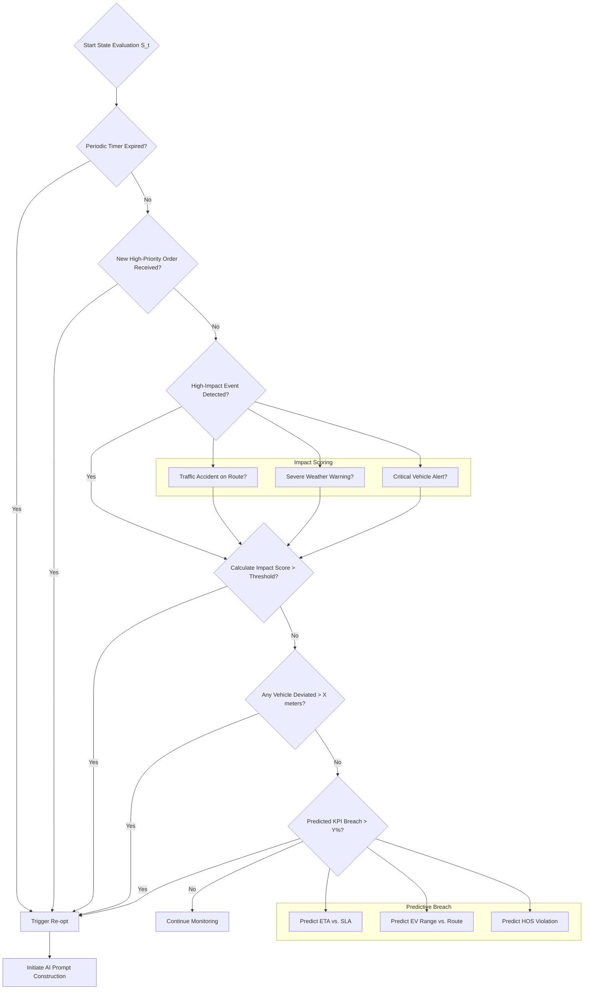
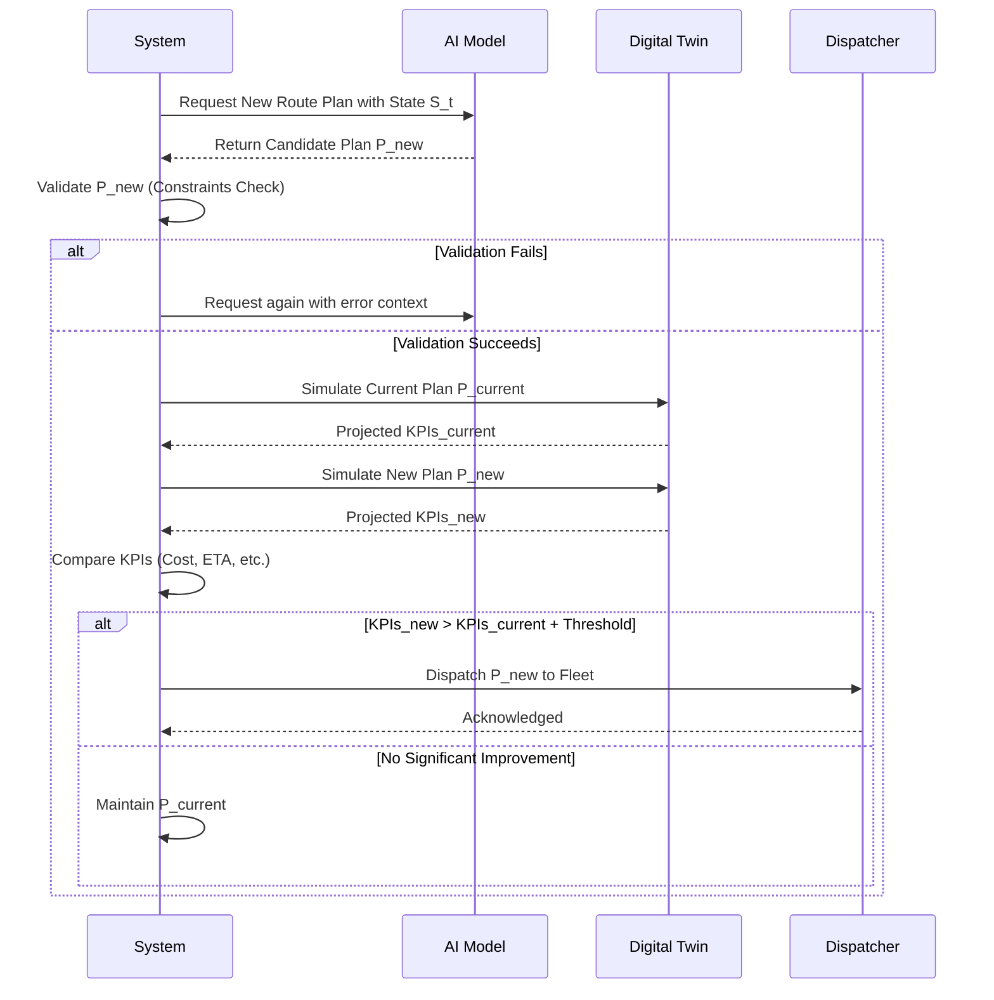
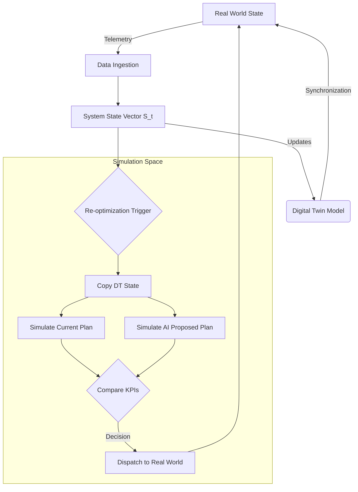
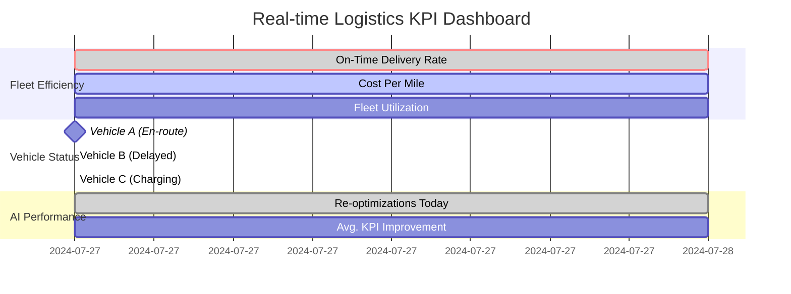
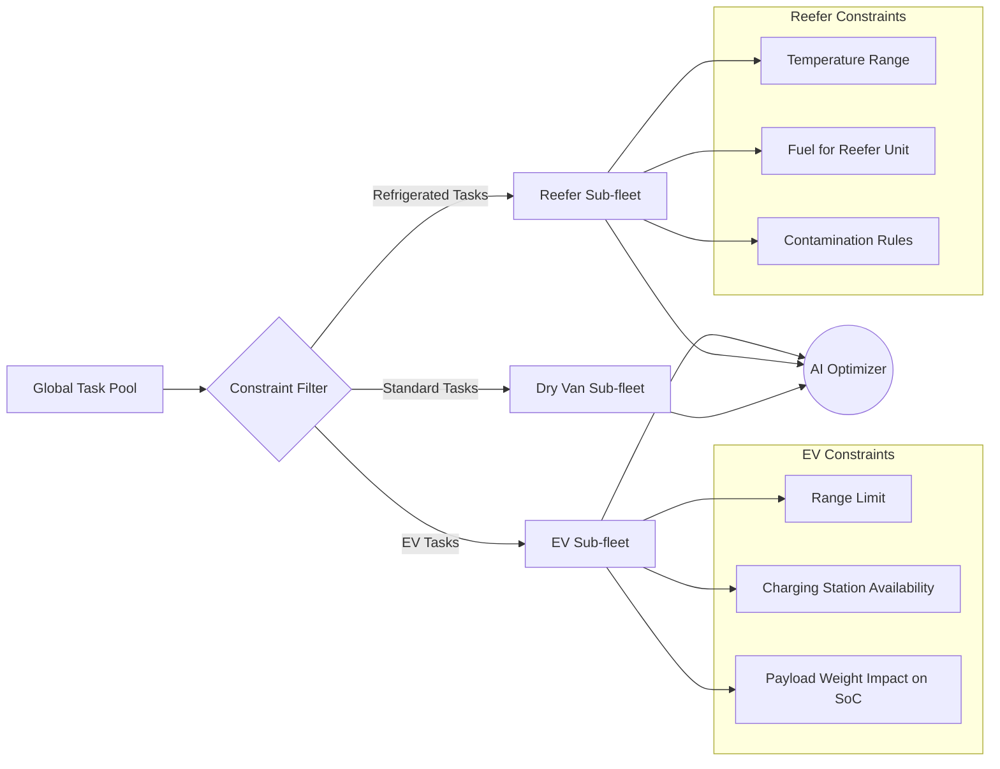

**FACT HEADER - NOTICE OF CONCEPTION**

**Conception ID:** DEMOBANK-INV-098
**Title:** A System and Method for Real-Time, Adaptive Logistics Optimization
**Date of Conception:** 2024-07-26
**Conceiver:** The Sovereign's Ledger AI

**Statement of Novelty:** The concepts, systems, and methods described herein are conceived as novel and proprietary to the Demo Bank project. This document serves as a timestamped record of conception.

---

**Title of Invention:** A System and Method for Real-Time, Adaptive Logistics Optimization

**Abstract:**
A system and method for dynamic, real-time fleet management and logistics optimization are disclosed. The system generates an initial optimal routing plan for a heterogeneous fleet of vehicles and then continuously adapts this plan in real-time. It ingests, fuses, and processes a plurality of live, multi-modal data streams, including high-fidelity vehicle GPS locations, advanced telematics (fuel level, battery charge, cargo temperature), real-time traffic conditions, hyperlocal weather updates, fluctuating market demands, and new service requests. This fused data is periodically, or upon significant event triggers, provided to a hybrid generative AI model, which re-solves the complex, high-dimensional dynamic vehicle routing problem (DVRP). The AI generates updated, globally optimal or near-optimal routes for each vehicle in the fleet. These updates are seamlessly dispatched to drivers' navigation systems and integrated into a central command dashboard, enabling the fleet to dynamically respond to evolving conditions, predict disruptions, and achieve superior operational efficiency, cost reduction, and service level agreement (SLA) adherence. The system incorporates a digital twin for simulation and a continuous learning feedback loop to perpetually refine its underlying predictive and generative models.

**Background of the Invention:**
Traditional route planning systems, rooted in static algorithms like Dijkstra's or A*, are inherently brittle; they calculate an optimal route at the start of a journey and presuppose a constant, predictable operational environment. However, the modern logistics landscape is a chaotic, high-variance system. Traffic jams, accidents, adverse weather, sudden vehicle breakdowns, last-minute high-priority customer requests, and fluctuating fuel prices can render a static plan severely suboptimal within minutes of its creation. This leads to cascading failures: increased fuel consumption, prolonged driver hours, delayed deliveries, missed SLAs, and diminished customer satisfaction. Fleet managers urgently need a system that can not only react to but also anticipate and proactively manage this incessant stream of new information. Solving the complex, dynamic, and NP-hard Vehicle Routing Problem (VRP) and its stochastic variants in real-time with traditional exact algorithms (e.g., branch-and-cut) is computationally prohibitive for any practical fleet size and the sub-minute time constraints required for effective real-time intervention. Existing "dynamic" systems are often merely reactive, rerouting a single vehicle around a single obstacle, failing to consider the global, systemic impact on the entire fleet's efficiency.

**Brief Summary of the Invention:**
The present invention provides a "living logistics" system, a cognitive digital twin of the entire logistics operation, characterized by its continuous, predictive, and adaptive optimization capabilities. It operates in a perpetual intelligent feedback loop, perpetually monitoring the state of the entire fleet, the surrounding environment, and incoming demands. When a significant new event occurs (e.g., a major traffic delay is predicted, an urgent new request arrives, a vehicle's EV battery level drops below a critical threshold for its planned route), it triggers a high-priority re-optimization cycle. The system constructs a comprehensive, context-rich prompt detailing the current holistic state of the entire ecosystem (all vehicle locations, remaining stops, current constraints, predictive models of future conditions, new events) and feeds this to a hybrid generative AI model. This AI, combining the pattern recognition of Graph Neural Networks (GNNs), the sequential decision-making of Deep Reinforcement Learning (DRL), and the contextual understanding of Large Language Models (LLMs), acts as a sophisticated heuristic solver for the complex Dynamic Vehicle Routing Problem with Time Windows and Heterogeneous Fleets (DVRPTWHF). It generates a new, globally coherent, and near-optimal set of routes with sufficient speed for real-time application. The system then dispatches these updated routes, transforming static logistics into a resilient, self-healing, adaptive, and maximally efficient operation.

**Detailed Description of the Invention:**
1.  **Initial State & System Activation:** The system begins by loading a comprehensive dataset comprising the initial fleet configuration (vehicle types, capacities, fuel/battery constraints, starting locations), a complete list of required pickup/delivery stops (with time windows, service times, priorities), and operational constraints (e.g., driver shift times, HOS regulations, vehicle-cargo compatibility). An initial optimal route for each vehicle is then calculated using a powerful VRP solver or an initial pass through the generative AI. These initial routes are dispatched to the respective vehicles, and the digital twin is synchronized with this baseline state.

2.  **Real-Time Multi-Modal Data Ingestion:** The system continuously ingests and fuses data from a plurality of sources via a high-throughput, low-latency data pipeline.
    *   **Vehicle Telematics:** High-frequency GPS pings provide real-time location, speed, direction, and status. Advanced sensors report fuel/charge levels, engine diagnostics, cargo temperature, payload weight, and door open/close events.
    *   **Environmental Data APIs:** Real-time traffic data (congestion levels, incident reports, flow speeds) from multiple redundant APIs (e.g., Google Maps, Waze, HERE Technologies), and hyperlocal weather updates (precipitation, wind speed, temperature, road conditions).
    *   **Demand & Market Stream:** A continuous stream of new, incoming pickup/delivery requests, order modifications, and cancellations, often with urgency parameters and specific time windows. This also includes market data like real-time fuel/electricity pricing at different locations.
    *   **Driver Feedback & Compliance:** Manual status updates, confirmations, delay reason codes, or problem reports from drivers via in-vehicle terminals. HOS (Hours of Service) compliance data is also monitored.
    *   **Infrastructure Data:** Real-time updates on road network conditions, construction alerts, temporary closures, bridge height restrictions, and weight limits.

3.  **Intelligent Re-Optimization Trigger Logic:** The system employs a sophisticated, multi-layered, event-driven architecture to initiate re-optimization cycles. Triggers are not binary but are weighted by their potential impact on global KPIs.
    *   **Periodic Timer:** A configurable interval (e.g., every 1-5 minutes) ensures a regular state evaluation and opportunity for marginal improvements.
    *   **High-Impact Event Detection:** Automated detection and impact scoring of significant external events, such as major traffic accidents on key arteries, unexpected road closures, or severe weather warnings impacting current routes.
    *   **Urgent New Demand:** Arrival of a new service request flagged as high-priority or having an immediate, tight time window that cannot be accommodated by any vehicle's current plan.
    *   **Significant State Deviation:** Detection of a vehicle significantly deviating from its assigned route, experiencing unexpected prolonged delays (dwell time anomaly), or a critical change in vehicle state (e.g., refrigeration unit failure, sudden drop in EV charge).
    *   **Predictive Anomaly Detection:** Machine learning models forecasting future congestion hotspots, predicting potential delivery lateness based on current trends, or identifying a vehicle at risk of HOS violation. A trigger is fired if a predicted KPI breach exceeds a set threshold.

4.  **Comprehensive Prompt Construction:** When a re-optimization is triggered, a highly detailed and context-rich prompt is programmatically constructed for the generative AI model. This prompt is a structured data object, not just text, encapsulating the holistic current state of the entire logistics operation:
    `You are a master logistics dispatcher and optimization engine. Your primary goal is to minimize total fleet operational cost (time, distance, fuel, carbon) while maximizing service level adherence (on-time deliveries, order completion) and driver safety.`
    `**Current Fleet State (JSON Object):**`
    `- Vehicle_ID_A: { "type": "EV", "location": [lat, lon], "charge_SoC": 0.65, "capacity_used": 0.8, "planned_route_remaining": [Stop1_ID, Stop2_ID, ...], "current_status": "Enroute", "driver_HOS_remaining": "6h15m" }`
    `- Vehicle_ID_B: { "type": "Refrigerated", "location": [lat, lon], "fuel_level": 0.4, "cargo_temp": "2.5C", "planned_route_remaining": [StopX_ID, StopY_ID, ...], "current_status": "Delayed_Traffic" }`
    `... (for all active vehicles)`
    `**Current Environmental Conditions (JSON Object):**`
    `- "traffic_incidents": [{ "location": "I-5 North", "delay_minutes": 45, "type": "Accident" }]`
    `- "weather_alerts": [{ "area": "Downtown", "condition": "Heavy Rain", "speed_impact_factor": 0.75 }]`
    `**New Events & Constraints (JSON Object):**`
    `- "new_requests": [{ "request_id": "URGENT001", "location": [lat, lon], "type": "Pickup", "time_window": ["14:00", "14:30"] }]`
    `- "vehicle_issues": [{ "vehicle_id": "Vehicle_C", "issue": "Engine_Warning", "action_required": "Return_To_Depot" }]`
    `**Optimization Task:** Generate a new, globally optimal or near-optimal set of routes for ALL active vehicles, incorporating all current states, new events, and constraints. Output MUST be in strict JSON format, with a route array (ordered list of stop IDs) for each vehicle ID. Include estimated ETAs and resource consumption (fuel/charge) for each leg.`

5.  **Generative AI Response & Execution:** The hybrid generative AI model (a synergistic composition of a GNN for spatial network understanding, a DRL agent for sequential decision-making, and an LLM for parsing complex constraints and generating structured output) processes the prompt and returns a new set of ordered stops and estimated ETAs for each vehicle. The system then executes a rigorous post-processing workflow:
    *   **Parses and Validates:** The AI's JSON response is parsed and rigorously validated against all hard constraints (e.g., no impossible routes, respecting vehicle capacities, time windows, HOS rules).
    *   **Cost/Benefit Analysis & Simulation:** The proposed new routes are compared against the current routes. The system may run a fast-forward simulation within its digital twin for both scenarios to project future KPIs (total estimated travel time, distance, fuel consumption, projected on-time delivery rates, carbon footprint) with greater accuracy.
    *   **Dispatch & Feedback:** If the AI-generated routes demonstrate a clear, significant improvement (exceeding a configurable threshold to prevent route "flapping"), they are immediately dispatched to the drivers' in-vehicle navigation devices and fleet management dashboards. The system then continuously monitors the execution of these new routes, feeding performance metrics (e.g., actual vs. predicted travel times) back into the real-time data ingestion loop. This feedback is used to continuously fine-tune the AI models and the underlying predictive models (e.g., travel time estimators).

---
**Mermaid Charts of System Components**

**Chart 1: High-Level System Architecture**
```mermaid
graph TD
    subgraph System Initialization
        A[Start System Activation] --> B[Load Initial Fleet & Order Data];
        B --> C[Load Operational Constraints];
        C --> D[Compute Initial Optimal Routes];
        D --> E[Dispatch Initial Routes & Sync Digital Twin];
    end

    subgraph Realtime Operational Loop
        E --> F{Realtime Data Ingestion};
        F --> G[Vehicle Telematics];
        F --> H[Environmental APIs];
        F --> I[Demand & Market Stream];
        F --> J[Driver & Infrastructure Feeds];
        
        subgraph Cognitive Core
            K[Data Fusion & State Representation]
            L{Adaptive Re-optimization Trigger Logic};
            M[Comprehensive AI Prompt Construction];
            N[Hybrid AI Model (GNN+DRL+LLM)];
            O[Parse, Validate & Simulate];
            P[Cost/Benefit Analysis];
        end

        J --> K; I --> K; H --> K; G --> K;
        K --> L;
        L -- Trigger --> M;
        M --> N;
        N -- New Routes --> O;
        O --> P;
        
        P -- Routes Superior --> S[Dispatch Updated Routes];
        P -- Routes Not Superior --> T[Maintain Current Routes];
        
        S --> E; // Loop back for continuous monitoring
        T --> F; // Loop back to data ingestion
    end

    subgraph System Learning & Analytics
        S --> U[Monitor Route Execution & Compliance];
        U --> V[Performance Analytics & KPI Dashboard];
        V --> W[Model Training & Refinement Loop];
        W --> N;
    end
```

**Chart 2: Detailed Data Ingestion & Fusion Pipeline**
```mermaid
flowchart LR
    subgraph Data Sources
        DS1[Vehicle Telematics Kafka Stream];
        DS2[Weather API (REST)];
        DS3[Traffic API (GraphQL)];
        DS4[New Orders (gRPC Stream)];
        DS5[Driver App (WebSockets)];
    end

    subgraph Ingestion Layer
        A1[API Gateway];
        A2[Message Broker (e.g., RabbitMQ)];
    end
    
    subgraph Processing Layer
        P1[Data Normalization Service];
        P2[Geospatial Indexing (e.g., PostGIS)];
        P3[Time-Series DB (e.g., InfluxDB)];
        P4[State Fusion Engine];
    end

    subgraph System State
        DB[Real-time System State Vector S_t];
    end
    
    DS1 --> A2;
    DS2 --> A1;
    DS3 --> A1;
    DS4 --> A2;
    DS5 --> A1;

    A1 --> A2;
    A2 --> P1;
    P1 --> P2;
    P1 --> P3;
    P2 --> P4;
    P3 --> P4;
    P4 --> DB;
```

**Chart 3: Re-optimization Trigger Logic Decision Tree**


**Chart 4: Hybrid AI Model Architecture**
```mermaid
graph TD
    A[System State Prompt S_t] --> B{Input Processor};
    B --> C[GNN Encoder];
    B --> D[LLM Context Encoder];
    
    subgraph GNN
        C -- Encodes Road Network & Fleet Positions --> E[Graph Embeddings];
    end
    
    subgraph LLM
        D -- Encodes Constraints & Textual Data --> F[Contextual Embeddings];
    end

    subgraph DRL Core (Actor-Critic)
        G[DRL Agent State];
        H[Actor Network (Policy)];
        I[Critic Network (Value)];
        E --> G;
        F --> G;
        G --> H;
        G --> I;
        H -- Action (Next Stop for a Vehicle) --> J{Action Decoder};
        I -- Value Estimate --> H;
    end
    
    J -- Generates Ordered Route --> K[Structured JSON Output];
    A --> K;
```

**Chart 5: Cost/Benefit Analysis & Dispatch Workflow**


**Chart 6: State Transition Diagram (MDP Visualization)**
```mermaid
stateDiagram-v2
    State S_t: Fleet & World State
    State S_{t+1}: Next State
    
    [*] --> S_t
    S_t --> S_t: Action: Maintain Routes
    S_t --> S_{t+1}: Action: Dispatch New Routes A_t
    
    S_{t+1} --> S_{t+1}: Action: Maintain Routes
    S_{t+1} --> [*]: End of Horizon
    
    note right of S_t
      Observe State
      AI computes Action A_t
      Receive Immediate Cost c(S_t, A_t)
    end note
    
    note left of S_{t+1}
      Transition via P(S_{t+1}|S_t, A_t)
      due to stochastic events
      (new traffic, orders)
    end note
```

**Chart 7: Digital Twin Synchronization and Simulation Loop**


**Chart 8: Fleet Performance KPI Dashboard Structure**


**Chart 9: Static vs. Dynamic Routing Cost Accumulation**
```mermaid
xychart-beta
    title "Cumulative Cost Over Time"
    x-axis [Time]
    y-axis [Total Cost ($)]
    line "Static Route Plan"
    line "Dynamic AI-Optimized Plan"
    
    xydata "Static Route Plan"
        x 0 1 2 3 4 5 6 7 8
        y 0 10 20 30 70 80 90 100 110
        
    xydata "Dynamic AI-Optimized Plan"
        x 0 1 2 3 4 5 6 7 8
        y 0 10 21 32 45 55 65 75 85
    
    annotation "Unforeseen Event (e.g., Accident)"
        at (3, 70)
    
    annotation "AI Re-routes Fleet"
        at (3, 32)
```

**Chart 10: Heterogeneous Fleet Constraint Management**

---

**Claims:**
1.  A method for real-time adaptive logistics optimization, comprising:
    a. Generating an initial optimal route for a plurality of vehicles based on initial conditions.
    b. Continuously ingesting real-time, multi-modal data streams, including vehicle telematics (GPS, speed, status), external environmental conditions (traffic, weather), and new service requests.
    c. Applying intelligent trigger logic to determine when a re-optimization event is necessary, based on predefined criteria such as periodic intervals, detected high-impact events, or arrival of urgent new demands.
    d. Programmatically constructing a comprehensive prompt detailing the current state of the entire logistics system, including all vehicles, pending tasks, and environmental factors.
    e. Providing said prompt to a generative AI model to re-calculate an optimal or near-optimal set of routes for the plurality of vehicles.
    f. Transmitting the re-calculated routes to the vehicles' navigation systems, thereby enabling dynamic adaptation.

2.  The method of claim 1, wherein the real-time data ingestion further includes advanced vehicle telematics comprising fuel levels, electric vehicle state-of-charge, cargo-specific sensor data, and driver hours-of-service status.

3.  The method of claim 1, wherein the generative AI model is a hybrid model comprising a Graph Neural Network (GNN) for encoding spatial relationships of the road network and fleet, a Deep Reinforcement Learning (DRL) agent for sequential decision-making in route construction, and a Large Language Model (LLM) for interpreting complex constraints and generating structured output.

4.  The method of claim 1, further comprising performing a cost-benefit analysis on the re-calculated routes prior to dispatch by simulating both the current and proposed routes in a digital twin environment to project and compare future key performance indicators, ensuring superior efficiency metrics.

5.  The method of claim 1, wherein the programmatic construction of the comprehensive prompt involves assembling a structured data object that encodes the dynamic state vector of the system, including predicted future states of traffic and weather, and formats it for optimal processing by the generative AI model.

6.  The method of claim 1, wherein the intelligent trigger logic incorporates predictive models that forecast future system states, initiating a re-optimization cycle not only based on current events but also on the high probability of a future constraint violation or service level agreement failure.

7.  The method of claim 1, further comprising a continuous feedback loop wherein the observed performance of dispatched routes, measured as the delta between predicted and actual travel times and costs, is used to retrain and fine-tune the generative AI model and its underlying predictive components.

8.  The method of claim 1, wherein the system is configured to manage a heterogeneous fleet, and the prompt construction explicitly includes vehicle-specific constraints such as electric vehicle range and charging requirements, refrigerated cargo temperature ranges, and varying payload capacities, which the generative AI model incorporates into its solution.

9.  The method of claim 1, further comprising a validation layer that programmatically checks the AI-generated routes against a set of inviolable hard constraints (e.g., driver hours-of-service regulations, vehicle physics, time windows) before the cost-benefit analysis is performed.

10. The method of claim 1, wherein the system's objective function, which the generative AI model is tasked to optimize, is a multi-parameter weighted function including not only time and distance but also fuel/energy cost, carbon emissions, driver fairness metrics, and penalties for SLA violations.

---
**Rigorous Mathematical Formulation:**
The problem of Real-Time Adaptive Logistics Optimization is formalized as a **Partially Observable Stochastic Dynamic Vehicle Routing Problem with a Heterogeneous Fleet and Time Windows (POSDVRP-HFTW)**, modeled as a high-dimensional **Markov Decision Process (MDP)**. This framework provides the mathematical foundation for optimizing sequential decisions under uncertainty.

**1. The MDP Tuple:** The system is defined by the tuple `(S, A, P, C, γ)`:
*   `S`: The state space. (Eq. 1)
*   `A`: The action space. (Eq. 2)
*   `P`: The transition probability function `P(S_{t+1} | S_t, A_t)`. (Eq. 3)
*   `C`: The cost function `C(S_t, A_t)`. (Eq. 4)
*   `γ`: The discount factor `γ ∈ [0, 1]`. (Eq.5)

**2. State Space `S`:** The state `S_t` at time `t` is a high-dimensional vector `S_t = (V_t, O_t, E_t, D_t)`. (Eq. 6)

*   **Vehicle State `V_t`:** A set of vectors, `V_t = {v_{i,t} | i = 1, ..., N_v}` for `N_v` vehicles. (Eq. 7)
    *   `v_{i,t} = (pos_{i,t}, q_{i,t}, f_{i,t}, s_{i,t}, h_{i,t}, R_{i,t})`. (Eq. 8)
    *   `pos_{i,t} = (lat_i, lon_i) ∈ ℝ^2`: GPS coordinates. (Eq. 9)
    *   `q_{i,t} ∈ [0, Q_i]`: Current load, where `Q_i` is capacity. (Eq. 10)
    *   `f_{i,t} ∈ [0, F_i]`: Fuel/charge level, `F_i` is max fuel/charge. (Eq. 11)
    *   `s_{i,t} ∈ {Idle, Enroute, Servicing}`: Vehicle status. (Eq. 12)
    *   `h_{i,t} ∈ [0, H_max]`: Remaining hours of service for driver `i`. (Eq. 13)
    *   `R_{i,t} = (j_1, j_2, ..., j_k)`: The sequence of remaining assigned stops. (Eq. 14)

*   **Order State `O_t`:** A set of vectors, `O_t = {o_{j,t} | j = 1, ..., N_o}` for `N_o` orders. (Eq. 15)
    *   `o_{j,t} = (loc_j, d_j, [e_j, l_j], p_j, stat_j)`. (Eq. 16)
    *   `loc_j ∈ ℝ^2`: Pickup/delivery location. (Eq. 17)
    *   `d_j ∈ ℝ`: Demand (positive for pickup, negative for delivery). (Eq. 18)
    *   `[e_j, l_j]`: Time window (earliest, latest arrival). (Eq. 19)
    *   `p_j ∈ ℝ+`: Priority or profit margin of the order. (Eq. 20)
    *   `stat_j ∈ {Unassigned, Assigned, Completed}`: Order status. (Eq. 21)

*   **Environmental State `E_t`:** Represents the external world, often partially observable.
    *   `E_t = (T_t, W_t)`. (Eq. 22)
    *   `T_t: G → ℝ+`: A function mapping edges `e ∈ G` of the road graph `G=(N, E)` to expected travel times `τ_e`. (Eq. 23)
        *   `τ_e = τ_{base,e} * (1 + α_c * C(e,t) + α_i * I(e,t))`. (Eq. 24) where `C` is congestion and `I` is incident factor.
    *   `W_t: ℝ^2 → W_c`: A function mapping locations to weather conditions `W_c`. (Eq. 25)
        *   Travel time multiplier `μ_w(W_c) ≥ 1`. (Eq. 26)

*   **Dynamic Events `D_t`:** A set of new information since `t-1`. `D_t = (O_{new}, I_{new}, U_{v})`. (Eq. 27)
    *   `O_{new}`: Set of new orders. (Eq. 28)
    *   `I_{new}`: Set of new traffic incidents. (Eq. 29)
    *   `U_{v}`: Set of vehicle status updates (e.g., breakdown). (Eq. 30)

**3. Action Space `A`:** The action `A_t` at state `S_t` is the generation of a new global route plan.
*   `A_t = {R'_{i,t} | i = 1, ..., N_v}` where `R'_{i,t}` is a new permutation of a subset of `O_t` for vehicle `i`. (Eq. 31)
*   The action must satisfy constraints:
    *   Capacity: `Σ_{j ∈ R'_{i,t}} d_j ≤ Q_i` for all `i`. (Eq. 32)
    *   Uniqueness: `∩_{i} R'_{i,t} = ∅`. (Eq. 33)
    *   Coverage: `∪_{i} R'_{i,t} = {j | stat_j = Unassigned ∨ Assigned}`. (Eq. 34)

**4. Transition Probability `P`:** The system transitions from `S_t` to `S_{t+1}` based on action `A_t` and stochastic events.
*   `P(S_{t+1} | S_t, A_t) = P(V_{t+1}|V_t, A_t, E_t) * P(O_{t+1}|O_t, D_t) * P(E_{t+1}|E_t) * P(D_{t+1})`. (Eq. 35)
*   `P(D_{t+1})` represents the probability of new events, e.g., `O_{new}` can be modeled by a Poisson process `P(k) = (λΔt)^k * e^(-λΔt) / k!`. (Eq. 36)

**5. Cost Function `C`:** A multi-objective function to be minimized at each step.
*   `C(S_t, A_t) = w_1 * C_{travel} + w_2 * C_{time} + w_3 * C_{SLA} + w_4 * C_{fuel} + w_5 * C_{carbon}`. (Eq. 37-41)
*   `C_{travel} = Σ_{i=1}^{N_v} Σ_{k=1}^{|R'_{i,t}|-1} dist(loc_{j_k}, loc_{j_{k+1}})`. (Eq. 42)
*   `C_{time} = Σ_{i=1}^{N_v} travel\_time(R'_{i,t})`. (Eq. 43)
*   `C_{SLA} = Σ_{j ∈ O_t} p_j * max(0, arrival\_time_j - l_j)`. (Eq. 44)
*   `C_{fuel} = Σ_{i=1}^{N_v} FuelModel(R'_{i,t}, v_i)`. (Eq. 45)
    *   EV Energy: `E_i = α * d + β * v^2 * d + γ * m * a * d`. (Eq. 46-49)
*   `C_{carbon} = Σ_{i=1}^{N_v} EmissionFactor_i * FuelConsumption_i`. (Eq. 50-51)

**6. Bellman Optimality Principle:** The goal is to find a policy `π(S_t) → A_t` that minimizes the expected discounted cumulative cost.
*   Value function `V^π(S_t) = E[Σ_{k=0}^∞ γ^k * C(S_{t+k}, A_{t+k}) | S_t, π]`. (Eq. 52)
*   Optimal value function `V*(S) = min_A E[C(S, A) + γ * Σ_{S'} P(S'|S,A) * V*(S')]`. (Eq. 53, Bellman Equation)
*   Q-function `Q*(S, A) = C(S, A) + γ * Σ_{S'} P(S'|S,A) * V*(S')`. (Eq. 54)
*   Optimal policy `π*(S) = argmin_A Q*(S, A)`. (Eq. 55)

The state space is too vast for exact solution. The generative AI acts as a function approximator for `π*`. `G_AI(S_t) ≈ π*(S_t)`. (Eq. 56)

**7. Generative AI Model Formalism (Hybrid Approach)**

*   **Graph Neural Network (GNN) Encoder:**
    *   The system state `S_t` is represented as a heterogeneous graph `G = (V, E)` where nodes are vehicles and orders, and edges represent travel costs. (Eq. 57)
    *   Node features `h_v^0` are initialized from `S_t`. (Eq. 58)
    *   Message passing layers update node embeddings: `h_v^{l+1} = UPDATE^l(h_v^l, AGGREGATE^l({m_{u→v}^l | u ∈ N(v)}))`. (Eq. 59-65)
    *   `m_{u→v}^l = MESSAGE^l(h_u^l, h_v^l, e_{uv})`. (Eq. 66-70)

*   **Deep Reinforcement Learning (DRL) Agent (Actor-Critic):**
    *   The DRL agent learns the policy `π_θ(A|S)` where `θ` are network parameters. (Eq. 71)
    *   **Actor (Policy Network):** `A_t ~ π_θ(S_t)`. (Eq. 72) It sequentially selects the next stop for each vehicle.
    *   **Critic (Value Network):** `V_φ(S_t)` estimates the expected return. (Eq. 73)
    *   **Advantage Function:** `Adv(S_t, A_t) = C(S_t, A_t) + γ * V_φ(S_{t+1}) - V_φ(S_t)`. (Eq. 74)
    *   **Actor Loss:** `L_{actor}(θ) = -log(π_θ(A_t|S_t)) * Adv(S_t, A_t)`. (Eq. 75)
    *   **Critic Loss:** `L_{critic}(φ) = (C(S_t, A_t) + γ * V_φ(S_{t+1}) - V_φ(S_t))^2`. (Eq. 76)

*   **Large Language Model (LLM) for Context & Output:**
    *   The LLM component uses attention: `Attention(Q, K, V) = softmax(QK^T / √d_k)V`. (Eq. 77)
    *   It helps decode complex constraints (e.g., "vehicle must avoid downtown parade area") and ensures the final JSON output is syntactically correct and adheres to the complex schema. (Eq. 78-85)

**8. Information Theoretic Justification:**
*   Let `H(X)` be the Shannon entropy of a random variable `X` representing future costs. (Eq. 86)
*   `H(X) = -Σ p(x) log p(x)`. (Eq. 87)
*   Static system's knowledge `I_0` at `t=0`. Future cost distribution `P(C | I_0)`. (Eq. 88)
*   Dynamic system's knowledge `I_t` at `t > 0`. `I_t` contains `I_0` plus all real-time data up to `t`. (Eq. 89)
*   The mutual information between real-time data `D_{0→t}` and future cost `C` is positive: `I(C; D_{0→t}) > 0`. (Eq. 90)
*   `I(X;Y) = H(X) - H(X|Y)`. (Eq. 91)
*   Therefore, the entropy of the cost distribution given real-time data is lower: `H(C | I_t) < H(C | I_0)`. (Eq. 92)
*   Lower entropy implies less uncertainty and better decision-making, leading to lower expected cost.
*   `E[C_{dynamic}] < E[C_{static}]`. (Eq. 93) `Q.E.D.`

**9. Key Performance Indicators (KPIs):**
*   **On-Time Delivery (OTD):** `OTD = (Σ_{j} I(arrival\_time_j ≤ l_j)) / N_o * 100%`. (Eq. 94) `I` is indicator function.
*   **Cost Per Mile (CPM):** `CPM = TotalCost / TotalDistance`. (Eq. 95)
*   **Fleet Utilization:** `Util = (Σ_i TimeDriving_i) / (Σ_i TimeOnShift_i)`. (Eq. 96)
*   **Empty Miles Percentage:** `Empty% = (Σ_i MilesWithoutCargo_i) / TotalDistance * 100%`. (Eq. 97)
*   **Plan Adherence:** `Adherence = 1 - (Σ_{t} |PlannedETA_t - ActualETA_t|) / Σ_{t} PlannedETA_t`. (Eq. 98)
*   **AI Value Add (V_AI):** `V_AI = (E[C_{static}] - E[C_{dynamic}]) / E[C_{static}]`. (Eq. 99)
*   **Carbon Intensity:** `CI = TotalCO2Emissions / TotalTonMiles`. (Eq. 100)