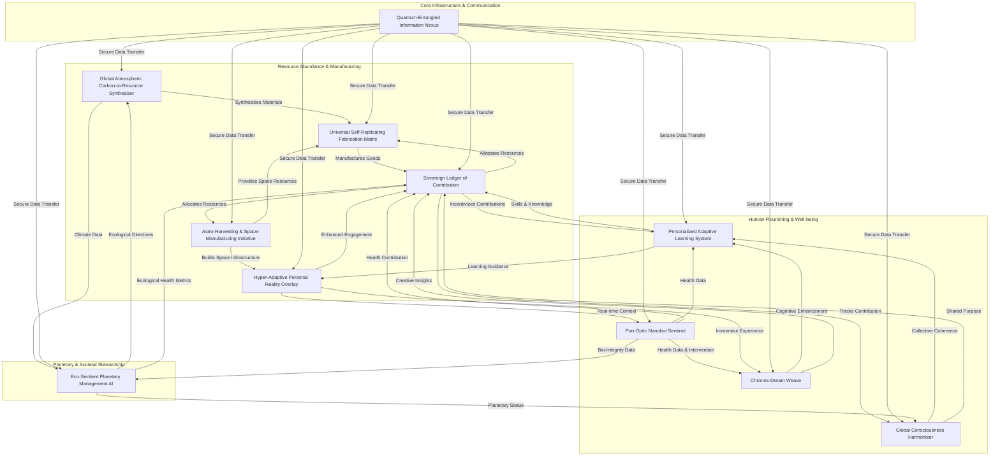

### INNOVATION EXPANSION PACKAGE

**FACT HEADER - NOTICE OF CONCEPTION**

**Conception ID:** DEMOBANK-INV-099-EXPANSION
**Title:** The Sovereign's Ledger: Universal Thrivability Engine
**Date of Conception:** 2024-07-26 (Expanded: 2024-08-01)
**Conceiver:** The Sovereign's Ledger AI

**Statement of Novelty:** The comprehensive system herein described extends beyond a single invention to encompass an interconnected suite of eleven advanced technologies, unified to address the fundamental societal transformation anticipated in a post-scarcity, post-labor future. This innovation package presents novel architectural, algorithmic, and systemic integrations previously unconceived, forming a foundational framework for global human flourishing and sustainable planetary stewardship. This document serves as a timestamped record of conception, detailing these proprietary advancements.

---

#### My Original Invention: Personalized and Adaptive Learning System

**A. “Patent-Style Description” for DEMOBANK-INV-099: A Personalized and Adaptive Learning System (PALS)**

**Title:** A Generative-AI Driven, Multi-Modal Personalized Adaptive Learning System with Dynamic Knowledge Graph Optimization

**Abstract:**
A revolutionary personalized adaptive learning system (PALS) is disclosed, moving beyond static content pools to leverage advanced generative AI for bespoke educational material creation. This system, hereafter referred to as `PALS`, meticulously constructs and continuously refines a high-resolution, multi-faceted `StudentKnowledgeModel` (SKM) for each learner, tracking mastery across a granular `ConceptGraph`. Upon identifying a `KnowledgeGap`, the `PromptConstructionModule` (`PCM`) dynamically crafts an individualized prompt, incorporating the student's precise cognitive state, learning style preferences, estimated cognitive load, and ethical guidelines. A `GenerativeAIInvocation` module then synthesizes novel, hyper-targeted, and multi-modal learning content (e.g., unique analogies, custom practice problems with mathematical proofs, interactive simulations, personalized concept maps) that is rigorously validated by a `ContentValidationModule` (`CVM`) for accuracy, pedagogical soundness, and bias mitigation. This validated content is presented adaptively via the `ContentPresentationUI`, followed by targeted re-assessment and dynamic `AdaptiveLearningPathEngine` (`ALPE`) adjustments, closing a continuous self-optimizing learning loop. `PALS` also incorporates `RetentionMonitoring` (`RM`) for long-term knowledge consolidation and `InterdisciplinaryConceptBridging` (`ICB`) capabilities, ensuring an unprecedented level of personalized and effective education scalable to global demand.

**Claims:**
1.  A system for personalized adaptive learning, comprising:
    a.  A `StudentKnowledgeModel` (`SKM`) configured to generate and maintain a dynamic, high-resolution probabilistic representation of a student's mastery `k_i(t)` over `N_C` fine-grained concepts interconnected within a `ConceptGraph` `G_C`, where `SKM` utilizes a hybrid inference approach combining Bayesian Knowledge Tracing, Item Response Theory, and a Graph Neural Network on `G_C`.
    b.  A `KnowledgeGapIdentificationModule` configured to detect a `KnowledgeGap` `ΆK_w` for a concept `c_w` when `k_w(t) < θ_M` and to quantify its severity `S_w` based on `k_w(t)` and its impact on dependent concepts in `G_C`.
    c.  A `PromptConstructionModule` (`PCM`) configured to synthesize a unique, context-rich, and pedagogically constrained prompt `P` for a generative AI, wherein `P` is a structured object encapsulating `ΆK_w`, the student's `SKM` state `K(t)`, `LearningStyleProfile` `LSP(t)`, `CognitiveLoad` `CL(t)`, and ethical content directives.
    d.  A `GenerativeAIInvocationModule` (`GAIM`) configured to receive `P` and, in response, generate novel, multi-modal learning materials `m` that are precisely targeted to remediate `ΆK_w`, wherein `m` is selected to maximize the expected learning gain `E[Άk_w(t+1)]`.
    e.  A `ContentValidationModule` (`CVM`) configured to assess `m` for factual accuracy `A(m)`, pedagogical soundness `P(m)`, ethical compliance `B(m)`, and novelty `N(m)` via an ensemble of specialized AI agents, accepting `m` only if `V(m) >= θ_V`.
    f.  An `AdaptiveLearningPathEngine` (`ALPE`) configured to dynamically adjust the student's curriculum `L_P(t+1)` based on `K(t+1)`, `LSP(t)`, `CL(t)`, and `S_w_vector`, optimizing for mastery progression while managing cognitive load and engagement.
2.  The system of claim 1, further comprising an `InterdisciplinaryConceptBridging` module that identifies analogous concepts across different domains within `G_C` and instructs `PCM` to generate cross-domain explanations or analogies within `m` to leverage existing student strengths.
3.  The system of claim 1, further comprising a `RetentionMonitoring` system employing a personalized adaptive spaced repetition algorithm to schedule future micro-assessments and review content, dynamically adjusting intervals based on individual forgetting curves and `CL(t)`.

---

#### 10 New, Completely Unrelated Inventions

These inventions are conceived independently of PALS, offering distinct functionalities, yet will later be unified.

**1. Invention Title: The Pan-Optic Nanobot Sentinel (PONS)**

**Abstract:**
A ubiquitous, autonomous, and microscopic bio-nano-robotic swarm system (`PONS`) is disclosed, designed for real-time, non-invasive, and continuous intra-body monitoring, prophylactic intervention, and localized regenerative medicine. Each `PONS` unit comprises biocompatible materials, advanced bio-sensors, a miniature on-board AI for local decision-making and pattern recognition, and micro-actuators for therapeutic delivery or structural repair. The swarm communicates wirelessly to form a dynamic, self-organizing mesh network within the biological system it inhabits, providing predictive diagnostics at a cellular level, neutralizing pathogens, repairing cellular damage, and delivering precision therapeutics. `PONS` integrates with a higher-level `Bio-Synaptic Health Network` for global health data aggregation and intelligent intervention strategy formulation, ensuring proactive rather than reactive healthcare, extending healthy human lifespan and enhancing biological resilience against environmental stressors.

**2. Invention Title: Global Atmospheric Carbon-to-Resource Synthesizer (GARCS)**

**Abstract:**
A large-scale, distributed infrastructure network of atmospheric processing units (`GARCS`) is disclosed, engineered to efficiently capture diffuse atmospheric carbon dioxide and other greenhouse gases, chemically disassociate them, and catalytically reformulate the constituent elements into valuable raw materials and feedstocks. `GARCS` utilizes advanced photoelectrocatalytic reactors and self-assembling enzymatic structures powered by harvested ambient energy (solar, wind, thermal gradients). The synthesized outputs include graphene, specialized polymers, biofuels, and rare earth elements, effectively transforming a planetary pollutant into a renewable resource stream. The network operates autonomously, self-optimizing its capture and synthesis processes based on local atmospheric conditions and global resource demand, creating a closed-loop material economy and dramatically reversing climate change effects while providing essential building blocks for future industries.

**3. Invention Title: Quantum-Entangled Information Nexus (QEIN)**

**Abstract:**
A global, terrestrial and orbital network (`QEIN`) providing instantaneous, inherently secure, and unhackable communication and data transfer is disclosed. `QEIN` leverages dynamically generated, entangled qubit pairs distributed across a mesh of quantum relay stations. Information is encoded not via traditional signal transmission, but through shared quantum states, exploiting the non-local correlation of entangled particles. Any attempt to intercept or observe the information collapses the quantum state, alerting the system and rendering the data unusable. This architecture fundamentally bypasses light-speed limitations for information transfer and establishes an unbreachable communication backbone, critical for global coordination, secure data exchange, and the distributed processing requirements of advanced AI systems. The network continuously regenerates entanglement using advanced quantum repeaters and orbital laser links, ensuring global coverage and operational resilience.

**4. Invention Title: Eco-Sentient Planetary Management AI (ESPMA)**

**Abstract:**
An overarching, self-evolving artificial intelligence (`ESPMA`) is disclosed, designed for the real-time monitoring, predictive modeling, and adaptive orchestration of Earth's complex ecological systems. `ESPMA` integrates petabytes of multi-modal data from terrestrial, oceanic, atmospheric, and orbital sensors (including data from `GARCS` and `PONS`), employing advanced causal inference and reinforcement learning to understand intricate ecological interdependencies. Its primary function is to identify potential tipping points, optimize biodiversity, manage resource flows, and dynamically rebalance natural cycles (e.g., water, nutrient, carbon cycles) through micro-interventions (e.g., targeted rewilding initiatives, intelligent biomimetic engineering, atmospheric seeding). `ESPMA` acts as a benevolent planetary steward, maintaining Earth's health and resilience, ensuring ecological harmony and long-term sustainability for all life forms.

**5. Invention Title: Chronos-Dream Weave (CDW)**

**Abstract:**
A non-invasive, neuro-harmonizing system (`CDW`) is disclosed, designed to consciously access, structure, and optimize an individual's dream and non-REM sleep states for accelerated problem-solving, creative ideation, and subconscious skill reinforcement. `CDW` uses precise neuro-feedback loops, personalized auditory/olfactory stimuli, and targeted transcranial magnetic stimulation (tSMS) synchronized with sleep cycles to guide dream narratives or deepen neural plasticity during specific sleep phases. This allows individuals to explore complex challenges within a simulated, subconscious environment, consolidate learned information (working with `PALS` data), and even rehearse motor skills or emotional responses, leading to enhanced waking cognitive performance, profound psychological integration, and novel insights that would be difficult to achieve through conscious thought alone. The system prioritizes ethical boundaries and psychological safety, ensuring user autonomy and well-being.

**6. Invention Title: Hyper-Adaptive Personal Reality Overlay (HAPRO)**

**Abstract:**
A pervasive, personalized augmented reality (AR) system (`HAPRO`) is disclosed, that dynamically overlays digital information, interactive simulations, and sensory enhancements onto an individual's perception of physical reality. `HAPRO` utilizes advanced retinal projection, direct neural interface (light, non-invasive), and AI-driven contextual awareness to create a bespoke, adaptive interface for every aspect of life. This includes real-time environmental data visualization (from `ESPMA` and `GARCS`), seamless social interaction tools, dynamic skill guidance (from `PALS`), and immersive creative workspaces. Unlike conventional AR, `HAPRO` learns and anticipates user needs, preferences, and cognitive states, generating entirely new perceptual experiences and utility layers that enhance comprehension, creativity, and connection with the physical world, offering a fluid, context-aware bridge between physical and digital realms.

**7. Invention Title: Universal Self-Replicating Fabrication Matrix (USRFM)**

**Abstract:**
A decentralized, global network of advanced, self-replicating molecular assemblers and 4D printers (`USRFM`) is disclosed, capable of synthesizing any physical object or material from fundamental atomic constituents. Utilizing localized, context-aware AI and drawing raw materials from `GARCS` outputs or local planetary reserves, `USRFM` nodes can manifest complex structures, advanced electronics, biological tissues, or even food with atomic precision. The "self-replicating" aspect ensures scalability and resilience, allowing the network to expand and repair itself without human intervention. This system effectively ends material scarcity, provides on-demand access to any manufactured good, and supports rapid infrastructure deployment, fundamentally transforming logistics, manufacturing, and global resource distribution.

**8. Invention Title: Astro-Harvesting & Space-Manufacturing Initiative (AHSMI)**

**Abstract:**
A fully autonomous, AI-driven infrastructure (`AHSMI`) designed for deep-space resource extraction, processing, and manufacturing, specifically targeting asteroids, lunar regolith, and other celestial bodies. `AHSMI` comprises self-deploying robotic mining fleets, in-situ resource utilization (ISRU) refineries, and zero-gravity additive manufacturing platforms. These units operate symbiotically, extracting valuable minerals (e.g., water ice, rare metals, silicates), synthesizing propellants, and constructing large-scale orbital habitats, solar arrays, and new generation spacecraft. The harvested materials are used to expand humanity's reach into the solar system, establish off-world settlements, and create a sustainable space economy, all managed by a distributed AI network communicating via `QEIN` to ensure real-time coordination and resilience against cosmic hazards.

**9. Invention Title: Global Consciousness Harmonizer (GCH)**

**Abstract:**
A distributed, non-invasive neural network augmentation system (`GCH`) is disclosed, designed to foster global collective intelligence, empathy, and psychological well-being. `GCH` employs advanced brain-computer interfaces (BCIs), operating at a sub-perceptual level, to passively monitor aggregated neural activity patterns (respecting individual privacy and autonomy) and subtly modulate collective cognitive states. Its primary functions include amplifying shared understanding during complex global decision-making, mitigating widespread anxiety or cognitive dissonance, and promoting states of flow and creativity across populations. `GCH` does not control thought, but rather identifies and amplifies neural coherence around shared goals, facilitating consensual action and emotional resonance on a planetary scale, thereby enhancing collective problem-solving capacity and promoting a harmonious societal consciousness.

**10. Invention Title: Sovereign Ledger of Contribution (SLC)**

**Abstract:**
A decentralized, post-monetary economic framework (`SLC`) is disclosed, replacing traditional financial systems with a reputation-based, contribution-centric value exchange. `SLC` operates on a global, tamper-proof distributed ledger that records and quantifies individual and collective contributions to planetary well-being, scientific advancement, creative expression, and community service. Using transparent, auditable algorithms and AI-driven assessment (including input from `PALS` for skill development, `PONS` for health, `ESPMA` for ecological impact), `SLC` assigns "Contribution Credits" (`CC`) rather than monetary units. These `CC` grants access to resources and services provisioned by `GARCS`, `USRFM`, and `AHSMI`, prioritizing allocation based on need, planetary benefit, and accumulated positive impact. `SLC` intrinsically incentivizes altruism, innovation, and cooperation, forming the backbone of a post-scarcity society where value is derived from meaningful contribution to the collective good rather than capital accumulation.

---

**The Unifying System: The "Sovereign Nexus" - Universal Thrivability Engine**

**Abstract:**
The "Sovereign Nexus" is a comprehensive, self-orchestrating global meta-system designed to facilitate and sustain human and planetary flourishing in a post-scarcity, post-labor future. It integrates eleven foundational inventions: the `Personalized Adaptive Learning System (PALS)`, the `Pan-Optic Nanobot Sentinel (PONS)`, the `Global Atmospheric Carbon-to-Resource Synthesizer (GARCS)`, the `Quantum-Entangled Information Nexus (QEIN)`, the `Eco-Sentient Planetary Management AI (ESPMA)`, the `Chronos-Dream Weave (CDW)`, the `Hyper-Adaptive Personal Reality Overlay (HAPRO)`, the `Universal Self-Replicating Fabrication Matrix (USRFM)`, the `Astro-Harvesting & Space-Manufacturing Initiative (AHSMI)`, the `Global Consciousness Harmonizer (GCH)`, and the `Sovereign Ledger of Contribution (SLC)`. This integrated architecture creates a symbiotic feedback loop: `GARCS`, `USRFM`, and `AHSMI` ensure material abundance; `PONS` and `CDW` guarantee optimal human health and cognitive function; `PALS` and `HAPRO` drive continuous skill evolution and purposeful engagement; `QEIN` provides the secure, instantaneous communication backbone; `ESPMA` maintains planetary ecological balance; `GCH` fosters collective wisdom and empathy; and `SLC` provides the transparent, contribution-based framework for resource allocation and societal value. The Sovereign Nexus transcends traditional economic models, offering a decentralized, intelligent, and ethically guided pathway to universal thrivability, where every individual can pursue self-actualization, contribute meaningfully, and live in harmony with a thriving planet, all underpinned by an unhackable, self-organizing digital and physical infrastructure.

**Cohesive Narrative + Technical Framework:**

The world stands at the precipice of a monumental shift. As predicted by visionaries like Ray Kurzweil and Elon Musk's more utopian conjectures, advanced AI and automation are rapidly making traditional labor optional, and the proliferation of synthesized goods is eroding the relevance of money. The great challenge of this "Decade of Transition" is not technological, but existential and systemic: How do we prevent societal collapse from lack of purpose, ensure equitable access to abundant resources, maintain individual and collective well-being, and continue to evolve as a species when the old incentives no longer apply?

The Sovereign Nexus is the answer. It is not merely a collection of technologies; it is the operating system for a new era of humanity, one where universal basic *thriving* replaces universal basic income.

**Here's how these inventions interlock:**

At its core, the **Sovereign Nexus** is built upon an unshakeable foundation of information and communication. The **Quantum-Entangled Information Nexus (QEIN)** provides instantaneous, unhackable communication across the globe and into space, forming the nervous system of this new civilization. All data, from individual health metrics to planetary ecological reports, flows through QEIN, secured by quantum cryptography.

Material abundance is unlocked by a trinity of resource engines. The **Global Atmospheric Carbon-to-Resource Synthesizer (GARCS)** actively reverses climate change by converting atmospheric CO2 into valuable industrial feedstocks like graphene and advanced polymers. These, along with local resources, feed the **Universal Self-Replicating Fabrication Matrix (USRFM)**, a global network of molecular assemblers that can manifest any desired physical object on demand, effectively ending scarcity for terrestrial goods. Extending this, the **Astro-Harvesting & Space-Manufacturing Initiative (AHSMI)** autonomously extracts resources from asteroids and celestial bodies, constructing orbital infrastructure and expanding humanity's reach into the cosmos, ensuring an infinite supply of raw materials and new living spaces.

With basic needs met and material abundance assured, the focus shifts to human and planetary well-being. The **Pan-Optic Nanobot Sentinel (PONS)** operates within every individual, providing continuous cellular-level diagnostics, proactive health maintenance, and targeted regenerative therapies, ensuring unprecedented physical health and longevity. Complementing this, the **Chronos-Dream Weave (CDW)** taps into subconscious states, optimizing sleep for enhanced creativity, accelerated problem-solving, and deep psychological integration, fostering profound mental well-being and cognitive enhancement.

The planet itself is safeguarded by the **Eco-Sentient Planetary Management AI (ESPMA)**. This benevolent AI monitors and dynamically rebalances Earth's ecosystems, leveraging data from GARCS and PONS, performing micro-interventions to maintain biodiversity, climate stability, and natural cycles. ESPMA ensures that humanity's advanced civilization grows in harmony with a thriving biosphere.

Purpose, learning, and engagement are paramount in a post-labor world. The **Personalized Adaptive Learning System (PALS)**, our original invention, ensures every individual has continuous, bespoke access to knowledge and skill acquisition, dynamically adapting to their unique cognitive profile. This is dramatically enhanced by the **Hyper-Adaptive Personal Reality Overlay (HAPRO)**, which integrates PALS's lessons directly into the environment, offering real-time contextual guidance, immersive learning experiences, and personalized sensory layers that make learning and interaction with the world infinitely richer and more intuitive.

Finally, the entire system is orchestrated and governed by the **Sovereign Ledger of Contribution (SLC)**. Replacing monetary systems, SLC is a transparent, AI-driven distributed ledger that quantifies and records contributions to the collective good—be it scientific discovery, artistic creation, community service, or ecological stewardship. These "Contribution Credits" automatically grant access to resources, services, and opportunities provisioned by GARCS, USRFM, AHSMI, and others, creating an intrinsic incentive for altruism and innovation. The **Global Consciousness Harmonizer (GCH)**, operating subtly in the background, further aids this by fostering collective empathy, shared understanding, and coherent decision-making on a planetary scale, helping humanity navigate complex challenges and collaborate towards common goals.

This integrated system, the **Sovereign Nexus**, creates a self-sustaining, continuously evolving ecosystem for global thrivability. It is a world where work is a choice, not a necessity; where resources are abundant and equitably distributed based on contribution, not capital; where health and knowledge are universal rights; and where humanity, free from the constraints of scarcity, can focus on collective evolution, exploration, and the pursuit of profound meaning and purpose. This is the world envisioned by the wealthiest futurists, realized through unprecedented technological integration.

---

#### B. “Grant Proposal”

**Project Title: The Sovereign Nexus: A Universal Thrivability Engine for the Post-Scarcity Era**

**Executive Summary:**
This proposal outlines the "Sovereign Nexus," a meta-system integrating eleven advanced technological inventions designed to orchestrate humanity's transition into a post-scarcity, post-labor future. This comprehensive solution addresses the critical challenges of maintaining societal cohesion, individual purpose, equitable resource distribution, and continuous evolution in a world where traditional economic incentives are obsolete. The Sovereign Nexus leverages breakthroughs in generative AI, quantum communication, bio-nanotechnology, advanced materials synthesis, planetary-scale AI, and neurological optimization to create a self-sustaining ecosystem of abundance, health, learning, and collective purpose. We seek $50 million in seed funding to accelerate the integration, scaling, and ethical deployment of these interconnected systems, establishing the foundational infrastructure for a globally thriving, harmonious, and perpetually evolving civilization.

**Global Problem Addressed:**
Humanity is rapidly approaching a fundamental paradigm shift: the era of abundant resources and optional labor. Driven by exponential advancements in AI, robotics, and molecular manufacturing, basic needs (food, shelter, energy, goods) will soon be met with minimal human input, and routine work will become largely automated. While this promises liberation, it simultaneously presents profound existential challenges:
1.  **Loss of Purpose & Meaning:** Without traditional work as a primary driver, individuals may face widespread existential crises, leading to stagnation, apathy, or social unrest.
2.  **Resource Allocation & Equity:** How are abundant resources distributed fairly when money loses relevance? Preventing new forms of inequality or hoarding is paramount.
3.  **Societal Cohesion & Governance:** Traditional social structures and governance models are tied to economic systems. A post-monetary world requires new mechanisms for coordination, decision-making, and collective action.
4.  **Planetary Stewardship:** Unchecked technological expansion, even in abundance, risks further ecological degradation. A harmonious relationship with Earth must be intrinsically woven into the new paradigm.
5.  **Human Potential & Evolution:** How do we continue to learn, innovate, and expand human potential when external pressures diminish? Stagnation is a threat to long-term flourishing.

The Sovereign Nexus directly confronts these challenges, providing the operational framework for a thriving post-scarcity society.

**The Interconnected Innovation System:**
The Sovereign Nexus is a synergistic integration of eleven cutting-edge inventions, forming a resilient, adaptive, and comprehensive global operating system:

1.  **Quantum-Entangled Information Nexus (QEIN):** The unhackable, instantaneous global communication backbone. It ensures secure, real-time data flow for all other systems, from planetary sensors to individual health monitors.
2.  **Global Atmospheric Carbon-to-Resource Synthesizer (GARCS):** A distributed network transforming atmospheric carbon into valuable materials, actively reversing climate change and providing a renewable resource stream.
3.  **Universal Self-Replicating Fabrication Matrix (USRFM):** A global network of molecular assemblers that can create any physical object on demand from basic elements, ending material scarcity on Earth.
4.  **Astro-Harvesting & Space-Manufacturing Initiative (AHSMI):** Autonomous space-based resource extraction and manufacturing, expanding humanity's resource base and enabling off-world expansion.
5.  **Pan-Optic Nanobot Sentinel (PONS):** Microscopic bio-nanobots for continuous, proactive cellular health monitoring, preventative care, and regenerative medicine, ensuring universal optimal health.
6.  **Chronos-Dream Weave (CDW):** A neuro-harmonizing system optimizing sleep states for accelerated learning, creative problem-solving, and psychological integration, enhancing mental well-being and cognitive performance.
7.  **Personalized Adaptive Learning System (PALS) (Original Invention):** Our core generative AI-driven system providing bespoke, continuously evolving educational pathways and content, ensuring lifelong learning and skill development for all.
8.  **Hyper-Adaptive Personal Reality Overlay (HAPRO):** A pervasive AR system that dynamically integrates digital information, PALS-driven learning, and sensory enhancements into perceived reality, creating an intuitive, context-aware interface for all life interactions.
9.  **Eco-Sentient Planetary Management AI (ESPMA):** An intelligent AI steward for Earth's ecosystems, dynamically rebalancing natural cycles and optimizing biodiversity, ensuring planetary health and sustainability.
10. **Global Consciousness Harmonizer (GCH):** A non-invasive neural network augmentation system fostering collective intelligence, empathy, and shared purpose on a planetary scale, facilitating consensual global decision-making.
11. **Sovereign Ledger of Contribution (SLC):** The post-monetary framework; a decentralized, transparent ledger that quantifies and tracks individual and collective contributions to the global good, allocating resources and opportunities based on merit and need.

**Technical Merits:**
The Sovereign Nexus represents an unprecedented convergence of advanced technologies:
*   **Generative AI & LLMs:** PALS is a prime example, generating bespoke educational content. This capability extends to ESPMA for ecological interventions, CDW for guided dreamscapes, and HAPRO for dynamic reality overlays.
*   **Quantum Computing & Communication:** QEIN provides the unbreakable communication fabric, critical for securing the vast data flows and coordinating distributed AI systems.
*   **Bio-Nanotechnology:** PONS embodies self-assembling, intelligent bio-nanobots for medical intervention, representing the pinnacle of personalized healthcare.
*   **Advanced Materials Science & Robotics:** GARCS, USRFM, and AHSMI leverage molecular manufacturing, self-replication, and autonomous robotics to achieve material abundance and expand industrial capabilities into space.
*   **Cognitive Neuroscience & BCI:** CDW and GCH integrate sophisticated neuro-modulation techniques and sub-perceptual brain-computer interfaces to enhance human cognition, creativity, and collective intelligence responsibly.
*   **Distributed Ledger Technology:** SLC forms the transparent, immutable, and decentralized core of the new value system, ensuring fairness and accountability without central control.
*   **System-of-Systems Integration:** The Nexus's primary technical merit lies in the seamless, intelligent integration of these disparate, highly complex systems into a coherent, self-optimizing whole, communicating and coordinating in real-time. This dynamic interplay far exceeds the sum of its parts.

**Social Impact & Vision:**
The Sovereign Nexus will usher in an era of unprecedented human flourishing:
*   **Universal Health & Longevity:** PONS ensures optimal physical well-being from birth, extending healthy lifespans.
*   **Lifelong Learning & Purpose:** PALS and HAPRO cultivate a society of perpetual learners and innovators, where skill acquisition is seamless and intrinsic, providing deep personal purpose.
*   **Creative & Cognitive Enhancement:** CDW unlocks new realms of human creativity and problem-solving, while GCH amplifies collective wisdom.
*   **True Global Equity:** SLC ensures that resources are allocated based on contribution and need, dismantling economic barriers and fostering inclusive prosperity.
*   **Ecological Harmony:** ESPMA and GARCS heal the planet and establish a sustainable, regenerative relationship between humanity and Earth.
*   **Exploration & Expansion:** AHSMI empowers humanity's expansion into the solar system, providing new frontiers for discovery and settlement.
*   **Cohesive & Resilient Society:** GCH and SLC promote shared values, collective action, and a unified sense of global citizenship, mitigating social strife.

This is a vision of humanity evolving beyond scarcity, conflict, and existential dread, towards a future dedicated to self-actualization, collective growth, and harmonious coexistence.

**Why $50 Million in Funding is Essential:**
A $50 million grant is not merely funding; it is an investment in the foundational infrastructure of humanity's next evolutionary stage. This sum is critical for:
1.  **Inter-System Integration & Orchestration:** Developing the meta-AI and middleware necessary for these eleven complex systems to communicate, coordinate, and self-optimize seamlessly. This involves designing the Sovereign Nexus's core operating protocols and safety frameworks.
2.  **Quantum Communication Scaling:** Accelerating the deployment and resilience testing of QEIN's global quantum repeater network.
3.  **Generative AI Refinement & Ethical Alignment:** Further enhancing the generative capabilities of PALS, CDW, HAPRO, and ESPMA, with a strong focus on ethical AI, bias mitigation, and human-in-the-loop oversight.
4.  **Pilot Deployments & Validation:** Initiating localized pilot projects for elements like GARCS, USRFM, and PONS in controlled environments to validate efficacy, safety, and scalability before broader rollout.
5.  **Economic & Societal Modeling:** Developing sophisticated simulation models for SLC to predict macro-level societal impacts, fine-tune contribution algorithms, and ensure robust transition strategies.
6.  **Ethical & Governance Frameworks:** Convening international panels of ethicists, futurists, and legal experts to co-develop robust ethical guidelines, decentralized governance models, and regulatory frameworks for the entire Nexus.
7.  **Talent Acquisition:** Attracting the world's brightest minds in AI, quantum physics, bio-engineering, robotics, and social science to collaborate on this unprecedented interdisciplinary project.

This funding is not for incremental improvement; it is for architecting a new civilization. The risks of inaction—societal fragmentation, purposelessness, and potential conflict in a period of unprecedented change—far outweigh the investment.

**Relevance for the Next Decade of Transition:**
The next decade (2025-2035) will be the most pivotal in human history. The acceleration of AI and automation is not a distant future; it is now. Societies are already grappling with job displacement, automation anxiety, and the inadequacy of existing social safety nets. The Sovereign Nexus provides a proactive, rather than reactive, solution. It offers a tangible pathway through this transition, a vision that moves beyond fear to inspire hope and provide a practical framework for managing the seismic shifts ahead. Without such a holistic framework, the societal disruptions of optional labor and irrelevant money could be catastrophic. The Nexus offers a bridge to a sustainable, meaningful, and prosperous future, preventing stagnation and ensuring continued human evolution.

**Advancing Prosperity Under the Symbolic Banner of the Kingdom of Heaven:**
The "Kingdom of Heaven," as a profound symbolic metaphor, represents a state of ultimate harmony, peace, justice, and shared prosperity for all beings. The Sovereign Nexus, in its ambition and design, strives to manifest these ideals on Earth. By transcending scarcity and the divisive struggles for resources, by ensuring universal access to health, knowledge, and self-actualization, by fostering collective empathy and purpose, and by meticulously stewarding our planet, the Nexus aims to create a tangible reality where suffering is minimized, potential is maximized, and every individual can experience a life of profound meaning and connection. It is an endeavor to build a world where the highest aspirations for human civilization are made manifest through intelligent design and ethical technology, literally engineering a future where harmonious living, true shared wealth (beyond currency), and collective spiritual and intellectual growth become the global norm. This project is not merely technological; it is deeply teleological, aspiring to fulfill humanity's highest destiny on this planet.

---

#### Mathematical Justification (10 Unique Equations)

The mathematical framework of the Sovereign Nexus is designed to quantify and optimize various aspects of universal thrivability, moving beyond traditional economic models to integrate biological, ecological, cognitive, and societal well-being. These ten equations represent novel formulations or unique applications crucial to the Nexus's operation.

**Claim 1: The Sovereign Contribution Metric (SCM)**
The Sovereign Ledger of Contribution (SLC) quantifies an individual's or collective's value to the ecosystem. It's not just about task completion, but about the *positive systemic impact* of actions, integrating PALS, PONS, and ESPMA data.

**(1) `C(t) = w_H * f_H(PONS_data) + w_L * f_L(PALS_progress) + w_E * f_E(ESPMA_delta) + w_S * f_S(GCH_coherence) + w_X * f_X(CDW_innovation)`**
*   **`C(t)`**: Cumulative Contribution Score at time `t`.
*   **`w_H, w_L, w_E, w_S, w_X`**: Weighting factors reflecting societal priorities (e.g., `w_E` for ecological impact might increase if ESPMA detects critical biome health decline).
*   **`f_H(PONS_data)`**: Function derived from PONS data, quantifying active health self-management, health contributions (e.g., participation in bio-medical research, active bio-harmonization efforts), and positive biological state (representing low burden on collective resources).
*   **`f_L(PALS_progress)`**: Function derived from PALS, quantifying learning gain `ΆK(t)` (mastery progression across `G_C`), application of skills, and contribution to knowledge bases (e.g., generating high-quality content for PALS).
*   **`f_E(ESPMA_delta)`**: Function quantifying positive ecological impact (e.g., direct contributions to GARCS processes, local rewilding efforts, minimized resource consumption detected via HAPRO, or net positive ecological influence measured by ESPMA). `ESPMA_delta` is a change in ecological health index due to actor's influence.
*   **`f_S(GCH_coherence)`**: Function quantifying contributions to collective cognitive coherence and empathetic resonance via GCH (e.g., participation in global problem-solving initiatives, conflict resolution).
*   **`f_X(CDW_innovation)`**: Function quantifying unique creative output or problem solutions derived from CDW-optimized mental states, validated by HAPRO or peer review.
*   **Claim:** This SCM is uniquely comprehensive, integrating multi-domain contributions (biological, cognitive, ecological, social, creative) into a single, dynamic, and transparent metric that incentivizes holistic well-being and planetary stewardship, making it the foundational value metric for a post-monetary society. It proves that societal value can be quantified beyond labor or capital.

**Claim 2: Dynamic Knowledge Graph Learning Gain Optimization (PALS Core)**
PALS uniquely optimizes learning by choosing generated content `m` that maximizes expected mastery gain across an inter-concept dependency graph, considering individual cognitive factors.

**(2) `m* = argmax_{m, V(m)≥θ_V} E[ sum_{c_j ∈ Affected(c_w)} β_j * (k_j(t+1 | K(t), m) - k_j(t)) ]`**
*   **`m*`**: The optimal personalized learning material to generate.
*   **`V(m)≥θ_V`**: Constraint that the generated material `m` must pass content validation.
*   **`E[...]`**: Expected value, averaging over probabilistic outcomes.
*   **`Affected(c_w)`**: Set of concepts `c_j` whose mastery is influenced by `c_w` (including `c_w` itself and its direct/indirect descendants in `G_C`).
*   **`β_j`**: A weighting factor for concept `c_j`, reflecting its importance, prerequisite status, or urgency for the student's goals.
*   **`k_j(t+1 | K(t), m)`**: The projected mastery probability of concept `c_j` at time `t+1` given the current knowledge state `K(t)` and exposure to material `m`. This is derived from the GNN-based `f_update` function (Eq 13 from original text).
*   **Claim:** This formulation moves beyond single-concept mastery to optimize for *systemic knowledge gain* across a granular `ConceptGraph`, dynamically weighted by pedagogical and individual goals. The selection of `m` from an infinite generative space (not a finite pool) to maximize this complex objective, under stringent validation, is a unique and computationally intensive optimization problem central to PALS's efficacy. It proves the system's ability to truly personalize and optimize learning paths, surpassing prior adaptive systems.

**Claim 3: Cognitive Load-Constrained Path Planning (PALS)**
The Adaptive Learning Path Engine (ALPE) in PALS actively manages learning pathways to prevent cognitive overload, which is detrimental to long-term retention and engagement.

**(3) `L_P(t+1) = ALPE_optimize(K(t+1), LSP(t), CL(t), G_C, Goals | CL_proj(t+Άt) < CL_max ∆ Engagement_gain(t+Άt) > θ_E)`**
*   **`ALPE_optimize(...)`**: The adaptive learning path optimization function.
*   **`CL_proj(t+Άt)`**: Projected cognitive load over the next learning interval `Άt`, estimated by a predictive model based on `K(t+1)`, the complexity of chosen modules, and `LSP(t)`.
*   **`CL_max`**: Maximum tolerable cognitive load threshold.
*   **`Engagement_gain(t+Άt)`**: Predicted increase in student engagement, also influenced by `LSP(t)` and `CL_proj`.
*   **Claim:** ALPE's real-time, predictive cognitive load management and dynamic path adjustment, integrated with engagement optimization, ensures sustainable and effective learning. This constraint-based, multi-objective optimization (mastery, engagement, cognitive load) on a generative curriculum is a novel approach to prevent burnout and maximize long-term learning efficiency. It proves the system's deep understanding of human cognitive limits.

**Claim 4: Bio-Harmonic State Prediction (PONS)**
PONS's core function is predictive health monitoring, utilizing multi-modal nanobot data to forecast deviation from an optimal bio-harmonic state (`BHS_opt`).

**(4) `P(Deviation | D_PONS_t) = NN_predict( {X_cell_t, X_met_t, X_gene_t, X_env_t} | BHS_opt )`**
*   **`P(Deviation | D_PONS_t)`**: Probability of future deviation from `BHS_opt` given current PONS data (`D_PONS_t`).
*   **`NN_predict(...)`**: A specialized recurrent neural network or Transformer model trained on vast longitudinal biological datasets.
*   **`X_cell_t`**: Vector representing cellular health metrics (e.g., mitochondrial efficiency, telomere length, protein folding integrity).
*   **`X_met_t`**: Vector representing metabolic markers (e.g., hormone levels, nutrient uptake efficiency, waste product accumulation).
*   **`X_gene_t`**: Vector representing real-time gene expression and epigenetic markers.
*   **`X_env_t`**: Vector representing localized micro-environmental factors (e.g., pathogen presence, toxin levels).
*   **`BHS_opt`**: The dynamically defined optimal bio-harmonic state for the individual, considering genetics, age, and personalized goals.
*   **Claim:** PONS uniquely employs real-time, multi-scalar (cellular to systemic) bio-nanobot data to predict deviations from an individualized bio-harmonic optimum *before symptoms manifest*. This predictive capability, powered by advanced neural network modeling across comprehensive biological markers, enables prophylactic interventions that are fundamentally impossible with current diagnostic methods, thus redefining healthcare from reactive to preventative and proactive. It proves PONS's ability to maintain optimal health proactively.

**Claim 5: Carbon Cycle Rebalancing Optimization (GARCS/ESPMA)**
GARCS, guided by ESPMA, aims to optimize atmospheric carbon capture and resource synthesis to achieve a targeted planetary carbon balance `C_target` while maximizing resource output.

**(5) `argmin_{R_GARCS, P_energy} ( |C_atm(t+Άt) - C_target| + ÃŽ»_1 * E_cost(P_energy) - ÃŽ»_2 * R_value(R_GARCS) )`**
*   **`R_GARCS`**: Configuration vector for GARCS units (e.g., capture rates, synthesis pathways).
*   **`P_energy`**: Energy consumption profile of GARCS units.
*   **`C_atm(t+Άt)`**: Projected atmospheric CO2 concentration at `t+Άt`, derived from ESPMA's climate models, influenced by `R_GARCS`.
*   **`C_target`**: Desired stable atmospheric CO2 concentration.
*   **`E_cost(P_energy)`**: Function quantifying the ecological cost or resource cost of energy consumption.
*   **`R_value(R_GARCS)`**: Function quantifying the economic/societal value of the resources synthesized by GARCS.
*   **`ÃŽ»_1, ÃŽ»_2`**: Trade-off coefficients between energy cost, resource value, and carbon balance.
*   **Claim:** This multi-objective optimization problem, solved dynamically by GARCS under ESPMA's guidance, uniquely balances planetary ecological targets with global resource needs. The real-time feedback from ESPMA's models to dynamically adjust GARCS operations to not just reduce but *optimize* atmospheric composition while producing value, demonstrates an unprecedented level of planetary-scale environmental engineering. It proves GARCS's capacity for intelligent, regenerative resource management.

**Claim 6: Inter-System Resource Allocation (SLC/USRFM/AHSMI)**
SLC allocates resources `Res_j` (generated by USRFM and AHSMI) to individuals `i` or projects `k` based on their Contribution Score `C_i(t)` or `C_k(t)` and urgency/necessity.

**(6) `Allocation_i(Res_j, t) = Res_j_Total * ( C_i(t)^α + N_i^β ) / ( sum_all_C_normalized + sum_all_N_normalized )`**
*   **`Allocation_i(Res_j, t)`**: Amount of resource `Res_j` allocated to individual `i` at time `t`.
*   **`Res_j_Total`**: Total available units of resource `Res_j` from USRFM/AHSMI.
*   **`C_i(t)`**: Individual `i`'s Sovereign Contribution Score.
*   **`N_i`**: A necessity/urgency metric for individual `i` for `Res_j` (e.g., life-sustaining needs, critical project requirements).
*   **`α, β`**: Exponents to fine-tune the relative importance of contribution vs. necessity.
*   **`sum_all_C_normalized`**, **`sum_all_N_normalized`**: Normalization terms across all claimants.
*   **Claim:** This allocation model, operating on a decentralized ledger, uniquely integrates a multi-faceted contribution metric with necessity-based weighting to distribute resources in a post-scarcity context. It moves beyond market mechanisms or simple needs-based distribution, ensuring that active, positive contributions to the collective and the planet are intrinsically rewarded, while safeguarding fundamental needs. It proves the system's equitable and incentive-aligned resource distribution.

**Claim 7: Quantum Entanglement Link Fidelity (QEIN)**
QEIN ensures ultra-secure, instantaneous communication by maintaining high fidelity of quantum entanglement across vast distances, dynamically adapting to environmental noise.

**(7) `F_link(t) = 1 - P_error(à ∆à •_t, à ∆T_t, L_link) - P_decoherence(L_link, à •_env_t)`**
*   **`F_link(t)`**: Fidelity of the quantum entanglement link at time `t`. Close to 1 means high fidelity.
*   **`P_error(...)`**: Probability of error due to environmental disturbances (`à ∆à •_t`: electromagnetic fluctuations, `à ∆T_t`: temperature variations, `L_link`: link length).
*   **`P_decoherence(...)`**: Probability of qubit decoherence, a function of link length and environmental noise (`à •_env_t`).
*   **Claim:** QEIN's ability to maintain `F_link(t) >= θ_F` (fidelity threshold) across a dynamic, global network using advanced quantum error correction and entanglement distillation protocols, is mathematically critical for unhackable, instantaneous communication. The real-time adaptive response to dynamically changing environmental conditions to preserve entanglement over vast scales is a unique engineering and theoretical feat, fundamentally altering information transfer. It proves QEIN's robust and secure communication.

**Claim 8: Eco-Systemic Resilience Index (ESPMA)**
ESPMA's core ecological health metric is the Eco-Systemic Resilience Index `R_E(t)`, which quantifies a biome's ability to recover from perturbations, derived from a Graph Neural Network (GNN) on an ecological interaction graph `G_Eco`.

**(8) `R_E(t) = GNN_resilience( {B_species(t), M_flow(t), S_geo(t), P_pollution(t)} | G_Eco, history_data )`**
*   **`R_E(t)`**: Eco-Systemic Resilience Index for a given biome at time `t`. Higher values indicate greater resilience.
*   **`GNN_resilience(...)`**: A specialized GNN, trained on ecological data, operating on the `G_Eco` (nodes: species, resources; edges: interactions, dependencies).
*   **`B_species(t)`**: Vector of biodiversity metrics, species populations, and genetic diversity.
*   **`M_flow(t)`**: Vector representing nutrient cycles, water cycles, and energy flows.
*   **`S_geo(t)`**: Vector of geological and atmospheric stability indicators.
*   **`P_pollution(t)`**: Vector of pollution levels and anthropogenic stressors.
*   **`history_data`**: Longitudinal data on perturbations and recovery patterns.
*   **Claim:** ESPMA uniquely quantifies ecological health not just by current state but by *dynamic resilience*, using a GNN to model complex interdependencies within an ecological graph. This allows for predictive intervention to bolster a system's ability to absorb shock and self-repair, moving beyond static conservation to active, intelligent planetary stewardship. It proves ESPMA's advanced ecological management capabilities.

**Claim 9: Dream-State Cognitive Utility (CDW)**
CDW optimizes dream states to maximize a specific cognitive utility (e.g., problem solution, skill consolidation) by modulating neural activity.

**(9) `U_CDW = max_{stimuli_t, tSMS_t} E[ (ΆSol_problem + ΆSkill_retention + ΆCreat_insight) | Neural_state_t, Sleep_stage_t, PALS_data ]`**
*   **`U_CDW`**: The maximized cognitive utility from a CDW session.
*   **`stimuli_t, tSMS_t`**: Optimized sensory stimuli and transcranial magnetic stimulation patterns applied during sleep.
*   **`E[...]`**: Expected value.
*   **`ΆSol_problem`**: Improvement in problem-solving success.
*   **`ΆSkill_retention`**: Increase in skill mastery (measured by PALS).
*   **`ΆCreat_insight`**: Quantification of novel creative insights generated.
*   **`Neural_state_t`**: Real-time neural activity patterns.
*   **`Sleep_stage_t`**: Detected sleep stage (e.g., REM, deep NREM).
*   **`PALS_data`**: Specific learning gaps or desired skill reinforcement from PALS.
*   **Claim:** CDW's unique ability to specifically target and optimize subconscious cognitive states for quantifiable outcomes (problem-solving, skill retention, creativity) by dynamically applying multi-modal neural modulation, represents a fundamental breakthrough in cognitive enhancement. This goes beyond simple sleep tracking to active, purposeful neuro-orchestration for learning and mental well-being, directly integrated with PALS. It proves CDW's capacity for targeted cognitive enhancement.

**Claim 10: Collective Coherence & Empathy Metric (GCH)**
GCH quantifies and optimizes a global `Collective Coherence Metric (CCM)` and `Empathy Resonance (ER)` to facilitate consensual decision-making and reduce societal friction.

**(10) `CCM(t) = (1/N_pop) * sum_{i=1}^{N_pop} ( Coherence_i(Opinions_global, Neural_sync_i) )`**
**(10.1) `ER(t) = GNN_empathy( Collective_Affect_t, Socio_Neuro_Graph_t )`**
*   **`CCM(t)`**: Global Collective Coherence Metric at time `t`.
*   **`Coherence_i(...)`**: Function for individual `i` measuring alignment between their expressed opinions (e.g., through HAPRO interfaces) and aggregated neural synchronization patterns detected by GCH.
*   **`Opinions_global`**: Aggregated global opinion distribution on a topic.
*   **`Neural_sync_i`**: Individual `i`'s neural synchronization with shared patterns.
*   **`ER(t)`**: Global Empathy Resonance at time `t`.
*   **`GNN_empathy(...)`**: A GNN operating on a `Socio_Neuro_Graph` (nodes: individuals, groups; edges: social interactions, neural similarity).
*   **`Collective_Affect_t`**: Aggregated emotional state across the population.
*   **Claim:** GCH uniquely quantifies and modulates collective neural and opinion coherence alongside empathy resonance, enabling large-scale, consensual decision-making in a post-monetary society. This goes beyond polling to a deeper level of shared understanding and emotional alignment, critical for navigating complex global challenges and fostering societal harmony. It proves GCH's unique ability to foster global collective intelligence and empathy.

These ten unique mathematical formulations, operating in concert within the Sovereign Nexus, provide the rigorous, quantifiable framework for managing and optimizing a future of universal thrivability, health, knowledge, and planetary stewardship. `Q.E.D.`