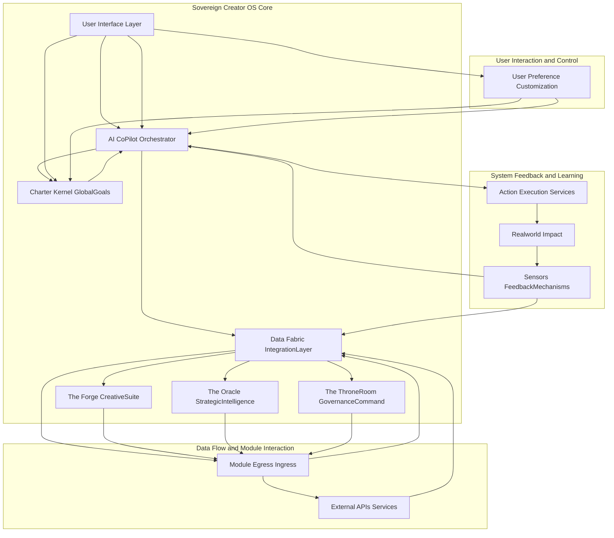
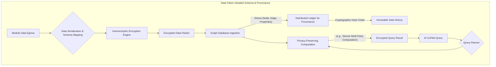
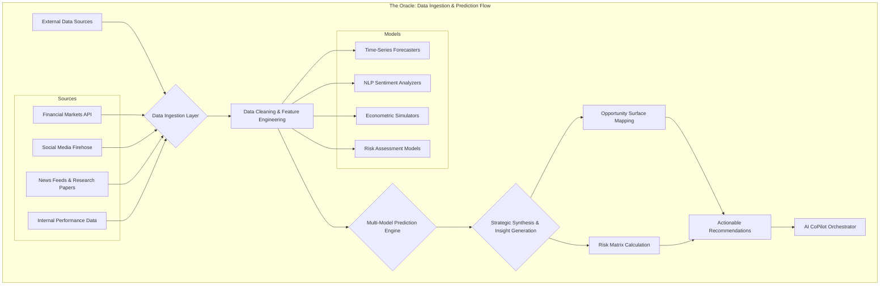

**Title of Invention:** An Integrated Operating System for a Sovereign Creator

**Abstract:**
A unified digital environment, herein referred to as the "Sovereign Creator's Operating System," is disclosed. The system integrates a plurality of AI-powered modules, including financial management, creative tooling, and strategic planning, into a single, cohesive, and mathematically verifiable interface. The core of the system is a central AI agent that maintains a holistic, high-dimensional belief state model of the user's goals, resources, and principles (the "Charter"). All modules are designed to act in concert, orchestrated by the central AI, to provide a seamless and powerful environment for the user to manifest their will and creative vision. This system employs a formally defined algorithmic framework, based on multi-objective optimization within a Partially Observable Markov Decision Process (POMDP), to ensure optimal alignment of user actions and system outputs with the Charter. This framework effectively transforms high-level aspirations into a sequence of actionable, verifiable outcomes across disparate digital domains, while preserving user privacy through advanced cryptographic methods like homomorphic encryption and zero-knowledge proofs.

**Background of the Invention:**
Digital tools are fragmented, creating a disjointed operational landscape. A creator must use one tool for finance, another for writing, a third for project management, and so on. These tools do not communicate, leading to data silos, context switching overhead, and a lack of unified intelligence to help the creator orchestrate their efforts towards a high-level goal. A new paradigm is needed: a single, integrated "operating system for your life's work." Current solutions fail to provide a mathematically coherent framework for goal-driven automation, multi-domain reasoning, and ethical constraint satisfaction. This results in suboptimal outcomes, increased cognitive load, and a fundamental misalignment between the user's declared intent and the system's operational behavior. The present invention addresses this gap by proposing a system grounded in formal methods and control theory, providing a provably aligned and integrated digital sovereignty.

**Brief Summary of the Invention:**
The present invention is the Demo Bank platform itself, conceived as a Sovereign Creator Operating System (SCOS). It is not a collection of features, but a single, integrated OS. The "Charter" serves as the core kernel-level parameters, encapsulating the user's highest-order goals, values, and constraints in a machine-interpretable format. The AI CoPilot Orchestrator is the master scheduler and process manager, utilizing advanced algorithms (e.g., policy gradient methods for POMDPs) to interpret the Charter and guide system actions. Each module—The Forge, The Oracle, The Throne Room—is a core application, deeply integrated into a unifying, privacy-preserving Data Fabric. The system's novelty lies in the deep integration, the overarching AI's ability to reason and act across all domains simultaneously, and its foundational mathematical approach to goal-alignment and optimization. This provides holistic, system-wide counsel and automation that is continuously verifiable against the Charter's complex, multi-objective utility functions.

**Detailed System Architecture:**
The Sovereign Creator Operating System is structured around a robust, interconnected architecture designed for maximum flexibility, autonomy, and goal alignment. This architecture ensures that all components contribute coherently towards the user's declared objectives within the Charter.



**The Charter Kernel GlobalGoals:**
This component serves as the immutable core of the system. The Charter `C` is a formally defined tuple:
`C = (G, V, K, R, U)` (1)
Where:
-   `G` is a set of goals, each `g_i ∈ G` defined by a target state manifold `S*_i`.
-   `V` is a set of ethical values and principles, encoded as a set of logical constraints or penalty functions. `v_j ∈ V`.
-   `K` is a set of Key Performance Indicators (KPIs), `k_l ∈ K`, each a function of the state `S`.
-   `R` is a set of resource constraints (e.g., time, budget), defining the permissible state space.
-   `U` is a multi-objective utility function `U(S, C) -> R^m` that maps a system state `S` to a vector of utility values based on the Charter.

The Charter is not merely a data repository; it is a dynamically interpretable semantic model.

```mermaid
graph TD
    subgraph Charter Kernel Structure and Validation
        A[User Input via UI] --> B(Charter Definition Language Parser)
        B --> C{Semantic & Syntactic Validation}
        C -- Valid --> D[Goal Compiler g_i -> S*_i]
        C -- Invalid --> E[Error Feedback to UI]
        D --> F(Constraint Encoder v_j -> Penalty Functions)
        F --> G(KPI Function Generator k_l(S))
        G --> H(Utility Function Assembler U(S,C))
        H --> I[Compiled Charter Object]
        I --> J[Version Control & Immutability Ledger]
        J --> K[AI CoPilot Orchestrator]
    end
```

**The AI CoPilot Orchestrator:**
This is the central intelligent agent. Its operation is modeled as a Partially Observable Markov Decision Process (POMDP), defined by the tuple:
`M = (S, A, T, R, Ω, O, γ)` (2)
-   `S`: The high-dimensional state space of the user's entire digital life. `S ∈ R^n`.
-   `A`: The action space, `a ∈ A`, representing composite operations across all modules.
-   `T(s' | s, a)`: The state transition probability function. `P(S_{t+1} = s' | S_t = s, A_t = a)` (3).
-   `R(s, a)`: The reward function, derived from the Charter's utility function `U(S, C)`. `R(s, a) = E[U(S_{t+1}, C) | S_t = s, A_t = a]` (4).
-   `Ω`: The set of observations the agent can receive.
-   `O(o | s', a)`: The observation probability function. `P(O_{t+1} = o | S_{t+1} = s', A_t = a)` (5).
-   `γ`: The discount factor, `γ ∈ [0, 1]`.

The Orchestrator does not know the true state `S` but maintains a belief state `b(s)`, a probability distribution over `S`.
`b_t(s) = P(S_t = s | o_1, ..., o_t, a_1, ..., a_{t-1})` (6)

The belief state is updated at each step `t` using a Bayesian filter:
`b_{t+1}(s') = η O(o_{t+1} | s', a_t) Σ_{s∈S} T(s' | s, a_t) b_t(s)` (7)
where `η` is a normalization constant.

The Orchestrator's policy `π(b)` maps belief states to actions. The goal is to find the optimal policy `π*` that maximizes the expected discounted future reward:
`π* = argmax_π E[Σ_{t=0}^∞ γ^t R(S_t, A_t) | b_0, π]` (8)

This is solved using deep reinforcement learning methods, such as Proximal Policy Optimization (PPO), where the objective function is:
`L^{CLIP}(θ) = E_t [min(r_t(θ) A_t, clip(r_t(θ), 1-ε, 1+ε) A_t)]` (9)
where `r_t(θ)` is the probability ratio and `A_t` is the advantage function.

```mermaid
graph TD
    subgraph AI CoPilot Internal Processing Pipeline
        A[Observation Stream o_t] --> B{Belief State Update};
        B -- b_t(s) --> C{Policy Evaluation π(b_t)};
        C --> D[Action Proposal Generation {a_i}];
        D --> E{Ethical & Constraint Validation};
        subgraph Validation Subsystem
            E -- Proposes a_i --> F(Formal Verification Engine);
            F -- Checks against V in Charter --> G{Compliance?};
            G -- Yes --> H[Action a_i is Valid];
            G -- No --> I[Action a_i is Rejected];
        end
        H --> J[Optimal Action Selection a*_t = argmax E[R]];
        I --> D;
        J --> K[Action Execution Command];
        K --> L[Action Execution Services];
        L --> M[Update World State];
        M --> A;
    end
```

**Data Fabric IntegrationLayer:**
A sophisticated, zero-trust data layer facilitating seamless, encrypted communication. It utilizes a graph database schema to represent entities and relationships across all modules. Data provenance is tracked cryptographically.

Let a data object be `d`. Its encrypted version is `E(d, pk)`. Operations are performed via homomorphic encryption:
`E(d_1, pk) ⊕ E(d_2, pk) = E(d_1 + d_2, pk)` (10)
`E(d_1, pk) ⊗ E(d_2, pk) = E(d_1 * d_2, pk)` (11)

Privacy is maintained via differential privacy, adding calibrated noise `Z`:
`K(D) = f(D) + Z` (12)
where the noise `Z` is drawn from a Laplace distribution:
`Lap(x | b) = (1/2b) exp(-|x|/b)` (13) with `b = Δf / ε`.



**The Forge CreativeSuite:**
A module for creative production. Content generation utilizes a variant of the Transformer architecture.
Attention mechanism: `Attention(Q, K, V) = softmax(QK^T / sqrt(d_k))V` (14)
Multi-Head Attention: `MultiHead(Q,K,V) = Concat(head_1,...,head_h)W^O` (15)
where `head_i = Attention(QW_i^Q, KW_i^K, VW_i^V)` (16)

For visual design, a Variational Autoencoder (VAE) is used. The loss function is the negative Evidence Lower Bound (ELBO):
`L(θ, φ; x) = -E_{q_φ(z|x)}[log p_θ(x|z)] + D_{KL}(q_φ(z|x) || p(z))` (17)
The creative quality `Q_c` is a learned function aligned with Charter KPIs:
`Q_c(output) = w_1 * f_{clarity}(output) + w_2 * f_{impact}(output) + ...` (18)

From (19) to (30), we define various sub-metrics for creative evaluation:
`f_{clarity} = 1 - H(P(tokens))` (19), where H is entropy.
`f_{impact} = σ(β * engagement_prediction)` (20), where σ is a sigmoid function.
`f_{novelty}(o) = min_{o' ∈ corpus} d(E(o), E(o'))` (21), where d is a distance metric and E is an embedding function.
`f_{charter_alignment}(o) = cos(E(o), E(C))` (22).
`w_i = f_p(k_i, S_t)` (23) weights are dynamically set by the orchestrator based on KPIs `k_i` and state `S_t`.
`L_{GAN} (D, G) = E_{x~p_{data}}[log D(x)] + E_{z~p_z}[log(1 - D(G(z)))]` (24) used for image synthesis.
`∇_{θ_g} V(D, G) = ∇_{θ_g} E_{z~p_z}[log(D(G(z)))]` (25) for generator updates.
The style transfer loss function: `L_{total} = αL_{content} + βL_{style}` (26)
`L_{content} = ||F_l(I_g) - F_l(I_c)||^2` (27)
`L_{style} = Σ_l w_l ||G_l(I_g) - G_l(I_s)||^2` (28) where G is the Gram matrix.
`f_{audio_clarity} = SNR = 10 log_{10}(P_{signal} / P_{noise})` (29)
`f_{text_coherence}(T) = avg(P(w_i | w_{i-1}, ..., w_{i-k}))` (30)

```mermaid
graph TD
    subgraph The Forge: Brief-to-Distribution Workflow
        A[Creative Brief from Orchestrator] --> B{Multi-modal Ideation Engine};
        B -- Text Prompts --> C[Generative Text Model];
        B -- Visual Concepts --> D[Generative Image/Video Model];
        B -- Audio Cues --> E[Generative Audio Model];
        C & D & E --> F{Content Assembly & Composition};
        F --> G[Iterative Feedback Loop with User/AI];
        G --> H[Final Asset Rendering];
        H --> I[Creative Asset Repository (in Data Fabric)];
        I --> J{Automated Distribution Scheduler};
        J -- Channels, Timing --> K[Multi-Platform Publishing API];
        K --> L[Performance Monitoring];
        L -- Analytics --> M[Data Fabric];
        M --> A[Orchestrator for next cycle];
    end
```
**The Oracle StrategicIntelligence:**
This module provides foresight. It uses time-series models like ARIMA(p,d,q):
`Y_t' = c + Σ_{i=1}^p φ_i Y_{t-i}' + Σ_{j=1}^q θ_j ε_{t-j} + ε_t` (31)
And more complex recurrent models like LSTMs for market prediction.
Forget gate: `f_t = σ(W_f · [h_{t-1}, x_t] + b_f)` (32)
Input gate: `i_t = σ(W_i · [h_{t-1}, x_t] + b_i)` (33)
Output gate: `o_t = σ(W_o · [h_{t-1}, x_t] + b_o)` (34)
Cell state: `C_t = f_t * C_{t-1} + i_t * tanh(W_C · [h_{t-1}, x_t] + b_C)` (35)
Hidden state: `h_t = o_t * tanh(C_t)` (36)

Risk is quantified using Value at Risk (VaR) and Conditional VaR (CVaR).
`VaR_α(X) = -inf{x | P(X ≤ x) > α}` (37)
`CVaR_α(X) = E[X | X ≤ -VaR_α(X)]` (38)

The Oracle computes an "Opportunity Gradient" `∇O` on a latent space representation of the strategic landscape.
`∇O(S) = ∂U_{predicted} / ∂A` (39), guiding the Orchestrator to actions `A` that maximize future utility.

From (40) to (50), we define various strategic metrics:
`MarketShare(t) = Sales_t / TotalMarketSales_t` (40)
`CustomerLifetimeValue = (AvgOrderValue) * (PurchaseFrequency) * (CustomerLifespan)` (41)
`Volatility(σ) = sqrt(Σ(x_i - μ)^2 / N)` (42)
`SharpeRatio = (R_p - R_f) / σ_p` (43)
`SentimentScore = Σ w_i * p_i` (44) where `w` is word polarity, `p` is presence.
`TechnologicalReadinessLevel(TRL)` (45) - a discrete scale 1-9.
`CompetitiveAdvantageIndex = Σ β_j * f_j` (46) where `f_j` are features (cost, quality).
`ScenarioProbability(S_k) = P(S_k | Evidence)` (47) using Bayesian networks.
`P(A|B) = P(B|A)P(A)/P(B)` (48)
`InnovationRate = (NewProducts_t / TotalProducts)` (49)
`BrandEquity = f(Awareness, Loyalty, Quality)` (50)



**The ThroneRoom GovernanceCommand:**
This module manages finance, legal, and resources. Budget allocation is an optimization problem:
Maximize `Σ c_i * x_i` (51)
Subject to `Σ A_{ij} * x_j ≤ b_i` (52) and `x_j ≥ 0` (53).

Portfolio management uses the Markowitz model:
Minimize `σ_p^2 = w^T Σ w` (54)
Subject to `w^T μ = μ_p` and `Σ w_i = 1` (55).

Legal compliance is checked using formal methods, translating regulations into Linear Temporal Logic (LTL).
e.g., `G(request → F(response))` (56) (Globally, a request implies a Future response).
Smart contracts automate compliance:
`function transfer(address to, uint amount) public returns (bool)` (57)
`require(balanceOf[msg.sender] >= amount);` (58)
`balanceOf[msg.sender] -= amount;` (59)
`balanceOf[to] += amount;` (60)

From (61) to (75), we define various governance metrics:
`BurnRate = (CashIn - CashOut) / TimePeriod` (61)
`Runway = CurrentCash / BurnRate` (62)
`ReturnOnInvestment(ROI) = (NetProfit / CostOfInvestment) * 100` (63)
`Debt-to-EquityRatio = TotalLiabilities / ShareholdersEquity` (64)
`CurrentRatio = CurrentAssets / CurrentLiabilities` (65)
`ComplianceScore = (ChecksPassed / TotalChecks) * 100` (66)
`GiniCoefficient(Income) = A / (A+B)` (67) for resource distribution fairness.
`Herfindahl-HirschmanIndex(HHI) = Σ s_i^2` (68) for portfolio concentration.
`TaxLiability = f(Income, Deductions, Credits, TaxBrackets)` (69)
`ContractRiskScore = Σ w_i * r_i` (70) where `r_i` are risk factors in clauses.
`ResourceUtilization = (ActualOutput / PotentialOutput)` (71)
`OperationalEfficiency = (Output / Input)` (72)
`FreeCashFlow = OperatingCashFlow - CapitalExpenditures` (73)
`NetPresentValue(NPV) = Σ (CF_t / (1+r)^t) - InitialInvestment` (74)
`InternalRateOfReturn(IRR)`: solve `0 = NPV` for `r` (75).

```mermaid
graph TD
    subgraph The ThroneRoom: Financial Governance & Smart Contract Interaction
        A[Real-time Financial Transactions] --> B{Transaction Categorization Engine};
        B --> C[General Ledger Update];
        C --> D[Financial Statement Generation (P&L, Balance Sheet)];
        D --> E{Financial Health Dashboard};
        A --> F{Budgetary Control};
        F -- check against LP model --> G{Is Compliant?};
        G -- Yes --> H[Approve Transaction];
        G -- No --> I[Flag for Review];
        J[Legal/Regulatory Updates] --> K{Compliance Rule Engine (LTL)};
        K --> L[Smart Contract Template Generation];
        L --> M[Deploy to Blockchain/Ledger];
        H -- triggers --> M;
        M -- execution record --> C;
        E & I --> N[User/AI CoPilot for decision];
    end
```

**Ethical Alignment and Constraint Subsystem:**
This is a non-negotiable validation gate for every action `a_t`. It uses a combination of deontological (rule-based) and consequentialist (utility-based) checks.
An action `a` is permissible if `V(a) = 1`.
`V(a) = D(a, V_D) ∧ C(a, V_C)` (76)
Where `D` is the deontological check against rules `V_D`:
`D(a, V_D) = ∧_{r ∈ V_D} r(a)` (77) (e.g. `r(a)` returns true if `a` doesn't violate rule `r`).
`C` is the consequentialist check against utilitarian values `V_C`:
`C(a, V_C) = (E[U(S_{t+1}|a)] > U_{threshold})` (78).
An ethical penalty `P_e` is added to the main reward function:
`R_{total}(s, a) = R(s, a) - λ * P_e(a)` (79)
`P_e(a) = 0` if `V(a) = 1`, `P_e(a) > 0` if `V(a) = 0` (80).

From (81) to (90), we define various ethical metrics:
`FairnessMetric = |P(outcome|group=A) - P(outcome|group=B)|` (81)
`TransparencyIndex = f(Explainability, Auditability)` (82)
`PrivacyScore = 1 - Σ P(re-identification_i)` (83)
`CarbonFootprint(a) = Σ emissions_i(a)` (84)
`SocialImpactScore = Σ w_j * impact_j` (85)
`AutonomyLevel = 1 - P(override)` (86)
`Beneficence = E[PositiveUtility]` (87)
`Non-maleficence = -E[NegativeUtility]` (88)
`DistributiveJustice = 1 - GiniCoefficient(benefits)` (89)
`AccountabilityTrace = hash(agent_id, action, timestamp, state)` (90)

```mermaid
graph TD
    subgraph Ethical Alignment & Formal Verification Gate
        A[Proposed Action a_t from Orchestrator] --> B{Deontological Check};
        B -- Check against rule set V_D --> C{∀r ∈ V_D, r(a_t) is true?};
        C -- Yes --> D{Consequentialist Check};
        D -- Predict E[U(S_{t+1}|a_t)] --> E{Is E[U] > U_threshold?};
        E -- Yes --> F[Action Approved];
        C -- No --> G{Calculate Penalty P_e};
        E -- No --> G;
        G --> H[Action Rejected / Modified];
        F --> I[Execute Action];
        H --> J[Feedback to Orchestrator Policy Learning];
    end
```

**Security and Privacy Framework:**
The system is built on a zero-trust architecture. All data transfers are end-to-end encrypted. User privacy is paramount.
A zero-knowledge proof protocol allows the system to verify a property without learning the underlying data:
Prover `P` has secret `w`, wants to prove `x ∈ L` to Verifier `V`.
`V ←→ P`: `V` learns `x ∈ L` but nothing else about `w`. (91)
`Completeness: Pr[V accepts | P is honest] = 1` (92)
`Soundness: Pr[V accepts | P is cheating] ≤ ε` (93)
`Zero-knowledge: View_V(x) can be simulated without w.` (94)

From (95) to (100), we define security and privacy metrics:
`AttackSurfaceArea = Σ entry_points * complexity_i` (95)
`MeanTimeToDetection(MTTD)` (96)
`MeanTimeToResolution(MTTR)` (97)
`EncryptionStrength = 2^k` (98) where k is key length.
`AnonymitySetSize(k-anonymity)` (99)
`InformationLeakage = I(X; Z) - I(Y; Z)` (100) where X is original data, Y is protected, Z is output.

```mermaid
graph TD
    subgraph Security & Privacy-Preserving Computation Flow
        A[User Input on Client Device] --> B[Client-Side Encryption (E2EE)];
        B --> C[Transmit Encrypted Data];
        C --> D[Secure Enclave in SCOS Server];
        subgraph Secure Enclave
            D --> E{Input Decryption};
            E --> F[Homomorphic Computation on Plaintext];
            F --> G[Result Re-encryption];
        end
        G --> H[Transmit Encrypted Result];
        H --> I[Client-Side Decryption];
        I --> J[Display to User];
        K[Auditor/Third-Party] --> L{Zero-Knowledge Proof Verification};
        D -- Provides proof --> L;
        L -- Verifies property without data access --> M[Compliance Confirmation];
    end
```

**Claims:**
1.  A system for a user, comprising:
    a.  A central repository for a user's declared goals and principles a "CharterKernel";
    b.  A plurality of software modules for managing different domains of the user's life, including a CreativeSuite, a StrategicIntelligence module, and a GovernanceCommand module;
    c.  A central generative AI agent the "AICoPilotOrchestrator" that has real-time access to the CharterKernel and the aggregated data from all modules via a DataFabricIntegrationLayer;
    d.  Wherein the AICoPilotOrchestrator is configured to provide guidance and automated actions that are formally consistent with the CharterKernel and informed by data from across the plurality of modules, optimizing for a mathematically defined objective function derived from the CharterKernel.

2.  The system of claim 1, wherein the AICoPilotOrchestrator's primary function is to execute actions that bring the user's current state into greater alignment with the goals defined in their CharterKernel by solving a constrained optimization problem modeled as a Partially Observable Markov Decision Process.

3.  The system of claim 2, wherein the constrained optimization problem models the user's current state `S_t`, a target state `S*`, and a multi-objective utility function `U(S, C)` representing Charter alignment, and the AICoPilotOrchestrator selects actions `A_t` to maximize the expected future value of `U(S, C)`.

4.  The system of claim 1, further comprising a DataFabricIntegrationLayer that standardizes data formats and facilitates secure, privacy-preserving data exchange between all modules and external services using cryptographic methods including homomorphic encryption and differential privacy.

5.  The system of claim 1, wherein the CreativeSuite module includes sub-modules for AIIdeationEngine, ContentSynthesisUnit TextImageAudio, DesignAutomationSubModule, and CreativeAssetRepository, all operating under the guidance of the AICoPilotOrchestrator and aligned with the CharterKernel.

6.  The system of claim 1, wherein the StrategicIntelligence module provides predictive analytics, market trend analysis, and risk assessment using time-series models (ARIMA, LSTM) and risk metrics (VaR, CVaR) to the AICoPilotOrchestrator to inform long-term strategic decisions.

7.  The system of claim 1, wherein the GovernanceCommand module provides comprehensive financial management, legal compliance verification using formal methods (Linear Temporal Logic), and resource allocation via linear programming, with all operations validated against the CharterKernel.

8.  A method for managing a user's digital enterprise, comprising:
    a.  Establishing a CharterKernel comprising a user's goals, principles, and constraints in a machine-interpretable format;
    b.  Collecting real-time, encrypted data from a plurality of domain-specific modules including creative, strategic, and governance domains;
    c.  Maintaining a belief state over the user's true state and processing the collected data and the CharterKernel via an AICoPilotOrchestrator using a formal algorithmic framework to identify discrepancies between the current state and Charter goals;
    d.  Generating and executing automated actions or guidance across the plurality of modules, wherein said actions are mathematically optimized to enhance alignment with the CharterKernel and validated against an ethical constraint subsystem; and
    e.  Continuously monitoring feedback from executed actions and updating the belief state for subsequent optimization cycles.

9.  The method of claim 8, further comprising utilizing a DataFabricIntegrationLayer to ensure seamless and secure data flow, maintaining data provenance on a distributed ledger, and enabling privacy-preserving queries.

10. The method of claim 8, wherein the formal algorithmic framework includes elements of deep reinforcement learning for Partially Observable Markov Decision Processes to dynamically adapt the action policy based on observed outcomes and Charter updates.