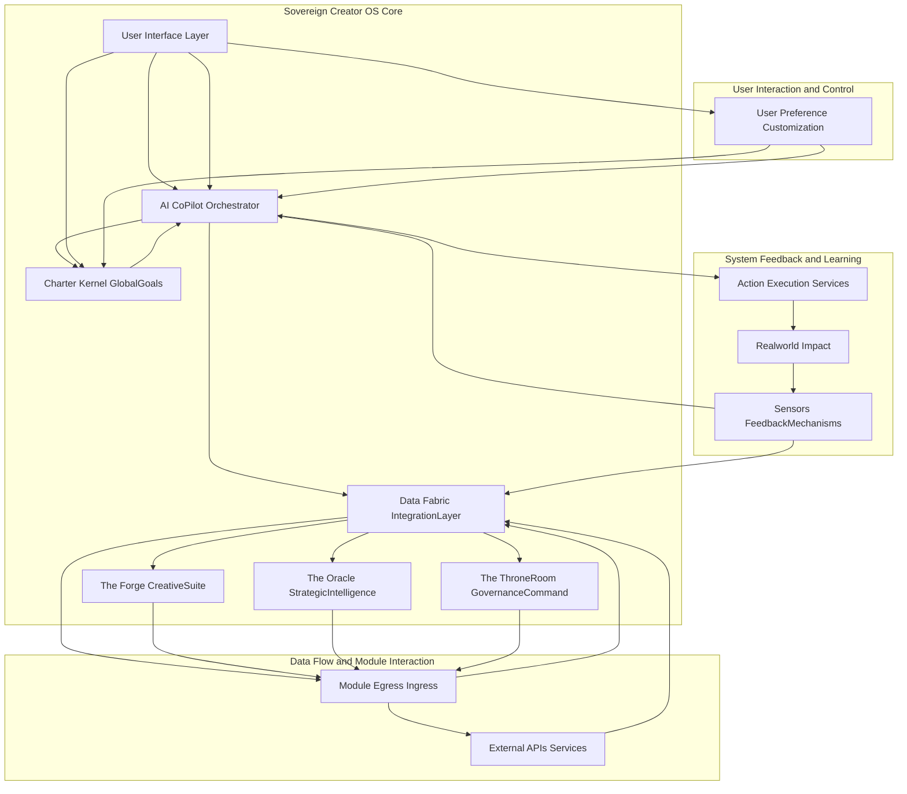
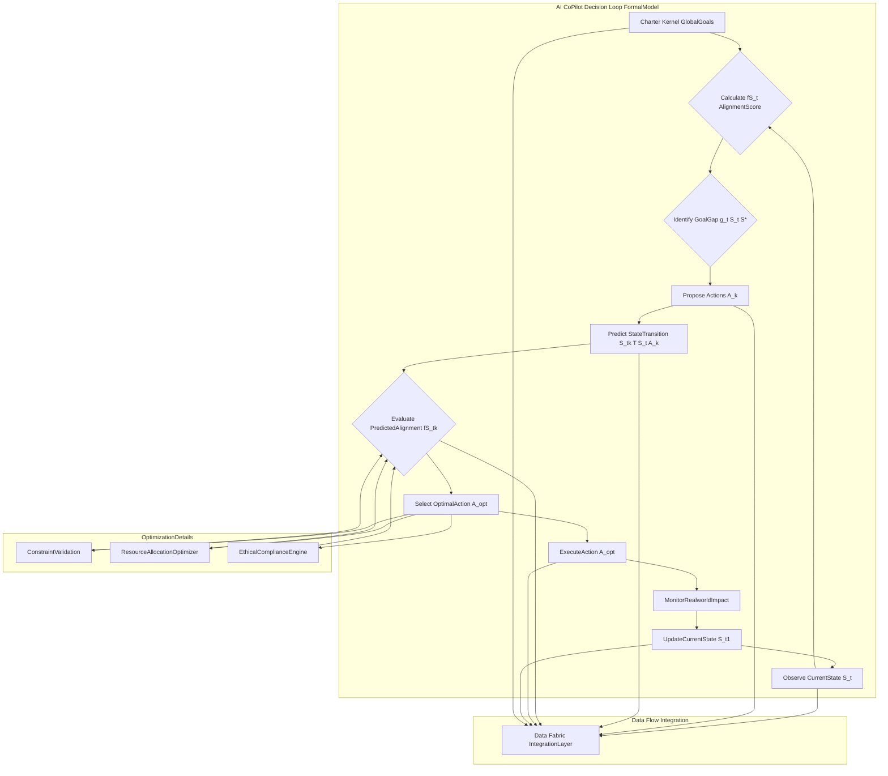
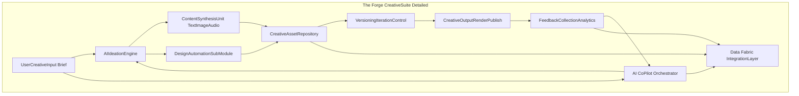

**Title of Invention:** An Integrated Operating System for a Sovereign Creator

**Abstract:**
A unified digital environment, herein referred to as the "Sovereign Creator's Operating System," is disclosed. The system integrates a plurality of AI-powered modules, including financial management, creative tooling, and strategic planning, into a single, cohesive interface. The core of the system is a central AI agent that maintains a holistic model of the user's goals, resources, and principles (the "Charter"). All modules are designed to act in concert, orchestrated by the central AI, to provide a seamless and powerful environment for the user to manifest their will and creative vision. This system employs a formally defined algorithmic framework to ensure optimal alignment of user actions and system outputs with the Charter, effectively transforming high-level aspirations into actionable, verifiable outcomes across disparate digital domains.

**Background of the Invention:**
Digital tools are fragmented. A creator must use one tool for finance, another for writing, a third for project management, and so on. These tools do not communicate, and there is no unified intelligence to help the creator orchestrate their efforts towards a high-level goal. A new paradigm is needed: a single, integrated "operating system for your life's work." Current solutions fail to provide a mathematically coherent framework for goal-driven automation and cross-domain reasoning, leading to suboptimal outcomes and increased cognitive load for the creator.

**Brief Summary of the Invention:**
The present invention is the Demo Bank platform itself, conceived as a Sovereign Creator Operating System. It is not a collection of features, but a single, integrated OS. The "Charter" serves as the core kernel-level parameters, encapsulating the user's highest-order goals, values, and constraints. The AI CoPilot Orchestrator is the master scheduler and process manager, utilizing advanced algorithms to interpret the Charter and guide system actions. Each module The Forge, The Oracle, The Throne Room is a core application, deeply integrated into a unifying Data Fabric. The system's novelty lies in the deep integration, the overarching AI's ability to reason and act across all domains simultaneously, and its foundational mathematical approach to goal-alignment and optimization, providing holistic, system-wide counsel and automation verifiable against the Charter's objectives.

**Detailed System Architecture:**
The Sovereign Creator Operating System is structured around a robust, interconnected architecture designed for maximum flexibility, autonomy, and goal alignment. This architecture ensures that all components contribute coherently towards the user's declared objectives within the Charter.

**The Charter Kernel GlobalGoals:** This component serves as the immutable core of the system, storing the user's overarching mission, ethical guidelines, resource constraints, and key performance indicators. It is the definitive source of truth for all decision-making processes within the OS. The Charter is not merely a data repository; it is a dynamically interpretable semantic model against which all proposed actions are validated for consistency and optimization potential.

**The AI CoPilot Orchestrator:** This is the central intelligent agent responsible for interpreting the Charter, synthesizing data from all modules via the Data Fabric, and generating actionable insights and automated workflows. Its operations are driven by a sophisticated algorithmic framework that prioritizes goal alignment and resource optimization. The CoPilot also manages task scheduling, resource allocation, and conflict resolution across modules.

**Data Fabric IntegrationLayer:** A sophisticated, secure, and privacy-preserving data layer that facilitates seamless communication and data exchange between all modules and external services. It standardizes data formats, manages access control, and provides a unified schema for the AI CoPilot to query and analyze information holistically. This layer ensures data integrity and availability across the entire ecosystem.

**The Forge CreativeSuite:** A module dedicated to all aspects of creative production, from ideation and content generation to design and distribution. It leverages advanced generative AI models, integrated with the user's specific creative preferences and existing assets.

**The Oracle StrategicIntelligence:** This module provides foresight and strategic guidance. It analyzes market trends, competitive landscapes, personal performance data, and potential risks, offering predictive analytics and strategic recommendations to align the user's efforts with long-term goals and opportunities.

**The ThroneRoom GovernanceCommand:** The central control panel for financial management, legal compliance, resource allocation, and administrative oversight. It ensures that all activities conform to established budgets, legal frameworks, and operational policies defined in the Charter.

**User Interface Layer:** Provides an intuitive and customizable portal through which the user interacts with the entire system, visualizes data, provides feedback, and directly intervenes when necessary.

**Core AI Logic and Algorithmic Framework:**
The AI CoPilot Orchestrator operates on a mathematically rigorous framework, conceptualized as a goal-directed optimal control system. This framework ensures that all system actions are provably aligned with the user's Charter.

**Formal System Model:**
Let the user's current state be represented by a vector **S** ∈ ℝ^n, where n is the number of measurable attributes across all domains (finance, creative output, time, resources).
Let the Charter define an objective function `f(S)` that quantifies the degree of alignment with the user's ultimate goals. The objective is to maximize `f(S)` over time.
The Charter also defines a target state **S*** (or a set of target states) that represents optimal goal achievement, such that `f(S*)` is maximized.
At each time step `t`, the AI CoPilot observes the current state **S_t** and selects an action **A_t** from an available action space. An action **A_t** is a composite of operations across various modules.
The transition function `T(S_t, A_t)` describes how the state evolves to **S_(t+1)** after executing action **A_t**.
The AI's decision policy `π(S_t)` is designed to select **A_t** such that the expected future alignment with the Charter (i.e., `E[f(S_k)]` for `k > t`) is maximized, subject to constraints defined in the Charter. This involves solving a constrained optimization problem, often using techniques from reinforcement learning, dynamic programming, or formal verification.

**Module Specific Functionality and Interoperability:**
Each core module is designed not only for its specific domain but also with inherent interoperability to contribute to the global state and receive guidance from the AI CoPilot Orchestrator.

**The Forge CreativeSuite:**
This module provides a comprehensive environment for creative output. It integrates various generative models, asset management, and collaboration tools, all informed by the user's Charter and real-time feedback.

**The Oracle StrategicIntelligence:** This module acts as the system's strategic brain. It continuously monitors external market conditions, identifies emerging trends, performs competitive analysis, and assesses potential risks and opportunities. Its outputs include predictive models, strategic recommendations, and scenario planning, all designed to guide the CoPilot Orchestrator in making long-term decisions aligned with the Charter. It synthesizes data from global financial markets, social media sentiment, academic research, and proprietary databases, processing it through advanced econometric and machine learning models.

**The ThroneRoom GovernanceCommand:** This module provides the user with executive control over their digital enterprise. It integrates robust financial management systems budgeting, invoicing, expense tracking, ensures legal and regulatory compliance, and manages resource allocation across all projects and initiatives. It provides real-time dashboards for financial health, legal standing, and operational efficiency, allowing the user to make informed governance decisions or delegate them to the AI CoPilot under strict Charter constraints.

**Claims:**
1.  A system for a user, comprising:
    a.  A central repository for a user's declared goals and principles a "CharterKernel";
    b.  A plurality of software modules for managing different domains of the user's life, including a CreativeSuite, a StrategicIntelligence module, and a GovernanceCommand module;
    c.  A central generative AI agent the "AICoPilotOrchestrator" that has real-time access to the CharterKernel and the aggregated data from all modules via a DataFabricIntegrationLayer;
    d.  Wherein the AICoPilotOrchestrator is configured to provide guidance and automated actions that are formally consistent with the CharterKernel and informed by data from across the plurality of modules, optimizing for a mathematically defined objective function derived from the CharterKernel.

2.  The system of claim 1, wherein the AICoPilotOrchestrator's primary function is to execute actions that bring the user's current state into greater alignment with the goals defined in their CharterKernel by solving a constrained optimization problem.

3.  The system of claim 2, wherein the constrained optimization problem models the user's current state `S_t`, a target state `S*`, and an objective function `f(S)` representing Charter alignment, and the AICoPilotOrchestrator selects actions `A_t` to maximize the expected future value of `f(S)`.

4.  The system of claim 1, further comprising a DataFabricIntegrationLayer that standardizes data formats and facilitates secure, privacy-preserving data exchange between all modules and external services.

5.  The system of claim 1, wherein the CreativeSuite module includes sub-modules for AIIdeationEngine, ContentSynthesisUnit TextImageAudio, DesignAutomationSubModule, and CreativeAssetRepository, all operating under the guidance of the AICoPilotOrchestrator and aligned with the CharterKernel.

6.  The system of claim 1, wherein the StrategicIntelligence module provides predictive analytics, market trend analysis, and risk assessment to the AICoPilotOrchestrator to inform long-term strategic decisions.

7.  The system of claim 1, wherein the GovernanceCommand module provides comprehensive financial management budgeting invoicing expense tracking, legal compliance, and resource allocation capabilities, with all operations validated against the CharterKernel.

8.  A method for managing a user's digital enterprise, comprising:
    a.  Establishing a CharterKernel comprising a user's goals, principles, and constraints;
    b.  Collecting real-time data from a plurality of domain-specific modules including creative, strategic, and governance domains;
    c.  Processing the collected data and the CharterKernel via an AICoPilotOrchestrator using a formal algorithmic framework to identify discrepancies between the current state and Charter goals;
    d.  Generating and executing automated actions or guidance across the plurality of modules, wherein said actions are mathematically optimized to enhance alignment with the CharterKernel; and
    e.  Continuously monitoring feedback from executed actions and updating the current state for subsequent optimization cycles.

9.  The method of claim 8, further comprising utilizing a DataFabricIntegrationLayer to ensure seamless and secure data flow between all modules and the AICoPilotOrchestrator.

10. The method of claim 8, wherein the formal algorithmic framework includes elements of optimal control theory and reinforcement learning to dynamically adapt the action policy based on observed outcomes and Charter updates.