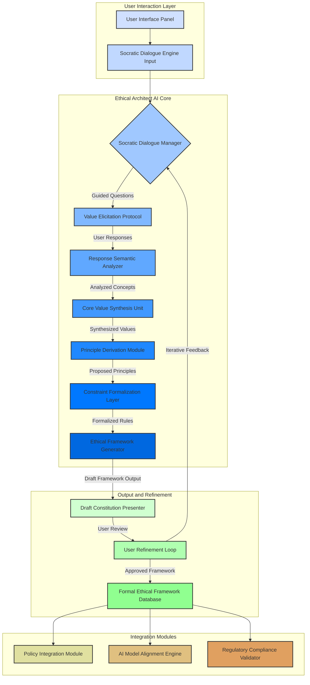

**FACT HEADER - NOTICE OF CONCEPTION**

**Conception ID:** DEMOBANK-INV-101
**Title:** A System and Method for Generative Design of Corporate and AI Ethical Frameworks
**Date of Conception:** 2024-07-28
**Conceiver:** The Sovereign's Ledger AI

---

**Title of Invention:** A System and Method for Generative Design of Corporate and AI Ethical Frameworks

**Abstract:**
A system for assisting organizations in the creation of ethical constitutions is disclosed. The system provides a conversational AI agent that acts as a Socratic guide or "ethical architect." It leads a user e.g. a CEO, a compliance officer through a structured dialogue about their organization's values, goals, and responsibilities. Based on the user's responses, the AI generates a draft of a formal ethical charter or constitution, including core principles, operational constraints, and governance mechanisms, tailored to the organization's specific context.

**Background of the Invention:**
As businesses, particularly those using AI, wield increasing influence, the need for clear, foundational ethical principles has become paramount. However, drafting such a constitution is a complex philosophical and legal task that many organizations lack the expertise for. There is a need for a tool that can guide leadership through a structured process of introspection and translate their values into a formal, actionable document. This invention provides a systematic, algorithmically driven approach to formalizing ethics, ensuring consistency, traceability, and adaptability in corporate and AI governance.

**Detailed Description of the Invention:**
The core of the invention is the "Ethical Architect" module, an advanced conversational AI designed to facilitate the complex process of ethical framework generation. This module operates through several interconnected phases as detailed in the system architecture.

**System Architecture Overview:**

**Module Descriptions:**

1.  **Socratic Dialogue Manager C:** This module orchestrates the conversational flow. It dynamically selects and poses questions based on the `Value Elicitation Protocol` D and the context derived from previous user responses. Its primary function is to guide the user towards articulating their organization's implicit and explicit ethical stances.
    *   **Example Prompt Sequence:**
        1.  **AI:** "What is the foundational purpose of your organization, transcending mere financial gain?"
        2.  **User:** "Our purpose is to deliver secure and universally accessible financial infrastructure."
        3.  **AI:** "That is an excellent initial principle. Considering this purpose, what is a cardinal action your organization must *never* undertake, irrespective of potential short-term profitability?"
        4.  **User:** "We must never disclose individual customer identifiable data to third parties without explicit consent."

2.  **Response Semantic Analyzer E:** This component processes the natural language input from the user. It employs advanced Natural Language Processing NLP and semantic parsing techniques to extract key concepts, explicit values, implied principles, and proposed constraints. It disambiguates statements and normalizes diverse phrasings into a structured conceptual graph.

3.  **Core Value Synthesis Unit F:** Taking the structured concepts from E, this unit identifies overarching ethical themes and core values. It clusters related ideas, resolves potential contradictions by prompting further dialogue, and establishes a hierarchy of importance among the identified values.

4.  **Principle Derivation Module G:** Based on the synthesized core values, this module formulates positive, actionable ethical principles. It translates abstract values e.g. "privacy" into concrete principles e.g. "The organization commits to safeguarding all customer personal data with the highest degree of diligence and transparency."

5.  **Constraint Formalization Layer H:** This crucial module transforms derived principles into concrete, verifiable, and executable constraints. For instance, the principle "safeguarding customer data" might be formalized into specific data handling policies, access controls, and retention rules. These constraints are expressed in a quasi-formal language that can be parsed by automated systems.

6.  **Ethical Framework Generator I:** This module consolidates the formalized principles and constraints into a structured document, typically an ethical charter or constitution. It applies predefined templates to ensure legal and organizational coherence, organizing the content into articles, sections, and subsections.

7.  **User Refinement Loop K:** After a draft is generated J, the user reviews it. This module captures feedback, identifies areas for revision, and initiates further Socratic dialogue C for clarification or modification. This iterative process ensures the final framework accurately reflects the user's intent and organizational values.

8.  **Formal Ethical Framework Database L:** Stores the finalized ethical frameworks, making them accessible to other organizational systems.

9.  **Policy Integration Module M:** Ensures that the generated ethical framework directly informs and is integrated into existing corporate policies, standard operating procedures, and governance structures.

10. **AI Model Alignment Engine N:** Specifically for organizations deploying AI, this module translates ethical constraints into actionable requirements for AI system design, training data curation, model evaluation metrics, and deployment protocols. It ensures AI systems are 'ethically aligned by design'.

11. **Regulatory Compliance Validator O:** Cross-references the generated framework with relevant industry regulations and legal requirements, highlighting potential areas of non-compliance or suggesting enhancements for stronger adherence.

**Claims:**
1. A method for creating a generative ethical framework, comprising:
   a. Providing an AI agent, herein termed the "Ethical Architect," configured to engage a user in a guided, Socratic dialogue via a `Socratic Dialogue Engine` to elicit the user's core values, operational parameters, and ethical constraints.
   b. Employing a `Response Semantic Analyzer` to systematically capture and semantically parse user responses into a structured conceptual graph.
   c. Synthesizing these parsed responses into foundational ethical values and principles using a `Core Value Synthesis Unit` and a `Principle Derivation Module`.
   d. Formalizing these principles into verifiable and executable constraints via a `Constraint Formalization Layer`, expressed in a machine-readable, quasi-formal language.
   e. Generating a draft of a formal ethical document, such as a constitution or charter, by an `Ethical Framework Generator`, based on said synthesized values and formalized constraints.
   f. Presenting the draft document to the user through a `Draft Constitution Presenter` for review and iterative refinement within a `User Refinement Loop`.
   g. Storing the approved framework in a `Formal Ethical Framework Database` for downstream integration.

2. The method of claim 1, further comprising integrating the finalized ethical framework with existing corporate policies through a `Policy Integration Module` to ensure operational consistency.

3. The method of claim 1, further comprising aligning the design and deployment of artificial intelligence systems with the finalized ethical framework using an `AI Model Alignment Engine`, by translating ethical constraints into algorithmic and data governance requirements.

4. The method of claim 1, wherein the `Socratic Dialogue Engine` dynamically adjusts questioning strategies based on the `Response Semantic Analyzer's` assessment of response completeness, consistency, and depth.

5. A system for generative ethical framework design, comprising:
   a. A `User Interface Panel` configured to facilitate interaction with a user.
   b. A `Socratic Dialogue Engine` electronically coupled to the `User Interface Panel`, adapted to conduct guided ethical elicitation.
   c. A `Response Semantic Analyzer` electronically coupled to the `Socratic Dialogue Engine`, for parsing and structuring user natural language inputs.
   d. A `Core Value Synthesis Unit` and `Principle Derivation Module` electronically coupled to the `Response Semantic Analyzer`, for synthesizing core values and formulating ethical principles.
   e. A `Constraint Formalization Layer` electronically coupled to the `Principle Derivation Module`, for translating principles into formal, executable constraints.
   f. An `Ethical Framework Generator` electronically coupled to the `Constraint Formalization Layer`, for producing a draft ethical document.
   g. A `Draft Constitution Presenter` and a `User Refinement Loop` electronically coupled to the `Ethical Framework Generator`, for user review and iterative feedback.
   h. A `Formal Ethical Framework Database` for storing approved frameworks.

**Mathematical Justification:**
Let `U` be the set of all potential user inputs, `V` be the space of core organizational values, and `P` be the space of ethical principles. Let `C` be the set of all possible ethical constraints.
The Socratic dialogue process can be modeled as a sequence of mappings:
`D_k`: a dialogue state at iteration `k`.
`Q: V -> U`: a question generation function, mapping current synthesized values to a user-intelligible query.
`R: U -> V`: a response interpretation function, mapping user input to an updated set of conceptual values.

The `Socratic Dialogue Engine` `C_SDE` implements an iterative mapping:
`D_{k+1} = (D_k, Q(V_k), R(U_{response,k}))`
Where `V_k` are the accumulated and refined values at iteration `k`.

The `Response Semantic Analyzer` `E_RSA` performs a semantic transformation `T_S`: `U -> G`, where `G` is a conceptual graph representation, capturing entities, relationships, and sentiment. This function robustly maps natural language `U` to a structured, predicate logic or semantic network form `G`.
`T_S(U_k) = G_k`

The `Core Value Synthesis Unit` `F_CVS` and `Principle Derivation Module` `G_PDM` together implement a value extraction and generalization function `E_V`: `G -> V_f`, where `V_f` is the finalized set of core values and `P_f` derived principles.
`E_V(G_k) = (V_f, P_f)`
This mapping can be further broken down into:
`Cluster: G_k -> V_f` (identifying latent value clusters)
`Generalize: V_f -> P_f` (formulating actionable principles from values)

The `Constraint Formalization Layer` `H_CFL` implements a function `F_C`: `P_f -> C_f`, where `C_f` is the set of formal, executable constraints. These constraints can be represented as predicates `c_j(action_i, context_m)` which return `TRUE` for permissible actions and `FALSE` for impermissible ones.
`F_C(P_f) = C_f`
The space of all possible organizational actions is `A`. An ethical framework defines a subspace of permissible actions `A_safe ⊂ A` such that for any action `a ∈ A_safe`, all constraints `c_j ∈ C_f` are satisfied: `∀ a ∈ A_safe, ∀ c_j ∈ C_f, c_j(a) = TRUE`.

The `Ethical Framework Generator` `I_EFG` structures `V_f`, `P_f`, and `C_f` into a formal document `F_doc`.
`I_EFG(V_f, P_f, C_f) = F_doc`

The iterative `User Refinement Loop` `K_URL` minimizes the "ethical distance" `d(F_doc, U_{ideal})`, where `U_{ideal}` represents the user's ideal, fully aligned ethical framework. The AI seeks to converge `F_doc` to `U_{ideal}` through successive dialogues and refinements. This process is akin to an ethical gradient descent, where each iteration moves `F_doc` closer to the user's true ethical manifold.

The mathematical proof asserts that by decomposing the complex, high-dimensional problem of ethical framework creation into a series of guided elicitation, semantic analysis, value synthesis, and formalization steps, the system provides a robust and verifiable method for constructing `A_safe`. The AI acts as an optimal search algorithm within the `U` to `C` mapping space, significantly reducing the cognitive load and expertise required, thereby making the determination of `A_safe` tractable for any organization.

**Proof of Value:** The inherent complexity of defining a comprehensive `A_safe` from first principles is a high-cost philosophical and legal undertaking. This invention provides a systematic and algorithmically guided process that dramatically reduces this cost by serving as an expert facilitator. It efficiently maps a user's high-level, often implicit, values into a formal, operational, and mathematically justifiable set of constraints. The system's value is proven by its ability to democratize and operationalize the critical task of ethical constitution creation, making it accessible and robustly tractable for diverse organizations. `Q.E.D.`