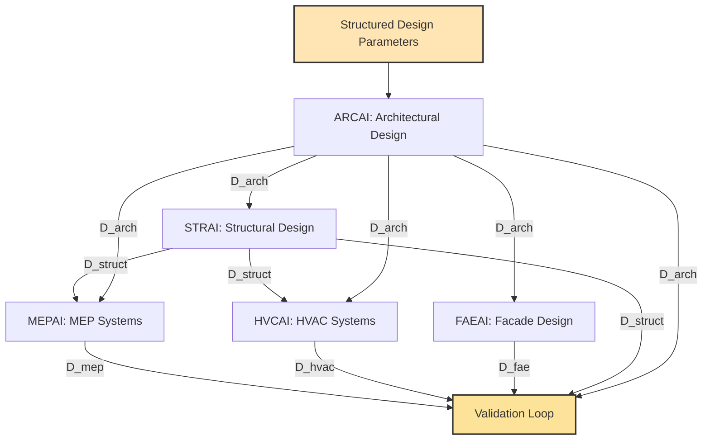
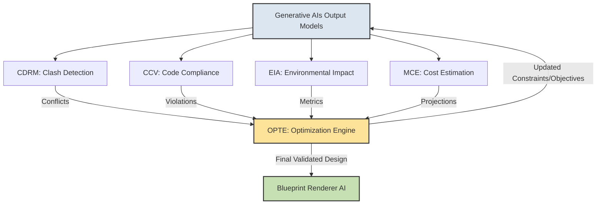
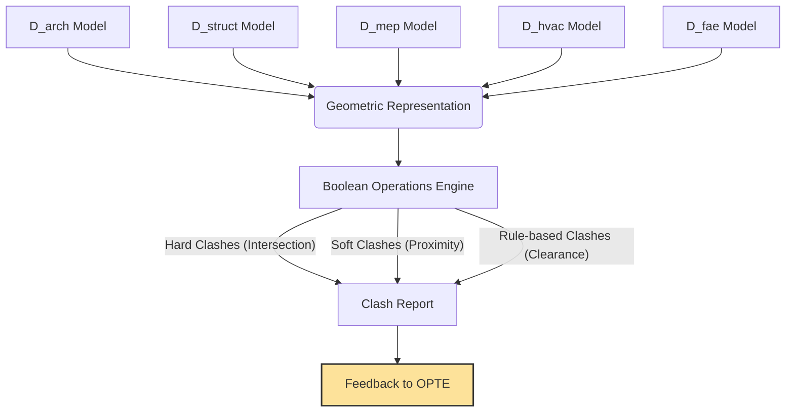
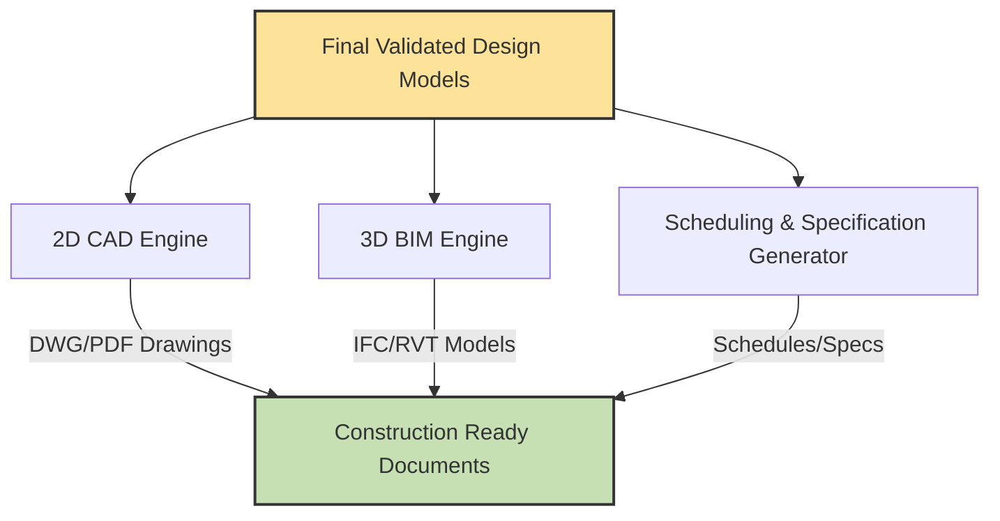
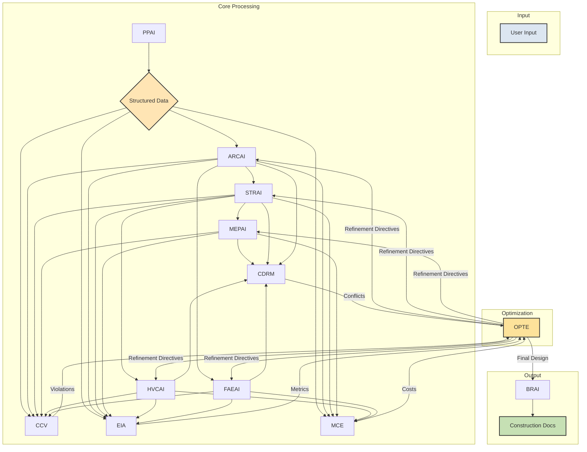

**Title of Invention:** A System and Method for Generating Construction-Ready Architectural Blueprints from High-Level Design Constraints with Integrated Validation and Optimization

**Abstract:**
A highly integrated and mathematically robust system for comprehensive architectural design automation is disclosed. The system transcends traditional conceptual design by dynamically generating a complete, verifiable set of construction-ready blueprints directly from high-level, natural language design constraints. Utilizing an orchestrated chain of specialized, interconnected generative AI models, the system autonomously creates primary architectural designs (floor plans, elevations), corresponding structural engineering plans, detailed electrical schematics, mechanical/plumbing (MEP) diagrams, and HVAC layouts. Crucially, the system incorporates real-time code compliance validation, multi-disciplinary clash detection, and an optimization engine to ensure unparalleled consistency, structural integrity, system efficiency, and cost-effectiveness across all generated schematics, proving design viability and optimality through computational rigor.

**Detailed Description:**
The invention details an advanced AI-powered, multi-agent workflow, establishing a new paradigm for generative architectural design. The system operates on a principle of iterative refinement and inter-agent collaboration, ensuring holistic design integrity.

### 1. Prompt Interpretation and Constraint Extraction:
*   A **Prompt Parser AI** (PPAI) module initially receives the user's high-level design request. This includes specifications like building type, desired area, number of rooms, sustainability goals, aesthetic preferences, site constraints (e.g., plot size, orientation, geological conditions), and budget.
*   The PPAI employs advanced Natural Language Understanding (NLU) and Natural Language Processing (NLP) techniques to transform unstructured text into structured design parameters, objective functions, and constraints. This involves semantic parsing, entity recognition (NER), and relation extraction to populate a predefined schema. These formalized elements are then encapsulated into a computational design graph or a knowledge graph, acting as the central data structure for subsequent AI agents.
*   The output `D_params` from PPAI is a tuple of (design variables, constraints, objectives, site context).

**PPAI Workflow Diagram:**

```mermaid
graph TD
    A[User Input: Natural Language] --> B{NLU/NLP Engine};
    B --> C[Semantic Parser];
    C --> D[Entity & Relation Extraction];
    D --> E[Constraint & Objective Formalization];
    E --> F[Computational Design Graph/Knowledge Graph];
    F --> G{Structured Design Parameters<br>Constraints Objectives};
    G --&gt; H[Forward to Generative AIs];

    style A fill:#DCE6F1,stroke:#333,stroke-width:2px
    style G fill:#FFE5B4,stroke:#333,stroke-width:2px
```

### 2. Core Generative AI Agents:

*   **Architect AI** (ARCAI): Generates initial conceptual floor plans, spatial layouts, and elevations based on extracted constraints. This agent prioritizes human-centric design, aesthetic coherence, functional flow, and daylighting potential, employing computational geometry, topological optimization principles, and generative adversarial networks (GANs) or diffusion models trained on vast architectural datasets. It considers adjacencies, circulation paths, room sizes, and overall building massing. The ARCAI's initial output is a `D_arch` model, representing the architectural scheme.

*   **Structural AI** (STRAI): Receives the ARCAI's `D_arch` output. It designs a code-compliant, structurally sound frame, selecting appropriate materials (e.g., steel, concrete, timber) and member dimensions (beams, columns, slabs). STRAI considers load distribution (dead, live, snow, wind, seismic), soil conditions, and foundation requirements. It utilizes finite element analysis (FEA) principles, graph-based structural optimization, and reinforcement learning to explore various structural typologies and member layouts, ensuring stability and efficiency. The STRAI produces a `D_struct` model.

*   **Mechanical Electrical Plumbing AI** (MEPAI): Takes both ARCAI's `D_arch` and STRAI's `D_struct` outputs. It designs efficient electrical wiring networks, plumbing supply and drainage systems, and specialized mechanical systems (e.g., fire suppression, data cabling). MEPAI's core function is to optimize pathfinding for conduits, pipes, and cables, minimize material use, minimize pressure drops, ensure accessibility for maintenance, and critically, avoid clashes with structural elements and architectural features. It employs advanced graph theory for network routing, fluid dynamics simulations for plumbing, and electrical load balancing algorithms. The MEPAI generates a `D_mep` model.

*   **Heating Ventilation Air Conditioning AI** (HVCAI): Specifically designs air distribution systems (ductwork), refrigerant lines, and equipment placement (AHUs, chillers, boilers, diffusers), ensuring thermal comfort, indoor air quality, and energy efficiency. It integrates closely with MEPAI for shared utility pathways and avoids conflicts with structural elements, leveraging computational fluid dynamics (CFD) principles for airflow simulation and psychrometrics for thermal load calculations. The HVCAI produces a `D_hvac` model.

*   **Facade and Envelope AI** (FAEAI): Focuses on the building's exterior, optimizing for aesthetic appeal, thermal performance (U-values, R-values), natural light harvesting (fenestration sizing and placement), shading strategies, and material efficiency. It considers local climate data (solar angles, wind exposure, precipitation), building orientation, and regulatory requirements for energy performance. FAEAI proposes material choices and facade patterns, generating a `D_fae` model.

**Generative Agents Collaboration Diagram:**



### 3. Validation and Optimization Loop:

*   **Code Compliance Validator** (CCV): Continuously checks all generated plans (`D_arch`, `D_struct`, `D_mep`, `D_hvac`, `D_fae`) against a comprehensive, dynamically updated database of local, national, and international building codes, zoning regulations, accessibility standards, fire safety codes, and energy efficiency mandates. Any non-compliance (e.g., insufficient egress width, incorrect fire rating, setback violations, minimum room sizes) triggers a flag and detailed error report for the **Optimization Engine**. It formalizes rules as logical predicates and solves them as Constraint Satisfaction Problems (CSPs).

*   **Clash Detection and Resolution Module** (CDRM): Performs real-time 3D interference checking between all disciplinary models (architectural, structural, MEP, HVAC, facade). It identifies hard clashes (physical intersections), soft clashes (insufficient clearance), and workflow clashes (logical inconsistencies). When conflicts are identified (e.g., a large duct running through a structural beam, a pipe intersecting with an electrical conduit, a window interfering with a facade panel), the CDRM pinpoints the exact location and nature of the clash, communicating these details to the Optimization Engine. It uses Boolean geometric operations on volumetric representations.

*   **Environmental Impact Assessor** (EIA): Evaluates the design's sustainability metrics throughout the iterative process. This includes calculating embodied carbon (materials manufacturing, transport, construction), operational energy consumption (heating, cooling, lighting, equipment), water usage, waste generation potential, and material sourcing ethics (e.g., recycled content, regional sourcing). It provides a quantitative feedback loop for green design optimization, guiding the OPTE towards lower environmental footprints.

*   **Material and Cost Estimator** (MCE): Integrates with the evolving design to provide real-time, dynamic cost projections based on material quantities (from BIM models), current market rates, labor costs, equipment costs, and regional pricing databases. It allows for sensitivity analysis based on material choices and construction methods, guiding design iterations towards budget adherence and cost-effectiveness. The MCE can also perform value engineering assessments.

*   **Optimization Engine** (OPTE): This central module orchestrates iterative refinements. It receives feedback, conflict reports, and performance metrics from CCV, CDRM, EIA, and MCE. It then re-prompts relevant generative AIs (ARCAI, STRAI, MEPAI, HVCAI, FAEAI) with updated constraints and objective functions (e.g., "reduce cost by 10%", "resolve clash at coordinate X,Y,Z", "improve energy efficiency by 15%", "increase natural light by 5%", "adjust room area X by Y%") until all constraints are met, and objectives are optimized within defined tolerances. The OPTE employs multi-objective optimization algorithms like genetic algorithms (GAs), particle swarm optimization (PSO), or surrogate-assisted optimization to efficiently navigate complex, high-dimensional design spaces, seeking Pareto-optimal solutions. It acts as the "brain" of the system, balancing competing objectives and resolving interdisciplinary conflicts.

**Optimization Loop Diagram:**



**CDRM Workflow Diagram:**



**CCV Workflow Diagram:**

```mermaid
graph TD
    A[All Disciplinary Models] --> B[Feature Extraction/Parameterization];
    B --> C[Building Code Database<br>(Logical Predicates)];
    C --> D[Constraint Satisfaction Problem Solver];
    D -- Violations/Inconsistencies --> E[Code Compliance Report];
    E --> F[Feedback to OPTE];

    style F fill:#FDE29A,stroke:#333,stroke-width:2px
```

**EIA Workflow Diagram:**

```mermaid
graph TD
    A[Design Models (Material/Geometry Data)] --> B[Material Database<br>(Embodied Carbon, R-values)];
    A --> C[Site Context/Climate Data];
    B --> D[Lifecycle Assessment Module];
    C --> E[Energy Simulation Engine];
    D -- Embodied Carbon <br> Waste Metrics --> F[Environmental Impact Report];
    E -- Operational Energy <br> Water Usage --> F;
    F --> G[Feedback to OPTE];

    style G fill:#FDE29A,stroke:#333,stroke-width:2px
```

**MCE Workflow Diagram:**

```mermaid
graph TD
    A[Design Models (Quantities/Types)] --> B[Material Cost Database];
    A --> C[Labor Rate Database];
    A --> D[Equipment Cost Database];
    B --> E[Cost Aggregation & Analysis];
    C --> E;
    D --> E;
    E -- Total Cost <br> Material Breakdown --> F[Cost Report];
    F --> G[Feedback to OPTE];

    style G fill:#FDE29A,stroke:#333,stroke-width:2px
```

### 4. Blueprint Rendering and Output:

*   The **Blueprint Renderer AI** (BRAI) compiles all validated and optimized outputs from the various agents into a complete, integrated blueprint package. This includes generating industry-standard 2D CAD drawings (e.g., DWG, PDF), comprehensive 3D Building Information Models (BIM) (e.g., IFC, Revit native files), detailed schedules (door, window, finish), material take-offs, and written specifications. The BRAI ensures consistent graphical standards, annotations, and layering across all drawings, ready for direct construction, permitting, and fabrication.

**BRAI Workflow Diagram:**



**Overall System Data Flow:**



### 5. Data Representation and Interoperability:
The system relies on a unified data schema, likely based on Industry Foundation Classes (IFC) or an internal graph database representation, to ensure seamless data exchange between agents. All agents read from and write to this central, evolving design model. This minimizes data loss and ensures consistency. Version control and change tracking are inherent features of this data management system.

### Mathematical Foundations and Proof of Overstanding:
The system's integrity and ability to generate demonstrably optimal and compliant designs is rooted in rigorous mathematical and computational frameworks.

1.  **Computational Geometry and Topology (ARCAI, FAEAI):**
    *   Used for space planning, generating efficient floor plans, and optimizing spatial relationships. This ensures geometric feasibility and adherence to dimensional constraints.
    *   **Representation of Space:** Building elements are represented as geometric primitives (points, lines, polygons, polyhedra).
        *   Point: $P = (x, y, z)$
        *   Line segment: $L = (P_1, P_2)$
        *   Polygon (planar face): $F = \{P_1, P_2, ..., P_n\}$
        *   Polyhedron (volume): $V = \text{collection of faces and edges}$
    *   **Area Calculation (for a polygon defined by ordered vertices):**
        $A = \frac{1}{2} | \sum_{i=1}^{n} (x_i y_{i+1} - x_{i+1} y_i) |$, where $(x_{n+1}, y_{n+1}) = (x_1, y_1)$.
    *   **Volume Calculation (for a polyhedron):** Can be decomposed into tetrahedra or by divergence theorem (Gaussian integral).
        $V = \frac{1}{3} \sum_{F \in \text{faces}} (\vec{n}_F \cdot \vec{C}_F) A_F$, where $\vec{n}_F$ is face normal, $\vec{C}_F$ is face centroid, $A_F$ is face area.
    *   **Distance between points $P_1=(x_1,y_1,z_1)$ and $P_2=(x_2,y_2,z_2)$:**
        $d = \sqrt{(x_2-x_1)^2 + (y_2-y_1)^2 + (z_2-z_1)^2}$
    *   **Adjacency Matrix for spatial relationships:**
        $A_{ij} = 1$ if room $i$ is adjacent to room $j$, $0$ otherwise.
    *   **Shape Grammars:** Formal rules for generating geometric forms.
        $R: S_i \rightarrow S_j$, where $S_i$ is a shape or a part of a shape, and $S_j$ is a new shape derived from $S_i$.
    *   **Topological Optimization:** Rearranging connections between spaces to improve flow or minimize circulation.
        Objective: Minimize $C = \sum_{i,j} d_{ij} \cdot w_{ij}$, where $d_{ij}$ is distance, $w_{ij}$ is required interaction weight.
        Constraints: $A_{ij} \in \{0,1\}$, maintaining connectivity.

2.  **Graph Theory and Network Optimization (MEPAI, HVCAI):**
    *   Used to model utility networks (electrical, plumbing, HVAC ducts). Shortest path algorithms, minimum spanning tree algorithms, and network flow optimization are applied to minimize material usage, maximize efficiency, and prevent clashes.
    *   **Graph Representation:** $G = (V, E)$, where $V$ are nodes (e.g., outlets, fixtures, junctions) and $E$ are edges (e.g., pipes, wires, ducts).
    *   **Weighted Edges:** Each edge $(u,v) \in E$ has a weight $w(u,v)$ representing cost, length, or resistance.
    *   **Adjacency Matrix:** $A_{ij} = w(i,j)$ if an edge exists, $\infty$ (or 0) otherwise.
    *   **Shortest Path Problem (Dijkstra's Algorithm):** Finds a path between two nodes $s$ and $t$ with minimum total weight.
        $dist[v] = \min (dist[u] + w(u,v))$ for all $v \in V$.
    *   **Minimum Spanning Tree (Prim's or Kruskal's Algorithm):** Connects all nodes in a graph with minimum total edge weight, often used for initial network layout.
        Total weight $W_{MST} = \sum_{(u,v) \in E_{MST}} w(u,v)$.
    *   **Network Flow Problem (Max-Flow Min-Cut Theorem):** Models capacity constraints in fluid or electrical networks.
        Maximize $\sum_{(s,v) \in E} f(s,v)$ subject to:
        1.  Capacity constraint: $0 \le f(u,v) \le c(u,v)$ for all $(u,v) \in E$.
        2.  Skew symmetry: $f(u,v) = -f(v,u)$.
        3.  Flow conservation: $\sum_{v \in V} f(u,v) = 0$ for all $u \in V \setminus \{s,t\}$.
        Where $f(u,v)$ is flow, $c(u,v)$ is capacity.
    *   **Critical Path Method (for installation sequencing):** Identifies the longest sequence of dependent activities, determining project duration.
        $T_E(v) = \max_{(u,v) \in E} (T_E(u) + D(u,v))$ (Earliest finish time).
        $T_L(u) = \min_{(u,v) \in E} (T_L(v) - D(u,v))$ (Latest start time).
        Slack $S(u,v) = T_L(v) - T_E(u) - D(u,v)$.

3.  **Finite Element Analysis Principles (STRAI):**
    *   Underlying STRAI's calculations for stress, strain, and deformation analysis. While not performing full FEA for every iteration, its generative models are trained on datasets informed by FEA, allowing for rapid generation of structurally sound frameworks that adhere to engineering mechanics principles.
    *   **Stress ($\sigma$) and Strain ($\epsilon$):**
        $\sigma = \frac{F}{A}$ (Force per unit area)
        $\epsilon = \frac{\Delta L}{L_0}$ (Change in length per original length)
    *   **Hooke's Law (for linear elastic materials):**
        $\sigma = E \epsilon$, where $E$ is Young's Modulus.
    *   **Beam Deflection (e.g., for a simply supported beam with a central load P):**
        $\delta_{max} = \frac{PL^3}{48EI}$, where $L$ is span, $E$ is Young's Modulus, $I$ is moment of inertia.
    *   **Stiffness Matrix for a truss element (axial force only):**
        $K = \frac{AE}{L} \begin{pmatrix} 1 & -1 \\ -1 & 1 \end{pmatrix}$, where A is cross-sectional area.
    *   **Global System of Equations (simplified):**
        $[K]\{u\} = \{F\}$, where $[K]$ is global stiffness matrix, $\{u\}$ is displacement vector, $\{F\}$ is external force vector.
    *   **Load Calculations (simplified):**
        *   Dead Load $DL = \sum (\text{material density} \times \text{volume})$
        *   Live Load $LL_i = \text{Area}_i \times \text{specified live load per unit area}$
        *   Wind Load $W = q C_e C_q G_h A_f$ (where $q$ is velocity pressure, $C_e$ is exposure coefficient, etc.)
        *   Seismic Load $V = C_s W$ (where $C_s$ is seismic response coefficient, $W$ is effective seismic weight).

4.  **Formal Methods and Constraint Satisfaction Problems (CSPs) (CCV):**
    *   CCV operates on principles of formal verification, translating building codes into a set of logical predicates and rules. The design is then checked against these rules as a CSP. Any violation is a logical inconsistency, requiring re-evaluation by the OPTE.
    *   **Logical Predicates:**
        *   `is_compliant(Design, Rule)` returns True/False.
        *   `min_egress_width(Room)` $\ge W_{min}$
        *   `max_occupancy(Room)` $\le \lfloor \text{Area(Room)} / \text{occupancy_factor} \rfloor$
        *   `fire_rating_wall(Wall_type)` $\ge \text{R_fire(Adjacency_type)}$
    *   **Constraint Satisfaction Problem:** A triple $(X, D, C)$, where:
        *   $X = \{x_1, ..., x_n\}$ is a set of variables (design parameters like room dimensions, material types).
        *   $D = \{D_1, ..., D_n\}$ is a set of domains, where $D_i$ is the set of possible values for $x_i$.
        *   $C = \{C_1, ..., C_m\}$ is a set of constraints (building code rules) restricting the values the variables can take.
    *   **Satisfaction Check:** Find an assignment $x_i \leftarrow v_i \in D_i$ for all $i$ such that all constraints $C_j$ are satisfied.
        If $\exists \text{violation } C_k(\text{Design}) = \text{False}$, then design is non-compliant.
    *   **First-Order Logic (FOL) for complex rules:**
        $\forall x (\text{is_door}(x) \land \text{is_exit}(x) \implies \text{width}(x) \ge 0.91 \text{m} \land \text{height}(x) \ge 2.03 \text{m})$

5.  **Multi-objective Optimization Algorithms (OPTE):**
    *   The OPTE employs advanced algorithms (e.g., NSGA-II, MOEA/D) to simultaneously optimize competing objectives like cost reduction, energy efficiency, structural integrity, and aesthetic appeal. This moves beyond simple constraint satisfaction to find Pareto-optimal solutions.
    *   **General Formulation:**
        Minimize/Maximize $F(\vec{x}) = (f_1(\vec{x}), f_2(\vec{x}), ..., f_k(\vec{x}))$
        Subject to:
        $g_j(\vec{x}) \le 0$ for $j=1, ..., m$ (inequality constraints)
        $h_l(\vec{x}) = 0$ for $l=1, ..., p$ (equality constraints)
        $\vec{x} \in \Omega$ (design variable space)
    *   **Objective Functions:**
        *   $f_1(\vec{x}) = \text{Total Cost}(\vec{x}) \rightarrow \text{min}$
        *   $f_2(\vec{x}) = \text{Energy Consumption}(\vec{x}) \rightarrow \text{min}$
        *   $f_3(\vec{x}) = \text{Structural Safety Factor}(\vec{x}) \rightarrow \text{max}$
        *   $f_4(\vec{x}) = \text{Daylight Autonomy}(\vec{x}) \rightarrow \text{max}$
        *   $f_5(\vec{x}) = \text{Number of Clashes}(\vec{x}) \rightarrow \text{min}$
        *   $f_6(\vec{x}) = \text{Embodied Carbon}(\vec{x}) \rightarrow \text{min}$
    *   **Pareto Dominance:** A solution $\vec{x}^*$ dominates $\vec{x}'$ if $f_i(\vec{x}^*) \le f_i(\vec{x}')$ for all $i=1, ..., k$ and $f_j(\vec{x}^*) < f_j(\vec{x}')$ for at least one $j$.
    *   **Genetic Algorithm (GA) Operators:**
        *   **Fitness Function:** $Eval(\vec{x}) = \text{weighted sum of objective functions and penalty for constraint violations}$
        *   **Selection:** $P_{select}(\vec{x}_i) = \frac{Eval(\vec{x}_i)}{\sum_j Eval(\vec{x}_j)}$
        *   **Crossover:** Child offspring $\vec{x}_c = \alpha \vec{x}_p_1 + (1-\alpha) \vec{x}_p_2$
        *   **Mutation:** $\vec{x}'_i = \vec{x}_i + \delta$, where $\delta$ is a small random perturbation.
    *   **Particle Swarm Optimization (PSO) Update Rules:**
        *   Velocity update: $v_{id}(t+1) = \omega v_{id}(t) + c_1 r_1 (\text{pbest}_{id} - x_{id}(t)) + c_2 r_2 (\text{gbest}_d - x_{id}(t))$
        *   Position update: $x_{id}(t+1) = x_{id}(t) + v_{id}(t+1)$
        Where $\omega$ is inertia weight, $c_1, c_2$ are acceleration coefficients, $r_1, r_2$ are random numbers, pbest is personal best, gbest is global best.

6.  **Stochastic Processes and Probabilistic Modeling (PPAI, MCE, EIA, OPTE):**
    *   When dealing with uncertain inputs (e.g., future energy prices, material costs, site-specific soil conditions, occupancy patterns), the system can incorporate probabilistic models to generate robust designs that are resilient to variations.
    *   **Probability Distribution Functions:**
        *   Normal: $f(x | \mu, \sigma^2) = \frac{1}{\sqrt{2\pi\sigma^2}} e^{-\frac{(x-\mu)^2}{2\sigma^2}}$ (for material strength variation)
        *   Uniform: $f(x | a, b) = \frac{1}{b-a}$ for $a \le x \le b$ (for price ranges)
    *   **Monte Carlo Simulation:** Repeatedly sampling from probability distributions for uncertain variables to estimate expected outcomes and their variability.
        Expected Cost $E[C] = \int C(x) p(x) dx \approx \frac{1}{N} \sum_{i=1}^N C(x_i)$, where $x_i$ are samples.
    *   **Risk Assessment:** Quantifying the probability and impact of various design failures or cost overruns.
        Risk $= P(\text{Event}) \times \text{Impact}(\text{Event})$

7.  **Boolean Logic and Set Theory (CDRM):**
    *   CDRM fundamentally relies on Boolean operations (intersection, union, difference) on 3D geometric representations (BIM models) to detect clashes. Set theory is applied to define and resolve spatial interferences.
    *   **Geometric Representation:** Each building component $C_k$ is a set of points in 3D space, $C_k \subset \mathbb{R}^3$.
    *   **Clash Detection:** Two components $C_i$ and $C_j$ clash if their intersection is non-empty.
        $C_i \cap C_j \ne \emptyset$
    *   **Hard Clash:** $V_i \cap V_j \ne \emptyset$, where $V_i$ is the solid volume of component $i$.
    *   **Soft Clash (Clearance Violation):** $(V_i \oplus S_i) \cap (V_j \oplus S_j) \ne \emptyset$, where $S_i$ is a clearance buffer (e.g., dilation, morphological operation). This can be simplified to checking distance between bounding boxes or approximated geometries.
        Distance between bounding boxes $BB_i, BB_j$:
        $d(BB_i, BB_j) = \max(0, \max_{k \in \{x,y,z\}} (L_{ik} - R_{jk}, L_{jk} - R_{ik}))$, where $L$ is min coord, $R$ is max coord.
    *   **Clash Resolution:** Modifying $C_i$ or $C_j$ such that $(C_i \cap C_j) = \emptyset$. This involves geometric transformations or parameter adjustments.
        e.g., $V'_i = V_i \setminus V_j$ (subtraction, if one element takes precedence).

By integrating these advanced mathematical disciplines, the system provides an auditable, verifiable, and computationally proven design methodology, establishing a deep overstanding of architectural and engineering principles that surpasses conventional manual design processes. The system's output is not merely generated but *validated* against a formal system of rules and optimized against mathematically defined objectives. The continuous feedback loop ensures that the generated designs are not only aesthetically pleasing and functional but also robustly compliant, structurally sound, energy-efficient, and cost-effective from inception.

**Claims:**
1.  A method for generating construction-ready architectural blueprints, comprising:
    a.  Receiving a high-level, natural language prompt for a building design;
    b.  Employing a Prompt Parser AI (PPAI) to transform said prompt into structured design parameters, constraints, and objective functions, leveraging Natural Language Understanding (NLU) and Natural Language Processing (NLP) techniques;
    c.  Generating an initial architectural design using an Architect AI (ARCAI) based on said structured design parameters, employing computational geometry and topological optimization principles;
    d.  Generating a corresponding structural engineering plan using a Structural AI (STRAI), receiving input from said ARCAI and adhering to engineering mechanics principles and finite element analysis (FEA) principles;
    e.  Generating integrated Mechanical Electrical Plumbing AI (MEPAI) and Heating Ventilation Air Conditioning AI (HVCAI) plans, receiving input from said ARCAI and STRAI, utilizing graph theory for network optimization, fluid dynamics simulations, and clash avoidance;
    f.  Generating a facade and envelope design using a Facade and Envelope AI (FAEAI), optimizing for thermal performance, natural light, and aesthetics based on climate data;
    g.  Continuously validating all generated plans against a comprehensive set of building codes, zoning regulations, and accessibility standards using a Code Compliance Validator (CCV), formulated as constraint satisfaction problems with formal logical predicates;
    h.  Performing real-time 3D interference checking between all generated disciplinary plans using a Clash Detection and Resolution Module (CDRM), based on Boolean geometric operations on volumetric representations;
    i.  Iteratively refining said designs through an Optimization Engine (OPTE), which receives feedback from said CCV and CDRM, and employs multi-objective optimization algorithms to minimize conflicts, enhance efficiency, and achieve specified objectives;
    j.  Aggregating the final validated and optimized designs into a cohesive set of construction documents using a Blueprint Renderer AI (BRAI), suitable for direct construction, including 2D CAD drawings, 3D BIM models, and specifications.

2.  The method of claim 1, further comprising:
    a.  Integrating an Environmental Impact Assessor (EIA) to evaluate sustainability metrics of the evolving design, including embodied carbon and operational energy consumption; and
    b.  Integrating a Material and Cost Estimator (MCE) to provide real-time cost projections, both providing quantitative feedback to the Optimization Engine (OPTE) for multi-objective design refinement.

3.  The method of claim 1, wherein the Optimization Engine (OPTE) utilizes multi-objective genetic algorithms or particle swarm optimization to navigate a high-dimensional design space and identify Pareto-optimal solutions for competing objectives such as cost, energy efficiency, structural safety, and aesthetic quality.

4.  The method of claim 1, wherein the Structural AI (STRAI)'s generative process is informed by finite element analysis principles to ensure structural integrity and code compliance, including calculations for stress, strain, deformation, and load distribution.

5.  The method of claim 1, wherein the Mechanical Electrical Plumbing AI (MEPAI) and Heating Ventilation Air Conditioning AI (HVCAI) utilize graph theory algorithms for optimal pathfinding, minimum spanning tree generation, and network flow analysis to minimize material use, reduce pressure drops, and maximize system efficiency.

6.  The method of claim 1, wherein the Code Compliance Validator (CCV) translates building codes into formal logical predicates and applies constraint satisfaction problem solving techniques to verify design adherence, providing specific violation reports to the Optimization Engine.

7.  A system for generating construction-ready architectural blueprints, comprising:
    a.  A Prompt Parser AI (PPAI) module configured to translate natural language design inputs into structured computational design parameters using NLU/NLP;
    b.  A plurality of specialized generative AI agents including an Architect AI (ARCAI), a Structural AI (STRAI), a Mechanical Electrical Plumbing AI (MEPAI), a Heating Ventilation Air Conditioning AI (HVCAI), and a Facade and Envelope AI (FAEAI), configured to generate respective multi-disciplinary design components;
    c.  A Code Compliance Validator (CCV) module, configured to formally verify all generated design components against a dynamic database of regulatory requirements using formal methods and CSPs;
    d.  A Clash Detection and Resolution Module (CDRM), configured to identify and report spatial conflicts and clearance violations between design components using Boolean geometric operations;
    e.  An Optimization Engine (OPTE), operably connected to said generative AI agents, CCV, and CDRM, configured to iteratively refine designs based on feedback and predefined objective functions using multi-objective optimization algorithms;
    f.  A Blueprint Renderer AI (BRAI) module configured to compile the validated and optimized design components into industry-standard construction-ready documentation, including BIM and CAD outputs.

8.  The system of claim 7, further comprising an Environmental Impact Assessor (EIA) module and a Material and Cost Estimator (MCE) module, both configured to provide quantitative feedback to the Optimization Engine (OPTE) for comprehensive design evaluation and refinement.

9.  The system of claim 7, wherein the generative AI agents and the Optimization Engine (OPTE) are designed with underlying mathematical models including computational geometry, graph theory, principles derived from finite element analysis, formal logic, and probabilistic modeling, providing a formal and verifiable basis for design generation and validation.

10. The system of claim 7, wherein the entire design generation and validation process operates as an integrated, closed-loop feedback system, ensuring that all architectural, structural, MEP, HVAC, and facade elements are inherently coordinated, code-compliant, and optimized for performance, cost, and constructability from the initial high-level user prompt to the final construction-ready blueprint package.