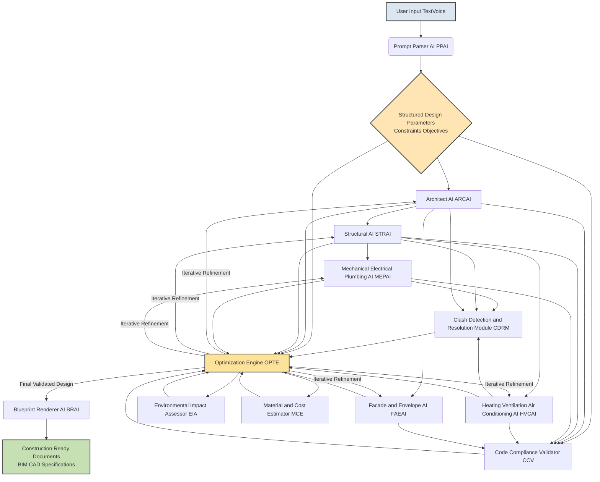

**Title of Invention:** A System and Method for Generating Construction-Ready Architectural Blueprints from High-Level Design Constraints with Integrated Validation and Optimization

**Abstract:**
A highly integrated and mathematically robust system for comprehensive architectural design automation is disclosed. The system transcends traditional conceptual design by dynamically generating a complete, verifiable set of construction-ready blueprints directly from high-level, natural language design constraints. Utilizing an orchestrated chain of specialized, interconnected generative AI models, the system autonomously creates primary architectural designs (floor plans, elevations), corresponding structural engineering plans, detailed electrical schematics, mechanical/plumbing (MEP) diagrams, and HVAC layouts. Crucially, the system incorporates real-time code compliance validation, multi-disciplinary clash detection, and an optimization engine to ensure unparalleled consistency, structural integrity, system efficiency, and cost-effectiveness across all generated schematics, proving design viability and optimality through computational rigor.

**Detailed Description:**
The invention details an advanced AI-powered, multi-agent workflow, establishing a new paradigm for generative architectural design. The system operates on a principle of iterative refinement and inter-agent collaboration, ensuring holistic design integrity.

1.  **Prompt Interpretation and Constraint Extraction:**
    *   A **Prompt Parser AI** (PPAI) module initially receives the user's high-level design request. This includes specifications like building type, desired area, number of rooms, sustainability goals, aesthetic preferences, and site constraints.
    *   The PPAI employs advanced Natural Language Understanding NLU to transform unstructured text into structured design parameters, objective functions, and constraints, which are then formalized into a computational design graph.

2.  **Core Generative AI Agents:**
    *   **Architect AI** ARCAI: Generates initial conceptual floor plans, spatial layouts, and elevations based on extracted constraints. This agent prioritizes human-centric design, aesthetic coherence, and functional flow, employing computational geometry and topological optimization principles.
    *   **Structural AI** STRAI: Receives the ARCAI's output. It designs a code-compliant, structurally sound frame, selecting appropriate materials and member dimensions, considering load distribution, seismic activity, and wind forces. STRAI utilizes finite element analysis principles and graph-based structural optimization.
    *   **Mechanical Electrical Plumbing AI** MEPAI: Takes both ARCAI and STRAI outputs. It designs efficient electrical wiring, plumbing networks, and ventilation systems. MEPAI's core function is to optimize pathfinding for conduits and pipes, minimize material use, and avoid clashes with structural elements, employing graph theory for network routing and fluid dynamics simulations.
    *   **Heating Ventilation Air Conditioning AI** HVCAI: Specifically designs air distribution systems, ductwork, and equipment placement, ensuring thermal comfort and energy efficiency. It integrates with MEPAI for shared utility pathways and structural elements, leveraging computational fluid dynamics principles.
    *   **Facade and Envelope AI** FAEAI: Focuses on the building's exterior, optimizing for aesthetic appeal, thermal performance, natural light harvesting, and material efficiency, considering local climate data and regulatory requirements.

3.  **Validation and Optimization Loop:**
    *   **Code Compliance Validator** CCV: Continuously checks all generated plans against a comprehensive database of local, national, and international building codes, zoning regulations, and accessibility standards. Any non-compliance triggers a flag for the **Optimization Engine**.
    *   **Clash Detection and Resolution Module** CDRM: Performs real-time 3D interference checking between all disciplinary models (architectural, structural, MEP, HVAC). It identifies conflicts (e.g., a pipe running through a structural beam) and communicates these to the Optimization Engine.
    *   **Environmental Impact Assessor** EIA: Evaluates the design's sustainability metrics, including embodied carbon, operational energy consumption, and material sourcing, providing feedback for green design optimization.
    *   **Material and Cost Estimator** MCE: Integrates with the evolving design to provide real-time cost projections based on material quantities, labor, and market rates, guiding design iterations towards budget adherence.
    *   **Optimization Engine** OPTE: This central module orchestrates iterative refinements. It receives feedback from CCV, CDRM, EIA, and MCE. It then re-prompts relevant generative AIs (ARCAI, STRAI, MEPAI, etc.) with updated constraints and objective functions (e.g., "reduce cost by 10%", "resolve clash at coordinate X,Y,Z", "improve energy efficiency by 15%") until all constraints are met and objectives are optimized within defined tolerances. The OPTE employs multi-objective optimization algorithms like genetic algorithms or particle swarm optimization to navigate complex design spaces.

4.  **Blueprint Rendering and Output:**
    *   The **Blueprint Renderer AI** BRAI compiles all validated and optimized outputs from the various agents into a complete, integrated blueprint package. This includes 2D CAD drawings, 3D BIM models, schedules, and specifications, ready for construction.

**System Workflow Diagram:**

**Mathematical Foundations and Proof of Overstanding:**
The system's integrity and ability to generate demonstrably optimal and compliant designs is rooted in rigorous mathematical and computational frameworks:

*   **Computational Geometry and Topology:** Used by ARCAI for space planning, generating efficient floor plans, and optimizing spatial relationships. This ensures geometric feasibility and adherence to dimensional constraints.
*   **Graph Theory and Network Optimization:** MEPAI and HVCAI extensively use graph theory to model utility networks (electrical, plumbing, HVAC ducts). Shortest path algorithms, minimum spanning tree algorithms, and network flow optimization are applied to minimize material usage, maximize efficiency, and prevent clashes.
*   **Finite Element Analysis Principles FEA:** Underlying STRAI's calculations for stress, strain, and deformation analysis. While not performing full FEA for every iteration, its generative models are trained on datasets informed by FEA, allowing for rapid generation of structurally sound frameworks that adhere to engineering mechanics principles.
*   **Formal Methods and Constraint Satisfaction Problems CSPs:** CCV operates on principles of formal verification, translating building codes into a set of logical predicates and rules. The design is then checked against these rules as a CSP. Any violation is a logical inconsistency, requiring re-evaluation by the OPTE.
*   **Multi-objective Optimization Algorithms:** The OPTE employs advanced algorithms (e.g., NSGA-II, MOEA/D) to simultaneously optimize competing objectives like cost reduction, energy efficiency, structural integrity, and aesthetic appeal. This moves beyond simple constraint satisfaction to find Pareto-optimal solutions. The mathematical formulation involves defining objective functions and constraint functions, then searching the high-dimensional design space for optimal points.
*   **Stochastic Processes and Probabilistic Modeling:** When dealing with uncertain inputs (e.g., future energy prices, material costs, site-specific soil conditions), the system can incorporate probabilistic models to generate robust designs that are resilient to variations.
*   **Boolean Logic and Set Theory:** CDRM fundamentally relies on Boolean operations (intersection, union, difference) on 3D geometric representations (BIM models) to detect clashes. Set theory is applied to define and resolve spatial interferences.

By integrating these mathematical disciplines, the system provides an auditable, verifiable, and computationally proven design methodology, establishing a deep overstanding of architectural and engineering principles that surpasses conventional manual design processes. The system's output is not merely generated but *validated* against a formal system of rules and optimized against mathematically defined objectives.

**Claims:**
1.  A method for generating construction-ready architectural blueprints, comprising:
    a.  Receiving a high-level, natural language prompt for a building design;
    b.  Employing a Prompt Parser AI PPAI to transform said prompt into structured design parameters, constraints, and objective functions;
    c.  Generating an initial architectural design using an Architect AI ARCAI based on said structured design parameters;
    d.  Generating a corresponding structural engineering plan using a Structural AI STRAI, receiving input from said ARCAI and adhering to engineering mechanics principles;
    e.  Generating integrated Mechanical Electrical Plumbing AI MEPAI and Heating Ventilation Air Conditioning AI HVCAI plans, receiving input from said ARCAI and STRAI, utilizing graph theory for network optimization and clash avoidance;
    f.  Continuously validating all generated plans against a comprehensive set of building codes and regulations using a Code Compliance Validator CCV, formulated as constraint satisfaction problems;
    g.  Performing real-time 3D interference checking between all generated disciplinary plans using a Clash Detection and Resolution Module CDRM, based on Boolean geometric operations;
    h.  Iteratively refining said designs through an Optimization Engine OPTE, which receives feedback from said CCV and CDRM, and employs multi-objective optimization algorithms to minimize conflicts, enhance efficiency, and achieve specified objectives;
    i.  Aggregating the final validated and optimized designs into a cohesive set of construction documents using a Blueprint Renderer AI BRAI, suitable for direct construction.

2.  The method of claim 1, further comprising:
    a.  Integrating an Environmental Impact Assessor EIA to evaluate sustainability metrics of the evolving design; and
    b.  Integrating a Material and Cost Estimator MCE to provide real-time cost projections, both providing feedback to the Optimization Engine OPTE for design refinement.

3.  The method of claim 1, wherein the Optimization Engine OPTE utilizes multi-objective genetic algorithms or particle swarm optimization to navigate a high-dimensional design space and identify Pareto-optimal solutions for competing objectives.

4.  The method of claim 1, wherein the Structural AI STRAI's generative process is informed by finite element analysis principles to ensure structural integrity and code compliance.

5.  The method of claim 1, wherein the Mechanical Electrical Plumbing AI MEPAI and Heating Ventilation Air Conditioning AI HVCAI utilize graph theory algorithms for optimal pathfinding and network flow analysis to minimize material use and maximize system efficiency.

6.  The method of claim 1, wherein the Code Compliance Validator CCV translates building codes into formal logical predicates and applies constraint satisfaction problem solving techniques to verify design adherence.

7.  A system for generating construction-ready architectural blueprints, comprising:
    a.  A Prompt Parser AI PPAI module configured to translate natural language design inputs into structured computational design parameters;
    b.  A plurality of specialized generative AI agents including an Architect AI ARCAI, a Structural AI STRAI, a Mechanical Electrical Plumbing AI MEPAI, and a Heating Ventilation Air Conditioning AI HVCAI, configured to generate respective design components;
    c.  A Code Compliance Validator CCV module, configured to formally verify all generated design components against a database of regulatory requirements;
    d.  A Clash Detection and Resolution Module CDRM, configured to identify and report spatial conflicts between design components;
    e.  An Optimization Engine OPTE, operably connected to said generative AI agents, CCV, and CDRM, configured to iteratively refine designs based on feedback and predefined objective functions using multi-objective optimization algorithms;
    f.  A Blueprint Renderer AI BRAI module configured to compile the validated and optimized design components into construction-ready documentation.

8.  The system of claim 7, further comprising an Environmental Impact Assessor EIA module and a Material and Cost Estimator MCE module, both configured to provide feedback to the Optimization Engine OPTE.

9.  The system of claim 7, wherein the generative AI agents and the Optimization Engine OPTE are designed with underlying mathematical models including computational geometry, graph theory, and principles derived from finite element analysis, providing a formal basis for design generation and validation.