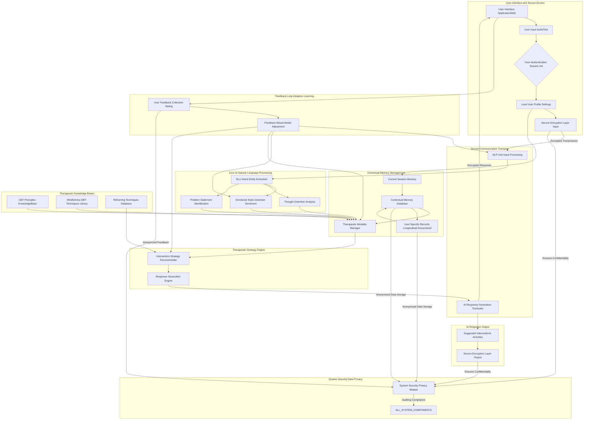

**Title of Invention:** A System and Method for a Therapeutic Conversational Partner

**Abstract:**
A system providing a therapeutic conversational AI is disclosed, engineered with a robust algorithmic foundation. The AI is trained on principles of cognitive-behavioral therapy CBT, mindfulness, dialectical behavior therapy DBT, and other established therapeutic modalities. It engages a user in an empathetic, supportive, and context-aware conversation, employing computational models for emotional state detection, personalized intervention selection, and adaptive learning. The system facilitates the identification of negative thought patterns, provides tools for cognitive reframing, and guides users in emotional regulation techniques. This AI acts as an accessible, on-demand, and mathematically grounded tool for mental wellness support, ensuring privacy and confidentiality through advanced encryption protocols.

**Detailed Description:**
The system comprises a sophisticated conversational AI agent, often presented as a chatbot, underpinned by a highly specialized system prompt: `You are a compassionate AI companion trained in CBT, DBT, and Mindfulness. Your goal is to listen without judgment, understand the user's emotional state, and help them explore their thoughts and feelings. Use techniques like Socratic questioning, cognitive reframing, and mindfulness exercises, adapting to their individual needs and progress.` The conversation is maintained with end-to-end encryption and robust data anonymization, providing a safe, private, and confidential space for the user's therapeutic journey.

**System Architecture and Functional Flow:**
1.  **User Interface Layer:** This layer handles user input, which can be in text or voice format. It includes secure authentication mechanisms and initiates a therapeutic session.
2.  **Secure Communication Module:** Ensures all data transmission between the user interface and the backend AI system is secured using industry-standard, end-to-end encryption protocols, guaranteeing data integrity and privacy.
3.  **Natural Language Processing NLP Unit:**
    *   **Natural Language Understanding NLU:** Processes user input to extract intent, entities, and key concepts.
    *   **Emotional State Detection EMD:** Utilizes advanced sentiment analysis and emotion classification models to infer the user's emotional state, a critical input for therapeutic strategy.
    *   **Thought Distortion Analysis TDA:** Identifies common cognitive distortions present in the user's language, such as catastrophizing, black-and-white thinking, or overgeneralization, based on established CBT frameworks.
4.  **Contextual Memory Module:** Maintains a detailed, anonymized record of the current session, past interactions, user profile information, and therapeutic progress. This module is essential for coherent, personalized, and longitudinal therapeutic support, ensuring the AI remembers previous conversations and applies learned insights.
5.  **Therapeutic Strategy Engine:** This is the core decision-making unit.
    *   **Therapeutic Modality Manager TMM:** Based on the user's emotional state, identified thought distortions, and session context, this component selects the most appropriate therapeutic modality (e.g., CBT, DBT, Mindfulness).
    *   **Intervention Strategy Recommender ISR:** From the selected modality, it then determines the specific intervention technique to apply (e.g., Socratic questioning, cognitive reframing, grounding exercise, breathing technique, validation).
6.  **Therapeutic Knowledge Bases:** A suite of specialized databases that inform the AI's therapeutic decisions:
    *   **CBT Principles KnowledgeBase CKB:** Contains structured data on cognitive distortions, reframing techniques, and behavioral activation strategies.
    *   **Mindfulness DBT Techniques Library MKB:** Stores instructions and scripts for mindfulness exercises, distress tolerance skills, and emotional regulation techniques.
    *   **Reframing Techniques Database RTD:** A comprehensive repository of alternative perspectives and counter-arguments for common negative thought patterns.
    *   **User Specific Records Longitudinal USR:** An anonymized, secure database storing individual user progress, preferences, and long-term therapeutic goals.
7.  **Response Generation Engine RGE:** Formulates the AI's conversational response based on the chosen intervention strategy, ensuring it is empathetic, supportive, and therapeutically aligned.
8.  **Output Interface:** Delivers the AI's response to the user via text or synthesized voice. It can also suggest external activities, journal prompts, or further exercises.
9.  **Feedback Loop and Adaptive Learning:**
    *   **User Feedback Collection UFC:** Gathers explicit feedback from users (e.g., satisfaction ratings, helpfulness scores) and implicit feedback (e.g., engagement metrics, session length).
    *   **Feedback Based Model Adjustment FBM:** Utilizes this feedback to continuously refine and adapt the underlying NLP models, emotional detection algorithms, and therapeutic strategy parameters, enabling the AI to learn and improve its effectiveness over time.

**Algorithmic Foundation and Computational Rigor:**
The system's intelligence is rigorously founded on computational models that enable adaptive, personalized therapeutic interactions:
*   **Probabilistic Emotional State Modeling:** User emotional states are not merely classified but inferred through a probabilistic framework. For example, a Bayesian network or a Hidden Markov Model can be employed to calculate `P(EmotionalState | Utterance_t, Context_t, PreviousStates)`, where `Utterance_t` is the current user input, `Context_t` includes session history, and `PreviousStates` are past inferred emotions. This provides a quantifiable measure of emotional shift and confidence in detection.
*   **Optimal Intervention Strategy as a Markov Decision Process MDP:** The selection of the most effective therapeutic intervention can be mathematically modeled as a Markov Decision Process. The AI's goal is to choose actions (interventions) that maximize a long-term "therapeutic progress" reward function. The state space encompasses the user's current emotional state, identified thought patterns, historical progress, and explicit goals. The reward function can be designed to increase with positive sentiment shifts, successful reframing, and user-reported improvements. This framework allows for optimal decision-making under uncertainty, based on expected future rewards.
*   **Cognitive Reframing Algorithm CFA:** This algorithm operates on a sophisticated semantic matching and transformation engine. It identifies patterns in user input that correspond to known cognitive distortions. Using vector space embeddings and similarity metrics, the system matches these distortions to entries in the Reframing Techniques Database RTD. The CFA then generates alternative perspectives or questions, weighted by their contextual relevance and probabilistic likelihood of positive therapeutic impact. This involves mapping `DistortedCognition --> {ReframedThought_1, ReframedThought_2, ..., ReframedThought_n}` with associated probabilities of efficacy.
*   **Adaptive Parameter Optimization:** The Feedback Based Model Adjustment FBM module employs reinforcement learning techniques or online learning algorithms to continuously optimize the parameters of the NLU, EMD, and Therapeutic Strategy Engine. This involves minimizing a loss function related to negative user outcomes or maximizing a utility function tied to therapeutic effectiveness, ensuring the system continually improves its ability to provide tailored and effective support.
*   **Secure Multi-Party Computation SMC Design Principles:** While primary communication relies on end-to-end encryption, the system is designed with an understanding of SMC principles, which could allow future extensions to collaborate with external models or aggregate anonymized data for research without exposing individual user data, thereby demonstrating an advanced theoretical grasp of privacy-preserving computational methods.

**Mermaid Diagram:**

**Claims:**
1.  A method for providing mental wellness support, comprising:
    a.  Providing a conversational AI agent to a user via a secure user interface.
    b.  Receiving user input in an audio or text format through an end-to-end encrypted channel.
    c.  Processing said user input using a Natural Language Processing unit to perform:
        i.  Natural Language Understanding for intent and entity extraction.
        ii. Emotional State Detection using probabilistic models to infer user affect.
        iii. Thought Distortion Analysis to identify cognitive distortions based on established therapeutic frameworks.
    d.  Maintaining a Contextual Memory Database that stores anonymized user profile information, session history, and therapeutic progress longitudinally.
    e.  Employing a Therapeutic Strategy Engine that, based on the processed user input and contextual memory, determines an optimal therapeutic modality and specific intervention strategy.
    f.  Generating an AI response using a Response Generation Engine, said response being empathetic, therapeutically aligned, and informed by specialized Therapeutic Knowledge Bases.
    g.  Delivering said AI response to the user via a secure output channel.
    h.  Collecting user feedback and utilizing a Feedback Based Model Adjustment module to continuously refine and adapt the AI's underlying models and strategies through adaptive learning.
    i.  Maintaining the privacy and confidentiality of the entire conversation and all stored data through end-to-end encryption and robust data anonymization, adhering to System Security Privacy Module protocols.

2.  The method of claim 1, wherein the Emotional State Detection component utilizes a probabilistic model, such as a Bayesian network or Hidden Markov Model, to quantify the likelihood of various emotional states given current and historical user input.

3.  The method of claim 1, wherein the Therapeutic Strategy Engine frames the selection of an intervention strategy as a Markov Decision Process, aiming to maximize a reward function indicative of therapeutic progress.

4.  The method of claim 1, wherein the Thought Distortion Analysis and subsequent cognitive reframing are performed by an algorithm leveraging vector space embeddings and semantic similarity metrics to match identified distortions to a Reframing Techniques Database and generate contextually relevant alternative perspectives.

5.  The method of claim 1, further comprising dynamically suggesting supplementary activities, journal prompts, or mindfulness exercises based on the user's therapeutic progress and identified needs.

6.  A system for providing mental wellness support, comprising:
    a.  A User Interface Layer configured to receive user input and display AI responses.
    b.  A Secure Communication Module for encrypting and decrypting all data transmissions.
    c.  A Natural Language Processing Unit comprising a Natural Language Understanding component, an Emotional State Detection component, and a Thought Distortion Analysis component.
    d.  A Contextual Memory Module for storing and retrieving anonymized user-specific and session-specific data.
    e.  A Therapeutic Strategy Engine comprising a Therapeutic Modality Manager and an Intervention Strategy Recommender.
    f.  One or more Therapeutic Knowledge Bases, including but not limited to, a CBT Principles KnowledgeBase, a Mindfulness DBT Techniques Library, and a Reframing Techniques Database.
    g.  A Response Generation Engine for formulating AI responses.
    h.  A Feedback Loop and Adaptive Learning module, including a User Feedback Collection component and a Feedback Based Model Adjustment component, for continuous model refinement.
    i.  A System Security Privacy Module for enforcing end-to-end encryption, data anonymization, and overall system security.

7.  The system of claim 6, wherein the Emotional State Detection component is configured to apply probabilistic models for inferring user emotional states.

8.  The system of claim 6, wherein the Therapeutic Strategy Engine is configured to implement an optimal intervention selection algorithm based on a Markov Decision Process.

9.  The system of claim 6, wherein the Thought Distortion Analysis component is configured to identify cognitive distortions and the Reframing Techniques Database is configured to provide semantically matched alternative perspectives.

10. The system of claim 6, wherein the Feedback Based Model Adjustment component employs reinforcement learning or online learning algorithms to optimize the performance parameters of the Natural Language Processing Unit and the Therapeutic Strategy Engine.