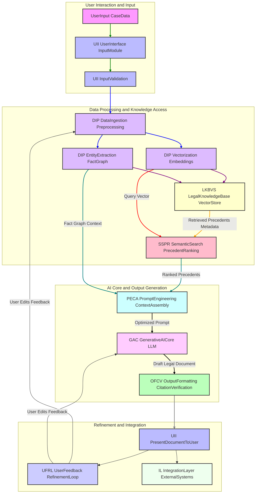

**Title of Invention:** A System and Method for Generating Legal Briefs and Arguments from Case Summaries and Precedent

**Abstract:**
A system for assisting legal professionals in drafting persuasive documents is disclosed. A lawyer provides a case summary, a set of key facts, and the desired legal position. The system ingests this information and also performs a semantic search on a private database of relevant case law to find supporting precedents. This combined context is provided to a generative AI model, which is prompted to act as an expert legal scholar or litigator. The AI generates a complete draft of a legal document, such as a brief or an oral argument, including structured sections, persuasive arguments, and citations to the provided case law.

**Detailed Description:**
The present invention describes a robust system and method for automating the generation of sophisticated legal documents and arguments. This system, hereafter referred to as the "AI Legal Argument Generator" or "AI-LAG," integrates advanced natural language processing, vector database technologies, and large generative AI models to provide unparalleled assistance to legal professionals.

**I. Core System Modules:**

The AI-LAG system is comprised of several interconnected modules, each designed with specific functionalities to ensure accuracy, relevance, and persuasive output.

1.  **User Interface and Input Module UII:**
    *   **Functionality:** Provides a secure and intuitive interface for legal professionals to input case-specific data.
    *   **Input Types:** Accepts structured data fields for case name, jurisdiction, parties, and legal question; free-form text for case summaries; specific factual assertions; legal arguments to be advanced or rebutted; and uploaded documents such as complaints, motions, or discovery responses.
    *   **Data Validation:** Ensures data integrity and format consistency.

2.  **Data Ingestion and Preprocessing Module DIP:**
    *   **Functionality:** Transforms raw input data into a standardized, machine-readable format suitable for downstream processing.
    *   **Components:**
        *   **Text Extraction:** Extracts text from various document formats PDF, DOCX, TXT.
        *   **Natural Language Understanding NLU:** Identifies key entities named entities, dates, legal terms, events, relationships within the input text.
        *   **Fact Graph Construction:** Converts identified facts and relationships into a structured graph database representation for enhanced contextual reasoning.
        *   **Vectorization:** Embeds all textual components case summaries, facts, legal questions into high-dimensional vector representations using advanced transformer models. This process maps semantic meaning to a quantifiable vector space, allowing for precise similarity calculations. Mathematically, each document or sentence `d` is transformed into a vector `v_d` in `R^N`, where `N` is the dimension of the embedding space.

3.  **Legal Knowledge Base and Vector Store LKBVS:**
    *   **Functionality:** Stores and manages a comprehensive, proprietary, and up-to-date repository of legal information.
    *   **Contents:** Includes statutes, regulations, judicial opinions, legal treatises, and prior legal documents previously processed by the system.
    *   **Structure:** Primarily a vector database for efficient semantic search of legal precedents, supplemented by a relational database for structured metadata. Each legal document `D_i` is stored as a vector `V_i`, alongside its metadata `M_i` citations, jurisdiction, date, keywords. The database continually updates, incorporating new legal developments.

4.  **Semantic Search and Precedent Ranking Module SSPR:**
    *   **Functionality:** Identifies and ranks the most relevant legal precedents from the LKBVS based on the input case details.
    *   **Process:**
        *   **Query Vector Generation:** The vectorized input `v_input` from DIP forms the query.
        *   **Similarity Search:** Performs a k-nearest neighbors search or an approximate nearest neighbors ANN search within the LKBVS, computing the cosine similarity `Sim(v_input, V_i) = (v_input ⋅ V_i) / (||v_input|| ⋅ ||V_i||)` to find documents with high semantic relevance.
        *   **Multi-Factor Ranking:** Ranks retrieved precedents not solely by semantic similarity but also by factors such as jurisdiction relevance, recency, court level, citation count PageRank-like algorithm, and direct factual overlap identified through the fact graph. This produces a ranked list `P = {P_1, P_2, ..., P_K}` of highly relevant precedents.

5.  **Prompt Engineering and Context Assembly Module PECA:**
    *   **Functionality:** Dynamically constructs a highly specific and context-rich prompt for the Generative AI Core. This module is critical for guiding the AI's output.
    *   **Components:**
        *   **Role Assignment:** Specifies the AI's persona e.g., "You are a senior litigator specializing in intellectual property law."
        *   **Task Definition:** Clearly articulates the desired output e.g., "Draft a persuasive Motion to Dismiss," "Develop an appellate brief argument section."
        *   **Input Context Injection:** Integrates the case summary, key facts, identified legal questions, and selected relevant precedents into the prompt. Each precedent `P_j` is formatted to include its core holding, relevant facts, and full citation.
        *   **Argument Strategy Integration:** Incorporates user-specified argument strategies e.g., "Argue for standing," "Challenge jurisdiction."
        *   **Output Format Specification:** Defines the desired structure and style of the generated document e.g., "Include sections for Factual Background, Legal Standard, Argument, and Conclusion," "Use Bluebook style citations."
    *   **Token Optimization:** Ensures the combined context fits within the Generative AI Core's token window, prioritizing the most critical information if truncation is necessary.

6.  **Generative AI Core Module GAC:**
    *   **Functionality:** The central engine that processes the sophisticated prompt to generate the legal document.
    *   **Components:**
        *   **Large Language Model LLM:** Employs advanced foundation models e.g., GPT-4, Claude, Llama 2, potentially fine-tuned on legal corpora. The LLM acts as a probabilistic function `f(prompt) -> legal_document_draft`.
        *   **Domain Adaptation Layer:** May include specific layers or fine-tuning weights that bias the LLM towards legal reasoning, terminology, and stylistic conventions.
        *   **Argument Synthesis Engine:** Synthesizes the provided facts and precedents into a coherent, logically structured, and persuasive argument, linking specific facts to legal principles established by precedent.

7.  **Output Formatting and Citation Verification Module OFCV:**
    *   **Functionality:** Structures the AI-generated raw text into a polished legal document and verifies all embedded citations.
    *   **Components:**
        *   **Document Structuring:** Applies standard legal document formatting templates sections, headings, paragraph spacing.
        *   **Citation Extraction and Validation:** Extracts all generated citations from the draft and cross-references them against a comprehensive legal citation database for accuracy and correct formatting. Flags any erroneous or malformed citations.
        *   **Readability Enhancement:** Performs basic grammar and style checks to improve clarity and professionalism.

8.  **User Feedback and Refinement Loop Module UFRL:**
    *   **Functionality:** Allows legal professionals to review, edit, and provide feedback on the generated drafts, continuously improving the system's performance.
    *   **Mechanism:** User edits are captured and used to re-fine-tune the Generative AI Core or update the knowledge base. This creates an iterative learning cycle, where `System_Performance_t+1 = f(System_Performance_t, User_Feedback_t)`.
    *   **Reinforcement Learning from Human Feedback RLHF:** Edits and ratings provided by users can serve as human feedback signals to further align the AI's output with desired legal standards and persuasive styles.

9.  **Integration Layer IL:**
    *   **Functionality:** Enables seamless interoperability with existing legal technology ecosystems.
    *   **API Endpoints:** Provides secure APIs for integration with Document Management Systems DMS, e-discovery platforms, and case management software.

A lawyer inputs case details. The UII receives these details. The DIP module processes and vectorizes the input. The SSPR module queries the LKBVS to find relevant prior cases, employing advanced semantic similarity and ranking algorithms. The PECA module then constructs a comprehensive and precisely formulated prompt for the GAC, incorporating the `case summary`, `facts`, and `precedents`. For example, `Prompt = Combine(Role_String, Task_String, Formatted_Facts, Formatted_Precedents, Output_Format_Instructions)`. The GAC, acting as a sophisticated legal scholar, generates the full text of the brief or argument. This generation process involves sophisticated textual inference and argument construction based on the provided context. The OFCV module then structures and validates the output, weaving the facts and precedents into a cohesive argument, ready for the lawyer to edit via the UII. User edits are fed back into the UFRL to improve future generations.

**Claims:**
1.  A method for generating a legal document, comprising:
    a.  Receiving a case summary and a set of facts from a user via a User Interface and Input Module UII.
    b.  Processing said case summary and set of facts using a Data Ingestion and Preprocessing Module DIP, including vectorizing said summary and facts into a high-dimensional vector space.
    c.  Identifying a set of relevant legal precedents from a Legal Knowledge Base and Vector Store LKBVS using a Semantic Search and Precedent Ranking Module SSPR, said identification based on semantic similarity of vectorized input to vectorized precedents and multi-factor ranking.
    d.  Assembling a comprehensive prompt using a Prompt Engineering and Context Assembly Module PECA, said prompt integrating a defined AI persona, a specific legal task, the processed case summary, the set of facts, and the identified legal precedents.
    e.  Providing the assembled prompt as context to a Generative AI Core Module GAC comprising a large language model.
    f.  Prompting the GAC to generate a draft of a persuasive legal document that incorporates the provided context, specific arguments, and citations.
    g.  Formatting and validating the generated draft, including citation verification, using an Output Formatting and Citation Verification Module OFCV.
    h.  Presenting the formatted legal document to the user via the UII.

2.  The method of claim 1, further comprising: receiving user edits and feedback on the generated legal document via a User Feedback and Refinement Loop Module UFRL.

3.  The method of claim 2, wherein the user edits and feedback are utilized by the UFRL to iteratively improve the performance of the Generative AI Core Module and the Legal Knowledge Base and Vector Store.

4.  A system for generating legal documents, comprising:
    a.  A User Interface and Input Module UII configured to receive a case summary, a set of facts, and desired legal position from a user.
    b.  A Data Ingestion and Preprocessing Module DIP configured to extract entities, construct fact graphs, and vectorize input data into numerical representations.
    c.  A Legal Knowledge Base and Vector Store LKBVS configured to store and retrieve vectorized legal documents and metadata.
    d.  A Semantic Search and Precedent Ranking Module SSPR configured to query the LKBVS using vectorized input and rank retrieved precedents based on semantic similarity, jurisdictional relevance, and recency.
    e.  A Prompt Engineering and Context Assembly Module PECA configured to dynamically construct an optimized prompt, including AI role, task, and contextual legal information.
    f.  A Generative AI Core Module GAC housing a large language model, configured to generate a legal document draft based on the optimized prompt.
    g.  An Output Formatting and Citation Verification Module OFCV configured to structure the generated document and validate embedded citations.
    h.  A User Feedback and Refinement Loop Module UFRL configured to capture user interactions and feedback for system improvement.
    i.  An Integration Layer IL providing API access for interoperability with external legal platforms.

5.  The system of claim 4, wherein the DIP's vectorization component transforms textual inputs `T` into vectors `V` in `R^N`, such that `Sim(V_a, V_b) > Sim(V_a, V_c)` if `T_a` is semantically more similar to `T_b` than to `T_c`.

6.  The system of claim 4, wherein the SSPR's multi-factor ranking employs a weighted sum or machine learning model `R(P_i) = w_1 * Sim(Q, V_i) + w_2 * Jurisdiction_Match + w_3 * Recency_Score + ...` to determine precedent relevance.

7.  The system of claim 4, wherein the PECA ensures the assembled prompt's token count `C` is less than or equal to the Generative AI Core Module's maximum context window `W`, i.e., `C <= W`.

8.  The system of claim 4, wherein the OFCV performs validation of generated citations against a reference database, providing a boolean `IsValid` flag for each citation.

9.  A non-transitory computer-readable medium storing instructions that, when executed by a processor, cause the processor to perform the method of claim 1.

**Mermaid Diagrams:**


**Figure 1: Overall AI Legal Argument Generator System Architecture**
This diagram illustrates the primary modules and their interconnections, demonstrating the flow of information from user input through AI processing to final output and feedback.

```mermaid
graph TD
    subgraph Input Phase
        A[User Input CaseDetails] --> B[Validate InputData]
    end

    subgraph Data Processing Phase
        B --> C{Parse Extract Text Entities}
        C --> D[Generate VectorEmbeddings]
        C --> E[Construct FactGraph]
    end

    subgraph Knowledge Retrieval Phase
        D -- QueryVector --> F[SemanticSearch LKBVS]
        F --> G[Rank Filter Precedents]
    end

    subgraph Argument Generation Phase
        G -- Top N Precedents --> H[Assemble Prompt Role Task Context]
        E -- FactGraph Context --> H
        H --> I[GenerativeAICore DocumentCreation]
    end

    subgraph Output and Refinement Phase
        I --> J[Format Draft VerifyCitations]
        J --> K[Present DocumentToUser]
        K --> L[Capture UserEdits Feedback]
        L --> M[Update SystemModels KnowledgeBase]
    end

    note for A "Case summary facts legal position"
    note for C "NLU Entity Recognition"
    note for D "Maps text to RN semantic space"
    note for F "Cosine similarity ANN search"
    note for G "Jurisdiction recency courtlevel"
    note for H "Mathematical formulation of prompt context"
    note for I "Probabilistic text generation fPromptOutput"
    note for J "Bluebook formatting citation check"
    note for L "RLHF Reinforcement Learning Human Feedback"
```
**Figure 2: Legal Document Generation Workflow**
This flowchart details the sequential steps involved in generating a legal document, from initial user input to the final, formatted output, emphasizing the data transformation at each stage.

```mermaid
graph TD
    subgraph Prompt Assembly Components
        A[Input RolePersona] --> B[PECA PromptConstruction]
        C[Input TaskDefinition] --> B
        D[Processed CaseSummaryFacts] --> B
        E[Ranked PrecedentsMetadata] --> B
        F[OutputFormat InstructionsStyle] --> B
    end

    subgraph Context Integration Process
        B --> G[Format ContextualBlocks]
        G --> H[Optimize TokenCount ContextWindow]
        H --> I[Finalized PromptString]
    end

    subgraph Generative Output
        I --> J[GAC GenerativeAICore]
        J --> K[Draft LegalContent]
    end

    note for A "e.g. Senior Litigator specializing in X"
    note for C "e.g. Draft Motion to Dismiss"
    note for D "Structured facts graph embeddings"
    note for E "Formatted citation holding excerpts"
    note for F "Sections headings citationstyle"
    note for G "Concatenation and structuring of prompt parts"
    note for H "Ensure total prompt tokens <= LLM max"
    note for I "The mathematical input vector for the LLM"
```
**Figure 3: Prompt Construction and Context Integration**
This diagram highlights the intricate process within the Prompt Engineering and Context Assembly Module, showing how various inputs are combined and optimized to create a high-quality prompt for the Generative AI Core.

```mermaid
graph TD
    subgraph Initial Generation
        A[GAC GeneratedDraft] --> B[OFCV FormattedDraft]
    end

    subgraph User Review and Feedback
        B --> C[UII PresentedToUser]
        C -- User Edits Markup Ratings --> D[UFRL FeedbackCollection]
    end

    subgraph System Learning and Improvement
        D --> E[UFRL AnalyzeFeedback]
        E -- Fine-tune GAC Weights --> F[GAC GenerativeAICore]
        E -- Update LKBVS Indices --> G[LKBVS LegalKnowledgeBase VectorStore]
        E -- Refine Preprocessing Rules --> H[DIP DataIngestion Preprocessing]
    end

    subgraph Iterative Cycle
        F --> A
        G --> F
        H --> F

    end
    note for A "Draft_t"
    note for D "Reinforcement Learning from Human Feedback RLHF"
    note for E "Statistical analysis of edit patterns"
    note for F "Weights_t+1 = Weights_t + Delta_Feedback"
    note for G "New documents updated embeddings"
    note for H "Improved entity extraction coreference"
```
**Figure 4: Feedback and Iterative Refinement Process**
This diagram illustrates the crucial feedback loop that enables the AI-LAG system to continuously learn and improve from user interactions, enhancing the quality and relevance of future legal document generations.