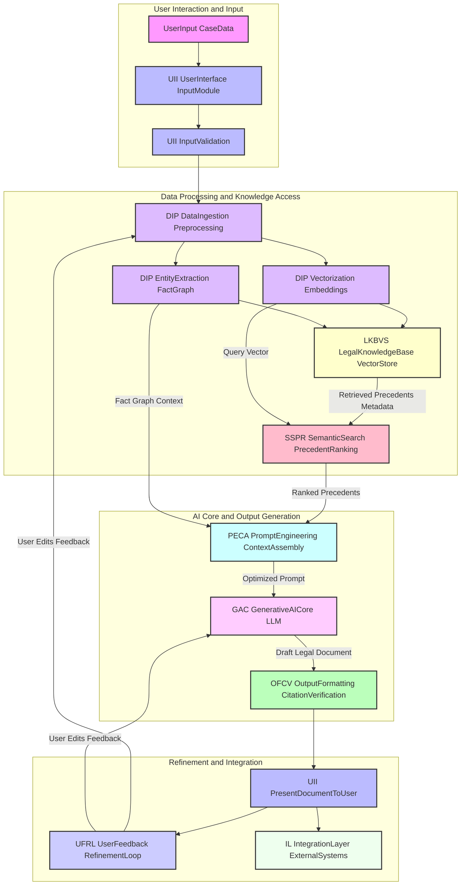
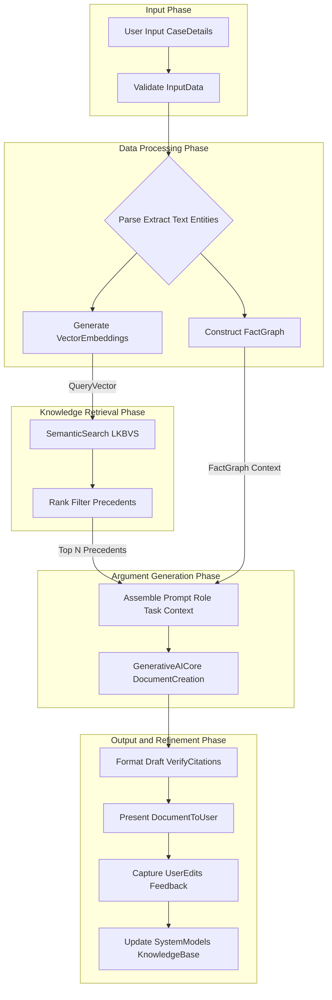
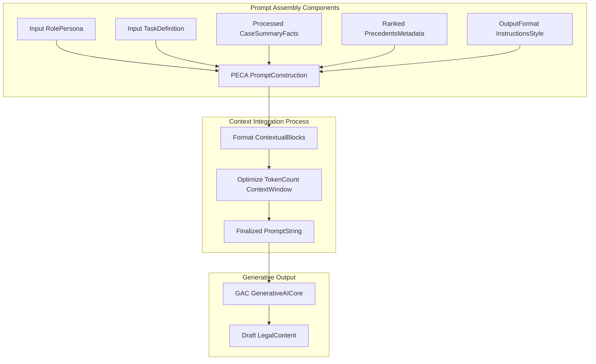
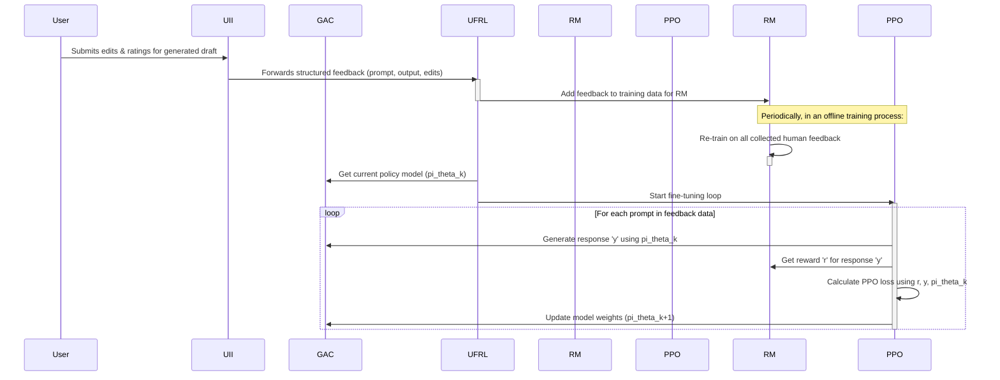
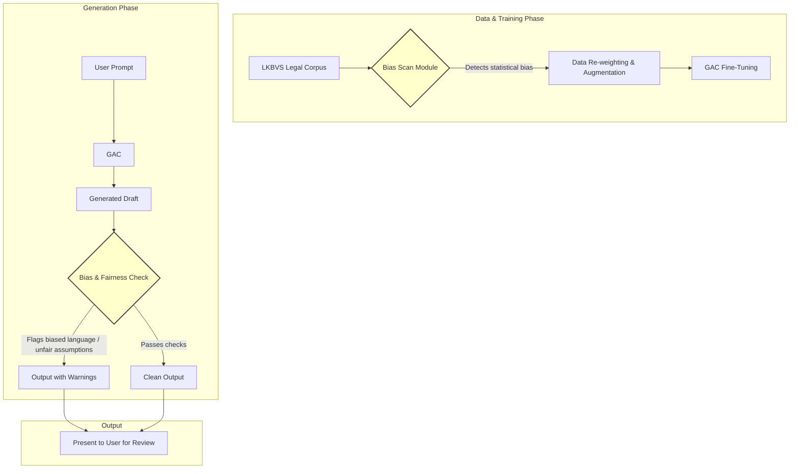

**Title of Invention:** A System and Method for Generating Legal Briefs and Arguments from Case Summaries and Precedent

**Abstract:**
A system for assisting legal professionals in drafting persuasive documents is disclosed. A lawyer provides a case summary, a set of key facts, and the desired legal position. The system ingests this information and also performs a semantic search on a private database of relevant case law to find supporting precedents. This combined context is provided to a generative AI model, which is prompted to act as an expert legal scholar or litigator. The AI generates a complete draft of a legal document, such as a brief or an oral argument, including structured sections, persuasive arguments, and citations to the provided case law. The system incorporates a multi-stage process involving advanced natural language understanding, high-dimensional vector representation, multi-factor precedent ranking, context-aware prompt engineering, and a feedback loop for continuous improvement. Advanced capabilities include argument strength scoring, adversarial counter-argument simulation, and robust ethical guardrails to mitigate bias. The system is designed for seamless integration into existing legal technology ecosystems, providing a powerful, efficient, and scalable solution for modern legal practice.

**Detailed Description:**
The present invention describes a robust system and method for automating the generation of sophisticated legal documents and arguments. This system, hereafter referred to as the "AI Legal Argument Generator" or "AI-LAG," integrates advanced natural language processing (NLP), vector database technologies, and large generative AI models to provide unparalleled assistance to legal professionals. Its architecture is designed for modularity, accuracy, and continuous learning, ensuring that its outputs remain relevant, persuasive, and aligned with the highest standards of legal practice.

**I. Core System Modules:**

The AI-LAG system is comprised of several interconnected modules, each designed with specific functionalities to ensure accuracy, relevance, and persuasive output. The modular design allows for independent upgrades and optimization of each component.

1.  **User Interface and Input Module (UII):**
    *   **Functionality:** Provides a secure, intuitive, and compliant interface for legal professionals to input case-specific data. The interface supports multiple modes, including a guided "wizard" mode for less experienced users and an "expert" mode for power users desiring granular control over the generation process.
    *   **Input Types:** Accepts structured data fields for case name, jurisdiction, parties, and legal question; free-form text for case summaries; specific factual assertions (which can be tagged with levels of certainty or importance); legal arguments to be advanced or rebutted; and uploaded documents in various formats (PDF, DOCX, TXT, MSG) such as complaints, motions, or discovery responses.
    *   **Data Validation:** Implements rigorous client-side and server-side validation to ensure data integrity and format consistency. This includes checking for required fields, validating date formats, and using checksum algorithms for file uploads to ensure data has not been corrupted. A simple checksum can be represented as:
        `S = (\sum_{i=1}^{n} d_i) \pmod{M}` (1)
    *   **Security and Compliance:** Enforces multi-factor authentication (MFA), role-based access control (RBAC), and end-to-end encryption for all data in transit and at rest. The system is designed to comply with data privacy regulations such as GDPR and CCPA.
    *   **Accessibility:** Adheres to Web Content Accessibility Guidelines (WCAG) to ensure usability for professionals with disabilities.

2.  **Data Ingestion and Preprocessing Module (DIP):**
    *   **Functionality:** Transforms raw input data into a standardized, machine-readable format suitable for downstream processing. This module acts as the ETL (Extract, Transform, Load) pipeline for the entire system.
    *   **Components:**
        *   **Text Extraction:** Utilizes optical character recognition (OCR) for scanned documents and specialized parsers for digital formats to extract clean, structured text.
        *   **Natural Language Understanding (NLU):** Applies a cascade of NLP models to deconstruct the text:
            *   Tokenization: `d \rightarrow \{t_1, t_2, ..., t_k\}` where `t_i` is a token from vocabulary `V` (2).
            *   Sentence Segmentation: `d \rightarrow \{s_1, s_2, ..., s_m\}` (3).
            *   Named Entity Recognition (NER): `s_j \rightarrow \{(e_1, \tau_1), (e_2, \tau_2), ...\}` where `\tau` is the entity type (e.g., PERSON, COURT, DATE) (4). This is crucial for identifying key actors and events.
            *   Relation Extraction: Identifies semantic relationships between entities to begin building a knowledge graph.
        *   **Fact Graph Construction:** Converts identified facts and relationships into a structured graph database representation (e.g., Neo4j). Facts are modeled as triples `(subject, predicate, object)` or `(h, r, t)` (5). The graph is defined as `G = (\mathcal{E}, \mathcal{R})` where `\mathcal{E}` are entities (nodes) and `\mathcal{R}` are relations (edges) (6). This graph allows for complex queries about factual connections that are difficult to ascertain from raw text alone. Key facts can be identified using graph centrality measures like degree centrality `C_D(v) = \text{deg}(v)` (7) or betweenness centrality `C_B(v) = \sum_{s \neq v \neq t} \frac{\sigma_{st}(v)}{\sigma_{st}}` (8).
        *   **Vectorization:** Embeds all textual components (case summaries, facts, legal questions) into high-dimensional vector representations. This process uses advanced transformer models (e.g., BERT, RoBERTa) fine-tuned on legal text. The core mechanism is the self-attention function:
            `\text{Attention}(Q, K, V) = \text{softmax}(\frac{QK^T}{\sqrt{d_k}})V` (9)
            This allows the model to weigh the importance of different words when creating a representation for a given piece of text. Multi-head attention is used for greater power:
            `\text{MultiHead}(Q, K, V) = \text{Concat}(\text{head}_1, ..., \text{head}_h)W^O` (10)
            where `\text{head}_i = \text{Attention}(QW_i^Q, KW_i^K, VW_i^V)` (11).
            This process maps semantic meaning to a quantifiable vector space (`\mathbb{R}^N`), enabling precise similarity calculations.

3.  **Legal Knowledge Base and Vector Store (LKBVS):**
    *   **Functionality:** Stores and manages a comprehensive, proprietary, and continually updated repository of legal information.
    *   **Contents:** Includes statutes, regulations, judicial opinions from multiple jurisdictions, legal treatises, and anonymized prior work products processed by the system.
    *   **Structure:** A hybrid data store. The core is a vector database (e.g., Pinecone, Weaviate) for efficient semantic search, using Approximate Nearest Neighbor (ANN) algorithms like HNSW for fast retrieval with complexity often approaching `O(\log N)` (12). This is supplemented by a relational database (e.g., PostgreSQL) for structured metadata (citations, jurisdiction, date, court) and the graph database for factual relationships.
    *   **Data Freshness:** The LKBVS is continuously updated with new legal developments. A data freshness metric `F = e^{-\lambda(t_{now} - t_{update})}` (13) can be used to prioritize more recent information in ranking. The overall update rate `\Delta D / \Delta t` (14) is a key performance indicator for the knowledge base.

4.  **Semantic Search and Precedent Ranking Module (SSPR):**
    *   **Functionality:** Identifies and ranks the most relevant legal precedents from the LKBVS based on the input case details. This goes far beyond simple keyword matching.
    *   **Process:**
        *   **Query Vector Generation:** The vectorized input `v_{input}` from the DIP module forms the initial query vector.
        *   **Similarity Search:** Performs an ANN search within the LKBVS. The primary similarity metric is cosine similarity, which measures the cosine of the angle between two vectors:
            `Sim(v_{input}, V_i) = \frac{v_{input} \cdot V_i}{||v_{input}|| \cdot ||V_i||}` (15)
            Other metrics like Euclidean distance `d(\mathbf{v}, \mathbf{u}) = \sqrt{\sum_{i=1}^{N}(v_i - u_i)^2}` (16) can also be used.
        *   **Multi-Factor Ranking:** A simple similarity search is insufficient. Retrieved precedents are re-ranked using a learning-to-rank (LTR) model. The ranking score for a precedent `P_i` is a learned function of multiple features:
            `\text{Score}(P_i) = f(S_{sem}, S_{jur}, S_{rec}, S_{cit}, S_{fact})` (17)
            Where:
            *   `S_{sem}` is the semantic similarity score (e.g., cosine similarity).
            *   `S_{jur}` is jurisdictional relevance, a weighted score based on the court hierarchy `S_{jur} = \mathbb{I}(\text{jurisdiction}(P_i) \in \text{TargetJurisdictions}) \cdot w_{court}` (18).
            *   `S_{rec}` is a recency score, decaying exponentially with age: `S_{rec} = \exp(-\lambda (T_{current} - T_{Pi}))` (19).
            *   `S_{cit}` is a citation authority score, derived from a PageRank-like algorithm over the legal citation graph: `PR(p_i) = \frac{1-d}{N} + d \sum_{p_j \in M(p_i)} \frac{PR(p_j)}{L(p_j)}` (20).
            *   `S_{fact}` is a factual overlap score derived from comparing the input fact graph with graphs of precedent cases.
            The LTR model can be a gradient-boosted decision tree or a neural network, trained on human-annotated relevance data. The loss function can be a pairwise hinge loss: `L = \sum_{(d_i, d_j)} \max(0, 1 - (\text{Score}(q, d_i) - \text{Score}(q, d_j)))` (21).
        *   This produces a ranked list `P = \{P_1, P_2, ..., P_K\}` of highly relevant precedents.

5.  **Prompt Engineering and Context Assembly Module (PECA):**
    *   **Functionality:** Dynamically constructs a highly specific, context-rich, and optimized prompt for the Generative AI Core. This is a critical step that translates the user's need and the retrieved data into instructions the AI can execute effectively.
    *   **Components:**
        *   **Role Assignment:** Specifies the AI's persona, e.g., "You are a senior litigator specializing in intellectual property law admitted to the bar in California."
        *   **Task Definition:** Clearly articulates the desired output, e.g., "Draft a persuasive Motion to Dismiss," "Develop the argument section of an appellate brief focusing on the standard of review."
        *   **Input Context Injection:** Integrates the case summary, key facts (potentially from the fact graph), legal questions, and the top-ranked precedents into the prompt. Each precedent `P_j` is formatted to include its core holding, relevant factual background, and full citation.
        *   **Argument Strategy Integration:** Incorporates user-specified strategic directives, e.g., "Emphasize the defendant's lack of standing," "Distinguish this case from *Smith v. Jones*."
        *   **Output Format Specification:** Defines the desired structure and style, e.g., "Include sections for Factual Background, Legal Standard, Argument, and Conclusion," "Use Bluebook style citations consistently."
    *   **Token Optimization:** The module calculates the total token count of the assembled prompt: `C = \sum_{i=1}^{k} \text{tokens}(\text{block}_i)` (22). It ensures `C` does not exceed the Generative AI Core's maximum context window `W`. If `C > W`, it employs intelligent truncation strategies, such as summarizing less relevant precedents or dropping lower-priority facts based on an information density score `ID(s) = I(s) / L(s)` (23), where I(s) is information content and L(s) is length.
    *   The final prompt `P_{final}` is a carefully structured string: `P_{final} = [S_{role} || S_{task} || S_{facts} || S_{precedents} || S_{format}]` (24).

6.  **Generative AI Core Module (GAC):**
    *   **Functionality:** The central engine that processes the sophisticated prompt to generate the legal document.
    *   **Components:**
        *   **Large Language Model (LLM):** Employs advanced foundation models (e.g., GPT-4 series, Claude series), which are fine-tuned on a massive, proprietary corpus of legal documents. The LLM acts as a probabilistic function `f_{\theta}(prompt) \rightarrow \text{legal\_document\_draft}` that generates text token by token. The probability of a sequence is given by the chain rule:
            `p(y_1, ..., y_m | x) = \prod_{i=1}^{m} p(y_i | y_{<i}, x; \theta)` (25)
        *   **Domain Adaptation Layer:** The fine-tuning process adapts the generalist LLM to the specific nuances of legal reasoning, terminology, and citation styles. The objective function during fine-tuning is typically minimizing the cross-entropy loss:
            `L_{CE}(\theta) = - \sum_{i} \log p(y_i | y_{<i}, x; \theta)` (26)
        *   **Argument Synthesis Engine:** The LLM's transformer architecture, with its attention mechanisms, allows it to synthesize the provided facts and precedents into a coherent, logically structured, and persuasive argument. It can link specific facts from the input to legal principles established by the provided precedents, creating novel and compelling lines of reasoning.
        *   **Controlled Generation:** Uses decoding strategies like nucleus sampling (`\sum_{y \in V_p} P(y|x) \ge p`) (27) and temperature scaling (`P(y_i) \propto \exp(z_i / T)`) (28) to control the creativity and factuality of the output.

7.  **Output Formatting and Citation Verification Module (OFCV):**
    *   **Functionality:** Structures the AI-generated raw text into a polished legal document and verifies all embedded citations for accuracy.
    *   **Components:**
        *   **Document Structuring:** Applies standard legal document formatting templates based on the user's request and jurisdiction (e.g., sections, headings, page numbering, line spacing).
        *   **Citation Extraction and Validation:** Employs regular expressions and an NER model trained on legal citations to extract all generated citations. Each extracted citation `c` is cross-referenced against a comprehensive legal citation database (e.g., containing all federal and state cases). The validation is a lookup function:
            `IsValid(c) = \begin{cases} 1 & \text{if } c \in \text{DB}_{cite} \text{ and format is correct} \\ 0 & \text{otherwise} \end{cases}` (29)
            Any flagged citations are highlighted for the user's review.
        *   **Readability and Coherence Analysis:** Calculates readability scores (e.g., Flesch-Kincaid: `206.835 - 1.015(\frac{words}{sentences}) - 84.6(\frac{syllables}{words})`) (30) and uses semantic coherence models to flag awkward phrasing or logically disjointed paragraphs.
        *   **Hallucination Detection:** Cross-references factual assertions in the generated text against the provided input facts and the content of cited precedents using an entailment model `P(\text{entailment} | \text{source}, \text{generated})` (31). Assertions with low entailment scores are flagged as potential hallucinations.

8.  **User Feedback and Refinement Loop Module (UFRL):**
    *   **Functionality:** Allows legal professionals to review, edit, and provide feedback on the generated drafts, creating a powerful mechanism for continuous system improvement.
    *   **Mechanism:** User interactions (e.g., accepting, deleting, or rephrasing sentences; rating the overall document) are captured as structured data. This data forms the basis for Reinforcement Learning from Human Feedback (RLHF).
    *   **Reinforcement Learning from Human Feedback (RLHF):** User edits and ratings are used to train a reward model `RM(x, y) \rightarrow r` (32), which learns to predict the quality of a generated document. The GAC is then further fine-tuned using this reward model, typically with an algorithm like Proximal Policy Optimization (PPO), which optimizes a clipped surrogate objective function:
        `L^{CLIP}(\theta) = \hat{\mathbb{E}}_t [\min(r_t(\theta)\hat{A}_t, \text{clip}(r_t(\theta), 1-\epsilon, 1+\epsilon)\hat{A}_t)]` (33)
        where `r_t(\theta) = \frac{\pi_\theta(a_t|s_t)}{\pi_{\theta_{old}}(a_t|s_t)}` (34) is the probability ratio. This iterative process, where `System_{t+1} = f(System_t, \text{Feedback}_t)`, aligns the AI's output more closely with the nuanced preferences and standards of expert legal professionals.

9.  **Integration Layer (IL):**
    *   **Functionality:** Enables seamless interoperability with existing legal technology ecosystems via a secure and well-documented Application Programming Interface (API).
    *   **API Endpoints:** Provides RESTful API endpoints for integration with:
        *   Document Management Systems (DMS) like iManage for sourcing input documents and storing outputs.
        *   E-discovery platforms for analyzing document productions.
        *   Case management software like Clio or MyCase.
    *   **Performance Metrics:** The API is monitored for key performance indicators such as latency (`L_{API} = T_{response} - T_{request}`) (35) and throughput (`T = \frac{\text{requests}}{\text{time unit}}`) (36) to ensure reliability and scalability.

**II. Advanced System Capabilities**

Beyond the core workflow, the AI-LAG system incorporates several advanced features to provide deeper strategic insights.

1.  **Argument Strength Scoring and Weakness Identification:**
    *   The system includes a trained classifier `f_{score}: \text{argument} \rightarrow [0, 1]` (37) that scores the persuasive strength of generated arguments or sections. This model is trained on expert-annotated data, using features `\phi(\text{argument})` (38) like logical coherence, precedent support, and factual grounding. The model may use a logistic function:
        `P(\text{Strong} | \phi) = \sigma(w^T \phi) = \frac{1}{1 + e^{-w^T \phi}}` (39)
    *   It can identify the weakest link in an argument chain by finding the sub-argument with the lowest score: `\text{argmin}_{s \in \text{sub-args}} f_{score}(s)` (40). This allows the user to focus on reinforcing potential vulnerabilities.

2.  **Adversarial Simulation and Counter-Argument Generation:**
    *   To help users anticipate opposing counsel's moves, the system can simulate an adversarial position. It prompts a separate instance of the GAC with an opposing persona and the user's generated argument, tasked with drafting a rebuttal. This can be modeled as a two-player game `G = (P_1, P_2, A_1, A_2, R)` (41).
    *   The system generates a counter-argument `y_{counter}` by prompting the AI to maximize the loss of the original argument `y_{pro}`: `y_{counter} = \text{argmax}_{y'} L(y_{pro}, y')` (42). This proactive analysis enables users to preemptively address counter-arguments in their own drafts.

3.  **Ethical Guardrails and Bias Mitigation:**
    *   A dedicated module monitors the entire process for potential ethical issues and biases.
    *   **Bias Detection:** The system analyzes training data and model outputs for demographic or other biases using fairness metrics like Statistical Parity Difference `SPD = P(\hat{Y}=1|G=a) - P(\hat{Y}=1|G=b)` (43) and Equalized Odds `P(\hat{Y}=1 | G=a, Y=y) = P(\hat{Y}=1 | G=b, Y=y)` (44).
    *   **Bias Mitigation:** If bias is detected, techniques such as adversarial debiasing, re-weighting training data, or projecting embeddings to remove bias vectors are employed. The debiased vector `v_{debiased}` can be calculated as `v_{debiased} = v - \text{proj}_{v_{bias}} v` (45). The training loss function can be modified to include a fairness constraint: `L_{total} = L_{data} + \lambda \cdot L_{fairness}` (46).

**III. Mathematical and Algorithmic Foundations**

The system's capabilities are built upon a solid foundation of mathematical and algorithmic principles.

1.  **Vector Space Semantics:** The core idea is that meaning can be represented as a vector. This is based on the distributional hypothesis. The quality of these vectors can be enhanced using metrics like Pointwise Mutual Information (PMI) before more complex models are used: `\text{PMI}(w, c) = \log \frac{P(w,c)}{P(w)P(c)}` (47).
2.  **Probabilistic Language Models:** The GAC is fundamentally a probabilistic model. Its goal is to learn the probability distribution of language `P(\text{sequence})`. The quality of the model is often measured by perplexity, which is the exponentiated average negative log-likelihood: `\text{Perplexity} = \exp(-\frac{1}{N} \sum_{i=1}^{N} \log P(w_i|w_{<i}))` (48).
3.  **Optimization for Deep Learning:** The models are trained using advanced optimization algorithms. Stochastic Gradient Descent (SGD) is the baseline: `\theta_{t+1} = \theta_t - \eta \nabla L(\theta_t)` (49). The Adam optimizer is more commonly used, which adapts the learning rate using moving averages of the gradient (`m_t`) and its square (`v_t`):
    *   `m_t = \beta_1 m_{t-1} + (1-\beta_1)g_t` (50)
    *   `v_t = \beta_2 v_{t-1} + (1-\beta_2)g_t^2` (51)
    *   `\theta_{t+1} = \theta_t - \frac{\eta}{\sqrt{\hat{v}_t} + \epsilon} \hat{m}_t` (52), where `\hat{m}_t` and `\hat{v}_t` are bias-corrected estimates.
4.  **Information Theoretic Principles:** Concepts from information theory help quantify relevance and uncertainty.
    *   Shannon Entropy measures the uncertainty of a distribution: `H(X) = - \sum_{i=1}^n P(x_i) \log_2 P(x_i)` (53).
    *   Kullback-Leibler (KL) Divergence measures the difference between two probability distributions: `D_{KL}(P \| Q) = \sum_{x} P(x) \log(\frac{P(x)}{Q(x)})` (54). This is used in the RLHF fine-tuning process to prevent the model from straying too far from its original state.
    *   Mutual Information measures the dependence between two variables: `I(X;Y) = \sum_{y \in Y} \sum_{x \in X} p(x,y) \log(\frac{p(x,y)}{p(x)p(y)})` (55). This can be used to score the relevance of a precedent to a query.

**IV. Exemplary System Walkthrough**

A lawyer inputs case details for a motion to dismiss in a patent infringement case.
1.  **Input (UII):** The lawyer uploads the complaint, enters the jurisdiction (N.D. Cal.), and specifies the desired outcome: "Draft a motion to dismiss for failure to state a claim under Rule 12(b)(6), arguing that the plaintiff's patent is invalid under 35 U.S.C. § 101."
2.  **Processing (DIP):** The system extracts text from the complaint, identifies key entities (plaintiff, defendant, patent number, asserted claims), and vectorizes the plaintiff's core allegations. A fact graph `G` is constructed.
3.  **Search (SSPR):** The vectorized allegations form a query `v_q`. The SSPR module searches the LKBVS for relevant precedents. It retrieves and ranks cases, prioritizing recent Supreme Court and Federal Circuit decisions on § 101 patent eligibility (e.g., *Alice Corp. v. CLS Bank*). The ranking score `\text{Score}(P_i)` (17) places the most authoritative and factually similar cases at the top.
4.  **Prompt Assembly (PECA):** The PECA module constructs a prompt:
    *   **Role:** "You are a senior patent litigator..."
    *   **Task:** "Draft a persuasive motion to dismiss... focusing on the two-step *Alice* framework."
    *   **Context:** Injects the facts from the complaint and provides formatted excerpts and holdings from the top-ranked precedents.
    *   **Format:** "Structure with Introduction, Background, Legal Standard (§ 101 and 12(b)(6)), Argument, and Conclusion. Use Bluebook citations."
5.  **Generation (GAC):** The GAC processes this rich prompt. It generates a draft, applying the two-step *Alice* test by analogy, using the provided facts and precedent language to argue that the patent claims are directed to an abstract idea without an inventive concept.
6.  **Formatting & Verification (OFCV):** The output is formatted. Citations are checked and validated (`IsValid(c) = 1`) (29). A potential hallucination check `P(\text{entailment} | \text{source}, \text{generated})` (31) ensures the draft does not misstate facts from the complaint.
7.  **Review & Refinement (UFRL):** The lawyer reviews the draft in the UII. They make minor edits to strengthen the tone. This feedback is captured and used to refine the reward model `RM` for the next RLHF training cycle, improving future generations.
8.  **Advanced Analysis:** The lawyer runs the argument strength scorer, which confirms the core § 101 argument is strong but flags a secondary argument as weaker. The lawyer then uses the adversarial simulator to generate potential counter-arguments from the plaintiff's perspective, revealing that the plaintiff might focus on a specific claim limitation as an "inventive concept." The lawyer revises the draft to proactively address this point.

**Claims:**
1.  A method for generating a legal document, comprising:
    a.  Receiving a case summary and a set of facts from a user via a User Interface and Input Module (UII).
    b.  Processing said case summary and set of facts using a Data Ingestion and Preprocessing Module (DIP), including vectorizing said summary and facts into a high-dimensional vector space represented by `v_{input} \in \mathbb{R}^N`.
    c.  Identifying a set of relevant legal precedents from a Legal Knowledge Base and Vector Store (LKBVS) using a Semantic Search and Precedent Ranking Module (SSPR), said identification based on semantic similarity of `v_{input}` to vectorized precedents and a multi-factor ranking model `\text{Score}(P_i) = f(S_{sem}, S_{jur}, S_{rec}, S_{cit})`.
    d.  Assembling a comprehensive prompt using a Prompt Engineering and Context Assembly Module (PECA), said prompt integrating a defined AI persona, a specific legal task, the processed case summary, the set of facts, and the identified legal precedents, while ensuring the total token count `C` is less than or equal to a predefined context window `W`.
    e.  Providing the assembled prompt as context to a Generative AI Core Module (GAC) comprising a large language model governed by a probability distribution `p(y | x; \theta)`.
    f.  Prompting the GAC to generate a draft of a persuasive legal document that incorporates the provided context, specific arguments, and citations.
    g.  Formatting and validating the generated draft, including citation verification against a reference database, using an Output Formatting and Citation Verification Module (OFCV).
    h.  Presenting the formatted legal document to the user via the UII.

2.  The method of claim 1, further comprising: receiving user edits and feedback on the generated legal document via a User Feedback and Refinement Loop Module (UFRL).

3.  The method of claim 2, wherein the user edits and feedback are utilized by the UFRL to train a reward model and iteratively improve the performance of the Generative AI Core Module via reinforcement learning, specifically by optimizing a policy `\pi_\theta` to maximize expected rewards.

4.  A system for generating legal documents, comprising:
    a.  A User Interface and Input Module (UII) configured to receive a case summary, a set of facts, and desired legal position from a user.
    b.  A Data Ingestion and Preprocessing Module (DIP) configured to extract entities, construct fact graphs `G = (\mathcal{E}, \mathcal{R})`, and vectorize input data into numerical representations.
    c.  A Legal Knowledge Base and Vector Store (LKBVS) configured to store and retrieve vectorized legal documents and metadata using an Approximate Nearest Neighbor index.
    d.  A Semantic Search and Precedent Ranking Module (SSPR) configured to query the LKBVS using vectorized input and rank retrieved precedents based on semantic similarity, jurisdictional relevance, and recency.
    e.  A Prompt Engineering and Context Assembly Module (PECA) configured to dynamically construct an optimized prompt, including AI role, task, and contextual legal information.
    f.  A Generative AI Core Module (GAC) housing a large language model, configured to generate a legal document draft based on the optimized prompt.
    g.  An Output Formatting and Citation Verification Module (OFCV) configured to structure the generated document and validate embedded citations.
    h.  A User Feedback and Refinement Loop Module (UFRL) configured to capture user interactions and feedback for system improvement using Reinforcement Learning from Human Feedback (RLHF).
    i.  An Integration Layer (IL) providing API access for interoperability with external legal platforms.

5.  The system of claim 4, wherein the DIP's vectorization component transforms textual inputs `T` into vectors `V` in `\mathbb{R}^N` using a transformer-based model employing a self-attention mechanism defined by `\text{Attention}(Q, K, V) = \text{softmax}(\frac{QK^T}{\sqrt{d_k}})V`.

6.  The system of claim 4, wherein the SSPR's multi-factor ranking employs a learned model `R(P_i) = w_1 \cdot \text{Sim}(Q, V_i) + w_2 \cdot \text{JurisdictionMatch} + w_3 \cdot \text{RecencyScore} + ...` to determine precedent relevance, where weights `w_i` are learned from training data.

7.  The system of claim 4, wherein the PECA ensures the assembled prompt's token count `C` is less than or equal to the Generative AI Core Module's maximum context window `W`, i.e., `C \le W`, by applying a context truncation strategy based on information density scores.

8.  The system of claim 4, wherein the OFCV performs validation of generated citations `c` against a reference database, providing a boolean `IsValid(c)` flag for each citation, and further performs hallucination detection by calculating an entailment score between generated text and source documents.

9.  A non-transitory computer-readable medium storing instructions that, when executed by a processor, cause the processor to perform the method of claim 1.

10. The method of claim 1, further comprising: generating a set of potential counter-arguments to the generated persuasive legal document by prompting the Generative AI Core Module with an adversarial persona and the generated document, thereby simulating an opposing legal position and identifying potential weaknesses.

**Mermaid Diagrams:**


**Figure 1: Overall AI Legal Argument Generator System Architecture**
This diagram illustrates the primary modules and their interconnections, demonstrating the flow of information from user input through AI processing to final output and feedback.


**Figure 2: Legal Document Generation Workflow**
This flowchart details the sequential steps involved in generating a legal document, from initial user input to the final, formatted output, emphasizing the data transformation at each stage.


**Figure 3: Prompt Construction and Context Integration**
This diagram highlights the intricate process within the Prompt Engineering and Context Assembly Module, showing how various inputs are combined and optimized to create a high-quality prompt for the Generative AI Core.

```mermaid
graph TD
    subgraph Initial Generation
        A[GAC GeneratedDraft] --> B[OFCV FormattedDraft]
    end

    subgraph User Review and Feedback
        B --> C[UII PresentedToUser]
        C -- User Edits Markup Ratings --> D[UFRL FeedbackCollection]
    end

    subgraph System Learning and Improvement
        D --> E[UFRL AnalyzeFeedback]
        E -- Fine-tune GAC Weights via RLHF --> F[GAC GenerativeAICore]
        E -- Update LKBVS Indices --> G[LKBVS LegalKnowledgeBase VectorStore]
        E -- Refine Preprocessing Rules --> H[DIP DataIngestion Preprocessing]
    end

    subgraph Iterative Cycle
        F --> A
    end
    note for D "RLHF: Train Reward Model from feedback"
    note for F "Policy_t+1 updated using PPO algorithm"
```
**Figure 4: Feedback and Iterative Refinement Process**
This diagram illustrates the crucial feedback loop that enables the AI-LAG system to continuously learn and improve from user interactions, enhancing the quality of future document generations.

```mermaid
graph TD
    subgraph Input Data
        A[Raw Text Documents] --> B[Text Extraction & OCR]
    end
    subgraph NLU Pipeline
        B --> C[Sentence Segmentation]
        C --> D[Tokenization]
        D --> E[Part-of-Speech Tagging]
        E --> F[Named Entity Recognition NER]
        F --> G[Relation Extraction]
    end
    subgraph Structured Output
        G --> H[Fact Graph G=(E, R)]
        D --> I[Vectorization Engine Transformer]
        I --> J[High-Dimensional Embeddings]
    end
    style H fill:#dfd,stroke:#333,stroke-width:2px
    style J fill:#dfd,stroke:#333,stroke-width:2px
```
**Figure 5: Detailed Flow of the Data Ingestion and Preprocessing Module (DIP)**
This diagram breaks down the pipeline within the DIP module, showing how unstructured text is converted into structured, machine-readable formats like fact graphs and vector embeddings.

```mermaid
graph TD
    subgraph Input
        A[Query Vector v_q] --> B{ANN Search in LKBVS}
    end
    subgraph Candidate Retrieval
        B --> C[Retrieve Top-K Semantic Matches]
    end
    subgraph Re-ranking Features
        C --> D[Calculate Feature Scores]
        D --> D1[S_sem: Cosine Similarity]
        D --> D2[S_jur: Jurisdictional Match]
        D --> D3[S_rec: Recency Score]
        D --> D4[S_cit: Citation Authority]
        D --> D5[S_fact: Factual Overlap]
    end
    subgraph Ranking
        D1 & D2 & D3 & D4 & D5 --> E[Learning-to-Rank Model f(...)]
        E --> F[Generate Final Score(P_i)]
        F --> G[Sort Precedents by Score]
    end
    subgraph Output
        G --> H[Top-N Ranked Precedents]
    end
```
**Figure 6: Logic of the Semantic Search and Precedent Ranking (SSPR) Module**
This flowchart details the two-stage process of retrieving candidate precedents via semantic search and then re-ranking them using a sophisticated multi-factor model to ensure maximum relevance.

```mermaid
graph TD
    subgraph Input
        A[Optimized Prompt] --> B[Input Embedding]
    end
    subgraph Transformer Blocks (N x)
        B --> C[Positional Encoding]
        C --> D{Multi-Head Self-Attention}
        D --> E[Add & Norm]
        E --> F{Feed-Forward Network}
        F --> G[Add & Norm]
        G --> D
    end
    subgraph Output
        G --> H[Linear Layer]
        H --> I[Softmax]
        I --> J[Output Token Probability]
    end
    note for D "Calculates Attention(Q,K,V)"
    note for F "Applies non-linearity"
```
**Figure 7: Simplified Architecture of the Generative AI Core (GAC)**
This diagram illustrates the core components of the transformer-based large language model within the GAC, showing how an input prompt is processed through multiple layers of self-attention and feed-forward networks to produce an output.


**Figure 8: Reinforcement Learning from Human Feedback (RLHF) Process**
This sequence diagram shows the workflow for the UFRL module, detailing how user feedback is collected to train a reward model, which is then used by the PPO algorithm to fine-tune the GAC, aligning its output with user preferences.

```mermaid
graph TD
    subgraph Main Argument Generation
        A[User Case Data] --> B[AI-LAG]
        B --> C[Generated Brief (Pro-Argument)]
    end
    subgraph Adversarial Simulation
        C --> D[Assemble Counter-Argument Prompt]
        D -- "Persona: Opposing Counsel" --> E[GAC (Adversarial Instance)]
        D -- "Task: Rebut the provided argument" --> E
        E --> F{Identify Weaknesses & Logical Fallacies}
        F --> G[Generate Counter-Arguments]
    end
    subgraph Strategic Review
        C & G --> H[Present Side-by-Side Comparison to User]
        H --> I[User Refines Original Brief to Preempt Counters]
    end
    style E fill:#fbb,stroke:#333,stroke-width:2px
```
**Figure 9: Counter-Argument Generation and Adversarial Simulation Flow**
This diagram illustrates the process for the advanced counter-argument generation feature, where the system's own output is used to seed an adversarial simulation to proactively identify and address potential rebuttals.


**Figure 10: Ethical Guardrail and Bias Mitigation System**
This diagram shows the dual-pronged approach to ethical AI: proactive bias scanning and mitigation during the training phase, and a real-time check on generated output to flag potentially problematic content before it reaches the user.