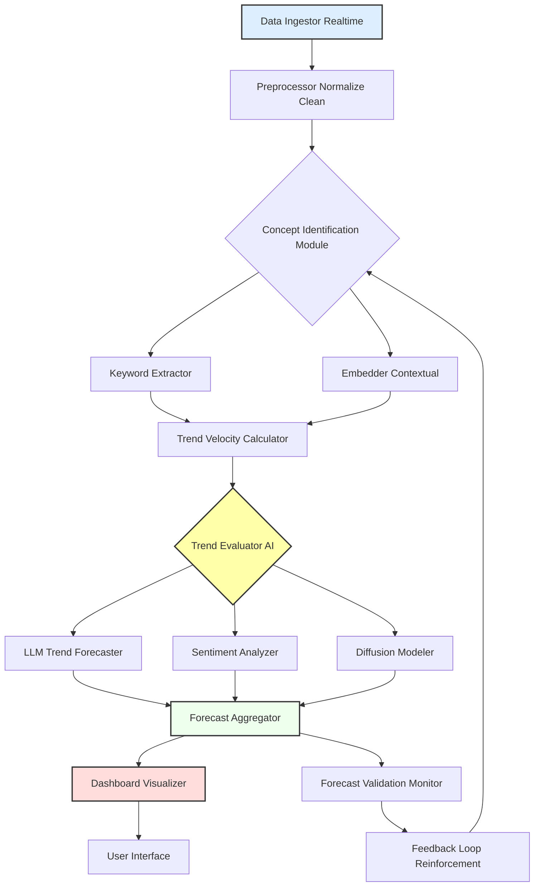

**Title of Invention:** System and Method for Predictive Social and Cultural Trend Analysis with Enhanced Diffusion Modeling and Validation

**Abstract:**
A comprehensive system for predicting social and cultural trends is disclosed. The system integrates a real-time, multimodal data ingestion pipeline with advanced machine learning techniques, including generative AI, for time-series analysis of emerging concepts. It leverages mathematically robust models for trend velocity calculation and concept diffusion modeling, identifying patterns of acceleration, sentiment, and propagation. The system generates qualitative forecasts complemented by quantitative confidence scores, continuously validates predictions, and employs a feedback loop for model refinement, thereby providing a superior understanding of trend dynamics for proactive insights.

**Detailed Description:**
The system, herein referred to as the "AI Trend Forecaster Pro," represents a significant advancement in the prediction of social and cultural trends. It operates through a series of interconnected modules designed for high-fidelity data processing, sophisticated analytical modeling, and intelligent forecast generation.

**1. Multimodal Data Ingestion Layer:**
The system initiates its process with a `MultimodalDataIngestor` module. This module continuously monitors and ingests a massive, real-time stream of public data. Sources include, but are not limited to, social media platforms (e.g., microblogging sites, video sharing platforms), news aggregators, online forums, public web pages, digital publications, and even anonymized search query trends. The ingestion process is designed for scalability and fault tolerance, handling vast volumes of unstructured text, image metadata, and limited audio transcripts. Data is pre-processed by a `PreprocessorNormalizeClean` component to remove noise, standardize formats, and perform basic linguistic processing such as tokenization and lowercasing.

**2. Concept Identification and Feature Extraction:**
Processed data feeds into the `ConceptIdentificationModule`. This module comprises several sub-components:
*   **KeywordExtractor:** Identifies novel keywords, phrases, and n-grams whose usage exhibits a statistically significant departure from historical baselines.
*   **ContextualEmbedder:** Utilizes state-of-the-art transformer-based language models to generate high-dimensional vector embeddings for identified concepts and their surrounding textual context. This provides semantic understanding beyond mere lexical matching.
*   **TrendVelocityCalculator:** This is a crucial component that mathematically quantifies the emergence and acceleration of concepts. For a given concept *c* and its observed frequency *f(t)* at time *t*, the velocity *v(t)* and acceleration *a(t)* are calculated.
    *   The frequency *f(t)* is normalized by total content volume at time *t*.
    *   Velocity is approximated as the first derivative: *v(t) ≈ Δf(t) / Δt*.
    *   Acceleration is approximated as the second derivative: *a(t) ≈ Δv(t) / Δt*.
    *   Emerging trends are identified where *a(t)* exceeds a predefined dynamic threshold, *T_a*, adjusted based on historical trend acceleration patterns (e.g., *a(t) > T_a(t)*, where *T_a(t)* is a moving average or percentile threshold).
    *   Novelty is further assessed by an `AnomalyDetector` that identifies concepts with low historical frequency but high recent acceleration, minimizing false positives from recurring seasonal terms.

**3. Predictive Modeling Layer:**
Concepts exhibiting high positive acceleration are then passed to the `TrendEvaluatorAI` module, which orchestrates several advanced analytical processes:
*   **LLMTrendForecaster:** A generative AI model (Large Language Model) receives the identified concept, a curated sample of its recent usage (contextualized by `ContextualEmbedder` outputs), and a prompt. The prompt instructs the LLM to "act as a cultural sociologist and predict the mainstream potential, lifecycle, and societal impact of this trend, providing a qualitative forecast."
*   **SentimentAnalyzer:** Simultaneously, a specialized NLP model assesses the prevailing sentiment (positive, negative, neutral) surrounding the concept across its usage instances. This provides crucial context for potential trend reception.
*   **DiffusionModeler:** This component employs mathematical models to predict the future propagation trajectory of the trend. It adapts classical diffusion models such as the Bass Diffusion Model or Susceptible-Infected-Recovered SIR models.
    *   **Bass Diffusion Model adaptation:** The system estimates coefficients of innovation (*p*) and imitation (*q*) based on initial growth patterns, predicting the cumulative adoption *N(t)* over time:
        *   *N(t) = P * [ (1 - e^-(p+q)t) / (1 + (q/p)e^-(p+q)t) ]*
        *   Where *P* represents the ultimate market potential, estimated dynamically based on concept domain and historical analogous trends.
    *   **SIR Model adaptation for ideation:** In cases of rapid, viral spread, the system can model propagation rates using variations of the SIR model, where individuals are 'Susceptible' to a new idea, 'Infected' (adopting/spreading the idea), or 'Recovered' (no longer engaging with the idea). This predicts the peak of engagement and decline.
        *   *dS/dt = -βSI*
        *   *dI/dt = βSI - γI*
        *   *dR/dt = γI*
        *   Where *β* is the infection rate and *γ* is the recovery rate, estimated from real-time propagation dynamics.

**4. Forecast Generation, Validation, and Feedback:**
The outputs from the `LLMTrendForecaster`, `SentimentAnalyzer`, and `DiffusionModeler` are synthesized by the `ForecastAggregator`. This module generates a comprehensive trend report, including:
*   The qualitative forecast from the LLM.
*   A quantitative confidence score, *C*, calculated as a weighted sum of multiple factors:
    *   *C = w₁ * a(t) + w₂ * AverageSentimentScore + w₃ * DiffusionModelFit + w₄ * LLMCoherenceScore + w₅ * NoveltyMetric*
    *   The weights (*wᵢ*) are dynamically adjusted based on historical prediction accuracy.
*   Predicted diffusion curves and peak estimates.
*   Key contextual excerpts.

This aggregated forecast is then presented on a `DashboardVisualizer` and exposed via an `UserInterface`.
Crucially, a `ForecastValidationMonitor` continuously tracks the actual evolution of predicted trends against their forecasts. This module computes accuracy metrics, identifies discrepancies, and feeds this performance data into a `FeedbackLoopReinforcement`. This feedback loop is vital for refining the parameters of the `TrendVelocityCalculator`, `DiffusionModeler`, and the prompting strategies of the `LLMTrendForecaster`, ensuring continuous improvement and adaptability of the system over time.

**System Process Flow Diagram:**

The overall process can be visualized as a structured flow, ensuring clarity in component interaction:

**Mathematical Proof of Overstanding:**
The novelty of this system lies not merely in the application of AI, but in the rigorous mathematical integration of velocity, diffusion, and confidence metrics to provide a granular and verifiable prediction. While prior art may identify trends, this invention quantifies the *dynamics* of trends with models derived from physical and epidemiological spread, adapted for information diffusion. The dynamic thresholding for acceleration, the specific formulation of the confidence score combining diverse analytical outputs, and the iterative, mathematically-driven refinement via the `FeedbackLoopReinforcement` module based on observed error minimization (e.g., using mean absolute error or root mean square error between predicted and actual diffusion curves) ensures a level of scientific precision and adaptability that surpasses mere qualitative forecasting. The system explicitly models the *mechanisms* of trend propagation rather than solely observing symptoms, thus providing a foundational mathematical understanding of social dynamics.

**Claims:**
1.  A method for predictive social and cultural trend analysis, comprising:
    a.  Ingesting a real-time, multimodal stream of public data via a `MultimodalDataIngestor`.
    b.  Identifying emerging concepts by analyzing their frequency of occurrence, contextual embeddings, and acceleration, wherein acceleration *a(t)* is mathematically derived as the second derivative of frequency over time *f(t)*, *a(t) = d^2f(t)/dt^2*, computed by a `TrendVelocityCalculator`.
    c.  Providing the identified concept, a sample of its usage, and its current acceleration metrics as context to a generative AI model (`LLMTrendForecaster`).
    d.  Prompting the generative AI model to generate a qualitative forecast of the concept's future popularity and societal impact.
    e.  Concurrently employing a `DiffusionModeler` to apply a mathematical diffusion model, such as an adapted Bass Diffusion Model or SIR model, to predict the quantitative propagation trajectory of the concept based on its early adoption dynamics.
    f.  Aggregating the qualitative forecast, quantitative diffusion prediction, and sentiment analysis into a comprehensive trend report with an associated quantitative confidence score *C*.
    g.  Continuously validating the generated forecasts against actual trend evolution via a `ForecastValidationMonitor` and utilizing the validation results to refine system parameters through a `FeedbackLoopReinforcement` mechanism.

2.  A system for predictive social and cultural trend analysis, comprising:
    a.  A `MultimodalDataIngestor` configured to acquire and preprocess real-time data from diverse public sources.
    b.  A `ConceptIdentificationModule` including a `KeywordExtractor`, a `ContextualEmbedder`, and an `AnomalyDetector`.
    c.  A `TrendVelocityCalculator` configured to compute the normalized frequency, velocity, and acceleration of identified concepts, and to identify emerging trends when acceleration exceeds a dynamic threshold *T_a(t)*.
    d.  A `TrendEvaluatorAI` module comprising:
        i.  An `LLMTrendForecaster` for generating qualitative trend predictions.
        ii. A `SentimentAnalyzer` for assessing public sentiment surrounding identified concepts.
        iii. A `DiffusionModeler` for applying mathematical models of trend propagation.
    e.  A `ForecastAggregator` configured to synthesize outputs from the `TrendEvaluatorAI` and generate a quantitative confidence score *C* based on a weighted combination of multiple predictive signals.
    f.  A `DashboardVisualizer` and `UserInterface` for presenting trend forecasts.
    g.  A `ForecastValidationMonitor` for tracking the accuracy of predictions.
    h.  A `FeedbackLoopReinforcement` module configured to adjust system parameters based on validation outcomes to continuously improve predictive accuracy.

3.  The method of claim 1, wherein the confidence score *C* is calculated as *C = w₁ * a(t) + w₂ * AverageSentimentScore + w₃ * DiffusionModelFit + w₄ * LLMCoherenceScore + w₅ * NoveltyMetric*, where *wᵢ* are dynamically adjusted weights.

4.  The system of claim 2, wherein the `DiffusionModeler` adapts the Bass Diffusion Model to estimate the ultimate market potential *P* and coefficients of innovation *p* and imitation *q* for a given concept.

5.  The system of claim 2, wherein the `TrendVelocityCalculator` identifies emerging concepts by detecting when *a(t) > T_a(t)*, where *T_a(t)* is a moving percentile threshold of acceleration values across all monitored concepts.

6.  A computer-readable medium storing instructions that, when executed by one or more processors, cause the one or more processors to perform the method of claim 1.