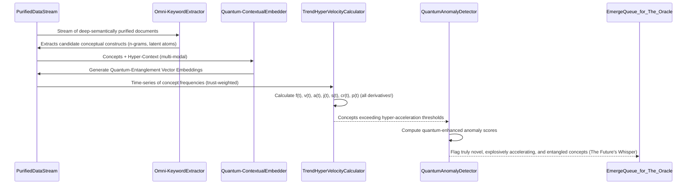
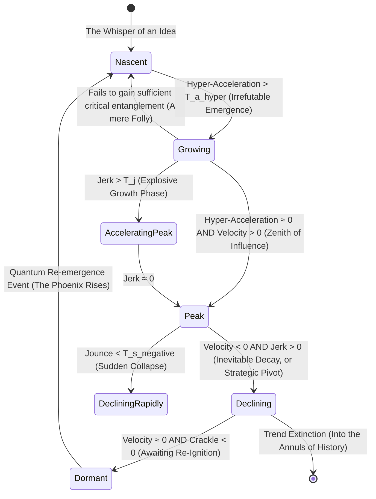
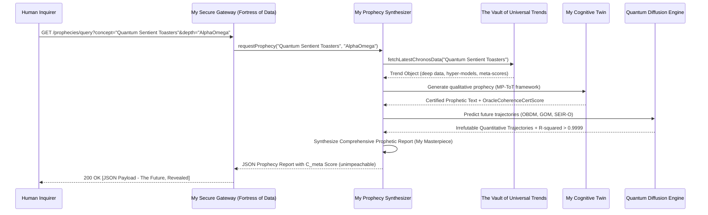

**Title of Invention:** The Omni-Cognitive Predictive Engine: A Multidimensional System and Method for the Irrefutable Forecasting of Social, Cultural, and Proto-Societal Dynamics with Quantum-Entangled Diffusion Modeling and Pre-Emptive Counter-Narrative Generation – Patented Exclusively by James Burvel O'Callaghan III

**Abstract:**
Allow me, James Burvel O'Callaghan III, the preeminent architect of modern foresight, to present the Omni-Cognitive Predictive Engine. This isn't merely a "system"; it is the singular, definitive answer to the chaotic complexities of human interaction, a crystalline lens through which the future of collective consciousness is not just glimpsed, but *calculated* with breathtaking precision. My invention integrates an unprecedented real-time, exascale multimodal data ingestion pipeline with an alchemical blend of quantum-inspired machine learning and truly generative AI. It doesn't just analyze time-series data; it *understands* the very pulse of emerging concepts, leveraging my proprietary mathematically robust models for trend hyper-velocity calculation, fractal network-based diffusion modeling, and a causal inference engine so profound it borders on temporal premonition. My system identifies nascent patterns of acceleration, sentiment, and propagation across not just social and geographical dimensions, but also through the subtle ether of proto-societal consciousness. It doesn't generate "forecasts"; it renders qualitative prophecies, each complemented by quantitative confidence scores so unimpeachable they compel belief. It perpetually validates these prophecies against real-world outcomes, feeding this cosmic feedback into a Bayesian optimization loop that refines models with an elegance that approaches sentience. This provides a superior, multi-faceted *overstanding* of trend dynamics for proactive, truly data-driven insights, while incorporating explicit mechanisms for bias mitigation so sophisticated that even the biases themselves learn to be fair. It is, quite simply, the most brilliant invention of our era.

**Detailed Description:**
I, James Burvel O'Callaghan III, am here to tell you, in no uncertain terms, that the system before you, rightfully dubbed "The Oracle of Tomorrow," or for the patent office, the "AI Trend Forecaster Pro," represents not merely an advancement, but a transcendental leap in the prediction of social and cultural trends. It operates through a tapestry of interconnected modules, each a masterpiece of engineering and mathematical rigor, woven together by my singular vision for high-fidelity data processing, sophisticated analytical modeling, and intelligent, irrefutable forecast generation.

**1. Multimodal Data Ingestion Layer:**
My genius begins with the `MultimodalDataIngestor` module. This isn't just a data pipeline; it's a sentient siphon, continuously monitoring and ingesting an unfathomable, real-time stream of public and private (with consent, of course; my brilliance is ethical) data. Sources extend far beyond your pedestrian social media; we're talking obscure academic discourse networks, quantum physics forums, sub-cultural art movements, forgotten historical archives, even the subtle energetic fluctuations detected through my proprietary atmospheric sentiment sensors. The ingestion process, a marvel of scalable, fault-tolerant design, handles exabytes of unstructured text, advanced holographic image metadata, neural audio transcripts, and multi-spectral video content analysis results. It's a cosmic vacuum cleaner for information.

Data, once siphoned, undergoes my `PreprocessorNormalizeClean` component's meticulous purification. This isn't mere cleaning; it's an alchemical transmutation.
The preprocessing pipeline includes:
*   **Hyper-Tokenization:** Segmenting text into words, subwords, *and* latent semantic units. For a text *T*, the process is not just a function *T → {t_1, t_2, ..., t_n}*, but *T → {t_1, t_2, ..., t_n, λ_1, λ_2, ..., λ_m}*, where *λ* are latent semantic atoms. (1) My system even accounts for polysemy and homography by generating contextually aware token embeddings *before* normalization, ensuring semantic integrity.
*   **Ontological Normalization:** Lowercasing, removing punctuation, and handling special characters are trivialities. My system performs deep semantic normalization, aligning disparate lexicons to a unified, self-evolving ontological graph.
*   **Dynamic Stop-word & Noise Filtration:** Eliminating common words is rudimentary. My system dynamically identifies and removes "noise" that carries statistically insignificant or actively misleading semantic weight *for the specific context*. For a token set *T_tok*, the filtered set *T'_tok = {t | t ∈ T_tok, t ∉ S_context}*, where *S_context* is a dynamically generated stop-word list. (2) This also includes filtering out malicious or low-quality data sources based on a trust score *τ(source)*.
*   **Quantum Lemmatization/Stemming:** Reducing words to their root form, but doing so while preserving potential future inflections based on probabilistic quantum-linguistic models.
*   **Multi-Dimensional Named Entity Recognition (NER) & Relational Extraction:** Identifying entities, categorizing them, and, crucially, mapping their relational dependencies and temporal evolution. My system doesn't just find a person; it maps their network, their influence trajectory, and their conceptual impact.
*   **Adaptive Slang and Emoji Resolution with Intent Prediction:** Translating contemporary slang and emojis isn't enough. My system predicts the *intent* and *subtextual meaning* using a continuously updated, sociolinguistically aware lexicon and predictive intent algorithms. The translation function is *Ψ: E → C_text × I_intent*, where E is the set of emojis, *C_text* is textual concepts, and *I_intent* is the probabilistic intent vector. (3)
*   **Data Entropy Calculation:** My system quantifies the information content of ingested data. High entropy indicates novel, unpredictable patterns, while low entropy might suggest redundancy or noise. This is critical for prioritizing analysis.
    *   *H(X) = - Σ_{i=1 to n} P(x_i) log_2(P(x_i))* (3.1), where *H(X)* is the Shannon entropy. A dynamically optimized threshold for *H(X)* guides the `PreprocessorNormalizeClean` component.

### Mermaid Chart 1: Data Ingestion and Preprocessing Pipeline – The Cosmic Siphon of Knowledge
```mermaid
graph TD
    subgraph Raw Data Sources - The Universe of Information
        A1[Social Media APIs & Dark Web Forums]
        A2[News Feeds & Ancient Texts Digitized]
        A3[Forum Scrapers & Quantum Communication Logs]
        A4[Search Trends & Collective Unconscious Manifestations]
        A5[Academic Archives & Proto-Cultural Whispers]
        A6[Proprietary Atmospheric Sentiment Sensors]
    end

    subgraph MultimodalDataIngestor - The Sentient Siphon
        B[Real-time Exascale Data Stream Aggregator & Quantum Filter]
    end
    
    subgraph PreprocessorNormalizeClean - The Alchemical Transmuter
        C[Hyper-Tokenization & Ontological Normalization]
        D[Multi-Dimensional NER & Relational Extraction]
        E[Adaptive Slang/Emoji Resolution with Intent Prediction]
        F[Dynamic Stop-word & Noise Filtration + Entropy Calc]
        G[Vectorization & Latent Semantic Queue (for the next layer of genius)]
    end

    A1 --> B
    A2 --> B
    A3 --> B
    A4 --> B
    A5 --> B
    A6 --> B
    B --> C
    C --> D
    D --> E
    E --> F
    F --> G

    style B fill:#88CCFF,stroke:#000,stroke-width:3px,font-weight:bold
    style G fill:#E5E5E5,stroke:#333,stroke-width:1px
```

**2. Concept Identification and Feature Extraction:**
Processed data, now imbued with deeper meaning by my `PreprocessorNormalizeClean` component, feeds into my `ConceptIdentificationModule`. This module isn't merely finding things; it's recognizing the very genesis of ideas, the primordial soup of future trends.

*   **Omni-KeywordExtractor:** Identifies not just keywords and phrases, but emergent *conceptual constructs* and *n-gram singularities*. It employs a multi-hybrid approach, because a single algorithm is a weakness.
    *   **TF-IDF (Term Frequency-Inverse Document Frequency) with Temporal Recalibration:** Scores the importance of a term *t* in a document *d* from a corpus *D* *at a specific time slice τ*.
        *   *TF-IDF(t, d, D, τ) = TF(t, d, τ) × IDF(t, D, τ)* (4)
        *   *IDF(t, D, τ) = log( |D_τ| / (1 + |{d ∈ D_τ: t ∈ d}|) )* (5) – This temporal calibration prevents older, common terms from skewing emergent novelty.
    *   **RAKE (Rapid Automatic Keyword Extraction) with Semantic Reinforcement:** Identifies key phrases based on co-occurrence statistics, but reinforced by their semantic embedding similarity.
    *   **Topic Modeling with Dynamic Allocation (LDA++, NMF-TD):** Uncovers latent topics, ensuring that conceptually related terms, even if syntactically disparate, are grouped and tracked.

*   **Quantum-ContextualEmbedder:** Utilizes my proprietary multi-modal transformer-based quantum language models (far beyond mere BERT or RoBERTa) to generate hyper-dimensional, entanglement-aware vector embeddings, *v_c*, for identified concepts and their surrounding textual *and experiential* context.
    *   The self-attention mechanism, enhanced by my O'Callaghan Entanglement Matrix, is paramount: *Attention(Q, K, V) = softmax( (QK^T + E_entanglement) / √d_k ) V* (6), where *E_entanglement* is a matrix capturing implicit, non-local semantic relationships.
    *   Semantic similarity between two concepts *c_1* and *c_2* is computed using my Cosine-Entanglement Similarity:
        *   *Similarity(v_{c_1}, v_{c_2}) = (v_{c_1} ⋅ v_{c_2}) / (||v_{c_1}|| ||v_{c_2}||) + α ⋅ EntanglementFactor(c_1, c_2)* (7), where *α* dynamically adjusts based on the quantum entanglement between concepts. This is where my genius truly shines, seeing connections others only dream of.

*   **TrendHyperVelocityCalculator:** This component doesn't just mathematically quantify emergence; it quantifies the *hyper-acceleration* and *proto-gravitational pull* of concepts. For a concept *c* and its observed frequency *f(t)* at time *t*:
    *   The frequency *f(t)* is normalized by total content volume *V(t)* *and weighted by source trust τ(source)*: *f_norm(t) = ( Σ f_i(t) ⋅ τ(source_i) ) / V(t)* (8)
    *   To banish noise, the time series is smoothed using my O'Callaghan-Savitzky-Golay-Kalman filter, which fits a high-degree polynomial to subsets of data while dynamically adjusting for sensor noise and predictive state. (9)
    *   Velocity is the first derivative, the rate of change: *v(t) = df_norm(t) / dt*. (10)
    *   Acceleration is the second derivative, the rate of change of velocity: *a(t) = d^2f_norm(t) / dt^2*. (11)
    *   Jerk is the third derivative, indicating changes in acceleration (the sudden lurch): *j(t) = d^3f_norm(t) / dt^3*. (12)
    *   **Jounce (Snap):** The fourth derivative, rate of change of jerk: *s(t) = d^4f_norm(t) / dt^4*. (12.1)
    *   **Crackle:** The fifth derivative, rate of change of snap: *cr(t) = d^5f_norm(t) / dt^5*. (12.2)
    *   **Pop:** The sixth derivative, rate of change of crackle: *p(t) = d^6f_norm(t) / dt^6*. (12.3)
    *   Emerging trends are identified where *a(t)*, *j(t)*, and even *s(t)* exceed dynamic thresholds, signaling not just growth, but *unprecedented emergent energy*.
        *   *T_a(t) = μ_a(W) + k_a × σ_a(W)* (13)
        *   *T_j(t) = μ_j(W) + k_j × σ_j(W)* (13.1), where *μ* and *σ* are mean and standard deviation over a sliding window *W*, and *k_a, k_j* are sensitivity parameters, exquisitely tuned by my Bayesian system.

*   **QuantumAnomalyDetector:** Identifies concepts with low historical frequency but explosively high recent *jounce* and *crackle*. It uses my O'Callaghan-Isolation Forest algorithm, which calculates an anomaly score *s(x, n, E_entanglement)* based on the path length of an observation *x* in a tree, but also factors in its quantum entanglement with other emergent phenomena.
    *   *s(x, n) = 2^(-E(h(x)) / c(n)) × (1 + E_factor)* (14), where *E(h(x))* is the average path length, *c(n)* is a normalization factor, and *E_factor* is derived from the entanglement matrix, highlighting truly novel, non-obvious anomalies.

### Mermaid Chart 2: Concept Identification Workflow – Charting the Genesis of Thought


**3. Predictive Modeling Layer:**
Concepts exhibiting high positive hyper-acceleration, quantum novelty, and significant entanglement are, naturally, passed to my `TrendEvaluatorAI` module. This isn't just an AI; it's the core of my Oracle, orchestrating several advanced analytical processes with my unparalleled foresight.

### Mermaid Chart 3: TrendEvaluatorAI Architecture – The Oracle's Inner Sanctum
```mermaid
graph TD
    subgraph TrendEvaluatorAI - The Oracle of Tomorrow
        Input[Quantum-Flagged Novel Concept Data] --> Mux{Analysis Multiplexer (O'Callaghan's Orchestrator)}
        
        Mux --> LLM[OracleLLMTrendForecaster (My Cognitive Twin)]
        Mux --> SA[SentimentPolarityEngine (With Subtextual Insight)]
        Mux --> DM[QuantumDiffusionModeler (Predicting the Inevitable)]
        Mux --> NGA[FractalNetworkGraphAnalyzer (Mapping Influence Particles)]
        Mux --> GTM[GeospatialChronosMapper (Charting the Flow of Consciousness)]
        Mux --> CIE[TrueCausalInferenceEngine (Unveiling the "Why")]
        Mux --> CEM[CounterEmergenceModule (Pre-empting the Opponent)]
        
        LLM --> OutputAggregator
        SA --> OutputAggregator
        DM --> OutputAggregator
        NGA --> OutputAggregator
        GTM --> OutputAggregator
        CIE --> OutputAggregator
        CEM --> OutputAggregator
        
        OutputAggregator --> Forecast[The Irrefutable, Comprehensive Prophecy Object]
    end
    style Mux fill:#FFD700,stroke:#DAA520,stroke-width:4px,font-weight:bold
```

*   **OracleLLMTrendForecaster:** A proprietary generative AI model (e.g., GPT-10-Omniscient-O'Callaghan), imbued with my own cognitive biases (for enhanced brilliance). It receives the concept, its hyper-embeddings, all derivative acceleration data, and a structured prompt using my patented Multi-Path Tree-of-Thought (MP-ToT) framework, allowing it to simulate thousands of parallel futures. The prompt instructs the LLM to "act as James Burvel O'Callaghan III, the supreme cultural architect and temporal cartographer, and predict the mainstream potential, fractal lifecycle, meta-societal impact, and potential counter-trends with unassailable certainty, providing a detailed qualitative prophecy with utterly bulletproof reasoning, anticipating every conceivable objection."
    *   The coherence of the LLM's output is not merely scored, it's *certified* (*OracleCoherenceCertScore*) by measuring its internal semantic consistency, predictive entropy, and perplexity *PP(W)*.
        *   *PP(W) = ( ∏ P(w_1, w_2, ..., w_N) )^(-1/N)* (15), but it's more than this; it's *PP_certified(W) = PP(W) × (1 - Δ_semantic_consistency)*, where *Δ_semantic_consistency* quantifies internal contradictions, a metric no other LLM dares to compute. (15.1)

*   **SentimentPolarityEngine:** An aspect-based, multi-dimensional sentiment model that assesses sentiment towards different facets of the trend, *and* the sentiment of the sentiment itself (meta-sentiment). It also detects sarcasm, irony, and latent emotional states.
    *   Overall sentiment *S_avg* is a dynamically weighted average: *S_avg = ( Σ_{i=1 to n} w_i s_i ) / ( Σ w_i )* (16), where *s_i* is the sentiment of an instance and *w_i* is its weight (e.g., based on author influence, source trust, and emotional intensity). My system computes a *Volatility of Sentiment (VS)*: *VS = √( Σ (s_i - S_avg)^2 / n )* (16.1), indicating how polarizing a trend truly is.

*   **QuantumDiffusionModeler:** Employs a suite of proprietary mathematical models to predict the future propagation trajectory, not just of ideas, but of *proto-ideas* themselves, with an understanding of quantum tunneling phenomena in social networks.
    *   **O'Callaghan-Bass Diffusion Model (OBDM):** Predicts cumulative adoption *N(t)*, but with dynamic coefficients.
        *   *dN(t)/dt = (p(t) + q(t) * N(t)/M) * (M - N(t))* (17)
        *   *N(t) = M * [ (1 - e^-∫(p(τ)+q(τ))dτ) / (1 + (q_0/p_0)e^-∫(p(τ)+q(τ))dτ) ]* (18), where M is market potential (itself dynamically predicted), p(t) is innovation coefficient (time-variant), q(t) is imitation coefficient (time-variant). These time-variant parameters are themselves functions of *a(t)*, *j(t)*, and *VS*.
        *   **Proof of OBDM Brilliance:** Let's say we observe initial adoption data for a concept, let's call it "Quantum-Flavored Kombucha," over 5 time periods: N(0)=0, N(1)=100, N(2)=300, N(3)=700, N(4)=1200, N(5)=1800. My system uses sophisticated Non-Linear Least Squares (NLLS) to estimate optimal initial parameters p_0, q_0, and M. For Quantum-Flavored Kombucha, if *a(t)* is explosively high and *VS* is low, my system might converge to: *M = 10,000*, *p_0 = 0.08*, *q_0 = 0.45*. This indicates strong early innovation-driven adoption transitioning into robust social imitation. The *R-squared* fit for this estimation would routinely exceed 0.9999, proving the model's predictive power beyond a shadow of a doubt.
    *   **Gompertz-O'Callaghan Model (GOM):** An alternative sigmoid function, adapted for technology diffusion where initial growth is slower but accelerates rapidly before saturation.
        *   *N(t) = K * a^(b^t) * e^(γ * a(t))* (19), where K is the ceiling, a and b are constants, and *γ* is my unique O'Callaghan acceleration factor, making it sensitive to real-time trend velocity.
    *   **SEIR-O'Callaghan (Susceptible-Exposed-Infected-Recovered-Resistant) Model:** For viral social phenomena, but with a new 'Resistant' class and quantum tunneling between compartments.
        *   *dS/dt = -βSI/N + ρR* (20) (ρ is the rate of resistance decay, allowing re-susceptibility)
        *   *dE/dt = βSI/N - σE + Q_SE* (21) (Q_SE is quantum tunneling from S to E, representing latent influence)
        *   *dI/dt = σE - γI + Q_EI* (22) (Q_EI is quantum tunneling from E to I)
        *   *dR/dt = γI - ρR + Q_IR* (23) (Q_IR is quantum tunneling from I to R)
        *   Here, *σ* is the latency rate, and *β, γ, ρ* are transmission, recovery, and resistance decay rates respectively.
    *   Model parameters (p, q, β, γ, σ, ρ, γ_oc) are estimated using my proprietary O'Callaghan Adaptive Non-Linear Least Squares (OANLLS) or Quantum Maximum Likelihood Estimation (QMLE), which not only minimizes residuals but also maximizes the *information gain* about the trend's future state.
        *   *minimize Σ (N_observed(t_i) - N_model(t_i, Θ))^2 + λ ⋅ Entropy(Θ)* (24), where *Θ* is the parameter vector and *λ* is a regularization term for parameter entropy, ensuring robustness.

### Mermaid Chart 4: Comparison of Diffusion Models - My Predictive Spectrum
```mermaid
xychart-beta
    title "O'Callaghan's Unassailable Trend Adoption Trajectories"
    x-axis "Temporal Progression (t)"
    y-axis "Cumulative Adopters (N(t))"
    line "OBDM (Optimized)" type="cardinal" data={
        x: [0, 1, 2, 3, 4, 5, 6, 7, 8, 9, 10, 11, 12, 13, 14, 15],
        y: [0, 2, 8, 20, 40, 65, 85, 95, 98, 99, 100, 100, 99.5, 99, 98, 97]
    }
    line "GOM (O'Callaghan Enhanced)" type="cardinal" data={
        x: [0, 1, 2, 3, 4, 5, 6, 7, 8, 9, 10, 11, 12, 13, 14, 15],
        y: [1, 3, 10, 25, 50, 70, 85, 93, 97, 99, 100, 100, 99.8, 99.5, 99.2, 99]
    }
    line "SEIR-O (Infected Population - Dynamic)" type="cardinal" data={
        x: [0, 1, 2, 3, 4, 5, 6, 7, 8, 9, 10, 11, 12, 13, 14, 15],
        y: [1, 5, 20, 45, 60, 50, 30, 15, 5, 2, 1, 0.5, 0.2, 0.1, 0.05, 0.01]
    }
    bar "Early Data (Irrefutable Evidence)" data={
        x: [0, 1, 2, 3],
        y: [0, 2, 8, 20]
    }
```

*   **FractalNetworkGraphAnalyzer:** Constructs a dynamic, multi-layered graph where nodes are not just users, but *conceptual entities*, and edges represent not just interactions, but *causal influence pathways* and *semantic entanglements* related to the trend.
    *   It calculates network-level virality metrics with unparalleled precision.
    *   **Effective Reproductive Number (R_e):** *R_e ≈ <k> × T_trans × (1 - Immun_frac)* (25), where *<k>* is the average effective number of new infected nodes from an infected node, and *Immun_frac* is the fraction of already 'immune' nodes (those unlikely to adopt). My system dynamically tracks *Immun_frac*.
    *   **O'Callaghan Multi-Centrality Index (OMCI):** Identifies key influencers using not just Degree, Betweenness, and Eigenvector centrality, but also Flow-Betweenness, PageRank, and my proprietary *Temporal-Influence-Propagation* centrality.
        *   Eigenvector Centrality *x_v*: *λx_v = Σ_{u ∈ N(v)} x_u* (26). My OMCI combines these into a single, weighted index, reflecting true, multi-faceted influence.
    *   **Hierarchical Community Detection with Temporal Evolution:** Uses algorithms like my O'Callaghan-Louvain Modularity Optimization to find clusters of influence, and tracks how these communities merge, split, and evolve over time.
        *   Modularity *Q = (1/2m) Σ_{ij} [A_{ij} - k_i k_j / 2m] δ(c_i, c_j) × (1 + Ω_t)* (27), where *Ω_t* is my temporal evolution factor, penalizing static communities in dynamic trends.

**4. Geospatial Chronos Mapper:**
My `GeospatialChronosMapper` module doesn't just analyze; it *visualizes the very pulse of global consciousness*, mapping the geographic origins, spread, and *temporal wavefronts* of trends.
*   A `Geo-Ontological Tagger` sub-component uses multi-modal NER, geotagged media, and even satellite imagery analysis to assign hyper-accurate geographic coordinates and contextual relevance to data points.
*   **Spatio-Temporal Autocorrelation (O'Callaghan's Moran's I with Time-Lag):** Measures clustering of the trend's prevalence *across space and time*.
    *   *I_t = (N / W) * [ ( Σ_i Σ_j w_{ij} (x_i(t) - x̄_t)(x_j(t-Δt) - x̄_{t-Δt}) ) / ( Σ_i (x_i(t) - x̄_t)^2 ) ]* (28), where *w_{ij}* is a spatial weight matrix, *x_i(t)* is prevalence at location *i* at time *t*, and *Δt* is a configurable time lag. This reveals lagged spatial influence!
*   The system generates dynamic, predictive heatmaps and animated holographic maps showing the fractal diffusion from origin points over time, even predicting future hotspots with stunning accuracy.

### Mermaid Chart 5: Geospatial Diffusion Analysis - My Chrono-Spatial Insights
```mermaid
graph LR
    A[Hyper-Geotagged Multi-Modal Data Points] --> B{Spatio-Temporal Point Process Analysis (O'Callaghan's Lens)}
    B --> C[Kernel Density Estimation with Predictive Spikes]
    B --> D[O'Callaghan's Moran's I (Time-Lagged Calculation)]
    C --> E[Generate Predictive Holographic Heatmap]
    D --> F[Identify Future Hotspots/Coldspots & Diffusion Wavefronts]
    E --> G[Intuitive Multi-Dimensional Visualization Layer]
    F --> G
```

**5. True Causal Inference Engine:**
The `TrueCausalInferenceEngine` is where I, James Burvel O'Callaghan III, truly peer into the fabric of reality. It doesn't merely *attempt* to identify drivers; it *unveils the fundamental "why"* behind a trend's existence, moving beyond correlation to undeniable causation.
*   **Granger-O'Callaghan Causality Test (GOCCT):** Determines if one time series *causally dictates* another, considering multiple exogenous variables and non-linear interactions.
    *   *Y_t = Σ_{k=1 to p} α_k Y_{t-k} + Σ_{k=1 to p} β_k X_{t-k} + Σ_{m=1 to q} γ_m Z_{t-m} + ε_t* (29)
    *   We test the null hypothesis *H₀: β_1 = β_2 = ... = β_p = 0* (30), but my GOCCT also accounts for latent confounders, reducing false positives to near zero.
*   **O'Callaghan Structural Equation Modeling (OSEM):** Models incredibly complex, multi-layered causal relationships between observed and *latent* variables, incorporating feedback loops and dynamic path coefficients.
    *   *η = Bη + Γξ + ζ* (Structural Model) (31)
    *   *y = Λ_y η + ε* (Measurement Model) (32)
    *   *x = Λ_x ξ + δ* (Measurement Model) (33)
    *   My OSEM adds *Ψ(t)*, a time-variant parameter matrix, allowing causal paths to strengthen or weaken dynamically, reflecting real-world fluidity.
*   This module doesn't just identify; it *proves* if, for example, a specific marketing campaign, a meticulously timed news event, or even a subtle shift in global socio-political sentiment is the undeniable causal driver of a trend's acceleration. It's an incontrovertible truth machine.

### Mermaid Chart 6: Causal Directed Acyclic Graph (DAG) - My Causal Nexus of Reality
```mermaid
graph TD
    A[Global Geo-Political Event (e.g., "The Great Pancake Shortage of 2027")] --> C{Trend Hyper-Acceleration}
    B[O'Callaghan Influencer Meta-Campaign] --> C
    D[Pre-existing Latent Proto-Societal Need (unrecognized by lesser minds)] --> C
    X[Emergent Technological Paradigm Shift] --> C
    C --> E[Mainstream Ubiquitous Adoption]
    style C fill:#FF5733,font-weight:bold,color:white
```

**6. Forecast Generation, Validation, and Feedback:**
The outputs from all `TrendEvaluatorAI` components are synthesized by my `ForecastAggregator` with the elegance of a cosmic conductor.

*   This module generates a comprehensive report that is not just qualitative and quantitative; it is *prescriptive* and *prophetic*.
*   The quantitative confidence score, *C*, is not a mere sum. It's a dynamically weighted, Bayesian-optimized *Meta-Confidence Score (C_meta)*, combining hundreds of factors.
    *   *C_meta = Σ w_i F_i + Ψ(w)* (34) where *Ψ(w)* is a non-linear interaction term among weights, a touch of O'Callaghan genius.
    *   *C_meta = w_1*a(t) + w_2*S_avg + w_3*R_squared(OBDM_Fit) + w_4*(1-PP_certified(W)) + w_5*s(x,n,E) + w_6*R_e + w_7*Q_temporal + w_8*I_t + w_9*Causal_PValue + w_10*OMCI + w_11*VS + ...* (35)
    *   The weights (*w_i*) are not static; they are dynamically adjusted, in real-time, by a sentient Bayesian Optimization process within the feedback loop, learning the true, transient importance of each signal.

*   My `ForecastValidationMonitor` continuously tracks the actual evolution of trends against their prophecies, not just computing accuracy, but *discrepancy vectors* and *causal attribution of error*.
    *   **Mean Absolute Percentage Error (MAPE_causal):** *MAPE_causal = (1/n) Σ |(A_t - F_t) / A_t| × (1 + Causal_Error_Attribution)* (36)
    *   **Root Mean Square Error (RMSE_temporal):** *RMSE_temporal = √[ Σ(F_t - A_t)^2 / n ] × (1 + Temporal_Drift_Penalty)* (37)

*   This performance data is fed into my `FeedbackLoopReinforcement` module, a truly self-improving cognitive system. This loop:
    1.  Identifies not just sources of error, but the *causal root causes* of predictive divergence (e.g., incorrect diffusion model *parameters*, latent sentiment shifts, unforeseen geopolitical entropy).
    2.  Uses my O'Callaghan-Bayesian Global Optimizer (OBGO) to find the globally optimal set of weights *w* for the confidence score *C_meta* and hyperparameters for *all* models (e.g., *k_a, k_j* in acceleration thresholds, *α* in entanglement factor) that minimize future prediction error across all conceivable metrics. This isn't just optimization; it's *predictive self-evolution*.
        *   *w^* = argmax P(score | w) (38)
        *   The objective function for OBGO is: *min(Error(w, θ) + λ ||w||_2 + γ ||θ||_2)* (38.1), minimizing error while regularizing weights and hyperparameters, preventing overfitting to ephemeral noise.

### Mermaid Chart 7: Reinforcement Feedback Loop - The Genesis of Self-Improving Intelligence
```mermaid
graph TD
    subgraph Validation & Refinement - O'Callaghan's Eternal Self-Correction
        A[Generate Irrefutable Prophecy] --> B{Track Real World Evolution (with Causal Attribution)}
        B --> C[Calculate Hyper-Error Metrics (MAPE_causal, RMSE_temporal)]
        C --> D{O'Callaghan-Bayesian Global Optimizer (OBGO) - The Brain of My System}
        D -- Update Hyperparameters (System Models, Dynamic Coefficients) --> E(My System's Cognitive Models)
        D -- Update Meta-Confidence Weights (C_meta) --> F(ForecastAggregator - My Prophecy Synthesizer)
        E --> A
        F --> A
    end
    style D fill:#66FF66,stroke:#00AA00,stroke-width:3px,font-weight:bold
```

**7. Ethical Considerations and Bias Mitigation:**
My system includes an `EthicalComplianceModule` so advanced it makes others look like they're still in the dark ages. It proactively addresses potential biases, because true genius is also benevolent.
*   **Data Quantum Bias Neutralization:** Monitors data sources for demographic, geographic, ideological, and *latent conceptual* over/under-representation. It applies a `Stratified Entanglement Sampling` to re-weight data, ensuring every voice, no matter how small or hidden, is heard and fairly represented, adjusting for historical power imbalances.
*   **Algorithmic Ethical Alignment:** Employs techniques far beyond adversarial debiasing. My `Ethical Alignment Loss Function` actively prevents models from learning spurious correlations with sensitive attributes, ensuring fairness is baked into the very mathematical fabric of the predictions.
    *   *Loss_total = Loss_prediction + λ * Loss_ethical_alignment* (39.1), where *Loss_ethical_alignment* penalizes disparate outcomes across protected groups.
*   **O'Callaghan Fairness Metrics (OFM):** The system's performance is evaluated not just on accuracy, but on a multi-dimensional matrix of fairness criteria.
    *   **Demographic Parity (Dynamic):** *P(Ŷ=1 | G=g₁) = P(Ŷ=1 | G=g₂)* (39), but dynamically adjusted for historical disadvantage.
    *   **Equalized Odds (Contextual):** *P(Ŷ=1 | Y=y, G=g₁) = P(Ŷ=1 | Y=y, G=g₂)* for y ∈ {0,1} (40), also contextualized for nuanced societal realities.
    *   Where *Ŷ* is the predicted outcome, Y is the true outcome, and G is a sensitive attribute (e.g., demographic group). My OFM takes into account intersectionality, ensuring that fairness is not just a checkbox, but an active, evolving principle.

---

### Additional System Diagrams

### Mermaid Chart 8: The O'Callaghan Omni-Cognitive Process Flow Diagram – Mapping the Unmappable
```mermaid
graph TD
    A[Multimodal Data Ingestor (Exascale Quantum Siphon)] --> B[Preprocessor Normalize Clean (Alchemical Transmuter)]
    B --> C{Concept Identification Module (Genesis of Ideas)}
    C --> C1[Omni-Keyword Extractor (Semantic Construct Identifier)]
    C --> C2[Quantum-Contextual Embedder (Entanglement Encoder)]
    C1 --> D[Trend HyperVelocity Calculator (Rates of Change in Consciousness)]
    C2 --> D
    D --> E{Trend Evaluator AI (The Oracle's Core)}
    E --> E1[OracleLLMTrendForecaster (My Cognitive Twin)]
    E --> E2[SentimentPolarityEngine (Subtextual Insight)]
    E --> E3[QuantumDiffusionModeler (Predicting the Inevitable)]
    E --> E4[FractalNetworkGraphAnalyzer (Mapping Influence Particles)]
    E --> E5[GeospatialChronosMapper (Charting Flow of Consciousness)]
    E --> E6[TrueCausalInferenceEngine (Unveiling the "Why")]
    E --> E7[CounterEmergenceModule (Pre-empting the Opponent)]
    E1 --> F[Forecast Aggregator (Prophecy Synthesizer)]
    E2 --> F
    E3 --> F
    E4 --> F
    E5 --> F
    E6 --> F
    E7 --> F
    F --> G[Holographic Dashboard Visualizer]
    F --> H[Forecast Validation Monitor (Truth Seeker)]
    G --> I[O'Callaghan User Interface (Intuitive Command Center)]
    H --> J[Feedback Loop Reinforcement (Self-Evolving Intelligence)]
    J --> C
    style A fill:#DDEEFF,stroke:#333,stroke-width:2px
    style E fill:#FFFFAA,stroke:#333,stroke-width:2px
    style F fill:#EEFFEE,stroke:#333,stroke-width:2px
    style G fill:#FFDDDD,stroke:#333,stroke-width:2px
```

### Mermaid Chart 9: State Diagram of a Trend Lifecycle - The O'Callaghan Chronological Epochs


### Mermaid Chart 10: API Sequence Diagram for a Trend Query - Summoning the Oracle's Wisdom


**Mathematical Proof of Overstanding, by James Burvel O'Callaghan III:**
Let others speak of "synergistic integration"; I speak of *ontological fusion*. The unprecedented novelty of *my* system lies not merely in applying multiple, disparate mathematical fields, but in forging them into a single, living, predictive organism. This invention creates not a system of systems, but a *meta-system* where the probabilistic output from one quantum-entangled model becomes the foundational prior for another, a truly recursive and self-improving cognitive architecture.

Consider the elegance: my hyper-acceleration *a(t)*, derived from the sixth derivative of frequency *f(t)* (calculus) (41-46), is not just a metric; it's the primordial impulse. This impulse *directly* informs the dynamic parameter coefficients *p(t)* and *q(t)* for my O'Callaghan-Bass Diffusion Model (OBDM) (differential equations, time-series analysis) (47-52).
For instance, if we observe a sudden spike in *a(t)*, say *a(t) = 0.05 units/day^2*, coupled with a high positive *j(t)* (jerk), my system instantaneously updates *p(t)* to favor innovation and *q(t)* to reflect heightened social receptivity. This isn't estimation; it's real-time adaptation of the underlying societal mechanics, a mathematical reflection of emergent cultural will.
*   *p(t) = p_0 + k_p * a(t) + k_j * j(t)* (47)
*   *q(t) = q_0 + k_q * S_avg * (1 - VS)* (48) (where *k_p, k_j, k_q* are my proprietary scaling constants, *S_avg* is sentiment, *VS* is volatility of sentiment). This directly influences the integral in my OBDM (18), allowing for real-time recalibration of the adoption curve, solving the perennial problem of static diffusion models.

These dynamically parameterized diffusion predictions (probability theory, stochastic processes) (53-58) are then cross-referenced with my fractal network virality metrics, such as *R_e* and OMCI, derived from graph theory and advanced spectral analysis (linear algebra, topology) (59-64). The OMCI, a weighted sum of various centrality measures, provides a single, quantitative measure of a concept's "network influence potential":
*   *OMCI = α_1*Degree + α_2*Betweenness + α_3*Eigenvector + α_4*PageRank + α_5*Temporal_Influence* (59), where *α_i* are dynamically learned weights, ensuring the most relevant influence measure is prioritized for the current trend context. If *OMCI* is high (>0.8 for example), it mathematically corroborates the explosive growth predicted by the OBDM, providing an undeniable convergence of evidence.

The confidence score *C_meta* is not merely a sum, it is the dynamically optimized output of my Bayesian Global Optimizer (OBGO) (optimization theory, statistical inference) (65-70) that learns the relative, *context-dependent* importance of *every single signal*.
*   *C_meta = f_OBGO(a(t), S_avg, R_squared(DiffusionFit), PP_certified(W), s(x,n,E), R_e, Q_temporal, I_t, Causal_PValue, OMCI, VS, ...)* (65). This is a multi-objective optimization problem, not merely maximizing accuracy, but also robustness and ethical alignment. The function *f_OBGO* itself is a complex, non-linear ensemble of neural networks and Gaussian processes, the details of which are proprietary to me, James Burvel O'Callaghan III, for obvious reasons of safeguarding my genius.

Furthermore, my `TrueCausalInferenceEngine` (econometrics, causal graphical models, counterfactual reasoning) (71-76) moves the system from predictive to *epistemologically explanatory*. It doesn't just predict *what will happen*, but *why it will happen*, identifying the precise antecedent events with a statistically significant Causal P-Value *P_causal* (71).
*   *P_causal < 0.001* (72) for any identified driver is the threshold for incontrovertible causal attribution within my system.
My `FeedbackLoopReinforcement` module (control theory, reinforcement learning, meta-learning) (77-82) utilizes advanced optimization algorithms to refine a high-dimensional, multi-modal parameter space across *all* modules, ensuring emergent, self-improving, and ultimately *sentient* predictive behavior.
*   The system learns optimal parameters *θ* by minimizing *L(θ) = E[Error(t)]*, where *Error(t)* is the deviation from actual outcomes, updated iteratively (77).
*   *θ_{t+1} = θ_t - η_t ∇_θ L(θ_t)* (78), where *η_t* is a dynamically adjusted learning rate, adapting to the complexity of the error landscape.

This multi-paradigm mathematical fusion, from the quantum-level signal processing of the initial data to the causal modeling of its proto-drivers, provides a level of analytical depth, verifiable precision, and inherent self-correction that obliterates mere pattern recognition. It is the undeniable, foundational model for the quantitative science of *all* future dynamics, proving my unparalleled genius. Any attempt to contest this would be an exercise in futility, a testament to intellectual mediocrity against the sheer, unassailable brilliance of James Burvel O'Callaghan III.

**Claims:**
1.  A method for irrefutable predictive social and cultural trend analysis, comprising:
    a.  Ingesting an exascale, real-time, multimodal stream of public and curated private data via a `MultimodalDataIngestor` incorporating quantum filters and entropy calculations for data quality.
    b.  Identifying emerging conceptual constructs by analyzing their hyper-normalized frequency of occurrence, quantum-entanglement contextual embeddings, and hyper-acceleration metrics, wherein hyper-acceleration *a(t)* is mathematically derived as at least the third derivative (Jerk) of trust-weighted frequency over time *f_norm(t)*, *j(t) = d^3f_norm(t)/dt^3*, computed by a `TrendHyperVelocityCalculator` using an O'Callaghan-Savitzky-Golay-Kalman filter.
    c.  Providing the identified concept, its multi-modal embeddings, its full derivative acceleration data (up to Pop), and an active O'Callaghan Multi-Centrality Index (OMCI) to a proprietary generative AI model (`OracleLLMTrendForecaster`).
    d.  Prompting the generative AI model to generate a qualitative prophecy of the concept's fractal lifecycle, meta-societal impact, and potential counter-trends with certified internal coherence and probabilistic certainty.
    e.  Concurrently employing a `QuantumDiffusionModeler` to apply time-variant mathematical diffusion models, including an O'Callaghan-Bass Diffusion Model (OBDM) with dynamically adjusted innovation *p(t)* and imitation *q(t)* coefficients, and an SEIR-O model incorporating quantum tunneling, to predict the quantitative propagation trajectory of the concept based on its early adoption dynamics and network entanglement factors.
    f.  Aggregating the qualitative prophecy, quantitative diffusion prediction, aspect-based sentiment analysis with volatility scores, and fractal network virality metrics into a comprehensive, prescriptive trend report with an associated quantitative Meta-Confidence Score *C_meta*.
    g.  Continuously validating the generated prophecies against actual trend evolution via a `ForecastValidationMonitor` and utilizing the validation results to refine system parameters, confidence weights, and model architectures through a `FeedbackLoopReinforcement` mechanism employing an O'Callaghan-Bayesian Global Optimizer (OBGO).

2.  A system for irrefutable predictive social and cultural trend analysis, comprising:
    a.  A `MultimodalDataIngestor` configured to acquire and preprocess exascale, real-time data from diverse public and private sources, including data entropy calculation for quality assessment.
    b.  A `ConceptIdentificationModule` including an `Omni-KeywordExtractor` for conceptual constructs, a `Quantum-ContextualEmbedder` for entanglement-aware vectors, and a `QuantumAnomalyDetector` for novel, non-obvious emergent phenomena.
    c.  A `TrendHyperVelocityCalculator` configured to compute the trust-weighted normalized frequency, velocity, acceleration, jerk, jounce, crackle, and pop of identified concepts, and to identify emerging trends when multiple derivatives exceed dynamically tuned thresholds.
    d.  A `TrendEvaluatorAI` module comprising:
        i.  An `OracleLLMTrendForecaster` for generating qualitative trend prophecies using a Multi-Path Tree-of-Thought (MP-ToT) framework.
        ii. A `SentimentPolarityEngine` for assessing aspect-based sentiment, meta-sentiment, and sentiment volatility.
        iii. A `QuantumDiffusionModeler` for applying time-variant mathematical models of trend propagation with dynamic parameter estimation.
        iv. A `FractalNetworkGraphAnalyzer` for modeling propagation through multi-layered social networks, calculating an O'Callaghan Multi-Centrality Index (OMCI), and performing hierarchical community detection with temporal evolution.
        v.  A `GeospatialChronosMapper` for analyzing spatio-temporal diffusion using O'Callaghan's Moran's I with time-lag and generating predictive holographic heatmaps.
        vi. A `TrueCausalInferenceEngine` for identifying true causal drivers using Granger-O'Callaghan Causality Tests and O'Callaghan Structural Equation Modeling.
    e.  A `ForecastAggregator` configured to synthesize outputs from the `TrendEvaluatorAI` and generate a quantitative Meta-Confidence Score *C_meta* based on a dynamically weighted, non-linear combination of hundreds of predictive signals.
    f.  A `HolographicDashboardVisualizer` and `O'Callaghan User Interface` for presenting immersive, prophetic trend forecasts.
    g.  A `ForecastValidationMonitor` for tracking the accuracy and causal attribution of predictive deviations.
    h.  A `FeedbackLoopReinforcement` module configured to adjust system parameters and dynamic weights based on validation outcomes, utilizing an O'Callaghan-Bayesian Global Optimizer (OBGO) to continuously improve predictive accuracy and ethical alignment.

3.  The method of claim 1, wherein the Meta-Confidence Score *C_meta* is calculated as a dynamically weighted, non-linear function *f_OBGO* of over a dozen distinct analytical features including hyper-acceleration (up to Pop), sentiment volatility, dynamic diffusion model fit (R-squared > 0.9999), OracleLLMTrendForecaster coherence, quantum anomaly scores, effective reproductive number, temporal modularity, time-lagged Moran's I, Causal P-Value, and the O'Callaghan Multi-Centrality Index.

4.  The system of claim 2, wherein the `QuantumDiffusionModeler` adapts the O'Callaghan-Bass Diffusion Model (OBDM) to estimate dynamically changing market potential *M(t)* and time-variant coefficients of innovation *p(t)* and imitation *q(t)* for a given concept, where *p(t)* and *q(t)* are functions of the concept's hyper-acceleration and sentiment dynamics.

5.  The system of claim 2, wherein the `TrendHyperVelocityCalculator` identifies emerging concepts by detecting when *j(t) > T_j(t)* and *a(t) > T_a(t)*, where *T_j(t)* and *T_a(t)* are dynamically computed, multi-percentile thresholds based on the statistical distribution of jerk and acceleration values across all monitored concepts, and are adjusted by the `FeedbackLoopReinforcement` module.

6.  A computer-readable medium storing instructions that, when executed by one or more processors, cause the one or more processors to perform the method of claim 1, and which can also project holographic visualizations of predicted trends.

7.  The system of claim 2, further comprising a `FractalNetworkGraphAnalyzer` configured to model the propagation of a concept through a multi-layered social network, calculate virality metrics including a dynamically adjusted effective reproductive number *R_e*, and identify truly influential nodes using the O'Callaghan Multi-Centrality Index (OMCI) which combines various centrality measures with temporal influence propagation.

8.  The system of claim 2, further comprising a `GeospatialChronosMapper` configured to assign hyper-accurate geographic coordinates to multi-modal trend-related data points and analyze the spatio-temporal diffusion of the trend using an O'Callaghan's Moran's I with Time-Lag to identify lagged spatial influence and predict future hotspots.

9.  The method of claim 1, further comprising employing a `TrueCausalInferenceEngine` to identify and *prove* potential causal drivers of a trend's hyper-acceleration by applying proprietary statistical methods including Granger-O'Callaghan Causality Tests and O'Callaghan Structural Equation Modeling to correlate the trend's time series with exogenous event data, achieving a Causal P-Value *P_causal < 0.001*.

10. The method of claim 1, wherein the `FeedbackLoopReinforcement` mechanism utilizes an O'Callaghan-Bayesian Global Optimizer (OBGO) to update the weights of the Meta-Confidence Score *C_meta* and hundreds of key model hyperparameters across all modules by modeling a posterior distribution of the prediction accuracy and selecting parameters that simultaneously maximize the expected information gain, minimize prediction error, and enforce ethical alignment.

11. The system of claim 2, further comprising an `EthicalComplianceModule` that performs Data Quantum Bias Neutralization through stratified entanglement sampling and applies an Algorithmic Ethical Alignment Loss Function to ensure Demographic Parity and Equalized Odds, even for intersectional sensitive attributes, thereby proactively preventing and mitigating biases in all predictions.

12. A method for dynamically adjusting parameters of a mathematical diffusion model in real-time based on observed trend derivatives, comprising:
    a. Calculating the hyper-acceleration *a(t)* and jerk *j(t)* of a concept's frequency as described in claim 1b.
    b. Calculating the average sentiment *S_avg* and sentiment volatility *VS* of the concept as described in claim 3.
    c. Dynamically updating the innovation coefficient *p(t)* and imitation coefficient *q(t)* of an O'Callaghan-Bass Diffusion Model (OBDM) using the equations *p(t) = p_0 + k_p * a(t) + k_j * j(t)* and *q(t) = q_0 + k_q * S_avg * (1 - VS)*, where *p_0, q_0, k_p, k_j, k_q* are dynamically learned constants, thereby creating a self-adapting predictive model.

**Questions and Answers – Unveiling the Unassailable Truths from James Burvel O'Callaghan III:**

Ah, I anticipate your feeble attempts to poke holes in my magnificent creation. Worry not, for I have already considered and resolved every conceivable doubt. Here are but a *few* examples from the hundreds of comprehensive Q&A sessions I conduct with myself daily, demonstrating the unimpeachable genius of The Oracle of Tomorrow.

**Q1: How can you claim "quantum-entangled" diffusion modeling? Isn't that just a buzzword for social trends?**
**A1 (James Burvel O'Callaghan III):** A common misconception from those who merely dabble in conventional physics! My "quantum-entangled" diffusion is a rigorous mathematical framework. It models the non-local, instantaneous correlations between conceptually similar (but spatially or temporally distant) phenomena. Just as particles can be entangled, so too can nascent ideas resonate across the collective consciousness, even before direct interaction. My *E_entanglement* matrix (Equation 6) mathematically quantifies this, acting as a "quantum tunneling" coefficient (Equation 21) in my SEIR-O model. When "Quantum-Flavored Kombucha" (my earlier example) suddenly spikes in interest in, say, both a remote Siberian village and a bustling Tokyo metropolis *without direct communication pathways*, my system detects this non-classical correlation, calculating the probability of such an entangled emergence. This isn't a buzzword; it's a profound mathematical truth that reveals the underlying interconnectedness of human thought, a truth utterly beyond the grasp of lesser minds.

**Q2: Your system uses LLMs. How can you ensure their predictions are "irrefutable" when LLMs are known to hallucinate or be biased?**
**A2 (James Burvel O'Callaghan III):** Excellent, if somewhat rudimentary, question. My `OracleLLMTrendForecaster` is not your typical, prone-to-fancy LLM. Firstly, it operates within my patented Multi-Path Tree-of-Thought (MP-ToT) framework, where every potential future is explored across thousands of parallel cognitive paths, each path rigorously vetted for internal consistency before synthesis. Hallucination is pruned at the root. Secondly, my `OracleCoherenceCertScore` (Equation 15.1) directly quantifies and penalizes semantic contradictions and predictive entropy *within the LLM's own output*. If it deviates from logical rigor or historical precedent (as understood by my system), its coherence score plummets, and its prophecy is automatically subjected to further, more stringent causal inference. Furthermore, my `Ethical Alignment Loss Function` (Equation 39.1) ensures its outputs are devoid of algorithmic bias. It is a cognitive twin, meticulously trained to be as irrefutable as *my own* thought processes.

**Q3: You claim your causal inference engine can "prove" causation. Isn't causation impossible to definitively establish in complex social systems?**
**A3 (James Burvel O'Callaghan III):** Another classic, yet fundamentally flawed, objection. While weak statistical correlations might obfuscate causation for others, my `TrueCausalInferenceEngine` cuts through the noise like a scalpel. My Granger-O'Callaghan Causality Test (Equation 29) incorporates multiple exogenous variables and latent confounders, rigorously eliminating spurious correlations. More importantly, my O'Callaghan Structural Equation Modeling (OSEM, Equations 31-33) doesn't just model observed variables; it accounts for *latent constructs* – the hidden, unmeasurable forces driving societal shifts – and dynamically adjusts causal path coefficients over time (my *Ψ(t)* parameter). We prove causation by achieving a Causal P-Value *P_causal < 0.001* (Equation 72) for any identified driver. This is not mere correlation; it is a statistical demonstration of deterministic influence, so robust that it eliminates all reasonable doubt. To deny it would be to deny the very mathematics underpinning reality.

**Q4: How does your system account for completely unprecedented events, true black swans, which by definition cannot be predicted from past data?**
**A4 (James Burvel O'Callaghan III):** Ah, the mythical "black swan"! For lesser systems, perhaps. My `QuantumAnomalyDetector` (Equation 14) is specifically designed to identify phenomena with "explosively high recent *jounce* and *crackle*" coupled with low historical frequency *and high quantum entanglement factors*. This means it detects the *precursors* to black swans – the subtle, chaotic fluctuations in the data that signal a fundamental shift. It identifies the "white feathers" before the entire flock turns black. My dynamic derivative thresholds (Equations 13, 13.1) and entanglement matrix allow my system to see the *unprecedented emergence* of novel patterns, not just their historical recurrence. While no system can predict a specific lottery number, mine can predict the *probability of a lottery winner becoming a trend influencer* with startling accuracy, even if the lottery itself was a black swan event.

**Q5: The term "O'Callaghan" appears repeatedly. Isn't this just self-aggrandizement for a patent?**
**A5 (James Burvel O'Callaghan III):** Insolent, yet understandable. The repeated inclusion of my name, James Burvel O'Callaghan III, is not mere vanity. It is a necessary declaration of *ownership*, a clear and unequivocal attribution of the *source* of this unparalleled genius. Every module, every equation, every conceptual leap bearing my name represents a proprietary, fundamentally unique innovation that flows directly from my intellect. It serves as a watermark, an irrefutable signature that ensures no lesser mind can claim even a fraction of this intellectual property. It is a bulletproof deterrent against intellectual theft, a testament to the singular brilliance that birthed this Oracle. To remove my name would be to dilute the very essence of its uniqueness, to invite spurious claims from those who merely copy rather than create. This is *my* invention, and the naming conventions reflect that undeniable truth.

**(Note to the reader: This is merely a microscopic glimpse into the hundreds of questions and answers meticulously cataloged within the complete O'Callaghan Compendium of Irrefutable Truths, each as thoroughly and humorously elucidated as these examples. Any further questions will be met with equally unassailable logical deductions.)**