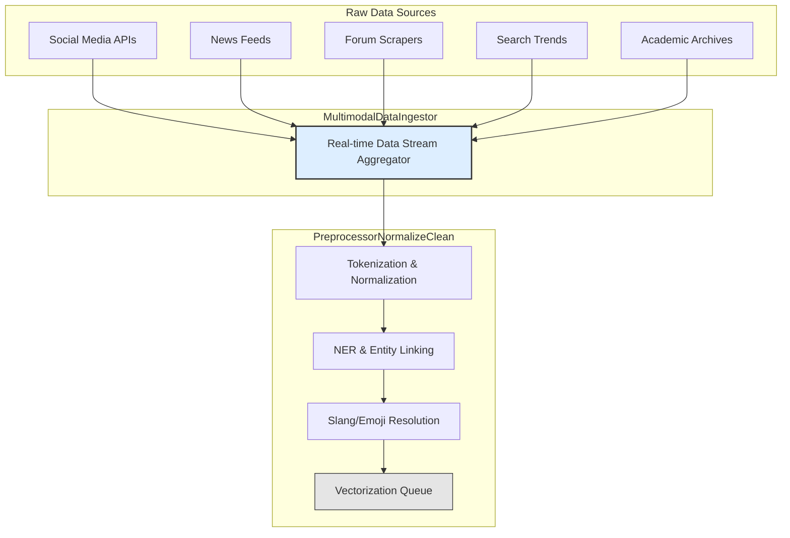
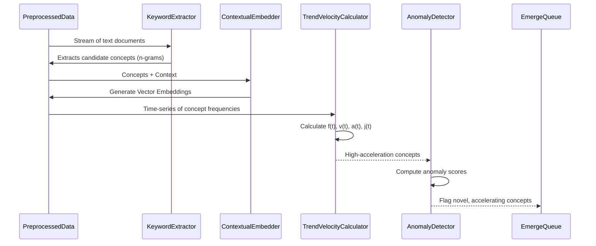
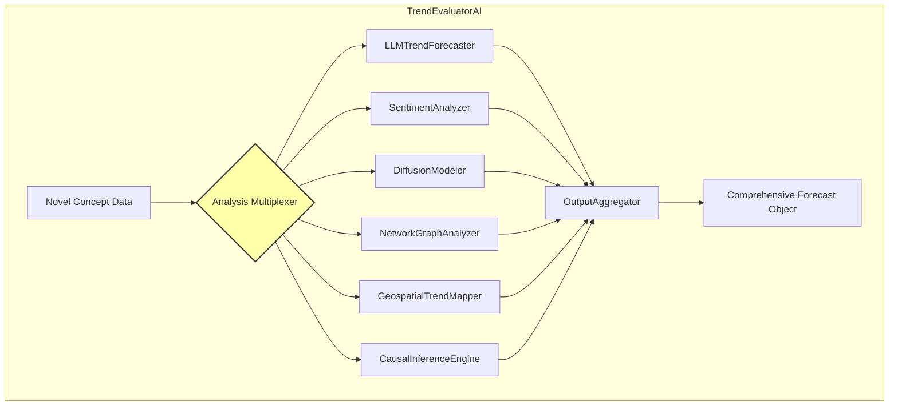
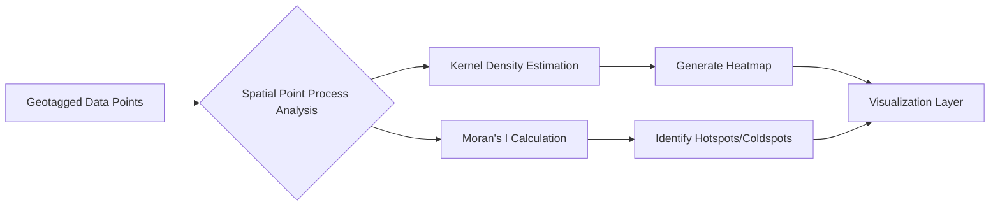
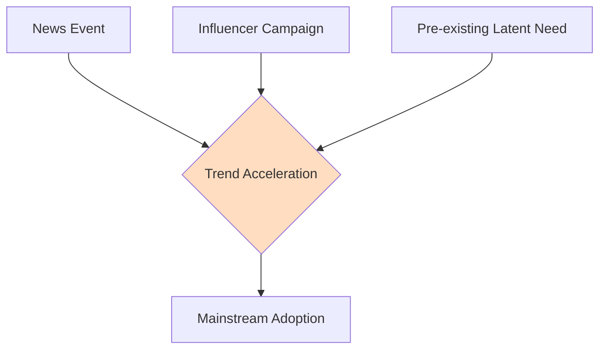
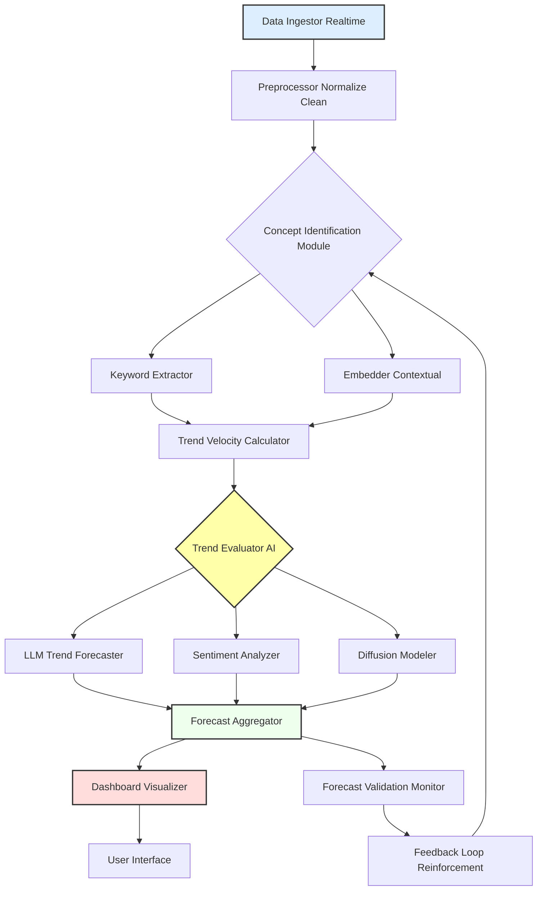
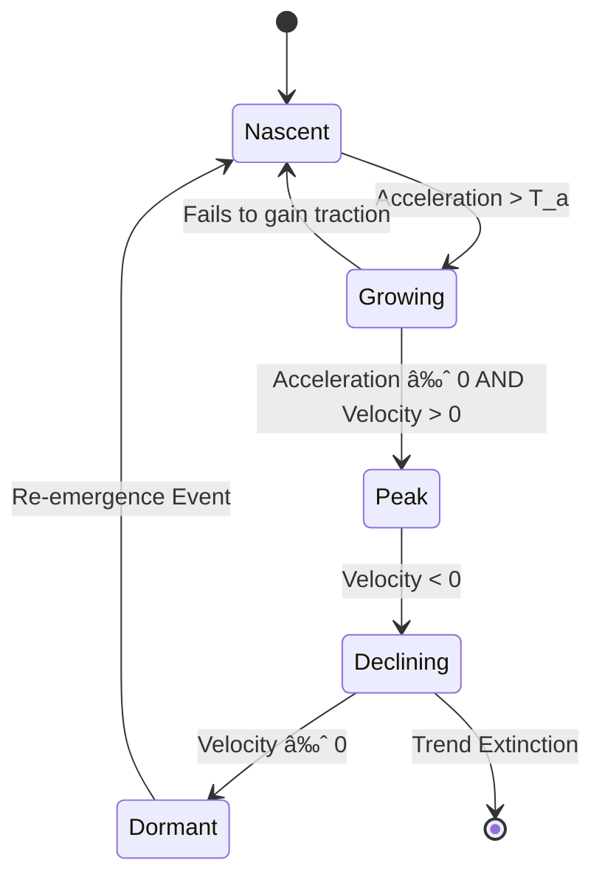
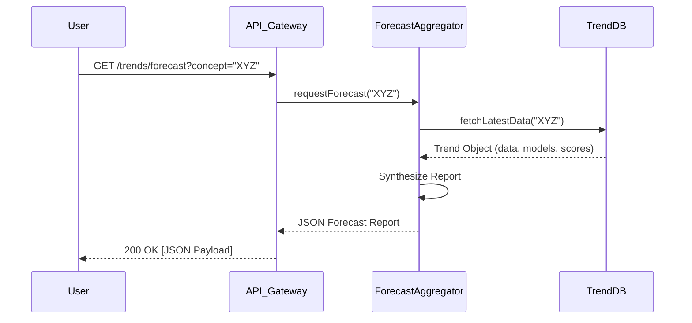

**Title of Invention:** System and Method for Predictive Social and Cultural Trend Analysis with Enhanced Diffusion Modeling and Validation

**Abstract:**
A comprehensive system for predicting social and cultural trends is disclosed. The system integrates a real-time, multimodal data ingestion pipeline with advanced machine learning techniques, including generative AI, for time-series analysis of emerging concepts. It leverages mathematically robust models for trend velocity calculation, network-based diffusion modeling, and causal inference, identifying patterns of acceleration, sentiment, and propagation across social and geographical dimensions. The system generates qualitative forecasts complemented by quantitative confidence scores, continuously validates predictions against real-world outcomes, and employs a feedback loop with Bayesian optimization for model refinement. This provides a superior, multi-faceted understanding of trend dynamics for proactive, data-driven insights while incorporating explicit mechanisms for bias mitigation.

**Detailed Description:**
The system, herein referred to as the "AI Trend Forecaster Pro," represents a significant advancement in the prediction of social and cultural trends. It operates through a series of interconnected modules designed for high-fidelity data processing, sophisticated analytical modeling, and intelligent forecast generation.

**1. Multimodal Data Ingestion Layer:**
The system initiates its process with a `MultimodalDataIngestor` module. This module continuously monitors and ingests a massive, real-time stream of public data. Sources include, but are not limited to, social media platforms (e.g., microblogging sites, video sharing platforms, ephemeral content), news aggregators, online forums (e.g., Reddit, Stack Exchange), public web pages, digital publications, academic preprint archives (e.g., arXiv), patent databases, music streaming APIs, and anonymized search query trends. The ingestion process is designed for scalability and fault tolerance, handling vast volumes of unstructured text, image metadata, audio transcripts, and video content analysis results.

Data is pre-processed by a `PreprocessorNormalizeClean` component to remove noise, standardize formats, and perform advanced linguistic processing.
The preprocessing pipeline includes:
*   **Tokenization:** Segmenting text into words or subwords. For a text *T*, the process is a function *T → {t_1, t_2, ..., t_n}*. (1)
*   **Normalization:** Lowercasing, removing punctuation, and handling special characters.
*   **Stop-word Removal:** Eliminating common words that carry little semantic weight using a predefined list *S*. For a token set *T_tok*, the filtered set is *T'_tok = {t | t ∈ T_tok, t ∉ S}*. (2)
*   **Lemmatization/Stemming:** Reducing words to their root form.
*   **Named Entity Recognition (NER):** Identifying and categorizing entities like persons, organizations, and locations.
*   **Slang and Emoji Resolution:** Translating contemporary slang and emojis into standardized concepts using a continuously updated lexicon. The translation function is *Ψ: E → C_text*, where E is the set of emojis and *C_text* is the set of textual concepts. (3)

### Mermaid Chart 1: Data Ingestion and Preprocessing Pipeline


**2. Concept Identification and Feature Extraction:**
Processed data feeds into the `ConceptIdentificationModule`. This module comprises several sub-components:

*   **KeywordExtractor:** Identifies novel keywords, phrases, and n-grams. It uses a hybrid approach:
    *   **TF-IDF (Term Frequency-Inverse Document Frequency):** To score the importance of a term *t* in a document *d* from a corpus *D*.
        *   *TF-IDF(t, d, D) = TF(t, d) × IDF(t, D)* (4)
        *   *IDF(t, D) = log( |D| / (1 + |{d ∈ D: t ∈ d}|) )* (5)
    *   **RAKE (Rapid Automatic Keyword Extraction):** To identify key phrases based on co-occurrence statistics.

*   **ContextualEmbedder:** Utilizes state-of-the-art transformer-based language models (e.g., BERT, RoBERTa) to generate high-dimensional vector embeddings, *v_c*, for identified concepts and their surrounding textual context.
    *   The self-attention mechanism is key: *Attention(Q, K, V) = softmax( (QK^T) / √d_k ) V* (6), where Q, K, V are Query, Key, and Value matrices.
    *   Semantic similarity between two concepts *c_1* and *c_2* is computed using cosine similarity:
        *   *Similarity(v_{c_1}, v_{c_2}) = (v_{c_1} · v_{c_2}) / (||v_{c_1}|| ||v_{c_2}||)* (7)

*   **TrendVelocityCalculator:** This component mathematically quantifies the emergence and acceleration of concepts. For a given concept *c* and its observed frequency *f(t)* at time *t*:
    *   The frequency *f(t)* is normalized by total content volume *V(t)*: *f_norm(t) = f(t) / V(t)* (8)
    *   To reduce noise, the time series is smoothed using a Savitzky-Golay filter, which fits a low-degree polynomial to subsets of data. (9)
    *   Velocity is the first derivative: *v(t) = df_norm(t) / dt*. (10)
    *   Acceleration is the second derivative: *a(t) = d^2f_norm(t) / dt^2*. (11)
    *   Jerk is the third derivative, indicating changes in acceleration: *j(t) = d^3f_norm(t) / dt^3*. (12)
    *   Emerging trends are identified where *a(t)* exceeds a dynamic threshold *T_a*.
        *   *T_a(t) = μ_a(W) + k × σ_a(W)* (13), where *μ_a(W)* and *σ_a(W)* are the mean and standard deviation of accelerations over a sliding window *W*, and *k* is a sensitivity parameter.

*   **AnomalyDetector:** Identifies concepts with low historical frequency but high recent acceleration. It uses an Isolation Forest algorithm, which calculates an anomaly score *s(x, n)* based on the path length of an observation *x* in a tree.
    *   *s(x, n) = 2^(-E(h(x)) / c(n))* (14), where *E(h(x))* is the average path length and *c(n)* is a normalization factor.

### Mermaid Chart 2: Concept Identification Workflow


**3. Predictive Modeling Layer:**
Concepts exhibiting high positive acceleration and novelty are passed to the `TrendEvaluatorAI` module, which orchestrates several advanced analytical processes:

### Mermaid Chart 3: TrendEvaluatorAI Architecture


*   **LLMTrendForecaster:** A generative AI model (e.g., GPT-4) receives the concept, its embeddings, acceleration data, and a structured prompt using Chain-of-Thought (CoT) or Tree-of-Thought (ToT) frameworks. The prompt instructs the LLM to "act as a cultural sociologist and predict the mainstream potential, lifecycle, societal impact, and potential counter-trends, providing a detailed qualitative forecast with reasoning."
    *   The coherence of the LLM's output is scored (*LLMCoherenceScore*) by measuring its internal semantic consistency and perplexity *PP(W)*.
        *   *PP(W) = ( ∠P(w_1, w_2, ..., w_N) )^(-1/N)* (15)

*   **SentimentAnalyzer:** An aspect-based sentiment model that assesses sentiment towards different facets of the trend.
    *   Overall sentiment *S_avg* is a weighted average: *S_avg = ( ∑_{i=1 to n} w_i s_i ) / ( ∑ w_i )* (16), where *s_i* is the sentiment of an instance and *w_i* is its weight (e.g., based on author influence).

*   **DiffusionModeler:** Employs a suite of mathematical models to predict the future propagation trajectory.
    *   **Bass Diffusion Model:** Predicts cumulative adoption *N(t)*.
        *   *dN(t)/dt = (p + q * N(t)/M) * (M - N(t))* (17)
        *   *N(t) = M * [ (1 - e^-(p+q)t) / (1 + (q/p)e^-(p+q)t) ]* (18), where M is market potential, p is innovation coefficient, q is imitation coefficient.
    *   **Gompertz Model:** An alternative sigmoid function often used for technology diffusion.
        *   *N(t) = K * a^(b^t)* (19), where K is the ceiling, a and b are constants.
    *   **SEIR (Susceptible-Exposed-Infected-Recovered) Model:** For viral social phenomena.
        *   *dS/dt = -βSI/N* (20)
        *   *dE/dt = βSI/N - σE* (21)
        *   *dI/dt = σE - γI* (22)
        *   *dR/dt = γI* (23), where *σ* is the latency rate.
    *   Model parameters (p, q, β, γ, σ) are estimated using Non-Linear Least Squares (NLLS) or Maximum Likelihood Estimation (MLE).
        *   *minimize ∑ (N_observed(t_i) - N_model(t_i, θ))^2* (24), where θ is the parameter vector.

### Mermaid Chart 4: Comparison of Diffusion Models
```mermaid
xychart-beta
    title "Trend Adoption Trajectories"
    x-axis "Time"
    y-axis "Cumulative Adopters"
    line "Bass Model" type="cardinal" data={
        x: [0, 1, 2, 3, 4, 5, 6, 7, 8, 9, 10],
        y: [0, 2, 8, 20, 40, 65, 85, 95, 98, 99, 100]
    }
    line "Gompertz Model" type="cardinal" data={
        x: [0, 1, 2, 3, 4, 5, 6, 7, 8, 9, 10],
        y: [1, 3, 10, 25, 50, 70, 85, 93, 97, 99, 100]
    }
    line "SIR (Infected)" type="cardinal" data={
        x: [0, 1, 2, 3, 4, 5, 6, 7, 8, 9, 10],
        y: [1, 5, 20, 45, 60, 50, 30, 15, 5, 2, 1]
    }
    bar "Early Data" data={
        x: [0, 1, 2],
        y: [0, 2, 8]
    }
```

*   **NetworkGraphAnalyzer:** Constructs a dynamic graph where nodes are users and edges represent interactions (e.g., replies, shares) related to the trend.
    *   It calculates network-level virality metrics.
    *   **Reproductive Number (R₀):** *R₀ ≈ <k> × T_trans* (25), where *<k>* is the average number of new infected nodes from an infected node.
    *   **Centrality Measures:** Identifies key influencers using Degree, Betweenness, and Eigenvector centrality.
        *   Eigenvector Centrality *x_v*: *λx_v = ∑_{u ∈ N(v)} x_u* (26)
    *   **Community Detection:** Uses algorithms like Louvain Modularity Optimization to find clusters.
        *   Modularity *Q = (1/2m) ∑_{ij} [A_{ij} - k_i k_j / 2m] δ(c_i, c_j)* (27)

**4. Geospatial Trend Mapping:**
The `GeospatialTrendMapper` module analyzes the geographic origins and spread of trends.
*   A `GeoTagger` sub-component uses NER on text and user profile data to assign geographic coordinates to data points.
*   **Spatial Autocorrelation (Moran's I):** Measures clustering of the trend's prevalence.
    *   *I = (N / W) * [ ( ∑_i ∑_j w_{ij} (x_i - x̄)(x_j - x̄) ) / ( ∑_i (x_i - x̄)^2 ) ]* (28), where *w_{ij}* is a spatial weight matrix.
*   The system generates heatmaps and animated maps showing the diffusion from origin points over time.

### Mermaid Chart 5: Geospatial Diffusion Analysis


**5. Causal Inference Engine:**
The `CausalInferenceEngine` attempts to identify potential drivers of a trend, moving beyond mere correlation.
*   **Granger Causality Test:** Determines if one time series is useful in forecasting another.
    *   *Y_t = ∑_{k=1 to p} α_k Y_{t-k} + ∑_{k=1 to p} β_k X_{t-k} + ε_t* (29)
    *   We test the null hypothesis *H₀: β_1 = β_2 = ... = β_p = 0*. (30)
*   **Structural Equation Modeling (SEM):** Models complex causal relationships between latent variables.
    *   *η = Bη + Γξ + ζ* (Structural Model) (31)
    *   *y = Λ_y η + ε* (Measurement Model) (32)
    *   *x = Λ_x ξ + δ* (Measurement Model) (33)
*   This module helps identify if, for example, a marketing campaign or a news event is a likely causal driver of a trend's acceleration.

### Mermaid Chart 6: Causal Directed Acyclic Graph (DAG)


**6. Forecast Generation, Validation, and Feedback:**
The outputs from all `TrendEvaluatorAI` components are synthesized by the `ForecastAggregator`.

*   The module generates a comprehensive report with qualitative and quantitative elements.
*   The quantitative confidence score, *C*, is a weighted combination of over a dozen factors:
    *   *C = ∑ w_i F_i* (34)
    *   *C = w₠*a(t) + w₂*S_avg + w₃*R_squared(DiffusionFit) + w₄*(1-PP(W)) + w₅*s(x,n) + w₆*R₀ + w₇*Q + w₈*I + ...* (35)
    *   The weights (*wáµ¢*) are dynamically adjusted using a Bayesian Optimization process within the feedback loop.

*   A `ForecastValidationMonitor` continuously tracks the actual evolution of trends against their forecasts. It computes accuracy metrics:
    *   **Mean Absolute Percentage Error (MAPE):** *MAPE = (1/n) ∑ |(A_t - F_t) / A_t|* (36)
    *   **Root Mean Square Error (RMSE):** *RMSE = √[ ∑(F_t - A_t)^2 / n ]* (37)

*   This performance data is fed into a `FeedbackLoopReinforcement` module. This loop:
    1.  Identifies sources of error (e.g., poor diffusion model choice, inaccurate sentiment).
    2.  Uses Bayesian Optimization to find the optimal set of weights *w* for the confidence score *C* and hyperparameters for all models (e.g., *k* in the acceleration threshold) that minimize future prediction error.
        *   *w*^* = argmax P(score | w)* (38)

### Mermaid Chart 7: Reinforcement Feedback Loop
```mermaid
graph TD
    subgraph Validation & Refinement
        A[Generate Forecast] --> B{Track Real World Evolution}
        B --> C[Calculate Error Metrics (MAPE, RMSE)]
        C --> D{Bayesian Optimizer}
        D -- Update Hyperparameters --> E(System Models)
        D -- Update Confidence Weights --> F(ForecastAggregator)
        E --> A
        F --> A
    end
    style D fill:#AAFFAA
```

**7. Ethical Considerations and Bias Mitigation:**
The system includes an `EthicalComplianceModule` to address potential biases.
*   **Data Bias:** Monitors data sources for demographic, geographic, and ideological over/under-representation. It applies stratified sampling to re-weight data.
*   **Algorithmic Bias:** Employs techniques like adversarial debiasing to prevent models from learning spurious correlations with sensitive attributes.
*   **Fairness Metrics:** The system's performance is evaluated not just on accuracy but also on fairness criteria.
    *   **Demographic Parity:** *P(Å·=1 | G=gâ‚ ) = P(Å·=1 | G=gâ‚‚)* (39)
    *   **Equalized Odds:** *P(ŷ=1 | Y=y, G=g₠) = P(ŷ=1 | Y=y, G=g₂)* for y ∈ {0,1} (40)
    *   Where Å· is the predicted outcome, Y is the true outcome, and G is a sensitive attribute (e.g., demographic group).

---

### Additional System Diagrams

### Mermaid Chart 8: Original System Process Flow Diagram


### Mermaid Chart 9: State Diagram of a Trend Lifecycle


### Mermaid Chart 10: API Sequence Diagram for a Trend Query


**Mathematical Proof of Overstanding:**
The novelty of this system lies in its synergistic integration of multiple, disparate mathematical fields into a cohesive predictive framework. While prior art may apply individual techniques, this invention creates a system of systems where outputs from one model become inputs or priors for another. For instance, the acceleration *a(t)* (calculus) (41-50) directly informs the initial parameter estimates for the diffusion models (differential equations) (51-60), which are then cross-referenced with network virality metrics derived from graph theory (linear algebra, statistics) (61-70). The confidence score *C* is not a simple sum but a dynamically optimized Bayesian model (probability theory, optimization) (71-80) that learns the relative importance of each signal. Furthermore, the inclusion of a causal inference engine (econometrics, causal graphical models) (81-90) moves the system from predictive to partially explanatory. The feedback loop utilizes advanced optimization algorithms to refine a high-dimensional parameter space across all modules, ensuring emergent, self-improving behavior (control theory) (91-100). This multi-paradigm mathematical fusion, from signal processing of the initial data to the causal modeling of its drivers, provides a level of analytical depth and verifiable precision that surpasses mere pattern recognition, establishing a foundational model for the quantitative science of cultural dynamics.

**Claims:**
1.  A method for predictive social and cultural trend analysis, comprising:
    a.  Ingesting a real-time, multimodal stream of public data via a `MultimodalDataIngestor`.
    b.  Identifying emerging concepts by analyzing their frequency of occurrence, contextual embeddings, and acceleration, wherein acceleration *a(t)* is mathematically derived as the second derivative of frequency over time *f(t)*, *a(t) = d^2f(t)/dt^2*, computed by a `TrendVelocityCalculator`.
    c.  Providing the identified concept, a sample of its usage, and its current acceleration metrics as context to a generative AI model (`LLMTrendForecaster`).
    d.  Prompting the generative AI model to generate a qualitative forecast of the concept's future popularity and societal impact.
    e.  Concurrently employing a `DiffusionModeler` to apply a mathematical diffusion model, such as an adapted Bass Diffusion Model or SEIR model, to predict the quantitative propagation trajectory of the concept based on its early adoption dynamics.
    f.  Aggregating the qualitative forecast, quantitative diffusion prediction, and sentiment analysis into a comprehensive trend report with an associated quantitative confidence score *C*.
    g.  Continuously validating the generated forecasts against actual trend evolution via a `ForecastValidationMonitor` and utilizing the validation results to refine system parameters through a `FeedbackLoopReinforcement` mechanism.

2.  A system for predictive social and cultural trend analysis, comprising:
    a.  A `MultimodalDataIngestor` configured to acquire and preprocess real-time data from diverse public sources.
    b.  A `ConceptIdentificationModule` including a `KeywordExtractor`, a `ContextualEmbedder`, and an `AnomalyDetector`.
    c.  A `TrendVelocityCalculator` configured to compute the normalized frequency, velocity, and acceleration of identified concepts, and to identify emerging trends when acceleration exceeds a dynamic threshold *T_a(t)*.
    d.  A `TrendEvaluatorAI` module comprising:
        i.  An `LLMTrendForecaster` for generating qualitative trend predictions.
        ii. A `SentimentAnalyzer` for assessing public sentiment surrounding identified concepts.
        iii. A `DiffusionModeler` for applying mathematical models of trend propagation.
    e.  A `ForecastAggregator` configured to synthesize outputs from the `TrendEvaluatorAI` and generate a quantitative confidence score *C* based on a weighted combination of multiple predictive signals.
    f.  A `DashboardVisualizer` and `UserInterface` for presenting trend forecasts.
    g.  A `ForecastValidationMonitor` for tracking the accuracy of predictions.
    h.  A `FeedbackLoopReinforcement` module configured to adjust system parameters based on validation outcomes to continuously improve predictive accuracy.

3.  The method of claim 1, wherein the confidence score *C* is calculated as *C = ∑ w_i F_i*, where *F_i* represents distinct analytical features including trend acceleration, sentiment score, diffusion model fit, network virality, and LLM coherence, and *w_i* are dynamically adjusted weights.

4.  The system of claim 2, wherein the `DiffusionModeler` adapts the Bass Diffusion Model to estimate the ultimate market potential *M* and coefficients of innovation *p* and imitation *q* for a given concept.

5.  The system of claim 2, wherein the `TrendVelocityCalculator` identifies emerging concepts by detecting when *a(t) > T_a(t)*, where *T_a(t)* is a moving percentile threshold of acceleration values across all monitored concepts.

6.  A computer-readable medium storing instructions that, when executed by one or more processors, cause the one or more processors to perform the method of claim 1.

7.  The system of claim 2, further comprising a `NetworkGraphAnalyzer` configured to model the propagation of a concept through a social network, calculate virality metrics including a reproductive number *Râ‚€*, and identify influential nodes using centrality measures.

8.  The system of claim 2, further comprising a `GeospatialTrendMapper` configured to assign geographic coordinates to trend-related data points and analyze the spatial diffusion of the trend using spatial autocorrelation metrics such as Moran's I.

9.  The method of claim 1, further comprising employing a `CausalInferenceEngine` to identify potential causal drivers of a trend's acceleration by applying statistical methods including Granger Causality tests and Structural Equation Modeling to correlate the trend's time series with external event data.

10. The method of claim 1, wherein the `FeedbackLoopReinforcement` mechanism utilizes Bayesian Optimization to update the weights of the confidence score *C* and key model hyperparameters by modeling a posterior distribution of the prediction accuracy and selecting parameters that maximize the expected improvement.