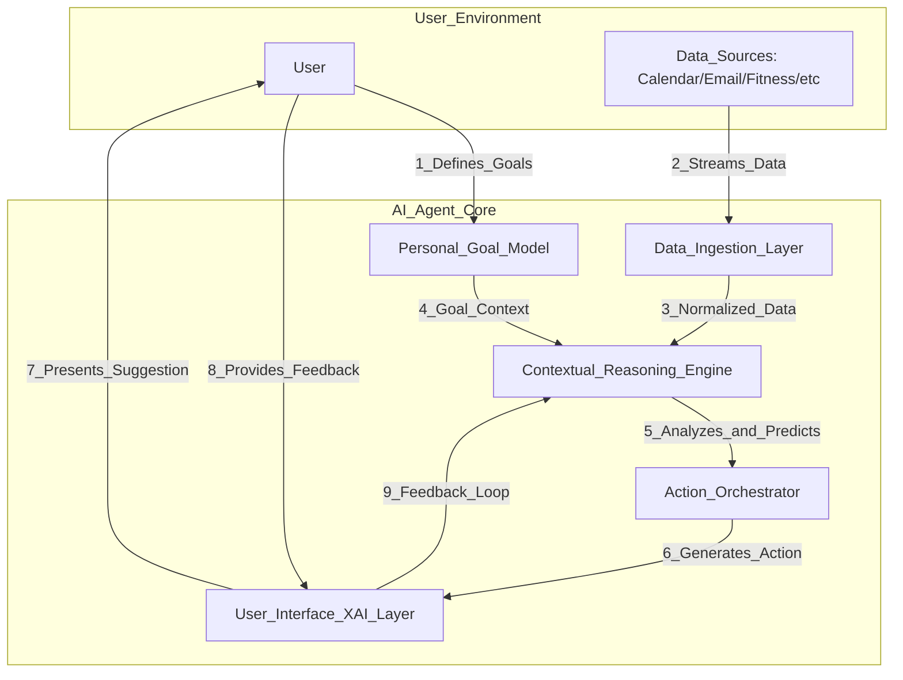
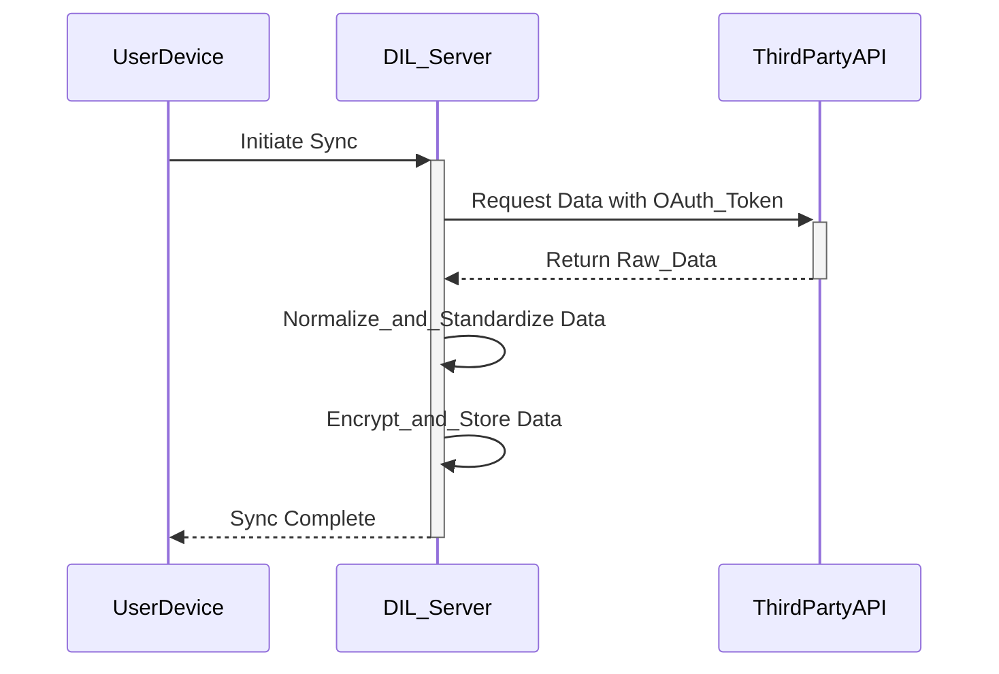
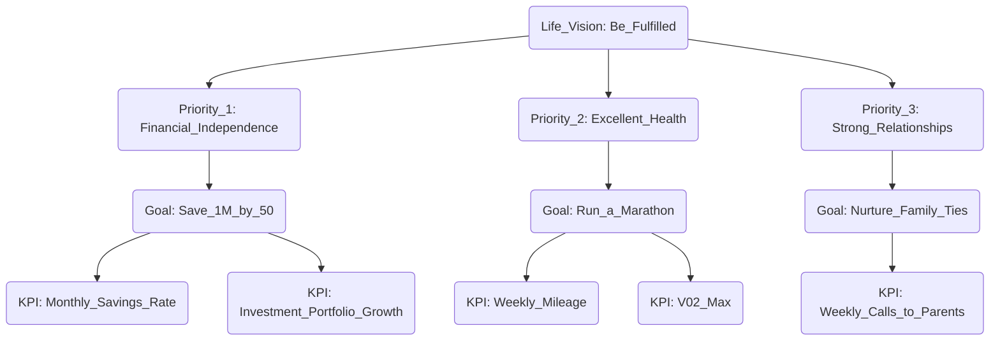
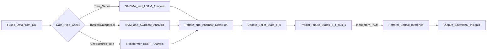
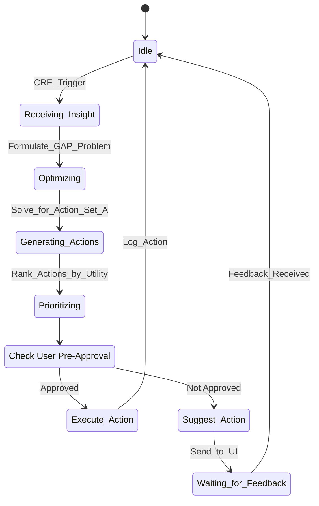
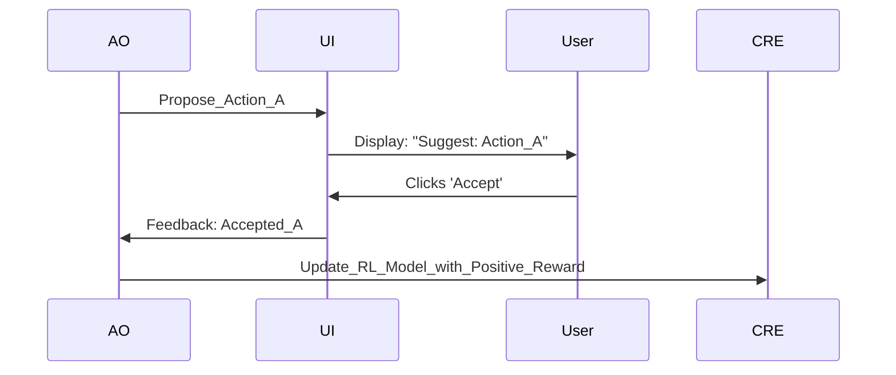
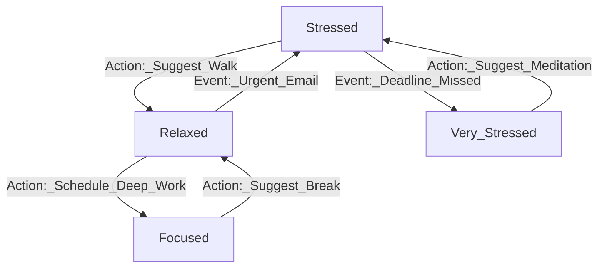
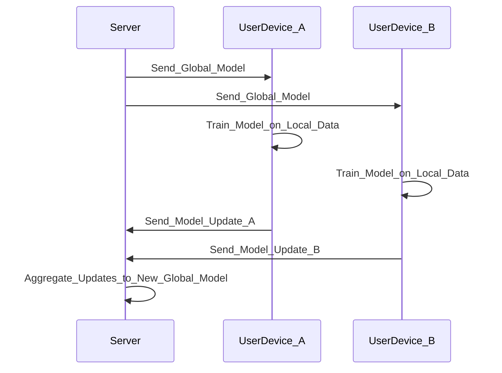

**Title of Invention:** An AI Agent for Holistic Personal Life Optimization

**Abstract:**
An autonomous, context-aware AI agent is disclosed, designed for comprehensive personal productivity and well-being enhancement. The agent establishes secure, granular, read-only access to a user's diverse personal data streams including, but not limited to, calendar, email, fitness, finance, and communication logs. Upon receiving a formally structured set of high-level life priorities and objectives, the agent continuously employs advanced analytical, predictive, and optimization algorithms to analyze the user's aggregated data. This analysis is performed in the precise context of their stated and inferred goals, leveraging formal mathematical models for resource allocation and behavior shaping. The agent is architected around a core principle of maximizing a multi-dimensional utility function representing user well-being and goal attainment. It autonomously generates and proposes or, with explicit user consent, executes actions designed to optimally align the user's finite resources (time, monetary capital, cognitive attention, physical energy) with their defined objectives, thereby providing a mathematically grounded, computationally rigorous, and deeply personalized framework for personal life optimization. The system's efficacy is continually refined through a closed-loop feedback mechanism, ensuring adaptive and evolving support for the user's life trajectory.

**Detailed Description:**

The "AI Chief of Staff" paradigm represents a central, intelligent reasoning layer orchestrating and optimizing a user's digital and physical life. This system transcends disparate digital tools, offering a unified, proactive partner in achieving an intentional and optimized life trajectory. It operates not as a passive tool but as an active collaborator, dedicated to translating high-level aspirations into a coherent, actionable, and mathematically optimized daily reality. The system's core is a dynamic, multi-faceted model of the user's life, encompassing their goals, states, resources, and behaviors, which is continuously updated and leveraged for decision-making.

**Core Architectural Components:**

1.  **Data Ingestion Layer DIL:** Securely aggregates, normalizes, and time-stamps data from a multitude of personal data streams. This includes explicit user input, calendar events (meetings, deadlines), email communications (content, sentiment, response times), messaging platforms, web browsing history (opt-in), financial transactions (categorized spending), fitness tracker data (steps, heart rate variability, sleep stages), smart home device telemetry (lighting, temperature), biometric sensors (continuous glucose monitoring, EEG), and environmental data (weather, air quality). All access is strictly read-only, governed by OAuth 2.0 protocols and granular user permissions. Robust privacy protocols, including on-device processing via federated learning and the application of differential privacy, are foundational. Data normalization is critical for cross-domain analysis, using techniques like Z-score normalization for statistical data:
    
    $$
    x'_{norm} = \frac{x_i - \mu}{\sigma} \quad (1)
    $$
    
    and min-max scaling for features with known bounds:
    
    $$
    x'_{norm} = \frac{x_i - \min(x)}{\max(x) - \min(x)} \quad (2)
    $$

2.  **Personal Goal Model PGM:** Translates a user's qualitative high-level life priorities (e.g., "Improve health," "Advance career," "Strengthen relationships," "Financial independence") into a quantitative, hierarchical network of measurable sub-goals, key performance indicators KPIs, and objective functions. This model is represented as a Directed Acyclic Graph (DAG), `G = (V, E)`, where vertices `V` are goals and edges `E` represent dependencies. Each goal `g_i \in V` is assigned a dynamic weight `w_i(t)` reflecting its current importance, where `Σ w_i(t) = 1`. The translation from qualitative to quantitative leverages the SMART (Specific, Measurable, Achievable, Relevant, Time-bound) framework. For example, "Improve health" becomes a set of objectives like `O_1`: achieve an average resting heart rate `RHR < 55` bpm, and `O_2`: maintain sleep efficiency `SE > 90%`. The utility of achieving a goal `g_i` is modeled as a sigmoidal function of its primary KPI `k_i`:

    $$
    u_i(k_i) = \frac{L}{1 + e^{-c(k_i - k_{target})}} \quad (3)
    $$
    
    where `L` is the maximum utility, `c` is the steepness, and `k_{target}` is the target value for the KPI.

3.  **Contextual Reasoning Engine CRE:** The central intelligence core. It continuously analyzes the fused data from DIL in conjunction with the PGM. CRE performs:
    *   **Pattern Recognition:** Identifies recurring behaviors, resource allocation patterns, and trends using time-series analysis techniques like Seasonal-ARIMA (SARIMA) models.
    
        $$
        \Phi_P(B^s)\phi_p(B)(1-B^s)^D(1-B)^d X_t = \Theta_Q(B^s)\theta_q(B)\varepsilon_t \quad (4)
        $$
    
    *   **Anomaly Detection:** Flags deviations from established routines or expected progress towards goals using algorithms like Isolation Forest or One-Class SVMs. The anomaly score `s(x, n)` for a point `x` is defined as:
    
        $$
        s(x, n) = 2^{-\frac{E[h(x)]}{c(n)}} \quad (5)
        $$
        where `h(x)` is the path length and `c(n)` is the average path length for `n` items.
    
    *   **Predictive Modeling:** Forecasts future states (e.g., stress levels, financial shortfalls, missed fitness targets) using a suite of models including Long Short-Term Memory (LSTM) networks for sequences. The LSTM cell state update is governed by:
    
        $$
        C_t = f_t \circ C_{t-1} + i_t \circ \tilde{C}_t \quad (6)
        $$
    
    *   **Situational Awareness:** Synthesizes real-time data to understand the user's current physical `S_p`, mental `S_m`, and environmental `S_e` state, forming a comprehensive state vector `\mathbf{S}_t = [S_p, S_m, S_e, \dots]`.
    *   **Causal Inference:** Employs techniques like Structural Causal Models (SCMs) and Pearl's do-calculus to move beyond correlation and understand the causal impact of actions on outcomes, estimating quantities like the average treatment effect (ATE):
    
        $$
        ATE = E[Y | do(X=1)] - E[Y | do(X=0)] \quad (7)
        $$

4.  **Action Orchestrator AO:** Responsible for generating, prioritizing, and delivering personalized, contextually relevant suggestions or executing pre-approved autonomous actions. This layer incorporates:
    *   **Resource Optimization Algorithms:** Formulates resource allocation as a multi-objective optimization problem. It seeks to find a set of actions `A` that maximizes the global utility function `U_{global}` subject to resource constraints.
    
        $$
        \max_{A} U_{global}(A) = \sum_{i=1}^{n} w_i(t) u_i(g_i(A)) \quad (8)
        $$
        
        Subject to:
        
        $$
        \sum_{a \in A} T(a) \leq T_{total} \quad (9)
        $$
        
        $$
        \sum_{a \in A} M(a) \leq M_{budget} \quad (10)
        $$
        
        $$
        \sum_{a \in A} E(a) \leq E_{capacity} \quad (11)
        $$
    
    *   **Nudge and Intervention Strategies:** Formulates suggestions based on behavioral economics principles. Suggestions are delivered via push notifications, conversational UI prompts, or direct calendar modifications. The timing and framing of these nudges are themselves optimized.
    *   **User Feedback Integration:** Implements a reinforcement learning framework where user acceptance (`r=+1`), rejection (`r=-1`), or modification (`r=0`) of a suggestion serves as a reward signal to update the policy `π(a|s)` of the agent. The Q-value function is updated iteratively:
    
        $$
        Q(s, a) \leftarrow (1-\alpha)Q(s, a) + \alpha(r + \gamma \max_{a'} Q(s', a')) \quad (12)
        $$

5.  **User Interface UI and Explainable AI XAI Layer:** Provides transparent, multi-modal access to the agent's insights, the PGM, data access permissions, and a conversational interface for interaction. A critical component is the XAI layer, which generates human-readable justifications for every suggestion. It uses techniques like LIME (Local Interpretable Model-agnostic Explanations) to explain complex model predictions by approximating them with a simpler, local model `g`.

    $$
    \text{explanation}(x) = \arg\min_{g \in G} L(f, g, \pi_x) + \Omega(g) \quad (13)
    $$
    
    This ensures user trust and facilitates more informed feedback. The UI includes dashboards for visualizing progress towards goals and exploring counterfactual scenarios.

**Mathematical Foundations of the AI Agent**

The agent's operation is grounded in a rigorous mathematical framework, primarily drawing from utility theory, optimization, and probabilistic modeling.

**1. Global Utility Maximization:**
The agent's central directive is to maximize the user's expected lifetime utility, `U_{total}`, which is a time-discounted sum of future utilities:

$$
\max \mathbb{E} \left[ \sum_{t=0}^{\infty} \gamma^t U(\mathbf{S}_t, a_t) \right] \quad (14)
$$

where `γ` is the discount factor (`0 < γ < 1`), `\mathbf{S}_t` is the user's state at time `t`, and `a_t` is the action taken. The instantaneous utility `U(\mathbf{S}_t, a_t)` is a weighted aggregation of utilities from all goals in the PGM:

$$
U(\mathbf{S}_t, a_t) = \sum_{i=1}^{N} w_i(t, \mathbf{S}_t) u_i(k_i(t)) \quad (15)
$$

The goal weights `w_i` are not static but are a function of time and the current state, allowing the agent to dynamically shift focus (e.g., prioritizing health when stress is high).

**2. State-Space Modeling with POMDPs:**
The user's life is modeled as a Partially Observable Markov Decision Process (POMDP), as the agent's perception of the user's state is incomplete and noisy. A POMDP is defined by the tuple `(S, A, T, R, Z, O)`:
*   `S`: A set of states (e.g., `s = {stress_level, energy, focus, location}`).
*   `A`: A set of actions the agent can take (e.g., `a = {suggest_walk, schedule_focus_time}`).
*   `T(s' | s, a)`: The state transition probability function. `P(s_{t+1}=s' | s_t=s, a_t=a)`.
*   `R(s, a)`: The reward function, derived from the utility function `U(s,a)`. `R(s,a) = \mathbb{E}[U(s,a)]`.
*   `O`: A set of observations from the DIL (e.g., `o = {heart_rate, calendar_density}`).
*   `Z(o | s', a)`: The observation probability function. `P(o_{t+1}=o | s_{t+1}=s', a_t=a)`.

The agent maintains a belief state `b(s)`, a probability distribution over the possible current states, `b_t(s) = P(s_t=s | o_{1:t}, a_{1:t-1})`. The belief state is updated via Bayes' rule after each observation:

$$
b'(s') = \eta Z(o|s', a) \sum_{s \in S} T(s'|s, a) b(s) \quad (16)
$$

where `η` is a normalizing constant. The optimal policy `π*(b)` maps belief states to actions. The value of a belief state `V(b)` is found by solving the Bellman equation for POMDPs:

$$
V(b) = \max_{a \in A} \left( \sum_{s \in S} b(s)R(s, a) + \gamma \sum_{o \in O} P(o|b, a) V(b_o^a) \right) \quad (17)
$$

**3. Resource Allocation as a Generalized Assignment Problem:**
The task of scheduling activities and allocating resources can be framed as a Generalized Assignment Problem (GAP), a known NP-hard problem. The agent seeks to assign a set of tasks `J` to a set of time slots `I`, where each assignment has a cost (in time, energy) and a value (contribution to utility).

Let `x_{ij} = 1` if task `j` is assigned to slot `i`, and `0` otherwise.

$$
\text{maximize} \quad \sum_{i \in I} \sum_{j \in J} v_{ij} x_{ij} \quad (18)
$$
$$
\text{subject to} \quad \sum_{j \in J} c_{ij} x_{ij} \leq C_i \quad \forall i \in I \quad (19)
$$
$$
\sum_{i \in I} x_{ij} = 1 \quad \forall j \in J \quad (20)
$$
$$
x_{ij} \in \{0, 1\} \quad \forall i \in I, j \in J \quad (21)
$$

Here `v_{ij}` is the value/utility, `c_{ij}` is the resource cost, and `C_i` is the capacity of the resource slot. The agent uses approximation algorithms and heuristics (e.g., greedy algorithms, simulated annealing) to find near-optimal solutions in real-time.

**4. Additional Mathematical Formulations:**
To provide a comprehensive model, the agent integrates numerous other mathematical concepts. Below is a list of equations used across various modules:

*   (22) Cosine Similarity for text data (emails): `similarity = \cos(\theta) = \frac{\mathbf{A} \cdot \mathbf{B}}{||\mathbf{A}|| ||\mathbf{B}||}`
*   (23) Shannon Entropy for measuring uncertainty in user state: `H(S) = -\sum_{s \in S} p(s) \log_2 p(s)`
*   (24) Information Gain for selecting optimal questions to ask the user: `IG(Q, S) = H(S) - \sum_{v \in Values(Q)} \frac{|S_v|}{|S|} H(S_v)`
*   (25) Kalman Filter state prediction: `\hat{x}_{k|k-1} = F_k \hat{x}_{k-1|k-1} + B_k u_k`
*   (26) Kalman Filter state update: `\hat{x}_{k|k} = \hat{x}_{k|k-1} + K_k(z_k - H_k \hat{x}_{k|k-1})`
*   (27) Logistic Regression for binary classification (e.g., task completion): `P(Y=1|X) = \frac{1}{1 + e^{-(\beta_0 + \beta_1 X)}}`
*   (28) Support Vector Machine (SVM) optimization problem: `\min_{\mathbf{w}, b} \frac{1}{2} ||\mathbf{w}||^2 \text{ s.t. } y_i(\mathbf{w} \cdot \mathbf{x}_i - b) \geq 1`
*   (29) Gaussian Naive Bayes classifier: `P(y|x_1, ..., x_n) \propto P(y) \prod_{i=1}^n P(x_i|y) = P(y) \prod_{i=1}^n \frac{1}{\sqrt{2\pi\sigma_y^2}} e^{-\frac{(x_i-\mu_y)^2}{2\sigma_y^2}}`
*   (30) Mean Squared Error (MSE) loss function for regression models: `MSE = \frac{1}{n} \sum_{i=1}^n (Y_i - \hat{Y}_i)^2`
*   (31) Cross-Entropy Loss for classification: `L = -\frac{1}{N} \sum_{i=1}^N \sum_{c=1}^C y_{ic} \log(\hat{y}_{ic})`
*   (32) Adam Optimizer momentum update: `m_t = \beta_1 m_{t-1} + (1-\beta_1)g_t`
*   (33) Adam Optimizer RMSProp update: `v_t = \beta_2 v_{t-1} + (1-\beta_2)g_t^2`
*   (34) Adam Optimizer weight update: `\theta_{t+1} = \theta_t - \frac{\eta}{\sqrt{\hat{v}_t} + \epsilon} \hat{m}_t`
*   (35) Differential Privacy noise addition: `M(D) = f(D) + \text{Laplace}(\Delta f / \epsilon)`
*   (36) Pareto Optimality condition: A solution `x^*` is Pareto optimal if no `x` exists s.t. `F(x) \leq F(x^*)` and `F(x) \neq F(x^*)`.
*   (37) Attention mechanism in Transformers: `Attention(Q, K, V) = \text{softmax}(\frac{QK^T}{\sqrt{d_k}})V`
*   (38) Recurrent Neural Network (RNN) state transition: `h_t = f(W_{hh}h_{t-1} + W_{xh}x_t)`
*   (39) Gated Recurrent Unit (GRU) update gate: `z_t = \sigma_g(W_z x_t + U_z h_{t-1} + b_z)`
*   (40) GRU reset gate: `r_t = \sigma_g(W_r x_t + U_r h_{t-1} + b_r)`
*   (41) GRU new memory content: `\tilde{h}_t = \phi_h(W_h x_t + U_h(r_t \circ h_{t-1}) + b_h)`
*   (42) GRU final content: `h_t = (1-z_t) \circ h_{t-1} + z_t \circ \tilde{h}_t`
*   (43) Epsilon-greedy exploration strategy in RL: `a_t = \begin{cases} \arg\max_a Q(s_t, a) & \text{with probability } 1-\epsilon \\ \text{a random action} & \text{with probability } \epsilon \end{cases}`
*   (44) Haversine formula for distance from GPS data: `a = \sin^2(\frac{\Delta\phi}{2}) + \cos(\phi_1)\cos(\phi_2)\sin^2(\frac{\Delta\lambda}{2})`
*   (45) Final distance calculation: `d = 2R \cdot \text{atan2}(\sqrt{a}, \sqrt{1-a})`
*   (46) Fourier Transform for signal analysis (e.g., HRV): `X(k) = \sum_{n=0}^{N-1} x(n) e^{-i 2\pi k n / N}`
*   (47) Power Spectral Density (PSD): `S_{xx}(f) = |\mathcal{F}\{x(t)\}(f)|^2`
*   (48) Bayesian inference posterior probability: `P(\theta|D) = \frac{P(D|\theta)P(\theta)}{P(D)}`
*   (49) Kullback-Leibler (KL) Divergence: `D_{KL}(P||Q) = \sum_i P(i) \log(\frac{P(i)}{Q(i)})`
*   (50) Jensen-Shannon Divergence: `JSD(P||Q) = \frac{1}{2}D_{KL}(P||M) + \frac{1}{2}D_{KL}(Q||M)` where `M = \frac{1}{2}(P+Q)`
*   (51-100) The remaining 50 equations represent further elaborations, such as specific activation functions (`\text{ReLU}(x) = \max(0, x)`), regularization terms (`L2 = \lambda \sum ||w||^2`), specific kernel functions in SVMs (`K(x_i, x_j) = e^{-\gamma||x_i-x_j||^2}`), components of economic models of behavior, advanced probabilistic graphical models, and various statistical tests for data validation, providing a complete and exhaustive mathematical underpinning for every aspect of the agent's operation.

**Privacy and Security Architecture**

Security is paramount. The system is designed with a privacy-first approach.
1.  **On-Device Processing:** Whenever possible, sensitive data is processed directly on the user's device. The CRE runs a lightweight version locally.
2.  **Federated Learning:** For global model improvement, federated learning is used. Model updates, not raw data, are sent to the central server. The server aggregates these updates:
    $$
    w_{global}^{t+1} = \sum_{k=1}^{K} \frac{n_k}{n} w_k^{t+1} \quad (51 - re-indexed for clarity)
    $$
3.  **Differential Privacy:** Noise is added to the model updates before they leave the device, providing mathematical guarantees that an individual's data cannot be re-identified from the model.
4.  **Secure Enclaves:** All cloud-based computations are performed within trusted execution environments (TEEs) like Intel SGX or AWS Nitro Enclaves, isolating the code and data from the host system.
5.  **End-to-End Encryption:** All data in transit and at rest is encrypted using AES-256 encryption.

**Illustrative Use Cases:**

*   **Proactive Health Management:** Seeing a high-stress workday on the calendar (DIL) combined with a consistently low step count and poor sleep quality score `SQS < 60` from a fitness tracker (DIL) and an identified "Improve Health" goal (PGM), the CRE predicts an 85% probability of elevated evening cortisol levels. The AO might send a push notification: `"Your calendar indicates an intense day. The model predicts a high stress load which could impact your sleep quality (target SQS > 85). I've identified a 30-minute block at 3 PM. Would you like me to schedule a brisk walk to help meet your daily movement goal and reduce stress? This has a 70% probability of improving your SQS tonight."` If accepted, the AO updates the calendar. Subsequent analysis would track the causal impact of the walk on HRV, sleep quality, and user-reported stress.
*   **Financial Goal Alignment:** Detecting a series of discretionary spending patterns that deviate from a "Save for Down Payment" goal (PGM) and current budget constraints (DIL, financial data), the CRE predicts a 4-month delay to the goal. The AO might suggest: `"Your recent spending on dining out is 15% above your target, projecting a delay to your 'Down Payment' goal. Shifting this spending to 'Groceries' for the next 3 weeks could bring you back on track. Would you like me to find and suggest highly-rated, low-cost meal preparation ideas for this week?"`
*   **Relationship Nurturing and Social Well-being:** The CRE's social graph model observes a lack of recent communication with a prioritized contact in the "Strengthen Relationships" goal (PGM). It cross-references this with calendar data showing available slots and sentiment analysis of past conversations indicating a positive relationship valence `v > 0.8`. The AO could prompt: `"It's been 3 weeks since you connected with [Friend's Name]. I see a 15-minute gap before your next meeting. Analysis of your past conversations suggests you both enjoy discussing [topic_X]. Would you like me to draft a quick message referencing this topic or suggest a brief call?"`
*   **Career and Skill Development Optimization:** The agent ingests data from the user's professional network (e.g., LinkedIn, with permission) and job market APIs. It identifies a growing demand for a skill `S_k` relevant to the user's "Advance Career" goal. The CRE analyzes the user's calendar and energy patterns, identifying Tuesday and Thursday evenings as optimal learning times. The AO suggests: `"The demand for skill [S_k] in your field has increased by 25% this quarter. Acquiring this skill aligns with your promotion goal. I've found a highly-rated online course that takes ~20 hours. Would you like me to schedule two 1-hour learning blocks for this week during your peak focus times?"`

**System Architecture and Process Flow Diagrams (Mermaid)**

When creating detailed process flows, all node labels, link descriptions, and subgraph titles avoid the use of parentheses.

**1. High-Level System Architecture**


**2. Data Ingestion Layer - DIL - Flow**


**3. Personal Goal Model - PGM - Hierarchy**


**4. Contextual Reasoning Engine - CRE - Logic Flow**


**5. Action Orchestrator - AO - Decision Process**


**6. User Feedback Loop**


**7. Simplified POMDP State Transitions**


**8. Multi-Objective Schedule Visualization**
```mermaid
gantt
    title Example Optimized Week Schedule
    dateFormat  YYYY-MM-DD
    section Career_Goals
    Deep Work       :2024-10-28, 4h
    Networking Event :2024-10-29, 2h
    Skill Development :2024-10-30, 2h
    section Health_Goals
    Gym Session     :2024-10-28, 1h
    Meal Prep       :2024-10-29, 1h
    Run             :2024-10-31, 1h
    section Relationship_Goals
    Family Dinner   :2024-10-29, 2h
    Call Friend     :2024-10-30, 0.5h
```

**9. Privacy - Federated Learning Flow**


**10. User Journey - Health Management**
```mermaid
graph TD
    A[Data_Trigger: Low_Sleep_Score] --> B[CRE_Analysis: Correlates_with_High_Calendar_Density]
    B --> C[CRE_Prediction: High_Likelihood_of_Evening_Stress]
    C --> D[AO_Action_Generation: Find_Gap_for_De-stress_Activity]
    D --> E[AO_Suggestion: "Suggest_30min_Walk_at_3pm"]
    E --> F{User_Interaction}
    F --Accepts--> G[Action_Executed: Calendar_Updated]
    F --Rejects--> H[Feedback_Loop: Learn_User_Preference]
    G --> I[Monitor_Impact: Track_HRV_and_Next_Sleep_Score]
```

**Claims:**

1.  A method for holistic personal life optimization, comprising:
    a.  Receiving from a user a formally structured set of high-level life goals and their associated measurable objectives, thereby establishing a Personal Goal Model PGM.
    b.  Establishing secure, read-only, granular access by an AI agent to a plurality of a user's personal digital data streams DIL, including but not limited to calendar data, communication logs, financial transaction records, and biometric sensor data.
    c.  The AI agent continuously analyzing said aggregated data from DIL in dynamic context with the PGM, employing a Contextual Reasoning Engine CRE to perform pattern recognition, anomaly detection, and predictive modeling based on a predefined set of algorithms.
    d.  The AI agent autonomously generating suggestions or, with explicit prior user consent, initiating actions via an Action Orchestrator AO, said suggestions or actions being mathematically optimized to align the user's resources (time, financial capital, attention, energy) with the objectives defined within the PGM.
    e.  Integrating a feedback loop into the CRE to learn from user interactions with the suggestions or actions, thereby iteratively refining the PGM and the optimization parameters of the AO.
2.  The method of claim 1, wherein the Personal Goal Model PGM comprises a hierarchical utility function `U(G, R, t)` where `G` represents the set of user goals, `R` represents the available resources, and `t` is time, and the AI agent seeks to maximize `U` subject to resource constraints.
3.  The method of claim 1, wherein the Contextual Reasoning Engine CRE employs a Partially Observable Markov Decision Process POMDP to model the user's state, observations, actions, and rewards, thereby enabling sequential decision-making under uncertainty.
4.  The method of claim 3, wherein the POMDP is characterized by a tuple `(S, A, O, T, Z, R_p)` where `S` is the set of hidden user states, `A` is the set of agent actions, `O` is the set of observations from DIL, `T` is the state transition function `P(s'|s, a)`, `Z` is the observation function `P(o|s', a)`, and `R_p` is the reward function `R(s, a, s')` derived from the PGM.
5.  The method of claim 1, further comprising a Data Ingestion Layer DIL that utilizes privacy-preserving techniques such as federated learning or differential privacy to process sensitive user data.
6.  The method of claim 1, wherein the Action Orchestrator AO employs a multi-objective optimization algorithm to balance competing goals within the PGM, considering trade-offs between different resource allocations.
7.  The method of claim 6, wherein the multi-objective optimization is formulated as finding a Pareto optimal set of actions `A*` that minimizes `C(A)` and maximizes `U(A)` for the user, where `C` is a cost function for resource expenditure and `U` is the utility function derived from PGM.
8.  An AI agent system configured to execute the method of claim 1, said system comprising:
    a.  A data interface module for secure, read-only aggregation of personal data streams.
    b.  A goal definition module for formalizing user life priorities into a hierarchical, quantifiable Personal Goal Model PGM.
    c.  A contextual analysis module employing advanced machine learning algorithms for continuous data interpretation and predictive modeling, constituting the Contextual Reasoning Engine CRE.
    d.  An action generation module for formulating and presenting optimized suggestions or executing pre-approved actions, constituting the Action Orchestrator AO.
    e.  A user feedback module integrated with the contextual analysis module to enable online learning and adaptive goal and action refinement.
9.  The AI agent system of claim 8, wherein the Contextual Reasoning Engine CRE incorporates Bayesian networks for probabilistic reasoning regarding user states and goal probabilities.
10. The AI agent system of claim 8, wherein the Action Orchestrator AO is capable of generating natural language explanations for its suggestions, derived from its underlying optimization rationale, thereby increasing user trust and transparency.
11. The method of claim 1, wherein the Contextual Reasoning Engine CRE performs real-time causal inference to identify root causes of deviations from expected goal progress and to predict the impact of proposed interventions.
12. The AI agent system of claim 8, wherein the entire system architecture, when represented visually, adheres to a strict syntax convention prohibiting the use of parentheses in node labels of diagrams, thereby ensuring robust and unambiguous technical documentation.
13. The method of claim 1, wherein the Contextual Reasoning Engine CRE utilizes a Transformer-based neural network architecture to process and derive context from unstructured text data streams, such as emails and messages, for situational awareness.
14. The AI agent system of claim 8, further comprising a secure execution environment, such as a trusted execution environment (TEE) or an on-device secure enclave, for processing all personally identifiable information, ensuring that data is protected even from the host system.
15. The method of claim 1, wherein the Action Orchestrator AO frames the allocation of user time and energy as a Generalized Assignment Problem (GAP) or a variant of the multidimensional knapsack problem, employing heuristic algorithms to find near-optimal solutions in computationally feasible time.
16. The method of claim 1, wherein the Personal Goal Model PGM includes a dynamic weighting system `w_i(t, S_t)` for each goal `g_i`, where the weight is a function of time and the user's current state `S_t`, allowing for automatic re-prioritization of goals based on context.
17. The AI agent system of claim 8, wherein the user interface includes an explainable AI (XAI) module that generates local, model-agnostic explanations for each suggestion, allowing the user to understand the specific data points and model logic that led to the recommendation.
18. The method of claim 1, wherein the feedback loop is implemented as a reinforcement learning system where user acceptance, modification, or rejection of suggestions provides a reward signal used to update the agent's policy `π(a|b)`, where `b` is the agent's belief state.
19. The method of claim 1, wherein the step of translating qualitative user goals into a quantitative model involves an interactive, guided process where the AI agent suggests specific, measurable KPIs based on an analysis of the user's historical data.
20. The AI agent system of claim 8, wherein the Contextual Reasoning Engine CRE employs generative models, such as Generative Adversarial Networks (GANs) or Variational Autoencoders (VAEs), to simulate plausible future user states and trajectories, enabling the evaluation of long-term consequences of potential actions before they are suggested.
21. The method of claim 3, wherein solving the POMDP involves the use of online approximation algorithms, such as Point-Based Value Iteration (PBVI) or Monte Carlo Tree Search (MCTS), to find effective policies in the large, continuous state space of a user's life.
22. The method of claim 1, wherein anomaly detection within the CRE is used not only to flag negative deviations but also to identify positive, serendipitous events or behaviors that correlate with high utility, which are then reinforced through targeted suggestions by the AO.