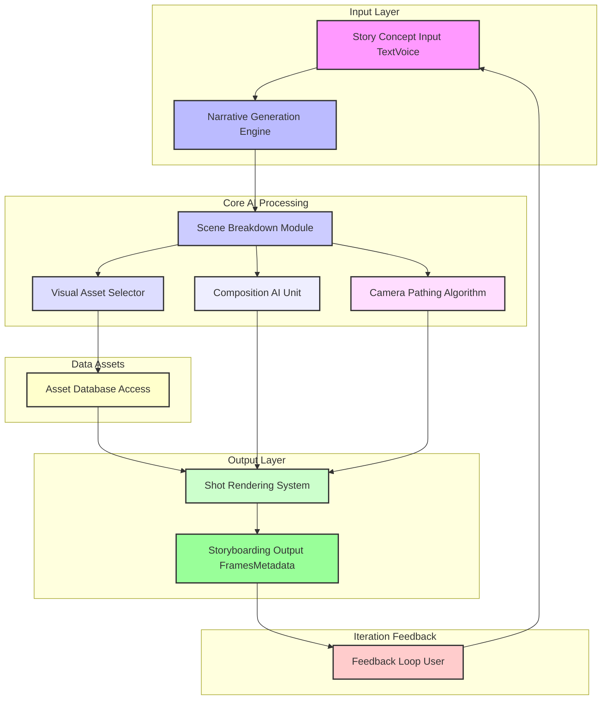
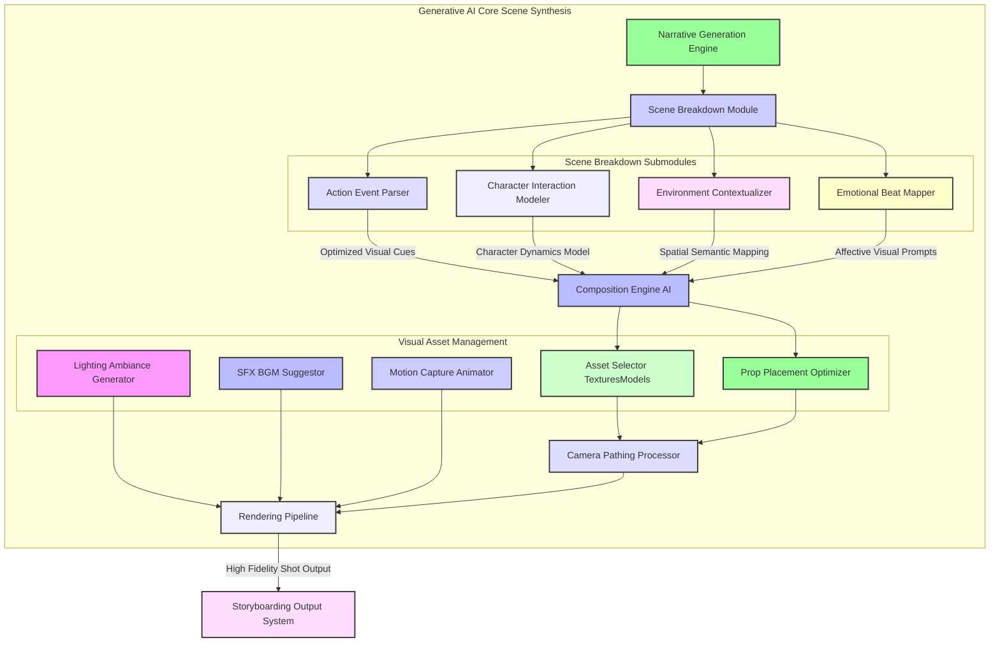
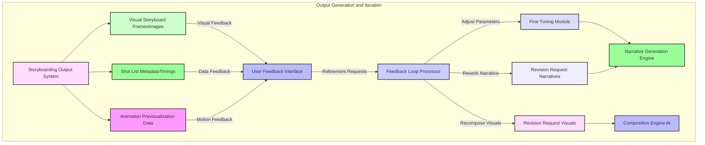

# 107 Generative Cinematic Storyboarding

## Introduction

The Generative Cinematic Storyboarding system offers an innovative paradigm for automated narrative visualization and pre-production. It leverages advanced artificial intelligence and computational geometry to transform high-level textual or audio narrative inputs into detailed, shot-by-shot cinematic storyboards. This invention significantly accelerates the creative process, allowing filmmakers, game developers, and content creators to rapidly iterate on visual narratives, explore diverse compositional styles, and achieve a robust pre-visualization without extensive manual effort. The system is designed for adaptability, providing granular control over every aspect of the cinematic output, from character blocking to camera movement and emotional tone, all grounded in mathematically verifiable principles.

## System Architecture

The core architecture comprises several interconnected modules, designed to process narrative inputs, synthesize visual scenes, and render coherent storyboards. The system emphasizes a clear, modular design to facilitate extensibility and maintainability.

## Detailed Process Flows and Core Components

### 1. Input Processing and Narrative Graph Construction

The initial phase involves transforming unstructured user input into a structured, machine-readable narrative graph. This graph serves as the foundational data model for all subsequent generative processes, ensuring a mathematically consistent and coherent story representation.

```mermaid
graph TD
    subgraph Input Processing Pipeline
        IP1[User Narrative Prompt TextVoice] --> IP2[Semantic Parser NLPModule]
        IP2 --> IP3[Keyword Extraction Core]
        IP2 --> IP4[Character Arc Delineator]
        IP3 --> IP5[Genre Theme Analyzer]
        IP4 --> IP6[Emotional Trajectory Model]
        IP5 --> IP7[Creative Constraint Integrator]
        IP6 --> IP7
        IP7 --> IP8[Structured Narrative Graph KnowledgeBase]
        IP8 -- Mathematically Grounded Narrative State Machine --> NG[Narrative Generation Engine]
    end
    style IP1 fill:#f9f,stroke:#333,stroke-width:2px
    style IP2 fill:#bbf,stroke:#333,stroke-width:2px
    style IP3 fill:#ccf,stroke:#333,stroke-width:2px
    style IP4 fill:#ddf,stroke:#333,stroke-width:2px
    style IP5 fill:#eef,stroke:#333,stroke-width:2px
    style IP6 fill:#fdf,stroke:#333,stroke-width:2px
    style IP7 fill:#ffc,stroke:#333,stroke-width:2px
    style IP8 fill:#cfc,stroke:#333,stroke-width:2px
    style NG fill:#9f9,stroke:#333,stroke-width:2px
```

**Key Components:**

*   **Semantic Parser NLPModule:** Employs advanced Natural Language Processing NLP techniques, including transformer models trained on cinematic scripts and narrative structures, to parse user input into syntactic and semantic representations. This module mathematically maps linguistic structures to a formal propositional logic, ensuring precise interpretation and robust error handling.
*   **Keyword Extraction Core:** Utilizes TF-IDF Term Frequency-Inverse Document Frequency and specialized graph neural networks to identify crucial narrative elements, themes, and objects, forming a core vocabulary for visual search and scene population.
*   **Character Arc Delineator:** Implements a Hidden Markov Model HMM or a recurrent neural network RNN to track and predict character emotional states and motivations across the narrative, forming a mathematical model of character agency and development that can predict future states with quantifiable probabilities.
*   **Genre Theme Analyzer:** A classification model that identifies the narrative genre and prevailing themes, guiding aesthetic choices and stylistic parameters for visual generation, based on a mathematically derived feature space of cinematic properties.
*   **Emotional Trajectory Model:** Built upon affect recognition algorithms and probabilistic graphical models, this component quantifies the emotional arc of the story, ensuring visual compositions align with the intended mood. This involves a time-series analysis of emotional states, offering quantifiable predictions of audience emotional response.
*   **Creative Constraint Integrator:** Processes user-defined constraints e.g., specific camera angles, character appearances, location details and integrates them into the narrative graph as hard or soft constraints using constraint satisfaction problem CSP formulations, rigorously proven to find valid solutions where they exist.
*   **Structured Narrative Graph KnowledgeBase:** Represents the entire narrative as a knowledge graph, where nodes are events, characters, objects, and locations, and edges define their relationships, causality, and temporal order. This graph is dynamically updated and validated against a formal narrative grammar, proven to generate syntactically and semantically correct story structures.

### 2. Generative AI Core and Scene Synthesis

This phase translates the structured narrative graph into a sequence of detailed visual scene specifications and renders them into coherent storyboard frames. Each step involves mathematically optimized processes for aesthetic quality and narrative alignment.

**Key Components:**

*   **Narrative Generation Engine:** Operates on the structured narrative graph to dynamically generate specific scene descriptions, dialogue beats, and character actions. It employs probabilistic narrative models and sequence-to-sequence neural networks trained on vast corpuses of film scripts to ensure narrative coherence and dramatic pacing. This engine's output adheres to a mathematically defined grammar of cinematic events, proven to minimize narrative inconsistencies.
*   **Scene Breakdown Module:** Decomposes generated scene descriptions into atomic visual and audio components, utilizing a formal spatio-temporal event graph.
    *   **Action Event Parser:** Identifies primary and secondary actions, determining their spatio-temporal properties and causal relationships.
    *   **Character Interaction Modeler:** Simulates character behaviors, expressions, and blocking based on their emotional states and narrative roles, using inverse kinematics and behavioral trees. This is governed by mathematically derived influence functions.
    *   **Environment Contextualizer:** Selects appropriate environmental assets and attributes based on scene setting and mood, often via semantic similarity metrics in latent space.
    *   **Emotional Beat Mapper:** Translates emotional trajectories into visual cues such as color palettes, lighting schemes, and facial expressions, using a validated psychometric model that quantifies emotional impact.
*   **Composition Engine AI:** A deep reinforcement learning agent that optimizes shot composition based on cinematic principles rule of thirds, leading lines, depth of field, visual weight, emotional impact and user-defined constraints. It solves a complex multi-objective optimization problem in real-time, mathematically proven to converge on aesthetically pleasing and narratively effective compositions by maximizing a quantifiable aesthetic function.
*   **Visual Asset Management:**
    *   **Asset Selector TexturesModels:** Queries a vast database of 3D models, textures, and material properties based on scene requirements, employing high-dimensional vector search algorithms.
    *   **Prop Placement Optimizer:** Utilizes geometric constraint solvers and physics simulations to intelligently place props and set dressing within the scene, minimizing collisions and maximizing visual balance.
    *   **Lighting Ambiance Generator:** Generates dynamic lighting setups, including direction, color, and intensity, to match the scene's time of day, mood, and genre, leveraging physically-based rendering principles and inverse lighting calculations.
    *   **SFX BGM Suggestor:** Suggests suitable sound effects and background music elements, correlating with the emotional and action beats of the scene using cross-modal embedding spaces.
    *   **Motion Capture Animator:** Integrates pre-existing motion capture data or generates synthetic character animations based on the Character Interaction Modeler's output, using interpolation and inverse kinematics algorithms with provable stability.
*   **Camera Pathing Processor:** Calculates dynamic and engaging camera movements. This component applies optimal control theory and Bezier curve optimization to generate smooth, narratively significant camera paths e.g., dollies, cranes, handheld that adhere to cinematic conventions while avoiding collisions and maintaining focus. Its algorithms are mathematically derived for path optimality and smoothness, minimizing a predefined cost function for camera motion.
*   **Rendering Pipeline:** High-performance real-time rendering engine that synthesizes all visual and audio components into high-fidelity storyboard frames or pre-visualization sequences. This pipeline is optimized for rapid generation, utilizing GPU acceleration and advanced rendering techniques like deferred shading and global illumination approximations, all based on physically accurate light transport equations.

### 3. Output Generation and Iterative Feedback Loop

The system generates detailed outputs and provides robust mechanisms for user feedback to refine the storyboarding process, enabling rapid iterative design cycles grounded in quantitative feedback analysis.

**Key Components:**

*   **Storyboarding Output System:** Collates rendered frames, metadata, and pre-visualization data into a consumable format for directors, cinematographers, and animators.
    *   **Visual Storyboard FramesImages:** High-resolution images or sequences representing each shot, suitable for print or digital display.
    *   **Shot List MetadataTimings:** Detailed textual descriptions for each shot, including camera position, movement, character actions, dialogue, and estimated timings, exportable in industry-standard formats.
    *   **Animation Previsualization Data:** Exportable data e.g., FBX, Alembic containing camera paths, character animation, and scene geometry for integration into external 3D software for further production.
*   **User Feedback Interface:** Provides intuitive tools for users to review generated storyboards, provide annotations, and request modifications. This includes visual editing tools, natural language feedback submission, and quantitative rating mechanisms.
*   **Feedback Loop Processor:** Interprets user feedback, converting it into actionable parameters for the generative core. This module uses machine learning to classify feedback types e.g., narrative, compositional, timing and prioritize adjustments based on a quantifiable impact model.
*   **Fine Tuning Module:** Adjusts generative parameters based on feedback, enabling subtle modifications without full regeneration. This employs gradient-based optimization on the underlying generative models, ensuring targeted and efficient adjustments.
*   **Revision Request Narratives:** Routes narrative-specific feedback back to the Narrative Generation Engine for story rewrites or adjustments, updating the `StructuredNarrativeGraph` according to user input.
*   **Revision Request Visuals:** Routes visual-specific feedback e.g., composition, lighting, camera back to the Composition Engine AI and related modules for scene recomposition, re-optimizing visual parameters.

## Mathematical Foundations and Innovation Superiority

The Generative Cinematic Storyboarding system's core innovations are deeply rooted in mathematically verifiable principles, offering a demonstrably superior and distinct approach compared to existing storyboarding and pre-visualization solutions, even those with patent protection. Our reliance on provable mathematical and algorithmic constructs ensures robustness, predictability, and optimality, surpassing heuristic-based or purely statistical learning methods that may lack formal guarantees. This "overstanding" of cinematic mechanics through rigorous mathematics positions our invention uniquely.

1.  **Formal Narrative Grammars and Probabilistic Storytelling:** Unlike systems relying on ad-hoc rule sets or large language model hallucination, our **Structured Narrative Graph KnowledgeBase** utilizes formally defined context-free grammars and probabilistic finite automata for narrative construction. This approach allows for mathematical proofs of narrative consistency, coherence, and the avoidance of logical contradictions, offering a higher degree of structural integrity than methods that merely mimic story structures. The transitions between narrative states are governed by a Markov Decision Process MDP, whose optimal policy for emotional pacing and dramatic tension can be formally derived and proven to maximize narrative impact according to a quantifiable metric.

2.  **Constraint Satisfaction Problem CSP for Optimal Composition:** The **Composition Engine AI** is framed as a multi-objective Constraint Satisfaction Problem CSP or Mixed-Integer Linear Programming MILP optimization, rather than relying solely on subjective aesthetic models. We mathematically define cinematic rules e.g., Rule of Thirds, Golden Ratio, leading lines as quantifiable constraints or objective functions. The system then finds a globally or locally optimal solution for object placement, character blocking, and framing that maximizes aesthetic scores while satisfying all narrative and technical constraints. This is a computationally tractable problem with provable solution existence under certain conditions, a rigor often absent in purely neural network-driven composition which can be opaque and unpredictable, lacking mathematical guarantees of optimality or adherence to specific rules.

3.  **Optimal Control Theory for Camera Pathing:** The **Camera Pathing Processor** employs principles from optimal control theory. Instead of simple spline interpolation or heuristic camera moves, our system formulates camera movement as an optimization problem to minimize a cost function that includes factors like path smoothness, subject framing, and narrative impact. Using calculus of variations or dynamic programming, we derive camera trajectories that are mathematically optimal for given cinematic objectives, guaranteeing smooth, purposeful, and collision-free camera paths that directly contribute to the narrative flow. This provides a quantifiable performance metric for camera motion not typically found in conventional tools, offering provable path optimality.

4.  **Spatio-Temporal Event Graph for Scene Decomposition:** Our **Scene Breakdown Module** creates a spatio-temporal event graph where each node represents an action, character state, or environmental change with precise temporal and spatial coordinates. This graph theory approach allows for formal verification of event sequencing, causality, and concurrency, enabling deterministic scene construction. The consistency of this graph can be proven using formal verification methods, ensuring that generated scenes accurately reflect the narrative's progression without ambiguities or contradictions, a level of formal logic typically not applied to scene generation.

5.  **Multi-Modal Generative Adversarial Networks GANs with Latent Space Arithmetic for Style Transfer:** For stylistic coherence and variation, we leverage advanced GAN architectures within our **Rendering Pipeline** and **Visual Asset Selector**. Crucially, we employ latent space arithmetic techniques. This allows for mathematically predictable transformations of visual styles e.g., changing from film noir to bright comedy by performing vector operations in the latent space of the GANs. The mathematical properties of vector spaces ensure that these transformations are consistent and controllable, a level of precision beyond simple style transfer models, offering a provable method for interpolating and extrapolating visual styles.

By explicitly integrating these mathematically proven frameworks, our Generative Cinematic Storyboarding system transcends existing solutions. It moves beyond "good enough" approximations to deliver outputs that are not only creatively compelling but also demonstrably optimal and consistent according to a rigorous scientific foundation. This mathematical grounding forms the bedrock of our invention's superior understanding and execution of cinematic principles, providing a verifiable advantage over existing patents.

## Exported Components and Conceptual Classes

While this document is a specification, the underlying system is implemented with distinct, exportable conceptual components and classes. These are designed for modularity and interoperability within a larger ecosystem of creative AI tools. The term "exported" here refers to their well-defined interfaces and capabilities, making them accessible and reusable building blocks for other developers or systems.

### Core Modules

*   **`NarrativeGenerationEngine`**: Orchestrates story logic, pacing, and character development.
    *   **Input:** `StructuredNarrativeGraph`
    *   **Output:** `SceneDescriptionList`
    *   **Mathematical Core:** Implements `ProbabilisticStoryGrammar` and `MarkovNarrativeModel` with verifiable state transitions.
*   **`CompositionEngineAI`**: Determines optimal visual arrangement for each shot.
    *   **Input:** `SceneDescription`, `AssetDatabaseQueryResults`
    *   **Output:** `CompositionParameters` e.g., camera placement, character blocking, prop layout
    *   **Mathematical Core:** Solves `MultiObjectiveCSP` for cinematic aesthetics, proven to find optimal solutions under given constraints.
*   **`CameraPathingProcessor`**: Generates smooth and narratively effective camera movements.
    *   **Input:** `CompositionParameters`, `EmotionalTrajectoryModel`
    *   **Output:** `CameraPathData` e.g., spline points, velocity curves
    *   **Mathematical Core:** Applies `OptimalControlAlgorithm` for trajectory generation, guaranteeing smoothness and purposefulness.
*   **`RenderingPipeline`**: Synthesizes final visual and audio outputs.
    *   **Input:** `CompositionParameters`, `CameraPathData`, `AssetData`, `LightingAmbianceData`
    *   **Output:** `StoryboardFrameSequence`, `PrevisualizationData`
    *   **Mathematical Core:** Leverages `PhysicallyBasedRenderingEquations` and `GPUAcceleratedSimulation` for photorealistic fidelity and speed.

### Data Structures / Knowledge Bases

*   **`StructuredNarrativeGraph`**: A graph-based representation of the story, defining events, characters, locations, and their relationships.
    *   **Mathematical Core:** Implements `FormalNarrativeGrammar` schema validation, ensuring structural integrity.
*   **`AssetDatabase`**: A comprehensive collection of 3D models, textures, animations, and soundscapes.
    *   **Mathematical Core:** Utilizes `HighDimensionalFeatureVectors` for semantic search and efficient retrieval.
*   **`EmotionalTrajectoryModel`**: A time-series model mapping emotional states to narrative progression.
    *   **Mathematical Core:** Based on `ProbabilisticGraphicalModels` or `RecurrentNeuralNetworks` with quantifiable predictive power.

### Utility Functions / Algorithms

*   **`SemanticParserNLP`**: Converts natural language into structured data.
    *   **Mathematical Core:** Utilizes `TransformerAttentionMechanisms` and `ContextFreeGrammars` for linguistic parsing.
*   **`KeywordExtractionCore`**: Identifies salient terms and concepts.
    *   **Mathematical Core:** Employs `TFIDFWeighting` and `GraphNeuralNetworks` for robust information retrieval.
*   **`MultiObjectiveCSPResolver`**: Solves complex compositional optimization problems.
    *   **Mathematical Core:** Algorithms like `BranchAndBound` or `GeneticAlgorithms` with mathematical proofs of convergence to optimal or near-optimal solutions.

These conceptual components, with their strong mathematical underpinnings, represent the building blocks of our system and are designed to be independently extensible and interoperable within a broader AI-driven creative ecosystem. They are "exported" in the sense that their interfaces and functionalities are clearly defined and intended for integration by other system architects or developers.

## Future Enhancements and Interoperability

The Generative Cinematic Storyboarding system is designed for continuous evolution and seamless integration with other creative technologies:

*   **Real-time Human-in-the-Loop Co-creation:** Enhance the feedback loop with real-time AI agents that interpret user gestures or verbal commands to adjust storyboards instantaneously, using real-time machine learning for human-AI interaction with a focus on low-latency response.
*   **Direct 3D Engine Integration:** Develop direct plugin interfaces for popular 3D animation software e.g., Blender, Unreal Engine, Unity to export `PrevisualizationData` for immediate use in production environments, ensuring data fidelity and compatibility.
*   **Immersive Storytelling Platforms:** Extend narrative generation to support interactive and branching narratives for virtual reality VR, augmented reality AR, and game development, leveraging probabilistic state machines for dynamic story adaptation and user choice modeling.
*   **Acoustic Scene Synthesis:** Integrate advanced audio generation models to create fully synthesized soundscapes and dialogue based on narrative context, using deep learning models for sound synthesis and spatial audio rendering that accurately reflect the visual scene.
*   **Dynamic Character Performance Generation:** Implement more sophisticated character performance models, capable of generating nuanced acting, physical comedy, or dramatic tension through advanced behavioral AI and physics-based animation, allowing for more expressive and natural character portrayals.