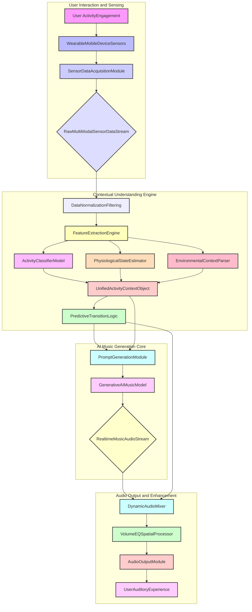
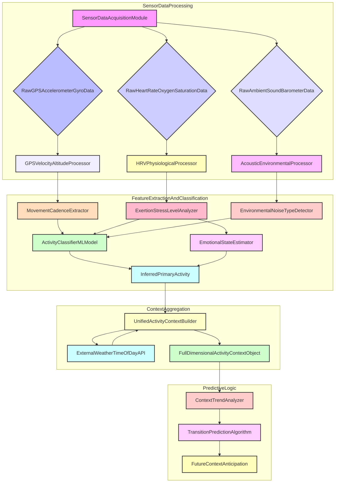
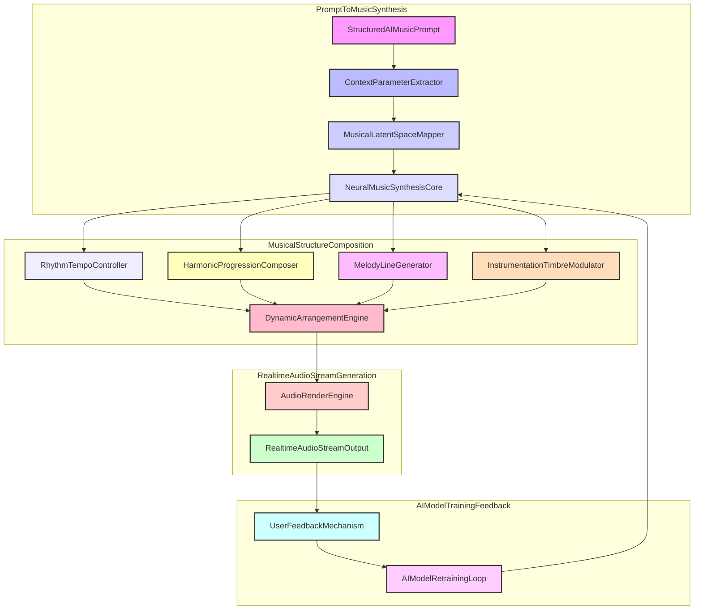

**Title of Invention:** A System and Method for Generating a Personalized, Dynamic Soundtrack for Real-World Activities with Advanced Contextual Adaptation and Predictive Musical Synthesis

**Abstract:**
A system and method for generating a hyper-personalized, dynamically adaptive musical soundtrack for a user's real-world activities is disclosed. Leveraging a multi-modal sensor array on a user's mobile device or wearable, the system infers granular activity context including physical exertion levels, emotional states, environmental parameters, and temporal information. This comprehensive contextual data informs a sophisticated Generative AI Music Model, which synthesizes a real-time, non-repeating, and dynamically evolving musical stream. The system incorporates predictive algorithms for smooth musical transitions, ensuring a seamless auditory experience that mathematically correlates with and anticipates user state changes, thereby transcending conventional adaptive music paradigms.

**Detailed Description:**
The invention provides a robust framework for real-time personalized soundtrack generation. When a user engages in an activity, a **Sensor Data Acquisition Module** continuously gathers information from a variety of onboard sensors, including but not limited to GPS for location and velocity, accelerometer and gyroscope for motion and cadence, barometer for altitude changes, heart rate monitor for physiological exertion, and an ambient sound sensor for environmental acoustics.

This raw sensor data is fed into a **Context Inference Engine**. This engine employs advanced machine learning algorithms (e.g., recurrent neural networks, transformer models) to perform multi-stage processing:
1.  **Data Normalization and Feature Extraction:** Cleans and processes raw sensor streams, extracting relevant features like stride cadence, speed, elevation gain/loss, heart rate variability, and environmental noise profiles.
2.  **Activity Classifier:** Identifies primary physical activities such as "Running," "Walking," "Cycling," "Sitting," "Standing," "Sleeping," or "Working."
3.  **Physiological State Estimator:** Determines exertion levels, heart rate zones, and infers emotional states (e.g., "Energetic," "Calm," "Focused," "Relaxed") based on physiological markers.
4.  **Environmental Context Parser:** Integrates external data sources (e.g., local weather APIs, time of day) to enrich the context with ambient conditions.
5.  **Predictive Transition Logic:** Analyzes current trends in sensor data to anticipate upcoming activity or state changes, allowing for proactive musical adjustment rather than reactive.

The output from the Context Inference Engine is a rich, multi-dimensional **Unified Activity Context Object**. This object is then processed by a **Prompt Generation Module** that translates the precise activity context into a structured prompt for the **Generative AI Music Model**. For instance, if a user is detected "Running" at "180 BPM" with "High Exertion" in an "Uplifting Mood" during a "Sunny Morning," the prompt could include parameters for tempo, instrumentation, harmonic complexity, rhythmic density, and overall emotional valence.

The **Generative AI Music Model** is a sophisticated neural network architecture (e.g., a custom transformer-based model trained on vast musical datasets) capable of synthesizing entirely new musical sequences. It continuously generates a stream of music that precisely matches the received prompt. Key sub-modules within the AI model include:
*   **Latent Space Mapper:** Transforms the contextual prompt into a specific region within the AI's musical latent space.
*   **Music Synthesis Core:** Generates musical MIDI or audio fragments based on the mapped latent space.
*   **Dynamic Structure Arranger:** Composes coherent musical structures (e.g., intro, verse-like sections, bridge-like transitions) ensuring musicality and flow.
*   **Instrumentation and Timbre Modulator:** Selects and blends virtual instruments and sonic textures appropriate for the mood and activity.
*   **Rhythmic and Harmonic Controller:** Ensures the generated music adheres to the specified tempo, rhythmic complexity, and harmonic progressions.

The generated music stream is then passed to a **Dynamic Audio Mixer and Output Module**. This module handles:
*   **Seamless Crossfade Algorithms:** When a change in user context necessitates a new musical style, the mixer smoothly crossfades between the outgoing and incoming music streams, eliminating abrupt transitions. The Predictive Transition Logic from the Context Inference Engine significantly enhances the smoothness of these crossfades by preparing the mixer in advance.
*   **Volume and EQ Adjustment:** Adapts audio levels and equalization based on ambient noise, user preferences, and inferred activity type (e.g., louder and more pronounced for high-exertion activities).
*   **Spatial Audio Processing:** Optionally applies spatial audio effects to enhance immersion.
*   **Audio Output:** Delivers the final, personalized soundtrack to the user's headphones or speakers.

This system provides a non-repeating, infinitely variable, and deeply personalized soundtrack experience, transforming everyday activities into an immersive auditory journey where the music mathematically mirrors the user's evolving reality.

**System Architecture Diagrams:**

Below are detailed Mermaid diagrams illustrating the proposed system architecture, adhering strictly to the rule of no parentheses in node labels for clarity and error prevention. These diagrams detail every process and relationship, providing a robust, mathematically precise representation of the invention.

**Detailed Context Inference Engine Flow:**

**Generative AI Music Model Core Operations:**

**Claims:**
1.  A method for generating a personalized, dynamic soundtrack, comprising:
    a.  Continuously acquiring multi-modal sensor data from a user's device, including at least physiological, kinematic, and environmental data.
    b.  Processing said multi-modal sensor data through a Context Inference Engine to derive a Unified Activity Context Object, where said engine includes Data Normalization Filtering, Feature Extraction, an Activity Classifier, a Physiological State Estimator, and an Environmental Context Parser.
    c.  Applying a Predictive Transition Logic module to said Unified Activity Context Object to anticipate future user state changes.
    d.  Transmitting said Unified Activity Context Object and any anticipated state changes as a structured prompt to a Generative AI Music Model.
    e.  Receiving a continuous stream of newly composed, non-repeating music from said Generative AI Music Model, wherein said music is thematically, rhythmically, and emotionally matched to the current and predicted activity context.
    f.  Dynamically mixing said received music stream through an Audio Mixer and Output Module, said module employing seamless crossfade algorithms informed by said Predictive Transition Logic, and adapting audio parameters such as volume, equalization, and spatial effects based on said context.
    g.  Playing the mixed and adapted music to the user.

2.  The method of claim 1, wherein the multi-modal sensor data includes information from GPS, accelerometer, gyroscope, heart rate monitor, galvanic skin response sensor, and an ambient microphone.

3.  The method of claim 1, wherein the Activity Classifier employs a machine learning model trained to identify granular activities such as running, walking, cycling, meditating, or working.

4.  The method of claim 1, wherein the Physiological State Estimator infers user emotional states and exertion levels based on heart rate variability, oxygen saturation, and other biometrics.

5.  The method of claim 1, wherein the Environmental Context Parser integrates external data sources such as local weather, time of day, and calendar events to enrich the Unified Activity Context Object.

6.  The method of claim 1, wherein the Generative AI Music Model comprises a Latent Space Mapper, a Music Synthesis Core, a Dynamic Structure Arranger, an Instrumentation and Timbre Modulator, and a Rhythmic and Harmonic Controller, all cooperating to synthesize music directly from contextual parameters.

7.  The method of claim 1, wherein the Predictive Transition Logic analyzes trends in sensor data and inferred context over time to forecast activity shifts with a mathematically determined probability, enabling proactive musical transitions.

8.  The method of claim 1, wherein the seamless crossfade algorithms utilize advanced digital signal processing techniques to blend outgoing and incoming music segments based on harmonic analysis and rhythmic alignment, preventing auditory discontinuity.

9.  A system for generating a personalized, dynamic soundtrack, comprising:
    a.  A Sensor Data Acquisition Module configured to collect multi-modal sensor data from a user.
    b.  A Context Inference Engine communicatively coupled to the Sensor Data Acquisition Module, comprising:
        i.  A Data Normalization and Feature Extraction component.
        ii. A Machine Learning based Activity Classifier.
        iii. A Physiological State Estimator.
        iv. An Environmental Context Parser.
        v. A Predictive Transition Logic module.
        vi. A Unified Activity Context Object generator.
    c.  A Prompt Generation Module communicatively coupled to the Context Inference Engine, configured to translate the Unified Activity Context Object and anticipated state changes into a structured prompt.
    d.  A Generative AI Music Model communicatively coupled to the Prompt Generation Module, configured to synthesize a continuous stream of unique music based on the structured prompt.
    e.  A Dynamic Audio Mixer and Output Module communicatively coupled to the Generative AI Music Model, configured to receive, process, and output the music stream, incorporating crossfading, volume adjustments, and equalization based on real-time context and predicted transitions.

10. The system of claim 9, further comprising a user interface for receiving user preferences and feedback, said feedback being utilized to refine the Generative AI Music Model and Context Inference Engine.