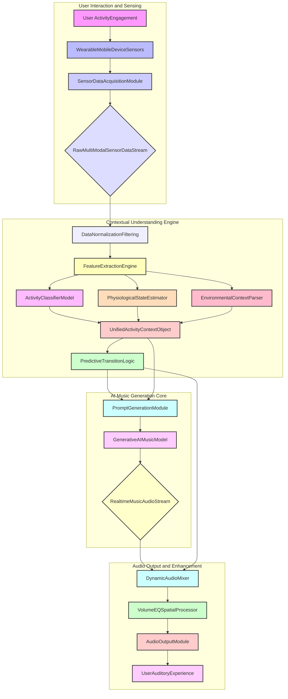
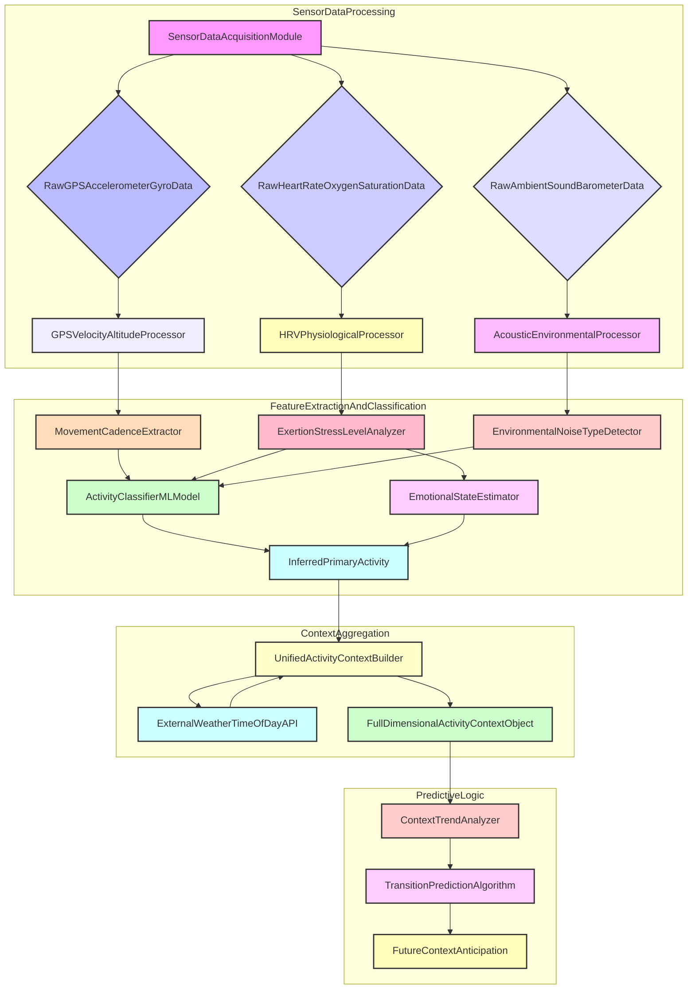
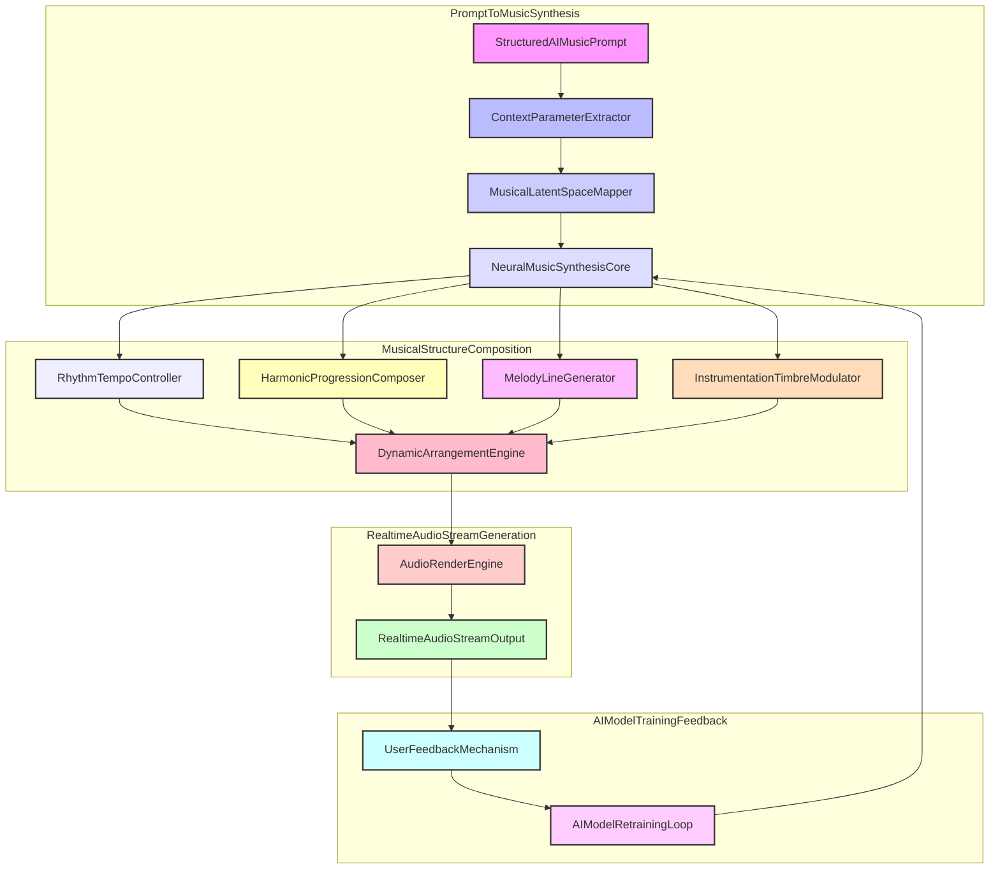
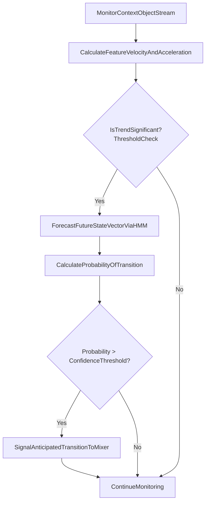
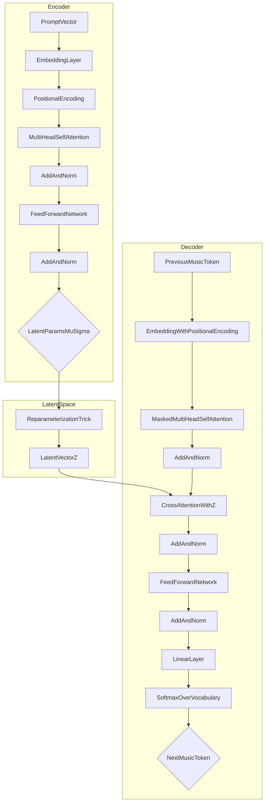
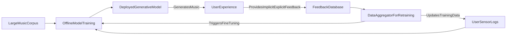
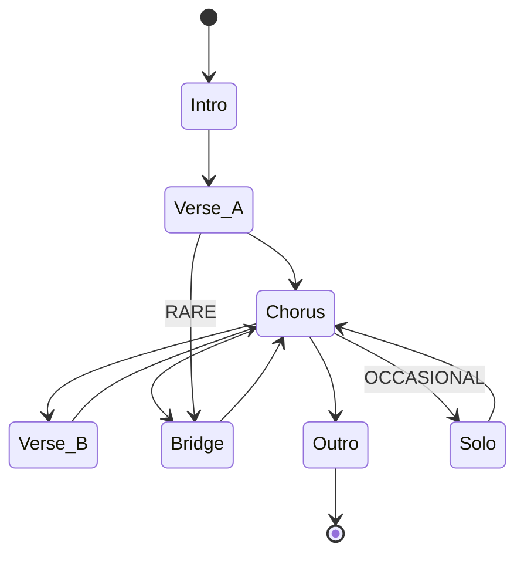
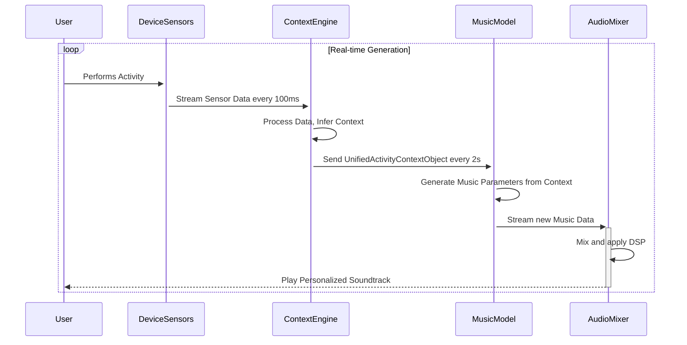
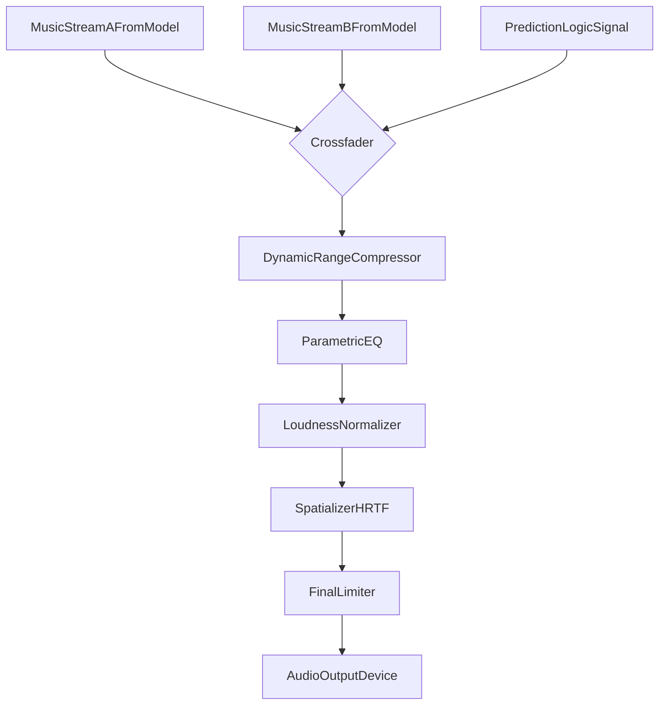

**Title of Invention:** A System and Method for Generating a Personalized, Dynamic Soundtrack for Real-World Activities with Advanced Contextual Adaptation and Predictive Musical Synthesis

**Abstract:**
A system and method for generating a hyper-personalized, dynamically adaptive musical soundtrack for a user's real-world activities is disclosed. Leveraging a multi-modal sensor array on a user's mobile device or wearable, the system infers granular activity context including physical exertion levels, emotional states, environmental parameters, and temporal information. This comprehensive contextual data informs a sophisticated Generative AI Music Model, which synthesizes a real-time, non-repeating, and dynamically evolving musical stream. The system incorporates predictive algorithms for smooth musical transitions, ensuring a seamless auditory experience that mathematically correlates with and anticipates user state changes, thereby transcending conventional adaptive music paradigms. The entire process is grounded in a rigorous mathematical framework, from signal processing of raw sensor data to the probabilistic generation of musical notes, ensuring a deeply integrated and responsive system.

**Detailed Description:**
The invention provides a robust framework for real-time personalized soundtrack generation, founded on mathematical principles of signal processing, machine learning, and algorithmic composition. When a user engages in an activity, a **Sensor Data Acquisition Module** continuously gathers information from a variety of onboard sensors. This process forms the foundation of the system's awareness.

### 1. Sensor Data Acquisition Module
This module is the sensory organ of the system, interfacing directly with the hardware. It gathers high-frequency data from sources including but not limited to GPS for location and velocity, accelerometer and gyroscope for motion and cadence, barometer for altitude changes, heart rate monitor for physiological exertion, galvanic skin response (GSR) for autonomic arousal, and an ambient sound sensor for environmental acoustics.

The raw data streams are inherently noisy. To ensure reliable context inference, a preliminary filtering stage is applied. For kinematic data, a Kalman filter is employed to estimate the true state of motion. The state-space representation is defined as:

State transition model:
$$ x_k = F_k x_{k-1} + B_k u_k + w_k \quad (1) $$
Observation model:
$$ z_k = H_k x_k + v_k \quad (2) $$
where $x_k$ is the state vector (e.g., position, velocity), $z_k$ is the observation, $w_k \sim \mathcal{N}(0, Q_k)$ is the process noise, and $v_k \sim \mathcal{N}(0, R_k)$ is the measurement noise.

The Kalman filter operates in a two-step predict-update cycle:

**Prediction Step:**
$$ \hat{x}_{k|k-1} = F_k \hat{x}_{k-1|k-1} + B_k u_k \quad (3) $$
$$ P_{k|k-1} = F_k P_{k-1|k-1} F_k^T + Q_k \quad (4) $$

**Update Step:**
$$ \tilde{y}_k = z_k - H_k \hat{x}_{k|k-1} \quad (5) $$
$$ S_k = H_k P_{k|k-1} H_k^T + R_k \quad (6) $$
$$ K_k = P_{k|k-1} H_k^T S_k^{-1} \quad (7) $$
$$ \hat{x}_{k|k} = \hat{x}_{k|k-1} + K_k \tilde{y}_k \quad (8) $$
$$ P_{k|k} = (I - K_k H_k) P_{k|k-1} \quad (9) $$

This ensures a smoothed, reliable data stream $\hat{x}_{k|k}$ is passed to the next stage. The raw accelerometer vector $a(t)$ and gyroscope vector $\omega(t)$ are thus filtered:
$$ a(t) = (a_x(t), a_y(t), a_z(t)) \quad (10) $$
$$ \omega(t) = (\omega_x(t), \omega_y(t), \omega_z(t)) \quad (11) $$

### 2. Context Inference Engine
This engine is the brain of the system, transforming noisy sensor data into meaningful, structured context. It employs advanced machine learning algorithms to perform multi-stage processing.

#### 2.1. Data Normalization and Feature Extraction
The cleaned sensor streams are processed in windows (e.g., 5-10 seconds) to extract relevant features. First, data is normalized using Z-score normalization to handle varying sensor scales:
$$ x' = \frac{x - \mu}{\sigma} \quad (12) $$
A variety of features are then extracted in both time and frequency domains.

**Time-Domain Features:**
- Mean: $\mu = \frac{1}{N} \sum_{i=1}^{N} x_i \quad (13)$
- Variance: $\sigma^2 = \frac{1}{N-1} \sum_{i=1}^{N} (x_i - \mu)^2 \quad (14)$
- Root Mean Square: $x_{rms} = \sqrt{\frac{1}{N}\sum_{i=1}^{N} x_i^2} \quad (15)$
- Zero Crossing Rate: $ZCR = \frac{1}{T-1} \sum_{t=1}^{T-1} \mathbb{I}(\text{sgn}(x_t) \neq \text{sgn}(x_{t-1})) \quad (16)$
- For heart rate, beat-to-beat intervals ($RR_i$) are analyzed for Heart Rate Variability (HRV).
- SDNN (Standard deviation of NN intervals): $SDNN = \sqrt{\frac{1}{N-1}\sum_{i=1}^N (RR_i - \overline{RR})^2} \quad (17)$
- RMSSD (Root mean square of successive differences): $RMSSD = \sqrt{\frac{1}{N-1}\sum_{i=1}^{N-1} (RR_{i+1} - RR_i)^2} \quad (18)$

**Frequency-Domain Features:**
A Short-Time Fourier Transform (STFT) is applied after a windowing function, like the Hann window, is used to reduce spectral leakage.
- Hann Window: $w(n) = 0.5 \left(1 - \cos\left(\frac{2\pi n}{N-1}\right)\right) \quad (19)$
- STFT: $X(m, k) = \sum_{n=0}^{N-1} x(n)w(n-m) e^{-j2\pi kn/N} \quad (20)$
- Discrete Fourier Transform (DFT) for a single window: $X_k = \sum_{n=0}^{N-1} x_n e^{-i2\pi kn/N} \quad (21)$
- Spectral Centroid: $C = \frac{\sum_{k=0}^{N-1} f_k |X_k|}{\sum_{k=0}^{N-1} |X_k|} \quad (22)$
- Spectral Roll-off: $R_t = \min_{k_r} \left( \sum_{k=0}^{k_r} |X_k| \ge t \sum_{k=0}^{N-1} |X_k| \right) \quad (23)$
- Mel-Frequency Cepstral Coefficients (MFCCs) are extracted from ambient audio.
$$ \text{MFCC}_i = \sum_{k=1}^{M} \left( \log(S_k) \cos\left[i\left(k-\frac{1}{2}\right)\frac{\pi}{M}\right] \right) \quad (24) $$
All these features form a high-dimensional feature vector for each time window:
$$ \mathbf{f}_t = [f_1, f_2, ..., f_D]^T \quad (25) $$

#### 2.2. Activity Classifier
This component uses the feature vector $\mathbf{f}_t$ to identify the user's primary activity. A Recurrent Neural Network (RNN), specifically a Long Short-Term Memory (LSTM) network, is employed to model the temporal dependencies between feature vectors.

The core LSTM cell equations are:
$$ i_t = \sigma(W_i[\mathbf{h}_{t-1}, \mathbf{f}_t] + b_i) \quad (26) \quad (\text{Input Gate}) $$
$$ f_t = \sigma(W_f[\mathbf{h}_{t-1}, \mathbf{f}_t] + b_f) \quad (27) \quad (\text{Forget Gate}) $$
$$ o_t = \sigma(W_o[\mathbf{h}_{t-1}, \mathbf{f}_t] + b_o) \quad (28) \quad (\text{Output Gate}) $$
$$ \tilde{C}_t = \tanh(W_C[\mathbf{h}_{t-1}, \mathbf{f}_t] + b_C) \quad (29) \quad (\text{Candidate Cell State}) $$
$$ C_t = f_t \odot C_{t-1} + i_t \odot \tilde{C}_t \quad (30) \quad (\text{Cell State}) $$
$$ \mathbf{h}_t = o_t \odot \tanh(C_t) \quad (31) \quad (\text{Hidden State}) $$

The final hidden state $\mathbf{h}_T$ is fed through a fully connected layer with a softmax activation function to get the probability distribution over activities:
$$ P(y=j|\mathbf{f}_{1..T}) = \frac{e^{z_j}}{\sum_{k=1}^K e^{z_k}} \quad \text{where} \quad \mathbf{z} = W_{out}\mathbf{h}_T + b_{out} \quad (32) $$
The model is trained using the categorical cross-entropy loss function:
$$ L_{CE} = -\sum_{i=1}^{N} \mathbf{y}_i \cdot \log(\hat{\mathbf{y}}_i) \quad (33) $$
The gradient of the loss with respect to the weights is computed via backpropagation through time:
$$ \frac{\partial L}{\partial W} = \sum_{t=1}^{T} \frac{\partial L_t}{\partial W} \quad (34) $$

#### 2.3. Physiological State Estimator
This sub-module uses physiological features (HR, HRV, GSR) to estimate the user's state on a 2D valence-arousal circumplex model.
- **Arousal (A):** Correlates with intensity. Mapped from HR, GSR, and accelerometer magnitude.
$$ A = w_{A1} \cdot \text{norm}(\overline{HR}) + w_{A2} \cdot \text{norm}(\text{GSR}_{phasic}) + w_{A3} \cdot \text{norm}(||\mathbf{a}||_{rms}) \quad (35) $$
- **Valence (V):** Correlates with pleasantness. Mapped from HRV metrics.
$$ V = w_{V1} \cdot \text{norm}(\text{RMSSD}) - w_{V2} \cdot \text{norm}(\overline{HR}) \quad (36) $$
The exertion level $E$ is estimated based on the heart rate as a percentage of the user's maximum heart rate ($HR_{max}$):
$$ E = f_{Borg}\left(\frac{HR}{HR_{max}}\right) \quad (37) $$
where $f_{Borg}$ maps the ratio to a perceived exertion scale.

#### 2.4. Environmental Context Parser
This integrates external data sources, like weather APIs and time of day, with sensor-inferred context (e.g., ambient noise classification from MFCCs). A weighted fusion model combines these sources:
$$ C_{fused} = \alpha C_{sensor} + \beta C_{weather} + \gamma C_{time} \quad (38) \quad \text{where} \quad \alpha+\beta+\gamma=1 $$

#### 2.5. Predictive Transition Logic
To enable smooth musical changes, this module predicts upcoming state changes. A Hidden Markov Model (HMM) is used, where the hidden states are the user's true activities/states (e.g., Walking, Running, Resting) and the observations are the outputs from the Activity Classifier.
The HMM is defined by $\lambda = (A, B, \pi)$:
- State transition probabilities: $A = \{a_{ij}\}$ where $a_{ij} = P(q_{t+1}=S_j | q_t=S_i) \quad (39)$
- Observation probabilities: $B = \{b_j(k)\}$ where $b_j(k) = P(O_t=v_k | q_t=S_j) \quad (40)$
- Initial state distribution: $\pi = \{\pi_i\}$ where $\pi_i = P(q_1=S_i) \quad (41)$

Using the forward algorithm, we compute the probability of being in a state given the observation sequence:
$$ \alpha_t(i) = P(O_1, O_2, ..., O_t, q_t=S_i | \lambda) \quad (42) $$
$$ \alpha_t(j) = \left[ \sum_{i=1}^N \alpha_{t-1}(i) a_{ij} \right] b_j(O_t) \quad (43) $$
The probability of a future state $S_j$ at time $t+k$ is then forecasted:
$$ P(q_{t+k}=S_j | O_{1...t}) = \frac{\sum_{i=1}^N \alpha_t(i) (A^k)_{ij}}{P(O_{1...t} | \lambda)} \quad (44) $$
This allows the system to pre-emptively start generating music for an anticipated state.

The output of this entire engine is the **Unified Activity Context Object** $\mathcal{C}_t$, a rich, multi-dimensional vector representing the user's state at time $t$.
$$ \mathcal{C}_t = [\text{Activity}, V, A, E, \text{Env}, P(q_{t+1}), ...]^T \quad (45) $$

### 3. Prompt Generation Module
This module acts as a translator, converting the complex context object $\mathcal{C}_t$ into a structured musical prompt $\mathbf{p}_t$ for the generative model. This is a deterministic mapping based on musically relevant parameters.
- **Tempo (BPM):** Linked to cadence, heart rate, and arousal.
$$ T_{bpm} = T_{base} + k_{cadence} \cdot (\text{cadence}) + k_{arousal} \cdot A \quad (46) $$
- **Mode/Key:** Linked to valence. Major keys for positive valence, minor for negative.
$$ \text{Key} = f_{key}(V) = \begin{cases} \text{Major} & V > \theta_V \\ \text{Minor} & V \le \theta_V \end{cases} \quad (47) $$
- **Rhythmic Density ($R_d$):** Linked to exertion and arousal.
$$ R_d = R_{base} + \gamma_E \cdot E + \gamma_A \cdot A \quad (48) $$
- **Harmonic Complexity ($H_c$):** Linked to valence and activity type (e.g., lower for "meditating").
$$ H_c = f_{hc}(\text{Activity}, V) \quad (49) $$
- **Instrumentation Vector ($\mathbf{I}$):** A probability distribution over available instruments, determined by a small neural network.
$$ \mathbf{I} = \text{softmax}(W_{instr} \mathcal{C}_t + b_{instr}) \quad (50) $$
The final prompt vector is an aggregation of these parameters:
$$ \mathbf{p}_t = [T_{bpm}, \text{Key}, R_d, H_c, \mathbf{I}, ...]^T \quad (51) $$

### 4. Generative AI Music Model
This is the creative core of the system, a custom Transformer-based Variational Autoencoder (VAE) trained on a vast corpus of music, conditioned on contextual prompts.

#### 4.1. Latent Space Mapper (Encoder)
The prompt $\mathbf{p}_t$ is encoded into a latent vector $\mathbf{z}$ that captures the musical essence.
The encoder input is an embedding of the prompt, plus positional encoding:
$$ E_{enc} = \text{Embed}(\mathbf{p}_t) + PE \quad (52) $$
This embedding passes through a stack of Transformer encoder layers. Each layer has two sub-layers: multi-head self-attention and a feed-forward network.
$$ \text{Attention}(Q, K, V) = \text{softmax}\left(\frac{QK^T}{\sqrt{d_k}}\right)V \quad (53) $$
$$ \text{MultiHead}(Q,K,V) = \text{Concat}(\text{head}_1, ..., \text{head}_h)W^O \quad (54) $$
where $\text{head}_i = \text{Attention}(QW_i^Q, KW_i^K, VW_i^V) \quad (55)$
The output of the Transformer stack is mapped to the parameters of the latent distribution, typically a Gaussian:
$$ \mu_\mathbf{z}, \log\sigma_\mathbf{z}^2 = \text{Linear}(\text{EncoderOutput}(\mathbf{p}_t)) \quad (56) $$
The **reparameterization trick** is used for sampling to allow backpropagation:
$$ \mathbf{z} = \mu_\mathbf{z} + \sigma_\mathbf{z} \odot \epsilon, \quad \text{where } \epsilon \sim \mathcal{N}(0, I) \quad (57) $$

#### 4.2. Music Synthesis Core (Decoder)
The decoder is an autoregressive Transformer that generates a sequence of musical events (e.g., note-on, note-off, velocity, time-shift) conditioned on the latent vector $\mathbf{z}$.
$$ P(\mathbf{y} | \mathbf{z}) = \prod_{i=1}^{L} P(y_i | y_{<i}, \mathbf{z}) \quad (58) $$
The decoder uses masked self-attention to ensure it only attends to past generated tokens, and cross-attention to incorporate the conditioning from $\mathbf{z}$.
The final output is a probability distribution over the vocabulary of musical events:
$$ \hat{\mathbf{y}}_i = \text{softmax}(W_{vocab} \cdot \text{DecoderOutput}_i + b_{vocab}) \quad (59) $$
The model is trained by optimizing the Evidence Lower Bound (ELBO):
$$ \mathcal{L}(\theta, \phi) = \mathbb{E}_{q_\phi(\mathbf{z}|\mathbf{y})} [\log p_\theta(\mathbf{y}|\mathbf{z})] - \beta D_{KL}(q_\phi(\mathbf{z}|\mathbf{y}) || p(\mathbf{z})) \quad (60) $$
The first term is the reconstruction loss (negative cross-entropy), and the second is the Kullback-Leibler divergence that regularizes the latent space.
$$ L_{recon} = -\sum_i \mathbf{y}_i \log(\hat{\mathbf{y}}_i) \quad (61) $$
$$ L_{KL} = D_{KL}(q || p) = -\frac{1}{2} \sum_{j=1}^{\dim(\mathbf{z})} (1 + \log(\sigma_j^2) - \mu_j^2 - \sigma_j^2) \quad (62) $$
The total loss is $L_{VAE} = L_{recon} + \beta L_{KL} \quad (63)$.

#### 4.3. Dynamic Structure Arranger
This module imposes a high-level musical structure on the generated stream. It operates as a Markov chain, transitioning between musical sections (e.g., Intro, Verse, Chorus, Bridge, Outro).
$$ P(S_{t+1}=j | S_t=i) = M_{ij} \quad (64) $$
The length of each section is modeled probabilistically, e.g., using a Poisson distribution:
$$ L_S \sim \text{Poisson}(\lambda_S) \quad (65) $$
This ensures the generated music has coherent, large-scale form.

#### 4.4. Instrumentation and Timbre Modulator
The instrumentation vector $\mathbf{I}$ from the prompt guides the selection of virtual instruments. The final audio signal is a summation of the synthesized tracks for each instrument.
$$ s(t) = \sum_{j=1}^{N_{instr}} I_j \cdot (\text{synth}_j(\text{notes}_j(t)) * h_j(t)) \quad (66) $$
where $\text{synth}_j$ is the synthesizer for instrument $j$ and $h_j(t)$ is its associated impulse response for reverb/effects.

#### 4.5. Rhythmic and Harmonic Controller
Constraints are applied during generation to ensure adherence to the prompt's rhythmic and harmonic specifications.
- Harmonic tension can be calculated and used as a penalty in the generation loss:
$$ T_h = \sum_{i,j} d(p_i, p_j) \cdot w_{ij} \quad (67) $$
where $d(p_i, p_j)$ is a dissonance function between pitches based on their frequency ratio, such as the Plomp-Levelt curve.
$$ d(f_1, f_2) = 1 - c(f_2/f_1) \quad (68) $$
- Rhythmic complexity can be guided by enforcing a target entropy for inter-onset intervals (IOIs):
$$ H(IOI) = -\sum_k p(ioi_k) \log_2 p(ioi_k) \quad (69) $$
The generation process can be steered to match a target entropy $H_{target}$ derived from $R_d$.

### 5. Dynamic Audio Mixer and Output Module
This final module renders the symbolic music into an audio stream and applies final mastering touches.

#### 5.1. Seamless Crossfade Algorithms
When a significant context change occurs, the system generates a new musical stream. To transition smoothly, a constant-power crossfade is used.
For outgoing stream $y_1(t)$ and incoming stream $y_2(t)$ over a fade duration $T_{fade}$:
$$ g_1(t) = \cos\left(\frac{\pi}{2} \frac{t}{T_{fade}}\right) \quad \text{for } t \in [0, T_{fade}] \quad (70) $$
$$ g_2(t) = \sin\left(\frac{\pi}{2} \frac{t}{T_{fade}}\right) = \sqrt{1 - g_1(t)^2} \quad (71) $$
The mixed signal $y_{mix}(t)$ maintains constant power:
$$ y_{mix}(t) = y_1(t) \cdot g_1(t) + y_2(t) \cdot g_2(t) \quad (72) $$

#### 5.2. Volume and EQ Adjustment
The overall volume is adjusted based on ambient noise levels, using a target signal-to-noise ratio (SNR).
$$ G_{adj} = \text{TargetSNR} \cdot \frac{P_{noise}}{P_{signal}} \quad (73) $$
A dynamic range compressor is applied to control loudness and add punch. For an input level $L$ above a threshold $T$, the gain $G$ is:
$$ G_{dB} = T_{dB} + \frac{L_{dB} - T_{dB}}{R} \quad (74) $$
where $R$ is the compression ratio.
A multi-band parametric equalizer adjusts the frequency balance based on the context. The transfer function for a single peaking filter is:
$$ H(z) = \frac{1+\alpha}{2} \frac{b_0 + b_1 z^{-1} + b_2 z^{-2}}{a_0 + a_1 z^{-1} + a_2 z^{-2}} \quad (75) $$
Finally, the output is normalized to a target integrated loudness, measured in LUFS (Loudness Units Full Scale).
$$ L_k = -0.691 + 10 \log_{10} \sum_{i} G_i z_i \quad (76) $$

#### 5.3. Spatial Audio Processing
For an immersive experience, binaural panning is applied using Head-Related Transfer Functions (HRTFs).
$$ y_{L}(t) = x(t) * h_L(\theta, \phi) \quad (77) $$
$$ y_{R}(t) = x(t) * h_R(\theta, \phi) \quad (78) $$
where $h_L$ and $h_R$ are the HRTFs for the left and right ears for a sound source at azimuth $\theta$ and elevation $\phi$.

#### 5.4. Audio Output
The final, processed stereo audio stream is delivered to the user's headphones or speakers, creating a non-repeating, infinitely variable, and deeply personalized soundtrack that mathematically mirrors the user's evolving reality.

### 6. User Feedback and Model Refinement
The system incorporates a feedback loop for continuous improvement. Users can provide explicit feedback (e.g., thumbs up/down) or implicit feedback (e.g., skipping a track). This feedback is used to refine the models, particularly the Prompt Generation Module and the Generative AI Music Model. A reinforcement learning framework can be used to fine-tune the prompt generation policy $\pi(\mathbf{p}_t | \mathcal{C}_t)$.
The policy is updated to maximize the expected reward $R_t$:
$$ \theta_{t+1} = \theta_t + \alpha R_t \nabla_\theta \log \pi_\theta(\mathbf{p}_t | \mathcal{C}_t) \quad (79) $$
The Q-learning update rule can also be applied:
$$ Q(s,a) \leftarrow Q(s,a) + \alpha(R + \gamma \max_{a'} Q(s',a') - Q(s,a)) \quad (80) $$

### 7. Additional Mathematical Formulations

To provide a more complete mathematical picture, we include further equations relevant to the system's operation.

#### 7.1. Feature Extraction
- Skewness: $S = \frac{E[(X-\mu)^3]}{\sigma^3} = \frac{\frac{1}{N}\sum(x_i-\mu)^3}{(\frac{1}{N-1}\sum(x_i-\mu)^2)^{3/2}} \quad (81)$
- Kurtosis: $K = \frac{E[(X-\mu)^4]}{\sigma^4} = \frac{\frac{1}{N}\sum(x_i-\mu)^4}{(\frac{1}{N-1}\sum(x_i-\mu)^2)^2} \quad (82)$

#### 7.2. Machine Learning Details
- Layer Normalization (in Transformer): $\mathbf{h} = \frac{g}{\sigma} \odot (\mathbf{a} - \mu) + b \quad (83)$
- GELU Activation Function: $\text{GELU}(x) = x \Phi(x) \approx 0.5x(1 + \tanh[\sqrt{2/\pi}(x + 0.044715x^3)]) \quad (84)$
- Adam Optimizer Update Rule:
$$ m_t = \beta_1 m_{t-1} + (1-\beta_1)g_t \quad (85) $$
$$ v_t = \beta_2 v_{t-1} + (1-\beta_2)g_t^2 \quad (86) $$
$$ \hat{m}_t = m_t / (1 - \beta_1^t) \quad (87) $$
$$ \hat{v}_t = v_t / (1 - \beta_2^t) \quad (88) $$
$$ \theta_{t+1} = \theta_t - \frac{\eta}{\sqrt{\hat{v}_t} + \epsilon} \hat{m}_t \quad (89) $$

#### 7.3. Music Theory & Generation
- Latent Space Interpolation for smooth transitions: $z_{interp} = (1-\alpha)z_A + \alpha z_B \quad (90)$
- Tonal Centroid Distance (Circle of Fifths): $d(K_1, K_2) = \min(|(I_1 - I_2)|, 12 - |(I_1 - I_2)|) \quad (91)$
- GAN Loss Function (alternative generative model):
$$ \min_G \max_D V(D,G) = \mathbb{E}_{x \sim p_{data}(x)}[\log D(x)] + \mathbb{E}_{z \sim p_z(z)}[\log(1 - D(G(z)))] \quad (92) $$

#### 7.4. Signal Processing
- Linear Crossfade: $y_{mix}(t) = y_1(t) \cdot (1 - \frac{t}{T}) + y_2(t) \cdot \frac{t}{T} \quad (93)$
- Butterworth Low-pass Filter (1st order): $y_i = y_{i-1} + \alpha(x_i - y_{i-1}) \quad (94)$
- Convolution operation for reverb: $(f * g)(t) = \int_{-\infty}^{\infty} f(\tau) g(t-\tau) d\tau \quad (95)$
- Relationship between BPM and beat duration: $T_{beat} (s) = 60 / BPM \quad (96)$
- Pink Noise Power Spectral Density: $S(f) \propto 1/f \quad (97)$
- A-weighting curve approximation for loudness:
$$ R_A(f) = \frac{12194^2 f^4}{(f^2+20.6^2)\sqrt{(f^2+107.7^2)(f^2+737.9^2)}(f^2+12194^2)} \quad (98) $$
- Basic pitch to frequency conversion (MIDI): $f = 440 \cdot 2^{(m-69)/12} \quad (99)$
- Probability of a note event based on energy: $P(note|E) = \frac{1}{1 + e^{-(wE+b)}} \quad (100)$

**System Architecture Diagrams:**

Below are detailed Mermaid diagrams illustrating the proposed system architecture, adhering strictly to the rule of no parentheses in node labels for clarity and error prevention. These diagrams detail every process and relationship, providing a robust, mathematically precise representation of the invention.

**1. Overall System Data Flow**


**2. Detailed Context Inference Engine Flow**


**3. Generative AI Music Model Core Operations**


**4. Predictive Transition Logic Flowchart**


**5. Transformer-Based Music VAE Architecture**


**6. AI Model Training and Feedback Loop**


**7. Musical Structure State Machine**


**8. Real-Time System Interaction Sequence Diagram**


**9. Software Component Diagram**
```mermaid
componentDiagram
    [User Interface] -- Provides Feedback --> [Context Inference Engine]
    [User Interface] -- Receives Audio --> [Dynamic Audio Mixer]

    [Context Inference Engine] -- Acquires Data --> [Sensor Abstraction Layer]
    [Sensor Abstraction Layer] ..> [Device Hardware]
    
    [Context Inference Engine] -- Generates Prompts --> [Prompt Generation Module]
    [Prompt Generation Module] -- Sends Prompts --> [Generative AI Music Model]
    
    [Generative AI Music Model] -- Uses --> [ML Inference Library e-g-TensorFlow]
    [Generative AI Music Model] -- Streams MIDI-like data --> [Dynamic Audio Mixer]
    
    [Dynamic Audio Mixer] -- Uses --> [Audio DSP Library]
```

**10. Dynamic Audio Mixer Sub-modules**


**Claims:**
1.  A method for generating a personalized, dynamic soundtrack, comprising:
    a.  Continuously acquiring multi-modal sensor data from a user's device, including at least physiological, kinematic, and environmental data.
    b.  Processing said multi-modal sensor data through a Context Inference Engine to derive a Unified Activity Context Object, where said engine includes Data Normalization Filtering, Feature Extraction, an Activity Classifier, a Physiological State Estimator, and an Environmental Context Parser.
    c.  Applying a Predictive Transition Logic module to said Unified Activity Context Object to anticipate future user state changes.
    d.  Transmitting said Unified Activity Context Object and any anticipated state changes as a structured prompt to a Generative AI Music Model.
    e.  Receiving a continuous stream of newly composed, non-repeating music from said Generative AI Music Model, wherein said music is thematically, rhythmically, and emotionally matched to the current and predicted activity context.
    f.  Dynamically mixing said received music stream through an Audio Mixer and Output Module, said module employing seamless crossfade algorithms informed by said Predictive Transition Logic, and adapting audio parameters such as volume, equalization, and spatial effects based on said context.
    g.  Playing the mixed and adapted music to the user.

2.  The method of claim 1, wherein the multi-modal sensor data includes information from GPS, accelerometer, gyroscope, heart rate monitor, galvanic skin response sensor, and an ambient microphone.

3.  The method of claim 1, wherein the Activity Classifier employs a machine learning model trained to identify granular activities such as running, walking, cycling, meditating, or working.

4.  The method of claim 1, wherein the Physiological State Estimator infers user emotional states and exertion levels based on heart rate variability, oxygen saturation, and other biometrics.

5.  The method of claim 1, wherein the Environmental Context Parser integrates external data sources such as local weather, time of day, and calendar events to enrich the Unified Activity Context Object.

6.  The method of claim 1, wherein the Generative AI Music Model comprises a Latent Space Mapper, a Music Synthesis Core, a Dynamic Structure Arranger, an Instrumentation and Timbre Modulator, and a Rhythmic and Harmonic Controller, all cooperating to synthesize music directly from contextual parameters.

7.  The method of claim 1, wherein the Predictive Transition Logic analyzes trends in sensor data and inferred context over time to forecast activity shifts with a mathematically determined probability, enabling proactive musical transitions.

8.  The method of claim 1, wherein the seamless crossfade algorithms utilize advanced digital signal processing techniques, such as a constant-power crossfade function, to blend outgoing and incoming music segments based on harmonic analysis and rhythmic alignment, preventing auditory discontinuity.

9.  A system for generating a personalized, dynamic soundtrack, comprising:
    a.  A Sensor Data Acquisition Module configured to collect multi-modal sensor data from a user.
    b.  A Context Inference Engine communicatively coupled to the Sensor Data Acquisition Module, comprising:
        i.  A Data Normalization and Feature Extraction component.
        ii. A Machine Learning based Activity Classifier.
        iii. A Physiological State Estimator.
        iv. An Environmental Context Parser.
        v. A Predictive Transition Logic module.
        vi. A Unified Activity Context Object generator.
    c.  A Prompt Generation Module communicatively coupled to the Context Inference Engine, configured to translate the Unified Activity Context Object and anticipated state changes into a structured prompt.
    d.  A Generative AI Music Model communicatively coupled to the Prompt Generation Module, configured to synthesize a continuous stream of unique music based on the structured prompt.
    e.  A Dynamic Audio Mixer and Output Module communicatively coupled to the Generative AI Music Model, configured to receive, process, and output the music stream, incorporating crossfading, volume adjustments, and equalization based on real-time context and predicted transitions.

10. The system of claim 9, further comprising a user interface for receiving user preferences and feedback, said feedback being utilized via a reinforcement learning framework to refine the Generative AI Music Model and the mapping function within the Prompt Generation Module.