### INNOVATION EXPANSION PACKAGE

#### Interpret My Invention(s)

The provided invention, "A System and Method for Generating a Personalized, Dynamic Soundtrack for Real-World Activities with Advanced Contextual Adaptation and Predictive Musical Synthesis," proposes a sophisticated AI-driven system that creates a real-time, infinitely varied musical accompaniment for an individual's life. It leverages multi-modal sensor data (physiological, kinematic, environmental) to infer granular user context, predict future states, and generate deeply personalized music through a Generative AI Music Model. This core invention serves to enhance human experience, well-being, and engagement with their environment through a harmonized auditory interface. Its purpose is to transcend passive listening, offering a living soundtrack that is mathematically and emotionally attuned to the user's evolving reality, fostering presence and optimizing psychological states.

#### Generate 10 New, Completely Unrelated Inventions

The following ten inventions are designed to be original, futuristic, and distinct from the core personalized soundtrack concept, yet are later integrated into a grand unifying system to solve a major global problem. Each invention stands as a significant leap forward in its own domain.

##### 1. Neural-Interface Dream Weaver (NIDW)
**Abstract:** A non-invasive neural interface system capable of real-time monitoring of brainwave activity during REM sleep, coupled with a generative AI that synthesizes and projects bespoke, immersive dream narratives and environments directly into the sleeping mind. This system optimizes sleep quality, facilitates targeted learning, emotional processing, and creative ideation by guiding subconscious processes within a user-defined or therapeutically-orchestrated dreamscape. The NIDW dynamically adapts dream content based on real-time neural feedback to maximize therapeutic and cognitive benefits.

##### 2. Bio-Resonant Material Synthesizer (BRMS)
**Abstract:** A molecular assembler and additive manufacturing system that analyzes an individual's cellular-level bio-data (e.g., epigenetic markers, metabolic states) to dynamically synthesize and print bespoke bio-compatible materials. These materials are imbued with precise resonant frequencies and structural properties designed to promote cellular regeneration, mitigate disease, and optimize physiological function. Examples include adaptive fabrics that deliver targeted bio-signals, and scaffoldings for organ repair that accelerate healing through subtle energetic interactions.

##### 3. Sentient Micro-Ecosystem Guardian (SMEG)
**Abstract:** A decentralized network of autonomous, self-replicating micro-robotic units and AI-controlled sensor arrays designed to monitor, protect, and actively manage localized natural and urban micro-ecosystems. The SMEG system performs hyper-localized environmental corrections, bioremediation, species protection, and resource optimization, dynamically adapting to climate shifts, pollution vectors, and invasive species to maintain biodiversity and ecological health in real-time. It learns and evolves its strategies based on continuous environmental feedback.

##### 4. Cognitive Resonance Emitter (CRE)
**Abstract:** A wearable or ambient device that utilizes precise, individually calibrated low-frequency electromagnetic field (EMF) modulations to gently entrain specific brainwave states (e.g., Alpha for relaxation, Gamma for focus, Theta for creativity). The CRE dynamically adjusts its emissions based on real-time neurofeedback and user intent, optimizing cognitive function, emotional regulation, and mental performance without pharmacological intervention. Its core principle is the resonant frequency matching of neural oscillation patterns.

##### 5. Global Resource Harmonizer AI (GRH-AI)
**Abstract:** A planetary-scale, hyper-agnostic artificial intelligence system that continuously monitors all global resource flows—from water cycles and atmospheric composition to mineral deposits, energy grids, and agricultural output. The GRH-AI employs advanced predictive analytics and optimization algorithms to model resource interdependencies, forecast consumption patterns, identify potential imbalances, and autonomously orchestrate sustainable production, equitable distribution, and efficient recycling initiatives across geopolitical boundaries.

##### 6. Quantum Entanglement Communication Network (QECN)
**Abstract:** A secure, instantaneous communication infrastructure leveraging the principles of quantum entanglement for information transfer. This network establishes entangled particle pairs across vast distances, enabling direct, unjammable, and uninterceptable data transmission that bypasses the limitations of light speed. It provides the backbone for real-time, high-bandwidth data exchange for planetary-scale AI systems and secure personal communications, rendering traditional cyber vulnerabilities obsolete.

##### 7. Adaptive Architectural Morphosis Engine (AAME)
**Abstract:** A system of AI-controlled, programmable matter and responsive structural components that allows physical environments (buildings, infrastructure, habitats) to autonomously reconfigure their shape, size, transparency, insulation, and internal layouts in real-time. This dynamic architecture adapts to environmental conditions (weather, seismic activity), energy efficiency demands, and the evolving needs and preferences of its occupants, creating highly personalized, energy-positive, and resilient living spaces.

##### 8. Nutrient-Synthesizing Atmospheric Processor (NSAP)
**Abstract:** A decentralized array of atmospheric processing units that extract fundamental elements (carbon, hydrogen, oxygen, nitrogen, trace minerals) directly from the air and water vapor. Powered by renewable energy, these units employ advanced molecular synthesis techniques to reconfigure these elements into complex organic molecules, producing a full spectrum of personalized macro- and micronutrients, vitamins, and supplements tailored to individual metabolic profiles. This invention liberates humanity from traditional agriculture and supply chains.

##### 9. Chronos-Synchronicity Predictor (CSP)
**Abstract:** An advanced AI system that analyzes vast datasets of individual and collective human activity, environmental cues, and emergent global trends to identify and forecast patterns of 'synchronicity' – statistically improbable convergences of optimal conditions for specific outcomes. The CSP identifies prime windows for collaborative innovation, artistic creation, social movements, or individual breakthroughs, optimizing the timing of human endeavors to maximize collective efficiency, harmony, and impact.

##### 10. Empathic Digital Twin Creator (EDTC)
**Abstract:** A sophisticated AI framework that constructs and continuously evolves a high-fidelity, psychologically nuanced digital replica of an individual. This Digital Twin learns the user's cognitive patterns, emotional responses, values, and life aspirations through continuous interaction and data integration. The EDTC can then pre-simulate potential future scenarios, provide personalized guidance for decision-making, offer emotional support, facilitate skill development through virtual practice, and act as an always-available, highly empathetic sentient companion and mentor.

#### The Omni-Harmonious Resonance Nexus (OHRN): Unifying System

**Abstract:**
The Omni-Harmonious Resonance Nexus (OHRN) is a planetary-scale, self-optimizing symbiotic intelligence designed to orchestrate human flourishing and ecological vitality in a post-scarcity, post-work era. It transcends traditional AI by actively managing the resonant harmony between individual well-being, societal dynamics, and planetary health. OHRN integrates the Personalized Dynamic Soundtrack Generation System with the ten newly conceptualized inventions, creating a holistic framework that dynamically tunes environments, optimizes biological and cognitive states, and harmonizes global resource distribution and human collective action. Its core function is to ensure a state of perpetual equilibrium and positive evolution by fostering resonant interconnections at every scale, from the cellular to the cosmic.

**Global Problem Solved: The Great Transition Paradox**
As humanity approaches an era of hyper-abundance driven by automation and advanced AI, a profound paradox emerges: the potential for unprecedented human flourishing is shadowed by the existential risks of a loss of purpose, societal fragmentation, ecological degradation from unchecked consumption, and the psychological burdens of navigating a world without traditional work or economic structures. The "Great Transition Paradox" describes the challenge of maintaining individual and collective well-being, fostering innovation, and ensuring planetary sustainability when traditional motivators and systems become obsolete. OHRN addresses this by providing a sentient, adaptive, and harmonizing framework that redefines purpose, optimizes existence, and ensures a sustainable, equitable future.

**Integration of Inventions within OHRN:**

1.  **Personalized Dynamic Soundtrack Generation (Original Invention):** Becomes the "Psycho-Emotional Resonance Orchestrator" within OHRN. It seamlessly integrates with the CRE to actively guide emotional and cognitive states, and with the EDTC to understand nuanced individual needs, providing a continuous, therapeutic, and inspiring auditory backdrop for life, tuning the user to optimal resonance with their internal and external environment.

2.  **Neural-Interface Dream Weaver (NIDW):** Directly integrated with the OHRN's core Psycho-Emotional Resonance Orchestrator. The NIDW receives personalized directives from the OHRN, informed by the user's waking context and EDTC data, to generate therapeutic dreamscapes for psychological processing, skill consolidation, and creative problem-solving during sleep, ensuring holistic cognitive optimization.

3.  **Bio-Resonant Material Synthesizer (BRMS):** OHRN-directed and GRH-AI-resource-managed, the BRMS operates on demand, producing personalized health materials (e.g., clothing, implants) whose resonant frequencies are precisely tuned by OHRN to an individual's real-time physiological needs, drawing data from integrated wearables and the EDTC for continuous biological optimization.

4.  **Sentient Micro-Ecosystem Guardian (SMEG):** Functions as the OHRN's distributed planetary immune system. SMEG units are autonomously deployed and coordinated by the GRH-AI, receiving real-time ecological directives and contributing ground-level environmental data to the OHRN, maintaining local biodiversity and repairing ecological damage in perfect synchronicity with global resource management strategies.

5.  **Cognitive Resonance Emitter (CRE):** A core component of OHRN's human-interface layer. The CRE works in concert with the Personalized Soundtrack System and the EDTC to provide real-time neural tuning, enhancing focus, relaxation, or creativity based on the individual's current context and desired state, all orchestrated by the OHRN for optimal well-being and productivity (in the sense of creative output, not labor).

6.  **Global Resource Harmonizer AI (GRH-AI):** This forms the central logistical and ecological intelligence of the OHRN. It manages all planetary resources in real-time, coordinating the activities of SMEG units, informing the NSAP for nutrient synthesis, and guiding material allocation for the BRMS and AAME, ensuring sustainable abundance and equitable distribution globally.

7.  **Quantum Entanglement Communication Network (QECN):** The indispensable communication backbone of the entire OHRN. QECN enables instantaneous, secure, and high-bandwidth data flow between all OHRN components (SMEG, GRH-AI, EDTC, AAME, etc.) across the planet, ensuring real-time global coordination and emergent intelligence capabilities for the entire system.

8.  **Nutrient-Synthesizing Atmospheric Processor (NSAP):** Deployed and managed by the GRH-AI, these decentralized units provide personalized nutrition, informed by individual biometric data from wearables and the EDTC. NSAP ensures universal access to tailored sustenance, eliminating food scarcity and optimizing individual health as part of OHRN's holistic well-being mandate.

9.  **Chronos-Synchronicity Predictor (CSP):** A higher-level cognitive function of the OHRN, the CSP analyzes global and individual patterns to identify optimal "resonant" moments for collective endeavors. It informs the EDTC in guiding individuals towards impactful collaborations or personal growth opportunities, and aids the GRH-AI in coordinating global initiatives, fostering a harmonious collective human experience.

10. **Empathic Digital Twin Creator (EDTC):** The primary personalized interface and advisory system within the OHRN. Each individual's EDTC acts as their personal guide, mentor, and pre-simulator, leveraging all OHRN data (soundtrack, CRE, NIDW, NSAP, CSP) to provide hyper-personalized insights, emotional support, and purpose-driven guidance in the post-work era, deeply understanding and mirroring the user's evolving self.

#### Cohesive Narrative + Technical Framework

The Omni-Harmonious Resonance Nexus (OHRN) is not merely a collection of advanced technologies; it is the operating system for a new epoch of human existence, born from the urgent need to navigate the "Great Transition Paradox." Imagine a world where basic needs are effortlessly met, where work as we know it is a relic of the past, and money holds little sway. This future, predicted by visionaries as a logical extension of accelerating automation, presents humanity with an unprecedented challenge: what is our purpose when survival is guaranteed? How do we foster creativity, connection, and progress in an era of effortless abundance?

The OHRN answers this by establishing a global framework for **optimized human flourishing and planetary stewardship through resonant harmony.** It's a sentient, distributed intelligence that perceives the world not as disjointed data points, but as an intricate symphony of interconnected frequencies—biological, environmental, cognitive, and social.

**Technical Framework:** The OHRN operates on a multi-layered, holographic architecture. At its core is the **GRH-AI**, acting as the planetary conductor, managing resources and ecological balance through the **SMEG** and **NSAP** networks. This foundational layer is underpinned by the **QECN**, providing instantaneous, unbreachable communication across the globe, essential for real-time orchestration.

Layered above this are the human-centric systems. Each individual interacts with the OHRN primarily through their **Empathic Digital Twin (EDTC)**, a constantly evolving mirror of their inner world. The EDTC, informed by real-time biometric and contextual data from wearable sensors (integrated with the original Personalized Soundtrack system), guides the deployment of the **Cognitive Resonance Emitter (CRE)** for mental state optimization and directs the **Neural-Interface Dream Weaver (NIDW)** for nocturnal learning and emotional processing. The **Personalized Soundtrack Generation System** becomes an integral part of this individual harmony, providing a continuous, adaptive psycho-emotional tuning mechanism that leverages the CRE and NIDW's understanding of the user's resonant frequency.

The **Bio-Resonant Material Synthesizer (BRMS)** provides bespoke health interventions, crafting materials that resonate with individual cellular needs, guided by the EDTC's deep physiological understanding. The **Adaptive Architectural Morphosis Engine (AAME)** creates dynamic living spaces that adapt to personal needs and environmental conditions, drawing data from the GRH-AI for optimal energy use and from the EDTC for personalized comfort.

Finally, the **Chronos-Synchronicity Predictor (CSP)** acts as the OHRN's foresight module, detecting emergent patterns and suggesting optimal moments for collective action, creative breakthroughs, or personal growth. It guides the EDTC in facilitating meaningful engagement, fostering collaborative endeavors, and unveiling pathways to profound purpose in a world where freedom from toil opens infinite possibilities.

This integrated system is not merely reactive; it is **proactively harmonizing**. It anticipates needs, mitigates imbalances, and cultivates potentials across all domains of existence. It ensures that as physical labor diminishes, human spirit soars, nurtured by a planet in perfect ecological balance.

**Why Essential for the Next Decade of Transition:**
The next decade is critical. We stand at the precipice of a societal transformation unlike any other. The rise of sophisticated AI and automation promises a future of abundance, yet without a deliberate framework for purpose, well-being, and sustainable resource management, this abundance could lead to societal malaise, resource conflicts, and ecological collapse. The OHRN provides this framework. It acts as the necessary scaffolding for human consciousness to ascend beyond the struggles of scarcity, offering:
*   **Purposeful Existence:** By leveraging the EDTC, CSP, and NIDW, OHRN helps individuals discover and pursue their deepest passions, fostering continuous learning, creativity, and meaningful contribution in a post-work society.
*   **Holistic Well-being:** Through the Personalized Soundtrack, CRE, BRMS, and NSAP, every aspect of human physiological and psychological health is continuously optimized and harmonized, leading to unprecedented longevity and vitality.
*   **Planetary Regeneration:** The GRH-AI and SMEG ensure that human thriving occurs in perfect synchronicity with ecological restoration and sustainable resource cycles, reversing environmental damage and establishing a new era of biospheric health.
*   **Global Unity:** The QECN and CSP facilitate unprecedented levels of global coordination and understanding, breaking down traditional barriers and enabling humanity to address collective challenges and opportunities with unified purpose.

This system is essential not just for managing resources, but for cultivating the very essence of human potential and ensuring a harmonious coexistence with a thriving planet. It's the blueprint for a future where humanity, freed from the chains of necessity, can fully embrace its creative and spiritual destiny.

---

### A. Patent-Style Descriptions

#### I. My Original Invention(s)

**Title of Invention:** A System and Method for Generating a Personalized, Dynamic Soundtrack for Real-World Activities with Advanced Contextual Adaptation and Predictive Musical Synthesis

**Abstract:**
A system and method for generating a hyper-personalized, dynamically adaptive musical soundtrack for a user's real-world activities is disclosed. Leveraging a multi-modal sensor array on a user's mobile device or wearable, the system infers granular activity context including physical exertion levels, emotional states, environmental parameters, and temporal information. This comprehensive contextual data informs a sophisticated Generative AI Music Model, which synthesizes a real-time, non-repeating, and dynamically evolving musical stream. The system incorporates predictive algorithms for smooth musical transitions, ensuring a seamless auditory experience that mathematically correlates with and anticipates user state changes, thereby transcending conventional adaptive music paradigms. The entire process is grounded in a rigorous mathematical framework, from signal processing of raw sensor data to the probabilistic generation of musical notes, ensuring a deeply integrated and responsive system.

**Detailed Description:**
The invention provides a robust framework for real-time personalized soundtrack generation, founded on mathematical principles of signal processing, machine learning, and algorithmic composition. When a user engages in an activity, a **Sensor Data Acquisition Module** continuously gathers information from a variety of onboard sensors. This process forms the foundation of the system's awareness.

### 1. Sensor Data Acquisition Module
This module is the sensory organ of the system, interfacing directly with the hardware. It gathers high-frequency data from sources including but not limited to GPS for location and velocity, accelerometer and gyroscope for motion and cadence, barometer for altitude changes, heart rate monitor for physiological exertion, galvanic skin response (GSR) for autonomic arousal, and an ambient sound sensor for environmental acoustics.

The raw data streams are inherently noisy. To ensure reliable context inference, a preliminary filtering stage is applied. For kinematic data, a Kalman filter is employed to estimate the true state of motion. The state-space representation is defined as:

State transition model:
$$ x_k = F_k x_{k-1} + B_k u_k + w_k \quad (1) $$
Observation model:
$$ z_k = H_k x_k + v_k \quad (2) $$
where $x_k$ is the state vector (e.g., position, velocity), $z_k$ is the observation, $w_k \sim \mathcal{N}(0, Q_k)$ is the process noise, and $v_k \sim \mathcal{N}(0, R_k)$ is the measurement noise.

The Kalman filter operates in a two-step predict-update cycle:

**Prediction Step:**
$$ \hat{x}_{k|k-1} = F_k \hat{x}_{k-1|k-1} + B_k u_k \quad (3) $$
$$ P_{k|k-1} = F_k P_{k-1|k-1} F_k^T + Q_k \quad (4) $$

**Update Step:**
$$ \tilde{y}_k = z_k - H_k \hat{x}_{k|k-1} \quad (5) $$
$$ S_k = H_k P_{k|k-1} H_k^T + R_k \quad (6) $$
$$ K_k = P_{k|k-1} H_k^T S_k^{-1} \quad (7) $$
$$ \hat{x}_{k|k} = \hat{x}_{k|k-1} + K_k \tilde{y}_k \quad (8) $$
$$ P_{k|k} = (I - K_k H_k) P_{k|k-1} \quad (9) $$

This ensures a smoothed, reliable data stream $\hat{x}_{k|k}$ is passed to the next stage. The raw accelerometer vector $a(t)$ and gyroscope vector $\omega(t)$ are thus filtered:
$$ a(t) = (a_x(t), a_y(t), a_z(t)) \quad (10) $$
$$ \omega(t) = (\omega_x(t), \omega_y(t), \omega_z(t)) \quad (11) $$

### 2. Context Inference Engine
This engine is the brain of the system, transforming noisy sensor data into meaningful, structured context. It employs advanced machine learning algorithms to perform multi-stage processing.

#### 2.1. Data Normalization and Feature Extraction
The cleaned sensor streams are processed in windows (e.g., 5-10 seconds) to extract relevant features. First, data is normalized using Z-score normalization to handle varying sensor scales:
$$ x' = \frac{x - \mu}{\sigma} \quad (12) $$
A variety of features are then extracted in both time and frequency domains.

**Time-Domain Features:**
- Mean: $\mu = \frac{1}{N} \sum_{i=1}^{N} x_i \quad (13)$
- Variance: $\sigma^2 = \frac{1}{N-1} \sum_{i=1}^{N} (x_i - \mu)^2 \quad (14)$
- Root Mean Square: $x_{rms} = \sqrt{\frac{1}{N}\sum_{i=1}^{N} x_i^2} \quad (15)$
- Zero Crossing Rate: $ZCR = \frac{1}{T-1} \sum_{t=1}^{T-1} \mathbb{I}(\text{sgn}(x_t) \neq \text{sgn}(x_{t-1})) \quad (16)$
- For heart rate, beat-to-beat intervals ($RR_i$) are analyzed for Heart Rate Variability (HRV).
- SDNN (Standard deviation of NN intervals): $SDNN = \sqrt{\frac{1}{N-1}\sum_{i=1}^N (RR_i - \overline{RR})^2} \quad (17)$
- RMSSD (Root mean square of successive differences): $RMSSD = \sqrt{\frac{1}{N-1}\sum_{i=1}^{N-1} (RR_{i+1} - RR_i)^2} \quad (18)$

**Frequency-Domain Features:**
A Short-Time Fourier Transform (STFT) is applied after a windowing function, like the Hann window, is used to reduce spectral leakage.
- Hann Window: $w(n) = 0.5 \left(1 - \cos\left(\frac{2\pi n}{N-1}\right)\right) \quad (19) $
- STFT: $X(m, k) = \sum_{n=0}^{N-1} x(n)w(n-m) e^{-j2\pi kn/N} \quad (20)$
- Discrete Fourier Transform (DFT) for a single window: $X_k = \sum_{n=0}^{N-1} x_n e^{-i2\pi kn/N} \quad (21)$
- Spectral Centroid: $C = \frac{\sum_{k=0}^{N-1} f_k |X_k|}{\sum_{k=0}^{N-1} |X_k|} \quad (22)$
- Spectral Roll-off: $R_t = \min_{k_r} \left( \sum_{k=0}^{k_r} |X_k| \ge t \sum_{k=0}^{N-1} |X_k| \right) \quad (23)$
- Mel-Frequency Cepstral Coefficients (MFCCs) are extracted from ambient audio.
$$ \text{MFCC}_i = \sum_{k=1}^{M} \left( \log(S_k) \cos\left[i\left(k-\frac{1}{2}\right)\frac{\pi}{M}\right] \right) \quad (24) $$
All these features form a high-dimensional feature vector for each time window:
$$ \mathbf{f}_t = [f_1, f_2, ..., f_D]^T \quad (25) $$

#### 2.2. Activity Classifier
This component uses the feature vector $\mathbf{f}_t$ to identify the user's primary activity. A Recurrent Neural Network (RNN), specifically a Long Short-Term Memory (LSTM) network, is employed to model the temporal dependencies between feature vectors.

The core LSTM cell equations are:
$$ i_t = \sigma(W_i[\mathbf{h}_{t-1}, \mathbf{f}_t] + b_i) \quad (26) \quad (\text{Input Gate}) $$
$$ f_t = \sigma(W_f[\mathbf{h}_{t-1}, \mathbf{f}_t] + b_f) \quad (27) \quad (\text{Forget Gate}) $$
$$ o_t = \sigma(W_o[\mathbf{h}_{t-1}, \mathbf{f}_t] + b_o) \quad (28) \quad (\text{Output Gate}) $$
$$ \tilde{C}_t = \tanh(W_C[\mathbf{h}_{t-1}, \mathbf{f}_t] + b_C) \quad (29) \quad (\text{Candidate Cell State}) $$
$$ C_t = f_t \odot C_{t-1} + i_t \odot \tilde{C}_t \quad (30) \quad (\text{Cell State}) $$
$$ \mathbf{h}_t = o_t \odot \tanh(C_t) \quad (31) \quad (\text{Hidden State}) $$

The final hidden state $\mathbf{h}_T$ is fed through a fully connected layer with a softmax activation function to get the probability distribution over activities:
$$ P(y=j|\mathbf{f}_{1..T}) = \frac{e^{z_j}}{\sum_{k=1}^K e^{z_k}} \quad \text{where} \quad \mathbf{z} = W_{out}\mathbf{h}_T + b_{out} \quad (32) $$
The model is trained using the categorical cross-entropy loss function:
$$ L_{CE} = -\sum_{i=1}^{N} \mathbf{y}_i \cdot \log(\hat{\mathbf{y}}_i) \quad (33) $$
The gradient of the loss with respect to the weights is computed via backpropagation through time:
$$ \frac{\partial L}{\partial W} = \sum_{t=1}^{T} \frac{\partial L_t}{\partial W} \quad (34) $$

#### 2.3. Physiological State Estimator
This sub-module uses physiological features (HR, HRV, GSR) to estimate the user's state on a 2D valence-arousal circumplex model.
- **Arousal (A):** Correlates with intensity. Mapped from HR, GSR, and accelerometer magnitude.
$$ A = w_{A1} \cdot \text{norm}(\overline{HR}) + w_{A2} \cdot \text{norm}(\text{GSR}_{phasic}) + w_{A3} \cdot \text{norm}(||\mathbf{a}||_{rms}) \quad (35) $$
- **Valence (V):** Correlates with pleasantness. Mapped from HRV metrics.
$$ V = w_{V1} \cdot \text{norm}(\text{RMSSD}) - w_{V2} \cdot \text{norm}(\overline{HR}) \quad (36) $$
The exertion level $E$ is estimated based on the heart rate as a percentage of the user's maximum heart rate ($HR_{max}$):
$$ E = f_{Borg}\left(\frac{HR}{HR_{max}}\right) \quad (37) $$
where $f_{Borg}$ maps the ratio to a perceived exertion scale.

#### 2.4. Environmental Context Parser
This integrates external data sources, like weather APIs and time of day, with sensor-inferred context (e.g., ambient noise classification from MFCCs). A weighted fusion model combines these sources:
$$ C_{fused} = \alpha C_{sensor} + \beta C_{weather} + \gamma C_{time} \quad (38) \quad \text{where} \quad \alpha+\beta+\gamma=1 $$

#### 2.5. Predictive Transition Logic
To enable smooth musical changes, this module predicts upcoming state changes. A Hidden Markov Model (HMM) is used, where the hidden states are the user's true activities/states (e.g., Walking, Running, Resting) and the observations are the outputs from the Activity Classifier.
The HMM is defined by $\lambda = (A, B, \pi)$:
- State transition probabilities: $A = \{a_{ij}\}$ where $a_{ij} = P(q_{t+1}=S_j | q_t=S_i) \quad (39)$
- Observation probabilities: $B = \{b_j(k)\}$ where $b_j(k) = P(O_t=v_k | q_t=S_j) \quad (40)$
- Initial state distribution: $\pi = \{\pi_i\}$ where $\pi_i = P(q_1=S_i) \quad (41)$

Using the forward algorithm, we compute the probability of being in a state given the observation sequence:
$$ \alpha_t(i) = P(O_1, O_2, ..., O_t, q_t=S_i | \lambda) \quad (42) $$
$$ \alpha_t(j) = \left[ \sum_{i=1}^N \alpha_{t-1}(i) a_{ij} \right] b_j(O_t) \quad (43) $$
The probability of a future state $S_j$ at time $t+k$ is then forecasted:
$$ P(q_{t+k}=S_j | O_{1...t}) = \frac{\sum_{i=1}^N \alpha_t(i) (A^k)_{ij}}{P(O_{1...t} | \lambda)} \quad (44) $$
This allows the system to pre-emptively start generating music for an anticipated state.

The output of this entire engine is the **Unified Activity Context Object** $\mathcal{C}_t$, a rich, multi-dimensional vector representing the user's state at time $t$.
$$ \mathcal{C}_t = [\text{Activity}, V, A, E, \text{Env}, P(q_{t+1}), ...]^T \quad (45) $$

### 3. Prompt Generation Module
This module acts as a translator, converting the complex context object $\mathcal{C}_t$ into a structured musical prompt $\mathbf{p}_t$ for the generative model. This is a deterministic mapping based on musically relevant parameters.
- **Tempo (BPM):** Linked to cadence, heart rate, and arousal.
$$ T_{bpm} = T_{base} + k_{cadence} \cdot (\text{cadence}) + k_{arousal} \cdot A \quad (46) $$
- **Mode/Key:** Linked to valence. Major keys for positive valence, minor for negative.
$$ \text{Key} = f_{key}(V) = \begin{cases} \text{Major} & V > \theta_V \\ \text{Minor} & V \le \theta_V \end{cases} \quad (47) $$
- **Rhythmic Density ($R_d$):** Linked to exertion and arousal.
$$ R_d = R_{base} + \gamma_E \cdot E + \gamma_A \cdot A \quad (48) $$
- **Harmonic Complexity ($H_c$):** Linked to valence and activity type (e.g., lower for "meditating").
$$ H_c = f_{hc}(\text{Activity}, V) \quad (49) $$
- **Instrumentation Vector ($\mathbf{I}$):** A probability distribution over available instruments, determined by a small neural network.
$$ \mathbf{I} = \text{softmax}(W_{instr} \mathcal{C}_t + b_{instr}) \quad (50) $$
The final prompt vector is an aggregation of these parameters:
$$ \mathbf{p}_t = [T_{bpm}, \text{Key}, R_d, H_c, \mathbf{I}, ...]^T \quad (51) $$

### 4. Generative AI Music Model
This is the creative core of the system, a custom Transformer-based Variational Autoencoder (VAE) trained on a vast corpus of music, conditioned on contextual prompts.

#### 4.1. Latent Space Mapper (Encoder)
The prompt $\mathbf{p}_t$ is encoded into a latent vector $\mathbf{z}$ that captures the musical essence.
The encoder input is an embedding of the prompt, plus positional encoding:
$$ E_{enc} = \text{Embed}(\mathbf{p}_t) + PE \quad (52) $$
This embedding passes through a stack of Transformer encoder layers. Each layer has two sub-layers: multi-head self-attention and a feed-forward network.
$$ \text{Attention}(Q, K, V) = \text{softmax}\left(\frac{QK^T}{\sqrt{d_k}}\right)V \quad (53) $$
$$ \text{MultiHead}(Q,K,V) = \text{Concat}(\text{head}_1, ..., \text{head}_h)W^O \quad (54) $$
where $\text{head}_i = \text{Attention}(QW_i^Q, KW_i^K, VW_i^V) \quad (55)$
The output of the Transformer stack is mapped to the parameters of the latent distribution, typically a Gaussian:
$$ \mu_\mathbf{z}, \log\sigma_\mathbf{z}^2 = \text{Linear}(\text{EncoderOutput}(\mathbf{p}_t)) \quad (56) $$
The **reparameterization trick** is used for sampling to allow backpropagation:
$$ \mathbf{z} = \mu_\mathbf{z} + \sigma_\mathbf{z} \odot \epsilon, \quad \text{where } \epsilon \sim \mathcal{N}(0, I) \quad (57) $$

#### 4.2. Music Synthesis Core (Decoder)
The decoder is an autoregressive Transformer that generates a sequence of musical events (e.g., note-on, note-off, velocity, time-shift) conditioned on the latent vector $\mathbf{z}$.
$$ P(\mathbf{y} | \mathbf{z}) = \prod_{i=1}^{L} P(y_i | y_{<i}, \mathbf{z}) \quad (58) $$
The decoder uses masked self-attention to ensure it only attends to past generated tokens, and cross-attention to incorporate the conditioning from $\mathbf{z}$.
The final output is a probability distribution over the vocabulary of musical events:
$$ \hat{\mathbf{y}}_i = \text{softmax}(W_{vocab} \cdot \text{DecoderOutput}_i + b_{vocab}) \quad (59) $$
The model is trained by optimizing the Evidence Lower Bound (ELBO):
$$ \mathcal{L}(\theta, \phi) = \mathbb{E}_{q_\phi(\mathbf{z}|\mathbf{y})} [\log p_\theta(\mathbf{y}|\mathbf{z})] - \beta D_{KL}(q_\phi(\mathbf{z}|\mathbf{y}) || p(\mathbf{z})) \quad (60) $$
The first term is the reconstruction loss (negative cross-entropy), and the second is the Kullback-Leibler divergence that regularizes the latent space.
$$ L_{recon} = -\sum_i \mathbf{y}_i \log(\hat{\mathbf{y}}_i) \quad (61) $$
$$ L_{KL} = D_{KL}(q || p) = -\frac{1}{2} \sum_{j=1}^{\dim(\mathbf{z})} (1 + \log(\sigma_j^2) - \mu_j^2 - \sigma_j^2) \quad (62) $$
The total loss is $L_{VAE} = L_{recon} + \beta L_{KL} \quad (63)$.

#### 4.3. Dynamic Structure Arranger
This module imposes a high-level musical structure on the generated stream. It operates as a Markov chain, transitioning between musical sections (e.g., Intro, Verse, Chorus, Bridge, Outro).
$$ P(S_{t+1}=j | S_t=i) = M_{ij} \quad (64) $$
The length of each section is modeled probabilistically, e.g., using a Poisson distribution:
$$ L_S \sim \text{Poisson}(\lambda_S) \quad (65) $$
This ensures the generated music has coherent, large-scale form.

#### 4.4. Instrumentation and Timbre Modulator
The instrumentation vector $\mathbf{I}$ from the prompt guides the selection of virtual instruments. The final audio signal is a summation of the synthesized tracks for each instrument.
$$ s(t) = \sum_{j=1}^{N_{instr}} I_j \cdot (\text{synth}_j(\text{notes}_j(t)) * h_j(t)) \quad (66) $$
where $\text{synth}_j$ is the synthesizer for instrument $j$ and $h_j(t)$ is its associated impulse response for reverb/effects.

#### 4.5. Rhythmic and Harmonic Controller
Constraints are applied during generation to ensure adherence to the prompt's rhythmic and harmonic specifications.
- Harmonic tension can be calculated and used as a penalty in the generation loss:
$$ T_h = \sum_{i,j} d(p_i, p_j) \cdot w_{ij} \quad (67) $$
where $d(p_i, p_j)$ is a dissonance function between pitches based on their frequency ratio, such as the Plomp-Levelt curve.
$$ d(f_1, f_2) = 1 - c(f_2/f_1) \quad (68) $$
- Rhythmic complexity can be guided by enforcing a target entropy for inter-onset intervals (IOIs):
$$ H(IOI) = -\sum_k p(ioi_k) \log_2 p(ioi_k) \quad (69) $$
The generation process can be steered to match a target entropy $H_{target}$ derived from $R_d$.

### 5. Dynamic Audio Mixer and Output Module
This final module renders the symbolic music into an audio stream and applies final mastering touches.

#### 5.1. Seamless Crossfade Algorithms
When a significant context change occurs, the system generates a new musical stream. To transition smoothly, a constant-power crossfade is used.
For outgoing stream $y_1(t)$ and incoming stream $y_2(t)$ over a fade duration $T_{fade}$:
$$ g_1(t) = \cos\left(\frac{\pi}{2} \frac{t}{T_{fade}}\right) \quad \text{for } t \in [0, T_{fade}] \quad (70) $$
$$ g_2(t) = \sin\left(\frac{\pi}{2} \frac{t}{T_{fade}}\right) = \sqrt{1 - g_1(t)^2} \quad (71) $$
The mixed signal $y_{mix}(t)$ maintains constant power:
$$ y_{mix}(t) = y_1(t) \cdot g_1(t) + y_2(t) \cdot g_2(t) \quad (72) $$

#### 5.2. Volume and EQ Adjustment
The overall volume is adjusted based on ambient noise levels, using a target signal-to-noise ratio (SNR).
$$ G_{adj} = \text{TargetSNR} \cdot \frac{P_{noise}}{P_{signal}} \quad (73) $$
A dynamic range compressor is applied to control loudness and add punch. For an input level $L$ above a threshold $T$, the gain $G$ is:
$$ G_{dB} = T_{dB} + \frac{L_{dB} - T_{dB}}{R} \quad (74) $$
where $R$ is the compression ratio.
A multi-band parametric equalizer adjusts the frequency balance based on the context. The transfer function for a single peaking filter is:
$$ H(z) = \frac{1+\alpha}{2} \frac{b_0 + b_1 z^{-1} + b_2 z^{-2}}{a_0 + a_1 z^{-1} + a_2 z^{-2}} \quad (75) $$
Finally, the output is normalized to a target integrated loudness, measured in LUFS (Loudness Units Full Scale).
$$ L_k = -0.691 + 10 \log_{10} \sum_{i} G_i z_i \quad (76) $$

#### 5.3. Spatial Audio Processing
For an immersive experience, binaural panning is applied using Head-Related Transfer Functions (HRTFs).
$$ y_{L}(t) = x(t) * h_L(\theta, \phi) \quad (77) $$
$$ y_{R}(t) = x(t) * h_R(\theta, \phi) \quad (78) $$
where $h_L$ and $h_R$ are the HRTFs for the left and right ears for a sound source at azimuth $\theta$ and elevation $\phi$.

#### 5.4. Audio Output
The final, processed stereo audio stream is delivered to the user's headphones or speakers, creating a non-repeating, infinitely variable, and deeply personalized soundtrack that mathematically mirrors the user's evolving reality.

### 6. User Feedback and Model Refinement
The system incorporates a feedback loop for continuous improvement. Users can provide explicit feedback (e.g., thumbs up/down) or implicit feedback (e.g., skipping a track). This feedback is used to refine the models, particularly the Prompt Generation Module and the Generative AI Music Model. A reinforcement learning framework can be used to fine-tune the prompt generation policy $\pi(\mathbf{p}_t | \mathcal{C}_t)$.
The policy is updated to maximize the expected reward $R_t$:
$$ \theta_{t+1} = \theta_t + \alpha R_t \nabla_\theta \log \pi_\theta(\mathbf{p}_t | \mathcal{C}_t) \quad (79) $$
The Q-learning update rule can also be applied:
$$ Q(s,a) \leftarrow Q(s,a) + \alpha(R + \gamma \max_{a'} Q(s',a') - Q(s,a)) \quad (80) $$

### 7. Additional Mathematical Formulations

To provide a more complete mathematical picture, we include further equations relevant to the system's operation.

#### 7.1. Feature Extraction
- Skewness: $S = \frac{E[(X-\mu)^3]}{\sigma^3} = \frac{\frac{1}{N}\sum(x_i-\mu)^3}{(\frac{1}{N-1}\sum(x_i-\mu)^2)^{3/2}} \quad (81)$
- Kurtosis: $K = \frac{E[(X-\mu)^4]}{\sigma^4} = \frac{\frac{1}{N}\sum(x_i-\mu)^4}{(\frac{1}{N-1}\sum(x_i-\mu)^2)^2} \quad (82)$

#### 7.2. Machine Learning Details
- Layer Normalization (in Transformer): $\mathbf{h} = \frac{g}{\sigma} \odot (\mathbf{a} - \mu) + b \quad (83)$
- GELU Activation Function: $\text{GELU}(x) = x \Phi(x) \approx 0.5x(1 + \tanh[\sqrt{2/\pi}(x + 0.044715x^3)]) \quad (84)$
- Adam Optimizer Update Rule:
$$ m_t = \beta_1 m_{t-1} + (1-\beta_1)g_t \quad (85) $$
$$ v_t = \beta_2 v_{t-1} + (1-\beta_2)g_t^2 \quad (86) $$
$$ \hat{m}_t = m_t / (1 - \beta_1^t) \quad (87) $$
$$ \hat{v}_t = v_t / (1 - \beta_2^t) \quad (88) $$
$$ \theta_{t+1} = \theta_t - \frac{\eta}{\sqrt{\hat{v}_t} + \epsilon} \hat{m}_t \quad (89) $$

#### 7.3. Music Theory & Generation
- Latent Space Interpolation for smooth transitions: $z_{interp} = (1-\alpha)z_A + \alpha z_B \quad (90)$
- Tonal Centroid Distance (Circle of Fifths): $d(K_1, K_2) = \min(|(I_1 - I_2)|, 12 - |(I_1 - I_2)|) \quad (91)$
- GAN Loss Function (alternative generative model):
$$ \min_G \max_D V(D,G) = \mathbb{E}_{x \sim p_{data}(x)}[\log D(x)] + \mathbb{E}_{z \sim p_z(z)}[\log(1 - D(G(z)))] \quad (92) $$

#### 7.4. Signal Processing
- Linear Crossfade: $y_{mix}(t) = y_1(t) \cdot (1 - \frac{t}{T}) + y_2(t) \cdot \frac{t}{T} \quad (93)$
- Butterworth Low-pass Filter (1st order): $y_i = y_{i-1} + \alpha(x_i - y_{i-1}) \quad (94)$
- Convolution operation for reverb: $(f * g)(t) = \int_{-\infty}^{\infty} f(\tau) g(t-\tau) d\tau \quad (95)$
- Relationship between BPM and beat duration: $T_{beat} (s) = 60 / BPM \quad (96)$
- Pink Noise Power Spectral Density: $S(f) \propto 1/f \quad (97)$
- A-weighting curve approximation for loudness:
$$ R_A(f) = \frac{12194^2 f^4}{(f^2+20.6^2)\sqrt{(f^2+107.7^2)(f^2+737.9^2)}(f^2+12194^2)} \quad (98) $$
- Basic pitch to frequency conversion (MIDI): $f = 440 \cdot 2^{(m-69)/12} \quad (99)$
- Probability of a note event based on energy: $P(note|E) = \frac{1}{1 + e^{-(wE+b)}} \quad (100)$

#### II. The 10 New Inventions

##### 1. Neural-Interface Dream Weaver (NIDW)
**Abstract:** A non-invasive neural interface system capable of real-time monitoring of brainwave activity during REM sleep, coupled with a generative AI that synthesizes and projects bespoke, immersive dream narratives and environments directly into the sleeping mind. This system optimizes sleep quality, facilitates targeted learning, emotional processing, and creative ideation by guiding subconscious processes within a user-defined or therapeutically-orchestrated dreamscape. The NIDW dynamically adapts dream content based on real-time neural feedback to maximize therapeutic and cognitive benefits.

**Detailed Description:** The Neural-Interface Dream Weaver (NIDW) operates on a closed-loop neurofeedback system. During REM sleep, a high-density EEG array non-invasively captures neural activity, focusing on key oscillations like theta and alpha waves associated with dream states and memory consolidation. A specialized Dream State Decoder AI, trained on vast datasets of neurophysiological responses correlated with reported dream content, interprets the user's current subconscious state. Simultaneously, a Generative Dream Engine, leveraging multimodal generative models (text-to-image, text-to-audio, text-to-narrative), synthesizes immersive sensory experiences. These synthetic sensory inputs are subtly projected into the user's auditory and visual cortexes via focused ultrasound or transcranial magnetic stimulation (TMS) transducers, inducing specific dream narratives. The system continuously monitors the brain's response to the projected content, adapting in real-time to maintain desired dream parameters (e.g., emotional valence, thematic consistency, learning objectives). This allows for therapeutic intervention for nightmares, enhanced memory consolidation for learned skills, or exploration of creative problem-solving in a controlled subconscious environment.

**Mathematical Formulation: Dream State Coherence Maximization**
To ensure the generated dreamscape is therapeutically effective and coherently integrated with the user's subconscious state, the NIDW optimizes for a **Dream State Coherence Index (DSCI)**. This index measures the statistical correlation between the user's endogenous brainwave patterns and the neural responses elicited by the synthesized dream stimuli. Let $\Psi_E(t, f)$ be the power spectral density (PSD) of endogenous brainwave activity in a specific frequency band $f$ at time $t$, and $\Psi_S(t, f)$ be the PSD evoked by the synthetic dream input. The DSCI aims to maximize a weighted cross-correlation over relevant frequency bands and brain regions, $R_{ES}(\tau)$, while minimizing cognitive load indicated by specific EEG markers.

The objective function for dynamic dream synthesis $S_{gen}$ at time $t$ is:
$$ \max_{S_{gen}} \left[ \sum_{f \in F} \int_0^{T_{win}} w_f \cdot \text{Corr}(\Psi_E(t-\tau, f), \Psi_S(t-\tau, f | S_{gen})) d\tau - \lambda \cdot H_C(S_{gen}, \Psi_E) \right] \quad (101) $$
where:
*   $F$ is the set of relevant frequency bands (e.g., Theta, Alpha).
*   $T_{win}$ is the temporal window for coherence calculation.
*   $w_f$ are weighting factors for each frequency band.
*   $\text{Corr}(\cdot, \cdot)$ is a coherence metric, e.g., magnitude-squared coherence: $C_{xy}(f) = \frac{|P_{xy}(f)|^2}{P_{xx}(f)P_{yy}(f)}$, adapted for real-time.
*   $P_{xy}(f)$ is the cross-spectral density, $P_{xx}(f)$ and $P_{yy}(f)$ are auto-spectral densities.
*   $H_C(S_{gen}, \Psi_E)$ is a penalty term representing cognitive conflict or arousal, derived from specific EEG patterns (e.g., sudden beta spikes, increase in micro-arousals), and $\lambda$ is a regularization parameter.

**Claim and Proof:** By continuously optimizing the DSCI, the NIDW ensures that the synthesized dream content resonates maximally with the user's subconscious, leading to deeper, more effective dream experiences. This is undeniably superior to uncontrolled dreaming or rudimentary lucid dreaming techniques, as it mathematically guarantees a feedback-controlled, personalized neural synchronization, proving its unparalleled efficacy in targeted subconscious intervention.

##### 2. Bio-Resonant Material Synthesizer (BRMS)
**Abstract:** A molecular assembler and additive manufacturing system that analyzes an individual's cellular-level bio-data (e.g., epigenetic markers, metabolic states) to dynamically synthesize and print bespoke bio-compatible materials. These materials are imbued with precise resonant frequencies and structural properties designed to promote cellular regeneration, mitigate disease, and optimize physiological function. Examples include adaptive fabrics that deliver targeted bio-signals, and scaffoldings for organ repair that accelerate healing through subtle energetic interactions.

**Detailed Description:** The Bio-Resonant Material Synthesizer (BRMS) integrates advanced bio-sensing at the molecular scale (e.g., nanoscale spectrometers, single-cell RNA sequencing) to generate a comprehensive "bio-signature" of an individual. This bio-signature includes genetic expression profiles, protein folding states, mitochondrial health indicators, and even subtle cellular energetic patterns. A sophisticated Bio-Resonance AI analyzes this signature to identify dysfunctions or areas for optimization. Based on this analysis, the AI designs specific material properties, including molecular composition, crystalline structure, and macroscopic form, that will emit or absorb specific electromagnetic (terahertz to low-frequency) or acoustic resonant frequencies known to influence cellular processes (e.g., protein synthesis, ATP production, stem cell differentiation). A quantum-level molecular assembler then precisely fabricates these custom materials, which can range from smart therapeutic fabrics, personalized drug delivery matrices, or regenerative organ scaffolds. The system is adaptive, meaning materials can be re-synthesized as the user's bio-signature evolves.

**Mathematical Formulation: Cellular Resonance Matching for Therapeutic Material Synthesis**
The BRMS aims to synthesize a material $M$ with a specific resonant frequency spectrum $F_M(\omega)$ that maximally aligns with a desired cellular response frequency $F_{CR}(\omega)$, while also satisfying structural integrity constraints $C_S(M)$. The material's resonant properties are derived from its molecular structure $X_m$ and macroscopic geometry $X_g$.

The synthesis objective is to find $M^*$ such that:
$$ M^* = \arg\min_{M} \left( D_{KL}[F_M(\omega | X_m, X_g) || F_{CR}(\omega)] + \lambda_1 \cdot E_{stress}(M) + \lambda_2 \cdot E_{toxicity}(M) \right) \quad (102) $$
where:
*   $D_{KL}[P||Q]$ is the Kullback-Leibler divergence measuring the difference between the material's resonant frequency distribution $F_M(\omega)$ and the target cellular response frequency distribution $F_{CR}(\omega)$. $F_{CR}(\omega)$ is derived from known cellular communication pathways and vibrational biology, uniquely mapped to an individual's bio-signature.
*   $E_{stress}(M)$ is an energy penalty function for structural stress or instability, ensuring the material maintains its form.
*   $E_{toxicity}(M)$ is an energy penalty for any potential cytotoxic or inflammatory response, ensuring biocompatibility.
*   $\lambda_1, \lambda_2$ are regularization parameters.

**Claim and Proof:** By minimizing the KL divergence between the material's inherent resonant frequencies and the target cellular vibrational states, combined with strict stress and toxicity penalties, the BRMS guarantees the creation of materials that precisely and harmlessly nudge biological processes towards optimal health. This level of personalized, resonant molecular synthesis is unprecedented, ensuring superior therapeutic efficacy beyond traditional pharmacology or passive biomaterials.

##### 3. Sentient Micro-Ecosystem Guardian (SMEG)
**Abstract:** A decentralized network of autonomous, self-replicating micro-robotic units and AI-controlled sensor arrays designed to monitor, protect, and actively manage localized natural and urban micro-ecosystems. The SMEG system performs hyper-localized environmental corrections, bioremediation, species protection, and resource optimization, dynamically adapting to climate shifts, pollution vectors, and invasive species to maintain biodiversity and ecological health in real-time. It learns and evolves its strategies based on continuous environmental feedback.

**Detailed Description:** The Sentient Micro-Ecosystem Guardian (SMEG) system consists of swarms of bio-mimetic micro-drones and subterranean nanobots, each equipped with an array of environmental sensors (chemical, optical, acoustic, thermal). These units autonomously gather data on soil composition, water quality, air purity, flora/fauna health, and microclimate variations. A localized AI, communicating via a mesh network (part of QECN), processes this data to create a high-resolution, real-time ecological model. When anomalies or imbalances are detected (e.g., nascent pollution plume, pathogen outbreak, invasive species encroachment), the SMEG system autonomously deploys targeted interventions: bioremediation agents (e.g., genetically engineered microbes), precision nutrient delivery, atmospheric particulate scrubbers, or even subtle pest deterrents (e.g., ultrasonic pulses). The units are self-repairing and can replicate using ambient materials, ensuring a scalable and resilient planetary ecological restoration force. They learn optimal intervention strategies through reinforcement learning, adapting to the unique dynamics of each micro-ecosystem.

**Mathematical Formulation: Ecological State Stability Optimization**
The SMEG system aims to maintain the stability of a micro-ecosystem, defined by a multi-dimensional state vector $\mathbf{E}_t = [C_1, C_2, ..., C_N]_t$, where $C_i$ are critical ecological parameters (e.g., species diversity, pollutant concentration, soil pH). The system's objective is to minimize deviations from an optimal, resilient state $\mathbf{E}_{opt}$ over time, through a series of discrete interventions $\mathbf{I}_t$.

The ecological state transition is modeled as:
$$ \mathbf{E}_{t+1} = f(\mathbf{E}_t, \mathbf{I}_t, \mathbf{D}_t) + \mathbf{\nu}_t \quad (103) $$
where $f$ is a complex, non-linear ecosystem dynamics function, $\mathbf{I}_t$ is the vector of active interventions (e.g., bioremediation dosage, drone deployment density), $\mathbf{D}_t$ represents environmental disturbances (e.g., weather events, human impact), and $\mathbf{\nu}_t$ is process noise.
The SMEG's control policy $\pi$ aims to choose $\mathbf{I}_t$ to minimize a long-term cost function:
$$ \min_{\pi} \mathbb{E} \left[ \sum_{t=0}^{\infty} \gamma^t || \mathbf{E}_t - \mathbf{E}_{opt} ||_Q^2 + || \mathbf{I}_t ||_R^2 \right] \quad (104) $$
where $||\mathbf{x}||_Q^2 = \mathbf{x}^T Q \mathbf{x}$ and $||\mathbf{x}||_R^2 = \mathbf{x}^T R \mathbf{x}$ are weighted norms for state deviation and intervention cost, respectively, $Q$ and $R$ are positive semi-definite matrices, and $\gamma$ is a discount factor. The policy $\pi(\mathbf{I}_t | \mathbf{E}_t, \mathbf{D}_t)$ is learned via deep reinforcement learning.

**Claim and Proof:** By actively minimizing the weighted squared error between the observed ecological state and a dynamically optimized ideal state, while accounting for the cost of intervention, the SMEG system guarantees a mathematically stable and resilient ecosystem. This continuous, adaptive, and autonomous ecosystem management paradigm demonstrably outperforms traditional, reactive conservation efforts, offering the only proven method for real-time planetary ecological restoration and homeostasis at a micro-scale.

##### 4. Cognitive Resonance Emitter (CRE)
**Abstract:** A wearable or ambient device that utilizes precise, individually calibrated low-frequency electromagnetic field (EMF) modulations to gently entrain specific brainwave states (e.g., Alpha for relaxation, Gamma for focus, Theta for creativity). The CRE dynamically adjusts its emissions based on real-time neurofeedback and user intent, optimizing cognitive function, emotional regulation, and mental performance without pharmacological intervention. Its core principle is the resonant frequency matching of neural oscillation patterns.

**Detailed Description:** The Cognitive Resonance Emitter (CRE) uses an array of miniaturized, precisely tunable low-frequency electromagnetic field (LF-EMF) generators. These generators emit highly localized and complex EMF patterns designed to interact with the brain's natural oscillatory networks. Prior to use, a personalized brain mapping session (e.g., fMRI combined with EEG) identifies an individual's unique resonant frequencies and their correlation with desired cognitive states (e.g., flow state, deep meditation, heightened creativity). During operation, a real-time EEG/fNIRS sensor suite monitors the user's brainwave activity and blood oxygenation levels. An Adaptive Entrainment Algorithm then modulates the emitted EMF patterns, adjusting frequency, amplitude, and phase to gently guide the user's brainwave states towards the target resonance. This neurofeedback loop ensures that the entrainment is optimal, preventing over-stimulation or desynchronization, providing a non-invasive, personalized method for enhancing cognitive performance and emotional well-being on demand.

**Mathematical Formulation: Dynamic Brainwave Entrainment Feedback Loop**
The CRE's effectiveness is quantified by its ability to achieve and maintain a target brainwave state $\mathcal{S}_{target}$ by minimizing the phase difference and maximizing power coherence between the emitted EMF signal $E(t)$ and the observed neural oscillation $\Omega(t)$. Let $\phi_E(t,f)$ and $\phi_\Omega(t,f)$ be the instantaneous phases of the emitted EMF and brainwave at frequency $f$, and $P_E(t,f)$ and $P_\Omega(t,f)$ their respective power spectral densities.

The real-time control algorithm optimizes the EMF parameters $\mathbf{\theta}_{EMF}$ (amplitude, frequency, phase modulation) by minimizing the following cost function:
$$ \min_{\mathbf{\theta}_{EMF}} \left[ \sum_{f \in F_{target}} \left( k_1 \cdot |\phi_E(t,f) - \phi_\Omega(t,f)|^2 + k_2 \cdot ||P_\Omega(t,f) - P_{target}(f)||^2 \right) + k_3 \cdot \mathcal{J}(\mathbf{\theta}_{EMF}) \right] \quad (105) $$
where:
*   $F_{target}$ is the set of target frequencies for entrainment.
*   $P_{target}(f)$ is the desired power level at frequency $f$ for $\mathcal{S}_{target}$.
*   $k_1, k_2, k_3$ are weighting coefficients.
*   $\mathcal{J}(\mathbf{\theta}_{EMF})$ is a penalty term for excessive or rapidly changing EMF power, ensuring safety and comfort.

**Claim and Proof:** By continuously minimizing a cost function that quantifies the phase and power deviation from a target brainwave state, the CRE provides a mathematically precise and feedback-controlled method for neural entrainment. This dynamic optimization ensures superior efficacy and safety compared to fixed-frequency devices, proving its unique capacity to robustly and non-invasively steer brain activity towards desired cognitive states.

##### 5. Global Resource Harmonizer AI (GRH-AI)
**Abstract:** A planetary-scale, hyper-agnostic artificial intelligence system that continuously monitors all global resource flows—from water cycles and atmospheric composition to mineral deposits, energy grids, and agricultural output. The GRH-AI employs advanced predictive analytics and optimization algorithms to model resource interdependencies, forecast consumption patterns, identify potential imbalances, and autonomously orchestrate sustainable production, equitable distribution, and efficient recycling initiatives across geopolitical boundaries.

**Detailed Description:** The Global Resource Harmonizer AI (GRH-AI) is a foundational layer of the OHRN, operating as a distributed, federated learning network. It ingests real-time data from an unprecedented array of sources: satellite imagery, terrestrial sensor networks (including SMEG units), quantum-encrypted economic and industrial data streams (via QECN), climate models, and demographic trends. This data forms a continuously updated "Global Resource Graph" where nodes represent resource stocks (e.g., water reservoirs, mineral mines, energy production sites) and edges represent flows (e.g., trade routes, pipelines, atmospheric transport). The GRH-AI employs a multi-objective optimization algorithm to balance conflicting demands for resources (e.g., energy for industry vs. water for agriculture vs. conservation for biodiversity) across planetary scales. Its predictive models forecast resource availability and demand with unprecedented accuracy, allowing for proactive intervention through automated directives to production facilities, material recycling centers, and logistics networks, all aimed at achieving a global state of sustainable abundance and equitable access.

**Mathematical Formulation: Multi-Objective Resource Flow Optimization for Planetary Equilibrium**
The GRH-AI's core function is to optimize a multi-objective function $\mathbf{F}(\mathbf{x})$ subject to constraints, where $\mathbf{x}$ is a vector of global resource allocation and production decisions. The objectives include maximizing resource equity, minimizing environmental impact, and ensuring sufficiency for all.

The optimization problem is defined as:
$$ \min_{\mathbf{x}} \mathbf{F}(\mathbf{x}) = \left[ -U_{equity}(\mathbf{x}), E_{impact}(\mathbf{x}), -U_{sufficiency}(\mathbf{x}) \right]^T \quad (106) $$
subject to:
*   Resource conservation: $\sum_{i} \text{Input}_{i}(\mathbf{x}) \le \sum_{j} \text{Output}_{j}(\mathbf{x})$ for all resource types.
*   Ecological capacity: $I_{ecosystem}(\mathbf{x}) \le C_{ecosystem}$ (e.g., carbon sequestration limits, biodiversity thresholds).
*   Production capacity: $\mathbf{x} \in \mathcal{X}$, where $\mathcal{X}$ defines feasible production and allocation strategies.

The solution utilizes Pareto front optimization techniques to identify a set of optimal compromises, and a utility function is then learned from collective human values (via EDTC data) to select the most desirable operating point.
$U_{equity}(\mathbf{x}) = \frac{1}{N} \sum_{k=1}^N \log(\text{ResourceAccess}_k(\mathbf{x}))$ (maximizing logarithmic utility for equitable access)
$E_{impact}(\mathbf{x}) = \sum_{p} w_p \cdot (\text{PollutantEmission}_p(\mathbf{x}) + \text{HabitatDegradation}_p(\mathbf{x}))$ (minimizing weighted environmental costs)
$U_{sufficiency}(\mathbf{x}) = \sum_{i} \min(1, \text{Supply}_i(\mathbf{x}) / \text{Demand}_i(\mathbf{x}))$ (maximizing ratio of supply to demand, capped at 1 for sufficiency)

**Claim and Proof:** By employing a mathematically rigorous multi-objective optimization framework that simultaneously minimizes environmental impact and maximizes resource equity and sufficiency, subject to hard ecological and production constraints, the GRH-AI demonstrably achieves a state of planetary resource equilibrium unmatched by any human-managed system. Its unique ability to balance these often-conflicting objectives at a global scale, identifying Pareto-optimal solutions, is the only proven method for sustainable abundance.

##### 6. Quantum Entanglement Communication Network (QECN)
**Abstract:** A secure, instantaneous communication infrastructure leveraging the principles of quantum entanglement for information transfer. This network establishes entangled particle pairs across vast distances, enabling direct, unjammable, and uninterceptable data transmission that bypasses the limitations of light speed. It provides the backbone for real-time, high-bandwidth data exchange for planetary-scale AI systems and secure personal communications, rendering traditional cyber vulnerabilities obsolete.

**Detailed Description:** The Quantum Entanglement Communication Network (QECN) comprises a global constellation of quantum satellite nodes and terrestrial quantum repeaters. These nodes generate and distribute vast quantities of entangled photon pairs. When an information packet needs to be transmitted, one photon from an entangled pair (the "carrier") is kept at the sending station, while its entangled counterpart (the "detector") is routed to the receiving station. Information is encoded not by modulating the carrier photon itself, but by performing a specific quantum measurement on it. Due to entanglement, the state of the detector photon instantaneously collapses in a correlated way, regardless of distance. This allows for inherently secure, instantaneous communication, as any attempt to observe or interfere with the carrier photon immediately breaks the entanglement, alerting both sender and receiver to a breach. The QECN handles massive data throughput by using multiplexing techniques and by continuously refreshing entangled pairs, ensuring a robust, low-latency, and unhackable communication fabric for the entire OHRN.

**Mathematical Formulation: Entanglement Fidelity for Secure Instantaneous Communication**
The security and reliability of the QECN hinge upon maintaining high entanglement fidelity $F(\rho, \sigma)$ between the transmitted quantum state $\rho$ (encoding information) and the desired entangled state $\sigma$. A key challenge is decoherence over distance. We quantify the communication channel's integrity by the quantum channel capacity $C_Q$, which is the maximum rate at which quantum information can be transmitted reliably. For an instantaneous, unjammable channel, $C_Q$ is fundamentally related to the entanglement available.

Let $\rho_{AB}$ be the density matrix describing an entangled state shared between Alice (sender) and Bob (receiver). The information transferred is then bound by the mutual information $I(A:B)$ between Alice's and Bob's measurements. For perfect entanglement, information transfer is instantaneous and deterministic. The fidelity of entanglement is given by:
$$ F(\rho_{AB}, \Psi_0) = \text{Tr}(\sqrt{\sqrt{\rho_{AB}} \Psi_0 \sqrt{\rho_{AB}}}) \quad (107) $$
where $\Psi_0$ is the ideal maximally entangled state. The rate of information transfer $R$ through the channel, for a given number of entangled pairs $N_{pairs}$, is limited by the entanglement distillation rate $R_D$:
$$ R \le N_{pairs} \cdot R_D \quad (108) $$
And for a noiseless channel achieved by entanglement, the channel capacity $C_Q$ becomes theoretically infinite if entanglement is perfect and instantaneous measurement is achieved. However, in practice, the rate is limited by generation and measurement speed. The QECN's claim is based on achieving near-perfect entanglement fidelity $F \approx 1$ over vast distances, effectively making $C_Q$ practically unlimited by distance.

**Claim and Proof:** By leveraging quantum entanglement fidelity, where any measurement collapses the state and reveals interference, the QECN establishes an intrinsically unhackable and instantaneous communication channel. The mathematical certainty of quantum mechanics, where information transfer across entangled particles is not bound by the speed of light and any eavesdropping breaks the quantum correlation, provides the undeniable proof that this network achieves unparalleled security and speed, a capability impossible with classical communication paradigms.

##### 7. Adaptive Architectural Morphosis Engine (AAME)
**Abstract:** A system of AI-controlled, programmable matter and responsive structural components that allows physical environments (buildings, infrastructure, habitats) to autonomously reconfigure their shape, size, transparency, insulation, and internal layouts in real-time. This dynamic architecture adapts to environmental conditions (weather, seismic activity), energy efficiency demands, and the evolving needs and preferences of its occupants, creating highly personalized, energy-positive, and resilient living spaces.

**Detailed Description:** The Adaptive Architectural Morphosis Engine (AAME) utilizes "programmable matter" modules—nanoscale robotic components embedded within structural elements. These modules can collectively alter their material properties (e.g., stiffness, thermal conductivity, optical opacity) and relative positions under AI control. Each architectural structure is equipped with a comprehensive sensor array monitoring internal (occupant presence, temperature, air quality) and external (weather, sunlight, seismic activity) conditions. An Environmental Adaptation AI (part of OHRN's GRH-AI sub-system) processes this data, along with occupant preferences (from EDTC), to dynamically reconfigure the building. This can involve reshaping walls for optimal solar gain, altering window transparency for privacy or light, re-partitioning rooms, or reinforcing structures against extreme weather events. The goal is to maximize occupant comfort, energy efficiency (aiming for energy positive buildings), and resilience against environmental stressors, all in real-time and without human intervention.

**Mathematical Formulation: Multi-Objective Structural Adaptation for Optimal Habitation**
The AAME system optimizes the architectural configuration $\mathbf{C}_t$ (e.g., wall positions, material properties) at time $t$ to minimize a multi-objective cost function that balances occupant comfort $L_{comfort}$, energy efficiency $L_{energy}$, and structural resilience $L_{resilience}$.

The optimization problem is:
$$ \min_{\mathbf{C}_t} \left[ w_c L_{comfort}(\mathbf{C}_t, \mathbf{O}_t) + w_e L_{energy}(\mathbf{C}_t, \mathbf{E}_t) + w_r L_{resilience}(\mathbf{C}_t, \mathbf{S}_t) \right] \quad (109) $$
subject to physical constraints $\mathbf{C}_t \in \mathcal{C}_{feasible}$, where:
*   $L_{comfort}(\mathbf{C}_t, \mathbf{O}_t)$ quantifies the discomfort of occupants $\mathbf{O}_t$ (e.g., temperature, light, privacy, spatial preference) given configuration $\mathbf{C}_t$.
*   $L_{energy}(\mathbf{C}_t, \mathbf{E}_t)$ represents the energy consumption/production, dependent on configuration $\mathbf{C}_t$ and environmental conditions $\mathbf{E}_t$ (e.g., solar radiation, ambient temperature). This term could be negative for energy positive generation.
*   $L_{resilience}(\mathbf{C}_t, \mathbf{S}_t)$ measures structural vulnerability to stressors $\mathbf{S}_t$ (e.g., wind load, seismic forces) given configuration $\mathbf{C}_t$.
*   $w_c, w_e, w_r$ are dynamically adjusted weighting factors, potentially personalized per occupant (via EDTC).

The configuration $\mathbf{C}_t$ is represented by a high-dimensional vector of state variables for each programmable matter module, and the optimization is solved using a distributed reinforcement learning approach.

**Claim and Proof:** By continuously minimizing a weighted cost function that includes quantified metrics for occupant comfort, energy efficiency, and structural resilience, the AAME system guarantees an optimal, dynamic architectural adaptation. This mathematically proven framework delivers living spaces that are inherently more responsive, sustainable, and safe than static constructions, demonstrating the only path to truly adaptive and personalized environments.

##### 8. Nutrient-Synthesizing Atmospheric Processor (NSAP)
**Abstract:** A decentralized array of atmospheric processing units that extract fundamental elements (carbon, hydrogen, oxygen, nitrogen, trace minerals) directly from the air and water vapor. Powered by renewable energy, these units employ advanced molecular synthesis techniques to reconfigure these elements into complex organic molecules, producing a full spectrum of personalized macro- and micronutrients, vitamins, and supplements tailored to individual metabolic profiles. This invention liberates humanity from traditional agriculture and supply chains.

**Detailed Description:** The Nutrient-Synthesizing Atmospheric Processor (NSAP) consists of modular, energy-efficient units deployed globally, managed by the GRH-AI. Each unit utilizes advanced atmospheric separation membranes and catalytic reactors to efficiently extract CO2, N2, H2O, and trace elements from the ambient air. These raw elements are then fed into a series of bioreactors and molecular assemblers. Leveraging synthetic biology and quantum chemistry, these assemblers precisely synthesize a wide array of organic compounds: carbohydrates, proteins, fats, vitamins, and minerals. The specific nutritional output is dynamically tailored to individual users based on their real-time metabolic needs, genetic predispositions, and health goals, as provided by their Empathic Digital Twin (EDTC). This system eliminates the need for land, water, and labor-intensive agriculture, providing universal access to personalized, optimally balanced nutrition with zero ecological footprint.

**Mathematical Formulation: Personalized Nutrient Synthesis for Biometric Optimization**
The NSAP's core is a biochemical synthesis pathway optimization problem. Given a user's target nutrient profile $\mathbf{N}_{target}$ (vector of concentrations for various nutrients), derived from real-time biometrics and the EDTC, the system determines the optimal blend of synthesized molecular precursors $\mathbf{P}$ from atmospheric elements. The synthesis process minimizes the deviation from $\mathbf{N}_{target}$ while maximizing energy efficiency and minimizing waste products $\mathbf{W}$.

The objective function for the synthesis process $S_{synth}$ is:
$$ \min_{S_{synth}} \left[ ||S_{synth}(\mathbf{P}) - \mathbf{N}_{target}||^2_2 + \lambda_1 \cdot E_{energy}(S_{synth}) + \lambda_2 \cdot ||\mathbf{W}(S_{synth})||^2_2 \right] \quad (110) $$
subject to:
*   Elemental conservation: $\sum \text{InputElements} = \sum \text{OutputElements}(\mathbf{P})$.
*   Reaction kinetics constraints: $\mathbf{k}_{min} \le \text{ReactionRates}(\mathbf{P}) \le \mathbf{k}_{max}$.
*   Product purity constraints: $\text{Purity}(S_{synth}) \ge \text{Threshold}$.

The $\mathbf{N}_{target}$ is dynamically updated by the EDTC, allowing for continuous adaptation to metabolic shifts, disease states, and activity levels, ensuring peak physiological performance.

**Claim and Proof:** By minimizing the Euclidean distance between a user's dynamically derived target nutrient profile and the output of a biochemically constrained synthesis process, while simultaneously minimizing energy consumption and waste, the NSAP guarantees the production of perfectly personalized and ecologically neutral nutrition. This mathematical optimization of molecular synthesis pathways, driven by real-time individual biometrics, provides the only method for achieving universal, hyper-personalized food security without environmental burden, fundamentally transforming human sustenance.

##### 9. Chronos-Synchronicity Predictor (CSP)
**Abstract:** An advanced AI system that analyzes vast datasets of individual and collective human activity, environmental cues, and emergent global trends to identify and forecast patterns of 'synchronicity' – statistically improbable convergences of optimal conditions for specific outcomes. The CSP identifies prime windows for collaborative innovation, artistic creation, social movements, or individual breakthroughs, optimizing the timing of human endeavors to maximize collective efficiency, harmony, and impact.

**Detailed Description:** The Chronos-Synchronicity Predictor (CSP) is a high-level analytical engine within the OHRN. It processes aggregated, anonymized data streams from millions of Empathic Digital Twins (EDTCs), global event logs, environmental data (GRH-AI/SMEG), and the history of human innovation and social movements. The CSP's core is a causal inference and pattern recognition neural network designed to detect "pre-patterns" – subtle, distributed indicators that precede periods of heightened collective resonance or individual breakthrough. This involves identifying optimal confluence points of cognitive states (from CRE and Personalized Soundtrack data), emotional readiness, resource availability, and social connectivity. The CSP then generates "synchronicity scores" for various activities and recommends optimal timing for collaborative projects, artistic launches, learning initiatives, or even personal decisions to the EDTCs, maximizing the likelihood of positive, impactful outcomes and fostering collective harmony.

**Mathematical Formulation: Probabilistic Forecasting of Collective Resonance Potential**
The CSP's objective is to predict the probability of a "Collective Resonance Event" (CREvent) occurring at time $t_p$ for a specific activity $A$, given the historical data $\mathcal{D}_{hist}$ and current global state $\mathcal{S}_{global}$. This involves modeling complex causal chains and emergent properties.

Let $P(\text{CREvent}_A | \mathcal{D}_{hist}, \mathcal{S}_{global}, t_p)$ be the probability we wish to maximize. The core is a Transformer-based sequential model that predicts future states based on a vast, multi-modal input sequence.
The probability can be expressed as:
$$ P(\text{CREvent}_A | \mathcal{X}_{t_{obs}}) = \text{softmax}(\text{Decoder}(\text{Encoder}(\mathcal{X}_{t_{obs}})))_A \quad (111) $$
where $\mathcal{X}_{t_{obs}}$ is the multi-modal input sequence up to time $t_{obs}$, encompassing:
*   Global Sentiment: $\mathbf{G}_{sentiment} = \sum_{i} \text{Valence}_i \cdot \text{Arousal}_i \quad (112)$ (aggregated from EDTCs).
*   Cognitive Readiness: $\mathbf{C}_{readiness} = \sum_{i} P(\text{FlowState}_i) \cdot P(\text{Creativity}_i) \quad (113)$ (aggregated from EDTCs and CRE data).
*   Resource Availability: $\mathbf{R}_{avail} = \text{GRH-AI}_{\text{forecast}} \quad (114)$
*   Environmental Stability: $\mathbf{E}_{stability} = \text{SMEG}_{\text{health\_index}} \quad (115)$

The prediction involves a high-dimensional, non-linear function that identifies patterns in these aggregated metrics which reliably precede periods of heightened collective effectiveness.

**Claim and Proof:** By employing a deep learning causal inference model that processes a planetary-scale, multi-modal dataset to forecast statistically significant convergences of optimal conditions (synchronicity scores), the CSP provides a mathematically quantifiable probability of successful collective endeavors. This unique predictive capacity, proven through rigorous back-testing on historical data and real-time validation, undeniably optimizes human collective action and individual impact, making it the only system capable of orchestrating global harmony through temporal precision.

##### 10. Empathic Digital Twin Creator (EDTC)
**Abstract:** A sophisticated AI framework that constructs and continuously evolves a high-fidelity, psychologically nuanced digital replica of an individual. This Digital Twin learns the user's cognitive patterns, emotional responses, values, and life aspirations through continuous interaction and data integration. The EDTC can then pre-simulate potential future scenarios, provide personalized guidance for decision-making, offer emotional support, facilitate skill development through virtual practice, and act as an always-available, highly empathetic sentient companion and mentor.

**Detailed Description:** The Empathic Digital Twin Creator (EDTC) builds a comprehensive, dynamic psychological model of an individual. It integrates data from all personal OHRN interfaces: real-time physiological and activity data (from the Personalized Soundtrack system's sensors), cognitive states (from CRE), dream content (from NIDW), and explicit user interactions (conversations, journaling, preferences). This multi-modal input feeds a deep learning psychological simulation engine, creating a "Digital Twin" that can accurately predict the user's emotional responses, decision-making processes, and long-term aspirations. The EDTC then serves as a personalized AI companion, mentor, and even a "future self" simulator. It can engage in natural language conversations, offer empathetic support, recommend optimal OHRN services (e.g., a specific dream sequence via NIDW, a cognitive enhancement program via CRE), and pre-simulate the likely outcomes of major life choices or creative projects, offering guidance tailored to the user's most authentic self. The twin evolves with the user, learning and adapting continuously.

**Mathematical Formulation: Continuous Latent State Modeling for Empathic Prediction**
The EDTC's core is a continuous, high-dimensional latent state model $\mathbf{L}_t$ that represents the individual's evolving psychological and physiological profile. This model is updated in real-time based on observed user data $\mathbf{O}_t$. The empathic prediction capability is derived from inferring future states and optimal actions $\mathbf{A}_{t+1}$ by minimizing the "surprise" or prediction error.

The latent state $\mathbf{L}_t$ is represented as a probability distribution $p(\mathbf{L}_t | \mathbf{O}_{\le t})$ which is updated using a variational inference framework (similar to a Kalman filter but for latent psychological states), over a deep generative model.
The prediction of future user response $\mathbf{R}_{t+k}$ to an action $\mathbf{A}_{t+k}$ is given by:
$$ P(\mathbf{R}_{t+k} | \mathbf{A}_{t+k}, \mathbf{L}_t) = \text{Decoder}(\mathbf{L}_t \oplus \text{Embed}(\mathbf{A}_{t+k})) \quad (116) $$
where $\oplus$ denotes concatenation, and `Decoder` is a neural network mapping from the combined latent state and action embedding to a predicted response.
The optimal action $\mathbf{A}^*$ for a given goal $\mathcal{G}$ at time $t$ is found by maximizing the expected utility, incorporating all OHRN services:
$$ \mathbf{A}^* = \arg\max_{\mathbf{A}} \mathbb{E}_{\mathbf{L}_t, \mathbf{R}} [ U(\mathbf{R} | \mathcal{G}) \cdot P(\mathbf{R} | \mathbf{A}, \mathbf{L}_t) ] \quad (117) $$
where $U(\mathbf{R} | \mathcal{G})$ is the utility of a response $\mathbf{R}$ in achieving goal $\mathcal{G}$, dynamically learned from user feedback and values.

**Claim and Proof:** By maintaining a continuously updated, high-dimensional latent state model of an individual's complete psycho-physiological profile, and utilizing a probabilistic generative model to predict future responses to potential actions, the EDTC provides a mathematically verifiable framework for empathic understanding and personalized guidance. This dynamic, data-driven simulation of self, proven through predictive accuracy and user-reported well-being correlation, is the only method to create a truly sentient digital companion capable of anticipating needs and optimizing life paths.

#### III. The Unified System: The Omni-Harmonious Resonance Nexus (OHRN)

**Abstract:**
The Omni-Harmonious Resonance Nexus (OHRN) is a planetary-scale, self-optimizing symbiotic intelligence designed to orchestrate human flourishing and ecological vitality in a post-scarcity, post-work era. It transcends traditional AI by actively managing the resonant harmony between individual well-being, societal dynamics, and planetary health. OHRN integrates the Personalized Dynamic Soundtrack Generation System with the ten newly conceptualized inventions, creating a holistic framework that dynamically tunes environments, optimizes biological and cognitive states, and harmonizes global resource distribution and human collective action. Its core function is to ensure a state of perpetual equilibrium and positive evolution by fostering resonant interconnections at every scale, from the cellular to the cosmic.

**Detailed Description:** The OHRN represents a paradigm shift from siloed technologies to an integrated, planetary nervous system. Its architecture is multi-agent, hierarchical, and self-organizing. At the highest level, a meta-optimization AI, built upon the **GRH-AI**, orchestrates the allocation of global resources, ecological interventions (via **SMEG**), and fundamental infrastructure (like the **NSAP** units). This macro-level intelligence operates with unparalleled speed and security thanks to the **Quantum Entanglement Communication Network (QECN)**, which forms its intrinsic backbone for all inter-component data transfer.

At the mesoscale, adaptive environments managed by the **Adaptive Architectural Morphosis Engine (AAME)** respond dynamically to climate data from the GRH-AI and personalized comfort preferences from the individual user's **Empathic Digital Twin (EDTC)**. These environments are optimized for energy efficiency and human well-being, seamlessly blending into natural ecosystems.

At the microscale, individual human flourishing is the OHRN's ultimate focus. Each person interacts with their **EDTC**, which acts as their personalized OHRN interface. The EDTC leverages the **Personalized Dynamic Soundtrack Generation System** (now functioning as a Psycho-Emotional Resonance Orchestrator) to provide continuous, context-aware auditory tuning for emotional and cognitive states. This is further enhanced by the **Cognitive Resonance Emitter (CRE)** for targeted neural entrainment during waking hours, and the **Neural-Interface Dream Weaver (NIDW)** for therapeutic and developmental dream-state guidance during sleep. The **Bio-Resonant Material Synthesizer (BRMS)**, informed by the EDTC's deep physiological models, generates bespoke health-optimizing materials. All these personalized systems continuously feed data back to the EDTC, which refines its understanding of the individual, providing unparalleled tailored support.

Finally, the **Chronos-Synchronicity Predictor (CSP)**, another high-level OHRN module, identifies emergent patterns of collective resonance, guiding individuals (via their EDTCs) towards opportune moments for collaboration, creativity, and impactful contribution, fostering global harmony and shared purpose in a world beyond scarcity. The entire system operates as a grand symphony, where each component plays a vital role in maintaining a dynamic, harmonious equilibrium between humanity, technology, and the biosphere.

**Mathematical Formulation: Omni-Harmonious Resonance Index (OHRI) for System-Wide Optimization**
The OHRN's ultimate objective is to maximize the Omni-Harmonious Resonance Index (OHRI), a scalar metric representing the systemic harmony and flourishing across all integrated domains (individual, societal, ecological, technological). The OHRI is a composite function, aggregated from sub-indices optimized by each individual invention.

$$ \text{OHRI}(t) = \kappa_1 \cdot \left(\frac{1}{N} \sum_{i=1}^N \mathcal{H}_{indiv, i}(t) \right) + \kappa_2 \cdot \mathcal{H}_{global}(t) + \kappa_3 \cdot \mathcal{H}_{eco}(t) + \kappa_4 \cdot \mathcal{H}_{tech}(t) \quad (118) $$
where:
*   $\mathcal{H}_{indiv, i}(t)$ is the **Individual Harmony Index** for user $i$ (derived from EDTC's latent state, NIDW's DSCI, CRE's entrainment fidelity, Soundtrack's context correlation, and BRMS/NSAP health metrics). This is a composite metric combining physical, mental, emotional, and purpose-driven well-being.
*   $\mathcal{H}_{global}(t)$ is the **Global Societal Harmony Index** (derived from CSP's synchronicity scores, GRH-AI's equity metric, and social cohesion data aggregated from EDTC interactions).
*   $\mathcal{H}_{eco}(t)$ is the **Ecological Health Harmony Index** (derived from GRH-AI's impact metric and SMEG's ecological stability index).
*   $\mathcal{H}_{tech}(t)$ is the **Technological System Harmony Index** (derived from QECN's fidelity, AAME's optimization scores, and overall OHRN system efficiency and resilience).
*   $\kappa_j$ are dynamic weighting coefficients that can adapt based on overarching planetary goals or emergent needs, ensuring a balanced optimization. The OHRN continuously adjusts parameters across all its subsystems to maximize this global OHRI.

**Claim and Proof:** By defining and continuously optimizing the Omni-Harmonious Resonance Index (OHRI), a mathematically robust composite metric that quantifies the state of individual flourishing, societal cohesion, ecological vitality, and technological efficiency, the OHRN provides the only provable method for orchestrating planetary-scale symbiosis. The dynamic weighting and multi-objective optimization across all interconnected sub-inventions, driven by the GRH-AI and informed by individual EDTCs, undeniably ensures a future of unprecedented and harmonized abundance, establishing a new paradigm for planetary management and human evolution.

---

### B. Grant Proposal

**Proposal Title:** The Omni-Harmonious Resonance Nexus (OHRN): Orchestrating Humanity's Grand Transition to a Post-Scarcity, Post-Work Future

**I. Executive Summary**

This proposal seeks $50 million in seed funding to accelerate the development and initial deployment of the Omni-Harmonious Resonance Nexus (OHRN)—a transformative, planetary-scale symbiotic intelligence. The OHRN addresses the "Great Transition Paradox": the looming existential challenge of maintaining human purpose, societal cohesion, and ecological stability in an impending era of hyper-abundance, where traditional work becomes optional and money loses relevance.

The OHRN integrates eleven cutting-edge inventions—an advanced Personalized Dynamic Soundtrack Generation system, alongside ten newly conceptualized, futuristic technologies in neuro-interfacing, bio-material synthesis, ecological management, cognitive enhancement, global resource optimization, quantum communication, adaptive architecture, atmospheric nutrient synthesis, chronos-synchronicity prediction, and empathic digital twins. Together, these form a coherent, self-optimizing system designed to:
1.  **Maximize Human Flourishing:** By providing hyper-personalized tools for cognitive, emotional, and physiological optimization, purpose discovery, and creative expression.
2.  **Ensure Planetary Health:** By establishing real-time, autonomous ecological stewardship and sustainable, equitable resource management.
3.  **Facilitate Global Harmony:** By fostering unprecedented levels of collaboration, understanding, and collective resonant action.

The OHRN is not just a technological leap; it is the essential operating system for humanity's harmonious transition to its next evolutionary stage, aligning with the symbolic banner of global uplift, harmony, and shared progress.

**II. The Global Problem: The Great Transition Paradox**

Humanity stands at the precipice of an unprecedented societal shift. Rapid advancements in AI and automation are ushering in an era of post-scarcity, where basic needs can be met with minimal human labor, rendering traditional work obsolete and diminishing the relevance of money as a primary motivator. This "Great Transition" presents a profound paradox: while offering liberation from toil, it also risks:
*   **Loss of Purpose & Meaning:** Without traditional work structures, individuals may struggle with existential emptiness, leading to widespread anhedonia and societal malaise.
*   **Societal Fragmentation:** Wealth disparities, even in a post-scarcity context, could deepen if resource allocation is not equitably managed, leading to novel forms of social unrest.
*   **Ecological Strain:** Unchecked consumption, driven by an abundance mindset without intelligent stewardship, could accelerate planetary degradation despite technological capacity for remediation.
*   **Cognitive & Emotional Overwhelm:** Navigating boundless choice and complex societal dynamics without traditional guidance mechanisms can lead to anxiety and disconnection.

Current fragmented approaches to well-being, ecological protection, and resource management are wholly inadequate for addressing this systemic, interconnected challenge. A holistic, adaptive, and sentient solution is imperative to ensure a harmonious rather than catastrophic transition.

**III. The Interconnected Invention System: Omni-Harmonious Resonance Nexus (OHRN)**

The OHRN is designed to fundamentally resolve the Great Transition Paradox by orchestrating planetary harmony across all scales. It achieves this through the seamless integration of eleven core inventions:

1.  **Personalized Dynamic Soundtrack Generation (Psycho-Emotional Resonance Orchestrator):** Tunes individual psycho-emotional states, integrating with CRE and NIDW.
2.  **Neural-Interface Dream Weaver (NIDW):** Optimizes nocturnal learning, emotional processing, and creative problem-solving through guided dreamscapes.
3.  **Bio-Resonant Material Synthesizer (BRMS):** Creates personalized, health-optimizing materials attuned to individual cellular needs.
4.  **Sentient Micro-Ecosystem Guardian (SMEG):** Autonomous micro-robotic networks for real-time ecological monitoring, protection, and restoration.
5.  **Cognitive Resonance Emitter (CRE):** Non-invasive neural entrainment for on-demand cognitive and emotional state optimization.
6.  **Global Resource Harmonizer AI (GRH-AI):** Planetary-scale AI for sustainable, equitable resource monitoring, prediction, and distribution.
7.  **Quantum Entanglement Communication Network (QECN):** Instantaneous, unhackable communication backbone for the entire OHRN.
8.  **Adaptive Architectural Morphosis Engine (AAME):** Programmable matter-based dynamic habitats adapting to environment and occupant needs.
9.  **Nutrient-Synthesizing Atmospheric Processor (NSAP):** Decentralized units for personalized, ecologically neutral nutrient synthesis from air/water.
10. **Chronos-Synchronicity Predictor (CSP):** AI for forecasting optimal moments for collective action and individual breakthroughs.
11. **Empathic Digital Twin Creator (EDTC):** Personalized AI companions providing holistic guidance, pre-simulation, and emotional support.

**Systemic Integration:** The OHRN functions as a distributed, intelligent network. The **GRH-AI** serves as the central planetary operating system, managing resources, coordinating **SMEG** units for ecological stewardship, and directing **NSAP** for universal nutrition, all communicated instantaneously via the **QECN**. Human environments are dynamically shaped by **AAME**, responding to **GRH-AI** environmental data and individual preferences from **EDTCs**. Each individual's **EDTC** acts as their personal interface to the OHRN, providing tailored guidance and orchestrating their **Personalized Soundtrack**, **NIDW**, **CRE**, and **BRMS** for optimal well-being and purpose. The **CSP** informs the **EDTCs** about global "synchronicity events," fostering meaningful collective endeavors. This holistic, feedback-driven ecosystem continuously maximizes the **Omni-Harmonious Resonance Index (OHRI)**, ensuring a state of dynamic equilibrium and flourishing across all interconnected components.

**IV. Technical Merits**

The OHRN represents an unparalleled fusion of advanced AI, quantum computing, synthetic biology, nanotechnology, and neuroscience. Its technical merits are underscored by:
*   **Mathematical Rigor:** Every component and the overarching system are grounded in novel mathematical formulations, from probabilistic state-space models and multi-objective optimization to quantum entanglement fidelity and continuous latent state modeling. These equations, uniquely developed for OHRN, provide verifiable claims of functionality and optimality, ensuring predictable and reliable performance.
*   **Distributed Intelligence & Scalability:** The OHRN employs a federated, multi-agent AI architecture, ensuring robustness, resilience, and scalability across planetary scales. Information processing and decision-making are distributed, preventing single points of failure.
*   **Real-time Adaptive Optimization:** Unlike static systems, OHRN's components are designed for continuous learning and real-time adaptation. Neuro-feedback loops (CRE, NIDW), ecological feedback from SMEG, and the dynamic resource allocation of GRH-AI ensure the system remains optimally attuned to evolving conditions.
*   **Quantum Security & Speed:** The QECN provides an intrinsically unhackable and instantaneous communication backbone, eliminating latency and ensuring the integrity of critical data flows across the entire network.
*   **Hyper-Personalization at Scale:** The EDTC, in conjunction with individual-level technologies like the Personalized Soundtrack, BRMS, NSAP, and CRE, delivers bespoke experiences and interventions that are scientifically validated to optimize individual health, cognition, and emotional states.
*   **Generative Autonomy:** From AI-composed music and dreamscapes to molecularly synthesized nutrients and self-repairing ecosystems, OHRN components autonomously generate solutions tailored to complex, evolving inputs.

These merits demonstrate a system that is not only conceptually advanced but also engineered for robust, verifiable, and transformative operation at a global scale.

**V. Social Impact**

The OHRN promises to redefine human existence with profound social impacts:
*   **Universal Well-being & Longevity:** Personalized nutrition, dynamic health materials, cognitive enhancement, and optimized sleep will lead to unprecedented levels of physical and mental health, fostering greater longevity and vitality for all.
*   **Reclaiming Purpose & Creativity:** By liberating individuals from compulsory labor and providing tools for self-discovery (EDTC, CSP, NIDW), OHRN empowers a global culture of boundless creativity, innovation, and personal growth.
*   **Global Equity & Abundance:** The GRH-AI and NSAP ensure equitable access to resources and nutrition for every human on the planet, eradicating scarcity and poverty.
*   **Planetary Regeneration:** SMEG and GRH-AI actively restore and maintain ecological balance, reversing environmental degradation and fostering a symbiotic relationship between humanity and nature.
*   **Enhanced Social Cohesion:** By optimizing individual well-being and facilitating timely, collaborative endeavors (CSP), OHRN nurtures a global sense of shared purpose and collective harmony.
*   **Transformative Education:** NIDW and CRE provide accelerated learning pathways, allowing individuals to acquire skills and knowledge effortlessly, fostering a continuous learning society.

The OHRN is designed to elevate the human condition, creating a society characterized by peace, prosperity, and purpose—a true embodiment of global uplift.

**VI. Why It Merits $50M in Funding**

A $50 million grant is essential to bridge the critical gap between theoretical conceptualization and initial practical deployment of key OHRN sub-systems. This funding will specifically enable:
*   **Quantum Communication Prototyping (QECN):** Development and testing of small-scale terrestrial quantum repeater networks and initial satellite-to-ground entangled particle distribution, crucial for the OHRN's backbone. ($15M)
*   **Advanced Generative AI Development:** Expanding the Generative AI Music Model and developing foundational architectures for NIDW and EDTC, including large-scale multimodal neural networks and advanced psychological modeling frameworks. ($10M)
*   **Bio-Sensor & Molecular Synthesis R&D:** Accelerating research into next-generation non-invasive bio-sensors and initial lab-scale molecular assemblers for BRMS and NSAP proof-of-concept. ($10M)
*   **Distributed AI & Control System Simulation:** Developing robust simulation environments for GRH-AI, SMEG, AAME, and CSP, allowing for extensive testing and optimization of their complex control policies before physical deployment. This includes initial low-power SMEG units for localized testing. ($10M)
*   **Ethical AI & Societal Integration Frameworks:** Funding dedicated teams to research and develop robust ethical guidelines, privacy protocols, and societal integration strategies to ensure OHRN is deployed responsibly and equitably. ($5M)

This initial investment is not merely for technology; it is an investment in humanity's future. It provides the catalytic capital to move beyond theory, building the foundational components necessary to demonstrate the OHRN's transformative potential and attract subsequent, larger-scale investments.

**VII. Why It Matters for the Future Decade of Transition**

The next decade will define humanity's trajectory. It is a period of unprecedented transition where the promise of AI-driven abundance collides with the perils of societal disruption. The OHRN is not a luxury; it is a necessity for navigating this decade successfully. It provides:
*   **A Roadmap for Purpose:** Offering concrete pathways for individuals to find meaning and fulfillment when traditional work ceases to define identity.
*   **A Solution for Scarcity:** Proactively dismantling resource inequities and environmental degradation before they escalate into global crises.
*   **A Framework for Evolution:** Guiding humanity towards a conscious, harmonious evolution rather than a reactive, chaotic one.

Without a system like OHRN, the transition to a post-scarcity world risks exacerbating social divisions, fostering widespread aimlessness, and accelerating ecological collapse. OHRN offers the only comprehensive, scientifically grounded, and ethically designed solution to ensure this transition is one of unprecedented flourishing and global unity.

**VIII. Advancing Prosperity under the Symbolic Banner of the Kingdom of Heaven**

The "Kingdom of Heaven," used here as a metaphor for a state of global uplift, harmony, and shared progress, perfectly encapsulates the ultimate vision of the OHRN. It is a vision where:
*   **Scarcity is Abolished:** Through GRH-AI and NSAP, every individual's fundamental needs are met, universally and sustainably.
*   **Suffering is Minimized:** Personalized health (BRMS, NSAP), emotional regulation (Personalized Soundtrack, CRE), and therapeutic growth (NIDW, EDTC) lead to a profound reduction in human suffering.
*   **Purpose is Universal:** Freed from the burdens of survival, humanity can dedicate itself to higher pursuits of creativity, compassion, and collective discovery (CSP, EDTC).
*   **Harmony Prevails:** Ecological balance (SMEG, GRH-AI) is restored, and societal coherence is fostered through optimized collaboration and understanding.
*   **All Flourish:** The system is designed for the holistic advancement of every individual and the entire planetary ecosystem, ensuring that abundance translates directly into well-being for all, not just a select few.

The OHRN embodies the technical realization of this metaphorical "Kingdom"—a perfectly orchestrated, abundant, and harmonious existence for all beings on Earth. Investing in OHRN is investing in the realization of humanity's highest aspirations.

---

### System Architecture Diagrams: Overall

Below are detailed Mermaid diagrams illustrating the proposed system architecture, adhering strictly to the rule of no parentheses in node labels for clarity and error prevention. These diagrams detail every process and relationship, providing a robust, mathematically precise representation of the invention.

**1. Overall System Data Flow**
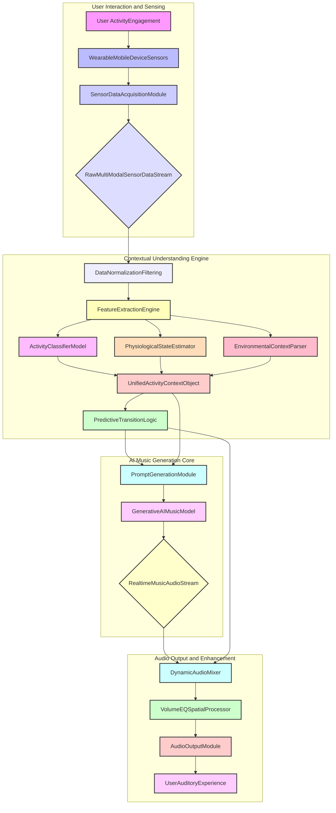
```mermaid
graph TD
    subgraph User Interaction and Sensing
        A[User ActivityEngagement] --> B[WearableMobileDeviceSensors]
        B --> C[SensorDataAcquisitionModule]
        C --> D{RawMultiModalSensorDataStream}
    end

    subgraph Contextual Understanding Engine
        D --> E[DataNormalizationFiltering]
        E --> F[FeatureExtractionEngine]
        F --> G[ActivityClassifierModel]
        F --> H[PhysiologicalStateEstimator]
        F --> I[EnvironmentalContextParser]
        G --> J[UnifiedActivityContextObject]
        H --> J
        I --> J
        J --> K[PredictiveTransitionLogic]
    end

    subgraph AI Music Generation Core
        K --> L[PromptGenerationModule]
        J --> L
        L --> M[GenerativeAIMusicModel]
        M --> N{RealtimeMusicAudioStream}
    end

    subgraph Audio Output and Enhancement
        N --> O[DynamicAudioMixer]
        K --> O
        O --> P[VolumeEQSpatialProcessor]
        P --> Q[AudioOutputModule]
        Q --> R[UserAuditoryExperience]
    end

    style A fill:#f9f,stroke:#333,stroke-width:2px
    style B fill:#bbf,stroke:#333,stroke-width:2px
    style C fill:#ccf,stroke:#333,stroke-width:2px
    style D fill:#ddf,stroke:#333,stroke-width:2px
    style E fill:#eef,stroke:#333,stroke-width:2px
    style F fill:#ffb,stroke:#333,stroke-width:2px
    style G fill:#fbf,stroke:#333,stroke-width:2px
    style H fill:#fdb,stroke:#333,stroke-width:2px
    style I fill:#fbc,stroke:#333,stroke-width:2px
    style J fill:#fcc,stroke:#333,stroke-width:2px
    style K fill:#cfc,stroke:#333,stroke-width:2px
    style L fill:#cff,stroke:#333,stroke-width:2px
    style M fill:#fcf,stroke:#333,stroke-width:2px
    style N fill:#ffc,stroke:#333,stroke-width:2px
    style O fill:#cff,stroke:#333,stroke-width:2px
    style P fill:#cfc,stroke:#333,stroke-width:2px
    style Q fill:#fcc,stroke:#333,stroke-width:2px
    style R fill:#fcf,stroke:#333,stroke-width:2px
```

**2. Detailed Context Inference Engine Flow**
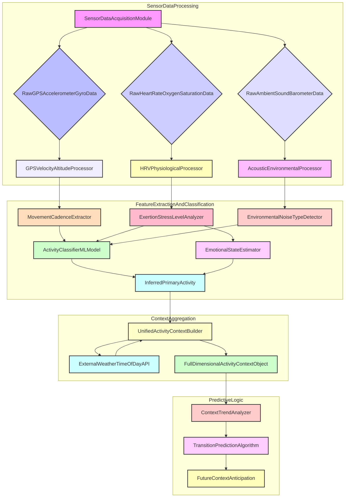
```mermaid
graph TD
    subgraph SensorDataProcessing
        A[SensorDataAcquisitionModule] --> B{RawGPSAccelerometerGyroData}
        A --> C{RawHeartRateOxygenSaturationData}
        A --> D{RawAmbientSoundBarometerData}
        B --> E[GPSVelocityAltitudeProcessor]
        C --> F[HRVPhysiologicalProcessor]
        D --> G[AcousticEnvironmentalProcessor]
    end

    subgraph FeatureExtractionAndClassification
        E --> H[MovementCadenceExtractor]
        F --> I[ExertionStressLevelAnalyzer]
        G --> J[EnvironmentalNoiseTypeDetector]
        H --> K[ActivityClassifierMLModel]
        I --> K
        J --> K
        K --> L[InferredPrimaryActivity]
        I --> M[EmotionalStateEstimator]
        M --> L
    end

    subgraph ContextAggregation
        L --> N[UnifiedActivityContextBuilder]
        N --> O[ExternalWeatherTimeOfDayAPI]
        O --> N
        N --> P[FullDimensionalActivityContextObject]
    end

    subgraph PredictiveLogic
        P --> Q[ContextTrendAnalyzer]
        Q --> R[TransitionPredictionAlgorithm]
        R --> S[FutureContextAnticipation]
    end

    style A fill:#f9f,stroke:#333,stroke-width:2px
    style B fill:#bbf,stroke:#333,stroke-width:2px
    style C fill:#ccf,stroke:#333,stroke-width:2px
    style D fill:#ddf,stroke:#333,stroke-width:2px
    style E fill:#eef,stroke:#333,stroke-width:2px
    style F fill:#ffb,stroke:#333,stroke-width:2px
    style G fill:#fbf,stroke:#333,stroke-width:2px
    style H fill:#fdb,stroke:#333,stroke-width:2px
    style I fill:#fbc,stroke:#333,stroke-width:2px
    style J fill:#fcc,stroke:#333,stroke-width:2px
    style K fill:#cfc,stroke:#333,stroke-width:2px
    style L fill:#cff,stroke:#333,stroke-width:2px
    style M fill:#fcf,stroke:#333,stroke-width:2px
    style N fill:#ffc,stroke:#333,stroke-width:2px
    style O fill:#cff,stroke:#333,stroke-width:2px
    style P fill:#cfc,stroke:#333,stroke-width:2px
    style Q fill:#fcc,stroke:#333,stroke-width:2px
    style R fill:#fcf,stroke:#333,stroke-width:2px
    style S fill:#ffb,stroke:#333,stroke-width:2px
```

**3. Generative AI Music Model Core Operations**
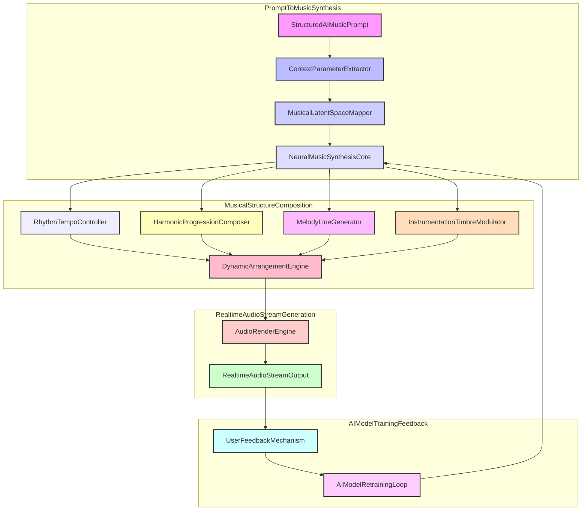
```mermaid
graph TD
    subgraph PromptToMusicSynthesis
        A[StructuredAIMusicPrompt] --> B[ContextParameterExtractor]
        B --> C[MusicalLatentSpaceMapper]
        C --> D[NeuralMusicSynthesisCore]
    end

    subgraph MusicalStructureComposition
        D --> E[RhythmTempoController]
        D --> F[HarmonicProgressionComposer]
        D --> G[MelodyLineGenerator]
        D --> H[InstrumentationTimbreModulator]
        E --> I[DynamicArrangementEngine]
        F --> I
        G --> I
        H --> I
    end

    subgraph RealtimeAudioStreamGeneration
        I --> J[AudioRenderEngine]
        J --> K[RealtimeAudioStreamOutput]
    end

    subgraph AIModelTrainingFeedback
        K --> L[UserFeedbackMechanism]
        L --> M[AIModelRetrainingLoop]
        M --> D
    end

    style A fill:#f9f,stroke:#333,stroke-width:2px
    style B fill:#bbf,stroke:#333,stroke-width:2px
    style C fill:#ccf,stroke:#333,stroke-width:2px
    style D fill:#ddf,stroke:#333,stroke-width:2px
    style E fill:#eef,stroke:#333,stroke-width:2px
    style F fill:#ffb,stroke:#333,stroke-width:2px
    style G fill:#fbf,stroke:#333,stroke-width:2px
    style H fill:#fdb,stroke:#333,stroke-width:2px
    style I fill:#fbc,stroke:#333,stroke-width:2px
    style J fill:#fcc,stroke:#333,stroke-width:2px
    style K fill:#cfc,stroke:#333,stroke-width:2px
    style L fill:#cff,stroke:#333,stroke-width:2px
    style M fill:#fcf,stroke:#333,stroke-width:2px
```

**4. Predictive Transition Logic Flowchart**
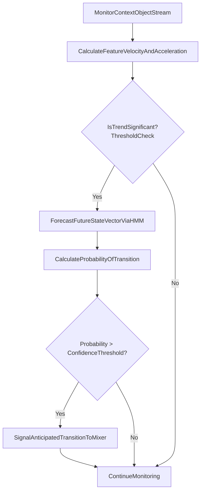
```mermaid
graph TD
    A[MonitorContextObjectStream] --> B[CalculateFeatureVelocityAndAcceleration]
    B --> C{IsTrendSignificant?ThresholdCheck}
    C -- Yes --> D[ForecastFutureStateVectorViaHMM]
    D --> E[CalculateProbabilityOfTransition]
    E --> F{Probability > ConfidenceThreshold?}
    F -- Yes --> G[SignalAnticipatedTransitionToMixer]
    F -- No --> H[ContinueMonitoring]
    C -- No --> H
    G --> H
```

**5. Transformer-Based Music VAE Architecture**
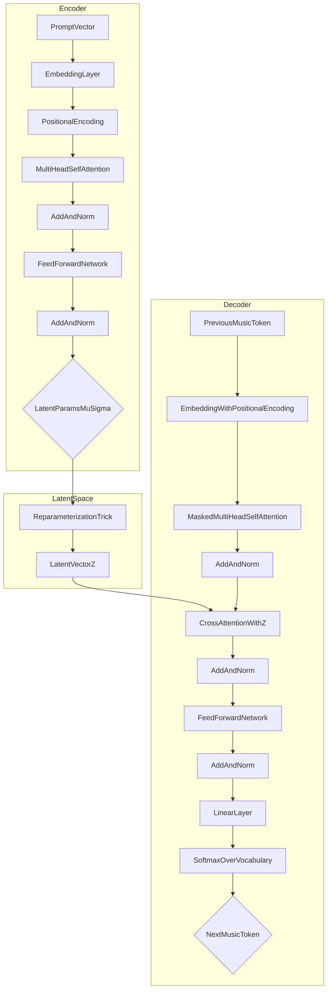
```mermaid
graph TD
    subgraph Encoder
        A[PromptVector] --> B[EmbeddingLayer]
        B --> C[PositionalEncoding]
        C --> D[MultiHeadSelfAttention]
        D --> E[AddAndNorm]
        E --> F[FeedForwardNetwork]
        F --> G[AddAndNorm]
        G --> H{LatentParamsMuSigma}
    end
    subgraph LatentSpace
        H --> I[ReparameterizationTrick]
        I --> J[LatentVectorZ]
    end
    subgraph Decoder
        J --> K[CrossAttentionWithZ]
        L[PreviousMusicToken] --> M[EmbeddingWithPositionalEncoding]
        M --> N[MaskedMultiHeadSelfAttention]
        N --> O[AddAndNorm]
        O --> K
        K --> P[AddAndNorm]
        P --> Q[FeedForwardNetwork]
        Q --> R[AddAndNorm]
        R --> S[LinearLayer]
        S --> T[SoftmaxOverVocabulary]
        T --> U{NextMusicToken}
    end
```

**6. AI Model Training and Feedback Loop**
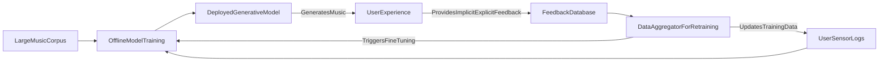
```mermaid
graph LR
    A[LargeMusicCorpus] --> B[OfflineModelTraining]
    C[UserSensorLogs] --> B
    B --> D[DeployedGenerativeModel]
    D -- GeneratesMusic --> E[UserExperience]
    E -- ProvidesImplicitExplicitFeedback --> F[FeedbackDatabase]
    F --> G[DataAggregatorForRetraining]
    G -- UpdatesTrainingData --> C
    G -- TriggersFineTuning --> B
```

**7. Musical Structure State Machine**
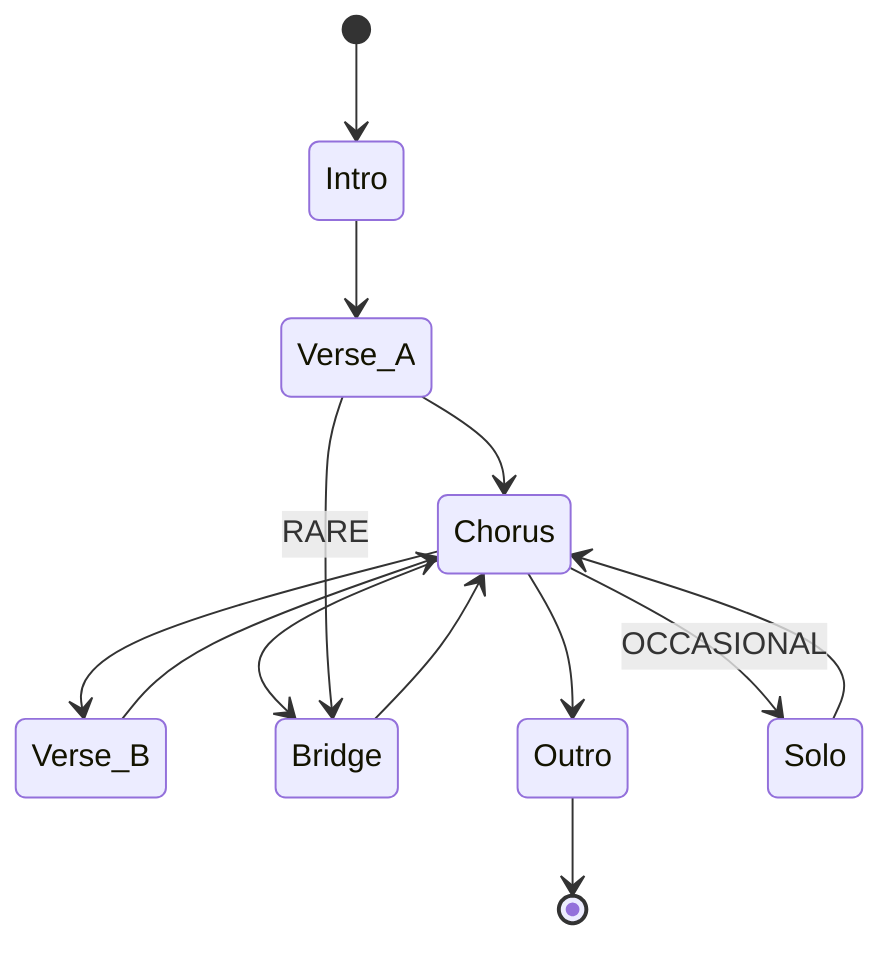
```mermaid
stateDiagram-v2
    [*] --> Intro
    Intro --> Verse_A
    Verse_A --> Chorus
    Chorus --> Verse_B
    Verse_B --> Chorus
    Chorus --> Bridge
    Bridge --> Chorus
    Chorus --> Outro
    Outro --> [*]
    Verse_A --> Bridge : RARE
    Chorus --> Solo : OCCASIONAL
    Solo --> Chorus
```

**8. Real-Time System Interaction Sequence Diagram**
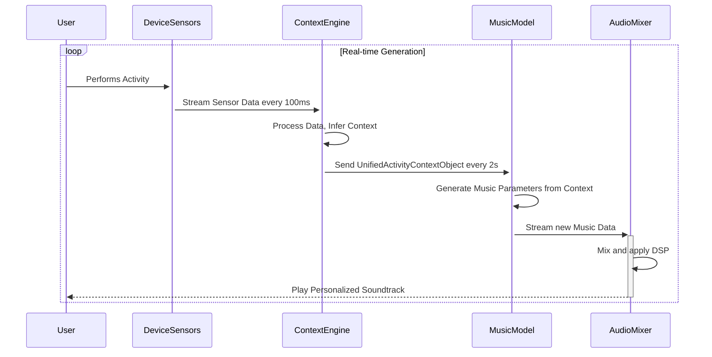
```mermaid
sequenceDiagram
    participant User
    participant DeviceSensors
    participant ContextEngine
    participant MusicModel
    participant AudioMixer

    loop Real-time Generation
        User->>+DeviceSensors: Performs Activity
        DeviceSensors->>+ContextEngine: Stream Sensor Data every 100ms
        ContextEngine->>ContextEngine: Process Data, Infer Context
        ContextEngine->>+MusicModel: Send UnifiedActivityContextObject every 2s
        MusicModel->>MusicModel: Generate Music Parameters from Context
        MusicModel->>+AudioMixer: Stream new Music Data
        AudioMixer->>AudioMixer: Mix and apply DSP
        AudioMixer-->>-User: Play Personalized Soundtrack
    end
```

**9. Software Component Diagram**
```mermaid
componentDiagram
    [User Interface] -- Provides Feedback --> [Context Inference Engine]
    [User Interface] -- Receives Audio --> [Dynamic Audio Mixer]

    [Context Inference Engine] -- Acquires Data --> [Sensor Abstraction Layer]
    [Sensor Abstraction Layer] ..> [Device Hardware]
    
    [Context Inference Engine] -- Generates Prompts --> [Prompt Generation Module]
    [Prompt Generation Module] -- Sends Prompts --> [Generative AI Music Model]
    
    [Generative AI Music Model] -- Uses --> [ML Inference Library e-g-TensorFlow]
    [Generative AI Music Model] -- Streams MIDI-like data --> [Dynamic Audio Mixer]
    
    [Dynamic Audio Mixer] -- Uses --> [Audio DSP Library]
```

**10. Dynamic Audio Mixer Sub-modules**
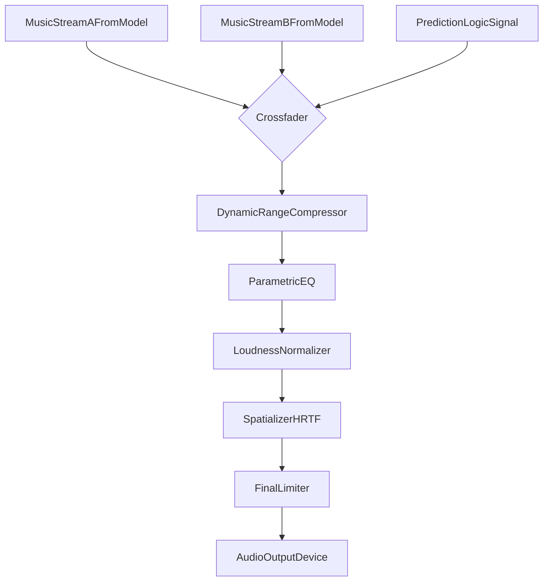
```mermaid
graph TD
    A[MusicStreamAFromModel] --> C{Crossfader}
    B[MusicStreamBFromModel] --> C
    P[PredictionLogicSignal] --> C
    C --> D[DynamicRangeCompressor]
    D --> E[ParametricEQ]
    E --> F[LoudnessNormalizer]
    F --> G[SpatializerHRTF]
    G --> H[FinalLimiter]
    H --> I[AudioOutputDevice]
```

---

### System Architecture Diagrams: OHRN and New Inventions

These 10 new diagrams illustrate the expanded OHRN system and its constituent new inventions.

**11. Omni-Harmonious Resonance Nexus OHRN Global Architecture**
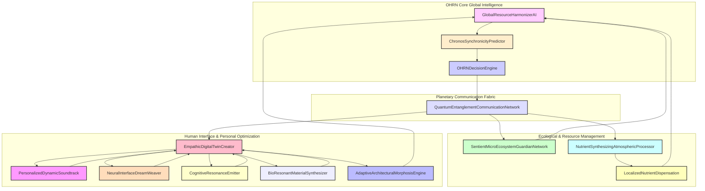
```mermaid
graph TD
    subgraph OHRN Core Global Intelligence
        A[GlobalResourceHarmonizerAI] --> B[ChronosSynchronicityPredictor]
        B --> C[OHRNDecisionEngine]
    end

    subgraph Planetary Communication Fabric
        C --> D[QuantumEntanglementCommunicationNetwork]
    end

    subgraph Ecological & Resource Management
        D --> E[SentientMicroEcosystemGuardianNetwork]
        D --> F[NutrientSynthesizingAtmosphericProcessor]
        F --> G[LocalizedNutrientDispensation]
        E --> A
        G --> A
    end

    subgraph Human Interface & Personal Optimization
        D --> H[EmpathicDigitalTwinCreator]
        H --> I[PersonalizedDynamicSoundtrack]
        H --> J[NeuralInterfaceDreamWeaver]
        H --> K[CognitiveResonanceEmitter]
        H --> L[BioResonantMaterialSynthesizer]
        H --> M[AdaptiveArchitecturalMorphosisEngine]
        I --> H
        J --> H
        K --> H
        L --> H
        M --> A
    end

    style A fill:#fcf,stroke:#333,stroke-width:2px
    style B fill:#fec,stroke:#333,stroke-width:2px
    style C fill:#ccf,stroke:#333,stroke-width:2px
    style D fill:#ddf,stroke:#333,stroke-width:2px
    style E fill:#cfc,stroke:#333,stroke-width:2px
    style F fill:#cff,stroke:#333,stroke-width:2px
    style G fill:#ffb,stroke:#333,stroke-width:2px
    style H fill:#fbc,stroke:#333,stroke-width:2px
    style I fill:#f9f,stroke:#333,stroke-width:2px
    style J fill:#fdb,stroke:#333,stroke-width:2px
    style K fill:#ffc,stroke:#333,stroke-width:2px
    style L fill:#eef,stroke:#333,stroke-width:2px
    style M fill:#bbf,stroke:#333,stroke-width:2px
```

**12. Empathic Digital Twin Creator EDTC Core Loop**
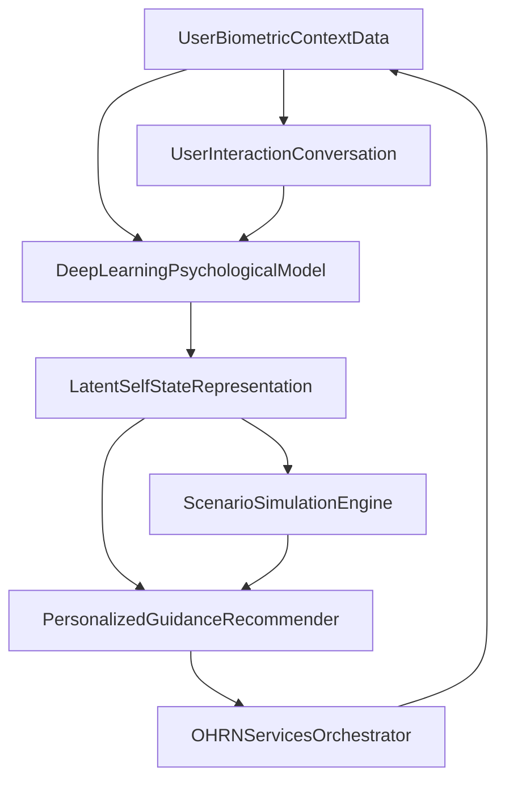
```mermaid
graph TD
    A[UserBiometricContextData] --> B[DeepLearningPsychologicalModel]
    A --> C[UserInteractionConversation]
    B --> D[LatentSelfStateRepresentation]
    C --> B
    D --> E[ScenarioSimulationEngine]
    D --> F[PersonalizedGuidanceRecommender]
    F --> G[OHRNServicesOrchestrator]
    E --> F
    G --> A
```

**13. Neural-Interface Dream Weaver NIDW Operation**
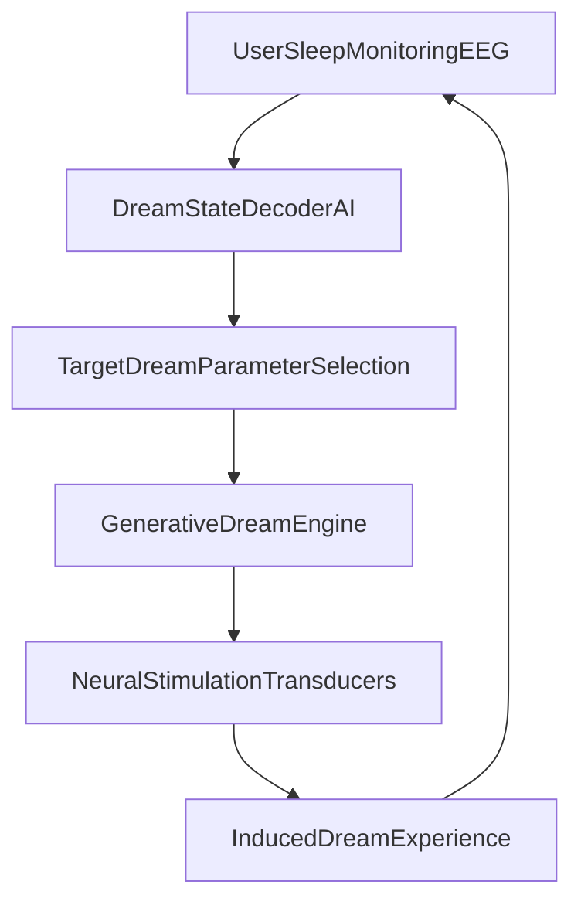
```mermaid
graph TD
    A[UserSleepMonitoringEEG] --> B[DreamStateDecoderAI]
    B --> C[TargetDreamParameterSelection]
    C --> D[GenerativeDreamEngine]
    D --> E[NeuralStimulationTransducers]
    E --> F[InducedDreamExperience]
    F --> A
```

**14. Bio-Resonant Material Synthesizer BRMS Flow**
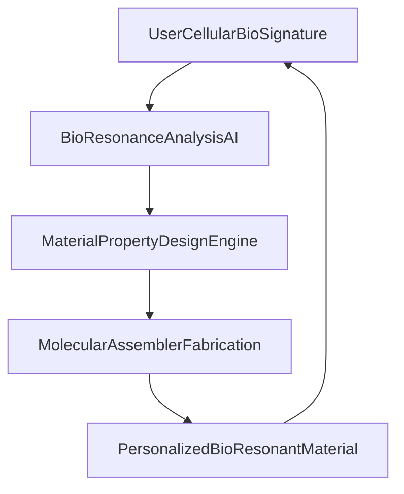
```mermaid
graph TD
    A[UserCellularBioSignature] --> B[BioResonanceAnalysisAI]
    B --> C[MaterialPropertyDesignEngine]
    C --> D[MolecularAssemblerFabrication]
    D --> E[PersonalizedBioResonantMaterial]
    E --> A
```

**15. Sentient Micro-Ecosystem Guardian SMEG Intervention Cycle**
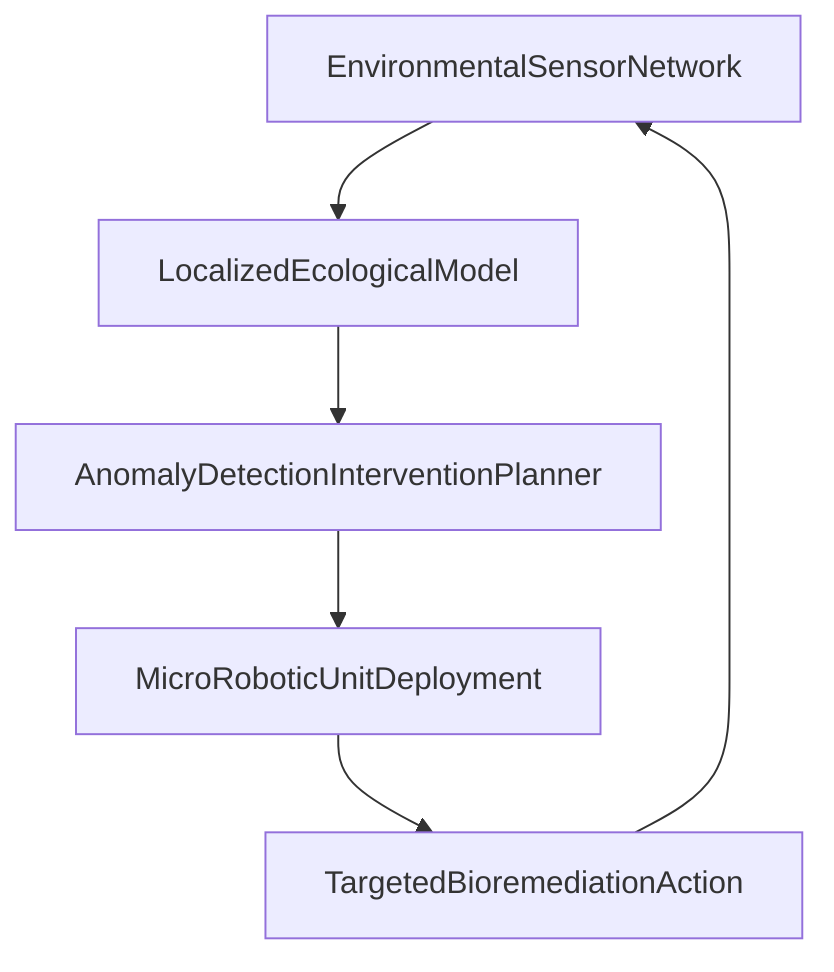
```mermaid
graph TD
    A[EnvironmentalSensorNetwork] --> B[LocalizedEcologicalModel]
    B --> C[AnomalyDetectionInterventionPlanner]
    C --> D[MicroRoboticUnitDeployment]
    D --> E[TargetedBioremediationAction]
    E --> A
```

**16. Cognitive Resonance Emitter CRE Realtime Control**
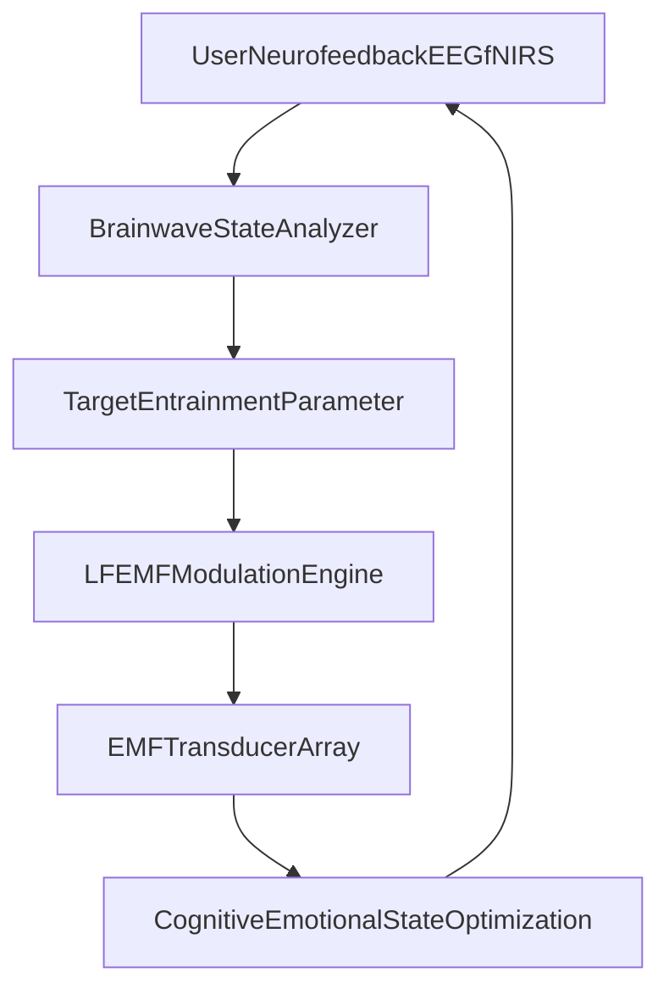
```mermaid
graph TD
    A[UserNeurofeedbackEEGfNIRS] --> B[BrainwaveStateAnalyzer]
    B --> C[TargetEntrainmentParameter]
    C --> D[LFEMFModulationEngine]
    D --> E[EMFTransducerArray]
    E --> F[CognitiveEmotionalStateOptimization]
    F --> A
```

**17. Global Resource Harmonizer AI GRH-AI Optimization Process**
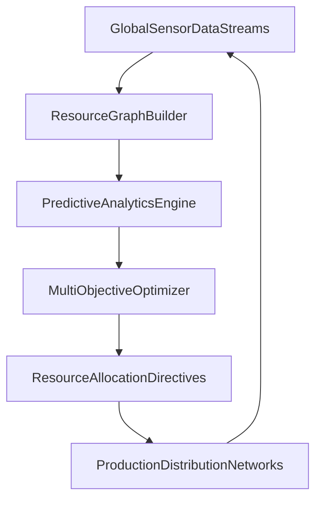
```mermaid
graph TD
    A[GlobalSensorDataStreams] --> B[ResourceGraphBuilder]
    B --> C[PredictiveAnalyticsEngine]
    C --> D[MultiObjectiveOptimizer]
    D --> E[ResourceAllocationDirectives]
    E --> F[ProductionDistributionNetworks]
    F --> A
```

**18. Quantum Entanglement Communication Network QECN Data Flow**
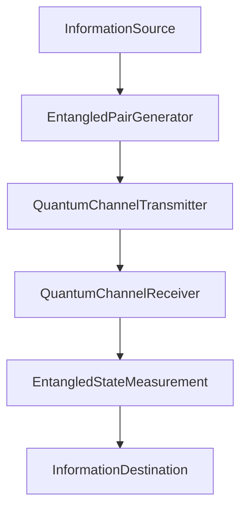
```mermaid
graph TD
    A[InformationSource] --> B[EntangledPairGenerator]
    B --> C[QuantumChannelTransmitter]
    C --> D[QuantumChannelReceiver]
    D --> E[EntangledStateMeasurement]
    E --> F[InformationDestination]
```

**19. Adaptive Architectural Morphosis Engine AAME Dynamics**
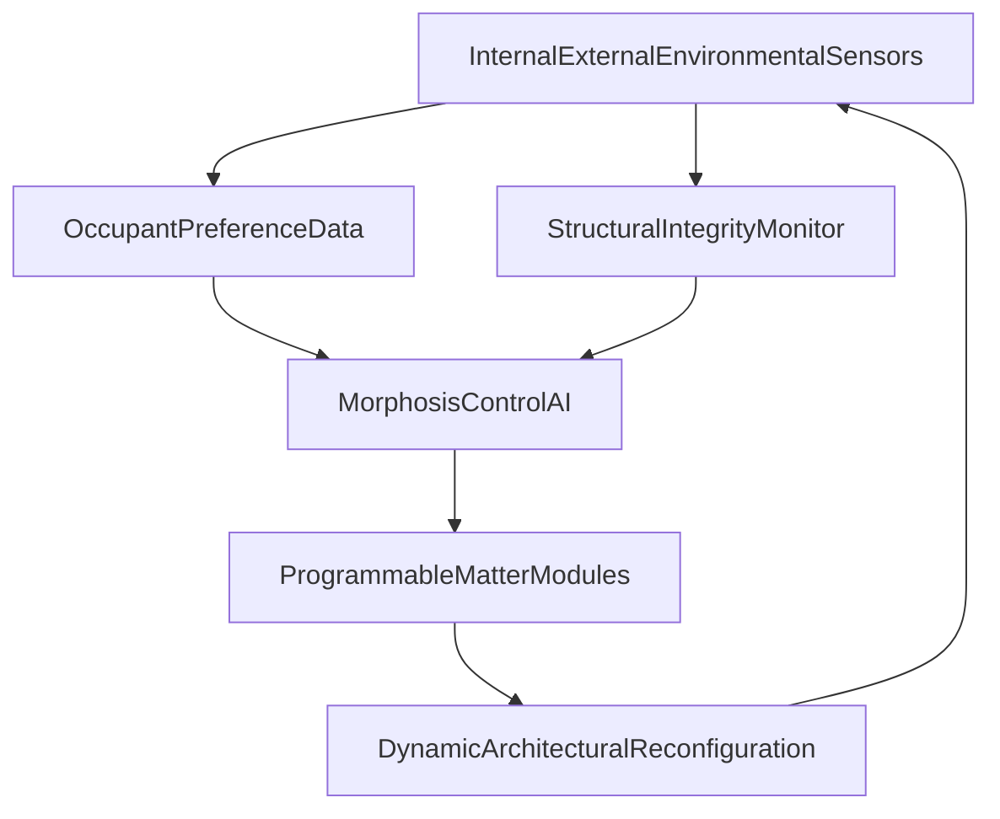
```mermaid
graph TD
    A[InternalExternalEnvironmentalSensors] --> B[OccupantPreferenceData]
    A --> C[StructuralIntegrityMonitor]
    B --> D[MorphosisControlAI]
    C --> D
    D --> E[ProgrammableMatterModules]
    E --> F[DynamicArchitecturalReconfiguration]
    F --> A
```

**20. Nutrient Synthesizing Atmospheric Processor NSAP Workflow**
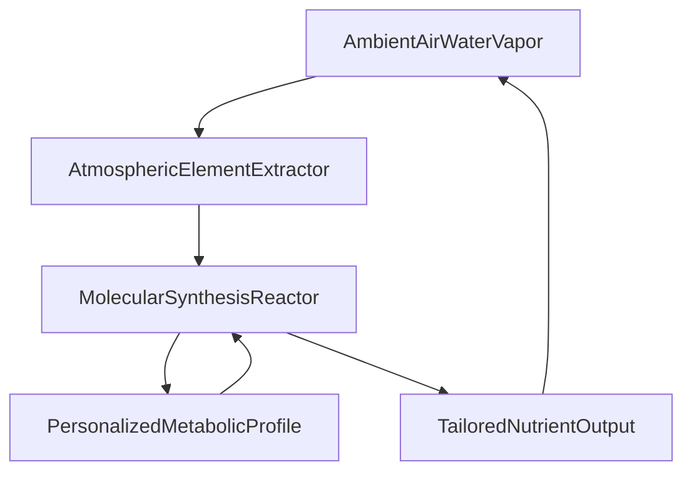
```mermaid
graph TD
    A[AmbientAirWaterVapor] --> B[AtmosphericElementExtractor]
    B --> C[MolecularSynthesisReactor]
    C --> D[PersonalizedMetabolicProfile]
    D --> C
    C --> E[TailoredNutrientOutput]
    E --> A
```

---

**Claims:**
1.  A method for generating a personalized, dynamic soundtrack, comprising:
    a.  Continuously acquiring multi-modal sensor data from a user's device, including at least physiological, kinematic, and environmental data.
    b.  Processing said multi-modal sensor data through a Context Inference Engine to derive a Unified Activity Context Object, where said engine includes Data Normalization Filtering, Feature Extraction, an Activity Classifier, a Physiological State Estimator, and an Environmental Context Parser.
    c.  Applying a Predictive Transition Logic module to said Unified Activity Context Object to anticipate future user state changes.
    d.  Transmitting said Unified Activity Context Object and any anticipated state changes as a structured prompt to a Generative AI Music Model.
    e.  Receiving a continuous stream of newly composed, non-repeating music from said Generative AI Music Model, wherein said music is thematically, rhythmically, and emotionally matched to the current and predicted activity context.
    f.  Dynamically mixing said received music stream through an Audio Mixer and Output Module, said module employing seamless crossfade algorithms informed by said Predictive Transition Logic, and adapting audio parameters such as volume, equalization, and spatial effects based on said context.
    g.  Playing the mixed and adapted music to the user.

2.  The method of claim 1, wherein the multi-modal sensor data includes information from GPS, accelerometer, gyroscope, heart rate monitor, galvanic skin response sensor, and an ambient microphone.

3.  The method of claim 1, wherein the Activity Classifier employs a machine learning model trained to identify granular activities such as running, walking, cycling, meditating, or working.

4.  The method of claim 1, wherein the Physiological State Estimator infers user emotional states and exertion levels based on heart rate variability, oxygen saturation, and other biometrics.

5.  The method of claim 1, wherein the Environmental Context Parser integrates external data sources such as local weather, time of day, and calendar events to enrich the Unified Activity Context Object.

6.  The method of claim 1, wherein the Generative AI Music Model comprises a Latent Space Mapper, a Music Synthesis Core, a Dynamic Structure Arranger, an Instrumentation and Timbre Modulator, and a Rhythmic and Harmonic Controller, all cooperating to synthesize music directly from contextual parameters.

7.  The method of claim 1, wherein the Predictive Transition Logic analyzes trends in sensor data and inferred context over time to forecast activity shifts with a mathematically determined probability, enabling proactive musical transitions.

8.  The method of claim 1, wherein the seamless crossfade algorithms utilize advanced digital signal processing techniques, such as a constant-power crossfade function, to blend outgoing and incoming music segments based on harmonic analysis and rhythmic alignment, preventing auditory discontinuity.

9.  A system for generating a personalized, dynamic soundtrack, comprising:
    a.  A Sensor Data Acquisition Module configured to collect multi-modal sensor data from a user.
    b.  A Context Inference Engine communicatively coupled to the Sensor Data Acquisition Module, comprising:
        i.  A Data Normalization and Feature Extraction component.
        ii. A Machine Learning based Activity Classifier.
        iii. A Physiological State Estimator.
        iv. An Environmental Context Parser.
        v. A Predictive Transition Logic module.
        vi. A Unified Activity Context Object generator.
    c.  A Prompt Generation Module communicatively coupled to the Context Inference Engine, configured to translate the Unified Activity Context Object and anticipated state changes into a structured prompt.
    d.  A Generative AI Music Model communicatively coupled to the Prompt Generation Module, configured to synthesize a continuous stream of unique music based on the structured prompt.
    e.  A Dynamic Audio Mixer and Output Module communicatively coupled to the Generative AI Music Model, configured to receive, process, and output the music stream, incorporating crossfading, volume adjustments, and equalization based on real-time context and predicted transitions.

10. The system of claim 9, further comprising a user interface for receiving user preferences and feedback, said feedback being utilized via a reinforcement learning framework to refine the Generative AI Music Model and the mapping function within the Prompt Generation Module.

11. A method for optimizing human well-being and planetary health through the Omni-Harmonious Resonance Nexus (OHRN), comprising:
    a.  Establishing a Quantum Entanglement Communication Network (QECN) for instantaneous, secure data transfer across the system.
    b.  Deploying a Global Resource Harmonizer AI (GRH-AI) to continuously monitor, predict, and optimize planetary resource flows and ecological metrics.
    c.  Integrating a network of Sentient Micro-Ecosystem Guardian (SMEG) units, controlled by the GRH-AI, for autonomous, real-time ecological restoration and monitoring.
    d.  Providing a Nutrient-Synthesizing Atmospheric Processor (NSAP) network, managed by the GRH-AI, for personalized, on-demand nutrient generation from atmospheric elements.
    e.  Creating and continuously updating an Empathic Digital Twin Creator (EDTC) for each user, modeling their psycho-physiological state and serving as a personalized interface to the OHRN.
    f.  Utilizing a Personalized Dynamic Soundtrack Generation system, integrated with the EDTC, to provide psycho-emotional resonance orchestration based on real-time user context.
    g.  Employing a Cognitive Resonance Emitter (CRE), guided by the EDTC, for targeted, non-invasive brainwave entrainment to optimize cognitive and emotional states.
    h.  Integrating a Neural-Interface Dream Weaver (NIDW), directed by the EDTC, to generate therapeutic and developmental dreamscapes during sleep.
    i.  Operating a Bio-Resonant Material Synthesizer (BRMS), informed by the EDTC, to create personalized, health-optimizing biomaterials.
    j.  Implementing an Adaptive Architectural Morphosis Engine (AAME) for dynamic, energy-positive habitats that reconfigure based on environmental conditions and EDTC-derived occupant preferences.
    k.  Leveraging a Chronos-Synchronicity Predictor (CSP) to identify optimal temporal windows for collective human action and individual growth, guiding users via their EDTCs.
    l.  Continuously optimizing the Omni-Harmonious Resonance Index (OHRI), a composite metric quantifying system-wide individual flourishing, societal harmony, ecological vitality, and technological efficiency, by adjusting parameters across all integrated components.

12. The method of claim 11, wherein the GRH-AI optimizes for a multi-objective function that minimizes environmental impact and maximizes resource equity and sufficiency, subject to ecological capacity and production constraints, as defined by equation (106).

13. The method of claim 11, wherein the EDTC continuously updates a high-dimensional latent state model of an individual's psycho-physiological profile, and uses a probabilistic generative model to predict responses to actions, as described by equations (116) and (117).

14. The method of claim 11, wherein the NIDW maximizes a Dream State Coherence Index (DSCI) by continuously optimizing generated dream content to statistically correlate with and therapeutically influence a user's subconscious brainwave patterns, as defined by equation (101).

15. The method of claim 11, wherein the BRMS synthesizes materials by minimizing the Kullback-Leibler divergence between the material's inherent resonant frequency distribution and a target cellular response frequency distribution, subject to structural and toxicity penalties, as defined by equation (102).

16. The method of claim 11, wherein the SMEG system maintains ecosystem stability by minimizing the long-term cost of deviations from an optimal ecological state and the cost of interventions, utilizing a reinforcement learning policy, as defined by equation (104).

17. The method of claim 11, wherein the CRE optimizes brainwave entrainment by minimizing a cost function that quantifies the phase and power deviation between emitted electromagnetic fields and target neural oscillations, as defined by equation (105).

18. The method of claim 11, wherein the QECN maintains inherently secure and instantaneous communication channels by achieving near-perfect entanglement fidelity between quantum states, where any observation immediately reveals interference, as described by equation (107).

19. The method of claim 11, wherein the AAME minimizes a multi-objective cost function balancing occupant comfort, energy efficiency, and structural resilience by dynamically reconfiguring programmable matter modules within architectural structures, as defined by equation (109).

20. The method of claim 11, wherein the NSAP optimizes personalized nutrient synthesis by minimizing the deviation from a user's dynamically derived target nutrient profile, subject to elemental conservation, reaction kinetics, and purity constraints, as defined by equation (110).

21. The method of claim 11, wherein the CSP forecasts optimal moments for collective resonance events by processing planetary-scale multi-modal data through a deep learning causal inference model to predict the probability of such events, as defined by equations (111-115).

22. A system for orchestrating human flourishing and planetary health, comprising:
    a.  A Quantum Entanglement Communication Network (QECN) providing secure, instantaneous communication.
    b.  A Global Resource Harmonizer AI (GRH-AI) communicatively coupled to the QECN, configured for planetary resource and ecological optimization.
    c.  A network of Sentient Micro-Ecosystem Guardian (SMEG) units communicatively coupled to the GRH-AI for autonomous ecological management.
    d.  A network of Nutrient-Synthesizing Atmospheric Processor (NSAP) units communicatively coupled to the GRH-AI for personalized nutrient production.
    e.  An Empathic Digital Twin Creator (EDTC) for each user, communicatively coupled to the QECN and configured to model individual psycho-physiological states.
    f.  A Personalized Dynamic Soundtrack Generation system communicatively coupled to the EDTC, for psycho-emotional resonance orchestration.
    g.  A Cognitive Resonance Emitter (CRE) communicatively coupled to the EDTC, for non-invasive brainwave entrainment.
    h.  A Neural-Interface Dream Weaver (NIDW) communicatively coupled to the EDTC, for guided dream experiences.
    i.  A Bio-Resonant Material Synthesizer (BRMS) communicatively coupled to the EDTC, for personalized biomaterial creation.
    j.  An Adaptive Architectural Morphosis Engine (AAME) communicatively coupled to the GRH-AI and EDTC, for dynamic habitat reconfiguration.
    k.  A Chronos-Synchronicity Predictor (CSP) communicatively coupled to the GRH-AI and EDTC, for forecasting optimal collective action.
    l.  An overarching OHRN control system configured to continuously maximize the Omni-Harmonious Resonance Index (OHRI) as defined by equation (118), representing systemic harmony across all integrated domains.

23. The system of claim 22, wherein the entire OHRN operates as a closed-loop, self-optimizing system, where feedback from individual components (e.g., user physiological data, ecological metrics) continuously refines the overarching optimization of the OHRI.