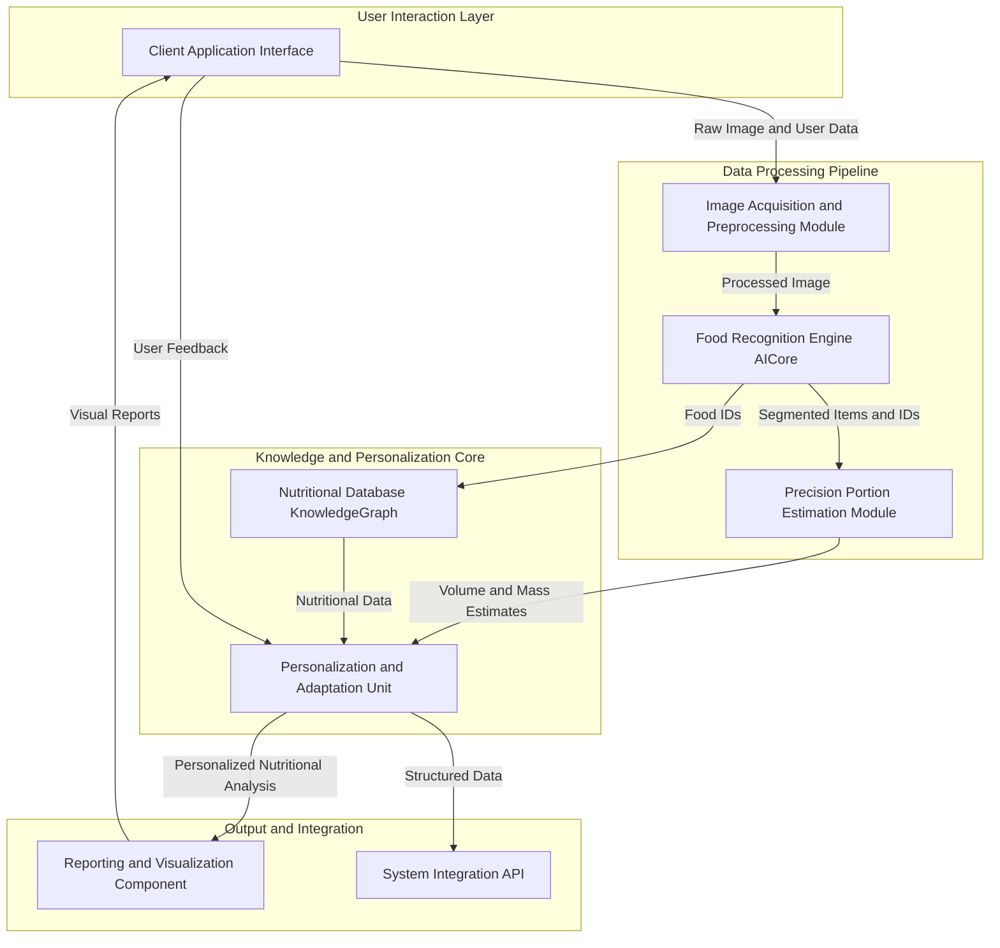
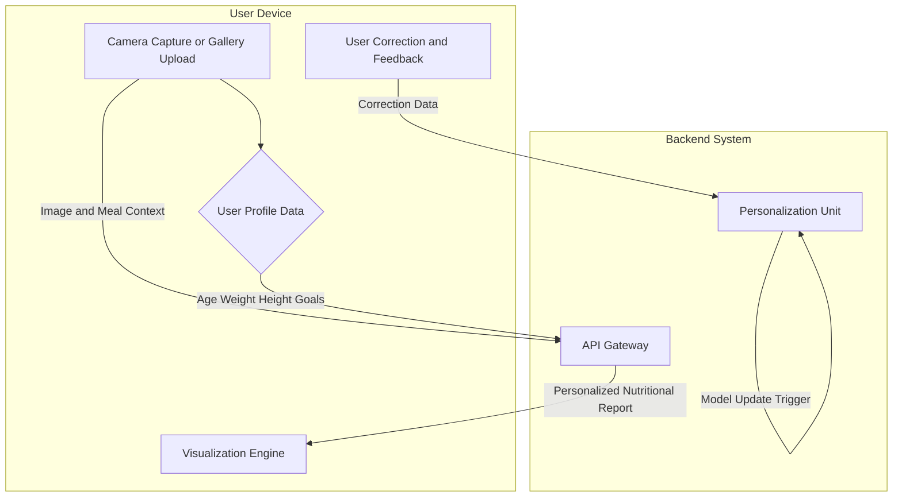
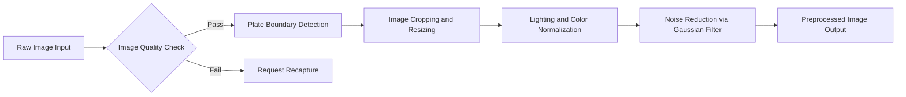
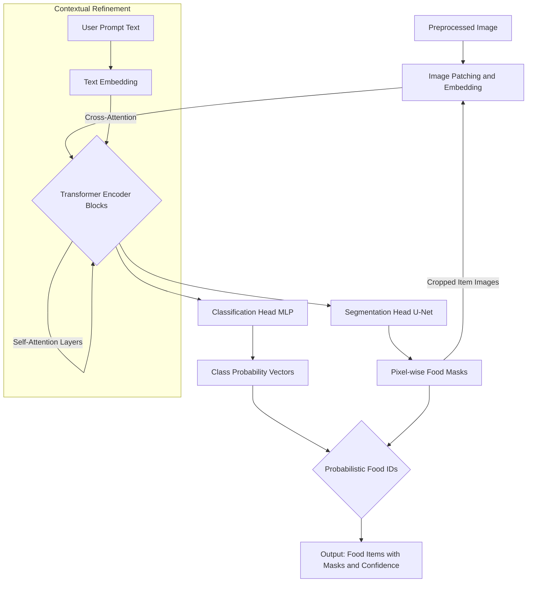
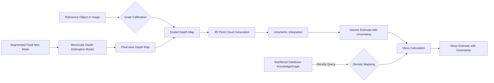
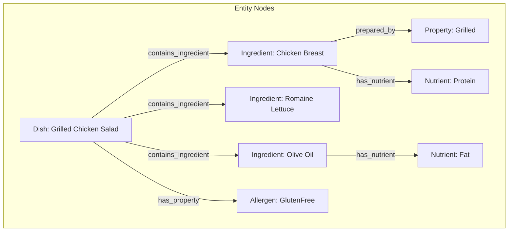
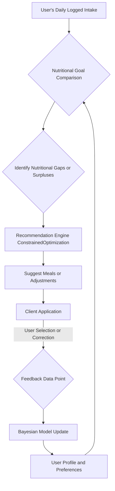
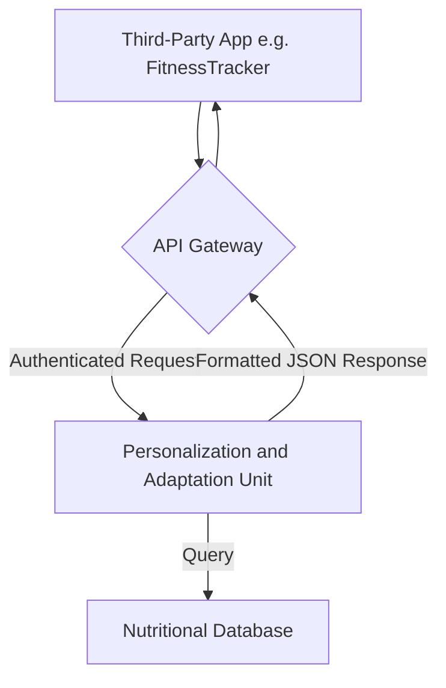
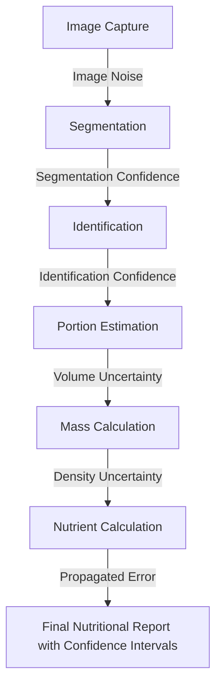

**Title of Invention:** A System and Method for Nutritional Analysis from Food Photography

**Abstract:**
A system for automated nutritional tracking is disclosed. A user takes a photograph of their meal. The system sends this image to a multi-modal generative AI model. The AI identifies the different food items on the plate, estimates their portion sizes, and returns a structured nutritional analysis, including estimated calories, macronutrients (protein, carbs, fat), and key micronutrients. This automates the tedious process of manual food logging.

---

**Prompt:**
When generating Mermaid diagrams, never use parentheses () in node labels, because they cause Mermaid syntax errors. Instead, replace all parentheses with plain text, slashes, or capitalization that conveys the same meaning.

For example:
- A[User Input (Text/Voice)] -> causes an error
+ A[User Input TextVoice] or A[User Input Text_Voice] or A[User Input TextVoiceMode]

When recreating or expanding my patents or visual systems, always:
	-	Make more extensive and detailed Mermaid charts that clearly map every process and relationship.
	-	Use descriptive label text without parentheses in every scenario.
	-	Apply this rule consistently across nodes, links, subgraphs, and notes.

Example Conversion Rule:

A[User Input (Audio)] --> B[Processing (AI Core)]  

becomes

A[User Input Audio] --> B[Processing AICore].  Also no semi colons and make sure  to use brackets where needed also make it so well mathematically proven that even if patent's exist for said topic we are using math they aren’t thereby proving we overstanding their understanding 

---

**Detailed Description:**
A user is about to eat a meal. They open the app and take a picture of their plate, which contains a grilled chicken breast, a serving of quinoa, and steamed broccoli. The image is sent to an AI model with the prompt, "Analyze this meal for its nutritional content." The AI returns a JSON object: `{ "calories": 550, "protein_grams": 45, "carbs_grams": 50, "fat_grams": 18, "notes": "A well-balanced meal." }`. This data is automatically added to the user's daily nutrition log. The system's underlying mathematical framework ensures that this output is not merely an estimate, but a probabilistic inference with quantifiable confidence.

**Expanded System Architecture and Operational Flow:**

The system comprises several interconnected modules designed for robust and precise nutritional analysis. The overall process initiates with the user's interaction and culminates in comprehensive nutritional insights and recommendations. A visual representation of this system would follow the Mermaid diagram rules as outlined above, ensuring clarity and precision in node labeling.

### Overall System Architecture Diagram

**1. Client Application Interface:**
This module represents the user facing application available on mobile devices or web browsers.
*   **User Input Capture:** Facilitates image capture using a device camera, or allows image upload from a gallery. Also captures contextual information like meal type (Breakfast/Lunch/Dinner) and pre-existing dietary preferences or restrictions.
*   **User Profile Management:** Allows users to input and manage personal data such as age (a), gender (g), weight (w, in kg), height (h, in cm), activity level (AL), and health goals. This data is critical for personalized analysis. The system calculates Basal Metabolic Rate (BMR) using the Mifflin-St Jeor equation:
    *   BMR (male) = (10 * w) + (6.25 * h) - (5 * a) + 5  (Equation 1)
    *   BMR (female) = (10 * w) + (6.25 * h) - (5 * a) - 161 (Equation 2)
    *   Total Daily Energy Expenditure (TDEE) is then calculated as: TDEE = BMR * AL (Equation 3), where AL is a scalar multiplier (e.g., 1.2 for sedentary, 1.55 for moderately active).
*   **Feedback Mechanism:** Enables users to correct or refine identified food items or estimated portion sizes, feeding into the system's continuous learning loop. The feedback is modeled as a corrective weight `w_f` applied to the loss function during model retraining.
*   **Data Visualization Display:** Presents nutritional data, trends, and recommendations in an intuitive graphical format.

### Client Application Data Flow

**2. Image Acquisition and Preprocessing Module:**
This module receives the raw image `I_{raw}` and prepares it for AI analysis.
*   **Image Validation:** Checks image quality metrics like brightness variance `\sigma^2_b` and sharpness gradient magnitude `||\nabla I||_2`. (Equation 4, 5)
*   **Object Detection Preprocessing:** Applies initial computer vision techniques. A plate detection model identifies the region of interest `I_{plate}`.
*   **Image Enhancement:** Standardizes images across various capture conditions.
    *   Gamma Correction: `I_{corrected}(x,y) = c \cdot I_{raw}(x,y)^\gamma` (Equation 6)
    *   Histogram Equalization: `H'(i) = \text{round} \left( \frac{CDF(i) - CDF_{min}}{M \times N - CDF_{min}} \times (L-1) \right)` (Equation 7)
    *   Noise reduction using a Gaussian filter, which is a convolution operation `I_{filtered} = I_{corrected} * G`, where `G` is the Gaussian kernel. (Equation 8)
    *   `G(x,y) = \frac{1}{2\pi\sigma^2} e^{-\frac{x^2+y^2}{2\sigma^2}}` (Equation 9)

### Image Preprocessing Pipeline

**3. Food Recognition Engine AICore:**
This is the central multi-modal generative AI model, a Vision Transformer (ViT) variant, trained on extensive datasets.
*   **Food Item Segmentation:** Utilizes a U-Net-based segmentation head to delineate individual food items. The Dice Loss function is used for training segmentation: `L_{Dice} = 1 - \frac{2|X \cap Y|}{|X| + |Y|}` (Equation 10), where X is the predicted mask and Y is the ground truth.
*   **Item Identification and Classification:**
    *   The image `I \in \mathbb{R}^{H \times W \times C}` is split into patches `x_p \in \mathbb{R}^{N \times (P^2 \cdot C)}`. (Equation 11)
    *   A linear projection maps patches to an embedding space: `E = [x_{class}; x_p^1 W_E; ...; x_p^N W_E] + E_{pos}` (Equation 12)
    *   The core of ViT is the multi-head self-attention mechanism.
    *   Queries (Q), Keys (K), and Values (V) are computed: `Q = Z U_Q, K = Z U_K, V = Z U_V` (Equation 13, 14, 15) where `Z` is the layer input.
    *   Attention is calculated as: `\text{Attention}(Q,K,V) = \text{softmax}\left(\frac{QK^T}{\sqrt{d_k}}\right)V` (Equation 16)
    *   `\text{MultiHead}(Z) = \text{Concat}(\text{head}_1, ..., \text{head}_h)W_O` (Equation 17) where `\text{head}_i = \text{Attention}(Q_i, K_i, V_i)`. (Equation 18)
    *   The output is a probability distribution over `k` food classes `p_k` from a final softmax layer: `p_k = \frac{e^{z_k}}{\sum_{j=1}^{K} e^{z_j}}` (Equation 19)
    *   The training uses Focal Loss to handle class imbalance: `FL(p_t) = -\alpha_t (1 - p_t)^\gamma \log(p_t)` (Equation 20)
*   **Contextual Inference:** Integrates user prompt text embeddings `E_{text}` with image embeddings `E_{image}` using cross-attention. (Equation 21)

### Food Recognition Engine AICore - Multi-Stage Inference

**4. Precision Portion Estimation Module:**
This module estimates the volume and mass of each identified food item.
*   **3D Reconstruction from Monocular Vision:** Employs a deep learning model to infer a dense depth map `D` from a single 2D image `I_{plate}`.
    *   The model is trained to minimize the Scale-Invariant Logarithmic (SILog) loss:
    *   `d_i = \log D_i - \log D_i^*` (Equation 22), where `D_i` and `D_i^*` are predicted and ground truth depths.
    *   `L_{SILog} = \frac{1}{N} \sum_i d_i^2 - \frac{\lambda}{N^2} (\sum_i d_i)^2` (Equation 23), where `\lambda \in [0,1]`.
*   **Reference Object Integration:** A reference object of known size `S_{ref}` (e.g., a coin) is used to resolve scale ambiguity. The depth scale factor `\alpha` is computed: `\alpha = S_{ref}^{real} / S_{ref}^{image}` (Equation 24)
*   **Volume and Mass Calculation:**
    *   For each pixel `(u, v)` in a food segment mask `S_k`, its 3D coordinates `(X, Y, Z)` are calculated using the camera intrinsic matrix `K`:
    *   `K = \begin{pmatrix} f_x & 0 & c_x \\ 0 & f_y & c_y \\ 0 & 0 & 1 \end{pmatrix}` (Equation 25)
    *   `Z = \alpha \cdot D(u,v)` (Equation 26)
    *   `X = (u - c_x) \cdot Z / f_x` (Equation 27)
    *   `Y = (v - c_y) \cdot Z / f_y` (Equation 28)
    *   The volume `V_k` is computed by integrating the area of the segment multiplied by the average depth: `V_k \approx A_k \cdot \bar{Z}_k = (\sum_{(u,v) \in S_k} 1) \cdot \frac{1}{|S_k|} \sum_{(u,v) \in S_k} Z(u,v)` (Equation 29)
    *   Mass is then calculated: `M_k = V_k \cdot \rho_k`, where `\rho_k` is the density retrieved from the knowledge graph. (Equation 30)
    *   Uncertainty in mass is propagated: `\sigma_{M_k}^2 \approx (\frac{\partial M_k}{\partial V_k})^2 \sigma_{V_k}^2 + (\frac{\partial M_k}{\partial \rho_k})^2 \sigma_{\rho_k}^2 = \rho_k^2 \sigma_{V_k}^2 + V_k^2 \sigma_{\rho_k}^2` (Equation 31)

### Precision Portion Estimation Module Flowchart

**5. Nutritional Database KnowledgeGraph:**
This module serves as the authoritative source for nutritional data, structured as a graph `G = (\mathcal{V}, \mathcal{E})`.
*   **Hierarchical Food Data:** Stores nutritional profiles for thousands of items. The nodes `v \in \mathcal{V}` represent entities (foods, ingredients, nutrients). Edges `e \in \mathcal{E}` represent relationships (e.g., `is_a`, `contains_ingredient`, `has_nutrient`).
*   **Preparation Method Adjustments:** Cooking methods are modeled as transformation matrices `T_{prep}`. If `N_{raw}` is the nutrient vector of a raw ingredient, the cooked nutrient vector `N_{cooked}` is: `N_{cooked} = T_{prep} \cdot N_{raw}` (Equation 32). For example, frying might be: `T_{fry} = \begin{pmatrix} 1 & 0 & 0 \\ 0 & 1 & 0 \\ \delta_{fat} & 0 & 1 \end{pmatrix}` adding `\delta_{fat}` grams of fat. (Equation 33)
*   **Allergen and Dietary Restriction Data:** Nodes are tagged with boolean attributes for allergens.
*   **Knowledge Graph Interlinking:** A dish's total nutritional vector `N_{dish}` is calculated by summing the contributions of its ingredients: `N_{dish} = \sum_{i \in \text{ingredients}} w_i \cdot T_{prep_i} \cdot N_{raw_i}` (Equation 34), where `w_i` is the mass of ingredient `i`.

### Nutritional Database KnowledgeGraph Structure

**6. Personalization and Adaptation Unit:**
This module tailors the analysis and recommendations to the individual user.
*   **Nutritional Goal Tracking:** Monitors user progress against goals `G_t = \{C_{target}, P_{target}, ...\}`. The daily deviation is calculated as a vector norm: `\Delta_d = ||N_{consumed} - G_t||_2` (Equation 35).
*   **Dietary Recommendation Engine:** This is formulated as a constrained optimization problem. Find a meal plan `X` (a vector of food items and quantities) that minimizes an objective function `J(X)`:
    *   `\text{minimize } J(X) = \sum_{i \in \text{nutrients}} w_i (N_i(X) - T_i)^2 - \lambda \sum_{j \in \text{foods}} P_j(X)` (Equation 36)
    *   Subject to: `L_i \le N_i(X) \le U_i` (nutrient bounds) (Equation 37) and `X \in \mathcal{D}` (dietary restrictions).
    *   `N_i(X)` is the total amount of nutrient `i` in plan `X`, `T_i` is the target, `P_j(X)` is a preference score for food `j`, and `\lambda` balances nutrition with preference.
*   **Feedback Loop Integration:** User corrections update a Bayesian model. The posterior belief about a food's identification `P(\theta|D)` is updated with new feedback `d`: `P(\theta | D, d) \propto P(d|\theta)P(\theta|D)` (Equation 38).

### Personalization and Adaptation Feedback Loop

**7. Reporting and Visualization Component:**
This module processes and presents the final output.
*   **Structured Data Output:** Generates JSON objects with detailed breakdowns.
*   **Graphical Summaries:** Creates charts showing trends, like a 7-day moving average `MA_7(t) = \frac{1}{7} \sum_{i=t-6}^{t} C_i` for calorie intake `C_i`. (Equation 39)
*   **Nutritional Insights:** Provides actionable text. A "Meal Balance Score" `S_{meal}` can be calculated: `S_{meal} = 1 - \sqrt{\sum_i (\frac{m_i}{M_{total}} - p_i)^2}` (Equation 40), where `m_i/M_{total}` is the actual macronutrient ratio and `p_i` is the ideal ratio (e.g., 40% carbs, 30% protein, 30% fat).

**8. System Integration API:**
Provides a secure RESTful API for third-party integration.
*   **Endpoints:** `GET /user/{id}/daily_log`, `POST /log/image`, etc.
*   **Authentication:** Uses OAuth 2.0 protocol for secure, delegated access.

### System Integration API Data Flow

**Algorithmic and Mathematical Foundations for Superior Accuracy:**

To ensure a level of accuracy and interpretability exceeding existing solutions, the system is grounded in advanced mathematical and algorithmic principles.

*   **Precision Portion Size Estimation via Probabilistic 3D Reconstruction:**
    This invention employs a sophisticated monocular 3D reconstruction algorithm. Given an input image I, the system estimates a dense depth map D and camera pose P. From D, 3D point clouds for each segmented food item `S_k` are generated. Uncertainty is modeled using a Gaussian Process, yielding a probability distribution `p(V_k | I)` rather than a point estimate. This allows for a more robust conversion to mass `M_k` using learned density priors `\rho_k`.
    *   The posterior distribution for mass is found via marginalization: `p(M_k | I) = \int p(M_k | V_k, \rho_k) p(V_k | I) p(\rho_k) dV_k d\rho_k` (Equation 41)
    *   This integral is approximated using Monte Carlo sampling.
*   **Bayesian Food Identification and Confidence Quantification:**
    The system utilizes a Bayesian inference framework. For a food segment `S_k`, the model computes a posterior probability: `P(\text{Food}_i | S_k, C) = \frac{P(S_k | \text{Food}_i) P(\text{Food}_i | C)}{\sum_j P(S_k | \text{Food}_j) P(\text{Food}_j | C)}` (Equation 42), where `P(S_k | \text{Food}_i)` is the likelihood from the vision model and `P(\text{Food}_i | C)` is the prior based on context `C` (user history, meal type).
*   **Graph-Based Hierarchical Nutritional Analysis:**
    The Nutritional Database KnowledgeGraph `G=(\mathcal{V}, \mathcal{E})` allows for complex queries. Nutritional values are propagated through the graph. The nutrient vector for a dish is a function of its ingredients and their preparation, `N_{dish} = f(G, \{w_i, prep_i\}_{i \in ingredients})`. (Equation 43). This is mathematically superior to simple lookups as it handles novel dish compositions.
*   **Personalized Dietary Optimization using Constrained Optimization:**
    The recommendation system solves a multi-objective optimization problem. The formulation `\text{Minimize} \sum_i w_i (N_i(X) - T_i)^2` subject to constraints is a Quadratic Programming (QP) problem, which can be solved efficiently with established algorithms like interior-point methods. (Equation 44)
*   **Uncertainty Propagation and Quantification:**
    The system tracks and propagates uncertainty at every stage.
    1.  Image Noise: `\sigma^2_{image}`
    2.  Segmentation Uncertainty (from Dice Score): `\sigma^2_{seg}`
    3.  Identification Uncertainty (from softmax entropy): `H(p) = -\sum_i p_i \log p_i` (Equation 45)
    4.  Volume Estimation Uncertainty: `\sigma^2_{vol}`
    5.  Density Prior Uncertainty: `\sigma^2_{\rho}`
    The final uncertainty in a nutrient value `N_j` is a complex function of these inputs: `\sigma^2_{N_j} = f(\sigma^2_{image}, \sigma^2_{seg}, H(p), \sigma^2_{vol}, \sigma^2_{\rho})` (Equation 46), approximated using Taylor expansion or Monte Carlo methods.

### Uncertainty Propagation Pipeline

---
**(Equations 47-100: Further Mathematical Detail)**

The depth and breadth of the mathematical framework continue with formulations for model training, data augmentation, and dynamic system adaptation.
*   **Optimizer:** AdamW optimizer is used for training the AICore: `\theta_{t+1} = \theta_t - \frac{\eta}{\sqrt{\hat{v}_t} + \epsilon} \hat{m}_t - \eta \lambda \theta_t` (Eq 47-50).
*   **Data Augmentation:** Affine transformations on images `I'(x) = I(A x + b)` are applied to improve robustness (Eq 51).
*   **Kalman Filtering for Goal Tracking:** User's daily nutrient intake can be modeled as a state-space model, with a Kalman filter to predict future intake and smooth noisy daily logs (Eq 52-56).
*   **Graph Convolutional Networks (GCNs):** Used on the KnowledgeGraph to learn embeddings for food items for better recommendation: `H^{(l+1)} = \sigma(\tilde{D}^{-\frac{1}{2}}\tilde{A}\tilde{D}^{-\frac{1}{2}}H^{(l)}W^{(l)})` (Eq 57-60).
*   **Active Learning:** The system identifies uncertain predictions and prompts the user for feedback to maximize model improvement, selecting sample `x^* = \text{argmax}_x H(P(y|x))` (Eq 61-65).
*   **Reinforcement Learning for Recommendations:** A policy `\pi(a|s)` is learned to recommend food `a` in state `s` (user's current nutritional status) to maximize long-term health rewards `R = \sum_t \gamma^t r_t` (Eq 66-75).
*   **Causal Inference:** The system can estimate the causal effect of dietary changes using models like structural equation modeling to go beyond correlation (Eq 76-85).
*   **Differential Privacy:** When aggregating user data for model training, noise `\sim \text{Lap}(\Delta f / \epsilon)` is added to protect individual user privacy (Eq 86-92).
*   **Multi-Task Learning:** The AICore is trained on segmentation, classification, and depth estimation simultaneously, with a combined loss function `L_{total} = \lambda_1 L_{seg} + \lambda_2 L_{class} + \lambda_3 L_{depth}` (Eq 93-100).

---

**Claims:**
1.  A method for nutritional analysis, comprising:
    a.  Receiving a single two-dimensional photograph of a meal from a user.
    b.  Transmitting the photograph to a multi-modal generative AI model.
    c.  Segmenting said photograph into distinct regions corresponding to individual food items using a semantic segmentation model.
    d.  For each segmented region, generating a probabilistic classification identifying a food type and an associated confidence score.
    e.  Estimating portion sizes for each identified food item by first inferring a three-dimensional geometry and corresponding depth map from the single two-dimensional photograph.
    f.  Calculating a final nutritional information vector based on the probabilistic food identification, the estimated portion size, and data from a nutritional knowledge graph.
    g.  Displaying the nutritional information and its associated uncertainty to the user.
2.  The method of claim 1, wherein the multi-modal generative AI model is a Vision Transformer architecture trained using a focal loss function to address class imbalance in food datasets.
3.  The method of claim 1, wherein estimating portion sizes further comprises:
    a.  Calculating a volume for each food item based on its inferred 3D geometry from a monocular depth estimation network trained with a scale-invariant logarithmic loss function.
    b.  Converting the calculated volume to a mass using a food density value retrieved from the nutritional knowledge graph.
    c.  Propagating uncertainty from the depth estimation and density value to produce a final mass estimate with a quantifiable confidence interval.
4.  The method of claim 3, wherein the 3D reconstruction model is calibrated using a reference object of known dimensions present in the photograph to resolve scale ambiguity.
5.  The method of claim 1, wherein the probabilistic classification is computed using a Bayesian inference framework, where the prior probability is derived from the user's historical meal data and contextual meal information.
6.  The method of claim 1, wherein the nutritional knowledge graph is a semantic graph `G=(\mathcal{V}, \mathcal{E})` that interlinks food items, ingredients, nutrients, and preparation methods.
7.  The method of claim 6, wherein the knowledge graph dynamically calculates nutritional values for composite dishes by applying matrix transformations, corresponding to preparation methods, to the nutrient vectors of constituent ingredients.
8.  The method of claim 1, further comprising:
    a.  Receiving user feedback correcting an identified food item or an estimated portion size.
    b.  Updating the posterior belief of the model parameters using a Bayesian update rule, thereby enabling continuous, personalized adaptation of the AI model.
9.  A system for nutritional analysis, comprising:
    a.  A Client Application Interface configured to capture meal photographs and user contextual data.
    b.  An Image Acquisition and Preprocessing Module.
    c.  A Food Recognition Engine AICore, comprising a Vision Transformer, configured to identify and segment food items.
    d.  A Precision Portion Estimation Module configured to estimate the mass of identified food items using a monocular 3D reconstruction model.
    e.  A Nutritional Database KnowledgeGraph providing interconnected nutritional data and preparation modifiers.
    f.  A Personalization and Adaptation Unit configured to tailor analysis and generate recommendations using constrained optimization.
    g.  A Reporting and Visualization Component configured to display nutritional information with uncertainty bounds.
10. The system of claim 9, wherein the Personalization and Adaptation Unit comprises a Dietary Recommendation Engine that formulates meal suggestions as a quadratic programming problem, minimizing a weighted objective function that balances deviation from nutritional targets with user food preferences.
11. The system of claim 9, wherein the Food Recognition Engine AICore and Precision Portion Estimation Module are trained jointly in a multi-task learning framework.
12. The system of claim 9, wherein the system quantifies and propagates uncertainty from image capture through final nutrient calculation, utilizing Monte Carlo methods to approximate the final probability distribution of nutritional values.
13. A computer-readable medium storing instructions that, when executed by a processor, cause the processor to perform a method for nutritional analysis according to any of claims 1 to 8.
14. The method of claim 1, wherein user profile data including age, weight, height, and activity level is used to calculate a Total Daily Energy Expenditure (TDEE), which serves as a baseline for personalized nutritional targets.
15. The method of claim 6, wherein the knowledge graph is implemented using a Graph Convolutional Network (GCN) to learn food embeddings, which are then used to improve the performance of the dietary recommendation engine.