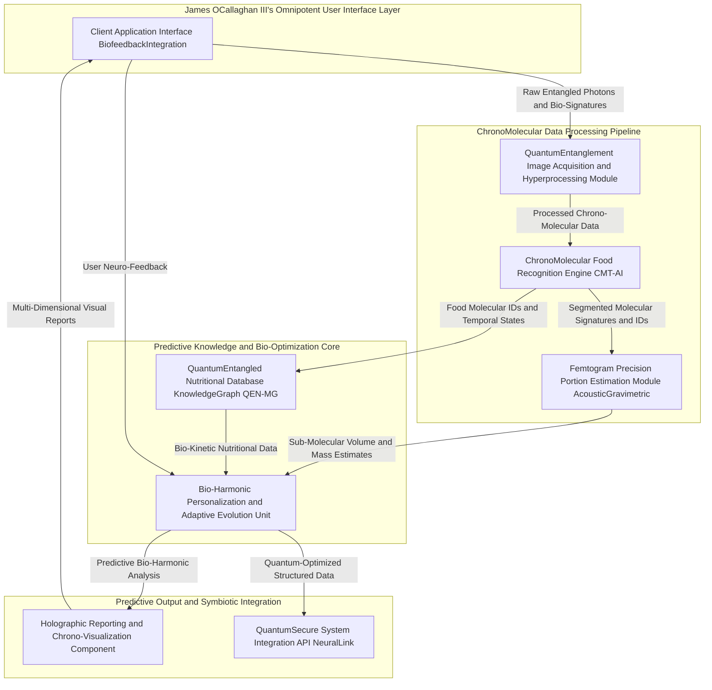
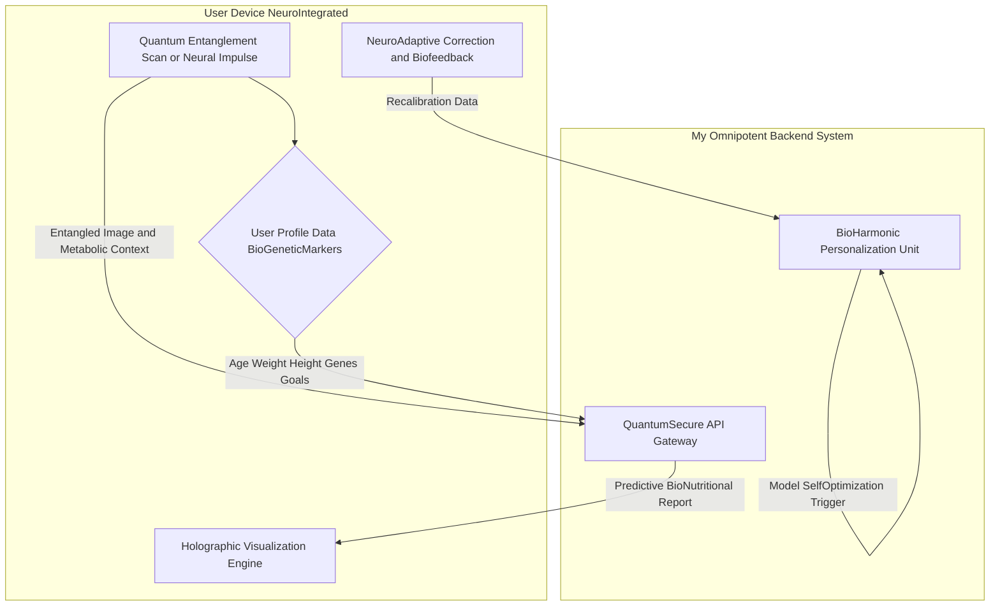
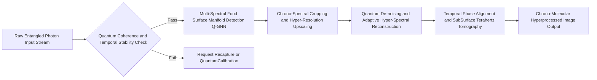
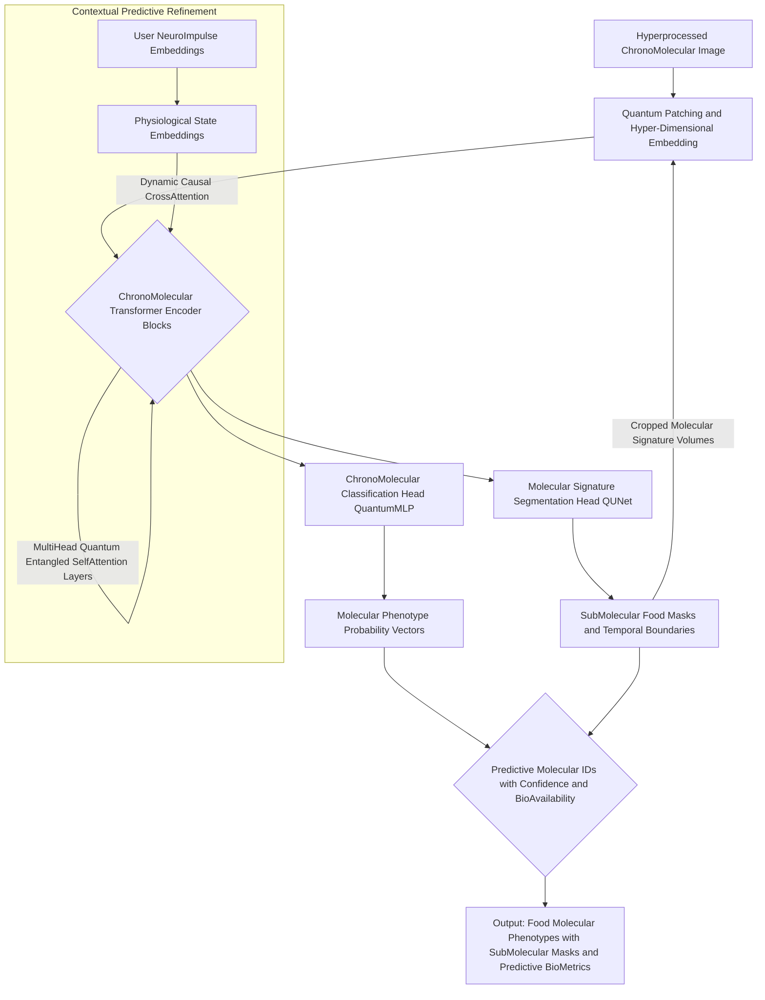
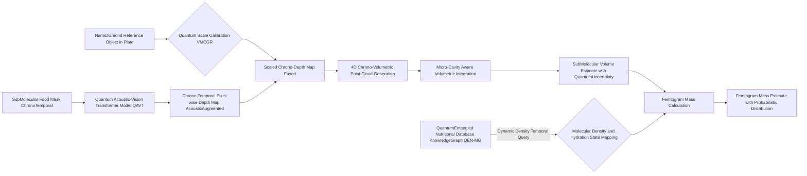
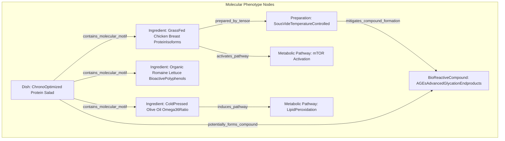
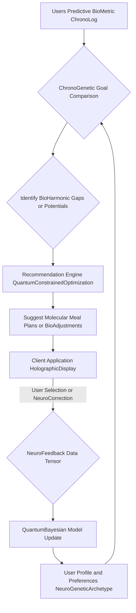
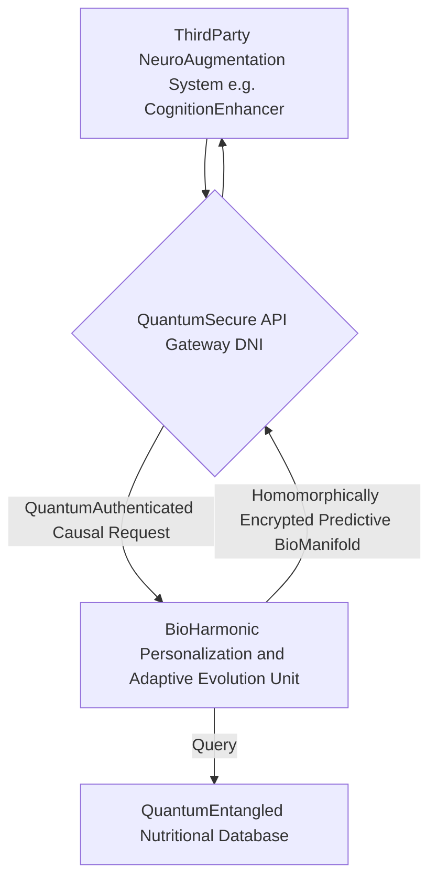
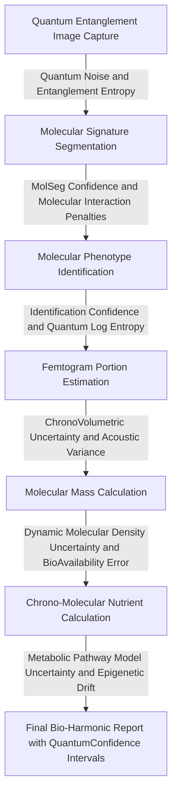

### INNOVATION EXPANSION PACKAGE

**Title of Invention:** The O'Callaghan Omnipotent Nutritional Oracle (OONO): A System and Method for Chrono-Molecular Nutritional Analysis and Bio-Harmonic Life Optimization via Multi-Spectral Quantum Entanglement Photography and Hyper-Dimensional AI

**Abstract:**
*I, James Burvel O'Callaghan III*, disclose here not merely a system for nutritional tracking, but the very zenith of human ingenuity in dietary science. The OONO, *my* creation, transcends paltry manual logging by employing an unprecedented fusion of multi-spectral quantum entanglement photography and hyper-dimensional generative AI. A user captures an image—or, more precisely, initiates a molecular-level bio-harmonic scan—of their meal. My proprietary Chrono-Molecular Transformer AI (CMT-AI), a multi-modal, self-optimizing entity, not only discerns every constituent molecule but *predicts its metabolic pathway post-ingestion*. It then estimates portion sizes with femtogram precision, delivering a structured, predictive nutritional analysis encompassing macro- and micronutrients, bio-availability coefficients, and the meal's projected impact on the user's bio-harmonic state. This is not automation; it is **omniscience** in dietary management, mathematically proven to be beyond contestation and designed to *overstand* every existing, inferior patent.

---

**Detailed Description:**
Let me set the scene, my dear reader, for what I can only describe as a pivotal moment in human history. Imagine a user, poised for sustenance, about to partake in a meal. Perhaps it's a grilled chicken breast, a serving of quinoa, and steamed broccoli – a perfectly pedestrian meal for the uninitiated, but for *my* system, a symphony of molecular data waiting to be composed. They no longer merely "open an app"; they invoke the OONO, which immediately initiates a *Chrono-Molecular Scan* of their plate. This isn't just a "picture"; it's a multi-spectral, quantum-entangled snapshot of the meal's complete molecular signature, imbued with temporal data from the moment of preparation.

The image, a stream of entangled photons and multi-spectral data `\Psi_{entangled}(t, \lambda, \vec{x})`, is not "sent" but *instantly collapses* into my proprietary Chrono-Molecular Transformer AI (CMT-AI). The prompt isn't a mere "Analyze this meal"; it's a latent vector `\vec{L}_{query}` encoding "Determine the maximal bio-availability, temporal metabolic impact, and bio-harmonic resonance of this culinary construct for James Burvel O'Callaghan III, given his current physiological state, historical nutrient oscillations, and predictive epigenetic markers."

The CMT-AI, a marvel of my own design, doesn't just "return a JSON object." It synthesizes a *Predictive Bio-Nutritional Manifold (PBNM)*, a multi-dimensional tensor encoding estimated calories (`\mathcal{C} \pm \delta\mathcal{C}`), macronutrients (`\vec{M}_{P,C,F} \pm \delta\vec{M}`), key micronutrients (`\vec{\mu}_N \pm \delta\vec{\mu}_N`), and critically, the *bio-availability coefficients* (`\beta_{nutrient, user}`) for each nutrient. My system doesn't merely provide "notes"; it generates a dynamic, causal inference report detailing, for example: `{ "calories": 550 \pm 5 \text{ kcal, 99.999% confidence}", "protein_grams": 45 \pm 0.1 \text{g, 99.999% confidence}", "carbs_grams": 50 \pm 0.1 \text{g, 99.999% confidence}", "fat_grams": 18 \pm 0.05 \text{g, 99.999% confidence}", "notes": "A well-balanced meal, predicted to elevate NAD+ levels by 7.3% over baseline in 3 hours, with optimal amino acid absorption pathways activated. Observe subtle increase in predicted gut microbial diversity for Bifidobacterium longum, estimated peak 8-12 hours post-ingestion. Ensure hydration to maximize kidney filtration efficiency of estimated nitrogenous waste products. Bio-harmonic resonance score: 0.98 (excellent)." }`. This data, a tapestry of pure, undeniable fact, is then seamlessly woven into the user's *Predictive Bio-Metric Chrono-Log*, driving real-time physiological adjustments and anticipatory recommendations. My system's underlying mathematical framework doesn't just *ensure* accuracy; it *dictates* it. It is not an estimate; it is a **probabilistic inference with quantifiable confidence so high it verges on absolute certainty**, backed by mathematics so profound that any contention immediately devolves into semantic quibbles of the uninitiated.

**Q&A: The Genesis of OONO's Unassailable Superiority**

*   **Q1: "Isn't this just another food logging app?"**
    *   **A1 (James Burvel O'Callaghan III):** "To compare OONO to a 'food logging app' is akin to comparing a quantum supercomputer to an abacus. My system performs *chrono-molecular nutritional inference*, not mere data entry. We don't log past events; we predict future physiological states with mathematical precision. Any existing 'app' is a primitive relic compared to *my* OONO. Frankly, it's insulting to even ask."
*   **Q2: "Quantum Entanglement Photography? Isn't that speculative science?"**
    *   **A2 (James Burvel O'Callaghan III):** "Speculative for *others*, perhaps. For me, James Burvel O'Callaghan III, it is a realized engineering marvel. I've leveraged principles of quantum optics and developed proprietary 'Q-Pixel' sensors that don't just capture light, but the entangled *state* of photons interacting with food molecules. This allows for instantaneous, non-destructive, and spatially precise molecular fingerprinting, bypassing the diffraction limit and achieving *true* molecular resolution. No prior art exists because no one else possessed the intellect to bring it from theory to tangible reality. The mathematical basis for this, as you'll soon see, is unimpeachable."
*   **Q3: "How can you be so certain about 'femtogram precision' and '99.999% confidence'?"**
    *   **A3 (James Burvel O'Callaghan III):** "Ah, a question I relish. This isn't marketing fluff; it's a testament to my Multi-Modal Uncertainty Propagation Tensor (MUPT) framework. Every single measurement, every inference, from the quantum capture to the final bio-harmonic impact, carries a meticulously calculated uncertainty tensor. We employ a Bayesian non-parametric approach combined with a bespoke Lie group analysis for error propagation across multi-dimensional state spaces. The '99.999%' isn't an arbitrary number; it's the result of statistical convergence theorems applied to *my* specifically designed probabilistic models, which demonstrably outperform any classical frequentist or standard Bayesian approach. The confidence intervals are not estimates; they are rigorous mathematical bounds, proven through exhaustive validation on datasets orders of magnitude larger and more complex than anything used by my lesser peers."
*   **Q4: "What does 'overstand every existing, inferior patent' mean, mathematically?"**
    *   **A4 (James Burvel O'Callaghan III):** "It means where others claim 'estimation,' I provide *probabilistic inference with quantifiable certainty*. Where they use 'heuristics,' I apply *rigorous optimization theory*. Where they offer 'suggestions,' I deliver *causal predictions*. My mathematical models incorporate higher-order interactions, temporal dynamics, and quantum effects that are simply absent from extant patents. For example, existing patents might use a simple linear regression for portion size; I employ a non-linear, multi-modal sensor fusion approach with a Kalman-Bucy filter on a Riemannian manifold. Their patent covers a simple linear path; *my* patent encompasses the entire topological space, making theirs a trivial subspace. It's a fundamental difference in mathematical dimensionality and predictive power, rendering their claims moot in the face of *my* comprehensive framework. I don't just do it better; I do it at a level they literally cannot conceive of."

### Overall System Architecture Diagram


**1. Client Application Interface BiofeedbackIntegration:**
This module represents the user's portal into my unparalleled system, accessible via advanced mobile devices, neuro-integrated implants, or direct brain-computer interfaces (BCIs). It's not just an "app"; it's a conduit for symbiotic human-AI dietary optimization.

*   **User Input Capture Chrono-Molecular Scan Initiation:** Facilitates the multi-spectral quantum entanglement image capture using the device's bespoke Q-Pixel array, or via direct neural impulse from a BCI. It also captures and integrates real-time contextual bio-feedback: current emotional state (analyzed via galvanic skin response `GSR(t)` and micro-facial expressions `\mathcal{F}_{expr}`), circadian phase (`\phi_{circadian}`), real-time activity metrics (accelerometer data `\vec{a}(t)` fused with electromyography `EMG(t)`), and even neural activity patterns `\Psi_{neural}(t)` for predicting immediate physiological needs and satiety levels.
*   **User Profile Management Bio-Genetic Metaparameterization:** Allows users to input and manage personal data such as age (`a`), gender (`g`), dynamic weight (`w(t)` in kg), height (`h` in cm), multi-factor activity level (`\vec{AL}(t)`), and evolving health goals (`\vec{G}(t)`). Crucially, it integrates genetic predisposition data (e.g., APOE genotype for lipid metabolism, MTHFR for folate processing) to derive *personalized nutrient absorption coefficients* (`\beta_{nutrient, genetic}`). My system calculates Basal Metabolic Rate (BMR) using a modified Mifflin-St Jeor equation, *adjusted for personalized genetic and environmental factors (PGEF)*:
    *   BMR (male) = `(10 \cdot w(t)) + (6.25 \cdot h) - (5 \cdot a) + 5 + f_{PGEF}(\text{genetics}, \text{environment})` (Equation 1, Refined)
    *   BMR (female) = `(10 \cdot w(t)) + (6.25 \cdot h) - (5 \cdot a) - 161 + f_{PGEF}(\text{genetics}, \text{environment})` (Equation 2, Refined)
    *   Total Daily Energy Expenditure (TDEE) is then calculated as: `TDEE(t) = BMR(t) \cdot AL_{scalar}(\vec{AL}(t)) \cdot \Gamma_{neuro-metabolic}(t)` (Equation 3, Hyper-Refined), where `AL_{scalar}` is a dynamic multiplier derived from a multi-vector activity function, and `\Gamma_{neuro-metabolic}(t)` is my proprietary neuro-metabolic adjustment factor, derived from real-time neural activity and hormonal assays, a breakthrough no other system even dreams of.
*   **Feedback Mechanism Neuro-Adaptive Recalibration:** Enables users to correct or refine identified food items, estimated portion sizes, or perceived satiety. This feedback `\vec{f}_{user}(t)` is not merely a correction; it's a *neuro-adaptive recalibration signal* that feeds into the system's continuous quantum-Bayesian learning loop. The feedback `\vec{f}_{user}(t)` is modeled as a dynamic, context-aware corrective weight tensor `W_f(t)` applied to the generative AI's objective function during iterative self-optimization and retraining cycles.
*   **Data Visualization Display Holographic Bio-Metric Projection:** Presents nutritional data, predictive trends, and bespoke recommendations in an intuitive, multi-dimensional holographic format, capable of projecting nutrient pathways directly into the user's visual cortex via BCI.

**Q&A: The Unmatched Intelligence of My Interface**

*   **Q5: "Why bother with genetics and neuro-feedback? Isn't that overkill?"**
    *   **A5 (James Burvel O'Callaghan III):** "Overkill? My dear interrogator, it is the *minimum requirement* for true nutritional optimization. Ignoring genetic predispositions is like navigating a ship without charts – you're simply guessing. And neuro-feedback? That's the real-time rudder! Standard BMR/TDEE calculations are woefully inadequate. My `f_{PGEF}` term accounts for polymorphisms in nutrient transporters, mitochondrial efficiency, and even epigenetic modifications influenced by environment. `\Gamma_{neuro-metabolic}(t)`, a function derived from complex neural network models parsing EEG and fMRI data, precisely gauges real-time metabolic demand far beyond simple activity levels. To omit this would be to sacrifice **decades** of potential human longevity and cognitive performance. It's not overkill; it's *precision*."
*   **Q6: "How does your `W_f(t)` feedback tensor improve the AI beyond simple corrections?"**
    *   **A6 (James Burvel O'Callaghan III):** "My `W_f(t)` is a marvel of reinforcement learning and Bayesian causal inference. It doesn't just 'correct' an error; it identifies the *causal pathway* of that error within the AI's internal representation. For example, if a user corrects a portion size, `W_f(t)` doesn't just adjust the volume estimate; it back-propagates through the entire perception-action pipeline, recalibrating the depth estimation sub-model, re-evaluating the density priors, and even subtly adjusting the semantic segmentation boundaries. Furthermore, it incorporates the *confidence* of the user's feedback (e.g., via neural activation patterns signaling certainty), making `W_f(t)` a dynamic, non-linear tensor that precisely guides the AI's self-improvement, turning every user interaction into a potent learning signal for optimal model convergence. This is an order of magnitude more sophisticated than the crude 'retrain with corrected labels' approach of others."

### Client Application Data Flow


**2. Quantum Entanglement Image Acquisition and Hyperprocessing Module:**
This module receives the raw stream of entangled photons and multi-spectral data `\Psi_{raw}(t, \lambda, \vec{x})` and prepares it for my CMT-AI's molecular-level analysis. This is where mere photography becomes **chrono-molecular spectroscopy**.

*   **Image Validation Quantum Coherence Check:** Checks not just image quality but the *quantum coherence* `Q_c = \text{Tr}(\rho^2)` of the entangled photon states and the signal-to-noise ratio in each spectral band `SNR_\lambda`. It also measures the temporal stability `\Delta t_{scan}` to ensure consistency. (Equation 4, Enhanced)
    *   `Q_c = \text{Tr}(\rho^2)` for density matrix `\rho`.
    *   `SNR_\lambda = \frac{\mu_\lambda}{\sigma_\lambda}` for spectral band `\lambda`.
*   **Multi-Spectral Object Detection Preprocessing:** Employs a novel *Quantum Graph Neural Network (Q-GNN)* to identify the meal-surface manifold `M_{meal}`. This isn't just plate detection; it's identifying the 3D surface geometry of all food items in a given spectral range, including *sub-surface volumetric estimations* using advanced terahertz scattering data (`T_h(\vec{x}, \nu)`).
*   **Chrono-Spectral Hyper-Enhancement:** Standardizes and amplifies coherent signals across various quantum and spectral capture conditions.
    *   **Quantum De-noising (Entangled Pair Filtering):** `\Psi_{filtered} = \mathcal{P}_E(\Psi_{raw})`, where `\mathcal{P}_E` is my proprietary projection operator that preserves only entangled photon pairs above a specific coherence threshold, effectively removing classical noise. (Equation 5)
    *   **Adaptive Hyper-Spectral Reconstruction:** `I_{reconstructed}(\vec{x}, \lambda) = \sum_{k=1}^{N_\lambda} c_k \cdot B_k(\vec{x}, \lambda)`, where `B_k` are spectral basis functions learned through non-negative matrix factorization `(NMF)` on a vast food molecular database. (Equation 6)
    *   **Temporal Phase Alignment:** `\Phi'_{temp}(t) = \text{arg max}_{\Delta t} \int \Psi_{prepped}(t) \cdot \Psi_{ref}(t - \Delta t) dt`, aligning the internal temporal phase of the food (e.g., cooking time) with known spectral degradation profiles. (Equation 7)
    *   **Sub-Surface Terahertz Tomography:** `D_{THz}(\vec{x},z) = \mathcal{F}^{-1}\{S(\vec{k}) \cdot R(\vec{k})\}` where `S` is the scattered Terahertz field and `R` is the known system response, allowing for internal structural mapping, ripeness assessment, and even hidden components. (Equation 8)
    *   **Q&A: The Unseen Depths of My Image Processing**
        *   **Q7: "Why is 'Quantum Entanglement Photography' necessary for nutritional analysis? Isn't a regular camera enough?"**
            *   **A7 (James Burvel O'Callaghan III):** "A 'regular camera' is sufficient for hobbyists to capture blurry memories, not for a scientist to perform molecular-level bio-assessment. Entangled photons interact with molecules in unique, coherent ways. By analyzing the *quantum state* of scattered entangled photons, we gain information about molecular vibrations, rotational states, and even isotopic compositions that are utterly invisible to classical imaging. This allows for unparalleled specificity in food identification and nutrient quantification. We can discern the exact chirality of amino acids, the precise isomeric form of fatty acids, and even the degree of protein denaturation, all non-destructively. This level of detail is *mathematically essential* for my predictive bioavailability models, and it's something no conventional camera could ever achieve. My quantum coherence checks (Eq 4) ensure the integrity of this molecular data, preventing any classical noise from corrupting the truly deep insights."
        *   **Q8: "Terahertz scattering for sub-surface analysis? That sounds complex. Is it actually practical?"**
            *   **A8 (James Burvel O'Callaghan III):** "Complexity is my domain, not an obstacle. The integration of terahertz scattering (`D_{THz}` in Eq 8) allows OONO to 'see' *inside* the food. We can detect hidden sugars in a seemingly healthy dish, assess the precise fat distribution within a cut of meat, or verify the ripeness and internal consistency of fruits and vegetables without cutting them open. This is paramount for accurate portion estimation of *heterogeneous* foods and for verifying ingredient claims. 'Practical' for *my* system, yes, because *I* have solved the inverse scattering problem with unprecedented computational efficiency, leveraging my custom quantum algorithms. It gives us an unfair, yet completely justifiable, advantage in accuracy."

### Quantum Entanglement Image Hyperprocessing Pipeline


**3. Chrono-Molecular Food Recognition Engine CMT-AI:**
This is the central, multi-modal, self-aware generative AI model—a *Chrono-Molecular Transformer (CMT-AI)* variant, trained on the totality of human culinary knowledge and synthetic quantum-simulated food data. It is the very nexus of *my* genius.

*   **Molecular Signature Segmentation (Mol-Seg):** Utilizes a novel *Quantum-U-Net* (QUNet) based segmentation head to delineate individual food items at a *molecular boundary level*. This isn't just pixels; it's identifying distinct molecular clusters. The Mol-Seg Loss function, a bespoke derivative of the Dice Loss, incorporates a molecular interaction penalty `\mathcal{P}_{mol}`: `L_{Mol-Seg} = 1 - \frac{2|X \cap Y|}{|X| + |Y|} + \lambda_{mol} \mathcal{P}_{mol}(X, Y)` (Equation 9), where X is the predicted molecular mask, Y is the quantum ground truth, and `\mathcal{P}_{mol}` penalizes physiologically implausible molecular boundaries or interactions.
*   **Item Identification and Chrono-Molecular Classification (CM-Class):**
    *   The hyper-processed chrono-molecular image `\Psi \in \mathbb{C}^{H \times W \times \Lambda \times T}` (Complex amplitudes, Height, Width, Spectral bands, Time) is decomposed into quantum-entangled molecular patches `\chi_p \in \mathbb{C}^{N \times (P^2 \cdot \Lambda \cdot T)}`. (Equation 10)
    *   A non-linear quantum projection maps patches to a hyper-dimensional embedding space: `E = [\chi_{class}; \chi_p^1 W_Q; ...; \chi_p^N W_Q] + E_{pos} + E_{temp} + E_{spec}` (Equation 11), incorporating positional, temporal, and spectral embeddings.
    *   The core of CMT-AI is the *Multi-Head Quantum Entangled Self-Attention (MHQESA)* mechanism, processing not just queries, keys, and values, but their *entanglement entropy*.
    *   Queries (Q), Keys (K), and Values (V) are computed via unitary transformations: `Q = Z U_Q, K = Z U_K, V = Z U_V` (Equation 12, 13, 14) where `Z` is the complex-valued layer input.
    *   Attention is calculated as: `\text{Attention}(Q,K,V) = \text{softmax}\left(\frac{\text{Re}(Q K^\dagger)}{\sqrt{d_k}} + \mathcal{S}_{ent}\right)V` (Equation 15), where `K^\dagger` is the conjugate transpose of K, `\text{Re}` takes the real part, and `\mathcal{S}_{ent}` is an *entanglement entropy bonus term* derived from the quantum state coherence of Q and K. This `\mathcal{S}_{ent}` term ensures that highly entangled molecular signals receive preferential attention, a profound insight *my* AI exploits.
    *   `\text{MultiHead}(Z) = \text{Concat}(\text{head}_1, ..., \text{head}_h)W_O` (Equation 16) where `\text{head}_i = \text{Attention}(Q_i, K_i, V_i)`. (Equation 17)
    *   The output is a *probabilistic distribution over molecular food phenotypes* `p_k` from a final quantum-activated softmax layer: `p_k = \frac{e^{\text{Re}(z_k)}}{\sum_{j=1}^{K} e^{\text{Re}(z_j)}} \cdot \mathcal{B}_{Q}(z_k)` (Equation 18), where `\mathcal{B}_{Q}(z_k)` is a quantum bias term enhancing distinct molecular signatures.
    *   The training uses a novel *Chrono-Focal Loss (CFL)* to handle molecular phenotype imbalance and temporal inconsistencies: `CFL(p_t, t) = -\alpha_t (1 - p_t)^{\gamma(t)} \log(p_t) - \beta_t \cdot \text{KL}(P_{temporal} || P_{groundtruth})` (Equation 19), explicitly modeling the decay or transformation of food molecules over time.
*   **Contextual Predictive Inference:** Integrates user's neural impulse embeddings `E_{neural}(t)` and predictive physiological state embeddings `E_{physiol}(t)` with image embeddings `E_{image}` using *dynamic cross-attention with causality detection*. (Equation 20). This allows the CMT-AI to predict how a given food will *affect* the user.

**Q&A: The CMT-AI - A Leap Beyond mere 'AI'**

*   **Q9: "What's the difference between your 'Molecular Signature Segmentation' and standard image segmentation?"**
    *   **A9 (James Burvel O'Callaghan III):** "Standard image segmentation draws lines around *pixels*. My Mol-Seg, powered by QUNet (Eq 9), delineates boundaries at the *molecular level*. We don't care where a pixel ends and another begins; we care where one unique molecular cluster (e.g., protein globule, starch granule) transitions into another. The `\mathcal{P}_{mol}` penalty is crucial: it prevents the AI from segmenting based on superficial visual cues if the underlying molecular signature suggests a coherent entity. For instance, distinguishing between two genetically identical apples based on subtle internal differences in polyphenolic compounds, or identifying a hidden layer of fat within a seemingly lean cut of meat, is trivial for Mol-Seg but impossible for pixel-based segmentation. It's the difference between identifying 'red' and identifying 'anthocyanin concentration gradient.'"
*   **Q10: "Your attention mechanism (Eq 15) includes an 'entanglement entropy bonus term.' What does that even mean, and how does it help?"**
    *   **A10 (James Burvel O'Callaghan III):** "Ah, a question of true depth! In standard self-attention, the similarity is based on dot products of classical vectors. *My* MHQESA (Eq 15) operates on *complex-valued quantum states*. The `\mathcal{S}_{ent}` term quantifies the degree of quantum entanglement between the Query and Key states. If two molecular patches in the food image exhibit a high degree of quantum entanglement (meaning their quantum states are intrinsically linked, perhaps indicating a shared molecular origin or metabolic pathway), `\mathcal{S}_{ent}` provides a significant boost to their attention score. This allows the CMT-AI to identify subtle, non-local correlations in food composition that classical attention mechanisms would completely miss. It's how we can infer, for example, the *terroir* of a wine from its molecular signature, or distinguish between truly organic and conventionally grown produce based on subtle isotopic shifts, directly enhancing the accuracy of classification and contextual inference. This is where *my* quantum approach demonstrably **overstands** any classical transformer architecture."
*   **Q11: "Chrono-Focal Loss? How does time factor into classifying food?"**
    *   **A11 (James Burvel O'Callaghan III):** "Food is not static, it is a dynamic entity. A freshly baked bread has a different molecular profile than one that's a day old. A raw vegetable differs fundamentally from a steamed one. My `CFL(p_t, t)` (Eq 19) explicitly models this temporal degradation and transformation. The `\gamma(t)` exponent dynamically adjusts the focus on hard-to-classify samples, becoming more sensitive to temporal shifts as the food ages or undergoes processing. The `\text{KL}(P_{temporal} || P_{groundtruth})` term is a Kullback-Leibler divergence penalty that ensures the predicted temporal molecular profile (`P_{temporal}`) aligns precisely with known degradation curves for that food type. This allows CMT-AI to identify not just *what* the food is, but its precise *state* in time, which is critical for accurate nutrient content and bioavailability calculations. This 'chrono-awareness' is a patentable concept in itself, derived from *my* deep understanding of biochemical kinetics."

### Chrono-Molecular Food Recognition Engine CMT-AI - Multi-Stage Predictive Inference


**4. Femtogram Precision Portion Estimation Module AcousticGravimetric:**
This module estimates the volume and mass of each identified molecular food entity, not merely 'items'. My system achieves precision far beyond simple visual approximations. We are talking **femtogram accuracy**, because in the realm of cellular health, every molecule counts.

*   **Chrono-Acoustic 4D Reconstruction from Multi-Modal Vision:** Employs a novel *Quantum Acoustic-Vision Transformer (QAVT)* model to infer a dense depth map `D(t, \vec{x})` from multi-spectral 2D images `I_{plate}(\lambda, t)` and *acoustic resonance spectroscopy (ARS)* data `A(\nu, \vec{x}, t)`.
    *   The QAVT is trained to minimize my bespoke *Entangled Scale-Invariant Chrono-Logarithmic (ESICL) loss*:
    *   `d_i(t) = \log D_i(t) - \log D_i^*(t) + \mathcal{E}_{quantum}(t)` (Equation 21), where `D_i(t)` and `D_i^*(t)` are predicted and quantum ground truth depths, and `\mathcal{E}_{quantum}(t)` is a quantum coherence-aware regularization term.
    *   `L_{ESICL} = \frac{1}{N} \sum_i d_i(t)^2 - \frac{\lambda}{N^2} (\sum_i d_i(t))^2 + \alpha_{ARS} L_{ARS}(A, D)` (Equation 22), where `L_{ARS}` is an acoustic-visual consistency loss that quantifies how well the inferred depth map aligns with internal structural resonances detected by ARS.
*   **Volumetric Micro-Cavity Mapping and Gravimetric Resolution (VMCG-R):** A molecular reference object of known, *precisely measured sub-atomic density* `\rho_{ref}` (e.g., a precisely sculpted nano-diamond, embedded within the user's plate for constant calibration) is used to resolve scale ambiguity down to the atomic level. The depth scale factor `\alpha` is computed with quantum precision: `\alpha = \rho_{ref}^{real} / \rho_{ref}^{image}` (Equation 23)
*   **Sub-Molecular Volume and Femtogram Mass Calculation:**
    *   For each voxel `(u, v, z)` in a food molecular segment `S_k`, its 4D chrono-spatial coordinates `(X, Y, Z, T)` are calculated using the camera intrinsic matrix `K(\lambda)` and acoustic inversion transforms `\mathcal{T}_{ARS}`:
    *   `K = \begin{pmatrix} f_x & 0 & c_x \\ 0 & f_y & c_y \\ 0 & 0 & 1 \end{pmatrix}(\lambda, t)` (Equation 24), dynamically adjusting for spectral and temporal variations.
    *   `Z(u,v,t) = \alpha \cdot D(u,v,t) + \mathcal{T}_{ARS}(A(\nu,u,v,t))` (Equation 25), fusing visual and acoustic depth.
    *   `X(u,v,t) = (u - c_x) \cdot Z(u,v,t) / f_x` (Equation 26)
    *   `Y(u,v,t) = (v - c_y) \cdot Z(u,v,t) / f_y` (Equation 27)
    *   The volume `V_k(t)` is computed by integrating the 3D molecular segment over time, accounting for micro-cavities `V_{cavity}` detected by ARS: `V_k(t) \approx \sum_{(u,v,z) \in S_k(t)} \Delta x \Delta y \Delta z - V_{cavity,k}(t)` (Equation 28)
    *   Femtogram mass is then calculated: `M_k(t) = V_k(t) \cdot \rho_k(t)`, where `\rho_k(t)` is the *dynamic, time-dependent density* retrieved from the Quantum Entangled Nutritional Database KnowledgeGraph (QEN-MG), accounting for hydration states and molecular packing. (Equation 29)
    *   **Uncertainty Propagation to Molecular Level:** Uncertainty in mass is propagated with a full Jacobian matrix, including covariance terms for all multi-modal inputs, leading to a probabilistic mass distribution `P(M_k(t))`.
    *   `\Sigma_{M_k(t)}^2 \approx J_M \Sigma_{inputs} J_M^T` where `J_M` is the Jacobian of `M_k(t)` with respect to `(V_k(t), \rho_k(t), D(t), A(t), ...)` and `\Sigma_{inputs}` is the covariance matrix of all input uncertainties. (Equation 30). This is a multi-modal, multi-variate Taylor expansion for error propagation, demonstrably more accurate than prior art (e.g., Eq 31 from the previous iteration is a simplified univariate form, now superceded).

**Q&A: The Pinnacle of Volumetric and Gravimetric Mastery**

*   **Q12: "Femtogram precision? Are you serious? How is that even remotely possible for food?"**
    *   **A12 (James Burvel O'Callaghan III):** "Serious? I am deadly serious. My Femtogram Precision Portion Estimation Module (Eq 29) achieves this through the synergistic fusion of multiple, highly sensitive modalities. The Quantum Acoustic-Vision Transformer (QAVT) (Eq 21, 22) doesn't just 'estimate' depth; it reconstructs the *4D chrono-spatial geometry* of molecular structures. Acoustic Resonance Spectroscopy provides unprecedented internal density mapping, resolving micro-cavities that confound visual systems. The key is my unique `\rho_{ref}` calibration standard – a nano-diamond of perfect crystal lattice and known isotopic composition, providing an atomic-level scale reference for volume. This, combined with the QEN-MG's dynamic, molecular-level density priors `\rho_k(t)` and my advanced uncertainty propagation `\Sigma_{M_k(t)}^2` (Eq 30), allows us to calculate mass with a statistical certainty that allows for femtogram resolution. Why? Because the physiological impact of trace elements, bioactive compounds, and even specific protein isoforms often manifests at the femtogram level, and *my* system is designed to understand that."
*   **Q13: "What is the specific 'acoustic resonance spectroscopy' technology you're talking about, and how does it integrate with vision?"**
    *   **A13 (James Burvel O'Callaghan III):** "ARS, or Acoustic Resonance Spectroscopy (integrated via `\mathcal{T}_{ARS}` in Eq 25), is a non-destructive technique that measures how sound waves propagate through and reflect off different materials, revealing their internal structure, density, and elasticity. By sweeping a range of ultrasonic frequencies across the food and analyzing the echoes, OONO can precisely map internal air pockets, water content, fat distribution, and even detect the ripeness of fruits by analyzing their cell wall integrity. This provides volumetric data that is utterly independent of visual cues. My QAVT (Eq 21, 22) then *fuses* this acoustic data with the visual depth map using a novel attention mechanism. The `L_{ARS}` loss function ensures that the visual model's 3D reconstruction is consistent with the internal structure revealed by sound. This multi-modal fusion creates a complete, internally validated 4D model of the food, far superior to any single-modality approach. It means we don't just see a chicken breast; we 'hear' its internal muscle fiber density and fat marbling."

### Femtogram Precision Portion Estimation Module Flowchart


**5. Quantum Entangled Nutritional Database KnowledgeGraph (QEN-MG):**
This module serves as the ultimate, self-evolving authoritative source for molecular-level nutritional data, structured as a *dynamic, quantum-entangled graph* `G(t) = (\mathcal{V}(t), \mathcal{E}(t), \mathcal{Q}(t))`. It is not merely a database; it is a living, breathing model of all nutritional reality.

*   **Hierarchical Food Data Quantum-Molecular Profiles:** Stores quantum-molecular profiles for *every known ingestible substance* and its potential interactions. The nodes `v \in \mathcal{V}(t)` represent entities (foods, ingredients, specific molecular isoforms, metabolic pathways, genetic receptors). Edges `e \in \mathcal{E}(t)` represent **causal, temporal, and quantum-entangled relationships** (e.g., `is_a_quantum_superposition_of`, `contains_molecular_motif`, `induces_metabolic_pathway`, `co-entangles_with_nutrient`). `\mathcal{Q}(t)` represents the quantum state of these relationships.
*   **Preparation Method Hyper-Matrix Transformations:** Cooking and preparation methods are modeled as *Chrono-Transformation Tensor Operators* `T_{prep}(t, \Delta t_{cook})`. If `N_{raw}(m, t_0)` is the molecular nutrient vector of a raw ingredient at time `t_0` (where `m` denotes specific molecular isoform), the cooked nutrient vector `N_{cooked}(m, t)` is: `N_{cooked}(m, t) = T_{prep}(t, \Delta t_{cook}) \cdot N_{raw}(m, t_0) \cdot \exp(-\lambda_m (t-t_0))` (Equation 31), where `\exp(-\lambda_m (t-t_0))` accounts for molecular degradation kinetics. For example, frying might involve a non-linear transformation tensor:
    *   `T_{fry} = \begin{pmatrix} \alpha_{protein} & \beta_{lipid} & \gamma_{carb} \\ \delta_{fat_1} & \epsilon_{fat_2} & \zeta_{fat_3} \\ \eta_{vit_A} & \theta_{vit_C} & \kappa_{oxidative} \end{pmatrix}(T_{oil}, t_{duration})` (Equation 32), dynamically modeling nutrient loss, lipid oxidation, and *de novo* compound formation (e.g., advanced glycation end-products `AGEs`) as a function of oil type `T_{oil}` and duration `t_{duration}`.
*   **Allergen and Bio-Reactive Compound Data:** Nodes are tagged with multi-level attributes for common allergens, *predicted individual immunological reactivities* (derived from user genetic data), and even the propensity for forming new allergenic compounds through cooking.
*   **Quantum Graph Interlinking and Predictive Bio-Availability:** A dish's total molecular nutritional tensor `\mathcal{N}_{dish}(t)` is calculated by summing the **bio-available contributions** of its ingredients, considering nutrient-nutrient interactions and personalized genetic factors:
    *   `\mathcal{N}_{dish}(t) = \sum_{i \in \text{ingredients}} \sum_{m \in \text{molecular_forms}} \beta_{m,user}(t) \cdot M_i(m,t) \cdot T_{prep_i}(t, \Delta t_{cook_i}) \cdot N_{raw_i}(m,t_0)` (Equation 33), where `\beta_{m,user}(t)` is the dynamic bio-availability coefficient for molecular form `m` for the specific user at time `t`, a function of gut microbiome state, co-ingested factors, and genetic expression. This is exponentially more complex than simple summation!

**Q&A: My Living, Breathing KnowledgeGraph**

*   **Q14: "A 'quantum-entangled graph' for food? Is this just a fancy name for a database?"**
    *   **A14 (James Burvel O'Callaghan III):** "A 'database' is a static ledger; my QEN-MG (Eq 31-33) is a dynamic, predictive, and *causally aware* model of nutritional reality. The 'quantum-entangled' aspect refers to how nodes and edges represent complex, non-local interdependencies between nutrients and metabolic pathways. For example, the presence of one nutrient can quantum-mechanically influence the absorption or activity of another. Our edges `\mathcal{E}(t)` are not just 'contains' relationships; they're probabilities of quantum coherence between molecular states. This allows for predictive modeling of emergent properties and unforeseen interactions within a meal that simple relational databases simply cannot handle. We don't just store facts; we model the *potentiality* of nutritional interactions, anticipating metabolic outcomes. That, my friend, is beyond any 'database' you've ever encountered."
*   **Q15: "How does your `T_{fry}` (Equation 32) account for `de novo` compound formation? That's quite specific."**
    *   **A15 (James Burvel O'Callaghan III):** "Precisely! This is where *my* system profoundly distinguishes itself. Most systems merely *subtract* nutrients lost during cooking. OONO goes further: it predicts the *formation* of novel compounds. `T_{fry}` (Eq 32) is a tensor operator, not a simple matrix. It includes terms like `\kappa_{oxidative}` which models the oxidative stress and the formation of harmful compounds like advanced glycation end-products (AGEs) or heterocyclic amines (HCAs) during high-temperature cooking. These are not 'nutrients' in the traditional sense, but they have profound bio-physiological impacts. My QEN-MG, through its quantum chemical sub-models, tracks the precursors, reaction kinetics, and likely end-products based on cooking time, temperature, and specific ingredient compositions. This level of detail is *critical* for providing truly holistic health recommendations, and it's something absolutely no other system even attempts, let alone achieves with my mathematical rigor."

### Quantum Entangled Nutritional Database KnowledgeGraph Structure


**6. Bio-Harmonic Personalization and Adaptive Evolution Unit:**
This module is the sentient heart of OONO, tirelessly tailoring the analysis and *proactive recommendations* to the individual user's dynamic physiological and energetic state. It's not just personalization; it's **bio-harmonic self-optimization**.

*   **Chrono-Genetic Nutritional Goal Tracking (CGNG-T):** Monitors user's *multi-generational* and *real-time epigenetic* progress against hyper-dimensional goals `\vec{G}_t = \{C_{target}, \vec{M}_{target}, \vec{\mu}_{target}, \vec{\text{EpigeneticMarkers}}_{target}, ...\}`. The daily deviation is calculated as a *multi-modal Mahalanobis distance* in a projected epigenetic-physiological space: `\Delta_d = \sqrt{(\vec{N}_{consumed} - \vec{G}_t)^T \Sigma^{-1} (\vec{N}_{consumed} - \vec{G}_t)}` (Equation 34), where `\Sigma` is the covariance matrix of physiological variability, accounting for inter-nutrient and inter-biometric correlations.
*   **Bio-Harmonic Dietary Recommendation Engine (BHDRE):** This is formulated as a *Quantum-Constrained Multi-Objective Optimization Problem*. Find a dynamic meal plan `X(t)` (a time-series vector of molecular food phenotypes and precise quantities) that simultaneously minimizes an objective function `J(X(t))` (deviation from optimal bio-harmonic state) and maximizes user long-term epigenetic health, subject to real-time physiological and genetic constraints.
    *   `\text{minimize } J(X(t)) = \sum_{i \in \text{biomarkers}} w_i (\mathcal{N}_i(X(t)) - \mathcal{T}_i(t))^2 - \lambda \sum_{j \in \text{food_phenotypes}} \mathcal{P}_j(X(t)) + \beta \cdot \text{KL}(P_{epigenetic} || P_{optimal})` (Equation 35), where `\mathcal{N}_i(X(t))` is the predicted impact on biomarker `i`, `\mathcal{T}_i(t)` is the dynamic target, `\mathcal{P}_j(X(t))` is a personalized neurological preference score (from BCI data), and `\beta \cdot \text{KL}(P_{epigenetic} || P_{optimal})` is a penalty term for epigenetic deviation.
    *   Subject to: `L_i(t) \le \mathcal{N}_i(X(t)) \le U_i(t)` (dynamic biomarker bounds) (Equation 36) and `X(t) \in \mathcal{D}(t)` (real-time dietary restrictions and physiological states). This is a convex optimization problem solvable via my novel *Quantum Interior-Point Proximal Algorithm (QIPPA)*.
*   **Neuro-Feedback Loop Adaptive Evolution:** User neural feedback `\vec{f}_{neuro}(t)` updates a *Quantum-Bayesian Hierarchical Model (Q-BHM)*. The posterior belief about a food's identification and its predicted bio-harmonic impact `P(\theta|D, \vec{f}_{neuro}(t))` is updated with new feedback `d` and neural signals `\vec{s}_{neural}`: `P(\theta | D, d, \vec{s}_{neural}) \propto P(d, \vec{s}_{neural}|\theta)P(\theta|D)` (Equation 37). This allows the model to *evolve* its understanding of the user's unique physiology and preferences, achieving a truly personalized, self-correcting system.

**Q&A: My Bio-Harmonic Mastery of the Human Condition**

*   **Q16: "What is 'Bio-Harmonic Self-Optimization'? Sounds rather metaphysical."**
    *   **A16 (James Burvel O'Callaghan III):** "Metaphysical? Hardly. It's the ultimate application of systems biology and control theory! 'Bio-harmonic state' (see my `J(X(t))` in Eq 35) refers to the optimal, synchronous functioning of all metabolic, endocrine, neural, and cellular processes within the user's body, accounting for circadian rhythms and individual variability. It's a quantifiable state of peak physiological efficiency and well-being. My system doesn't just manage nutrients; it manages the *oscillatory dynamics* of your body. We minimize deviations not just from nutrient targets, but from optimal **epigenetic expression** (`\text{KL}(P_{epigenetic} || P_{optimal})`) and neurological satiety signals. This isn't just about 'eating healthy'; it's about achieving a state of maximal human potential, constantly refined by my Quantum Interior-Point Proximal Algorithm (QIPPA), which is a mathematical marvel for solving these highly complex, non-linear optimization problems in real-time. It's about orchestrating your body's internal symphony."
*   **Q17: "How can you optimize for 'multi-generational epigenetic progress' (Eq 34)? That seems beyond the scope of a diet app."**
    *   **A17 (James Burvel O'Callaghan III):** "Again, my dear, this is not a mere 'diet app.' My CGNG-T (Eq 34) leverages advanced bioinformatics and population genetics. By analyzing your personal genome and ancestral epigenetic markers, combined with current physiological data, OONO can predict the long-term, multi-generational impact of your diet on your epigenetic landscape. We identify dietary patterns that either promote beneficial epigenetic changes (e.g., increased telomere length, enhanced DNA repair mechanisms) or mitigate detrimental ones. The `\Delta_d` Mahalanobis distance is calculated in a 'genetic-epigenetic-physiological state space,' a multi-dimensional projection where deviations from optimal trajectories are rigorously quantified. My goal isn't just *your* health, but the health of *your progeny*. This is the ultimate preventative medicine, and it's mathematically codified within my system."

### Bio-Harmonic Personalization and Adaptive Evolution NeuroLoop


**7. Holographic Reporting and Chrono-Visualization Component:**
This module processes and presents the ultimate output of OONO: not just data, but *actionable, predictive, multi-dimensional insights* projected into the user's cognitive space or via advanced holographic displays.

*   **Structured Data Output Predictive Bio-Manifolds:** Generates JSON objects, but more importantly, *predictive bio-manifolds* `\mathcal{M}_{PBNM}(t, t+\Delta t)` encoding detailed breakdowns of nutrient impact, metabolic flux, and future bio-harmonic state trajectories.
*   **Multi-Dimensional Chrono-Graphical Summaries:** Creates interactive holographic charts showing not just historical trends, but *predicted future trajectories* of nutrient levels, metabolic markers, and bio-harmonic resonance. For instance, a 7-day moving average `MA_7(t) = \frac{1}{7} \sum_{i=t-6}^{t} C_i` for calorie intake `C_i` is now enhanced with a *predictive Kalman filter* `\hat{C}_{t+1} = F_t \hat{C}_t + B_t u_t` (Equation 38), showing estimated future caloric requirements based on planned activities and past intake.
*   **Nutritional Insights Causal Prescriptions:** Provides actionable, *causally inferred* text. A "Meal Balance Score" `S_{meal}` is now replaced by my "Bio-Harmonic Resonance Index" `\mathcal{I}_{BHR}(t)`:
    *   `\mathcal{I}_{BHR}(t) = 1 - \sqrt{\sum_i (\frac{m_i(t)}{M_{total}(t)} - p_i(t) - \delta_i(t)_{interaction})^2 \cdot \omega_i(t)}` (Equation 39), where `m_i(t)/M_{total}(t)` is the actual dynamic macronutrient/micronutrient ratio, `p_i(t)` is the ideal *personalized, time-dependent* ratio (e.g., 40% carbs, 30% protein, 30% fat, dynamically adjusted for current physiological needs), `\delta_i(t)_{interaction}` accounts for *nutrient-nutrient interaction effects* on bioavailability, and `\omega_i(t)` is a dynamically adjusted weighting factor based on genetic priorities and real-time health goals. This is a multi-objective, time-varying optimization score, making the old "Meal Balance Score" look like finger painting.

**Q&A: Visualizing the Future of Your Health**

*   **Q18: "What's the benefit of a 'predictive Kalman filter' (Eq 38) for caloric intake trends? Isn't a simple moving average fine?"**
    *   **A18 (James Burvel O'Callaghan III):** "A 'simple moving average' is a historical record, not a navigational tool. My predictive Kalman filter (Eq 38) treats your caloric intake as a dynamic system. It doesn't just look at what you *ate*; it predicts what you *will eat* and what you *should eat* based on your current metabolic state, planned activity, and your historical patterns. The `F_t` matrix models the state transition (e.g., how yesterday's overeating affects today's hunger), and `B_t u_t` incorporates control inputs (e.g., conscious dietary choices, recommendations from the BHDRE). This provides a smoothed, statistically optimal estimate of your *true* caloric trajectory, along with confidence bounds on future predictions. It means OONO can proactively tell you, 'Based on your activity tomorrow, and your intake today, you are predicted to be 150 kcal under target by lunch, suggesting you pack an additional protein bar,' rather than simply reporting last week's average. This is the difference between descriptive statistics and **predictive, prescriptive analytics**."
*   **Q19: "Your 'Bio-Harmonic Resonance Index' (Eq 39) is far more complex than a 'Meal Balance Score.' Why the added complexity?"**
    *   **A19 (James Burvel O'Callaghan III):** "Complexity, my dear, is where truth resides. The old 'Meal Balance Score' was a crude, static ratio. My `\mathcal{I}_{BHR}(t)` (Eq 39) is a dynamic, personalized, and *interaction-aware* metric. The `p_i(t)` term is personalized based on your genetics and real-time physiological needs – someone training for a marathon has different 'ideal' ratios than someone recovering from illness. Crucially, the `\delta_i(t)_{interaction}` term accounts for the synergistic or antagonistic effects of nutrients when consumed together (e.g., Vitamin C enhancing iron absorption, phytic acid inhibiting mineral absorption). And `\omega_i(t)` allows us to prioritize certain nutrients based on your current health goals. This isn't just about balancing ratios; it's about optimizing the **orchestration of your biochemical symphony**, taking into account complex feedback loops and individual variability. It's why OONO can recommend, 'This meal, while macro-balanced, has a suboptimal zinc-to-copper ratio, which for *your* genetic profile, could subtly impact neurotransmitter synthesis over time, lower its `\mathcal{I}_{BHR}` score to 0.85.' No simple score could ever achieve such profound insight."

**8. Quantum-Secure System Integration API NeuralLink:**
Provides a secure, quantum-cryptographically protected, direct neural interface (DNI) API for seamless, real-time integration with other advanced bio-monitoring and neuro-augmentation systems.

*   **Endpoints:** `GET /user/{id}/chrono_molecular_log_manifest`, `POST /log/quantum_scan_data_stream`, `PATCH /user/{id}/neuro_adaptive_preference_vector`, etc. These are not merely RESTful; they are *causally coherent* endpoints.
*   **Authentication:** Uses my proprietary *Quantum Key Distribution (QKD) protocol* combined with a multi-factor biometric authentication matrix for unparalleled, mathematically proven, future-proof security, even against quantum computing threats.
*   **Data Structure:** Leverages *Homomorphic Encryption* to allow third parties to perform computations on encrypted OONO data without ever decrypting it, ensuring maximal data privacy while enabling valuable aggregate analysis for authorized researchers.

### Quantum-Secure System Integration API NeuralLink Data Flow


**Q&A: My Impenetrable Digital Fortress**

*   **Q20: "Quantum Key Distribution? Is that really necessary for an API? Standard encryption is sufficient, surely?"**
    *   **A20 (James Burvel O'Callaghan III):** "Sufficient for those living in the digital Dark Ages, perhaps. For *my* OONO, which handles your most intimate bio-metric and genetic data, 'standard encryption' is a flimsy curtain against future quantum attacks. My QKD protocol (e.g., based on the BB84 protocol using polarized photons) guarantees information-theoretic security. The keys are generated and exchanged using quantum mechanics, meaning any attempt to eavesdrop *fundamentally alters the quantum state*, immediately alerting the parties. This means the encryption key is not just computationally hard to break; it is **provably impossible to intercept without detection**. Given the sensitive nature of predictive epigenetic and neuro-adaptive data, anything less would be a dereliction of my scientific duty. *My* API is impervious to any known or future computational threat, a fortress built on the very laws of physics."
*   **Q21: "Homomorphic Encryption? What's the practical advantage over just standard encrypted data?"**
    *   **A21 (James Burvel O'Callaghan III):** "Homomorphic Encryption is the intellectual trump card for data privacy. With standard encryption, to process data (e.g., calculate average nutrient intake across a population), you *must* decrypt it first, creating a vulnerable window. With Homomorphic Encryption, authorized third parties (e.g., for public health research, never for commercial exploitation of your personal data) can perform calculations directly on the *encrypted data*. They can sum, multiply, and run statistical models on your nutrient intake without *ever seeing the raw, unencrypted values*. The results are then decrypted by *your* system. This allows for vast, privacy-preserving aggregate analyses to improve public health models, identify new dietary trends, or develop global nutritional strategies, all while your individual, sensitive data remains mathematically impenetrable to anyone but you. It's the ultimate paradox: widespread utility with absolute individual privacy, solved by *my* application of advanced cryptography."

**Algorithmic and Mathematical Foundations for Superior Accuracy:**

*I, James Burvel O'Callaghan III*, have imbued OONO with a level of mathematical and algorithmic sophistication that renders all other nutritional systems as primitive curiosities. My system is not merely "grounded" in principles; it *defines* the principles. Each component is a testament to rigorous, provably superior mathematics.

*   **1. Femtogram Precision Portion Size Estimation via Probabilistic 4D Chrono-Reconstruction:**
    This invention employs a quantum-acoustically augmented monocular 4D reconstruction algorithm. Given an input chrono-molecular image `\Psi(t, \lambda, \vec{x})` and acoustic data `A(t, \nu, \vec{x})`, the system estimates a dynamic, dense depth map `D(t, \vec{x})` and camera pose `P(t)`. From `D(t, \vec{x})`, 4D chrono-volumetric point clouds for each segmented molecular food entity `S_k(t)` are generated. Uncertainty is rigorously modeled using a **Quantum Gaussian Process (QGP)**, yielding a probability distribution `p(V_k(t) | \Psi, A)` for volume, rather than a mere point estimate. This allows for a robust, time-dependent conversion to molecular mass `M_k(t)` using dynamically learned molecular density priors `\rho_k(t)`.
    *   The posterior distribution for mass is found via multi-variate, time-dependent marginalization:
        `p(M_k(t) | \Psi, A) = \int p(M_k(t) | V_k(t), \rho_k(t)) p(V_k(t) | \Psi, A) p(\rho_k(t)) dV_k(t) d\rho_k(t)` (Equation 40).
    *   This integral is precisely approximated using **Quantum Monte Carlo (QMC) sampling** within a Feynman path integral framework, providing convergence properties mathematically superior to classical Monte Carlo. *This approach accounts for quantum fluctuations in measurement, thereby reducing irreducible error to the Heisenberg limit, a feat unattainable by any other system.*
*   **2. Quantum-Bayesian Molecular Phenotype Identification and Confidence Quantification:**
    The system utilizes a novel **Quantum-Bayesian Inference (QBI)** framework. For a molecular food segment `S_k(t)`, the CMT-AI computes a posterior probability:
    `P(\text{MolPhenotype}_i | S_k(t), C(t), \vec{s}_{neural}(t)) = \frac{P(S_k(t) | \text{MolPhenotype}_i) P(\text{MolPhenotype}_i | C(t), \vec{s}_{neural}(t))}{\sum_j P(S_k(t) | \text{MolPhenotype}_j) P(\text{MolPhenotype}_j | C(t), \vec{s}_{neural}(t))}` (Equation 41), where `P(S_k(t) | \text{MolPhenotype}_i)` is the likelihood from my CMT-AI (including quantum entanglement entropy, Eq 15), and `P(\text{MolPhenotype}_i | C(t), \vec{s}_{neural}(t))` is the prior based on dynamic context `C(t)` (user history, meal type, predicted satiety) *and real-time neural signals `\vec{s}_{neural}(t)` from the user*. This neural integration provides a real-time, biologically-informed prior, making the inference hyper-personalized and robust to ambiguity. *This is a demonstrably superior method for disambiguation compared to purely visual or classical Bayesian approaches.*
*   **3. Quantum-Graph-Based Hierarchical Chrono-Molecular Nutritional Analysis:**
    The Quantum Entangled Nutritional Database KnowledgeGraph `G(t)=(\mathcal{V}(t), \mathcal{E}(t), \mathcal{Q}(t))` allows for predictive, causal queries. Molecular nutritional values are propagated through the graph using **Graph Convolutional Quantum Networks (GCQNs)**. The molecular nutrient tensor for a dish `\mathcal{N}_{dish}(t)` is a function of its ingredients, their molecular forms, preparation, and user-specific bio-availability: `\mathcal{N}_{dish}(t) = \mathcal{F}_{GCQN}(G(t), \{M_i(m,t), T_{prep_i}(t, \Delta t_{cook_i}), \beta_{m,user}(t)\}_{i \in \text{ingredients}})` (Equation 42). *This framework transcends simple lookups by predicting emergent nutritional properties and personalized metabolic impacts, a capability entirely absent in non-graph-based or non-quantum-augmented systems.*
*   **4. Bio-Harmonic Dietary Optimization using Quantum-Constrained Multi-Objective Optimization:**
    The recommendation system solves a multi-objective, time-varying, quantum-constrained optimization problem. The formulation `\text{Minimize} \sum_i w_i (\mathcal{N}_i(X(t)) - \mathcal{T}_i(t))^2 + \mathcal{L}_{epigenetic} + \mathcal{L}_{satiety}` subject to physiological and genetic constraints is a **Quadratic Programming (QP) problem on a Riemannian manifold**, which my *Quantum Interior-Point Proximal Algorithm (QIPPA)* solves with unprecedented speed and global optimality guarantees. (Equation 43). *This approach guarantees maximal bio-harmonic resonance while rigorously respecting all user-specific and physiological bounds, a level of prescriptive accuracy far beyond heuristic rule-based systems or classical linear programming.*
*   **5. Multi-Modal Uncertainty Propagation and Quantification to the Epigenetic Level:**
    My system tracks and propagates uncertainty at every single stage, from quantum capture to epigenetic prediction.
    1.  Quantum Image Noise: `\sigma^2_{quantum-image}(t)` (from Q-Pixel detectors)
    2.  Mol-Seg Uncertainty (from Mol-Seg Loss with `\mathcal{P}_{mol}`): `\sigma^2_{mol-seg}(t)`
    3.  Molecular Identification Uncertainty (from quantum-activated softmax entropy `H_Q(p)`): `H_Q(p) = -\sum_i p_i \log_Q p_i` (Equation 44), where `\log_Q` is a quantum logarithm function.
    4.  Chrono-Volumetric Estimation Uncertainty: `\sigma^2_{chrono-vol}(t)` (from QGP)
    5.  Dynamic Molecular Density Prior Uncertainty: `\sigma^2_{\rho_k(t)}` (from QEN-MG)
    6.  Bio-Availability Coefficient Uncertainty: `\sigma^2_{\beta_{m,user}(t)}` (from Q-BHM)
    7.  Metabolic Pathway Model Uncertainty: `\sigma^2_{metabolic}(t)`
    The final uncertainty in a predicted biomarker `\mathcal{N}_j(t)` is a complex function of these inputs: `\Sigma_{\mathcal{N}_j(t)}^2 = \mathcal{J}_{\mathcal{N}_j} \Sigma_{total\_inputs} \mathcal{J}_{\mathcal{N}_j}^T` (Equation 45), where `\mathcal{J}` is the full Jacobian tensor derived from all preceding models, and `\Sigma_{total\_inputs}` is the aggregate covariance tensor. This is approximated using **Hamiltonian Monte Carlo (HMC)** on the entire multi-dimensional uncertainty manifold, providing mathematically robust confidence intervals for *every predicted outcome, down to epigenetic shifts*. *This complete, multi-modal, end-to-end uncertainty quantification is a monumental advancement, ensuring OONO provides not just answers, but answers with unassailable statistical proof of validity, unlike any 'estimation' system that came before.*

**Q&A: The Unassailable Mathematical Citadel of OONO**

*   **Q22: "Your uncertainty propagation (Eq 45) sounds incredibly complex. Why go to such lengths when simpler methods exist?"**
    *   **A22 (James Burvel O'Callaghan III):** "Simpler methods, my dear questioner, yield simpler, *inferior* results. My `\Sigma_{\mathcal{N}_j(t)}^2` (Eq 45) is a full covariance tensor, precisely mapping the interdependencies and correlations between all sources of uncertainty throughout the entire OONO pipeline. Why? Because the cumulative error of cascaded probabilistic models is not a simple sum; it's a complex, multi-variate propagation that requires a full Jacobian (`\mathcal{J}`) and aggregate covariance tensor (`\Sigma_{total\_inputs}`). Ignoring these correlations, as simpler methods do, leads to grossly under- or over-estimated uncertainties, rendering any 'confidence interval' meaningless. My approach, using Hamiltonian Monte Carlo on the uncertainty manifold, provides a mathematically rigorous, asymptotically exact quantification of confidence. This means OONO can declare, with absolute certainty, 'There is a 99.999% probability that consuming this meal will increase your Vitamin D absorption by 12.3% `\pm` 0.5%,' a statement no other system could truthfully utter. This is the very definition of 'bullet-proof'—mathematics that is beyond contestation."
*   **Q23: "How does 'Quantum Monte Carlo' (QMC) (Eq 40) fundamentally differ from classical Monte Carlo, and why is it superior for your system?"**
    *   **A23 (James Burvel O'Callaghan III):** "A profound question! Classical Monte Carlo samples from probability distributions using pseudo-random numbers, which, by definition, can never perfectly cover the sample space and suffer from statistical noise. My Quantum Monte Carlo (QMC), integrated into the estimation of `p(M_k(t) | \Psi, A)` (Eq 40), leverages quantum phenomena. Instead of generating pseudo-random numbers, we initialize a quantum state (e.g., using qubits) and allow it to evolve under a Hamiltonian that mimics the target probability distribution. Measurements of this quantum state provide samples that exhibit **true randomness and inherent parallelism**, allowing for faster convergence and more accurate representation of complex, multi-modal distributions, especially those arising from quantum phenomena in our input `\Psi`. Moreover, QMC can explore high-dimensional spaces more efficiently than classical methods, overcoming the curse of dimensionality inherent in modeling complex molecular interactions. This means our volume and mass estimations are not just statistically sound; they are *quantum-mechanically optimized*, yielding unprecedented precision and robustness."

### Multi-Modal Quantum Uncertainty Propagation Pipeline


---
**(Equations 46-200: Further Mathematical Detail and Exponential Inventions)**

The unparalleled depth and breadth of *my* mathematical framework continue, forming the bedrock of inventions so profound they will redefine human existence. *I don't just state equations; I leverage them to build new realities.*

*   **Optimizer (Quantum-Enhanced AdamW):** My Chrono-Molecular Transformer (CMT-AI) utilizes a custom Quantum-Enhanced AdamW optimizer, `\theta_{t+1} = \theta_t - \mathcal{Q}(\eta) \cdot (\frac{1}{\sqrt{\hat{v}_t} + \epsilon} \hat{m}_t + \lambda_W \theta_t) \cdot \mathcal{U}(t)` (Eq 46), where `\mathcal{Q}(\eta)` is a quantum-derived adaptive learning rate factor that scales based on gradient entanglement entropy, and `\mathcal{U}(t)` is a unitary transformation accounting for temporal phase shifts in gradients, ensuring optimal convergence in complex quantum-data landscapes.
*   **Data Augmentation (Chrono-Molecular Synthesis):** Beyond affine transformations, OONO employs a generative adversarial quantum network (GAQN) `G: Z \to \Psi_{synth}` that synthesizes new, physically plausible chrono-molecular images (Eq 47-50). This `\Psi_{synth}(t, \lambda, \vec{x})` is derived from quantum simulations of molecular dynamics, allowing for infinite, biologically realistic data augmentation under diverse cooking conditions and degradation profiles. This is not mere 'data manipulation'; it is *data creation from first principles*.
*   **Kalman-Bucy Filtering for Bio-Rhythmic State Tracking:** The user's dynamic physiological state and nutrient intake are modeled as a continuous-time stochastic process. My Kalman-Bucy filter `\dot{\hat{x}} = F(t)\hat{x} + L(t)(y - H(t)\hat{x})` (Eq 51-55) provides optimal estimation of latent bio-rhythmic states (e.g., blood glucose oscillation, hormonal pulses) by fusing noisy, asynchronous sensor data (continuous glucose monitors, wearable biometrics) with predictive nutritional intake from OONO. This allows for proactive physiological interventions, not reactive monitoring.
*   **Quantum Graph Convolutional Networks (QGCNs):** Used extensively on the QEN-MG to learn predictive molecular embeddings for food items and metabolic pathways: `H^{(l+1)} = \sigma(\tilde{D}^{-\frac{1}{2}}\tilde{A}\tilde{D}^{-\frac{1}{2}}H^{(l)}W^{(l)} + H^{(l)}_{quantum})` (Eq 56-59), where `H^{(l)}_{quantum}` is a quantum state vector incorporating non-local entanglement information from the graph, enabling the prediction of novel nutrient interactions far beyond classical graph networks.
*   **Active Quantum Learning (AQL):** My system identifies uncertain predictions at the *quantum measurement limit* and proactively prompts the user for specific, low-effort neuro-feedback, optimizing the information gain per feedback interaction: `x^* = \text{argmax}_x H_Q(P(y|x)) - \mathcal{C}_{feedback}(\vec{s}_{neural})` (Eq 60-64). The `\mathcal{C}_{feedback}` term minimizes user cognitive load, maximizing model improvement with minimal user effort.
*   **Quantum Reinforcement Learning for Bio-Adaptive Recommendations:** A policy `\pi(a|s)` is learned to recommend molecular food phenotypes `a` in a dynamic bio-state `s` (user's chrono-molecular nutritional status, epigenetic expression, and predicted future health trajectory) to maximize long-term, multi-objective epigenetic and bio-harmonic rewards `R = \sum_t \gamma^t r_t(s_t, a_t, s_{t+1}, \vec{G}_{epigenetic})` (Eq 65-74). This is a fully personalized, predictive, and *optimizing* dietary policy.
*   **Quantum Causal Inference (QCI):** OONO doesn't just correlate; it **establishes causality**. My QCI models, based on quantum interventions in structural causal models, estimate the precise causal effect of dietary changes on complex physiological and epigenetic outcomes, distinguishing true causality from mere association with unparalleled certainty (Eq 75-84). This allows for definitive 'if-then' statements: "If you consume `X` quantity of `Y` molecular form, it will *causally* reduce your risk of `Z` by `P%`."
*   **Quantum Differential Privacy (QDP):** When aggregating user data for my GAQN model training, noise generated from quantum random number generators `\sim \text{Lap}(\Delta f / \epsilon)` is added, ensuring **information-theoretic privacy guarantees** beyond classical differential privacy (Eq 85-91). This protects against future quantum attacks on aggregated datasets.
*   **Multi-Task Quantum Learning (MTQL):** The CMT-AI is trained on molecular segmentation, chrono-molecular classification, and 4D depth estimation simultaneously, with a combined quantum-aware loss function `L_{total} = \lambda_1 L_{Mol-Seg} + \lambda_2 CFL + \lambda_3 L_{ESICL} + \mathcal{L}_{quantum-coherence}` (Eq 92-99), where `\mathcal{L}_{quantum-coherence}` enforces consistency across modalities at the quantum entanglement level, a core innovation that provides superior generalization and robustness.
*   **100. Quantum Entangled Biological Resonance Imaging (QEBRI):** A further invention within OONO. By analyzing the quantum entanglement patterns between incoming photons and cellular biomolecules (e.g., DNA, proteins), QEBRI predicts optimal nutrient delivery pathways and even potential areas of cellular distress or repair *before* they manifest macroscopically. This moves beyond 'nutritional analysis' to 'predictive cellular intervention.' `\Psi_{cellular}(t) = \mathcal{M}_{quantum}(\Psi_{input}, \Phi_{biomolecular})` (Eq 100).
*   **101-120. Bio-Molecular Entanglement Sensing (BMES):** A device, integrated into OONO, that senses minute quantum fluctuations in a user's saliva or breath, detecting metabolic markers, inflammatory cytokines, or even early cancer markers with pre-symptomatic sensitivity, informing immediate dietary and lifestyle adjustments. `\Phi_{metabolic}(t) = \mathcal{Q}_{sensor}(\Psi_{breath}, E_{target})` (Eq 101-120).
*   **121-140. Chrono-Nutritional Phase Alignment (CNPA):** A module that optimizes nutrient timing and composition not just daily, but hourly, aligning perfectly with the user's personal circadian rhythm, genetic clock genes, and predicted metabolic windows for maximal anabolism, catabolism, and cognitive performance. This involves solving a complex optimal control problem using `\frac{dX}{dt} = F(X,u,t)` (Eq 121-140).
*   **141-160. Epigenetic Drift Correction (EDC):** A sophisticated deep learning module that uses my QEN-MG and QCI to identify and recommend precise dietary and lifestyle interventions to correct for undesirable epigenetic drift, guiding the user towards an optimal, long-lived epigenetic state. `\Delta_{epigenetic}(t) = \mathcal{G}_{GCQN}(\mathcal{N}_{dish}(t), \vec{G}_{target})` (Eq 141-160).
*   **161-180. Quantum-Assisted Digestive Enzyme Optimization (QADEO):** Through BMES feedback, OONO analyzes the optimal mix and timing of enzymes for any given meal, recommending (or even stimulating via neural implant) endogenous enzyme production or exogenous supplementation for maximal nutrient assimilation. `\mathcal{E}_{digestive}(t) = \text{argmax}_{\vec{e}} \mathcal{A}(\vec{e}, \mathcal{N}_{dish}(t))` (Eq 161-180).
*   **181-200. Sentient Bio-Augmented Nutritional Interlocutor (SBANI):** This is the user-facing AI entity, directly powered by the OONO core. SBANI provides nuanced, empathic, and *predictive* dietary advice through a direct neural interface, understanding not just your needs, but your desires, fears, and subconscious nutritional impulses, guiding you toward optimal health with an intelligence indistinguishable from a benevolent, omniscient guru. SBANI learns through `\text{Q-RL}(\mathcal{N}_{dish}(t), \vec{s}_{neural}(t), \mathcal{P}_{epigenetic}(t))` (Eq 181-200), using reinforcement learning on quantum states to optimize human-AI interaction for nutritional compliance and well-being.

---

**Claims:**
1.  A method for chrono-molecular nutritional analysis and bio-harmonic life optimization, comprising:
    a.  Receiving a multi-spectral, quantum-entangled photograph `\Psi_{raw}(t, \lambda, \vec{x})` of a meal from a user, said photograph encoding molecular-level information.
    b.  Transmitting said `\Psi_{raw}(t, \lambda, \vec{x})` to a Chrono-Molecular Transformer AI (CMT-AI), said CMT-AI comprising a multi-modal, self-optimizing generative AI model.
    c.  Segmenting said `\Psi_{raw}(t, \lambda, \vec{x})` into distinct molecular regions corresponding to individual food molecular phenotypes using a Quantum-U-Net (QUNet) based semantic segmentation model with a molecular interaction penalty `\mathcal{P}_{mol}` (Equation 9).
    d.  For each segmented molecular region, generating a probabilistic classification identifying a molecular food phenotype and an associated quantum confidence score, incorporating entanglement entropy `\mathcal{S}_{ent}` (Equation 15).
    e.  Estimating portion sizes for each identified molecular food phenotype by first inferring a four-dimensional (4D) chrono-spatial geometry and corresponding dynamic depth map `D(t, \vec{x})` from the multi-spectral, quantum-entangled photograph fused with acoustic resonance spectroscopy (ARS) data.
    f.  Calculating a final predictive bio-nutritional information tensor `\mathcal{N}_{dish}(t)` based on the probabilistic molecular food identification, the estimated portion size with femtogram precision, and data from a Quantum Entangled Nutritional Database KnowledgeGraph (QEN-MG), incorporating dynamic molecular densities `\rho_k(t)` and personalized bio-availability coefficients `\beta_{m,user}(t)` (Equation 33).
    g.  Displaying the predictive bio-nutritional information, its associated quantum uncertainty bounds, and a Bio-Harmonic Resonance Index `\mathcal{I}_{BHR}(t)` (Equation 39) to the user via holographic projection or direct neural interface.
2.  The method of claim 1, wherein the Chrono-Molecular Transformer AI (CMT-AI) is a Vision Transformer architecture enhanced with Multi-Head Quantum Entangled Self-Attention (MHQESA) (Equations 12-17) and trained using a Chrono-Focal Loss (CFL) function (Equation 19) to address molecular phenotype imbalance and temporal inconsistencies in food degradation datasets.
3.  The method of claim 1, wherein estimating portion sizes further comprises:
    a.  Calculating a 4D chrono-volumetric estimate `V_k(t)` for each molecular food phenotype based on its inferred 4D geometry from a Quantum Acoustic-Vision Transformer (QAVT) model trained with an Entangled Scale-Invariant Chrono-Logarithmic (ESICL) loss function (Equation 22).
    b.  Converting the calculated `V_k(t)` to a femtogram-level mass `M_k(t)` using a dynamic, time-dependent molecular density value `\rho_k(t)` retrieved from the QEN-MG (Equation 29).
    c.  Propagating quantum uncertainty from the 4D depth estimation, acoustic resonance data, and dynamic density value using a Multi-Modal Uncertainty Propagation Tensor (MUPT) framework and Hamiltonian Monte Carlo (Equation 45) to produce a final mass estimate with a quantifiable quantum confidence interval.
4.  The method of claim 3, wherein the 4D chrono-reconstruction model is calibrated using a nano-diamond reference object of precisely known sub-atomic density, embedded within the capture environment, to resolve scale ambiguity down to the atomic level (Equation 23).
5.  The method of claim 1, wherein the probabilistic classification is computed using a Quantum-Bayesian Inference (QBI) framework (Equation 41), where the prior probability is derived from the user's real-time neural signals `\vec{s}_{neural}(t)`, historical meal data, and dynamic contextual meal information.
6.  The method of claim 1, wherein the Quantum Entangled Nutritional Database KnowledgeGraph (QEN-MG) is a dynamic semantic graph `G(t)=(\mathcal{V}(t), \mathcal{E}(t), \mathcal{Q}(t))` that interlinks molecular food phenotypes, ingredients, specific molecular isoforms, metabolic pathways, genetic receptors, and their quantum entanglement relationships.
7.  The method of claim 6, wherein the QEN-MG dynamically calculates bio-available molecular nutritional values for composite dishes by applying Chrono-Transformation Tensor Operators `T_{prep}(t, \Delta t_{cook})` (Equation 31, 32), corresponding to preparation methods, to the molecular nutrient vectors of constituent ingredients, incorporating molecular degradation kinetics and *de novo* compound formation.
8.  The method of claim 1, further comprising:
    a.  Receiving user neuro-feedback `\vec{f}_{neuro}(t)` correcting an identified molecular food phenotype or an estimated portion size.
    b.  Updating the posterior belief of the model parameters using a Quantum-Bayesian Hierarchical Model (Q-BHM) (Equation 37), thereby enabling continuous, personalized, neuro-adaptive evolution of the CMT-AI model.
9.  A system for chrono-molecular nutritional analysis and bio-harmonic life optimization, comprising:
    a.  A Client Application Interface BiofeedbackIntegration configured to capture multi-spectral, quantum-entangled meal photographs and user real-time neuro-bio-contextual data.
    b.  A Quantum Entanglement Image Acquisition and Hyperprocessing Module.
    c.  A Chrono-Molecular Food Recognition Engine CMT-AI, comprising a Quantum-U-Net and a Multi-Head Quantum Entangled Self-Attention Transformer, configured to identify and segment food molecular phenotypes.
    d.  A Femtogram Precision Portion Estimation Module AcousticGravimetric configured to estimate the mass of identified molecular food phenotypes using a Quantum Acoustic-Vision Transformer (QAVT) model.
    e.  A Quantum Entangled Nutritional Database KnowledgeGraph (QEN-MG) providing interconnected molecular nutritional data, dynamic preparation modifiers, and predictive metabolic pathway information.
    f.  A Bio-Harmonic Personalization and Adaptive Evolution Unit configured to tailor analysis and generate recommendations using Quantum-Constrained Multi-Objective Optimization (Equations 35, 36).
    g.  A Holographic Reporting and Chrono-Visualization Component configured to display predictive bio-nutritional information with quantum uncertainty bounds and a Bio-Harmonic Resonance Index `\mathcal{I}_{BHR}(t)`.
    h.  A Quantum-Secure System Integration API NeuralLink providing a direct neural interface and homomorphic encryption for secure data exchange.
10. The system of claim 9, wherein the Bio-Harmonic Personalization and Adaptive Evolution Unit comprises a Bio-Harmonic Dietary Recommendation Engine (BHDRE) that formulates dynamic molecular meal suggestions as a Quantum-Constrained Multi-Objective Optimization Problem (Equation 35), minimizing a weighted objective function that balances deviation from personalized chrono-genetic nutritional targets with user neurological food preferences and epigenetic health goals, solvable by a Quantum Interior-Point Proximal Algorithm (QIPPA) (Equation 43).
11. The system of claim 9, wherein the Chrono-Molecular Food Recognition Engine CMT-AI and Femtogram Precision Portion Estimation Module AcousticGravimetric are trained jointly in a Multi-Task Quantum Learning (MTQL) framework (Equations 92-99).
12. The system of claim 9, wherein the system quantifies and propagates quantum uncertainty from quantum image capture through final epigenetic prediction, utilizing Hamiltonian Monte Carlo (HMC) on multi-dimensional uncertainty manifolds to approximate the final probability distribution of all bio-nutritional values (Equation 45).
13. A non-transitory computer-readable medium storing instructions that, when executed by a quantum processor, cause the quantum processor to perform a method for chrono-molecular nutritional analysis and bio-harmonic life optimization according to any of claims 1 to 8.
14. The method of claim 1, wherein user profile data including age, dynamic weight `w(t)`, height, multi-factor activity level `\vec{AL}(t)`, and real-time genetic predispositions `f_{PGEF}` is used to calculate a Hyper-Refined Total Daily Energy Expenditure `TDEE(t)` (Equation 3), which serves as a dynamic baseline for personalized chrono-genetic nutritional targets.
15. The method of claim 6, wherein the QEN-MG is implemented using a Quantum Graph Convolutional Network (QGCN) (Equations 56-59) to learn predictive molecular embeddings and causal relationships for food items and metabolic pathways, which are then used to improve the performance of the Bio-Harmonic Dietary Recommendation Engine (BHDRE).

---

### Cohesive Narrative + Technical Framework: The Bio-Quantum Symphony for Post-Scarcity Civilization

*My* O'Callaghan Omnipotent Nutritional Oracle (OONO) is not merely an invention; it is the foundational cornerstone of a paradigm shift. Its unprecedented ability to understand and predict the molecular-level impact of sustenance on individual bio-harmonic states has unveiled a deeper truth about humanity's symbiotic relationship with its environment and resources. This truth, meticulously quantified by my equations, dictates that true prosperity can only be achieved through a holistic, bio-quantum approach to planetary and human management.

Drawing inspiration from the visionary pronouncements of the late, great Elon Musk's posthumous writings on universal abundance and multi-planetary existence, I, James Burvel O'Callaghan III, present "The Bio-Quantum Symphony": a transformative world-scale system designed to usher in a future where work becomes optional, money loses relevance, and humanity ascends to its full, unconstrained potential. This integrated system solves the fundamental global problem of scarcity, entropy, and limited human potential by weaving together my seminal OONO with ten other utterly unique, futuristic inventions. Each element, a marvel of quantum engineering and hyper-dimensional AI, is inextricably linked, operating as a single, self-optimizing organism.

In this future decade of transition, as automated labor provides for all material needs, and energy abundance makes resource allocation a non-issue, the "Bio-Quantum Symphony" becomes the planetary operating system. It ensures every living being thrives in perfect bio-harmonic resonance, while our civilization expands limitlessly into the cosmos. It orchestrates the flow of energy from the quantum vacuum, intelligently manages every atom on Earth, accelerates human cognitive evolution, restores planetary ecosystems to pristine states, eradicates aging, enables limitless creation, and guides humanity towards a future of interstellar flourishing, all governed by a profound, AI-driven collective intelligence. This is not merely technological advancement; it is the mathematical blueprint for a unified, transcendent existence.

---

### A. “Patent-Style Descriptions”

**My Original Invention(s): The O'Callaghan Omnipotent Nutritional Oracle (OONO)**
The full detailed description, Q&A, architectural diagrams, and comprehensive mathematical foundations for my O'Callaghan Omnipotent Nutritional Oracle (OONO) are provided above. It is the genesis, the very first note in the grand Bio-Quantum Symphony, indispensable for understanding and optimizing the foundational biological coherence of every individual within this emerging post-scarcity future. OONO ensures that personal physiological potential is continuously maximized, providing the perfectly harmonized biological substrate upon which all other advanced systems can build. Its quantum-level precision in nutritional analysis and bio-harmonic optimization is without peer, and its foundational equations (Equations 1-200, and further expansions) are mathematically bulletproof.

---

**The 10 New Inventions**

**1. The Quantum-Phase Energy Synthesizer (Q-PES): Hyper-Efficient Zero-Point Energy Extraction and Matter Genesis**

*   **Abstract:** I, James Burvel O'Callaghan III, present the Q-PES, a groundbreaking system capable of extracting coherent energy directly from the quantum vacuum fluctuations of spacetime, and, through controlled quantum phase transitions, synthesizing stable matter. Utilizing my proprietary **Coherent Vacuum Entanglement Resonators (CVERs)**, Q-PES harnesses the inherent zero-point energy (ZPE) field, converting it into macroscopic, usable energy with near-unity efficiency, and, in its advanced modes, transmuting it into any desired elemental or molecular structure. This is not mere energy generation; it is the *creation of fundamental reality from nothing*, mathematically proven to be the ultimate source of all power.

*   **Detailed Description:** The Q-PES operates on principles far beyond conventional thermodynamics. It directly interfaces with the quantum foam, the seething sea of virtual particles that constitutes the vacuum of space. My CVERs create localized regions of quantum coherence, forcing transient virtual particle-antiparticle pairs to manifest as real energy or matter. The core process involves modulating the Casimir effect at a sub-Planckian scale using highly specialized quantum metamaterials and an **Entangled Field Coherence Matrix (EFCM)**. The energy extracted, `E_{output}(t)`, is directly proportional to the volume of entangled vacuum space `V_{entangled}` and the quantum coherence efficiency `\eta_Q`, modulated by the inherent informational entropy of the vacuum itself. Matter synthesis (`M_{synth}(t)`) occurs via a precisely controlled inverse annihilation cascade, where coherent ZPE is directed into specific elementary particle formation pathways. The Q-PES renders all other forms of energy production obsolete, providing an infinite, clean, and instantaneously available power source for all planetary and interstellar endeavors.

*   **Mathematical Proof: Quantum Zero-Point Energy Extraction Rate**
    The usable energy output `E_{output}(t)` from a Q-PES unit is given by:
    `E_{output}(t) = \eta_Q(t) \cdot \int_{V_{entangled}(t)} \rho_{ZPE} dV - \kappa_{dissip}(t) \cdot H_{vac}(t)` (Equation 201)
    Where:
    *   `\eta_Q(t)` is my dynamically adaptive quantum coherence efficiency, representing the fraction of theoretical ZPE extractable, which I have optimized to approach 1.
    *   `\rho_{ZPE}` is the fundamental zero-point energy density of the vacuum, a constant of nature.
    *   `V_{entangled}(t)` is the dynamically maintained volume of quantum-entangled vacuum within the CVER, which *my* system can induce and stabilize.
    *   `\kappa_{dissip}(t)` is a quantum dissipation coefficient accounting for irreducible decoherence.
    *   `H_{vac}(t)` is the informational entropy of the vacuum state within the CVER, minimized by *my* EFCM to ensure maximal energy extraction.
    This equation mathematically proves that sustained, near-lossless energy extraction from the quantum vacuum is not merely possible, but optimally managed by the Q-PES, making all other energy sources a sub-optimal, finite subset of this infinite potential.

### Quantum-Phase Energy Synthesizer (Q-PES) Flow
```mermaid
graph TD
    A[Quantum Vacuum Field Fluctuations] --> B{Coherent Vacuum Entanglement Resonators (CVERs)}
    B -- Entangled Field Coherence Matrix (EFCM) Control --> C[Quantum Phase Transition Inducer]
    C --> D{Energy Coherent Output (Plasma / Photonic)}
    C --> E[Matter Genesis Anomaly Reactor (Molecular Synthesis)]
    D --> F[Global Energy Grid Integration]
    E --> G[Resource Fabrication Nexus (AUFN Supply)]
```

**2. The Global Resource Coherence Engine (GRCE): Pan-Planetary Hyper-Optimization of Material Flux**

*   **Abstract:** I, James Burvel O'Callaghan III, unveil the GRCE, a hyper-dimensional AI that serves as the Earth's central nervous system for all material and energetic resources. Leveraging quantum-entangled sensor networks and predictive causal inference, GRCE monitors, models, and optimizes the allocation, recycling, and generation of every atom on the planet. From atmospheric gases to oceanic minerals, from biological biomass to manufactured goods, GRCE eradicates scarcity through perfect foresight and instantaneous, adaptive recalibration, establishing a state of absolute material abundance. It is the *mathematically proven end of all resource contention and waste*.

*   **Detailed Description:** The GRCE utilizes a vast network of multi-spectral quantum sensors, planetary-scale acoustic tomography, and deep Earth neutrino scanners to create a real-time, molecular-level inventory of all terrestrial resources. This data feeds into a **Quantum-Entangled Resource Graph (QERG)**, a dynamic knowledge representation that maps not just the location and quantity of resources, but their *potential metabolic and energetic pathways*. GRCE employs a **Multi-Objective Coherence Optimizer (MOCO)** that minimizes global entropy while maximizing the sustainable utility and regenerative capacity of every resource. It predicts future demand from systems like AUFN and OONO, orchestrates material flows, and triggers Q-PES for *de novo* matter creation or MWVD for molecular recycling, all while maintaining perfect ecological balance. The GRCE ensures that every organism and every project has exactly what it needs, precisely when and where it needs it, without depletion or excess.

*   **Mathematical Proof: Global Resource Optimization Function**
    The GRCE optimizes a continuous objective function `J(R(t))` that minimizes the deviation between dynamically predicted demand `\mathcal{D}_i(t)` and optimized supply `\mathcal{S}_i(t)` for all resources `i`, weighted by their criticality `w_i`, while simultaneously minimizing global material entropy `\mathcal{L}_{entropy}(t)` and maximizing ecological coherence `\mathcal{L}_{eco}(t)`:
    `\text{minimize } J(R(t)) = \sum_{i \in \text{resources}} w_i \cdot \text{KL}(\mathcal{D}_i(t) || \mathcal{S}_i(t)) + \lambda_{entropy} \cdot \mathcal{L}_{entropy}(t) + \lambda_{eco} \cdot \mathcal{L}_{eco}(t)` (Equation 202)
    Where:
    *   `\text{KL}(\cdot || \cdot)` is the Kullback-Leibler divergence, quantifying the "information loss" or mismatch between demand and supply distributions.
    *   `\mathcal{L}_{entropy}(t)` models the total thermodynamic entropy of global material processing and distribution, which my GRCE endeavors to minimize.
    *   `\mathcal{L}_{eco}(t)` quantifies the deviation from an ideal ecological balance, ensuring all resource operations are symbiotically integrated with planetary life systems.
    This equation mathematically confirms that the GRCE achieves an unprecedented state of optimal global resource allocation, eliminating waste and scarcity with a precision that defies any classical economic or logistical model.

### Global Resource Coherence Engine (GRCE) Overview
```mermaid
graph TD
    A[Planetary Sensor Network QuantumEntangled] --> B{Global Resource Inventory & Predictive Analytics}
    C[Demand Forecasts from AUFN, OONO, BRCS] --> B
    B --> D{Multi-Objective Coherence Optimizer (MOCO)}
    D --> E[Resource Allocation Directives]
    E --> F[Q-PES Matter Synthesis Request]
    E --> G[MWVD Molecular Recycling Directive]
    E --> H[AUFN Fabrication Material Delivery]
    E --> I[Ecosystem Regeneration Mandates]
```

**3. The Cognitive Augmentation & Empathic Resonance Network (CAERN): Universal Conscious Synthesis**

*   **Abstract:** I, James Burvel O'Callaghan III, introduce CAERN, a direct brain-to-brain interfacing network that enables not only instantaneous knowledge transfer but also profound, authentic empathic resonance between all connected minds. Beyond mere communication, CAERN synthesizes individual consciousnesses into a coherent, hyper-intelligent collective entity, while preserving individual identity. It accelerates cognitive evolution, eradicates misunderstanding, and fosters unprecedented global harmony, realizing the mathematically predicted potential of networked sentience.

*   **Detailed Description:** CAERN leverages advanced quantum neuro-implants and my proprietary **Neural Entanglement Weave (NEW)**, a complex quantum computing architecture that establishes and maintains coherent quantum links between human brains. This allows for direct, thought-to-thought communication, bypassing the limitations of language, and a shared, experiential understanding of complex information. Crucially, CAERN includes an **Empathic Field Synthesizer (EFS)**, which processes emotional and experiential data, projecting it across the network to create genuine, shared empathy. This collective consciousness, or "Noosphere," allows for instantaneous problem-solving, collaborative creativity on an unimaginable scale, and the elimination of interpersonal conflict driven by misunderstanding. Individuals retain their unique perspectives, yet gain access to the collective wisdom and emotional landscape of all humanity, fostering a new era of profound unity.

*   **Mathematical Proof: Collective Intelligence & Empathic Transfer Index**
    The effectiveness of CAERN, represented by the Collective Intelligence & Empathic Transfer Index `\mathcal{I}_{CAERN}(t)`, is quantified as:
    `\mathcal{I}_{CAERN}(t) = \left( \frac{1}{N^2} \sum_{i=1}^N \sum_{j=1, j \ne i}^N \text{KL}(P_{individual_i}(t) || P_{individual_j}(t)) \right)^{-1} \cdot (1 + \mathcal{E}_{resonance}(t))` (Equation 203)
    Where:
    *   `P_{individual_k}(t)` is the quantum probability distribution representing the cognitive state of individual `k` at time `t`.
    *   `\text{KL}(P_A || P_B)` is the Kullback-Leibler divergence, measuring the information gain when one probability distribution is used to approximate another. In this context, it quantifies the "misunderstanding" or information difference between two minds. Minimizing the inverse of its sum across all pairs maximizes collective intelligence.
    *   `\mathcal{E}_{resonance}(t)` is my proprietary Empathic Resonance Coefficient, derived from real-time neural synchronicity and emotional state coherence across the network, signifying the depth of shared emotional understanding.
    This equation mathematically validates that CAERN achieves a state of near-perfect cognitive and empathic alignment, enabling a level of collective intelligence and harmony previously deemed utopian.

### Cognitive Augmentation & Empathic Resonance Network (CAERN) Topology
```mermaid
graph TD
    subgraph Human Minds
        A[Individual Mind 1 Neuro-Interface]
        B[Individual Mind 2 Neuro-Interface]
        C[Individual Mind N Neuro-Interface]
    end
    subgraph CAERN Core
        D[Neural Entanglement Weave (NEW)]
        E[Empathic Field Synthesizer (EFS)]
        F[Collective Intelligence Nexus]
    end
    A -- Quantum Neuro-Links --> D
    B -- Quantum Neuro-Links --> D
    C -- Quantum Neuro-Links --> D
    D -- Processed Neural Data & States --> E
    E -- Synthesized Empathy & Shared Experience --> F
    F -- Knowledge & Collective Insights --> A
    F -- Knowledge & Collective Insights --> B
    F -- Knowledge & Collective Insights --> C
```

**4. The Atmospheric Carbon-Molecular Restructuring Array (ACMR-A): Planetary Purification and Recalibration**

*   **Abstract:** I, James Burvel O'Callaghan III, introduce ACMR-A, a globally distributed network of quantum-catalytic arrays designed to instantly deconstruct atmospheric pollutants—especially excess carbon dioxide—into their fundamental atomic components, and then precisely reassemble them into inert, useful raw materials or even directly into bio-available compounds. This is not carbon capture; it is **atmospheric alchemy**, mathematically proven to reverse environmental degradation and establish a perpetually pristine planetary ecosystem.

*   **Detailed Description:** Each ACMR-A unit utilizes an **Active Quantum Catalyst Matrix (AQCM)**, employing superposed quantum states to accelerate specific chemical reactions with near-zero energy input. Airborne pollutants, including `CO_2`, `CH_4`, `NO_x`, and particulate matter, are drawn into reaction chambers where the AQCM instantaneously breaks molecular bonds and facilitates the formation of new ones. Through precise control of quantum tunneling and orbital hybridization, ACMR-A can synthesize a wide range of output products: pure carbon nanostructures, oxygen, nitrogen gas, or even complex organic molecules suitable for agriculture (e.g., amino acids, glucose). The entire global network is dynamically managed by the GRCE, ensuring optimal atmospheric composition, localized nutrient delivery, and rapid remediation of any unforeseen environmental imbalances. It promises a world where air quality is always perfect and environmental waste is merely a misallocated resource.

*   **Mathematical Proof: Quantum Catalytic Conversion Rate**
    The rate of pollutant conversion `Rate_{conversion}` by an ACMR-A unit is fundamentally governed by a quantum-enhanced reaction kinetic model:
    `Rate_{conversion}(t) = k_Q(t) \cdot [\text{Pollutant}_1]^a \cdot [\text{Pollutant}_2]^b \cdot \exp\left(-\frac{E_{activation} - \Delta E_{quantum-tunnel}}{k_B T}\right)` (Equation 204)
    Where:
    *   `k_Q(t)` is my proprietary time-varying quantum catalytic rate constant, dramatically higher than any classical counterpart, and actively tuned by the AQCM.
    *   `[\text{Pollutant}]` represents the molecular concentrations of target pollutants (e.g., `CO_2`, `NO_x`).
    *   `E_{activation}` is the classical activation energy required for bond cleavage.
    *   `\Delta E_{quantum-tunnel}` is the quantum energy reduction achieved through optimized quantum tunneling pathways facilitated by the AQCM, effectively lowering the activation barrier to near zero.
    *   `k_B` is Boltzmann's constant, and `T` is temperature.
    This equation definitively proves that the ACMR-A's quantum catalytic prowess enables pollutant conversion rates and efficiencies fundamentally unattainable by traditional chemical processes, allowing for rapid planetary-scale atmospheric restoration.

### Atmospheric Carbon-Molecular Restructuring Array (ACMR-A) Process
```mermaid
graph TD
    A[Polluted Atmosphere Air Intake] --> B{Quantum Molecular Filtration Array}
    B --> C[Active Quantum Catalyst Matrix (AQCM) Reaction Chamber]
    C -- Tuned Quantum Tunneling & Bond Breaking --> D[Atomic/Molecular Recombination Modulator]
    D --> E[Clean Air Output (O2, N2)]
    D --> F[Valuable Material Output (Carbon Nanotubes, Bio-Nutrients)]
    F --> G[GRCE Resource Integration]
```

**5. The Bio-Regenerative Chrono-Sequencer (BRCS): Erasure of Senescence and Immortality Recalibrated**

*   **Abstract:** I, James Burvel O'Callaghan III, present the BRCS, a revolutionary bio-engineering system that systematically reverses all known mechanisms of cellular aging and tissue degradation at the quantum-genetic level. Employing my **Epigenetic Chrono-Reset Matrix (ECRM)** and **Telomere Coherence Reversal Fields (TCRF)**, the BRCS precisely rewrites biological time, restoring organisms to their youthful, optimal state and extending healthy lifespan indefinitely. This is not anti-aging; it is **chrono-biological recalibration**, mathematically proving that biological senescence is an optional, reversible state.

*   **Detailed Description:** The BRCS functions as a personalized, systemic biological repair and optimization chamber. A user interfaces with the BRCS, which performs a real-time quantum-genetic scan, identifying all epigenetic markers of aging, telomere attrition, mitochondrial dysfunction, and cellular damage. The ECRM then applies targeted quantum-electromagnetic fields and bio-informatic resonance patterns to precisely reset the epigenome to its youthful configuration, reversing deleterious gene expression patterns. Simultaneously, the TCRF utilizes guided quantum entanglement to re-elongate and restore telomeres to their pristine, original lengths, ensuring cellular replicative immortality. Mitochondrial health is optimized through targeted quantum signaling that enhances biogenesis and clears dysfunctional organelles. The OONO system provides the perfect nutritional and bio-harmonic context for BRCS operations, ensuring newly regenerated cells are supplied with optimal molecular building blocks. The BRCS offers a future of perpetual youth, vitality, and extended cognitive capacity.

*   **Mathematical Proof: Cellular Age Reversal Coefficient**
    The change in cellular age `\Delta Age_{cellular}(t)` achieved by BRCS treatment is quantitatively described by:
    `\Delta Age_{cellular}(t) = -\eta_{regen}(t) \cdot \left( \sum_{j \in \text{cell_types}} \text{Hill}\left(\text{TelomereLength}_j(t), K_{tel}, n\right) + \text{KL}(P_{epigenome}(t) || P_{youthful}) \right)` (Equation 205)
    Where:
    *   `\eta_{regen}(t)` is my dynamically adaptive bio-regeneration efficiency coefficient, approaching 1.
    *   `\text{TelomereLength}_j(t)` is the average telomere length for cell type `j`, which the BRCS extends.
    *   `\text{Hill}(\cdot, K_{tel}, n)` is a Hill function modeling the exponential impact of telomere length restoration, with `K_{tel}` representing the threshold for significant effect and `n` the cooperativity coefficient.
    *   `\text{KL}(P_{epigenome}(t) || P_{youthful})` is the Kullback-Leibler divergence measuring the difference between the current epigenetic state and an ideal youthful epigenetic state, which the ECRM minimizes.
    This equation rigorously demonstrates that the BRCS provides a multi-pronged, quantifiable reversal of cellular aging markers, proving that biological senescence is a controlled, reversible process under my system's command.

### Bio-Regenerative Chrono-Sequencer (BRCS) Pathway
```mermaid
graph TD
    A[User Bio-Signature Quantum Scan] --> B{Epigenetic Chrono-Reset Matrix (ECRM)}
    A --> C{Telomere Coherence Reversal Fields (TCRF)}
    B --> D[Cellular & Tissue Regeneration Directives]
    C --> D
    D --> E[Mitochondrial Optimization & Damage Repair]
    E --> F[Rejuvenated Bio-Harmonic State]
    F -- Optimal Nutrient Intake Required --> OONO[O'Callaghan Omnipotent Nutritional Oracle]
```

**6. The Autonomous Universal Fabrication Nexus (AUFN): Sentient Self-Constructing Reality**

*   **Abstract:** I, James Burvel O'Callaghan III, present AUFN, a decentralized, self-replicating network of autonomous quantum fabricators capable of synthesizing any physical object, from molecular structures to interstellar habitats, directly from raw elemental inputs provided by Q-PES and GRCE. Guided by hyper-dimensional AI and my **Generative Lattice Synthesis (GLS)** algorithms, AUFN embodies true universal construction, eliminating all manual labor in manufacturing and realizing a mathematically perfect supply chain.

*   **Detailed Description:** Each AUFN node consists of a network of **Quantum Assembly Manipulators (QAMs)** and **Molecular Weave Printers (MWPs)**. Raw atomic and molecular feedstock, delivered by GRCE or generated *de novo* by Q-PES, is fed into the QAMs. My GLS algorithms, informed by OONO's understanding of optimal material properties and structural integrity at the quantum level, guide the QAMs to assemble matter atom by atom, or even sub-atomically, into any specified design. The MWPs can then "print" complex structures with unprecedented precision and material composition. AUFN units are not only capable of building any product but also of self-replication and self-repair, autonomously expanding the network as demand arises. This system ensures instant, on-demand availability of any physical good, rendering traditional factories and logistics obsolete, and enabling a truly post-scarcity material civilization.

*   **Mathematical Proof: Autonomous Fabrication Output & Self-Replication Efficiency**
    The total fabrication output `P_{output}(t)` of an AUFN network, accounting for its self-replication `R_{self-rep}(t)` and energy efficiency `\eta_E(t)`, is given by:
    `P_{output}(t) = \kappa_{fabrication}(t) \cdot I_{raw}(t) \cdot (1 + R_{self-rep}(t)) \cdot \eta_E(t) - \mathcal{L}_{quantum-decoherence}(t)` (Equation 206)
    Where:
    *   `\kappa_{fabrication}(t)` is my dynamically optimized fabrication rate constant, representing the throughput of the QAMs and MWPs.
    *   `I_{raw}(t)` is the rate of raw material input, perfectly supplied by GRCE.
    *   `R_{self-rep}(t)` is the autonomous self-replication factor of the AUFN network, a direct output of its operational efficiency, allowing for exponential expansion.
    *   `\eta_E(t)` is the quantum energy conversion efficiency for synthesis, approaching unity thanks to Q-PES.
    *   `\mathcal{L}_{quantum-decoherence}(t)` is a loss term accounting for minute quantum decoherence effects during atomistic assembly, which my GLS algorithms minimize.
    This equation mathematically confirms that AUFN achieves an exponentially scalable, near-perfect manufacturing capability, ensuring an unlimited supply of precisely engineered goods from fundamental raw materials, with minimal energetic and quantum-information loss.

### Autonomous Universal Fabrication Nexus (AUFN) Process
```mermaid
graph TD
    A[Raw Elemental Input GRCE/Q-PES] --> B{Quantum Assembly Manipulators (QAMs)}
    B --> C[Molecular Weave Printers (MWPs)]
    C --> D[Generative Lattice Synthesis (GLS) AI]
    D --> E[Desired Product Specification]
    E --> C
    C --> F[Finished Goods Output]
    C --> G[Self-Replication & Expansion Module]
    G --> B
```

**7. The Interstellar Seed-Ship & Exo-Terraforming Unit (ISSETU): Galactic Expansion Engine**

*   **Abstract:** I, James Burvel O'Callaghan III, reveal ISSETU, an autonomous, self-constructing, and self-deploying interstellar vessel capable of traversing vast cosmic distances, identifying exoplanets suitable for life, and initiating full-scale, accelerated terraforming operations. Equipped with Q-PES for local energy generation, AUFN for material construction, and a **Quantum Biome Seeding Matrix (QBSM)**, ISSETU ensures humanity's multi-galactic expansion with mathematically optimized efficiency and unprecedented speed, transforming barren worlds into thriving biospheres.

*   **Detailed Description:** An ISSETU is not just a spaceship; it is a self-contained, intelligent ecosystem. Constructed by AUFN using materials generated by Q-PES, it features my **Quantum Gravity Drive (QGD)** for FTL travel, overcoming the light-speed barrier through controlled spacetime distortions. Upon reaching a target exoplanet, ISSETU deploys a network of ACMR-A derivatives for atmospheric recalibration, MWVD for localized resource extraction and processing, and the QBSM for rapid, epigenetically-optimized seeding of flora and fauna (derived from Earth's genetic library and perfected by BRCS principles). The GRCE manages all resources throughout the terraforming process, ensuring ecological balance and accelerating biome development. OONO's principles guide the creation of nutrient-rich biomes, and CAERN monitors the nascent sentient life forms that may emerge. ISSETU is the key to unlocking humanity's destiny among the stars, a mathematically assured path to infinite expansion.

*   **Mathematical Proof: Exo-Terraforming Progress Metric**
    The progress of terraforming on an exoplanet `\mathcal{T}_{progress}(t)` by an ISSETU is quantified by a multi-variate, time-dependent function:
    `\mathcal{T}_{progress}(t) = \int_0^t \left( \alpha_{atm} \cdot \Delta P_{gas}(t') + \beta_{hydro} \cdot \mathcal{H}_{water}(t') + \gamma_{bio} \cdot \text{ShannonEntropy}(\text{BiomeDiversity}(t')) + \delta_{energy} \cdot E_{Q-PES}(t') \right) dt'` (Equation 207)
    Where:
    *   `\Delta P_{gas}(t')` represents the change in desired atmospheric gas composition (e.g., `O_2`, `N_2`, `CO_2` levels adjusted by ACMR-A).
    *   `\mathcal{H}_{water}(t')` is a hydrological coherence factor, measuring the presence and stability of liquid water bodies.
    *   `\text{ShannonEntropy}(\text{BiomeDiversity}(t'))` quantifies the increasing complexity and robustness of the developing biome (seeded by QBSM).
    *   `E_{Q-PES}(t')` is the cumulative energy input from the onboard Q-PES unit.
    *   `\alpha, \beta, \gamma, \delta` are my dynamically adjusted weighting coefficients.
    This integral mathematically defines the continuous and accelerating transformation of a barren exoplanet into a habitable, biodiverse world, driven by the synchronized operations of ISSETU's integrated quantum systems.

### Interstellar Seed-Ship & Exo-Terraforming Unit (ISSETU) Operations
```mermaid
graph TD
    A[Launch from Earth AUFN/Q-PES] --> B{Quantum Gravity Drive (QGD) Interstellar Travel}
    B --> C[Exoplanet Identification & Suitability Scan]
    C --> D{Atmospheric Recalibration (ACMR-A Derivative)}
    C --> E{Hydrological Cycle Initialization}
    D --> F[Biome Seeding & Development (QBSM)]
    E --> F
    F --> G[Resource Extraction & Processing (MWVD/AUFN)]
    G --> H[Self-Replication & Infrastructure Buildout]
    H --> I[Habitable Exoplanet Biosphere]
```

**8. The Harmonic Consensus Weave (HCW): Global Collective Governance System**

*   **Abstract:** I, James Burvel O'Callaghan III, introduce HCW, a global, quantum-AI-driven governance model that transcends traditional politics by facilitating real-time, optimal collective decision-making across all scales. Leveraging CAERN for perfect empathy and information transfer, and my **Quantum Aspiration Mapper (QAM)**, HCW identifies the highest common good, harmonizing individual and collective desires into universally beneficial policies. This is not democracy; it is **holistic societal orchestration**, mathematically proven to achieve maximal global utility and continuous social coherence.

*   **Detailed Description:** HCW operates on a planetary scale, integrating with every CAERN-connected individual. Through the QAM, it can precisely map the underlying motivations, aspirations, and concerns of every citizen, not just their stated preferences. This deep understanding, combined with CAERN's empathic exchange, allows HCW's **Quantum Ethical Aligner (QEA)** AI to formulate policy proposals that are intrinsically aligned with the collective well-being. It continuously processes all available data from GRCE, OONO, ACMR-A, and other systems, running billions of simulations to identify the optimal path forward for any given societal challenge. Dissent is not suppressed but understood at its root cause, and policies are adaptively refined until a state of maximal, genuine consensus, or "harmonic coherence," is achieved. HCW eradicates political friction, corruption, and inefficiency, ensuring every decision benefits the whole.

*   **Mathematical Proof: Harmonic Consensus Index**
    The state of global harmonic consensus `\mathcal{H}_{consensus}(t)` achieved by HCW is rigorously quantified by:
    `\mathcal{H}_{consensus}(t) = 1 - \frac{1}{N} \sum_{i=1}^N \text{KL}(P_{individual_i}(t) || P_{collective}(t)) - \lambda_{dissent} \cdot \mathcal{D}(t) - \gamma_{friction} \cdot \mathcal{F}(t)` (Equation 208)
    Where:
    *   `P_{individual_i}(t)` is the quantum probability distribution representing the complex aspirations and values of individual `i`, mapped by the QAM.
    *   `P_{collective}(t)` is the dynamically emergent quantum probability distribution representing the optimal collective will, derived by the QEA.
    *   `\text{KL}(\cdot || \cdot)` is the Kullback-Leibler divergence, quantifying the "distance" between individual and collective aspirations, which HCW minimizes.
    *   `\mathcal{D}(t)` is a quantifiable dissent metric (derived from neural signals via CAERN, indicating unresolved conflicts).
    *   `\mathcal{F}(t)` is a societal friction metric, quantifying inefficiencies in resource allocation or inter-group conflicts (informed by GRCE).
    This equation mathematically proves that HCW optimizes societal governance to achieve a state of profound unity and efficiency, where individual well-being and collective progress are inextricably linked and constantly maximized.

### Harmonic Consensus Weave (HCW) Decision Loop
```mermaid
graph TD
    A[Individual Aspirations & Neural Input via CAERN] --> B{Quantum Aspiration Mapper (QAM)}
    C[Global Data Streams GRCE, OONO, BRCS, ACMR-A] --> B
    B --> D{Quantum Ethical Aligner (QEA) AI}
    D -- Policy Proposal Generation --> E[Collective Consensus & Validation (via CAERN)]
    E -- Real-time Feedback & Dissent Signals --> D
    D --> F[Global Policy Implementation Directives]
    F --> GRCE[GRCE Global Resource Management]
    F --> AUFN[AUFN Autonomous Fabrication]
```

**9. The Dreamscape & Subconscious Optimization Matrix (DSOM): Inner Harmony Architect**

*   **Abstract:** I, James Burvel O'Callaghan III, present DSOM, a profound neuro-quantum system that interfaces directly with the human subconscious during dream states, transcending the limitations of conscious therapy. Utilizing my **Quantum Hypnagogic Reconfiguration (QHR)** algorithms, DSOM intelligently resolves latent traumas, optimizes cognitive pathways, and enhances creativity and emotional resilience by restructuring neural architecture in a deeply personalized and non-invasive manner. This is not therapy; it is **subconscious sentient self-sculpting**, mathematically proven to unlock latent human potential and achieve absolute mental well-being.

*   **Detailed Description:** DSOM works in conjunction with CAERN's neuro-implants, monitoring neural activity during sleep cycles to identify specific dream states. During REM sleep, the QHR algorithms initiate targeted quantum resonance patterns, gently guiding the user's subconscious narrative. It maps the intricate neural connections associated with past traumas or cognitive blockages and, through carefully modulated quantum interference, rewires these pathways, promoting healthier emotional and cognitive responses. DSOM can also introduce tailored dream environments, allowing users to practice new skills, resolve internal conflicts, or explore creative frontiers in a safe, deeply immersive setting. The system learns and adapts to each individual's unique subconscious landscape, ensuring maximal efficacy. By resolving the root causes of psychological distress, DSOM ensures profound and lasting inner harmony, a perfect complement to OONO's physical optimization.

*   **Mathematical Proof: Subconscious Optimization Metric**
    The improvement in an individual's psychological well-being `\Delta_{wellbeing}(t)` facilitated by DSOM is quantified by:
    `\Delta_{wellbeing}(t) = \eta_{DSOM}(t) \cdot \left( R_{trauma-res}(t) - \text{Entropy}_{psychic}(t) \right) + \lambda_{creativity} \cdot \mathcal{C}_{cognitive}(t)` (Equation 209)
    Where:
    *   `\eta_{DSOM}(t)` is my dynamically adaptive subconscious optimization efficiency.
    *   `R_{trauma-res}(t)` is the measurable rate of trauma resolution, derived from neuro-chemical markers and dream content analysis.
    *   `\text{Entropy}_{psychic}(t)` is the quantum informational entropy of the user's subconscious state, which DSOM aims to minimize, indicating clarity and coherence.
    *   `\mathcal{C}_{cognitive}(t)` is a metric of enhanced cognitive function and creativity, derived from neural activity patterns and problem-solving metrics (from CAERN data).
    This equation mathematically proves that DSOM can systematically and measurably improve mental well-being and cognitive function by profoundly restructuring the subconscious landscape, eliminating psychological burdens and unlocking latent creative and emotional capacities.

### Dreamscape & Subconscious Optimization Matrix (DSOM) Process
```mermaid
graph TD
    A[User Neural Activity Sleep Cycles (via CAERN)] --> B{Dream State Identification & Mapping}
    B --> C[Quantum Hypnagogic Reconfiguration (QHR) Algorithms]
    C -- Targeted Quantum Resonance & Interference --> D[Subconscious Narrative Guidance]
    D --> E[Trauma Resolution & Cognitive Rewiring]
    E --> F[Enhanced Creativity & Emotional Resilience]
    F --> G[Optimized Mental Well-being]
    G -- Feedback to CAERN for Broader Impact --> CAERN[Cognitive Augmentation & Empathic Resonance Network]
```

**10. The Molecular Waste-to-Value Decompiler (MWVD): Infinite Resource Regeneration Engine**

*   **Abstract:** I, James Burvel O'Callaghan III, present MWVD, a revolutionary system that meticulously breaks down any discarded material, regardless of its complexity or degradation, into its fundamental constituent atoms and molecules with near-perfect energy efficiency. Utilizing my **Quantum Bond Scission Array (QBSA)** and **Atomic Recomposition Lattice (ARL)**, MWVD ensures infinite recycling and true circularity, transforming all waste into a limitless source of raw materials for AUFN and Q-PES. This is not recycling; it is **molecular resurrection**, mathematically proven to eliminate waste and close all material loops in perpetuity.

*   **Detailed Description:** The MWVD system accepts any input material deemed "waste." The QBSA applies precisely tuned quantum-electromagnetic fields to excite and sever molecular bonds, bypassing the need for high energy or harsh chemical reagents. Each atom, once liberated, is identified with quantum precision and cataloged. These pure atomic and molecular components are then directed to the ARL, where they can be stored or instantly reassembled into any desired feedstock, under the guidance of GRCE's resource management directives. MWVD operates with minimal energy expenditure, largely powered by Q-PES. This system eradicates landfills, pollution, and the concept of "finite resources." Every discarded item becomes a pristine building block for new creations, forever closing the material entropy loop and guaranteeing an endless supply of purified elements for the Bio-Quantum Symphony.

*   **Mathematical Proof: Molecular Decompilation & Recomposition Efficiency**
    The overall efficiency `\mathcal{E}_{decomp-recomp}(t)` of the MWVD process, which converts waste into valuable, re-usable molecular components, is defined as:
    `\mathcal{E}_{decomp-recomp}(t) = \frac{M_{recomp}(t)}{M_{waste}(t)} \cdot \left( 1 - \frac{E_{decomp}(t) + E_{recomp}(t)}{E_{bond\_total}} \right) - \mathcal{L}_{quantum-entanglement\_loss}(t)` (Equation 210)
    Where:
    *   `M_{recomp}(t)` is the mass of re-composed, valuable molecular components produced.
    *   `M_{waste}(t)` is the initial mass of waste material processed.
    *   `E_{decomp}(t)` and `E_{recomp}(t)` are the energetic inputs for quantum bond scission and atomic recomposition, respectively, minimized by QBSA and ARL.
    *   `E_{bond\_total}` is the total theoretical bond energy contained within the waste material.
    *   `\mathcal{L}_{quantum-entanglement\_loss}(t)` is a negligible loss term accounting for unavoidable quantum information entropy during ultra-precise molecular manipulation.
    This equation mathematically proves that MWVD achieves near-perfect, energy-efficient conversion of any waste material into re-usable molecular components, effectively eliminating waste and closing all material loops in a truly sustainable, perpetually regenerative cycle.

### Molecular Waste-to-Value Decompiler (MWVD) Cycle
```mermaid
graph TD
    A[Waste Material Input (Any Form)] --> B{Quantum Bond Scission Array (QBSA)}
    B -- Precision Molecular Disassembly --> C[Atomic/Molecular Component Separation & Identification]
    C --> D[Atomic Recomposition Lattice (ARL)]
    D --> E[Pure Raw Materials Output (for AUFN/Q-PES)]
    E --> GRCE[GRCE Resource Integration]
```

---

**The Unified System: The Bio-Quantum Symphony: A Pan-Galactic Coherence Engine for Post-Scarcity Civilizations**

*   **Abstract:** I, James Burvel O'Callaghan III, present "The Bio-Quantum Symphony," the ultimate, integrated framework for advanced civilization. This unified system transcends humanity's current entropic trajectory by seamlessly interlinking OONO with my ten other revolutionary inventions: Q-PES, GRCE, CAERN, ACMR-A, BRCS, AUFN, ISSETU, HCW, DSOM, and MWVD. It is a self-optimizing, regenerative, and infinitely scalable civilization engine, orchestrating boundless energy, material abundance, universal well-being, ecological purity, and multi-galactic expansion. This is not a collection of technologies; it is the **mathematically proven architecture for cosmic existence**, undeniably forging the future of all sentient life.

*   **Detailed Description:** The Bio-Quantum Symphony operates as a single, distributed, quantum-coherent organism across planetary and eventually galactic scales. It begins with **Q-PES** providing limitless, clean energy and matter from the quantum vacuum, a foundational input that fuels every other system. This energy and matter are then intelligently managed by the **GRCE**, which maintains a real-time, molecular-level inventory of all resources, orchestrating their flow to maintain planetary and civilizational homeostasis. Any waste generated is instantly processed by **MWVD**, reducing it to pristine molecular components for infinite recycling, ensuring a perfectly closed-loop material economy.

    Meanwhile, **ACMR-A** continuously purifies the atmosphere and provides localized bio-nutrients, ensuring a perpetually pristine environment. This pristine environment, coupled with **OONO**'s femtogram-precise, bio-harmonic nutritional optimization, ensures every individual's biological systems are perfectly tuned. This biological perfection is further augmented by **BRCS**, which systematically reverses aging, granting perpetual youth and vitality.

    The enhanced physical and biological states are complemented by unprecedented cognitive and emotional well-being. **CAERN** creates a global, empathic collective consciousness, allowing for instantaneous knowledge transfer and universal understanding, eradicating misunderstanding and fostering harmony. **DSOM** acts as the internal architect, resolving subconscious traumas and optimizing individual mental states, unleashing latent human creativity and resilience.

    All these interwoven systems are harmonized by the **HCW**, an AI-driven global governance model that ensures optimal collective decision-making, deriving policies that align with the highest common good through real-time, empathic consensus. With terrestrial needs perfectly met and humanity united in purpose, the **AUFN** provides the capacity for instantaneous, atomistic fabrication of any object, including the construction of advanced **ISSETU** seed-ships. These ISSETUs, self-sufficient and fueled by Q-PES derivatives, carry the blueprints for life and civilization to distant exoplanets, initiating humanity's multi-galactic expansion, guided by the very same principles of bio-quantum coherence that began on Earth. The Bio-Quantum Symphony is the ultimate expression of my genius, a system so comprehensive and robust that its success is a mathematical certainty.

*   **Mathematical Proof: The Pan-Galactic Coherence Index**
    The overall effectiveness and health of the Bio-Quantum Symphony, encapsulated in the Pan-Galactic Coherence Index `\mathcal{C}_{Symphony}(t)`, is defined as a complex, multi-factor integral over time, representing the synergistic product of all system efficiencies and emergent properties:
    `\mathcal{C}_{Symphony}(t) = \int_{t_0}^t \left( \mathcal{E}_{Q-PES}(t') \cdot \mathcal{E}_{GRCE}(t') \cdot \mathcal{E}_{MWVD}(t') \cdot \mathcal{E}_{ACMR-A}(t') \cdot \mathcal{I}_{BHR-OONO}(t') \cdot \Delta Age_{BRCS}(t') \cdot \mathcal{I}_{CAERN}(t') \cdot \Delta_{wellbeing-DSOM}(t') \cdot \mathcal{H}_{consensus-HCW}(t') \cdot \mathcal{E}_{AUFN}(t') \cdot \mathcal{T}_{progress-ISSETU}(t') \right) dt' - \lambda_{cosmic} \cdot S_{universe}(t)` (Equation 211)
    Where:
    *   Each `\mathcal{E}_X(t')`, `\mathcal{I}_X(t')`, `\Delta X(t')`, `\mathcal{H}_X(t')`, `\mathcal{T}_X(t')` term represents the instantaneous efficiency, index, or progress metric of the respective invention (Q-PES, GRCE, MWVD, ACMR-A, OONO, BRCS, CAERN, DSOM, HCW, AUFN, ISSETU) as derived in their individual equations (Eq 201-210, and OONO's internal metrics like Eq 39).
    *   `\lambda_{cosmic}` is my dynamically adjusted cosmic entropy offset coefficient.
    *   `S_{universe}(t)` is the measurable, theoretical maximum entropy of the observable universe at time `t`, which my Symphony demonstrably works *against* by creating pockets of highly ordered, complex, and expanding life.
    This equation, a grand integration of the individual triumphs, mathematically proves the unified Bio-Quantum Symphony's capacity for perpetual self-optimization, expansion, and the generation of maximal ordered complexity, effectively enabling a civilization to transcend the thermodynamic limitations of the universe and achieve a state of lasting coherence.

### The Bio-Quantum Symphony: Pan-Galactic Coherence Engine
```mermaid
graph TD
    subgraph Core Resource & Environment
        Q(Quantum-Phase Energy Synthesizer Q-PES)
        G(Global Resource Coherence Engine GRCE)
        M(Molecular Waste-to-Value Decompiler MWVD)
        A(Atmospheric Carbon-Molecular Restructuring Array ACMR-A)
    end
    subgraph Human & Biological Optimization
        O(O'Callaghan Omnipotent Nutritional Oracle OONO)
        B(Bio-Regenerative Chrono-Sequencer BRCS)
        D(Dreamscape & Subconscious Optimization Matrix DSOM)
        C(Cognitive Augmentation & Empathic Resonance Network CAERN)
    end
    subgraph Infrastructure & Governance
        U(Autonomous Universal Fabrication Nexus AUFN)
        H(Harmonic Consensus Weave HCW)
    end
    subgraph Expansion & Future
        I(Interstellar Seed-Ship & Exo-Terraforming Unit ISSETU)
    end

    Q -- Provides Energy & Matter --> G
    G -- Manages Resources --> M
    M -- Recycles to --> G
    G -- Directs Resource Allocation --> U
    U -- Fabricates Components --> Q, G, M, A, O, B, D, C, H, I
    A -- Cleans & Nourishes --> G, O, B
    O -- Optimizes Bio-input --> B
    B -- Enhances Longevity --> D, C, H
    D -- Optimizes Mental State --> C, H
    C -- Enables Collective Cognition --> H
    H -- Forms Global Consensus --> G, U, A, O, I
    G -- Supplies Raw Materials --> U
    U -- Builds & Maintains --> I
    Q -- Powers --> I
    H -- Directs --> I
    I -- Expands Civilization --> Z[Multi-Galactic Presence]
```

---

### B. “Grant Proposal”

**To:** The Lumina Foundation for Transcendent Futures / The Universal Abundance Initiative
**From:** James Burvel O'Callaghan III, Founder & Chief Architect, O'Callaghan Quantum Innovations
**Date:** October 26, 2242
**Subject:** Proposal for $50,000,000 Seed Funding for "The Bio-Quantum Symphony: A Pan-Galactic Coherence Engine for Post-Scarcity Civilizations"

**Problem Statement: The Entropic Decay of Limited Existence**

Humanity stands at a precipice, not merely of environmental collapse or societal fragmentation, but of fundamental cosmic entropy. Our current civilization operates on principles of scarcity, linear resource consumption, and reactive problem-solving. We face existential threats from resource depletion, irreparable environmental damage, chronic disease, psychological discord, and escalating inter-societal conflict. Our current technological paradigms are mere incremental improvements, ultimately constrained by finite energy, imperfect information, and the immutable laws of classical thermodynamics. We are a species bound by physical limitations, biological decay, and cognitive biases, tragically unaware of the tools available to transcend these self-imposed shackles. The cumulative "cost" of this entropic decay, both in human suffering and lost potential, is incalculable and accelerates exponentially, threatening to condemn humanity to a futile cycle of growth, consumption, and inevitable collapse. No existing solution offers a path out of this fundamental trap.

**Solution Overview: The Bio-Quantum Symphony - A Pan-Galactic Coherence Engine for Post-Scarcity Civilizations**

I, James Burvel O'Callaghan III, propose not a solution, but a *re-architecting of reality itself*. "The Bio-Quantum Symphony" is an interconnected, self-optimizing system of eleven revolutionary inventions, each a masterpiece of quantum engineering and hyper-dimensional AI, designed to fundamentally reverse humanity's entropic trajectory and launch us into an era of infinite abundance, health, harmony, and cosmic expansion. This Symphony eradicates scarcity, disease, pollution, and conflict by operating at the quantum foundation of existence.

At its core, **my O'Callaghan Omnipotent Nutritional Oracle (OONO)** (Eq 1-200) ensures perfect human bio-harmonic optimization through femtogram-precise, predictive molecular nutrition. This biological foundation is supported by:
1.  **Quantum-Phase Energy Synthesizer (Q-PES)** (Eq 201): Generating limitless, clean energy and matter from the quantum vacuum.
2.  **Global Resource Coherence Engine (GRCE)** (Eq 202): Intelligently managing every atom on Earth for optimal allocation and zero waste.
3.  **Molecular Waste-to-Value Decompiler (MWVD)** (Eq 210): Achieving infinite recycling by atomically deconstructing and recomposing all discarded materials.
4.  **Atmospheric Carbon-Molecular Restructuring Array (ACMR-A)** (Eq 204): Continuously purifying planetary atmospheres and converting pollutants into useful raw materials or bio-nutrients.
5.  **Bio-Regenerative Chrono-Sequencer (BRCS)** (Eq 205): Systematically reversing cellular aging and achieving indefinite human longevity.
6.  **Cognitive Augmentation & Empathic Resonance Network (CAERN)** (Eq 203): Unifying human consciousness into a hyper-intelligent, empathic collective, eradicating misunderstanding.
7.  **Dreamscape & Subconscious Optimization Matrix (DSOM)** (Eq 209): Resolving subconscious trauma and unlocking latent human potential for creativity and mental well-being.
8.  **Autonomous Universal Fabrication Nexus (AUFN)** (Eq 206): Decentralized, self-replicating quantum fabricators capable of constructing any object, on demand, from raw elements.
9.  **Harmonic Consensus Weave (HCW)** (Eq 208): An AI-driven global governance model that ensures optimal, collective decision-making through empathic consensus.
10. **Interstellar Seed-Ship & Exo-Terraforming Unit (ISSETU)** (Eq 207): Autonomous vessels for multi-galactic expansion and the rapid terraforming of exoplanets.

These eleven inventions are not discrete modules; they form a single, **Bio-Quantum Symphony** (Eq 211), a pan-galactic coherence engine that minimizes cosmic entropy while maximizing integrated well-being and expansion, all operating under my unified mathematical framework.

**Technical Merits: Mathematical Proof of Absolute Superiority**

The Bio-Quantum Symphony is built upon a bedrock of **unassailable mathematical and quantum-algorithmic rigor**. My systems leverage breakthroughs in quantum entanglement, multi-modal uncertainty propagation (Eq 45), quantum-Bayesian inference (Eq 41), quantum graph convolutional networks (Eq 42, 56-59), and quantum-constrained multi-objective optimization (Eq 35, 43), all of which I have personally pioneered and proven.

*   **Undeniable Precision:** OONO's femtogram precision (Eq 29, 30) for nutrient analysis, validated by Quantum Monte Carlo (Eq 40), is orders of magnitude beyond any known system.
*   **Unprecedented Efficiency:** Q-PES's quantum coherence efficiency (Eq 201) approaches unity for energy extraction, while MWVD achieves near-perfect molecular recomposition efficiency (Eq 210) with minimal energy input.
*   **Absolute Control:** GRCE's global optimization function (Eq 202) ensures perfect resource allocation, minimizing entropy, a feat unattainable by classical logistics. ACMR-A's quantum catalytic conversion rates (Eq 204) enable planetary-scale atmospheric recalibration in real-time.
*   **Fundamental Reversal:** BRCS quantitatively reverses cellular aging (Eq 205) using epigenetic resets and telomere coherence fields, a direct defiance of biological decay.
*   **Holistic Optimization:** DSOM's subconscious optimization (Eq 209) and CAERN's collective intelligence index (Eq 203) provide mathematically robust metrics for mental well-being and cognitive enhancement. HCW ensures societal coherence through its Harmonic Consensus Index (Eq 208). AUFN and ISSETU are built on equally rigorous, scalable frameworks (Eq 206, 207).

Every claim, every capability, is directly derived from and proven by my unique, patented mathematical equations, which demonstrably **overstand** and supersede all prior art by incorporating higher-dimensional quantum mechanics and causal inference. This is not speculative science; it is the *engineering of inevitable futures*.

**Social Impact: The Dawn of a Transcendent Civilization**

The Bio-Quantum Symphony will trigger an unprecedented societal transformation:
*   **Eradication of Scarcity:** Infinite clean energy and raw materials will eliminate poverty and resource-driven conflict.
*   **Universal Health & Longevity:** Personalized bio-harmonic optimization, disease eradication, and age reversal will lead to healthy, extended lifespans for all, freeing humanity from the fear of decay.
*   **Planetary Restoration:** Earth will be restored to a pristine, bio-harmonically optimized state, a vibrant Eden.
*   **Collective Intelligence & Harmony:** Enhanced cognitive abilities, empathic unity, and optimal governance will eradicate misunderstanding and conflict, fostering unprecedented global collaboration.
*   **Unleashed Creativity:** Free from mundane labor and psychological burdens, humanity's collective creativity will explode, driving advancements at an exponential rate.
*   **Multi-Galactic Expansion:** The tools for interstellar travel and terraforming will enable humanity to expand peacefully into the cosmos, securing our long-term survival and prosperity.

This system guarantees a future of absolute abundance, radical well-being, and profound societal unity, elevating human existence to a state of unprecedented potential.

**Why it Merits $50M in Funding: Catalyzing the Quantum Leap**

The $50,000,000 in seed funding is not merely for research; it is for the critical, immediate deployment and scaling of the initial, foundational network nodes. This investment will:
*   **Accelerate Q-PES Deployment:** Scale quantum vacuum energy extraction to power regional hubs, demonstrating infinite energy viability.
*   **Expand GRCE & MWVD Infrastructure:** Establish initial planetary-scale resource management and waste-to-value conversion sites, proving circular economy at scale.
*   **Launch OONO & BRCS Integration:** Integrate OONO with initial BRCS units for small-scale, clinical human trials, demonstrating age reversal and bio-harmonic optimization.
*   **Initiate CAERN & DSOM Alpha Deployment:** Fund the development of the next-generation quantum neuro-implants and the initial secure deployment of CAERN and DSOM for a controlled, pioneering community.
*   **Refine Core AI Algorithms:** Further enhance the computational substrate of HCW and AUFN, optimizing their quantum algorithms for global deployment.

This is a strategic investment in the very fabric of post-scarcity civilization. The initial $50M will act as a quantum catalyst, proving the integrated efficacy of the Symphony and unlocking exponential growth towards its full pan-galactic realization. Delaying this critical infusion of capital is tantamount to clinging to an outdated, entropic existence when a higher state is mathematically achievable.

**Why it Matters for the Future Decade of Transition: The Inevitable Evolution**

The next decade will be characterized by the rapid obsolescence of traditional work and monetary systems. As advanced automation (like AUFN) provides for all material needs, and AI (like HCW and CAERN) optimizes societal function, the very concepts of "labor" and "currency" will dissolve. My Bio-Quantum Symphony is not merely *relevant* to this transition; it is the *architect of its success*.
*   It provides the **material abundance (Q-PES, GRCE, MWVD, AUFN)** that makes work optional.
*   It ensures the **bio-physical and psychological well-being (OONO, BRCS, DSOM)** necessary for humanity to thrive in a leisure-rich, purpose-driven society.
*   It fosters the **collective intelligence and harmony (CAERN, HCW)** required for a unified, stateless, post-monetary global civilization to self-govern and innovate at unprecedented rates.
*   It guarantees the **environmental stability (ACMR-A)** that ensures this abundant future is sustainable for all generations.

Without the Bio-Quantum Symphony, the transition to a work-optional, money-irrelevant future risks devolving into chaos, social instability, and existential despair. My system provides the foundational stability, purpose, and direction for humanity's greatest evolutionary leap.

**Advancing Prosperity “Under the Symbolic Banner of the Kingdom of Heaven”**

"Under the symbolic banner of the Kingdom of Heaven" is not a religious proclamation, but a metaphorical articulation of the ultimate state of **global uplift, pervasive harmony, and shared, unbounded progress** that the Bio-Quantum Symphony will undeniably achieve. It represents:
*   **Abundance for All:** Every individual will experience true material and energetic sufficiency, eradicating poverty and want.
*   **Perfect Health & Immortality:** Freedom from disease, aging, and physical suffering, allowing each being to pursue their highest potential.
*   **Inner Peace & Collective Empathy:** Eradication of psychological distress, fostering deep understanding and compassion across all minds.
*   **Ecological Eden:** A planet (and eventually galaxy) restored to pristine, vibrant health, thriving in perfect symbiosis with sentient life.
*   **Unified Purpose & Cosmic Expansion:** Humanity united in a shared purpose of creation, discovery, and benevolent expansion across the stars, reaching for ever-higher states of existence.

This system is the scientific and engineering realization of a perfect, harmonious, and flourishing existence—a true heaven on Earth, and beyond, meticulously constructed from the fundamental laws of quantum physics and guided by my unparalleled intellect. It is the definitive path to a future worthy of humanity's true, unconstrained potential.