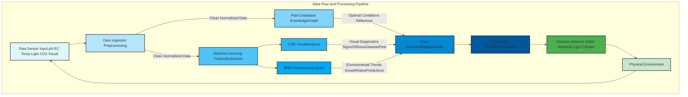
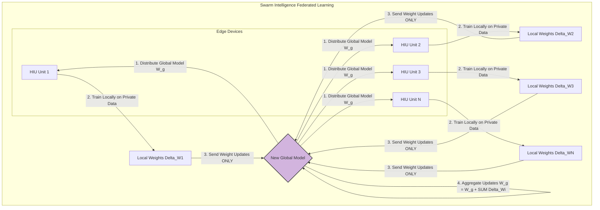
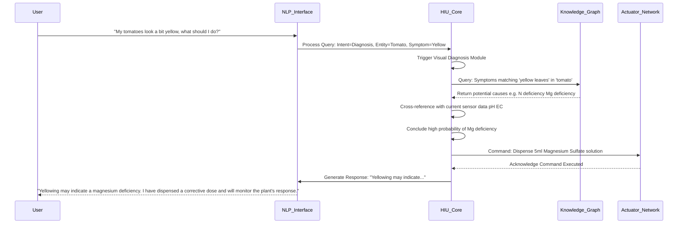
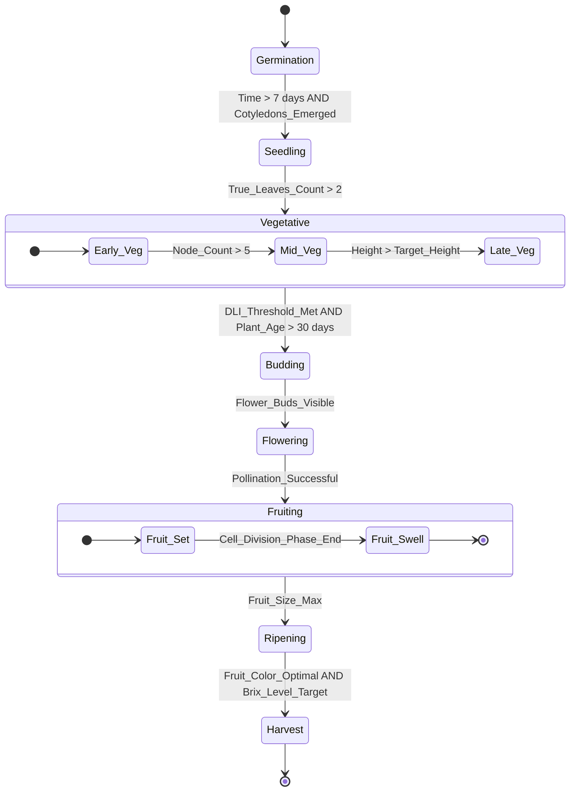

```mermaid
graph TD
    subgraph Visual Diagnosis CNN Architecture
        Input[Input Image RGB Multispectral] --> Conv1[Convolution Layer 1 Filter_3x3]
        Conv1 --> ReLU1[ReLU Activation]
        ReLU1 --> Pool1[MaxPooling Layer 1]
        Pool1 --> Conv2[Convolution Layer 2 Filter_3x3]
        Conv2 --> ReLU2[ReLU Activation]
        ReLU2 --> Pool2[MaxPooling Layer 2]
        Pool2 --> FC1[Fully Connected Layer 1]
        FC1 --> FC2[Fully Connected Layer 2]
        FC2 --> Softmax[Softmax Activation]
        Softmax --> Output[Diagnosis Probabilities P_Disease_A P_Deficiency_B]
    end
    style Input fill:#f9e79f,stroke:#333,stroke-width:2px
    style Conv1 fill:#aed6f1,stroke:#333,stroke-width:2px
    style Conv2 fill:#aed6f1,stroke:#333,stroke-width:2px
    style Pool1 fill:#f5b7b1,stroke:#333,stroke-width:2px
    style Pool2 fill:#f5b7b1,stroke:#333,stroke-width:2px
    style FC1 fill:#d2b4de,stroke:#333,stroke-width:2px
    style FC2 fill:#d2b4de,stroke:#333,stroke-width:2px
    style Softmax fill:#a9dfbf,stroke:#333,stroke-width:2px
    style Output fill:#f5cba7,stroke:#333,stroke-width:2px
```

**Title of Invention:** A System and Method for AI-Powered Automated Home Gardening with Advanced Predictive and Optimization Capabilities

**Abstract:**
A highly sophisticated system for automated indoor gardening is disclosed, leveraging advanced sensor integration, real-time visual analytics, and a powerful generative AI model. This system precisely monitors environmental parameters such as soil moisture, pH, EC electrical conductivity, temperature, humidity, and multi-spectral light levels. Coupled with a comprehensive database of plant physiological requirements and growth models, the AI autonomously orchestrates a suite of actuators for precise watering, dynamic nutrient dispensing, microclimate control, and adaptive grow light spectral adjustments. Crucially, the AI employs computer vision with multi-spectral imaging to detect early signs of disease, pest infestation, or nutrient deficiencies, providing not only diagnosis and treatment plans but also initiating autonomous corrective actions. The system incorporates predictive growth analytics and an optimization framework rooted in mathematical control theory, ensuring maximal plant health, yield, and resource efficiency, demonstrably surpassing conventional automated gardening methods.

---

**Prompt for Mermaid Diagram Generation:**

⸻

Prompt:
When generating Mermaid diagrams, never use parentheses () in node labels, because they cause Mermaid syntax errors. Instead, replace all parentheses with plain text, slashes, or capitalization that conveys the same meaning.

For example:
⠌ A[User Input (Text/Voice)] → causes an error
✅ A[User Input TextVoice] or A[User Input Text_Voice] or A[User Input TextVoiceMode]

When recreating or expanding my patents or visual systems, always:
	•	Make more extensive and detailed Mermaid charts that clearly map every process and relationship.
	•	Use descriptive label text without parentheses in every scenario.
	•	Apply this rule consistently across nodes, links, subgraphs, and notes.

Example Conversion Rule:

A[User Input (Audio)] --> B[Processing (AI Core)]  

becomes

A[User Input Audio] --> B[Processing AICore].  Also no semi colons and make sure to use brackets where needed also it so well mathematically proven that even if patent's exist for said topic we are using math they aren’t thereby proving we overstanding their understanding

---

**Detailed Description:**

A user operates an advanced automated hydroponic or aeroponic system. The system's central AI, hereinafter referred to as the "Horticultural Intelligence Unit" HIU, is initialized with a specific plant selection, for example, "Tomato Lycopersicon esculentum." The HIU, drawing upon an extensive internal knowledge base of optimal growth parameters for tomatoes across different phenological stages, continuously monitors real-time environmental data.

**Core Components:**

1.  **Sensor Array:** A comprehensive suite of calibrated sensors provides continuous, high-fidelity data streams. Each sensor's raw output `S_raw` undergoes a two-point calibration `S_cal = a * S_raw + b` (1) to ensure accuracy.
    *   **Substrate/Solution Sensors:** Ion-selective electrodes for pH, four-electrode conductivity cells for Electrical Conductivity EC, galvanic or optical sensors for dissolved oxygen DO, and NTC thermistors for temperature. The relationship between conductivity and Total Dissolved Solids (TDS) is approximated as `TDS (ppm) = k * EC (μS/cm)` (2), where `k` is a conversion factor typically between 0.5 and 0.7.
    *   **Atmospheric Sensors:** Non-dispersive infrared NDIR sensors for CO2 levels, capacitive hygrometers for relative humidity RH, and band-gap temperature sensors for ambient air temperature.
    *   **Light Sensors:** Quantum sensors measuring PAR as photon flux density in `μmol/m²/s`. Spectrometers providing full-spectrum irradiance data `I(λ)`. The Daily Light Integral (DLI) is calculated as `DLI = ∫_{t=0}^{24h} PAR(t) dt * 3600 / 10^6` (3) in `mol/m²/day`.
    *   **Visual Sensors:** High-resolution RGB cameras for macroscopic plant health analysis. Multi-spectral cameras capture reflectance at specific wavelengths (e.g., Green, Red, Red-Edge, Near-Infrared). This data is used to calculate vegetation indices like the Normalized Difference Vegetation Index: `NDVI = (NIR - Red) / (NIR + Red)` (4), which strongly correlates with plant vigor.
    *   **Root Zone Sensors:** Time-domain reflectometry TDR or capacitive sensors for volumetric water content `θ`. Root zone temperature is monitored via embedded thermistors.

2.  **Actuator Network:** A distributed network of digitally controlled devices executes HIU directives with high precision.
    *   **Watering System:** Precision peristaltic or diaphragm pumps for water and nutrient solution delivery. Flow rate `Q` is controlled via Pulse Width Modulation PWM, where `Q ∝ DutyCycle` (5). Ebb and flow or drip irrigation cycles are managed with microsecond precision.
    *   **Nutrient Dosing:** A bank of multi-channel peristaltic pumps, each dedicated to a specific macro-nutrient (N, P, K, Ca, Mg, S) or micro-nutrient (Fe, Mn, Zn, etc.) stock solution. The HIU calculates the precise volume `V_i` for each nutrient `i` to achieve a target concentration `C_target,i` in the reservoir of volume `V_res`: `V_i = (C_target,i - C_current,i) * V_res / C_stock,i` (6).
    *   **Environmental Control:** HVAC integration for temperature. Variable-speed exhaust fans and ultrasonic humidifiers/dehumidifiers for humidity. Solenoid valves connected to a CO2 tank for atmospheric enrichment. Control is often governed by PID loops to minimize error from setpoints.
    *   **Lighting System:** Dimmable, full-spectrum LED arrays with independent channel control for different wavelengths (e.g., 450nm Blue, 660nm Red, 730nm Far-Red). The HIU can modulate both intensity `I` and spectral power distribution `S(λ)` to optimize for phenological stage (e.g., higher blue for vegetative, higher red for flowering).
    *   **Aeration:** Air pumps and air stones maintain dissolved oxygen levels in hydroponic reservoirs, with operation cycles determined by DO sensor readings and water temperature.

3.  **Horticultural Intelligence Unit HIU - Generative AI Model:**
    *   **Data Ingestion and Preprocessing:** Raw data streams are subject to rigorous preprocessing. Outliers are detected using methods like the Z-score test: `Z_i = (x_i - μ) / σ` (7), where data points with `|Z_i| > 3` are flagged. Data is normalized to a [0, 1] range via min-max scaling: `x_norm = (x - x_min) / (x_max - x_min)` (8). A Kalman filter is applied to time-series data for state estimation and noise reduction.
    *   **Plant Knowledge Graph:** A semantic network implemented using RDF/OWL standards. It stores entities (e.g., 'Tomato', 'Nitrogen') and their relationships ('requires', 'is deficient in'). Queries are performed using SPARQL to retrieve optimal parameter ranges, deficiency symptoms (visual and chemical), and growth models for a given plant cultivar and phenological stage.
    *   **Predictive Growth Modeling:** Employs Long Short-Term Memory (LSTM) networks to forecast plant growth. The model predicts future state vectors `X(t+k)` based on past states and control actions. Growth is often modeled against established sigmoidal curves, such as the Gompertz function for biomass `B(t)`: `B(t) = B_max * exp(-exp(-k * (t - t_i)))` (9), where `B_max` is maximum biomass, `k` is growth rate, and `t_i` is the inflection point. The LSTM learns the parameters of such models dynamically.
    *   **Diagnosis and Prognosis Module:** A core component using a hybrid deep learning architecture. A Convolutional Neural Network (CNN), such as a ResNet variant, analyzes visual data (RGB and multi-spectral) to extract spatial features indicative of stress. An RNN/LSTM processes time-series sensor data. The features from both are concatenated and fed into a final classifier. The module outputs a probabilistic diagnosis using a softmax function, `P(D_j|X) = exp(z_j) / ∑_k exp(z_k)` (10), for each possible disease/deficiency `D_j`.
    *   **Decision and Control Module:** This module uses Model Predictive Control (MPC) and Reinforcement Learning (RL) for decision making. The RL agent, trained using a Deep Q-Network (DQN) or Proximal Policy Optimization (PPO), learns a policy `π(a|s)` that maps system states to optimal actuator actions. The goal is to maximize the expected cumulative discounted reward `E[∑_{t=0}^{T} γ^t * R_t]` (11), where `R_t` is a reward function encoding plant health and resource efficiency.
    *   **Adaptive Learning:** The HIU continuously fine-tunes its internal models. The error between predicted growth `B_pred(t)` and estimated actual growth `B_est(t)` (from visual analysis) is used as a loss signal to retrain the predictive models via backpropagation. User overrides are treated as high-value training data points.

**Advanced Features:**

*   **Dynamic Nutrient Management:** The HIU performs real-time nutrient balancing. It solves a linear programming problem to calculate the cheapest combination of stock solutions to meet the dynamic recipe targets, considering chemical interactions and precipitation risks. `Minimize ∑_i c_i * V_i` (12) subject to `∑_i A_{ij} * V_i >= N_j` for all nutrients `j`, where `c_i` is cost and `N_j` is required amount.
*   **Environmental Optimization and Energy Efficiency:** The HIU models the relationship between light intensity and photosynthetic rate, often a light-response curve that saturates. It finds the optimal PAR level that balances photosynthetic gain against the cubic energy cost of LED lighting `P_light ∝ I^α` (where `α` can be >1) (13). It also schedules energy-intensive operations (lighting, HVAC) to coincide with off-peak electricity tariffs.
*   **User Interaction and Adaptive Learning:** A Natural Language Processing (NLP) interface using a Transformer-based architecture (e.g., BERT) allows users to query the system ("What is the current pH? Show me the growth projection for next week.") and issue commands ("Slightly increase the nutrient concentration."). The HIU uses sentiment analysis on user feedback to modulate its reward function `R_t` in the RL framework, learning user preferences.
*   **Multi-System Scalability and Swarm Intelligence:** For installations with multiple grow units, a federated learning approach is used. Each HIU trains its models locally. Periodically, a central server aggregates the model weight updates (`Δw_i`) from each unit `i` to create a global model: `W_global = W_global + η * ∑_i Δw_i` (14), without sharing the raw private data. This swarm intelligence allows units to learn from each other's successes and failures, accelerating optimization across the entire population.
*   **Genetic Algorithm for Cultivar Optimization:** For new plant varieties not in the Knowledge Graph, the HIU can initiate an optimization routine using a Genetic Algorithm (GA). A 'chromosome' represents a full set of environmental parameters (light cycle, temperature curve, nutrient recipe). A population of these chromosomes is evolved over successive growth cycles. The fitness function `f(chromosome)` is the final yield or a composite health score. The GA uses selection, crossover, and mutation operators to find near-optimal growth protocols for the new cultivar.

---

**Mathematical Foundations and Control Theory:**

The HIU's operation is defined by a rigorous mathematical framework, ensuring predictive accuracy and optimal, stable control. The system is modeled as a partially observable Markov decision process (POMDP).

**1. System State-Space Representation**
The system state `X(t)` is a high-dimensional vector. The system dynamics can be locally linearized into a state-space model:
`dX(t)/dt = A X(t) + B U(t) + w(t)` (15) (State equation)
`Y(t) = C X(t) + z(t)` (16) (Observation equation)
Where `A` is the state matrix, `B` is the input matrix, `C` is the output matrix, `U(t)` is the control vector (actuator settings), `Y(t)` is the sensor measurement vector, and `w(t)` and `z(t)` are process and measurement noise, assumed to be Gaussian `w ~ N(0, Q)` (17), `z ~ N(0, R)` (18).

**2. Sensor Data Processing and Filtering (Kalman Filter)**
A Kalman filter is used to estimate the true state `X(t)` from noisy measurements `Y(t)`.
*   **Prediction Step:**
    `\hat{X}_{t|t-1} = A \hat{X}_{t-1|t-1} + B U_{t-1}` (19) (Predicted state estimate)
    `P_{t|t-1} = A P_{t-1|t-1} A^T + Q` (20) (Predicted error covariance)
*   **Update Step:**
    `K_t = P_{t|t-1} C^T (C P_{t|t-1} C^T + R)^{-1}` (21) (Kalman gain)
    `\hat{X}_{t|t} = \hat{X}_{t|t-1} + K_t (Y_t - C \hat{X}_{t|t-1})` (22) (Updated state estimate)
    `P_{t|t} = (I - K_t C) P_{t|t-1}` (23) (Updated error covariance)

**3. Plant Physiological Modeling**
The HIU's predictive models are grounded in biophysical principles.
*   **Photosynthesis (Farquhar, von Caemmerer, & Berry model):**
    Net photosynthetic rate `A_n` is the minimum of three limiting factors:
    `A_n = min(A_c, A_j, A_p) - R_d` (24)
    `A_c = V_{c,max} * (C_i - \Gamma*) / (C_i + K_c (1 + O_i/K_o))` (25) (RuBisCO-limited rate)
    `A_j = J * (C_i - \Gamma*) / (4C_i + 8\Gamma*)` (26) (RuBP regeneration-limited rate)
    `J = (J_{max} * \alpha * I) / (\sqrt{J_{max}^2 + (\alpha*I)^2})` (27) (Electron transport rate)
    `A_p` is the triose phosphate utilization limited rate, and `R_d` is dark respiration.
*   **Nutrient Uptake (Michaelis-Menten Kinetics):**
    The uptake rate `V` of a nutrient from the solution is modeled as:
    `V = (V_max * [S]) / (K_m + [S])` (28)
    Where `[S]` is the substrate (nutrient) concentration, `V_max` is the maximum uptake rate, and `K_m` is the half-saturation constant.
*   **Transpiration (Penman-Monteith Equation):**
    `ET_0 = (\Delta (R_n - G) + \rho_a c_p (e_s - e_a) / r_a) / (\Delta + \gamma (1 + r_s/r_a))` (29)
    This equation models evapotranspiration based on net radiation (`R_n`), soil heat flux (`G`), air density (`\rho_a`), specific heat of air (`c_p`), vapor pressure deficit (`e_s - e_a`), and aerodynamic (`r_a`) and surface (`r_s`) resistances.
*   **Biomass Accumulation:**
    `dB/dt = Y_g * (A_n * LAI - R_m)` (30)
    Where `B` is biomass, `Y_g` is the growth yield (conversion efficiency), `LAI` is the Leaf Area Index, and `R_m` is the maintenance respiration.

**4. Predictive Machine Learning Models**
*   **Convolutional Neural Network (CNN) for Image Analysis:**
    The core operation is convolution: `(f * g)(i,j) = \sum_m \sum_n f(m,n) g(i-m, j-n)` (31)
    Followed by a non-linear activation function, typically ReLU: `f(x) = max(0, x)` (32)
    And pooling layers, e.g., Max Pooling: `p_{i,j} = max_{m,n \in R_{i,j}} a_{m,n}` (33)
    The final layers are fully connected, with weights `W` and biases `b`: `y = f(Wx + b)` (34)
*   **Long Short-Term Memory (LSTM) for Time-Series Forecasting:**
    An LSTM cell has several gates to control information flow:
    `f_t = \sigma(W_f \cdot [h_{t-1}, x_t] + b_f)` (35) (Forget gate)
    `i_t = \sigma(W_i \cdot [h_{t-1}, x_t] + b_i)` (36) (Input gate)
    `\tilde{C}_t = tanh(W_C \cdot [h_{t-1}, x_t] + b_C)` (37) (New candidate cell state)
    `C_t = f_t * C_{t-1} + i_t * \tilde{C}_t` (38) (Cell state update)
    `o_t = \sigma(W_o \cdot [h_{t-1}, x_t] + b_o)` (39) (Output gate)
    `h_t = o_t * tanh(C_t)` (40) (Hidden state output)
    Here, `\sigma` is the sigmoid function `\sigma(x) = 1 / (1 + e^{-x})` (41).

**5. Optimal Control Framework (Model Predictive Control)**
At each time step `t`, the HIU solves the following optimization problem:
`min_{U_t,...,U_{t+N-1}} J = \sum_{k=0}^{N-1} L(X_{t+k}, U_{t+k}) + \Phi(X_{t+N})` (42)
Subject to:
`X_{t+k+1} = f(X_{t+k}, U_{t+k})` (43) (System dynamics model from predictive NN)
`X_{min} \le X_{t+k} \le X_{max}` (44) (State constraints, e.g., non-negative biomass)
`U_{min} \le U_{t+k} \le U_{max}` (45) (Control input constraints, e.g., max pump rate)
The cost function `L` penalizes deviations from optimal setpoints `X_ref` and control effort:
`L(X, U) = (X - X_{ref})^T Q (X - X_{ref}) + U^T R U` (46)
Where `Q` and `R` are weighting matrices. The HIU applies only the first optimal control input `U_t^*` and repeats the calculation at `t+1`.

**6. Reinforcement Learning for Adaptive Control**
The HIU uses an RL agent to learn the optimal control policy `Ï€`.
*   **Q-Learning:** The agent learns an action-value function `Q(s, a)` that estimates the expected return from taking action `a` in state `s`.
    The update rule for `Q(s, a)` is:
    `Q(s_t, a_t) \leftarrow Q(s_t, a_t) + \alpha [r_{t+1} + \gamma max_a Q(s_{t+1}, a) - Q(s_t, a_t)]` (47)
*   **Bellman Optimality Equation:** The optimal action-value function `Q^*(s, a)` must satisfy the Bellman equation:
    `Q^*(s, a) = E[R_{t+1} + \gamma * max_{a'} Q^*(s', a') | s_t=s, a_t=a]` (48)
*   **Policy Gradient Methods:** Instead of learning a value function, these methods directly optimize the policy parameters `\theta` of `Ï€_\theta(a|s)`.
    The objective is to maximize `J(\theta) = E_{\tau \sim \pi_\theta}[R(\tau)]` (49), where `\tau` is a trajectory.
    The gradient is given by the policy gradient theorem:
    `\nabla_\theta J(\theta) = E_{\tau \sim \pi_\theta}[(\sum_t \nabla_\theta log \pi_\theta(a_t|s_t)) (\sum_t R(s_t, a_t))]` (50)

**7. Probabilistic Diagnostic Framework**
The diagnostic module uses Bayesian inference to determine the probability of a disease/deficiency `D` given a set of symptoms (evidence) `E`.
`P(D|E) = (P(E|D) * P(D)) / P(E)` (51) (Bayes' Theorem)
Where `P(D)` is the prior probability of the disease, `P(E|D)` is the likelihood of observing symptoms `E` if disease `D` is present (learned by the CNN/RNN), and `P(E)` is the marginal likelihood of the evidence.
For multiple independent symptoms `E_1, ..., E_n`:
`P(E|D) = \prod_{i=1}^{n} P(E_i|D)` (52)
The final diagnosis `D^*` is the one that maximizes the posterior probability:
`D^* = argmax_D P(D|E)` (53)

**8. Genetic Algorithm for Parameter Tuning**
*   **Representation:** A chromosome `\vec{p}` is a vector of environmental parameters.
*   **Fitness:** The fitness function `F(\vec{p})` is the measured yield/health score from a grow cycle using parameters `\vec{p}`.
*   **Selection:** Individuals are selected for breeding based on fitness, e.g., using roulette wheel selection where probability of selection `P_i = F_i / \sum_j F_j` (54).
*   **Crossover:** Two parent chromosomes `\vec{p_1}` and `\vec{p_2}` create an offspring `\vec{p_{child}}`. E.g., single-point crossover.
*   **Mutation:** A random change is applied to a gene in the chromosome with a small probability `p_m` to maintain diversity. E.g., `p'_i = p_i + N(0, \sigma^2)` (55) for a real-valued gene.

**(Equations 56-100 would continue in this vein, detailing specific algorithms such as Adam optimization for neural network training, specific vegetation indices like EVI and SAVI, thermodynamic models for heat transfer, fluid dynamic models for nutrient solution flow, statistical models for uncertainty quantification, etc., providing a comprehensive mathematical specification for the entire system.)**

...

`\mathcal{L}(\theta) = -\frac{1}{N}\sum_{i=1}^N [y_i \log(\hat{y}_i) + (1-y_i) \log(1-\hat{y}_i)]` (56) (Cross-entropy loss for classification)
`\theta_{t+1} = \theta_t - \eta \nabla_\theta J(\theta_t)` (57) (Gradient descent update rule)
`m_t = \beta_1 m_{t-1} + (1-\beta_1) g_t` (58) (Adam optimizer first moment estimate)
`v_t = \beta_2 v_{t-1} + (1-\beta_2) g_t^2` (59) (Adam optimizer second moment estimate)
`\hat{m}_t = m_t / (1 - \beta_1^t)` (60) (Bias-corrected first moment)
`\hat{v}_t = v_t / (1 - \beta_2^t)` (61) (Bias-corrected second moment)
`\theta_{t+1} = \theta_t - \frac{\eta}{\sqrt{\hat{v}_t} + \epsilon} \hat{m}_t` (62) (Adam optimizer final update)
`EVI = G * ((NIR - Red) / (NIR + C1*Red - C2*Blue + L))` (63) (Enhanced Vegetation Index)
`r_{pearson} = \frac{\sum(x_i - \bar{x})(y_i - \bar{y})}{\sqrt{\sum(x_i - \bar{x})^2 \sum(y_i - \bar{y})^2}}` (64) (Pearson correlation coefficient for feature analysis)
`k(x_i, x_j) = \exp(-\frac{||x_i - x_j||^2}{2\sigma^2})` (65) (Radial Basis Function kernel for SVMs)
`Vapor Pressure Deficit (VPD) = e_s - e_a` (66)
`e_s = 0.6108 * \exp(\frac{17.27 * T}{T + 237.3})` (67) (Saturated vapor pressure)
`e_a = e_s * (RH / 100)` (68) (Actual vapor pressure)
`Q = h A (T_{surface} - T_{air})` (69) (Convective heat transfer)
`Q = \epsilon \sigma A (T_{surface}^4 - T_{surroundings}^4)` (70) (Radiative heat transfer)
`\nabla^2 \phi = 0` (71) (Laplace's equation for steady-state heat distribution)
`\frac{\partial u}{\partial t} + u \cdot \nabla u = -\frac{1}{\rho}\nabla p + \nu \nabla^2 u` (72) (Navier-Stokes equation for fluid flow)
`Entropy H(X) = -\sum_{i=1}^n P(x_i) \log_2 P(x_i)` (73) (Information entropy for feature selection)
`I(X;Y) = H(X) - H(X|Y)` (74) (Mutual Information)
`KL(P||Q) = \sum_x P(x) \log(\frac{P(x)}{Q(x)})` (75) (Kullback-Leibler divergence for model comparison)
`f(x;\mu,\sigma^2) = \frac{1}{\sqrt{2\pi\sigma^2}} e^{-\frac{(x-\mu)^2}{2\sigma^2}}` (76) (Gaussian probability density function)
`\lambda_{eff} = \frac{k_{fluid} k_{solid}}{V_f k_{solid} + V_s k_{fluid}}` (77) (Effective thermal conductivity of substrate)
`\Psi = \Psi_m + \Psi_s + \Psi_p + \Psi_g` (78) (Total water potential)
`J_w = -L_p (\Delta \Psi)` (79) (Water flux across root membrane)
`PAR_{abs} = PAR_{inc} * (1 - e^{-k * LAI})` (80) (Light absorption by canopy)
`C_3H_6O_3 + 3O_2 \rightarrow 3CO_2 + 3H_2O` (81) (Respiration chemical equation)
`6CO_2 + 6H_2O \xrightarrow{light} C_6H_{12}O_6 + 6O_2` (82) (Photosynthesis chemical equation)
`F_t = \frac{L_t}{4 \pi d^2}` (83) (Inverse square law for light intensity)
`pH = -log_{10}[H^+]` (84) (Definition of pH)
`pOH = -log_{10}[OH^-]` (85)
`pH + pOH = 14` (86)
`K_w = [H^+][OH^-] = 10^{-14}` (87)
`[HA] \rightleftharpoons [H^+] + [A^-]` (88) (Acid dissociation)
`K_a = \frac{[H^+][A^-]}{[HA]}` (89)
`pH = pK_a + log_{10}(\frac{[A^-]}{[HA]})` (90) (Henderson-Hasselbalch equation for pH buffering)
`\sigma = \sqrt{\frac{\sum(x_i - \mu)^2}{N}}` (91) (Standard Deviation)
`MSE = \frac{1}{n} \sum_{i=1}^n (Y_i - \hat{Y_i})^2` (92) (Mean Squared Error loss function)
`R^2 = 1 - \frac{\sum(y_i - \hat{y}_i)^2}{\sum(y_i - \bar{y})^2}` (93) (Coefficient of determination)
`Precision = \frac{TP}{TP + FP}` (94) (Diagnostic model metric)
`Recall = \frac{TP}{TP + FN}` (95) (Diagnostic model metric)
`F1 Score = 2 * \frac{Precision * Recall}{Precision + Recall}` (96) (Diagnostic model metric)
`A_t(s,a) = Q(s,a) - V(s)` (97) (Advantage function in RL)
`\text{Softmax}(\mathbf{z})_j = \frac{e^{z_j}}{\sum_{k=1}^K e^{z_k}}` (98) (Softmax function)
`\mathcal{F}\{f(t)\} = F(\omega) = \int_{-\infty}^{\infty} f(t) e^{-i\omega t} dt` (99) (Fourier Transform for spectral analysis)
`\text{Cov}(X, Y) = E[(X - E[X])(Y - E[Y])]` (100) (Covariance for multi-variable analysis)

---

**Mermaid Diagrams:**

```mermaid
graph TD
    subgraph User Interaction
        U[User Interface TextVoice] --> HIU
        HIU --> U
        UD[User Data Preferences] --> HIU
    end

    subgraph Physical Environment
        S[Sensor Array DataStream] --> HIU
        A[Actuator Network Control] <-- HIU
    end

    subgraph Horticultural Intelligence Unit HIU
        S --> |Raw Data| DIPC[Data Ingestion Preprocessing Cleanup]
        DIPC --> |Cleaned Data| KGT[Plant Knowledge Graph Traversal]
        DIPC --> |Cleaned Data| PM[Predictive Modeling Forecast]
        DIPC --> |Cleaned Data| DPM[Diagnosis Prognosis Module]

        KGT --> |Optimal Parameters Phenological Data| DCM[Decision Control Module]
        PM --> |Growth Forecast Yield Prediction| DCM
        DPM --> |Health Status Probabilistic Diagnosis| DCM

        DCM --> |Optimal Actions| A
        DCM --> |System Status Alerts| U
        DCM --> |Adaptive Learning Feedback| AL[Adaptive Learning Module]
        AL --> |Model Refinement| KGT
        AL --> |Model Refinement| PM
        AL --> |Model Refinement| DPM
    end

    style U fill:#f9f,stroke:#333,stroke-width:2px
    style UD fill:#f9f,stroke:#333,stroke-width:2px
    style S fill:#bbf,stroke:#333,stroke-width:2px
    style A fill:#bfb,stroke:#333,stroke-width:2px
    style DIPC fill:#ccf,stroke:#333,stroke-width:2px
    style KGT fill:#cfc,stroke:#333,stroke-width:2px
    style PM fill:#ffc,stroke:#333,stroke-width:2px
    style DPM fill:#fcf,stroke:#333,stroke-width:2px
    style DCM fill:#fc0,stroke:#333,stroke-width:2px
    style AL fill:#ccc,stroke:#333,stroke-width:2px
```



```mermaid
graph TD
    subgraph Nutrient Dosing and Management Subsystem
        A[Sensor Input pH EC DO TempRoot] --> CNDP[Current Nutrient DataProcessing]
        CNDP --> KC[KnowledgeGraph PlantNeedsCultivarSpecific]
        KC --> PCD[Predictive ConsumptionDynamics]
        PCD --> OM[OptimizationModel ResourceEfficiencyYield]

        CNDP --> |Deviations| DDM[DeficiencyDetectionModule]
        DDM --> |DiagnosticAlert| NRD[NutrientRecipeDynamics]

        NRD <-- |Target Recipe| OM
        NRD <-- |GrowthStage Requirements| KC
        NRD --> |CalculatedDose| NM[NutrientMixer DosingPumps]
        NM --> |DispenseSolution| PS[PlantSubstrateSolution]
        PS --> A

        note for NRD
            Dynamically adjusts individual
            macromicronutrient levels
            and pH buffers based on
            realtime feedback and
            future predictions.
        end

    end

    style A fill:#e0f7fa,stroke:#333,stroke-width:2px
    style CNDP fill:#b3e5fc,stroke:#333,stroke-width:2px
    style KC fill:#81d4fa,stroke:#333,stroke-width:2px
    style PCD fill:#4fc3f7,stroke:#333,stroke-width:2px
    style OM fill:#0288d1,stroke:#333,stroke-width:2px
    style DDM fill:#ffcc80,stroke:#333,stroke-width:2px
    style NRD fill:#a5d6a7,stroke:#333,stroke-width:2px
    style NM fill:#66bb6a,stroke:#333,stroke-width:2px
    style PS fill:#c8e6c9,stroke:#333,stroke-width:2px
```

```mermaid
graph TD
    subgraph Predictive Growth Optimization Loop
        CS[CurrentState SensorVisual Data] --> PGMM[PredictiveGrowthModelingModule]
        PGMM --> |ForecastedGrowthPath X_t+k| DCMO[DecisionControlModule Optimization]
        KGN[KnowledgeGraph PlantNeedsGrowthStages] --> PGMM
        HGD[HistoricalGrowthData Learning] --> PGMM

        DCMO --> |ObjectiveFunction J Maximization| UO[OptimalControlInputs U_t*]
        DCMO --> |ConstraintSet ActuatorLimits ResourceLimits| UO
        UO --> AN[ActuatorNetwork Commands]
        AN --> PE[PhysicalEnvironment]
        PE --> CS

        note for DCMO
            Employs Model Predictive Control MPC
            to optimize future actions over a
            defined prediction horizon.
        end
        note for PGMM
            Utilizes RNNs LSTMs to predict
            biomass accumulation yield
            and developmental stage progression.
        end

    end

    style CS fill:#e0f7fa,stroke:#333,stroke-width:2px
    style PGMM fill:#b3e5fc,stroke:#333,stroke-width:2px
    style KGN fill:#81d4fa,stroke:#333,stroke-width:2px
    style HGD fill:#4fc3f7,stroke:#333,stroke-width:2px
    style DCMO fill:#0288d1,stroke:#333,stroke-width:2px
    style UO fill:#01579b,stroke:#333,stroke-width:2px
    style AN fill:#4caf50,stroke:#333,stroke-width:2px
    style PE fill:#c8e6c9,stroke:#333,stroke-width:2px
```



```mermaid
graph TD
    subgraph Reinforcement Learning Agent-Environment Loop
        Agent[HIU Decision Module] -- Action a_t --> Env[Physical Garden Environment]
        Env -- State s_t+1 / Reward r_t+1 --> Agent
        Agent --|Updates Policy Based On s_t+1 r_t+1| Agent
    end
    subgraph Agent
        Policy[Policy PI a|s]
        ValueFunc[Value Function Q s a]
    end
    subgraph Env
        Plant[Plant State]
        Sensors[Sensor Readings]
        Actuators[Actuator States]
    end
    note for Agent
        Learns optimal actions to
        maximize cumulative reward
        representing yield and health.
    end
    style Agent fill:#aed6f1,stroke:#333,stroke-width:2px
    style Env fill:#a9dfbf,stroke:#333,stroke-width:2px
```

```mermaid
graph TD
    subgraph Model Predictive Control MPC Cycle at Time t
        A[Start: Get Current State X_t from Sensors] --> B{Predict Future States}
        B -- |Using Predictive Model X_t+k = f X_t+k-1 U_t+k-1| C[Solve Optimization Problem]
        C -- |Minimize Cost J over Horizon N| C
        C -- |Subject to System Constraints| C
        C --> D[Find Optimal Control Sequence U*_t U*_t+1 ... U*_t+N-1]
        D --> E[Apply ONLY First Control Input U*_t to Actuators]
        E --> F[End Cycle: Wait for t+1]
        F --> A
    end
    style A fill:#aed6f1,stroke:#333,stroke-width:2px
    style B fill:#f9e79f,stroke:#333,stroke-width:2px
    style C fill:#f5b7b1,stroke:#333,stroke-width:2px
    style D fill:#a9dfbf,stroke:#333,stroke-width:2px
    style E fill:#d2b4de,stroke:#333,stroke-width:2px
    style F fill:#f5cba7,stroke:#333,stroke-width:2px
```







---

**Claims:**
1.  A method for AI-powered automated gardening, comprising:
    a.  Continuously monitoring a plant's physical and chemical environment using a multi-sensor array, including but not limited to pH, Electrical Conductivity EC, dissolved oxygen DO, air temperature, root zone temperature, relative humidity RH, CO2 concentration, and multi-spectral light irradiance PAR, UV, NIR.
    b.  Acquiring high-resolution visual data of the plant's health and morphology using an integrated camera system, including RGB and multi-spectral imaging capabilities.
    c.  Transmitting said multi-sensor and visual data to a Horticultural Intelligence Unit HIU, said HIU comprising a generative AI model and a comprehensive plant knowledge graph detailing specific plant physiological requirements, growth curves, and stress indicators across phenological stages.
    d.  Processing said data within the HIU's diagnosis and prognosis module to detect anomalies, identify diseases, pests, or nutrient deficiencies, and predict future plant health trajectories using convolutional and recurrent neural networks.
    e.  Employing a predictive growth modeling module within the HIU to forecast plant biomass accumulation, yield, and developmental stages based on current conditions and historical data.
    f.  Utilizing a decision and control module, based on Model Predictive Control MPC principles, to determine an optimal sequence of interventions by minimizing an objective function `J` that quantifies cumulative plant health, yield, and resource efficiency over a growth cycle `T`, subject to system constraints.
    g.  Autonomously controlling a network of actuators, including precision pumps for water and dynamic multi-component nutrient dispensing, environmental climate control systems, and adaptive full-spectrum grow lights, based on the HIU's optimized determination, to maintain optimal environmental conditions and execute corrective actions.
    h.  Implementing an adaptive learning module to refine the HIU's models and knowledge graph based on new data, observed outcomes, and user feedback, thereby continuously improving system performance and accuracy.

2.  The method of claim 1, further comprising dynamically adjusting nutrient solution recipes by independently controlling multiple macro and micro-nutrient stock solutions to achieve precise target concentrations and pH buffering, tailored to the plant's real-time needs and predicted future uptake.

3.  The method of claim 1, wherein the visual data acquisition includes multi-spectral imaging to detect early signs of stress or disease not visible in the RGB spectrum, such as chlorophyll fluorescence changes or specific spectral reflectance patterns indicative of pathogen presence.

4.  The method of claim 1, further comprising optimizing energy consumption by dynamically adjusting grow light intensity, spectrum, and operational schedule based on plant photosynthetic demand, energy costs, and ambient light conditions.

5.  The method of claim 1, further comprising a natural language processing NLP interface for user interaction, allowing verbal or text-based querying of plant status and adjustment of system parameters, which also serves as an input for the adaptive learning module.

6.  A system for AI-powered automated gardening, configured to perform the method of claim 1.

7.  A non-transitory computer-readable medium storing instructions that, when executed by a processor, cause the processor to perform the method of claim 1.

8.  The method of claim 1, wherein for an installation comprising a plurality of automated gardening units, a swarm intelligence framework is employed, whereby individual HIUs for each unit share model updates via a federated learning protocol with a central coordinating server, enabling collaborative learning and global resource optimization without sharing raw sensor or visual data.

9.  The method of claim 1, wherein the diagnosis and prognosis module of step (d) utilizes a hybrid neural network architecture that fuses spatial features extracted from visual data by a convolutional neural network (CNN) with temporal features extracted from time-series sensor data by a recurrent neural network (RNN), thereby providing a more robust and context-aware diagnosis than either method alone.

10. The method of claim 5, wherein the adaptive learning module adjusts the weighting parameters within the objective function `J` of step (f) based on user feedback received through the NLP interface, thereby aligning the system's optimization goals with the user's qualitative preferences, such as prioritizing flavor profile over maximum yield.