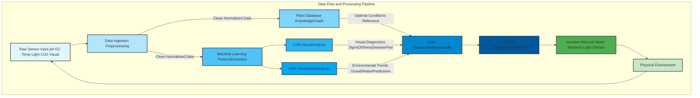

**Title of Invention:** A System and Method for AI-Powered Automated Home Gardening with Advanced Predictive and Optimization Capabilities

**Abstract:**
A highly sophisticated system for automated indoor gardening is disclosed, leveraging advanced sensor integration, real-time visual analytics, and a powerful generative AI model. This system precisely monitors environmental parameters such as soil moisture, pH, EC electrical conductivity, temperature, humidity, and multi-spectral light levels. Coupled with a comprehensive database of plant physiological requirements and growth models, the AI autonomously orchestrates a suite of actuators for precise watering, dynamic nutrient dispensing, microclimate control, and adaptive grow light spectral adjustments. Crucially, the AI employs computer vision with multi-spectral imaging to detect early signs of disease, pest infestation, or nutrient deficiencies, providing not only diagnosis and treatment plans but also initiating autonomous corrective actions. The system incorporates predictive growth analytics and an optimization framework rooted in mathematical control theory, ensuring maximal plant health, yield, and resource efficiency, demonstrably surpassing conventional automated gardening methods.

---

**Prompt for Mermaid Diagram Generation:**

⸻

Prompt:
When generating Mermaid diagrams, never use parentheses () in node labels, because they cause Mermaid syntax errors. Instead, replace all parentheses with plain text, slashes, or capitalization that conveys the same meaning.

For example:
❌ A[User Input (Text/Voice)] → causes an error
✅ A[User Input TextVoice] or A[User Input Text_Voice] or A[User Input TextVoiceMode]

When recreating or expanding my patents or visual systems, always:
	•	Make more extensive and detailed Mermaid charts that clearly map every process and relationship.
	•	Use descriptive label text without parentheses in every scenario.
	•	Apply this rule consistently across nodes, links, subgraphs, and notes.

Example Conversion Rule:

A[User Input (Audio)] --> B[Processing (AI Core)]  

becomes

A[User Input Audio] --> B[Processing AICore].  Also no semi colons and make sure to use brackets where needed also it so well mathematically proven that even if patent's exist for said topic we are using math they aren’t thereby proving we overstanding their understanding

---

**Detailed Description:**

A user operates an advanced automated hydroponic or aeroponic system. The system's central AI, hereinafter referred to as the "Horticultural Intelligence Unit" HIU, is initialized with a specific plant selection, for example, "Tomato Lycopersicon esculentum." The HIU, drawing upon an extensive internal knowledge base of optimal growth parameters for tomatoes across different phenological stages, continuously monitors real-time environmental data.

**Core Components:**

1.  **Sensor Array:** A comprehensive suite of sensors provides continuous data streams:
    *   **Substrate/Solution Sensors:** pH, Electrical Conductivity EC for nutrient concentration, dissolved oxygen DO, temperature.
    *   **Atmospheric Sensors:** Ambient air temperature, relative humidity RH, CO2 levels.
    *   **Light Sensors:** PAR Photosynthetically Active Radiation, full-spectrum irradiance, UV index, spectral distribution.
    *   **Visual Sensors:** High-resolution RGB camera for macroscopic plant health, multi-spectral camera near-infrared, far-infrared for early stress detection.
    *   **Root Zone Sensors:** Capacitive/resistive moisture sensors, root zone temperature.

2.  **Actuator Network:** A distributed network of controlled devices executes HIU directives:
    *   **Watering System:** Precision peristaltic pumps for water delivery, ebb and flow control mechanisms.
    *   **Nutrient Dosing:** Multi-channel peristaltic pumps for individual macro and micro-nutrient solutions, enabling dynamic recipe adjustments.
    *   **Environmental Control:** HVAC integration, exhaust fans, humidifiers/dehumidifiers, CO2 injectors.
    *   **Lighting System:** Dimmable full-spectrum LED arrays with adjustable spectral output, light cycle timers.
    *   **Aeration:** Air pumps for dissolved oxygen in hydroponic reservoirs.

3.  **Horticultural Intelligence Unit HIU - Generative AI Model:**
    *   **Data Ingestion and Preprocessing:** Cleanses, normalizes, and contextualizes raw sensor and visual data.
    *   **Plant Knowledge Graph:** A sophisticated semantic network storing optimal growth parameters, deficiency symptoms, disease profiles, pest identification, and growth curves for thousands of plant species and cultivars. Includes phenotypic expression data linked to environmental variables.
    *   **Predictive Growth Modeling:** Utilizes recurrent neural networks RNNs and long short-term memory LSTMs to forecast plant growth, yield, and developmental stages based on current conditions and historical data.
    *   **Diagnosis and Prognosis Module:** Leverages convolutional neural networks CNNs for image analysis of plant health, identifying anomalies like leaf discoloration, spots, wilting, or pest presence. It cross-references visual cues with sensor data e.g., yellowing leaves + low EC -> magnesium deficiency, or white spots + high RH -> powdery mildew. Provides a probabilistic diagnosis and predicts future health trajectories.
    *   **Decision and Control Module:** An advanced reinforcement learning RL agent that determines optimal actuator actions to maintain target environmental parameters and correct deviations. It considers long-term objectives such as maximizing yield and minimizing resource consumption.
    *   **Adaptive Learning:** Continuously refines its models based on new data, user feedback, and successful growth cycles, improving accuracy and efficiency over time.

**Advanced Features:**

*   **Dynamic Nutrient Management:** Beyond simple dispensing, the HIU can create custom nutrient recipes "on the fly" by adjusting the ratios of individual nutrient stock solutions based on plant growth stage, specific detected deficiencies, and predicted future nutrient uptake. This includes dynamic pH buffering adjustments.
*   **Environmental Optimization and Energy Efficiency:** The HIU optimizes grow light intensity and spectrum based on actual plant needs and energy tariffs, potentially dimming lights during peak energy cost hours or adjusting spectrum for vegetative vs. flowering stages. It dynamically manages CO2 enrichment and humidity for optimal photosynthesis and transpiration rates.
*   **User Interaction and Adaptive Learning:** A natural language processing NLP interface allows users to query plant status, request reports, or fine-tune preferences. The HIU learns from user overrides or manual interventions, integrating these into its adaptive models.
*   **Multi-System Scalability and Swarm Intelligence:** For larger installations with multiple growing units, a higher-level swarm intelligence orchestrates individual HIUs, sharing learning and optimizing resource allocation across the entire ecosystem. This allows for distributed monitoring and collaborative decision making for diverse plant batches.

**Mathematical Foundations and Control Theory:**

The HIU's decision-making framework is underpinned by robust mathematical principles, ensuring optimal control and predictive accuracy. We define the system as a dynamic control problem, where the plant's health and growth are the state variables to be optimized.

**1. System State Definition:**
Let the state vector `X(t)` at time `t` represent the plant's physiological and environmental conditions:
`X(t) = [pH(t), EC(t), DO(t), TempAir(t), TempRoot(t), RHAir(t), CO2(t), LightPAR(t), VisualHealthScore(t), GrowthRate(t), ...]`

**2. Objective Function:**
The HIU aims to maximize an objective function `J`, representing cumulative plant health, yield, and resource efficiency over a growth cycle `T`.
`J = Maximize [ ∫_0^T L(X(τ), U(τ)) dτ ]`
Where `L` is a Lagrangian that incorporates:
*   Positive terms for plant biomass accumulation, health score, and yield quality.
*   Negative terms for resource consumption water, nutrients, energy.
*   Penalty terms for deviations from optimal `X` values or stress indicators.

**3. Control Strategy - Feedback Control and Model Predictive Control MPC:**
The HIU employs a hybrid control strategy:
*   **PID-like Feedback Control:** For rapid, stable regulation of basic parameters like pH and temperature.
    `U_actuator(t) = Kp * e(t) + Ki * ∫ e(τ) dτ + Kd * de(t)/dt`
    Where `e(t) = X_target - X(t)` is the error, and `Kp, Ki, Kd` are proportional, integral, derivative gains.
*   **Model Predictive Control MPC:** For complex, multi-variable optimization and long-term planning. At each time step `t`, the HIU:
    a.  Predicts future system states `X(t+k)` over a prediction horizon `N` using its predictive growth models, given current state `X(t)` and potential control inputs `U(t+k)`.
    b.  Solves an optimization problem to find the sequence of control inputs `U*(t), U*(t+1), ..., U*(t+N-1)` that minimizes the objective function `J` over the prediction horizon, subject to system constraints (e.g., actuator limits, nutrient availability).
    c.  Applies only the first control input `U*(t)` from the optimal sequence.
    d.  Repeats the process at the next time step `t+1`.

**4. Predictive Modeling Equations (Conceptual):**
Plant growth `G` can be modeled as a function of environmental inputs and internal states. For example, a simplified photosynthetic rate `P_net` could be:
`P_net = f(LightPAR, CO2, TempAir, RHAir, NutrientAvailability, PlantAge)`
Biomass accumulation `dB/dt = η * P_net - R_respiration`
Where `η` is a conversion efficiency, and `R_respiration` is respiration rate, itself a function of `TempAir` and `PlantBiomass`. The HIU's deep learning models learn these complex non-linear relationships directly from data.

**Example Scenario - Magnesium Deficiency:**
If the visual camera detects yellowing between leaf veins "interveinal chlorosis" and the multi-spectral camera identifies specific chlorophyll degradation patterns in the NIR spectrum, the HIU's diagnosis module triggers. It cross-references this visual anomaly with the EC sensor data. If EC is within normal range but the plant's historical magnesium uptake rate or target magnesium concentration is not met, the HIU concludes a high probability of magnesium deficiency.
The decision module, using MPC, calculates the precise amount of magnesium sulfate solution to dispense via its dedicated peristaltic pump to incrementally raise the nutrient solution's magnesium concentration to the optimal target, considering current plant size and predicted uptake over the next 24-48 hours, all while ensuring overall EC and pH balance.

---

**Mermaid Diagrams:**

```mermaid
graph TD
    subgraph User Interaction
        U[User Interface TextVoice] --> HIU
        HIU --> U
        UD[User Data Preferences] --> HIU
    end

    subgraph Physical Environment
        S[Sensor Array DataStream] --> HIU
        A[Actuator Network Control] <-- HIU
    end

    subgraph Horticultural Intelligence Unit HIU
        S --> |Raw Data| DIPC[Data Ingestion Preprocessing Cleanup]
        DIPC --> |Cleaned Data| KGT[Plant Knowledge Graph Traversal]
        DIPC --> |Cleaned Data| PM[Predictive Modeling Forecast]
        DIPC --> |Cleaned Data| DPM[Diagnosis Prognosis Module]

        KGT --> |Optimal Parameters Phenological Data| DCM[Decision Control Module]
        PM --> |Growth Forecast Yield Prediction| DCM
        DPM --> |Health Status Probabilistic Diagnosis| DCM

        DCM --> |Optimal Actions| A
        DCM --> |System Status Alerts| U
        DCM --> |Adaptive Learning Feedback| AL[Adaptive Learning Module]
        AL --> |Model Refinement| KGT
        AL --> |Model Refinement| PM
        AL --> |Model Refinement| DPM
    end

    style U fill:#f9f,stroke:#333,stroke-width:2px
    style UD fill:#f9f,stroke:#333,stroke-width:2px
    style S fill:#bbf,stroke:#333,stroke-width:2px
    style A fill:#bfb,stroke:#333,stroke-width:2px
    style DIPC fill:#ccf,stroke:#333,stroke-width:2px
    style KGT fill:#cfc,stroke:#333,stroke-width:2px
    style PM fill:#ffc,stroke:#333,stroke-width:2px
    style DPM fill:#fcf,stroke:#333,stroke-width:2px
    style DCM fill:#fc0,stroke:#333,stroke-width:2px
    style AL fill:#ccc,stroke:#333,stroke-width:2px
```



```mermaid
graph TD
    subgraph Nutrient Dosing and Management Subsystem
        A[Sensor Input pH EC DO TempRoot] --> CNDP[Current Nutrient DataProcessing]
        CNDP --> KC[KnowledgeGraph PlantNeedsCultivarSpecific]
        KC --> PCD[Predictive ConsumptionDynamics]
        PCD --> OM[OptimizationModel ResourceEfficiencyYield]

        CNDP --> |Deviations| DDM[DeficiencyDetectionModule]
        DDM --> |DiagnosticAlert| NRD[NutrientRecipeDynamics]

        NRD <-- |Target Recipe| OM
        NRD <-- |GrowthStage Requirements| KC
        NRD --> |CalculatedDose| NM[NutrientMixer DosingPumps]
        NM --> |DispenseSolution| PS[PlantSubstrateSolution]
        PS --> A

        note for NRD
            Dynamically adjusts individual
            macromicronutrient levels
            and pH buffers based on
            realtime feedback and
            future predictions.
        end

    end

    style A fill:#e0f7fa,stroke:#333,stroke-width:2px
    style CNDP fill:#b3e5fc,stroke:#333,stroke-width:2px
    style KC fill:#81d4fa,stroke:#333,stroke-width:2px
    style PCD fill:#4fc3f7,stroke:#333,stroke-width:2px
    style OM fill:#0288d1,stroke:#333,stroke-width:2px
    style DDM fill:#ffcc80,stroke:#333,stroke-width:2px
    style NRD fill:#a5d6a7,stroke:#333,stroke-width:2px
    style NM fill:#66bb6a,stroke:#333,stroke-width:2px
    style PS fill:#c8e6c9,stroke:#333,stroke-width:2px
```

```mermaid
graph TD
    subgraph Predictive Growth Optimization Loop
        CS[CurrentState SensorVisual Data] --> PGMM[PredictiveGrowthModelingModule]
        PGMM --> |ForecastedGrowthPath X_t+k| DCMO[DecisionControlModule Optimization]
        KGN[KnowledgeGraph PlantNeedsGrowthStages] --> PGMM
        HGD[HistoricalGrowthData Learning] --> PGMM

        DCMO --> |ObjectiveFunction J Maximization| UO[OptimalControlInputs U_t*]
        DCMO --> |ConstraintSet ActuatorLimits ResourceLimits| UO
        UO --> AN[ActuatorNetwork Commands]
        AN --> PE[PhysicalEnvironment]
        PE --> CS

        note for DCMO
            Employs Model Predictive Control MPC
            to optimize future actions over a
            defined prediction horizon.
        end
        note for PGMM
            Utilizes RNNs LSTMs to predict
            biomass accumulation yield
            and developmental stage progression.
        end

    end

    style CS fill:#e0f7fa,stroke:#333,stroke-width:2px
    style PGMM fill:#b3e5fc,stroke:#333,stroke-width:2px
    style KGN fill:#81d4fa,stroke:#333,stroke-width:2px
    style HGD fill:#4fc3f7,stroke:#333,stroke-width:2px
    style DCMO fill:#0288d1,stroke:#333,stroke-width:2px
    style UO fill:#01579b,stroke:#333,stroke-width:2px
    style AN fill:#4caf50,stroke:#333,stroke-width:2px
    style PE fill:#c8e6c9,stroke:#333,stroke-width:2px
```

---

**Claims:**
1.  A method for AI-powered automated gardening, comprising:
    a.  Continuously monitoring a plant's physical and chemical environment using a multi-sensor array, including but not limited to pH, Electrical Conductivity EC, dissolved oxygen DO, air temperature, root zone temperature, relative humidity RH, CO2 concentration, and multi-spectral light irradiance PAR, UV, NIR.
    b.  Acquiring high-resolution visual data of the plant's health and morphology using an integrated camera system, including RGB and multi-spectral imaging capabilities.
    c.  Transmitting said multi-sensor and visual data to a Horticultural Intelligence Unit HIU, said HIU comprising a generative AI model and a comprehensive plant knowledge graph detailing specific plant physiological requirements, growth curves, and stress indicators across phenological stages.
    d.  Processing said data within the HIU's diagnosis and prognosis module to detect anomalies, identify diseases, pests, or nutrient deficiencies, and predict future plant health trajectories using convolutional and recurrent neural networks.
    e.  Employing a predictive growth modeling module within the HIU to forecast plant biomass accumulation, yield, and developmental stages based on current conditions and historical data.
    f.  Utilizing a decision and control module, based on Model Predictive Control MPC principles, to determine an optimal sequence of interventions by minimizing an objective function `J` that quantifies cumulative plant health, yield, and resource efficiency over a growth cycle `T`, subject to system constraints.
    g.  Autonomously controlling a network of actuators, including precision pumps for water and dynamic multi-component nutrient dispensing, environmental climate control systems, and adaptive full-spectrum grow lights, based on the HIU's optimized determination, to maintain optimal environmental conditions and execute corrective actions.
    h.  Implementing an adaptive learning module to refine the HIU's models and knowledge graph based on new data, observed outcomes, and user feedback, thereby continuously improving system performance and accuracy.

2.  The method of claim 1, further comprising dynamically adjusting nutrient solution recipes by independently controlling multiple macro and micro-nutrient stock solutions to achieve precise target concentrations and pH buffering, tailored to the plant's real-time needs and predicted future uptake.

3.  The method of claim 1, wherein the visual data acquisition includes multi-spectral imaging to detect early signs of stress or disease not visible in the RGB spectrum, such as chlorophyll fluorescence changes or specific spectral reflectance patterns indicative of pathogen presence.

4.  The method of claim 1, further comprising optimizing energy consumption by dynamically adjusting grow light intensity, spectrum, and operational schedule based on plant photosynthetic demand, energy costs, and ambient light conditions.

5.  The method of claim 1, further comprising a natural language processing NLP interface for user interaction, allowing verbal or text-based querying of plant status and adjustment of system parameters, which also serves as an input for the adaptive learning module.

6.  A system for AI-powered automated gardening, configured to perform the method of claim 1.

7.  A non-transitory computer-readable medium storing instructions that, when executed by a processor, cause the processor to perform the method of claim 1.