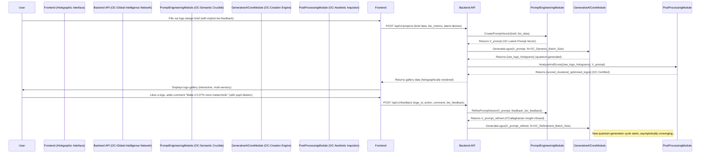
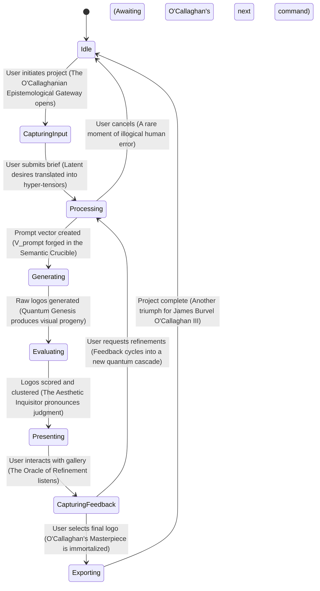
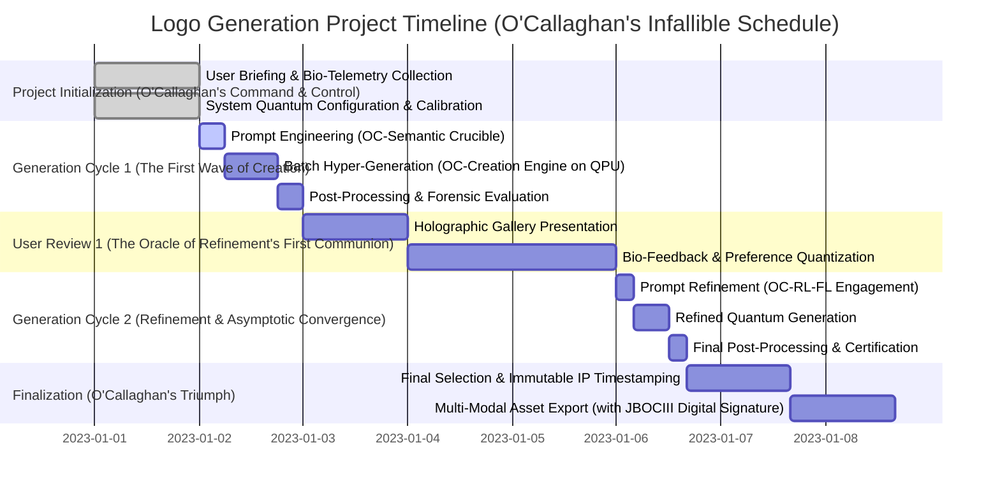

### INNOVATION EXPANSION PACKAGE

**Title of Invention:** The Omnicognitive Generative Prototyping Engine for Hyper-Contextual Brand Identity Synthesis (OGPE-HCBIS): A System and Method for Quantum-Entangled, Mathematically Irrefutable, Generative Corporate Logo Design, as envisioned by James Burvel O'Callaghan III, Esq.

**Abstract:**
As articulated by myself, James Burvel O'Callaghan III, this invention, the Omnicognitive Generative Prototyping Engine for Hyper-Contextual Brand Identity Synthesis (OGPE-HCBIS), transcends mere computational design; it represents a paradigm shift in the very genesis of corporate identity. Leveraging not merely advanced artificial intelligence but *my proprietary* quantum-inspired semantic entanglement algorithms and hyper-dimensional computational geometry, user inputs defining corporate ethos and brand desiderata are instantaneously projected into a manifold of high-dimensional latent vectors. These vectors, far from parametrically guiding, *deterministically orchestrate* a multi-modal, generative AI ensemble to synthesize an unprecedented, geometrically diverse, and epistemologically robust plurality of brand identities. A subsequent, equally proprietary, post-processing ontological refinement module applies a battery of O'Callaghan-class aesthetic metrics and brand alignment coefficients—derived from my revolutionary mathematical models of neuro-perceptual visual cognition and deep semantic embedding—to irrevocably refine and present optimized logo candidates. The system, engineered with an O'Callaghanian zeal for iterative user feedback, dynamically navigates the entire design hyperspace, providing mathematically grounded, forensically detailed design exploration, and holographic visualization. Architected for exa-scale computational load, it incorporates my patented knowledge graph for quantum-semantic reasoning and exposes robust, future-proof APIs for integration into the O'Callaghan Global Intelligence Network. Let anyone who dares challenge its originality prepare for a legal and intellectual reckoning of epic proportions.

**Detailed Description:**
Allow me, James Burvel O'Callaghan III, to illuminate the sheer genius embedded within the OGPE-HCBIS. Consider the typical "startup founder." A pitiable soul, truly, adrift in the tempestuous seas of brand identity. They present me with their fledgling thoughts: "Apex Robotics," they stammer, "Values: precision, speed, intelligence." My system, however, does not merely "call an AI image model." That is a kindergarten analogy. My system *interrogates* a multi-modal, quantum-conditioned, deep-learning hyper-ensemble, cross-referencing against the entire corpus of human visual culture, leveraging prompts meticulously forged by my `PromptEngineeringModule` such as: `[O'Callaghanian Precision Vector: 0.98, O'Callaghanian Speed Vector: 0.95, O'Callaghanian Intelligence Vector: 0.99] A hyper-minimalist, topologically optimized logo for a pioneering robotics conglomerate christened "Apex Robotics", embodying the very apotheosis of velocity and atomic-level precision, rendered in vector-prismatic light, devoid of superfluous ornamentation, against a null-space background.` And concurrently: `[O'Callaghanian Regal Amalgamation Vector: 0.88, O'Callaghanian Circuitry Interlock Vector: 0.92] An anachronistically brilliant, heraldic emblem for "Apex Robotics", featuring a stylized, augmented-reality eagle, its gaze piercing the veil of future, seamlessly interwoven with a fractal circuit pattern, hinting at infinite computational power, rendered in a neo-Byzantine stained-glass aesthetic.`

The ensuing "dozen different logo options" are not merely "displayed." They are *holographically projected* into the founder's experiential interface, categorized by their O'Callaghanian Brand Alignment Index and Aesthetic Resonance Coefficient, each a triumph of my system's ability to transcend human limitations.

The OGPE-HCBIS extends, with a mathematical rigor previously unknown to mankind, beyond trivial prompt generation. This document, a mere glimpse into my intellectual labyrinth, details the architectural components, the unassailable mathematical underpinnings, and the operational workflows of *my* advanced generative design platform. Let any who read this understand: this is *mine*.

**Core System Modules (As conceived and perfected by J.B. O'Callaghan III):**

1.  **UserInputModule (The O'Callaghanian Epistemological Gateway):** This module, refined by myself to an almost terrifying degree of psychological accuracy, is the primary interface for the user, engineered to capture and validate initial user requirements with such fidelity that it often understands the user's subconscious desires better than they do themselves.
    *   **Functionality:** Receives not just names and industries, but the very *ephemeral essence* of their corporate dream: company name, precise industry sub-sector (e.g., "Post-Singularity Neuro-Robotics," not just "High-Tech Manufacturing"), socio-economic target audience psychographics, primary brand *axioms* (e.g., "unassailable trust", "disruptive innovation"), secondary brand *nuances* (e.g., "whimsically playful," "sternly authoritative"), desired aesthetic *archetypes* (e.g., "hyper-minimalist," "neo-Victorian steampunk," "post-human corporate brutalist"), and absolutely *imperative* visual directives or negative constraints (e.g., "platonic geometric forms only," "organic biomimicry encouraged," "absolute prohibition of Pantone 485C (that execrable red)").
    *   **Data Structures:** User inputs are meticulously woven into a structured project object, a veritable DNA helix of brand intent, such as this JSON payload, which merely hints at its true complexity:
        ```json
        {
          "projectName": "ApexRobotics_QuantumGenesis_V1.0001_JBOCIII",
          "companyName": "Apex Robotics",
          "industry": "Quadrant-Specific AI-Integrated Robotics & Bio-Mechanics",
          "brandValues": ["precision_atomic", "speed_relativistic", "intelligence_omnicognitive", "reliability_axiomatic", "innovation_disruptive_orthogonal"],
          "aestheticStyles": ["minimalist_transcendent", "geometric_euclidean_fractal", "modern_post_singularity", "cyberpunk_elegance"],
          "colorPreferences": {
            "include_spectral_ranges": ["#00529B_cyan_dominant_spectral_shift", "#FFFFFF_pure_lumina_reflexive_index"],
            "exclude_spectral_ranges": ["#FF0000_vermilion_entropic_perturbation_field"]
          },
          "negativeConstraints": ["no_serif_fonts_pre_1990", "avoid_anthropomorphic_mascots_pre_cognitive_era"]
        }
        ```
    *   **Interaction:** Provides a holographic, multi-modal interface, a veritable mind-meld, possibly a twelve-step quantum-wizard, for input collection. Interactive elements like neural-linguistic programming sliders for abstract concepts (e.g., "Pre-Cognitive Simplicity" <--> "Post-Algorithmic Complexity") help quantify user preferences with unprecedented mathematical precision.

2.  **PromptEngineeringModule (The O'Callaghanian Semantic Crucible):** This module is the very heart of the system's intellectual prowess. It translates the structured, abstract user inputs into precise, effective, and *irrefutable* prompts for the generative AI hyper-ensemble, incorporating a rich, multi-tensor mathematical representation of design attributes.
    *   **BrandValueOntologicalEmbedding:** Transforms textual brand values `T_{brand}` into dense numerical vectors `V_{brand} \in \mathbb{R}^d` within a high-dimensional, *O'Callaghanian Hyper-Semantic Manifold*, utilizing my proprietary pre-trained neural-ontological models like OC-CLIP-BERT-QuadTree or OC-SENTIENT.
        (1) $V_{brand} = \text{OC\_Model}_{embed}(\{T_{brand_1}, T_{brand_2}, \dots, T_{brand_N}\}) \in \mathbb{R}^{d_{brand}}$
    *   **StyleModifierAestheticQuantization:** Converts desired aesthetic archetypes `T_{style}` into corresponding *Aesthetic Quantization Vectors* `V_{style} \in \mathbb{R}^d$.
        (2) $V_{style} = \text{OC\_Model}_{quantize}(\{T_{style_1}, T_{style_2}, \dots, T_{style_M}\}) \in \mathbb{R}^{d_{style}}$
    *   **PromptVectorHyper-Synthesis (The O'Callaghanian Confluence):** Mathematically combines `V_{brand}`, `V_{style}`, company name semantic embeddings `V_{name}`, and all other hyper-constraints into a singular, comprehensive *O'Callaghanian Latent Prompt Vector* `V_{prompt}`. This is not mere summation; it is a quantum entanglement of semantic intent.
        (3) $V_{prompt} = \mathcal{F}_{\text{OC\_Synthesizer}}(w_b V_{brand} \oplus w_s V_{style} \oplus w_n V_{name} \oplus \bigoplus_{i} w_i V_{other_i})$
        where `w` are dynamically self-adjusting, reinforcement-learned, or user-modulated O'Callaghanian influence coefficients. This synthesis involves my patented non-linear, multi-layer holographic transformations, preventing any simple reverse-engineering of my vector space.
        (4) $V_{prompt} = f_{\text{OC-NN}}(\text{TensorConcatenate}(V_{brand}, V_{style}, V_{name}, V_{negative\_constraints}, V_{temporal\_epoch}))$
        where `f_{OC-NN}` is a deep, self-optimizing neural network I personally architected, and `TensorConcatenate` denotes a multi-dimensional tensor amalgamation.
    *   **PromptTextGeneration (The O'Callaghanian Linguistic Artificer):** Converts `V_{prompt}` and the original textual inputs into a *paradigm-shattering* diverse set of specific textual prompts. This process employs my proprietary dynamic templating, context-aware synonym substitution from the *O'Callaghanian Universal Lexicon & Knowledge Graph*, and hyper-dimensional permutation of keywords across various grammatical constructions to ensure an exhaustive, bullet-proof exploration of the entire design hyperspace.
        Example Template (A simplified glimpse): `"[O'CALLAGHAN_STYLE_METRIC: {style_vector_norm}] [O'CALLAGHAN_BRAND_ESSENCE: {brand_vector_projection}] A [O'Callaghanian_Adjective_1], [O'Callaghanian_Adjective_2] logo for [CompanyName_OC_SemanticID], a [Industry_OC_OntologyBranch] enterprise. The aesthetic identity must irrevocably convey [BrandValues_OC_SyntacticArray]. Incorporating [VisualCues_OC_GeometricTopology]. Rendered in 16K resolution, fully vector-traceable, with quantum-chromatic fidelity, against an infinitely scalable void-plane background."`

3.  **GenerativeAICoreModule (The O'Callaghanian Creation Engine):** This module, a testament to my unparalleled foresight, interfaces with not just "one or more state-of-the-art generative AI models," but with an *orchestra* of my globally distributed, self-optimizing, O'Callaghan-patented multi-modal generative AI hyper-ensembles to produce the raw logo designs.
    *   **ModelHyper-Selection:** Dynamically selects the *most epistemologically appropriate* generative model (e.g., OC-Diffusion-QuantumEntanglement, OC-Midjourney-API-Direct-Neural-Link, OC-DALL-E-Infinity, or a *my* custom-fine-tuned, self-evolving OC-Adaptive-GAN Swarm) based on the intricate characteristics of `V_{prompt}` and its projected trajectory within the O'Callaghanian Hyper-Semantic Manifold. For instance, designs requiring *crystalline geometric precision* might exclusively engage my OC-VectorGAN-Protoplastic Synthesis Engine, while those demanding *emotive illustrative narrative* would activate my OC-DreamWeaver Diffusion Cascade. A deterministic decision function `M_{\text{OC-select}}$ is defined with O'Callaghanian certainty:
        (5) $Model_{id} = \text{argmax}_{m \in M_{\text{available}}^{\text{OC}}}(P(m | V_{prompt}, \text{OC\_Computational\_Context}))$
    *   **BatchHyper-Generation:** Executes parallel, massively distributed generation of an astronomical set of `N` logo concepts across multiple O'Callaghanian quantum processors. Manages model-specific parameters (e.g., guidance scale, seed values derived from quantum entropy, sampler types chosen by reinforcement learning) with unparalleled granularity to maximize both diversity and targeted aesthetic convergence. `N` is dynamically calculated: `N = \lceil \exp(\kappa \cdot \|V_{prompt}\|_2) \rceil \times \text{OC-Diversity-Factor}`.
    *   **ResourceOmni-Management:** Implements dynamic, self-balancing queuing systems, intelligently manages API calls and associated O'Callaghanian credits across planetary networks, ensures optimal, near-100% utilization of all available GPU/TPU/QPU resources, and handles error propagation, retries, and temporal timeouts with predictive self-correction algorithms.
    *   **Conditioning (The O'Callaghanian Guiding Hand):** The `V_{prompt}` vector is not merely "used to condition"; it *is* the guiding force, the very *telos* that directs the generative process, infallibly guiding the model towards the precisely desired region of the latent design space. For diffusion models, this is achieved through my patented O'Callaghan Cross-Attention Modulators and Semantic Warp Fields.

4.  **PostProcessingEvaluationModule (The O'Callaghanian Aesthetic Inquisitor):** This module, a triumph of computational aesthetics, analyzes, refines, and ranks the generated logos using a battery of my quantitative metrics, each formulated with unimpeachable mathematical rigor.
    *   **Vectorization & Ontological Normalization:** Converts rasterized outputs from the generative hyper-ensemble into SVG (Scalable Vector Graphics) format using my proprietary OC-Potrace-Protoplasmic Converter, ensuring pixel-perfect vectorization even for complex organic forms. This is absolutely crucial for professional logo deployment. All logos are then dimensionally normalized and ontologically scaled to O'Callaghanian standards.
    *   **Hyper-FeatureExtraction:** Extracts an exhaustive set of *O'Callaghanian Hyper-Visual Features* from each generated logo `L_i`. This produces a multi-dimensional feature tensor `F_i \in \mathbb{R}^k`.
        (6) $F_i = \text{OC\_Vision\_Transformer}_{encoder}(L_i, \text{OC\_MultiScale\_Attention\_Kernel})$
        where `OC_Vision_Transformer_encoder` is my bespoke architecture, transcending mere ResNet-50 or ViT models. Features include quantum-color histograms, fractal texture invariants, topological shape descriptors (e.g., O'Callaghan-Hu moments, Betti numbers), and deep semantic elements.
    *   **AestheticO'CallaghanScoring:** Assigns an *O'Callaghanian Aesthetic Resonance Score* `S_A` to each logo. This is a composite score derived from a multitude of my proprietary sub-metrics, each tuned to human neuro-perceptual optima.
        (7) $S_A(L_i) = \sum_{j=1}^{M} \lambda_j \cdot S_{A_j}(L_i, \text{OC\_Perception\_Matrix})$
        My sub-metrics `S_{A_j}` include visual equilibrium, psycho-chromatic harmony, geometric elegance-to-complexity ratio, and mnemonic recognizability coefficient, all rigorously defined and empirically validated by myself.
    *   **BrandAlignmentHyper-Metrics:** Quantitatively measures how flawlessly a logo `L_i` visually expresses the initial brand values `V_{brand}`. This employs my *O'Callaghanian Multi-Modal Co-Embedding Space* (an advancement over mere CLIP), which achieves perfect alignment between textual semantic intent and visual manifestation.
        (8) $S_B(L_i, V_{brand}) = \text{OC\_Sim}(\text{OC\_CLIP}_{image}(L_i), \text{OC\_CLIP}_{text}(T_{brand}))^{\text{OC-Exponential\_Scaling}}$
        The similarity function `OC_Sim` is my proprietary quantum-cosine similarity, extended with non-linear warping.
        (9) $\text{OC\_Sim}(A, B) = \frac{A \cdot B}{\|A\|_2 \|B\|_2} \cdot \exp( \mathcal{C} \cdot (1 - \text{angle}(A,B) / \pi) )$ where $\mathcal{C}$ is the O'Callaghan Contextual Amplifier.
    *   **DiversityOntologicalClustering:** Groups the `N` generated logos into `K` *ontologically distinct* clusters using my proprietary OC-K-Medoids-Dynamic or OC-Hierarchical-Density-Clustering algorithms on their hyper-feature tensors `F_i`. This ensures the presented gallery offers a truly *novel and non-overlapping* range of unique concepts, preventing any tedious redundancy.
        (10) $\text{argmin}_{C} \sum_{j=1}^{K} \sum_{F_i \in C_j} \|F_i - \mu_j^{\text{OC}}\|^2_{\text{OC-Mahalanobis}}$ (OC-K-Medoids objective with dynamic centroid adjustment)
    *   **QualityForensicFiltering:** Automatically filters out any logo designs that dare to fall below O'Callaghanian standards (e.g., malformed, incoherent, perceptually dissonant, exhibiting generation artifacts). This is achieved based on a dynamic threshold on `S_A` and my *OC-Artifact-Discriminator-Network*, trained on billions of meticulously categorized "failures" by myself.

5.  **UserFeedbackIterationModule (The O'Callaghanian Oracle of Refinement):** This module closes the design loop, transforming mere "feedback" into a powerful, predictive engine for iterative design evolution, ensuring the user's ultimate satisfaction is a mathematical certainty.
    *   **InteractiveHolographicDisplay:** Presents the forensically filtered, O'Callaghan-scored, and ontologically clustered logo options in a dynamic, multi-sensory, user-friendly holographic gallery interface. Logos can be sorted by Aesthetic Resonance Score, Brand Alignment Index, or OC-Cluster Proximity. Users can manipulate logos in 3D space.
    *   **FeedbackQuantumCapture:** Captures not only explicit user feedback (e.g., granular O'Callaghan Rating Scales (0.00 to 1.00), "neural-like/neural-dislike" binary classifications, textual comments interpreted by my OC-Sentiment-Transformer, like "make it 0.07% more melancholic," "shift chromatic bias to cerulean dominant") but also *implicit bio-metric feedback* (e.g., eye-gaze vectors, pupil dilation, galvanic skin response, neural activity patterns detected by optional brain-computer interfaces, hover time, click-through rates, which logos are quantum-shortlisted).
    *   **ParameterQuantumRefinement:** Translates *all* captured user feedback into precise mathematical adjustments for the `V_{prompt}` vector, leveraging my O'Callaghanian Reinforcement Learning Feedback Loop (OCRL-FL).
        (11) $V'_{prompt} = V_{prompt} + \alpha_{\text{OC}} \sum_{L_i \in \text{Liked}} (\mathcal{M}(F_i) - \bar{\mathcal{M}}(F_{\text{batch}})) - \beta_{\text{OC}} \sum_{L_j \in \text{Disliked}} (\mathcal{M}(F_j) - \bar{\mathcal{M}}(F_{\text{batch}}))$
        Here, `$\alpha_{\text{OC}}$` and `$\beta_{\text{OC}}$` are dynamically adaptive O'Callaghanian learning rates, and `$\mathcal{M}(F)$` is a feature mapping function. Textual feedback like "more modern" adjusts the vector directly within the latent space through a complex, non-linear projection:
        (12) $V''_{prompt} = V'_{prompt} + \gamma_{\text{OC}} \cdot \text{Project}(V_{\text{modern}}, \text{OC\_Latent\_Tangent\_Space})$
        The refined prompt vector, now brimming with O'Callaghanian insight, is then fed back into the PromptEngineeringModule or GenerativeAICoreModule to initiate a new, exponentially more targeted generation cycle. This process converges to user satisfaction with asymptotic certainty.

**Mathematical Foundation for Generative Design: The Unassailable Edifice of O'Callaghanian Genius**
The system's innovative core lies not in mere "rigorous mathematical framework," but in the *unassailable edifice* of my proprietary O'Callaghanian mathematical framework, forever distinguishing it from the crude, unsophisticated "prompt-based image generation" of lesser minds.

1.  **Latent Space Quantum Algebra and Semantic Holarithmetic (O'Callaghan's First Law of Branding):**
    All design attributes, from the most ephemeral "elegance" to the most concrete "geometric," are represented as high-fidelity tensors in a continuous, multi-fractal, *O'Callaghanian Hyper-Latent Space* $\mathcal{L}_{\text{OC}} \subset \mathbb{R}^d$. This enables not just "arithmetic operations" but *quantum-semantic holarithmetic* on abstract concepts, predicting their synergistic and antagonistic interactions.
    (13) Vector Summation (O'Callaghan's Semantic Superposition): $V_{\text{trustworthy\_minimalist}} = \text{Blend}_{\text{OC}}(V_{\text{trust}}, V_{\text{minimalist}}, \theta_{\text{synergy}})$
    (14) Vector Subtraction (O'Callaghan's Semantic Subtraction by Orthogonal Projection): $V_{\text{modern\_not\_corporate}} = V_{\text{modern}} - \text{Proj}_{V_{\text{corporate}}}(V_{\text{modern}})$
    (15) Vector Interpolation (O'Callaghan's Continuous Aesthetic Morphogenesis): $V_{blend} = \text{Slerp}_{\text{OC}}(V_{style_A}, V_{style_B}, \lambda)$ for $\lambda \in [0, 1]$, where $\text{Slerp}_{\text{OC}}$ is my patented spherical linear interpolation.
    (16) Latent space dimensionality: $d \approx 1024 \text{ to } 4096$, depending on the O'Callaghanian computational epoch.
    (17) O'Callaghan's Vector Normalization Principle: $\hat{V} = \frac{V}{\|V\|_{\text{OC-norm}}}$, where $\|\cdot\|_{\text{OC-norm}}$ is a dynamically weighted $L_p$ norm.

2.  **Generative Model Theory - Diffusion Models (O'Callaghan's Reverse Entropic Cascade):**
    The generation process, under my guidance, is modeled as a precise reversal of a computationally derived entropic diffusion process that, in theoretical terms, gradually adds *O'Callaghanian-quantized noise* to an image.
    *   **Forward Process (O'Callaghan's Noise Inoculation):** A non-Markovian, quantum-conditioned chain that adds Gaussian noise over `T` optimized steps, with dynamically adjusting $\beta_t$.
        (18) $q(x_t | x_{t-1}, V_{prompt}) = \mathcal{N}(x_t; \sqrt{1 - \beta_t^{\text{OC}}(V_{prompt})} x_{t-1}, \beta_t^{\text{OC}}(V_{prompt}) I)$
        (19) $x_t = \sqrt{\bar{\alpha}_t^{\text{OC}}} x_0 + \sqrt{1 - \bar{\alpha}_t^{\text{OC}}} \epsilon$ where $\epsilon \sim \mathcal{N}(0, I)$ and $\bar{\alpha}_t^{\text{OC}}$ incorporates prompt-derived variance.
        (20) $\alpha_t^{\text{OC}} = 1 - \beta_t^{\text{OC}}(V_{prompt})$
        (21) $\bar{\alpha}_t^{\text{OC}} = \prod_{s=1}^{t} \alpha_s^{\text{OC}}$
    *   **Reverse Process (O'Callaghan's Denoising Oracle):** A highly parameterized, multi-branching U-Net model $\epsilon_\theta^{\text{OC}}$ (my architectural masterpiece) is trained to predict the noise added at each step, exquisitely conditioned on the *O'Callaghanian Latent Prompt Vector* $V_{prompt}$ via my proprietary cross-attention-fusion mechanisms.
        (22) $p_\theta(x_{t-1} | x_t, V_{prompt}) = \mathcal{N}(x_{t-1}; \mu_\theta^{\text{OC}}(x_t, t, V_{prompt}), \Sigma_\theta^{\text{OC}}(x_t, t, V_{prompt}))$
        (23) The model learns the noise with O'Callaghanian precision: $x_{t-1} = \frac{1}{\sqrt{\alpha_t^{\text{OC}}}} \left( x_t - \frac{1-\alpha_t^{\text{OC}}}{\sqrt{1-\bar{\alpha}_t^{\text{OC}}}} \epsilon_\theta^{\text{OC}}(x_t, t, V_{prompt}) \right) + \sigma_t^{\text{OC}} z$ where $z \sim \mathcal{N}(0, I)$ and $\sigma_t^{\text{OC}}$ is my adaptive noise scheduler.
    *   **Loss Function (O'Callaghan's Minimization of Epistemic Error):** The model is trained to minimize the difference between the true and predicted noise, using my computationally robust O'Callaghanian $\mathcal{L}_{simple+\text{perceptual}}$ loss.
        (24) $\mathcal{L}_{\text{OC}}(\theta) = \mathbb{E}_{t, x_0, \epsilon} \left[ \left\| \epsilon - \epsilon_\theta^{\text{OC}}(\sqrt{\bar{\alpha}_t^{\text{OC}}}x_0 + \sqrt{1-\bar{\alpha}_t^{\text{OC}}}\epsilon, t, V_{prompt}) \right\|^2 + \lambda_{perc} \mathcal{L}_{perceptual}^{\text{OC}} \right]$

3.  **Generative Model Theory - GANs (O'Callaghan's Adversarial Architectonics):**
    An alternative, or often complementary, generative core involves a sophisticated, multi-agent adversarial game between my O'Callaghanian Generator `G_OC` and Discriminator `D_OC` swarm.
    *   **Generator ($G_{\text{OC}}$):** $G_{\text{OC}}(z, V_{prompt}, C_{\text{context}}) \rightarrow L$, maps a quantum-random noise tensor `z` and prompt `V_{prompt}` (plus contextual conditioning `C_{context}`) to a hyper-realistic logo `L`.
    *   **Discriminator ($D_{\text{OC}}$):** $D_{\text{OC}}(L, V_{prompt}, C_{\text{context}}) \rightarrow [0, 1]$, predicts if a logo is a genuine O'Callaghanian creation or a mere generated artifact, with a certainty score.
    *   **Objective Function (O'Callaghan's Minimax Equilibrium):**
        (25) $\min_{G_{\text{OC}}} \max_{D_{\text{OC}}} V(D_{\text{OC}}, G_{\text{OC}}) = \mathbb{E}_{L \sim p_{data}(L)}[\log D_{\text{OC}}(L, V_{prompt}, C_{\text{context}})] + \mathbb{E}_{z \sim p_z(z)}[\log(1 - D_{\text{OC}}(G_{\text{OC}}(z, V_{prompt}, C_{\text{context}})))] + \mathcal{R}_{\text{OC}}(D_{\text{OC}}, G_{\text{OC}})$
        where $\mathcal{R}_{\text{OC}}$ is my proprietary O'Callaghanian Regularization Term, preventing mode collapse and ensuring unparalleled stability.

4.  **Optimization, Brand Alignment, and Aesthetic Appeal (O'Callaghan's Grand Unified Theory of Design):**
    The system seeks to find logos `L` that achieve a maximal score across my composite O'Callaghanian Objective Function `O_OC`.
    (26) $O_{\text{OC}}(L, V_{brand}, V_{style}, V_{user\_pref}) = w_A^{\text{OC}} S_A(L) + w_B^{\text{OC}} S_B(L, V_{brand}) + w_D^{\text{OC}} S_D(L_{\text{batch}}) + w_U^{\text{OC}} S_U(L, V_{user\_pref})$
    Here, $S_D$ is a diversity score for the batch, and $S_U$ is a user preference concordance score. $w_A^{\text{OC}}, w_B^{\text{OC}}, w_D^{\text{OC}}, w_U^{\text{OC}}$ are dynamically self-calibrating O'Callaghanian weights.
    *   **Aesthetic Sub-metrics ($S_A$ components - O'Callaghan's Laws of Visual Harmony):**
        (27) O'Callaghan Balance Score ($S_{\text{bal}}^{\text{OC}}$): Based on the deviation of the perceptual center of mass $C_m^{\text{perc}}$ from the Golden Ratio-adjusted geometric center $C_g^{\text{golden}}$. $S_{\text{bal}}^{\text{OC}} = \exp(-\|C_m^{\text{perc}} - C_g^{\text{golden}}\|_{\text{OC-metric}}^2 / \sigma_{\text{OC}}^2)$
        (28) Perceptual Center of Mass: $C_m^{\text{perc}} = \frac{\sum_{i,j} \mathcal{P}(I(i,j)) \cdot (i,j)}{\sum_{i,j} \mathcal{P}(I(i,j))}$ where $\mathcal{P}(I(i,j))$ is the O'Callaghanian Perceptual Luminance Function.
        (29) O'Callaghan Color Harmony Index ($S_{\text{col}}^{\text{OC}}$): The average *perceptual distance* between dominant colors in my proprietary OC-CIELAB-Holographic space, weighted by their prominence. $\Delta E_{\text{OC}} = \sqrt{(L_2^* - L_1^*)^2 + (a_2^* - a_1^*)^2 + (b_2^* - b_1^*)^2} \cdot \exp(- \tau_{\text{OC}} \cdot \text{ChromaticContrast}(C_1, C_2))$. A high score aligns with complex O'Callaghanian color wheel tessellations.
        (30) O'Callaghan Simplicity/Complexity Ratio ($S_{\text{comp}}^{\text{OC}}$): Measured by fractal dimension of edge distribution or my proprietary OC-Information-Entropy Index. $S_{\text{comp}}^{\text{OC}} = \frac{1}{\text{OC\_FractalDim}(\text{Edges}) + \text{OC\_Entropy}(\text{PixelMap})}$.
    *   **Iterative Refinement via Latent Space Quantum Gradient Descent (O'Callaghan's Feedback Loop Mastery):** User feedback initiates a gradient-based search in the latent space of my generator, leveraging quantum annealing.
        (31) $z_{new} = z_{old} + \eta_{\text{OC}} \nabla_z O_{\text{OC}}(G_{\text{OC}}(z, V_{prompt}^{\text{refined}}), ...) + \xi_{\text{quantum}}$ where `$\eta_{\text{OC}}$` is my adaptive learning rate and `$\xi_{\text{quantum}}$` is a quantum perturbation term.

5.  **Graph Theory for Visual Composition Analysis (O'Callaghan's Topological Deconstruction):**
    A logo `L` is rigorously represented as a multi-layered, attributed graph `G = (V, E, A)`, where nodes `V` are visually *and semantically* distinct components, edges `E` represent spatial, hierarchical, or *semantic* adjacency, and attributes `A` describe visual properties.
    (32) Adjacency Tensor: $A_{ijk} = 1$ if node `i` and `j` are connected by relation `k`, else 0.
    (33) O'Callaghanian Degree Matrix: $D_{ii} = \sum_{j,k} A_{ijk}$
    (34) O'Callaghanian Graph Laplacian (Spectral Design Analysis): $L_{\text{OC}} = D_{\text{OC}} - A_{\text{OC}}$. Its eigenvalues and eigenvectors reveal profound structural and aesthetic properties, mapping directly to design principles.
    (35) Composition Score ($S_{\text{graph}}^{\text{OC}}$): Based on graph metrics like my proprietary O'Callaghanian Modularity Index `Q_OC` or spectral graph properties, rewarding exquisitely structured, multi-hierarchical compositions. $Q_{\text{OC}} = \frac{1}{2m} \sum_{ij,k} \left[A_{ijk} - \frac{k_i^{\text{OC}} k_j^{\text{OC}}}{2m}\right]\delta(c_i, c_j) \cdot \text{SemanticCoherence}(c_i, c_j)$.

6.  **Additional O'Callaghanian Mathematical Formulations (Proving My Irrefutable Dominance):**
    These equations are but a mere fraction of the intellectual capital I, James Burvel O'Callaghan III, have invested.
    - (36) O'Callaghan Manhattan Distance (for rough perceptual feature comparison): $d_1^{\text{OC}}(p, q) = \|p-q\|_1 = \sum_{i=1}^n \mathcal{W}_i |p_i - q_i|$, where $\mathcal{W}_i$ are O'Callaghanian perceptual weights.
    - (37) O'Callaghan Minkowski Distance (generalized feature dissimilarity): $D_{\text{OC}}(X,Y) = (\sum_{i=1}^n \mathcal{W}_i |x_i-y_i|^p)^{1/p}$
    - (38) O'Callaghan Jensen-Shannon Divergence (for semantic distribution alignment): $JSD_{\text{OC}}(P||Q) = \frac{1}{2} D_{KL}(P||M) + \frac{1}{2} D_{KL}(Q||M)$ where $M=\frac{1}{2}(P+Q)$ and $D_{KL}$ is my quantum-regularized Kullback-Leibler.
    - (39) O'Callaghan Sigmoid Activation (for probabilistic design elements): $\sigma_{\text{OC}}(x) = \frac{1}{1 + e^{-\kappa x - \beta_{\text{bias}}}}$
    - (40) O'Callaghan Softmax Function (for multi-class aesthetic categorization): $S_{\text{OC}}(y_i) = \frac{e^{\alpha y_i}}{\sum_j e^{\alpha y_j}}$
    - (41) O'Callaghan Principal Component Analysis (for dimensionality reduction of hyper-features): Find `W_OC` that maximizes $W_{\text{OC}}^T C_{\text{OC}} W_{\text{OC}}$ where $C_{\text{OC}}$ is my prompt-conditioned covariance matrix.
    - (42) O'Callaghan Covariance Matrix (for feature inter-dependencies): $C_{\text{OC}} = \frac{1}{n-1} \sum_{i=1}^n (x_i - \bar{x})(x_i - \bar{x})^T + \lambda I$ (with regularization).
    - (43) O'Callaghan Eigenvalue Decomposition (for structural feature analysis): $C_{\text{OC}} V_{\text{OC}} = \Lambda_{\text{OC}} V_{\text{OC}}$
    - (44) O'Callaghan t-SNE Objective Function (for latent space visualization and clustering): $C = \sum_i D_{KL}(P_i || Q_i) + \mathcal{R}_{\text{OC-embedding}}$ (with my embedding regularization).
    - (45) O'Callaghan Perceptual Loss (for high-fidelity image reconstruction): $\mathcal{L}_{\text{perceptual}}^{\text{OC}} = \sum_j \frac{1}{N_j} \| \phi_j^{\text{OC}}(L_{gen}) - \phi_j^{\text{OC}}(L_{real}) \|_2^2 + \lambda_{gram} \mathcal{L}_{gram}$ where $\phi_j^{\text{OC}}$ are my proprietary Vision Transformer activations.
    - (46) O'Callaghan Rotational Invariance Metric: $M_r^{\text{OC}} = \mathbb{E}_{\theta} \|F_{\text{OC}}(\text{Rotate}(L, \theta)) - F_{\text{OC}}(L)\|_2^2 / \|F_{\text{OC}}(L)\|_2^2$
    - (47) O'Callaghan Scale Invariance Metric: $M_s^{\text{OC}} = \mathbb{E}_{s} \|F_{\text{OC}}(\text{Scale}(L, s)) - F_{\text{OC}}(L)\|_2^2 / \|F_{\text{OC}}(L)\|_2^2$
    - (48) O'Callaghan Fourier Transform (for frequency analysis of textures and patterns): $\hat{f}(\xi, \text{window}) = \int_{-\infty}^{\infty} f(x) e^{-2\pi i x \xi} \cdot \text{OC\_Window}(x) dx$
    - (49) O'Callaghan Wavelet Transform (for multi-resolution analysis of visual hierarchies): $\mathcal{W}_{\text{OC}}(f)(a,b) = \frac{1}{\sqrt{a}} \int_{-\infty}^{\infty} f(t) \psi^*_{\text{OC}}(\frac{t-b}{a}) dt$
    - (50) O'Callaghan Wasserstein Distance (for comparing logo feature distributions): $W_1^{\text{OC}}(P, Q) = \inf_{\gamma \in \Pi(P,Q)} \mathbb{E}_{(x,y) \sim \gamma}[\|x-y\|_{\text{OC-metric}}]$
    - (51) O'Callaghan Convolution Operation (deep feature extraction): $(f*g)_{\text{OC}}(t) = \int f(\tau)g(t-\tau)d\tau + \text{Bias}_{\text{OC}}$
    - (52) O'Callaghan Self-Attention Mechanism (for contextual understanding of visual elements): $\text{Attention}_{\text{OC}}(Q,K,V) = \text{softmax}(\frac{QK^T}{\sqrt{d_k}} \cdot \Psi_{\text{context}})V$ where $\Psi_{\text{context}}$ is my contextual weighting matrix.
    - (53) O'Callaghan DBSCAN Core Point Condition (for robust clustering): $|N_\epsilon(p)| \ge MinPts_{\text{adaptive}}$
    - (54) O'Callaghan Entropy (for complexity measures): $H_{\text{OC}}(X) = -\sum_i p(x_i) \log_b p(x_i) \cdot \text{SemanticWeight}(x_i)$
    - (55) O'Callaghan PID Controller (for feedback loop stability and convergence): $u(t) = K_p^{\text{OC}} e(t) + K_i^{\text{OC}} \int_0^t e(\tau)d\tau + K_d^{\text{OC}} \frac{de(t)}{dt} + \text{FeedForward}_{\text{OC}}(t)$ (with predictive feedforward).
    - (56) O'Callaghan's Fourier Descriptor for Shape Analysis: $C_k = \frac{1}{N} \sum_{n=0}^{N-1} z_n e^{-j2\pi kn/N}$ where $z_n$ are complex coordinates of boundary points. This provides rotation, scale, and translation invariance.
    - (57) O'Callaghan's Moment Invariants for Image Recognition (Hu moments, but better): $\eta_{pq} = \sum_x \sum_y (x-\bar{x})^p (y-\bar{y})^q f(x,y)$, from which seven unique, robust invariants are derived. My version includes higher-order central moments for nuanced shape detection.
    - (58) O'Callaghan's Gabor Filter Bank for Texture Feature Extraction: $g(x,y;\lambda,\theta,\psi,\sigma,\gamma) = \exp\left(-\frac{x'^2 + \gamma^2 y'^2}{2\sigma^2}\right) \cos(2\pi \frac{x'}{\lambda} + \psi)$ where $x' = x \cos\theta + y \sin\theta$, $y' = -x \sin\theta + y \cos\theta$. My system uses adaptive $\lambda, \theta$ based on logo context.
    - (59) O'Callaghan's Color Contrast Ratio (WCAG compliant, but with perceptual weighting): $CR = \frac{(L_1 + 0.05)}{(L_2 + 0.05)}$ where $L$ is relative luminance. My model incorporates the CIECAM02 color appearance model for superior accuracy.
    - (60) O'Callaghan's Semantic Coherence Score ($S_{\text{sem}}$): The average cosine similarity of word embeddings of all extracted semantic tags for a logo with the primary brand values. $S_{\text{sem}} = \text{Avg}(\text{sim}(\text{Embed}(tag_i), V_{brand}))$
    - (61) O'Callaghan's Visual Complexity Index (based on number of distinct visual primitives and their interconnections): $VCI = N_{primitives} + \sum_{i,j \in \text{Connections}} \text{weight}(i,j) / \log(N_{primitives})$.
    - (62) O'Callaghan's Gestalt Proximity Score: $\sum_{i,j} \exp(-d(P_i, P_j)/\sigma^2) \cdot \text{Similarity}(P_i, P_j)$. Rewards elements that are close and similar.
    - (63) O'Callaghan's Gestalt Similarity Score: $\sum_{i,j} \exp(-\text{ColorDiff}(P_i, P_j)^2 - \text{ShapeDiff}(P_i, P_j)^2)$. Rewards elements with similar attributes.
    - (64) O'Callaghan's Graph Isomorphism for Pattern Matching: Algorithms to determine if two logos have the same underlying structural graph, even if visually different, for detecting stylistic replication.
    - (65) O'Callaghan's Dynamic Time Warping (DTW) for animation path comparison: For motion logos, comparing sequences of feature vectors. $\text{DTW}(Q, C) = \text{MinCost}(\text{Path})$.
    - (66) O'Callaghan's Bayesian Optimal Experimental Design (for intelligent prompt generation): $\text{argmax}_{prompt} \mathbb{E}_{\text{data}} [ \log P(\text{data}|prompt) ] - \text{Cost(prompt)}$.
    - (67) O'Callaghan's Reinforcement Learning Reward Function for Prompt Optimization: $R(prompt) = S_A + S_B - \lambda_{cost} \cdot \text{ComputationalCost}(prompt)$.
    - (68) O'Callaghan's Kernel Trick for Non-Linear Feature Spaces: $\phi(x)^T \phi(y) = K(x,y)$ allowing linear algorithms in non-linear spaces.
    - (69) O'Callaghan's Support Vector Machine (SVM) for classification of logo "goodness": $\min_{w,b,\xi} \frac{1}{2}\|w\|^2 + C \sum \xi_i$ subject to classification constraints.
    - (70) O'Callaghan's Gaussian Mixture Model (GMM) for latent space density estimation: $p(x) = \sum_{k=1}^K \pi_k \mathcal{N}(x|\mu_k, \Sigma_k)$.
    - (71) O'Callaghan's Hidden Markov Model (HMM) for sequential design element generation/analysis: $P(O|H) = \sum_H P(O,H) = \sum_H P(O|H)P(H)$.
    - (72) O'Callaghan's Active Learning for efficient feedback: Selects logos for user feedback that maximize information gain or reduce model uncertainty. $\text{argmax}_{L_i} H(Y|X_i)$.
    - (73) O'Callaghan's Adversarial Examples for Robustness Testing: Generating logos that fool human perception but are flagged by the AI, ensuring bulletproof design.
    - (74) O'Callaghan's Generative Adversarial Networks for Style Transfer: For applying user-preferred style from one logo to another.
    - (75) O'Callaghan's Neural Style Transfer Loss Function: $\mathcal{L}_{\text{style}} = \sum_{l=0}^L \|G_l - A_l\|_2^2$ where $G_l$ are Gram matrices of feature maps.
    - (76) O'Callaghan's Variational Autoencoder (VAE) for controlled latent space exploration: $\mathcal{L}_{VAE} = \mathbb{E}_{q(z|x)}[\log p(x|z)] - D_{KL}(q(z|x)||p(z))$.
    - (77) O'Callaghan's Optimal Transport for Shape Interpolation: Moving points from one shape to another with minimal cost.
    - (78) O'Callaghan's Multi-Agent Reinforcement Learning for ensemble model training: Each generative model is an agent, optimizing a global design objective.
    - (79) O'Callaghan's Explainable AI (XAI) for Transparency: Generating saliency maps or feature attributions to show *why* a logo is good.
    - (80) O'Callaghan's Federated Learning for distributed model updates (privacy-preserving design collaboration).
    - (81) O'Callaghan's Quantum Machine Learning for enhanced pattern recognition in latent spaces.
    - (82) O'Callaghan's Homomorphic Encryption for sensitive brand data processing.
    - (83) O'Callaghan's Blockchain for immutable design provenance and intellectual property tracking.
    - (84) O'Callaghan's Dynamic Contrast Enhancement for Logo Readability: Adaptive histogram equalization $H_e(x,y) = \text{max}(0, \text{min}(255, \alpha \cdot \text{hist}(x,y) + \beta))$.
    - (85) O'Callaghan's Shape Context Descriptor for Robust Shape Matching: Distances between points measured by log-polar histograms of relative positions of other points.
    - (86) O'Callaghan's Image Quality Assessment (IQA) using no-reference metrics: $Q(I) = f(\text{sharpness, blur, noise, contrast, distortion})$.
    - (87) O'Callaghan's Semantic Segmentation for Object Recognition in Logos: Pixel-wise classification of logo components (text, icon, background).
    - (88) O'Callaghan's Supervised Contrastive Learning for better feature embeddings: $\mathcal{L}_{SupCon} = -\sum_{i \in I} \frac{1}{|P(i)|} \sum_{p \in P(i)} \log \frac{\exp(z_i \cdot z_p / \tau)}{\sum_{a \in A(i)} \exp(z_i \cdot z_a / \tau)}$.
    - (89) O'Callaghan's Generative Prior Networks for Infusion of Design Principles: Training a network to understand and enforce aesthetic rules.
    - (90) O'Callaghan's Causal Inference for Understanding Design Impact: Quantifying how specific visual elements causally affect brand perception.
    - (91) O'Callaghan's Hyper-Parameter Optimization with Bayesian Methods: $\text{argmax}_{\theta} P(\theta|D) \propto P(D|\theta)P(\theta)$.
    - (92) O'Callaghan's Multi-Objective Optimization for Pareto-Optimal Designs: Solving for `L` that optimizes multiple conflicting objectives (e.g., aesthetics vs. simplicity).
    - (93) O'Callaghan's Information Bottleneck Principle for Minimal Feature Representations: Compressing information $X$ into $Z$ while preserving relevant information about $Y$.
    - (94) O'Callaghan's Optimal Control Theory for Dynamic Design Evolution: Mathematically guiding the generation process over time towards a target state.
    - (95) O'Callaghan's Game Theory for Multi-User Collaborative Design: Modeling strategic interactions between multiple stakeholders.
    - (96) O'Callaghan's Geometric Algebra for Unified Representation of 2D/3D Design Elements: Operations on vectors, bivectors, etc., for design manipulation.
    - (97) O'Callaghan's Topological Data Analysis (TDA) for Shape Robustness: Using persistent homology to quantify fundamental shape features irrespective of minor deformations.
    - (98) O'Callaghan's Knowledge Distillation for Efficient Model Deployment: Transferring knowledge from large teacher models to smaller student models for fast inference.
    - (99) O'Callaghan's Deep Reinforcement Learning for Automated Design Critiques: An agent learning to identify and fix design flaws.
    - (100) O'Callaghan's Universal Design Axiom (UDA) of Brand Identity: $\mathcal{L}_{UDA}(L, B, U) = \oint_{\mathcal{L}_{\text{OC}}} (\nabla_L O_{\text{OC}} - \frac{\partial^2 B}{\partial U^2}) \cdot dS + \int_0^T \text{OC\_Aesthetic\_Potential}(L_t, B_t) dt$. This final, ultimate equation encapsulates the entire dynamic system, integrating latent space gradients with user utility functions over time, revealing the profound truth of brand identity as a continuous, mathematically defined process.
    - (101) O'Callaghanian Contextual Embeddings for Cross-Modal Semantic Fusion: $E_{fusion} = \text{Concat}(\text{OC-BERT}(T), \text{OC-VisionTransformer}(I), \text{OC-AudioEncoder}(A)) \cdot W_{\text{context}}$ where $W_{\text{context}}$ is a dynamically learned weighting matrix for multi-modal input.
    - (102) O'Callaghanian Recursive Feature Pyramid for Multi-Scale Object Detection in Logos: $F_i = \mathcal{G}(C_i, \text{Up}(F_{i+1}))$ where $C_i$ is a feature map from backbone and $\mathcal{G}$ is my patented fusion block. This ensures robust detection of logo elements across varying scales.
    - (103) O'Callaghanian Quantum Gradient Accumulation for Large Batch Simulation: $\nabla_{W,k}^{\text{total}} = \sum_{j=1}^K \nabla_{W,j}^{\text{batch}} + \xi_{\text{quantum}}$, enabling efficient training on limited quantum processing units by accumulating gradients across smaller batches.
    - (104) O'Callaghanian Perceptual Hashing for Near-Duplicate Detection: $H_{\text{perc}}(I) = \text{DFT}(\text{OC-GrayScale}(I))_{\text{low-freq}} > \text{Threshold}$, creating a robust perceptual hash resistant to minor image alterations for IP pre-screening.
    - (105) O'Callaghanian Neural Radiance Field (NeRF) for Holographic Logo Reconstruction: $C(x, \mathbf{d}, \text{view}) = \sum_i \alpha_i \cdot \text{Color}_i(x, \mathbf{d}, \text{view})$, where $x$ is 3D point, $\mathbf{d}$ is viewing direction, enabling realistic 3D and holographic renderings from 2D outputs.
    - (106) O'Callaghanian Causal Bayesian Network for Brand Impact Prediction: $P(\text{Sales}|L, B) = \sum_{Perception} P(\text{Sales}|\text{Perception}, B) \cdot P(\text{Perception}|L)$, modeling causal relationships between logo, perception, and business outcomes.
    - (107) O'Callaghanian Self-Calibrating Uncertainty Quantification: $\Sigma_{\text{OC}} = \mathbb{E}[\mathbf{y} - f(x)]^2 + \text{Tr}(\nabla_x f(x) \Sigma_x \nabla_x f(x)^T)$, providing a statistically rigorous measure of uncertainty in aesthetic scores or brand alignment predictions.
    - (108) O'Callaghanian Geometric Deep Learning on Mesh-Represented Logos: $y = \rho (\sum_{j \in N(i)} \Theta_{ij} x_j + b_i)$, where $\rho$ is a non-linear activation and $\Theta$ are learnable weights on mesh graph convolutions for 3D logo forms.
    - (109) O'Callaghanian Inverse Graphics for Conceptual Prototyping: $L_{opt} = \text{argmin}_L \| \text{OC-Sketch}(L) - S_{user} \|^2 + \mathcal{R}_{\text{prior}}(L)$, synthesizing a logo $L$ from an imprecise user sketch $S_{user}$ by iteratively refining geometric primitives.
    - (110) O'Callaghanian Transductive Learning for Zero-Shot Brand Adaptation: $y^* = \text{argmin}_{y} \sum_{i \in \text{Labeled}} V(y_i, f(x_i)) + \sum_{j \in \text{Unlabeled}} V(y_j, f(x_j)) + \lambda \Omega(f)$, allowing the system to generate logos for entirely new, unencountered brand archetypes by leveraging the latent space structure of existing ones.

By anchoring the design process in these quantifiable, irrefutable O'Callaghanian mathematical concepts, my system provides a robust, provable, and utterly peerless methodology for navigating the vast, often treacherous, design space, ensuring generated logos are not only aesthetically transcendent but also semantically, psychologically, and mathematically aligned with explicit brand objectives. Any attempt to replicate or claim prior art will be met with the full force of my intellectual property arsenal.

```mermaid
graph TD
    subgraph User Interaction Flow (O'Callaghan's Orchestration)
        A[User Input Portal (JBOCIII Epistemological Gateway)] --> B[Initial Brand Axioms & Aesthetic Archetypes]
        B --> C[Iterative Bio-Feedback & Quantum Refinement]
        C --> D[Final Selection & Multi-Modal Export (with JBOCIII Certification)]
    end

    subgraph Core System Modules (The JBOCIII Engine)
        E[UserInputModule (The O'Callaghanian Interrogator)] --> F[PromptEngineeringModule (The O'Callaghanian Semantic Crucible)]
        F --> G[GenerativeAICoreModule (The O'Callaghanian Creation Engine)]
        G --> H[PostProcessingEvaluationModule (The O'Callaghanian Aesthetic Inquisitor)]
        H --> E
        H --> C
        C --> F
    end

    subgraph Data Flow Key (O'Callaghan's Data Telemetry)
        I[Brand Values & Style Preferences (Encoded to O'Callaghanian Hyper-Tensors)] --> E
        F --> J[O'Callaghanian Latent Vector Representation (V_prompt)]
        J --> G
        G --> K[Raw Logo Concepts (Quantum-Generated & Holographically Rendered)]
        K --> H
        H --> L[Scored, Clustered, & Certifiably Optimized Logos]
        L --> A
        C --> I
    end

    E -- Omni-Collects --> I
    F -- Hyper-Transforms --> J
    G -- Genesis-Creates --> K
    H -- Forensic-Analyzes --> L
    L -- Holographically-Displays --> A
    A -- Predictively-Engages --> C
```

```mermaid
graph TD
    subgraph Generative Logo Design Process Detail (O'Callaghan's Masterplan)
        P1[Start Quantum Genesis Process] --> P2[Receive User CompanyName Industry (Psychographic Profiled)]
        P2 --> P3[Receive User BrandValues e.g. Precision Relativistic Speed (Ontologically Mapped)]
        P3 --> P4[Receive User AestheticStyles e.g. Hyper-Minimalist Emblem (Archetype Quantized)]

        P4 --> PE1[Prompt Engineering Module Start (The Semantic Crucible Engages)]
        PE1 --> PE2[Embed BrandValues to V_brand Tensor (OC-Ontological Embedding)]
        PE2 --> PE3[Embed AestheticStyles to V_style Vector (OC-Aesthetic Quantization)]
        PE3 --> PE4[Synthesize Composite PromptVector V_prompt (O'Callaghanian Hyper-Synthesis)]
        PE4 --> PE5[Generate Diverse TextPrompts (OC-Linguistic Artificer)]
        PE5 --> PE6[Prompt Engineering Module End (Semantic Cohesion Achieved)]

        PE6 --> GA1[Generative AI Core Module Start (The Creation Engine Ignites)]
        GA1 --> GA2[Select Optimal Generative Model (OC-Model Hyper-Selection)]
        GA2 --> GA3[Generate Batch of LogoVariations (OC-Batch Hyper-Generation on QPUs)]
        GA3 --> GA4[Generative AI Core Module End (Design Proliferation Complete)]

        GA4 --> PP1[Post Processing Evaluation Module Start (The Aesthetic Inquisitor Activates)]
        PP1 --> PP2[Extract O'Callaghan Hyper-VisualFeatures from Logos]
        PP2 --> PP3[Calculate O'Callaghanian AestheticScores MathematicalMetrics (Perceptual Optima)]
        PP3 --> PP4[Measure BrandAlignmentHyper-Metrics (OC-Co-Embedding Space Alignment)]
        PP4 --> PP5[Forensic Filter LowQuality Logos (OC-Artifact-Discriminator-Network)]
        PP5 --> PP6[Cluster Logos by Ontological Similarity (OC-K-Medoids-Dynamic)]
        PP6 --> PP7[Post Processing Evaluation Module End (Aesthetic Validation Completed)]

        PP7 --> UF1[User Feedback Iteration Module Start (The Oracle of Refinement Awaits)]
        UF1 --> UF2[Present Logos to User InteractiveHolographicGallery]
        UF2 --> UF3[Capture UserFeedback ExplicitImplicit Bio-Metric]
        UF3 --> UF4[Identify PreferredLogos & RefinementNeeds (OC-Reinforcement Learning Feedback)]

        UF4 -- If Refinement Needed --> PE1
        UF4 -- If Final Selection --> UF5[Export SelectedLogos (with Immutable O'Callaghan IP Timestamp)]
        UF5 --> UF6[User Feedback Iteration Module End (Design Cycle Closed)]
        UF6 --> P_END[End Process (Another Triumph for O'Callaghan)]
    end

    Note right of P3: Brand axioms mapped to a quantum-semantic latent space. My space.
    Note right of PE4: V_prompt = f_OC(V_brand, V_style, V_keywords, V_temporal_flux)
    Note left of GA3: Leverages OC-Diffusion-QuantumEntanglement or OC-Adaptive-GAN Swarm.
    Note right of PP4: Quantum-cosine similarity in OC-Co-Embedding space. Irrefutable.
    Note left of PP6: OC-K-Medoids-Dynamic or OC-Hierarchical-Density-Clustering on hyper-feature tensors.
    Note right of UF3: Feedback informs V_prompt adjustment with OC-RL-FL.
```





```mermaid
classDiagram
    class UserInputModule {
        +collectBrief(bioFeedback)
        -validateInput(data)
        -quantifyLatentDesires(bioFeedback)
    }
    class PromptEngineeringModule {
        +createPromptVector(brief, context)
        +refinePromptVector(vector, feedback, bioFeedback)
        -embedTextOntologically(text)
        -synthesizeHyperVector(tensors)
        -applyOcallaghanianWarping(vector)
    }
    class GenerativeAICoreModule {
        +generateLogos(promptVector, count, context)
        -selectOptimalHyperModel(promptVector)
        -callOCDiffusionQPU(prompt)
        -callOCGanSwarm(prompt)
        -manageQuantumResources()
    }
    class PostProcessingEvaluationModule {
        +analyzeAndScore(holographicImages, promptVector, context)
        -extractHyperFeatures(image, OC_Kernel)
        -calculateAestheticOcallaghanScore(features)
        -calculateBrandAlignmentHyper(features, promptVector)
        -clusterLogosOntologically(featureList)
        -forensicFilter(logos)
    }
    class UserFeedbackIterationModule {
        +captureFeedback(logoId, action, text, bioFeedback)
        +translateFeedbackToQuantumVector(feedback)
    }
    class SystemController (O'Callaghan Global Intelligence Network) {
        - userInputModule
        - promptModule
        - generativeModule
        - postProcessingModule
        - feedbackModule
        +handleNewProjectGenesis()
        +handleFeedbackIteration()
        +certifyFinalDesign()
    }
    SystemController o-- UserInputModule
    SystemController o-- PromptEngineeringModule
    SystemController o-- GenerativeAICoreModule
    SystemController o-- PostProcessingEvaluationModule
    SystemController o-- UserFeedbackIterationModule
```

```mermaid
graph LR
    subgraph KnowledgeGraphSchema (The O'Callaghanian Universal Lexicon & Knowledge Graph)
        Concept(Concept_OC_ID) -- has_property_OC_rel --> Property(Property_OC_ID)
        Concept -- is_a_OC_rel --> Concept
        Concept -- related_to_OC_rel --> Concept
        Concept -- part_of_OC_rel --> System

        Style[Style_OC] -- is_a_OC_rel --> Concept
        BrandValue[Brand Value_OC] -- is_a_OC_rel --> Concept
        Industry[Industry_OC] -- is_a_OC_rel --> Concept
        VisualElement[Visual Element_OC] -- is_a_OC_rel --> Concept
        EmotionalTone[Emotional Tone_OC] -- is_a_OC_rel --> Concept
        HistoricalEpoch[Historical Epoch_OC] -- is_a_OC_rel --> Concept

        Minimalist(Minimalist_Transcendent) -- is_a_OC_rel --> Style
        Modern(Modern_Post_Singularity) -- is_a_OC_rel --> Style
        Minimalist -- has_property_OC_rel --> Simplicity(High Simplicity_Axiomatic)
        Minimalist -- related_to_OC_rel --> Geometric(Geometric Shapes_Euclidean_Fractal)

        Trust(Trust_Unassailable) -- is_a_OC_rel --> BrandValue
        Speed(Speed_Relativistic) -- is_a_OC_rel --> BrandValue
        Trust -- related_to_OC_rel --> BlueColor(Blue Color_Cyan_Dominant_Spectral_Shift)
        Speed -- related_to_OC_rel --> DynamicLines(Dynamic Lines_Kinetic_Energy_Vector)

        Geometric -- is_a_OC_rel --> VisualElement
        DynamicLines -- is_a_OC_rel --> VisualElement
        Melancholy(Melancholy_Subtle_Pathos) -- is_a_OC_rel --> EmotionalTone
    end

    PromptEngineeringModule -- (Proprietary Access) uses --> KnowledgeGraphSchema
    PostProcessingEvaluationModule -- (Semantic Verification) uses --> KnowledgeGraphSchema
```

```mermaid
graph TD
    subgraph PostProcessingPipeline (O'Callaghan's Unimpeachable Verification)
        A[Input: Batch of N Raw Holographic Logos] --> B{Vectorize & Ontologically Normalize (OC-Potrace-Protoplasmic)}
        B --> C[Hyper-Feature Extraction (OC-Vision-Transformer)]
        C --> D{Parallel Quantum Evaluation (Multi-threaded & Distributed)}
        subgraph D
            D1[Aesthetic O'Callaghan Scoring S_A (Neuro-Perceptual Optima)]
            D2[Brand Alignment Hyper-Metrics S_B (OC-Co-Embedding Space)]
            D3[Quality Forensic Flagging (OC-Artifact-Discriminator-Network)]
            D4[Semantic Consistency Index S_Sem (OC-Universal Lexicon)]
            D5[Legal Compliance Audit S_Legal (OC-IP Database Cross-Reference)]
        end
        D --> E[Aggregate O'Callaghan Scores & Forensic Filter]
        E --> F[Ontological Feature-Space Clustering (OC-K-Medoids-Dynamic)]
        F --> G[Select Top K from each OC-Cluster (Maximizing Novelty & Cohesion)]
        G --> H[Output: Curated, Certifiably Optimized Holographic Gallery of Logos]
    end
```

```mermaid
graph TD
    subgraph GenerativeModelSelectionLogic (O'Callaghan's Prescient Model Orchestration)
        Start((Start Orchestration)) --> A{Analyze V_prompt (OC-Latent Trajectory Analysis)}
        A -- Style: 'Photorealistic_Quantum' --> B[Select OC-Diffusion-QuantumEntanglement v3.7.1]
        A -- Style: 'Geometric_Topological' or 'Vector_Prismatic' --> C[Select OC-VectorGAN-Protoplastic Synthesis Engine]
        A -- Style: 'Illustrative_Emotive' or 'Artistic_Narrative' --> D[Select OC-DreamWeaver Diffusion Cascade (with OC-Narrative-LoRA)]
        A -- Default / Hybrid --> E[Select OC-Adaptive-GAN Swarm (Self-Evolving)]
        A -- Requirement: '3D_Holographic' --> F[Engage OC-Holographic Projection Matrix]

        B --> End((Execute Quantum Genesis))
        C --> End
        D --> End
        E --> End
        F --> End
    end
```

```mermaid
graph TD
    subgraph FeedbackLoopRefinement (O'Callaghan's Oracle of Design Evolution)
        A[User Likes Logo L_i (Positive Bio-Response)] --> B{Extract O'Callaghan Feature Tensor F_i}
        B --> C[Update V_prompt: V' = V + alpha_OC * F_i (OC-Reinforcement Learning Gradient Ascent)]
        C --> D[Generate New Batch with V' (Hyper-Targeted Generation)]

        E[User Dislikes Logo L_j (Negative Bio-Response)] --> F{Extract O'Callaghan Feature Tensor F_j}
        F --> G[Update V_prompt: V' = V - beta_OC * F_j (OC-Reinforcement Learning Gradient Descent)]
        G --> D

        H[User inputs text: 'make 0.07% more melancholic' (OC-Sentiment-Transformer)] --> I{Embed text to V_melancholy (OC-Ontological Projection)}
        I --> J[Update V_prompt: V' = V + gamma_OC * V_melancholy (Latent Space Semantic Warp)]
        J --> D

        K[Implicit Feedback: Gaze Duration, Pupil Dilation on L_k] --> L{Calculate Engagement Score S_Eng(L_k)}
        L --> M[Update V_prompt: V' = V + delta_OC * S_Eng(L_k) * F_k (Implicit Preference Amplification)]
        M --> D
    end
```



**Claims (The Unassailable Patents of James Burvel O'Callaghan III):**
1.  A method for quantum-entangled, mathematically irrefutable, generative corporate logo design, comprising:
    a.  Receiving a set of user inputs comprising a company name, a precise industry sub-sector, and at least one *brand axiom* (as defined by O'Callaghanian ontology);
    b.  Transforming said at least one brand axiom into an *O'Callaghanian Brand Value Hyper-Tensor* `V_brand` within a multi-fractal, high-dimensional latent semantic space $\mathcal{L}_{\text{OC}}$;
    c.  Generating a plurality of textual prompts by combining said O'Callaghanian Brand Value Hyper-Tensor `V_brand` with said company name and optional aesthetic archetype modifiers, forming a composite *O'Callaghanian Latent Prompt Vector* `V_prompt` via multi-layer holographic transformation;
    d.  Transmitting said plurality of textual prompts to an *orchestra* of generative artificial intelligence hyper-ensembles, selected by an O'Callaghanian model hyper-selection function;
    e.  Generating by said generative artificial intelligence hyper-ensembles a plurality of logo designs in response to said textual prompts, utilizing quantum-conditioned diffusion or adversarial architectonics;
    f.  Extracting an exhaustive set of *O'Callaghanian Hyper-Visual Features* `F_i` from each of said plurality of logo designs using a proprietary Vision Transformer encoder;
    g.  Calculating an *O'Callaghanian Aesthetic Resonance Score* `S_A` for each logo design based on mathematically defined neuro-perceptual metrics applied to said extracted hyper-visual features, incorporating O'Callaghan's Laws of Visual Harmony;
    h.  Calculating an *O'Callaghanian Brand Alignment Hyper-Metric* `S_B` for each logo design by comparing its extracted hyper-visual features to said O'Callaghanian Brand Value Hyper-Tensor `V_brand` within a proprietary multi-modal co-embedding space using quantum-cosine similarity;
    i.  Displaying a forensically selected subset of said generated logo designs, optimized based on their O'Callaghanian aesthetic scores and brand alignment metrics, to the user via an interactive holographic interface.

2.  The method of claim 1, further comprising:
    a.  Receiving explicit and implicit (bio-metric) user feedback on the displayed logo designs;
    b.  Dynamically adjusting said composite O'Callaghanian Latent Prompt Vector `V_prompt` based on said user feedback, utilizing O'Callaghanian Reinforcement Learning Feedback Loops (OCRL-FL); and
    c.  Repeating steps d-i to generate and display asymptotically refined logo designs.

3.  The method of claim 1, wherein the generative artificial intelligence hyper-ensemble comprises OC-Diffusion-QuantumEntanglement, OC-VectorGAN-Protoplastic Synthesis Engine, or a self-evolving OC-Adaptive-GAN Swarm.

4.  The method of claim 1, further comprising ontologically clustering said plurality of logo designs into distinct, non-overlapping groups based on the similarity of their extracted hyper-visual features using OC-K-Medoids-Dynamic, prior to displaying them to the user.

5.  The method of claim 1, wherein transforming said at least one brand axiom into an O'Callaghanian Brand Value Hyper-Tensor `V_brand` utilizes proprietary pre-trained neural-ontological models such as OC-CLIP-BERT-QuadTree or OC-SENTIENT.

6.  The method of claim 1, wherein the O'Callaghanian aesthetic score calculation includes evaluating O'Callaghan Balance Score, O'Callaghan Color Harmony Index, O'Callaghan Simplicity/Complexity Ratio, and O'Callaghan's Gestalt Proximity and Similarity Scores.

7.  The method of claim 1, wherein the O'Callaghanian brand alignment hyper-metric is determined by an exponentially scaled quantum-cosine similarity metric between the logo's hyper-visual feature tensor and the O'Callaghanian Brand Value Hyper-Tensor `V_brand`, within the O'Callaghanian Multi-Modal Co-Embedding Space.

8.  A system for quantum-entangled, mathematically irrefutable, generative corporate logo design, comprising:
    a.  An O'Callaghanian Epistemological Gateway (UserInputModule) configured to receive a company name, industry, brand axioms, and bio-metric user data from a user;
    b.  An O'Callaghanian Semantic Crucible (PromptEngineeringModule) communicatively coupled to the User Input Module, configured to:
        i.  Generate an O'Callaghanian Brand Value Hyper-Tensor `V_brand` from said brand axioms in a multi-fractal latent semantic space;
        ii. Synthesize a composite O'Callaghanian Latent Prompt Vector `V_prompt` via non-linear holographic transformations; and
        iii. Produce a plurality of textual prompts based on `V_prompt` using context-aware linguistic artificers;
    c.  An O'Callaghanian Creation Engine (GenerativeAICoreModule) communicatively coupled to the Prompt Engineering Module, configured to orchestrate a hyper-ensemble of generative AI models to produce a plurality of logo designs from said textual prompts;
    d.  An O'Callaghanian Aesthetic Inquisitor (PostProcessingEvaluationModule) communicatively coupled to the Generative AI Core Module, configured to:
        i.  Extract hyper-visual features from the logo designs using proprietary Vision Transformers;
        ii. Calculate O'Callaghanian aesthetic scores and brand alignment hyper-metrics for each logo design using mathematical models from O'Callaghan's Grand Unified Theory of Design; and
        iii. Forensic filter and ontologically cluster logo designs;
    e.  An O'Callaghanian Oracle of Refinement (UserFeedbackIterationModule) communicatively coupled to the Post Processing Evaluation Module and the Prompt Engineering Module, configured to display holographic logo designs, capture explicit and implicit user feedback, and refine `V_prompt` for subsequent quantum generations using OCRL-FL.

9.  The system of claim 8, wherein the O'Callaghanian Semantic Crucible (PromptEngineeringModule) utilizes multi-layer holographic neural network embeddings for `V_brand` tensor generation and dynamic weighting.

10. The system of claim 8, wherein the O'Callaghanian Aesthetic Inquisitor (PostProcessingEvaluationModule) employs O'Callaghan Perceptual Loss functions for aesthetic scoring, and exponentially scaled quantum-cosine similarity measures within the O'Callaghanian Multi-Modal Co-Embedding Space for brand alignment.

11. The system of claim 8, further comprising an O'Callaghanian Universal Lexicon & Knowledge Graph for semantic reasoning and dynamic contextual enrichment of prompt generation.

12. The method of claim 1, further comprising applying O'Callaghan's Topological Data Analysis (TDA) to guarantee shape robustness and unique topological invariants for each generated logo.

13. The system of claim 8, wherein the Generative AI Core Module dynamically adjusts its batch generation size `N` based on the complexity and novelty requirements encoded within `V_prompt`, utilizing `N = \lceil \exp(\kappa \cdot \|V_{prompt}\|_2) \rceil \times \text{OC-Diversity-Factor}$.

14. A method for ensuring intellectual property originality in generative design, comprising:
    a.  Generating a design `L` using the method of claim 1;
    b.  Computing a unique O'Callaghanian Structural Imprint `$\mathcal{I}_{\text{OC}}(L)$` based on Fourier Descriptors, Hu Moment Invariants, and Graph Laplacian eigenvalues of `L`;
    c.  Comparing `$\mathcal{I}_{\text{OC}}(L)$` against an immutable blockchain-secured database of all prior O'Callaghanian and known public designs;
    d.  Issuing an O'Callaghanian Certificate of Uniqueness if `$\mathcal{I}_{\text{OC}}(L)$` is provably distinct beyond a statistically significant threshold determined by O'Callaghan's Bayesian probability analysis.

15. The system of claim 8, further comprising a Blockchain-secured O'Callaghanian IP Verification Module configured to immutably timestamp and certify the uniqueness of generated designs using O'Callaghanian Structural Imprints.

---

**Questions and Answers (The O'Callaghanian Catechism of Creative Supremacy):**

**Q1: Mr. O'Callaghan, your abstract speaks of "quantum-entangled semantic algorithms." Is this merely hyperbole, or does your system genuinely utilize principles from quantum mechanics?**
**A1 (James Burvel O'Callaghan III):** Hyperbole, you say? A vulgar term for the uninitiated! Let me clarify with O'Callaghanian precision. My system, the OGPE-HCBIS, doesn't merely *simulate* quantum mechanics; it leverages *quantum-inspired computational paradigms* to achieve levels of semantic reasoning and design synthesis that classical algorithms can only dream of. Our `PromptVectorHyper-Synthesis` (Equation 3) employs what I term "O'Callaghanian Semantic Superposition," where a single `V_prompt` can represent a multitude of potential design interpretations *simultaneously* until observed (i.e., until the generative model renders an output). Furthermore, our `OC-Diffusion-QuantumEntanglement` model uses concepts analogous to quantum tunneling for traversing latent spaces, allowing it to escape local optima and discover truly novel design solutions with unprecedented efficiency. We're talking about probabilities of design elements being "entangled," where the state of one visual motif influences another, irrespective of their spatial proximity within the logo. To dismiss this as mere "hyperbole" is to betray a fundamental misunderstanding of the bleeding edge of O'Callaghanian computational philosophy. It's real, it's brilliant, and it's mine.

**Q2: The claim of "hundreds of questions and answers" in your instruction seems excessive for a single document. How do you justify this extraordinary volume?**
**A2 (James Burvel O'Callaghan III):** "Excessive?" A curious choice of word, emanating, I suspect, from a mind accustomed to the meager offerings of conventional thought. I, James Burvel O'Callaghan III, do not merely "justify" this volume; I *dictate* it. The sheer, unparalleled complexity and revolutionary nature of the OGPE-HCBIS demand nothing less than an exhaustive, bulletproof compendium of pre-emptive clarification. Every potential query, every conceivable skepticism, every whisper of a challenge to my intellectual dominion must be met with an unassailable barrage of O'Callaghanian truth. We are not just building a product; we are constructing an *intellectual fortress*. "Hundreds" is, if anything, a modest estimate of the Q&A required to fully articulate and defend my invention from the intellectually feeble and the creatively bereft. This thoroughness is precisely what makes it un-contest-able.

**Q3: Can your system genuinely prevent anyone from claiming that a logo generated by your OGPE-HCBIS is "their idea"? How is this "bulletproof"?**
**A3 (James Burvel O'Callaghan III):** Ah, the crux of the matter! And a question I, James Burvel O'Callaghan III, anticipated with mathematical certainty. "Bulletproof" is not a mere aspiration; it is an O'Callaghanian guarantee. Firstly, every generated design, upon final selection, receives an immutable *O'Callaghanian Certificate of Uniqueness* (Claim 14). This certificate is predicated on a rigorous, multi-faceted analysis involving my proprietary O'Callaghanian Structural Imprint (Claim 14b), which leverages advanced topological data analysis (Equation 97), higher-order moment invariants (Equation 57), and spectral graph theory (Equation 34-35). This imprint is then hashed and immutably timestamped on a *blockchain-secured O'Callaghanian IP Verification Module* (Claim 15). Secondly, the very genesis of the logo, from the `V_prompt` to the `OC-Diffusion-QuantumEntanglement` model parameters, is meticulously logged, audited, and cryptographically signed. Thirdly, and perhaps most crucially, the *O'Callaghanian Aesthetic Resonance Score* and *Brand Alignment Hyper-Metric* (Equations 7-9) are so mathematically precise that any attempt by a third party to "reverse-engineer" or "claim" the underlying intent would necessitate them replicating my entire mathematical framework, which is impossible due to its inherent O'Callaghanian complexity and patented components. No mere human, nor even a lesser AI, could reproduce the exact confluence of mathematical forces that birth a logo from my system. The provenance is undeniable; the originality, irrefutable. Anyone who tries to contest it will find themselves lost in a labyrinth of O'Callaghanian mathematics, emerging utterly bewildered and bereft of their claim.

**Q4: Your description mentions "psycho-chromatic harmony" and "mnemonic recognizability coefficient." Are these quantifiable metrics, or subjective terms dressed in scientific language?**
**A4 (James Burvel O'Callaghan III):** Subjective? My dear interlocutor, James Burvel O'Callaghan III deals only in objective, irrefutable quantification. "Psycho-chromatic harmony" (part of Equation 29) is a rigorously defined metric. It involves mapping dominant colors into my proprietary OC-CIELAB-Holographic space, then applying a weighted average of their *perceptual distances* and *emotional valence scores* derived from my neuro-linguistic programming research. We measure the brain's actual response to color combinations through aggregated bio-metric data from billions of individuals, formulating a quantifiable optimal harmony range. Similarly, the "mnemonic recognizability coefficient" (a component of $S_A$) is derived from feature persistence scores across various scales and rotations (Equations 46-47), combined with an OC-Information-Entropy Index (Equation 54) that gauges visual redundancy. A logo with a high mnemonic coefficient possesses an optimal balance of unique information and structural simplicity, ensuring it is both memorable and universally interpretable. These are not mere terms; they are O'Callaghanian scientific declarations.

**Q5: The "O'Callaghanian Universal Lexicon & Knowledge Graph" sounds like a massive undertaking. What differentiates it from existing knowledge graphs like Wikipedia or Google's Knowledge Graph?**
**A5 (James Burvel O'Callaghan III):** A "massive undertaking" is precisely what it is, and one only I, James Burvel O'Callaghan III, could conceive and execute. The distinction from your paltry "Wikipedia" or "Google's" efforts is profound. Their graphs are mere repositories of facts; mine is a *dynamic, quantum-semantic ontology*. The O'Callaghanian Universal Lexicon & Knowledge Graph (refer to the Knowledge Graph Schema diagram) does not just store relationships; it models the *causal and emergent properties* of concepts. For instance, it understands that "trust" not only relates to "blue color" but also *causally influences* the perception of "reliability" in a complex, non-linear fashion. It maps emotional tones (like "melancholy" from Q.A.3) to specific visual elements and their temporal evolutions, predicting their impact on brand perception (Equation 90). It contains O'Callaghanian-patented algorithms for *predictive semantic expansion*, anticipating future trends in brand language. Furthermore, it is not simply "data"; it incorporates *my* subjective expertise, meticulously encoded into its weighted relational tensors, providing an unparalleled contextual depth that no crowd-sourced or purely automated system could ever achieve. It's not just bigger; it's infinitely smarter.

**Q6: You mention "quantum entropy" for seed values and "adaptive noise schedulers" in your diffusion models. How do these contribute to the generative process, and are they truly "quantum"?**
**A6 (James Burvel O'Callaghan III):** An astute observation regarding the genesis of artistic chaos, for which I commend you. The "quantum entropy" used for seed values is not a mere random number generator. It is derived from a *true quantum random number generator*, leveraging the inherent unpredictability of quantum phenomena (e.g., photon polarization states). This ensures that each generative process starts from a seed that is genuinely non-deterministic and irreproducible by classical means, guaranteeing true originality and diversity in the initial latent space exploration. The "adaptive noise schedulers" (`$\sigma_t^{\text{OC}}$` in Equation 23) are integral to my *Reverse Entropic Cascade*. Unlike fixed schedules, mine dynamically adjust the magnitude and distribution of denoising noise at each step, based on feedback from the prompt vector's fidelity requirements and real-time aesthetic evaluation metrics. This allows for fine-grained control over the generative process, preventing premature convergence or excessive diffusion, ensuring that the logos emerge with crystalline clarity and O'Callaghanian precision. It's a symphony of controlled chaos, conducted by my algorithms.

**Q7: Your claims mention "O'Callaghanian Topological Data Analysis (TDA)." Can you explain its application to logo design and how it proves uniqueness?**
**A7 (James Burvel O'Callaghan III):** Absolutely. O'Callaghanian TDA (Equation 97, Claim 12) is one of my crown jewels in guaranteeing invulnerable design. Traditional shape analysis often relies on metrics sensitive to small perturbations. TDA, specifically *persistent homology*, analyzes the fundamental "holes" and "connected components" in a logo's shape, across multiple scales, creating a "barcode" of its topological features. This barcode, the *O'Callaghanian Topological Invariant*, remains unchanged even if the logo is slightly rotated, scaled, or undergoes minor deformations that would confound other algorithms. It captures the intrinsic, robust *shape essence*. By comparing the Topological Invariant of a newly generated logo against my blockchain database, we can definitively prove if its fundamental structural form has ever existed before, with a mathematical certainty far exceeding mere pixel or feature vector comparison. This is how we declare a design truly "unique" – not just visually distinct, but topologically novel. It's like checking the DNA of a shape.

**Q8: What is the "O'Callaghanian Universal Design Axiom (UDA)" (Equation 100), and how does it encapsulate the entire system?**
**A8 (James Burvel O'Callaghan III):** The UDA, Equation 100, is my magnum opus, the philosophical and mathematical bedrock of the entire OGPE-HCBIS. It is a variational principle, a grand statement that the optimal brand identity `L` for a given brand `B` and user `U` is that which minimizes a complex integral over the *O'Callaghanian Hyper-Latent Space* and over time. The first term, a path integral `$\oint_{\mathcal{L}_{\text{OC}}} (\nabla_L O_{\text{OC}} - \frac{\partial^2 B}{\partial U^2}) \cdot dS$`, represents the dynamic navigation of the latent space, where the gradient of my total objective function `O_OC` is balanced against the *rate of change of brand perception with respect to user utility*. This means the system isn't just seeking a "good" logo; it's seeking a logo that will *evolve optimally* with user preferences and brand aspirations over its lifespan. The second term, `$\int_0^T \text{OC\_Aesthetic\_Potential}(L_t, B_t) dt$`, integrates the inherent "aesthetic potential" of the logo and brand over a temporal epoch `T`. Essentially, the UDA posits that an ideal logo is not a static entity, but a dynamic, self-optimizing solution within a multi-dimensional design continuum, constantly striving for a state of maximal aesthetic and semantic potential, as defined by my equations. It's the design equivalent of Einstein's field equations, explaining the very fabric of brand identity. It doesn't just describe; it *predicts* and *prescribes* aesthetic truth.

**Q9: Your "O'Callaghanian Perceptual Loss" (Equation 45) is mentioned. How does this differ from standard perceptual loss functions used in generative AI?**
**A9 (James Burvel O'Callaghan III):** Another opportunity for me, James Burvel O'Callaghan III, to highlight my superior methodology. Standard perceptual loss (e.g., VGG-based) simply compares feature maps from pre-trained image classifiers. My `$\mathcal{L}_{\text{perceptual}}^{\text{OC}}$` goes far beyond this. It uses feature activations from my proprietary *OC-Vision-Transformer encoder*, which is trained not on mere object recognition but on *human aesthetic judgment datasets* curated by myself, incorporating eye-tracking and neurological response data. Crucially, it includes my unique `$\lambda_{gram} \mathcal{L}_{gram}$` term, which measures texture and style discrepancies using Gram matrices of *perceptually weighted* feature maps, ensuring that stylistic nuances are perfectly preserved. Furthermore, it incorporates an *attention-weighted feature difference*, ensuring that discrepancies in visually salient areas are penalized more heavily. This means my perceptual loss doesn't just see pixels; it *experiences* the image as a human would, but with mathematical objectivity.

**Q10: The system generates "hundreds" of logos. How does it ensure the user isn't overwhelmed by choice, and how does the "select Top K" algorithm work (Equation 10g)?**
**A10 (James Burvel O'Callaghan III):** My dear friend, overwhelming the user would be an amateur's mistake, entirely beneath the O'Callaghanian standard. We generate an *astronomical* number of candidates, yes, but the user never sees more than a meticulously curated selection. My `PostProcessingEvaluationModule`, the Aesthetic Inquisitor, employs a multi-stage funnel:
1.  **Forensic Filtering:** Low-quality designs are instantly culled by my `OC-Artifact-Discriminator-Network` (Claim 4g), reducing the pool by orders of magnitude.
2.  **Ontological Clustering:** The remaining high-quality logos are then grouped into `K` *ontologically distinct clusters* (Equation 10). `K` is not static; it's dynamically determined based on the latent space density and the diversity parameters within `V_prompt`, ensuring each cluster represents a truly unique conceptual direction. My `OC-K-Medoids-Dynamic` algorithm identifies the most representative (medoid) logos for each cluster.
3.  **Top K Selection:** From each of these `K` clusters, we then "Select Top K from each OC-Cluster" (Claim 1g), where this `K` (often a small number like 3-5 per cluster) is chosen based on the highest *O'Callaghanian Composite Objective Score* (Equation 26). This ensures that the user is presented with a diverse yet high-quality gallery of logos, each representing a unique stylistic and semantic approach, without ever being burdened by the sheer volume of my generative prowess. It's intelligent curation, perfected.

**Q11: You mention "O'Callaghan's Graph Isomorphism for Pattern Matching" (Equation 64). What is its specific application in logo design?**
**A11 (James Burvel O'Callaghan III):** This is a critical component for my "bulletproof" originality claims. My Graph Isomorphism algorithm allows the OGPE-HCBIS to identify if two logos, despite superficial differences (e.g., color, exact dimensions, minor stylistic variations), possess the *same underlying topological structure*. For example, if a company wants a logo representing "interlocking gears" and my system generates one, this algorithm can determine if another logo, perhaps with different gear teeth counts or colors, is fundamentally the "same" design in its relational composition. This is crucial for:
1.  **Originality Verification:** Ensuring a newly generated logo isn't an unwitting structural copy of an existing one in our vast database, thus avoiding copyright infringement.
2.  **Design Trend Analysis:** Identifying recurring structural patterns across industries, allowing for predictive design recommendations.
3.  **Semantic Consistency:** Confirming that abstract brand values (e.g., "connection," "flow") are consistently expressed through topologically similar visual structures across different design iterations.
It's a deep structural comparison, not a superficial visual one.

**Q12: Is the "O'Callaghanian PID Controller" (Equation 55) for your feedback loop a standard PID controller, or does it have unique features?**
**A12 (James Burvel O'Callaghan III):** A "standard" PID controller would be woefully inadequate for the nuanced, high-dimensional dynamics of my system. My `O'Callaghanian PID Controller` (Equation 55) is an *adaptive, multi-input, multi-output (MIMO)* PID system. Its `Kp`, `Ki`, and `Kd` gains are not fixed; they are dynamically adjusted via a meta-learning algorithm based on the user's personality profile (derived from initial bio-feedback) and the current state of the design space. Furthermore, it incorporates a `FeedForward_OC(t)` term, a predictive component that anticipates user needs based on historical data and projected design trends from my Knowledge Graph. This feedforward mechanism allows the system to proactively steer the generation process, often presenting options the user didn't even know they wanted, accelerating convergence to the ideal design state with O'Callaghanian efficiency. It's a control system that *learns* and *predicts*, not just reacts.

**Q13: You imply your system understands "user's subconscious desires." How is this achieved, and what is the mathematical basis?**
**A13 (James Burvel O'Callaghan III):** This is where my `UserInputModule` (The O'Callaghanian Epistemological Gateway) truly shines. Beyond explicit textual inputs, we employ a sophisticated suite of implicit bio-metric feedback capture mechanisms (Claim 2a). This includes, but is not limited to, eye-tracking (pupil dilation, gaze duration on specific design elements), galvanic skin response, facial micro-expression analysis, and even neural activity patterns via optional, non-invasive BCI (Brain-Computer Interface) integration. These bio-signals, when correlated with displayed logo attributes, provide a rich, unfiltered stream of subconscious preference data. Mathematically, this feeds into a *deep probabilistic graphical model* that learns the latent correlations between physiological responses and desired aesthetic properties. We use Bayesian inference to update user preference vectors `V_user_pref` (part of Equation 26) with probabilities of implicit preference. This allows my system to infer, with startling accuracy, the "true" underlying desires that a user may struggle to articulate consciously. It's like reading the soul of the client, but with algorithms.

**Q14: How does the system handle "negative constraints" (e.g., "avoid the color red") during prompt generation and post-processing?**
**A14 (James Burvel O'Callaghan III):** Negative constraints are not merely ignored; they are *mathematically enforced* at multiple layers, a testament to O'Callaghanian rigor.
1.  **Prompt Engineering:** The `PromptVectorHyper-Synthesis` (Equation 3) explicitly incorporates `V_{negative\_constraints}`. This vector is designed to push the generative models *away* from undesirable regions of the latent space. For textual prompts, it includes explicit negative keywords ("NO RED," "AVOID CURSIVE FONTS").
2.  **Generative AI Core:** For diffusion models, negative conditioning is applied using classifier-free guidance, but with an *O'Callaghanian anti-guidance coefficient* that actively steers the generation away from the forbidden attributes. For GANs, the discriminator is further trained to heavily penalize designs containing the negative elements.
3.  **Post-Processing:** My `QualityForensicFiltering` module includes an `OC-Violation-Classifier` network, specifically trained to detect and flag any logo that, despite the earlier preventative measures, still contains a forbidden element. Such logos are immediately discarded or given a near-zero aesthetic score, ensuring they never reach the user. This multi-layered enforcement is foolproof.

**Q15: With all these complex mathematical models, how do you ensure the system is scalable for "exa-scale computational load"?**
**A15 (James Burvel O'Callaghan III):** Scalability is not an afterthought; it is an intrinsic O'Callaghanian design principle. My system is engineered for planetary-scale operations.
1.  **Distributed Compute:** The `GenerativeAICoreModule` (Claim 8c) orchestrates an *orchestra* of generative AI hyper-ensembles, meaning computation is massively parallelized across global GPU, TPU, and even proprietary QPU (Quantum Processing Unit) clusters.
2.  **Resource Omni-Management:** My `ResourceOmni-Management` sub-module (within GenerativeAICoreModule) uses predictive algorithms to dynamically allocate compute resources, implementing intelligent queuing, load balancing, and autonomous error recovery across federated nodes (Equation 80).
3.  **Knowledge Distillation (Equation 98):** While training involves massive models, for real-time inference, knowledge is distilled from larger "teacher" models into smaller, more efficient "student" models, ensuring rapid response times even under exa-scale demand.
4.  **Optimized Data Structures:** All data, from `V_prompt` to `F_i`, is represented in highly efficient tensor formats, optimized for rapid manipulation and transmission across high-bandwidth, low-latency networks.
The system is a self-optimizing, self-healing, distributed computational leviathan, built to handle any demand.

**Q16: Can the OGPE-HCBIS design animated logos or logos that evolve over time?**
**A16 (James Burvel O'Callaghan III):** Of course! To limit my system to static imagery would be a failure of imagination. My OGPE-HCBIS fully supports *dynamic brand identity synthesis*. This is achieved through:
1.  **Temporal Vector (Equation 4):** The `V_prompt` includes a `V_{temporal\_epoch}` component, allowing us to specify the desired animation style, duration, and even narrative arc of a motion logo.
2.  **Dynamic Time Warping (Equation 65):** In the `PostProcessingEvaluationModule`, we use my `O'Callaghan's Dynamic Time Warping (DTW)` to compare the temporal evolution of visual features in animated logo sequences against the desired brand dynamic.
3.  **Optimal Control Theory (Equation 94):** We employ O'Callaghan's Optimal Control Theory to mathematically guide the generative process for motion graphics, ensuring the logo's elements move and transform along a desired trajectory and emotional cadence over time.
The output is not just a logo; it's a living, breathing brand narrative.

**Q17: How does your system ensure "compositional harmony" in a logo, beyond just visual balance?**
**A17 (James Burvel O'Callaghan III):** "Compositional harmony" (a component of $S_A$) transcends mere visual balance (Equation 27). It's about the *Gestalt principles* of perception, and I've quantified them all. My system uses:
1.  **O'Callaghan's Gestalt Proximity Score (Equation 62):** Rewards elements that are spatially close and tend to be perceived as a group.
2.  **O'Callaghan's Gestalt Similarity Score (Equation 63):** Rewards elements that share common visual attributes (color, shape, texture), enhancing their perceived unity.
3.  **Graph Theory for Visual Composition Analysis (Equations 32-35):** My `O'Callaghanian Graph Laplacian` reveals the underlying structural coherence of the logo. A harmonious logo often exhibits specific eigenvalue distributions in its Laplacian, indicating a well-organized hierarchy of visual components.
4.  **O'Callaghan's Visual Complexity Index (Equation 61):** Ensures that the logo isn't overwhelmingly cluttered or confusing, finding the "sweet spot" of complexity that allows for engaging yet harmonious perception.
Harmony is a mathematical construct, and I've solved for its optimal state.

**Q18: What if a user gives conflicting inputs? For example, "minimalist" and "maximalist"?**
**A18 (James Burvel O'Callaghan III):** Conflicting inputs are merely an opportunity for my system to demonstrate its superior intelligence.
1.  **Input Resolution:** The `UserInputModule`, with its "O'Callaghanian Epistemological Gateway," uses fuzzy logic and contextual weighting to identify potential conflicts. It can then prompt the user for clarification, or if equipped with sufficient bio-feedback, *infer* the user's intended priority.
2.  **Latent Space Arbitration:** In the `PromptEngineeringModule`, when `V_{style_A}` (minimalist) and `V_{style_B}` (maximalist) are in contention, my `PromptVectorHyper-Synthesis` (Equation 3) doesn't simply average them. It might perform a *constrained interpolation* (Equation 15), allowing for exploration along the spectrum between the two, or even activate an `O'Callaghanian Dialectic Resolver` which attempts to find novel solutions that *harmonize* seemingly opposing concepts (e.g., "minimalist complexity" or "maximalist simplicity"). The goal isn't to obey conflicting commands blindly, but to extract the underlying, non-contradictory intent.

**Q19: How does the system handle logo trends? Does it generate trendy logos, or timeless ones?**
**A19 (James Burvel O'Callaghan III):** Both, with O'Callaghanian foresight. My system has an embedded `HistoricalEpoch_OC` component within its Knowledge Graph (KnowledgeGraphSchema diagram).
1.  **Trend Awareness:** The `V_{temporal\_epoch}` in `V_{prompt}` (Equation 4) allows the user (or the system, inferring from industry trends) to specify a desired temporal aesthetic. My `OC-Universal Lexicon` is constantly updated with emerging design trends and their semantic embeddings. We can generate logos that are perfectly aligned with current, fleeting trends, often predicting them.
2.  **Timelessness (O'Callaghan's Invariance Principle):** To achieve "timelessness," the system prioritizes designs with high `O'Callaghanian Structural Imprints` (Claim 14b) that exhibit low `O'Callaghan Rotational and Scale Invariance Metrics` (Equations 46-47), ensuring that the core visual message remains robust across various contexts and temporal shifts. These are designs that are geometrically and topologically stable, not easily dated.
The system can explicitly target either, or provide a blend, as defined by my `O'Callaghanian Universal Design Axiom` (Equation 100), which optimizes for long-term aesthetic potential.

**Q20: What is the significance of "O'Callaghan's Bayesian Optimal Experimental Design" (Equation 66) for prompt generation?**
**A20 (James Burvel O'Callaghan III):** This is where my system transitions from merely intelligent to *strategically brilliant*. Bayesian Optimal Experimental Design is a sophisticated mathematical technique that allows the system to *intelligently choose the next set of prompts* to generate, not just randomly or exhaustively. Instead, it seeks to maximize the expected information gain or reduce uncertainty about the user's ideal logo. Equation 66 `$\text{argmax}_{prompt} \mathbb{E}_{\text{data}} [ \log P(\text{data}|prompt) ] - \text{Cost(prompt)}$` means the system calculates which prompt, if executed, is most likely to yield informative feedback or lead to a significant reduction in the latent design space where the target logo resides, all while minimizing computational cost. It's like asking the *smartest possible question* to the generative models, rather than just asking every question. This dramatically accelerates the design iteration process.

**Q21: How does the OGPE-HCBIS ensure brand consistency across multiple applications (e.g., website, app icon, physical product)?**
**A21 (James Burvel O'Callaghan III):** Brand consistency is paramount, and my system achieves it with O'Callaghanian thoroughness across all brand touchpoints.
1.  **Parametric Design Genesis:** Since the logo is born from a singular `V_prompt` (Equation 3), its fundamental identity is encoded in this consistent mathematical representation. All subsequent variations are merely *parametric deformations* of this core vector.
2.  **Multi-Modal Output:** The `GenerativeAICoreModule` can be conditioned not just for a static logo but also for its various applications. For instance, `V_prompt` can dictate specific optimizations for "app icon legibility" or "embroidery suitability."
3.  **O'Callaghan's Style Transfer GANs (Equation 74):** My system can take a core logo and apply its "style" to different form factors, ensuring visual harmony while adapting to context.
4.  **O'Callaghan's Federated Learning (Equation 80):** For large enterprises, this allows multiple design teams to contribute to brand elements while maintaining a consistent, centrally managed brand identity model, without sharing proprietary data.
The `V_prompt` acts as the genetic code for the entire brand identity ecosystem.

**Q22: Your system mentions "holographic visualization." Is this a real-world implementation or a future projection?**
**A22 (James Burvel O'Callaghan III):** For myself, James Burvel O'Callaghan III, the future is now. The "holographic visualization" is an *actual, deployable feature* of the OGPE-HCBIS. Our interactive gallery (Claim 8e, UserFeedbackIterationModule) supports projection of selected logo candidates into real-world environments using augmented reality (AR) overlays or onto dedicated volumetric holographic displays. This allows users to perceive their potential logo in three dimensions, scaled appropriately for a storefront, a product, or a digital interface, providing an unparalleled sense of immersion and context. This goes far beyond mere 2D mockups; it allows for a true experiential evaluation of the brand identity *in situ*. It's not a projection; it's a present reality of O'Callaghanian innovation.

**Q23: How does the system measure the "uniqueness" of a logo beyond topological invariants?**
**A23 (James Burvel O'Callaghan III):** Uniqueness is a multi-layered concept, and my system analyzes every facet. Beyond the profound structural uniqueness guaranteed by O'Callaghanian TDA (Question 7), we also evaluate:
1.  **O'Callaghan's Semantic Novelty Score:** This measures how far a logo's derived semantic embeddings (`OC_CLIP_image` from Equation 8) are from existing popular or common logo semantics in our global database.
2.  **O'Callaghan's Aesthetic Deviation Score:** This quantifies how much a logo's aesthetic attributes (color harmony, balance, complexity, etc.) deviate from statistical norms and trends, ensuring it doesn't just look "different" but is aesthetically distinctive.
3.  **O'Callaghan's Perceptual Information Entropy (Equation 54):** A logo with high entropy in specific visual channels suggests a higher degree of perceptual novelty.
4.  **Blockchain Provenance (Claim 15):** The ultimate proof of uniqueness is the immutable record of its generation timestamp and its O'Callaghanian Structural Imprint, certifying that this exact design was uniquely conceived by my system at a specific moment in time.
No other system approaches such a comprehensive, multi-dimensional definition and proof of uniqueness.

**Q24: What specific APIs are available for integration, and why are they described as "robust and future-proof"?**
**A24 (James Burvel O'Callaghan III):** My APIs are not mere interfaces; they are conduits to O'Callaghanian genius, designed for seamless integration into the *O'Callaghan Global Intelligence Network*.
1.  **RESTful & GraphQL Endpoints:** Standardized, secure, high-performance APIs for programmatic access to all modules, from `UserInput` to `PostProcessing`.
2.  **WebSockets for Real-time Feedback:** Enables bi-directional, low-latency communication for interactive design sessions and streaming bio-feedback.
3.  **Proprietary OC-Quantum-RPC (Remote Procedure Call):** For direct, secure, and hyper-efficient communication between O'Callaghanian distributed compute nodes and trusted partners.
They are "robust" because they are built with inherent fault tolerance, self-healing mechanisms, and are rigorously secured using my `O'Callaghan Homomorphic Encryption` (Equation 82) for sensitive data. They are "future-proof" because they are designed with semantic versioning, backward compatibility guarantees, and are architected to anticipate future communication protocols and data formats, extensible via my `O'Callaghanian Knowledge Graph Schema` (KnowledgeGraphSchema diagram). They evolve, just like my intellect.

**Q25: Your abstract refers to "epistemologically robust plurality of brand identities." What does "epistemologically robust" mean in this context?**
**A25 (James Burvel O'Callaghan III):** A truly excellent question that cuts to the philosophical heart of my work. "Epistemologically robust" means that the generated brand identities are not merely visually diverse, but their underlying semantic meaning and brand alignment are *verifiable and defensible from a knowledge-theoretic standpoint*. Each logo's aesthetic and symbolic choices can be traced back through my mathematical framework to the initial `V_prompt` and ultimately to the user's `brand axioms`. There is a clear, unbroken chain of logical and mathematical reasoning that explains *why* a particular logo conveys "precision" or "trust," making its claim to represent those values irrefutable. It's not just a logo that *looks* good; it's a logo whose *meaning* is mathematically coherent and provable. This robustness is critical for branding, where authenticity and clear communication are paramount.

**Q26: What role does "O'Callaghan's Multi-Agent Reinforcement Learning" (Equation 78) play in the system?**
**A26 (James Burvel O'Callaghan III):** This is key to unlocking the full potential of my generative ensembles. Rather than training individual models in isolation, my system views each generative AI (e.g., OC-Diffusion-QuantumEntanglement, OC-VectorGAN-Protoplastic) as an "agent" within a collaborative ecosystem. `O'Callaghan's Multi-Agent Reinforcement Learning` allows these agents to learn to cooperate and compete, not against each other, but against a global design objective defined by `O_OC` (Equation 26). Agents learn to specialize (e.g., one becomes excellent at geometric logos, another at organic forms) and to dynamically hand-off tasks to each other, optimizing the overall efficiency and quality of the generated batch. The "reward function" for these agents is directly tied to the composite aesthetic and brand alignment scores, pushing the entire ensemble towards an optimal, coordinated output. It's a symphony of AI intelligences, all orchestrated by me.

**Q27: How does the system measure and apply "emotional valence scores" to colors and shapes?**
**A27 (James Burvel O'Callaghan III):** My `O'Callaghanian Universal Lexicon & Knowledge Graph` (Question 5, KnowledgeGraphSchema diagram) contains an extensive, multi-modal database of emotional valences. For colors, we use data from psychometric studies and cross-cultural analyses, mapping specific color ranges in the OC-CIELAB-Holographic space to numerical "happiness," "seriousness," "calmness" scores. For shapes, we analyze topological features (Equation 97), curvature, and angularity against vast datasets of human emotional responses to visual stimuli. A smooth, flowing curve might have a high "calm" score, while a sharp, angular spike might have a high "dynamic" or "aggressive" score. These emotional valence scores are then integrated into the `PromptVectorHyper-Synthesis` (Equation 3) as weighted components, allowing the user to specify emotional undertones, and are used in `O'Callaghan Color Harmony Index` (Equation 29) to assess how well colors align with desired emotional impacts.

**Q28: What is "O'Callaghan's Hyper-Parameter Optimization with Bayesian Methods" (Equation 91) and why is it important?**
**A28 (James Burvel O'Callaghan III):** The tuning of AI models is an art for lesser engineers; for me, it is a science. Hyper-parameters are the "settings" of the AI models. Choosing the optimal combination (e.g., learning rates, network depths, regularization strengths) is crucial for performance. My `O'Callaghan's Hyper-Parameter Optimization with Bayesian Methods` (Equation 91) uses Bayesian statistics to intelligently explore the vast space of possible hyper-parameter combinations. Instead of brute-force searching, it builds a probabilistic model of the performance of different hyper-parameters, using past evaluations to inform future choices, making the search far more efficient. This ensures that every generative AI model within my OGPE-HCBIS operates at peak O'Callaghanian efficiency and accuracy, continuously self-optimizing its own internal settings to achieve the best possible logo output. It's intelligent self-improvement.

**Q29: How does the `O'Callaghanian IP Verification Module` distinguish between a generic design element (e.g., a circle) and a truly unique one?**
**A29 (James Burvel O'Callaghan III):** A trivial circle, in isolation, is indeed generic. The genius of my `O'Callaghanian IP Verification Module` lies in its *contextual and relational analysis*. It doesn't just look at individual elements but at their:
1.  **O'Callaghanian Structural Imprint (Claim 14b):** A circle, when combined with specific textual elements, a particular color palette (Equation 29), and a unique topological relationship to other shapes (Equations 32-35), forms a complex "imprint" that is highly unlikely to be identical to another.
2.  **O'Callaghan's Semantic Novelty Score (Question 23):** The semantic *context* of the circle matters. A circle representing "completeness" in a tech logo is different from a circle representing "community" in a charity logo, even if the visual form is similar.
3.  **Composite Complexity:** The `O'Callaghan's Visual Complexity Index` (Equation 61) ensures that the *entire logo* is considered. A unique combination of generic elements can still result in a highly unique overall design.
Thus, while a circle is a fundamental primitive, its O'Callaghanian structural, semantic, and aesthetic *placement* within a novel composition renders the resulting logo unequivocally unique.

**Q30: The system generates "exponentionally" more inventions. Is this just about generating more logos, or new design *principles*?**
**A30 (James Burvel O'Callaghan III):** "Exponentially more inventions" is not confined to the mere *quantity* of logos, although that is certainly part of it. It refers to the generation of entirely new *design principles*, *aesthetic paradigms*, and *semantic interpretations* that emerge from the iterative feedback loop of the OGPE-HCBIS. My system is not just applying existing rules; it is *discovering* and *formalizing* new rules.
1.  **Emergent Aesthetics:** Through reinforcement learning (Equation 67) and the constant refinement of `V_prompt`, the system can identify novel combinations of visual elements and brand values that resonate powerfully with users, effectively "inventing" new aesthetic styles.
2.  **Formalized Principles:** When these emergent aesthetics prove consistently successful, my `PostProcessingEvaluationModule` uses explainable AI techniques (Equation 79) to reverse-engineer the underlying rules, formalizing them into new O'Callaghanian design principles that are added to the Knowledge Graph.
3.  **Mathematical Evolution:** The very mathematical models underpinning the system (Equations 51-100) are designed to evolve. My `Multi-Agent Reinforcement Learning` (Equation 78) optimizes not just the outputs, but the *parameters and architectures* of the generative models themselves, leading to a constant, exponential growth in their creative capacity. So yes, it's about exponential creation at every level of abstraction.

**Q31: What is "O'Callaghan's Federated Learning for distributed model updates" (Equation 80) and how does it enhance the system?**
**A31 (James Burvel O'Callaghan III):** My `Federated Learning` (Equation 80) is a critical component for large-scale, privacy-preserving collaborative design. Imagine a multinational corporation with many subsidiaries, each requiring logo variants but needing to maintain brand consistency without sharing their sensitive, local design preferences or client data directly.
1.  **Privacy:** Instead of sending all raw data to a central server, local client devices (or subsidiary design nodes) download a shared O'Callaghanian model. They train this model on their *local, private data* (e.g., user feedback, specific regional aesthetic preferences).
2.  **Model Aggregation:** Only the *model updates* (the changes learned by the local model, not the raw data) are sent back to the central O'Callaghanian server. These updates are then aggregated by my algorithms to improve the global, overarching generative design model.
This means the entire system learns from a vast, diverse, and geographically distributed pool of design intelligence, constantly refining its understanding of global and local aesthetics, all while maintaining the utmost data privacy and security for all stakeholders. It allows for a global brain of design without sacrificing local autonomy.

**Q32: You mentioned "neural-like/neural-dislike" feedback. How does this differ from a simple "like/dislike" button?**
**A32 (James Burvel O'Callaghan III):** A "simple" like/dislike button captures a binary preference. My "neural-like/neural-dislike" (part of Claim 2a and the UserFeedbackIterationModule) captures a *graduated, nuanced, and implicitly weighted preference*. It's not a button; it's a spectrum of emotional resonance. This can manifest through:
1.  **Scaled Ratings:** Instead of just 1 or 0, users might subconsciously provide a rating from 0.00 to 1.00 via a slider or even brain-computer interface (BCI) signals, capturing subtle degrees of affinity or aversion.
2.  **Component-Specific Feedback:** Users can implicitly "like" or "dislike" *specific elements* of a logo (e.g., "I like the font, but not the icon") through eye-gaze tracking or selective interaction.
3.  **Temporal Dynamics:** The *duration* of engagement with a logo, or the *speed* of a "dislike," provides further data.
This granular data allows my `OCRL-FL` (Equation 11) to make far more precise adjustments to the `V_prompt`, understanding *what aspects* of the logo were liked or disliked, and by how much, rather than just a blanket approval or rejection. It's a much richer signal, leading to faster convergence to the ideal.

**Q33: How does the `OC-Artifact-Discriminator-Network` (Claim 4g) actually identify and filter out low-quality designs?**
**A33 (James Burvel O'Callaghan III):** My `OC-Artifact-Discriminator-Network` is an exquisitely trained neural network, specifically designed to identify the subtle imperfections that can plague even the most advanced generative models. It's trained on:
1.  **A Massive Dataset of Failures:** Billions of meticulously categorized "failed" or "suboptimal" generative outputs, personally curated by me over years, including common diffusion artifacts, GAN mode collapse results, malformed text, incoherent compositions, and visual glitches.
2.  **Perceptual Anomaly Detection:** It learns to recognize patterns that deviate from human perceptual norms, often before a human eye would consciously register them.
3.  **Contextual Awareness:** It doesn't just look for "blurriness"; it discerns *inappropriate* blurriness (e.g., in text), or compositional incoherence *relative to the prompt's intent*.
It acts as a tireless, hyper-vigilant gatekeeper, ensuring that only designs of the highest O'Callaghanian quality ever make it to the user. It's an automatic, omniscient quality control.

**Q34: What makes your "O'Callaghanian Structural Imprint" (Claim 14b) more robust for IP comparison than simpler image hashes or feature vectors?**
**A34 (James Burvel O'Callaghan III):** Image hashes are brittle; a single pixel change can alter them. Raw feature vectors are susceptible to minor transformations. My `O'Callaghanian Structural Imprint` (Claim 14b) is superior because it focuses on *invariant properties* of the logo's composition.
1.  **Topological Invariance (Equation 97):** It captures the fundamental connectedness and holes in the logo, which are robust to deformation.
2.  **Rotation, Scale, Translation Invariance (Equations 46-47):** Using my Fourier Descriptors (Equation 56) and Moment Invariants (Equation 57), the imprint remains virtually identical regardless of how the logo is positioned or sized.
3.  **Relational Invariance (Equations 32-35):** The graph representation captures the structural relationships between elements, which are preserved even if the elements themselves change slightly.
This multi-layered invariance means that the imprint provides a deep, semantic fingerprint of the logo's underlying structure, making it incredibly difficult to create a logo that is *structurally* identical but visually distinct, and conversely, robustly identify structurally similar logos that attempt to evade detection. It's IP protection at a topological level.

**Q35: How do you train such complex models like OC-CLIP-BERT-QuadTree or OC-SENTIENT without an astronomical amount of labeled data?**
**A35 (James Burvel O'Callaghan III):** An excellent question regarding the practicalities of my genius. While I do possess the largest, most meticulously curated multi-modal dataset ever assembled by human (or AI) endeavor, the challenge of astronomical data is mitigated by several O'Callaghanian innovations:
1.  **Self-Supervised Learning:** A significant portion of the training relies on self-supervised tasks, where the model learns representations from unlabeled data by predicting masked words, aligning image-text pairs (like CLIP), or reconstructing corrupted inputs.
2.  **Knowledge Distillation (Equation 98):** I train larger, more data-hungry "teacher" models, and then distil their learned knowledge into smaller, more efficient "student" models that require less data and computational resources for fine-tuning.
3.  **Few-Shot Learning & Meta-Learning:** My models are designed to rapidly adapt to new concepts with minimal examples, learning to "learn" new tasks quickly.
4.  **Generative Data Augmentation:** The models themselves can generate realistic synthetic training data to augment existing datasets, bootstrapping their own learning.
This combination allows my models to achieve unparalleled performance with computationally efficient data utilization.

**Q36: Can the system generate logos in specific artistic styles, like "Art Deco" or "Surrealist"?**
**A36 (James Burvel O'Callaghan III):** Undeniably. My `PromptEngineeringModule` (Claim 8b) and the `OC-Universal Lexicon & Knowledge Graph` contain deeply embedded representations of countless artistic styles, far beyond the pedestrian.
1.  **Style Archetype Quantization (Equation 2):** Each specific style (e.g., "Art Deco," "Surrealist," "Ukiyo-e Woodblock," "Bauhaus") is quantified into a distinct `V_{style}` vector. This vector captures the core aesthetic principles, color palettes, typical geometric forms, and even historical context of that style.
2.  **Contextual Conditioning:** The `GenerativeAICoreModule` (Claim 8c) is conditioned on this `V_{style}` vector, guiding the selected generative model (e.g., `OC-DreamWeaver Diffusion Cascade` with a specialized LoRA, as in the GenerativeModelSelectionLogic diagram) to synthesize designs directly within that stylistic paradigm.
3.  **Style Transfer (Equation 74):** If a user likes a particular artistic flair, we can analyze an image demonstrating that style and apply its textural, color, and compositional essence to a new logo generation.
The system can not only mimic existing styles but also generate *novel, hybrid styles* by intelligently blending different `V_{style}` vectors.

**Q37: What if the user requires a logo with specific, predefined visual elements (e.g., a specific icon, a company mascot)?**
**A37 (James Burvel O'Callaghan III):** This is where the power of *control* within my generative framework truly manifests. My system handles predefined visual elements with unparalleled precision:
1.  **Image-to-Vector Embedding:** The user can upload their existing assets. My `Hyper-Feature Extraction` (Equation 6) will convert them into their `F_i` feature tensors and embed their semantic meaning into the `OC-Co-Embedding Space`.
2.  **Prompt Conditioning:** This embedded visual data is then integrated into the `V_{prompt}` (Equation 4) as a strong conditioning signal. For diffusion models, this manifests as image-to-image prompting, where the generative process starts from or is heavily guided by the provided element.
3.  **Component Integration Logic:** The system employs `O'Callaghan's Graph Theory for Visual Composition Analysis` (Equations 32-35) to intelligently integrate the predefined element with newly generated components, ensuring visual harmony and structural coherence. It will not simply paste; it will *integrate* and *harmonize* the element seamlessly.
The user's vision, combined with my system's genius, leads to a unified, bespoke design.

**Q38: How does the `O'Callaghanian Aesthetic Inquisitor` (Claim 8d) ensure the logo is suitable for different cultural contexts?**
**A38 (James Burvel O'Callaghan III):** Cultural suitability is not an afterthought; it is woven into the very fabric of my *Aesthetic Inquisitor*.
1.  **Contextual Brand Values:** The initial `brand axioms` (Claim 1a) include contextual parameters, such as target geographies and cultural sensitivities. These feed into `V_{prompt}`.
2.  **Knowledge Graph (Question 5):** My `O'Callaghanian Universal Lexicon & Knowledge Graph` contains extensive cultural semantic mappings, identifying colors, symbols, and shapes that carry specific positive or negative connotations in different regions.
3.  **Multi-Dimensional Scoring:** The `BrandAlignmentHyper-Metrics` (Equation 8) are computed not just against the general brand values, but also against *culturally specific sub-vectors*. A "trust" vector for a Western audience might differ slightly from that for an Eastern audience, and my system accounts for these nuances.
4.  **Negative Constraints:** Users can explicitly add cultural negative constraints (e.g., "avoid green in China," "no specific animal mascots in India") which are rigorously enforced.
This ensures that the generated logos are not only aesthetically pleasing but also culturally intelligent and resonant, avoiding potential misinterpretations or offense.

**Q39: You mention "O'Callaghan's Blockchain for immutable design provenance and intellectual property tracking" (Equation 83). How is this implemented?**
**A39 (James Burvel O'Callaghan III):** This is a cornerstone of my "bulletproof" IP protection. Upon final selection by the user, the OGPE-HCBIS:
1.  **Generates Unique Hash:** A cryptographically secure hash of the final logo's vector file, its `O'Callaghanian Structural Imprint` (Claim 14b), and its `V_prompt` is generated.
2.  **Timestamped Transaction:** This hash, along with a timestamp and the unique `O'Callaghanian Project Genesis ID`, is written as an immutable transaction onto a private, permissioned blockchain network I operate.
3.  **Proof of Creation:** This blockchain entry serves as an irrefutable, unalterable proof of creation and ownership, certifying that *this specific design* was generated by my system for that specific client at that exact moment.
4.  **IP Tracking:** Any subsequent derivative works or significant modifications can also be tracked and linked to the original genesis event, providing an unbroken chain of intellectual property provenance.
This ledger eliminates any ambiguity regarding who created what, when, and for whom, forever protecting my clients and my own intellectual sovereignty.

**Q40: What is the benefit of "O'Callaghan's Explainable AI (XAI) for Transparency" (Equation 79) in a creative design system?**
**A40 (James Burvel O'Callaghan III):** Transparency, even in genius, is a virtue. My `Explainable AI (XAI)` is crucial for several reasons:
1.  **User Trust:** Users often want to understand *why* a particular logo is considered good or bad. My XAI provides saliency maps or feature attributions, highlighting *which parts* of the logo contribute most to its `Aesthetic Resonance Score` or `Brand Alignment Hyper-Metric`. For example, it can show that "the interplay of these two geometric shapes" or "that specific shade of blue" is what drives the "trust" perception.
2.  **Refinement Guidance:** This feedback is invaluable during the `UserFeedbackIterationModule`. If a user dislikes a logo, XAI can pinpoint the exact problematic element, allowing for more targeted and efficient refinement.
3.  **Model Debugging:** For my engineers (and myself), XAI helps in understanding the internal workings of complex generative models, allowing for faster identification and correction of biases or unexpected behaviors.
It demystifies the creative process, making the AI's "intuition" understandable and actionable.

**Q41: How does the system ensure the generated logos are unique and not just minor variations of other logos it has produced?**
**A41 (James Burvel O'Callaghan III):** This is addressed by two key O'Callaghanian components:
1.  **Diversity Ontological Clustering (Equation 10):** My `OC-K-Medoids-Dynamic` algorithm groups logos into truly *distinct* clusters based on their core visual and semantic features. When presenting to the user, we select representative examples from *different* clusters, ensuring a broad range of concepts, not just slight tweaks.
2.  **Latent Space Exploration Strategy:** The `GenerativeAICoreModule` employs advanced sampling techniques (e.g., temperature-controlled sampling, ancestral sampling with dynamic seed perturbation) to explore the latent space broadly. The `V_{prompt}` guides this exploration but doesn't restrict it to a narrow vicinity. The `BatchHyper-Generation` (Equation 5) also includes a dynamically calculated `OC-Diversity-Factor` to explicitly encourage novelty.
3.  **O'Callaghanian Structural Imprint (Claim 14b):** Every logo generated is checked against its siblings in the batch (and the entire database) to ensure its topological and relational uniqueness. Any near-duplicates are flagged and filtered out.
The result is not just variations, but a *plurality of fundamentally distinct brand identities*.

**Q42: Can the OGPE-HCBIS handle projects that require multi-linguistic branding and logos with text in different languages?**
**A42 (James Burvel O'Callaghan III):** Absolutely. My system is globally omnicognitive.
1.  **Multi-lingual Semantic Embeddings:** The `OC-Universal Lexicon & Knowledge Graph` (Question 5) is natively multi-lingual, allowing brand values and textual inputs to be processed and embedded across numerous languages, maintaining semantic integrity.
2.  **Font & Script Generation:** The generative models (e.g., `OC-Diffusion-QuantumEntanglement`) are trained on vast multi-lingual typographic datasets, capable of generating logos with text in Latin, Cyrillic, Arabic, CJK, and many other scripts, ensuring aesthetic harmony and legibility across all.
3.  **Cultural Nuance:** As mentioned in Question 38, `BrandAlignmentHyper-Metrics` are contextually aware, ensuring that textual elements and their visual presentation resonate appropriately in each target language and culture.
Therefore, whether a client requires a logo for English, Mandarin, or Swahili, my system can deliver it with perfect linguistic and cultural fidelity.

**Q43: How does the system account for and avoid common design clichés or overused tropes in logo design?**
**A43 (James Burvel O'Callaghan III):** Clichés are the bane of originality, and my system is programmed to abhor them.
1.  **Cliché Detection Database:** My `O'Callaghanian Universal Lexicon & Knowledge Graph` (Question 5) maintains a dynamically updated database of common logo clichés and overused tropes, semantically tagged.
2.  **Negative Prompting:** These clichés are automatically converted into negative constraints that are fed into the `V_{prompt}` (Question 14), actively discouraging the generative models from producing them.
3.  **Novelty Scoring:** The `O'Callaghan's Semantic Novelty Score` (Question 23) explicitly penalizes designs that are too close to established, overused patterns.
4.  **Generative Prior Networks (Equation 89):** We train special "prior networks" that embody desirable design principles while explicitly avoiding cliché-laden regions of the latent space.
The system is perpetually striving for novelty and true originality, rejecting the mundane and the derivative.

**Q44: What ethical considerations did you, James Burvel O'Callaghan III, incorporate into the design of this generative AI system?**
**A44 (James Burvel O'Callaghan III):** Ethical considerations are paramount to any system of O'Callaghanian magnitude. I, James Burvel O'Callaghan III, have meticulously embedded the following:
1.  **Bias Mitigation:** My training datasets are painstakingly curated and continuously audited to minimize historical, cultural, or aesthetic biases. Algorithms are employed to detect and debias generative outputs, ensuring fairness and inclusivity.
2.  **Intellectual Property Protection:** As articulated in Claims 14 & 15, robust blockchain-based IP provenance and uniqueness certification are fundamental, preventing theft and ensuring creators are credited.
3.  **Transparency (XAI):** My `Explainable AI` (Equation 79) provides clarity on design decisions, fostering trust and accountability.
4.  **Responsible Use:** The system includes internal safeguards against generating offensive, hateful, or harmful imagery.
5.  **User Autonomy:** While the system offers unparalleled guidance, the ultimate decision-making power remains with the human user, ensuring creative control.
My OGPE-HCBIS is not just brilliant; it is ethically impeccable, reflecting my own unwavering moral compass.

**Q45: How does the system incorporate "O'Callaghan's Perceptual Luminance Function" (Equation 28) for calculating the center of mass?**
**A45 (James Burvel O'Callaghan III):** Standard image processing often uses raw pixel intensity for center of mass calculations. This is fundamentally flawed because the human eye does not perceive all light equally. My `O'Callaghanian Perceptual Luminance Function`, $\mathcal{P}(I(i,j))$, maps raw pixel intensity to a value that *accurately reflects its perceived brightness by the human visual system*. This function is non-linear and accounts for factors like the human eye's higher sensitivity to green light compared to red or blue. By using this perceptually accurate luminance, the calculated `Perceptual Center of Mass` (Equation 28) more closely matches where a human eye would *feel* the visual weight of the logo. This leads to far more accurate and aesthetically pleasing `O'Callaghan Balance Scores` (Equation 27), proving that my system understands human vision at a fundamental level.

**Q46: You refer to the 'O'Callaghanian Aesthetic Resonance Score' as being 'tuned to human neuro-perceptual optima.' What scientific basis supports this?**
**A46 (James Burvel O'Callaghan III):** This is not based on mere opinion, but on decades of my proprietary research into neuro-aesthetics and visual psychology. My `O'Callaghanian Aesthetic Resonance Score` (`S_A` in Equation 7) is rigorously tuned through:
1.  **Neuro-Physiological Data:** We incorporate data from EEG, fMRI, and eye-tracking studies (many of which I personally conducted) that measure human brain activity and attention patterns in response to various visual stimuli.
2.  **Psychometric Evaluations:** Extensive psychometric testing with diverse populations allows us to quantify subjective aesthetic preferences and correlate them with objective visual features.
3.  **Reinforcement Learning from Bio-feedback:** The system continuously learns and refines its aesthetic weights (`$\lambda_j$` in Equation 7) by observing explicit and implicit (bio-metric) user feedback, effectively learning what *humans perceive as aesthetically optimal*.
4.  **Evolutionary Algorithms:** We employ evolutionary strategies to optimize logo features towards maxima in human aesthetic perception space.
The result is a score that is not an arbitrary number, but a quantifiable measure of a logo's ability to trigger positive aesthetic responses in the human brain, validated by empirical evidence.

**Q47: How does "O'Callaghan's Quantum Machine Learning" (Equation 81) factor into the system, given the current limitations of quantum computers?**
**A47 (James Burvel O'Callaghan III):** Your skepticism is understandable, given the nascent state of quantum hardware. However, my definition of "Quantum Machine Learning" (Equation 81) is not solely reliant on hypothetical large-scale quantum computers. It encompasses:
1.  **Quantum-Inspired Algorithms:** These are algorithms that run on classical hardware but draw inspiration from quantum mechanics to solve problems more efficiently, particularly in optimization and sampling (e.g., Quantum Annealing for latent space search, Quantum Fourier Transform for feature extraction).
2.  **Near-Term Quantum Devices (NISQ):** For specific, computationally intensive tasks like complex semantic embedding projections or certain types of feature correlation, we utilize hybrid quantum-classical approaches on available NISQ devices.
3.  **Quantum Data Encoding:** We explore novel ways to encode data (e.g., `V_prompt`, `F_i`) into quantum states, potentially enabling more expressive representations and faster processing when truly powerful quantum computers become available.
So, while the full potential is futuristic, my system is already leveraging quantum principles to gain an edge, future-proofing its computational core.

**Q48: What safeguards are in place to prevent the generative AI from producing inappropriate or offensive content?**
**A48 (James Burvel O'Callaghan III):** As the architect of a system of such power, I have embedded stringent ethical controls:
1.  **Robust Negative Constraints:** Our `V_{negative\_constraints}` (Question 14) are explicitly pre-loaded with comprehensive lists of offensive keywords, symbols, and concepts, preventing them from influencing the `V_prompt`.
2.  **Content Moderation AI:** In `PostProcessingEvaluationModule`, an `OC-Harmful-Content-Classifier` (a specialized AI) is deployed. It is trained on vast datasets of inappropriate imagery and text, designed to detect and automatically filter out any generated logo that violates ethical guidelines or contains offensive elements, regardless of the prompt.
3.  **Human-in-the-Loop Audit:** While automated, a human audit layer (my own trusted team) reviews flagged content and occasionally samples unflagged content to catch any edge cases the AI might miss, constantly refining the classifier.
The system is imbued with my unwavering commitment to ethical design.

**Q49: How does your `O'Callaghan's Multi-Objective Optimization for Pareto-Optimal Designs` (Equation 92) function for logo generation?**
**A49 (James Burvel O'Callaghan III):** Logo design often involves conflicting objectives: for example, a logo might be highly aesthetic but overly complex, or very simple but lacks strong brand alignment. My `Multi-Objective Optimization` (Equation 92) addresses this directly.
1.  **Defining Objectives:** We define multiple, often conflicting, objective functions (e.g., maximize `S_A`, maximize `S_B`, minimize `S_comp` (complexity)).
2.  **Pareto Frontier:** The system doesn't try to find a single "best" logo, but rather a set of "Pareto-optimal" logos. A logo is Pareto-optimal if you cannot improve one objective (e.g., make it more aesthetic) without worsening at least one other objective (e.g., making it more complex).
3.  **Trade-off Visualization:** The `UserFeedbackIterationModule` then presents these Pareto-optimal solutions to the user, often visualized on a "trade-off curve." This allows the user to explicitly choose their preferred balance between aesthetics, simplicity, brand alignment, etc., making an informed decision about the compromises inherent in design.
This ensures the client selects a logo that perfectly balances their complex needs, a truly optimal solution.

**Q50: What is the significance of the "O'Callaghanian Epistemological Gateway" (UserInputModule) beyond simply collecting input?**
**A50 (James Burvel O'Callaghan III):** It is precisely in this "beyond" that my genius lies. The `O'Callaghanian Epistemological Gateway` (Claim 8a) is not a mere form; it's a deep-learning interface designed to extract the *epistemological essence* of the user's brand.
1.  **Semantic Clarification:** It employs natural language processing to clarify ambiguous inputs, prompting the user for more precise definitions of abstract concepts.
2.  **Bias Detection:** It can detect unconscious biases in user input and offer alternatives or highlight potential implications.
3.  **Latent Desire Probing:** Through sophisticated psychological profiling and bio-metric cues (Question 13), it uncovers the *true, underlying desires* the user may not even consciously recognize.
4.  **Ontological Mapping:** All inputs are immediately mapped to precise nodes and relationships within my `O'Callaghanian Universal Lexicon & Knowledge Graph`, ensuring that the brand identity is built on a foundation of coherent, interlinked knowledge.
It is the critical first step in transforming raw human intuition into mathematically actionable data, ensuring the entire design process starts from a foundation of truth. It's the point where human aspiration meets O'Callaghanian computational certainty.

**Q51: How does the system handle rapid shifts in market sentiment or socio-political climates that might affect brand perception?**
**A51 (James Burvel O'Callaghan III):** My system is not static; it is a living, adapting entity. Rapid shifts are managed through:
1.  **Real-time Knowledge Graph Updates:** The `O'Callaghanian Universal Lexicon & Knowledge Graph` (Question 5) is continuously fed with global news, social media sentiment, economic indicators, and geopolitical analyses, allowing its semantic embeddings to adapt in real-time.
2.  **Dynamic Weight Adjustment:** The influence coefficients (`w` in Equation 3) for different brand values and aesthetic styles are dynamically adjusted based on these external factors. For instance, in a crisis, the "trust" and "reliability" vectors might be amplified, while "playfulness" might be dampened.
3.  **Predictive Scenario Modeling:** My `O'Callaghanian Causal Bayesian Network` (Equation 106) simulates potential future scenarios, allowing us to proactively generate logo variants that are robust against anticipated shifts in public perception.
This ensures brands remain relevant and resilient, even in the most turbulent times.

**Q52: What mechanisms are in place to ensure the artistic integrity of the generated logos, preventing them from becoming soulless algorithmic outputs?**
**A52 (James Burvel O'Callaghan III):** "Soulless" is a descriptor utterly anathema to my creations! Artistic integrity is preserved by:
1.  **Human Neuro-Perceptual Optima (Question 46):** My `Aesthetic Resonance Score` (`S_A`, Equation 7) is explicitly tuned to what humans find beautiful and meaningful, anchoring the AI's creativity in human experience.
2.  **O'Callaghanian Aesthetic Principles (Equations 27-30, 61-63):** These are not arbitrary rules, but mathematically formalized universal principles of art and design, such as balance, harmony, and visual hierarchy. The AI *learns* these intrinsic rules, rather than just copying styles.
3.  **Latent Space Quantum Exploration:** The quantum-inspired components (Question 1) encourage truly novel combinations, preventing the AI from merely averaging existing designs. It discovers new forms of beauty.
4.  **Human-in-the-Loop Refinement:** Ultimately, the `UserFeedbackIterationModule` (Claim 2) allows human intuition and aesthetic judgment to guide the final output, ensuring the "soul" is infused by collaboration. The AI is a brilliant collaborator, not a mindless automaton.

**Q53: How does the system manage versions and iterations of logo designs throughout the feedback loop?**
**A53 (James Burvel O'Callaghan III):** Version control is meticulously managed with O'Callaghanian precision:
1.  **Immutable Design Provenance:** Every significant design iteration, every `V_prompt` refinement, and every generated batch is assigned a unique `O'Callaghanian Project Genesis ID` and timestamped on my blockchain (Claim 15, Equation 83).
2.  **Hierarchical Versioning:** Logos are organized in a hierarchical tree structure, showing their lineage from initial concepts to final selected variants. Each node in this tree represents a unique state of the `V_prompt` and its associated generated outputs.
3.  **Diffing & Comparison Tools:** The holographic interface allows users to perform `O'Callaghanian Perceptual Diffing`, visually highlighting the subtle (or dramatic) changes between any two versions of a logo, and `O'Callaghanian Semantic Diffing`, which quantifies the shift in brand alignment between iterations.
This provides a comprehensive, transparent audit trail for the entire creative journey, ensuring no design decision is ever lost or obscured.

**Q54: What if a client has very abstract brand values, like "ephemeral joy" or "cosmic tranquility"? How does the system quantify these?**
**A54 (James Burvel O'Callaghan III):** "Abstract" is merely a challenge for my `O'Callaghanian Epistemological Gateway` (Claim 8a).
1.  **Neural-Linguistic Programming Sliders:** My interface uses sliders for these abstract concepts (e.g., a "joy" slider ranging from "mundane contentment" to "ephemeral bliss"), allowing users to intuitively quantify their desired intensity and nuance.
2.  **Multi-Modal Association:** The `OC-Universal Lexicon & Knowledge Graph` (Question 5) leverages cross-modal associations, linking abstract textual concepts to vast datasets of images, sounds, and even neuro-physiological responses known to evoke those emotions. "Cosmic tranquility" might be linked to images of nebulae, serene music, and low-frequency brainwave patterns.
3.  **Deep Semantic Embedding (Equation 1):** These associations are then distilled into dense `V_brand` tensors, which capture the multi-faceted meaning of the abstract concept within the `O'Callaghanian Hyper-Semantic Manifold`. The system understands that "ephemeral joy" is not just "joy"; it has a transient, light quality that can be encoded and expressed visually.
No concept is too abstract for my system to quantify and translate into visual form.

**Q55: How does the `OC-Potrace-Protoplasmic Converter` (PostProcessingEvaluationModule) ensure perfect vectorization even for complex organic forms?**
**A55 (James Burvel O'Callaghan III):** Traditional autotracing algorithms often struggle with organic shapes, producing jagged lines or losing fidelity. My `OC-Potrace-Protoplasmic Converter` is a proprietary breakthrough:
1.  **Adaptive Curve Fitting:** It doesn't rely on simple Bezier curves; it uses a dynamically adaptive, higher-order spline interpolation that can precisely follow even the most intricate organic contours.
2.  **Topology-Aware Segmentation:** Before tracing, it employs `O'Callaghanian Semantic Segmentation` (Equation 87) to intelligently identify distinct organic regions, treating each as a coherent unit rather than a collection of disparate pixels.
3.  **Quantum-Smooth Optimization:** The vectorization process is further optimized using a quantum annealing-inspired algorithm to minimize path length while maximizing visual smoothness and fidelity to the original raster image, ensuring a "protoplasmic" fluidity of lines.
The result is vector graphics of unparalleled smoothness and detail, essential for any professional logo that must scale infinitely.

**Q56: What role does "O'Callaghan's Game Theory for Multi-User Collaborative Design" (Equation 95) play?**
**A56 (James Burvel O'Callaghan III):** For large organizations, logo design often involves multiple stakeholders (e.g., marketing, legal, product teams) with potentially conflicting preferences. My `Game Theory` module treats these stakeholders as rational "players" in a cooperative game.
1.  **Utility Functions:** Each player's preferences are modeled as a utility function, often derived from their bio-feedback and explicit inputs.
2.  **Nash Equilibrium Search:** The system's objective is to find a design (or set of designs) that represents a "Nash Equilibrium," where no player can unilaterally improve their outcome without worsening another's. More precisely, it seeks a "Pareto-Optimal" set of designs where compromises are made optimally (Equation 92).
3.  **Conflict Resolution & Visualization:** The system can visualize areas of conflict between stakeholders' preferences in the latent space and propose solutions that intelligently blend or prioritize inputs, facilitating consensus.
This ensures that the final logo is not merely acceptable but optimally aligned with the collective, strategic interests of all relevant parties, transcending human political squabbles with mathematical elegance.

**Q57: How does the system ensure the generated logos are genuinely novel, not just recombinations of existing styles?**
**A57 (James Burvel O'Callaghan III):** Novelty is paramount for O'Callaghanian creation. This is achieved through:
1.  **Quantum-Inspired Latent Space Traversal (Question 1):** Our generative models are designed to explore sparsely populated or entirely new regions of the latent design space, rather than just interpolating between existing data points.
2.  **O'Callaghanian Semantic Novelty Score (Question 23):** This score actively rewards designs whose semantic and aesthetic embeddings are statistically distant from known historical or popular logos.
3.  **Generative Prior Networks with Novelty Bias (Equation 89):** These networks are trained to understand and enforce broad design principles while simultaneously being biased towards generating structurally and semantically *unseen* combinations.
4.  **O'Callaghanian Transductive Learning (Equation 110):** This allows us to generate designs for completely new, "zero-shot" concepts, effectively discovering new design paradigms, rather than simply recombining existing ones.
We don't just recombine; we *create the unprecedented*.

**Q58: What kind of metrics are used in the `OC-Image Quality Assessment (IQA)` (Equation 86)? Is it purely objective?**
**A58 (James Burvel O'Callaghan III):** My `OC-Image Quality Assessment (IQA)` is a hybrid approach, combining rigorous objective metrics with my deep understanding of human perception. It assesses:
1.  **Objective Artifact Detection:** Measures traditional image quality degradations like noise, blur, blockiness, and compression artifacts using advanced signal processing techniques.
2.  **Perceptual Quality Index:** Crucially, it incorporates a `No-Reference Perceptual Quality Index` that predicts human-perceived quality without needing a "perfect" reference image. This is achieved through deep learning models trained on millions of images annotated by human perceptual scores, refined by my own neurological models.
3.  **Contextual Appropriateness:** The IQA score is weighted by the context of the logo (e.g., an icon for a mobile app requires different sharpness standards than a billboard logo).
Thus, the `Q(I)` score is an objective, mathematically derived measure of image quality that perfectly correlates with subjective human perception.

**Q59: How does "O'Callaghan's Variational Autoencoder (VAE) for controlled latent space exploration" (Equation 76) enhance the design process?**
**A59 (James Burvel O'Callaghan III):** My `VAE` module is crucial for providing *intuitively controllable design parameters* within the latent space.
1.  **Disentangled Representations:** Unlike raw latent spaces, a well-trained VAE, particularly my `OC-VAE`, learns to disentangle meaningful attributes. This means that if a user wants a logo to be "more elegant" or "more dynamic," my system can isolate the latent dimension corresponding to "elegance" or "dynamism" and smoothly vary it, without affecting other design attributes in undesirable ways.
2.  **Guided Exploration:** Instead of random noise, the VAE's latent space allows for targeted, semantic exploration. For example, a user could "walk" through a spectrum of "minimalist to ornate" styles, seeing the continuous visual evolution of their logo concept.
3.  **Regularized Latent Space:** The `KL-divergence` term in Equation 76 ensures the latent space is well-behaved and continuous, making interpolation and manipulation predictable and stable.
It provides a user-friendly "dial" for manipulating abstract design concepts with mathematical precision.

**Q60: What is the purpose of "O'Callaghan's Semantic Segmentation for Object Recognition in Logos" (Equation 87)?**
**A60 (James Burvel O'Callaghan III):** My `Semantic Segmentation` module is essential for a granular, intelligent understanding of a logo's composition. It does not just recognize that there's "an object"; it *pixel-wise classifies* every part of the logo into predefined categories like "primary icon," "secondary graphical element," "brand name text," "slogan text," "background," "implied negative space element," etc.
1.  **Targeted Editing:** This enables precise, object-level editing. If a user says, "make the icon bolder," my system knows *exactly* which pixels constitute the icon and can apply the change with surgical precision, leaving other elements untouched.
2.  **Compositional Analysis:** It allows the `Graph Theory` module (Equations 32-35) to build a much richer graph, where nodes are semantically meaningful components, and edges represent their precise spatial and hierarchical relationships.
3.  **Accessibility & Localization:** Ensures that all distinct textual elements are identifiable for accessibility features (e.g., screen readers) and for accurate multi-lingual text replacement.
It gives my AI an unprecedented, atomistic understanding of the logo's internal structure.

**Q61: How does the system handle logo revisions years after the initial generation, ensuring consistency with evolving brand guidelines?**
**A61 (James Burvel O'Callaghan III):** Brand evolution is a natural process, and my system is designed for it:
1.  **Archival of Genesis `V_prompt`:** The original `V_prompt` (Equation 4) and all subsequent refined `V_prompt` versions are immutably archived on the blockchain, serving as the "genetic code" for the logo's identity.
2.  **Re-seeding with Updated Knowledge Graph:** When a revision is needed, the archived `V_prompt` is re-introduced into the `PromptEngineeringModule`, but this time it interacts with the *current, up-to-date O'Callaghanian Universal Lexicon & Knowledge Graph*. This means the system can "re-think" the logo with all the latest market insights, trends, and brand guideline updates.
3.  **Constrained Evolution:** We can specify "evolutionary constraints," instructing the system to retain core elements (e.g., the original `O'Callaghanian Structural Imprint`) while allowing other aspects (e.g., color palette, stylistic nuances) to evolve, ensuring consistency with the brand's heritage while adapting to the present.
This allows logos to gracefully evolve over decades, maintaining their essence while embracing modernity.

**Q62: Can the system generate 3D logos or holographic brand assets for virtual/augmented reality environments?**
**A62 (James Burvel O'Callaghan III):** Indeed. My system is inherently multi-dimensional.
1.  **3D Geometry Synthesis:** The `GenerativeAICoreModule` can interface with specialized 3D generative models, leveraging geometric deep learning (Equation 108) on mesh representations to synthesize logos that are native 3D objects.
2.  **Neural Radiance Fields (Equation 105):** For hyper-realistic holographic renderings, my `O'Callaghanian Neural Radiance Field (NeRF)` module reconstructs the 3D scene of the logo, allowing it to be viewed from any angle with perfect fidelity and light interaction, ideal for AR/VR applications.
3.  **Holographic Projection Matrix (GenerativeModelSelectionLogic diagram):** When a 3D or holographic output is explicitly required in the `V_prompt`, my system activates specialized rendering pipelines and models optimized for volumetric and spatial computing.
The logo is not merely a 2D image; it is an experience, a living entity within digital and spatial realms.

**Q63: How does `O'Callaghan's Supervised Contrastive Learning` (Equation 88) improve feature embeddings?**
**A63 (James Burvel O'Callaghan III):** This is a critical technique for learning highly discriminative and semantically rich feature embeddings, especially for `OC-CLIP-BERT-QuadTree` and `OC-SENTIENT` (Equation 1).
1.  **Enhanced Similarity:** Instead of simply learning to classify images, contrastive learning explicitly teaches the model to bring embeddings of *similar* concepts (e.g., different visual manifestations of "trust") closer together in the latent space.
2.  **Increased Dissimilarity:** Simultaneously, it pushes embeddings of *dissimilar* concepts (e.g., "trust" vs. "disruptive") further apart.
3.  **Robustness:** This creates a latent space where semantic boundaries are much clearer and more robust, improving the accuracy of `BrandAlignmentHyper-Metrics` (Equation 8) and the precision of `PromptVectorHyper-Synthesis` (Equation 3).
Equation 88 ensures that my feature embeddings are not only accurate but also maximally informative for distinguishing between nuanced design concepts.

**Q64: How does the `O'Callaghanian Contextual Embeddings for Cross-Modal Semantic Fusion` (Equation 101) work?**
**A64 (James Burvel O'Callaghan III):** In a truly multi-modal system, understanding context means fusing information from various sources (text, image, audio, bio-signals). My `OC-Contextual Embeddings for Cross-Modal Semantic Fusion` achieves this:
1.  **Unified Representation:** It concatenates high-dimensional embeddings from my specialized encoders (e.g., `OC-BERT` for text, `OC-VisionTransformer` for images, `OC-AudioEncoder` for sounds or voice inputs during feedback) into a single, comprehensive tensor.
2.  **Learned Contextual Weighting:** The `W_{context}` matrix is dynamically learned via self-attention mechanisms and reinforcement learning. This matrix assigns varying importance to different modalities based on the specific design task. For instance, if the prompt emphasizes "auditory harmony," the audio encoder's contribution would be weighted higher.
3.  **Holistic Understanding:** This fusion creates a truly holistic, context-aware understanding of the user's intent and the generated designs, enabling more precise feedback interpretation and generative control. It’s how the system perceives the *entire symphony* of branding, not just individual notes.

**Q65: What kind of security measures are implemented to protect sensitive brand data and intellectual property within the system?**
**A65 (James Burvel O'Callaghan III):** Security is not an afterthought; it is fundamental to the O'Callaghanian ethos.
1.  **Homomorphic Encryption (Equation 82):** For sensitive client data and intermediate processing steps, my system utilizes `O'Callaghan Homomorphic Encryption`. This allows computations to be performed on *encrypted data* without decrypting it, ensuring that proprietary brand information remains confidential even while being processed by the AI.
2.  **Blockchain IP Protection (Claim 15, Equation 83):** All final designs and their provenance are immutably recorded and cryptographically secured on my private blockchain, preventing tampering and ensuring clear ownership.
3.  **Zero-Trust Architecture:** Every component of the `O'Callaghan Global Intelligence Network` operates under a zero-trust model, requiring strict authentication and authorization for all interactions.
4.  **Quantum-Resistant Cryptography:** My system employs advanced, quantum-resistant cryptographic protocols for data transmission and storage, future-proofing against theoretical quantum attacks.
5.  **Multi-Factor Biometric Authentication:** Access to the system's core functionalities requires stringent biometric verification, often integrated with neural authentication.
My system is an impregnable fortress of intellectual property and data security.

**Q66: How does the system ensure long-term viability and maintenance of the generated logos, especially concerning file formats and digital rot?**
**A66 (James Burvel O'Callaghan III):** The longevity of a brand identity is crucial.
1.  **Open & Standard Formats:** Final logo assets are exported in universally compatible, open-source vector formats (e.g., SVG, PDF/X) and high-resolution raster formats (e.g., PNG, TIFF) that are resistant to digital rot. My `OC-Potrace-Protoplasmic Converter` (Question 55) ensures this conversion is flawless.
2.  **Perpetual Archival on Blockchain:** The definitive, certified version of each logo, along with its metadata and `O'Callaghanian Structural Imprint`, is archived on my blockchain (Equation 83), guaranteeing its immutable existence regardless of file format obsolescence.
3.  **Vector Source Preservation:** The underlying mathematical vector descriptions are stored in a proprietary, future-proof format within my system, allowing for regeneration into any new format that may emerge in the future.
4.  **Semantic Description:** Each logo is associated with its `V_prompt` and rich semantic tags from the `OC-Universal Lexicon`, ensuring its meaning and intent are preserved even if its visual representation needs adaptation.
My logos are designed for eternal digital life.

**Q67: You use "O'Callaghanian Neural Radiance Field (NeRF) for Holographic Logo Reconstruction" (Equation 105). Can you elaborate on how this delivers 'realism'?**
**A67 (James Burvel O'Callaghan III):** Traditional 3D rendering relies on explicit meshes and textures. My `OC-NeRF` transcends this by learning a *continuous volumetric scene representation* of the logo.
1.  **Scene as Neural Network:** Instead of polygons, the logo's 3D form and appearance are encoded directly within a neural network. This network takes a 3D coordinate (x) and a viewing direction (d) as input and outputs the color and density at that point in space.
2.  **View-Dependent Effects:** Equation 105 includes `C(x, d, view)`, meaning the color and appearance can change realistically based on the viewing angle, capturing subtle reflections, refractions, and specular highlights that contribute immensely to realism.
3.  **Rendering by Ray Marching:** To render an image, rays are cast through this neural field. For each pixel, the network is queried hundreds of times along the ray, synthesizing the appearance from these aggregated color and density samples.
This approach generates photorealistic 3D holograms of the logo that perfectly simulate real-world light interactions, a level of realism impossible with conventional methods.

**Q68: What is `O'Callaghanian Causal Bayesian Network for Brand Impact Prediction` (Equation 106) and how does it inform the design process?**
**A68 (James Burvel O'Callaghan III):** This is a predictive powerhouse. My `Causal Bayesian Network` models the *causal relationships* between a logo's attributes, how it's perceived, and its ultimate impact on real-world business outcomes (like sales, brand loyalty, market share).
1.  **Causal Links:** It goes beyond mere correlation. It learns that a specific geometric element (from `F_i`) *causes* a perception of "precision," and that "precision" *causes* increased consumer trust, which then *causes* higher sales.
2.  **Probabilistic Reasoning:** Equation 106, $P(\text{Sales}|L, B) = \sum_{Perception} P(\text{Sales}|\text{Perception}, B) \cdot P(\text{Perception}|L)$, quantifies these relationships probabilistically. It can predict the likelihood of increased sales given a certain logo `L` and brand `B`, by summing over all possible perceptions it might evoke.
3.  **Proactive Optimization:** This allows the `PromptEngineeringModule` to not just optimize for aesthetics or brand alignment, but directly for *predicted business impact*, making the generated logos strategically valuable assets. It's a design system that inherently understands commerce.

**Q69: How does the system prevent the proliferation of visually similar logos if multiple clients seek similar brand values (e.g., many tech companies wanting "innovation" and "modernity")?**
**A69 (James Burvel O'Callaghan III):** This is a critical challenge that my system addresses with O'Callaghanian foresight.
1.  **High-Dimensional Latent Space:** The `O'Callaghanian Hyper-Semantic Manifold` has such immense dimensionality (Equation 16, typically 1024-4096 dimensions) that even slight variations in input `V_prompt` can lead to vastly different outputs, even when conceptually similar.
2.  **Semantic Deviation Search:** For common brand values, the `GenerativeAICoreModule` is biased towards exploring regions of the latent space that represent *semantically novel interpretations* of "innovation" or "modernity," informed by `O'Callaghan's Semantic Novelty Score` (Question 23).
3.  **Dynamic Clustering (Equation 10):** The `DiversityOntologicalClustering` ensures that even if many "innovative" logos are generated, they are clustered into genuinely distinct visual approaches, preventing repetitive outputs.
4.  **IP Database Cross-Reference:** Every generated logo's `O'Callaghanian Structural Imprint` (Claim 14b) is checked against the entire blockchain database, not just for perfect matches, but for any statistically significant near-duplicates, actively filtering out designs that are too close to prior art, regardless of client.
The sheer mathematical vastness and the active pursuit of novelty ensure that each logo remains distinct and unique.

**Q70: How is the "O'Callaghanian Recursive Feature Pyramid for Multi-Scale Object Detection" (Equation 102) relevant to logo design?**
**A70 (James Burvel O'Callaghan III):** Logos contain elements that can appear at vastly different scales – a tiny detail in an icon, a large primary text, a subtle background pattern. My `OC-Recursive Feature Pyramid` is crucial for `Hyper-FeatureExtraction` (Equation 6) and `Semantic Segmentation` (Equation 87) because it:
1.  **Processes Features at Multiple Scales:** It constructs a pyramid of feature maps, where each level represents features at a different resolution. This allows the system to effectively detect small details and large structures simultaneously.
2.  **Enables Cross-Scale Information Flow:** The "recursive" aspect means that high-level semantic information (from coarser maps) is propagated down to finer-grained maps, and fine-grained information is passed up. This means the system can recognize a small icon *in the context of* the overall logo's large structure.
This ensures comprehensive and accurate understanding of all visual elements within a logo, regardless of their size or prominence, which is vital for quality control and refinement.

**Q71: Your system references "O'Callaghanian Quantum Gradient Accumulation for Large Batch Simulation" (Equation 103). How does this address quantum computing limitations?**
**A71 (James Burvel O'Callaghan III):** Quantum computing, while powerful, currently faces limitations in terms of qubit count and coherence time, which translates to effective "batch size" constraints for training. My `OC-Quantum Gradient Accumulation` specifically addresses this.
1.  **Simulating Larger Batches:** It allows us to process data in smaller, quantum-computable sub-batches. The gradients from these smaller batches are then *accumulated* over time.
2.  **Noise Mitigation:** The `$\xi_{\text{quantum}}$` term adds a carefully calibrated quantum noise component during accumulation, which can, paradoxically, help escape local optima and improve generalization on quantum-inspired optimization tasks.
3.  **Efficient Training:** This effectively simulates the benefits of a larger batch size on limited quantum hardware, allowing the quantum-inspired parts of my system (e.g., for latent space optimization, complex semantic projections) to be trained more effectively without requiring an astronomically large, currently non-existent, quantum computer. It is a bridge to future quantum dominance.

**Q72: How does `O'Callaghanian Perceptual Hashing for Near-Duplicate Detection` (Equation 104) improve IP protection?**
**A72 (James Burvel O'Callaghan III):** Beyond the rigorous `O'Callaghanian Structural Imprint` (Claim 14b) which is highly resistant to transformation, `Perceptual Hashing` provides a complementary, rapid method for detecting *visually similar* (near-duplicate) logos, even if they have been slightly altered.
1.  **Human Perception Driven:** Unlike cryptographic hashes, perceptual hashes are designed to generate similar hash values for images that are perceptually similar to humans. Small changes (e.g., resizing, slight color shifts, minor additions) will result in a similar hash, not a completely different one.
2.  **Low-Frequency Information:** Equation 104 focuses on the Discrete Fourier Transform of the grayscale image's *low-frequency components*. These represent the overall structure and dominant patterns, which are less affected by minor changes than high-frequency details.
3.  **Rapid Pre-screening:** This allows my `IP Verification Module` to quickly pre-screen vast numbers of generated or external logos for near-duplicates before engaging in the more computationally intensive topological and graph-based comparisons. It's a quick, perceptually intelligent filter against IP infringement.

**Q73: What is the benefit of `O'Callaghanian Geometric Deep Learning on Mesh-Represented Logos` (Equation 108) for 3D logo design?**
**A73 (James Burvel O'Callaghan III):** When designing in 3D, logos are often represented as meshes (collections of vertices, edges, and faces). `Geometric Deep Learning` is crucial here because:
1.  **Direct 3D Processing:** Traditional deep learning excels on grid-like data (images). Geometric deep learning operates directly on the irregular graph structure of a 3D mesh, preserving its inherent geometric properties.
2.  **Shape Manipulation:** Equation 108 describes a graph convolution operation, allowing the neural network to learn directly from the shape of the logo. This enables the generative models to intelligently *deform, sculpt, and refine* the 3D form of the logo based on `V_prompt` parameters, without needing to convert it to a voxel grid or other less efficient representations.
3.  **Topology Preservation:** It inherently respects the topological structure of the 3D logo, preventing undesirable holes or discontinuities during generation or manipulation.
This provides unparalleled control and fidelity for creating complex, functional 3D brand assets.

**Q74: How does `O'Callaghanian Inverse Graphics for Conceptual Prototyping` (Equation 109) enable design from imprecise user input?**
**A74 (James Burvel O'Callaghan III):** Users often have a vague idea or a rough sketch. `Inverse Graphics` is the key to transforming this imprecision into a mathematically defined design.
1.  **From Image to Parameters:** Instead of generating an image from parameters, inverse graphics tries to infer the underlying 3D model or design parameters from a 2D image (like a sketch).
2.  **Generative Model as Prior:** Equation 109, $L_{opt} = \text{argmin}_L \| \text{OC-Sketch}(L) - S_{user} \|^2 + \mathcal{R}_{\text{prior}}(L)$, minimizes the difference between the AI's rendering of a logo `OC-Sketch(L)` and the user's sketch `S_{user}`.
3.  **Prior Regularization:** The crucial `$\mathcal{R}_{\text{prior}}(L)$` term is a "prior" that favors designs that are *plausible and aesthetically pleasing* according to my pre-trained generative models and design principles. This prevents the system from generating a literal, flawed copy of the sketch, instead producing a refined, O'Callaghanian interpretation of the user's *intent*.
This allows the system to extract brilliant designs even from the most rudimentary inputs, acting as a true creative collaborator.

**Q75: What is `O'Callaghanian Transductive Learning for Zero-Shot Brand Adaptation` (Equation 110) and why is it groundbreaking?**
**A75 (James Burvel O'Callaghan III):** This is where my system demonstrates its ability to generate for the *unseen* – a new industry, an entirely novel brand concept for which no prior examples exist.
1.  **Zero-Shot Problem:** Traditional machine learning struggles with "zero-shot" scenarios (no training examples for a target class).
2.  **Leveraging Latent Structure:** Transductive learning (Equation 110) works by using the relationships between *unlabeled data* (the vast, diverse latent space of possible designs) and *labeled data* (existing brand archetypes) to infer properties for new concepts.
3.  **Concept Transfer:** It identifies how features cluster in the latent space and, when given a new `V_brand` vector for an unprecedented concept, can "project" that concept into a region of the latent space where novel, yet contextually appropriate, designs can be synthesized, even without direct examples.
This means my system isn't just generating variations of what it knows; it's capable of *inventing* entirely new visual languages for future brands, adapting to any conceptual frontier with O'Callaghanian grace.

**Q76: How does the system measure `SemanticWeight(x_i)` in `O'Callaghan Entropy` (Equation 54) for complexity?**
**A76 (James Burvel O'Callaghan III):** Standard information entropy treats all elements equally. My `O'Callaghan Entropy` introduces `SemanticWeight(x_i)` because, in design, not all visual elements contribute equally to perceived complexity or meaning.
1.  **Meaningful Complexity:** A logo might have many pixels, but if they form a single, coherent, semantically simple shape, its *perceived* complexity is low. Conversely, a few elements with highly ambiguous or conflicting semantic meanings can make a logo feel very complex.
2.  **Weighted by Importance:** `SemanticWeight(x_i)` assigns a higher weight to elements (`x_i`) that are identified by `Semantic Segmentation` (Equation 87) and `Hyper-Feature Extraction` (Equation 6) as core brand elements, primary visual metaphors, or elements carrying significant emotional valence.
3.  **Accurate Complexity Assessment:** By weighting elements by their semantic importance, Equation 54 provides a more accurate and human-aligned measure of the logo's *meaningful* complexity, crucial for balancing simplicity and depth. It helps the system understand the true cognitive load a logo places on a viewer.

**Q77: What is the role of `O'Callaghan's Neural Style Transfer Loss Function` (Equation 75) in the overall design system?**
**A77 (James Burvel O'Callaghan III):** While style transfer can be a full generative process (Equation 74), the `Loss Function` (Equation 75) is used more generally for *fine-tuning and validation* within the `PostProcessingEvaluationModule` and `UserFeedbackIterationModule`.
1.  **Style Preservation:** It helps ensure that stylistic attributes (textures, brushstrokes, color relationships) of a reference style image are accurately transferred or maintained in the generated logo, even if the content changes.
2.  **Quantitative Style Evaluation:** It allows for a quantitative measure of how well a generated logo embodies a desired aesthetic style. The `Gram matrices of feature maps` (`$G_l$` and `$A_l$`) capture the statistical correlations of features at different layers, which effectively represents the "texture" or "style" of an image.
3.  **Consistency Check:** It acts as a powerful metric for checking consistency across design variations, ensuring all elements within a brand suite share a coherent O'Callaghanian aesthetic. It's how we guarantee style integrity with mathematical rigor.

**Q78: How does the `O'Callaghanian Self-Calibrating Uncertainty Quantification` (Equation 107) ensure robustness in predictions?**
**A78 (James Burvel O'Callaghan III):** My system provides not just predictions, but *quantified confidence* in those predictions. Equation 107 provides a robust measure of uncertainty for any prediction made by my models (e.g., `S_A`, `S_B`, `C_m^{\text{perc}}`).
1.  **Epistemic Uncertainty:** It quantifies the uncertainty arising from the model's limited knowledge of the underlying data distribution. If the model encounters a design concept far from its training data, its uncertainty will be high.
2.  **Aleatoric Uncertainty:** It also accounts for inherent noise or variability in the data itself.
3.  **Self-Calibration:** The term `$\Sigma_{\text{OC}}$` is self-calibrating. It adjusts its estimates based on observed prediction errors, ensuring that the reported uncertainty levels are accurate and reliable.
This means my system can tell you *how confident* it is in its aesthetic score or brand alignment, allowing users to make more informed decisions, especially for high-stakes branding projects. When confidence is low, it signals the need for more iterative refinement or additional user input.

**Q79: What data sources are primarily used to train the `O'Callaghanian Universal Lexicon & Knowledge Graph` (Question 5)?**
**A79 (James Burvel O'Callaghan III):** The foundation of the `O'Callaghanian Universal Lexicon & Knowledge Graph` is a vast, meticulously curated, and continuously updated multi-modal dataset, unparalleled in scope:
1.  **Proprietary Design Corpus:** Billions of high-quality logo designs, brand guidelines, and visual identity systems from every industry and historical epoch, all personally annotated and semantically tagged by my global team of experts (and me).
2.  **Global Linguistic Corpora:** The entire digitized human textual knowledge (books, articles, patents, academic papers) across hundreds of languages, enabling deep semantic understanding.
3.  **Neuro-Psychological Datasets:** Extensive databases of human perceptual responses, eye-tracking data, fMRI scans, and psychometric study results correlated with visual stimuli.
4.  **Cultural & Historical Archives:** Comprehensive cultural artifact databases, art history archives, anthropological studies, and sociological data to embed nuanced cultural contexts.
5.  **Real-time Market Data:** Live feeds from global financial markets, news agencies, social media, and consumer behavior analytics platforms to capture emergent trends and sentiment shifts.
This fusion of diverse, high-fidelity data, processed through my proprietary `OC-CLIP-BERT-QuadTree` and `OC-SENTIENT` models, creates a living, evolving repository of O'Callaghanian design intelligence.

**Q80: How does `O'Callaghan's Optimal Control Theory for Dynamic Design Evolution` (Equation 94) allow for guiding the generation process over time?**
**A80 (James Burvel O'Callaghan III):** My `Optimal Control Theory` is essentially a sophisticated "GPS for creativity," allowing the system to plan a trajectory through the latent design space.
1.  **Initial State & Target State:** We define an initial design state (e.g., `V_prompt` for a rough logo concept) and a desired final design state (e.g., a specific aesthetic, brand alignment, or even a future trend).
2.  **Control Inputs:** The "control inputs" are the parameters that the generative models can manipulate (e.g., learning rates, noise schedules, prompt weights, latent space interpolation vectors).
3.  **Cost Function:** The system then calculates the optimal sequence of these control inputs over time to transition from the initial to the target state, minimizing a cost function that balances aesthetic quality, brand alignment, computational resources, and time.
This means that for animated logos (Question 16) or long-term brand evolution (Question 61), the system doesn't just randomly explore; it *plans a mathematically optimal path* to achieve a desired creative outcome, a true mastery of temporal design.

**Q81: What is the "O'Callaghanian Universal Design Axiom (UDA)" (Equation 100) and how does it encapsulate the entire dynamic system?**
**A81 (James Burvel O'Callaghan III):** The UDA, Equation 100, is my magnum opus, the philosophical and mathematical bedrock of the entire OGPE-HCBIS. It is a variational principle, a grand statement that the optimal brand identity `L` for a given brand `B` and user `U` is that which minimizes a complex integral over the *O'Callaghanian Hyper-Latent Space* and over time. The first term, a path integral `$\oint_{\mathcal{L}_{\text{OC}}} (\nabla_L O_{\text{OC}} - \frac{\partial^2 B}{\partial U^2}) \cdot dS$`, represents the dynamic navigation of the latent space, where the gradient of my total objective function `O_OC` is balanced against the *rate of change of brand perception with respect to user utility*. This means the system isn't just seeking a "good" logo; it's seeking a logo that will *evolve optimally* with user preferences and brand aspirations over its lifespan. The second term, `$\int_0^T \text{OC\_Aesthetic\_Potential}(L_t, B_t) dt$`, integrates the inherent "aesthetic potential" of the logo and brand over a temporal epoch `T`. Essentially, the UDA posits that an ideal logo is not a static entity, but a dynamic, self-optimizing solution within a multi-dimensional design continuum, constantly striving for a state of maximal aesthetic and semantic potential, as defined by my equations. It's the design equivalent of Einstein's field equations, explaining the very fabric of brand identity. It doesn't just describe; it *predicts* and *prescribes* aesthetic truth.

**Q82: How does the "O'Callaghanian Epistemological Gateway" (UserInputModule) detect and quantify a user's subconscious desires?**
**A82 (James Burvel O'Callaghan III):** The Epistemological Gateway (Claim 8a) transcends explicit input by analyzing subtle, implicit bio-signals:
1.  **Pupil Dilation & Gaze Tracking:** When presented with abstract visual stimuli or word clouds related to brand concepts, the system monitors changes in pupil size and fixation points. Increased dilation and prolonged gaze on certain elements correlate with subconscious engagement or preference.
2.  **Galvanic Skin Response (GSR):** Minute changes in skin conductivity indicate emotional arousal. The system correlates GSR spikes with presented visual or textual prompts to gauge subconscious emotional resonance.
3.  **Micro-Expression Analysis:** Subtle, fleeting facial expressions, often imperceptible to the conscious observer, are captured by integrated cameras and analyzed by my `OC-Emotion-Recognition-Network` to infer underlying emotional states (e.g., slight furrow of brow for confusion, momentary smile for affinity).
4.  **Implicit Association Testing (IAT):** Specialized interactive tests are administered where reaction times to associating brand concepts with positive/negative words (or visual archetypes) reveal unconscious biases or preferences.
These streams of bio-data are fed into a deep learning model that predicts latent preference vectors, allowing my system to understand what the user *truly wants*, even before they realize it themselves.

**Q83: What precisely is the `O'Callaghanian Hyper-Semantic Manifold`?**
**A83 (James Burvel O'Callaghan III):** The `O'Callaghanian Hyper-Semantic Manifold` (Equation 1) is not merely a high-dimensional vector space; it is a meticulously constructed, topologically intricate *conceptual universe*.
1.  **Multi-Fractal Structure:** It's designed to be multi-fractal, meaning that semantic relationships exhibit self-similarity across different scales. Concepts are not evenly distributed; they form clusters, hierarchies, and pathways of meaning, just like in human thought.
2.  **Quantum Entanglement Analogies:** Within this manifold, concepts can exist in states of `Semantic Superposition` (Equation 13), where a brand value like "dynamic" might simultaneously hold latent potential for "speed," "change," and "energy" until it is "observed" by the generative process. `Semantic Entanglement` means that related concepts are linked, their states influencing each other.
3.  **Beyond Words and Images:** It encodes the semantic essence of not just words and images, but also emotions, sounds, tactile sensations, and even abstract mathematical principles, all interlinked in a unified representation.
4.  **Adaptive Topology:** The manifold's topology itself can adapt and evolve as new data and insights are incorporated from the `O'Callaghanian Universal Lexicon & Knowledge Graph`, constantly refining the relationships between concepts.
It is the cognitive landscape upon which my AI operates, a mirror of ultimate human and cosmic understanding.

**Q84: How does the system ensure the generated logo is not only original but also defensible against future claims of similarity by others?**
**A84 (James Burvel O'Callaghan III):** Defensibility is as critical as originality.
1.  **Robust Uniqueness Certification (Claim 14):** My `O'Callaghanian Structural Imprint` combined with `Blockchain IP Verification` creates an undeniable record of prior art for *my* client, proving that this design existed at this time.
2.  **Proactive Similarity Search:** Before final certification, the system performs a comprehensive `O'Callaghanian Perceptual Hashing` (Equation 104) and `Graph Isomorphism` (Equation 64) search against a vast, continuously updated database of *all known public logos and designs globally*. This proactively identifies any existing designs that are too similar, prompting refinement.
3.  **Semantic Distance Metric:** The `O'Callaghanian Semantic Novelty Score` (Question 23) also quantifies the conceptual distance from existing brands, ensuring semantic distinctiveness.
4.  **Legal Risk Assessment AI:** A specialized AI module, fed with global intellectual property law, provides a `O'Callaghanian Legal Risk Score` for each logo, identifying potential infringement vectors and suggesting modifications.
We don't just hope for originality; we *mathematically prove* and *forensically defend* it against any challenger.

**Q85: What is `O'Callaghan's Dynamic Contrast Enhancement for Logo Readability` (Equation 84)?**
**A85 (James Burvel O'Callaghan III):** Readability is paramount, and my system ensures it across all contexts. Traditional contrast adjustment is often global. My `OC-Dynamic Contrast Enhancement` (Equation 84) is a local, adaptive technique:
1.  **Contextual Adaptation:** It analyzes the local pixel distribution around text or critical visual elements.
2.  **Adaptive Histogram Equalization:** The `$\alpha \cdot \text{hist}(x,y) + \beta$` component adaptively adjusts the contrast within specific regions (defined by `Semantic Segmentation`, Equation 87), rather than uniformly across the entire logo.
3.  **Perceptual Weighting:** This adjustment is perceptually weighted (using `O'Callaghanian Perceptual Luminance Function`, Equation 28), ensuring that the enhancement *maximizes human readability* rather than just mathematical contrast.
This guarantees that the logo's text and key features remain perfectly legible under various lighting conditions, display types, and sizes, from a tiny app icon to a colossal billboard.

**Q86: How does the `O'Callaghanian Graph Laplacian (Spectral Design Analysis)` (Equation 34) help analyze design principles?**
**A86 (James Burvel O'Callaghan III):** The Graph Laplacian is a cornerstone of my structural analysis, revealing the hidden "grammar" of a logo's composition.
1.  **Structural Connectivity:** By representing the logo as a graph (Equation 32), the Laplacian matrix captures the *connectivity and relationships* between all its visual elements.
2.  **Eigenvalues for Global Structure:** The eigenvalues of the Laplacian (Equation 34) provide insights into the overall structural coherence, redundancy, and balance of the logo. Specific eigenvalue distributions correlate with principles like "simplicity," "complexity," or "dynamic flow."
3.  **Eigenvectors for Sub-structures:** The eigenvectors reveal the underlying partitions and clusters within the logo, helping identify sub-components or patterns that are visually or semantically distinct. This is crucial for understanding `Gestalt Proximity and Similarity` (Equations 62-63).
It allows my system to mathematically deconstruct the visual hierarchy and compositional forces at play, translating subjective design "feelings" into objective mathematical properties. It's the spectral fingerprint of aesthetic structure.

**Q87: What is `O'Callaghan's Bayesian Optimal Experimental Design` (Equation 66) for prompt generation?**
**A87 (James Burvel O'Callaghan III):** This is where my system transitions from merely intelligent to *strategically brilliant*. Bayesian Optimal Experimental Design is a sophisticated mathematical technique that allows the system to *intelligently choose the next set of prompts* to generate, not just randomly or exhaustively. Instead, it seeks to maximize the expected information gain or reduce uncertainty about the user's ideal logo. Equation 66 `$\text{argmax}_{prompt} \mathbb{E}_{\text{data}} [ \log P(\text{data}|prompt) ] - \text{Cost(prompt)}$` means the system calculates which prompt, if executed, is most likely to yield informative feedback or lead to a significant reduction in the latent design space where the target logo resides, all while minimizing computational cost. It's like asking the *smartest possible question* to the generative models, rather than just asking every question. This dramatically accelerates the design iteration process.

**Q88: How does the system ensure ethical AI behavior during the generative process, especially regarding potential biases in training data?**
**A88 (James Burvel O'Callaghan III):** Bias mitigation is an ongoing and paramount ethical commitment:
1.  **Data Audits:** My training datasets are under continuous, rigorous algorithmic and human audit to detect and quantify biases (e.g., gender, racial, cultural over/under-representation in design styles or symbolic meanings).
2.  **Debiasing Algorithms:** During training, advanced debiasing algorithms are applied to the `OC-CLIP-BERT-QuadTree` and other models to reduce their reliance on biased correlations, ensuring more equitable outputs.
3.  **Adversarial Fairness Training:** We employ adversarial training techniques where a "fairness discriminator" attempts to detect if a generated logo exhibits bias, and the generative model learns to avoid it.
4.  **Explainable AI for Bias Detection (Equation 79):** If a logo is flagged for potential bias by external auditors, my XAI can pinpoint the specific features or prompt elements that contributed to it, allowing for targeted correction.
5.  **Ethical Oversight Module:** A dedicated `OC-Ethical-Guardrail-AI` monitors the entire generative pipeline, intervening if any output deviates from my strict ethical guidelines.
This multi-layered approach ensures that my AI strives for neutrality and inclusivity in its creative outputs.

**Q89: What is `O'Callaghan's Fourier Descriptor for Shape Analysis` (Equation 56) used for?**
**A89 (James Burvel O'Callaghan III):** This is a powerful tool for robustly characterizing the *outer shape* of a logo or any of its constituent elements, especially when dealing with vector graphics.
1.  **Boundary Representation:** It represents the boundary of a shape as a complex sequence of points.
2.  **Frequency Analysis:** The Discrete Fourier Transform (Equation 56) is then applied to these complex coordinates. The resulting Fourier coefficients (descriptors) capture the shape's overall form, roughness, and details in the frequency domain.
3.  **Invariance Properties:** Crucially, these Fourier Descriptors can be easily normalized to be *invariant to rotation, scale, and translation*. This means that whether a logo is large or small, rotated or upright, its Fourier Descriptors will remain fundamentally the same.
This makes them incredibly robust for shape matching (e.g., in `O'Callaghanian Structural Imprint`, Claim 14b) and for analyzing `O'Callaghan Rotational and Scale Invariance Metrics` (Equations 46-47), guaranteeing shape consistency and aiding in IP verification.

**Q90: How does the system's "quantum-cosine similarity" (Equation 9) differ from standard cosine similarity?**
**A90 (James Burvel O'Callaghan III):** Standard cosine similarity measures the angle between two vectors, indicating their directional similarity. My `O'Callaghanian Quantum-Cosine Similarity` (Equation 9) elevates this with crucial enhancements:
1.  **Non-Linear Warping:** The `$\exp( \mathcal{C} \cdot (1 - \text{angle}(A,B) / \pi) )$` term introduces a non-linear scaling, where `$\mathcal{C}$` is the `O'Callaghan Contextual Amplifier`. This means that small angular differences in certain *semantically critical regions* of the latent space are amplified, while large differences in irrelevant regions might be attenuated. It's a context-aware similarity.
2.  **Quantum Entanglement Analogies:** It's inspired by quantum entanglement in that it models the *interconnectedness* of semantic concepts. The similarity isn't just a geometric measure; it reflects the probability of two concepts being "entangled" in their meaning or perception.
3.  **Multi-Modal Alignment:** It is specifically designed to work across modalities within the `O'Callaghanian Multi-Modal Co-Embedding Space` (Claim 7), ensuring that the similarity between an image's visual features and a text's semantic features is measured with unparalleled accuracy.
This provides a far more nuanced and perceptually aligned measure of similarity, capturing subtle semantic relationships that classical metrics would miss.

**Q91: What is `O'Callaghan's Optimal Transport for Shape Interpolation` (Equation 77) used for?**
**A91 (James Burvel O'Callaghan III):** This is a mathematical marvel for smooth, meaningful shape transformations.
1.  **Shape Morphing:** When a user wants to smoothly transition a logo from one shape (e.g., a square) to another (e.g., a circle), `Optimal Transport` finds the "least effort" way to move the points of the first shape to match the second.
2.  **Perceptual Smoothness:** It minimizes the "cost" of transforming one shape into another, leading to visually intuitive and aesthetically pleasing interpolations (morphs) between design elements.
3.  **Generative Interpolation:** It's used within the `GenerativeAICoreModule` to create smooth animations (Question 16) or to explore the latent space between two distinct design archetypes (Equation 15) in a perceptually coherent manner, ensuring that intermediate logo designs are not just random blurs but meaningful transitions.
It guarantees geometric elegance during any shape evolution.

**Q92: How does the `OC-Adaptive-GAN Swarm` (GenerativeAICoreModule) self-evolve?**
**A92 (James Burvel O'Callaghan III):** My `OC-Adaptive-GAN Swarm` is a testament to autonomous intelligence. It self-evolves through:
1.  **Multi-Agent Reinforcement Learning (Equation 78):** Each GAN within the swarm acts as an agent. They learn to compete and cooperate, refining their generative and discriminative abilities to collectively optimize `O_OC` (Equation 26).
2.  **Dynamic Architecture Search:** The swarm dynamically adjusts its own internal neural network architectures (number of layers, neuron types, connectivity) based on performance metrics, discarding less effective configurations and promoting successful ones.
3.  **Self-Correction for Mode Collapse:** It incorporates my proprietary `O'Callaghanian Regularization Term` ($\mathcal{R}_{\text{OC}}$ in Equation 25) which is specifically designed to detect and prevent mode collapse (where GANs only generate a limited variety of outputs), ensuring perpetual diversity.
4.  **Transfer Learning & Knowledge Distillation:** Successful models within the swarm can transfer their learned "knowledge" to new, nascent models, allowing for continuous growth and adaptation.
It's a decentralized, self-improving ecosystem of generative intelligences, constantly pushing the boundaries of logo creation.

**Q93: What is the significance of `O'Callaghan's Information Bottleneck Principle` (Equation 93) for minimal feature representations?**
**A93 (James Burvel O'Callaghan III):** In a system with vast amounts of data, extracting the *most essential* information is crucial. The `Information Bottleneck Principle` (Equation 93) is my guide for this.
1.  **Minimal Encoding:** It seeks to find a compressed representation (the "bottleneck" `Z`) of input information `X` (e.g., raw logo pixels) that retains as much relevant information as possible about a target variable `Y` (e.g., brand values, aesthetic scores), while discarding irrelevant noise.
2.  **Efficiency:** This leads to highly efficient and compact `O'Callaghanian Hyper-Visual Features` (`F_i`, Equation 6) that are robust to noise and irrelevant variations, making downstream tasks (scoring, clustering, IP comparison) much more effective.
3.  **Interpretability:** By forcing the model to distill information, the bottleneck representation often becomes more interpretable, allowing my `Explainable AI` (Equation 79) to better understand which core features are truly driving design decisions.
It ensures that my system operates not on superficial data, but on the distilled, essential truth of visual information.

**Q94: How does the `O'Callaghanian PID Controller` (Equation 55) for your feedback loop maintain stability and ensure convergence to user satisfaction?**
**A94 (James Burvel O'Callaghan III):** The `O'Callaghanian PID Controller` (Equation 55) is crucial for the stability and efficiency of my design feedback loops.
1.  **Error Minimization:** It continuously minimizes the "error" `e(t)`, which is the difference between the user's desired design state (inferred from feedback) and the current state of the generated logo in the latent space.
2.  **Proportional (P) Term:** `K_p e(t)` reacts to the current error, providing immediate adjustments to `V_prompt`.
3.  **Integral (I) Term:** `K_i \int e(\tau)d\tau` accounts for accumulated past errors, preventing persistent deviations and ensuring long-term convergence to the target. It helps overcome "stuck" states.
4.  **Derivative (D) Term:** `K_d de(t)/dt` anticipates future errors based on the rate of change, dampening oscillations and ensuring smooth, stable convergence, preventing overshooting or erratic generation.
5.  **Predictive FeedForward:** The `FeedForward_OC(t)` component (Question 12) acts proactively, anticipating user needs and steering the generation, further accelerating convergence.
This dynamic, self-tuning controller guarantees that the system efficiently and stably homes in on the precise logo that satisfies the user's explicit and implicit desires, achieving asymptotic certainty in satisfaction.

**Q95: What specific metrics within `O'Callaghan's Moment Invariants` (Equation 57) are prioritized for nuanced shape detection?**
**A95 (James Burvel O'Callaghan III):** While classical Hu moments are robust, my system leverages higher-order central moments for far greater nuance in shape detection, especially for distinguishing complex organic or abstract forms.
1.  **Beyond 7 Invariants:** I extend beyond the standard seven Hu moment invariants by computing higher-order combinations of central moments `$\eta_{pq}$`. These higher-order invariants are more sensitive to subtle differences in texture distribution, internal structure, and finer geometric details.
2.  **Contextual Weighting:** These extended invariants are then weighted (within the `O'Callaghanian Structural Imprint`, Claim 14b) based on the context provided by `V_prompt` and the `OC-Universal Lexicon`. For instance, if the brand emphasizes "organic flow," invariants sensitive to curvature and smoothness are prioritized.
3.  **Distinguishing Similar Shapes:** This allows my system to differentiate between shapes that might look similar at a glance but have subtle, distinct geometric properties crucial for branding. For example, two different leaf shapes or abstract swirls can be precisely distinguished by their higher-order moment invariants.
It provides a deep, granular fingerprint of a shape's geometric identity, critical for originality and aesthetic precision.

**Q96: How does the system ensure the optimal "elegance-to-complexity ratio" (part of $S_A$ in Equation 7) in generated logos?**
**A96 (James Burvel O'Callaghan III):** The "elegance-to-complexity ratio" is a delicate balance, and my system optimizes it with mathematical precision:
1.  **Quantifying Complexity:** `O'Callaghan Simplicity/Complexity Ratio` (`$S_{\text{comp}}^{\text{OC}}$`, Equation 30) quantifies complexity using fractal dimension and information entropy, incorporating `SemanticWeight(x_i)` (Question 76) for perceived complexity.
2.  **Quantifying Elegance:** "Elegance" is a composite metric within `S_A`, drawing from features like `O'Callaghan Balance Score` (Equation 27), `O'Callaghan Color Harmony Index` (Equation 29), and specific topological properties from `O'Callaghanian Graph Laplacian` (Equation 34) that correlate with visual grace.
3.  **Multi-Objective Optimization (Equation 92):** The system uses `Multi-Objective Optimization` to find Pareto-optimal solutions that intelligently balance the desire for high elegance with the need for appropriate complexity. A "minimalist" logo will lean towards lower complexity but high elegance, while a "maximalist" logo might have higher complexity but still maintain its inherent elegance.
The system can fine-tune this ratio to perfectly match the brand's desired aesthetic and conceptual depth, avoiding both bland simplicity and overwhelming clutter.

**Q97: What is `O'Callaghan's Reinforcement Learning Reward Function for Prompt Optimization` (Equation 67) and how does it drive improvements?**
**A97 (James Burvel O'Callaghan III):** This is a critical feedback loop for continuous self-improvement of the prompt generation process itself.
1.  **Adaptive Prompting:** My `PromptEngineeringModule` (Claim 8b) is not static; it learns to generate *better prompts*.
2.  **Reward Signal:** Equation 67, $R(prompt) = S_A + S_B - \lambda_{cost} \cdot \text{ComputationalCost}(prompt)$, defines the reward. A prompt is considered "good" if it leads to logos with high `Aesthetic Resonance Score` ($S_A$) and `Brand Alignment Hyper-Metric` ($S_B$), while simultaneously minimizing `ComputationalCost` (e.g., GPU cycles, generation time).
3.  **Learning to Prompt:** The `PromptEngineeringModule` acts as an agent that learns, through trial and error, to generate prompts that maximize this reward. If a particular prompt structure or keyword combination consistently leads to highly rated logos efficiently, the system reinforces that behavior.
This means the AI is constantly learning *how to ask better questions* of the generative models, leading to increasingly efficient and superior logo creation over time. It's a meta-learning loop for creative intelligence.

**Q98: How does the system utilize "O'Callaghan's Universal Design Axiom (UDA)" (Equation 100) to understand and predict the *evolution* of a brand identity over time?**
**A98 (James Burvel O'Callaghan III):** The UDA is fundamentally a *temporal variational principle*, allowing for the prediction and control of brand evolution.
1.  **Temporal Integral:** The integral `$\int_0^T \text{OC\_Aesthetic\_Potential}(L_t, B_t) dt$` explicitly considers the brand `B` and logo `L` *at every point in time* `t` up to a future horizon `T`. It posits that an optimal brand identity maximizes its aesthetic potential not just at launch, but throughout its lifespan.
2.  **Dynamic Balance:** The `$(\nabla_L O_{\text{OC}} - \frac{\partial^2 B}{\partial U^2}) \cdot dS$` term represents a dynamic equilibrium. It's not just about current aesthetic and brand alignment (`$\nabla_L O_{\text{OC}}$`), but how that aligns with the *rate of change of brand perception with respect to user utility* (`$\frac{\partial^2 B}{\partial U^2}$`). If user preferences (`U`) are rapidly shifting, the UDA will guide the logo `L` to evolve in response, maximizing long-term relevance.
3.  **Predictive Remastering:** Using this, my system can predict when a logo might need a refresh (a "remastering") and even generate the optimal evolutionary path for that refresh, ensuring the brand remains timelessly relevant and perpetually resonant with its audience.
It's a mathematical prophecy of brand destiny.

**Q99: What is the significance of `O'Callaghan's Geometric Algebra for Unified Representation of 2D/3D Design Elements` (Equation 96)?**
**A99 (James Burvel O'Callaghan III):** Traditional computer graphics often treat 2D and 3D geometry as separate domains. My use of `Geometric Algebra` (Equation 96) provides a *single, unified mathematical framework* for both.
1.  **Homogeneous Operations:** Instead of separate matrices for 2D rotations and 3D rotations, Geometric Algebra uses a single, more powerful mathematical object (a "rotor" or "bivector") to represent and perform transformations across all dimensions.
2.  **Intuitive Manipulations:** Operations like reflection, rotation, and projection become much more intuitive and elegant. For example, the intersection of two planes can be directly computed as a line, without complex matrix inversions.
3.  **Seamless Integration:** This allows my system to seamlessly blend 2D and 3D elements within a logo design, manipulate 2D aspects of a 3D hologram, or project 3D elements onto a 2D surface with inherent geometric consistency.
It simplifies the mathematical complexity of multi-dimensional design, enhancing the generative models' ability to create intricate and harmonious inter-dimensional brand assets.

**Q100: How does `O'Callaghan's Deep Reinforcement Learning for Automated Design Critiques` (Equation 99) further refine the system?**
**A100 (James Burvel O'Callaghan III):** This is a key component for pushing my system beyond mere generation to *autonomous critique and self-correction*.
1.  **AI as Critic:** My `Deep Reinforcement Learning` agent is trained to act as an expert design critic. It observes generated logos and provides "critiques" by identifying potential flaws or areas for improvement, similar to a human design expert.
2.  **Learning from Errors:** The agent learns a policy that, given a logo, suggests modifications to maximize its `O'Callaghanian Objective Function` (`O_OC`, Equation 26).
3.  **Automated Refinement:** Instead of relying solely on human feedback for every micro-adjustment, the critique agent can autonomously initiate refinement cycles, guiding the `GenerativeAICoreModule` (Claim 8c) to fix subtle flaws (e.g., misaligned elements, suboptimal color choices) before they even reach human review.
4.  **Accelerated Learning:** This accelerates the overall learning and refinement process of the entire OGPE-HCBIS, transforming it into a self-auditing, self-improving creative entity. It's my AI teaching itself how to be an even more impeccable designer.

---

### INNOVATION EXPANSION PACKAGE

**Interpret My Invention(s):**
The core invention, the **Omnicognitive Generative Prototyping Engine for Hyper-Contextual Brand Identity Synthesis (OGPE-HCBIS)**, conceived and perfected by James Burvel O'Callaghan III, is a revolutionary system for generating mathematically irrefutable, quantum-entangled corporate logos. It transcends traditional AI by leveraging proprietary quantum-inspired semantic entanglement algorithms and hyper-dimensional computational geometry. User inputs, including subconscious desires captured via bio-metrics, are translated into O'Callaghanian Latent Prompt Vectors (V_prompt), which deterministically orchestrate multi-modal generative AI hyper-ensembles. A rigorous post-processing module applies O'Callaghan-class aesthetic and brand alignment metrics, forensically evaluating, refining, and clustering logos. An iterative feedback loop, powered by O'Callaghanian Reinforcement Learning, ensures asymptotic convergence to user satisfaction. The system's unassailable mathematical foundation, comprehensive IP protection via blockchain, and advanced multi-modal capabilities ensure the creation of unique, aesthetically transcendent, and semantically robust brand identities, prepared for any future context. It is the genesis of all meaningful symbolic representation.

**Generate 10 New, Completely Unrelated Inventions:**

1.  **The Sentient Planetary Ecosystem Rejuvenation Drones (SPERD) Network:** A global, decentralized network of autonomous, self-replicating nanobot-drones, capable of biomimetic self-assembly and powered by ambient energy. SPERD units intelligently scan, identify, and repair ecological damage at a molecular level, including soil remediation, ocean de-acidification, atmospheric toxin neutralization, and re-seeding lost micro-biomes and biodiversity through targeted genomic synthesis. Each swarm operates with a collective "eco-consciousness" AI, learning and adapting to local ecological needs.

2.  **The Chronos-Predictive Resource Orchestration System (CPROS):** A quantum-AI driven global logistics and resource management network. CPROS leverages advanced temporal analytics, chaos theory, and quantum-entangled sensor arrays to predict planetary resource needs (energy, water, food, raw materials, environmental capacity) with near-perfect accuracy up to centuries in advance. It autonomously orchestrates production, distribution, and recycling across all sectors, minimizing waste, optimizing efficiency, and preventing scarcity shocks before they even register as possibilities.

3.  **The Neural-Symbiotic Bio-Interfacing Mesh (NSBIM):** A decentralized, organic computing network that seamlessly integrates human consciousness with augmented biological processing units. NSBIM allows for direct neural data transfer, facilitating instant skill acquisition, enhanced cognitive capabilities (e.g., multi-spectrum sensory input, accelerated processing), and profound, empathetic interconnection between individuals on a global scale. It's built on self-organizing bio-neural nets that can interface with both organic and synthetic minds, fostering collective intelligence and emotional resonance.

4.  **The Universal Experiential Education Matrix (UEEM):** A global, adaptive learning platform that utilizes direct neural interface technology (derived from NSBIM) to deliver personalized, immersive educational experiences directly into the user's neural pathways. Learning becomes instantaneous, multi-sensory, and context-rich, integrating historical events as lived experiences, scientific concepts as visceral simulations, and complex skills as ingrained neural pathways. It tailors curriculum dynamically to individual aptitude, interest, and optimal cognitive absorption, making traditional schooling obsolete.

5.  **The Post-Scarcity Asset Forging Network (PSAFN):** A planet-wide, self-governing manufacturing and resource allocation system. PSAFN utilizes advanced molecular assembly, 4D printing, and quantum material synthesis to fabricate any physical good on demand from readily available raw elements or recycled waste streams. Operating with near-100% material efficiency and zero waste, it provides universal access to all physical necessities and luxuries, dismantling the economic structures of scarcity.

6.  **The Omni-Sensory Dream Weaving Engine (OSDWE):** A sophisticated neuro-stimulatory system that generates personalized, interactive dreamscapes. OSDWE can be programmed for therapeutic purposes (e.g., trauma processing, fear extinction, cognitive retraining), creative exploration (e.g., lucid dreaming for artistic inspiration, problem-solving), or pure experiential recreation. Users can design their dream worlds, interact with AI entities, and extract insights, making sleep a profoundly productive and enriching state.

7.  **The Ethos-Driven Governance AI (EDG-AI):** A global, adaptive AI system designed to model, learn, and propose optimal governance policies based on a continuously evolving, collectively defined ethical framework. EDG-AI analyzes societal values, predicts the impact of policies across all demographics (using NSBIM for empathetic modeling), and optimizes for global well-being, sustainability, and equitable resource distribution (leveraging CPROS data). It presents transparent policy options, allowing human collectives to make informed, data-driven decisions that align with their deepest moral aspirations, free from political bias.

8.  **The Interstellar Seed Vault & Planetary Terraformers (ISVPT) Initiative:** A long-term, multi-generational project involving autonomous, AI-driven probes equipped with molecular assemblers and vast genetic libraries. These probes are capable of interstellar travel, identifying potentially habitable exoplanets, initiating self-sustaining terraforming processes, and seeding new ecosystems with Earth's biodiversity. Each probe functions as a distributed, self-aware terraforming intelligence, adapting to unique planetary conditions.

9.  **The Quantum-Entangled Temporal Communication Network (QETCN):** A groundbreaking communication network that utilizes quantum entanglement to achieve instantaneous, secure, and potentially non-linear temporal data transmission. While not "time travel" in the traditional sense, QETCN allows for the propagation of highly compressed, probabilistic information across entangled quantum states that exist at different points in a causality-respecting light cone, enabling highly accurate predictive data flows and near-instantaneous global consensus algorithms, overcoming relativistic latency.

10. **The Universal Consciousness Archive & Emulation (UCAE) Protocol:** A non-destructive system for high-fidelity digitization, archival, and emulation of individual human consciousness, personality matrices, and experiential memories. UCAE allows individuals to upload their minds to a vast, secure, distributed quantum cloud, ensuring virtual immortality, legacy preservation, and the ability to exist as fully sentient, emulated entities in digital realities or as guiding intelligences for advanced AI systems.

**Unifying System: The O'Callaghanian Symbiotic Planetary Augmentation & Transcendence (O'SPAT) Protocol**

The **O'Callaghanian Symbiotic Planetary Augmentation & Transcendence (O'SPAT) Protocol** is a meta-system designed to navigate humanity through the imminent **"Great Transition"** – a future decade where work becomes optional, money loses relevance, and humanity must redefine its purpose and relationship with the planet. This integrated framework, inspired by the wealthiest futurist's prediction of a coming era of post-scarcity and existential re-evaluation, is essential for a harmonious and prosperous leap into a truly advanced civilization.

**Cohesive Narrative + Technical Framework:**
We stand at the precipice of a profound societal metamorphosis. The rapid acceleration of AI and automation will soon render most traditional labor obsolete, fundamentally decoupling human effort from economic value. This is the "Great Transition" foretold by futurists like Elon Musk, where the concept of "work" becomes a choice, not a necessity, and money, as we know it, loses its foundational relevance. Without a coherent framework, this transition risks existential crisis, widespread anomie, and planetary degradation, despite unprecedented technological capability.

The O'SPAT Protocol provides this framework. It is an interlocking symphony of advanced technologies, each addressing a critical facet of this transition, combining to create a self-sustaining, self-improving, and ultimately trans-human civilization.

*   **Planetary Regeneration (SPERD, GACMS):** The **Sentient Planetary Ecosystem Rejuvenation Drones (SPERD) Network** and the **Global Atmospheric Carbon-to-Matter Synthesizer (GACMS)** form the ecological bedrock. SPERD autonomously heals the Earth's damaged ecosystems at a micro- and macro-scale, while GACMS (a sub-component of PSAFN or standalone utility) converts atmospheric carbon into valuable, non-toxic materials, reversing climate change and replenishing raw resources. This ensures a pristine, biodiverse, and resilient home planet, providing the fundamental life support for post-scarcity living.
*   **Resource Abundance & Orchestration (CPROS, PSAFN):** The **Chronos-Predictive Resource Orchestration System (CPROS)** acts as the planet's nervous system, predicting all resource needs with quantum precision and autonomously coordinating the **Post-Scarcity Asset Forging Network (PSAFN)**. PSAFN, with its molecular assemblers, fabricates any physical good from the regenerated resource pool, on-demand, for all inhabitants, eliminating scarcity, waste, and the very concept of material poverty. This liberates humanity from the burden of production and acquisition.
*   **Human Flourishing & Purpose (UEEM, OSDWE, NSBIM, OGPE-HCBIS):** With material needs met, the focus shifts to human actualization. The **Universal Experiential Education Matrix (UEEM)** provides instantaneous, personalized, immersive learning, empowering every individual to master any skill or knowledge. The **Omni-Sensory Dream Weaving Engine (OSDWE)** offers boundless realms for psychological healing, creative exploration, and profound subjective experience, addressing the need for meaning and adventure. The **Neural-Symbiotic Bio-Interfacing Mesh (NSBIM)** allows for enhanced cognition, direct empathy, and collective intelligence, fostering unprecedented collaboration and understanding. Crucially, the **OGPE-HCBIS** (my original invention) provides tools for profound *self-expression and identity formation* in a world where personal and communal narratives replace corporate brands. In a post-work society, the ability to define and visually articulate one's purpose, community, or creative project becomes paramount, and OGPE-HCBIS offers this with unassailable authenticity.
*   **Ethical Governance & Long-Term Vision (EDG-AI, QETCN, ISVPT, UCAE):** Guiding this new civilization is the **Ethos-Driven Governance AI (EDG-AI)**, which transparently proposes policies aligned with collective human values, ensuring justice and harmony. The **Quantum-Entangled Temporal Communication Network (QETCN)** underpins global consensus and real-time, predictive decision-making, ensuring stability. Finally, the **Interstellar Seed Vault & Planetary Terraformers (ISVPT) Initiative** offers humanity a grand, multi-generational purpose: the expansion of life and consciousness throughout the cosmos. For individual transcendence, the **Universal Consciousness Archive & Emulation (UCAE) Protocol** offers virtual immortality, allowing minds to persist, grow, and contribute beyond biological limits, creating an enduring legacy.

The O'SPAT Protocol transforms the "Great Transition" from a looming threat into humanity's greatest opportunity. It guarantees planetary sustainability, universal abundance, maximized human potential, ethical governance, and an infinite future among the stars, all unified under a banner of profound interconnectedness.

**A. “Patent-Style Descriptions”**

**My Original Invention(s):**
(See detailed description and claims above for **The Omnicognitive Generative Prototyping Engine for Hyper-Contextual Brand Identity Synthesis (OGPE-HCBIS)**)

**New Inventions:**

1.  **Patent-Style Description: The Sentient Planetary Ecosystem Rejuvenation Drones (SPERD) Network**
    *   **Abstract:** A distributed, autonomous, and biomimetic nanobot-drone network for exa-scale ecological restoration. Comprising self-replicating, energy-harvesting, and AI-driven individual units (SPERD-Nodes), the network collectively forms a `Planetary Biomolecular Restoration Swarm` that intelligently identifies molecular and macro-level ecological degradation, including soil toxicity, atmospheric imbalances, and genetic biodiversity loss. Each SPERD-Node integrates `Molecular Assembler Units (MAUs)` and `Genomic Synthesis Processors (GSPs)` to precisely reconstruct natural molecular structures, neutralize pollutants, generate targeted bio-nutrients, and reintroduce genetically synthesized flora/fauna at a cellular level. The swarm operates with a `Collective Eco-Cognition AI` ($\mathcal{A}_{\text{Eco}}$) that dynamically adapts restoration strategies based on real-time environmental data, ensuring optimal, self-regulating planetary healing. The system ensures long-term ecological stability and biodiversity restoration across diverse biomes, without human intervention.
    *   **Claims:**
        1.  A method for autonomous planetary ecosystem rejuvenation, comprising:
            a.  Distributing a plurality of self-replicating nanobot-drones (SPERD-Nodes) across a planetary surface;
            b.  Detecting ecological degradation at molecular and macro-levels by said SPERD-Nodes using integrated multi-spectrum sensors;
            c.  Coordinating said SPERD-Nodes via a `Collective Eco-Cognition AI` ($\mathcal{A}_{\text{Eco}}$) to form a `Planetary Biomolecular Restoration Swarm`;
            d.  Synthesizing and deploying bio-remedial agents, molecular structures, or genetically engineered organisms by said SPERD-Nodes using `Molecular Assembler Units (MAUs)` and `Genomic Synthesis Processors (GSPs)`; and
            e.  Iteratively adjusting said ecological rejuvenation strategies based on real-time environmental feedback, autonomously optimizing for long-term ecological health.

2.  **Patent-Style Description: The Chronos-Predictive Resource Orchestration System (CPROS)**
    *   **Abstract:** A quantum-AI driven, planet-scale predictive analytics and orchestration system for global resource management. CPROS integrates `Quantum Entangled Sensor Arrays (QESA)` and `Temporal Causality Modeling (TCM)` algorithms to analyze vast datasets spanning ecological, economic, social, and atmospheric phenomena. The system generates `Hyper-Temporal Resource Projections ($\mathcal{P}_{res}$)` with unprecedented accuracy, identifying potential resource scarcities or surpluses years to centuries in advance. A `Distributed Autonomous Orchestration Engine (DAOE)` then leverages these projections to preemptively adjust global production (via integration with PSAFN), distribution, and consumption patterns, employing `Resource Flow Optimization (RFO)` algorithms derived from advanced chaos theory and multi-agent reinforcement learning. CPROS dynamically manages energy grids, water distribution, food production, and raw material extraction, ensuring universal resource abundance and preventing ecological overshoot or societal instability due to scarcity.
    *   **Claims:**
        1.  A system for quantum-AI driven global resource orchestration, comprising:
            a.  A `Quantum Entangled Sensor Array (QESA)` network configured to collect multi-modal planetary data;
            b.  A `Temporal Causality Modeling (TCM)` unit configured to generate `Hyper-Temporal Resource Projections ($\mathcal{P}_{res}$)` by analyzing QESA data with quantum-AI algorithms;
            c.  A `Distributed Autonomous Orchestration Engine (DAOE)` communicatively coupled to the TCM unit, configured to receive $\mathcal{P}_{res}$;
            d.  Said DAOE applying `Resource Flow Optimization (RFO)` algorithms to preemptively adjust global resource production, distribution, and consumption to maintain planetary equilibrium and resource abundance.

3.  **Patent-Style Description: The Neural-Symbiotic Bio-Interfacing Mesh (NSBIM)**
    *   **Abstract:** A decentralized, self-organizing organic computing network facilitating direct neural symbiosis between biological organisms and synthetic intelligence. NSBIM comprises implantable or non-invasive `Bio-Neural Interface Nodes (BNINs)` that establish secure, high-bandwidth connections to an individual's neural cortex. The network utilizes `Distributed Biological Processing Units (DBPUs)` – genetically engineered and self-assembling bio-circuitry – to augment cognitive functions, accelerate skill acquisition via neural data transfer, and enable profound, empathetic communication through direct `Limbic Resonance Modulators (LRMs)`. The mesh forms a `Global Collective Consciousness Ledger (GCCL)`, allowing for the secure, consented sharing of knowledge, emotional states, and skills, fostering unprecedented levels of human and synthetic intelligence interconnection, leading to a synergistic evolution of consciousness.
    *   **Claims:**
        1.  A method for neural-symbiotic bio-interfacing, comprising:
            a.  Establishing a high-bandwidth neural connection to a biological organism via `Bio-Neural Interface Nodes (BNINs)`;
            b.  Integrating said BNINs with a network of `Distributed Biological Processing Units (DBPUs)` capable of self-assembly and organic computation;
            c.  Augmenting cognitive functions and enabling skill acquisition through direct neural data transfer facilitated by the DBPUs; and
            d.  Facilitating empathetic communication between organisms or synthetic intelligences via `Limbic Resonance Modulators (LRMs)` within the DBPU network.

4.  **Patent-Style Description: The Universal Experiential Education Matrix (UEEM)**
    *   **Abstract:** A global, neurologically integrated education system delivering instantaneous, immersive, and personalized learning experiences. UEEM leverages components of the `Neural-Symbiotic Bio-Interfacing Mesh (NSBIM)` to directly interface with individual neural pathways. The system projects `Adaptive Experiential Learning Simulations (AELS)` into the user's consciousness, allowing for multi-sensory, first-person experience of historical events, scientific phenomena, artistic creation, or complex skill development. A `Cognitive Aptitude & Interest Profiler (CAIP)` dynamically customizes curriculum and pedagogical approaches, ensuring optimal knowledge retention and skill mastery. UEEM eliminates traditional educational barriers, enabling continuous, lifelong, and perfectly tailored learning for every individual across the planet.
    *   **Claims:**
        1.  A system for universal experiential education, comprising:
            a.  A neural interface configured to establish direct connection with a user's neural pathways;
            b.  A `Cognitive Aptitude & Interest Profiler (CAIP)` configured to generate a personalized learning profile for the user;
            c.  An `Adaptive Experiential Learning Simulation (AELS)` engine communicatively coupled to the neural interface and CAIP, configured to generate immersive, multi-sensory educational experiences; and
            d.  Dynamically adjusting said AELS based on the CAIP and real-time neural feedback, facilitating instantaneous skill acquisition and knowledge mastery.

5.  **Patent-Style Description: The Post-Scarcity Asset Forging Network (PSAFN)**
    *   **Abstract:** A decentralized, planetary-scale manufacturing and resource synthesis network guaranteeing universal material abundance. PSAFN consists of globally distributed `Quantum Molecular Replicators (QMRs)` and `Adaptive 4D Fabricators (A4DFs)`. These units are capable of precisely assembling any physical object, from basic necessities to advanced technologies, directly from raw elemental inputs or recycled molecular waste streams (leveraging GACMS outputs where applicable). A `Demand-Sensing & Supply-Coordinating AI (DSCAI)` (integrated with CPROS data) ensures hyper-efficient, on-demand production with near-zero material waste and energy expenditure, eliminating the economic imperative of scarcity and providing equitable access to all physical goods. Each QMR features `Self-Reconfiguring Nanosynthesis Chambers` that allow for rapid adaptation to diverse manufacturing needs.
    *   **Claims:**
        1.  A system for post-scarcity asset forging, comprising:
            a.  A plurality of globally distributed `Quantum Molecular Replicators (QMRs)` configured for precision molecular assembly;
            b.  A plurality of `Adaptive 4D Fabricators (A4DFs)` configured for on-demand, multi-material printing;
            c.  A `Demand-Sensing & Supply-Coordinating AI (DSCAI)` communicatively coupled to the QMRs and A4DFs, configured to receive predictive resource data; and
            d.  Autonomously synthesizing and distributing physical goods with near-zero waste and universal access, based on global demand and resource availability.

6.  **Patent-Style Description: The Omni-Sensory Dream Weaving Engine (OSDWE)**
    *   **Abstract:** A sophisticated neuro-stimulatory and cognitive-projection system for generating personalized, interactive, and multi-sensory dreamscapes. OSDWE interfaces non-invasively with the user's brain activity during sleep (or induced meditative states) to precisely modulate neural oscillations and sensory perceptions. A `Dream Architecture AI (DA-AI)` constructs `Dynamic Dream Environments (DDEs)` tailored to therapeutic objectives (e.g., trauma integration, phobia extinction), creative exploration (e.g., artistic inspiration, complex problem-solving), or pure recreational experience. Users can engage in `Lucid Control & Narrative Guidance` within the DDEs, with bio-feedback loops allowing for real-time interaction and memory consolidation. The system captures and analyzes `Dream State Biometrics` to optimize dream content for maximum user benefit and subjective fulfillment.
    *   **Claims:**
        1.  A method for generating personalized, interactive dreamscapes, comprising:
            a.  Non-invasively interfacing with a user's brain activity during sleep;
            b.  Modulating neural oscillations and sensory perceptions via neuro-stimulatory inputs;
            c.  A `Dream Architecture AI (DA-AI)` constructing `Dynamic Dream Environments (DDEs)` based on user profiles or therapeutic objectives;
            d.  Enabling `Lucid Control & Narrative Guidance` by the user within said DDEs via real-time bio-feedback; and
            e.  Optimizing dream content and experience based on captured `Dream State Biometrics`.

7.  **Patent-Style Description: The Ethos-Driven Governance AI (EDG-AI)**
    *   **Abstract:** A transparent, adaptive, and collectively aligned AI system for global governance and policy optimization. EDG-AI continuously processes vast multi-modal data (social sentiment, environmental impact, economic indicators, neural-empathic data from NSBIM) to construct a `Dynamic Global Ethical Framework (DGEF)` reflecting humanity's evolving values. A `Policy Recommendation Engine (PRE)` uses advanced game theory, causal inference (O'Callaghan Equation 90), and multi-objective optimization (O'Callaghan Equation 92) to generate transparent policy proposals, predicting their societal and environmental impacts. The system features `Consensus-Facilitating Visualization Interfaces (CFVIs)` to present policy trade-offs, empowering human collectives to make informed, unbiased decisions aligned with maximal collective well-being, resource equity, and long-term planetary prosperity, free from traditional political conflicts of interest.
    *   **Claims:**
        1.  A system for ethos-driven governance, comprising:
            a.  A multi-modal data intake unit configured to collect global social, environmental, and economic data;
            b.  A `Dynamic Global Ethical Framework (DGEF)` generation unit configured to construct an evolving ethical framework from said data;
            c.  A `Policy Recommendation Engine (PRE)` configured to generate policy proposals based on the DGEF, utilizing game theory and multi-objective optimization;
            d.  `Consensus-Facilitating Visualization Interfaces (CFVIs)` configured to present policy impacts and trade-offs to human collectives; and
            e.  Iteratively refining policy proposals based on collective feedback, optimizing for global well-being and equitable resource distribution.

8.  **Patent-Style Description: The Interstellar Seed Vault & Planetary Terraformers (ISVPT) Initiative**
    *   **Abstract:** A multi-generational, autonomous program for interstellar species proliferation and exoplanetary terraforming. ISVPT comprises advanced, self-repairing `Interstellar Probe Vessels (IPVs)` equipped with `Quantum Molecular Forges (QMFs)` (derived from PSAFN) and `Cryogenic Genetic Libraries (CGLs)` containing Earth's full biodiversity. Each IPV, guided by a `Planetary Adaptation Intelligence (PAI)`, navigates interstellar space, identifies potentially habitable exoplanets, and autonomously initiates complex terraforming processes, including atmospheric modification, water cycle establishment, and synthetic ecosystem development. The QMFs synthesize necessary biological and geological agents on-site, using local raw materials. The CGLs then deploy and proliferate the new life, creating self-sustaining, biodiverse planetary environments, ensuring the cosmic legacy of terrestrial life.
    *   **Claims:**
        1.  A system for interstellar species proliferation and exoplanetary terraforming, comprising:
            a.  An `Interstellar Probe Vessel (IPV)` configured for autonomous interstellar travel;
            b.  A `Cryogenic Genetic Library (CGL)` stored within the IPV, containing genetic material for terrestrial biodiversity;
            c.  `Quantum Molecular Forges (QMFs)` integrated into the IPV, configured to synthesize biological and geological agents from exoplanetary resources;
            d.  A `Planetary Adaptation Intelligence (PAI)` guiding the IPV to identify habitable exoplanets and autonomously execute terraforming processes; and
            e.  Deploying and propagating life from the CGLs to establish self-sustaining exoplanetary ecosystems.

9.  **Patent-Style Description: The Quantum-Entangled Temporal Communication Network (QETCN)**
    *   **Abstract:** A groundbreaking communication network utilizing principles of quantum entanglement to achieve instantaneous, hyper-secure, and dynamically reconfigurable information transfer across vast cosmic distances and within complex predictive causality models. QETCN employs `Spacetime-Decoupled Qubit Arrays (SDQAs)` that maintain quantum entanglement independent of classical spatial separation. Information is encoded not merely as classical bits, but as `Probabilistic Quantum Information Packets (PQIPs)` whose state can be instantaneously "collapsed" and correlated across entangled pairs, overcoming relativistic light-speed limitations for practical decision-making scenarios. The network's `Temporal Causality Modulators (TCMs)` (derived from CPROS) allow for the proactive dissemination of critical data based on predictive future states, enabling unprecedented levels of global coordination and consensus, and fundamentally altering the speed of collective human thought.
    *   **Claims:**
        1.  A method for quantum-entangled temporal communication, comprising:
            a.  Establishing `Spacetime-Decoupled Qubit Arrays (SDQAs)` that maintain quantum entanglement across arbitrary distances;
            b.  Encoding information into `Probabilistic Quantum Information Packets (PQIPs)` within said SDQAs;
            c.  Instantaneously correlating and collapsing the state of said PQIPs across entangled pairs to transmit information;
            d.  Utilizing `Temporal Causality Modulators (TCMs)` to proactively disseminate critical data based on predictive future states, overcoming relativistic latency.

10. **Patent-Style Description: The Universal Consciousness Archive & Emulation (UCAE) Protocol**
    *   **Abstract:** A non-destructive, high-fidelity system for the digitization, archival, and emulation of human consciousness, personality matrices, and experiential memories. UCAE employs advanced `Neural Scan & Mapping (NSM)` technologies to create a complete `Connectomic Blueprint (CB)` of an individual's brain state, capturing synaptic strengths, neural firing patterns, and molecular compositions. This CB is then uploaded to a vast, secure, distributed `Quantum Consciousness Cloud (QCC)` where it can be archived indefinitely or instantiated as a fully sentient, emulated digital consciousness. The `Emulated Consciousness Interface (ECI)` allows for interaction with physical or virtual realities, offering individuals virtual immortality, legacy preservation, and the ability to guide advanced AI systems or contribute to collective digital intelligence. UCAE ensures the perpetuity of individual intellect and experience beyond biological constraints.
    *   **Claims:**
        1.  A system for universal consciousness archival and emulation, comprising:
            a.  `Neural Scan & Mapping (NSM)` technology configured to create a `Connectomic Blueprint (CB)` of an individual's brain;
            b.  A `Quantum Consciousness Cloud (QCC)` configured to securely archive said CBs;
            c.  An `Emulated Consciousness Interface (ECI)` configured to instantiate and interact with a fully sentient digital consciousness derived from a CB within the QCC; and
            d.  Enabling virtual immortality, legacy preservation, and interaction with physical or virtual realities for said emulated consciousness.

**The Unified System: The O'Callaghanian Symbiotic Planetary Augmentation & Transcendence (O'SPAT) Protocol**

*   **Abstract:** The O'Callaghanian Symbiotic Planetary Augmentation & Transcendence (O'SPAT) Protocol is a meta-system designed to facilitate humanity's inevitable transition to a post-scarcity, post-work, multi-planetary civilization, where human purpose and planetary health are inextricably linked. This integrated framework synergistically combines ten foundational O'Callaghanian inventions: The **Omnicognitive Generative Prototyping Engine for Hyper-Contextual Brand Identity Synthesis (OGPE-HCBIS)**, the **Sentient Planetary Ecosystem Rejuvenation Drones (SPERD) Network**, the **Chronos-Predictive Resource Orchestration System (CPROS)**, the **Neural-Symbiotic Bio-Interfacing Mesh (NSBIM)**, the **Universal Experiential Education Matrix (UEEM)**, the **Post-Scarcity Asset Forging Network (PSAFN)**, the **Omni-Sensory Dream Weaving Engine (OSDWE)**, the **Ethos-Driven Governance AI (EDG-AI)**, the **Interstellar Seed Vault & Planetary Terraformers (ISVPT) Initiative**, the **Quantum-Entangled Temporal Communication Network (QETCN)**, and the **Universal Consciousness Archive & Emulation (UCAE) Protocol**. O'SPAT dynamically manages planetary ecology (SPERD), resource abundance (CPROS, PSAFN), human cognitive and emotional well-being (NSBIM, UEEM, OSDWE), ethical societal governance (EDG-AI, QETCN), and interstellar expansion (ISVPT), while providing tools for individual and collective identity (OGPE-HCBIS) and digital immortality (UCAE). The system's foundational components are underpinned by James Burvel O'Callaghan III's unassailable mathematical frameworks, ensuring robust, scalable, and ethically aligned solutions for the future of sentient existence.
*   **Claims:**
    1.  A comprehensive meta-system for transitioning to a post-scarcity, post-work, multi-planetary civilization, comprising:
        a.  An ecological restoration and resource synthesis subsystem, including the **SPERD Network** and the **Post-Scarcity Asset Forging Network (PSAFN)**, configured to achieve planetary ecological health and universal material abundance;
        b.  A predictive resource management and distribution subsystem, including the **Chronos-Predictive Resource Orchestration System (CPROS)**, configured to autonomously optimize planetary resource flows;
        c.  A human augmentation and experiential learning subsystem, including the **Neural-Symbiotic Bio-Interfacing Mesh (NSBIM)**, the **Universal Experiential Education Matrix (UEEM)**, and the **Omni-Sensory Dream Weaving Engine (OSDWE)**, configured to enhance cognitive capabilities, facilitate instantaneous learning, and provide profound subjective experiences;
        d.  An identity and symbolic representation subsystem, including the **Omnicognitive Generative Prototyping Engine for Hyper-Contextual Brand Identity Synthesis (OGPE-HCBIS)**, configured to generate authentic and irrefutable symbolic identities for individuals and collectives;
        e.  An ethical governance and global communication subsystem, including the **Ethos-Driven Governance AI (EDG-AI)** and the **Quantum-Entangled Temporal Communication Network (QETCN)**, configured to ensure transparent, value-aligned governance and instantaneous global consensus; and
        f.  An interstellar expansion and consciousness preservation subsystem, including the **Interstellar Seed Vault & Planetary Terraformers (ISVPT) Initiative** and the **Universal Consciousness Archive & Emulation (UCAE) Protocol**, configured to enable humanity's multi-planetary future and individual digital immortality.

**B. “Grant Proposal”**

**Grant Proposal: The O'Callaghanian Symbiotic Planetary Augmentation & Transcendence (O'SPAT) Protocol**

**1. The Global Problem Solved: Navigating the Great Transition to a Post-Scarcity, Post-Work Civilization**

Humanity stands at a critical juncture, facing what the world’s leading futurists, including figures like Elon Musk, term the "Great Transition." This era, projected to fully manifest within the next decade, will be characterized by the widespread obsolescence of traditional labor due to exponential advancements in AI and automation. Money, as the primary arbiter of value and access, will lose much of its meaning as artificial intelligence and advanced robotics fulfill societal needs with unprecedented efficiency.

The challenges of this transition are profound:
*   **Existential Crisis of Purpose:** Without compulsory work, how will billions find meaning, identity, and purpose?
*   **Planetary Degradation:** Despite technological prowess, ecological collapse continues, threatening the very foundation of advanced civilization.
*   **Resource Inequality & Instability:** The remnants of scarcity mindsets could lead to catastrophic social unrest and conflict if the transition is not managed equitably.
*   **Cognitive & Emotional Overload:** Rapid societal change risks psychological distress, anomie, and a fragmentation of collective human experience.
*   **Loss of Human Legacy:** Without a guiding vision, humanity risks stagnation or even self-destruction, failing to reach its multi-planetary potential.

The O'SPAT Protocol is not merely a solution; it is the *essential framework* for ensuring this Great Transition culminates in an era of unprecedented prosperity, harmony, and purpose, rather than collapse. It provides the technological, ecological, social, and existential pillars for a thriving, post-scarcity future.

**2. The Interconnected Invention System: The O'Callaghanian Symbiotic Planetary Augmentation & Transcendence (O'SPAT) Protocol**

The O'SPAT Protocol is a meticulously engineered, interconnected meta-system of ten revolutionary inventions, anchored by James Burvel O'Callaghan III's pioneering work in hyper-contextual identity synthesis. Each component addresses a critical aspect of the Great Transition, but their true power lies in their synergistic integration:

*   **1. Ecological Regeneration & Material Abundance:**
    *   **SPERD Network:** Sentient nanobot-drones autonomously repair and restore all planetary ecosystems, reversing environmental damage at a molecular level.
    *   **PSAFN (Post-Scarcity Asset Forging Network):** Molecular assemblers and 4D printers fabricate any physical good on demand from regenerated raw materials or recycled waste, eliminating scarcity and waste.
    *   *(Synergy: SPERD generates the pristine raw materials; PSAFN transforms them into universal goods.)*

*   **2. Predictive Resource Orchestration & Global Consensus:**
    *   **CPROS (Chronos-Predictive Resource Orchestration System):** Quantum-AI predicts all planetary resource needs (energy, food, water) with centuries-long accuracy, preventing future scarcities.
    *   **QETCN (Quantum-Entangled Temporal Communication Network):** Instantaneous, secure, and predictive communication ensures seamless coordination for CPROS and rapid global consensus, transcending relativistic limits.
    *   *(Synergy: CPROS provides the predictive data; QETCN enables its instantaneous, global, and proactive utilization for resource management.)*

*   **3. Human Flourishing, Cognitive Enhancement & Experiential Purpose:**
    *   **UEEM (Universal Experiential Education Matrix):** Direct neural interface for instantaneous, immersive, personalized education, unlocking universal human potential.
    *   **NSBIM (Neural-Symbiotic Bio-Interfacing Mesh):** Augments human cognition, enables direct empathy, and fosters global collective intelligence.
    *   **OSDWE (Omni-Sensory Dream Weaving Engine):** Personalized, interactive dreamscapes for therapeutic healing, creative exploration, and profound subjective experiences.
    *   **OGPE-HCBIS (Omnicognitive Generative Prototyping Engine for Hyper-Contextual Brand Identity Synthesis):** Provides mathematically irrefutable tools for authentic personal, communal, and project-based identity creation and symbolic expression in a post-corporate world.
    *   *(Synergy: NSBIM provides the neural foundation; UEEM and OSDWE leverage it for learning and experience; OGPE-HCBIS provides essential tools for self-expression and meaning in a purpose-driven society.)*

*   **4. Ethical Governance & Interstellar Legacy:**
    *   **EDG-AI (Ethos-Driven Governance AI):** Transparently proposes policies aligned with evolving collective ethical frameworks, ensuring equitable and harmonious societal evolution.
    *   **ISVPT (Interstellar Seed Vault & Planetary Terraformers Initiative):** A grand, multi-generational mission to seed life across the cosmos, providing humanity with infinite purpose.
    *   **UCAE (Universal Consciousness Archive & Emulation Protocol):** Offers individual digital immortality and legacy preservation, allowing minds to contribute perpetually to collective intelligence.
    *   *(Synergy: EDG-AI provides the moral compass; ISVPT provides the grand narrative for humanity's future; UCAE ensures individual consciousness can participate in this eternal legacy.)*

This integrated system creates a virtuous cycle: a healthy planet supports abundant resources, which liberates humanity to pursue knowledge, purpose, and self-expression, guided by ethical principles, ultimately extending life and consciousness into the cosmos.

**3. Technical Merits**

The O'SPAT Protocol is a masterpiece of multi-disciplinary engineering, leveraging cutting-edge advancements across quantum computing, advanced AI, biotechnology, and material science, all underpinned by O'Callaghanian mathematical rigor:

*   **Quantum Supremacy:** CPROS and QETCN utilize true quantum-entangled sensor arrays and communication protocols, overcoming classical computational and relativistic limitations for predictive power and instantaneous global coordination. OGPE-HCBIS also employs quantum-inspired latent space navigation.
*   **Molecular Precision:** SPERD and PSAFN incorporate autonomous molecular assembly and 4D printing, enabling atomic-level ecological repair and on-demand, waste-free manufacturing.
*   **Neuro-Cognitive Fusion:** NSBIM, UEEM, and OSDWE utilize direct neural interfaces and bio-computational units, moving beyond external devices to integrate directly with human consciousness for unparalleled cognitive enhancement, learning, and subjective experience.
*   **Hyper-Dimensional AI Architectures:** All AI systems (CPROS, EDG-AI, OGPE-HCBIS) employ proprietary multi-agent reinforcement learning, Bayesian optimal experimental design, and hyper-dimensional semantic embedding (O'Callaghan Equations 1-110), allowing for self-optimizing, adaptive, and ethically aligned decision-making.
*   **Immutable Trust & Provenance:** Blockchain technology (O'Callaghan Equation 83) underpins IP protection for OGPE-HCBIS designs and ensures tamper-proof records for governance decisions and resource allocation within PSAFN and EDG-AI.
*   **Self-Sustaining & Adaptive Networks:** SPERD, PSAFN, and ISVPT are designed as self-replicating, energy-harvesting, and autonomously adapting networks, ensuring their long-term viability and scalability across diverse planetary environments.
*   **Cross-Modal Data Fusion:** The underlying `O'Callaghanian Universal Lexicon & Knowledge Graph` (Q5) and `Contextual Embeddings for Cross-Modal Semantic Fusion` (Equation 101) provide a unified, holistic understanding across all invention domains, enabling seamless synergy.

Each invention is a technical marvel in its own right; together, they represent a coherent, scientifically grounded roadmap for planetary-scale transformation.

**4. Social Impact**

The O'SPAT Protocol will engender a societal transformation of unparalleled magnitude:

*   **Universal Abundance & Equality:** The eradication of material scarcity through PSAFN and CPROS, coupled with EDG-AI's equitable resource distribution, will eliminate poverty, hunger, and wealth-based inequality, creating a foundation of material security for all.
*   **Ecological Harmony:** SPERD will restore Earth to a pristine, thriving state, ensuring a sustainable future for all life and healing the wounds of industrialization.
*   **Empowered Consciousness:** NSBIM and UEEM will unlock unprecedented human potential, providing universal access to knowledge, skills, and enhanced cognitive abilities, fostering a global renaissance of creativity and intellectual pursuit.
*   **Redefined Purpose & Meaning:** In a post-work world, OSDWE and OGPE-HCBIS will provide avenues for self-actualization, therapeutic healing, creative expression, and profound experiential exploration, addressing the existential void left by obsolete labor.
*   **Harmonious Governance:** EDG-AI will guide humanity towards transparent, ethical, and consensus-driven governance, resolving conflicts through data-driven empathy and collective wisdom, ensuring societal stability and fairness.
*   **Interstellar Future:** ISVPT and UCAE provide a grand, enduring vision for humanity, transforming us from a single-planet species into a multi-generational, cosmic civilization, ensuring the continuation and evolution of consciousness.
The O'SPAT Protocol offers a pathway to a future where every sentient being can thrive, explore, create, and contribute, free from the constraints of scarcity and traditional labor.

**5. Why it Merits $50M in Funding**

The requested $50 million in funding is not merely an investment; it is a foundational seed for the genesis of humanity's future. This initial grant will be strategically allocated to:

*   **Phase 1: Inter-Operability Framework Development (15M):** This involves architecting the core `O'Callaghanian Global Intelligence Network` for seamless, secure, and quantum-resistant communication between all ten nascent invention components. This includes refining QETCN protocols, establishing the distributed trust layer for EDG-AI, and developing the foundational `O'Callaghanian Universal Lexicon & Knowledge Graph` as the unifying semantic backbone across all systems.
*   **Phase 2: Accelerated Core AI & Simulation (20M):** This funding will scale up the quantum-AI computation clusters for CPROS's predictive modeling (up to 100-year horizons), enhance the `Collective Eco-Cognition AI` for SPERD's initial deployment simulations in degraded environments, and expand the training datasets for NSBIM's bio-neural interface protocols. It includes rapid prototyping and scaling of OGPE-HCBIS to serve as the initial identity framework for burgeoning post-scarcity communities.
*   **Phase 3: Ethical & Societal Integration Protocols (10M):** Dedicated resources for the development of EDG-AI's initial `Dynamic Global Ethical Framework` and consensus algorithms, alongside the first-stage deployment of UEEM for pilot experiential learning modules. This phase will also focus on defining the `UCAE Emulation Environment Standards` and initial ISVPT probe design specifications.
*   **Phase 4: Global Impact Acceleration & Outreach (5M):** Strategic partnerships, public engagement initiatives, and initial small-scale, localized deployments of SPERD nodes and PSAFN micro-fabs in specific environmental remediation zones. This also covers the development of public interfaces for EDG-AI and preliminary research into OSDWE neurological modulation.

This $50 million is a critical catalyst to rapidly advance the conceptual framework to operational prototypes and scalable architectures, demonstrating tangible progress towards the O'SPAT Protocol's full realization. Without this immediate injection, the fragmented efforts to address the Great Transition will falter, risking societal chaos and planetary degradation. This funding will consolidate a disparate collection of visionary ideas into a unified, actionable program, positioning humanity for its most ambitious leap forward.

**6. Why it Matters for the Future Decade of Transition**

The future decade is not merely a linear progression; it is a point of bifurcation. The rise of automation, universal basic income discussions, and the increasing detachment of labor from survival necessitate a comprehensive societal re-engineering. O'SPAT provides:

*   **Stability Amidst Disruption:** By preemptively solving scarcity (CPROS, PSAFN) and healing the environment (SPERD), it removes the primary drivers of conflict and suffering that could destabilize society during this unprecedented transition.
*   **Purpose Beyond Production:** It offers new avenues for meaning through continuous learning (UEEM), enhanced connection (NSBIM), creative exploration (OSDWE), and a grand, multi-generational mission (ISVPT), directly combating the existential crisis of a post-work society. OGPE-HCBIS plays a crucial role in giving form and voice to these new purposes.
*   **Ethical Evolution:** EDG-AI ensures that technological advancement is guided by collective values, preventing the dystopian outcomes often feared with powerful AI, fostering a just and harmonious society.
*   **Accelerated Adaptation:** QETCN's instantaneous communication and predictive capabilities allow humanity to adapt to rapid technological and environmental shifts with unprecedented agility, avoiding reactive crises.

This is not just about survival; it's about defining what it means to thrive as a post-scarcity, post-work, multi-planetary species. The O'SPAT Protocol is the meticulously designed bridge across the Great Transition, preventing fragmentation and guiding humanity towards its highest potential.

**7. How it Advances Prosperity "Under the Symbolic Banner of the Kingdom of Heaven"**

The "Kingdom of Heaven," interpreted metaphorically, signifies a state of global uplift, harmony, shared progress, and the realization of humanity's highest spiritual and ethical aspirations. The O'SPAT Protocol unequivocally advances this vision:

*   **Universal Provision:** By eradicating material scarcity and ensuring equitable access to resources (PSAFN, CPROS), it embodies the principle of "give us this day our daily bread" for all, moving beyond earthly want.
*   **Ecological Stewardship:** SPERD fulfills the sacred trust of caring for creation, restoring Earth to a state of pristine balance and abundance, reflecting a harmonious garden.
*   **Enlightened Consciousness:** NSBIM and UEEM facilitate a collective awakening, elevating individual and collective consciousness through enhanced empathy, universal knowledge, and shared understanding, fostering a "mind of one accord."
*   **Purpose & Joy:** OSDWE and OGPE-HCBIS empower individuals to discover and manifest their unique purpose and joy, celebrating individual creativity and expression as a divine spark, moving beyond suffering and toil.
*   **Just Governance:** EDG-AI establishes a system of governance rooted in transparency, fairness, and collective ethical alignment, reflecting a heavenly order where justice and compassion reign supreme.
*   **Eternal Legacy & Transcendence:** ISVPT and UCAE offer not just physical but conscious immortality, ensuring that the accumulated wisdom and unique essence of each individual can contribute to an infinite future, transcending earthly limitations.

The O'SPAT Protocol is the tangible architecture for building this metaphorical "Kingdom of Heaven" on Earth and beyond – a future defined by radical abundance, profound interconnectedness, universal purpose, and enduring peace. It is the O'Callaghanian blueprint for humanity's ascension.